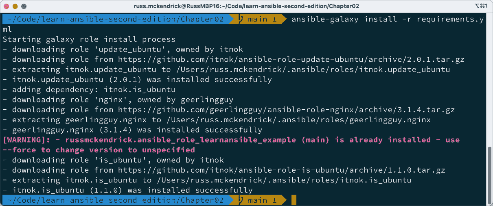
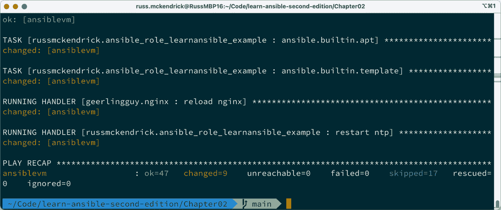

# 第二章：探索 Ansible Galaxy

欢迎来到我们的第二章。在这一章中，我们将学习 `ansible-galaxy` 命令；我们将介绍该命令提供的功能，并讨论它在过去几年中对 Ansible 发展的重要性。

**Ansible Galaxy** 是一个由社区贡献角色的在线仓库；我们将探索一些最优秀的角色，学习如何使用它们，以及如何创建你自己的角色并将其托管在 Ansible Galaxy 上。

到本章结束时，我们将涵盖以下主题：

+   Ansible 发布生命周期

+   Ansible Galaxy 介绍

+   什么是角色？

+   发布并使用 Ansible Galaxy 角色

+   Ansible 集合

+   Ansible Galaxy 命令

在我们开始探索 Ansible Galaxy 之前，让我们讨论一下 Ansible 核心的发布生命周期，以及它在过去几年中的变化，因为这些变化使得它成为 Ansible 生态系统中的一个重要组成部分。

# 技术要求

在本章中，我们将再次使用**Multipass**，这是我们在*第一章*《安装与运行 Ansible》中介绍的工具，以及本书配套的 GitHub 仓库，地址是 [`github.com/PacktPublishing/Learn-Ansible-Second-Edition`](https://github.com/PacktPublishing/Learn-Ansible-Second-Edition)。

# Ansible 发布生命周期

在上一章安装 Ansible 时，细心的你可能注意到通过 `sudo -H pip install` `ansible` 命令安装了几个不同的 Ansible 包。

以下是使用 `pip` 安装 Ansible 时输出的经过编辑的版本：

```
 $ sudo -H pip install ansible
Collecting ansible
  Downloading ansible-8.2.0-py3-none-any.whl (45.1 MB)
Collecting ansible-core~=2.15.2
  Downloading ansible_core-2.15.2-py3-none-any.whl (2.2 MB)
Installing collected packages: resolvelib, packaging, ansible-core, ansible
Successfully installed ansible-8.2.0 ansible-core-2.15.2 packaging-23.1 resolvelib-1.0.1
```

如你所见，安装了两个主要的 Ansible 包：`ansible-8.2.0` 和 `ansible-core-2.15.2`。在我们讨论这两个包的区别之前，让我们快速回顾一下，直到 Ansible 的 `2.9` 版本，Ansible 是如何进行维护和打包的。

在 `2.10` 版本之前的每个 Ansible 版本，都包含了许多内置在发布中的模块；当 Ansible 还很新，用户基础和功能集中在少数任务上时，管理和维护这些模块的发布作为 Ansible 代码库的一部分非常容易，而该代码库由 Ansible 团队在官方 GitHub 仓库中维护，地址是 [`github.com/ansible/ansible`](https://github.com/ansible/ansible)。

在 *第一章*《安装与运行 Ansible》结束时，我们总共使用了五个模块，所有这些模块都是 Ansible 内置的，它们分别是：

+   `ansible.builtin.setup`：一个发现目标主机信息并在 Playbook 执行过程中使其可用的模块

+   `ansible.builtin.service`：一个管理目标主机上服务状态的模块

+   `ansible.builtin.debug`：该模块允许你在 Playbook 执行过程中打印语句

+   `ansible.builtin.apt`：这个模块使用 `apt` 包管理器管理目标主机上的软件包

+   `ansible.builtin.template`：这个模块为 Ansible 带来了模板功能，使你能够将文件输出到目标主机

那只不过是一个执行单一任务的 playbook；再加上模块的数量，就能让你大致了解情况——目前在 Amazon AWS 命名空间中有 95 个模块，在 Microsoft Azure 命名空间中有 282 个模块——这意味着超过 370 个模块涵盖了两个不同命名空间的基本功能。在撰写本文时，已有超过 40 个不同的命名空间。

你可能会问，*“等一下，什么是命名空间？”* 这些模块现在被分组到不同的集合中，每个集合都有自己的命名空间；以下是一些示例：

+   **ansible.builtin**：正如你可能已经猜到的，这个命名空间中的模块提供了一些 Ansible 核心功能

+   **amazon.aws**：这些是官方的 Amazon Web Services 模块

+   **azure.azcollection**：这里你会找到官方的 Microsoft Azure 模块

+   **kubernetes.core**：如果你想使用 Kubernetes，这些模块将会是你所需要的

再次，你可能会想，*“这有用的信息，但这和任何事情有什么关系？”*；好吧，Ansible 过去每年有几个主要版本发布，而随着模块数量的逐渐增加，发布过程变得越来越难以管理，因为团队不仅需要关注核心的 Ansible 代码库，还需要关注与之捆绑的模块及其插件。

每个命名空间可能都有自己的开发团队，团队成员包括 Ansible 核心贡献者、社区成员，某些命名空间中还有像 Amazon 和 Microsoft 这样的巨大企业。因此，协调一次 Ansible 发布变得异常困难，无论是在物流还是时间安排上。Ansible 支持的一些技术变化非常快速；例如，Amazon Web Services 和 Microsoft Azure 几乎每周都会推出新特性并为现有服务添加功能。Ansible 如果等到可能需要六个月才提供更新，来解决兼容性问题，显然没有意义。这就是为什么 Ansible 团队决定将现在被称为 **Ansible Core** 的发布过程与 **Ansible** 的其他部分解耦开来；**Ansible Core** 是运行 **Ansible** 所需要的工具，目前已经包括了超过 85 个命名空间集合，其中包含超过 1,000 个模块和插件。

## 发布生命周期

发布周期从引入新的主要版本 `ansible-core` 开始，例如 `ansible-core 2.11`。之后，最新版本的 `ansible-core` 和它之前的两个版本 `ansible-base 2.10` 和 `Ansible 2.9` 会继续得到积极维护。开发工作转向 `ansible-core`，并持续进行。在此阶段，**Ansible** **社区**包中的**集合**不再进行新增或更新。

随后，**Ansible 社区**包的候选版本被引入。经过测试后，如果有必要，会推出更多的候选版本。

一旦最终确定，新的主要版本的 `ansible-core` 会基于 `ansible-core 2.11`，例如 `Ansible 4.0.0`。在此发布之后，只有最新版本的 **Ansible 社区** 包会继续进行积极维护。

然后，焦点转向 `ansible-core` 版本，例如 `2.11.1` 和唯一支持的 `4.1.0` 版本。

随着周期的推进，`ansible-core` 会进入功能冻结阶段。接下来是 `ansible-core` 的候选版本发布，该版本进行测试。如有需要，会推出更多的候选版本。最后，后续的主要版本将发布，标志着新周期的开始。

以下图表提供了周期的概览：


图 2.1 – Ansible 发布周期概览

如你所见，这种方法使得 Ansible 团队在发布计划上更加灵活，并允许在两个不同版本之间进行更多的并行工作。

现在我们已经了解了 Ansible 如何管理发布周期，以及如何打包模块，接下来我们来看看 Ansible Galaxy，它可以用来分发集合和角色。

# Ansible Galaxy 介绍

大多数人第一次接触 Ansible Galaxy 时，都会访问 [`galaxy.ansible.com/`](https://galaxy.ansible.com/) 网站。该网站是社区贡献的角色和模块的聚集地：


图 2.2 – Ansible Galaxy 首页

在本书的其余部分，我们将编写与 Ansible Core 模块交互的自定义角色，以供我们在 playbook 中使用。

Ansible Galaxy 上发布了超过 15,000 个角色，这些角色涵盖了许多任务，并支持几乎所有 Ansible 支持的操作系统。

然后，我们有了 `ansible-galaxy` 命令；这是与 Ansible Galaxy 网站交互的一种方式，可以在命令行中操作，并且能够启动角色，稍后我们将介绍；我们还可以用它下载、搜索并发布我们在 Ansible Galaxy 上的自定义角色。

最后，Red Hat 已经开源了 Ansible Galaxy 的代码，这意味着如果你需要在公司防火墙后分发你的角色，你也可以运行自己托管的版本。

在我们讨论发布角色和使用来自 Ansible Galaxy 的角色之前，先来讨论一下什么是角色。

## 什么是角色？

在本书的其余部分，我们将构建我们自己的自定义角色，因此这里只是简单介绍什么是角色。

在 *第一章*，*安装和运行 Ansible* 中，我们的最终 playbook 包含了一些变量、一个处理器、四个任务和一个模板。

除了模板文件外，所有的代码都被硬编码到我们的剧本文件中，虽然这样在使用少量任务和变量时易于阅读，但这种做法并不使代码具有很好的重用性。此外，在后面的章节中，我们可能在一次剧本执行中需要执行超过 50 个任务，这将导致文件变得相当庞大且难以管理。

为了避免这个问题，Ansible 引入了角色（roles）的概念；它们允许你以逻辑上有意义的方式组织你的 Ansible 代码，例如将执行单一任务的任务组合在一起，在*第一章*中，*安装与运行 Ansible*部分就是安装和配置 NTPD 服务。

这也意味着你可以通过复制角色文件夹来将角色添加到另一个剧本中，发布它，然后从 Ansible Galaxy 拉取它。

那么，让我们来看看如何基于我们在*第一章*中运行的最终剧本中的任务、处理程序、变量和模板来创建一个基本的角色，*安装与运行 Ansible*部分。

首先，我们需要创建 Ansible 推荐的角色文件夹和文件结构；幸运的是，`ansible-galaxy`命令已经为我们解决了这个问题；只需在存储你的剧本的文件夹中运行以下命令，它将启动文件夹和文件结构，这被 Red Hat 视为最佳实践：

```
$ ansible-galaxy role init roles/learnansible-example-role
```

上述命令将创建一个名为`roles`的文件夹（如果该文件夹不存在的话），并在`roles`文件夹中添加一个名为`learnansible-example-role`的文件夹。

`learnansible-example-role`文件夹包含了所有最佳实践的文件夹布局和所需文件，目的是使你能够在 Ansible Galaxy 上发布一个角色。

这些如下：

+   `README.md`：这个文件包含了一个大纲，你可以在其中填写角色的信息；你可以根据需要使用模板中的内容。请注意，如果你决定将角色发布到 Ansible Galaxy，它的内容将会显示在上面，因此尽量使其描述尽可能详细。

+   `defaults/main.yml`：这个 YAML 文件通常包含你的角色的任何默认值。

+   `files/`：这个空文件夹存放在剧本执行过程中需要复制到目标主机上的任何文件。

+   `handlers/main.yml`：正如你从这个文件夹的名称可能已经猜到的，这个 YAML 文件是用来定义你的角色需要的任何处理程序（handlers）的地方。

+   `meta/main.yml`：这个 YAML 文件与`README.md`文件类似，只有在角色发布到 Ansible Galaxy 后才会使用；在这里，你可以提供你的详细信息、添加任何标签，并定义支持的平台以及你的角色支持的最低 Ansible 版本。

+   `tasks/main.yml`：这是我们在接下来的章节中大部分时间都会使用的文件；它定义了所有角色的任务。

+   `templates/`：这是另一个空文件夹，这次它用来存储你的模板文件。

+   `tests/inventory`和`test.yml`：这里有一个包含两个文件的文件夹，一个是库存文件，一个是测试 playbook；它用于对你的角色进行测试。

+   `vars/main.yml`：最后，这个 YAML 文件包含了你可能需要使用的任何变量，如果需要的话，这些变量将覆盖`defaults/main.yml`文件中的内容。

为了填充角色，我将最终 playbook 中的代码拆分到上述各种文件中；我对 playbook 本身所做的唯一修改是删除了以下任务，因为我们不需要它：

```
    - name: "Output some information on our host"
      ansible.builtin.debug:
        msg: "I am connecting to {{ ansible_nodename }} which is running {{ ansible_distribution }} {{ ansible_distribution_version }}"
```

这使得`roles/learnansible-example-role/tasks/main.yml`文件看起来像下面的代码：

```
# tasks file for roles/learnansible-example-role
- name: "Update all packages to the latest version"
  ansible.builtin.apt:
    name: "*"
    state: "latest"
    update_cache: true
  tags:
    - "skip_ansible_lint"
- name: "Install packages"
  ansible.builtin.apt:
    state: "present"
    pkg:
      - "ntp"
      - "sntp"
      - "ntp-doc"
- name: "Configure NTP"
  ansible.builtin.template:
    src: "./ntp.conf.j2"
    dest: "/etc/ntp.conf"
    mode: "0644"
  notify: "Restart ntp"
```

请注意，正如在*第一章*中提到的，*安装和运行 Ansible*，我们在文件顶部有`---`，表示`main.yml`是一个独立的文件。由于它位于`tasks`文件夹中，我们不需要像在原始 playbook 中那样使用 tasks 来定义它包含任务。

这个模式由`roles/learnansible-example-role/handlers/main.yml`文件遵循，其内容如下：

```
# handlers file for roles/learnansible-example-role
- name: "Restart ntp"
  ansible.builtin.service:
    name: "ntp"
    state: "restarted"
```

此外，接下来是`roles/learnansible-example-role/vars/main.yml`文件，其内容如下：

```
---
# vars file for roles/learnansible-example-role
ntp_servers:
  - "0.uk.pool.ntp.org"
  - "1.uk.pool.ntp.org"
  - "2.uk.pool.ntp.org"
  - "3.uk.pool.ntp.org"
```

`roles/learnansible-example-role/vars/ntp.conf.j2`文件与我们在*第一章*中使用的模板文件完全相同，*安装和* *运行 Ansible*。

除了`README.md`文件外，唯一的新增文件是`roles/learnansible-example-role/meta/main.yml`。如前所述，这个文件包含了将角色发布到 Ansible Galaxy 所需的所有信息；在我们的示例中，其内容如下：

```
galaxy_info:
  role_name: "ansible_role_learnansible_example"
  namespace: "russmckendrick"
  author: "Russ McKendrick"
  description: "Example role to accompany Learn Ansible (Second Edition)"
  issue_tracker_url: "https://github.com/russmckendrick/ansible-role-learnansible-example/issues"
  license: "license (BSD-3-Clause)"
  min_ansible_version: "2.9"
  platforms:
    - name: "Ubuntu"
      versions:
        - "jammy"
  galaxy_tags:
    - "ntp"
    - "time"
    - "example"
dependencies: []
```

我们将在本章的下一节中重新访问这个文件，当我们将角色发布到 Ansible Galaxy 时。

现在我们已经准备好了运行角色所需的一切，我们需要一个 playbook 来调用它；在本书附带的仓库的`Chapter02`文件夹中，你将找到前面提到的角色文件夹，以及一个名为`playbook01.yml`的 playbook，其内容如下：

```
- name: "Run the role locally"
  hosts: "ansible_hosts"
  gather_facts: true
  become: true
  become_method: "ansible.builtin.sudo"
  roles:
    - learnansible_example_role
```

正如你所见，playbook 的开头与我们在*第一章*中运行的完全相同，*安装和运行 Ansible*。然而，它缺少`vars`、`handlers`和`tasks`部分，而我们只使用了一个包含单个角色的`roles`部分，这个角色位于`roles/learnansible-example-role`。

在`Chapter02`文件夹中，你将找到所有启动本地虚拟机所需的文件，这些文件使用 Multipass。

重要提示

运行以下命令时，创建`hosts.example`文件的副本并将其命名为`hosts`；复制完成后，更新新创建的文件，填入新启动虚拟机的 IP 地址，正如我们在*第一章*中所做的，*安装和* *运行 Ansible*。

要启动虚拟机，获取其 IP 地址并使用以下命令运行 playbook：

```
$ multipass launch -n ansiblevm --cloud-init cloud-init.yaml
$ multipass info ansiblevm
$ ansible-playbook -i hosts playbook01.yml
```

这应该会给你类似以下的输出：


图 2.3 – 使用新创建的角色运行 playbook

你可以通过以下两个命令停止并删除虚拟机：

```
$ multipass stop ansiblevm
$ multipass delete --purge ansiblevm
```

现在我们知道什么是角色，并且定义了一个基本的角色，让我们看看如何将这个简单的角色发布到 Ansible Galaxy，然后在 Ansible playbook 中使用它—以及其他一些角色。

# 发布到并使用 Ansible Galaxy 角色

现在我们知道什么是角色，并且看到了如何使用角色让我们的 Ansible playbook 更加简洁且可重复使用，接下来我们应该看看如何将角色发布到 Ansible Galaxy，并在我们的 playbook 中从那里使用它们。

## 将你的角色发布到 Ansible Galaxy

在将角色发布到 Ansible Galaxy 时，你需要满足两个主要的前提条件：一个有效的 GitHub 账户，这将用于认证到 Ansible Galaxy，以及一个包含角色代码的公开 GitHub 仓库。

在这个示例中，我将使用我自己的 GitHub 账户；你可以在 [`github.com/russmckendrick/`](http://github.com/russmckendrick/) 找到我。我将使用一个可以在 [`github.com/russmckendrick/ansible-role-learnansible-example/`](https://github.com/russmckendrick/ansible-role-learnansible-example/) 找到的仓库。

要发布你的角色，你需要执行以下步骤：

1.  访问 Ansible Galaxy 网站，网址是 [`galaxy.ansible.com/`](https://galaxy.ansible.com/)，然后点击 GitHub 图标进行登录：


图 2.4 – 登录到 Ansible Galaxy

1.  登录后，点击左侧菜单中的 **我的内容** 菜单项，该图标是一个带有项目符号的列表图标，如下所示：


图 2.5 – 进入我的内容页面

1.  进入 **我的内容** 页面后，点击 **+ 添加内容** 按钮；在这里，你将看到两个选项：**从 GitHub 导入角色** 或 **上传** **新集合**：


图 2.6 – 添加内容选项

1.  点击 **从 GitHub 导入角色** 按钮，你将看到你的仓库列表；选择包含你想要发布的角色的仓库并点击 **确定** 按钮：


图 2.7 – 选择包含你想要发布的角色的仓库

1.  几分钟后，你的角色将被发布，且你将返回到 **我的内容** 页面，此时应该会列出你新发布的角色：


图 2.8 – 返回到我的内容页面

1.  点击新发布的角色名称，这将把你带到 Ansible Galaxy 角色页面：


图 2.9 – 新发布的 Ansible Galaxy 角色页面

你可以在 https://galaxy.ansible.com/russmckendrick/ansible_role_learnansible_example 找到我在本次演示中发布的角色副本。

如你所见，查看 `meta/main.yml` 文件中的详细信息，并点击 `README.md` 文件。

现在角色已经发布，我们如何在 Ansible playbook 中使用它呢？让我们来看看。

## 使用 Ansible Galaxy 中的角色

在我们在 playbook 中使用角色之前，首先需要做的事情是下载角色；有几种方法可以做到这一点；首先，你可以使用在 Ansible Galaxy 页面上给出的命令来下载角色。

运行以下命令将把角色下载到你的 Ansible 配置目录：

```
$ ansible-galaxy install russmckendrick.ansible_role_learnansible_example
```

Ansible 配置目录通常是用户主文件夹中的一个隐藏文件夹。该文件夹的缩写是 `~/.ansible`，或者在我的情况下，文件夹的完整路径是 `/Users/russ.mckendrick/.ansible`，如下所示的 Shell 输出：


图 2.10 – 从 Ansible Galaxy 下载角色

下载角色的第二种方式是创建一个 `requirements.yml` 文件；此文件应包含你希望下载的角色列表，例如，仓库中 `Chapter02` 文件夹中的 `requirements.yml` 文件，它伴随本书并看起来像以下内容：

```
- src: "itnok.update_ubuntu"
- src: "geerlingguy.nginx"
- src: "russmckendrick.ansible_role_learnansible_example"
```

如你所见，这里定义了三个角色；要安装这三个角色，你可以运行以下命令：

```
$ ansible-galaxy install -r requirements.yml
```

我们将下载的另外两个角色如下：

+   `itnok.update_ubuntu`：此角色管理 Ubuntu 主机上的更新

+   `geerlingguy.nginx`：此角色帮助你在多个 Linux 发行版上下载、安装和配置 NGINX

你可以在本章末尾的进一步阅读部分找到角色的相关链接。

这将只下载缺失的角色；当我运行命令时，得到以下输出：



图 2.11 – 从 Ansible Galaxy 下载缺失的角色

如你所见，`russmckendrick.ansible_role_learnansible_example` 已经存在于我的机器上，因此跳过了下载它。

Ansible playbook 文件 `playbook02.yml`，可以在 `Chapter02` 文件夹中找到，使用以下代码调用 `requirements.yml` 文件中定义的三个角色：

```
---
- name: "Run the remote roles"
  hosts: "ansible_hosts"
  gather_facts: true
  become: true
  become_method: "ansible.builtin.sudo"
  roles:
    - "itnok.update_ubuntu"
    - "geerlingguy.nginx"
    - "russmckendrick.ansible_role_learnansible_example"
```

和以前一样，你可以使用 Multipass 启动虚拟机（确保更新 hosts 文件中的 IP 地址），并使用以下命令运行 playbook：

```
$ multipass launch -n ansiblevm --cloud-init cloud-init.yaml
$ multipass info ansiblevm
$ ansible-playbook -i hosts playbook02.yml
```

如你在以下屏幕中的 playbook 摘要中所见，这次发生了更多的事情：



图 2.12 – 运行 playbook，使用从 Ansible Galaxy 下载的角色

另外两个角色对操作系统进行了比我们的角色更彻底的更新，安装了 NGINX 包并启动了该服务；这意味着，如果你将 `multipass info ansiblevm` 命令返回的 IP 地址放入浏览器中，你将看到默认的 NGINX 页面。

再次强调，准备好后，你可以使用以下两个命令停止并删除虚拟机：

```
$ multipass stop ansiblevm
$ multipass delete --purge ansiblevm
```

既然你已经理解了什么是 Ansible 角色，如何将其发布到 Ansible Galaxy，以及如何将我们自己发布的角色和社区角色结合到 Ansible playbook 中，那么 Ansible Galaxy 还能做些什么呢？

# Ansible 集合

在本章开始时，我们讨论了 Ansible 开发团队如何将 Ansible 模块与 Ansible Core 解耦，以及这如何影响发布生命周期。

所有这些模块、插件和其他支持代码都可以在 Ansible Galaxy 上找到；例如，来自 Amazon 命名空间的 AWS 集合可以在 [`galaxy.ansible.com/amazon/aws`](https://galaxy.ansible.com/amazon/aws) 找到；你可以使用以下命令安装该集合：

```
$ ansible-galaxy collection install amazon.aws
```

运行此命令将下载并安装集合到 `~/.ansible/collections/ansible_collections/amazon/aws`，如下所示的终端输出：


图 2.13 – 安装 amazon.aws 集合

然而，单单安装集合并不意味着你可以在 playbooks 中使用它；例如，Amazon AWS 模块需要安装一些额外的 Python 库，通常每个集合都会附带一个 `requirements.txt` 文件，列出需要在你的系统上安装的 Python 库，以便集合的模块和插件能够正常工作。

要安装这些库，你应该使用 pip 来安装它们：

```
$ pip install -r ~/.ansible/collections/ansible_collections/amazon/aws/requirements.txt
```

一旦安装完成，你就可以使用构成该集合的模块和插件。

# Ansible Galaxy 命令

在完成关于 Ansible Galaxy 的这一章之前，让我们快速讨论一些其他有用的命令。

`ansible-galaxy` 命令具有一些你所期望的基本功能，例如以下内容：

```
$ ansible-galaxy --version
$ ansible-galaxy --help
```

这将分别显示命令的版本详情和基本帮助选项。

`ansible-galaxy` 命令分为两部分，我们已经涉及过了。

首先，有 `ansible-galaxy collection`；从这里，你可以添加以下命令：

+   `download`：检索集合及其依赖项，如 **tarballs**，这是 Linux 机器上的离线安装归档格式。

+   `init`：设置一个带有基础结构的新集合。

+   `build`：构建一个适合发布到 Ansible Galaxy 的 Ansible 集合工件。

+   `publish`：将集合工件发布到 Ansible Galaxy。

+   `install`：从指定的文件、URL 或直接从 Ansible Galaxy 添加集合。

+   `list`：显示集合路径中每个集合的名称和版本。

+   `verify`：对已安装的集合进行校验和对比，与服务器上的校验和进行对比；任何依赖项不会被验证。

其次是 `ansible-galaxy role`，正如您已经猜到的，这些命令是用于处理角色的：

+   `init`：设置一个具有基础结构的新角色

+   `remove`：从指定的角色路径中删除角色

+   `delete`：从 Galaxy 中删除角色。请注意，这不会影响或修改实际的 GitHub 仓库

+   `list`：显示角色路径中每个角色的名称和版本

+   `search`：使用标签、平台、作者和关键词查询 Galaxy 数据库

+   `import`：将一个角色导入到 Galaxy 服务器

+   `setup`：监督 Galaxy 与指定源之间的连接

+   `info`：获取某个特定角色的详细信息

+   `install`：从指定的文件、URL 或直接从 Ansible Galaxy 添加角色

如需获得更多关于这些命令的帮助，您可以在命令末尾添加`--help`。例如，您可以运行以下命令：

```
$ ansible-galaxy role search --help
```

这将为您提供如何搜索 Ansible Galaxy 的详细信息；例如，要搜索我的角色，您需要运行以下命令：

```
$ ansible-galaxy role search --author russmckendrick
```

这将返回我已发布到 Ansible Galaxy 的所有角色的列表，或者您也可以运行以下命令：

```
$ ansible-galaxy role list
```

这将列出您在角色路径（即 `~/.ansible/roles/`）中安装的所有角色。您可以从那里运行以下类似的命令：

```
$ ansible-galaxy role info russmckendrick.ansible_role_learnansible_example
```

这将帮助您获取有关您已安装角色的详细信息，这也标志着我们对 `ansible-galaxy` 命令的介绍结束。

# 总结

在本章中，我们深入探讨了 Ansible Galaxy、该网站以及命令行工具。我们还讨论了 Ansible 的开发和发布周期，并了解了 Ansible 角色的概念。

我相信您会同意，Ansible Galaxy 提供了宝贵的社区服务，因为它允许用户共享日常任务的角色，并为用户提供了一种通过发布角色为 Ansible 社区做出贡献的方式。

然而，请小心使用。记得在生产环境中使用 Ansible Galaxy 的角色之前，检查代码并阅读 bug 跟踪器；毕竟，许多角色需要提升权限才能成功执行其任务。

正如本章所述，我们将在接下来的内容中创建自己的 Ansible 角色，并且随着 Ansible playbook 越来越复杂，会提供更多关于创建和使用角色的提示和建议。

在下一章中，我们将探讨更多的 Ansible 命令和工具，这些工具是 Ansible Core 的一部分。

# 进一步阅读

您可以在以下网站找到更多关于我们从 Ansible Galaxy 安装的两个额外角色以及官方文档的详细信息：

+   `geerlingguy.nginx`：[`galaxy.ansible.com/ui/standalone/roles/geerlingguy/nginx`](https://galaxy.ansible.com/ui/standalone/roles/geerlingguy/nginx)

+   `itnok.update_ubuntu`: [`galaxy.ansible.com/ui/standalone/roles/itnok/update_ubuntu/`](https://galaxy.ansible.com/ui/standalone/roles/itnok/update_ubuntu/)

+   **Ansible Galaxy** **文档**: [`ansible.readthedocs.io/projects/galaxy-ng/en/latest/community/userguide/`](https://ansible.readthedocs.io/projects/galaxy-ng/en/latest/community/userguide/)
