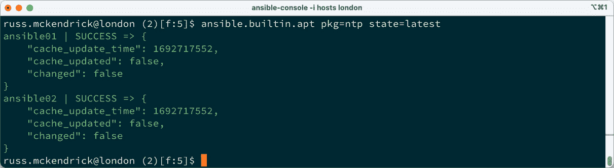
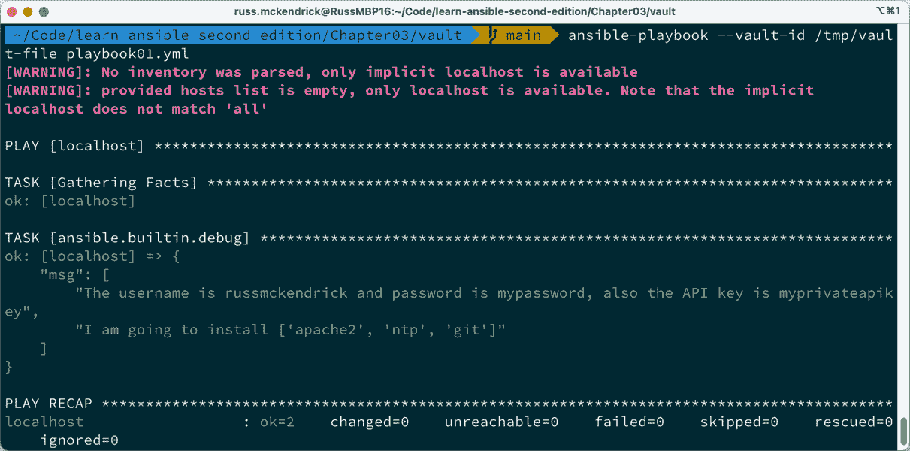

# 第三章：Ansible 命令

在开始编写和执行更复杂的 playbook 之前，我们将先了解 Ansible 的其他内建命令。在这里，我们将介绍构成 Ansible 的命令。在本章末，我们将安装一个第三方工具来可视化我们的主机清单。

本章将涉及以下主题：

+   内建命令

+   第三方命令

# 内建命令

当我们安装 Ansible 时，安装了几种不同的命令。它们如下所示：

+   `ansible`

+   `ansible-config`

+   `ansible-console`

+   `ansible-doc`

+   `ansible-galaxy`

+   `ansible-inventory`

+   `ansible-playbook`

+   `ansible-pull`

+   `ansible-vault`

我们已经在 *第二章*，*探索 Ansible Galaxy* 中介绍了 `ansible-galaxy` 命令。在本书的剩余章节中，我们将继续深入探讨 `ansible-playbook`，因此本章将不再详细介绍该命令。让我们从列表的顶部开始，回顾一个我们已经使用过的命令。

## Ansible

现在，你可能会认为 `ansible` 是我们在本书中最常用的命令，但事实并非如此。

`ansible` 命令仅用于对单个主机或一组主机执行临时命令。在 *第一章*，*安装与运行 Ansible* 中，我们创建了一个目标为单个本地虚拟机的主机清单文件。

在本章的这一部分，我们将查看我在云服务提供商上运行的四个不同主机；我的主机文件如下所示：

```
ansible01 ansible_host=139.162.233.174
ansible02 ansible_host=139.162.233.227
ansible03 ansible_host=139.144.132.49
ansible04 ansible_host=139.144.132.71
[london]
ansible01
ansible02
[nyc]
ansible03
ansible04
[demohosts:children]
london
nyc
[demohosts:vars]
ansible_connection=ssh
ansible_user=root
ansible_private_key_file=~/.ssh/id_rsa
host_key_checking=False
```

如你所见，我有四个主机——`ansible01` > `ansible04`。前两个主机在名为 `london` 的组中，后两个主机在名为 `nyc` 的组中。然后我将这两个组组合在一起，创建了一个名为 `demohosts` 的新组，并使用该组应用一些基于我启动的主机的基本配置。

使用 `ping` 模块，我可以通过运行以下命令来检查与主机的连接性。首先，让我们检查 `london` 中的两个主机：

```
$ ansible -I hosts london -m ping
```

这将返回以下结果：


图 3.1 – 执行 Ansible ping，目标为 london 主机

现在，让我们运行相同的命令，但这次是针对 `nyc` 主机：

```
$ ansible -i hosts nyc -m ping
```

这给我们以下输出：


图 3.2 – 执行 Ansible ping，目标为 nyc 主机

如你所见，我的四个主机都返回了 `pong`。

我也可以通过添加 `all` 而不是特定主机组，来一次性针对所有四个主机：

```
$ ansible -i hosts all -m ping
```

现在，我们可以通过 Ansible 访问我们的主机，可以对其进行操作并运行一些临时命令；让我们从一些基础命令开始：

```
$ ansible -i hosts london -a "ping -c 3 google.com"
```

此命令将连接到 `london` 主机并运行 `ping -c 3 google.com` 命令；这将从主机对 [google.com](http://google.com) 域进行 `ping` 并返回结果：


图 3.3 – 对 google.com 执行 ping 命令

我们还可以通过 `ansible` 命令运行单个模块；我们在*第一章*中曾经做过这种操作，*安装和运行 Ansible*，使用的是 `setup` 模块。然而，一个更好的例子是通过运行以下命令来更新所有主机上的所有已安装软件包：

```
$ ansible -i hosts all -m ansible.builtin.apt -a "name=* state=latest update_cache=ye"
```

如你所见，我们使用的是 `ansible.builtin.apt` 模块，我们在*第一章*中已经定义了该模块，*安装和运行 Ansible*：

```
- ansible.builtin.apt:
    name:"*"
    state:"latest"
    update_cache:"true"
```

我传入了相同的选项，但这次我没有使用 YAML，而是将其格式化为键值对，这通常是你在命令行中传递给任何命令的格式：


图 3.4 – 使用 ansible.builtin.apt 模块更新所有软件包

如你所见，运行 Ansible 时的输出非常详细，并提供了反馈，准确地告诉我们在临时执行过程中做了什么。

让我们重新对所有主机运行命令，但这次只针对一个软件包，比如 `ntp`：

```
$ ansible -i hosts all -m ansible.builtin.apt -a "pkg=ntp state=latest"
```

运行一次命令将会在我们的四个主机上安装该软件包：


图 3.5 – 使用 ansible.builtin.apt 模块安装 ntp 软件包

现在，让我们重新运行该命令：

```
$ ansible -i hosts all -m ansible.builtin.apt -a "pkg=ntp state=latest"
```

运行一次命令将会在我们的四个主机上安装该软件包，并给出以下结果：


图 3.6 – 重新运行 ansible.builtin.apt 模块安装 ntp 软件包

如你所见，主机返回了 `SUCCESS` 状态并且没有显示变化，这正是我们期望看到的。

那么，为什么要这样做呢？我们运行的两个命令有什么区别？

首先，让我们回顾一下在确认主机可用后，使用 Ansible `ping` 命令最初运行的两个命令：

```
$ ansible -i hosts london -a "ping -c 3 google.com"
$ ansible -i hosts all -m ansible.builtin.apt -a "name=* state=latest update_cache=true"
```

虽然看起来第一个命令并没有运行模块，但实际上它是运行了的。`ansible` 命令的默认模块叫做 `raw`，它会在每个目标主机上运行原始命令。命令中的 `-a` 部分将参数传递给模块。`raw` 模块接受原始命令，这正是我们在第二个命令中所做的。

如前所述，你可能已经注意到，当我们将命令传递给 `ansible` 命令和将其作为 YAML 剧本的一部分使用时，语法略有不同。我们这里只是将键值对直接传递给模块。

那么，为什么要像这样使用 Ansible 呢？嗯，它非常适合以极其受控的方式直接在非 Ansible 管理的主机上运行命令。

Ansible 使用 SSH 连接到主机，执行命令并告知你结果。只需小心——很容易变得过于自信，执行一些像下面这样的命令：

```
$ ansible -I hosts all -a "reboot now"
```

如果连接主机的用户具有执行命令的权限，它将执行你提供的命令。运行上面的命令将重启主机清单文件中的所有服务器：


图 3.7 – 使用单个命令重启所有四个主机

所有主机的状态为 `UNREACHABLE`，因为 `reboot` 命令在返回 `SUCCESS` 状态之前终止了我们的 SSH 会话。不过，你可以通过运行 `uptime` 命令看到每台主机已经重启：

```
$ ansible -i hosts all -a "uptime"
```

以下截图显示了前面命令的输出：


图 3.8 – 检查四个主机的运行时间

重要

如前所述，并根据经验（这是个长故事），在使用 Ansible 管理主机时，使用临时命令要格外小心——它是一个强大但愚笨的工具，它会假设你知道运行这些命令对主机的后果。

这就是我们对 `ansible` 命令的介绍；接下来我们来看下一个命令，`ansible-config`。

## ansible-config 命令

`ansible-config` 命令用于管理 Ansible 配置文件。Ansible 附带了合理的默认设置，因此在这些设置之外几乎无需进行配置。你可以通过运行以下命令来查看当前配置：

```
$ ansible-config dump
```

从以下输出可以看到，所有绿色文本是默认配置，任何橙色的配置值是已更改的值：


图 3.9 – 将完整的 Ansible 配置输出到屏幕

运行以下命令将列出 Ansible 中每个配置选项的详细信息，包括该选项的作用、当前状态、引入时间、类型等：

```
$ ansible-config list
```

以下截图显示了前面命令的输出：


图 3.10 – 查看 Ansible 配置选项的详细信息

如果你有一个配置文件，比如在 `~/.ansible.cfg`，你可以使用 `-c` 或 `--config` 标志来加载它：

```
$ ansible-config view –-config "~/.ansible.cfg
```

上述命令将为你提供自定义配置文件的概览，并显示未在自定义配置文件中定义的 Ansible 默认值。

## ansible-console 命令

Ansible 内置了一个控制台。它不是我在日常使用 Ansible 时经常用到的工具。要启动控制台，我们需要运行以下其中一个命令：

```
$ ansible-console -i hosts
$ ansible-console -i hosts london
$ ansible-console -i hosts nyc
```

三个命令中的第一个针对所有主机，而接下来的两个仅针对指定的组：


图 3.11 – 建立控制台连接

一旦连接成功，你将看到我已连接到 `london` 主机组，该组中有两台主机。在这里，你可以输入一个模块名称，例如 `ping`：


图 3.12 – 从 Ansible 运行 ping

另外，你可以使用 `raw` 模块；例如，你可以通过输入 `ansible.builtin.raw uptime` 来检查 `uptime` 命令：


图 3.13 – 使用 raw 模块运行 uptime 命令

你也可以使用与运行 `ansible` 命令时相同的语法来传递键值对——例如，在控制台提示符下运行以下命令：

```
ansible.builtin.apt pkg=ntp state=latest update_cache=true
```

它应该会给你类似以下的输出：



图 3.14 – 使用 ansible.builtin.apt 模块检查是否安装了 ntp 包

你可能已经注意到，这次我们运行的命令语法与我们在本章前面使用 `ansible` 命令运行同一个模块时略有不同。

那个命令如下：

```
$ ansible -i hosts london -m ansible.builtin.apt -a"pkg=ntp state=latest update_cache=true"
```

而这次，我们只运行了以下命令：

```
ansible.builtin.apt pkg=ntp state=latest update_cache=true
```

之所以如此，是因为当我们使用 `ansible` 命令调用模块时，我们是在本地机器的命令行上操作，因此需要通过 `-m` 标志传入模块名称，然后使用 `-a` 标志定义属性。之后，我们必须将键值对放入引号中，以避免破坏命令流，因为命令行中空格作为分隔符。

当我们运行 Ansible 控制台时，我们实际上已经执行了 `ansible -i hosts london` 命令的一部分，完全离开了本地命令行，直接与 Ansible 进行交互。

要离开控制台，输入 `exit` 以返回常规命令行 shell。

如本节开始时所提到的，`ansible-console` 命令是我不常使用的——主要是因为我在本章开始时讨论 `ansible` 命令时给出的警告。

使用 `ansible-console` 命令连接多个主机时，你必须 100% 确信你输入的命令是正确的。例如，虽然我只连接了两台主机，但我的 `hosts` 文件可能包含了 200 台主机。现在，假设我输入了错误的命令——如果它同时在 200 台主机上执行，可能会导致一些不想要的事情，比如同时重启所有主机。

要退出 `ansible-console` 会话，只需输入 `exit` 并按 *Enter* 键。

如你可能已经猜到的，这种情况发生在我身上。虽然不是 200 台主机，但也很可能是——*所以请* *小心。*

## ansible-inventory 命令

使用`ansible-inventory`命令可以为你提供主机清单文件的详细信息。这对于理解你的主机是如何分组的非常有帮助。例如，假设我运行以下命令：

```
$ ansible-inventory -i hosts–-graph
```

在与我在本节中一直使用的`hosts`清单文件相同的文件夹中，返回以下内容：


图 3.15 – 获取清单主机文件的概览

如你所见，它显示了从`all`开始的主机组，然后是主要的主机组（`demohosts`），接着是子组（`london`和`nyc`），最后是主机本身（`ansible01` > `ansible04`）。

如果你想查看单个主机的配置，可以使用此命令：

```
$ ansible-inventory -i hosts –-host=ansible01
```

以下截图展示了前面命令的输出：


图 3.16 – 查看单个主机

你可能已经注意到，它显示了主机继承的配置，这些配置来自我们为清单文件中所有主机设置的`demohost`主机组。你可以通过运行以下命令来查看每个主机和主机组的所有信息：

```
$ ansible-inventory -i hosts –-list
```

如果你有一个大型或复杂的主机清单文件，并且只需要某一台主机的信息，或者你接手了一个主机清单并希望更好地了解清单的结构，那么这个命令会很有帮助。我们将在本章后面讨论一个第三方工具，它提供更多显示选项。

## 什么是 ansible-pull？

和`ansible-console`命令一样，`ansible-pull`不是我经常使用的命令；我可以用一只手来数出在过去几年中我使用它的次数。

`ansible-pull`是一个命令，允许目标机器从指定的源（例如 Git 仓库）拉取配置并应用于本地。这与典型的 Ansible 推送模型相反，后者是中央控制节点将配置推送到受管理节点。

`ansible-pull`命令的工作方式如下：

1.  目标机器（即运行`ansible-pull`的机器）获取指定的仓库。

1.  一旦仓库被拉取，目标机器会查找剧本。默认情况下，它会查找名为`localhost.yml`的剧本，但如果需要，你也可以指定其他剧本文件——请注意，这个文件不包括在示例文件中。

1.  目标机器随后对自身运行该剧本。

`ansible-pull`有一些使用场景：

+   `ansible-pull`允许节点通过拉取配置来进行自我配置。

+   `ansible-pull`可以通过定时任务安排在特定的时间间隔内运行，确保主机在有连接时能够自我更新。

+   `ansible-pull`用来拉取并应用配置到本地开发环境，确保与生产配置的一致性。

运行 `ansible-pull` 有一些前提条件，其中最重要的是运行 `ansible-pull` 的主机必须有一个有效且活动的 Ansible 安装，并且安装任何执行剧本所需的其他依赖项。

总结来说，`ansible-pull` 提供了一种颠倒传统 Ansible 模型的方法，允许主机根据需要拉取配置，而不是像我们在*第一章*《安装和运行 Ansible》和*第二章*《探索 Ansible Galaxy》中所做的那样，由中央主机将配置推送给它们。本书的其余部分，我们将采用更传统的 Ansible 部署方式，将配置推送到目标主机。

然而，值得注意的是，如果由于某种原因你无法采用这种方法，那么你确实有一个替代方案，那就是 `ansible-pull`。

## 使用 ansible-vault 命令

在 Ansible 中，可以从文件或剧本本身加载变量；我们将在下一章更详细地介绍这个内容。这些文件可能包含敏感信息，如密码和 API 密钥。以下是一个示例：

```
secret:"mypassword"
secret-api-key:"myprivateapikey"
```

正如你所看到的，我们有两个敏感信息以明文形式显示。这在文件位于本地机器时是可以的——嗯，差不多可以。但是，如果我们想将文件提交到源代码管理系统并与同事共享呢？

*即使仓库* *是私有的，我们也不应将这些信息以明文形式存储。*

Ansible 引入了 Ansible Vault 来帮助解决这个问题。通过使用 `ansible-vault` 命令，我们可以加密文件或仅加密变量，然后在 Ansible 执行时，它可以在内存中解密，内容可以作为执行的一部分被读取。

注意

在本章剩余部分，我将设置 Vault 密码为 `password`，以便你在运行 `ansible-vault` 命令时可以针对 `Chapter03/vault` 文件夹中的文件进行操作。

要加密一个文件，我们需要运行以下命令，并提供一个密码，该密码将在提示时用于解密文件：

```
$ ansible-vault encrypt secrets.yml
```

以下截图显示了前述命令的输出：


图 3.17 – 使用 ansible-vault 加密整个文件

从输出中可以看出，你将被要求确认密码。加密后，你的文件看起来会像这样：

```
$ANSIBLE_VAULT;1.1;AES256
62373138643038636664363166646637333131386431366137643630326433303231336331303262
3661383061313436653464663039626338376233646630310a306437666462313439636634646633
39653435333433326361306531393832613038353665333866383161313239343134376632316263
3736633665303161630a393265633066663631336239613938363130306262613633333030336430
66343833376532313866363838653464383065633737613735323739303232383031326262376366
61663136623431306363666330373831336230323132336263626237366539326162373564353937
303465306233633633303533633232623233
```

正如你所看到的，细节是使用文本编码的。这确保了我们的 `secrets.yml` 文件在提交到源代码管理系统（如 Git）时仍然可以正常工作。

你可以通过运行以下命令来查看文件内容：

```
$ ansible-vault view secrets.yml
```

这将要求你输入密码，并将文件内容打印到屏幕上：


图 3.18 – 使用 ansible-vault 加密整个文件

你可以通过运行以下命令来解密磁盘上的文件：

```
$ ansible-vault decrypt secrets.yml
```

这将恢复文件到其未加密的原始状态。

重要提示

使用 `ansible-vault decrypt` 命令时，请不要将解密后的文件提交或检查到你的源代码控制系统中！

自 Ansible 2 版本初期发布以来，现已可以加密文件中的单个变量。让我们将更多变量添加到文件中：

```
username:"russmckendrick"
password:"mypassword"
secretapikey:"myprivateapikey"
packages:
  - apache2
  - ntp
  - git
```

如果我们不需要不断查看或解密文件以检查其变量名和整体内容，那就太好了。

让我们通过运行以下命令来加密密码内容：

```
$ ansible-vault encrypt_string'mypassword'–-name'password'
```

这将加密字符串 `mypassword` 并给它一个变量名 `password`：


图 3.19 – 使用 ansible-vault 加密单个字符串

然后，我们可以将输出复制并粘贴到我们的文件中，并对 `secretapikey` 重复此过程：

```
$ ansible-vault encrypt_string 'myprivateapikey' –-name 'secretapikey'
```

这样，我们生成了两个秘密变量，并用它们替换了变量文件中未加密的内容。

注意

为了便于阅读，我对输出进行了简化 – 完整的文件可以在本书 GitHub 仓库中的 `Chapter03/vault` 文件夹找到。

我们的变量文件应该最终看起来像这样：

```
username:"russmckendrick"
password: !vault |
          $ANSIBLE_VAULT;1.1;AES256
30393463363733386333636536663832383565346335393030643435316132363437643261383837
          3035
secretapikey: !vault |
          $ANSIBLE_VAULT;1.1;AES256
38663133393834646638663632353634343638626237333438336131653862373761666539326263
          3934
packages:
  - apache2
  - ntp
  - git
```

如你所见，这样更容易阅读，且与加密文件同样安全。

到目前为止，一切顺利，但如何在 Ansible playbook 中使用 Ansible Vault 加密的数据呢？

在我们学习如何做之前，让我们先看看当你没有告诉 `ansible-playbook` 命令你正在使用 Ansible Vault 时会发生什么。运行以下 playbook，你会看到它加载了 `myvars.yml` 文件，并使用 `ansible.builtin.debug` 模块将变量内容打印到屏幕上：

```
---
- name: "Print some secrets"
  hosts: "localhost"
  vars_files:
    - "myvars.yml"
  tasks:
    - name: "Print the vault content"
      ansible.builtin.debug:
        msg:
          - "The username is {{ username }} and password is {{ password }}, also the API key is {{ secretapikey }}"
          - "I am going to install {{ packages }}"
```

我们可以使用以下命令运行 playbook；请注意，由于它只是本地运行，因此我们不会传递库存文件。这是它会给你警告的地方：

```
$ ansible-playbook playbook01.yml
```

这将导致终端输出中显示错误消息：


图 3.20 – 运行 `ansible-playbook` 命令时出现错误

如你所见，它在抱怨它在其中一个文件中发现了 Vault 加密数据，但我们没有提供解锁它的秘密。

我们可以通过在 `ansible-playbook` 运行时将 Vault 密码放入文本文件中，并让 `ansible-playbook` 命令读取该文件的内容，来传递 Vault 密码。

如本节开始时提到的，我一直在使用密码 `password` 对我的 Vault 进行编码。我们将密码放入文件中，然后用它来解锁我们的 Vault：

```
$ echo "password" > /tmp/vault-file
```

运行以下命令将读取 `/tmp/vault-file` 的内容并解密数据：

```
$ ansible-playbook --vault-id /tmp/vault-file playbook01.yml
```

如你所见，以下是播放书执行后的结果，输出现在符合我们的预期：



图 3.21 – 运行 ansible-playbook 并通过文件传递 Vault 密码

如果您更喜欢在提示时输入密码，可以使用以下命令：

```
$ ansible-playbook --vault-id @prompt playbook01.yml
```

以下输出显示了提示：


图 3.22 – 运行 ansible-playbook 并通过提示输入密码

你可能会问，为什么有两个不同的选项？当提示时，直接运行命令并输入密码似乎就足够了。

然而，在使用我们将在*第十五章*中介绍的服务时，*使用 Ansible 与 GitHub Actions 和 Azure DevOps*，命令需要完全无人值守地运行，因为在运行时不会有活动终端让您输入密码。

另一个在*第十五章*，*使用 Ansible 与 GitHub Actions 和 Azure DevOps*，和*第十六章*，*介绍 Ansible AWX 和 Red Hat Ansible 自动化平台*中会看到的优点是，通过抽象化运行时输入凭据的需求，完全可以让某人运行一个管道，而不需要知道或访问任何存储在剧本中的机密或解锁它们的凭据。

# 第三方命令

在我们结束查看各种 Ansible 命令之前，让我们来看一个命令，它不是 Ansible 本身的一部分，而是一个第三方开源项目。

## ansible-inventory-grapher 命令

`ansible-inventory-grapher`命令，由 Will Thames 编写，使用 Graphviz 库可视化您的主机清单。我们需要做的第一件事是安装 Graphviz。要使用 Homebrew 在 macOS 上安装它，请运行以下命令：

```
$ brew install graphviz
```

要在 Ubuntu 上安装 Graphviz，请使用以下命令：

```
$ sudo apt-get install graphviz
```

安装后，您可以使用`pip`安装`ansible-inventory-grapher`：

```
$ pip install ansible-inventory-grapher
```

现在我们已经安装好了所有内容，可以使用本章早些时候使用的`hosts`文件生成图表：

```
$ ansible-inventory-grapher -i hosts demohosts
```

这将生成如下所示的内容：


图 3.23 – 对我们的主机文件运行 ansible-inventory-grapher

这是图形的原始输出。如您所见，它类似并使用了与 HTML 相同的一些语法。我们可以使用`dot`命令来呈现它，`dot`命令作为 Graphviz 的一部分一起提供。`dot`命令从图形中创建层次结构图。要执行此操作，请运行以下命令：

```
$ ansible-inventory-grapher -i hosts demohosts | dot -Tpng > hosts.png
```

这将生成一个名为`hosts.png`的 PNG 文件，其中包含您可以在此处看到的主机清单文件的可视化：


图 3.24 – 通过 Graphviz 传递我们 ansible-inventory-grapher 输出的结果

如你所见，这是 Ansible 目标主机的一个很好的展示；它非常适合用在文档中，同时也能让你了解复杂的清单文件是如何结构化的。

# 总结

在本章中，我们简要介绍了作为标准 Ansible 安装一部分的几个支持工具，以及一个旨在与 Ansible 配合使用的有用第三方工具。

我们将在后续章节中使用这些命令，以及我们有意跳过的 `ansible-playbook`。

在下一章，我们将编写一个更复杂的 playbook，安装一个基本的 LAMP 堆栈到本地虚拟机上。

# 深入阅读

你可以在以下网址找到本章涉及的每个工具的文档：

+   Ansible 命令行工具概览： [`docs.ansible.com/ansible/latest/command_guide/command_line_tools.html`](https://docs.ansible.com/ansible/latest/command_guide/command_line_tools.html)

+   `ansible`: [`docs.ansible.com/ansible/latest/cli/ansible.html`](https://docs.ansible.com/ansible/latest/cli/ansible.html)

+   `ansible-config`: [`docs.ansible.com/ansible/latest/cli/ansible-config.html`](https://docs.ansible.com/ansible/latest/cli/ansible-config.html)

+   `ansible-console`: [`docs.ansible.com/ansible/latest/cli/ansible-console.html`](https://docs.ansible.com/ansible/latest/cli/ansible-console.html)

+   `ansible-doc`: [`docs.ansible.com/ansible/latest/cli/ansible-doc.html`](https://docs.ansible.com/ansible/latest/cli/ansible-doc.html)

+   `ansible-inventory`: [`docs.ansible.com/ansible/latest/cli/ansible-inventory.html`](https://docs.ansible.com/ansible/latest/cli/ansible-inventory.html)

+   `ansible-playbook`: [`docs.ansible.com/ansible/latest/cli/ansible-playbook.html`](https://docs.ansible.com/ansible/latest/cli/ansible-playbook.html)

+   `ansible-pull`: [`docs.ansible.com/ansible/latest/cli/ansible-pull.html`](https://docs.ansible.com/ansible/latest/cli/ansible-pull.html)

+   `ansible-vault`: [`docs.ansible.com/ansible/latest/cli/ansible-vault.html`](https://docs.ansible.com/ansible/latest/cli/ansible-vault.html)

+   `ansible-inventory-grapher`: [`github.com/willthames/ansible-inventory-grapher`](https://github.com/willthames/ansible-inventory-grapher)

# 第二部分：部署应用程序

现在你已经理解了 Ansible 的基础知识，接下来是时候将这些知识付诸实践了。在这一部分，我们将重点讲解如何使用 Ansible playbook 部署应用程序。从设置 LAMP 堆栈到部署 WordPress，再到针对多个发行版的操作，你将获得实际操作经验，自动化应用程序的部署。我们还将探索 Ansible 如何管理基于 Windows 的服务器，扩展你的自动化能力。

这一部分包含以下章节：

+   *第四章*, *部署 LAMP 堆栈*

+   *第五章*, *部署 WordPress*

+   *第六章*, *目标多个发行版*

+   *第七章*，*Ansible Windows 模块*
