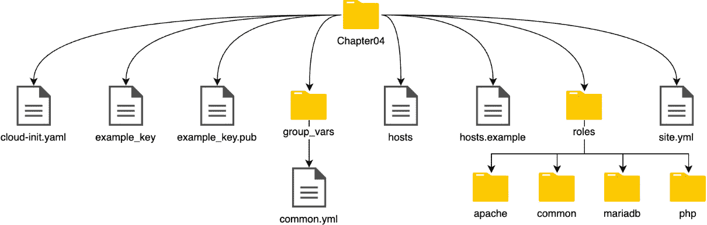
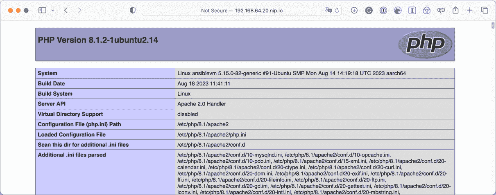
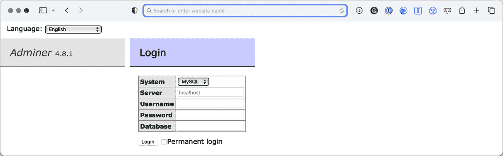
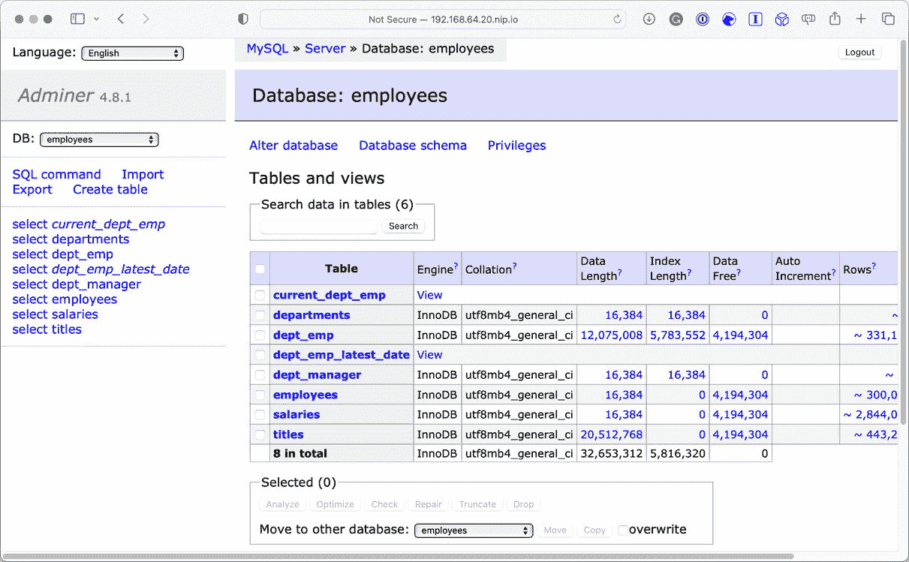

# 4

# 部署 LAMP 堆栈

本章将介绍如何使用 Ansible 提供的各种核心模块来部署完整的 LAMP 堆栈。我们将以在 *第一章* 中首次使用的本地 Multipass 虚拟机为目标，*安装和运行 Ansible*。

我们将讨论以下内容：

+   剧本布局 – 我们的剧本将如何构建

+   Linux – 准备 Linux 服务器

+   Apache – 安装和配置 Apache

+   MariaDB – 安装和配置 MariaDB

+   PHP – 安装和配置 PHP

本章将涵盖以下主题：

+   剧本结构

+   LAMP 堆栈

+   LAMP 剧本

在开始编写剧本之前，我们将在简要讨论本章所需内容后，讨论我们将使用的结构。

# 技术要求

我们将再次使用在前几章中启动的本地 Multipass 虚拟机。由于我们将把 LAMP 堆栈的所有元素安装到虚拟机上，因此你的 Multipass 虚拟机需要能够从互联网下载软件包；总共有大约 500 MB 的软件包和配置需要下载。

你可以在本书随附的仓库中找到剧本的完整副本，链接地址为 [`github.com/PacktPublishing/Learn-Ansible-Second-Edition/tree/main/Chapter04`](https://github.com/PacktPublishing/Learn-Ansible-Second-Edition/tree/main/Chapter04)。

# 剧本结构

在 *第一章*，*安装和运行 Ansible* 中，我们运行的剧本尽可能简单。它们都在一个文件中，附带一个主机清单文件，并且如果需要，还有一个模板文件。然后在 *第二章*，*探索 Ansible Galaxy* 中，我们扩展了我们的剧本文件，开始使用角色，而不是将所有的任务、处理器和变量放在一个文件中。

从下面的布局可以看到，包含了几个文件夹和文件：



图 4.1 – 我们将使用的剧本文件夹结构

虽然仓库中有结构的副本，但我们还是先创建结构，并在创建过程中讨论每个项目。我们需要创建的第一个文件夹是顶层文件夹。这个文件夹将包含我们的剧本文件夹和文件：

```
$ mkdir Chapter04
$ cd Chapter04
```

我们将创建的下一个文件夹名为 `group_vars`。它将包含在我们的剧本中使用的变量文件。现在，我们将创建一个名为 `common.yml` 的变量文件：

```
$ mkdir group_vars
$ touch group_vars/common.yml
```

接下来，我们将创建两个文件 – 我们的主机清单文件，将命名为 `hosts`，以及我们的主剧本，通常命名为 `site.yml`：

```
$ touch production
$ touch site.yml
```

我们将手动创建的最终文件夹叫做`roles`。在这里，我们将使用我们在*第二章*《探索 Ansible Galaxy》中学到的`ansible-galaxy`命令来创建一个名为`common`的角色。为此，我们使用以下命令：

```
$ mkdir roles
$ ansible-galaxy role init roles/common
```

这应该会创建开始编写`common`角色所需的所有文件。

`cloud-init.yaml`、`example_key`、`example_key.pub` 和 `hosts.example` 文件均直接来自*第一章*《安装与运行 Ansible》和*第二章*《探索 Ansible Galaxy》，因此我们在本章中不再覆盖它们。

注意

虽然我们将在本节和接下来的各节中逐个处理每个文件，但整个剧本的完整副本可以在随附的 GitHub 仓库中找到。

让我们看看剧本中的四个角色，并安装和配置我们的 LAMP 堆栈。

# LAMP 堆栈

LAMP 堆栈是一个用来描述一体化 Web 和数据库服务器的术语。通常，组件如下：

+   **Linux**是底层操作系统；在我们的案例中，我们将使用 Ubuntu 22.04。

+   **Apache**是堆栈中的 Web 服务器元素。

+   **MariaDB**是我们将用作堆栈数据库组件的数据库；通常，它基于**MySQL**，也可以使用 MySQL。

+   **PHP**是 Web 服务器用于生成内容的动态语言。

**LAMP**堆栈的常见变种被称为**LEMP**；它用**NGINX**代替了**Apache**，NGINX 的发音为*engine-x*，因此是*E*而不是*N*。

我们将创建角色来处理这些组件；它们如下所示：

+   `common`：该角色将为我们的 Ubuntu 服务器做准备，安装我们所需的任何支持包和服务。

+   `apache`：该角色将安装 Apache Web 服务器并配置默认虚拟主机。

+   `mariadb`：该角色不仅会安装 MariaDB，还会确保安装安全，并创建默认数据库和用户，还可以选择下载并导入用于测试的数据库。

+   `php`：该角色将安装 PHP 并配置一组常见的 PHP 模块，如果我们将选项设置为一个用 PHP 编写的数据库管理工具，我们可以通过浏览器与我们的测试数据库进行交互。

让我们首先来看一下`common`角色。

## 公共角色

在本章的前一部分中，我们使用`ansible-galaxy role init`命令创建了`common`角色。它创建了几个文件夹和文件；正如在*第二章*《探索 Ansible Galaxy》中讨论的那样，我们不会在这里深入探讨，而是直接进入角色本身。

让我们开始通过添加一些任务来进行。

### 更新已安装的软件包。

首先，让我们通过将以下内容添加到`roles/common/tasks/main.yml`文件的开头来更新我们的服务器：

```
- name: "Update apt cache and upgrade packages"
  ansible.builtin.apt:
    name: "*"
    state: "latest"
    update_cache: true
```

你会注意到与我们上次使用`ansible.builtin.apt`模块更新所有已安装的软件包时的情况有所不同。

现在我们通过`name`键启动任务；当 Playbook 运行时，这将打印出我们赋值给`name`键的内容，这样可以让我们更清楚地了解 Playbook 运行过程中发生的事情，而不仅仅是打印执行的模块名称。

### 安装常用软件包

现在我们已经更新了已安装的软件包，让我们安装所有 Playbook 将要针对的 Linux 服务器上需要安装的软件包：

```
- name: "Install common packages"
  ansible.builtin.apt:
    state: "present"
    pkg: "{{ common_packages }}"
```

如你所见，我们再次使用了`ansible.builtin.apt`模块，并且为任务添加了一个描述性名称。我们没有在任务中提供一个包列表，而是使用了一个名为`common_packages`的变量，该变量在`roles/common/defaults/main.yml`文件中定义如下：

```
common_packages:
  - "ntp"
  - "sntp"
  - "ntp-doc"
  - "vim"
  - "git"
  - "unzip"
```

如你所见，我们安装了`ntp`、`sntp`和`ntp-doc`；我们将很快配置`ntp`。接下来，我们安装了`vim`、`git`和`unzip`，因为它们在服务器上安装总是非常有用。

你可能还注意到，我们通过`{{ common_packages }}`将包列表传递给`ansible.builtin.apt`模块的`pkg`键，这样模块会遍历我们传入的包列表，并一次性安装它们，而无需调用模块逐个安装每个包。

### 配置网络时间协议（NTP）

接下来，我们从`templates`文件夹中复制`ntp.conf`文件，像前几章一样添加 NTP 服务器列表，并告知 Ansible 每当配置文件更改时重新启动 NTP。

### 创建密钥、组和用户

在`roles/common/defaults/main.yml`文件中，定义了以下变量：

```
users:
  - {
      name: "lamp",
      group: "lamp",
      state: "present",
      key: "/tmp/id_ssh_lamp_rsa",
    }
```

这与我们迄今为止使用的变量略有不同，因为这是一个名为`users`的单一变量，它由一个项组成，而该项包含`name`、`group`、`state`和`key`键值对。

因为我们使用了项，我们需要改变在任务中使用变量的方式，第一个在`roles/common/tasks/main.yml`中的任务是创建 OpenSSH 密钥对；如果尚未存在密钥，我们需要将其保存在`key`键值对中定义的路径下：

```
- name: "Generate a ssh keypair"
  community.crypto.openssh_keypair:
    path: "{{ item.key }}"
  with_items: "{{ users }}"
  delegate_to: "localhost"
  become: false
```

在执行任务时，你可以看到我们使用了`community.crypto.openssh_keypair`模块，在其中我们只传递了一个值，即我们希望存储 OpenSSH 密钥的文件路径。

如你所见，我们使用了`{{ item.key }}`变量来输入路径，但这里并没有定义该变量的名称是`users`；相反，我们使用了`with_items`选项，并在这里传入了`{{ users }}`变量。

虽然在这个例子中我们只传递了一个项目，但你也可以采用这种方法来多次执行单个任务——例如，如果我们的变量看起来像这样：

```
users:
  - {
      name: "lamp",
      group: "lamp",
      state: "present",
      key: "/tmp/id_ssh_lamp_rsa",
    }
  - {
      name: "user2",
      group: "lamp",
      state: "present",
      key: "/tmp/id_ssh_user2_rsa",
    }
```

然后，当任务执行时，它会创建两个 OpenSSH 密钥，随后的任务（稍后我们会讲解）会创建一个名为`lamp`的组，然后创建两个用户，`lamp`和`user2`。

回到当前任务–你会注意到我们定义了另外两个选项，`delegate_to`和`become`。

如果我们在没有定义`delegate_to`的情况下运行`community.crypto.openssh_keypair`模块，那么该模块将在远程主机上执行，而这并不是我们希望发生的情况，因为我们希望 OpenSSH 密钥的私钥和公钥部分保存在本地机器上。因此，通过在`delegate_to`选项中使用`localhost`作为值，我们告诉 Ansible 在本地执行此任务。

下一个选项`become`告诉 Ansible 不要使用`sudo`命令提升为超级用户，这也是我们在主`site.yml`剧本文件顶部定义的所有主机的默认行为–这是因为我们希望`community.crypto.openssh_keypair`模块作为你登录的用户运行，而不是本地机器的 root 用户。

该任务的逻辑（不包括`delegate_to`和`become`选项，因为我们希望剩余的任务在目标机器上执行）会延续到角色中的剩余任务，首先通过执行`ansible.builtin.group`模块来创建组：

```
- name: "Add group for our users"
  ansible.builtin.group:
    name: "{{ item.group }}"
    state: "{{ item.state }}"
  with_items: "{{ users }}"
```

一旦组创建完成，我们可以通过`ansible.builtin.user`来添加用户，或者如果我们在`users`变量中定义了多个项，则可以添加多个用户：

```
- name: "Add users to our group"
  ansible.builtin.user:
    name: "{{ item.name }}"
    group: "{{ item.group }}"
    comment: "{{ item.name }}"
    state: "{{ item.state }}"
  with_items: "{{ users }}"
```

角色中的最后一个任务将我们之前生成的 OpenSSH 密钥的公钥部分，添加到先前任务中创建的用户（或用户们）中，使用`ansible.builtin.authorized_key`模块。

```
- name: "Add keys to our users"
  ansible.posix.authorized_key:
    user: "{{ item.name }}"
    key: "{{ lookup('file', item.key + '.pub') }}"
  with_items: "{{ users }}"
```

你可能已经注意到我们传递给`key`选项的值对我们来说是新的；它使用`lookup`插件读取路径`item.key`下的文件内容，并在文件名末尾附加`.pub`，这意味着在我们的情况下，它读取`/tmp/id_ssh_lamp_rsa.pub`文件的内容。这个文件是 OpenSSH 密钥对的公钥部分，它是在我们之前执行`"生成 ssh 密钥对"`任务时创建的。

`lookup`插件设计为在本地执行，因此在这种情况下，我们不需要使用`delegate_to`和`become`选项，因为我们希望任务在目标主机上执行，因为用户已经在该主机上创建，但我们希望将本地主机上的`/tmp/id_ssh_lamp_rsa.pub`文件的内容填充到远程主机的`/home/lamp/.ssh/authorized_key`文件中。

这就完成了`common`角色中的任务；在我们继续下一个角色（安装和配置`apache`）之前，你需要知道一件事。

`"生成 SSH 密钥对"`任务在执行时不会覆盖任何现有的密钥对，这意味着当你第一次运行此角色并且`/tmp/id_ssh_lamp_rsa`和`/tmp/id_ssh_lamp_rsa.pub`这两个文件不存在时，密钥对将被创建；在随后的 Playbook 执行中，由于这些文件已经存在，任务将返回`community.crypto.openssh_keypair`模块来创建密钥对。

## Apache 角色

一旦`common`角色在我们的远程主机上运行完毕，我们就准备好安装和配置 Apache Web 服务器了。

### 安装 Apache 软件包

`roles/apache/tasks/main.yml`中的第一个任务安装运行 Apache Web 服务器所需的软件包；它使用`ansible.builtin.apt`模块，内容如下：

```
- name: "Install apache packages"
  ansible.builtin.apt:
    state: "present"
    pkg: "{{ apache_packages }}"
```

如你所见，它调用了一个名为`{{ apache_packages }}`的变量，该变量在`roles/apache/defaults/main.yml`中定义，如下所示：

```
apache_packages:
  - "apache2"
  - "apache2-ssl-dev"
  - "ca-certificates"
  - "openssl"
```

正如我们在走过`common`角色时所学到的，这将安装在变量中定义的四个软件包。

一旦安装了 Apache（这是一个单独的任务），我们就可以继续配置 Apache 安装了。

### 配置 Apache

配置 Apache 时的第一个任务是将`common`角色运行时创建的用户添加到 Apache 组中；为此，我们运行以下任务：

```
- name: "Add user to apache group"
  ansible.builtin.user:
    name: "{{ item.name }}"
    groups: "{{ apache_group }}"
    append: true
  with_items: "{{ users }}"
```

该任务取用了前一个角色中的`{{ users }}`变量，并循环遍历变量中定义的项目，将用户添加到`roles/apache/defaults/main.yml`文件中`{{ apache_group }}`变量定义的组中。以下是配置 Apache 时使用的变量的完整列表，这些变量将被我们在接下来的任务中使用：

```
apache_group: "www-data"
web_root: "web"
document_root: "/home/{{ users.0.name }}/{{ web_root }}"
index_file: index.html
vhost_path: "/etc/apache2/sites-enabled/"
vhost_default_file: "000-default.conf"
vhost_our_file: "vhost.conf"
```

你可能已经注意到，`document_root`变量的值与我们之前使用的有所不同；稍后我们会进一步讨论这一点。

下一个任务将在用户目录中创建一个文件夹，我们将使用它来存储通过 Apache 提供的文件：

```
- name: "Create the document root for our website"
  ansible.builtin.file:
    dest: "{{ document_root }}"
    state: directory
    mode: "0755"
    owner: "{{ users.0.name }}"
    group: "{{ apache_group }}"
```

如你所见，我们像为`document_root`变量值那样使用`{{ users.0.name }}`；这是为什么呢？

正如我们所知，`common`角色只创建了一个用户；我们不能简单地使用`{{ users.name }}`，因为`name`键存在于变量中的某一项内，所以使用`{{ users.name }}`会导致错误，提示找不到该变量。

因此，我们可以通过使用其在列表中的位置来引用列表中的第一个项，因为 Ansible 从零开始计数，所以它的位置是`0`而不是`1`。

使用我们在`common`和`apache`角色的默认值中定义的值，该任务将在`/home/lamp/web/`创建一个文件夹；`lamp`用户将拥有该文件夹，并且该文件夹会分配给`www-data`组，这是 Apache 进程运行时所使用的组。

下一个任务将确保在`/home/lamp/`文件夹上设置正确的读取、写入和执行权限：

```
- name: "Set the permissions on the user folder"
  ansible.builtin.file:
    dest: /home/{{ users.0.name }}/
    state: directory
    mode: "0755"
    owner: "{{ users.0.name }}"
```

该任务完成了配置我们网页所需的文件夹结构；现在，是时候配置 Apache 了。

我们需要做的第一件事是删除默认的虚拟主机配置文件；为此，我们将执行以下任务：

```
- name: "Remove the apache default vhost config"
  ansible.builtin.file:
    path: "{{ vhost_path }}{{ vhost_default_file }}"
    state: absent
  notify: "Restart apache2"
```

这使用 `ansible.builtin.file` 模块将 `{{ vhost_default_file }}` 在 `{{ vhost_path }}` 文件夹中的文件状态设置为 `absent`，意味着如果该文件存在，将把它删除。

它还使用 `notify` 来调用 `"Restart apache2"` 处理程序，该处理程序在 `roles/apache/handlers/main.yml` 文件中定义，任务如下所示：

```
- name: "Restart apache2"
  ansible.builtin.service:
    name: "apache2"
    state: "restarted"
    enabled: true
```

删除默认文件后，我们可以添加我们的虚拟主机配置文件。

该虚拟主机配置文件的模板可以在 `roles/apache/templates/vhost.conf.j2` 找到，内容如下：

```
# {{ ansible_managed }}
<VirtualHost *:80>
  ServerName {{ ansible_hostname }}
  DocumentRoot {{ document_root }}
  DirectoryIndex {{ index_file }}
  <Directory {{ document_root }}>
    AllowOverride All
    Require all granted
  </Directory>
</VirtualHost>
```

加载后，该配置文件会在有人访问网站 URL 时，提供 `{{ document_root }}` 文件夹中的内容。

部署该模板文件到远程主机的任务如下所示：

```
- name: "Copy the our vhost.conf to the sites-enabled folder"
  ansible.builtin.template:
    src: vhost.conf.j2
    dest: "{{ vhost_path }}{{ vhost_our_file }}"
    mode: "0644"
  notify: "Restart apache2"
```

如您所见，如果文件有任何更改，它还会调用 `"Restart apache2"` 处理程序。

现在 Apache 已经配置好，剩下一个最终任务。

### 可选地复制一个 index.html 文件

该角色中的最终任务使用以下`variables`块：

```
html_deploy: true
html_heading: "Success !!!"
html_body: |
  This HTML page has been deployed using Ansible to <b>{{ ansible_host }}</b>.<br>
  The user is <b>{{ users.0.name }}</b> who is in the <b>{{ apache_group }}</b> group.<br>
  The weboot is <b>{{ document_root }}</b>, the default index file is <b>{{ index_file }}</b>.<br>
```

如您所见，它包含了一个标题和一些 HTML 代码，供后续任务使用：

```
- name: "Copy the test HTML page to the document root"
  ansible.builtin.template:
    src: index.html.j2
    dest: "{{ document_root }}/index.html"
    mode: "0644"
    owner: "{{ users.0.name }}"
    group: "{{ apache_group }}"
  when: html_deploy
```

这使用一个可以在 `roles/apache/templates/index.html.j2` 找到的模板，内容如下所示：

```
<!--{{ ansible_managed }}-->
<!doctype html>
<title>{{ html_heading }}</title>
<style>
  body { text-align: center; padding: 150px; }
  h1 { font-size: 50px; }
  body { font: 20px Helvetica, sans-serif; color: #333; }
  article { display: block; text-align: left; width: 650px; margin: 0 auto; }
</style>
<article>
    <h1>{{ html_heading }}</h1>
    <div>
        <p>{{ html_body }}</p>
    </div>
</article>
```

然而，只有在 `html_deploy` 变量设置为 `true` 时，才会调用该任务；这由任务结尾的以下语句管理：

```
when: html_deploy
```

因此，如果出于任何原因，`html_deploy` 变量不等于 `true`，那么在执行 playbook 时该任务将被跳过。

这就是我们安装和配置 Apache 所需要做的全部工作；现在让我们来看看安装 LAMP 中的 M，并审视安装和配置 MariaDB 的角色。

## MariaDB 角色

在本章介绍的四个角色中，MariaDB 角色是最复杂的，因为它安装 MariaDB、配置它，并可选地下载并导入一个示例数据库。

让我们从安装开始讲解。

### 安装 MariaDB

您可能已经开始发现角色中的趋势：任务通常从安装几个软件包开始，而 MariaDB 也不例外。

来自 `roles/mariadb/tasks/main.yml` 的任务如下：

```
- name: "Install mariadb packages"
  ansible.builtin.apt:
    state: "present"
    pkg: "{{ mariadb_packages }}"
```

`roles/mariadb/defaults/main.yml` 中的 `mariadb_packages` 变量如下所示：

```
mariadb_packages:
  - "mariadb-server"
  - "mariadb-client"
  - "python3-pymysql"
```

如您所见，我们安装了 MariaDB 客户端和服务器。同时，我们安装了 `python3-pymysql` 包；这是与 MariaDB 交互的任务所必需的，一旦 MariaDB 安装完成才能正常工作。如果没有它，Ansible 将无法与我们的 MariaDB 服务器建立连接并进行交互。

一旦软件包安装完成，我们需要通过以下任务启动 MariaDB 服务器：

```
- name: "Start mariadb"
  ansible.builtin.service:
    name: mariadb
    state: started
    enabled: true
```

你可能在想，为什么我们没有像之前的任务一样使用处理程序（handler）？实际上，处理程序只有在剧本执行完成后，Ansible 知道所有需要重启的服务时才会被调用。

然而，在这种情况下，我们需要与 MariaDB 服务进行交互，以便在剧本运行时能够进行配置，因此我们没有使用处理程序，而是像处理程序一样在任务中启动该服务。

现在 MariaDB 已经安装并启动，我们可以开始配置。

### 配置 MariaDB

在我们开始任务之前，快速查看一下 `roles/mariadb/defaults/main.yml` 中的变量，这些变量将用于配置我们的 MariaDB 服务器：

```
mariadb_root_username: "root"
mariadb_root_password: "Pa55W0rd123"
mariadb_hosts:
  - "127.0.0.1"
  - "::1"
  - "{{ ansible_nodename }}"
  - "%"
  - "localhost"
```

现在我们知道将要使用哪些变量，是时候开始处理配置了，由于 MariaDB 在安装后立即启动时的默认配置方式，这个过程有点复杂。

默认情况下，MariaDB 启动时没有设置密码，这意味着任何人都可以作为 root 用户连接到数据库，这是不理想的，因此我们需要做的第一件事就是通过设置 root 密码来保护我们的安装。

听起来还挺简单的，你可能在心里这么想。

从技术上讲，是的；然而，如果剧本第二次运行时，也就是密码已经设置的情况下，我们接下来定义的任务将会出错，因为我们需要配置任务不要使用密码。一旦密码设置完成，服务器只会接受使用已设置密码的连接。

我们还需要考虑，一旦配置了密码，每次需要连接 MariaDB 服务器时，都需要使用该密码——所以我们需要一种简便的方式来确保密码设置完成后能够顺利连接。

幸运的是，MariaDB 和 MySQL 都内置了一个功能，可以让你将凭证存储在服务器上的一个文件中；这个文件应该放在你登录用户的主目录下。一旦文件放置好，每次你尝试以该用户连接数据库时，数据库客户端都会读取该文件并自动连接，而无需你输入凭证——这个文件应该被命名为 `~/.my.cnf`（`~/` 部分是指用户的主文件夹）。

对于我们的场景来说，这种方式有效，因为我们可以检查 `~/.my.cnf` 文件是否存在，如果文件不存在，就可以安全地假设密码尚未配置。

检查文件是否存在的任务如下：

```
- name: "Check to see if the ~/.my.cnf file exists"
  ansible.builtin.stat:
    path: ~/.my.cnf
  register: mycnf
```

这使用了 `ansible.builtin.stat` 模块来检查文件的存在性，然后使用 `register` 选项注册一个名为 `mycnf` 的运行时变量。

现在我们有了一个动态注册的变量，它包含了有关远程主机文件系统中 `~/.my.cnf` 文件是否存在的详细信息，我们可以根据这个信息来更改密码，或者如果 `~/.my.cnf` 文件存在，则跳过任务。

Ansible 有几个内置模块可与 MySQL 和 MariaDB 进行交互；我们在这里使用的是 `ansible.builtin.mysql_user`：

```
- name: "Change mysql root password if we need to"
  community.mysql.mysql_user:
    name: "{{ mariadb_root_username }}"
    host: "{{ item }}"
    password: "{{ mariadb_root_password }}"
    check_implicit_admin: "yes"
    priv: "*.*:ALL,GRANT"
    login_user: "{{ mariadb_root_username }}"
    login_unix_socket: /var/run/mysqld/mysqld.sock
  with_items: "{{ mariadb_hosts }}"
  when: not mycnf.stat.exists
```

在任务中，我们指示 Ansible 将 `{{ mariadb_root_username }}` 变量中定义的用户的密码设置为 `{{ mariadb_root_password }}` 变量中存储的密码，从而授予该用户对所有数据库的完全管理员访问权限，这些数据库由 `{{ mariadb_hosts }}` 定义，并通过 `with_items` 函数进行循环。

当登录执行此操作时，Ansible 应使用 `{{ mariadb_root_username }}` 用户名并通过 Unix 套接字连接，该套接字位于 `/var/run/mysqld/mysqld.sock`；这意味着我们不需要建立网络连接来与数据库交互，因为如果这样做，Ansible 将无法连接，因为它无法发送空密码。

最后，只有在 `mycnf.stat.exists` 变量等于 `false` 时，才运行此任务。

现在我们已经设置了实际密码并确保了 MariaDB 安装的安全性，我们需要创建 `~/.my.cnf` 文件以继续配置。

为了完成此操作，我们将再次使用模板，模板文件位于 `roles/mariadb/templates/my.cnf.j2`。该模板如下所示：

```
# {{ ansible_managed }}
[client]
user='{{ mariadb_root_username }}'
password='{{ mariadb_root_password }}'
```

如您所见，它包含连接到数据库服务器所需的用户名和密码。

由于文件包含凭证，当任务在服务器上创建文件时，我们需要确保该文件只能由 root 用户读取和写入，通过设置文件创建时的读取、写入和执行权限：

```
- name: "Set up ~/.my.cnf file"
  ansible.builtin.template:
    src: "my.cnf.j2"
    dest: "~/.my.cnf"
    mode: "0600"
```

现在我们在远程主机上有了 `~/.my.cnf` 文件，我们可以继续进行 MariaDB 安装的安全配置；接下来的任务是移除 `anonymous` 用户，再次循环遍历该用户可能关联的主机：

```
- name: "Delete anonymous MySQL user"
  community.mysql.mysql_user:
    user: ""
    host: "{{ item }}"
    state: absent
  with_items: "{{ mariadb_hosts }}"
```

最终的任务是对我们的 MariaDB 安装进行安全处理，它会移除默认的 `test` 数据库：

```
- name: "Remove the MySQL test database"
  community.mysql.mysql_db:
    db: "test"
    state: "absent"
```

角色中的其余任务，如在 `apache` 角色中复制 `index.html` 文件，是可选的，我们现在来回顾这些任务。

### 下载和导入示例数据库

`roles/mariadb/defaults/main.yml` 中还有一块变量，它们用于下载和导入示例数据库。`mariadb_sample_database` 变量中包含许多键值，首先是启用选项的标志、要下载的文件的 URL，以及保存路径：

```
mariadb_sample_database:
  create_database: true
  source_url: "https://github.com/russmckendrick/test_db/archive/master.zip"
  path: "/tmp/test_db-master"
```

接下来，我们有示例数据库的名称以及用于新数据库的用户名和密码：

```
  db_name: "employees"
  db_user: "employees"
  db_password: "employees"
```

最后，是需要导入的文件列表。前两个文件包含架构：

```
  dump_files:
    - "employees.sql"
    - "show_elapsed.sql"
```

剩余的文件包含实际需要加载的数据：

```
    - "load_departments.dump"
    - "load_employees.dump"
    - "load_dept_emp.dump"
    - "load_dept_manager.dump"
    - "load_titles.dump"
    - "load_salaries1.dump"
    - "load_salaries2.dump"
    - "load_salaries3.dump"
```

现在我们知道了定义的变量，我们可以处理剩余的任务，第一个任务是下载并解压包含示例数据库文件的 ZIP 文件：

```
- name: "Download and unarchive the sample database data"
  ansible.builtin.unarchive:
    src: "{{ mariadb_sample_database.source_url }}"
    dest: /tmp
    remote_src: "yes"
  when: mariadb_sample_database.create_database
```

如你所见，`ansible.builtin.unarchive` 模块允许你下载并解压文件，这意味着我们可以在一个任务中完成所有操作。另外，只有当 `mariadb_sample_database.create_database` 为 `true` 时，`when` 任务才会执行。我们将在剩下的任务中继续这样做，甚至会在角色的最后扩展 `when` 条件。

下一步任务是创建示例数据库：

```
- name: "Create the sample database"
  community.mysql.mysql_db:
    db: "{{ mariadb_sample_database.db_name }}"
    state: present
  when: mariadb_sample_database.create_database
```

一旦数据库创建完成，我们可以运行一个任务，创建用户并分配权限，使其能够访问我们刚刚添加的数据库：

```
- name: "Create the user for the sample database"
  community.mysql.mysql_user:
    name: "{{ mariadb_sample_database.db_user }}"
    password: "{{ mariadb_sample_database.db_password }}"
    priv: "{{ mariadb_sample_database.db_name }}.*:ALL"
    state: present
  with_items: "{{ mariadb_hosts }}"
  when: mariadb_sample_database.create_database
```

现在我们只剩下最后两个任务，这里需要在我们的 playbook 中加入更多逻辑，确保我们只导入一次示例数据；如果没有这些逻辑，当 playbook 被重新运行时，可能会遇到各种问题，甚至有数据被覆盖或重复插入的风险，如果导入任务再次运行的话。

由于数据库存储在主机的文件系统中，我们可以使用与检查`~/.my.cnf`文件存在性时相同的逻辑，不过这次我们检查的是数据库文件：

```
- name: "Check to see if we need to import the sample database dumps"
  ansible.builtin.stat:
    path: /var/lib/mysql/{{ mariadb_sample_database.db_name }}/{{ mariadb_sample_database.db_name }}.frm
  register: db_imported
  when: mariadb_sample_database.create_database
```

我们注册了一个名为 `db_imported` 的变量，接下来会用它与下一个任务的 `when` 条件配合使用；这个任务会遍历 `mariadb_sample_database.dump_files` 并导入数据库：

```
- name: "Import the sample database"
  community.mysql.mysql_db:
    name: "{{ mariadb_sample_database.db_name }}"
    state: import
    target: "{{ mariadb_sample_database.path }}/{{ item }}"
  with_items: "{{ mariadb_sample_database.dump_files }}"
  when: db_imported is defined and not db_imported.stat.exists
```

我们稍微改变了 `when` 条件；这里不再引用 `mariadb_sample_database.create_database`，而是只使用 `db_imported`。

第一个部分确保在我们决定不导入数据库时，playbook 不会出错，方法是将 `mariadb_sample_database.create_database` 设置为 `false`，因为只有当 `mariadb_sample_database.create_database` 设置为 `true` 时，`db_imported` 才能被定义，因为设置 `db_imported` 变量的任务只有在满足该条件时才会执行。

正如你所看到的，我们使用了 `and`，从而为 `when` 语句添加了第二个条件；这意味着该任务只有在同时满足 `db_imported is defined` 和 `not db_imported.stat.exists` 时才会执行。

最后一个任务将带我们完成 MariaDB 角色的工作，接下来我们只剩一个角色要处理——PHP 角色。

## PHP 角色

我们的这个最终角色安装 PHP，选项上可以附带一个 PHP 信息文件，并且安装一个用 PHP 编写的数据库管理界面，叫做 Adminer，这样我们就可以访问前一个角色中使用的数据库服务器。

### 安装 PHP 包

对你来说，PHP 角色中执行的第一个任务是安装我们运行 PHP 所需的包，应该不是什么惊讶的事。

所有包的完整列表在`roles/php/default/main.yml`文件中定义，内容如下：

```
php_packages:
  - "php"
  - "php-cli"
  - "php-curl"
  - "php-gd"
  - "php-intl"
  - "php-mbstring"
  - "php-mysql"
  - "php-soap"
  - "php-xml"
  - "php-xmlrpc"
  - "php-zip"
  - "libapache2-mod-php"
```

这个任务本身看起来很熟悉：

```
- name: "Install php packages"
  ansible.builtin.apt:
    state: "present"
    pkg: "{{ php_packages }}"
  notify: "Restart apache2"
```

需要注意的是，PHP 安装完毕后，我们重启 Apache，因为我们以 Apache 模块的形式运行 PHP。所以，一旦安装完成，Apache 需要重启以加载模块，并在 Apache 网络服务器上启用 PHP。

就是这样。PHP 已经安装，Apache 请求重启；从这里开始的一切都是可选的。

### 复制 PHP 信息文件

下一个任务是一个简单的任务，如果 `php_info` 变量设置为 `true`，则将 `roles/php/files/info.php` 复制到服务器的网页根目录：

```
- name: "Copy the PHP info to the document root"
  ansible.builtin.copy:
    src: info.php
    dest: "{{ document_root }}/info.php"
    mode: "0755"
    owner: "{{ users.0.name }}"
    group: "{{ apache_group }}"
  when: php_info
```

唯一的区别是我们通过这个任务将文件从本地主机复制到远程主机——这次我们不使用 `ansible.builtin.template` 模块，而是使用 `ansible.builtin.copy` 模块。因为 `info.php` 只有三行代码，这些代码不需要根据环境或我们设置的任何变量进行更新。

### 安装和配置 Adminer

`roles/php/default/main.yml` 文件中的其余任务的变量如下所示：

```
adminer:
  install: true
  path: "/usr/share/adminer"
  download: "https://github.com/vrana/adminer/releases/download/v4.8.1/adminer-4.8.1-mysql.php"
```

它们定义了从哪里下载文件，以及将文件下载到远程主机的哪个位置，这就是三项任务中的第一项，因为它会在远程虚拟机的文件系统上创建一个文件夹，以便我们下载 Adminer：

```
- name: "Create the document root for adminer"
  ansible.builtin.file:
    dest: "{{ adminer.path }}"
    state: directory
    mode: "0755"
  when: adminer.install
```

一旦我们创建了下载目标文件夹，就可以下载 Adminer 本身：

```
- name: "Download adminer"
  ansible.builtin.get_url:
    url: "{{ adminer.download }}"
    dest: "{{ adminer.path }}/index.php"
    mode: "0755"
  when: adminer.install
```

正如您可能从下载 URL 和目标位置中发现的，Adminer 是一个单独的 PHP 文件，我们将其保存为 `index.php`。那么，如何通过我们的 Apache web 服务器访问 Adminer 呢？

好的，为了做到这一点，我们需要再复制一个虚拟主机配置文件：

```
- name: "Copy the adminer.conf to sites-enabled folder"
  ansible.builtin.template:
    src: adminer.conf.j2
    dest: "{{ vhost_path }}adminer.conf"
    mode: "0755"
  when: adminer.install
  notify: "Restart apache2"
```

如您所见，它渲染并将 `roles/php/templates/adminer.conf.j2` 复制到 `adminer.conf`，即远程主机上的 site-enabled 文件夹，并指示 Apache 服务重新启动以加载新增的配置。

`adminer.conf.j2` 文件包含以下内容：

```
# {{ ansible_managed }}
Alias /adminer "{{ adminer.path }}"
  <Directory "{{ adminer.path }}">
    DirectoryIndex index.php
    AllowOverride All
    Require all granted
  </Directory>
```

这告诉 Apache，当有人访问 `http://someurl/adminer/` 时，应该提供 Adminer 的 `index.php` 文件。

完成这个任务后，我们已经完成了安装和配置 LAMP 堆栈的四个角色的演示，现在是时候回顾并执行 playbook 本身了。

# LAMP playbook

正如我们在本章开始时讨论 playbook 结构时提到的，主 playbook 文件名为 `site.yml`，其内容如下所示：

```
---
- name: "Install LAMP stack"
  hosts: ansible_hosts
  gather_facts: true
  become: true
  become_method: ansible.builtin.sudo
  vars_files:
    - group_vars/common.yml
  roles:
    - common
    - apache
    - mariadb
    - php
```

如您所见，它调用了我们已经走过的四个角色，并且加载了来自 `group_vars/common.yml` 的 `variables` 文件；这个文件包含了 `html_body` 的重写配置，该配置在 `roles/apache/defaults/main.yml` 中配置，内容如下所示：

```
html_body: |
  This HTML page has been deployed using Ansible to <b>{{ ansible_nodename }}</b>.<br>
  The user is <b>{{ users.0.name }}</b> who is in the <b>{{ apache_group }}</b> group.<br>
  The weboot is <b>{{ document_root }}</b>, the default index file is <b>{{ index_file }}</b>.<br><br>
  You can access a <a href="/info.php">PHP Info file</a> or <a href="/adminer/">Adminer</a>.
```

这意味着当我们运行 playbook 时，`index.hml` 页面将包含指向 `info.php` 和 `/adminer` URL 的链接，以便轻松访问附加内容。

注意

本书附带的 GitHub 仓库中的 `Chapter04` 文件夹包含了示例的 hosts 文件和密钥，用于使用 Multipass 启动本地虚拟机。如果您在跟随教程，请参考 *第一章*，*安装和运行 Ansible*，了解如何启动虚拟机并准备自己的 `hosts` 文件。

所以，不再拖延，让我们运行 playbook：

```
$ ansible-playbook -i hosts site.yml
```

在第一次运行时，这应该会给我们输出如下内容：

```
PLAY [ansible_hosts]
TASK [Gathering Facts]
ok: [ansiblevm]
TASK [roles/common : update apt cache and upgrade packages]
ok: [ansiblevm]
…. lots of other output here ….
RUNNING HANDLER [roles/apache : restart apache2]
changed: [ansiblevm]
PLAY RECAP
ansiblevm : ok=34    changed=26    unreachable=0    failed=0    skipped=0    rescued=0    ignored=0
```

如你所见，Playbook 已对目标虚拟机进行了 26 次更改。

让我们再运行一次 playbook：

```
$ ansible-playbook -i hosts site.yml
```

然后，在 play recap 中，你应该会看到一些任务被跳过：

```
PLAY RECAP
ansiblevm         : ok=30    changed=0    unreachable=0    failed=0    skipped=2    rescued=0    ignored=0
```

如预期的那样，其中一项任务是更新数据库用户的 root 密码：

```
TASK [roles/mariadb : change mysql root password if we need to]
skipping: [ansiblevm] => (item=127.0.0.1)
skipping: [ansiblevm] => (item=::1)
skipping: [ansiblevm] => (item=ansiblevm)
skipping: [ansiblevm] => (item=%)
skipping: [ansiblevm] => (item=localhost)
skipping: [ansiblevm]
```

被跳过的第二个任务是导入数据库文件：

```
TASK [roles/mariadb : import the sample database]
skipping: [ansiblevm] => (item=employees.sql)
skipping: [ansiblevm] => (item=show_elapsed.sql)
skipping: [ansiblevm] => (item=load_departments.dump)
skipping: [ansiblevm] => (item=load_employees.dump)
skipping: [ansiblevm] => (item=load_dept_emp.dump)
skipping: [ansiblevm] => (item=load_dept_manager.dump)
skipping: [ansiblevm] => (item=load_titles.dump)
skipping: [ansiblevm] => (item=load_salaries1.dump)
skipping: [ansiblevm] => (item=load_salaries2.dump)
skipping: [ansiblevm] => (item=load_salaries3.dump)
skipping: [ansiblevm]
```

这两项都是预期的，因为我们是如此配置任务以便在后续的 Playbook 运行中响应。

现在，如果你打开浏览器，输入 `http://` 然后是你的 Ansible 主机名称（对我来说是 [`192.168.64.20.nip.io`](http://192.168.64.20.nip.io)；我怀疑你的地址会有所不同，所以这个链接可能无法使用），你应该会看到 Ansible 生成的 `index.html` 页面：


图 4.2 – 成功！！！– 查看 index.html 页面

点击 PHP 信息文件的链接应会将你带到类似于 [`192.168.64.20.nip.io/info.php`](http://192.168.64.20.nip.io/info.php) 的页面，该页面将显示你的 PHP 安装信息：



图 4.3 – 查看 PHP 信息页面

最终点击的链接是 Adminer 的链接；点击它会将你带到 [`192.168.64.20.nip.io/adminer/`](http://192.168.64.20.nip.io/adminer/)，并提示你登录：



图 4.4 – Adminer 登录页面

要登录，请使用以下凭据：

+   `root`

+   `Pa55W0rd123`

+   `employees`

登录后，你将直接进入 **employees** 数据库的概览页面：



图 4.5 – 员工数据库概览

随意点击，完成后，确保终止 Multipass 虚拟机；如何终止的说明可以在 *第一章* *安装和运行 Ansible* 章节的结尾找到。

# 总结

本章中，我们编写了一个 playbook，该 playbook 在我们的 Multipass 虚拟机上安装了 LAMP 堆栈。我们创建了四个角色，每个角色代表堆栈中的一个元素，在每个角色中，我们构建了一些逻辑，可以覆盖这些逻辑以部署额外的元素，例如测试 HTML 和 PHP 页面，还构建了创建包含超过 40,000 条记录的测试数据库的选项。

到目前为止，我们已经安装了一些基本的软件包。在下一章中，我们将编写一个 playbook，该 playbook 安装、配置并维护 WordPress 安装。

更新后的 playbook 将重用我们在本章中覆盖的一些元素，并进行一些改进，因为我们在本章中涉及的一些元素有些过于简单。最大的变化是，我们将不再使用硬编码的数据库实例密码。

# 深入阅读

你可以在以下网址找到本章中涉及的第三方工具的项目页面：

+   **Apache**: [`httpd.apache.org/`](https://httpd.apache.org/)

+   **MariaDB**: [`mariadb.org/`](https://mariadb.org/)

+   **Datacharmer 测试** **数据库**: [`github.com/datacharmer/test_db`](https://github.com/datacharmer/test_db)

+   **PHP**: [`php.net/`](https://php.net/)

+   **Adminer**: [`www.adminer.org`](https://www.adminer.org)

+   **NGINX**: [`nginx.org`](https://nginx.org)
