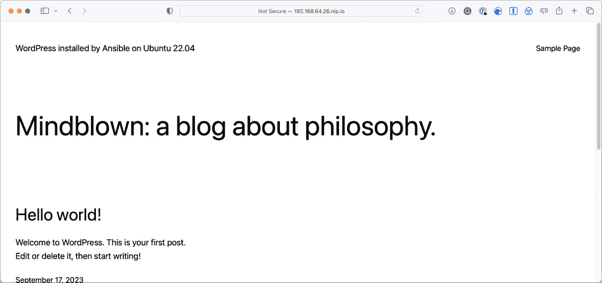
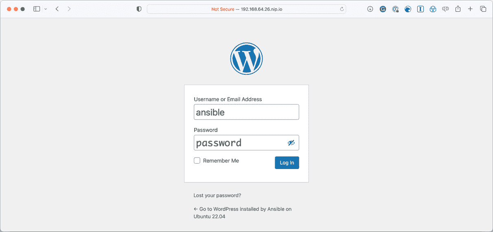
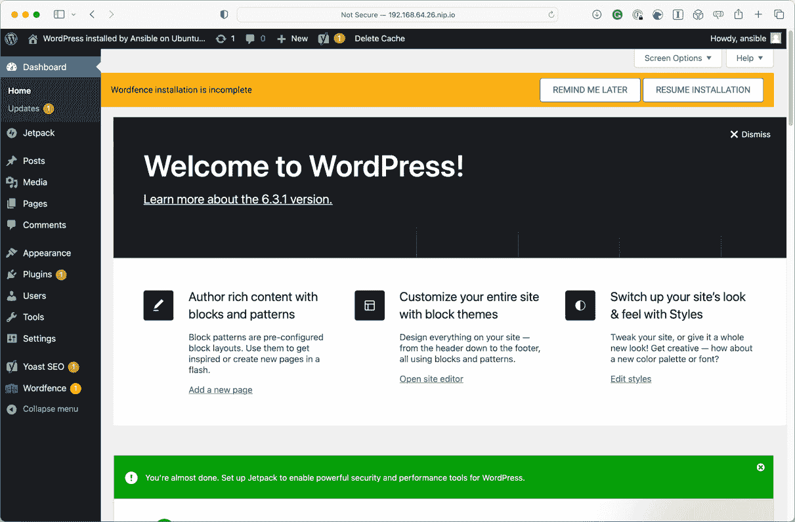

# 5

# 部署 WordPress

在上一章中，我们构建了一个安装和配置基本 **LAMP 堆栈** 的 playbook。在本章中，我们将在那里使用的技术基础上构建一个 playbook，用于安装 **LEMP 堆栈**，正如你可能记得的，它用 NGINX 替代了 Apache，然后安装 WordPress。

完成本章后，你应该能够做到以下几点：

+   准备我们的初始 playbook

+   下载并安装 WordPress CLI

+   安装和配置 WordPress

+   登录到你的 WordPress 安装

本章涉及以下主题：

+   预安装任务

+   `stack_install` 角色

+   `stack_config` 角色

+   `wordpress` 角色

+   运行 WordPress playbook

在我们开始之前，简要了解一下 WordPress；你可能在过去的 24 小时内访问过一个由 WordPress 提供支持的网站。

它是一个开源的 **内容管理系统** (**CMS**)，由 PHP 和 MySQL 提供支持，根据 2023 年 8 月 Colorlib 发布的统计数据，全球约有 8.1 亿个网站使用它，占所有网站的约 43%。

# 技术要求

就像在 *第四章* *部署 LAMP 堆栈* 中一样，我们将继续使用之前在整个标题中使用的本地 **Multipass 虚拟机**。同样，在启动虚拟机并部署 WordPress 时，将下载额外的软件包。

你可以在本书附带的仓库中找到完整的 playbook 副本，地址是 [`github.com/PacktPublishing/Learn-Ansible-Second-Edition/tree/main/Chapter05`](https://github.com/PacktPublishing/Learn-Ansible-Second-Edition/tree/main/Chapter05)。

# 预安装任务

如 *第四章* *部署 LAMP 堆栈* 中所提到的，LEMP 堆栈由以下元素组成：

+   **Linux**：在我们的案例中，这将是 Ubuntu Multipass 虚拟机

+   **NGINX**：如果你记得，它的发音是 *engine-x*，这意味着在 *LEMP* 中应该有一个 *E*，而不是 *N*（否则也无法作为缩写来发音）

+   **MariaDB**：正如我们已经看到的，这将是数据库组件

+   **PHP**：我们将再次使用 PHP 8 来进行配置

在安装 WordPress 之前，我们需要先安装和配置这些组件。而且，由于这个 playbook 最终将在公开的云服务器上执行，我们必须考虑一些关于 NGINX 配置的最佳实践。

然而，在我们开始查看 playbook 之前，让我们先设置 playbook 的初始结构：

```
$ mkdir Chapter05 Chapter05/group_vars Chapter05/roles
$ touch Chapter05/group_vars/common.yml Chapter05/hosts Chapter05/site.yml
$ cd Chapter05
```

这为我们提供了基本布局。接下来，我们必须从前面的章节中复制 `cloud-init.yaml`、`example_key`、`example_key.pub` 和 `hosts.example` 文件，这样当我们运行 playbook 时，我们就能拥有所有必要的文件来通过 Multipass 启动虚拟机。

现在我们已经配置好了基础设置，可以开始编写 playbook 来部署和配置我们的初始软件栈。

# stack_install 角色

我们将从使用 `ansible-galaxy` 的 `role init` 创建一个名为 `stack_install` 的角色开始：

```
$ ansible-galaxy role init roles/stack_install
```

这将安装我们的初始软件栈。安装完成后，我们将其交给第二个角色，第二个角色将配置软件栈，之后第三个角色开始安装 WordPress。

那么，我们需要哪些软件包呢？WordPress 有以下要求：

+   PHP 7.4 或更高版本

+   MySQL 5.7 或更高版本，或 MariaDB 10.4 或更高版本

+   带有 `mod_rewrite` 模块的 Nginx 或 Apache

+   支持 HTTPS

从上一章我们知道，安装的 PHP 和 MariaDB 版本满足此要求，只剩下 NGINX，我们可以从主要的 NGINX 仓库下载并安装以获取最新的版本。

## 启用 NGINX 仓库

在我们查看启用主线 NGINX 仓库所需的任务和变量之前，让我们从 `roles/stack_install/tasks/main.yml` 文件开始，执行一个更新操作系统和可用软件包缓存的任务：

```
- name: "Update apt-cache and upgrade packages"
  ansible.builtin.apt:
    name: "*"
    state: "latest"
    update_cache: true
```

接下来的任务将会定义启用仓库的操作，最后我们将安装软件包。

接下来，在 `roles/stack_install/default/main.yml` 文件中，我们需要设置一些包含仓库信息的变量，并将它们与默认的 Ubuntu 仓库一起添加。

这些变量从一个包含仓库签名密钥 URL 的变量开始，该仓库将被启用：

```
repo_keys_url:
  - "http://nginx.org/keys/nginx_signing.key"
```

然后我们将添加以下仓库 URL：

```
repo_packages:
  - "deb http://nginx.org/packages/mainline/ubuntu/ {{ ansible_distribution_release }} nginx"
  - "deb-src http://nginx.org/packages/mainline/ubuntu/ {{ ansible_distribution_release }} nginx"
```

你可能已经注意到，我们正在使用 `ansible_distribution_release` 事实动态运行 URL，以正确地填入 Ubuntu 发行版的版本号。

现在，回到 `roles/stack_install/tasks/main.yml` 文件以及调用这些变量的两个任务——它们看起来如下，首先是添加签名密钥：

```
- name: "Add the apt keys from a URL"
  ansible.builtin.apt_key:
    url: "{{ item }}"
    state: "present"
  with_items: "{{ repo_keys_url }}"
```

如你所见，我们正在使用 `with_items`，所以，如果需要，你可以定义多个 URL 并添加额外的签名密钥。

这种方法被延续到了下一个任务，在那里我们将添加多个仓库：

```
- name: "Install the repo packages"
  ansible.builtin.apt_repository:
    repo: "{{ item }}"
    state: "present"
    update_cache: true
  with_items: "{{ repo_packages }}"
```

`roles/stack_install/tasks/main.yml` 文件中的最后一个任务是安装所有软件包的任务：

```
- name: "Update cache and install the stack packages"
  ansible.builtin.apt:
    state: "present"
    update_cache: true
    pkg: "{{ system_packages + extra_packages + stack_packages }}"
```

你会注意到，我没有将所有的软件包定义为一个变量，而是将它们分成了三个，并且在调用变量时通过 `+` 将它们合并。

那么，这三个变量包含了什么？为什么我们不将它们定义为一个变量？

回到 `roles/stack_install/default/main.yml` 文件，你可以看到 `system_packages` 定义如下：

```
system_packages:
  - "software-properties-common"
  - "python3-pymysql"
  - "acl"
```

紧接着，`extra_packages` 变量包含以下软件包列表：

```
extra_packages:
  - "vim"
  - "git"
  - "unzip"
```

最后，我们列出了组成我们软件栈主体的软件包：

```
stack_packages:
  - "nginx"
  - "mariadb-server"
  - "mariadb-client"
  - "php-cli"
  - "php-curl"
  - "php-fpm"
  - "php-gd"
  - "php-intl"
  - "php-mbstring"
  - "php-mysql"
  - "php-soap"
  - "php-xml"
  - "php-xmlrpc"
  - "php-zip"
```

由于我们为软件包定义了三个变量，这意味着如果需要，我们可以在剧本的其他地方覆盖它们。

例如，假设我们需要在虚拟机上安装 Amazon Web Services 命令行工具。

这将允许我们将数据（例如图片）推送到 Amazon S3 存储桶，或清除 CloudFront 内容分发网络的缓存。

我们可以不通过单一变量覆盖一长串软件包，而是将`extra_packages`变量添加到`group_vars/common.yml`中，并将其追加到软件包列表的末尾，这样它将变成如下所示：

```
extra_packages:
  - "vim"
  - "git"
  - "unzip"
  - "awscli"
```

如你所见，这比重复列出我们要安装的所有软件包要高效得多。

使用`+`来合并所有内容的另一个优点是，我们只需要调用一个`ansible.builtin.apt`任务来安装我们在接下来的角色中需要的所有内容，我们现在就来深入了解这个角色。

# stack_config 角色

现在我们已经安装好了基础软件栈，我们需要对其进行配置，首先通过运行以下命令创建角色：

```
$ ansible-galaxy role init roles/stack_config
```

这为我们提供了`stack_config`角色所需的基本文件结构。有了这些结构后，我们现在可以开始配置角色本身——在这个角色中，我们需要执行以下操作：

+   为我们的 WordPress 安装添加一个系统用户来运行

+   根据 WordPress 文档中的最佳实践来配置 NGINX

+   配置 PHP-FPM 以作为我们之前创建的 WordPress 用户运行

由于我们需要一个用户让 WordPress 运行，因此我们应当从这里开始。

## WordPress 系统用户

应放置在`roles/stackconfig/defaults/main.yml`中的 WordPress 系统用户的默认值如下：

```
wordpress_system:
  user: "wordpress"
  group: "php-fpm"
  comment: "wordpress system user"
  home: "/var/www/wordpress"
  state: "present"
```

我们将其称为系统用户，因为我们稍后将在 WordPress 本身内创建一个用户。该用户的详细信息也将在 Ansible 中定义，因此我们不希望将这两个不同的用户搞混。

使用这些变量的两个任务可以在`roles/stack_config/tasks/main.yml`中找到，它们应该如下所示：

```
- name: "add the wordpress group"
  ansible.builtin.group:
    name: "{{ wordpress_system.group }}"
    state: "{{ wordpress_system.state }}"
```

前面的任务确保该组存在，接下来的任务将添加一个操作系统级别的用户，该用户会被加入到刚刚创建的组中：

```
- name: "Add the wordpress user"
  ansible.builtin.user:
    name: "{{ wordpress_system.user }}"
    group: "{{ wordpress_system.group }}"
    comment: "{{ wordpress_system.comment }}"
    home: "{{ wordpress_system.home }}"
    state: "{{ wordpress_system.state }}"
```

如你所见，我们这次没有为用户添加密钥，因为我们不想登录到用户账户去操作文件或执行其他操作。这些都应该在 WordPress 本身内完成，或通过 Ansible 来执行。

## NGINX 配置

我们将使用多个模板文件来配置我们的 NGINX。第一个模板叫做`roles/stack_config/templates/nginx-nginx.conf.j2`，它将替换通过软件包安装部署的主要 NGINX 配置：

```
# {{ ansible_managed }}
user  nginx;
worker_processes  {{ ansible_processor_count }};
error_log  /var/log/nginx/error.log warn;
pid        /var/run/nginx.pid;
events {
    worker_connections  1024;
}
http {
    include       /etc/nginx/mime.types;
    default_type  application/octet-stream;
    log_format  main  '$remote_addr - $remote_user [$time_local] "$request" '
                      '$status $body_bytes_sent "$http_referer" '
                      '"$http_user_agent" "$http_x_forwarded_for"';
    access_log  /var/log/nginx/access.log  main;
    sendfile        on;
    keepalive_timeout  65;
    client_max_body_size 20m;
    include /etc/nginx/conf.d/*.conf;
}
```

文件内容与将被替换的文件相同，唯一的不同之处在于我们正在更新`worker_processes`，使其使用在运行 setup 模块时 Ansible 检测到的处理器数量，而不是硬编码的值。

部署配置文件的任务正如你所预期的那样，它应该放在`roles/stack_config/tasks/main.yml`中：

```
- name: "Copy the nginx.conf to /etc/nginx/"
  ansible.builtin.template:
    src: nginx-nginx.conf.j2
    dest: /etc/nginx/nginx.conf
    mode: "0644"
  notify: "Restart nginx"
```

如你所见，我们正在通知重启`nginx`处理器，该处理器存储在`roles/stack_config/handlers/main.yml`文件中：

```
- name: "Restart nginx"
  ansible.builtin.service:
    name: nginx
    state: restarted
    enabled: true
```

接下来，我们有默认的站点模板`roles/stack_config/templates/nginx-confd-default.conf.j2`：

```
# {{ ansible_managed }}
upstream {{ php.upstream }} {
        server {{ php.ip }}:{{ php.port }};
}
server {
     listen       80;
     server_name  {{ ansible_nodename }};
     root         {{ wordpress_system.home }};
     index        index.php index.html index.htm;
    include global/restrictions.conf;
    include global/wordpress_shared.conf;
}
```

为了帮助确定模板文件将放置在目标主机上的位置，我将它们命名为文件名中包含完整路径。在这种情况下，文件名是`nginx-confd-default.conf.j2`，它将被部署到`/etc/nginx/conf.d/default.conf`；执行此操作的任务如下：

```
- name: "Copy the default.conf to /etc/nginx/conf.d/"
  ansible.builtin.template:
    src: nginx-confd-default.conf.j2
    dest: /etc/nginx/conf.d/default.conf
    mode: "0644"
  notify: "Restart nginx"
```

接下来我们要部署的两个文件将放到一个不存在的文件夹中。所以，我们首先需要创建目标文件夹。为此，我们需要在`roles/stack_config/tasks/main.yml`中添加以下内容：

```
- name: "Create the global directory in /etc/nginx/"
  ansible.builtin.file:
    dest: /etc/nginx/global/
    state: directory
    mode: "0644"
```

由于我们在`nginx-global-restrictions.conf`文件中没有进行任何替换，所以在这里我们使用`ansible.builtin.copy`模块，而不是`ansible.builtin.template`；该文件存储在`roles/stack_config/files/`中，复制它的任务如下：

```
- name: "Copy the restrictions.conf to /etc/nginx/global/"
  ansible.builtin.copy:
    src: nginx-global-restrictions.conf
    dest: /etc/nginx/global/restrictions.conf
    mode: "0644"
  notify: "Restart nginx"
```

这个文件中有一些合理的默认设置，比如拒绝访问作为 WordPress 安装一部分的文件：

```
location ~* /(wp-config.php|readme.html|license.txt|nginx.conf) {
    deny all;
}
```

另一个导入包含的配置是拒绝访问`/wp-content/`及其子文件夹中的`.php`文件：

```
location ~* ^/wp-content/.*.(php|phps)$ {
    deny all;
}
```

`nginx-global-restrictions.conf`文件中有其他一些配置；请参阅随书附带的仓库以获取完整配置，因为这里有太多的代码片段，我们无法一一讲解。

对于 NGINX 配置的下一个和最后一个块，可以说情况是一样的；请查看仓库，了解由以下任务部署的更多配置信息：

```
- name: "Copy the wordpress_shared.conf to /etc/nginx/global/"
  ansible.builtin.template:
    src: nginx-global-wordpress_shared.conf.j2
    dest: /etc/nginx/global/wordpress_shared.conf
    mode: "0644"
  notify: "Restart nginx"
```

当我们查看默认站点模板`roles/stack_config/templates/nginx-confd-default.conf.j2`时，你可能已经注意到使用了几个我们尚未定义的变量；它们是`php.ip`和`php.port`。

正如你可能从变量标记中已经猜到的，这些与 PHP 的配置有关，因此，让我们来看看配置部署中 PHP 和 PHP-FPM 的部分。

### PHP 和 PHP-FPM 配置

正如我们在上一节中看到的，`roles/stack_config/defaults/main.yml`中为 PHP 定义了几个变量，它们如下：

```
php:
  ip: "127.0.0.1"
  port: "9000"
  upstream: "php"
  ini:
    - { regexp: "^;date.timezone =", replace: "date.timezone = Europe/London" }
    - { regexp: "^expose_php = On", replace: "expose_php = Off" }
    - {
        regexp: "^upload_max_filesize = 2M",
        replace: "upload_max_filesize = 20M",
      }
```

然后，我们有一些变量定义了一些关于各种文件路径和服务名称的信息：

```
php_fpm_path: "/etc/php/8.1/fpm/pool.d/www.conf"
php_ini_path: "/etc/php/8.1/fpm/php.ini"
php_service_name: "php8.1-fpm"
```

我们将运行的两个任务中的第一个任务部署 PHP-FPM 配置；这是模板`roles/stack_config/templates/php-fpmd-www.conf.j2`的样子：

```
; {{ ansible_managed }}
[{{ wordpress_system.user }}]
user = {{ wordpress_system.user }}
group = {{ wordpress_system.group }}
listen = {{ php.ip }}:{{ php.port }}
listen.allowed_clients = {{ php.ip }}
pm = dynamic
pm.max_children = 50
pm.start_servers = 5
pm.min_spare_servers = 5
pm.max_spare_servers = 35
php_admin_value[error_log] = /var/log/php-fpm/{{ wordpress_system.user }}-error.log
php_admin_flag[log_errors] = on
php_value[session.save_handler] = files
php_value[session.save_path]    = /var/lib/php/fpm/session
php_value[soap.wsdl_cache_dir]  = /var/lib/php/fpm/wsdlcache
```

如你所见，我们在这个文件中有一些替换。从顶部开始，在方括号之间，我们定义了 PHP-FPM 池的名称，并使用`wordpress_system.user`变量的内容来进行此操作。

接下来，我们设置了希望我们的池运行的用户和组；在这里，我们使用`wordpress_system.user`和`wordpress_system.group`。

最后，我们通过使用`php.ip`和`php.port`变量来设置我们希望 PHP-FPM 池监听的 IP 地址和端口。

`roles/stack_config/tasks/main.yml`中用于部署模板的任务如下所示：

```
- name: "Copy the www.conf to /etc/php-fpm.d/"
  ansible.builtin.template:
    src: php-fpmd-www.conf.j2
    dest: "{{ php_fpm_path }}"
    mode: "0644"
  notify: "Restart php-fpm"
```

在`roles/stack_config/handlers/main.yml`中，用于重启 PHP-FPM 的处理程序与我们在本书中之前定义的处理程序非常相似：

```
- name: "Restart php-fpm"
  ansible.builtin.service:
    name: "{{ php_service_name }}"
    state: restarted
    enabled: true
```

`roles/stack_config/tasks/main.yml`中的下一个任务使用了`ansible.builtin.lineinfile`模块：

```
- name: "Configure php.ini settings"
  ansible.builtin.lineinfile:
    dest: "{{ php_ini_path }}"
    regexp: "{{ item.regexp }}"
    line: "{{ item.replace }}"
    backup: "true"
    backrefs: "true"
  with_items: "{{ php.ini }}"
  notify: "Restart php-fpm"
```

我们正在读取`php.ini`文件，并通过查找`regexp`键定义的值来循环处理它。一旦找到该值，我们就用`replace`键的内容替换它。如果文件有变化，我们会先备份文件，以防万一。

此外，我们使用了`backrefs`来确保如果文件中没有匹配的`regex`，则文件保持不变；如果不使用它们，`restart php-fpm`处理程序将在每次运行剧本时被调用，而我们并不希望 PHP-FPM 在没有必要的情况下被重启。

### 启动 NGINX 和 PHP-FPM

现在，我们已经安装并配置好了 NGINX 和 PHP-FPM，我们需要启动这两个服务，而不是等到剧本运行结束再启动。

如果我们现在不设置密码，我们接下来的安装 WordPress 的角色会失败。`roles/stackconfig/tasks/main.yml`中的两个任务的第一个看起来像这样：

```
- name: "Start php-fpm"
  ansible.builtin.service:
    name: "{{ php_service_name }}"
    state: "started"
```

第二个任务看起来几乎是一样的：

```
- name: "Start nginx"
  ansible.builtin.service:
    name: "nginx"
    state: "started"
```

如果你看一下这两个任务，它们与我们之前定义的两个处理程序是一样的。

然而，如果你仔细看，会发现尽管我们使用了`ansible.builtin.service`模块，我们只将`state`设置为`started`而不是`restarted`，并且我们没有配置`enabled`，这个配置用于设置服务在启动时自启。

你可能注意到的另一件事是使用了`php_service_name`变量；为了说明我们为什么使用它，你需要等到*第六章*，标题为*针对多种发行版*时再进一步了解。

我们需要配置的软件堆栈的最后一个组件是 MariaDB，因此在继续进行 WordPress 安装和配置之前，让我们先回顾一下它。

### MariaDB 配置

MariaDB 的配置将与*第四章*中的配置非常相似，标题为*部署 LAMP 堆栈*，只不过少了几个步骤，因此我在这里不再详细讲解。

这一部分角色的默认变量在`roles/stack_config/defaults/main.yml`中的定义如下：

```
mariadb:
  bind: "127.0.0.1"
  server_config: "/etc/my.cnf.d/mariadb-server.cnf"
  username: "root"
  password: "Pa55W0rd123"
  hosts:
    - "127.0.0.1"
    - "::1"
    - "{{ ansible_nodename }}"
    - "localhost"
```

正如你所看到的，我们现在使用了一个嵌套变量，并且去除了之前在*第四章*中定义的主机通配符`%`，该章标题为*部署 LAMP 堆栈*。

我们的第一个任务是启动 MariaDB，以便我们能够与之交互：

```
- name: "Start mariadb"
  ansible.builtin.service:
    name: "mariadb"
    state: "started"
    enabled: true
```

检查`~/.my.cnf`文件是否存在：

```
- name: "Check to see if the ~/.my.cnf file exists"
  ansible.builtin.stat:
    path: "~/.my.cnf"
  register: mycnf
```

设置密码：

```
- name: "Change mysql root password if we need to"
  community.mysql.mysql_user:
    name: "{{ mariadb.username }}"
    host: "{{ item }}"
    password: "{{ mariadb.password }}"
    check_implicit_admin: "true"
    priv: "*.*:ALL,GRANT"
    login_user: "{{ mariadb.username }}"
    login_unix_socket: /var/run/mysqld/mysqld.sock
  with_items: "{{ mariadb.hosts }}"
  when: not mycnf.stat.exists
```

创建 `~/``my.cnf` 文件：

```
- name: "Set up .my.cnf file"
  ansible.builtin.template:
    src: "my.cnf.j2"
    dest: "~/.my.cnf"
    mode: "0644"
```

然后，删除匿名用户：

```
- name: "Delete anonymous MySQL user"
  community.mysql.mysql_user:
    user: ""
    host: "{{ item }}"
    state: "absent"
  with_items: "{{ mariadb.hosts }}"
```

现在，我们已经来到了最后一个任务，即删除测试数据库：

```
- name: "Remove the MySQL test database"
  community.mysql.mysql_db:
    db: "test"
    state: "absent"
```

现在，所有安装和运行 WordPress 所需的配置已经完成，我们可以开始安装 WordPress 了。

# WordPress 角色

现在，我们已经完成了准备目标虚拟机的角色，可以开始实际的 WordPress 安装了；这将分为几个不同的部分，首先是下载 `wp-cli` 并设置数据库。

在我们继续之前，我们需要创建角色：

```
$ ansible-galaxy role init roles/wordpress
```

现在我们已经有了空的角色文件，可以开始在文件中填充任务和变量。

## 一些事实

在安装 WordPress 之前，我们必须使用 `ansible.builtin.set_fact` 模块设置一些事实。接下来的任务是 `roles/wordpress/tasks/main.yml` 文件中的第一个任务，它使用 Ansible 初次连接主机时收集的信息设置两个变量：

```
- name: "Set a fact for the wordpress domain"
  ansible.builtin.set_fact:
    wordpress_domain: "{{ ansible_ssh_host }}"
    os_family: "{{ ansible_distribution }} {{ ansible_distribution_version }}"
```

我们将使用这两个变量，当我们使用 WordPress CLI 安装 WordPress 时，接下来会下载并安装该工具。

## WordPress CLI 安装

WordPress CLI（`wp-cli`）是一个用于管理 WordPress 安装的命令行工具；我们将在整个角色中使用它，因此我们角色的第一件事应该是下载它。为此，我们需要在 `roles/wordpress/defaults/main.yml` 中下载以下变量：

```
wp_cli:
  download: "https://raw.githubusercontent.com/wp-cli/builds/gh-pages/phar/wp-cli.phar"
  path: "/usr/local/bin/wp"
```

回到 `roles/wordpress/tasks/main.yml` 文件，在接下来的任务中，我们使用这两个变量，它们会下载 `wp-cli` 并将其放置在我们的主机上：

```
- name: "Download wp-cli"
  ansible.builtin.get_url:
    url: "{{ wp_cli.download }}"
    dest: "{{ wp_cli.path }}"
    mode: "0755"
```

现在，我们的主机上已经安装了 `wp-cli` 并且拥有正确的执行权限。

在开始使用 `wp-cli` 之前，我们还需要做一件准备工作：创建数据库和用户，这些将在我们安装 WordPress 时使用。

## 创建 WordPress 数据库

角色的下一部分创建我们 WordPress 安装将使用的数据库；和本章中的其他任务一样，它使用了一个嵌套变量，该变量可以在 `roles/wordpress/defaults/main.yml` 中找到：

```
wp_database:
  name: "wordpress"
  username: "wordpress"
  password: "W04DPr3S5"
```

在 `roles/wordpress/tasks/main.yml` 中创建数据库的任务如下：

```
- name: "Create the wordpress database"
  community.mysql.mysql_db:
    db: "{{ wp_database.name }}"
    state: "present"
```

现在数据库已经创建完毕，我们可以添加用户：

```
- name: "Create the user for the wordpress database"
  community.mysql.mysql_user:
    name: "{{ wp_database.username }}"
    password: "{{ wp_database.password }}"
    priv: "{{ wp_database.name }}.*:ALL"
    state: "present"
  with_items: "{{ mariadb.hosts }}"
```

请注意，我们正在使用来自上一个角色的 `mariadb.hosts` 变量。现在数据库已经创建，我们可以开始下载和安装 WordPress。

## 下载、配置并安装 WordPress

现在，我们已经为安装 WordPress 做好了一切准备，可以开始了，首先在 `roles/wordpress/defaults/main.yml` 中设置一些默认变量：

```
wordpress:
  domain: "http://{{ wordpress_domain }}/"
  title: "WordPress installed by Ansible on {{ os_family }}"
  username: "ansible"
  password: "password"
  email: "test@example.com"
  plugins:
    - "jetpack"
    - "wp-super-cache"
    - "wordpress-seo"
    - "wordfence"
    - "nginx-helper"
```

现在我们已经有了变量，如果需要的话可以开始下载。为了判断是否需要下载 WordPress，我们应该检查是否已有 WordPress 安装。执行此操作的任务位于 `roles/wordpress/tasks/main.yml` 文件中，内容如下：

```
- name: "Are the wordpress files already there?"
  ansible.builtin.stat:
    path: "{{ wordpress_system.home }}/index.php"
  register: wp_installed
```

如你所见，第一个任务使用 `ansible.builtin.stat` 模块来检查系统用户主目录中是否存在 `index.php` 文件，在我们的情况下，这也是 Web 根目录。

如果这是首次对主机运行此 playbook，那么我们需要下载 WordPress：

```
- name: "Download wordpresss"
  ansible.builtin.command: "{{ wp_cli.path }} core download"
  args:
    chdir: "{{ wordpress_system.home }}"
  become_user: "{{ wordpress_system.user }}"
  become: true
  when: not wp_installed.stat.exists
```

此任务使用 `ansible.builtin.shell` 模块发出以下命令：

```
$ su wordpress -
$ cd /var/www/wordpress
$ /usr/local/bin/wp core download
```

在继续下一个任务之前，我们需要处理一些参数，具体如下：

+   `args` 和 `chdir`：你可以通过 `args` 向 `ansible.builtin.shell` 模块传递额外的参数。在这里，我们传递了 `chdir`，它指示 Ansible 在运行我们提供的 shell 命令之前切换到我们指定的目录。

+   `become_user`：这是我们希望以其身份运行命令的用户。如果不使用此标志，命令将以 root 用户身份运行。

+   `become`：该指令告诉 Ansible 以定义的用户身份执行任务。

Playbook 中的下一个任务会设置用户主目录的正确权限：

```
- name: "Set the correct permissions on the homedir"
  ansible.builtin.file:
    path: "{{ wordpress_system.home }}"
    mode: "0755"
  when: not wp_installed.stat.exists
```

现在 WordPress 已经下载完成，我们可以开始安装。首先，我们需要检查是否已经完成安装：

```
- name: "Is wordpress already configured?"
  ansible.builtin.stat:
    path: "{{ wordpress_system.home }}/wp-config.php"
  register: wp_configured
```

如果没有 `wp-config.php` 文件，则将执行以下任务：

```
- name: "Sort the basic wordpress configuration"
  ansible.builtin.command: "{{ wp_cli.path }} core config --dbhost={{ mariadb.bind }} --dbname={{ wp_database.name }} --dbuser={{ wp_database.username }} --dbpass={{ wp_database.password }}"
  args:
    chdir: "{{ wordpress_system.home }}"
  become_user: "{{ wordpress_system.user }}"
  become: true
  when: not wp_configured.stat.exists
```

这就像你登录并运行以下命令：

```
$ su wordpress -
$ cd /var/www/wordpress
$ /usr/local/bin/wp core config \
--dbhost=127.0.0.1\
--dbname=wordpress\
--dbuser=wordpress \
--dbpass=W04DPr3S5
```

如你所见，我们正在使用 Ansible 执行命令，就好像我们打开了一个本地终端。

现在我们已经创建了 `wp-config.php` 文件，并设置了数据库凭证，我们可以安装 WordPress。

首先，我们需要检查 WordPress 是否已经安装：

```
- name: "Do we need to install wordpress?"
  ansible.builtin.command: "{{ wp_cli.path }} core is-installed"
  args:
    chdir: "{{ wordpress_system.home }}"
  become_user: "{{ wordpress_system.user }}"
  become: true
  ignore_errors: true
  register: wp_installed
```

如你所见，存在 `ignore_errors` 选项，如果 WordPress 未安装，此命令将给出错误。我们正是利用这一点来注册结果，正如接下来的任务所示：

```
- name: "Install wordpress if needed"
  ansible.builtin.command: "{{ wp_cli.path }} core install --url='{{ wordpress.domain }}' --title='{{ wordpress.title }}' --admin_user={{ wordpress.username }} --admin_password={{ wordpress.password }} --admin_email={{ wordpress.email }}"
  args:
    chdir: "{{ wordpress_system.home }}"
  become_user: "{{ wordpress_system.user }}"
  become: true
  when: wp_installed.rc == 1
```

只有当上一个任务返回错误时，此任务才会执行，如果 WordPress 未安装，便会发生这种情况。

现在我们的主 WordPress 网站已经安装完成，我们可以继续安装插件。

## WordPress 插件安装

我们的 WordPress 安装的最后部分是下载并安装我们在 `wordpress.plugins` 变量中定义的插件。

根据之前的任务，我们会在任务中嵌入一点逻辑。首先，我们运行以下任务来查看所有插件是否已安装：

```
- name: "Do we need to install the plugins?"
  ansible.builtin.command: "{{ wp_cli.path }} plugin is-installed {{ item }}"
  args:
    chdir: "{{ wordpress_system.home }}"
  become_user: "{{ wordpress_system.user }}"
  become: true
  with_items: "{{ wordpress.plugins }}"
  ignore_errors: true
  register: wp_plugin_installed
```

如果插件没有安装，这个任务应该失败，因此我们在其中加入了 `ignore_errors`。

如你所见，我们正在注册整个任务的结果，因为，如果你记得的话，我们正在安装多个插件，比如 `wp_plugin_installed`。

接下来的两个任务会获取 `wp_plugin_installed` 的结果，并使用 `ansible.builtin.set_fact` 模块根据结果设置一个事实：

```
- name: "Set a fact if we don't need to install the plugins"
  ansible.builtin.set_fact:
    wp_plugin_installed_skip: true
  when: wp_plugin_installed.failed is undefined
```

前面的任务是在我们不需要安装任何插件的情况下设置的，下面的任务则是在我们需要安装至少一个插件时使用的：

```
- name: "Set a fact if we need to install the plugins"
  ansible.builtin.set_fact:
    wp_plugin_installed_skip: false
  when: wp_plugin_installed.failed is defined
```

如你所见，我们将 `wp_plugin_installed_skip` 设置为 `true` 或 `false`：如果该值设置为 `false`，则下一任务将循环安装插件：

```
- name: "Install the plugins if we need to or ignore if not"
  ansible.builtin.command: "{{ wp_cli.path }} plugin install {{ item }} --activate"
  args:
    chdir: "{{ wordpress_system.home }}"
  become_user: "{{ wordpress_system.user }}"
  become: true
  with_items: "{{ wordpress.plugins }}"
  when: not wp_plugin_installed_skip
```

现在我们已经定义了插件任务，可以尝试运行我们的 playbook。

# 运行 WordPress playbook

要运行 playbook 并安装 WordPress，我们需要完成对文件的查看；`site.yml` 应该如下所示：

```
---
- name: "Install and configure WordPress and supporting software"
  hosts: "ansible_hosts"
  gather_facts: true
  become: true
  become_method: "ansible.builtin.sudo"
  vars_files:
    - "group_vars/common.yml"
  roles:
    - "stack_install"
    - "stack_config"
    - "wordpress"
```

事情处理完毕后，我们可以运行 playbook。

注意

本书附带的 GitHub 仓库中的 `Chapter05` 文件夹包含了示例 `hosts` 文件以及使用 Multipass 启动本地虚拟机的密钥。如果你在跟随操作，请参考 *第一章*，*安装和运行 Ansible*；这部分详细介绍了如何启动虚拟机并准备你的 `hosts` 文件。

如我们所知，要运行 playbook，我们需要在 Multipass 虚拟机启动并运行后执行以下命令：

```
$ ansible-playbook -i hosts site.yml
```

让我们从添加 NGINX 仓库开始，重点介绍一些亮点，而不是从头到尾浏览整个输出：

```
TASK [roles/stack_install : add the apt keys from a URL] **
changed: [ansiblevm] => (item=http://nginx.org/keys/nginx_signing.key)
TASK [roles/stack_install : install the repo packages] ****
changed: [ansiblevm] => (item=deb http://nginx.org/packages/mainline/ubuntu/ jammy nginx)
changed: [ansiblevm] => (item=deb-src http://nginx.org/packages/mainline/ubuntu/ jammy nginx)
```

如你所见，Ubuntu 发行版的名称已被添加—在这个示例中是 `jammy`。

在修改 `php.ini` 文件时，我们定义的三个更改中只有两个需要应用，因为 `expose_php` 已经设置为 `Off`：

```
TASK [roles/stack_config : configure php.ini] *************
changed: [ansiblevm] => (item={'regexp': '^;date.timezone =', 'replace': 'date.timezone = Europe/London'})
ok: [ansiblevm] => (item={'regexp': '^expose_php = On', 'replace': 'expose_php = Off'})
changed: [ansiblevm] => (item={'regexp': '^upload_max_filesize = 2M', 'replace': 'upload_max_filesize = 20M'})
```

记住，当安装和配置 WordPress 时，我们为某些检查设置了 `ignore_errors` 标志；这就是原因：

```
TASK [roles/wordpress : do we need to install wordpress?] *
fatal: [ansiblevm]: FAILED! => {"changed": true, "cmd": "/usr/local/bin/wp core is-installed", "delta": "0:00:00.142910", "end": "2023-09-17 12:28:16.500304", "msg": "non-zero return code", "rc": 1, "start": "2023-09-17 12:28:16.357394", "stderr": "PHP Warning:  Undefined array key \"HTTP_HOST\" in /var/www/wordpress/wp-includes/functions.php on line 6135\nWarning: Undefined array key \"HTTP_HOST\" in /var/www/wordpress/wp-includes/functions.php on line 6135\nPHP Warning:  Undefined array key \"HTTP_HOST\" in /var/www/wordpress/wp-includes/functions.php on line 6135\nWarning: Undefined array key \"HTTP_HOST\" in /var/www/wordpress/wp-includes/functions.php on line 6135", "stderr_lines": ["PHP Warning:  Undefined array key \"HTTP_HOST\" in /var/www/wordpress/wp-includes/functions.php on line 6135", "Warning: Undefined array key \"HTTP_HOST\" in /var/www/wordpress/wp-includes/functions.php on line 6135", "PHP Warning:  Undefined array key \"HTTP_HOST\" in /var/www/wordpress/wp-includes/functions.php on line 6135", "Warning: Undefined array key \"HTTP_HOST\" in /var/www/wordpress/wp-includes/functions.php on line 6135"], "stdout": "", "stdout_lines": []}
...ignoring
TASK [roles/wordpress : install wordpress if needed] ******
changed: [ansiblevm]
```

如你所见，错误被忽略了，安装 WordPress 的任务被触发了。插件也发生了同样的情况：

```
TASK [roles/wordpress : set a fact if we don't need to install the plugins] **************************************
skipping: [ansiblevm]
TASK [roles/wordpress : set a fact if we need to install the plugins] **********************************************
ok: [ansiblevm]
```

第一次执行时，回顾大致如下：

```
PLAY RECAP ************************************************
ansiblevm                  : ok=39   changed=28   unreachable=0    failed=0    skipped=1    rescued=0    ignored=2
```

在任务执行过程中，重新运行 playbook 立即展示了我们所添加的逻辑如何生效，这导致许多后续任务被完全跳过：

```
TASK [roles/wordpress : are the wordpress files already there?] ***************************************************
ok: [ansiblevm]
TASK [roles/wordpress : download wordpresss] **************
skipping: [ansiblevm]
```

请注意，这次对插件的检查没有导致错误：

```
TASK [roles/wordpress : do we need to install the plugins?]
changed: [ansiblevm] => (item=jetpack)
changed: [ansiblevm] => (item=wp-super-cache)
changed: [ansiblevm] => (item=wordpress-seo)
changed: [ansiblevm] => (item=wordfence)
changed: [ansiblevm] => (item=nginx-helper)
TASK [roles/wordpress : set a fact if we don't need to install the plugins] **************************************
ok: [ansiblevm]
TASK [roles/wordpress : set a fact if we need to install the plugins] **********************************************
skipping: [ansiblevm]
TASK [roles/wordpress : install the plugins if we need to or ignore if not] *****************************************
skipping: [ansiblevm] => (item=jetpack)
skipping: [ansiblevm] => (item=wp-super-cache)
skipping: [ansiblevm] => (item=wordpress-seo)
skipping: [ansiblevm] => (item=wordfence)
skipping: [ansiblevm] => (item=nginx-helper)
```

现在 WordPress 已经安装，我们应该能够通过访问在 `hosts` 文件中定义的主机，在浏览器中打开它，在我的案例中是 `http://192.168.64.26.nip.io/`；你的地址会有所不同。

你将看到默认的 WordPress 网站：



图 5.1 – 我们刚安装的 WordPress 网站

如你所见，网站左上角的描述写着 **由 Ansible 在 Ubuntu 22.04 上安装的 WordPress**，这就是我们在安装 WordPress 时设置的内容。

此外，如果你通过在 URL 末尾添加 `/wp-admin/` 访问 WordPress 管理区域，例如 `http://192.168.64.26.nip.io/wp-admin/`，你应该能够使用我们定义的用户名和密码登录 WordPress：



图 5.2 – WordPress 管理员登录页面

登录后，你应该会看到一些关于我们在运行 playbook 时安装的插件需要配置的消息：



图 5.3 – 初次登录 WordPress 时的提示

随意玩转 WordPress 安装，甚至如果你有兴趣，可以尝试破坏它——如果需要，你可以删除并重新启动 Multipass 虚拟机，然后快速重新运行 playbook 来重新安装 WordPress。

# 摘要

在本章中，我们重复使用了前一章中介绍的许多相同的原则，并继续部署一个完整的应用程序。好的一点是，这个过程既可以重复执行，也只需一个命令。

到目前为止，我们一直在针对 Ubuntu 虚拟机。如果我们将 playbook 运行在一个基于 Red-Hat 的虚拟机上，playbook 会报错，因为命令和路径不同。

下一章将使用相同的 playbook 来支持多个操作系统。

# 进一步阅读

你可以通过以下链接了解我们在本章中介绍的技术的更多信息：

+   **Colorlib WordPress** **statistics**: [`colorlib.com/wp/wordpress-statistics`](https://colorlib.com/wp/wordpress-statistics)

+   **NGINX**: [`nginx.org/`](http://nginx.org/)

+   **WordPress**: [`wordpress.org/`](https://wordpress.org/)

+   **WP-CLI**: [`wp-cli.org/`](http://wp-cli.org/)

+   **WordPress on** **NGINX**: [`wordpress.org/documentation/article/nginx/`](https://wordpress.org/documentation/article/nginx/)

我们安装的插件的项目页面可以通过以下链接找到：

+   **Jetpack**: [`en-gb.wordpress.org/plugins/jetpack/`](https://en-gb.wordpress.org/plugins/jetpack/)

+   **WP Super** **Cache**: [`en-gb.wordpress.org/plugins/wp-super-cache/`](https://en-gb.wordpress.org/plugins/wp-super-cache/)

+   **Yoast** **SEO**: [`en-gb.wordpress.org/plugins/wordpress-seo/`](https://en-gb.wordpress.org/plugins/wordpress-seo/)

+   **Wordfence**: [`en-gb.wordpress.org/plugins/wordfence/`](https://en-gb.wordpress.org/plugins/wordfence/)

+   **NGINX** **Helper**: [`wordpress.org/plugins/nginx-helper/`](https://wordpress.org/plugins/nginx-helper/)
