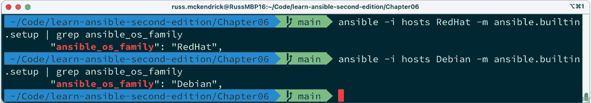
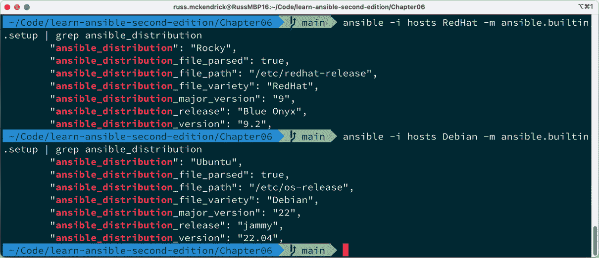
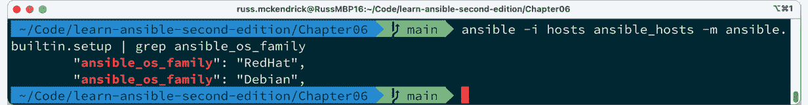
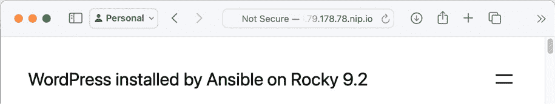

# 第六章：针对多个发行版

到目前为止，在之前的章节中，我们在运行剧本时一直针对的是单一操作系统——Ubuntu。

本章将探讨如何在相同的角色和剧本中使用多个 Linux 发行版。

我们将以 *第五章* 中创建的 WordPress 剧本和角色为基础，*部署 WordPress*，并进行以下操作：

+   发现我们两个目标操作系统之间的区别

+   查看并实现我们的 WordPress 角色，使它们能够在两个目标操作系统上运行

+   讨论并应用针对多个发行版的最佳实践

本章涵盖以下内容：

+   Debian 和 Red Hat

+   多发行版考虑

+   适应角色

+   运行剧本

# 技术要求

鉴于我们将启动两个不同的操作系统，我们将改变以往章节中的方法，而是在云服务提供商中启动一对虚拟机，而不是在本地机器上启动两台不同的虚拟机。

这么做的主要原因是 Multipass 只真正支持 Ubuntu 系统，因为它是由 Ubuntu 的创建者和维护者 Canonical 开发的，目的是为用户提供一种快速、简便和一致的方式，在多个主机平台上启动 Ubuntu 虚拟机。

由于我们将在 *第九章* 中讨论自动化云部署，*迁移到云端*，所以本章不会使用 Ansible 来部署云资源。

对于本章，我建议使用像 **DigitalOcean** ([`www.digitalocean.com/`](https://www.digitalocean.com/)) 或 **Linode** ([`www.linode.com/`](http://www.linode.com/)) 这样的云服务提供商，它们都支持本章将要介绍的操作系统，并且其虚拟机费用从每月约 5 美元起。

重要说明

本章不会介绍如何启动虚拟机；如果你正在跟随本书进行操作，请查看你所选择的云服务提供商的文档。此外，完整的工作代码可以在 GitHub 仓库中查看：[`github.com/PacktPublishing/Learn-Ansible-Second-Edition`](https://github.com/PacktPublishing/Learn-Ansible-Second-Edition)。

# Debian 和 Red Hat

这是 Linux 操作系统世界可能变得稍微混乱的地方。尽管我们启动了 Ubuntu `22.04` 和 Rocky Linux `9` 的虚拟机来运行我们的剧本，但我们将在剧本代码中引用 Debian 和 Red Hat。

为什么会这样呢？原因在于 Linux 发行版的血统。Ubuntu 是 Debian 操作系统的后代，继承了其包管理系统及许多其他特性。同样，Rocky Linux 是 Red Hat 的后代，旨在成为与 **Red Hat 企业版** **Linux** (**RHEL**) 完全兼容的发行版。

因此，当我们在剧本中提到 Debian 和 Red Hat 时，我们指的是我们的两个操作系统——Ubuntu 和 Rocky Linux——所基于的基本平台。

在实际操作中，剧本代码通常会检查底层的发行版类型，以决定如何执行特定任务。例如，在基于 Debian 的系统（如 Ubuntu）上安装软件包的命令，可能与在基于 Red Hat 的系统（如 Rocky Linux）上的命令不同。

基于 Debian 的系统使用 Debian 包管理系统，以`dpkg`作为核心工具，并且通常使用`apt`、`apt-get，或在某些情况下，两者都使用，以便更友好地进行用户交互。

基于 Red Hat 的系统采用 RPM 包管理系统，使用`rpm`作为核心工具，通常辅以`yum`或其后继者`dnf`，以便为包管理提供更友好的界面。

还有其他差异，例如 Debian 和 Red Hat 基于系统的目录结构和配置文件位置不同，这可能会影响我们在剧本角色中必须考虑的系统管理。

目前为止，最重要且最相关的差异是许可证问题。

Debian 以严格遵循自由软件原则而闻名。相比之下，基于 Red Hat 的系统可能会包含更多的专有或闭源软件，尤其是在 Red Hat 企业版 Linux 的商业企业发行版中。

2023 年 6 月，Red Hat 在修改其条款时达到了高潮，停止了 RHEL 源代码的公开发布，并限制了仅供客户访问。

这一变动影响了下游项目，这些项目依赖 RHEL 源代码创建兼容的发行版，例如 Rocky Linux。该变更意味着，只有受合同限制并禁止共享代码的客户才能访问 RHEL 源代码，这符合 GPL 许可证的条款，后者要求仅为二进制用户提供源代码，二进制用户实际上是付费客户。

截至目前，这一变化的后果仍在发酵，局势仍在平稳下来，尽管像 Rocky Linux 这样的发行版似乎已经找到合规的方式；有关更多信息，请参阅本章末尾的*进一步阅读*部分。

因此，回到我们的剧本，通过在代码中引用 Debian 和 Red Hat（或两者），我们可以创建更具适应性的角色，能够一致地处理不同的 Linux 发行版及其衍生版。

# 多发行版的考虑

查看在三个角色（`stack_install`、`stack_config`和`wordpress`）中使用的每个 Ansible 内置模块，我们正在使用一些在我们新引入的 Rocky Linux 环境中无法正常工作的模块。

让我们快速浏览每个模块，考虑在针对两个不同发行版时需要改变或考虑的事项。

## 堆栈安装角色

这个角色使用了以下内置模块：

+   `ansible.builtin.apt`

+   `ansible.builtin.apt_key`

+   `ansible.builtin.apt_repository`

我们使用这些模块来更新我们的操作系统，添加 NGINX 主线仓库，并安装我们的 WordPress 安装所需的所有软件包。

由于这些模块都涉及软件包管理，我们将无法重用这些任务，这意味着我们需要将角色分为两部分：一部分处理基于 Debian 的系统，另一部分处理基于 Red Hat 的系统。

此外，由于两个发行版之间软件包名称的微妙差异，我们将无法重用变量。

这意味着我们对这个角色的最佳方法是根据 Ansible 所针对的发行版使用两组不同的任务集。幸运的是，有内置的 Ansible 模块使得这种方法变得简单。在审查了剩余两个角色中的模块后，我们将在下一节中介绍它们。

## Stack Config 角色

与前一个角色稍有不同的是，这里我们不需要将任务分为两部分；大多数任务将在我们的两个 Linux 发行版上运行。

这意味着使用以下模块的任务不需要任何更改：

+   `ansible.builtin.group`: 创建组在两个发行版中都是相同的

+   `ansible.builtin.user`: 创建用户在两个发行版中都是相同的

+   `ansible.builtin.template`: 这仅将文件渲染并复制到目标主机

+   `ansible.builtin.file`: 这仅将文件复制到目标主机

+   `ansible.builtin.copy`: 这仅在目标主机上复制文件

+   `ansible.builtin.lineinfile`: 这仅在目标主机的文件中搜索文本，并在需要时更新它

+   `ansible.builtin.service`: 这在两个发行版上都受支持

+   `ansible.builtin.stat`: 仅检查主机文件系统上文件的存在

+   `ansible.builtin.mysql_user`: 由于它与数据库服务交互，因此与发行版无关

+   `ansible.builtin.mysql_db`: 与前一个任务一样，它与数据库服务交互

这个列表基本属实；但是，两个发行版之间的文件路径将会有所改变。

此外，正如我们在 *第五章* 中已经提到的，即 *部署 WordPress*，当我们查看 Stack Config 角色的变量时，我们正在引用包含我们想要加载到 playbook 运行中的变量的文件，因此我们需要加载额外一组变量用于分发以及标准变量。

我们将需要执行一些额外的任务来添加第二个发行版。一些 Red Hat 发行版默认启用防火墙和启用 SELinux，因此我们需要在最后执行一些仅适用于 Red Hat 的任务。

**SELinux**，或者全称为**安全增强型 Linux**，是 Linux 内核的安全模块，提供支持访问控制安全策略的机制。

然而，我们可以将这些任务保留在 `main.yml` 文件中，而不是通过调用任务时使用条件来加载不同的任务集。

## WordPress 角色

由于前两个角色已经安装并配置了我们运行 WordPress 安装所需的一切，因此这个角色完全与发行版无关，我们不需要对角色中的任务做任何更改。如果你还记得，在*第五章*，*部署 WordPress*时，我们运行配置 WordPress 的命令时，设置了以下事实：

```
- name: "Set a fact for the wordpress domain"
  ansible.builtin.set_fact:
    wordpress_domain: "{{ ansible_ssh_host }}"
    os_family: "{{ ansible_distribution }} {{ ansible_distribution_version }}"
```

这使用了 Ansible 在首次连接主机时收集的事实来确定我们连接的分发版和版本；我们将在本节中深入探讨 Stack 安装和配置角色中列出的变更。

# 调整角色

那么，我们如何将逻辑构建到角色中，以便只在不同操作系统上执行某些部分呢？正如我们所知，软件包名称会不同。我们如何为每个操作系统定义不同的变量集？

## 操作系统系列

我们在*第一章*中看过 `ansible.builtin.setup` 模块，*安装和运行 Ansible*；该模块收集了关于目标主机的事实。

其中一个事实是 `ansible_os_family`；它告诉我们正在运行的操作系统类型。

为了演示这一点，我启动了两台主机，一台运行 Ubuntu `22.04`，另一台运行 Rocky Linux `9` 作为其操作系统。我创建了如下所示的清单文件：

```
RedHat ansible_host=178.79.178.78.nip.io
Debian ansible_host=176.58.114.60.nip.io
[ansible_hosts]
RedHat
Debian
[ansible_hosts:vars]
ansible_connection=ssh
ansible_user=root
ansible_private_key_file=~/.ssh/id_rsa
host_key_checking=False
```

重要提示

上述清单文件仅用于说明目的；如果你在跟随本教程，你需要更新它，以考虑主机 IP 地址、用户名和私钥文件的位置。

主机已启动并运行后，我们可以使用以下命令单独对每台主机进行操作：

```
$ ansible -i hosts RedHat -m ansible.builtin.setup | grep ansible_os_family
$ ansible -i hosts Debian -m ansible.builtin.setup | grep ansible_os_family
```

运行这两个命令应该会显示如下所示的终端输出：



图 6.1 – 检查 ansible_os_family 的值

正如你所看到的，每个主机都正确返回了操作系统系列。

我们可以进一步更新我们的命令，如下所示：

```
$ ansible -i hosts RedHat -m ansible.builtin.setup | grep ansible_distribution
$ ansible -i hosts Debian -m ansible.builtin.setup | grep ansible_distribution
```

这将产生以下输出：



图 6.2 – 检查 ansible_distribution 的值

如你所见，这提供了关于操作系统本身的更多详细信息，而不仅仅是 Linux 的版本；它是基于 `RedHat` 或 `Debian`。

最后，我们运行以下命令：

```
$ ansible -i hosts ansible_hosts -m ansible.builtin.setup | grep ansible_os_family
```

这将同时在同一个 Ansible 运行中针对两台主机，并返回如下所示的终端输出：



图 6.3 – 在单次运行中检查 ansible_distribution 的值

现在，我们可以识别每台主机上正在使用的操作系统，可以开始调整角色，以考虑我们在本章前一部分讨论的更改。

## Stack Install 角色

我们将要查看的角色的第一部分是`roles/stack_install/tasks/main.yml`文件的内容。角色的先前版本包含了所有的任务，用于为我们的 Ubuntu 服务器安装仓库和包；所有这些任务应该被移动到名为`roles/stack_install/tasks/Debian.yml`的文件中，并创建一个名为`roles/stack_install/tasks/RedHat.yml`的新文件；最后，我们应该更新`roles/stack_install/tasks/main.yml`，使其包含以下内容。

这里是为我们目标操作系统加载变量文件的三个任务：

```
- name: "Include the operating system specific variables"
  ansible.builtin.include_vars: "{{ ansible_os_family }}.yml"
```

如你所见，这使用了`ansible.builtin.include_vars`模块，从 roles 文件夹内的变量路径加载变量，该路径是`roles/stack_install/vars/`。

然后，它加载一个名为`RedHat.yml`或`Debian.yml`的文件；这两个文件名是通过任务中的`{{ ansible_os_family }}`变量动态生成的，这意味着将加载与目标操作系统相关的变量。

如果你查看 GitHub 上的仓库，你会注意到，尽管差异微妙，但在`system_packages`、`extra_packages`和`stack_packages`包列表中列出的包是有差别的。

下一个任务在调用`ansible.builtin.import_tasks`模块时使用了`when`条件，首先针对基于 Debian 的系统：

```
- name: "Install the stack on Debian based systems"
  ansible.builtin.import_tasks: "Debian.yml"
  when: ansible_os_family == 'Debian'
```

对于我们来说，这意味着当 Ansible 剧本针对基于 Debian 的主机时，它将加载来自`roles/stack_install/tasks/Debian.yml`的任务，这些任务与我们在*第五章*中详细讨论的内容相同，*部署 WordPress*，并将它们应用到主机上。

下一个任务执行相同的功能，但这次是针对基于 Red Hat 的主机，使用的是`roles/stack_install/tasks/RedHat.yml`文件中列出的任务：

```
- name: "Install the stack on RedHat based systems"
  ansible.builtin.import_tasks: "RedHat.yml"
  when: ansible_os_family == 'RedHat'
```

`roles/stack_install/tasks/RedHat.yml`文件包含三项任务，这些任务与`Debian.yml`中的任务几乎相同。

我们通过运行更新所有已安装包的任务来开始角色：

```
- name: "Update all of the installed packages"
  ansible.builtin.dnf:
    name: "*"
    state: "latest"
    update_cache: true
```

如你所见，这使用了`ansible.builtin.dnf`模块，而不是`ansible.builtin.apt`模块。

接下来，我们有一个任务来安装 NGINX 主线仓库：

```
- name: "Add the NGINX mainline repo"
  ansible.builtin.yum_repository:
    name: "{{ nginx_repo.name }}"
    description: "{{ nginx_repo.description }}"
    baseurl: "{{ nginx_repo.baseurl }}"
    gpgcheck: "{{ nginx_repo.gpgcheck }}"
    enabled: "{{ nginx_repo.enabled }}"
```

尽管这使用了`ansible.builtin.yum_repository`模块，但一旦添加了新的仓库，DNF 将会自动识别它。这也是我们需要运行的唯一任务来添加仓库，并且在 Debian 系统上添加仓库与在 Red Hat 系统上添加仓库是非常不同的。

针对基于 Red Hat 的系统的最终任务是安装所有包，包括我们刚刚启用的主线仓库中的 NGINX 包，再次通过调用`ansible.builtin.dnf`模块：

```
- name: "Update cache and install the stack packages"
  ansible.builtin.dnf:
    state: "present"
    update_cache: true
    pkg: "{{ system_packages + extra_packages + stack_packages }}"
```

如你所见，通过对任务调用逻辑进行一些调整，将角色更新为支持 Debian 和 Red Hat 发行版是相对轻松的。

对于我们接下来需要更改的角色，即堆栈配置角色，我们将采取一种略有不同的方法来考虑不同操作系统发行版。

## 堆栈配置角色

除了开始时的一个任务和结束时的几个任务外，这个角色的主体部分保持不变。

在`roles/stack_config/default/main.yml`文件中，默认变量文件有了一些更改；首先，添加了以下变量：

```
selinux:
  http_permissive: true
firewall_comands:
  - "firewall-cmd --zone=public --add-port=80/tcp --permanent"
  - "firewall-cmd --zone=public --add-port=80/tcp"
```

正如你从它们的名字中猜到的，这些涉及到 SELinux 和防火墙。

下一个更改是将`mysql_socket_path`、`php_fpm_path`、`php_ini_path`和`php_service_name`变量移动到`roles/stack_config/vars/Debian.yml`和`roles/stack_config/vars/RedHat.yml`中的发行版特定文件中。

正如我们之前讨论的，两个发行版之间的一个关键区别是我们在堆栈安装角色中安装的核心文件和服务配置文件的路径。

在`roles/stack_config/vars/Debian.yml`文件中，我们有以下内容：

```
mysql_socket_path: "/var/run/mysqld/mysqld.sock"
php_fpm_path: "/etc/php/8.1/fpm/pool.d/www.conf"
php_ini_path: "/etc/php/8.1/fpm/php.ini"
php_service_name: "php8.1-fpm"
```

然而，对于`roles/stack_config/vars/RedHat.yml`文件，我们需要定义以下内容：

```
mysql_socket_path: "/var/lib/mysql/mysql.sock"
php_fpm_path: "/etc/php-fpm.d/www.conf"
php_ini_path: /etc/php.ini
php_service_name: "php-fpm"
```

如你所见，乍一看，它们看起来有点相似，但路径和文件名是不同的。

这些文件由一个任务调用，这与我们在堆栈安装角色开始时使用的相同：

```
- name: Include the operating system specific variables
  ansible.builtin.include_vars: "{{ ansible_os_family }}.yml"
```

从这里开始，我们在*第五章*中涵盖的所有原始任务都被调用并执行，最后是删除测试 MySQL 数据库的任务。

从这里开始，在该角色中，我们有任务来考虑配置基于 Red Hat 的主机所需的额外步骤，首先是配置 SELinux；对于我们的角色，我们需要启用允许 Web 服务器运行的策略，而在许多 Red Hat 发行版中，默认情况下会阻止该策略。

执行此任务的代码如下：

```
- name: "Set the selinux allowing httpd_t to be permissive is required"
  community.general.selinux_permissive:
    name: httpd_t
    permissive: true
  when: selinux.http_permissive and ansible_os_family == 'RedHat'
```

如你所见，这里的`when`条件确保任务只有在`selinux.http_permissive`变量设置为`true`且`ansible_os_family`等于`RedHat`时才会执行。

虽然我们的 Debian 系统将满足`selinux.http_permissive`条件，但在这些主机上该任务将被跳过，因为它不满足第二个条件。

最后，我们有配置`firewalld`服务的任务，这是大多数现代 Red Hat 发行版上的默认防火墙。

重要提示

尽管我们在这一部分使用了`firewall-cmd`，但也有一个 Ansible 模块支持 firewalld 服务，名为`ansible.posix.firewalld`。由于这是我们在标题中唯一面向 Red Hat 操作系统的实例，我们改用了`ansible.builtin.command`，以展示如何根据输出命令满足更复杂的条件。

就像我们在其他章节中包含的某些角色一样，配置防火墙是我们只需要执行一次的任务。我们要做的第一件事是检查 `~/firewall-configured` 文件是否存在，并记录结果：

```
- name: "Check to see if the ~/firewall-configured file exists"
  ansible.builtin.stat:
    path: "~/firewall-configured"
  register: firewall_configured
```

接下来，我们需要检查 `firewalld` 是否在运行，但只有在 RedHat 发行版上才需要这样做。为此，我们需要运行 `firewall-cmd --state` shell 命令，并将输出结果注册到 `fireweall_status` 变量中：

```
- name: "Check if firewalld is running"
  ansible.builtin.command: firewall-cmd --state
  register: fireweall_status
  when: ansible_os_family == 'RedHat'
```

现在，由于剩余任务也可能在 Debian 系统上执行，因此我们需要考虑这一点，因为我们现在有一个包含我们运行命令的 `stdout` 的变量 `fireweall_status`，它在 Debian 系统上不会存在，导致错误并停止 playbook 执行：

```
- name: "Set a fact so the playbook can continue if running on a Debian based system"
  ansible.builtin.set_fact:
    fireweall_status:
      stdout: notrunning
  when: ansible_os_family == 'Debian'
```

正如前面的任务所示，如果 `ansible_os_family` 是 `Debian`，我们将 `fireweall_status.stdout` 变量设置为 `notrunning`。

现在我们已经拥有了做出是否运行配置防火墙命令的决策所需的所有信息，以下条件需要满足：

+   `firewall-cmd --state` 命令返回 `running`

+   操作系统是 `RedHat`

+   `~/firewall-configured` 文件不存在

如果满足以下任务中定义的三个条件，则会执行配置防火墙、开放端口`80`并允许流量的命令：

```
- name: "Run the firewall-cmd commands if the firewall-cmd --state command returns running"
  ansible.builtin.command: "{{ item }}"
  with_items: "{{ firewall_comands }}"
  when: fireweall_status.stdout == "running" and ansible_os_family == 'RedHat' and not firewall_configured.stat.exists
```

最后一个任务创建 `~/firewall-configured` 文件，以确保命令不会再次执行：

```
- name: "Create the ~/firewall-configured file"
  ansible.builtin.file:
    path: ~/firewall-configured
    state: touch
    mode: "0644"
  when: not firewall_configured.stat.exists
```

这在两个发行版上都执行，因为无论在 Debian 系统上如何设置，我们都不希望运行命令；而在 Red Hat 系统上，这将意味着 playbook 的后续执行将无法满足执行防火墙服务配置命令的三个条件。

## WordPress 角色

如前所述，我们不需要对这个角色进行任何更改。

# 运行 playbook

我们的 `site.yml` 文件没有任何更改，这意味着我们需要运行以下命令来运行 playbook：

```
$ ansible-playbook -i hosts site.yml
```

输出太多，无法一一涵盖，但我会包括一些 playbook 执行的亮点，从收集事实开始：

```
TASK [Gathering Facts] ************************************
ok: [Debian]
ok: [RedHat]
```

现在 Ansible 知道了我们的两个主机，它开始执行任务；以下是来自 Stack Install 角色的更新任务：

```
TASK [roles/stack_install : update apt-cache and upgrade packages] *************
skipping: [RedHat]
changed: [Debian]
```

如你所见，这个是 `apt`，而 `dnf` 的形式如下：

```
TASK [roles/stack_install : update all of the installed packages] **************
skipping: [Debian]
changed: [RedHat]
```

现在，进入 Stack Config 角色，这是在两个发行版上运行任务的地方：

```
TASK [roles/stack_config : add the wordpress group] *******
changed: [RedHat]
changed: [Debian]
```

要仅更新 Red Hat 发行版上的防火墙，我们需要执行以下操作：

```
TASK [roles/stack_config : run the firewall-cmd commands if the firewall-cmd --state command returns running] ***
skipping: [Debian] => (item=firewall-cmd --zone=public --add-port=80/tcp --permanent)
skipping: [Debian] => (item=firewall-cmd --zone=public --add-port=80/tcp)
skipping: [Debian]
changed: [RedHat] => (item=firewall-cmd --zone=public --add-port=80/tcp --permanent)
changed: [RedHat] => (item=firewall-cmd --zone=public –
-add-port=80/tcp)
```

最后，我们完成了 playbook 的运行：

```
PLAY RECAP ************************************************
Debian                     : ok=44   changed=29   unreachable=0    failed=0    skipped=7    rescued=0    ignored=2
RedHat                     : ok=45   changed=34   unreachable=0    failed=0    skipped=6    rescued=0    ignored=2
```

这意味着我现在应该有两个 WordPress 安装：


图 6.4 – WordPress 在 Ubuntu 22.04 上运行



图 6.5 – WordPress 在 Rocky Linux 9.2 上运行

虽然前面的屏幕并不是最令人兴奋的网站，但正如你所看到的，我们已经在两种不同的操作系统上成功运行 WordPress。

在这一点上，如果你一直在跟着做，不要忘记删除任何你已部署用来运行 playbooks 的资源。

# 摘要

在本章中，我们修改了我们在*第五章*，*部署 WordPress*中编写的 WordPress 安装 playbook，以便针对多个操作系统进行目标定位。我们通过使用 Ansible 内置的审计模块来确定 playbook 正在运行的操作系统，并且仅运行适用于这两个目标发行版的任务来实现这一点。

尽管我们所采用的方法针对多个 Linux 发行版是一种应用，但我相信你已经有了一些想法，可以在你的项目中使用我们使用的一些逻辑，比如基于虚拟机主机上的角色引导不同软件等。

此外，通过这种方法将你的角色发布到 Ansible Galaxy 时也是有益的，正如在*第二章*，*探索 Ansible Galaxy*中所讨论的，通过使操作系统无关。

到目前为止，你可能已经注意到我们一直在针对 Linux 虚拟机进行目标定位；在下一章中，我们将探讨 Ansible 对基于 Windows 的操作系统的支持。

# 进一步阅读

+   **Red Hat Enterprise Linux**: [`www.redhat.com/en/technologies/linux-platforms/enterprise-linux`](https://www.redhat.com/en/technologies/linux-platforms/enterprise-linux)

+   **Debian**: [`www.debian.org/`](https://www.debian.org/)

+   **Ubuntu**: [`ubuntu.com/`](https://ubuntu.com/)

+   **Rocky Linux**: [`rockylinux.org/`](https://rockylinux.org/)

+   **The Register**，*Red Hat 打击 RHEL 分支的重大打击*：[`www.theregister.com/2023/06/23/red_hat_centos_move/`](https://www.theregister.com/2023/06/23/red_hat_centos_move/)

+   **The Ansible Posix Firewalld 模块**: [`docs.ansible.com/ansible/latest/collections/ansible/posix/firewalld_module.html`](https://docs.ansible.com/ansible/latest/collections/ansible/posix/firewalld_module.html)
