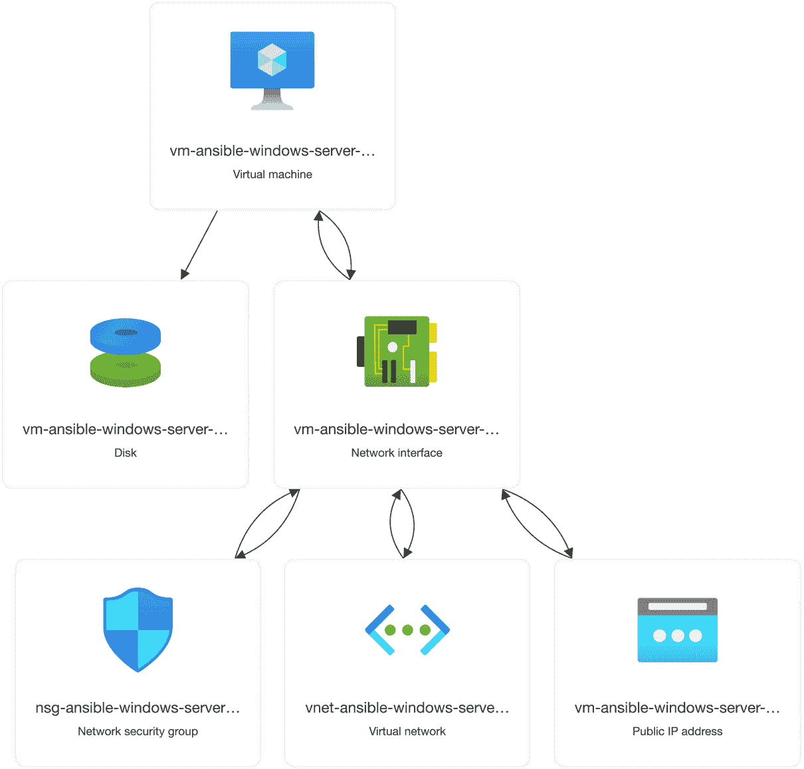
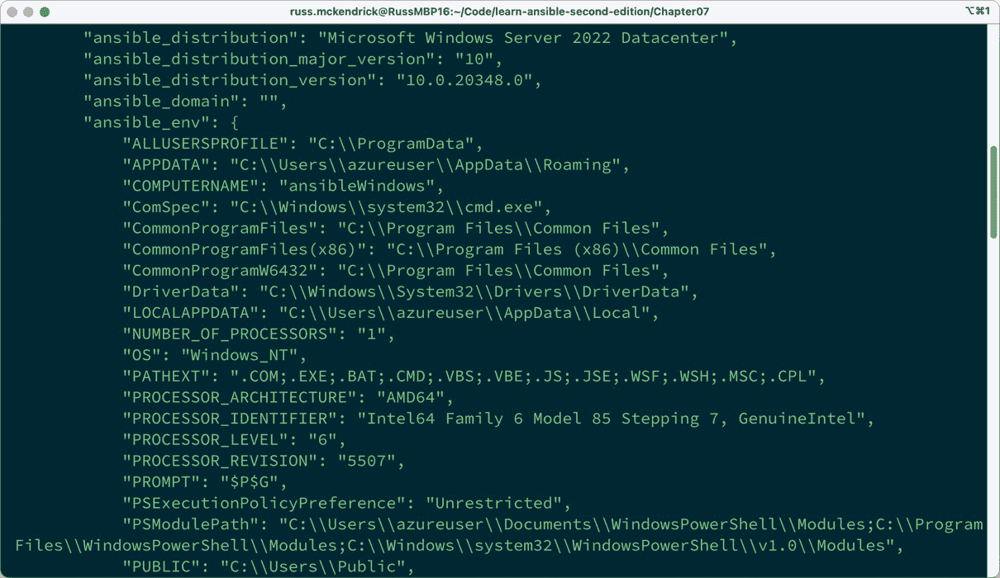
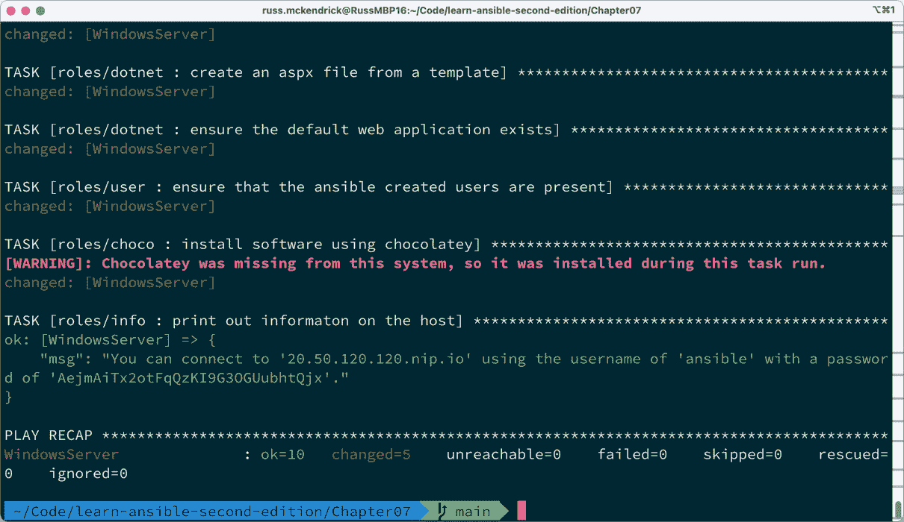
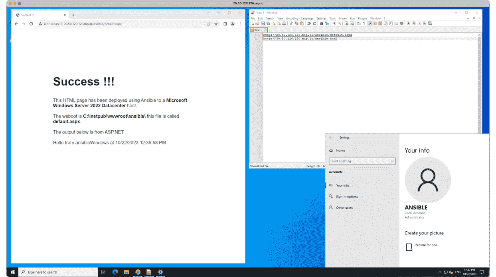

# 7

# Ansible Windows 模块

在本章中，我们将探讨内置的 Ansible 模块集，这些模块支持并与基于 Windows 的服务器进行交互；对于几乎完全依赖 macOS 和 Linux 背景的人来说，使用一个在 Windows 上不受原生支持的工具来管理 Windows 似乎有些奇怪。

在本章结束时，我相信您会同意，通过查看可用的选项，Ansible 的开发人员已经使得使用 Playbook 管理 Windows Server 工作负载尽可能简单和熟悉。

在本章中，我们将学习如何执行以下操作：

+   在 Microsoft Azure 中启动 Windows 服务器实例

+   启用 Windows 中的功能

+   创建用户

+   使用 Chocolatey 安装第三方软件包

本章涵盖以下主题：

+   在 Azure 中启动 Windows 服务器

+   Ansible 准备工作

+   Windows Playbook 角色

+   运行 Playbook

# 技术要求

与其在本地运行完整的 Windows Server 2022 虚拟机（**VM**），本章中我们将介绍如何安全地启动和配置托管在 Microsoft Azure 中的 Windows Server 2022 VM。如果您正在跟随学习，请确保已激活 Microsoft Azure 订阅并安装了 Azure **命令行界面**（**CLI**）。

有关如何安装和配置 Azure CLI 的详细信息，请参阅文档：[`learn.microsoft.com/en-us/cli/azure/install-azure-cli/`](https://learn.microsoft.com/en-us/cli/azure/install-azure-cli/)。如果您在 Windows 主机上进行学习，请在您的 Windows Subsystem for Linux 安装中安装 Azure CLI，同时也安装 Ansible。

# 在 Azure 中启动 Windows 服务器

我们将不会像在 *第九章* 中所做的那样，使用 Ansible 部署 Azure 资源；相反，我们将使用 Azure CLI 来启动我们的 VM。

注意

由于本章中的某些命令会很长，我会用反斜杠来分隔它们。在 Linux 命令行中，反斜杠（`\`）后跟换行符表示命令的延续。这使您可以将单个命令分割成多行，以提高可读性。

首先切换到您所检出的存储库的 `Chapter07` 文件夹，并运行以下命令：

```
$ MYIP=$(curl https://api.ipify.org 2>/dev/null)
$ VMPASSWORD=$(openssl rand -base64 24)
$ echo $VMPASSWORD > VMPASSWORD
```

前两个命令在您的命令行上设置了两个变量；第一个使用 `$MYIP` 变量与当前网络会话的公共 IP 地址。

第二个命令使用 `openssl` 命令生成一个随机密码，并将其分配给名为 `$VMPASSWORD` 的变量。

第三个命令将 `$VMPASSWORD` 的内容复制到一个名为 `VMPASSWORD` 的文件中；此命令必须在与主机清单文件相同的文件夹中执行，因为它将在我们稍后将讨论的主机清单文件中调用。

注意

我将遵循 Azure 云采纳框架的资源命名建议，并在英国南部区域启动资源。

既然我们知道了 IP 地址并且有了密码，我们就可以开始使用 Azure CLI 启动资源。首先，我们需要确保已登录，可以运行以下命令：

```
$ az login
```

登录后，我们可以通过执行以下命令来创建一个**Azure 资源组**：

```
$ az group create \
    --name rg-ansible-windows-server-uks \
    --location uksouth
```

Azure 资源组是我们将部署 Azure 资源的逻辑容器，首先将部署一个**Azure 虚拟网络**。

以下命令将创建一个地址空间为`10.0.0.0/24`、单一子网为`10.0.0.0/27`的 Azure 虚拟网络；我们将在这里启动我们的 Windows Server：

```
$ az network vnet create \
    --resource-group rg-ansible-windows-server-uks \
    --name vnet-ansible-windows-server-uks \
    --address-prefix 10.0.0.0/24 \
    --subnet-name sub-vms \
    --subnet-prefix 10.0.0.0/27
```

现在，我们需要创建一个**网络安全组**，并在虚拟机启动后将其分配给网络接口。

我们需要这样做，因为我们将为虚拟机分配一个公共 IP 地址，我们不希望将三个管理端口直接暴露到互联网；相反，我们希望将它们限制为仅对我们开放：

```
$ az network nsg create \
    --resource-group rg-ansible-windows-server-uks \
    --name nsg-ansible-windows-server-uks
```

我们现在已经创建了一个空的网络安全组。接下来，我们添加一些规则，从允许所有人访问端口`80`以允许 HTTP 流量的规则开始：

```
$ az network nsg rule create \
   --resource-group rg-ansible-windows-server-uks \
   --nsg-name nsg-ansible-windows-server-uks \
   --name allowHTTP \
   --protocol tcp \
   --priority 100 \
   --destination-port-range 80 \
   --access allow
```

接下来，我们有一个规则，打开端口`3389`，**远程桌面**使用该端口让你与主机建立会话；我们只希望该端口对我们开放，所以这里的命令如下：

```
$ az network nsg rule create \
    --resource-group rg-ansible-windows-server-uks \
    --nsg-name nsg-ansible-windows-server-uks \
    --name allowRDP \
    --protocol tcp \
    --priority 1000 \
    --destination-port-range 3389 \
    --source-address-prefix $MYIP/32 \
    --access allow
```

请注意，我们正在传递在启动资源时注册的`$MYIP`变量。这将传递你的 IP 地址，如你所见，我们随后在末尾附加了`/32`；这是**无类域间路由**（**CIDR**）表示法，表示单个 IP 地址。

现在我们已经有了远程桌面规则，这也是我们作为终端用户连接到虚拟机的方式，我们需要打开**Windows 远程管理**（**WinRM**）端口，这是 Ansible 将连接到机器的方式：

```
$ az network nsg rule create \
    --resource-group rg-ansible-windows-server-uks \
    --nsg-name nsg-ansible-windows-server-uks \
    --name allowWinRM \
    --protocol tcp \
    --priority 1050 \
    --destination-port-range 5985-5986 \
    --source-address-prefix $MYIP/32 \
    --access allow
```

我们需要运行的下一个命令是启动虚拟机（VM）本身并配置它，以便使用我们刚刚启动的核心网络组件：

```
$ az vm create \
     --resource-group rg-ansible-windows-server-uks \
     --name vm-ansible-windows-server-uks \
     --computer-name ansibleWindows \
     --image Win2022Datacenter \
     --admin-username azureuser \
     --admin-password $VMPASSWORD \
     --vnet-name vnet-ansible-windows-server-uks \
     --subnet sub-vms \
     --nsg nsg-ansible-windows-server-uks \
     --public-ip-sku Standard \
     --public-ip-address-allocation static
```

如你所见，我们正在指示 Azure CLI 启动一个虚拟机，使用`rg-ansible-windows-server-uks`资源组，并使用我们通过之前的命令启动的所有网络资源。

你可能会想，太好了，接下来可以继续看 Ansible 了。然而，在使用 Ansible 连接到虚拟机之前，我们还需要运行一个命令——原因是尽管我们已经有了 Windows 2022 服务器，但默认情况下 WinRM 协议并未启用。

启用此功能的命令如下：

```
$ az vm extension set \
    --resource-group rg-ansible-windows-server-uks \
    --vm-name vm-ansible-windows-server-uks \
    --name CustomScriptExtension \
    --publisher Microsoft.Compute \
    --version 1.10 \
    --settings "{'fileUrls': ['https://raw.githubusercontent.com/PacktPublishing/Learn-Ansible-Second-Edition/main/Scripts/ConfigureRemotingForAnsible.ps1'],'commandToExecute': 'powershell -ExecutionPolicy Unrestricted -File ConfigureRemotingForAnsible.ps1'}"
```

这会在我们刚刚部署的 Azure 虚拟机上启用一个虚拟机扩展。虚拟机扩展有多种类型；我们使用的是**自定义脚本扩展**。此扩展从传递给它的 URL 下载脚本，然后执行命令；在我们的案例中，我们正在从与本书一起提供的 GitHub 仓库下载配置 WinRM 的脚本。

你可以看到将从以下 URL 下载的脚本：[`raw.githubusercontent.com/PacktPublishing/Learn-Ansible-Second-Edition/main/Scripts/ConfigureRemotingForAnsible.ps1`](https://raw.githubusercontent.com/PacktPublishing/Learn-Ansible-Second-Edition/main/Scripts/ConfigureRemotingForAnsible.ps1)

脚本下载后运行的命令如下：

```
$ powershell -ExecutionPolicy Unrestricted -File ConfigureRemotingForAnsible.ps1
```

虚拟机扩展执行了上述命令，因此我们不需要直接运行它。

在 Azure 门户中，资源组的资源可视化工具应该显示如下所示的概览：



图 7.1 – 在 Azure 资源可视化工具中查看我们的资源

完成后，我们的 Windows Server 虚拟机已经准备好接受 Ansible 的操作。

# Ansible 准备工作

如前一节所述，Ansible 将使用 WinRM 与我们的 Windows 主机进行交互。

信息

WinRM 提供了一种类似**简单对象访问协议**（**SOAP**）的协议，叫做**WS-Management**。与提供交互式 Shell 来管理主机的**安全外壳**（**SSH**）不同，WinRM 接受已执行的脚本，结果会返回给你。

Ansible 要求我们安装一些 Python 模块，以便它能够使用该协议；这些模块需要单独安装，因为它们通常不会与 Ansible 一起安装。

如果你使用的是 Ubuntu，运行以下命令来安装该模块：

```
$ sudo -H pip install pywinrm
```

在 macOS 上，运行以下命令：

```
$ pip install pywinrm
```

安装完成后，我们需要更新环境文件，指示 Ansible 使用 WinRM 协议，而不是 SSH。

我们更新后的`hosts`文件如下所示，它是来自附带仓库中`Chapter07`文件夹的`hosts.example`文件的副本。如果你在跟随练习，你需要更新你的文件，将 IP 地址更改为与你的 Azure 虚拟机匹配，一旦虚拟机启动：

```
WindowsServer ansible_host=123.123.123.123.nip.io
[ansible_hosts]
WindowsServer
[ansible_hosts:vars]
ansible_connection=winrm
ansible_user="azureuser"
ansible_password="{{ lookup('ansible.builtin.file', 'VMPASSWORD') }}"
ansible_winrm_server_cert_validation=ignore
```

文件的开始部分与我们迄今为止所熟悉的类似，包含了主机的名称和虚拟机的可解析主机名，再次使用了**Nip.io**服务（[`nip.io/`](https://nip.io/)）。

接下来，我们将命名的主机放入`ansible_hosts`组中，然后为该组定义一系列设置。

这些设置中的第一个指示 Ansible 通过将`winrm`设置为`ansible_connection`键的值来使用 WinRM。

接下来，我们设置 `ansible_user` 键；该值为 `azureuser`，我们在启动 Azure 虚拟机时定义的值；同时还设置了 `ansible_password` 键。

如果你还记得，在本章开始时，我们运行了以下命令：

```
$ echo $VMPASSWORD > VMPASSWORD
```

这将我们生成的随机密码，即 `$VMPASSWORD`，放入一个名为 `VMPASSWORD` 的文件中；这意味着当我们定义 `ansible_password` 键时，可以使用查找值，使用 `{{ lookup('ansible.builtin.file', 'VMPASSWORD') }}` 来读取 `VMPASSWORD` 文件的内容，而无需将密码硬编码到我们的环境文件中。

最后，我们告诉 Ansible 忽略任何证书错误，将 `ansible_winrm_server_cert_validation` 键设置为 `false`；我们需要这样做，因为 WinRM 已配置为使用自签名证书，这会导致证书错误，因为我们的本地机器不知道信任该证书。

现在我们已经启动了 Windows 并配置了 Ansible，可以开始与其交互了。

## ping 模块

并不是所有 Ansible 模块都能与 Windows 主机配合使用，`ansible.builtin.ping` 就是其中之一。

如果你运行以下命令：

```
$ ansible WindowsServer -i hosts -m ansible.builtin.ping
```

然后你会看到一个详细的错误，包含以下警告：

```
[WARNING]: No python interpreters found for host WindowsServer (tried ['python3.11', 'python3.10',
'python3.9', 'python3.8', 'python3.7', 'python3.6', 'python3.5', '/usr/bin/python3',
'/usr/libexec/platform-python', 'python2.7', '/usr/bin/python', 'python'])
```

幸运的是，Windows 提供了一个名为 `ansible.windows.win_ping` 的模块，所以让我们更新命令以运行这个模块：

```
$ ansible WindowsServer -i hosts -m ansible.windows.win_ping
```

这将返回你期望接收到的 ping 结果：

```
WindowsServer | SUCCESS => {
    "changed": false,
    "ping": "pong"
}
```

接下来我们将查看的模块不需要做任何更改，就像我们在 Linux 主机上运行时一样。

## setup 模块

如之前所述，我们需要运行该模块并定位到我们的主机，因此命令如下：

```
$ ansible WindowsServer -i hosts -m ansible.builtin.setup
```

这将返回主机的信息，就像在对我们的 Linux 主机执行相同模块时一样，以下截图中可以看到部分输出：



图 7.2 – 来自 setup 模块的一些输出

这是为数不多的可以同时在 Windows 和 Linux 主机上运行的模块之一。

现在我们已确认主机可以访问，让我们看看需要在 playbook 中做出的更改。

# Windows Playbook 角色

整个 playbook 可以在与本书一起提供的存储库中的 `Chapter 07` 文件夹中找到，因此我将不再在本章中介绍如何创建角色，因为我们在前几章已经详细讲解过了。

## 启用 Windows 功能

两个角色涉及如何启用功能；第一个角色，名为 `iis`，在我们的 Windows Server 上启用 **Internet Information Services** (**IIS**)。

信息

IIS 是 Windows Server 默认随附的 Web 服务器，支持以下协议：HTTP、HTTPS 和 HTTP/2，以及 FTP、FTPS、SMTP 和 NNTP。它于 1995 年作为 Windows NT 的一部分首次发布。

在 `roles/iis/defaults/main.yml` 中有一些默认变量；这些定义了需要复制到服务器上的位置，并包括我们将复制到主机的 HTML 文件内容：

```
document_root: 'C:\inetpub\wwwroot\'
html_file: "ansible.html"
html_heading: "Success !!!"
html_body: |
  This HTML page has been deployed using Ansible to a <b>{{ ansible_distribution }}</b> host.<br><br>
  The weboot is <b>{{ document_root }}</b> this file is called <b>{{ html_file }}</b>.<br>
```

然后在 `roles/iis/tasks/main.yml` 中有两个任务。第一个任务是 *魔法发生的地方*：

```
- name: "Enable IIS"
  ansible.windows.win_feature:
    name:
      - "Web-Server"
      - "Web-Common-Http"
    state: "present"
```

我说 *魔法发生的地方* 是因为作为一名 Linux 系统管理员，我很少接触 Windows 主机。

尽管如此，正如您从前面的任务中看到的那样，Ansible 给了我们一个类似 Linux 的体验，这意味着我不需要卷起袖子过多地深入 Windows 的内部。

该任务使用 `ansible.windows.win_feature` 模块来启用 `Web-Server` 和 `Web-Common-Http` 功能；由于我们坚持使用默认的开箱即用设置，因此除了将一个 HTML 文件复制到文档根目录之外，不需要进行任何额外的配置：

```
- name: "Create an html file from a template"
  ansible.windows.win_template:
    src: "index.html.j2"
    dest: "{{ document_root }}{{ html_file }}"
```

如您所见，我们正在使用一个 Jinja2 模板文件，其中的简化版本如下所示：

```
<!--{{ ansible_managed }}-->
<title>{{ html_heading }}</title>
<article>
    <h1>{{ html_heading }}</h1>
    <div>
        <p>{{ html_body }}</p>
    </div>
</article>
```

但是，我们并没有使用 `ansible.builtin.template`，而是使用了 `ansible.windows.win_template`，这是 Windows 模块版本，正如您已经猜到的那样。

假设我们使用的是 `ansible.builtin.template` 版本，我们将遇到与运行 `ansible.builtin.ping` 模块时相同的错误，并且会抱怨 Python 没有安装。

下一个角色扩展了 `iis` 文件并启用了 `.Net`；该角色名为 `dotnet`。

同样，`roles/dotnet/defaults/main.yml` 中也有一些默认变量：

```
aspx_document_root: 'C:\inetpub\wwwroot\ansible\'
aspx_file: "default.aspx"
aspx_heading: "Success !!!"
aspx_body: |
  This HTML page has been deployed using Ansible to a <b>{{ ansible_distribution }}</b> host.<br><br>
  The weboot is <b>{{ aspx_document_root }}</b> this file is called <b>{{ aspx_file }}</b>.<br><br>
  The output below is from ASP.NET<br><br>
  Hello from <%= Environment.MachineName %> at <%= DateTime.UtcNow %><br><br>
```

如您所见，这一次，正文中包含了一些内联代码。

然而，您可能还没有注意到我们在变量中定义路径时的微妙差异。对于我们的 Windows 工作负载的两个任务，路径变量已如下所示定义：

```
document_root: 'C:\inetpub\wwwroot\'
aspx_document_root: 'C:\inetpub\wwwroot\ansible\'
```

但是，如果我们查看在 *第五章*《部署 WordPress》中如何定义路径，就会发现有一个至关重要的区别：

```
wordpress_system:
    home: "/var/www/wordpress"
```

区别并不是我们使用了 `wordpress_system.home` 作为变量；它比这更微妙。

如果您注意到 Windows 工作负载的路径使用单引号，而 Linux 的路径使用双引号，给自己点个赞。

在 Ansible 中，包围字符串的单引号（`'`）被视为字面量，这样可以确保特殊字符不会被解释或展开，这使得它们非常适合 Windows 路径。

双引号（`"`）允许进行字符串插值，这意味着嵌入的 Jinja2 模板表达式或特殊字符将被展开。它们还支持转义序列，例如用于换行的`\n`，因为许多转义序列，如我们路径中的`\`，可能会导致问题。

如果我们需要使用双引号，因为我们需要传递某些需要展开的内容，那么您可以像这样使用双斜杠（`\\`）：

```
document_root: "C:\\inetpub\\wwwroot\\"
aspx_document_root: "C:\\inetpub\\wwwroot\\ansible\\"
```

然而，这可能会让路径的阅读变得混乱，所以我在示例中使用了单引号——现在回到角色。

在 `roles/dotnet/tasks/main.yml` 中的四个任务中，第一个任务启用了 `.Net`：

```
- name: "Enable .NET"
  ansible.windows.win_feature:
    name:
      - "Net-Framework-Features"
      - "Web-Asp-Net45"
      - "Web-Net-Ext45"
    state: "present"
  notify: "Restart IIS"
```

如果检测到任何更改，我们还通过处理程序触发 IIS 的重启；这使用了 `ansible.windows.win_service`：

```
- name: "Restart IIS"
  ansible.windows.win_service:
    name: "w3svc"
    state: "restarted"
```

下一个任务是如果文件夹不存在，则创建一个文件夹：

```
- name: "Create the folder for our asp.net app"
  ansible.windows.win_file:
    path: "{{ aspx_document_root }}"
    state: "directory"
```

再次调用了我们之前使用过的一个现有模块，这次是 `ansible.windows.win_file`。接下来，我们将文件复制到我们刚创建的文件夹：

```
- name: "Create an aspx file from a template"
  ansible.windows.win_template:
    src: "default.aspx.j2"
    dest: "{{ aspx_document_root }}{{ aspx_file }}"
```

角色中的最后一个任务配置 IIS，以便它知道我们现在正在运行一个应用程序：

```
- name: "Ensure the default web application exists"
  community.windows.win_iis_webapplication:
    name: "Default"
    state: "present"
    physical_path: "{{ aspx_document_root }}"
    application_pool: "DefaultAppPool"
    site: "Default Web Site"
```

在运行 playbook 之前，还有一些角色需要覆盖；让我们来看下一个角色。

## 创建用户

该角色为我们创建一个用户，以便我们能够连接到实例。可以在 `roles/user/defaults/main.yml` 中找到的默认设置如下：

```
ansible:
  username: "ansible"
  password: "{{ lookup('password', 'group_vars/generated_password chars=ascii_letters,digits length=30') }}"
  groups:
    - "Users"
    - "Administrators"
```

如你所见，在这里我们定义了一个名为 `ansible` 的用户，并设置了一个 30 个字符的随机 `password`，如果不存在，Ansible 会使用查找插件创建该密码。`ansible` 用户将是 `Users` 和 `Administrators` 组的成员。

在 `roles/user/tasks/main.yml` 中有一个任务，使用 `ansible.windows.win_user` 模块，任务如下所示：

```
- name: "Ensure that the ansible created users are present"
  ansible.windows.win_user:
    name: "{{ ansible.username }}"
    fullname: "{{ ansible.username | capitalize }}"
    password: "{{ ansible.password }}"
    state: "present"
    groups: "{{ ansible.groups }}"
```

和所有 Windows 模块一样，语法类似于 Linux 等效模块，因此你应该知道每个键的含义。如前一个任务所示，我们使用 Jinja2 转换将 `ansible.username` 变量的首字母大写。

## 使用 Chocolatey 安装应用程序

下一个角色叫做 `choco`，它使用 **Chocolatey** 在机器上安装一些软件。

信息

Chocolatey 是 Windows 对 macOS Homebrew 的回应——一个简化软件安装的包管理器。就像我们之前使用 Homebrew，Chocolatey 将典型的 Windows 安装封装成整洁的 PowerShell 命令，使其成为 Ansible 等自动化工具的完美搭档。

在 `roles/choco/defaults/main.yml` 中，我们有一个包含我们想要安装的软件包列表的变量：

```
apps:
  - "notepadplusplus.install"
  - "putty.install"
  - "googlechrome"
```

正如你可能已经猜到的，这是安装应用程序的任务：

```
- name: "Install software using chocolatey"
  chocolatey.chocolatey.win_chocolatey:
    name: "{{ apps }}"
    state: "present"
```

再次，该模块接受类似于我们之前使用的包管理模块 `ansible.builtin.apt` 和 `ansible.builtin.dnf` 的输入。这意味着，Ansible 在多个操作系统之间，甚至不仅仅是不同的 Linux 发行版之间，使用一致的逻辑来处理类似的任务。

## 信息角色

最终的角色叫做 info；它的唯一作用是在 playbook 执行完成后输出信息。该角色在 `roles/info/tasks/main.yml` 中定义了一个任务：

```
- name: "Print out information on the host"
  ansible.builtin.debug:
    msg: "You can connect to '{{ ansible_host }}' using the username of '{{ ansible.username }}' with a password of '{{ ansible.password }}'."
```

如你所见，这将提供我们所需的主机名，以创建远程桌面会话，同时确认我们应该使用的用户名和密码。

这就是我们在运行 playbook 时将调用的角色概览，现在我们可以开始执行了。

# 运行 Playbook

`site.yml` 在顶部缺少一些设置，因为我们正在针对 Windows 主机：

```
---
- name: "Install IIS, .NET, create user, install chocolatey and display info"
  hosts: "ansible_hosts"
  gather_facts: true
  vars_files:
    - "group_vars/common.yml"
  roles:
    - "iis"
    - "dotnet"
    - "user"
    - "choco"
    - "info"
```

如你所见，不需要设置 `become` 或 `become_method` 键，因为连接到主机后，我们不需要更改用户。

除此之外，文件的其余部分都符合预期，运行剧本的方式也是如此：

```
$ ansible-playbook -i hosts site.yml
```

由于后台有很多操作，运行时需要一点时间，你将会在第一次运行剧本时看到输出中的信息：



图 7.3 – 审查剧本输出

正如你从之前的输出中看到的，我使用的主机是 `20.50.120.120.nip.io`（这台主机早已终止，但如果你跟着操作，可以将其替换为你自己的主机）。

要查看我们上传的静态 HTML 和 `.Net` 页面，你可以访问[`20.50.120.120.nip.io/ansible.html`](http://20.50.120.120.nip.io/ansible.html)或[`20.50.120.120.nip.io/ansible/default.aspx`](http://20.50.120.120.nip.io/ansible/default.aspx)，记得更新主机以反映你自己的主机地址。

你还可以使用输出中给出的凭据打开远程桌面会话；下面的截图展示了我们创建的用户会话，并使用 **Google Chrome** 打开页面，旁边是 **Notepad++**，这两个应用程序都是我们通过剧本安装的：



图 7.4 – 远程桌面会话

完成后，你可以运行以下 Azure CLI 命令来终止我们创建的所有资源：

```
$ az group delete \
    --name rg-ansible-windows-server-uks
```

请再次检查确保所有内容已经按照预期被删除，以确保不会收到任何意外账单。

# 总结

如本章开始时提到的那样，在 Windows 上使用我们认为的传统 Linux 工具（如 Ansible）总是有点奇怪。然而，我相信你会同意，这种体验尽可能地像 Linux。

当我第一次开始实验 Windows 模块时，我很惊讶于我居然能够在 Azure 中启动一台 Windows Server 并部署一个简单的 Web 应用程序，而无需远程桌面连接到目标实例。

随着每次新版本的发布，Ansible 对基于 Windows 的主机支持越来越好，使得从剧本中管理混合工作负载变得更加轻松。

在下一章，我们将研究 Ansible 中可用的网络模块。

# 深入阅读

你可以在[`chocolatey.org/`](https://chocolatey.org/)上找到更多关于优秀的 Chocolatey 的信息。

# 第三部分：网络与云自动化

Ansible 的强大功能不仅限于管理服务器，它还可以自动化网络设备和云基础设施。在这里，我们将探索 Ansible 的网络模块，并讨论如何以编程方式与网络设备进行交互。接下来，我们将把注意力转向云计算，你将了解如何在流行的云平台如 Microsoft Azure 和 Amazon Web Services 上配置和管理资源。到本部分结束时，你将掌握使用 Ansible 自动化复杂云部署的技能。

本部分包括以下章节：

+   *第八章*，*Ansible 网络模块*

+   *第九章*，*迁移到云端*

+   *第十章*，*构建云网络*

+   *第十一章*，*高度可用的云部署*

+   *第十二章*，*构建 VMware 部署*
