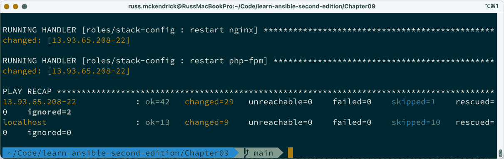
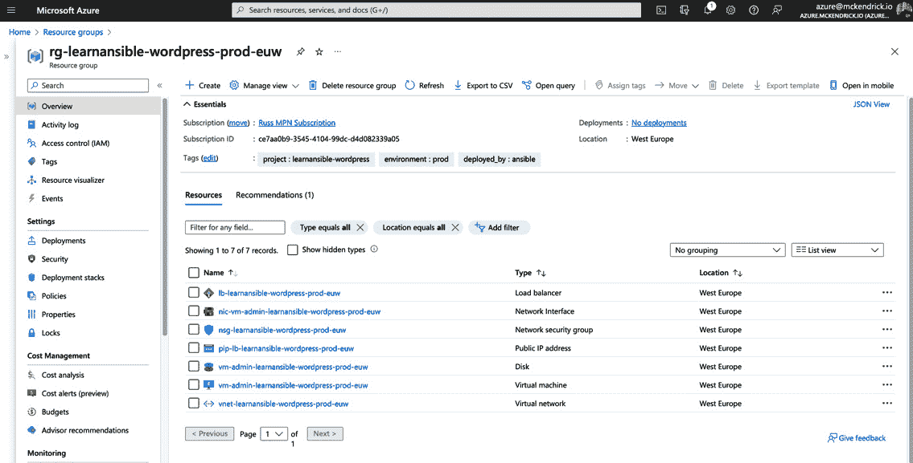

# 9

# 向云端迁移

本章将从使用本地虚拟机转向使用 Ansible 启动与公共云提供商交互的实例。

本章中，我们将使用 Microsoft Azure，选择该云服务提供商是因为它允许我们启动虚拟机并与其进行交互，而无需过多的配置工作。

我们将继续研究如何调整我们的 WordPress 剧本以便与新启动的 Microsoft Azure 实例进行交互。

在本章中，我们将涵盖以下主题：

+   Microsoft Azure 介绍

+   在 Microsoft Azure 启动实例

+   启动 WordPress

# 技术要求

在本章中，我们将启动一个公共云实例，因此如果你跟随本书操作，你将需要一个 Microsoft Azure 账户。与其他章节一样，完整的剧本版本可以在章节文件夹中找到，地址为[`github.com/PacktPublishing/Learn-Ansible-Second-Edition/tree/main/Chapter09`](https://github.com/PacktPublishing/Learn-Ansible-Second-Edition/tree/main/Chapter09)。

# Microsoft Azure 介绍

2008 年，微软通过推出 Windows Azure，迈出了其进入云计算领域的第一步，Windows Azure 是一种基于云的数据中心服务。这次发布标志着许多人所认为的传统软件公司历史的一个转折点，宣告着微软在战略上转向云计算。

Windows Azure 是在内部项目*Project Red Dog*下开发的，代表了微软对日益增长的可扩展、可访问和灵活计算资源需求的回应。

Windows Azure 最初推出时包含五个核心组件，每个组件都旨在提供云计算领域内不同的功能：

+   **Microsoft SQL 数据服务**：此组件提供了 Microsoft SQL 数据库的云版本，简化了在云环境中托管和管理数据库的复杂性。

+   **Microsoft .NET 服务**：作为一种**平台即服务**（**PaaS**）产品，它使开发人员能够在 Microsoft 管理的运行时环境中部署基于 .NET 的应用程序，从而简化了开发过程。

+   **Microsoft SharePoint** 和 **Microsoft Dynamics**：这些**软件即服务**（**SaaS**）产品提供了公司知名的企业内联网和**客户关系管理**（**CRM**）产品的云版本，提升了协作与客户互动。

+   **Windows Azure（IaaS）**：一种**基础设施即服务**（**IaaS**）解决方案，允许用户创建并控制虚拟机、存储和网络服务，处理各种计算工作负载。

之前的四个定义摘自我写的旧书《*基础设施即代码* 初学者指南》。

Windows Azure 架构的核心是 Red Dog 操作系统，它是一个特别修改过的 Windows NT 版本。该系统被设计为包含一个云层，确保数据中心服务的顺利交付。

到 2014 年，随着服务范围的扩大和对基于 Linux 的工作负载的重视，Microsoft 将该服务更名为 Microsoft Azure。这一变化突显了该平台超越 Windows 为中心的解决方案的演变。

快进到 2020 年，显然 Microsoft Azure 已经采取了更加包容的方法，超过一半的虚拟机核心和大量 Azure Marketplace 镜像都是基于 Linux 的。

这一转变展示了 Microsoft 更广泛采用 Linux 和开源技术，这些技术在写作时仍然是其当前云服务产品的重要组成部分。

# 在 Microsoft Azure 中启动实例

如果你跟着*第七章*《Ansible Windows 模块》一起操作，你应该已经使用 Azure CLI 在 Microsoft Azure 中启动了一个虚拟机。

提醒

有关如何安装和配置 Azure CLI 的说明，请参阅[`learn.microsoft.com/en-us/cli/azure/install-azure-cli/`](https://learn.microsoft.com/en-us/cli/azure/install-azure-cli/)中的文档。记住，如果你是在 Windows 主机上操作，确保在安装 Ansible 的同一位置，在 Windows Subsystem for Linux 中安装 Azure CLI。

在讨论启动 Windows 虚拟机时，我们做了以下工作：

+   我们创建了一个资源组，以便将所有虚拟机工作负载的资源收集在一起。

+   然后我们创建了一个虚拟网络和子网，并将其附加到机器的网络接口上。

+   然后我们创建了一个网络安全组来保护我们的虚拟机。

+   一旦我们有了基础，我们启动了一个 Windows 虚拟机，并将一个公共 IP 地址直接附加到网络接口上。

+   最后，我们部署了一个虚拟机扩展，在我们的 Windows 主机上执行 PowerShell 脚本，以启用 WinRM 协议，允许我们使用 Ansible 连接并与主机进行交互。

本章将使用 Ansible 和 Azure 模块集重复、调整并补充这些步骤。

## 为 Microsoft Azure 准备 Ansible

在我们深入探讨 Ansible 角色之前，该角色将启动我们的资源，我们需要做一些准备工作；首先，让我们通过运行以下命令来确保安装了 Azure 集合：

```
$ ansible-galaxy collection install azure.azcollection
```

接下来，我们必须安装允许 Azure 集合与 Azure API 交互的 Python 模块。为此，我们需要运行以下命令：

```
$ pip3 install -r ~/.ansible/collections/ansible_collections/azure/azcollection/requirements-azure.txt
```

在安装了必要的支持 Python 模块后，下一步是确保你已使用 Azure CLI 登录到你的 Microsoft Azure 帐户。为此，请运行以下命令并按照屏幕上的提示进行操作：

```
$ az login
```

如果你使用的帐户可以访问多个 Azure 订阅，请确保选择了你打算启动资源的订阅。

为此，你可以列出所有订阅，并在需要时通过运行以下命令切换到正确的订阅：

```
$ az account list --output table
$ az account set --subscription <subscription_id>
```

确保您将`<subscription_id>`替换为从`az account` `list`命令获取的正确订阅 ID。

注意

使用`az account set`命令只会影响当前会话；如果关闭终端窗口并重新打开新会话，您必须确保再次更改订阅。

## 审查变量

我们将在多个角色中使用几个变量来部署 Azure 资源并配置 WordPress。我们首先要查看的变量可以在`group_vars/common.yml`文件中找到。

首先，我们有一些`debug_output`，它会输出在 playbook 运行期间注册的变量内容；将其设置为`true`可以帮助我们在开发角色时拉取已启动的 Azure 资源信息。

第二个功能标志是`generate_key`；如果设置为`true`，那么 Ansible 将在`~/.ssh/id_rsa`目录下创建一个公私钥对（如果该对不存在的话）。

Playbook 在启动虚拟机时会使用此位置的密钥，因此必须确保该密钥存在，否则 Ansible 无法连接到新启动的虚拟机。

这两个变量如下所示：

```
debug_output: false
genterate_key: false
```

接下来，在`group_vars/common.yml`文件中，我们定义了一些关于我们的`app`工作负载的信息；这些信息包含了应用程序的细节以及一些 Azure 相关的内容，如工作负载将要启动的 Azure 区域（`location` 和 `location_short`），以及我们的 WordPress 网站可访问的名称（`public_dns_name`）：

```
app:
  name: "learnansible-wordpress"
  shortname: "ansiblewp"
  location: "westeurope"
  location_short: "euw"
  env: "prod"
  public_dns_name: "learnansible"
```

最后一组变量定义在`group_vars/common.yml`文件中，用于应用到每个 Azure 资源的标签，这些资源将由 Ansible 启动：

```
common_tags:
  "project": "{{ app.name }}"
  "environment": "{{ app.env }}"
  "deployed_by": "ansible"
```

我们将使用的下一组变量可以在`roles/azure/defaults/main.yml`中找到，这些变量用于部署我们的资源。

第一组变量定义了一个快速的 Azure 服务名称字典，方便我们在命名资源时使用：

```
dict:
  ansible_warning: "Resource managed by Ansible"
  load_balancer: "lb"
  network_interface: "nic"
  nsg: "nsg"
  private_endpoint: "pe"
  public_ip: "pip"
  resource_group: "rg"
  subnet: "snet"
  virtual_machine: "vm"
  virtualnetwork: "vnet"
```

接下来，我们定义资源名称——根据*第七章*《Ansible Windows 模块》中的内容，我将资源名称尽可能接近云采用框架的推荐做法：

```
load_balancer_name: "{{ dict.load_balancer }}-{{ app.name }}-{{app.env}}-{{ app.location_short }}"
load_balancer_public_ip_name: "{{ dict.public_ip }}-{{ load_balancer_name }}"
nsg_name: "{{ dict.nsg }}-{{ app.name }}-{{app.env}}-{{ app.location_short }}"
resource_group_name: "{{ dict.resource_group }}-{{ app.name }}-{{app.env}}-{{ app.location_short }}"
virtual_network_name: "{{ dict.virtualnetwork }}-{{ app.name }}-{{app.env}}-{{ app.location_short }}"
vm_name: "{{ dict.virtual_machine }}-admin-{{ app.name }}-{{app.env}}-{{ app.location_short }}"
vnet_name: "{{ dict.virtualnetwork }}-{{ app.name }}-{{app.env}}-{{ app.location_short }}"
```

现在所有的命名工作完成后，我们可以开始定义网络相关的变量：

```
vnet_config:
  cidr_block: "10.0.0.0/24"
  subnets:
    - {
        name: "{{ dict.subnet }}-vms-{{ app.name }}-{{app.env}}-{{ app.location_short }}",
        subnet: «10.0.0.0/27»,
        private: true,
        service_endpoints: «Microsoft.Storage»,
      }
```

接下来，在网络配置中，我们有两个 IP 地址列表——一个是固定 IP 地址，另一个是在 playbook 运行时发现的 IP 地址：

```
trusted_ips:
  - ""
dynamic_ips:
  - "{{ your_public_ip }}"
```

下一组变量使用先前的 IP 地址列表，在创建两个网络安全组规则时使用这些列表：

```
nsg_rules:
  - name: "allowHTTP"
    description: "{{ dict.ansible_warning }}"
    protocol: «Tcp»
    destination_port_range: «80»
    source_address_prefix: "*"
    access: "Allow"
    priority: "100"
    direction: "Inbound"
  - name: "allowSSH"
    description: "{{ dict.ansible_warning }}"
    protocol: "Tcp"
    destination_port_range: «{{ load_balancer.ssh_port }}»
    source_address_prefix: "{{ trusted_ips|select() + dynamic_ips | unique }}"
    access: "Allow"
    priority: "150"
    direction: "Inbound"
```

如您所见，第一个规则`allowHTTP`打开了`80`端口给全世界；但是`allowSSH`则限制了 SSH 端口，仅允许我们两个列表中的 IP 地址访问。为此，我们从`trusted_ips`变量中获取 IP 地址列表，追加`dynamic_ips`的内容，然后仅显示列表中的唯一条目，以去除任何重复项。

最后一组网络变量定义了启动 Azure 负载均衡器所需的基本设置：

```
load_balancer:
  ssh_port: "22"
  ssh_port_backend: "22"
  http_port: "80"
  http_port_backend: "80"
```

现在我们有了虚拟机配置：

```
vm_config:
  admin_username: "adminuser"
  ssh_password_enabled: false
  vm_size: "Standard_B1ms"
  image:
    publisher: "Canonical"
    offer: "0001-com-ubuntu-server-jammy"
    sku: "22_04-LTS"
    version: "latest"
  disk:
    managed_disk_type: "Premium_LRS"
    caching: "ReadWrite"
  key:
    path: "/home/adminuser/.ssh/authorized_keys"
    data: "{{ lookup('file', '~/.ssh/id_rsa.pub') }}"
```

最后，我们将放置定义新启动的虚拟机的位置和主机组的两个变量：

```
location: "{{ app.location }}"
hosts_group: "vmgroup"
```

现在我们已经涵盖了启动 Azure 资源所需的所有变量，我们可以开始执行实际工作的任务，所有这些任务都可以在 `roles/azure/tasks/main.yml` 中找到。

## 资源组任务

我们将要看的第一个任务是创建资源组，这是所有其他 Azure 资源的存放地点：

```
- name: "Create the resource group"
  azure.azcollection.azure_rm_resourcegroup:
    name: "{{ resource_group_name }}"
    location: "{{ location }}"
    tags: "{{ common_tags }}"
  register: "resource_group_output"
```

正如您所见，这里没有太多内容；它使用我们定义的 `name`、`location` 和 `tags` 变量，并使用 `azure.collection.azure_rm_resourcegroup` 模块创建资源组。然后将任务输出注册为变量，允许我们在后续任务中重用输出。

如果 `debug_output` 设置为 `true`，则下一个任务将在屏幕上打印 `resource_group_output` 注册变量的内容；如果设置为 `false`，则跳过该任务：

```
- name: "Debug - Resource Group result"
  ansible.builtin.debug:
    var: "resource_group_output"
  when: debug_output
```

这是 Azure 角色中常见的模式，因此我们不会再次涵盖这个任务。假设如果任务注册了其输出，那么后续将有支持调试任务。现在我们有了我们的资源组，我们可以开始配置网络了。

## 网络任务

第一个任务启动了虚拟网络，并将其放置在我们刚刚创建的资源组中：

```
- name: "Create the virtual network"
  azure.azcollection.azure_rm_virtualnetwork:
    resource_group: "{{ resource_group_output.state.name }}"
    name: "{{ virtual_network_name }}"
    address_prefixes: "{{ vnet_config.cidr_block }}"
    tags: "{{ common_tags }}"
  register: "virtual_network_output"
```

正如您所见，当引用资源组名称时，我们使用前一个任务的注册输出，使用 `{{ resource_group_output.state.name }}`。同样，这将贯穿剩余的任务。

注意，我们在创建虚拟网络时未定义子网；这是因为我们仅添加了一个子网，但使用 `azure.collection.azure_rm_subnet` 模块添加子网是最佳实践，因为这种方法可以通过 `with_items` 语句循环添加子网：

```
- name: "Add the subnets to the virtual network"
  azure.azcollection.azure_rm_subnet:
    resource_group: "{{ resource_group_output.state.name }}"
    name: "{{ item.name }}"
    address_prefix: "{{ item.subnet }}"
    virtual_network: "{{ virtual_network_output.state.name }}"
    service_endpoints:
      - service: "{{ item.service_endpoints }}"
  with_items: "{{ vnet_config.subnets }}"
  register: "subnet_output"
```

现在虚拟网络已经填充了子网，我们可以继续创建网络安全组。

您可能还记得，当我们查看变量时，我们使用了一个名为 `your_public_ip` 的变量，所以我们的下一个任务是使用 `community.general.ipify_facts` 模块来发现运行 Ansible 的主机的外部 IP 地址：

```
- name: "Find out your current public IP address using https://ipify.org/"
  community.general.ipify_facts:
  register: public_ip_output
```

正如您所见，这里没有太多内容，但我们没有注册一个名为 `your_public_ip` 的变量；这是作为一个单独的任务完成的，使用 `ansible.builtin.set_fact` 模块：

```
- name: "Register your public ip as a fact"
  ansible.builtin.set_fact:
    your_public_ip: "{{ public_ip_output.ansible_facts.ipify_public_ip }}"
```

现在我们知道了 IP 地址，我们可以创建网络安全组了：

```
- name: "Create the network security group"
  azure.azcollection.azure_rm_securitygroup:
    resource_group: "{{ resource_group_output.state.name }}"
    name: "{{ nsg_name }}"
    rules: "{{ nsg_rules }}"
    tags: "{{ common_tags }}"
  register: "nsg_output"
```

到目前为止，一切顺利；我们需要做的下一个网络配置是启动 Azure 负载均衡器。这是我们在*第七章*，*Ansible Windows 模块*中启动的资源的第一个偏离，原因是什么呢？

虽然 Microsoft 允许你直接将公共 IP 地址分配给 Azure 中虚拟机的网络接口，但通常不推荐这样做，并且这不是最佳实践——使用像 Azure 负载均衡器这样的网络资源来路由和分发流量到一个或多个主机被认为更为安全，因为这样你就把虚拟机和公共互联网之间增加了一层防护。

此外，即使像我们这样运行单台虚拟机，通过负载均衡器传递流量也能让你进行基本的健康检查，查看负载均衡器发送流量的端口是否健康。

启动 Azure 负载均衡器时，我们需要执行的第一个任务是创建一个公共 IP 地址资源，这个资源将在启动负载均衡器时附加到负载均衡器上：

```
- name: "Create the public IP address needed for the load balancer"
  azure.azcollection.azure_rm_publicipaddress:
    resource_group: "{{ resource_group_output.state.name }}"
    allocation_method: "Static"
    name: "{{ load_balancer_public_ip_name }}"
    sku: "standard"
    domain_name: "{{ app.public_dns_name }}"
    tags: "{{ common_tags }}"
  register: "public_ip_output"
```

现在公共 IP 地址已经定义，我们可以继续配置 Azure 负载均衡器本身。

由于任务内容较多，我会在执行过程中稍作拆解：

```
- name: "Create load balancer using the public IP we created"
  azure.azcollection.azure_rm_loadbalancer:
    resource_group: "{{ resource_group_output.state.name }}"
    name: "{{ load_balancer_name }}"
    sku: "Standard"
```

任务的下一个环节是定义负载均衡器的前端。这里是我们将刚才创建的公共 IP 地址附加到负载均衡器的位置：

```
    frontend_ip_configurations:
      - name: "{{ load_balancer_name }}-frontend-ip-config"
        public_ip_address: "{{ public_ip_output.state.name }}"
```

接下来，我们定义后端池。这是我们的虚拟机将被放置并接收流量的池。如果我们有多个虚拟机，它们都将被指派到这个池中：

```
    backend_address_pools:
      - name: "{{ load_balancer_name }}-backend-address-pool"
```

现在我们有了健康探针，它会探测后端池上的 HTTP 端口，以确保虚拟机准备好接收端口 `80` 上的流量，方法是检查该端口是否开放：

```
    probes:
      - name: "{{ load_balancer_name }}-http-probe"
        port: «{{ load_balancer.http_port_backend }}»
        fail_count: "3"
        protocol: "Tcp"
```

对于我们的 WordPress 工作负载，我们希望暴露 HTTP 端口。为此，我们将创建一个负载均衡规则，允许你在后端池中的一个或多个虚拟机之间建立一对多的关系。此规则会将 HTTP 端口暴露在负载均衡器上，并将流量发送到后端虚拟机的 HTTP 端口。如果我们有多个虚拟机，流量将均匀分布到后端所有主机的 HTTP 端口上：

```
    load_balancing_rules:
      - name: "{{ load_balancer_name }}-rule-http"
        frontend_ip_configuration: "{{ load_balancer_name }}-frontend-ip-config"
        backend_address_pool: "{{ load_balancer_name }}-backend-address-pool"
        frontend_port: «{{ load_balancer.http_port }}»
        backend_port: "{{ load_balancer.http_port_backend }}"
        probe: "{{ load_balancer_name }}-http-probe"
```

虽然负载均衡规则将来自前端单一端口的流量分发到后端池中的多个虚拟机，但入站 **NAT**（**网络地址转换**）规则则是按一对一的方式分发流量，这使得它非常适合像 SSH 这样的服务，这些服务不适合在多个主机之间分配：

```
    inbound_nat_rules:
      - name: "{{ load_balancer_name }}-nat-ssh"
        frontend_ip_configuration: "{{ load_balancer_name }}-frontend-ip-config"
        backend_port: "{{ load_balancer.ssh_port }}"
        frontend_port: "{{ load_balancer.ssh_port }}"
        protocol: "Tcp"
```

如果我们有多台机器，我们将添加更多的规则，这些规则将不同的端口映射到后端虚拟机的端口 `22`。通常，我会使用高端口号，例如 `2220` > `2229`，这样就不会与其他服务冲突——`2220` 将流量发送到第一台机器的端口 `22`，`2221` 会将流量发送到第二台机器，依此类推。

然而，在这个例子中，我们只有一台主机，因此我将端口 `22` 映射到端口 `22`。

最后，我们将标记资源并注册输出：

```
    tags: "{{ common_tags }}"
  register: "load_balancer_output"
```

现在我们有了负载均衡器，我们需要创建一个网络接口，该接口将被放置在后端池中，并附加到我们的虚拟机上。

对于那些已经查看过 Ansible Azure 集合的人，你们可能注意到有一个名为 `azure.azcollection.azure_rm_networkinterface` 的模块，用于管理网络接口。因此，你可能会假设我们正在研究的任务使用了该模块。嗯，你的猜测是错的。

尽管预编写的模块与其交互的 API 端点功能相当完善，但它缺少我们部署所需的一个关键功能：将网络接口分配给 NAT 规则的能力。

然而，一切并非失去希望，仍然有解决方法。

有一个 Azure 模块，其唯一目的是直接与 Azure 资源管理器 API 进行交互，名为 `azure.collection.azure_rm_resource`，通过使用该模块，我们可以直接从 Ansible 中向 `Microsoft.Network/networkInterfaces` 端点发出 API 调用。

能够对任何 Azure 资源管理器 API 执行此操作是非常强大的，因为它意味着一旦 Microsoft 发布新功能，我们就能立刻使用它，而且无需等待 Ansible Azure 集合开发者编写、测试并发布该模块。

然而，这种方法有一个缺点：使用这种方法会给你的 playbook 增加额外的复杂性。

以下 URL 是 REST API 文档的链接，其中涵盖了网络接口的创建：[`learn.microsoft.com/en-us/rest/api/virtualnetwork/network-interfaces/create-or-update?view=rest-virtualnetwork-2023-05-01&tabs=HTTP`](https://learn.microsoft.com/en-us/rest/api/virtualnetwork/network-interfaces/create-or-update?view=rest-virtualnetwork-2023-05-01&tabs=HTTP)。

正如我们通过执行任务所看到的，我们正在做的事情的总体思路是构建我们希望访问的 API 的 URL，然后构建 REST 文档中详细说明的请求体。

首先，让我们看看生成 URL 的任务部分：

```
- name: "Create the network interface for the wordpress vm"
  azure.azcollection.azure_rm_resource:
    api_version: "2023-05-01"
    resource_group: "{{ resource_group_output.state.name }}"
    provider: "network"
    resource_type: "networkinterfaces"
    resource_name: "{{ dict.network_interface }}-{{ vm_name }}"
    idempotency: true
```

前述信息构建了文档中给出的 URL，具体如下：

```
PUT https://management.azure.com/subscriptions/{subscriptionId}/resourceGroups/{resourceGroupName}/providers/Microsoft.Network/networkInterfaces/{networkInterfaceName}?api-version=2023-05-01
```

让我们看看这是如何生成的：

+   `{subscriptionId}` 是由模块自动生成的，我们无需提供此信息。

+   `{resourceGroupName}` 是通过提供 `resource_group` 键添加的，和其他任务一样，我们使用的是资源组名称，这个名称是我们在资源组任务中注册变量时的输出。

+   由我们通过填写 `provider` 和 `resource_type` 键提供的提供者。别担心——URL 对大小写不敏感，模块会为我们自动添加 `Microsoft.` 部分。

+   `{networkInterfaceName}` 是 `resource_name` 键。

+   最后，API 版本通过填写 `api_version` 键来提供。

“头部”的最后部分并不构成 URL 的一部分，而是指示 Ansible 执行一个`GET`请求，然后将将要发布的主体与`GET`请求返回的结果进行比较，如果有任何问题，它将在主体发布之前报错。

现在我们已经有了 Azure 资源管理器 API 端点的 URL，我们需要填充请求的主体。

对于我们的情况，代码如下所示：

```
    body:
      location: "{{ location }}"
      properties:
        enableAcceleratedNetworking: false
        primary: true
        networksecuritygroup:
          id: "{{ nsg_output.state.id }}"
        configurations:
          - name: "{{ vm_name }}-ipcfg"
            properties:
              subnet:
                id: "{{ subnet_output.results[0].state.id }}"
              loadBalancerBackendAddressPools:
                - id: "{{ load_balancer_output.state.backend_address_pools[0].id }}"
              loadBalancerInboundNatRules:
                - id: "{{ load_balancer_output.state.inbound_nat_rules[0].id }}"
      tags: "{{ common_tags }}"
```

当模块运行时，`properties`将作为 JSON 格式渲染，并与`location`和`tags`一起发布在请求的主体中，任务的最后部分是注册输出：

```
  register: "network_interface_output"
```

现在我们已经配置了所有基本的 Azure 设置和资源，我们可以启动虚拟机。由于我们将使用 SSH 连接到虚拟机并引导安装 WordPress，我们需要确保生成了有效的 SSH 密钥。

由于我们将连接到远程虚拟机，因此我们希望像在本地部署的主机上那样传送测试密钥。如果你的本地机器上`~/.ssh/id_rsa`没有密钥，则在`group_vars/common.yml`文件中将`genterate_key`变量设置为`true`（默认为`false`），然后 Ansible 会为你生成密钥。

如果该位置已有密钥，不用担心；Ansible 只有在密钥不存在时才会创建一个密钥。

```
- name: "Check user has a key, if not create one for {{ ansible_user_id }}"
  ansible.builtin.user:
    name: "{{ ansible_user_id }}"
    generate_ssh_key: true
    ssh_key_file: "~/.ssh/id_rsa"
  when: genterate_key
```

接下来，我们有一个启动虚拟机的任务。它使用我们已经部署和配置的所有资源，因此我将不再详细说明：

```
- name: Create the admin virtual machine
  azure.azcollection.azure_rm_virtualmachine:
    resource_group: "{{ resource_group_output.state.name }}"
    name: "{{ vm_name }}"
    admin_username: "{{ vm_config.admin_username }}"
    ssh_public_keys:
      - path: "{{ vm_config.key.path }}"
        key_data: "{{ vm_config.key.data }}"
    ssh_password_enabled: "{{ vm_config.ssh_password_enabled }}"
    vm_size: "{{ vm_config.vm_size }}"
    managed_disk_type: "{{ vm_config.disk.managed_disk_type }}"
    network_interfaces: "{{ network_interface_output.response.name }}"
    image:
      offer: "{{ vm_config.image.offer }}"
      publisher: "{{ vm_config.image.publisher }}"
      sku: "{{ vm_config.image.sku }}"
      version: «{{ vm_config.image.version }}»
    tags: «{{ common_tags }}»
  register: «vm_output»
```

和我们在此角色中运行的大多数任务一样，紧接着的将是一个调试任务。

你可能会想，*“这就是角色的结束，对吧？”* 但我们还有两个任务需要处理。

这两个最后任务中的第一个任务获取主机的信息，例如公共 IP 地址和 SSH 端口，然后将其添加到定义为`hosts_group`变量的主机组中。

这意味着在我们的主机清单文件中没有硬编码的 IP 地址或连接。注册主机的任务如下所示：

```
- name: Add the Virtual Machine to the host group
  ansible.builtin.add_host:
    groups: "{{ hosts_group }}"
    hostname: "{{ public_ip_output.state.ip_address }}-{{ load_balancer.ssh_port }}"
    ansible_host: "{{ public_ip_output.state.ip_address }}"
    ansible_port: «{{ load_balancer.ssh_port }}»
```

那么，这个任务可能是什么呢？我们已经配置了网络，虚拟机已经启动，并且我们已经注册了主机，因此我们应该准备好开始引导 WordPress 了。

这就是问题所在；我们可能已经准备好了，但我们刚刚启动的主机可能还没有准备好，因为虚拟机启动可能需要一两分钟。如果我们在虚拟机尚未完成启动时立即尝试 SSH 连接主机，playbook 将出错并停止运行。

幸运的是，Ansible 为这种场景开发了一个模块，`ansible.builtin.wait_for`：

```
- name: "Wait for the virtual machine to be ready"
  ansible.builtin.wait_for:
    host: "{{ public_ip_output.state.ip_address }}"
    port: «{{ load_balancer.ssh_port }}»
    delay: 10
    timeout: 300
```

这将等待`10`秒钟，然后尝试 SSH 连接主机，最多持续 5 分钟（`300`秒）；当 SSH 可访问时，Ansible playbook 将继续执行下一个角色集，在我们的情况下是引导 WordPress。

# 引导 WordPress

你不会感到惊讶，WordPress 角色的大部分内容保持不变，因此我们不会在此覆盖这些部分，而是回顾一些小的更改。

## 站点和主机环境文件

`site.yml`现在分为两个部分；第一个部分在本地运行，并与 Azure 资源管理器 API 交互，以启动和配置 Azure 资源：

```
- name: "Deploy and configure the Azure Environment"
  hosts: localhost
  connection: local
  gather_facts: true
  vars_files:
    - group_vars/common.yml
  roles:
    - "azure"
```

第二部分针对`vmgroup`主机组，类似于我们在前几章中使用过的内容：

```
- name: "Install and configure Wordpress"
  hosts: vmgroup
  gather_facts: true
  become: true
  become_method: "ansible.builtin.sudo"
  vars_files:
    - group_vars/common.yml
  roles:
    - "secrets"
    - "stack_install"
    - "stack_config"
    - "wordpress"
```

`hosts`文件看起来和我们在前几章中使用的`hosts`文件一样；它只是缺少了我们显式定义目标主机的行，而是仅由主机组定义组成。

你可能已经注意到我们正在添加一个新角色，其他的角色大部分保持不变；这个角色被命名为`secrets`，让我们来看看它的功能。

## `secrets`角色

这个角色的唯一目的是为 WordPress 和数据库生成安全密码。它的任务被委派给本地机器，因为它在`group_vars/secrets.yml`创建了一个变量文件，并将其加载到剧本运行中。

首先，它检查`group_vars/secrets.yml`是否已经存在，如果存在，我们不想更改文件的内容：

```
- name: "Check if the file secrets.yml exists"
  ansible.builtin.stat:
    path: "group_vars/secrets.yml"
  register: secrets_file
  delegate_to: "localhost"
  become: false
```

如果没有文件，则它及其内容将从模板文件生成：

```
- name: "Generate the secrets.yml file using a template file if not exists"
  ansible.builtin.template:
    src: "secrets.yml.j2"
    dest: "group_vars/secrets.yml"
  when: secrets_file.stat.exists == false
  delegate_to: "localhost"
  become: false
```

位于`roles/secrets/templates/secrets.yml.j2`的模板文件如下所示：

```
db_password: "{{ lookup('community.general.random_string', length=20, upper=true, special=false, numbers=true) }}" wp_password: "{{ lookup('community.general.random_string', length=20, upper=true, special=true, override_special="@-&*", min_special=2, numbers=true) }}"
```

如你所见，它使用`community.general.random_string`模块根据一些合理的规则生成随机字符串，我们将把它用作密码。

## 其他更改

角色的大多数更改都涉及到变量；例如，在`roles/wordpress/defaults/main.yml`中我们有如下内容：

```
wordpress:
  domain: "http://{{ app.public_dns_name }}.{{ app.location }}.cloudapp.azure.com/"
  password: "{{ wp_password }}"
```

这使用了我们在 Azure 负载均衡器公共 IP 地址上配置的公共 URL，以及刚刚运行的`secrets`角色中的密码变量。

角色中的其他部分保持与我们在*第五章*中相同，即*部署 WordPress*。

# 运行剧本

运行剧本使用我们在本书中一直运行的相同命令：

```
$ ansible-playbook -i hosts site.yml
```

剧本将执行，完成后你应该能看到类似以下屏幕上的输出：



图 9.1 – 在终端中运行剧本

访问 Azure 门户网站[`portal.azure.com/`](https://portal.azure.com/)并查看 Ansible 创建的资源组，应该能看到类似以下内容：



图 9.2 – 在 Azure 门户中查看资源

在这里，你应该能够输入分配给公共 IP 地址的 DNS 名称；例如，在我的例子中是`http://learnansible.westeurope.cloudapp.azure.com/`。你的情况可能不同，你应该能看到新引导的 WordPress 站点。

就像我们在*第七章*中启动 Azure 资源一样，*Ansible Windows 模块*，要终止资源，我们需要删除资源组，这将删除其中包含的所有资源。

要使用 Ansible 实现这一点，有一个小型的、独立的 playbook，名为`destroy.yml`，可以通过运行以下命令来执行：

```
$ ansible-playbook -i hosts destory.yml
```

这将需要几分钟才能完成，但它将删除在*site.yml* playbook 中部署的所有资源，包括 Azure 中的资源以及`group_vars/secrets.yml`文件中的内容，为下次运行主`site.yml` playbook 时提供一个干净的起点。

# 摘要

在本章中，我们使用 Azure Ansible 模块在公共云中启动了我们的第一个实例；正如你所看到的，这个过程相对简单，我们成功地在 Microsoft Azure 上安全地启动了网络和计算资源，为后续在其上安装 WordPress 做好准备，且无需对我们在*第五章*中涉及的*部署 WordPress*角色做出重大更改。

在下一章中，我们将扩展本章中涉及的一些技术，并回到网络方面，但与上一章中我们介绍网络设备不同，这次我们将关注公共云中的网络。
