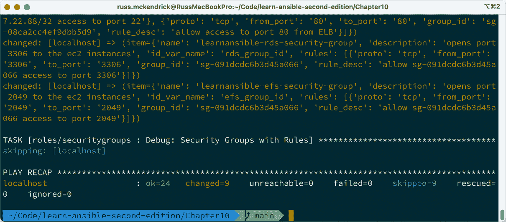
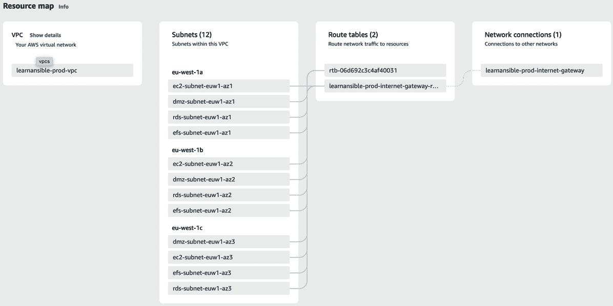
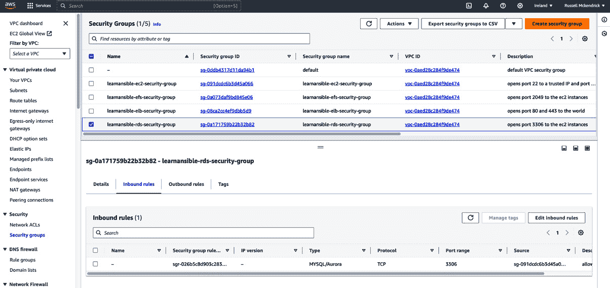

# 10

# 构建云网络

现在我们已经在 Microsoft Azure 启动了服务器，我们将开始在 **Amazon Web** **Services**（**AWS**）内启动服务。

在启动虚拟机实例之前，我们必须创建一个网络来托管它们。这被称为**虚拟私有云**（**VPC**），我们需要在 playbook 中将几个不同的元素整合起来，以创建一个 VPC，然后我们可以将其用于我们的实例。

在本章中，我们将执行以下操作：

+   介绍 AWS

+   介绍我们想要实现的目标及其原因

+   创建 VPC、子网和路由（网络和路由）

+   创建安全组（防火墙）

当我们启动和管理更多具有复杂依赖关系的动态资源时，我们将研究更高级的 Ansible 技巧。

本章涵盖以下主题：

+   AWS 简介

+   Amazon VPC 概述

+   创建访问密钥和密钥对

+   为目标 AWS 准备 Ansible

+   AWS playbook

+   运行 playbook

# 技术要求

本章将使用 AWS；您需要管理员访问权限来创建角色，以允许 Ansible 与您的账户交互。与其他章节一样，您可以在附带的 GitHub 仓库的 `Chapter10` 文件夹中找到完整的 playbooks，网址为 [`github.com/PacktPublishing/Learn-Ansible-Second-Edition/tree/main/Chapter10`](https://github.com/PacktPublishing/Learn-Ansible-Second-Edition/tree/main/Chapter10)。

# AWS 简介

AWS 自 2002 年以来就存在；它最初提供了一些不相关的服务。直到 2006 年初，它才重新推出。重新推出的 AWS 将三项服务整合在一起：

+   **Amazon 弹性计算云**（**Amazon EC2**）：这是 AWS 的计算服务

+   **Amazon 简单存储服务**（**Amazon S3**）：亚马逊的可扩展对象存储服务

+   **Amazon 简单队列服务**（**Amazon SQS**）：此服务提供消息队列，主要用于 Web 应用程序

自 2006 年以来，AWS 从三个独立的服务发展到了超过 160 个，涵盖了 15 个主要领域，具体包括：

+   计算

+   存储

+   数据库

+   网络和内容交付

+   机器学习分析安全、身份和合规性

+   物联网

在 2023 年 10 月的财报电话会议中，透露 AWS 在 2023 年第三季度的收入为 230.6 亿美元，这是一个最初提供共享空闲计算时间的服务所取得的成就。

在撰写本文时，AWS 覆盖了 32 个地理区域，托管了 102 个可用区 ([`aws.amazon.com/about-aws/global-infrastructure/`](https://aws.amazon.com/about-aws/global-infrastructure/))。

那么，是什么让 AWS 如此成功呢？不仅仅是它的覆盖面，还有它推出服务的方式。AWS CEO Andy Jassy 曾被引用说：

“*我们的使命是让任何开发者或任何公司能够在我们的基础设施技术平台上构建所有他们的技术应用*。”

作为个人用户，你可以使用与大型跨国公司以及 Amazon 自身一样的 API、服务、区域、工具和定价模型，就像它们消费自己的服务一样。这让你可以自由从小规模开始并实现大规模扩展。例如，Amazon EC2 实例的费用从每月约 4.50 美元的 t2.nano（1 vCPU 和 0.5GB）起，一直到每月超过 19,000 美元的 x1e.32xlarge（128 vCPU，3,904 GB RAM 和两块 1920 GB SSD 存储）；正如你所见，几乎所有工作负载都有适合的实例类型。

实例和大多数服务按使用量计费，从 EC2 实例按秒计费，到存储按 GB 每月计费。

# Amazon VPC 概述

在本章中，我们将专注于启动 **Amazon Virtual Private Cloud**（**Amazon VPC**）；这是将托管我们将在 *第十一章* 中启动的计算和其他 Amazon 服务的网络层，*高度可用*的*云部署*。

我们将把 VPC 部署到 **EU-West #1（爱尔兰）** 区域；我们将跨越所有三个可用区来部署我们的 **EC2** 实例以及 **应用负载均衡器**。我们同样会使用这三个可用区来部署我们的 **Amazon Relational Database Service**（**RDS**）实例，还会在两个可用区部署 **Amazon Elastic File System**（**Amazon EFS**）卷。

这意味着我们的 Ansible playbook 需要创建/配置以下内容：

+   一个 Amazon VPC

+   三个 EC2 实例的子网

+   三个 Amazon RDS 实例的子网

+   三个 Amazon EFS 卷的子网

+   三个应用负载均衡器的子网

+   一个互联网网关

我们还需要配置以下内容：

+   一条路由，允许通过互联网网关访问

+   一个安全组，允许所有人访问应用负载均衡器的 `80` 端口（HTTP）和 `443` 端口（HTTPS）

+   一个安全组，允许可信源通过 `22` 端口（SSH）访问 EC2 实例

+   一个安全组，允许从应用负载均衡器访问 EC2 实例的 `80` 端口（HTTP）

+   一个安全组，允许从 EC2 实例访问 Amazon RDS 实例的 `3306` 端口（MySQL）

+   一个安全组，允许从 EC2 实例访问 Amazon EFS 卷的 `2049` 端口（NFS）

这将为我们提供主要的网络，允许对除应用负载均衡器外的所有内容进行限制性访问，而应用负载均衡器是我们希望公开可用的。

在创建一个部署网络的 Ansible playbook 之前，我们需要获取一个 AWS API 访问密钥和秘密密钥。

# 创建访问密钥和秘密密钥

为你的 AWS 用户创建访问密钥和秘密密钥，以便为 Ansible 提供对你的 AWS 账户的完全访问权限是完全可能的。

因此，我们将创建一个 Ansible 用户，它仅有权限访问 AWS 中我们知道 Ansible 在本章中将需要交互的部分。我们将给予 Ansible 对以下服务的完全访问权限：

+   亚马逊 VPC

+   亚马逊 EC2

+   亚马逊 RDS

+   亚马逊 EFS

为此，按照以下步骤操作：

1.  登录到 AWS 控制台，可以在[`console.aws.amazon.com/`](https://console.aws.amazon.com/)找到。

1.  登录后，在搜索框中点击`IAM`，然后点击**IAM “管理 AWS 资源访问”**结果。

1.  在**IAM**页面，点击左侧菜单中的**用户组**；我们将创建一个分配权限的组，然后创建一个用户并将其添加到我们的组中。

1.  一旦进入`Ansible`。

1.  现在，在**附加权限策略 - 可选**部分，选择**AmazonEC2FullAccess**、**AmazonVPCFullAccess**、**AmazonRDSFullAccess**和**AmazonElasticFileSystemFullAccess**；选择所有四个后，点击页面底部的**创建组**按钮。

1.  现在我们已经有了 Ansible 组，点击左侧菜单中的**用户**。

1.  一旦进入这里的`LearnAnsible`

1.  保留**提供用户访问 AWS 管理控制台 - 可选**选项未勾选，因为我们将创建一个编程用户。

1.  点击我们之前创建的`Ansible`组，然后点击**下一步**，这将带你到**审核和** **创建**页面。

1.  审核详细信息后，你需要点击`LearnAnsible`用户。

1.  最后一步是为我们的用户获取访问密钥。为此，点击`LearnAnsible`用户，选择**安全凭证**标签；然后向下滚动到**访问密钥**，点击**创建访问** **密钥**按钮。

1.  在`For use with Learn Ansible`列表中选择描述标签的值，然后点击**创建** **访问密钥**。

1.  **获取访问密钥**页面是唯一可以访问秘密访问密钥的地方，因此我建议下载 CSV 文件。下载后，点击**完成**。

重要提示

你刚下载的 CSV 文件包含凭证，允许拥有它们的人在你的 AWS 账户中启动资源；请勿分享它们并确保其安全，以免被滥用，如果落入错误之手，可能导致巨额且意外的 AWS 账单。

现在我们有了一个拥有权限的用户的访问密钥 ID 和秘密访问密钥，我们需要使用 Ansible 启动我们的 VPC；我们可以开始准备 Ansible 并审查剧本。

# 为目标 AWS 准备 Ansible

我们首先需要讨论如何安全地将访问密钥 ID 和秘密访问密钥传递给 Ansible。由于我将把最终的播放书分享在 GitHub 的公共仓库中，所以我希望将我的 AWS 密钥从公开世界中保持私密，因为泄露了可能会导致费用增加！通常，如果是私人仓库，我会使用 Ansible Vault 或其他一些秘密管理工具来加密密钥，并将它们与其他可能敏感的数据（例如部署密钥）一起包含。

在这种情况下，我不想在仓库中包含任何加密信息，因为这意味着人们需要解密它，编辑值，然后重新加密。幸运的是，AWS 模块允许你在 Ansible 控制器上设置两个环境变量；这些变量将在播放书执行过程中被读取。

要设置这些变量，请运行以下命令，确保在`=`后替换内容为你的访问密钥和秘密密钥（以下列出的信息仅为占位符值）：

```
$ export AWS_ACCESS_KEY=AKIAI5KECPOTNTTVM3EDA
$ export AWS_SECRET_KEY=Y4B7FFiSWl0Am3VIFc07lgnc/TAtK5+RpxzIGTr
```

设置后，你可以通过运行以下命令查看内容：

```
$ echo $AWS_ACCESS_KEY
```

现在我们可以安全地将凭证传递给 Ansible，我们可以安装 AWS Ansible 模块所需的 Python 模块，以便与 AWS API 进行交互。

重要提示

你必须为每个终端会话设置环境变量，因为每次关闭终端时这些变量都会丢失。

要安装 Python 模块，请运行以下命令：

```
$ pip3 install botocore boto3
```

现在我们已经配置了基本设置，可以审查我们的播放书。

# AWS 播放书

如本章开头所提到的，我们将在可能的情况下使用一些更高级的技术来部署 AWS 中的资源；我尽量让资源的部署尽可能动态化，这在很大程度上取决于我们如何定义变量，而这正是我们将开始审查播放书的地方。

## 播放书变量

我们定义的大部分变量可以在`group_vars/common.yml`中找到，正如你从以下内容所见，它们看起来很像我们在*第九章*中描述的变量，*迁移到云端*：

```
debug_output: false
app:
  name: "learnansible"
  region: "eu-west-1"
  env: "prod"
```

如你所见，我们有相同的`debug_output`特性标志和一组变量，用于描述我们的应用程序及其将要启动的 AWS 区域。

接下来，我们来看一下资源名称：

```
vpc_name: "{{ app.name }}-{{ app.env }}-{{ playbook_dict.vpc }}"
internet_gateway_name: "{{ app.name }}-{{ app.env }}-{{ playbook_dict.internet_gateway }}"
internet_gateway_route_name: "{{ internet_gateway_name }}-{{ playbook_dict.route }}"
```

到目前为止没有什么特别的地方，但这里我们会看到我们方法上的第一次区别：

```
vpc:
  cidr_block: "10.0.0.0/23"
  dns_hostnames: true
  dns_support: true
  subnet_size: "27"
  subnets:
    - name: "ec2"
      role: "{{ subnet_role_compute }}"
    - name: "rds"
      role: "{{ subnet_role_database }}"
    - name: "efs"
      role: "{{ subnet_role_storage }}"
    - name: "dmz"
      role: "{{ subnet_role_public }}"
```

乍一看，这与我们在 Microsoft Azure 中所做的似乎没有太大区别。

然而，你可能已经注意到子网没有列出 IP 地址 CIDR 范围，只列出了一些关于子网的详细信息，包括角色字典：

```
subnet_role_compute: "compute"
subnet_role_database: "database"
subnet_role_storage: "storage"
subnet_role_public: "public"
```

当我们开始创建子网的任务时，我们会看到为什么子网的 CIDR 范围缺失。

接下来，我们有创建安全组的变量；总的来说，我们将配置四个安全组，因此为了节省空间，这里仅展示其中一个小组：

```
security_groups:
  - name: "{{ app.name }}-rds-{{ playbook_dict.security_group }}"
    description: "opens port 3306 to the ec2 instances"
    id_var_name: "rds_group_id"
    rules:
      - proto: "tcp"
        from_port: "3306"
        to_port: "3306"
        group_id: "{{ ec2_group_id | default('') }}"
        rule_desc: "allow {{ ec2_group_id | default('') }} access to port 3306"
```

请参阅 GitHub 仓库以获取四个安全组的完整配置；目前要特别强调的只有一件事，那就是：在引用 `{{ ec2_group_id | default('') }}` 时，我们将默认值设置为无（即 `''` 部分）。我们将在讨论安全角色时解释为什么要这样做。

最后一组变量是字典（`playbook_dict`）和一个变量，它使用 `app.region` 设置 `region` 的值；如果你想查看所有内容，请参见 GitHub。

## VPC 角色

在我们进入令人兴奋的任务之前，我们需要创建 VPC。`roles/vpc/tasks/main.yml` 中的任务如下所示：

```
- name: "Create VPC"
  amazon.aws.ec2_vpc_net:
    name: "{{ vpc_name }}"
    region: "{{ region }}"
    cidr_block: "{{ vpc.cidr_block }}"
    dns_hostnames: "{{ vpc.dns_hostnames }}"
    dns_support: "{{ vpc.dns_support }}"
    state: "{{ state }}"
    tags:
      Name: "{{ vpc_name }}"
      projectName: "{{ app.name }}"
      environment: "{{ app.env }}"
      deployedBy: "{{ playbook_dict.deployedBy }}"
      description: "{{ playbook_dict.ansible_warning }}"
  register: vpc_output
```

任务基本上和你预期的一样，只是标签设置稍微更符合我们在 *第九章*，《*迁移到云端*》中定义的标签。还有一个调试语句，如果将 `debug_output` 设置为 `true`，它会打印创建 VPC 的结果：

```
- name: "Debug - VPC result"
  ansible.builtin.debug:
    var: "vpc_output"
  when: debug_output
```

从现在开始，可以安全地假设所有注册的输出将由 `ansible.builtin.debug` 任务跟随。现在我们的 VPC 已经启动，我们可以开始将内容放入其中，从子网开始，这里将更有趣。

## 子网角色

如 AWS 概述中所述，AWS 共有 32 个地理区域，并且在写本文时有 102 个可用区。与 Microsoft Azure 不同，AWS 需要每个可用区都有一个子网，而不是一个跨越所有可用区的子网。

`eu-west-1` 区域是我们将要针对的区域，由三个可用区组成，并且我们为四种不同角色设置了子网，这意味着我们总共需要 12 个子网，但我们的 playbook 很可能会针对一个仅有两个可用区的区域，或者在某些情况下，可能有更多的可用区。

因此，我们的第一个任务是获取目标区域中可用区的信息：

```
- name: "Get some information on the available zones"
  amazon.aws.aws_az_info:
    region: "{{ region }}"
  register: zones_output
```

现在我们知道了一些区域信息，我们可以利用这些信息来创建子网：

```
- name: "Create all subnets"
  ansible.builtin.include_tasks: create_subnet.yml
  loop: "{{ vpc.subnets }}"
  loop_control:
    loop_var: subnet_item
    index_var: subnet_index
  vars:
    subnet_name: "{{ subnet_item.name }}"
    subnet_role: "{{ subnet_item.role }}"
    az_zones_from_main: "{{ zones_output }}"
  register: subnet_output
```

这个任务与我们之前在本书中使用的任务非常不同，所以让我们更深入地了解一下发生了什么。

在这里，我们使用循环来自动创建多个子网。每次循环处理 `vpc.subnets` 列表中的一个子网，正如我们之前所看到的，列表包含每个子网的配置详细信息。

当循环运行时，它将当前子网的详细信息分配给 `subnet_item` 变量，并将该子网在列表中的索引分配给 `subnet_index`。然后，这些变量被用来定制每个子网的创建过程。

该任务包括并执行在 `create_subnet.yml`（我们接下来将讨论）中为每个子网定义的步骤，使用该子网的具体详细信息（如名称和角色）。

你可能已经注意到，我们仍然没有传入任何子网的 CIDR 范围；这些都在`create_subnet.yml`任务中处理，我们为每个子网类型循环遍历；这也是发生第二个循环的地方：

```
- name: "Create subnet in the availability zone"
  amazon.aws.ec2_vpc_subnet:
    region: "{{ region }}"
    state: "{{ state }}"
    vpc_id: "{{ vpc_output.vpc.id }}"
    cidr: "{{ vpc_output.vpc.cidr_block | ansible.utils.ipsubnet(vpc.subnet_size, az_loop_index + (subnet_index * az_zones_from_main.availability_zones|length)) }}"
    az: "{{ az_item.zone_name }}"
    tags:
      Name: "{{ subnet_name }}-{{ playbook_dict.subnet }}-{{ az_item.zone_id }}"
      projectName: "{{ app.name }}"
      environment: "{{ app.env }}"
      deployedBy: "{{ playbook_dict.deployedBy }}"
      description: "{{ playbook_dict.ansible_warning }}"
      role: "{{ subnet_role }}"
  loop: "{{ az_zones_from_main.availability_zones }}"
  loop_control:
    loop_var: az_item
    index_var: az_loop_index
```

请跟着我，因为这里可能有点混乱；对于我们从主循环中执行的四个循环中的每一个，我们都将获取可用区的信息，然后对它们进行循环，为我们当前正在循环的角色创建一个子网。

那么，子网的 CIDR 范围是什么呢？

你可能已经注意到，在你期望看到 CIDR 范围的地方，我们有这个表达式：

```
vpc_output.vpc.cidr_block | ansible.utils.ipsubnet(vpc.subnet_size, az_loop_index + (subnet_index * az_zones_from_main.availability_zones|length))
```

我们在表达式中有以下组件：

+   `vpc_output.vpc.cidr_block`：这是 VPC 的 CIDR 块，在此 CIDR 块内将创建子网。对于我们的示例，它是`10.0.0.0/22`。

+   `vpc.subnet_size`：这指定了每个子网的大小。我们使用`/27`，表示一个包含 32 个 IP 地址的子网。

+   `az_zones_from_main.availability_zones|length`：这是可用的可用区的总数。我们目标的区域有`3`个可用区。

+   `az_loop_index`：这是在可用区上循环时的当前索引。

+   `subnet_index`：这是当前处理的子网的索引。

这意味着，对于我们的表达式，我们将得到以下结果。第一个子网，标记为`az1`，将具有以下内容：

+   `az_loop_index = 0`

+   `subnet_index = 0`

所以，公式将是`0+(0*3)=0`，这意味着我们将得到以下内容：

```
cidr = "{{ vpc_output.vpc.cidr_block  | ansible.utils.ipsubnet(27, 0) }}"
```

假设`vpc_output.vpc.cidr_block`是`10.0.0.0/22`，我们可以得到第一个`/27`，它将是`10.0.0.0/27`。

对于第二个可用区（`az2`），循环将如下所示：

+   `az_loop_index = 1`

+   `subnet_index = 0`

`1+(0*3)=1`意味着我们将得到`10.0.0.32/27`，因为下一个子网块从前一个子网的下一个 32 个 IP 地址间隔开始。

第三个可用区（`az3`）将是`2+(0*3)=2`，CIDR 块将是`10.0.0.64/27`。

下一个子网角色，即 RDS 角色，将为`az1`提供以下内容：

+   `az_loop_index = 0`

+   `subnet_index = 1`

公式将是`0+(1*3)=3`，给我们一个 CIDR 块`10.0.0.96/27`。

这个模式将跟随序列，RDS 的下一个子网`az2`将位于`10.0.0.128/27`，而`az3`将位于`10.0.0.160/27`，以此类推。

该表达式确保在 VPC 中创建的每个子网都被分配一个唯一且不重叠的 CIDR 块，按定义的子网大小适当地分段，并分布在不同的可用区中。

采用这种方法不仅简化了子网创建的管理，而且在编写角色时也确保了效率，因为这意味着我们不必硬编码任务来考虑区域之间的变化或我们在变量中定义的子网数量。

该角色中的其余任务构建了一个包含我们已定义的每个角色子网 ID 的列表。以下是其中一个任务的示例：

```
- name: "Gather information about the compute subnets"
  amazon.aws.ec2_vpc_subnet_info:
    region: "{{ region }}"
    filters:
      "tag:role": "{{ subnet_role_compute }}"
      "tag:environment": "{{ app.env }}"
      "tag:projectName": "{{ app.name }}"
  register: subnets_compute_output
```

这将获取被分配了`subnet_role_compute`角色的三个子网的信息。在仓库中可以找到更多这样的数据收集任务；这些任务涵盖了`subnet_role_database`、`subnet_role_storage`和`subnet_role_public`角色。

最后，角色中的最后一个任务打印我们使用前一组任务收集到的子网 ID；这与我们到目前为止在剧本中使用的调试语句略有不同，因为我们调用`ansible.builtin.debug`模块时，使用的是`msg`函数，而不是`var`函数。

## 网关角色

与之前的角色相比，网关角色相对简单。相比之下，它部署了一个互联网网关。然后，它创建了一条路由，将所有目标为互联网的流量（使用`0.0.0.0/0`表示，CIDR 表示所有网络流量）发送到我们新启动的互联网网关。

创建互联网网关的任务如下所示：

```
- name: "Create an Internet Gateway"
  amazon.aws.ec2_vpc_igw:
    region: "{{ region }}"
    state: "{{ state }}"
    vpc_id: "{{ vpc_output.vpc.id }}"
    tags:
      "Name": "{{ internet_gateway_name }}"
      "projectName": "{{ app.name }}"
      "environment": "{{ app.env }}"
      "deployedBy": "{{ playbook_dict.deployedBy }}"
      "description": "{{ playbook_dict.ansible_warning }}"
      "role": "igw"
  register: internet_gateway_output
```

根据其余任务，接着是一个调试任务，然后是创建路由表的任务，接着将路由表与我们新创建的互联网网关以及我们在子网角色中定义并收集的计算和公网子网相关联：

```
- name: "Create a route table so the internet gateway can be used by the public subnets"
  amazon.aws.ec2_vpc_route_table:
    region: "{{ region }}"
    state: "{{ state }}"
    vpc_id: "{{ vpc_output.vpc.id }}"
    subnets: "{{ subnet_compute_ids + subnet_public_ids }}"
    routes:
      - dest: "0.0.0.0/0"
        gateway_id: "{{ internet_gateway_output.gateway_id }}"
    resource_tags:
      "Name": "{{ internet_gateway_route_name }}"
      "projectName": "{{ app.name }}"
      "environment": "{{ app.env }}"
      "deployedBy": "{{ playbook_dict.deployedBy }}"
      "description": "{{ playbook_dict.ansible_warning }}"
      "role": "route"
  register: internet_gateway_route_output
```

接着，我们执行一个调试任务来完成这个角色，然后我们进入剧本的最后一个角色：安全组的角色。

## 安全组的角色

虽然我认为这个角色没有子网角色那么复杂，但我们在任务中加入了比一些更简单的任务更多的逻辑，这些任务是我们到目前为止在书中运行的。

如果你还记得，在本章早些时候，当我们介绍剧本使用的变量时，我们给出了以下安全组部署的示例：

```
  - proto: "tcp"
    from_port: "3306"
    to_port: "3306"
    group_id: "{{ ec2_group_id | default('') }}"
    rule_desc: "allow {{ ec2_group_id | default('') }} access to port 3306"
```

上述规则根据`rule_desc`，为所有附加了 EC2 安全组的设备打开端口`3306`，正如我们将在*第十一章*《高可用云部署》中看到的那样，这些设备将是运行我们工作负载的 EC2 实例，*高可用云部署*。

你可能会想，*“现在明白了。”* 然而，这是我们必须绕过的逻辑中的一个小缺陷。`ec2_group_id`引用了一个组 ID，而在我们第一次运行剧本时，这个组 ID 并不存在。那么，我们如何创建组并用引用尚不存在的组的规则填充它们呢？

正如我们已经看到的那样，循环遍历我们在变量中定义的资源更为高效。它减少了角色级别的硬编码逻辑，使得该角色在项目和剧本之间更具可重用性。

在我们查看创建组的逻辑之前，我们需要收集一项信息：运行 Ansible 的资源的公网 IP 地址。为此，我们调用以下任务：

```
- name: "Find out your current public IP address using https://ipify.org/"
  community.general.ipify_facts:
  register: public_ip_output
```

然后我们设置一个名为`your_public_ip`的事实变量，在需要的地方可以在规则中引用它：

```
- name: "Set your public ip as a fact"
  ansible.builtin.set_fact:
    your_public_ip: "{{ public_ip_output.ansible_facts.ipify_public_ip }}/32"
```

现在我们已经有了那段信息，我们可以回到问题，讨论如何引用尚未启动的资源的 ID。

为了创建安全组，我们将使用`amazon.aws.ec2_security_group`模块。该模块有一个名为`purge_rules`的标志，默认设置为`true`；在默认状态下，当我们的剧本找到并需要更新现有安全组时，它会删除组中的所有规则，然后仅添加剧本中定义的规则，以保持一致的状态。

尽管这是一个有效的用例，但在我们的示例中，通过将`purge_rules`设置为`false`，我们可以创建一些未填充的安全组：

```
- name: "Create the base security groups"
  amazon.aws.ec2_security_group:
    region: "{{ region }}"
    state: "{{ state }}"
    vpc_id: "{{ vpc_output.vpc.id }}"
    name: "{{ item.name }}"
    description: "{{ item.description }}"
    purge_rules: false
    tags:
      "Name": "{{ item.name }}"
      "projectName": "{{ app.name }}"
      "environment": "{{ app.env }}"
      "deployedBy": "{{ playbook_dict.deployedBy }}"
      "role": "securitygroup"
  loop: "{{ security_groups }}"
  register: base_security_groups_output
```

这将遍历并创建基础的、未填充的安全组，如果它们不存在。如果它们已经存在，则不会对其进行任何更改。

因此，既然我们已经创建了安全组，或者它们已经存在，我们就有了根据前面任务的输出动态定义某些事实所需的信息：

```
- name: "Set the fact for the security group ids"
  ansible.builtin.set_fact:
    "{{ item.id_var_name }}": "{{ base_security_groups_output.results | selectattr('item.name', 'equalto', item.name) | map(attribute='group_id') | first }}"
  loop: "{{ security_groups }}"
  when: base_security_groups_output.results | selectattr('item.name', 'equalto', item.name) | map(attribute='group_id') | list | length > 0
```

该任务使用`ansible.builtin.set_fact`模块，允许在运行时创建或更新新变量。该任务旨在提取第一个任务中创建的每个安全组的唯一 ID，并将其分配给特定的变量名。

我们使用了两个表达式来完成此操作。第一个如下：

```
"{{ item.id_var_name }}": "{{ base_security_groups_output.results | selectattr('item.name', 'equalto', item.name) | map(attribute='group_id') | first }}"
```

这是用来根据第二个表达式创建的循环动态生成变量集的。以下是第一个表达式的细节：

+   `base_security_groups_output.results`：这指的是前一个任务创建安全组时的结果列表。该列表中的每个结果包含有关某个安全组的数据。

+   `selectattr('item.name', 'equalto', item.name)`：`selectattr`过滤器用于在结果列表中进行搜索。它查找`item.name`属性等于当前循环中`item.name`的结果。换句话说，它过滤结果以找到我们当前感兴趣的特定安全组。

+   `map(attribute='group_id')`：`map`过滤器用于转换过滤后的结果列表。它仅提取每个结果中的`group_id`属性，这是安全组的 ID。

+   `first`：由于前一步仍可能返回一个列表（尽管只有一个元素），`first`过滤器仅获取该列表中的第一个元素，这应该是安全组的唯一 ID。

该表达式的结果是与循环中的当前项匹配的安全组 ID，并将其分配给一个根据`item.id_var_name`命名的变量。

第二个表达式位于`when`条件中，作为循环的一部分运行：

```
when: base_security_groups_output.results | selectattr('item.name', 'equalto', item.name) | map(attribute='group_id') | list | length > 0
```

该表达式确定是否应该对循环中的特定项执行任务。它遵循与第一个表达式类似的逻辑：

+   它从相同的过滤过程开始，查找与当前 `item.name` 匹配的安全组。

+   在提取 `group_id` 后，它通过 `list` 过滤器确保输出被视为列表。

+   `length > 0`：此部分检查列表的长度（项目数）是否大于 `0`。这意味着必须至少存在一个具有指定名称的安全组。如果列表为空，则没有找到匹配的安全组，任务将被跳过。

理论上，我们现在应该已经填充了包含安全组 ID 的变量，这意味着我们现在可以添加规则：

```
- name: "Provision security group rules"
  amazon.aws.ec2_security_group:
    region: "{{ region }}"
    state: "{{ state }}"
    vpc_id: "{{ vpc_output.vpc.id }}"
    name: "{{ item.name }}"
    description: "{{ item.description }}"
    purge_rules: false
    rules: "{{ item.rules }}"
  loop: "{{ security_groups }}"
  register: security_groups_with_rules_output
```

这将遍历已创建的安全组，并为每个安全组填充规则，使用我们在上一任务中动态定义的变量中的组 ID。

# 运行 playbook

如前所述，我们已经通过 playbook 代码逐步处理了，在运行 playbook 之前，必须通过运行以下命令在您的终端会话中设置 `AWS_ACCESS_KEY` 和 `AWS_SECRET_KEY` 环境变量，确保更新为您在 AWS 控制台中创建 Ansible 用户时记下的值：

```
$ export AWS_ACCESS_KEY=AKIAI5KECPOTNTTVM3EDA
$ export AWS_SECRET_KEY=Y4B7FFiSWl0Am3VIFc07lgnc/TAtK5+RpxzIGTr
```

设置环境变量后，您可以运行如下非常熟悉的 playbook 代码：

```
$ ansible-playbook -i hosts site.yml
```

完成后，您应该看到类似以下的终端输出：



图 10.1 – 在终端中运行 playbook

访问 VPC 并在 [`console.aws.amazon.com/`](http://console.aws.amazon.com/) 上查看资源图，应该会显示类似以下的资源图：



图 10.2 – 查看资源图

通过访问 **安全组**，您还应该看到我们创建的安全组列表：



图 10.3 – 审查安全组

我在仓库中添加了第二个 playbook，它销毁了运行 `site.yml` playbook 时创建的所有资源，名为 `destroy.yml`。您可以使用以下命令运行它：

```
$ ansible-playbook -i hosts destroy.yml
```

我在这里不会详细讲解 playbook 的内容，但如果您查看代码，会发现它本质上是按相反的顺序运行本章中我们讨论过的角色中的相同任务，将状态设置为 `absent` 而不是 `present`。

# 总结

在本章中，我们迈出了使用 Ansible 启动公共云资源的下一步。我们通过创建 VPC、设置应用程序所需的子网、配置互联网网关并设置实例通过它路由外出流量，为自动化一个复杂环境奠定了基础。

我们配置了四个安全组，其中三个包含动态内容，用于保护启动到我们 VPC 中的服务。

在下一章，我们将以本章所奠定的基础为基础，并启动一组与 VPC 配套的更复杂的服务。

# 进一步阅读

+   **AWS 2023 年第三季度财报** **电话会议**： [`www.cnbc.com/2023/10/26/aws-q3-earnings-report-2023.html`](https://www.cnbc.com/2023/10/26/aws-q3-earnings-report-2023.html)
