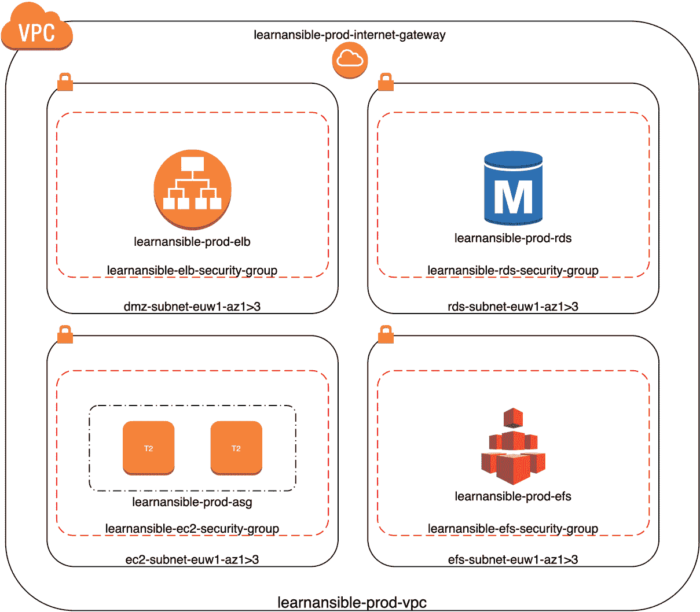

# 11

# 高可用云部署

继续我们的 AWS 部署，我们将开始将服务部署到我们在上一章创建的网络中，到本章结束时，我们将拥有一个高可用的 WordPress 安装。

基于我们在上一章创建的角色，我们将执行以下操作：

+   启动和配置应用负载均衡器

+   启动和配置 Amazon **关系型数据库服务**（**RDS**）（数据库）

+   启动和配置 Amazon **弹性文件系统**（**EFS**）（共享存储）

+   启动 **弹性计算云**（**EC2**）实例并从中创建 **Amazon 机器镜像**（**AMI**）（部署 WordPress 代码）

+   启动和配置一个启动模板，使用新创建的 AMI 和自动扩展组（高可用性）

本章涵盖以下主题：

+   规划部署

+   操作手册

+   运行操作手册

+   终止所有资源

# 技术要求

和上一章一样，我们将使用 AWS；你需要我们在上一章创建的访问密钥和秘密密钥来启动所需的资源，以实现我们的高可用 WordPress 安装。请注意，我们将启动会产生费用的资源。同样，你可以在附带的 GitHub 仓库中的 `Chapter11` 文件夹找到完整的操作手册，地址为 [`github.com/PacktPublishing/Learn-Ansible-Second-Edition/tree/main/Chapter11/`](https://github.com/PacktPublishing/Learn-Ansible-Second-Edition/tree/main/Chapter11/)。

# 规划部署

在深入研究操作手册之前，我们应该先了解我们要实现的目标。如前所述，我们将在我们的 AWS **虚拟私有云**（**VPC**）角色上构建，添加实例和存储；我们的最终部署将如以下图所示：



图 11.1 – 我们将要启动的概览

在图中，我们有以下内容：

+   2 x EC2 实例 (t2.micro)，部署在不同的可用区

+   1 x RDS 实例 (t2.micro)

+   1 x EFS 存储，跨越三个可用区

在我们讨论部署本身之前，根据这里的图示和规格，运行此部署的成本是多少？

## 部署成本估算

在 EU-West-1 区域运行此部署的成本如下：

| **实例类型** | **#** **数量** | **实例费用** | **每月总费用** |
| --- | --- | --- | --- |
| EC2 实例 (t2.micro) | x2 | $9.20 | $18.40 |
| RDS 实例 (t2.micro) | x1 | $13.14 | $13.14 |
| 应用负载均衡器 | x1 | $24.24 | $24.24 |
| EFS | 5GB | $0.88 | $4.40 |
| **总计** |  |  | $61.83 |

表 11.1 – 部署运行成本

还有一些其他的次要费用，比如带宽和存储包含我们软件堆栈的 AMI。我们也可以考虑通过增加冗余来提高这些费用，例如将我们的 RDS 实例更新为多 AZ 的 RDS 主实例和备份实例部署，并增加 EC2 实例的数量。

然而，这为我们的部署引入了额外的复杂性，因为我们将花费余下的章节来介绍 playbook，playbook 将负责部署资源。我现在希望将这个 playbook 保持尽可能简单。

## WordPress 的考虑因素和高可用性

到目前为止，我们一直在单台服务器上启动 WordPress，这是可以的。但因为我们希望尽可能消除部署中的单点故障，我们必须认真思考如何初始配置和启动我们的部署。

首先，让我们讨论一下我们需要启动部署的顺序。我们需要处理元素的主要顺序如下：

+   **VPC、子网、互联网网关、路由和安全组**：这些都是启动我们部署所需要的。

+   **应用弹性负载均衡器**：我们将在安装过程中使用弹性负载均衡器的公共主机名，因此在我们开始安装之前，需要先启动它。

+   **RDS 数据库实例**：我们的数据库实例必须在我们启动安装之前可用，因为我们需要创建 WordPress 数据库并引导安装过程。

+   **EFS 存储**：我们需要一些存储来在接下来启动的 EC2 实例之间共享。

到目前为止，一切顺利；然而，这也是我们必须开始考虑 WordPress 的时候。

正如一些有经验的人所知道的那样，当前版本的 WordPress 并不是为了在多个服务器上分布而设计的。我们可以应用很多技巧和变通方法，使 WordPress 在这种部署方式中正常工作；然而，本章的重点并不是部署 WordPress 的细节问题。而是使用 Ansible 来部署一个多层次的 Web 应用程序。

因此，我们将选择最基础的多实例 WordPress 选项，将代码和内容部署到 EFS 卷上。这意味着我们需要做的就是安装 LEMP 堆栈。需要注意的是，这个选项在大规模部署时可能会更具性能优势，但它能够满足我们的需求。

现在，回到任务列表。当涉及到启动我们的实例时，我们需要执行以下操作：

1.  启动一个临时的运行 Ubuntu 的 EC2 实例，以便重用现有的 playbook 中的部分内容。

1.  更新操作系统并安装软件堆栈、支持工具和配置，以便我们安装并运行 WordPress。

1.  挂载 EFS 卷，设置正确的权限，并配置其在实例启动时自动挂载。

1.  引导启动 WordPress 本身。

1.  从临时实例创建一个 AMI，然后终止该临时实例，因为它现在不再需要。

1.  创建一个启动模板，使用我们刚刚创建的 AMI。

1.  创建一个自动伸缩组并附加启动配置；它还应该将我们的 WordPress 实例注册到 Elastic Load Balancer。

后续的 Playbook 运行将更新操作系统和非 WordPress 配置，应当在现有实例已启动并运行的情况下重复这一过程；一旦 AMI 创建完成，它应与当前实例一同部署，并且在新实例注册到 Elastic Load Balancer 并接收流量后，旧实例将被终止。

这将允许我们在不造成停机的情况下更新操作系统的软件包和配置，如果一切按计划进行的话！

现在我们大概了解了要实现的目标，让我们开始编写我们的 Playbook。

# Playbook

我们将使用在 *第十章* 中查看的 Playbook 作为起点，*构建云网络*，因为所有角色都与我们的部署相关，而且它已经具备了我们所需的 Playbook 结构。

我们还将使用角色来部署和配置 WordPress 及我们在 *第九章* 中使用的支持软件栈，*迁移到云端*，并做一些调整，因为我们面向的是 AWS 而不是 Microsoft Azure；当我们遇到这些调整时，我会告诉你。

与之前的章节不同，我们首先查看 `site.yml` 文件，以了解我们将执行角色的顺序。

文件中有三个阶段，从部署和配置我们基础 AWS 资源的阶段开始：

```
- name: "Deploy and configure the AWS Environment"
  hosts: localhost
  connection: local
  gather_facts: true
  vars:
    state: "present"
  vars_files:
    - group_vars/common.yml
  roles:
    - vpc
    - subnets
    - gateway
    - securitygroups
    - elb
    - efs
    - rds
    - ec2tmp
    - endpoints
```

如你所见，这与来自 *第十章* 的 `site.yml` 文件相同，*构建云网络*，只是从 `securitygroups` 角色开始，列表中添加了额外的角色。

当我们的 Playbook 执行到第二阶段时：

```
- name: "Install and configure Wordpress"
  hosts: vmgroup
  gather_facts: true
  become: true
  become_method: "ansible.builtin.sudo"
  vars_files:
    - group_vars/common.yml
    - group_vars/generated_aws_endpoints.yml
  roles:
    - stack_install
    - stack_config
    - wordpress
```

一个名为`group_vars/generated_aws_endpoints.yml`的文件会被生成，并且应该有一个临时虚拟机实例正在运行，这意味着可以通过 SSH 访问运行 Playbook 的主机。

一旦这一阶段完成，我们的临时虚拟机实例应该已经安装了我们的软件栈。如果这是首次运行 Playbook，WordPress 会被全新安装；如果 Playbook 检测到已有的 WordPress 安装并保持不变，除非 Playbook 内的插件配置有任何更改。

最终阶段是执行：

```
- name: "Create AMI and update the Auto Scaling Group"
  hosts: localhost
  connection: local
  gather_facts: true
  vars:
    state: "present"
  vars_files:
    - group_vars/common.yml
  roles:
    - ec2ami
    - autoscaling
```

这一阶段从临时虚拟机实例创建一个 AMI，终止临时实例（因为我们不再需要它），创建一个新的启动模板版本，然后创建/更新自动伸缩组，以便在 EC2 实例上部署新版本。

听起来很简单？好吧，让我们来看看。

## 变量

开箱即用时，有一个名为`group_vars/common.yml`的单一变量文件，包含了部署我们环境所需的所有静态变量。

在 Playbook 运行过程中，`group_vars`文件夹内将创建一些附加文件；它们将包含一些动态生成的资源，如密码、资源名称/端点和其他信息。

我们将在查看创建和与之交互的任务时更详细地讨论这些文件；现在，我们将查看`group_vars/common.yml`中定义的静态变量，从基础应用配置开始。

### 应用程序和资源配置

我们从配置中开始，提供了启用/禁用调试的选项。默认情况下，设置为`false`；然而，在运行 Playbook 时，我建议将其切换为`true`并查看输出：

```
debug_output: false
```

接下来，我们有应用程序名称、区域和环境参考：

```
app:
  name: "learnansible"
  region: "eu-west-1"
  env: "prod"
```

下一个块的变量定义了 WordPress 数据库的详细信息；由于我们将使用 Amazon RDS 服务，我们只使用文件后面定义的变量，因此只需要在一个地方更新信息：

```
wp_database:
  name: "{{ rds.db_name }}"
  username: "{{ rds.db_username }}"
  password: "{{ rds.db_password }}"
```

下一个块是用于配置 WordPress 本身的各种变量：

```
wordpress:
  domain: "http://{{ aws_endpoints.elb }}/"
  title: "WordPress installed by Ansible on {{ os_family }}"
  username: "ansible"
  password: "{{ rds.db_password }}"
  email: "test@test.com"
  plugins:
    - "jetpack"
    - "wp-super-cache"
    - "wordpress-seo"
    - "wordfence"
    - "nginx-helper"
```

除了使用`aws_endpoints.lb`变量（在 Elastic Load Balancer 启动之前无法知道）之外，自我们在*第九章*《迁移到云端》一文中最后一次定义这些变量以来，没有什么重大变化。为了方便使用，我们重新利用了将在文件后面动态生成的密码作为 WordPress 管理员密码。

### 堆栈配置

下一部分覆盖了`roles/stack_install`角色中的默认设置：

```
stack_packages:
  - "nginx"
  - "mariadb-client"
  - "php-cli"
  - "php-curl"
  - "php-fpm"
  - "php-gd"
  - "php-intl"
  - "php-mbstring"
  - "php-mysql"
  - "php-soap"
  - "php-xml"
  - "php-xmlrpc"
  - "php-zip"
  - "nfs-common" # Added for AWS
  - "nfs4-acl-tools" # Added for AWS
  - "autofs"  # Added for AWS
  - "rpcbind"  # Added for AWS
```

我们已从软件包列表中移除了`mariadb-server`，因为我们不再需要安装或配置本地数据库服务器，并且在最后添加了四个软件包（全部标注为`# Added for AWS`）。这些软件包安装了使用 NFS 协议挂载 EFS 文件系统所需的软件，这样我们顺利进入下一个块：

```
nfs:
  mount_point: "/var/www/"
  mount_options: "nfsvers=4.1,rsize=1048576,wsize=1048576,hard,timeo=600,retrans=2"
  state: "mounted"
  fstype: "nfs4"
```

如你所见，这里定义了一些关于 EFS 文件系统应该挂载的位置、使用的选项以及它的文件系统类型的基本信息。

### 资源名称

下一部分构建了我们要部署的资源名称；这里没有什么特别的内容——它只是这样定义的，以便我们无需手动更新多个地方的重复信息：

```
vpc_name: "{{ app.name }}-{{ app.env }}-{{ playbook_dict.vpc }}"
internet_gateway_name: "{{ app.name }}-{{ app.env }}-{{ playbook_dict.internet_gateway }}"
internet_gateway_route_name: "{{ internet_gateway_name }}-{{ playbook_dict.route }}"
elb_target_group_name: "{{ app.name }}-{{ app.env }}-{{ playbook_dict.elb_target_group }}"
elb_name: "{{ app.name }}-{{ app.env }}-{{ playbook_dict.elb }}"
efs_name: "{{ app.name }}-{{ app.env }}-{{ playbook_dict.efs }}"
rds_name: "{{ app.name }}-{{ app.env }}-{{ playbook_dict.rds }}"
ec2_tmp_name: "{{ app.name }}-tmp-{{ playbook_dict.ec2 }}"
ami_name: "{{ app.name }}-{{ app.env }}-{{ playbook_dict.ami }}"
ec2_name: "{{ app.name }}-{{ app.env }}-{{ playbook_dict.ec2 }}"
launch_template_name: "{{ app.name }}-{{ app.env }}-{{ playbook_dict.lt }}"
asg_name: "{{ app.name }}-{{ app.env }}-{{ playbook_dict.asg }}"
```

我们不会在这里覆盖完整的`playbook_dict`块，因为没有太多内容可看，不过提醒一下，这就是它开始的样子：

```
playbook_dict:
  deployedBy: "Ansible"
  ansible_warning: "Resource managed by Ansible"
  vpc: "vpc"
```

它继续定义服务名称。接下来的部分是我们开始定义用于 AWS 资源部署的变量。

## EC2 配置

`ec2`变量分为几个不同的层。用于自动扩展组、AMI 和 SSH 密钥对的层遵循一些通用设置：

```
ec2:
  instance_type: "t2.micro"
  public_ip: true
  ssh_port: "22"
```

这些变量跨实例使用，除了`public_ip`引用，它仅在启动临时虚拟机实例以引导 WordPress 时使用。

下一层定义了关于自动扩展组和启动模板的一些细节；它们有助于定义启动多少实例、如何更新实例以及负载均衡器如何检查它们是否健康：

```
  asg:
    min_size: 1
    max_size: 3
    desired_capacity: 2
    health_check_type: "EC2"
    replace_batch_size: 1
    health_check_period: 300
    replace_all_instances: true
    wait_for_instances: true
    wait_timeout: 900
    disable_api_termination: true
```

接下来，我们定义了我们将使用的基本 AMI 的详细信息；如你所见，我们使用的是由 Canonical 发布和维护的 Ubuntu 22.04：

```
  ami:
    owners: "099720109477"
    filters:
      name: "ubuntu/images/hvm-ssd/ubuntu-jammy-22.04-amd64-server-*"
      virtualization_type: "hvm"
```

最后，我们有一些关于上传到 AWS 并在启动虚拟机实例时使用的密钥对的详细信息：

```
  keypair:
    name: "ssh_keypair"
    key_material: "{{ lookup('file', '~/.ssh/id_rsa.pub') }}"
```

接下来是启动 RDS 服务时使用的变量。

### RDS 配置

这些都是标准配置，除了`rds.db_password`变量：

```
rds:
  db_username: "{{ app.name }}"
  db_password: "{{ lookup('password', 'group_vars/generated_rds_passwordfile chars=ascii_letters,digits length=30') }}"
  db_name: "{{ app.name }}"
  instance_type: "db.t2.micro"
  engine: "mysql"
  engine_version: "8.0"
  allocated_storage: "5"
```

如你所见，我们使用查找模块将一个随机密码添加到`group_vars/generated_rds_passwordfile`文件中；我们指示该模块生成一个由字母和数字组成的 30 字符随机密码。

### EFS 配置

在这里，我们定义了用于告诉 Ansible 在创建 EFS 资源时等待多长时间的变量：

```
efs:
  wait: "yes"
  wait_time: "1200"
```

### VPC 和子网配置

这一块与*第十章*《构建云网络》中的内容保持一致。

### 安全组配置

这个部分与*第十章*《构建云网络》中的内容大部分相同，唯一的不同是我们现在将 SSH 端口定义为`ec2.ssh_port`。我已更新 EC2 组，使用此引用，而不是将端口 22 硬编码到此块中。唯一的其他新增项是：

```
elb_seach_string: "elb"
ec2_seach_string: "ec2"
rds_seach_string: "rds"
efs_seach_string: "efs"
```

这些将在整个 Playbook 中使用，当我们查询 AWS API 以获取有关安全组的信息时。

### 最后的块

根据*第十章*《构建云网络》，其中包含以下内容：

```
region: "{{ app.region }}"
```

这就结束了我们对`group_vars/common.yml`文件的快速浏览；如你所见，无论在结构还是内容上，我们都遵循了过去几章的相同模式，按逻辑将变量分组，并尽量在整个过程中重复使用引用，以避免重复信息。

## Playbook 角色

现在我们已经介绍了变量，我们可以按`site.yml`文件中出现的顺序处理这些角色。

### VPC、子网、网关和安全组角色

这些角色与*第十章*《构建云网络》中的内容没有变化；它们只是直接放置并按预期工作。Playbook 中这一部分的剩余角色将在引用子网、安全组和 VPC 时，引用这些角色的输出。

### 应用程序弹性负载均衡器（ELB）角色

在此角色中，我们将部署两个资源，第一个是目标组。在我们启动自动扩展虚拟机实例时，这个目标组将被使用——我们将实例附加到目标组上。然后，目标组被附加到我们将在此角色中启动的应用弹性负载均衡器。

该任务本身是相对静态的，如以下任务代码所示：

```
- name: "Provision the target group"
  community.aws.elb_target_group:
    name: "{{ elb_target_group_name }}"
    region: "{{ region }}"
    state: "{{ state }}"
    protocol: "http"
    port: "80"
    deregistration_delay_timeout: "15"
    vpc_id: "{{ vpc_output.vpc.id }}"
    modify_targets: "false"
    tags:
      "Name": "{{ elb_target_group_name }}"
      "projectName": "{{ app.name }}"
      "environment": "{{ app.env }}"
      "deployedBy": "{{ playbook_dict.deployedBy }}"
      "description": "{{ playbook_dict.ansible_warning }}"
      "role": "target-group"
  register: elb_target_group_output
```

我们只是引用变量，唯一的动态内容是 VPC 的 ID，这是通过`vpc_output`变量引用的，该变量在 VPC 角色中启动 VPC 时已注册。

由于我们在此角色中注册了一些输出，我们将继续在后面添加一个调试任务；在这种情况下，任务如下所示：

```
- name: "Debug: ELB Target Group Output"
  ansible.builtin.debug:
    var: "elb_target_group_output"
  when: debug_output
```

正如我们在*第十章*《构建云网络》中已经讨论过的，我们在概述 Playbook 时不会重复这些任务，除非我们做的是不同的事情——所以，从现在开始，如果我们正在注册一个输出，请假设会紧接着进行一个调试任务。

在创建 ELB 之前，我们还需要一个信息，那就是安全组的 ID。

为了获取这一信息，我们可以遍历`security_groups_with_rules_output`变量，并在`group_name`包含`elb_seach_string`变量内容时使用`set_fact`来设置`group_id`：

```
- name: Extract ELB Group ID
  ansible.builtin.set_fact:
    elb_group_id: "{{ item.group_id }}"
  loop: "{{ security_groups_with_rules_output.results }}"
  when: item.group_name is search(elb_seach_string)
```

每当我们需要安全组的 ID 时，我们将使用相同的模式，但更新设置的事实名称和相应的搜索引导变量。

以下任务配置应用弹性负载均衡器，用于将 HTTP 请求分发到我们的自动扩展管理虚拟机实例，以便为我们的 WordPress 网站提供服务：

```
- name: "Provision an application elastic load balancer"
  amazon.aws.elb_application_lb:
    region: "{{ region }}"
    name: "{{ elb_name }}"
    state: "{{ state }}"
    security_groups: "{{ elb_group_id }}"
    subnets: "{{ subnet_public_ids }}"
    listeners:
      - Protocol: "HTTP"
        Port: "80"
        DefaultActions:
          - Type: "forward"
            TargetGroupArn: "{{ elb_target_group_output.target_group_arn }}"
    tags:
      "Name": "{{ elb_name }}"
      "projectName": "{{ app.name }}"
      "environment": "{{ app.env }}"
      "deployedBy": "{{ playbook_dict.deployedBy }}"
      "description": "{{ playbook_dict.ansible_warning }}"
      "role": "load-balancer"
  register: loadbalancer_output
```

如你所见，我们将应用弹性负载均衡器附加到`subnet_public_ids`中列出的子网，并将安全组附加到之前任务中注册的`elb_group_id`事实。

然后，我们配置一个`80`端口的监听器，以接受 HTTP 流量并将其转发到我们在角色开始时启动的目标组——这就完成了应用弹性负载均衡器的角色。

### 弹性文件系统（EFS）角色

该角色从设置`efs_group_id`的任务开始，使用`efs_seach_string`变量。一旦我们知道应用到 EFS 服务的安全组 ID，就可以继续执行下一个任务。

该任务使用模板生成一个文件，并将其放入`group_vars`文件夹中：

```
- name: "Generate the efs targets vars file"
  ansible.builtin.template:
    src: "targets.j2"
    dest: "group_vars/generated_efs_targets.yml"
    mode: "0644"
```

用于填充`group_vars/generated_efs_targets.yml`文件的模板文件如下所示：

```
efs_targets:

      - subnet_id: "{{ item }}"
        security_groups: [ "{{ efs_group_id }}" ]

```

在这里，我们使用 Jinja2 的`for`循环遍历`subnet_storage_ids`的内容，这将创建一个类似以下内容的文件：

```
efs_targets:
      - subnet_id: "subnet01_id"
        security_groups: [ "efs_group_id" ]
      - subnet_id: "subnet02_id"
        security_groups: [ "efs_group_id" ]
      - subnet_id: "subnet03_id"
        security_groups: [ "efs_group_id" ]
```

这意味着当我们创建 EFS 文件系统时，它将在我们选择的区域的所有可用区中可用。

好的，一旦我们加载了刚才加载的文件内容，它就会完成，这在下一个任务中实现，正如你在这里看到的：

```
- name: "Include the efs targets vars file"
  ansible.builtin.include_vars: "group_vars/generated_efs_targets.yml"
```

现在我们已经做好了创建 EFS 文件系统的所有准备工作，这可以通过以下任务来完成：

```
- name: "Create the EFS File System"
  community.aws.efs:
    name: "{{ efs_name }}"
    region: "{{ region }}"
    state: "{{ state }}"
    tags:
      "Name": "{{ efs_name }}"
      "projectName": "{{ app.name }}"
      "environment": "{{ app.env }}"
      "deployedBy": "{{ playbook_dict.deployedBy }}"
      "description": "{{ playbook_dict.ansible_warning }}"
      "role": "efs"
    targets: "{{ efs_targets }}"
    wait: "{{ efs.wait }}"
    wait_timeout: "{{ efs.wait_time }}"
  register: efs_output
```

创建文件系统可能需要几分钟，我们必须等到此任务成功完成后才能继续，这就是为什么我们要使用等待标志。如果不等待，我们会增加文件系统在虚拟机启动时未准备好，无法挂载的风险，这将导致 Playbook 执行失败。

说到需要一些时间的任务，下一个角色处理的是启动 Amazon RDS 实例，我们将把它作为 WordPress 网站的数据库。这个任务最多可能需要 10 分钟才能完成。

### Amazon RDS 角色

该角色主要由两部分组成；第一部分执行的任务类似于我们在前一个角色中创建 EFS 目标时所做的任务。

RDS 服务的不同之处在于，当我们部署服务时，不需要手动传递子网，而是可以在 AWS 端原生创建一个组，然后在启动 RDS 实例时引用它。

创建 RDS 子网组的任务如下所示：

```
- name: "Add RDS subnet group"
  amazon.aws.rds_subnet_group:
    name: "{{ rds_name }}"
    region: "{{ region }}"
    state: "{{ state }}"
    description: "{{ dict.ansible_warning }}"
    subnets: "{{ subnet_database_ids }}"
    tags:
      "Name": "{{ rds_name }}"
      "projectName": "{{ app.name }}"
      "environment": "{{ app.env }}"
      "deployedBy": "{{ playbook_dict.deployedBy }}"
      "description": "{{ playbook_dict.ansible_warning }}"
      "role": "rds"
  register: rds_subnet_group_output
```

创建子网组后，我们需要使用 `rds_seach_string` 变量找到安全组 ID，并设置一个名为 `rds_group_id` 的事实。

现在我们已经拥有了启动 RDS 实例所需的所有信息，执行这个任务看起来如下：

```
- name: "Create the RDS instance"
  amazon.aws.rds_instance:
    id: "{{ rds_name }}"
    region: "{{ region }}"
    state: "{{ state }}"
    db_instance_class: "{{ rds.instance_type }}"
    engine: "{{ rds.engine }}"
    engine_version: "{{ rds.engine_version }}"
    allocated_storage: "{{ rds.allocated_storage }}"
    username: "{{ rds.db_username }}"
    password: "{{ rds.db_password }}"
    db_name: "{{ rds.db_name }}"
    db_subnet_group_name: "{{ rds_subnet_group_output.subnet_group.name }}"
    vpc_security_group_ids: ["{{ rds_group_id }}"]
    tags:
      "Name": "{{ rds_name }}"
      "projectName": "{{ app.name }}"
      "environment": "{{ app.env }}"
      "deployedBy": "{{ playbook_dict.deployedBy }}"
      "description": "{{ playbook_dict.ansible_warning }}"
      "role": "rds"
  register: rds_instance_output
```

正如上一任务结束时提到的，这个过程可能需要一些时间，通常超过 10 分钟，因此当我们运行 Playbook 时，这个任务看起来会好像已经停止了。

所以请不要担心——它正在后台忙碌地工作。

一旦此角色执行完成，我们将拥有启动 EC2 实例、进行软件配置并安装 WordPress 所需的所有核心 AWS 资源。

### 临时 EC2 实例角色

在我们开始执行启动临时实例的任务之前，先详细了解一下我们为什么需要临时 EC2 实例。

正如我们在简介中提到的，这个实例将运行 Ubuntu，我们将用稍微修改过的 `stack_install`、`stack_config` 和 `wordpress` 角色来操作它，这些角色最早是在 *第五章* *部署 WordPress* 中本地运行过的，后来又在 *第九章* *迁移到云* 中针对单一云实例运行过。

我们将对角色进行的修改之一是安装挂载 EFS 所需的软件，接下来我们将使用它来存储 WordPress 代码和支持文件，以便在共享文件系统中存储所有 WordPress 所需的文件，并可以在多个虚拟机实例上挂载。

第二个变化是，我们不再在本地实例上安装数据库服务器，而是使用 Amazon RDS 数据库服务来支持 WordPress，这意味着我们可以拥有多个 WordPress 实例，它们都能够连接到一个单一的远程数据库。

很好，你可能会想，这样说不错，但这并没有解释为什么这是一个临时实例。

好的，一旦一切安装、挂载、配置完毕并且 WordPress 已经启动，我们将创建自己的**Amazon 机器镜像**（**AMI**），并终止临时的 EC2 实例。终止后，我们将使用该 AMI 并配置我们的自动扩展组以使用新创建的镜像，如果这是我们第一次运行操作手册，系统将触发新主机的部署；如果我们已经有运行 WordPress 安装的虚拟机实例，它将启动更多实例并终止旧的实例。

当这些虚拟机实例使用我们自定义的 AMI 启动时，它们将已经安装并配置好 NGINX 和 PHP，准备好为 WordPress 提供服务，而且包含我们 WordPress 文件的 EFS 将被挂载，这意味着我们的服务器一旦部署就能立即运行。

所有这些意味着，如果我们因为任何原因遇到流量激增，我们的 WordPress 安装应该能够良好地扩展，而且我们所有的虚拟机实例都将运行一个已知的、良好的配置；事实上，它将与为我们的 WordPress 网站提供服务的其他主机使用相同的配置。

同样重要的是，由于我们不依赖本地虚拟机实例的文件系统中的任何内容，我们在流量激增后能够自动缩放，通过自动终止主机来减少实例数量，而不会有数据丢失或可用性问题的风险。

如果这个方法计划得当——理论上，我们甚至不需要通过 SSH 访问由自动扩展组启动的主机，因为我们不需要手动管理它们，我们可以将它们视为短期实例，完全不需要关心它们是否正在运行或已经终止——只需要确保有足够的实例来交付我们的应用。

所以，现在我们知道了为什么要采用这种方法，让我们回到操作手册，看看需要完成哪些任务，以使这个临时的 EC2 实例能够启动并运行，直到我们可以通过 SSH 连接它并安装我们的软件和 WordPress。

第一个任务是使用我们在本章之前介绍的变量，获取所有 Ubuntu AMI 的列表：

```
- name: "Gather information about AMIs with the specified filters"
  amazon.aws.ec2_ami_info:
    region: "{{ region }}"
    owners: "{{ ec2.ami.owners }}"
    filters:
      name: "{{ ec2.ami.filters.name }}"
      virtualization-type: "{{ ec2.ami.filters.virtualization_type }}"
  register: ubuntu_ami_info
```

返回的 AMI 列表将包含我们所选 Ubuntu 版本的所有不同 AMI 版本；我们只需要知道由 Canonical（Ubuntu 的发布者和维护者）发布的最新版本的 ID，这样我们就能确保使用的是包含最新补丁和修复的最新镜像。

幸运的是，列表中返回的每个 AMI 都有一个名为 `creation_date` 的键，值为 AMI 发布的日期和时间。正如你可能猜到的，这意味着我们可以运行以下任务来获取最新版本 AMI 的 ID：

```
- name: "Filter the list of AMIs to find the latest one"
  ansible.builtin.set_fact:
    ami: "{{ ubuntu_ami_info.images | sort(attribute='creation_date') | last }}"
```

如你所见，上一任务获取了列表的内容，这个列表被定义为 `ubuntu_ami_info.images`，并根据 `creation_date` 排序，然后取列表中最后一个 AMI 的 ID，因为默认情况下，它们是按升序排序的。

既然我们已经知道了最新的 Ubuntu AMI 的 ID，我们可以继续进行更多的准备工作，为启动我们的 EC2 实例做准备。

现在，我们需要在 AWS 端创建一个 SSH 密钥对。这个密钥对将包含我们用来访问启动后的 EC2 实例的 SSH 密钥的公钥部分 —— 配置此任务的步骤如下，它使用我们在本章之前提到的变量来获取公钥部分的内容：

```
- name: "Create a SSH Key Pair"
  amazon.aws.ec2_key:
    region: "{{ region }}"
    state: "{{ state }}"
    name: "{{ ec2.keypair.name }}"
    key_material: "{{ ec2.keypair.key_material }}"
    tags:
      "Name": "{{ ec2.keypair.name }}"
      "projectName": "{{ app.name }}"
      "environment": "{{ app.env }}"
      "deployedBy": "{{ playbook_dict.deployedBy }}"
      "description": "{{ playbook_dict.ansible_warning }}"
      "role": "ssh_keypair"
  register: keypair_output
```

最后，在我们启动 EC2 实例之前，我们需要安全组的 ID，这个安全组允许我们运行 Ansible SSH 的主机通过公共 IP 地址访问 EC2 实例。为此，我们使用 `ec2_seach_string` 变量查找正确的组 ID，并设置一个名为 `ec2_group_id` 的事实。

现在，我们已准备好通过以下任务启动 EC2 实例：

```
- name: "Create the temporary ec2 instance"
  amazon.aws.ec2_instance:
    name: "{{ ec2_tmp_name }}"
    region: "{{ region }}"
    state: "{{ state }}"
    vpc_subnet_id: "{{ subnet_compute_ids[0] }}"
    instance_type: "{{ ec2.instance_type }}"
    security_group: "{{ ec2_group_id }}"
    key_name: "{{ ec2.keypair.name }}"
    network:
      assign_public_ip: "{{ ec2.public_ip }}"
    image_id: "{{ ami.image_id }}"
    tags:
      Name: "{{ ec2_tmp_name }}"
      Description: "{{ dict.ansible_warning }}"
      Project: "{{ app.name }}"
      Environment: "{{ app.env }}"
      Deployed_by: "Ansible"
      Role: "tmp"
  register: ec2_tmp_instance_output
```

在前一个任务中指出的唯一事项是，当我们为 `vpc_subnet_id` 添加值时，只能传入单个 ID。由于我们不需要这个虚拟机实例具有高可用性，因此这不是问题，所以我们使用子网 ID 列表中的第一个 ID，即 `{{ subnet_compute_ids[0] }}`。

当在 AWS 中启动 EC2 实例时，它会经历几个阶段，默认情况下，`amazon.aws.ec2_instance` 模块会创建实例，但不会等待状态从 *creating* 变为 *running*。

下一步任务会轮询 AWS API，等待我们的 EC2 实例的状态变为 *running*：

```
- name: "Get information about the temporary EC2 instance to see if it is running"
  amazon.aws.ec2_instance_info:
    region: "{{ region }}"
    filters:
      instance-id: "{{ ec2_tmp_instance_output.instances[0].instance_id }}"
  register: ec2_tmp_instance_state
  delay: 5
  retries: 50
  until: ec2_tmp_instance_state.instances[0].state.name == "running"
```

如你所见，前一个任务获取了我们新创建的 EC2 实例的 ID，并每隔 `5` 秒轮询 AWS API，最多轮询 `50` 次，直到 `ec2_tmp_instance_state.instances[0].state.name` 的值变为 `running`。

你可能会觉得，这样做有点过于繁琐，99%的情况下，你是对的 —— 状态通常在检查几次后就会改变。不过，也有偶尔 AWS 系统会比较“慢”，在测试中，我曾看到状态变化最多需要检查 15 次，或者大约一分钟的时间。因此，我们需要在 Playbook 中考虑到这个延迟，因为如果不考虑，可能会导致 Playbook 执行失败。

下一步任务是获取当前正在运行的 EC2 实例的详细信息，包括 DNS 名称和 IP 地址，并将其添加到名为 `vmgroup` 的主机组中：

```
- name: "Add the temporary EC2 instance to the vmgroup"
  ansible.builtin.add_host:
    name: "{{ ec2_tmp_instance_output.instances[0].public_dns_name }}"
    ansible_ssh_host: "{{ ec2_tmp_instance_output.instances[0].public_ip_address }}"
    groups: "vmgroup"
```

在交给下一个角色之前，我们应该再进行一次检查。

有时，Ansible Playbook 执行任务太快，以至于即使我们的 EC2 实例状态显示为 *running*，也不意味着主机已经完全启动，SSH 已启动并可访问：

```
- name: "Wait for the temporary EC2 instance to be ready to accept SSH connections"
  ansible.builtin.wait_for:
    host: "{{ ec2_tmp_instance_output.instances[0].public_ip_address }}"
    port: "{{ ec2.ssh_port }}"
    delay: 10
    timeout: 300
```

现在，我们已经确认 EC2 主机可以通过 SSH 连接到运行 Ansible 的机器，接下来可以继续执行 `site.yml` 文件中这一部分的最后一个角色。

### 端点角色

这个角色有一个任务，它会创建一个文件 `generated_aws_endpoints.yml`，其中包含我们创建的 EFS、RDS 和 ELB 资源的 AWS 端点名称：

```
- name: "Generate the aws endpoints file"
  ansible.builtin.template:
    src: "endponts.j2"
    dest: "group_vars/generated_aws_endpoints.yml"
    mode: "0644"
```

`endponts.j2` 模板文件如下所示：

```
aws_endpoints:
  efs: "{{ efs_output.efs.filesystem_address.split(':')[0] }}"
  rds: "{{ rds_instance_output.endpoint.address }}"
  elb: "{{ loadbalancer_output.dns_name }}"
```

无论是 RDS 还是 ELB 端点都很直接；对于 EFS，你可能会注意到最后有点不同——那是做什么用的？

在 `efs_output.efs` 变量下注册的输出中没有任何内容仅包含 EFS 端点的地址。我们使用的 `filesystem_address` 包含文件系统挂载的信息，这通过在我们需要的 DNS 地址末尾附加 `:/` 来表示。

为了解决这个问题，我们使用了 `split` 函数，传递 `:` 作为分隔符，然后取第一个部分（定义为 `0`），意味着我们得到的是 `:` 之前的所有内容，这就是我们要找的 DNS 名称。

现在，我们已经有了填充好的 `group_vars/generated_aws_endpoints.yml` 文件，可以将它作为变量文件加载到 `site.yml` 文件的第二部分，这样我们就不需要从 EC2 实例与 AWS 进行交互了。

现在，既然我们的 EC2 实例已经启动并运行，让我们安装、配置软件堆栈，并引导 WordPress。

### 堆栈安装角色

这个角色中的任务与我们之前执行 Playbook 时没有变化，因为我们所做的所有更改都在我们传递的 `stack_packages` 变量中。

提醒一下，这个角色执行以下操作：

+   更新 APT 缓存并确保已安装的软件包运行的是最新版本——由于我们使用的是最新的 AMI，因此更新的数量不应该太多。

+   导入我们将启用的附加仓库的 APT 密钥

+   安装包含附加仓库详细信息的包并启用它们

+   安装 `system_packages`、`extra_packages` 和 `stack_packages` 变量中列出的包——`system_packages` 和 `extra_packages` 包含我们一直使用的默认值，因为我们通过 `group_vars/common.yml` 文件传递了更新后的 `stack_packages` 变量，这会覆盖之前章节中仍在 `roles/stack_install/defaults/main.yml` 文件中定义的默认值。

这为我们提供了安装在 EC2 实例上的所有基础软件。

### 堆栈配置角色

与之前的角色不同，这个角色做了一些修改，首先是增加了额外的任务。

三个任务被添加到`roles/stack_config/tasks/main.yml`的顶部，第一个任务是对上一节`site.yml`文件最后部分中的角色检查的延续：

```
- name: "Check that the EFS volume is ready"
  ansible.builtin.wait_for:
    host: "{{ aws_endpoints.efs }}"
    port: "2049"
    delay: 10
    timeout: 300
```

如你所见，这检查了端口`2049`是否在`aws_endpoints.efs`定义的端点处可访问；之所以这么做，是因为虽然 EFS 服务已经准备就绪，但 DNS 记录更新并在 VPC 内可访问可能需要一点时间。由于我们接下来将尝试挂载 EFS 文件系统，因此必须确保在继续之前它是可访问的。

接下来的任务是确保 RPC Bind 服务正常运行；我们需要挂载 EFS 文件系统：

```
- name: "ensure rpcbind service is running"
  ansible.builtin.service:
    name: "rpcbind"
    state: "started"
    enabled: true
```

最终的附加任务是挂载 EFS，并确保将其添加到文件系统配置中，以确保从现在开始，EFS 会在 EC2 实例启动时挂载：

```
- name: "mount the EFS volume"
  ansible.posix.mount:
    src: "{{ aws_endpoints.efs }}:/"
    path: "{{ nfs.mount_point }}"
    opts: "{{ nfs.mount_options }}"
    state: "{{ nfs.state }}"
    fstype: "{{ nfs.fstype }}"
```

如你在本章开始时看到的，我们将 EFS 挂载在`/var/www/`；我们确保在执行接下来的两个任务之前进行此操作，以确保我们的 WordPress `users`主目录在共享目录中创建。

这两个任务从上次安装 WordPress 以来没有变化，`wordpress_system.home`的值也是不变的，即`/var/www/wordpress`。

现在我们已经创建了 WordPress 用户和组，我们可以继续执行剩下的任务：

+   使用一些合理的默认值更新`/etc/nginx/nginx.conf`。

+   在`/etc/nginx/conf.d/default.conf`中创建我们默认主机的配置。

+   创建`/etc/nginx/global`目录，并将`restrictions.conf`和`wordpress_shared.conf`文件复制到该目录。

接下来的任务更多是一个生活质量的提升，涉及到我们的 Playbook 如何处理 PHP。这个 Playbook 的设计目的是通过使用基础的 Ubuntu 镜像，每次从头启动并保持我们的 WordPress 安装最新，而不是管理现有的配置。PHP 的版本在我们 WordPress 安装的生命周期中可能会发生变化。

到目前为止，每当执行`stack_config`角色时，它都使用了以下变量：

```
php_fpm_path: "/etc/php/8.1/fpm/pool.d/www.conf"
php_ini_path: "/etc/php/8.1/fpm/php.ini"
php_service_name: "php8.1-fpm"
```

如你所见，`8.1`是一个硬编码值。虽然我们可以在配置的其他地方以变量级别覆盖这些变量，但最好在运行时找出安装的 PHP 版本并引用它。

为此，我们可以按照以下方式更新这些值：

```
php_fpm_path: "/etc/php/{{ php_version }}/fpm/pool.d/www.conf"
php_ini_path: "/etc/php/{{ php_version }}/fpm/php.ini"
php_service_name: "php{{ php_version }}-fpm"
```

这意味着我们现在必须找到一种方法，将`php_version`变量填充为相关的 PHP 版本。

为此，我们可以运行`php -v`命令，它会返回有关安装的 PHP 版本的大量信息。然后，我们使用`head`和几个`cut`命令在 Linux 命令行中，使用`ansible.builtin.shell`而不是 Ansible 内置函数：

```
- name: "Get the PHP version"
  ansible.builtin.shell:
    cmd: "php -v | head -n 1 | cut -d ' ' -f 2 | cut -c 1-3"
  register: php_version_output
```

这是我们要求 Ansible 执行的命令的详细分解：

+   `php -v`：此命令运行时，会输出主机上安装的 PHP 版本信息；该输出通常是多行文本，包括 PHP 版本及其编译方式的附加信息。

+   `|`：这个符号被称为管道（pipe）。它将左侧命令的输出（在此例中为 `php -v`）作为输入传递给右侧的命令。它是一种在程序之间传递数据的方式。

+   `head -n 1`：此命令处理来自上一个命令的输入；`head` 命令输出接收到的文件或数据的第一部分。`-n 1` 是一个选项，告诉 `head` 只输出第一行。所以，在我们的例子中，`head -n 1` 会从 `php -v` 的多行输出中只返回第一行。

+   `|`：另一个管道，仍然是将其左侧命令 `head -n 1` 的输出传递给右侧的命令。

+   `cut -d ' ' -f 2`：此命令用于切割每行输入的部分。`-d ' '` 是一个选项，其中 `-d` 表示分隔符，`' '`（空格）是使用的分隔符。此命令告诉 `cut` 根据空格将每行分割成多个部分。`-f 2` 表示*第二个字段*。此选项告诉 `cut` 命令选择标准格式下 PHP 版本输出的第二个字段，该字段应为版本号。

+   `|`：再次出现管道，将输出结果（现在仅包含版本号）传递给下一个命令。

+   `cut -c 1-3`：此命令进一步处理版本号。`-c 1-3` 告诉 `cut` 仅返回字符串中位置为 `1` 到 `3` 的字符。对于典型的 PHP 版本，如 `8.2.1`，结果将是 `8.2`，这正是我们继续执行其他任务所需的版本号。

然后我们可以将输出注册为 `php_version_output`，并将 `php_version` 变量设置为事实（fact）：

```
- name: "Set the PHP version"
  ansible.builtin.set_fact:
    php_version: "{{ php_version_output.stdout }}"
```

现在我们已经获取了 PHP 版本，可以继续进行其他 PHP 任务，这些任务包括将 `www.conf` 文件复制到 `/etc/php/{{ php_version }}/fpm/pool.d/www.conf`，并更新 `/etc/php/{{ php_version }}/fpm/php.ini` 中的 `PHP.ini` 文件。

有了这些文件，我们启动 PHP-FPM 和 NGINX 服务，并确保它们设置为开机自启。

角色中的最后一个任务是创建 `~/.my.cnf` 文件，并将我们的 Amazon RDS 实例信息填充进去。所有其他 MariaDB 任务都已被注释掉，因为我们不再安装本地数据库服务器，因此不需要运行这些配置本地数据库的任务。

### WordPress 角色

该角色中只有两个任务被注释掉。创建数据库和数据库用户的任务不需要，因为当 Amazon RDS 实例启动时，数据库和用户已经为我们创建好了，意味着这两个任务是多余的。

其他任务保持不变；欲了解更多详情，请参见*第五章*，*部署 WordPress*。

### EC2 AMI 角色

现在我们的软件栈已安装并配置完毕，WordPress 也已设置好，是时候从临时实例创建 AMI 了。

我们首先需要做的是获取临时 EC2 实例的详细信息；由于我们的主机组包含实例的 DNS 名称，我们可以使用以下方式：

```
- name: "Find out some facts about the instance we have been using"
  amazon.aws.ec2_instance_info:
    region: "{{ region }}"
    filters:
      dns-name: "{{ groups['vmgroup'] }}"
  register: our_instance
```

现在我们已经将要从中创建 AMI 的实例信息注册为`our_instance`，可以继续进行 AMI 创建：

```
- name: "Create the AMI"
  amazon.aws.ec2_ami:
    region: "{{ region }}"
    state: "{{ state }}"
    instance_id: "{{ our_instance.instances[0].instance_id }}"
    wait: "yes"
    name: "{{ ami_name }}-{{ ansible_date_time.date }}_{{ ansible_date_time.hour }}{{ ansible_date_time.minute }}"
    tags:
      "Name": "{{ ami_name }}-{{ ansible_date_time.date }}_{{ ansible_date_time.hour }}{{ ansible_date_time.minute }}"
      "buildDate": "{{ ansible_date_time.date }} {{ ansible_date_time.time }}"
      "projectName": "{{ app.name }}"
      "environment": "{{ app.env }}"
      "deployedBy": "{{ playbook_dict.deployedBy }}"
      "description": "{{ playbook_dict.ansible_warning }}"
      "role": "{{ playbook_dict.ami }}"
  register: ami_output
```

这里有几点需要注意。如你所见，我们正在使用`ansible_date_time`来生成`date`并获取当前时间的`hour`和`minute`。我们将其用于为 AMI 提供唯一名称，并添加一个名为`buildDate`的标签。

我们使用日期和时间的原因是可能会在同一天内创建多个 AMI，因此需要确保通过名称能够轻松识别它们。

一旦 AMI 创建完成，我们不再需要临时实例，因此可以终止它：

```
- name: "Remove any temporary  instances which are running"
  amazon.aws.ec2_instance:
    region: "{{ region }}"
    state: "absent"
    name: "{{ ec2_tmp_name }}"
    filters:
      instance-state-name: "running"
      "tag:Name": "{{ ec2_tmp_name }}"
      "tag:Role": "tmp"
      "tag:Project": "{{ app.name }}"
```

一旦 EC2 实例被终止，角色中还有一项任务：

```
- name: "Wait for 2 minutes before continuing"
  ansible.builtin.pause:
    minutes: 2
```

这正是它所说的功能：它将暂停 Playbook 执行 2 分钟。

我添加这一点是因为曾经有过 AMI 已创建并显示为可用的情况，但由于某些原因，在我们查询 Amazon API 以查找 AMI 时，它需要稍微等待一段时间才能出现在结果中，因此为了避免下一角色开始时可能发生的错误，我发现最好等待一到两分钟。

### 自动扩展角色

我们已经进入 Playbook 的最后一个角色；在这个角色中，我们将创建部署 EC2 实例所需的所有资源，使用新创建的 AMI 并将其注册到 ELB 上，以便访问我们的 WordPress 站点。

我们首先需要做的是从 API 获取我们所有 AMI 的列表：

```
- name: "Search for all of our AMIs"
  amazon.aws.ec2_ami_info:
    region: "{{ region }}"
    filters:
      name: "{{ ami_name }}-*"
  register: ami_find
```

现在我们已有 AMI 列表，我们需要筛选出最新的一个。为此，我们使用与启动临时 EC2 实例时相同的逻辑：

```
- name: "Find the last one we built"
  ansible.builtin.set_fact:
    ami_sort_filter: "{{ ami_find.images | sort(attribute='creation_date') | last }}"
```

现在我们已经将 AMI 列表筛选到最新的那个，我们需要设置两个事实，一个是 AMI 的名称，另一个是 AMI 的 ID：

```
- name: "Grab AMI ID and name of the most recent result"
  ansible.builtin.set_fact:
    our_ami_id: "{{ ami_sort_filter.image_id }}"
    our_ami_name: "{{ ami_sort_filter.name }}"
```

在我们开始创建/更新资源之前，需要的最后一条信息是我们用于 EC2 实例的安全组 ID。

如之前所述，我们使用`ec2_seach_string`变量来查找正确的组 ID，并设置一个名为`ec2_group_id`的事实。

接下来，我们需要创建或更新启动模板（如果已有模板）。

启动模板包含我们将在自动扩展组中启动的实例的基本配置：

```
- name: "Create the launch template"
  community.aws.ec2_launch_template:
    region: "{{ region }}"
    state: "{{ state }}"
    name: "{{ launch_template_name }}"
    version_description: "{{ our_ami_name }}"
    image_id: "{{ our_ami_id }}"
    security_group_ids: ["{{ ec2_group_id.security_groups[0].group_id }}"]
    instance_type: "{{ ec2.instance_type }}"
    disable_api_termination: "{{ ec2.asg.disable_api_termination }}"
    tags:
      "Name": "{{ ec2_name }}"
      "projectName": "{{ app.name }}"
      "environment": "{{ app.env }}"
      "deployedBy": "{{ playbook_dict.deployedBy }}"
      "description": "{{ playbook_dict.ansible_warning }}"
      "role": "launchTemplate"
```

在此任务中，我们创建了启动模板，并发布了一个以 AMI 名称命名的版本，以便我们可以快速识别它；然后，我们附加了相应的 AMI ID 和安全组 ID，并设置了要启动实例的规格。

在启动模板准备好之后，我们需要从 AWS API 获取更多信息，然后才能创建自动扩展组。

首先，我们需要在 ELB 角色中创建的目标组的 ID：

```
- name: "Find out the target group ARN"
  community.aws.elb_target_group_info:
    region: "{{ region }}"
    names:
      - "{{ elb_target_group_name }}"
  register: elb_target_group_output
```

然后，我们需要获取子网的 ID，这些子网将用于部署作为自动扩展组一部分的 EC2 实例，以下任务会收集子网的信息：

```
- name: "Get information on the ec2 subnets"
  amazon.aws.ec2_vpc_subnet_info:
    region: "{{ region }}"
    filters:
      tag:role: "*{{ subnet_role_compute }}*"
  register: ec2_subnet_output
```

现在我们已经有了子网的信息，需要仅提取每个子网的 ID 并创建一个列表：

```
- name: "Create a list of subnet IDs"
  ansible.builtin.set_fact:
    subnet_ec2_ids: "{{ subnet_ec2_ids | default([]) + [item.subnet_id] }}"
  loop: "{{ ec2_subnet_output.subnets }}"
```

这是我们需要的最后一部分信息，现在可以继续创建或更新自动扩展组：

```
- name: "Create/update the auto-scaling group using the launch template we just created"
  amazon.aws.autoscaling_group:
    region: "{{ region }}"
    state: "{{ state }}"
    name: "{{ asg_name }}"
    target_group_arns: ["{{ elb_target_group_output.target_groups[0].target_group_arn }}"]
    launch_template:
      launch_template_name: "{{ launch_template_name }}"
    min_size: "{{ ec2.asg.min_size }}"
    max_size: "{{ ec2.asg.max_size }}"
    desired_capacity: "{{ ec2.asg.desired_capacity }}"
    health_check_period: "{{ ec2.asg.health_check_period }}"
    health_check_type: "{{ ec2.asg.health_check_type }}"
    replace_all_instances: "{{ ec2.asg.replace_all_instances }}"
    replace_batch_size: "{{ ec2.asg.replace_batch_size }}"
    vpc_zone_identifier: "{{ subnet_ec2_ids }}"
    wait_for_instances: "{{ ec2.asg.wait_for_instances }}"
    wait_timeout: "{{ ec2.asg.wait_timeout }}"
    tags:
      - key: "Name"
        value: "{{ ec2_name }}"
        propagate_at_launch: true
      - key: "Project"
        value: "{{ app.name }}"
        propagate_at_launch: true
      - key: "Environment"
        value: "{{ app.env }}"
        propagate_at_launch: true
      - key: "Deployed_by"
        value: "Ansible"
        propagate_at_launch: true
  register: ec2_asg_output
```

这是我们将要启动的最终资源，发生的事情相当多，因此我们需要更详细地了解。

首先，我们有 AWS 相关模块中的基本配置标准，这些模块在整个 Playbook 中都有调用；在这里，我们设置了资源的名称、区域和状态，对于本 Playbook，状态将设置为 `present`。

接下来，我们必须提供目标组的 `target_group_arns` 键，指定负载均衡器的目标组 ARN，我们将其设置为 `elb_target_group_output` 中的第一个目标组 ARN，然后 `launch_template` 键通过其名称引用启动模板，设置为 `launch_template_name` 的值。

现在我们已经有了大小和容量设置；`min_size`、`max_size` 和 `desired_capacity` 键分别使用 `ec2.asg.min_size`、`ec2.asg.max_size` 和 `ec2.asg.desired_capacity` 变量进行设置，这些变量定义了自动扩展组的最小、最大和期望实例数。

接下来是健康检查配置，设置 `health_check_period` 和 `health_check_type` 键，以控制如何检查 **自动扩展组** (**ASG**) 中实例的健康状况。

现在我们有了实例替换设置。`replace_all_instances` 和 `replace_batch_size` 键分别指示是否替换所有实例，并提供替换实例的批量大小。

然后，我们设置了网络配置，设置 `vpc_zone_identifier` 来使用存储在 `subnet_ec2_ids` 中的子网 ID 列表，将 ASG 中的实例分布到这些子网和可用区中。

接下来是等待设置，控制任务是否应该等待实例的状态为 `running`，并指定等待该条件满足的最长时间。

最后，你会注意到，我们在这里标记的方式与 Playbook 的其余部分有所不同；该任务定义了几个标签（`Name`、`Project`、`Environment`和`Deployed_by`）以及相应的值，所有标签都标记为在启动时传播，这意味着由自动扩展组启动的 EC2 实例在启动时会继承这些标签。

这就是我们对 Playbook 的演练总结。如你所见，我们扩展了原始的 AWS 网络 Playbook，从*第十章*，“构建云网络”，将更多的服务整合进来，并结合了我们在*第五章*，“部署 WordPress”中讨论的 WordPress 角色——现在剩下的就是运行 Playbook 了。

# 运行 Playbook

现在我们有了部署资源到 AWS 所需的所有角色，我们可以运行 Playbook。首先，我们需要通过运行以下命令，并使用你自己的凭证设置环境变量，告诉 Ansible 我们的访问密钥和密钥：

```
$ export AWS_ACCESS_KEY=AKIAI5KECPOTNTTVM3EDA
$ export AWS_SECRET_KEY=Y4B7FFiSWl0Am3VIFc07lgnc/TAtK5+RpxzIGTr
```

设置好环境变量后，通过以下命令启动 Ansible 运行：

```
$ ansible-playbook -i hosts site.yml
```

与前几章不同，我们这里只关注部署资源时发生的重点，而不是只看 Playbook 运行结束时的结果。

## Playbook 运行亮点

这不是完整的 Playbook 输出，在运行 Playbook 时，我没有启用调试，因此所有这些任务都将被跳过。

我们从 VPC 开始：

```
PLAY [Deploy and configure the AWS Environment] ***********
TASK [Gathering Facts] ************************************
ok: [localhost]
TASK [roles/vpc : Create VPC] *****************************
changed: [localhost]
```

一旦我们收集到我们选择区域的可用区信息，我们就有地方放置子网了：

```
TASK [roles/subnets : Get some information on the available zones] *************
ok: [localhost]
```

一旦我们获得了这些信息，Playbook 会循环执行并包括`create_subnet.yml`任务：

```
TASK [roles/subnets : Create all subnets] *****************
included: create_subnet.yml for localhost => (item={'name': 'ec2', 'role': 'compute'})
included: create_subnet.yml for localhost => (item={'name': 'rds', 'role': 'database'})
included: create_subnet.yml for localhost => (item={'name': 'efs', 'role': 'storage'})
included: create_subnet.yml for localhost => (item={'name': 'dmz', 'role': 'public'})
```

接着，我们获取每个包含的四个任务运行的结果，第一个结果如下所示：

```
TASK [roles/subnets : Create subnet in the availability zone] *****************************************************
changed: [localhost] => (item={'state': 'available', 'opt_in_status': 'opt-in-not-required', 'messages': [], 'region_name': 'eu-west-1', 'zone_name': 'eu-west-1a', 'zone_id': 'euw1-az1', 'group_name': 'eu-west-1', 'network_border_group': 'eu-west-1', 'zone_type': 'availability-zone'})
changed: [localhost] => (item={'state': 'available', 'opt_in_status': 'opt-in-not-required', 'messages': [], 'region_name': 'eu-west-1', 'zone_name': 'eu-west-1b', 'zone_id': 'euw1-az2', 'group_name': 'eu-west-1', 'network_border_group': 'eu-west-1', 'zone_type': 'availability-zone'})
changed: [localhost] => (item={'state': 'available', 'opt_in_status': 'opt-in-not-required', 'messages': [], 'region_name': 'eu-west-1', 'zone_name': 'eu-west-1c', 'zone_id': 'euw1-az3', 'group_name': 'eu-west-1', 'network_border_group': 'eu-west-1', 'zone_type': 'availability-zone'})
```

如你所见，为`eu-west-1`区域的每个可用区创建了一个子网——这一过程会重复三次。所有子网添加完成后，我们会获取更多关于已创建内容的信息。

接下来，运行 Internet Gateway 角色：

```
TASK [roles/gateway : Create an Internet Gateway] *********
changed: [localhost]
TASK [roles/gateway : Create a route table so the internet gateway can be used by the public subnets] ****************
changed: [localhost]
```

如你所记得，在那个角色中并没有发生太多事情，不像下一个角色，它会添加网络安全组，我们首先通过获取你当前的公共 IP 地址开始：

```
TASK [roles/securitygroups : Find out your current public IP address using https://ipify.org/] **********************
ok: [localhost]
TASK [roles/securitygroups : Set your public ip as a fact]*
ok: [localhost]
```

如你所记得，我们将两个组分两部分创建——首先，我们创建基础组：

```
TASK [roles/securitygroups : Create the base security groups] ***************************************************
changed: [localhost] => (item={'name': 'learnansible-elb-security-group', 'description': 'opens port 80 and 443 to the world', 'id_var_name': 'elb_group_id', 'rules': [{'proto': 'tcp', 'from_port': '80', 'to_port': '80', 'cidr_ip': '0.0.0.0/0', 'rule_desc': 'allow all on port 80'}, {'proto': 'tcp', 'from_port': '443', 'to_port': '443', 'cidr_ip': '0.0.0.0/0', 'rule_desc': 'allow all on port 443'}]})
changed: [localhost] => (item={'name': 'learnansible-ec2-security-group', 'description': 'opens port 22 to a trusted IP and port 80 to the elb group', 'id_var_name': 'ec2_group_id', 'rules': [{'proto': 'tcp', 'from_port': '22', 'to_port': '22', 'cidr_ip': '86.177.22.88/32', 'rule_desc': 'allow 86.177.22.88/32 access to port 22'}, {'proto': 'tcp', 'from_port': '80', 'to_port': '80', 'group_id': '', 'rule_desc': 'allow access to port 80 from ELB'}]})
changed: [localhost] => (item={'name': 'learnansible-rds-security-group', 'description': 'opens port 3306 to the ec2 instances', 'id_var_name': 'rds_group_id', 'rules': [{'proto': 'tcp', 'from_port': '3306', 'to_port': '3306', 'group_id': '', 'rule_desc': 'allow  access to port 3306'}]})
changed: [localhost] => (item={'name': 'learnansible-efs-security-group', 'description': 'opens port 2049 to the ec2 instances', 'id_var_name': 'efs_group_id', 'rules': [{'proto': 'tcp', 'from_port': '2049', 'to_port': '2049', 'group_id': '', 'rule_desc': 'allow  access to port 2049'}]})
```

然后，我们获取刚刚启动的基础的相关信息并将其设置为事实：

```
TASK [roles/securitygroups : Set the fact for the security group ids] ************************************************
ok: [localhost] => (item={'name': 'learnansible-elb-security-group', 'description': 'opens port 80 and 443 to the world', 'id_var_name': 'elb_group_id', 'rules': [{'proto': 'tcp', 'from_port': '80', 'to_port': '80', 'cidr_ip': '0.0.0.0/0', 'rule_desc': 'allow all on port 80'}, {'proto': 'tcp', 'from_port': '443', 'to_port': '443', 'cidr_ip': '0.0.0.0/0', 'rule_desc': 'allow all on port 443'}]})
ok: [localhost] => (item={'name': 'learnansible-ec2-security-group', 'description': 'opens port 22 to a trusted IP and port 80 to the elb group', 'id_var_name': 'ec2_group_id', 'rules': [{'proto': 'tcp', 'from_port': '22', 'to_port': '22', 'cidr_ip': '86.177.22.88/32', 'rule_desc': 'allow 86.177.22.88/32 access to port 22'}, {'proto': 'tcp', 'from_port': '80', 'to_port': '80', 'group_id': '', 'rule_desc': 'allow access to port 80 from ELB'}]})
ok: [localhost] => (item={'name': 'learnansible-rds-security-group', 'description': 'opens port 3306 to the ec2 instances', 'id_var_name': 'rds_group_id', 'rules': [{'proto': 'tcp', 'from_port': '3306', 'to_port': '3306', 'group_id': '', 'rule_desc': 'allow  access to port 3306'}]})
ok: [localhost] => (item={'name': 'learnansible-efs-security-group', 'description': 'opens port 2049 to the ec2 instances', 'id_var_name': 'efs_group_id', 'rules': [{'proto': 'tcp', 'from_port': '2049', 'to_port': '2049', 'group_id': '', 'rule_desc': 'allow  access to port 2049'}]})
```

最后，我们添加规则；你会从输出中看到，我们传入了我们所创建的组的 ID，以便将它们作为规则的一部分使用：

```
TASK [roles/securitygroups : Provision security group rules] ****************************************************
changed: [localhost] => (item={'name': 'learnansible-elb-security-group', 'description': 'opens port 80 and 443 to the world', 'id_var_name': 'elb_group_id', 'rules': [{'proto': 'tcp', 'from_port': '80', 'to_port': '80', 'cidr_ip': '0.0.0.0/0', 'rule_desc': 'allow all on port 80'}, {'proto': 'tcp', 'from_port': '443', 'to_port': '443', 'cidr_ip': '0.0.0.0/0', 'rule_desc': 'allow all on port 443'}]})
changed: [localhost] => (item={'name': 'learnansible-ec2-security-group', 'description': 'opens port 22 to a trusted IP and port 80 to the elb group', 'id_var_name': 'ec2_group_id', 'rules': [{'proto': 'tcp', 'from_port': '22', 'to_port': '22', 'cidr_ip': '86.177.22.88/32', 'rule_desc': 'allow 86.177.22.88/32 access to port 22'}, {'proto': 'tcp', 'from_port': '80', 'to_port': '80', 'group_id': 'sg-04f31e782e30e1f0a', 'rule_desc': 'allow access to port 80 from ELB'}]})
changed: [localhost] => (item={'name': 'learnansible-rds-security-group', 'description': 'opens port 3306 to the ec2 instances', 'id_var_name': 'rds_group_id', 'rules': [{'proto': 'tcp', 'from_port': '3306', 'to_port': '3306', 'group_id': 'sg-05bffd3eb96602519', 'rule_desc': 'allow sg-05bffd3eb96602519 access to port 3306'}]})
changed: [localhost] => (item={'name': 'learnansible-efs-security-group', 'description': 'opens port 2049 to the ec2 instances', 'id_var_name': 'efs_group_id', 'rules': [{'proto': 'tcp', 'from_port': '2049', 'to_port': '2049', 'group_id': 'sg-05bffd3eb96602519', 'rule_desc': 'allow sg-05bffd3eb96602519 access to port 2049'}]})
```

现在，规则配置完毕后，我们可以开始部署一些使用这些规则的资源，从目标组和 ELB 开始：

```
TASK [roles/elb : Provision the target group] *************
changed: [localhost]
TASK [roles/elb : Provision an application elastic load balancer] *************************************************
changed: [localhost]
```

然后是 EFS：

```
TASK [roles/efs : Generate the efs targets vars file] *****
changed: [localhost]
TASK [roles/efs : Include the efs targets vars file] ******
ok: [localhost]
TASK [roles/efs : Create the EFS File System] *************
changed: [localhost]
```

现在是 RDS：

```
TASK [roles/rds : Add RDS subnet group] *******************
changed: [localhost]
TASK [roles/rds : Create the RDS instance] ****************
changed: [localhost]
```

现在是时候创建临时的 EC2 实例了。首先，我们找到要使用的 AMI：

```
TASK [roles/ec2tmp : Gather information about AMIs with the specified filters] ****************************************
ok: [localhost]
TASK [roles/ec2tmp : filter the list of AMIs to find the latest one] ***********************************************
ok: [localhost]
```

接着，我们创建 SSH 密钥对：

```
TASK [roles/ec2tmp : Create an SSH Key Pair] **************
changed: [localhost]
```

然后，我们创建 EC2 实例本身：

```
TASK [roles/ec2tmp : Create the temporary ec2 instance] ***
changed: [localhost]
```

在实例配置好后，我们需要等待它的状态变为 **running**：

```
TASK [roles/ec2tmp : Get information about the temporary EC2 instance to see if it is running] ***
FAILED - RETRYING: [localhost]: Get information about the temporary EC2 instance to see if it is running (50 retries left).
. . . .
FAILED - RETRYING: [localhost]: Get information about the temporary EC2 instance to see if it is running (46 retries left).
ok: [localhost]
```

现在实例正在运行，我们将新启动的 EC2 实例添加到我们的主机组：

```
TASK [roles/ec2tmp : Add the temporary EC2 instance to the vmgroup] **************************************************
changed: [localhost]
TASK [roles/ec2tmp : Wait for the temporary EC2 instance to be ready to accept SSH connections] ***********************
ok: [localhost]
```

在我们继续连接 EC2 主机以安装和配置软件栈及 WordPress 之前，我们生成端点变量文件：

```
TASK [roles/endpoints : Generate the aws endpoints file] **
changed: [localhost]
```

这标志着 `site.yml` 文件的第一部分结束，我们现在可以通过 SSH 登录到临时 EC2 主机并安装一切：

```
PLAY [Install and configure Wordpress] ********************
TASK [Gathering Facts] ************************************
ok: [ec2-18-203-221-2.eu-west-1.compute.amazonaws.com]
```

然后，我们继续执行安装，正如我们之前讨论的，这几乎与我们在 *第五章*中讨论的 *部署 WordPress*，以及 *第九章*中讨论的 *迁移到云端* 相同 —— 除了这些任务，它们会挂载 EFS 文件系统：

```
TASK [roles/stack_config : Check that the EFS volume is ready] ****************************************************
ok: [ec2-18-203-221-2.eu-west-1.compute.amazonaws.com]
TASK [roles/stack_config : ensure rpcbind service is running] **************************************************
ok: [ec2-18-203-221-2.eu-west-1.compute.amazonaws.com]
TASK [roles/stack_config : mount the EFS volume] **********
changed: [ec2-18-203-221-2.eu-west-1.compute.amazonaws.com]
```

这些任务获取 PHP 版本并将其设置为事实：

```
TASK [roles/stack_config : Get the PHP version] ***********
changed: [ec2-18-203-221-2.eu-west-1.compute.amazonaws.com]
TASK [roles/stack_config : Set the PHP version] ***********
ok: [ec2-18-203-221-2.eu-west-1.compute.amazonaws.com]
```

一旦完成，NGINX 和 PHP-FPM 会被重启：

```
RUNNING HANDLER [roles/stack_config : restart nginx] ******
changed: [ec2-18-203-221-2.eu-west-1.compute.amazonaws.com]
RUNNING HANDLER [roles/stack_config : restart php-fpm] ****
changed: [ec2-18-203-221-2.eu-west-1.compute.amazonaws.com]
```

这标志着引导临时 EC2 实例的任务结束。我们现在可以回到本地机器并运行 `sites.yml` 文件的最后部分。

首先，我们创建 AMI 并终止临时 EC2 实例：

```
TASK [roles/ec2ami : find out some facts about the instance we have been using] ***************************************
ok: [localhost]
TASK [roles/ec2ami : create the AMI] **********************
changed: [localhost]
TASK [roles/ec2ami : remove any temporary instances which are running] **********************************************
changed: [localhost]
```

然后，我们等待两分钟：

```
TASK [roles/ec2ami : wait for 2 minutes before continuing]
Pausing for 120 seconds
(ctrl+C then 'C' = continue early, ctrl+C then 'A' = abort)
ok: [localhost]
```

现在，我们获取刚才创建的 AMI 的详细信息：

```
TASK [roles/autoscaling : Search for all of our AMIs] *****
ok: [localhost]
TASK [roles/autoscaling : Find the last one we built] *****
ok: [localhost]
TASK [roles/autoscaling : Grab AMI ID and name of the most recent result] ********************************************
ok: [localhost]
```

一旦我们有了这些详细信息，我们就创建（或如果我们已经运行过 Playbook，则更新）启动模板：

```
TASK [roles/autoscaling : Create the launch template] *****
changed: [localhost]
```

现在，我们收集创建/更新自动扩展组所需的信息：

```
TASK [roles/autoscaling : find out the target group ARN] **
ok: [localhost]
TASK [roles/autoscaling : get information on the ec2 subnets] **************************************************
ok: [localhost]
```

然后我们创建自动扩展组将使用的子网列表：

```
TASK [roles/autoscaling : create a list of subnet IDs] ****
ok: [localhost] => (item={'availability_zone': 'eu-west-1c', 'availability_zone_id': 'euw1-az3', 'available_ip_address_count': 27, 'cidr_block': '10.0.0.64/27', 'default_for_az': False, 'map_public_ip_on_launch': False, 'map_customer_owned_ip_on_launch': False, 'state': 'available', 'subnet_id': 'subnet-091ea1834c5fc8e48', 'vpc_id': 'vpc-008808ff628883751', 'owner_id': '687011238589', 'assign_ipv6_address_on_creation': False, 'ipv6_cidr_block_association_set': [], 'tags': {'role': 'compute', 'deployedBy': 'Ansible', 'Name': 'ec2-subnet-euw1-az3', 'environment': 'prod', 'description': 'Resource managed by Ansible', 'projectName': 'learnansible'}, 'subnet_arn': 'arn:aws:ec2:eu-west-1:687011238589:subnet/subnet-091ea1834c5fc8e48', 'enable_dns64': False, 'ipv6_native': False, 'private_dns_name_options_on_launch': {'hostname_type': 'ip-name', 'enable_resource_name_dns_a_record': False, 'enable_resource_name_dns_aaaa_record': False}, 'id': 'subnet-091ea1834c5fc8e48'})
```

前面的输出会重复两次，以适应我们将要使用的其他两个子网；然后，我们最终创建/更新自动扩展组：

```
TASK [roles/autoscaling : Create/update the auto-scaling group using the launch template we just created] **********
changed: [localhost]
```

现在，我们已经来到了我们的 Playbook 执行的尾声，接下来是回顾：

```
PLAY RECAP ************************************************
ec2-18-203-221-2.eu-west-1.compute.amazonaws.com :
ok=37   changed=28   unreachable=0    failed=0    skipped=1    rescued=0    ignored=2
localhost :
ok=56   changed=23   unreachable=0    failed=0    skipped=30   rescued=0    ignored=0
```

当我运行 Playbook 时，第一次运行花费了超过 20 分钟，随后的运行大约需要 10 分钟才能完成。

所以，凭借一条命令和大约 20 分钟的时间，我们就能得到一个高可用的原生 WordPress 安装。如果你从 AWS 控制台获取到弹性负载均衡器的公共 URL，或者通过检查 `group_vars/generated_aws_endpoints.yml` 文件中的 `elb` 键值，你应该能够看到你的网站。

# 终止所有资源

在我们完成这一章之前，我们需要看看如何终止这些资源；为此，你可以运行以下命令：

```
$ ansible-playbook -i hosts destroy.yml
```

这会按照我们启动资源的相反顺序删除一切，从自动扩展组开始：

```
PLAY [Destroy the AWS Environment created by the site.yml playbook] ************
TASK [Gathering Facts] ************************************
ok: [localhost]
TASK [Delete the Auto Scaling Group] **********************
changed: [localhost]
TASK [Delete the Launch Template] *************************
changed: [localhost]
```

由于可能有多个 AMI，我们收集一些信息，然后循环删除所有返回的内容：

```
TASK [Get information about the AMIs] *********************
ok: [localhost]
TASK [Delete the AMI(s)] **********************************
changed: [localhost] => (item={'architecture': 'x86_64', 'creation_date': '2024-01-12T09:44:07.000Z', 'image_id': 'ami-0ddfeb5a1fb64c23a', 'image_location': '687011238589/learnansible-prod-ami-2024-01-12_0944', 'image_type': 'machine', 'public': False, 'tags': {'Name': 'learnansible-prod-ami-2024-01-12_0944', 'deployedBy': 'Ansible', 'environment': 'prod', 'buildDate': '2024-01-12 09:44:06', 'description': 'Resource managed by Ansible', 'projectName': 'learnansible', 'role': 'ami'}, 'virtualization_type': 'hvm', 'source_instance_id': 'i-050689909fa289998'})
```

接着，我们删除更多一次性资源：

```
TASK [Create a SSH Key Pair] ******************************
changed: [localhost]
TASK [Delete the group_vars/generated_aws_endpoints.yml file] *****************************************************
changed: [localhost]
TASK [Delete the RDS database] ****************************
changed: [localhost]
TASK [Delete RDS subnet group] ****************************
changed: [localhost]
TASK [Delete the group_vars/generated_rds_passwordfile file] *****************************************************
changed: [localhost]
TASK [Delete the EFS File System] *************************
changed: [localhost]
TASK [Delete the group_vars/generated_efs_targets.yml file]
changed: [localhost]
TASK [Delete the application elastic load balancer]********
changed: [localhost]
TASK [Delete the target group] *********************************************************************
changed: [localhost]
```

由于安全组相互引用，我们需要按相反顺序创建它们的列表，以便能够尝试删除下一个要删除的组所引用的组：

```
TASK [Create a reversed list of the security group names] *
ok: [localhost]
TASK [Delete the security groups] *************************
changed: [localhost] => (item=learnansible-efs-security-group)
changed: [localhost] => (item=learnansible-rds-security-group)
changed: [localhost] => (item=learnansible-ec2-security-group)
FAILED - RETRYING: [localhost]: Delete the security groups (50 retries left).
. . . . .
FAILED - RETRYING: [localhost]: Delete the security groups (46 retries left).
changed: [localhost] => (item=learnansible-elb-security-group)
```

你可能注意到它在接近尾声时失败了；这是因为 AWS API 有点跟不上，Playbook 运行的速度超过了它返回的结果。

我们检查了更多任务：

```
TASK [Get information about the VPC] **********************
ok: [localhost]
TASK [Get information about the Route Table] **************
ok: [localhost]
TASK [Delete the Route Table] *****************************
changed: [localhost] => (item={'associations': [{'main': False, 'route_table_association_id': 'rtbassoc-0738bb9e5aaf44848', 'route_table_id': 'rtb-04bc7177949ad2c92', 'subnet_id': 'subnet-07c28d376283741f6', 'association_state'
TASK [Delete the Internet Gateway]*************************
changed: [localhost]
```

接下来，我们来处理子网：

```
TASK [Get information on the subnets] **************************************************************
ok: [localhost]
TASK [Delete the subnets] *********************************
changed: [localhost] => (item={'availability_zone': 'eu-west-1c', 'availability_zone_id': 'euw1-az3', 'available_ip_address_count': 27, 'cidr_block': '10.0.0.64/27', 'default_for_az': False, 'map_public_ip_on_launch': False, 'map_customer_owned_ip_on_launch': False, 'state': 'available', 'subnet_id': 'subnet-091ea1834c5fc8e48', 'vpc_id': 'vpc-008808ff628883751', 'id': 'subnet-091ea1834c5fc8e48'})
. . . . .
changed: [localhost] => (item={'availability_zone': 'eu-west-1b', 'availability_zone_id': 'euw1-az2', 'available_ip_address_count': 27, 'cidr_block': '10.0.0.128/27', 'default_for_az': False, 'map_public_ip_on_launch': False, 'map_customer_owned_ip_on_launch': False, 'state': 'available', 'subnet_id': 'subnet-0fd4610392872d442', 'vpc_id': 'vpc-008808ff628883751', 'id': 'subnet-0fd4610392872d442'})
```

最后，我们回顾一下 VPC：

```
TASK [Delete the VPC] *************************************
changed: [localhost]
PLAY RECAP ************************************************
localhost :
ok=23   changed=17   unreachable=0    failed=0    skipped=0    rescued=0    ignored=0
```

一旦操作手册运行完毕，我建议您登录 AWS 控制台，仔细检查确保一切已正确删除，以避免产生任何意外费用。

# 总结

在本章中，我们通过创建并启动一个高度可用的 WordPress 安装，将我们的 AWS 部署提升到了一个新水平。通过利用 AWS 提供的各种服务，我们消除了关于实例可用性和可用区使用的任何单点故障。

我们还在我们的操作手册中加入了逻辑，使得使用相同的命令可以启动新的部署或更新现有的操作系统，通过滚动部署包含更新包的新实例 AMI，确保在部署过程中零停机时间。

虽然 WordPress 的部署尽可能简化，但在使用更复杂的应用程序时，部署生产就绪的镜像将保持类似的方式。

在下一章中，我们将讨论如何从公共云迁移到私有云，以及 Ansible 如何与 VMware 互动。
