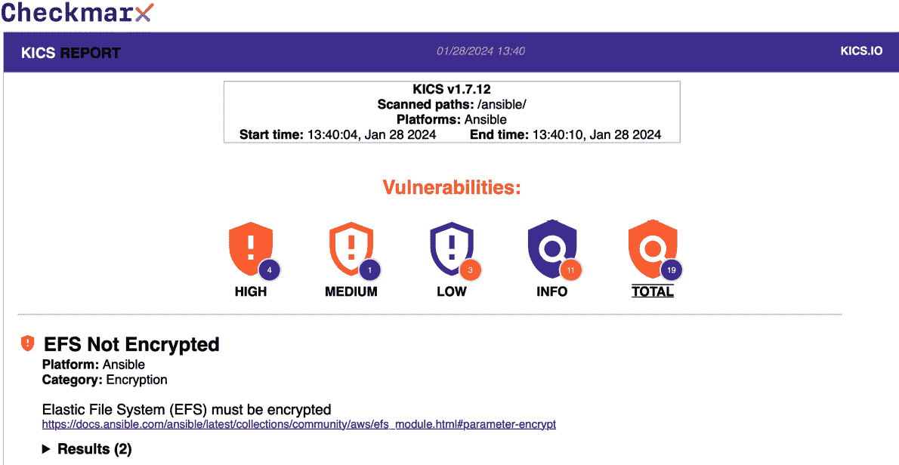
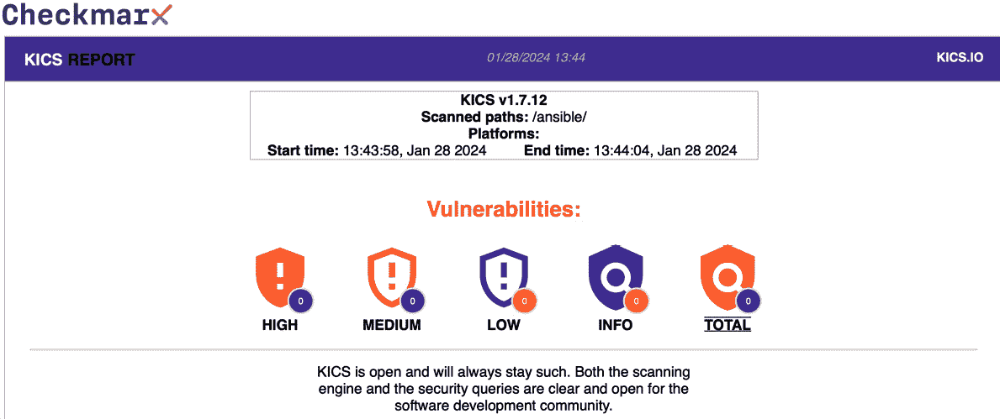

# 第十三章：扫描你的 Ansible 剧本

本章中，你将学习如何使用两个第三方工具扫描你的 Ansible 剧本：Checkov 和 KICS。它们都是开源工具，可以帮助你识别和修复 Ansible 代码中的常见配置问题，如语法错误、配置错误、硬编码的密钥和部署问题，这些都可能导致潜在的安全漏洞。

到本章结束时，你将完成以下任务：

+   在我们的 Ansible 剧本上安装并运行 Checkov 和 KICS 扫描

+   审查扫描过程中生成的结果和报告

+   修复扫描过程中检测到的任何问题

本章涉及以下主题：

+   为什么要扫描你的剧本？

+   Docker 概述与安装

+   探索 Checkov

+   探索 KICS

# 技术要求

我们将不再在本地安装工具，而是使用 Docker 来执行扫描；本章稍后会有关于如何安装 Docker 的详细内容。此外，我们将扫描我们在 *第十一章* 中编写的剧本的一个变种，*高可用云部署*；该剧本可以在 [`github.com/PacktPublishing/Learn-Ansible-Second-Edition/tree/main/Chapter13`](https://github.com/PacktPublishing/Learn-Ansible-Second-Edition/tree/main/Chapter13) 的代码库中找到。

# 为什么要扫描你的剧本？

虽然在前几章中我们采取了合理的方式来部署云资源，但我们所设置的许多保护措施都是我通过经验和一些常识积累而来的。

例如，在微软 Azure 或亚马逊 Web 服务（AWS）中启动虚拟机资源时，我们一直将 SSH 或 RDP 服务限制为主机的公共 IP 地址，该主机运行着 Ansible；直到现在，这个主机通常是你的本地机器，而不是像使用 `0.0.0.0/0` 这样的源地址将 SSH 或 RDP 开放给全世界，这个地址的 CIDR 表示法是 *“**允许所有**”*。

对我们一直在处理的工作负载来说，这不是一个问题；将虚拟机直接暴露在互联网上，并且其管理端口对所有人开放并不是最佳实践，因为这将使你容易受到暴力破解攻击。如果攻击成功，不仅该机器可能会被攻破，还可能成为进入你网络其他部分以及其他相关资源（如数据库和存储）的跳板。

我将前面的示例归类为常识，但随着我们使用剧本（playbooks）发布越来越多的云服务，如何确保我们遵循最佳实践，特别是对于那些我们可能没有太多经验的服务，除了让它们上线之外？我们如何在资源部署之前设置一些保护措施，防止做出错误的操作？

这就是本章将要介绍的两款工具发挥作用的地方；它们的设计目的是扫描您的剧本，查看配置，并将其与最佳实践策略进行比较。最终，在*第十五章*，*使用 Ansible 与 GitHub Actions 和 Azure DevOps*，我们将把其中一个工具构建到我们的部署流水线中，但目前，我们将查看这些工具并使用 Docker 在本地运行它们。

# Docker 概述与安装

Docker，作为一个让容器流行的平台，既是开源解决方案也是商业解决方案，使您能够将应用程序的所有元素，包括库和其他依赖项，与您自己的代码一起打包到一个易于分发的包中；这意味着我们不需要为本章运行的工具下载和安装所有的前置条件，也不需要从源代码编译工具来获得适用于我们系统的可执行文件。

要按照本章的示例操作，您必须在主机上安装**Docker Desktop**。

## 在 macOS 上安装 Docker Desktop

要在 macOS 上安装 Docker Desktop，请按照以下三个步骤操作：

1.  选择适合您 Mac 架构的安装程序：

    1.  对于 ARM64（Apple Silicon），请使用 [`desktop.docker.com/mac/main/arm64/Docker.dmg`](https://desktop.docker.com/mac/main/arm64/Docker.dmg)。

    1.  对于 AMD64（Intel Macs），请使用 [`desktop.docker.com/mac/main/amd64/Docker.dmg`](https://desktop.docker.com/mac/main/amd64/Docker.dmg)。

1.  下载完成后，双击打开`Docker.dmg`文件。在弹出的窗口中，将 Docker 图标拖入您的应用程序文件夹以安装 Docker Desktop。它将被安装在`/Applications/Docker.app`。

1.  要启动 Docker，请前往应用程序文件夹，双击**Docker**；这将启动**Docker Desktop**。

当您首次启动 Docker Desktop 时，它将引导您完成剩余的安装步骤，并在完成后在后台运行。

## 在 Windows 上安装 Docker Desktop

要在 Windows 上安装 Docker Desktop，请按照以下说明操作：

1.  从此链接下载 Windows 版本的 Docker Desktop 安装程序：[`desktop.docker.com/win/main/amd64/Docker%20Desktop%20Installer.exe`](https://desktop.docker.com/win/main/amd64/Docker%20Desktop%20Installer.exe)。

1.  运行下载的`C:\Program Files\Docker\Docker`。

1.  在安装过程中，您可能会被提示选择是否使用**WSL 2（Windows Subsystem for Linux 2）**或**Hyper-V**作为后端。请选择**使用 WSL 2 而非 Hyper-V**选项，因为我们在本书中使用的是这一选项来运行 Ansible。

1.  按照安装向导提供的屏幕指示授权安装程序并完成安装过程。

1.  安装完成后，点击**关闭**以完成设置。

从这里，您可以从开始菜单打开 Docker Desktop，它将会在后台运行。

## 在 Linux 上安装 Docker Desktop

如果你在运行 Linux 桌面系统，指令会根据你的 Linux 发行版有所不同；有关详细说明，请参见 [`docs.docker.com/desktop/linux/install/`](https://docs.docker.com/desktop/linux/install/)。

现在，安装了 Docker Desktop 后，我们可以开始了解我们将要使用的两个工具中的第一个。

# 探索 Checkov

Checkov 是一个开源的静态代码分析工具，由 Prisma Cloud 维护，专为 **基础设施即代码** (**IaC**) 设计。

它帮助开发人员和 DevOps 团队在部署到云环境之前识别文件中的错误配置。通过扫描 Terraform、CloudFormation、Kubernetes 以及其他工具（包括 Ansible）的代码，Checkov 会检查最佳实践和合规性指南，确保你的基础设施部署在发布之前是安全、高效且符合行业标准的。

重要提示

你可能已经注意到，前面的描述中提到了 Ansible 作为“其他工具”；这是因为在撰写本文时（2024 年初），Ansible 的支持才刚刚被引入。因此，虽然我们会在本章中查看 Checkov，但我们不会深入讲解 Checkov 或第二个工具 Kics。

在运行扫描之前，我们需要一个 playbook；打开终端并通过运行以下命令检查 GitHub 仓库：

```
$ git clone git@github.com:PacktPublishing/Learn-Ansible-Second-Edition.git
```

该仓库包含来自 *第十一章* 的最终 playbook 代码，*高度可用* *云部署*。

既然我们已经检查了代码，接下来可以下载 Checkov 容器镜像。为此，我们需要通过运行以下命令从 Docker Hub 拉取它：

```
$ docker image pull bridgecrew/checkov:latest
```

这将从 [`hub.docker.com/r/bridgecrew/checkov`](https://hub.docker.com/r/bridgecrew/checkov) 下载镜像，下载完成后，我们现在可以扫描我们的 playbook 代码了。

要运行扫描，请执行以下命令：

```
$ cd Learn-Ansible-Second-Edition/Chapter13
$ docker container run --rm --tty --volume ./:/ansible --workdir /ansible bridgecrew/checkov --directory /ansible
```

在查看结果之前，让我们简要分析一下刚才执行的命令：

+   `docker container run` 执行一个新的 Docker 容器。

+   `--rm` 指示 Docker 在容器退出后自动移除容器。

+   `--tty` 分配一个伪终端，使扫描输出对我们的会话可读。

+   `--volume ./:/ansible` 将当前目录（定义为 `./`）挂载到容器内的 `/ansible` 路径。

+   `--workdir /ansible` 将容器内的工作目录设置为 `/ansible`。

+   `bridgecrew/checkov` 指定了我们刚从 Docker Hub 拉取的 Checkov Docker 镜像。

+   `--directory /ansible` 指示 Checkov 扫描 `/ansible` 目录中的文件；这不是 Docker 命令的一部分，而是向 Checkov 二进制文件发送指令，Checkov 是我们容器运行扫描的默认入口。如果我们在本地安装了 Checkov，那么这相当于运行 `checkov --directory /ansible` 命令。

现在我们已经拆解了用于运行扫描的命令，接下来我们可以查看扫描本身的输出，从概览开始：

```
ansible scan results:
Passed checks: 5, Failed checks: 3, Skipped checks: 0
```

如你所见，我们的通过检查多于失败检查，这是个不错的开始；输出的下一部分详细列出了检查内容，从以下的通过检查开始：

```
Check: CKV_ANSIBLE_2: "Ensure that certificate validation isn't disabled with get_url"
     PASSED for resource: tasks.ansible.builtin.get_url.download wp-cli
     File: /roles/wordpress/tasks/main.yml:11-17
```

我们的第一次检查是查看我们是否指示 `ansible.builtin.get_url` 模块在连接到 HTTPS 网站下载内容时绕过证书验证。

接下来的四次检查是针对我们在 playbook 中使用 `ansible.builtin.apt` 模块的两次情况：

```
Check: CKV_ANSIBLE_5: "Ensure that packages with untrusted or missing signatures are not used"
     PASSED for resource: tasks.ansible.builtin.apt.update apt-cache and upgrade packages
     File: /roles/stack-install/tasks/main.yml:5-13
Check: CKV_ANSIBLE_5: "Ensure that packages with untrusted or missing signatures are not used"
     PASSED for resource: tasks.ansible.builtin.apt.update cache and install the stack packages
     File: /roles/stack-install/tasks/main.yml:27-33
```

第一对检查确保我们没有安装任何未正确签名的软件包。第二对检查也检查相同的内容：

```
Check: CKV_ANSIBLE_6: "Ensure that the force parameter is not used, as it disables signature validation and allows packages to be downgraded which can leave the system in a broken or inconsistent state"
     PASSED for resource: tasks.ansible.builtin.apt.update apt-cache and upgrade packages
     File: /roles/stack-install/tasks/main.yml:5-13
Check: CKV_ANSIBLE_6: "Ensure that the force parameter is not used, as it disables signature validation and allows packages to be downgraded which can leave the system in a broken or inconsistent state"
     PASSED for resource: tasks.ansible.builtin.apt.update cache and install the stack packages
     File: /roles/stack-install/tasks/main.yml:27-33
```

然而，这次检查确保我们没有使用 force 参数，正如你从描述中看到的，这会禁用签名检查，并且如果出现问题，还可能导致我们的 APT 数据库处于某种不稳定状态。

接下来，我们进入失败的部分；第一个失败是我们在讲解为什么要使用本章所介绍的工具时提到的例子：

```
Check: CKV_AWS_88: "EC2 instance should not have public IP."
     FAILED for resource: tasks.amazon.aws.ec2_instance.Create the temporary ec2 instance
     File: /roles/ec2tmp/tasks/main.yml:53-75
      Guide: https://docs.prismacloud.io/en/enterprise-edition/policy-reference/aws-policies/public-policies/public-12
           62 |     network:
           63 |       assign_public_ip: "{{ ec2.public_ip }}"
```

那么，问题出在哪里？正如你可能还记得的 *第十一章*，《*高可用云部署*》中提到的，我们启动的实例是临时的，只能在 playbook 运行时访问。然而，Checkov 并不知道这一点，所以它正确地指出了这一点，并且正如你所看到的，提供了通过指南 URL 解释原因，对于此检查，指南 URL 是 [`docs.prismacloud.io/en/enterprise-edition/policy-reference/aws-policies/public-policies/public-12`](https://docs.prismacloud.io/en/enterprise-edition/policy-reference/aws-policies/public-policies/public-12)。

继续查看扫描中的下一个失败，我们看到如下内容：

```
Check: CKV_AWS_135: "Ensure that EC2 is EBS optimized"
     FAILED for resource: tasks.amazon.aws.ec2_instance.Create the temporary ec2 instance
     File: /roles/ec2tmp/tasks/main.yml:53-75
     Guide: https://docs.prismacloud.io/en/enterprise-edition/policy-reference/aws-policies/aws-general-policies/ensure-that-ec2-is-ebs-optimized
```

在这种情况下，Checkov 认为在我们启动临时 EC2 实例时，`amazon.aws.ec2_instance` 块中缺少一个参数。建议将参数 `ebs_optimized` 设置为 `true`，而不是保持默认的 `false` 值。

扫描输出中的最后一个失败如下：

```
Check: CKV2_ANSIBLE_2: "Ensure that HTTPS url is used with get_url"
     FAILED for resource: tasks.ansible.builtin.get_url.download wp-cli
    File: /roles/wordpress/tasks/main.yml:11-17
           11 | - name: "download wp-cli"
           12 |   ansible.builtin.get_url:
           13 |     url: "{{ wp_cli.download }}"
           14 |     dest: "{{ wp_cli.path }}"
```

由于 Checkov 是进行静态代码分析，它并没有设计用来检查变量的内容。因为我们提供的策略是检查是否使用了安全的 URL（也就是任务中的 `url` 部分是 `https://domain.com/`），它失败了，因为它只看到 `{{ wp_cli.download }}` 变量名，而不是变量的内容。

如果你在跟踪的话，那就意味着三次失败检查中有两次是误报；对于第一次失败，我们可以接受风险，因为我们知道该机器只是临时的，并且我们已经将 EC2 实例限制为可信的 IP 地址。

对于第三次失败，我们可以确认 `{{ wp_cli.download }}` 变量的内容是一个安全的 URL，因为它是 `https://raw.githubusercontent.com/wp-cli/builds/gh-pages/phar/wp-cli.phar`。

第二个失败是唯一需要我们查看的；让我们从 `Amazon.aws.ec2_instance` 任务开始看。

在这里，我们需要添加两件事；第一件事是一个注释，指示 Checkov 我们接受 `CKV_AWS_88` 策略所突出显示的风险，然后我们需要将 `ebs_optimized` 设置为 `true`。

以下代码展示了我对 `roles/ec2tmp/tasks/main.yml` 所做的更新；`name` 参数下方的内容保持不变：

```
- name: "Create the temporary ec2 instance"
  amazon.aws.ec2_instance:
    # checkov:skip=CKV_AWS_88:"While a public IP address is assigned to the instance, it is locked down by the security group and the instance is temporary."
    ebs_optimized: true
    name: "{{ ec2_tmp_name }}"
```

如你所见，指示 Checkov 跳过检查非常简单；注释分为四个部分：

+   `#` 是在 YAML 文件中开始注释的标准语法

+   `checkov:` 指示 Checkov 关注注释的内容

+   `skip=CKV_AWS_88:` 指示 Checkov 在运行时跳过 `CKV_AWS_88` 检查

+   `"虽然实例分配了公共 IP 地址，但它已通过安全组进行限制，并且实例是临时的。"` 是我们运行扫描时将在输出中显示的抑制注释

更新任务中的下一行实现了我们将 `ebs_optimized` 参数设置为 `true` 的建议。

现在，我们进入第二个任务，需要更新的任务位于 `roles/wordpress/tasks/main.yml` 中。这里，我们只需要添加一个注释，让 Checkov 跳过 `CKV2_ANSIBLE_2`：

```
- name: "download wp-cli"
  ansible.builtin.get_url:
    # checkov:skip=CKV2_ANSIBLE_2:"The URL passed in the variable is secured with SSL/TLS protocol."
    url: "{{ wp_cli.download }}"
    dest: "{{ wp_cli.path }}"
```

如果你跟着操作，仓库中有一个名为 `checkov` 的分支；应用前述详细更改后，你可以通过运行以下命令切换到该分支：

```
$ git switch chapter13-checkov
```

然后，我们可以使用以下命令重新运行扫描：

```
$ docker container run --rm --tty --volume ./:/ansible --workdir /ansible bridgecrew/checkov --directory /ansible
```

我看到我的更改已经抑制并解决了三个失败：

```
ansible scan results:
Passed checks: 6, Failed checks: 0, Skipped checks: 2
```

我们已经通过了 `CKV_AWS_135`：

```
Check: CKV_AWS_135: "Ensure that EC2 is EBS optimized"
     PASSED for resource: tasks.amazon.aws.ec2_instance.Create the temporary ec2 instance
      File: /roles/ec2tmp/tasks/main.yml:53-77
      Guide: https://docs.prismacloud.io/en/enterprise-edition/policy-reference/aws-policies/aws-general-policies/ensure-that-ec2-is-ebs-optimized
```

现在，我们也看到了显示的两个假阳性：

```
Check: CKV_AWS_88: "EC2 instance should not have public IP."
     SKIPPED for resource: tasks.amazon.aws.ec2_instance.Create the temporary ec2 instance
     Suppress comment: "While a public IP address is assigned to the instance, it is locked down by the security group and the instance is temporary."
     File: /roles/ec2tmp/tasks/main.yml:53-77
     Guide: https://docs.prismacloud.io/en/enterprise-edition/policy-reference/aws-policies/public-policies/public-12
```

对于第二个问题，我们有如下内容：

```
Check: CKV2_ANSIBLE_2: "Ensure that HTTPS url is used with get_url"
     SKIPPED for resource: tasks.ansible.builtin.get_url.download wp-cli
     Suppress comment: "The URL passed in the variable is secured with SSL/TLS protocol."
     File: /roles/wordpress/tasks/main.yml:11-18
```

如你所见，我们的注释对所有人都是可见的。

那么，回到本节开头的提问，既然 Checkov 并未完全覆盖 Ansible，为什么我们还要介绍这个工具呢？从我们对 playbook 执行扫描的输出中可以看到，尽管现在覆盖面不大，但每次新版本发布时都会增加更多的 Ansible 策略。因此，随着时间的推移，覆盖面应该只会变得更加健全，并且希望我们能将这个有前景的工具与我们将要看的第二个工具对接：**KICS**，或者其完整名称是 **保持基础设施即代码的安全**。

# 探索 KICS

KICS 是另一个静态代码分析工具，像 Checkov 一样，它是开源的。它旨在帮助你发现基础设施即代码（IaC）中的常见配置错误、潜在合规问题，甚至安全漏洞。它支持 Kubernetes、Docker、AWS CloudFormation、Terram，当然还有 Ansible，在本章中我们将重点讨论 Ansible。

KICS 设计易于安装、理解并集成到 CI/CD 流水线中。它包括超过 2400 条可定制规则，并且具备可扩展性，允许轻松添加对新的 IaC 工具的支持，并更新现有集成。

KICS 由 **Checkmarx** 的软件应用安全测试专家维护和支持，这意味着 KICS 具有很好的背景。

## 运行扫描

让我们直接开始。如果你还没有，使用以下命令查看示例仓库：

```
$ git clone https://github.com/russmckendrick/Learn-Ansible-Second-Edition-Scan.git
```

现在，我们可以通过使用以下命令从 Docker Hub ([`hub.docker.com/r/checkmarx/kics`](https://hub.docker.com/r/checkmarx/kics)) 拉取最新的容器镜像：

```
$ docker image pull checkmarx/kics:latest
```

切换到包含我们 Ansible playbook 的文件夹：

```
$ cd Learn-Ansible-Second-Edition-Scan
```

然后运行扫描：

```
$ docker container run --rm --tty --volume ./:/ansible checkmarx/kics scan --path /ansible/
```

如你所见，docker 命令遵循了我们在运行 Checkov 时讨论的相同模式，直到我们将选项传递给 KICS 二进制文件；在这里，我们指示 KICS 对 `--path /ansible/` 进行 `scan`，这是我们通过 `--volume` 选项将主机机上的目录挂载到容器中的路径。

## 审查结果

现在，让我们来看一下扫描的结果；KICS 展示了它的输出，这与 Checkov 略有不同，因为初始输出旨在提供关于扫描本身的实时信息：

```
Scanning with Keeping Infrastructure as Code Secure v1.7.12
Preparing Scan Assets: Done
Executing queries: [------------------------------] 100.00%
Files scanned: 33
Parsed files: 32
Queries loaded: 292
Queries failed to execute: 0
```

现在，让我们逐步分析各种结果，并按严重性级别进行分组。

### 信息和低严重性结果

第一个结果突出了我们创建（使用模板）或复制的文件可能存在的风险文件权限：

```
Risky File Permissions, Severity: INFO, Results: 5
Description: Some modules could end up creating new files on disk with permissions that might be too open or unpredictable
Platform: Ansible
Learn more about this vulnerability: https://docs.kics.io/latest/queries/ansible-queries/common/88841d5c-d22d-4b7e-a6a0-89ca50e44b9f
```

然后，它列出了所有受影响的文件；以下是前几个文件的片段：

```
[1]: ../../ansible/destroy.yml:52
     051:     - name: "Delete the group_vars/generated_aws_endpoints.yml file"
     052:       ansible.builtin.file:
     053:         path: "group_vars/generated_aws_endpoints.yml"
```

这是另一个：

```
[2]: ../../ansible/destroy.yml:81
     080:     - name: "Delete the group_vars/generated_efs_targets.yml file"
     081:       ansible.builtin.file:
     082:         path: "group_vars/generated_efs_targets.yml"
```

继续下一个问题，我们看到以下内容：

```
Unpinned Package Version, Severity: LOW, Results: 1
Description: Setting state to latest performs an update and installs additional packages possibly resulting in performance degradation or loss of service
Platform: Ansible
Learn more about this vulnerability: https://docs.kics.io/latest/queries/ansible-queries/common/c05e2c20-0a2c-4686-b1f8-5f0a5612d4e8
```

再次，下面是它发现问题的一个示例：

```
[1]: ../../ansible/roles/stack_install/tasks/main.yml:8
      007:     name: "*"
      008:     state: "latest"
      009:     update_cache: true
```

下一个也是最后一个低评分的结果如下：

```
EFS Without Tags, Severity: LOW, Results: 1
Description: Amazon Elastic Filesystem should have filesystem tags associated
Platform: Ansible
Learn more about this vulnerability: https://docs.kics.io/latest/queries/ansible-queries/aws/b8a9852c-9943-4973-b8d5-77dae9352851
```

详细信息如下：

```
[1]: ../../ansible/destroy.yml:75
      074:     - name: "Delete the EFS File System"
      075:       community.aws.efs:
      076:         name: "{{ efs_name }}"
```

在继续到得分中等的结果之前，让我们快速回顾一下低评分的结果。

所以，第一个结果是**“一些模块可能会在磁盘上创建新的文件，权限可能过于开放或不可预测”**。它指出了我们 playbook 中的 11 个地方可能会出现这个问题，因此我们应该着手解决这些问题。

首先，如果你运行了完整的扫描，你会注意到三个结果来自 `destroy.yml` 文件。

由于这些任务涉及删除文件，我们不关心文件权限。因此，我们不应在单独的任务中添加权限，而应该指示 KICS 不要在整个文件上执行检查。

要做到这一点，我们需要在文件的最顶部添加以下注释：

```
# kics-scan disable=88841d5c-d22d-4b7e-a6a0-89ca50e44b9f
```

接下来，我们在 `roles/efs/tasks/main.yml` 中看到了 `ansible.builtin.template`。与其跳过测试，我通过 `mode` 键添加了权限：

```
- name: "Generate the efs targets vars file"
  ansible.builtin.template:
    src: "targets.j2"
    dest: "group_vars/generated_efs_targets.yml"
    mode: "0644"
```

最终结果是 `ansible.builtin.get_url` 模块，该模块由任务使用，下载 `wp-cli`，文件位于 `roles/wordpress/tasks/main.yml`。

审查代码时，它看起来如下：

```
- name: "Download wp-cli"
  ansible.builtin.get_url:
    url: "{{ wp_cli.download }}"
    dest: "{{ wp_cli.path }}"
```

紧接着是以下内容：

```
- name: "Update permissions of wp-cli to allow anyone to execute it"
  ansible.builtin.file:
    path: "{{ wp_cli.path }}"
    mode: "0755"
```

在这里，KICS 强调我们可以将模式作为 `ansible.builtin.get_url` 的一部分进行设置，这意味着我们不需要单独处理它，因此我在下载任务中添加了以下内容：

```
    mode: "0755"
```

然后，我删除了第二个任务。这解决了 KICS 报告的文件权限问题。

下一个低评分显示，**“将状态设置为最新执行更新并安装附加包，可能导致性能下降或服务丢失”**。

这出现在`roles/stack-install/tasks/main.yml`中，其中任务使用`ansible.builtin.apt`来更新已安装的镜像，因为这个任务仅在我们启动临时 EC2 实例时调用，而且我们已经在主剧本中考虑了 PHP 版本的变化。我认为可以将其视为假阳性，因此我们可以通过在`roles/stack-install/tasks/main.yml`文件的最顶部添加以下内容来告诉 KICS 不要对该文件运行测试：

```
# kics-scan disable=c05e2c20-0a2c-4686-b1f8-5f0a5612d4e8
```

这就剩下`destroy.yml`，因此缺少标签确实很重要。

我们排除该检查的执行。为此，我们需要将其附加到我们已添加的注释末尾，这意味着`destroy.yml`文件末尾的注释现在是这样：

```
# kics-scan disable=88841d5c-d22d-4b7e-a6a0-89ca50e44b9f,b8a9852c-9943-4973-b8d5-77dae9352851
```

在附加 ID 时，请确保用逗号将它们分开；否则，KICS 会将它们视为一个字符串。最后，我们来看看高严重性结果。

### 高严重性结果

幸运的是，这里我们只有两个问题，分布在四个任务中，从以下任务开始：

```
EFS Not Encrypted, Severity: HIGH, Results: 2
Description: Elastic File System (EFS) must be encrypted
Platform: Ansible
Learn more about this vulnerability: https://docs.kics.io/latest/queries/ansible-queries/aws/727c4fd4-d604-4df6-a179-7713d3c85e20
```

这就是这两个任务：

```
[1]: ../../ansible/roles/efs/tasks/main.yml:25
     024: - name: "Create the EFS File System"
     025:   community.aws.efs:
```

第二个问题出现在`destroy.yml`文件中：

```
[2]: ../../ansible/destroy.yml:77
     076:     - name: "Delete the EFS File System"
     077:       community.aws.efs:
```

我想你应该能猜到我们如何解决第二个问题；让我们让它忽略`destroy.yml`中的测试：

```
# kics-scan disable=88841d5c-d22d-4b7e-a6a0-89ca50e44b9f,b8a9852c-9943-4973-b8d5-77dae9352851,050f085f-a8db-4072-9010-2cca235cc02f,727c4fd4-d604-4df6-a179-7713d3c85e20
```

对于`roles/efs/tasks/main.yml`，推荐启用加密，所以我们采取这个建议：

```
- name: "Create the EFS File System"
  community.aws.efs:
    encrypt: true
    name: "{{ efs_name }}"
```

如你从前面的代码片段中看到的，我们已经添加了`encrypt`参数并将其设置为`true`。

KICS 指出的下一个问题也与 EFS 文件系统加密有关：

```
EFS Without KMS, Severity: HIGH, Results: 2
Description: Amazon Elastic Filesystem should have filesystem encryption enabled using KMS CMK customer-managed keys instead of AWS managed-keys
Platform: Ansible
Learn more about this vulnerability: https://docs.kics.io/latest/queries/ansible-queries/aws/bd77554e-f138-40c5-91b2-2a09f878608e
```

结果与前一个问题相同，因此我们将把 ID 附加到`destroy.yml`文件顶部的禁用检查列表中。

鉴于这是一个演示环境，我愿意接受不使用客户管理的密钥库来存储我自己管理的加密密钥的潜在风险；因此，在这种情况下，我将添加以下内容：

```
# kics-scan disable=bd77554e-f138-40c5-91b2-2a09f878608e
```

我将在`roles/efs/tasks/main.yml`文件的最顶部进行此操作。如果这是一个固定的生产环境，那么我会添加一个角色来启动和维护 AWS Key Management Service（[`aws.amazon.com/kms/`](https://aws.amazon.com/kms/)）作为部署的一部分。

### 结果总结

规则的最后部分概述了我们已覆盖的所有内容，对于没有应用任何修复的初始扫描，结果如下：

```
Results Summary:
HIGH: 4
MEDIUM: 0
LOW: 2
INFO: 5
TOTAL: 11
```

## 重新运行扫描

如之前所述，存在一个包含我们在上一节中讨论和实施的所有更新文件的分支；要切换到它，运行以下命令：

```
$ git switch chapter13-kics
```

然后，你可以使用以下命令重新运行扫描：

```
$ docker container run --rm --tty --volume ./:/ansible checkmarx/kics scan --path /ansible/
```

现在应该返回一个健康的结果：

```
Scanning with Keeping Infrastructure as Code Secure v1.7.13
Preparing Scan Assets: Done
Executing queries: [------------------------------] 100.00%
Results Summary:
HIGH: 0
MEDIUM: 0
LOW: 0
INFO: 0
TOTAL: 0
```

如你所见，现在没有报告任何问题。

## 输出文件

在我们结束这一章之前，还有一件事情我们应该快速讨论一下 KICS：它能够以各种文件格式输出报告的能力。

如果你重新对`main`和`kics`分支运行扫描，但使用以下命令，你会注意到在你的存储库文件夹中出现了一个名为`results.html`的文件：

```
$ docker container run --rm --tty --volume ./:/ansible checkmarx/kics scan --path /ansible/ --report-formats "html" --output-path /ansible/
```

正如你所看到的，我们正在传入两个新标志；第一个，`--report-formats`，告诉 KICS 输出一个`html`文件作为报告，第二个，`--output-path`，让 KICS 知道在哪里保存报告文件；在我们的情况下，由于我们在需要持久化的容器中运行 KICS，所以这个位置必须是容器内的一个位置，一旦容器运行结束，容器将自动删除以及任何写入的文件。

当对不包含任何修复的主分支运行命令时，我们应用了报告的标题，看起来如下所示：



图 13.1 – 查看显示问题的报告

然后，对 KICS 分支的重新运行扫描会更新为以下内容：



图 13.2 – 健康的清单

你还可以输出 PDF、JSON 和其他标准报告格式。如你所见，这比阅读我们在前一节中介绍的命令行报告的输出要容易理解些。

当我们进入*第十五章*，*使用 Ansible 与 GitHub Actions 和 Azure DevOps*，我们将利用这些报告，并将结果作为我们的流水线运行的一部分发布。

# 摘要

在本章中，我们涵盖了两个可以添加到我们工作流程中的工具，并手动针对我们在*第十一章*开发的 playbook 运行了扫描，*高可用云部署*。正如本章所述，Checkov 对 Ansible 的支持相对较新，因此与 KICS 相比覆盖范围不同。然而，我相信你会同意这两个工具都表现不错。

重要提示

不过，有一个大问题；即使覆盖级别不同，这两个工具的结果也略有不同，因此你不应完全依赖它们来完全保护你的部署。把它们看作是值得信赖的同事，检查你的代码中显而易见的问题，而不是专注于安全的云平台架构师，他对你的工作负载有详细了解，严格规定你在安全地部署基础设施时应该采取的措施。

如前一节结尾所述，我们将在*第十五章*中重新讨论 KICS，*使用 Ansible 与 GitHub Actions 和 Azure DevOps*。在进入这一章之前，既然我们已经了解了如何审查和保护我们的 playbook 代码，现在可以看看如何通过快速应用安全最佳实践，来保护我们目标主机操作系统的工作负载，使用 Ansible 来实现这一点。

# 进一步阅读

有关工具及其维护者的更多信息，请参阅以下链接：

+   **Checkov**: [`www.checkov.io/`](https://www.checkov.io/)

+   **Prisma** **Cloud**: [`www.paloaltonetworks.com/prisma/cloud/`](https://www.paloaltonetworks.com/prisma/cloud/)

+   **KICS**: [`kics.io/`](http://kics.io/)

+   **Checkmarx**: [`checkmarx.com/`](https://checkmarx.com/)
