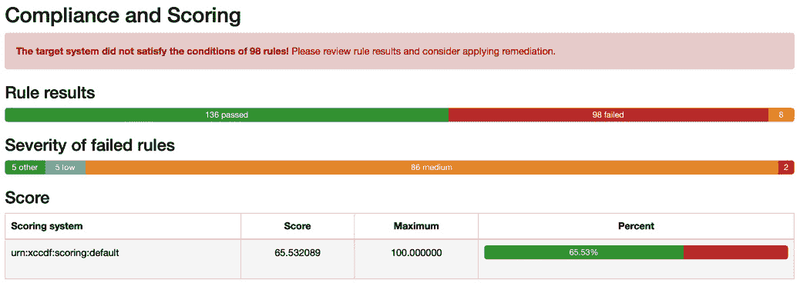
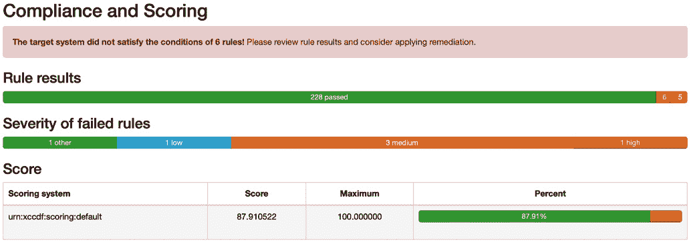

# 第十四章：使用 Ansible 加固你的服务器

使用像 Ansible 这样的编排和配置工具的一个优势是，它可以在多个主机上以可重复的任务生成并部署一组复杂的配置。在本章中，我们将介绍一个工具，它使用 Ansible 扫描你的主机，动态生成修复剧本，然后为你执行它。

我们还将介绍如何运行两个不同的安全工具，它们扫描我们在前几章中使用的 WordPress 安装。

本章涉及以下主题：

+   扫描工具

+   剧本

# 技术要求

在我们完成云端的探险后，我们将回到本地机器并使用 Multipass 启动一个 Ubuntu 22.04 虚拟机；由于我们将运行一个需要更多磁盘空间的工作负载，因此在启动虚拟机时，我们会调整虚拟机的规格，以增加磁盘空间和内存。

由于我们将在虚拟机上安装许多不同的软件，你的 Multipass 虚拟机需要能够从互联网下载包；大约需要下载 3GB 的各种包和配置文件。

你可以在[`github.com/PacktPublishing/Learn-Ansible-Second-Edition/tree/main/Chapter14`](https://github.com/PacktPublishing/Learn-Ansible-Second-Edition/tree/main/Chapter14)的仓库中找到本章附带的完整剧本副本。

# 扫描工具

在我们深入剧本之前，让我们快速了解一下我们将要运行的三个工具，从其中一个做得最多的工具开始，**OpenSCAP**。

## OpenSCAP

首先，我们将查看 Red Hat 的一个工具，叫做 OpenSCAP。在继续之前，下一节将包含许多缩写。

那么，什么是 SCAP 呢？**安全内容自动化协议**（**SCAP**）是一个开放标准，它包含多个组件，每个组件本身也是开放标准，构建一个框架，允许你自动评估和修复你的主机，以符合**国家标准与技术研究院**（**NIST**）的*特别* *出版物 800-53*。

该出版物是对所有美国联邦 IT 系统应用的控制的目录，除了由**国家安全局**（**NSA**）维护的系统。这些控制的实施旨在帮助执行 2002 年《联邦信息安全管理法》（**FISMA**）在美国联邦部门中的应用。

SCAP 由以下组件组成：

+   **资产识别**（**AID**）是用于资产识别的数据模型。

+   **资产报告格式**（**ARF**）是一个中立于供应商和技术的数据模型，用于在不同的报告应用程序和服务之间传输资产信息。

+   **通用配置枚举**（**CCE**）是一个标准数据库，提供常见软件的推荐配置。每个推荐都有一个唯一的标识符。写作时，数据库已经有十多年未更新。

+   **通用配置评分系统**（**CCSS**）是 CCE 的延续。它用于为各种软件和硬件配置生成评分，适用于所有类型的部署。

+   **通用平台枚举**（**CPE**）用于识别组织基础设施中的硬件资产、操作系统和软件。一旦识别出这些数据，就可以用于在其他数据库中搜索，进行资产的威胁评估。

+   **通用弱点枚举**（**CWE**）是一个通用语言，用于处理和讨论系统架构、设计和代码中可能导致漏洞的弱点原因。

+   **通用漏洞和曝光**（**CVE**）是一个公开承认的漏洞数据库。大多数系统管理员和 IT 专业人员都会在某个时刻接触到 CVE 数据库。每个漏洞都有一个唯一的 ID；例如，大多数人都知道 CVE-2014-0160，也就是**Heartbleed**。Heartbleed 漏洞是 OpenSSL（一个加密软件库）中的一个严重安全缺陷，攻击者可以利用该漏洞通过 OpenSSL 对**传输层安全性**（**TLS**）/**数据报传输层安全性**（**DTLS**）心跳扩展的错误，窃取受影响系统内存中的敏感信息，如密码和私钥。

+   **通用漏洞评分系统**（**CVSS**）是一种方法，用于捕捉漏洞的特征并生成标准化的数值评分，随后可用于描述漏洞的影响，例如低、中、高和严重。

+   **可扩展配置清单描述格式**（**XCCDF**）是一种用于描述安全清单的 XML 格式。它也可以用于配置和基准测试，并为 SCAP 的各个部分提供统一的语言。

+   **开放清单互动语言**（**OCIL**）是一个框架，用于向最终用户提问并以标准化方式处理响应的过程。

+   **开放漏洞和评估语言**（**OVAL**）定义为 XML，旨在标准化通过 NIST、MITRE 公司、**美国计算机紧急响应小组**（**US-CERT**）以及美国**国土安全部**（**DHS**）提供的所有工具和服务之间的安全内容传输。

+   **安全自动化数据的信任模型**（**TMSAD**）是一个 XML 文档，旨在定义一个可以应用于 SCAP 各组件间交换数据的共同信任模型。

正如你可以想象的那样，数千人的工作年限已经投入到生产 SCAP 及其组件，以构建它的基础。有些项目自 90 年代中期以来就以某种形式存在，因此它们已经相当成熟，并被认为是关于安全最佳实践的事实标准；然而，我相信你会觉得这一切听起来很复杂——毕竟，这些标准是由学者、安全专家和政府部门定义并维护的。

这就是 OpenSCAP 的作用所在。OpenSCAP 项目由 Red Hat 维护，并且通过 NIST 认证以支持 SCAP 标准，它允许你使用命令行客户端应用我们所讨论的所有最佳实践。

注

OpenSCAP 中的自动修复脚本仍在进行中，并且存在一些已知问题，我们将在本章的后半部分解决这些问题。因此，您的输出可能与本章所述有所不同。

OpenSCAP 像许多 Red Hat 项目一样，支持 Ansible，当前版本引入了自动生成 Ansible 演练手册的功能，用于修复在 OpenSCAP 扫描过程中发现的不合规项。

接下来我们将查看的两个工具将扫描我们的 WordPress 网站，首先是 WPScan。

## WPScan

我们将运行的第二个工具叫做**WPScan**，我们将使用它来扫描我们的 WordPress 网站。WPScan 是一个命令行工具，可以对 WordPress 安装进行各种安全评估和漏洞测试。它可以检测常见的配置错误、过时的主题、弱密码和其他潜在风险。WPScan 易于安装——特别是我们将使用容器版本并通过 Docker 运行它，而这也是我们将要使用的第三个也是最后一个工具，OWASP ZAP。

## OWASP ZAP

SQL 注入、跨站脚本攻击、身份验证漏洞和不安全的反序列化等 Web 漏洞可能威胁到我们 WordPress 网站的安全性和质量。为了帮助识别和优先处理这些漏洞，我们可以使用**OWASP ZAP**。这个工具是我们在本章中讨论的第三个也是最后一个工具，它生成报告、警报和图表，帮助我们可视化并处理发现的问题。此外，OWASP ZAP 易于使用且安装简单，是提升我们网站安全性和整体质量的宝贵资源。

# 演练手册

我们将把演练手册拆分为几个不同的角色，用于运行本章中将要运行的各种扫描工具——正如从`site.yml`文件中看到的，我们正在为包含任务的角色添加一些条件。文件的开始部分与我们之前运行的其他演练手册文件相似：

```
- name: "Scan our WordPress Ansible Playbook and stack"
  hosts: ansible_hosts
  gather_facts: true
  become: true
  become_method: "ansible.builtin.sudo"
  vars_files:
    - 'group_vars/common.yml'
```

如前所述，角色是这个演练手册与我们到目前为止运行的前几个演练手册的区别所在。

正如从以下源代码中可以看到的，我们在定义角色的同时也定义了标签：

```
  roles:
    - { role: 'common', tags: ['openscap','scan'] }
    - { role: 'docker', tags: ['docker','scan'] }
```

如您所见，我们正在使用 `openscap`、`scan` 和 `docker` 标签，后面跟着 `wordpress`，这些角色直接来自于 *第五章*，*部署 WordPress*：

```
    - { role: 'stack_install', tags: ['wordpress'] }
    - { role: 'stack_config', tags: ['wordpress'] }
    - { role: 'wordpress', tags: ['wordpress'] }
```

最后，我们有运行 `scans` 和 `openscap` 的角色：

```
    - { role: 'scan', tags: ['scan'] }
    - { role: 'openscap', tags: ['openscap'] }
```

那么，这意味着什么呢？嗯，在本章的后续内容中，当我们运行 playbook 时，我们只会运行特定的角色；例如，要运行 OpenSCAP，我们将使用以下命令：

```
$ ansible-playbook -i hosts site.yml --tags "openscap" --extra-vars "scap_options_remediation=true"
$ ansible-playbook -i hosts site.yml --tags "openscap"
```

运行第一个命令时，它将只运行 `common` 和 `openscap` 角色，并运行修复 Ansible Playbook 和 bash 脚本，这两个都会在初次扫描期间自动生成——它还会下载结果副本、实施指南、playbook 副本和 bash 脚本副本。

两个命令中的第二个命令将重新扫描主机并再次下载结果副本。

一旦我们完成了 OpenSCAP 的运行，我们将重新部署主机并运行以下命令：

```
$ ansible-playbook -i hosts site.yml --tags "wordpress"
```

这，正如你猜到的，运行三个 `wordpress` 角色。然后，安装了 WordPress 后，我们可以运行以下命令：

```
$ ansible-playbook -i hosts site.yml --tags "scan"
```

这将执行 `common`、`docker` 和 `scan` 角色。

我们还可以运行这些命令，只运行 `scan` 角色运行的两个扫描工具中的一个：

```
$ ansible-playbook -i hosts site.yml --tags "scan" --extra-vars "scan_types=zap"
$ ansible-playbook -i hosts site.yml --tags "scan" --extra-vars "scan_types=wpscan"
```

但我们现在有些超前了；让我们先处理前面的角色，然后再考虑运行 playbook。

## 公共角色

这个角色在 `roles/common/tasks/main.yml` 中包含一个单独的任务，其唯一任务是设置一个包含当前日期和时间的事实：

```
- name: "Set a fact for the date"
  ansible.builtin.set_fact:
    the_date: "{{ lookup('pipe', 'date +%Y-%m-%d-%H%M') }}"
```

你可能会想，*“这看起来有点基础。”* 然而，正如我们将多次在这个 playbook 的角色中使用 `the_date` 变量，我们只希望它在第一次生成时就好，因为它将用于创建文件和文件夹名称，这些名称会在后续任务中被调用。

如果我们使用 `{{ lookup('pipe', 'date +%Y-%m-%d-%H%M') }}` 来动态插入日期作为其他变量和任务的一部分，我们需要小心。因为 playbook 的某些部分可能需要几分钟才能完成运行。

例如，我们可能会在 playbook 中某个位置创建一个名为 `myfile-2024-02-16-1300.yml` 的文件。然而，如果我们动态设置日期和时间，而几项任务后它花了五分钟才到达那个任务，那么我们可能会引用一个名为 `myfile-2024-02-16-1305.yml` 的文件。这样会导致错误，因为该文件并不存在。因此，我们应该只在 playbook 运行时使用一次日期和时间查找。

## Docker 角色

这个角色包含了在目标主机上安装和配置 Docker 所需的所有任务和变量，类似于 *第四章*，*部署 LAMP 堆栈*，和 *第五章*，*部署 WordPress* 中讨论的角色；这个角色使用 `ansible.builtin.apt`、`ansible.builtin.apt_key` 和 `ansible.builtin.apt_repository` 模块来完成以下操作：

1.  下载并安装 Docker 运行所需的前置条件。

1.  添加官方 Docker **高级包装工具**（**APT**）仓库的**GNU 隐私保护**（**GPG**）密钥。

1.  配置官方 Docker APT 仓库。

1.  安装 Docker 本身及 Docker 命令行工具。

1.  确保 Docker 正在运行并设置为开机启动。

要查看此角色的完整任务和变量列表，请参见以下内容：

+   [`github.com/PacktPublishing/Learn-Ansible-Second-Edition/blob/main/Chapter14/roles/docker/defaults/main.yml`](https://github.com/PacktPublishing/Learn-Ansible-Second-Edition/blob/main/Chapter14/roles/docker/defaults/main.yml)

+   [`github.com/PacktPublishing/Learn-Ansible-Second-Edition/blob/main/Chapter14/roles/docker/tasks/main.yml`](https://github.com/PacktPublishing/Learn-Ansible-Second-Edition/blob/main/Chapter14/roles/docker/tasks/main.yml)

接下来，我们有安装 WordPress 的角色。

## WordPress 角色

如你在本章 Playbook 部分开始时从`site.yml`文件中看到的那样，这里我们只是在重用我们在*第五章*中详细讨论的角色，*部署 WordPress*。如果你想回顾这些内容，可以访问[`github.com/PacktPublishing/Learn-Ansible-Second-Edition/tree/main/Chapter05/roles`](https://github.com/PacktPublishing/Learn-Ansible-Second-Edition/tree/main/Chapter05/roles)。

## 扫描角色

如前所述，我们将使用 Docker 来运行 WPScan 和 OWASP ZAP；这使我们能够重用相同的任务。让我们来看一下`roles/scan/tasks/main.yml`；首先，我们需要拉取 Docker 镜像或镜像：

```
- name: "Pull the Docker image for the scanning tool"
  community.docker.docker_image:
    name: "{{ item.image }}"
    source: "{{ item.source }}"
  loop: "{{ scan }}"
  when: "item.name in scan_types"
  loop_control:
    label: "{{ item.name }}"
```

我们稍微做了一些调整，使用`loop`而不是`with_items`；这样可以更好地控制循环中的行为。在此任务中，我们使用`label`来显示当前正在处理的扫描工具。

你可能还会注意到我们使用了`when`条件；这使我们可以通过传递`scan_types`变量中的扫描名称来运行两个扫描任务中的一个或两个。当我们稍后查看变量时，你会看到默认情况下，我们传递了两个扫描工具的名称。

`loop`、`loop_control`和`when`模式将在该角色的所有任务中重复使用。我们有一个任务将在虚拟机上创建一个文件夹；我们将在运行时将此文件夹挂载到容器中，以便保存扫描输出的副本：

```
- name: "Create the folder which we will mount inside the container"
  ansible.builtin.file:
    path: "{{ item.log.remote_folder }}"
    state: "directory"
    mode: "0777"
  loop: "{{ scan }}"
  when: "item.name in scan_types"
  loop_control:
    label: "{{ item.name }}"
```

现在，容器镜像和文件夹已经创建，我们可以运行扫描：

```
- name: "Run the scan"
  community.docker.docker_container:
    detach: "{{ item.detach }}"
    auto_remove: "{{ item.auto_remove }}"
    name: "{{ item.name }}"
    volumes: "{{ item.log.remote_folder }}:{{ item.container_folder }}"
    image: "{{ item.image }}"
    command: "{{ item.command }}"
  register: docker_scan
  ignore_errors: true
  no_log: true
  loop: "{{ scan }}"
  when: "item.name in scan_types"
  loop_control:
    label: "{{ item.name }}"
```

如你所见，所有内容都作为变量传递给容器；这就是我们如何通过一个通用任务运行两个非常不同的工具，更多细节稍后会在查看变量时解释。

你还会注意到我们在任务末尾添加了一些选项；它们如下：

+   `register`：在这里，我们只是注册任务的输出——没有什么特别的。

+   `ignore_errors`：这告诉 Ansible 在检测到错误时继续运行；在我们的情况下，我们运行的容器会故意触发错误代码，因为它们被设计为停止并且在扫描未通过之前不继续执行任何后续任务。

+   `no_log`：这会抑制输出——因为我们在运行扫描时保存了输出，所以我们不需要在终端打印输出。

当我们注册输出时，接下来的任务是调试行。这与其他章节中的调试任务遵循相同的模式，因此我们将转向下载报告副本的任务：

```
- name: "Download the report"
  ansible.builtin.fetch:
    src: "{{ item.log.remote_folder }}{{ item.log.file }}"
    dest: "{{ item.log.local_folder }}"
    flat: true
    mode: "0644"
  loop: "{{ scan }}"
  when: "item.name in scan_types"
  loop_control:
    label: "{{ item.name }}"
```

这使用了 `ansible.builtin.fetch` 模块，并将 `flat` 选项设置为 `true`。这个选项会复制文件而不是完整的目录路径。最后一个任务移除了容器，这意味着当我们下次运行扫描时，它将从头开始并启动一个新的容器，而不是重用我们刚刚使用完的那个：

```
- name: "Remove the scan container"
  community.docker.docker_container:
    name: "{{ item.name }}"
    state: "absent"
  loop: "{{ scan }}"
  when: "item.name in scan_types"
  loop_control:
    label: "{{ item.name }}"
```

现在我们知道了任务的样子，让我们看看变量，这些变量可以在 `roles/scan/defaults/main.yml` 中找到。第一个变量设置我们要运行的扫描，正如前面提到的，这里给出了两个扫描的名称：

```
scan_types:
  - "{{ common_scan_settings.dict.wpscan }}"
  - "{{ common_scan_settings.dict.zap }}"
```

接下来，在 `roles/scan/defaults/main.yml` 中，我们有一个可能在两个扫描工具中都常用的变量块：

```
common_scan_settings:
  detach: false
  auto_remove: false
  source: "pull"
  local_folder: "output/"
  report_name: "{{ the_date }}-results-"
  dict:
    wpscan: "wpscan"
    zap: "zap"
```

最后，我们有主要的 `scan` 变量，这是我们一直在循环使用的那个，它以 WPScan 开头：

```
scan:
  - name: "{{ common_scan_settings.dict.wpscan }}"
    image: "wpscanteam/wpscan:latest"
    source: "{{ common_scan_settings.source }}"
    detach: "{{ common_scan_settings.detach }}"
    auto_remove: "{{ common_scan_settings.auto_remove }}"
    container_folder: "/tmp/{{ common_scan_settings.dict.wpscan }}/"
    command: "--url http://{{ ansible_host }} --enumerate u --plugins-detection mixed --format cli-no-color --output /tmp/{{ common_scan_settings.dict.wpscan }}/{{ common_scan_settings.report_name }}{{ common_scan_settings.dict.wpscan }}.txt"
    log:
      remote_folder: "/tmp/{{ common_scan_settings.dict.wpscan }}/"
      local_folder: "{{ common_scan_settings.local_folder }}"
      file: "{{ common_scan_settings.report_name }}{{ common_scan_settings.dict.wpscan }}.txt"
```

接下来的代码块是 OSWAP ZAP 的部分：

```
  - name: "{{ common_scan_settings.dict.zap}}"
    image: "ghcr.io/zaproxy/zaproxy:stable"
    source: "{{ common_scan_settings.source }}"
    detach: "{{ common_scan_settings.detach }}"
    auto_remove: "{{ common_scan_settings.auto_remove }}"
    container_folder: "/zap/wrk/"
    command: "zap-baseline.py -t http://{{ ansible_host }} -g gen.conf -r {{ common_scan_settings.report_name }}{{ common_scan_settings.dict.zap }}.html"
    log:
      remote_folder: "/tmp/{{ common_scan_settings.dict.zap }}/"
      local_folder: "{{ common_scan_settings.local_folder }}"
      file: "{{ common_scan_settings.report_name }}{{ common_scan_settings.dict.zap }}.html"
```

正如你所看到的，我们传入不同的容器镜像和运行扫描的命令，同时使用相同的变量。因此，我们可以保持角色中的任务完全中立，意味着我们无需考虑任何与运行的工具相关的自定义内容。

这就结束了扫描角色，剩下的正如你从章节开头工具说明的长度中已经猜到的那样，是 Playbook 中最复杂的角色：OpenSCAP。

## OpenSCAP 角色

编写 Playbook 时，了解你正在自动化的工具如何工作至关重要；鉴于 OpenSCAP 有点复杂，让我们回顾一下手动运行扫描并使用自动生成的 Ansible Playbook 和 shell 脚本来修复它发现的问题所需的步骤。

注意

虽然接下来是运行 OpenSCAP 的命令，但你无需跟着执行；这些命令是为了说明我们在 Playbook 角色中需要遵循的过程。

首先，我们需要下载并安装 OpenSCAP 本身，以及我们还需要的一些工具：

```
$ sudo apt-get install unzip curl libopenscap8
```

接下来，我们需要下载实际内容——这些定义涵盖了多个不同的操作系统和不同级别的合规性。该内容的 GitHub 仓库可以在 [`github.com/ComplianceAsCode/content`](https://github.com/ComplianceAsCode/content) 找到，写作时当前版本是 0.1.71。

获取 zip 文件的发布 URL，该文件包含我们需要的文件，从发布页面下载并在主机上解压：

```
$ wget https://github.com/ComplianceAsCode/content/releases/download/v0.1.71/scap-security-guide-0.1.71.zip
unzip scap-security-guide-0.1.71.zip
```

现在我们已经安装了 OpenSCAP 和定义文件，我们可以获取一些关于我们 Ubuntu 22.04 操作系统的可用信息：

```
$ sudo oscap info --fetch-remote-resources scap-security-guide-0.1.71/ssg-ubuntu2204-ds.xml
```

这将为我们提供我们想要使用的配置文件的名称；在我们的例子中，它是 `xccdf_org.ssgproject.content_profile_cis_level1_server`。一旦我们有了这个，我们就可以运行扫描本身：

```
$ oscap xccdf eval --profile xccdf_org.ssgproject.content_profile_cis_level1_server  --results-arf result.xml --report report.html scap-security-guide-0.1.71/ssg-ubuntu2204-ds.xml
```

这将生成两个输出文件：一个 HTML 格式的报告，包含需要修复的所有内容，易于阅读；另一个是 XML 文件，包含相同的信息，以便 OpenSCAP 可以读取。

然后我们可以获取 XML 文件，并通过运行以下命令生成一个更详细的指南，告诉我们如何解决扫描中发现的问题：

```
$ sudo oscap xccdf generate guide  --profile xccdf_org.ssgproject.content_profile_cis_level1_server scap-security-guide-0.1.71/ssg-ubuntu2204-ds.xml  > guide.html
```

然而，由于本书是关于 Ansible 的，最好有一个 Playbook 来修复尽可能多的问题，运行以下命令将为我们提供这个功能：

```
$ sudo oscap xccdf generate fix --fetch-remote-resources --fix-type ansible --result-id "" result.xml > playbook.yml
```

最后，并非所有问题都能通过 Playbook 方法解决，因此拥有一个 Bash 脚本来修复任何无法通过运行 Playbook 解决的问题也是一个好主意，因为这将减少我们需要手动处理的工作量：

```
$ sudo oscap xccdf generate fix --fetch-remote-resources --fix-type bash --result-id "" result.xml > bash.sh
```

现在我们有了 Playbook 和 Bash 脚本；我们需要运行它们，将 Playbook 复制到本地机器，并使用以下命令运行：

```
$ ansible-playbook -i hosts --become -become-method=sudo output/ansiblevm-playbook.yml
```

然后我们回到虚拟机，使用以下命令运行 Bash 脚本：

```
$ sudo bash bash.sh
```

你会看到很多输出，但如果一切按计划进行，当你重新运行扫描时，你应该会看到许多问题被报告。

注意

仓库中的代码包含了一些变量和任务，这些任务属于我们这里不涉及的功能，因为我们从 GitHub 下载的内容可能会占用你硬盘上的大量空间。这些任务的目的是删除不需要的文件。

现在我们已经有了需要自动化的步骤的概念，让我们直接开始吧。

首先，让我们看一下变量，这些变量可以在 `roles/openscap/default/main.yml` 中找到，并且我们将在任务中使用这些变量。

从以下选项开始，如果设置为 `true`，将执行修复 Playbook 和 Bash 脚本：

```
scap_options_remediation: false
```

接下来，我们有运行 OpenSCAP 所需的包和 OpenSCAP 本身：

```
scap_packages:
  - "unzip"
  - "curl"
  - "libopenscap8"
```

然后，我们有了从 GitHub 下载内容的信息；请注意，我们传递的是 API URL，而不是直接下载链接（稍后在本章会详细说明为什么这样做）：

```
openscap_download:
  openscap_github_release_api_url: "https://api.github.com/repos/ComplianceAsCode/content/releases/latest"
  dest: "/tmp/scap-security-guide"
```

现在我们有了一长串文件名和我们需要使用的配置文件的详细信息：

```
openscap_scan:
  ssg_file_name: "{{openscap_download.dest}}/ssg-{{ ansible_facts.distribution | lower }}{{ ansible_facts.distribution_version | replace('.','') }}-ds.xml"
  profile_search: "cis_level1_server"
  output_dir: "/tmp/"
  output_file_xml: "{{ inventory_hostname }}-result.xml"
  output_file_html: "{{ inventory_hostname }}-report.html"
  output_file_guide: "{{ inventory_hostname }}-guide.html"
  output_file_playbook: "{{ inventory_hostname }}-playbook.yml"
  output_file_bash: "{{ inventory_hostname }}-bash.sh"
  local_output_dir: "output/{{ the_date }}-openscap-results"
```

请注意，我们尽量不硬编码任何值；例如，在引用操作系统时，我们使用 `{{ ansible_facts.distribution | lower }}{{ ansible_facts.distribution_version | replace('.','') }}`，在我们的例子中，它给我们的是 `ubuntu2204`。这意味着如果 OpenSCAP 支持它，我们可以在其他 Ubuntu 发行版上运行我们的 Playbook，而无需做任何更改。

使用这些变量的任务可以在 `roles/openscap/tasks/main.yml` 中找到；我们从两个任务开始安装 OpenSCAP，第一个任务确保 APT 缓存和我们的操作系统都是最新的：

```
- name: "Update apt cache and upgrade packages"
  ansible.builtin.apt:
    name: "*"
    state: "latest"
    update_cache: "yes"
```

安装 OpenSCAP 本身及我们需要的其他软件包的任务：

```
- name: "Install common packages"
  ansible.builtin.apt:
    state: "present"
    pkg: "{{ scap_packages }}"
```

现在，我们创建一个目录，用于存储我们从 GitHub 下载的 OpenSCAP 内容：

```
- name: "Create the directory to store the scap security guide content"
  ansible.builtin.file:
    path: "{{ openscap_download.dest }}"
    state: "directory"
    mode: "0755"
```

在准备好目标文件夹后，我们现在可以下载内容并解压：

```
- name: "Download the latest scap security guide content"
  ansible.builtin.unarchive:
    src: "{{ lookup('url', '{{ openscap_download.openscap_github_release_api_url }}', split_lines=false) | from_json | json_query('assets[?content_type==`application/zip`].browser_download_url') | last }}"
    dest: "{{ openscap_download.dest }}"
    creates: "{{ openscap_download.dest }}/README.md"
    list_files: true
    remote_src: true
  register: scap_download_result
```

从表面上看，虽然它看起来有点复杂，但实际上有很多内容在运行；让我们拆解一下如何获取值以填充 `src` 键。

我们使用 Ansible 的 `lookup` 插件从 GitHub API 获取并处理数据，从而获取 OpenSCAP 内容 GitHub 仓库的最新发布信息：

+   `{{ lookup('url', '{{ openscap_download.openscap_github_release_api_url }}', split_lines=false) }}`: 这里使用了 `lookup` 插件与 `url` 查找类型，它从由 `openscap_download.openscap_github_release_api_url` 变量指定的给定 URL 获取数据，该变量指向 GitHub 仓库最新发布的 API 端点（[`api.github.com/repos/ComplianceAsCode/content/releases/latest`](https://api.github.com/repos/ComplianceAsCode/content/releases/latest)）。`split_lines=false` 参数确保获取的内容不会按行拆分，保持其 JSON 结构。

+   `| from_json`: 这部分代码将 `lookup` 插件的输出（预期为 JSON 字符串）转换为 Ansible 数据结构（例如字典或列表），以便进一步处理。

+   ``| json_query('assets[?content_type==`application/zip`].browser_download_url')``: 这使用 `json_query` 过滤器和 JMESPath 表达式来查询转换后的 JSON 数据。``'assets[?content_type==`application/zip`].browser_download_url'`` 查询会查找 `assets` 数组中 `content_type` 为 `application/zip` 的项，然后提取 `browser_download_url`。这个 URL 通常用于直接从浏览器下载资产。

+   `| last`: 最后，使用 `last` 过滤器从 `json_query` 过滤器返回的 URL 列表中获取最后一个 URL。这样做是因为可能有多个 `application/zip` 内容类型的资产，但我们只关心最新或最后一个列出的。

这意味着我们不需要在 Playbook 中硬编码最新发布的版本号，这一点很有帮助，因为 OpenSCAP `content` 仓库至少每隔几周就会更新一次。

我们传递给 `ansible.builtin.unarchive` 模块的其他选项如下：

+   `dest`: 指定要将归档文件解压到的目标机器上的目标目录。

+   `creates`: 该参数作为条件检查，用于在特定文件存在时防止重新下载和解压归档文件。

+   `list_files`: 当设置为 `true` 时，此选项列出归档文件中的所有文件；我们将使用此列表将文件复制到目标文件夹。

+   `remote_src`: 设置为 `true` 表示源归档文件位于远程服务器上，而不是在运行 Ansible 的控制机器上；这在直接从 URL 下载内容时是必需的。

接下来的两个任务将文件移动到 `openscap_download.dest` 的根目录，因为它们会被解压到一个包含版本号的文件夹中——我们不希望使用该文件夹，因为它在不同的执行之间可能会发生变化：

```
- name: "Move scap security guide content to the correct location"
  ansible.builtin.shell: "mv {{ openscap_download.dest }}/{{ scap_download_result.files[0] }}/* {{ openscap_download.dest }}"
  when: scap_download_result.changed
- name: "Remove the downloaded scap security guide content"
  ansible.builtin.file:
    path: "{{ openscap_download.dest }}/{{ scap_download_result.files[0] }}"
    state: "absent"
  when: scap_download_result.changed
```

请注意，我们只会在下载文件的任务发生变化时才运行这些任务。

在我们可以运行 OpenSCAP 扫描之前，我们需要的最后一项信息是使用哪个配置文件。为了获取这个信息，我们需要运行命令打印出适用于我们操作系统的配置文件信息：

```
- name: "Get information of the SCAP profiles available for the target system"
  ansible.builtin.command: "oscap info –profiles –fetch-remote-resources {{ openscap_scan.ssg_file_name }}"
  register: scap_info
```

现在我们已经有了注册为 `scap_info` 的可用配置文件信息，我们可以根据 `openscap_scan.profile_search` 的内容过滤此列表并设置一个事实：

```
- name: "Extract profile name based on our selection criteria"
  ansible.builtin.set_fact:
    profile_name: "{{ scap_info.stdout_lines | select('search', openscap_scan.profile_search) | map('regex_replace', '^(.*?):.*$', '\\1') | first }}"
```

设置好事实后，我们可以运行扫描任务：

```
- name: "Run OpenSCAP scan"
  ansible.builtin.command: "oscap xccdf eval --profile {{ profile_name }} --results-arf {{ openscap_scan.output_dir }}{{ openscap_scan.output_file_xml }} --report {{ openscap_scan.output_dir }}{{ openscap_scan.output_file_html }} {{ openscap_scan.ssg_file_name }}"
  ignore_errors: true
  no_log: true
  register: scap_scan
```

如你所见，我们通过使用 `no_log: true` 来抑制输出；这是因为在此阶段我们不需要查看输出，并且可以忽略错误，就像我们在之前的角色中运行 WPScan 和 OSWAP ZAP 时一样。

现在我们已经得到了扫描的输出，我们需要在我们的 Ansible 主机上创建一个文件夹，将输出文件复制到以下位置：

```
- name: "Ensure the local output directory exists"
  ansible.builtin.file:
    path: "{{ openscap_scan.local_output_dir }}"
    state: directory
    mode: "0755"
  delegate_to: "localhost"
  become: false
```

如你所见，我们正在使用 `delegate_to` 来确保 Ansible 在 `localhost` 上运行任务，并且我们告诉它不要以特权用户身份运行。

现在我们可以 `fetch` `output.xml` 和 `report.html` 文件：

```
- name: "Copy the SCAP report and results file to local machine"
  ansible.builtin.fetch:
    src: "{{ item }}"
    dest: "{{ openscap_scan.local_output_dir }}/"
    flat: true
    mode: "0644"
  with_items:
    - "{{ openscap_scan.output_dir }}{{ openscap_scan.output_file_xml }}"
    - "{{ openscap_scan.output_dir }}{{ openscap_scan.output_file_html }}"
```

接下来，我们需要生成指南和修复文件：

```
- name: "generate SCAP guide"
  ansible.builtin.command: "oscap xccdf generate guide --profile {{ profile_name }} {{ openscap_scan.ssg_file_name }}"
  ignore_errors: true
  register: scap_guide
```

你可能已经注意到，我们在这里没有保存文件；我们只是注册了输出。这是因为指南的所有内容都在命令执行时输出到屏幕上，所以我们与其将输出直接写入虚拟机上的文件再复制，不如直接捕获输出，然后在本地机器上创建一个包含这些内容的文件，基本上是将内容从远程主机复制粘贴到本地：

```
- name: "Copy SCAP guide to local machine"
  ansible.builtin.copy:
    content: "{{ scap_guide.stdout }}"
    dest: "{{ openscap_scan.local_output_dir }}/{{ openscap_scan.output_file_guide }}"
    mode: "0644"
  when: scap_guide is defined
  delegate_to: "localhost"
  become: false
```

这对于修复的 Ansible Playbook 也是如此：

```
- name: "Generate SCAP fix playbook"
  ansible.builtin.command: "oscap xccdf generate fix --fetch-remote-resources --fix-type ansible --result-id '' {{ openscap_scan.output_dir }}{{ openscap_scan.output_file_xml }}"
  ignore_errors: true
  register: scap_playbook
- name: "Copy SCAP playbook to local machine"
  ansible.builtin.copy:
    content: "{{ scap_playbook.stdout }}"
    dest: "{{ openscap_scan.local_output_dir }}/{{ openscap_scan.output_file_playbook }}"
    mode: "0644"
  when: scap_playbook is defined
  delegate_to: "localhost"
  become: false
```

接着，对于修复的 Bash 脚本：

```
- name: "Generate SCAP fix bash script"
  ansible.builtin.command: "oscap xccdf generate fix --fetch-remote-resources --fix-type bash --result-id '' {{ openscap_scan.output_dir }}{{ openscap_scan.output_file_xml }}"
  ignore_errors: true
  register: scap_bash_script
- name: "Copy SCAP bash script to local machine"
  ansible.builtin.copy:
    content: "{{ scap_bash_script.stdout }}"
    dest: "{{ openscap_scan.local_output_dir }}/{{ openscap_scan.output_file_bash }}"
    mode: "0644"
  when: scap_bash_script is defined
  delegate_to: "localhost"
  become: false
```

角色中的其余任务处理修复工作，从 playbook 开始：

```
- name: "Run the remediation playbook"
  ansible.builtin.command: "ansible-playbook -i {{ inventory_file }} --become --become-method sudo {{ openscap_scan.local_output_dir }}/{{ openscap_scan.output_file_playbook }}"
  when: scap_options_remediation
  delegate_to: "localhost"
  become: false
  register: remediation_playbook
```

然后，由于我们从未在目标虚拟机上保留过 bash 脚本的副本，我们需要将它复制回去：

```
- name: "Copy the remediation bash script to the target machine"
  ansible.builtin.copy:
    src: "{{ openscap_scan.local_output_dir }}/{{ openscap_scan.output_file_bash }}"
    dest: "{{ openscap_scan.output_dir }}"
    mode: "0755"
  when: scap_options_remediation
```

文件复制完成后，我们可以运行脚本：

```
- name: "Run the remediation bash script"
  ansible.builtin.command: "bash {{ openscap_scan.output_dir }}{{ openscap_scan.output_file_bash }}"
  when: scap_options_remediation
  register: remediation_bash_script
```

完成了该任务后，角色就完成了，现在我们已经准备好运行我们的 playbook。

## 运行 playbook

在*第一章*《安装与运行 Ansible》中，我们介绍了 Multipass 的安装和使用；从那时起，我们一直使用相同的命令启动本地虚拟机。在本章中，由于需要更多的磁盘空间和 RAM，我们将在启动虚拟机时添加一些额外的选项：

```
$ multipass launch -n ansiblevm --cloud-init cloud-init.yaml --disk 10G --memory 4G
```

一旦虚拟机启动，你可以通过运行以下命令获取主机的 IP 地址：

```
$ multipass info ansiblevm
```

一旦你获得了 IP 地址，创建一个 `hosts.example` 的副本，命名为 `hosts` 并更新 IP 地址，正如我们在之前的章节中所做的那样。将 `hosts` 库文件准备好后，我们可以开始运行剧本，首先进行 OpenSCAP 扫描：

```
$ ansible-playbook -i hosts site.yml --tags "openscap" --extra-vars "scap_options_remediation=true"
```

如你所见，我们使用了 `openscap` 标签，并将 `scap_options_remediation` 变量设置为 `true`；如果你还记得，默认情况下该变量为 `false`，意味着修复任务将在此剧本运行时执行。

完成后，你将在本地机器的输出文件夹中找到几个文件；如果你没有跟着操作，你可以在 [`github.com/PacktPublishing/Learn-Ansible-Second-Edition/tree/main/Chapter14/examples/01-scap_options_remediation_true`](https://github.com/PacktPublishing/Learn-Ansible-Second-Edition/tree/main/Chapter14/examples/01-scap_options_remediation_true) 找到输出的副本。

从以下屏幕可以看到，在初次运行时，我们有 98 个失败的结果：



图 14.1 – 初始结果

由于我们在剧本运行过程中执行了修复任务，所以我们知道分数应该已经提高，因此让我们重新运行剧本——这次完全跳过修复任务：

```
$ ansible-playbook -i hosts site.yml --tags "openscap"
```

完成后，你应该会得到一个结果文件夹；同样，你可以在 [`github.com/PacktPublishing/Learn-Ansible-Second-Edition/tree/main/Chapter14/examples/02-scap_options_remediation_false`](https://github.com/PacktPublishing/Learn-Ansible-Second-Edition/tree/main/Chapter14/examples/02-scap_options_remediation_false) 查看结果：



图 14.2 – 更新后的结果

如你所见，这显著提高了得分，这次我们只有六个失败。

接下来，我们需要安装 WordPress；让我们从头开始。为了重新开始，运行以下命令终止虚拟机，并用新虚拟机替换它：

```
$ multipass stop ansiblevm
$ multipass delete --purge ansiblevm
$ multipass launch -n ansiblevm --cloud-init cloud-init.yaml --disk 10G --memory 4G
$ multipass info ansiblevm
```

更新 `hosts` 文件中的新 IP 地址，然后运行以下命令安装 WordPress：

```
$ ansible-playbook -i hosts site.yml --tags "wordpress"
```

安装 WordPress 后，你可以使用以下命令运行 WPScan 和 OSWAP ZAP 扫描：

```
$ ansible-playbook -i hosts site.yml --tags "scan"
```

完成后，你将在输出文件夹中找到扫描结果；你可以在[`github.com/PacktPublishing/Learn-Ansible-Second-Edition/tree/main/Chapter14/examples`](https://github.com/PacktPublishing/Learn-Ansible-Second-Edition/tree/main/Chapter14/examples)找到结果的示例。该文件夹还包含了本章到目前为止每次运行 playbook 的完整输出。

同样，如本章开始时提到的，你可以使用以下命令独立运行每一个扫描：

```
$ ansible-playbook -i hosts site.yml --tags "scan" --extra-vars "scan_types=zap"
$ ansible-playbook -i hosts site.yml --tags "scan" --extra-vars "scan_types=wpscan"
```

一旦你完成了运行 playbook 的操作，可以通过运行以下命令来删除虚拟机：

```
$ multipass stop ansiblevm
$ multipass delete --purge ansiblevm
```

虚拟机已清理完毕，这也就结束了我们使用 Ansible 扫描和加固服务器的过程。

在我们进入下一章之前，我建议你查看修复 playbook，它是在我们首次运行 OpenSCAP 时生成的。

它可以在[`github.com/PacktPublishing/Learn-Ansible-Second-Edition/blob/main/Chapter14/examples/01-scap_options_remediation_true/ansiblevm-playbook.yml`](https://github.com/PacktPublishing/Learn-Ansible-Second-Edition/blob/main/Chapter14/examples/01-scap_options_remediation_true/ansiblevm-playbook.yml)找到，正如你所看到的，它包含了超过 4,600 行代码！

# 总结

在这一章中，我们生成了一个 playbook，用来修复在扫描中发现的任何 CIS 1 级不合规错误。它不仅很酷，而且如果你想象一下自己正在管理几十台需要合规并且都需要完整审计历史的服务器，它也非常方便。

现在你已经有了一个 playbook 的基础，可以用它每天针对这些主机进行操作、审计它们，并将结果保存在主机本身之外。此外，根据你的配置，如果需要，你也可以自动解决扫描中发现的任何不合规问题。

我们还对我们的 WordPress 安装进行了扫描，并将结果存储在主机本身之外——尽管 WPScan 和 OWASP ZAP 的扫描没有包括任何修复措施，但你可以快速查看结果，并在部署时更新你的 WordPress 部署脚本以修复所发现的问题。

到目前为止，我们一直在从本地机器运行 Ansible Playbook；在下一章，我们将从本地机器运行 Ansible 代码转移到云端，并了解如何使用 Azure DevOps Pipelines 和 GitHub Actions 来执行我们的 playbook。
