# 15

# 使用 Ansible 与 GitHub Actions 和 Azure DevOps

本章将开始在云中运行 Ansible，而不是像以前那样在本地机器上运行。

首先，本章将介绍我在日常工作中经常使用的两个服务：

+   运行 GitHub Actions

+   在 Azure DevOps 中运行流水线

在继续之前，我们将检查一些旨在从中央位置执行 Ansible 的工具，参见 *第十六章*，*介绍 Ansible AWX 和 Red Hat Ansible 自动化平台*。

我们将要了解的这两项服务都没有所谓的原生 Ansible 支持；然而，它们都提供可以使用 YAML 配置的临时计算资源，而你可以将这些配置文件与 Playbook 代码一起部署。

本章将介绍一个更复杂的 Playbook，涉及 **GitHub Actions** 和 **Azure DevOps**。我们还将讨论在远离本地机器运行 Ansible 时需要考虑的一些事项。

所以，既然不再讨论这些内容，让我们直接深入，看看 GitHub Actions。

# 技术要求

如果你正在跟随我们将要逐步讲解的示例代码，那么你将需要一个 GitHub 和 Azure DevOps 账号，同时还需要一个 Azure 账号，因为我们将在本章中启动一个运行在 Azure 上的 WordPress 实例。

你可以在本书的 GitHub 仓库中找到本章所附的完整 Playbook、GitHub Action 配置和 Azure DevOps Pipeline 代码，地址是 [`github.com/PacktPublishing/Learn-Ansible-Second-Edition/tree/main/Chapter15`](https://github.com/PacktPublishing/Learn-Ansible-Second-Edition/tree/main/Chapter15)。

# GitHub Actions

GitHub Actions 是一个全面的 **持续集成**（**CI**）和 **持续交付**（**CD**）平台，集成于 GitHub。它使你能够自动化构建、测试和部署流水线，同时托管你的代码和 GitHub 强大的代码管理工具。使用 GitHub Actions，你可以定义自定义工作流，自动构建和测试每一个对你仓库发出的 Pull Request，或将已合并的 Pull Request 部署到生产环境。

GitHub Actions 不仅仅提供 DevOps 功能，它与 GitHub 紧密集成。这使得你可以根据其他仓库事件来运行工作流。例如，你可以设置一个工作流，当你的仓库中新建一个 Issue 时，自动添加相关标签。

使用 GitHub Actions，你可以完全掌控。你可以利用 GitHub 提供的 Linux、Windows 和 macOS 虚拟机来运行你的工作流。你还可以完全控制，操作自己托管的 Runner，在你自己的数据中心或云基础设施中运行。

我们将创建一个 GitHub Action 工作流，利用 GitHub 托管的 Linux 代理。

## 准备工作

在开始编写 GitHub Action 工作流代码之前，我们需要配置一些东西：

1.  创建一个 GitHub 仓库来托管我们的代码和工作流。

1.  生成一个 SSH 密钥对；这将在工作流运行时用于从 GitHub 托管的计算资源访问我们托管在 Azure 上的虚拟机实例。

1.  配置一些仓库密钥，这些密钥将在我们的工作流中使用；它们将存储诸如 Azure 凭证和我们创建的 SSH 密钥对等信息。

1.  将文件从[`github.com/PacktPublishing/Learn-Ansible-Second-Edition/tree/main/Chapter15`](https://github.com/PacktPublishing/Learn-Ansible-Second-Edition/tree/main/Chapter15)复制到你的新仓库，并运行工作流。

让我们更详细地看一下这些步骤。

### 创建一个仓库

让我们从在 GitHub 上创建一个仓库开始，我们将使用它来托管我们的代码和工作流。

首先，你需要登录 GitHub。登录后，进入**Repositories**（仓库），然后点击**New**（新建）按钮；这会带你进入**创建新仓库**页面，在此页面上你需要更新以下内容：

+   **所有者**：在这里，你需要为仓库选择一个所有者。通常情况下，这是你的 GitHub 用户；然而，如果你属于某个组织，你可能有选项将仓库创建在该组织下。如果选择这样做，请确保你有权限这样做，因为我们将启动临时计算资源，而这可能不被组织管理员允许。

+   **仓库名称**：我建议使用一些描述性的名称，例如*Learn-Ansible-Second-Edition-Chapter15*。

+   **描述**：虽然这不是必需的，但最好加上描述；例如，我们可以添加*跟随* *第十五章* *学习*《*学习 Ansible*》一书的内容。

+   **公开**或**私有**：我建议将仓库的可见性设置为*私有*。

你可以保持其他选项不变，然后点击表单底部的**创建仓库**按钮。一旦仓库创建成功，你将看到如下页面：

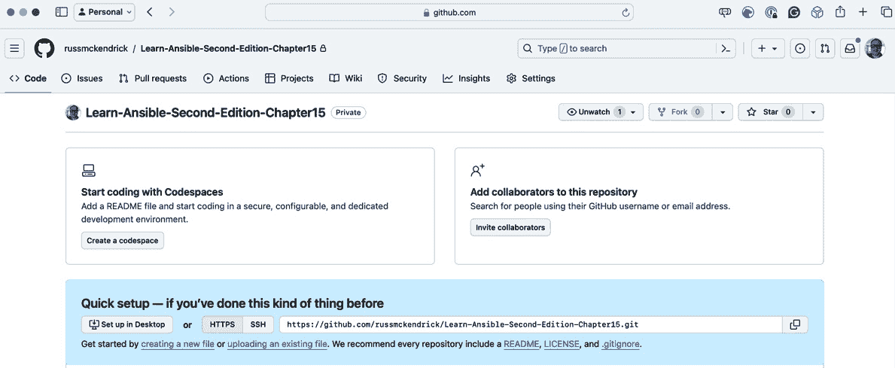

图 15.1 – 我们的新仓库

接下来，我们进入下一步。

### 生成 SSH 密钥对和 Azure 服务主体

在将密钥添加到我们新创建的仓库之前，我们需要生成一个 SSH 密钥对和一个 Azure 服务主体。

信息

如果你在 Windows 机器上进行操作，记得在 Windows 子系统 Linux（WSL）中运行这些命令。

为此，打开终端并运行以下命令：

```
$ ssh-keygen -t rsa -C "learnansible" -f ./id_rsa
```

当提示输入密码时，直接按*Enter*键；我们不需要设置密码。这将生成两个文件：一个名为`id_rsa`，它包含我们密钥的私有部分——请保持其私密性——另一个名为`id_rsa.pub`。顾名思义，它包含我们 SSH 密钥的公有部分。

接下来，我们需要生成一个 Azure 服务主体并授予权限给我们的 Azure 订阅。

在*第七章*，*Ansible Windows 模块*，和*第九章*，*迁移到云*中，我们使用 Azure 命令行工具登录 Azure，并使用我们的 Azure 凭据。然而，当通过 GitHub Actions 等服务与 Azure 交互时，我们不想使用我们的凭据，因为它们将通过多因素身份验证进行锁定，而且你也不想泄露自己的凭据。

为了解决这个问题，我们可以创建一个服务主体，并授予它对 Azure 订阅的权限，以便它可以从 GitHub Action 启动资源。

要创建服务主体，你需要通过运行以下命令使用 Azure CLI 登录 Azure：

```
$ az login
```

如果你已经登录，请运行以下命令：

```
$ az account list
```

两个命令将返回你的账户可以访问的订阅 ID 列表。请记下该 ID，我们稍后会用到它。

这是你可以预期看到的输出示例；这是 Azure CLI 发出的 API 请求返回的 JSON：

```
{
  "environmentName": "AzureCloud",
  "id": "e80d5ad9-e2c5-4ade-a866-bcfbae2b8aea",
  "isDefault": true,
  "name": "My Subscription",
  "state": "Enabled",
  "tenantId": "c5df827f-a940-4d7c-b313-426cb3c6b1fe",
  "user": {
    "name": "account@russ.foo",
    "type": "user"
  }
}
```

我们需要的信息标记为 `id`，与我们希望授予服务主体访问权限的订阅相关。使用前面的示例，我需要运行的命令如下：

```
$ az ad sp create-for-rbac –name sp-learn-ansible –role contributor –scopes /subscriptions/e80d5ad9-e2c5-4ade-a866-bcfbae2b8aea
```

当你运行此命令时，请将范围中的订阅 ID 替换为你自己的。

你得到的输出将类似于这样；请记下它，因为你将无法再次检索密码：

```
Creating 'contributor' role assignment under scope '/subscriptions/e80d5ad9-e2c5-4ade-a866-bcfbae2b8aea'
The output includes credentials that you must protect. Be sure that you do not include these credentials in your code or check the credentials into your source control. For more information, see https://aka.ms/azadsp-cli
{
  "appId": "2616e3df-826d-4d9b-9152-3de141465a69",
  "displayName": "sp-learn-ansible",
  "password": "Y4j8Q~gVO*NoTaREalPa55w0rdpP-pdaw",
  "tenant": "c5df827f-a940-4d7c-b313-426cb3c6b1fe"
}
```

此外，正如我相信你已经猜到的那样，前面示例中的所有信息都不是有效数据，因此请在下一部分使用你自己的值。

### GitHub 个人访问令牌

还有一组凭据需要生成；因为我们的 GitHub 仓库设置为私有，我们需要能够进行身份验证，以便在工作流运行期间检查代码并将日志写回仓库。为此，我们需要生成一个个人访问令牌。

GitHub 个人访问令牌是一种安全的、可撤销的、可定制的凭据，允许你使用 GitHub 进行身份验证，并访问其 API 或命令行工具，而无需使用主账户密码。

由于 GitHub 正在从经典令牌转向细粒度令牌（本文撰写时），所以在此不记录过程，最新的文档副本可以在[`docs.github.com/en/authentication/keeping-your-account-and-data-secure/managing-your-personal-access-tokens`](https://docs.github.com/en/authentication/keeping-your-account-and-data-secure/managing-your-personal-access-tokens)找到。

对于我们的目的，你需要为你的令牌命名，只选择你的仓库，并授予它以下访问权限：

+   **内容**：只读

+   **元数据**：只读；此选项将在权限设置后自动选中

一旦你获得了令牌，请将其保存在安全的地方；它将不会再显示。

### 向仓库中添加机密

通过选择 **设置** | **机密和变量** | **Actions** 返回 GitHub 仓库。点击 **新建仓库机密** 按钮，为以下表格中列出的每个机密创建新机密。请确保按照以下命名约定命名每个机密，因为我们的工作流代码通过名称引用这些机密：

| **机密名称** | **机密内容** |
| --- | --- |
| `ARM_CLIENT_ID` | 这是您创建服务主体时的 `appId` 值。在这个示例中，这将是 `2616e3df-826d-4d9b-9152-3de141465a69`。 |
| `ARM_CLIENT_SECRET` | 这是您创建服务主体时给定的 `password` 值。在这个示例中，这将是 `Y4j8Q~gVO*NoTaREalPa55w0rdpP-pdaw`。 |
| `ARM_SUBSCRIPTION_ID` | 这是您的 Azure 订阅 ID；使用您授予服务主体访问权限的订阅 ID。在这个示例中，这将是 `e80d5ad9-e2c5-4ade-a866-bcfbae2b8aea`。 |
| `ARM_TENANT_ID` | 这是您在创建服务主体时列出的 `tenant` 值的 ID。在这个示例中，这将是 `c5df827f-a940-4d7c-b313-426cb3c6b1fe`。 |
| `SSH_PRIVATE_KEY` | 打开 `id_rsa` 文件并复制粘贴其内容。 |
| `SSH_PUBLIC_KEY` | 打开 `id_rsa.pub` 文件并复制粘贴其内容。 |
| `GH_PAT` | 这应该包含您的 GitHub 个人访问令牌。 |

表 15.1 – GitHub Actions 所需的信息

一旦它们都已添加，您的 **Actions 机密和变量** 页面应该如下所示：

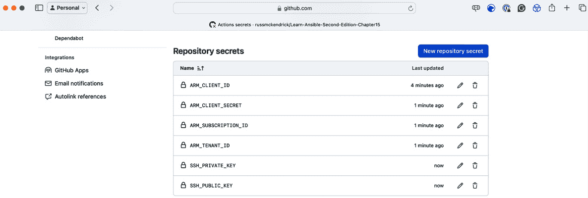

图 15.2 – 所有仓库机密已添加

现在我们已经配置了 GitHub Action 的所有基本设置，让我们来看一下工作流本身。

## 理解 GitHub Action 工作流

工作流文件位于 `.github/workflows/action.yml` 文件中，该文件包含了 YAML 代码，定义了工作流执行期间将执行的作业、步骤和任务。对于我们的情况，工作流将执行以下两个作业，每个作业由多个步骤组成：

+   扫描 Ansible Playbook：

    1.  检出代码。

    1.  创建一个文件夹以存储扫描结果。

    1.  对检出的代码运行 KICS 扫描。

    1.  上传结果副本到 GitHub。

现在，如果 KICS 检测到我们的 playbook 有问题，它将报告错误，并且工作流将在这里停止——如果 KICS 扫描看起来一切正常，工作流将继续运行以下任务：

+   安装并运行 Ansible Playbook：

1.  检查是否有缓存版本的 Ansible 模块和 Python 包可用。

1.  如果没有缓存，下载并安装 Ansible Azure 模块和支持的 Python 包。

1.  检出代码。

1.  使用 Azure CLI 和我们创建的服务主体登录 Azure。

1.  设置 SSH 密钥。

1.  运行 Ansible Playbook，并记录 Playbook 输出，以便我们可以将副本存储在工作流日志中，与扫描结果一起。

1.  上传 Playbook 执行摘要。

现在我们知道工作流将执行什么，让我们深入代码部分。我们从一些基本配置开始：

1.  第一行禁用了 KICS 检查——尽管工作流不是我们 Playbook 的一部分，它存储在仓库中，并将作为工作流执行的一部分被扫描：

    ```
    # kics-scan disable=555ab8f9-2001-455e-a077-f2d0f41e2fb9
    name: "Ansible Playbook Run"
    env:
      FAIL_ON: "medium"
      RESULTS_DIR: "results-dir"
    ```

    我们还设置了工作流的名称，这就是它在 GitHub Web 界面中显示的方式，然后最终设置了一些在工作流执行过程中会使用的变量。

1.  接下来，我们有定义应运行的工作流的配置；根据我们的需求，我们将在每次代码提交到主分支时运行工作流：

    ```
    On:
      push:
        branches:
          - main
    ```

1.  接下来，我们必须定义我们的第一个作业，即扫描 Playbook 代码的作业：

    ```
    jobs:
      scan_ansible_playbook:
        name: "Scan Ansible Playbook"
        runs-on: ubuntu-latest
        defaults:
          run:
            shell: bash
    ```

    正如你所看到的，我们将其定义为`scan_ansible_playbook`，它运行在 GitHub 提供的最新版本的 Ubuntu 镜像上，任务的默认操作是运行 bash。定义好作业后，我们可以继续进行下一步。

1.  我们从检查代码并创建一个存储扫描结果的目录开始：

    ```
        steps:
          - name: "Checkout the code"
            uses: "actions/checkout@v4"
            with:
              token: "${{secrets.GH_PAT}}"
    ```

1.  该步骤下载了托管工作流的仓库的副本；如你所见，我们正在使用`${{secrets.GH_PAT}}`。稍后我们将讨论秘密变量。现在，我们必须创建该文件夹：

    ```
          - name: "Create the folder for storing the scan results"
            run: mkdir -p ${{env.RESULTS_DIR}}
    ```

    该步骤创建了一个目录，其名称引用为`RESULTS_DIR`环境变量，我们在工作流文件的顶部部分中定义了该变量。

1.  引用环境变量时，我们使用`${{env.VARIABLE_NAME}}`格式。所以，在我们的例子中，我们使用`${{env.RESULTS_DIR}}`。在下一步中，我们有一个专门用于运行 KICS 的任务，由 Checkmarx 管理和维护：

    ```
          - name: "Run kics Scan"
            uses: "checkmarx/kics-github-action@v1.7.0"
            with:
              path: "./"
              output_path: "${{env.RESULTS_DIR}}"
              output_formats: "json,sarif"
              fail_on: "${{ env.FAIL_ON }}"
              enable_jobs_summary: true
    ```

    正如你所看到的，我们指示任务输出 JSON 和 SARIF 文件，以及我们在上一步中创建的`${{env.RESULTS_DIR}}`目录，并且如果扫描结果中包含任何在`${{ env.FAIL_ON }}`中定义的严重性，工作流会失败。我们在工作流文件开始时将其设置为`medium`。

1.  现在我们完成了扫描，可以查看安装并运行 Ansible 的工作流代码。这被称为`run_ansible_playbook`：

    ```
      run_ansible_playbook:
        name: "Install Ansible and run Playbook"
        runs-on: ubuntu-latest
        needs: scan_ansible_playbook
        defaults:
          run:
            shell: bash
    ```

    正如你所看到的，这个作业的定义和第一个作业一样，唯一的区别是：我们添加了一个`needs`行，值为`scan_ansible_playbook`。这指示该作业仅在`scan_ansible_playbook`完成并成功时才会运行。

1.  该任务检查三个文件夹是否存在；如果存在，将使用这些文件夹的缓存版本，这意味着一旦工作流运行过一次，后续的执行会更快，因为我们不必每次都安装 Ansible Galaxy 模块及其依赖项：

    ```
        steps:
          - name: "Cache Ansible collections and Python packages"
            uses: actions/cache@v4
            with:
              path: |
                ~/.ansible/collections
                ~/.cache/pip
                /home/runner/.local/lib/python3.10/site-packages
              key: ${{ runner.os }}-ansible-collections-and-python-packages
              restore-keys: |
                ${{ runner.os }}-ansible-collections-and-python-packages
    ```

1.  接下来，我们有检查出我们仓库的步骤：

    ```
          - name: "Checkout the code"
            id: "checkout"
            uses: "actions/checkout@v4"
    ```

    你可能会问：“*为什么我们需要再次检出代码？我们在上一个作业中已经做过了。*”这是个很好的问题。

    答案是，运行作业的计算资源在上一个作业完成时被终止，所有数据都丢失。当当前作业启动时，启动了一个新的资源，并从完全崭新的安装开始。

1.  工作流中的下一步使用 `Azure/login@2` 任务来安装 Azure CLI（如果尚未安装），然后使用我们在本章前面定义为存储库机密的服务主体信息进行登录：

    ```
          - name: "Login to Azure using a service principal"
            uses: "Azure/login@v2"
            with:
              creds: '{"clientId":"${{secrets.ARM_CLIENT_ID }}","clientSecret":"${{secrets.ARM_CLIENT_SECRET }}","subscriptionId":"${{secrets.ARM_SUBSCRIPTION_ID }}","tenantId":"${{secrets.ARM_TENANT_ID }}"}'
    ```

    我们需要使用 `${{ secrets.SECRET_NAME }}` 格式来嵌入机密。在这里，我们使用的是：

    +   `${{``secrets.ARM_CLIENT_ID }}`

    +   `${{``secrets.ARM_CLIENT_SECRET}}`

    +   `${{` `secrets.ARM_SUBSCRIPTION_ID }}`

    +   `${{` `secrets.ARM_TENANT_ID }}`

    由于这些都被定义为机密，因此这些值永远不会出现在任何 Pipeline 运行日志中。

    这意味着，虽然我们知道这些值，但有权限运行工作流的其他人永远不需要被告知我们的服务主体凭据，因为他们可以使用这些机密。如果他们检查任何日志或尝试输出它们，由于工作流的执行，它们将被自动屏蔽，因此也永远不会意外暴露。

1.  在运行 Ansible 之前的最后一步是将 SSH 密钥对添加到我们的主机并进行配置：

    ```
          - name: "Setup SSH key for Ansible"
            id: "add-ssh-key"
            run: |
              mkdir ~/.ssh
              chmod 700 ~/.ssh/
              echo "${{ secrets.SSH_PRIVATE_KEY }}" > ~/.ssh/id_rsa
              chmod 600 ~/.ssh/id_rsa
              echo "${{ secrets.SSH_PUBLIC_KEY }}" > ~/.ssh/id_rsa.pub
              chmod 644 ~/.ssh/id_rsa.pub
              cat  ~/.ssh/id_rsa.pub
    ```

1.  SSH 密钥对是我们所需的最后一部分。现在，我们可以运行 Ansible 了：

    ```
          - name: "Run the playbook (with ansible-playbook)"
            id: "ansible-playbook-run"
            continue-on-error: true
            run: |
              ansible-playbook -i inv site.yml 2>&1 | tee ansible_output.log
              echo "summary<<EOF" >> $GITHUB_OUTPUT
              echo "## Ansible Playbook Output" >> $GITHUB_OUTPUT
              echo "<details><summary>Click to expand</summary>" >> $GITHUB_OUTPUT
              echo "" >> $GITHUB_OUTPUT
              echo "\`\`\`" >> $GITHUB_OUTPUT
              cat ansible_output.log >> $GITHUB_OUTPUT
              echo "\`\`\`" >> $GITHUB_OUTPUT
              echo "</details>" >> $GITHUB_OUTPUT
              echo "EOF" >> $GITHUB_OUTPUT
            env:
              ANSIBLE_HOST_KEY_CHECKING: "False"
    ```

正如你所看到的，运行 Ansible 在这里比在本地机器上运行时稍微复杂一些。我们运行 Ansible playbook 的原因是捕获其输出并格式化输出，以便在 GitHub Actions 作业日志中显示。

下面是发生的事情的详细说明：

+   `运行 playbook（使用 ansible-playbook）`，以便在工作流的执行日志中提供更清晰的说明。

+   `ansible-playbook-run`，这样我们就可以在后续步骤中引用此步骤的输出。

+   `continue-on-error` 设置为 `true`，我们允许即使此步骤遇到错误，工作流仍然继续。这对于确保工作流可以继续执行其他步骤（例如提供诊断信息或执行清理操作）非常有用，即使 Ansible playbook 失败。

+   **运行**：这个关键字启动了一个多行脚本块，该脚本将在作业的 shell 中执行。脚本执行以下操作：

    ```
    ansible-playbook -i inv site.yml 2>&1 | tee ansible_output.log
    ```

    此命令运行在 `site.yml` 中定义的 Ansible playbook，并使用清单文件 `inv`。`2>&1` 部分将 `stderr` 重定向到 `stdout`，因此 `ansible-playbook` 命令的标准输出和错误都被管道传输到 `tee` 命令。`tee ansible_output.log` 将输出写入 `ansible_output.log` 文件并在工作流日志中显示，便于实时监控。

    后续的 `echo` 命令和 `cat` 会将格式化的 Ansible 输出摘要追加到特殊的 `GITHUB_OUTPUT` 环境变量中。正如你可能已经注意到的，我们主要使用 Markdown 格式化文本。

+   `env` 部分定义了此步骤的环境变量。`ANSIBLE_HOST_KEY_CHECKING: "False"` 禁用了 Ansible 的 SSH 主机密钥检查。此选项通常在自动化环境中使用，以避免人工干预。

我们工作流的最后一步将前一步的输出输出到 `$GITHUB_STEP_SUMMARY`。这是一个特殊的变量，用于 GitHub Actions 工作流记录工作流执行日志中的步骤结果：

```
      - name: "Publish Ansible Playbook run to Task Summary"
        env:
          SUMMARY: ${{ steps.ansible-playbook-run.outputs.summary }}
        run: |
          echo "$SUMMARY" >> $GITHUB_STEP_SUMMARY
```

虽然这完成了我们的工作流代码审查，但还有一个任务在后台执行，我们无需定义。如你所记得，在 `run_ansible_playbook` 任务的第一步中，我们有一个步骤是查找与工作流相关的任何缓存。通过定义这个步骤，工作流结束时会有一个后部署任务，如果缓存不存在，它会创建缓存。

现在我们理解了工作流代码，让我们检查一下我们新创建的仓库副本。复制示例仓库中的代码，然后提交更改。

## 提交代码

如前所述，在运行工作流之前，我们需要检查出在本章开始时创建的空仓库。具体操作方式取决于你如何与 GitHub 互动。我使用命令行，但你可能使用 GitHub Desktop 应用程序或 Visual Studio Code 等 IDE。

信息

欲了解更多 GitHub 桌面应用程序的信息，请参见 [`desktop.github.com/`](https://desktop.github.com/)。有关如何配置 SSH 连接到 GitHub 的详细信息，请参见 [`docs.github.com/en/authentication/connecting-to-github-with-ssh.`](https://docs.github.com/en/authentication/connecting-to-github-with-ssh.)

如果你想在命令行中跟随操作，你必须更新仓库名称以反映你自己的名称，并确保你可以通过 SSH 访问 GitHub 仓库：

```
$ git clone https://github.com/PacktPublishing/Learn-Ansible-Second-Edition.git
$ cd Learn-Ansible-Second-Edition-Chapter15
```

一旦进入文件夹，我将 [`github.com/PacktPublishing/Learn-Ansible-Second-Edition/tree/main/Chapter15`](https://github.com/PacktPublishing/Learn-Ansible-Second-Edition/tree/main/Chapter15) 中的内容复制过来，并确保也复制了 `.github` 文件夹，因为它包含我们想要执行的工作流。

复制完成后，我运行了以下命令来添加新文件并创建第一次提交，然后推送：

```
$ git add .
$ git commit -m "first commit"
$ git push
```

如果一切按计划进行，当你访问仓库并点击 **Actions** 标签时，你应该能看到类似这样的内容：

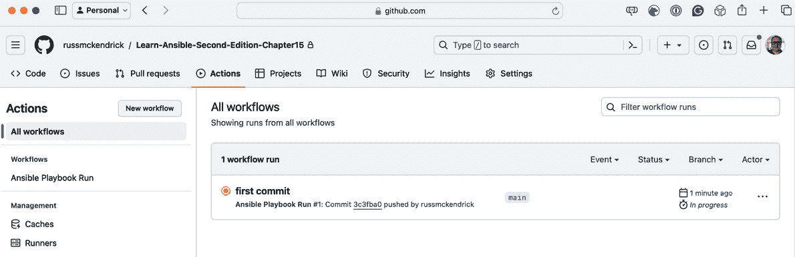

图 15.3 – 我们的第一次提交正在运行 GitHub Action

点击提交的名称应该能显示工作流的进度：

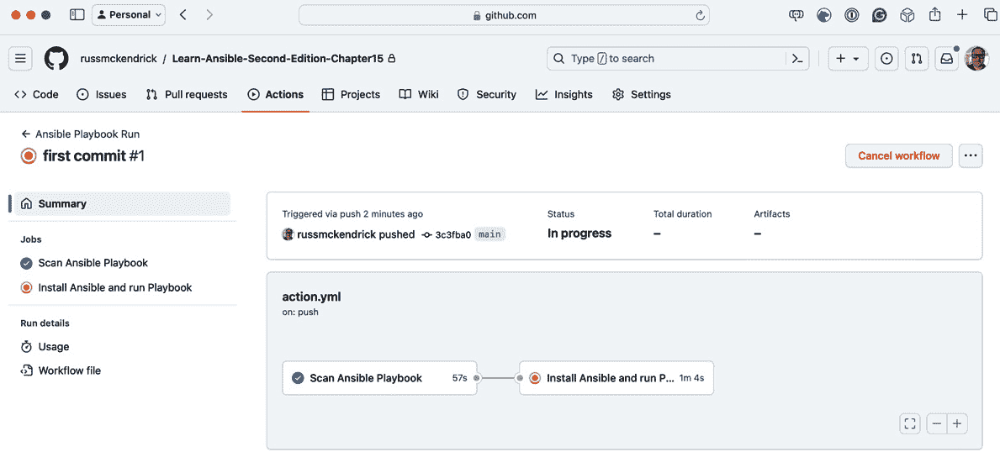

图 15.4 – 查看工作流进度

点击正在运行的任务——在我的示例中，这是 *安装 Ansible 并运行 Playbook* 任务。这将显示它的实时进度：

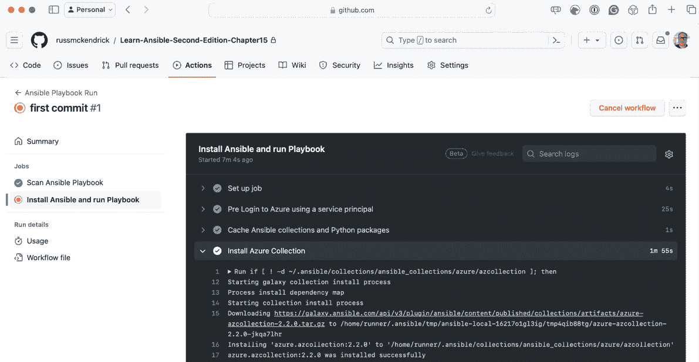

图 15.5 – 查看实时输出

如果一切按计划进行，Ansible playbook 将会运行，Azure 资源将被部署，我们应该能够看到正在运行的 WordPress 实例。

点击页面顶部的**摘要**链接将显示完整的输出。在这里，我们将看到在工作流运行过程中记录的任何警告或信息，然后是 KICS 结果：

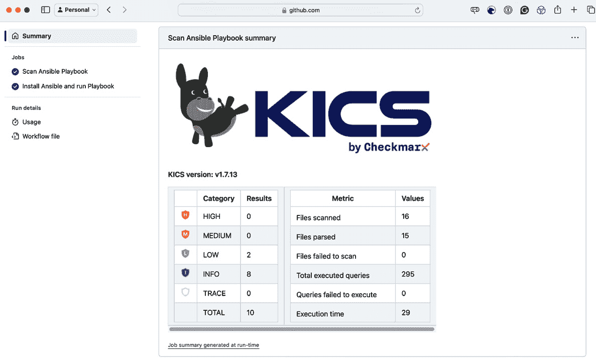

图 15.6 – KICS 扫描结果

您还可以展开**Ansible Playbook 输出**区域并查看日志：

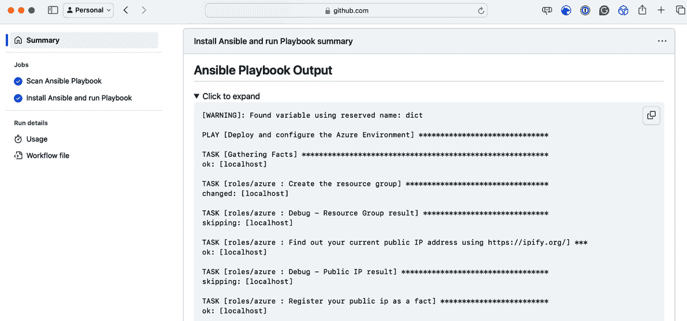

图 15.7 – Ansible Playbook 输出

在我们删除 Azure 资源之前，让我们看看当扫描失败时会发生什么。为此，打开 `roles/azure/tasks/main.yml` 并删除以下内容（大约在第 *61* 行）：

```
    security_group: "{{ nsg_output.state.name }}"
```

删除后，检查更新的代码。这将触发新的工作流运行：

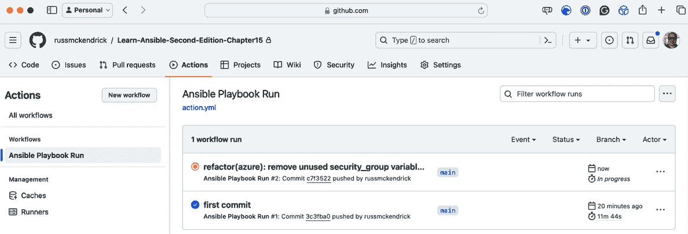

图 15.8 – 触发第二次工作流运行

由于我们删除的那一行将触发中等严重性的规则，因此我们的工作流运行应当失败，如此处所示：

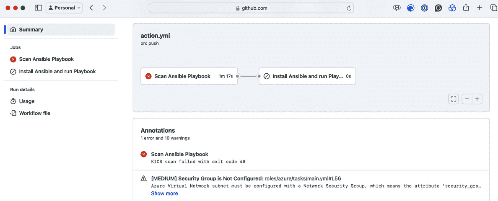

图 15.9 – 由于我们的修改，第二次工作流运行失败

完成测试后，我建议登录 Azure 手动删除包含我们刚刚启动的资源的资源组。

如您所见，尽管在部署过程中您需要考虑一些因素——例如确保所有连接和步骤都已到位，以便安全地与云服务提供商交互——但运行 Playbook 的基本思路和方法与在本地机器上运行时几乎相同。

对于我们将要查看的下一个工具 Azure DevOps，也可以说同样的话。

# Azure DevOps

我们用于 GitHub Actions 的描述同样适用于 Azure DevOps Pipelines 和代码库，这是我们将在本节中使用的 Azure DevOps 服务中的两个。再次强调，我们将使用平台提供的计算资源来运行 Ansible Playbook，很多方法将是相同的。因此，我们将跳过老的内容，从准备一个 Azure DevOps 项目开始，以托管我们的代码并运行 Playbook。

## 创建和配置我们的项目

首先，您需要创建一个 Azure DevOps 项目。就像我们的 GitHub 仓库一样，我将其命名为 `Learn-Ansible-Second-Edition-Chapter15`：

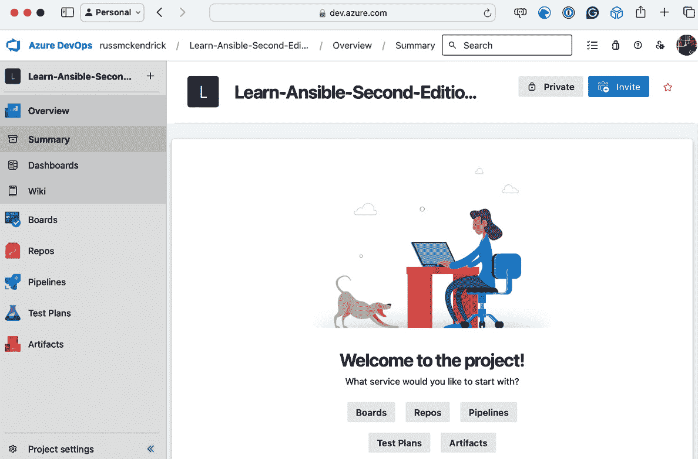

图 15.10 – 我们新创建的 Azure DevOps 项目

在检查代码并添加我们的管道之前，我们需要配置一些内容；首先是创建与 Azure 本身的服务连接。为此，请点击页面左下角的**项目设置**按钮。

一旦打开**项目设置**，在左侧菜单下选择**管道**，点击**服务连接**，然后点击**创建服务连接**按钮。

选择**Azure 资源管理器**，然后点击**下一步**；从这里，选择**服务主体（手动）**，再点击一次**下一步**。

我们采取这种方法，而不是其他任何会自动为我们创建服务主体的方法，因为我们已经在*GitHub* *Actions*部分记录了服务主体的详细信息。

以下表格包含你需要输入的信息：

| **选项** | **内容** |
| --- | --- |
| **订阅 Id** | 这是你的 Azure 订阅 ID；使用你授予服务主体访问权限的那个订阅 ID。在这个示例中，它是`e80d5ad9-e2c5-4ade-a866-bcfbae2b8aea`。 |
| **订阅名称** | 输入你的 Azure 订阅名称。由于我们将在管道代码中引用订阅 ID，因此可以设置为任何你喜欢的值。 |
| **服务** **主体 Id** | 这是你在创建服务主体时得到的`appId`值。在这个示例中，它是`2616e3df-826d-4d9b-9152-3de141465a69`。 |
| **服务** **主体密钥** | 这是你在创建服务主体时得到的`password`值。在这个示例中，它是`Y4j8Q~gVO*NoTaREalPa55w0rdpP-pdaw`。 |
| **租户 ID** | 这是你在创建服务主体时列出的`tenant`值的 ID。在这个示例中，它是`c5df827f-a940-4d7c-b313-426cb3c6b1fe`。 |
| **服务** **连接名称** | 在此输入`azConnection`，这是我们在管道代码中引用连接的方式。 |
| **安全性** | 确保选择了**授予所有管道访问权限**。 |

表格 15.2 – Azure DevOps 中管道所需的信息

输入这些信息后，点击**验证并保存**按钮。这将检查你输入的详细信息是否正确，并保存服务连接。

接下来，我们需要从 Visual Studio Marketplace 安装几个扩展，以便发布我们的 KICS 报告和 Playbook 运行概况：

+   **Markdown** **报告**：[`marketplace.visualstudio.com/items?itemName=MasamitsuMurase.publish-markdown-reports`](https://marketplace.visualstudio.com/items?itemName=MasamitsuMurase.publish-markdown-reports)

+   **Sarif** **工具**：[`marketplace.visualstudio.com/items?itemName=sariftools.scans`](https://marketplace.visualstudio.com/items?itemName=sariftools.scans)

为了在你的 Azure DevOps 组织中启用这些扩展，请遵循上述 URL，并按照点击**免费获取**按钮后的说明进行操作。

最后的配置步骤是添加管道变量组和安全文件。为此，点击左侧菜单中的**管道**，然后点击**库**。进入**库**页面后，点击**+ 变量组**按钮。

将变量组命名为`playbook`并输入以下变量：

| **名称** | **值** |
| --- | --- |
| `breakSeverity` | `MEDIUM` |
| `SSH_PUBLIC_KEY` | 在此粘贴`id_rsa.pub`文件的内容 |
| `subscriptionName` | `azConnection` – 这是我们在本节开始时创建的连接名称 |

表 15.3 – 变量组所需的信息

填写完前面的信息后，点击`id_rsa`文件。

我们现在已经准备好了所有基本配置，可以上传我们的代码了。

## 克隆仓库并上传代码

接下来，我们必须克隆仓库并上传我们的代码，包括我们将在下一节中讨论的`azure-pipelines.yml`文件。为此，请点击左侧菜单中的**Repos**；你将看到几种克隆仓库的方法。

我选择再次使用 SSH 克隆；如果你跟着操作，更新`git clone`命令以反映你的仓库：

```
$ git clone git@ssh.dev.azure.com:v3/russmckendrick/Learn-Ansible-Second-Edition-Chapter15/Learn-Ansible-Second-Edition-Chapter15
$ cd Learn-Ansible-Second-Edition-Chapter15
```

然后，我从[`github.com/PacktPublishing/Learn-Ansible-Second-Edition/tree/main/Chapter15`](https://github.com/PacktPublishing/Learn-Ansible-Second-Edition/tree/main/Chapter15)复制了文件。这一次，我没有担心复制`.github`目录，因为它不是必需的。将文件复制到本地克隆的文件夹后，我运行了以下命令，添加了新文件并创建了第一次提交，然后推送：

```
$ git add .
$ git commit -m "first commit"
$ git push
```

与我们第一次将代码提交到 GitHub 时不同，由于我们尚未配置管道，因此什么也不会发生。

## Azure DevOps 管道

我们的管道定义在`azure-pipelines.yml`文件中，该文件位于我们仓库文件的根目录。在使用该文件创建管道之前，让我们快速回顾一下内容。

信息

从结构上看，我们的`azure-pipelines.yml`文件与我们之前在 GitHub Actions 中讨论的非常相似；事实上，你几乎可以认为它们是可以互换和兼容的——但它们并不完全相同，所以请小心不要混淆这两者。

我们的管道文件从一个基本配置开始，指示管道何时触发，加载哪个变量组，以及使用哪个底层镜像。在顶部，包含一个 KICS 排除规则，这是我们在*第十三章*中讨论过的内容，*扫描你的* *Ansible Playbooks*：

```
# kics-scan disable=3e2d3b2f-c22a-4df1-9cc6-a7a0aebb0c99
trigger:
  - main
variables:
  - group: playbook
pool:
  vmImage: ubuntu-latest
```

完成基本配置后，我们可以开始各个阶段：

1.  我们的第一次运行是对代码进行 KICS 扫描：

    ```
      - stage: "scan"
        displayName: "KICS - Scan Ansible Playbook"
    ```

1.  该阶段由一个作业组成：

    ```
       jobs:
          - job: "kics_scan"
            displayName: "Run KICS Scan"
            pool:
              vmImage: "ubuntu-latest"
            container: checkmarx/kics:debian
    ```

1.  正如你可能已经注意到的，这里我们使用了`checkmarx/kics:debian`容器镜像来部署 KICS。这将启动容器并在其中执行以下步骤。我们的步骤包含两个任务——第一个任务创建输出文件夹，检出代码并运行扫描：

    ```
            steps:
              - script: |
                  mkdir -p $(System.DefaultWorkingDirectory)/output
                  /app/bin/kics scan --ci -p ${PWD} -o ${PWD} --report-formats "all" --ignore-on-exit results
                  mv results* $(System.DefaultWorkingDirectory)/output
                  ls -lhat $(System.DefaultWorkingDirectory)/output
    ```

1.  第二个任务发布输出目录的内容，该目录包含所有扫描结果，作为构建工件：

    ```
              - task: PublishBuildArtifacts@1
                inputs:
                  pathToPublish: $(System.DefaultWorkingDirectory)/output
                  artifactName: CodeAnalysisLogs
    ```

1.  文件发布后，我们不再需要在此阶段生成的资源，因此可以进入第二阶段：

    ```
      - stage: "scan_parse"
        displayName: "KICS - Parse Scan Resaults"
        jobs:
          - job: "kics_scan_parse_result"
            displayName: "Check KICS Scan Resaults"
            pool:
              vmImage: "ubuntu-latest"
            steps:
    ```

1.  如你所见，这个阶段解析了我们的扫描结果；我们运行的第一个任务是下载我们在上一阶段上传的工件副本：

    ```
              - task: DownloadPipelineArtifact@2
                displayName: "Download the Security Scan Artifact Result"
                inputs:
                  artifact: CodeAnalysisLogs
    ```

    现在我们已经得到了结果文件，接下来需要审查它们，以判断是否需要运行 Ansible Playbook。这个任务运行一个 bash 脚本，读取 JSON 结果并设置一些管道变量，以控制接下来的步骤。

1.  我们用一些配置来启动任务：

    ```
              - task: Bash@3
                name: "setvar"
                displayName: "Check for issues in the scan result"
                inputs:
                    failOnStderr: true
                    targetType: "inline"
                    script: |
    ```

1.  现在，我们有了脚本本身，脚本首先通过设置一些本地变量并使用 `echo` 命令将一些结果输出到屏幕。这些结果会出现在我们的管道运行中：

    ```
                      resultsFilePath="$(Pipeline.Workspace)/results.json"
                      BREAK=$(breakSeverity)
                      echo "Checking for severity level: $BREAK"
                      noIssues=$(jq --arg BREAK "$BREAK" '.severity_counters[$BREAK] // 0' $resultsFilePath)
                      echo "Number of issues found: $noIssues"
    ```

    然后，我们创建一个*组*，这样当我们查看管道输出时，以下信息会被最小化，从而使其更容易阅读。

1.  在组内，我们有一个 `if` 语句，表示如果检测到的问题少于（`-lt`）`1`（也就是零个问题），则输出变量 `OK_TO_DEPLOY` 被设置为 `true`：

    ```
                      echo "##[group]Checking the scan output"
                      if [ "$noIssues" -lt 1 ]; then
                          echo "##vso[task.setvariable variable=OK_TO_DEPLOY;isOutput=true]true"
                          echo "##vso[task.logissue type=warning]No issue found. Progressing with pipeline."
    ```

1.  如果此条件不满足——也就是说，存在一个或多个问题——那么 `OK_TO_DEPLOY` 被设置为 `false` 并且记录一个错误：

    ```
                      else
                          echo "##vso[task.setvariable variable=OK_TO_DEPLOY;isOutput=true]false"
                          echo "##vso[task.logissue type=error]Pipeline failed due to $noIssues issue(s) found."
                      fi
                      echo "##[endgroup]"
    ```

1.  记录错误会停止管道的其余部分运行。下一个也是最后一个阶段运行 Ansible Playbook。它依赖于前一个阶段成功执行，并且 `OK_TO_DEPLOY` 被设置为 `true`：

    ```
      - stage: "run_ansible"
        displayName: "Run Ansible"
        condition: |
          and
            (
              succeeded(),
              eq(dependencies.scan_parse.outputs['kics_scan_parse_result.setvar.OK_TO_DEPLOY'], 'true')
            )
        jobs:
          - job: "ansible_install"
            displayName: "Ansible"
            steps:
    ```

1.  第一个任务是登录到 Azure 并将服务主体的详细信息设置为环境变量，以便在后续任务中使用：

    ```
              - task: AzureCLI@2
                displayName: 'Azure CLI'
                inputs:
                  azureSubscription: '$(subscriptionName)'
                  addSpnToEnvironment: true
                  scriptType: 'bash'
                  scriptLocation: 'inlineScript'
                  inlineScript: |
                    echo "##vso[task.setvariable variable=ARM_SUBSCRIPTION_ID]$(az account show --query="id" -o tsv)"
                    echo "##vso[task.setvariable variable=ARM_CLIENT_ID]${servicePrincipalId}"
                    echo "##vso[task.setvariable variable=ARM_CLIENT_SECRET]${servicePrincipalKey}"
                    echo "##vso[task.setvariable variable=ARM_TENANT_ID]${tenantId}"
    ```

1.  接下来，我们需要将 SSH 密钥添加到环境中。这里使用的是我们之前上传的安全文件：

    ```
              - task: InstallSSHKey@0
                displayName: "Add SSH Key"
                inputs:
                  sshKeySecureFile: "id_rsa"
                  knownHostsEntry: "azure.devops"
    ```

1.  现在，我们需要添加 SSH 密钥的公共部分，安装运行 Ansible Playbook 所需的工具，然后实际运行它，记得添加服务主体的详细信息：

    ```
              - task: Bash@3
                name: "ansible"
                displayName: "Run Ansible"
                env:
                  AZURE_CLIENT_ID: $(ARM_CLIENT_ID)
                  AZURE_SECRET: $(ARM_CLIENT_SECRET)
                  AZURE_TENANT: $(ARM_TENANT_ID)
                  AZURE_SUBSCRIPTION_ID: $(ARM_SUBSCRIPTION_ID)
                  ANSIBLE_HOST_KEY_CHECKING: "False"
                inputs:
                    targetType: "inline"
                    script: |
    ```

1.  环境准备好后，我们可以运行脚本，脚本首先会添加 `id_rsa.pub` 文件并设置正确的权限：

    ```
                      echo "##[group]Add SSH key"
                          echo "$(SSH_PUBLIC_KEY)" > ~/.ssh/id_rsa.pub
                          chmod 644 ~/.ssh/id_rsa.pub
                      echo "##[endgroup]"
    ```

1.  脚本的下一部分安装 Azure Ansible 集合（来自 Ansible Galaxy）并安装相关要求。我们在这里使用 `--force` 确保从 Ansible Galaxy 拉取到最新的所有集合：

    ```
                      echo "##[group]Install the Azure Ansible Collection"
                          ansible-galaxy collection install --force azure.azcollection
                          pip3 install -r ~/.ansible/collections/ansible_collections/azure/azcollection/requirements-azure.txt
                      echo "##[endgroup]"
    ```

1.  安装好这些后，我们可以运行 playbook；我们采取与运行 GitHub Action 类似的方法来运行 playbook：

    ```
                      echo "##[group]Run the Ansible Playbook"
                          ansible-playbook -i inv site.yml 2>&1 | tee $(System.DefaultWorkingDirectory)/ansible_output.log
                      echo "##[endgroup]"
    ```

1.  脚本的最后部分将我们的 Ansible 输出转换成一个名为 `summary.md` 的 Markdown 文件：

    ```
                      echo "##[group]Create the mardown file for the Ansible Playbook Output"
                          mkdir -p $(System.DefaultWorkingDirectory)/markdown
                          echo "# Ansible Playbook Output" > $(System.DefaultWorkingDirectory)/markdown/summary.md
                          echo "<details><summary>Click to expand</summary>" >> $(System.DefaultWorkingDirectory)/markdown/summary.md
                          echo "" >> $(System.DefaultWorkingDirectory)/markdown/summary.md
                          echo "\`\`\`" >> $(System.DefaultWorkingDirectory)/markdown/summary.md
                          cat $(System.DefaultWorkingDirectory)/ansible_output.log >> $(System.DefaultWorkingDirectory)/markdown/summary.md
                          echo "\`\`\`" >> $(System.DefaultWorkingDirectory)/markdown/summary.md                      echo "</details>" >> $(System.DefaultWorkingDirectory)/markdown/summary.md
                      echo "##[endgroup]"
    ```

1.  管道的最后一个任务是将 `markdown/summary.md` 文件的副本上传到我们的管道：

    ```
              - task: PublishMarkdownReports@1
                name: "upload_ansible_output"
                displayName: "Upload Ansible Output"
                inputs:
                  contentPath: "$(Build.SourcesDirectory)/markdown"
                  indexFile: "summary.md"
    ```

到此，我们的管道已经完成。那么，既然我们知道它的功能，接下来我们将其添加到我们的 Azure DevOps 项目中，并首次运行它。

如果你点击 `azure-pipelines.yml` 文件，将会加载并提供 **运行** 或 **保存** 选项。我们将点击 **运行**。

屏幕上会显示如下内容：

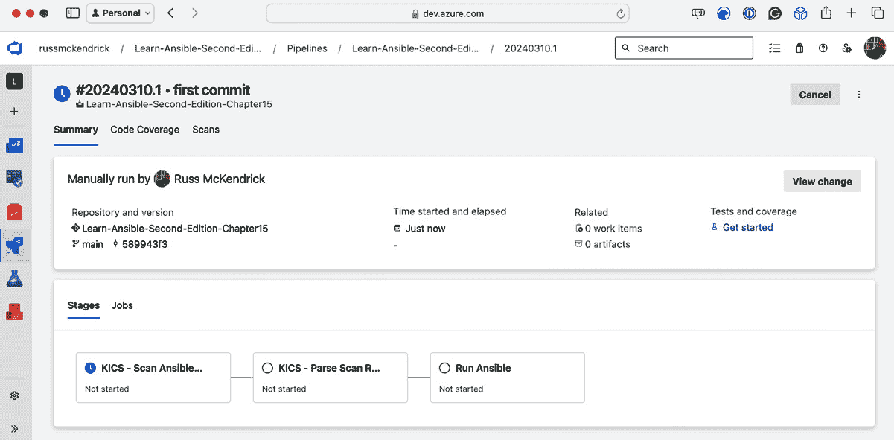

图 15.11 – 第一次运行管道

然而，事情并非如它看起来的那样！如果点击第一个阶段，您将看到以下内容。管道需要访问我们创建的变量组的权限：

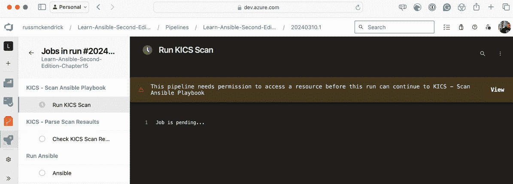

图 15.12 – 授予变量组的权限

点击**查看**并按照屏幕上的说明授予权限。KICS 扫描将会运行，阶段将完成。然后，它将进入**解析扫描结果**阶段，该阶段也应完成。

如果返回到摘要，您会看到需要更多权限，这次是为了访问我们上传的安全文件：

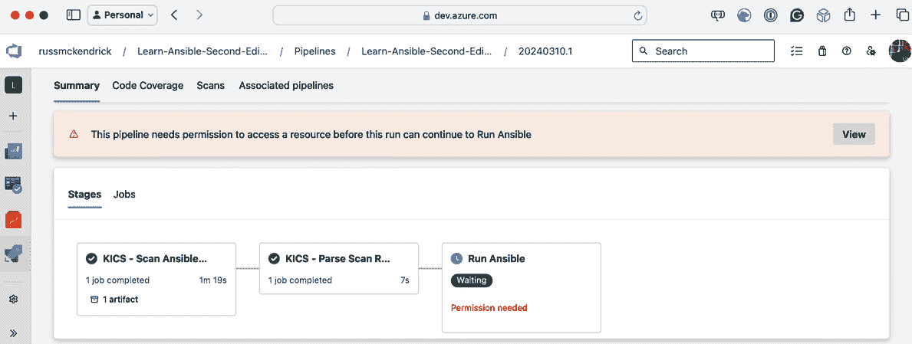

图 15.13 – 授予安全文件的权限

再次点击**查看**并按照屏幕上的说明授予权限。这应该是需要授予的最后一个权限。从现在开始，当我们运行管道时，权限已经被授予。

如果点击**运行 Ansible**阶段，您可以跟踪 Playbook 的运行。如果一切按计划进行，返回摘要页面应该会显示如下内容：

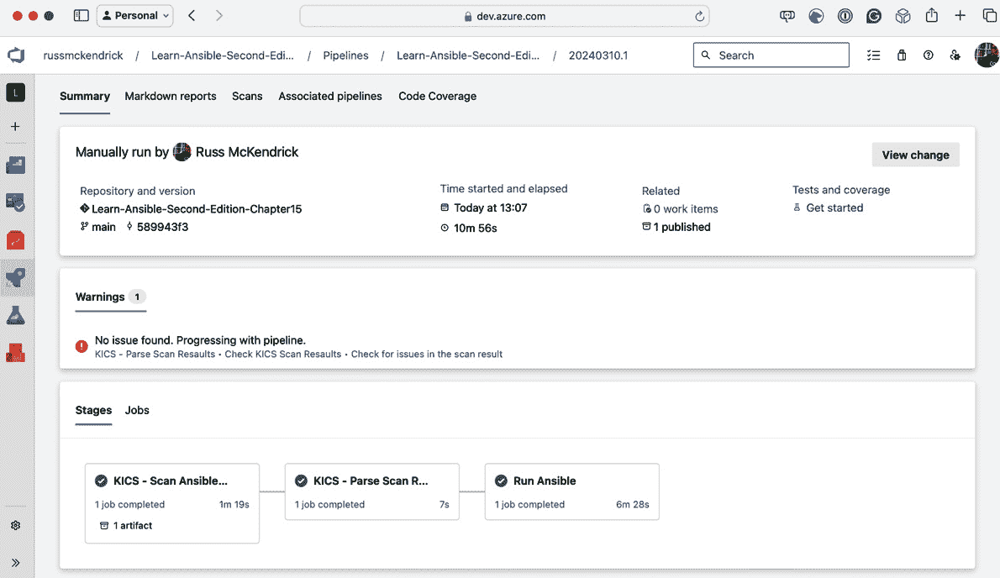

图 15.14 – 一切正常！！

点击**Markdown 报告**将显示 Playbook 运行的结果：

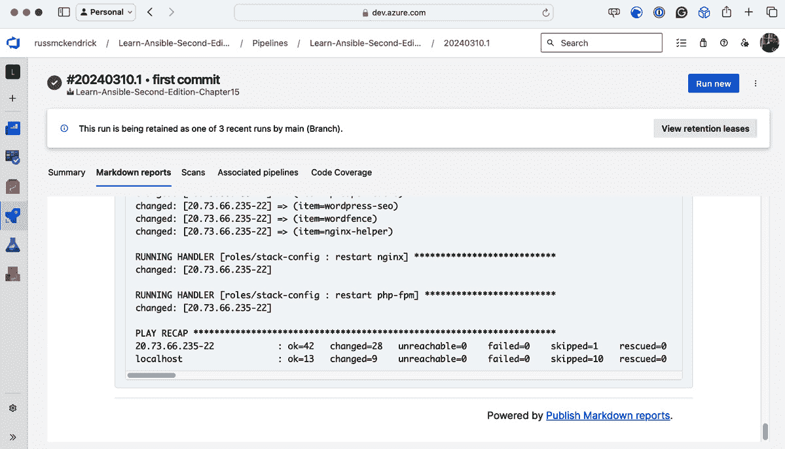

图 15.15 – Markdown 报告

点击**扫描**将显示 KICS 扫描的结果：

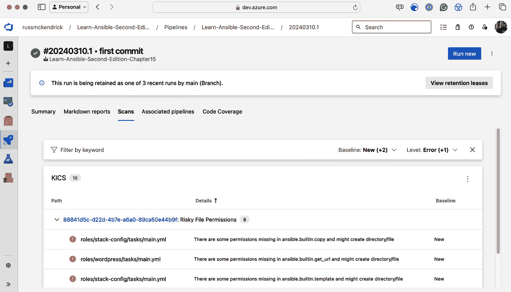

图 15.16 – 扫描报告

就像 GitHub Actions 一样，我们来看看当扫描失败时会发生什么。再次打开`roles/azure/tasks/main.yml`，删除如下所示的行（它大约在 *61* 行附近）：

```
    security_group: "{{ nsg_output.state.name }}"
```

删除后，提交更新后的代码。这将触发新的工作流运行：

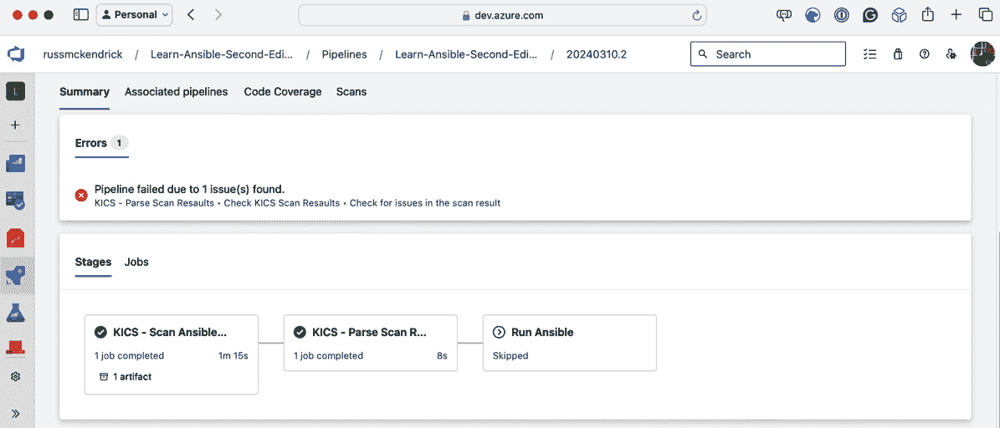

图 15.17 – 管道出现错误

如您所见，我们收到一条消息，说明**管道因发现 1 个问题而失败**，并且由于未满足运行条件，**运行 Ansible** 阶段被跳过。

测试完成后，登录 Azure 并手动删除包含我们刚刚启动的资源的资源组。

# 摘要

在本章中，我们学习了如何使用 GitHub 和 Azure DevOps 提供的计算资源来运行我们的 Ansible Playbooks。我们发现，这非常适合运行我们的 Playbook 代码，因为我们可以将定义计算资源配置的代码与 Playbook 代码一起部署。

我们还学到，通过使用内置工具，我们可以安全地配置环境，以避免将服务主体凭证等机密信息暴露给其他有权限运行 Playbook 的用户。

唯一的缺点是我们必须创建执行 Playbook 的逻辑。如果有一个工具可以从单一用户界面集中运行我们的 Playbooks，岂不是很棒吗？好消息是，在下一章，我们将详细讲解这一点——所以，如果你喜欢我们目前采用的方法，请继续阅读。

# 进一步阅读

要了解本章涵盖的更多主题，请查看以下资源：

+   **GitHub** **Actions**: [`docs.github.com/en/actions`](https://docs.github.com/en/actions)

+   **Azure** **DevOps**: [`azure.microsoft.com/en-gb/products/devops`](https://azure.microsoft.com/en-gb/products/devops)
