# 16

# 介绍 Ansible AWX 和 Red Hat Ansible Automation Platform

本章将探讨两种 Ansible 的图形化界面：商业版 **Red Hat Ansible Automation Platform** 和开源版 **Ansible AWX** —— 或者更完整的名称，**Ansible** **Web eXecutable**。

本章将重点介绍开源的 Ansible AWX，因为它是免费的，并且除了运行该工具所需的资源外，不需要预付费用或合同。

我们将讨论如何安装 Ansible AWX 以及为什么要使用它。毕竟，我们已经在使用 Ansible 的过程中走了 16 章，还没有需要使用图形界面——那么，为什么现在要用呢？

本章结束时，我们将完成以下任务：

+   讨论了 Red Hat Ansible Automation Platform 与 Ansible AWX 的对比

+   安装并配置了 Ansible AWX

+   使用 Ansible AWX 部署了我们的 Microsoft Azure 云应用

# 技术要求

尽管本章我们仅部署 Ansible AWX，但它的要求相对复杂。因此，我将提供在 Microsoft Azure 上使用 AKS 服务部署 Kubernetes 集群的说明，而不是在本地运行。

如果你正在跟随本书，你需要拥有 Microsoft Azure 账户并安装 Azure CLI。有关更多信息，请参见 *第九章*，*迁移到* *云端*。

# Red Hat Ansible Automation Platform 与 AWX 的对比

Red Hat Ansible Automation Platform 和 Ansible AWX 是 Red Hat 提供的两个强大工具，用于管理和简化 Ansible 部署。两者都提供了基于 Web 的界面，简化了 Ansible playbook 的执行和管理，使用户能够更容易地利用 Ansible 的自动化功能，而不需要深入的命令行知识。

Red Hat Ansible Automation Platform，前身为 **Ansible Tower**，是一款综合性的企业级解决方案，超越了 Ansible Tower 的功能。它集成了多种组件，创建了一个紧密结合且广泛扩展的自动化环境。Red Hat Ansible Automation Platform 的一些关键特性如下：

+   **集中控制**：Red Hat Ansible Automation Platform 提供了一个统一的基于 Web 的仪表板，用于从一个中心位置定义、调度和监控自动化任务。

+   **基于角色的访问控制**（**RBAC**）：通过精细化的访问控制，确保用户能够访问合适的自动化资源，从而增强安全性和控制性。

+   **工作流管理**：创建复杂的工作流，结合多个 playbook、作业模板和库存源，并支持依赖关系、条件判断和审批流程。

+   **可扩展性和灵活性**：自动化可以根据大型企业的需求进行扩展，支持多样化的基础设施，包括云平台、容器和网络设备。

+   **内容集合**：访问经过精心策划的预包装模块和插件，以加速自动化项目的实施。

+   **自动化中心**：这个集中式的资源库托管了经过认证、合作伙伴支持和社区驱动的内容。它促进了合作，并使高质量资源更加易于访问。

+   **自动化分析**：利用复杂的分析工具来审视不同集群和实例的性能、利用率以及各种关键绩效指标（KPI）。

+   **与 Red Hat 生态系统的集成**：与其他 Red Hat 产品（如 Red Hat Insights 和 Red Hat Satellite）无缝集成，促进了一个统一的环境。

另一方面，Ansible AWX 是 Red Hat Ansible 自动化平台的开源上游项目。它提供了该平台的许多核心功能，但遵循社区驱动的开发模型，发布频率较高。虽然 Ansible AWX 为自动化提供了坚实的基础，但 Red Hat Ansible 自动化平台可能需要一些企业特定的功能和集成。

选择 Red Hat Ansible 自动化平台还是 Ansible AWX 取决于你们组织的需求和要求。Red Hat Ansible 自动化平台非常适合寻求稳健、功能丰富且拥有商业支持与无缝集成 Red Hat 生态系统的企业。它提供了先进的功能，旨在处理跨不同环境的复杂自动化需求。

另一方面，Ansible AWX 是适合那些偏好开源解决方案并且能够接受社区驱动支持的组织的合适选择。它为自动化提供了坚实的基础，并且得益于更频繁的更新和社区贡献。

Red Hat Ansible 自动化平台和 Ansible AWX 都允许组织在大规模上实现自动化，减少手动工作，并提高 IT 运维的一致性和可靠性。它们提供了用户友好的界面，并使团队协作更加高效，提高了效率和合规性。

# Ansible AWX

说安装 Ansible AWX 很复杂，简直是轻描淡写。自从 Red Hat 首次开源该项目以来，部署它一直都非常困难。

幸运的是，第一次发布已经容器化，它从最初在少量容器中运行，逐步过渡到能够在 Kubernetes 集群中运行，并由 AWX Operator 管理。

信息

Kubernetes Operator 使用自定义资源来自动化 Kubernetes 集群中应用程序和组件的管理。它扩展了集群的行为，而无需修改 Kubernetes 本身的代码。Operator 可以处理各种任务，例如部署、备份、升级和服务发现，从而减少了人工干预，提高了系统的可靠性。

我们首先在 Microsoft Azure 上启动自己的 Kubernetes 并配置本地机器，这样我们就可以部署并配置 AWX Operator。

## 部署和配置 Ansible AWX Operator

我们需要做的第一件事是部署 Kubernetes 集群。为此，我们将使用 Azure CLI 启动一个 AKS 集群。首先，我们需要在命令行中设置一些变量，以定义资源名称、选择要部署的 Azure 区域以及所需的计算节点数量：

```
$ AKSLOCATION=uksouth
$ AKSRG=rg-awx-cluster
$ AKSCLUSTER=aks-awx-cluster
$ AKSNUMNODES=2
```

接下来，让我们创建要将集群部署到的 Azure 资源组；这将使我们在完成后更容易删除，因为我们需要删除该资源组及其内容：

```
$ az group create --name $AKSRG --location $AKSLOCATION
```

在资源组创建完成后，我们现在可以启动 AKS 集群：

```
$ az aks create \
     --resource-group $AKSRG \
     --name $AKSCLUSTER \
     --node-count $AKSNUMNODES \
     --generate-ssh-keys
```

这将花费大约 5 分钟来部署。如果你没有在本地机器上安装 `kubectl` 命令，你可以运行以下命令，让 Azure CLI 为你安装它：

```
$ az aks install-cli
```

最后，安装了 `kubectl` 后，你可以通过运行以下命令配置凭证和上下文：

```
$ az aks get-credentials --resource-group $AKSRG --name $AKSCLUSTER
```

现在我们的集群已经启动并可用，我们必须使用 Helm 安装并配置 AWX Operator。

信息

**Helm** 是一个软件包管理器，通过将应用程序打包成 charts 并定义必要的资源和配置，简化了 Kubernetes 部署。更多详细信息和安装说明，请参见 [`helm.sh/`](https://helm.sh/)。

首先，我们需要启用 AWX 仓库并将其拉取到本地机器：

```
$ helm repo add awx-operator https://ansible.github.io/awx-operator/
$ helm repo update
```

现在，我们需要将 AWX Operator 部署到集群中：

```
$ helm install -n awx --create-namespace awx awx-operator/awx-operator --version 2.12.1
```

部署过程需要一两分钟时间。

请注意

你可能注意到前面的命令指定了一个明确的版本号，因为当前版本存在一些已知的 bug，而这个版本是我们正在使用的版本的一个重大更新。

你可以运行以下命令来检查部署的状态：

```
$ kubectl get pods -n awx
```

一切准备就绪后，你应该看到如下屏幕：

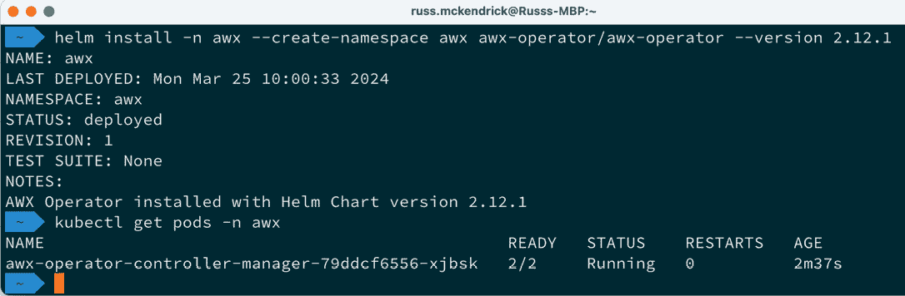

图 16.1 – 部署 AWX Operator

随着 AWX Operator 已在集群中部署，我们可以要求该 Operator 现在部署 AWX 本身。为此，运行以下命令：

```
$ kubectl apply -f https://raw.githubusercontent.com/PacktPublishing/Learn-Ansible-Second-Edition/main/Chapter16/awx/ansible-awx.yaml
```

此命令只是将以下 YAML 配置传递给 Operator，指示它如何部署我们的 AWX 安装：

```
---
apiVersion: awx.ansible.com/v1beta1
kind: AWX
metadata:
  name: ansible-awx
  namespace: awx
spec:
  service_type: loadbalancer
```

如你所见，部署过程并不复杂，因此请不要将其视为一个生产环境下的 AWX 实例。我们只是指示 AWX Operator 部署 AWX 并通过负载均衡器公开服务，以便我们能够连接到它。

现在，我们等待；我们的 AWX 安装需要 15 到 20 分钟来部署应用程序并进行自引导。

你可以通过运行以下代码来检查容器和负载均衡器服务的状态：

```
$ kubectl get pods -n awx
$ kubectl get svc ansible-awx-service -n awx
```

一旦基础设置完成，你应该能看到如下图所示的内容。这些是服务 AWX 应用程序的容器。正如你所看到的，它们分别用于数据库、任务运行器和 web 界面：

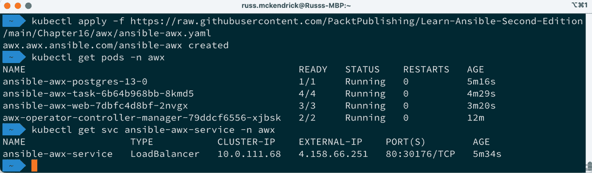

图 16.2 – 检查我们 AWX 部署的状态

一旦你的部署显示出与前述相同的输出，最后一步就是获取管理员密码。为此，运行以下命令——该密钥的名称始终为 `ansible-awx-admin-password`：

```
$ kubectl get secret -n awx ansible-awx-admin-password -o jsonpath="{.data.password}" | base64 –decode
```

这将从 Kubernetes 密钥存储中提取 base64 编码的密钥并为你解码——它应该看起来像这样：

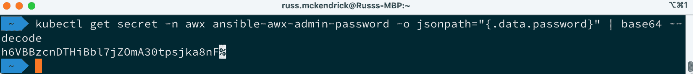

图 16.3 – 获取管理员密码

如你在前面的输出中所见，末尾有一个 `%` 图标——这不是密码的一部分，你只需要前面的内容。

请记录下密码和之前命令中的 `EXTERNAL-IP` 值，这些信息会告诉你在哪里登录以及使用什么凭证。在之前的部署（已经被终止）中，这些信息如下：

+   **URL**：http://4.158.66.251/

+   **用户名**：admin

+   **密码**：h6VBBzcnDTHiBbl7jZOmA30tpsjka8nF

访问 URL 后，你应该会看到一个登录页面，界面如下：

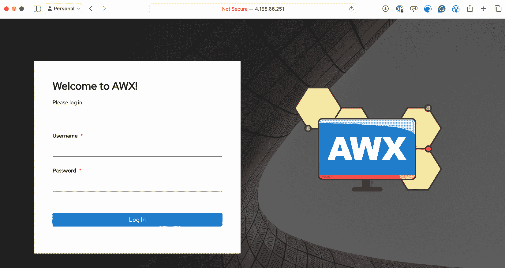

图 16.4 – 获取管理员密码

登录后，你将进入空的 AWX 实例：

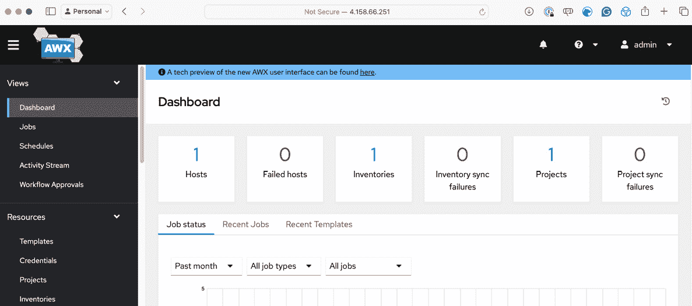

图 16.5 – 获取管理员密码

现在，让我们设置我们的 playbook。

## 设置我们的 playbook

在运行我们的 playbook 之前，我们必须将其导入到 Ansible AWX 并配置支持的凭证，如我们的 Azure 服务主体。我们将从一个项目开始。

### 添加新项目

首先，我们需要添加一个新项目，在这里告诉 Ansible AWX 我们的 playbook 存放的代码仓库。如前所述，我们将使用一个托管代码的 GitHub 仓库。要添加新项目，点击左侧菜单中的 **资源** 下的 **Projects**，然后点击 **添加** 按钮。

在这里，你需要提供几个信息；请填写以下内容：

+   `Azure WordPress`

+   `在 Azure 部署 WordPress`

+   `Default`

+   **执行环境**：选择 **AWX** **EE（最新）**

+   `GIT`

当你选择 **源代码控制类型** 时，将会出现第二部分，询问你的源代码托管位置的详细信息：

+   `https://github.com/PacktPublishing/Learn-Ansible-Second-Edition.git`

+   **源代码控制分支/标签/提交**：留空

+   **源代码控制引用规范**：留空

+   **源代码控制凭证**：留空

+   `Clean`

输入这些信息后，点击 **保存**。现在，如果你返回 **项目** 页面，你应该会看到 Ansible 已经下载了 playbook 的源代码：

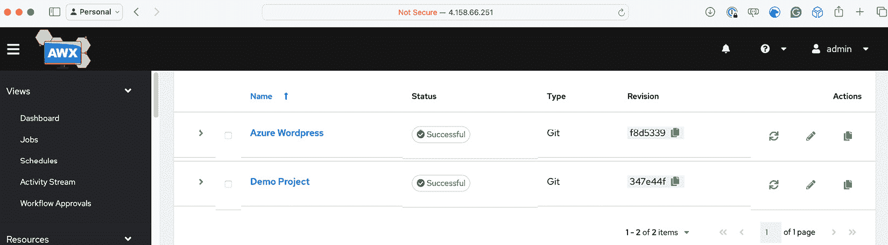

图 16.6 – 添加项目并从 GitHub 下载代码

### 添加凭证

接下来，我们必须告诉 Ansible AWX 在访问 Azure 环境时使用哪些凭证；为添加这些凭证，点击 **凭证**。此选项也可以在左侧菜单的 **资源** 部分找到。点击 **添加**，并输入以下内容：

+   `Azure`

+   `Azure 凭证`

+   `Default`

+   **凭证类型**：选择 **Microsoft Azure** **资源管理器**

如前所述，这将打开一个单独的部分；在此，您需要输入我们在 *第十五章* 中创建的服务主体的详细信息，章节名为 *使用 Ansible 与 GitHub Actions 和 Azure DevOps*：

+   `e80d5ad9-e2c5-4ade-a866-bcfbae2b8aea`

+   **用户名**：留空

+   **密码**：留空

+   创建服务主体时返回的 `appId` 值；在前一章的示例中，这个值是 `2616e3df-826d-4d9b-9152-3de141465a69`

+   创建服务主体时返回的 `password` 值；在前一章的示例中，这个值是 `Y4j8Q~gVO*NoTaREalPa55w0rdpP-pdaw`

+   `tenant` ID；在前一章的示例中，这个值是 `c5df827f-a940-4d7c-b313-426cb3c6b1fe`

填写完表单后，点击 **保存**。保存后，您会注意到 **客户端密钥** 值被标记为 **已加密**：

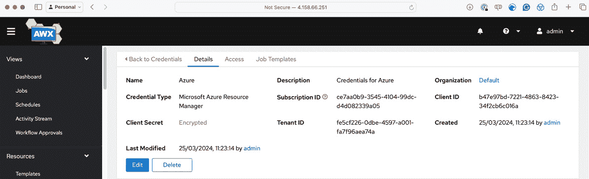

图 16.7 – 将我们的服务主体添加到 Ansible AWX

当您在 Ansible AWX 中保存敏感信息时，它会被加密，您只有 **替换** 或 **还原** 的选项。在任何时候，您都无法再次查看这些信息。

接下来，我们需要创建一个凭证，包含我们在*第十五章*中生成的 SSH 密钥的私有部分，章节名为 *使用 Ansible 与 GitHub Actions 和 Azure DevOps*。为此，请再次点击 **添加**，但这次输入以下内容：

+   `AzureVM`

+   `Azure 虚拟机的私有 SSH 密钥`

+   `Default`

+   **凭证类型**：选择 **机器**

在附加信息框中，输入以下信息：

+   `azureadmin`

+   **密码**：留空

+   **SSH 私钥**：复制并粘贴私钥的内容，或者上传私钥文件

+   **剩余选项**：留空

填写完毕后，点击 **保存**。返回到 **凭证** 屏幕后，再次点击 **添加**，并输入以下内容：

+   `Ansible Galaxy`

+   `默认组织的 Ansible Galaxy 凭证`

+   `Default`

+   **凭证类型**：选择 **Ansible Galaxy/Automation Hub** **API Token**

然后，输入以下信息：

+   `https://galaxy.ansible.com`

+   **剩余选项**：留空

再次点击 **保存**。现在，是时候添加我们的最后一组凭证了：

+   `WordPress Vault`

+   `WordPress 秘密的 Vault 密码`

+   `Default`

+   **凭证类型**：选择 **Vault**

在 **类型详细信息** 部分，输入以下内容：

+   在 `Chapter16` 剧本中的 `group_vars/common.yml`。因此，您必须在此输入密码 `wibble` —— 如果不输入该密码，示例剧本将失败。

+   **Vault 标识符**：留空。

那是我们的最后一个凭据。所以，让我们继续进行下一个配置步骤。

### 添加库存

现在我们已经完成了所有凭据设置，我们需要在 Ansible AWX 中重新创建 `production` 库存文件的内容。提醒一下，我们一直在使用的库存文件如下所示（注释除外）：

```
[local]
localhost ansible_connection=local
[vmgroup]
[azure_vms:children]
vmgroup
[azure_vms:vars]
ansible_ssh_user=adminuser
ansible_ssh_private_key_file=~/.ssh/id_rsa
host_key_checking=False
```

要添加库存，请点击左侧菜单中的**库存**。**添加**按钮现在会弹出一个下拉列表；我们需要从列表中选择**添加库存**。

在打开的表单中，输入以下内容：

+   `Azure 库存`

+   `Azure 库存`

+   `默认`

+   **实例组**：我们稍后将添加这些

+   **标签**：保持空白

+   **变量**：输入这里列出的值：

    ```
    ansible_ssh_user: "adminuser"
    ansible_ssh_private_key_file: "~/.ssh/id_rsa"
    host_key_checking: false
    ```

输入后，点击**保存**；这将创建库存。现在，我们可以添加我们需要的两个组。为此，点击**组**，可以在库存详细信息上方的按钮行中找到：

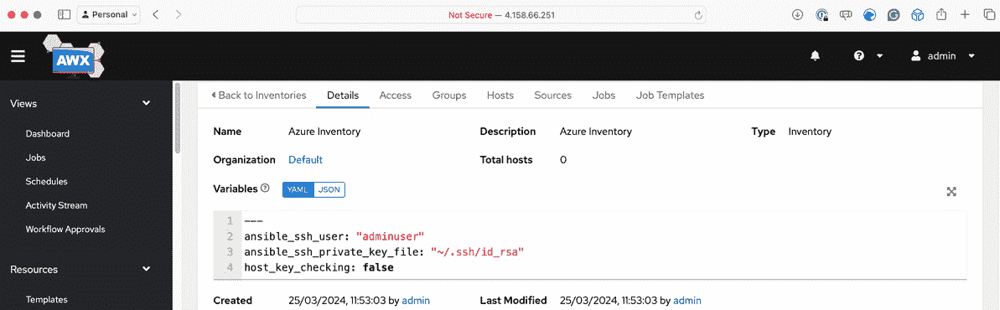

图 16.8 – 将库存添加到 Ansible AWX

点击**添加**并输入以下详细信息：

+   `vmgroup`

+   `vmgroup`

+   **变量**：保持空白

然后，点击**保存**，重复该过程，使用以下详细信息添加第二个组：

+   `azure_vms`

+   `azure_vms`

+   **变量**：保持空白

再次点击**保存**；现在，您应该已经列出了两个组。

现在我们已经有了项目、库存和访问 Azure 环境的一些凭据，我们需要添加启动和配置集群以及终止它的模板。

### 添加模板

让我们来看看如何添加模板。

信息

我们将向我们的剧本传递一个运行时变量，该变量将包含 SSH 密钥的公钥部分 —— 我们已经在本章前面将私钥部分作为凭据添加 —— 并将被命名为`ssh_key_public`。请确保在填写这些细节时，您已经拥有公钥。

点击左侧菜单中的**模板**，然后在**添加**按钮的下拉菜单中选择**作业模板**。这是我们遇到的最复杂的表单；然而，当我们填写细节时，部分内容将自动填充。让我们开始吧：

+   `启动 WordPress`

+   `在 Azure 中启动 WordPress`

+   **作业类型**：选择**运行**

+   **库存**：选择**Azure 库存**

+   **项目**：选择**Azure WordPress**

+   **执行环境**：选择**AWX** **EE（最新）**

+   **剧本**：从下拉列表中选择**Chapter16/site.yml**

+   **凭据**：选择以下内容：

    +   **机器**：**AzureVM**

    +   **Microsoft Azure 资源** **管理器**：**Azure**

    +   **保管库**：**WordPress 保管库**

+   `ssh_key_public`变量在此处；这里显示的是要输入的简化版本：

    ```
    ---
    ssh_key_public: "ssh-rsa AAAAB3NzaC1yc2EAAAADAQABAAABgQDCGosD5doqnJgOLpkztaDvIZFaCKoChm9yyU6FPaci9fZR60SCXbOu1zeMmyJouFH7xVBv7xw5HBk0FDNLXrssR5B7YHiti8= youremail@example.com"
    ```

+   **剩余选项**：保持空白

点击**保存**；您将被带到模板的概览页面：

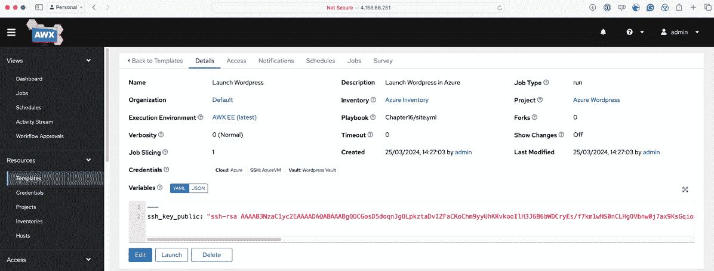

图 16.9 – 完整的模板

添加后，我们需要使用以下详细信息重复该过程，针对终止我们部署的剧本：

+   `终止 WordPress`

+   `终止 WordPress` `在 Azure 中`

+   **作业类型**: 选择 **运行**

+   **库存**: 选择 **Azure 库存**

+   **项目**: 选择 **Azure WordPress**

+   **执行环境**: 选择 **AWX** **EE（最新）**

+   **Playbook**: 从下拉列表中选择 **Chapter16/destroy.yml**

+   **凭据**: 选择以下内容：

    +   **Microsoft Azure 资源** **管理器**: **Azure**

+   **剩余选项**: 留空

填写完这些细节后，点击 **保存**。

我们已经准备好运行我们的 playbook，接下来就执行它吧。

## 运行我们的 playbook

回到 **模板** 页面，你应该能看到我们配置的两个模板：

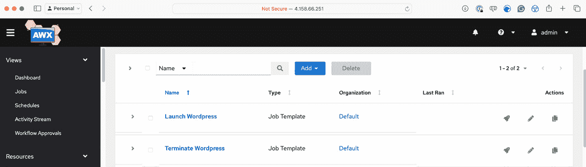

图 16.10 – 我们的两个模板

要从此页面运行 playbook，请点击 **Launch WordPress** 模板上的 **火箭** 图标；这将启动 playbook 运行，并将你带到一个作业页面，你可以在这里查看 playbook 作业的状态：

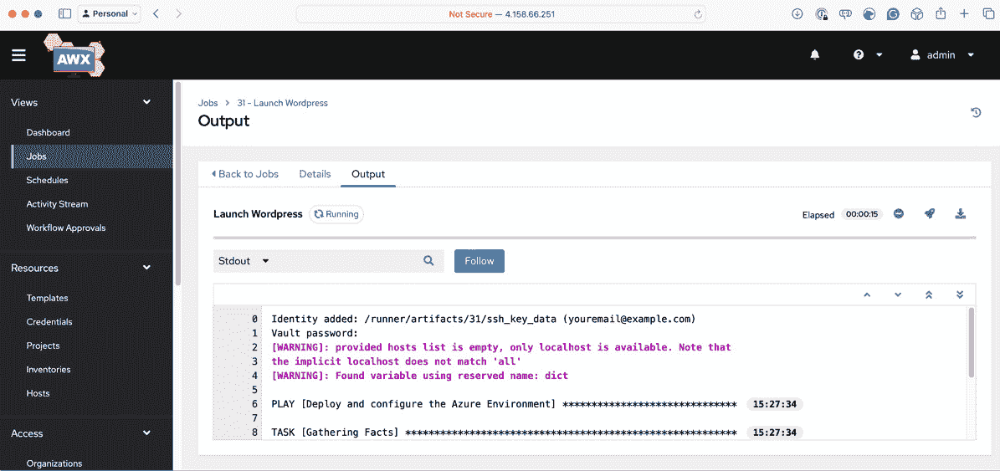

图 16.11 – 使用 Ansible AWX 在 Azure 中启动 WordPress

如果一切按计划进行，大约 5 分钟后，你应该能收到确认，表示 playbook 已完成且资源已启动：

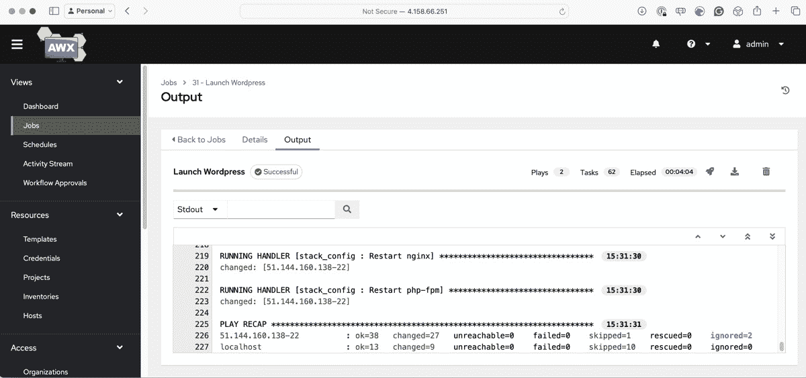

图 16.12 – Ansible AWX 已完成运行 playbook

在这里，你可以重新运行启动 playbook，它应该会像在本地机器上重新运行时一样，识别到新部署的资源。

考虑到我们已经启动的 Azure 资源数量，在我们审查 playbook 代码的更改之前，应该先终止 WordPress 资源。点击 **Terminate WordPress** 模板旁边的 **火箭** 图标，销毁我们刚刚启动的资源。

## 终止 Kubernetes 集群

在终止 Azure AKS 资源之前，我建议你先点击并探索一下 Ansible AWX 界面。完成后，你可以删除 Azure 资源，并通过运行以下命令清理本地配置：

```
$ AKSRG=rg-awx-cluster
$ AKSCLUSTER=aks-awx-cluster
$ az aks delete --resource-group $AKSRG --name $AKSCLUSTER
$ az group delete --name $AKSRG
$ kubectl config delete-cluster $AKSCLUSTER
$ kubectl config delete-context $AKSCLUSTER
```

集群将需要大约 5 分钟时间来移除。为了安全起见，请在完成之前不要关闭任何窗口。

信息

和往常一样，请再次确认你的云资源已经终止 – 你不希望产生任何意外费用。

现在我们已经终止了所有可能产生费用的资源，让我们来讨论一下在 Playbook 中需要考虑的一些事项。

## Playbook 注意事项

虽然我们已经轻轻触及了一些需要对 playbook 进行更改的地方，以便它能在 Ansible AWX 中运行，现在让我们深入探讨一下。

### 对现有 playbook 的更改

当我们在本地运行代码时，为了保持 playbook 简单，我们创建了一个名为 `secrets.yml` 的文件，并从中加载变量。现在我们在共享环境中运行 Ansible，我们应该将 Ansible 执行环境视为临时性的，这意味着我们不能依赖这种方法。

我使用 Ansible Vault 对密码进行了加密，并将其随代码一起传输以解决这个问题。为此，我运行了以下命令：

```
$ ansible-vault encrypt_string 'SomeP4ssw0rd4MySQL' --name 'db_password'
$ ansible-vault encrypt_string 'aP455w0rd4W0rDPR355' --name 'wp_password'
```

在被提示输入 Vault 密码时，我输入了 `wibble` 作为密码，然后我们在 Ansible AWX 中添加凭据时设置了 Vault 密码。你可以在 `group_vars/common.yml` 文件中查看前面命令的结果。

回到我们从本地机器运行 playbook 时的代码，在 *第九章*，*迁移到云端*，包含公钥数据的变量看起来像这样：

```
vm_config:
  key:
    path: "/home/adminuser/.ssh/authorized_keys"
    data: "{{ lookup('file', '~/.ssh/id_rsa.pub') }}"
```

正如你所看到的，我们通过读取 `~/.ssh/id_rsa.pub` 文件的内容来填充 `vm_config.key.data` 变量。然而，当我们将 playbook 移到 Ansible AWX 时，这个文件不再存在。

因此，我们添加了 `ssh_key_public` 变量，其中包含我们在添加机器凭证时上传的私钥的公钥部分，这样就可以在 Azure 上启动资源。这意味着代码需要更新为如下所示：

```
vm_config:
  key:
    path: "/home/adminuser/.ssh/authorized_keys"
    data: "{{ ssh_key_public }}"
```

就变更而言，没有什么太戏剧性的内容，希望也不是什么出乎意料的事情。

### Ansible Galaxy 集合

你可能没有注意到，但我们不需要考虑与 Azure 交互的模块，这是我们在 *第九章*，*迁移到云端* 中讨论的初步内容之一。

Ansible AWX 不支持这些以及其他我们需要的模块集合，无法让我们的 playbook 直接运行，那么我们的 playbook 是如何在没有报错的情况下工作的呢？

当我们第一次添加项目时，我们配置它使用支持本书的 GitHub 仓库，里面包含了我们到目前为止讨论的所有代码。该仓库可以在 [`github.com/packtPublishing/Learn-Ansible-Second-Edition/`](https://github.com/packtPublishing/Learn-Ansible-Second-Edition/) 找到。

我们只是指示 Ansible AWX 使用 `Chapter16` 文件夹中的 `site.yml` 和 `destory.yml` 文件，但在后台，Ansible AWX 还使用了 `requirements.yml` 文件，该文件位于仓库根目录中的 `collections` 文件夹中。

该文件包含以下代码：

```
---
collections:
  - name: "azure.azcollection"
    source: "https://galaxy.ansible.com"
  - name: "community.general"
    source: "https://galaxy.ansible.com"
  - name: "community.mysql"
    source: "https://galaxy.ansible.com"
```

正如你所看到的，这让 Ansible AWX 知道它需要从 Ansible Galaxy 下载 `azure.azcollection`、`community.general` 和 `community.mysql` 集合，并在后台安装它们的先决条件。

我们所需要做的就是创建 Ansible Galaxy 凭证，并将其附加到我们的默认组织上。这意味着每当 Ansible AWX 遇到一个 `collections/requirements.yml` 文件时，它将使用提供的凭证向 Ansible Galaxy 进行身份验证，在我们的情况下，由于我们没有拉取私有集合，所以使用的是匿名凭证。

我们还可以做一些事情，比如将集合固定在特定版本上，或者添加角色：

```
collections:
  - name: "azure.azcollection"
    source: "https://galaxy.ansible.com"
    version: 2.0.0
roles:
  - name: "russmckendrick.learnansible_example"
    source: "https://galaxy.ansible.com"
```

如果你是自托管 Ansible Galaxy 的安装版本，或者甚至提供包含角色和集合的 Git 仓库链接，你也可以提供不同的 URL。

这意味着，Ansible AWX 可以像从本地机器运行 Ansible 一样灵活。

在我们讨论完 Ansible AWX 之前，让我们看看运行它的优缺点。

## Ansible AWX 的优缺点

我相信你会同意，基于我们在 Ansible AWX 上的使用经验，它看起来是一个很棒的工具。然而，运行它也有一些优点和缺点。

### 开源

Ansible AWX 是一个开源项目，这意味着任何人都可以免费使用、修改和贡献。这与专有解决方案相比，可以显著降低成本。然而，它的企业级功能较为有限。

Ansible AWX 提供了广泛的功能，然而，一些 Red Hat Ansible Automation Platform 中的高级企业特定功能，如高级报告、**服务级别协议**（**SLA**）管理，以及更全面的集成，可能是必需的。

### 社区驱动的开发

作为开源项目，Ansible AWX 拥有一个强大的开发者和用户社区，积极地为其开发做出贡献，提供支持并分享最佳实践。

然而，作为一个开源项目，Ansible AWX 依赖于社区支持，而非官方商业支持。社区通常很活跃且乐于助人，但没有保证的响应时间，甚至无法确保有人能够在 Red Hat Ansible Automation Platform 的商业支持之外提供帮助。

### 频繁的更新和改进

Ansible AWX 的发布周期比 Red Hat Automation Platform 更频繁。这意味着你可以更快地获得新功能、bug 修复和改进。

Ansible AWX 的频繁发布周期意味着你可能需要更频繁地更新，以访问最新的功能和 bug 修复。升级 Ansible AWX 可能需要更多的工作来确保兼容性和稳定性，尤其是在生产环境中。

更新和 Ansible AWX 一直是一个挑战；它们通常更像是迁移而非就地更新。

以我们快速部署 Ansible AWX 为例，我们需要一种方法来升级它。我们必须在 Kubernetes 集群外部部署一个外部数据库服务器，以创建一个更接近生产环境的环境——这个数据库服务器将存储并持久化我们所有的数据和配置。

要*更新* Ansible AWX，我们需要销毁集群中的所有资源（数据库除外），更新 AWX Operator，然后重新部署运行最新版本的 Ansible AWX —— 这将连接到我们的外部数据库，并运行所有必要的数据库迁移脚本，以更新我们的架构和数据，使其与新版本兼容。

### 扎实的基础

Ansible AWX 提供了强大的功能，用于管理和执行 Ansible Playbook，使其成为那些开始自动化之旅或有更简单自动化需求的组织的稳固选择。

### 灵活性与定制化

虽然 Ansible AWX 可以与各种工具和系统集成，但它可能与 Red Hat 自动化平台相比，具有不同程度的即插即用集成和认证内容。Red Hat 自动化平台旨在与其他 Red Hat 产品无缝协作，并且支持更广泛的集成生态系统。

Ansible AWX 在管理大规模部署或复杂企业环境时也可能存在限制。可能需要额外的设置、配置和资源来有效地处理高流量的自动化任务。

# 摘要

本章介绍了 Ansible AWX，并简要提到了 Red Hat 自动化平台，这两个强大的图形界面用于管理和简化 Ansible 部署。

我们了解了它们的不同之处、所提供的优势，以及如何在 Microsoft Azure 上的 Kubernetes 集群中安装和配置 Ansible AWX。我们成功地运行了 Playbook，通过设置项目、凭证、库存和模板，使用 Ansible AWX 启动和终止在 Azure 上运行的 WordPress。

在这个过程中，我们发现了必要的 Playbook 考虑事项和修改，例如使用 Ansible Vault 保护敏感信息、处理 SSH 密钥，并利用 Ansible Galaxy 集合。

虽然 Ansible AWX 提供了许多优点，包括其开源特性、社区驱动开发和扎实的基础，但在企业环境中仍然需要意识到其潜在的限制，以及与平台更新相关的挑战。

唯一我们没有讨论的是运行商业支持的企业级 Red Hat 自动化平台的成本。Red Hat 并未在其官网公开发布这些费用。你需要联系其合作伙伴或直接联系 Red Hat 获取详情。

在我们的下一章，也是最后一章中，我们将探讨如何将 Ansible 集成到日常工作流程中，如何在运行时调试 Playbook，以及我如何在实际应用中使用 Ansible 的一些例子。

# 进一步阅读

要了解更多本章中涉及的主题，请查看以下资源：

+   **Ansible AWX** **项目**：[`github.com/ansible/awx`](https://github.com/ansible/awx)

+   **Ansible AWX** **Operator**：[`github.com/ansible/awx-operator`](https://github.com/ansible/awx-operator)

+   **Ansible AWX** **文档**: [`ansible.readthedocs.io/projects/awx/en/latest/`](https://ansible.readthedocs.io/projects/awx/en/latest/)

+   **红帽 Ansible 自动化** **平台**: [`www.redhat.com/en/technologies/management/ansible`](https://www.redhat.com/en/technologies/management/ansible)
