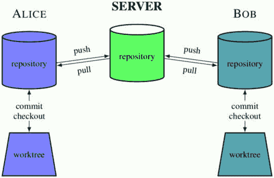
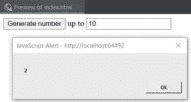
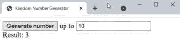
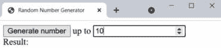
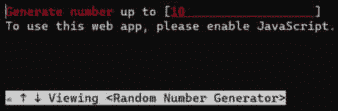
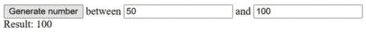

# 1

# Git 基础实战

本书面向中级和高级 Git 用户，旨在帮助他们掌握 Git。因此，本章之后的章节假设你已经掌握了 Git 的基础，并已超越初学者阶段。

本章将作为 Git 版本控制基础的回顾。重点将放在提供该技术的实用方面，通过示例项目的开发过程以及两位开发者之间的协作，展示和解释基本的版本控制操作。

本章将涵盖以下内容：

+   版本控制和 Git 的简要介绍

+   设置 Git 环境和 Git 仓库（**init** 和 **clone**）

+   添加文件、检查状态、创建提交和检查历史记录

+   与其他 Git 仓库互动（**pull** 和 **push**）

+   创建和列出分支，切换到分支，并合并更改

+   解决一个简单的合并冲突

+   创建和发布标签

# 技术要求

要跟随本章所示的示例，你需要安装 Git：[`git-scm.com/`](https://git-scm.com/)。你还需要一个交互式命令行工具（例如，如果你使用 MS Windows，可以使用 Git Bash），一个文本编辑器或适用于 Web 开发的 IDE（用于编辑 JavaScript 和 HTML），以及一个网页浏览器。

你可以通过以下链接访问本章中使用的示例项目的代码：[`github.com/PacktPublishing/Mastering-Git---Second-Edition/tree/main/chapter01`](https://github.com/PacktPublishing/Mastering-Git---Second-Edition/tree/main/chapter01) 和 [`github.com/jnareb/Mastering-Git---Second-Edition---chapter01-sample_project`](https://github.com/jnareb/Mastering-Git---Second-Edition---chapter01-sample_project)。

# 版本控制和 Git 的简要介绍

**版本控制系统**（有时称为**修订控制**）是一种工具，它可以让你跟踪项目文件随时间变化的历史记录和归属（存储在**仓库**中），并帮助团队中的开发者共同协作。现代版本控制系统为每个开发者提供自己的沙盒，防止他们的工作进展发生冲突，同时提供合并更改和同步工作的机制。它们还允许我们在不同的开发线之间切换，称为**分支**；这个机制使得开发者可以在不同的开发任务之间切换，例如从逐步引入新功能切换到修复项目的旧版本中的 bug。

**分布式版本控制系统**（如 Git）为每个开发者提供项目历史记录的副本，这被称为仓库的**克隆**。这就是 Git 快速的原因，因为几乎所有操作都是在本地执行的。它也是 Git 灵活的原因，因为你可以以多种方式设置仓库。面向开发的仓库还为每个开发者提供单独的**工作区**（或**工作树**），其中包含项目文件。Git 的分支模型使得本地创建分支变得便宜，从而可以通过为不同任务创建沙盒来进行上下文切换。它还使得使用非常灵活的*主题分支*工作流进行协作成为可能。

整个历史记录可访问的事实使得进行*长期撤销*成为可能，可以回到上一个工作版本，等等。自动跟踪变更的所有权使得可以找出谁对某个代码区域负责，以及每次变更是在何时完成的。你可以比较不同的版本，回到用户发送 bug 报告时的版本，甚至可以自动找出是哪一版本引入了回归 bug（使用`git bisect`）。通过**reflog**跟踪分支的变更使得撤销和恢复变得更加简单。

Git 的一个独特特点是它允许显式访问**暂存区**来创建**提交**（新版本——即项目的新版本）。这为管理工作区和决定未来提交的形态带来了额外的灵活性。

所有这些灵活性和强大功能是有代价的。尽管学习 Git 的基本使用非常简单，但要掌握它并不容易。本书将帮助你达到这一专业水平，但让我们先从 Git 的基础知识回顾开始。

# Git 示例

让我们通过一个简单的示例，逐步展示两个开发者如何使用 Git 协同工作在一个简单项目中。你可以在[`github.com/PacktPublishing/Mastering-Git---Second-Edition`](https://github.com/PacktPublishing/Mastering-Git---Second-Edition)找到本章的所有三个代码仓库（包括两个开发者的仓库和裸仓库服务器），并且可以在`sample_project.zip`压缩包中查看代码、历史记录和 reflog。

跟随示例

若要在一台计算机上跟随这个团队开发流程的示例，你只需创建三个文件夹，命名为**alice/**、**bob/**和**server/**，并在跟随 Alice、Bob 和 Carol 的工作时切换到相应的文件夹。

为了使这个模拟工作，你需要做一些简单的修改。在作为 Carol 创建仓库时，你不需要创建并切换到**/srv/git**目录，因此可以直接跳过这些命令。在 Alice 或 Bob 的角色下，你需要在仓库的*本地*配置中创建单独的身份，方法是使用不带**--user**选项的**git config**命令，或者通过编辑适当仓库中的**.git/config**文件。在不存在的**https://git.company.com/random**仓库 URL 处，直接使用服务器仓库的路径：**../server/random.git**。

此外，如果你计划移动包含**alice/**、**bob/**和**server/**子目录的目录，你需要编辑存储在仓库配置文件中的“origin”仓库 URL，将其从绝对路径更改为相对路径——即**../../server/random.git**。

## 设置和初始化

一家公司已经开始开发一款新产品。这个产品用于计算一个随机数——一个指定范围内的整数值。

公司指派了两位开发人员来参与这个新项目，Alice 和 Bob。两位开发人员都在远程办公，连接到公司总部。经过一番讨论，他们决定将他们的产品实现为一个简单的 JavaScript 和 HTML Web 应用，并使用 Git 2.41.0 ([git-scm.com](http://git-scm.com)) 进行版本控制。

注意

这个项目和代码仅用于演示目的，因此将大大简化。代码的细节在这里并不重要——重要的是代码如何变化，以及 Git 如何帮助开发。

### 仓库设置

对于一个小团队，他们决定使用下图所示的设置。

重要提示

这只是可能的一种设置，使用**中心规范仓库**，且没有专门的维护人员负责此仓库（在此设置中，所有开发者平等）。这并不是唯一的选择；其他配置仓库的方式将在*第六章*，*与 Git 的协作开发*中展示。



图 1.1 – 样本项目的仓库设置（使用集中式工作流）

### 创建 Git 仓库

Alice 通过让管理员 Carol 创建一个新的仓库，专门用于与团队共同协作来启动项目，分享工作成果：

```
carol@server:~$ mkdir -p /srv/git
carol@server:~$ cd /srv/git
carol@server:/srv/git$ git init --bare random.git
Initialized empty Git repository in /srv/git/random.git/
```

重要提示

命令行示例遵循 Unix 约定，命令提示符以**user@host:directory**开头，以便一眼看出是谁在执行命令，在哪台计算机上，在哪个目录中（此处，波浪号**~**表示用户的主目录）。这是 Linux 上通常的命令提示符设置；Git Bash 也使用类似的提示符。

你可以配置命令提示符，显示 Git 相关信息，例如仓库名称、仓库中的子目录、当前分支，甚至工作区状态（见 *第十三章*，*Git 的定制与扩展*）。

我认为服务器配置的细节对于这一章来说太多了。请想象它已经完成，并且没有出错，或者参考 *第十四章*，*Git 管理*。

你还可以使用工具来管理 Git 仓库（例如，`gitolite`）；在服务器上创建公共仓库的过程当然会有所不同。不过，通常这涉及在自己的主目录下使用 `git init`（没有 `--bare`）创建 Git 仓库，然后使用明确的 URI 推送到服务器，服务器会自动创建公共仓库。

或者该仓库可能是通过 GitHub、Bitbucket 或 GitLab 等工具的 web 界面创建的（可以是托管在云端，也可以是安装在本地的）。

### 克隆仓库并创建第一次提交

Bob 得知项目仓库已经准备好，他可以开始编码了。

由于这是 Bob 第一次使用 Git，他首先通过 `git config --global --edit` 设置了 `~/.gitconfig` 文件，配置了将用于标识其提交的信息。

```
[user]
    name = Bob Hacker
    email = bob@company.com
```

现在，他需要获取自己的仓库实例（当前是空的）：

```
bob@hostB:~$ git clone https://git.company.com/random
Cloning into 'random'...
warning: You appear to have cloned an empty repository.
done.
bob@hostB:~$ cd random
bob@hostB:~/random$
```

提示

本章中的所有示例都使用命令行界面。你也可以通过 Git GUI 或 IDE 集成来执行这些命令，具体可参考 *第十三章*，*Git 的定制与扩展* 中的 *图形界面* 部分。本书 *Git: 面向所有人的版本控制*，由 Packt Publishing 出版，展示了命令行的 GUI 对应操作。

Bob 注意到 Git 提示这是一个空的仓库，尚未有源代码，他开始编码。他打开文本编辑器（或选择的 IDE），为他的产品创建起点。

首先，他创建了一个 HTML 文件（`index.html`），该文件包含为正在创建的 web 应用程序设计的最简单的界面，仅有一个按钮和一个输入框：

```
<!DOCTYPE html>
<html lang="en">
<head>
    <meta charset="UTF-8">
    <title>Random Number Generator</title>
    <script src="img/random.js" defer></script>
</head>
<body>
<button disabled>Generate number</button>
<label for="max">up to</label>
<input type="number" id="max" name="rand_max" value="10" />
</body>
</html>
```

然后，Bob 编写了 JavaScript 源代码（`random.js`），负责处理 web 应用程序的行为——在这种情况下，生成并显示一个在给定范围内（1 到可配置的最大值之间）的随机整数，包括最大值：

```
function getRandomInt(max) {
    return Math.floor(Math.random() * max) + 1;
}
function generateRandom() {
    let max = document.getElementById('max').value;
    alert(getRandomInt(max));
}
let button = document.querySelector('button');
button.addEventListener('click', generateRandom);
button.disabled = false;
```

通常，对于大多数初步实现版本而言，这个版本缺少很多功能，但它是一个不错的起点。在提交代码之前，Bob 想确保一切看起来正常且工作正确。他在 web 浏览器中打开 `index.html` 文件，或使用 IDE 的实时预览功能，如 *图 1.2* 所示。



图 1.2 – 示例应用程序第一个版本的预览

好的！现在是时候*添加*两个文件到仓库中了：

```
bob@hostB:~/random$ git add index.html random.js
```

Bob 使用`status`操作确保待处理的更改集（未来的提交）看起来是正确的。

我们在这里使用了`git status`的简短形式，以减少示例占用的空间；你可以在本章后面找到`status`输出的完整示例：

```
bob@hostB:~/random$ git status --short
A  index.html
A  random.js
```

现在是时候对当前版本进行*提交*了：

```
bob@hostB:~/random$ git commit -a -m "Initial implementation"
[master (root-commit) 961e72b] Initial implementation
 2 files changed, 25 insertions(+)
 create mode 100644 index.html
 create mode 100644 random.js
```

重要提示

通常，你会创建一个**提交信息**，不是通过使用**-m <message>**命令行选项，而是让 Git 打开一个编辑器。我们在这里使用这种形式是为了让示例更紧凑。在实际操作中，建议提供更详细的更改描述。

**git commit -a**命令中的**-a**/**--all**选项意味着对所有已追踪的文件进行*所有*更改。这并不是创建修订版本的唯一方式；你可以将操作暂存区与创建提交分开—然而，这是一个单独的问题，留给*第三章*，*管理* *工作树*。

现在是时候让这些更改对 Alice 可见了。

## 协作开发

版本控制系统的主要目标之一是帮助开发者在一个共同的项目中协作。使用分布式版本控制系统，如 Git，这涉及到一个明确的步骤，即发布更改以使其对其他人可见。

### 发布更改

在完成项目的初始版本工作后，Bob 决定它已经准备好发布（供其他开发者使用）。他通过以下方式*推送*更改：

```
bob@hostB:~/random$ git push
Enumerating objects: 4, done.
Counting objects: 100% (4/4), done.
Delta compression using up to 4 threads
Compressing objects: 100% (4/4), done.
Writing objects: 100% (4/4), 670 bytes | 22.00 KiB/s, done.
Total 4 (delta 0), reused 0 (delta 0)
To https://git.company.com/random.git
 * [new branch]      master -> master
```

提示

请注意，根据网络速度的不同，Git 在进行远程操作时，如**克隆**、**推送**和**拉取**，可能会显示进度信息。本书中的示例省略了这些信息，除非在检查历史和查看更改时实际讨论了这些信息。

此外，如果你使用的是旧版 Git，它可能需要设置**push.default**配置变量。

由于这是 Alice 第一次在她的桌面机器上使用 Git，她首先告诉 Git 如何识别她的提交：

```
alice@hostA:~$ git config --global user.name "Alice Developer"
alice@hostA:~$ git config --global user.email alice@company.com
```

现在，Alice 需要设置她自己的仓库实例：

```
alice@hostA:~$ git clone https://git.company.com/random
Cloning into 'random'...
done.
```

Alice 检查工作目录：

```
alice@hostA:~$ cd random
alice@hostA:~/random$ ls –alF
total 6
drwxr-xr-x    1 alice staff        0 May 2 16:44 ./
drwxr-xr-x    4 alice staff        0 May 2 16:39 ../
drwxr-xr-x    1 alice staff        0 May 2 16:39 .git/
-rw-r--r--    1 alice staff      331 May 2 16:39 index.html
-rw-r--r--    1 alice staff      327 May 2 16:39 random.js
```

提示

**.git**目录包含 Alice 的整个仓库副本（克隆），以 Git 内部格式存储，并包含一些仓库特定的管理信息。有关文件布局的详细信息，请参见**gitrepository-layout(5)**手册页，例如，可以通过**git help** **repository-layout**命令查看。

她想查看日志以查看详细信息（检查项目历史）：

```
alice@hostA:~/random$ git log
commit 961e72b31b0d2dacc0584cbe8953c3aed1042e9b (HEAD -> master)
Author: Bob Hacker bob@company.com
Date:   Sun May 2 22:34:40 2021 +0200
    Initial implementation
```

命名修订版本

在最低级别，Git 版本标识符是一个 SHA-1 哈希值，例如，**2b953b4e80**。Git 支持多种引用修订版本的方式，包括明确缩短的 SHA-1（最少四个字符）—更多方式请参见*第四章*，*探索项目历史*。

当爱丽丝决定查看应用程序时，她认为使用`alert()`来显示结果并不是一个好的用户界面。为了生成一个新的随机数，用户需要先关闭窗口。如果可以立即生成一个新结果，那会更好。

她决定一个更好的解决方案是将结果放到页面上，表单下方。她在`index.html`中添加了一行来为此留出位置：

```
<!DOCTYPE html>
<html lang="en">
<head>
    <meta charset="UTF-8">
    <title>Random Number Generator</title>
    <script src="img/random.js" defer></script>
</head>
<body>
<button disabled>Generate number</button>
<label for="max">up to</label>
<input type="number" id="max" name="rand_max" value="10" />
<div id="result"></div>
</body>
</html>
```

然后她将 JavaScript 代码中的`alert()`替换为直接在应用页面上显示结果，仅使用新增的`<div id="result"></div>`占位符：

```
function getRandomInt(max) {
    return Math.floor(Math.random() * max) + 1;
}
function generateRandom() {
    let max = document.getElementById('max').value;
    let res = document.getElementById('result');
    res.textContent = 'Result: ' + getRandomInt(max);
}
let button = document.querySelector('button');
button.addEventListener('click', generateRandom);
button.disabled = false;
```

她接着打开网页浏览器，检查它是否正常工作。她点击**生成数字**按钮几次，检查它是否真的生成了随机数：



图 1.3 – 爱丽丝更改后的应用程序，结果显示在页面上

一切看起来正常，于是她使用`status`操作查看待处理的更改：

```
alice@hostA:~/random$ git status -s
 M index.html
 M random.js
```

这里没有惊讶。Git 知道`index.html`和`random.js`已经被修改。她想通过`diff`命令重新检查实际更改：

```
alice@hostA:~/random$ $ git diff
diff --git a/index.html b/index.html
index 1e79bb1..3021b9d 100644
--- a/index.html
+++ b/index.html
@@ -9,5 +9,6 @@
 <button disabled>Generate number</button>
 <label for="max">up to</label>
 <input type="number" id="max" name="rand_max" value="10" />
+<div id="result"></div>
 </body>
 </html>
diff --git a/random.js b/random.js
index 3533d15..b036fa1 100644
--- a/random.js
+++ b/random.js
@@ -4,7 +4,8 @@ function getRandomInt(max) {
 function generateRandom() {
     let max = document.getElementById('max').value;
-    alert(getRandomInt(max));
+    let res = document.getElementById('result');
+    res.textContent = 'Result: ' + getRandomInt(max);
 }
 let button = document.querySelector('button');
```

现在，是时候提交更改并将它们推送到公共仓库了：

```
alice@hostA:~/random$ git commit -a -m "Show result on the page instead of using alert()"
[master a030d99] Show result on the page instead of using alert()
 2 files changed, 14 insertions(+), 12 deletions(-)
alice@hostA:~/random$ git push
To https://git.company.com/random.git
   961e72b..a030d99  master -> master
```

### 重命名和移动文件

在此过程中，鲍勃继续进行下一个任务，即稍微调整树的结构。他不希望仓库的顶层过于杂乱，所以他决定遵循目录结构的既定惯例，并将所有的 JavaScript 源代码文件移动到`scripts/`子目录下：

```
bob@hostB:~/random$ mkdir scripts
bob@hostB:~/random$ git mv *.js scripts/
```

然后他检查一切是否正常工作，结果发现需要更新`index.html`文件中 JavaScript 代码的路径，于是他做了这个更改：

```
<!DOCTYPE html>
<html lang="en">
<head>
    <meta charset="UTF-8">
    <title>Random Number Generator</title>
    <script src="img/random.js" defer></script>
</head>
<body>
<button disabled>Generate number</button>
<label for="max">up to</label>
<input type="number" id="max" name="rand_max" value="10" />
</body>
</html>
```

他检查一切现在都正常，查看状态并提交更改：

```
bob@hostB:~/random$ git status --short
 M index.html
R  random.js -> scripts/random.js
bob@hostB:~/random$ git commit -a -m "Directory structure"
[master 1b58e54] Directory structure
 2 files changed, 1 insertion(+), 1 deletion(-)
 rename random.js => scripts/random.js (100%)
```

在此过程中，为了最小化重组对`diff`输出的影响，他配置了 Git，使其始终使用`rename`和复制检测：

```
bob@hostB:~/random$ git config --global diff.renames copies
```

然后鲍勃决定是时候为项目添加一个`README.md`文件了：

```
bob@hostB:~/random$ git status -s
?? README.md
bob@hostB:~/random$ git add README.md
bob@hostB:~/random$ git status -s
A  README.md
bob@hostB:~/random$ git commit -a -m "Added README.md"
[master 6789f76] Added README.md
 1 file changed, 3 insertions(+)
 create mode 100644 README.md
```

鲍勃决定将`random.js`重命名为`gen_random.js`：

```
bob@hostA:~/random$ git mv scripts/random.js scripts/gen_random.js
```

当然，这也需要更新`index.html`文件：

```
bob@hostB:~/random$ git status -s
 M index.html
R  scripts/random.js -> scripts/gen_random.js
```

接着，他提交了这些更改。

```
bob@hostB:~/random$ git commit -a -m "Rename random.js to gen_random.js"
```

### 更新你的仓库（带有合并）

重组完成后，鲍勃尝试发布这些更改：

```
bob@hostA random$ git push
To https://git.company.com/random
 ! [rejected]        master -> master (fetch first)
error: failed to push some refs to 'https://git.company.com/random'
hint: Updates were rejected because the remote contains work that you do
hint: not have locally. This is usually caused by another repository pushing
hint: to the same ref. You may want to first integrate the remote changes
hint: (e.g., 'git pull ...') before pushing again.
hint: See the 'Note about fast-forwards' in 'git push --help' for details.
```

但爱丽丝同时也在工作，并且她的更改准备好提交并先行推送。Git 不允许鲍勃发布他的更改，因为爱丽丝已经向`master`分支推送了内容，而 Git 在保留她的更改。

重要提示

为了简洁起见，Git 命令输出中的提示和建议将从此处开始跳过。

鲍勃使用`pull`命令拉取更改（如命令输出中的`hint`所述）：

```
bob@hostB:~/random$ git pull
From https://git.company.com/random
 + 3b16f17...db23d0e master     -> origin/master
Auto-merging scripts/gen_random.c
Merge made by the 'recursive' strategy.
 index.html            | 1 +
 scripts/gen_random.js | 3 ++-
 2 files changed, 3 insertions(+), 1 deletion(-)
```

`git pull`命令拉取了更改，自动与鲍勃的更改合并，并创建了一个合并提交——打开编辑器以确认提交合并。

重要提示

从版本 2.31 开始，Git 要求用户设置**pull.rebase**配置变量；我们假设 Alice 和 Bob 将其设置为**false**。请参阅*第九章*，*合并更改*，*合并更改的方法*部分，了解使用合并提交和使用变基来合并更改之间的区别。

现在一切看起来都很好。合并提交完成了。显然，Git 能够直接将 Alice 的更改合并到 Bob 已经移动并重命名的文件副本中，没有任何问题。太棒了！

```
bob@hostB:~/random$ git show
commit df9132d4482dfd66d6d9843db205d4e775c76509 (HEAD -> master)
Merge: eabf309 a030d99
Author: Bob Hacker bob@company.com
Date:   Mon May 3 02:31:23 2021 +0200
    Merge branch 'master' of https://git.company.com/random
```

Bob 检查它是否正常工作（因为自动合并不一定意味着合并结果是正确的）。它工作得很好，他准备推送合并：

```
bob@hostB random$ git push
To https://git.company.com/random
   a030d99..df9132d  master -> master
```

### 创建标签 – 一个修订版的符号名称

Alice 和 Bob 决定该项目已经准备好进行更广泛的发布。Bob 创建了一个**标签**，以便他们可以更轻松地访问和引用发布的版本。他为此使用了**注释标签**；一个常用的替代方法是使用**签名标签**，其中注释包含 PGP 签名（以后可以进行验证）：

```
bob@hostB:~/random$ git tag -a -m "random v0.1" v0.1
bob@hostB:~/random$ git tag --list
v0.1
bob@hostB:~/random$ git log -1 --oneline --decorate
df9132d (HEAD -> master, tag: v0.1, origin/master) Merge branch 'master' of https://git.company.com/random
```

当然，如果`v0.1`标签仅存在于 Bob 的本地仓库中，它是没有帮助的。因此，他推送了刚创建的标签：

```
bob@hostB random$ git push origin tag v0.1
To https://git.company.com/random
 * [new tag]         v0.1 -> v0.1
```

Alice 更新她的仓库，获取`v0.1`标签，并开始从最新的工作版本开始：

```
alice@hostA:~/random$ git pull
From https://git.company.com/random
   a030d99..df9132d  master     -> origin/master
 * [new tag]         v0.1       -> v0.1
Updating a030d99..df9132d
Fast-forward
 README.md                          | 3 +++
 index.html                         | 2 +-
 random.js => scripts/gen_random.js | 0
 3 files changed, 4 insertions(+), 1 deletion(-)
 create mode 100644 README.md
 rename random.js => scripts/gen_random.js (100%)
```

### 解决合并冲突

Alice 决定添加一条关于随机数生成器结果将显示位置的信息：

```
<!DOCTYPE html>
<html lang="en">
<head>
    <meta charset="UTF-8">
    <title>Random Number Generator</title>
    <script src="img/gen_random.js" defer></script>
</head>
<body>
<button disabled>Generate number</button>
<input type="number" id="max" name="rand_max" value="10" />
<div id="result">Result:</div>
</body>
</html>
```

太好了！让我们看看它是否正确工作。



图 1.4 – 添加关于结果显示位置的信息之后

很好。是时候提交更改了：

```
alice@hostA:~/random$ git status -s
 M index.html
alice@hostA:~/random$ git commit -a -m "index.html: Show where result goes"
[master e04655f] index.html: Show where result goes
 1 file changed, 1 insertion(+), 1 deletion(-)
```

这里没有问题。

与此同时，Bob 注意到如果在网页浏览器中禁用 JavaScript，或者使用不支持 JavaScript 的文本浏览器，则当前的网页应用程序无法正常工作，且未解释原因。通知用户这个问题会是个好主意：

```
bob@hostB:~/random$ git pull
Already up-to-date.
```

他决定添加一个`<noscript>`标签，解释该应用程序需要 JavaScript 才能正常工作：

```
bob@hostB:~/random$ $ git status -s
 M index.html
bob@hostB:~/random$ git diff
diff --git a/index.html b/index.html
index 108885f..80348b7 100644
--- a/index.html
+++ b/index.html
@@ -10,5 +10,6 @@
 <label for="max">up to</label>
 <input type="number" id="max" name="rand_max" value="10" />
 <div id="result"></div>
+<noscript>To use this web app, please enable JavaScript.</noscript>
 </body>
 </html>
```

Bob 使用 w3m 文本浏览器检查`<noscript>`是否按预期工作：



图 1.5 – 在 w3m 中测试应用程序，w3m 是一个不支持 JavaScript 的基于文本的网页浏览器

然后，他在图形化的网页浏览器（或实时预览）中检查，确认对于支持 JavaScript 的客户端没有任何变化。他准备好首先提交并推送他的更改：

```
bob@hostB:~/random$ git commit -a -m "Add <noscript> tag"
[master a808ecf] Add <noscript> tag
 1 file changed, 1 insertion(+)
bob@hostB:~/random$ git push
To https://git.company.com/random
   df9132d..a808ecf  master -> master
```

所以，当 Alice 准备推送她的更改时，Git 拒绝了她的推送：

```
alice@hostA:~/random$ git push
To https://git.company.com/random
 ! [rejected]        master -> master (non-fast-forward)
error: failed to push some refs to 'https://git.company.com/random'
```

啊，Bob 肯定已经推送了一个新的更改集。Alice 再次需要拉取并合并，以将 Bob 的更改与她自己的更改结合起来：

```
alice@hostA:~/random$ git pull
Auto-merging index.html
CONFLICT (content): Merge conflict in index.html
Automatic merge failed; fix conflicts and then commit the result.
```

这次合并没有那么顺利。Git 无法自动合并 Alice 和 Bob 的更改。显然发生了冲突。Alice 决定在编辑器中打开 `index.html` 文件来检查情况（她也可以通过 `git mergetool` 使用图形化的合并工具）：

```
<!DOCTYPE html>
<html lang="en">
<head>
    <meta charset="UTF-8">
    <title>Random Number Generator</title>
    <script src="img/gen_random.js" defer></script>
</head>
<body>
<button disabled>Generate number</button>
<label for="max">up to</label>
<input type="number" id="max" name="rand_max" value="10" />
<<<<<<< HEAD
<div id="result">Result:</div>
=======
<div id="result"></div>
<noscript>To use this web app, please enable JavaScript.</noscript>
>>>>>>> a808ecfb89919fd05cf50fbf879b493c83499002
</body>
</html>
```

Git 已经包含了 Bob 的代码（在 `<<<<<<<< HEAD` 和 `========` 冲突标记之间）和 Alice 的代码（在 `========` 和 `>>>>>>>>` 之间）。我们希望最终的结果是同时包含这两个代码块。Git 无法自动合并它们，因为这两个块没有被分隔开。Alice 在 `Result:` 后添加的内容可以直接插入到 Bob 添加的 `<noscript>` 前面。解决冲突后，更改看起来是这样的：

```
alice@hostA:~/random$ $ git diff
diff --cc index.html
index ea1a830,80348b7..0000000
--- a/index.html
+++ b/index.html
@@@ -9,7 -9,6 +9,6 @@@
  <button disabled>Generate number</button>
  <label for="max">up to</label>
  <input type="number" id="max" name="rand_max" value="10" />
 -<div id="result"></div>
 +<noscript>To use this web app, please enable JavaScript.</noscript>
+ <div id="result">Result:</div>
  </body>
  </html>
```

这应该能解决问题。Alice 在网页浏览器中刷新了 web 应用程序，检查其是否正常工作。她将冲突标记为已解决并提交了更改：

```
alice@hostA:~/random$ git status -s
UU index.html
alice@hostA:~/random$ git commit -a -m 'Merge: mark output + noscript'
[master 919f0f7] Merge: mark output + noscript
```

然后她重试推送：

```
alice@hostA:~/random$ git push
To https://git.company.com/random
   a808ecf..919f0f7  master -> master
```

完成了。

### 批量添加文件和删除文件

Bob 决定为项目添加一个带有版权声明的 `COPYRIGHT` 文件。原本计划有一个 `NEWS` 文件（但尚未创建），于是他使用批量添加功能将所有文件添加进来：

```
bob@hostB:~/random$ git add -v
Nothing specified, nothing added.
Maybe you wanted to say 'git add .'?
bob@hostB:~/random$ git add -v .
add 'COPYRIGHT'
add 'COPYRIGHT~'
```

哎呀！由于 Bob 没有配置他的 `COPYRIGHT~`，它也被捕获了（这种系统特有的模式应该放入仓库的 `.git/info/exclude` 文件或个人忽略文件 `~/.config/git/ignore` 中，正如在 *第三章* 中所述，*管理你的工作树*，在 *忽略文件* 部分）。让我们删除这个文件：

```
bob@hostB:~/random$ git status -s
A  COPYRIGHT
A  COPYRIGHT~
bob@hostB:~/random$ git rm COPYRIGHT~
error: the following file has changes staged in the index:
    COPYRIGHT~
(use --cached to keep the file, or -f to force removal)
bob@hostB:~/random$ git rm -f COPYRIGHT~
rm 'COPYRIGHT~'
```

让我们检查状态并提交更改：

```
bob@hostB:~/random$ git status -s
A  COPYRIGHT
bob@hostB:~/random$ git commit -a -m 'Added COPYRIGHT'
[master ca3cdd6] Added COPYRIGHT
 1 files changed, 2 insertions(+), 0 deletions(-)
 create mode 100644 COPYRIGHT
```

### 撤销对文件的更改

有点无聊，Bob 决定他们的 web 应用程序看起来很单调，于是将 Bootstrap CSS 库（[`getbootstrap.com`](https://getbootstrap.com)）添加到 `index.html` 的头部：

```
<link rel="stylesheet" href="https://cdn.jsdelivr.net/npm/bootstrap@5.3.0/dist/css/bootstrap.min.css" integrity="sha384-9ndCyUaIbzAi2FUVXJi0CjmCapSmO7SnpJef0486qhLnuZ2cdeRhO02iuK6FUUVM" crossorigin="anonymous">
```

他检查了源代码更改的数量：

```
bob@hostB:~/random$ git diff --stat
index.html | 4 ++++
 1 file changed, 4 insertions(+)
```

看起来一切都没问题；然而，应用程序在没有进一步修改的情况下并没有显著改善，而且现在还需要访问互联网。Bob 决定现在不是切换到 Bootstrap CSS 框架的时机，于是他撤销了对 `index.html` 的更改：

```
bob@hostB:~/random$ git status -s
 M index.html
bob@hostB:~/random$ git restore index.html
bob@hostB:~/random$ git status -s
```

如果你不记得如何撤销某种类型的更改或更新要提交的内容（使用 `git commit` 而不加 `-a`），那么 `git status` （不加 `-s`）的输出会包含有关使用哪些命令的信息。以下是一个示例：

```
bob@hostB:~/random$ git status
On branch master
Your branch is ahead of 'origin/master' by 1 commit.
  (use "git push" to publish your local commits)
Changes not staged for commit:
  (use "git add <file>..." to update what will be committed)
  (use "git restore <file>..." to discard changes in working directory)
        modified:   index.html
no changes added to commit (use "git add" and/or "git commit -a")
```

## 分支和合并

开发人员常常需要隔离一组特定的更改，这些更改预计在一段时间内不会准备好，从而创建另一个开发分支：即分支（branch）。通常，当该组更改准备好后，你会希望将这些分支合并，这可以通过合并操作（merge）来完成。

### 创建一个新分支

Alice 决定提供一个方法，让用户配置随机数选择范围的下限（当前设置为 `1`），也就是说，让生成的数字的最小值和最大值都能配置。

她需要在 `index.html` 文件中添加一个新输入。Alice 还注意到需要调整输入的标签：

```
<!DOCTYPE html>
<html lang="en">
<head>
    <meta charset="UTF-8">
    <title>Random Number Generator</title>
    <script src="img/gen_random.js" defer></script>
</head>
<body>
<button disabled>Generate number</button>
<label for="min">between</label>
<input type="number" id="min" name="rand_min" value="1" />
<label for="max">and</label>
<input type="number" id="max" name="rand_max" value="10" />
<div id="result">Result:</div>
<noscript>To use this web app, please enable JavaScript.</noscript>
</body>
</html>
```

接着，Alice 需要调整 JavaScript 代码来读取另一个输入，并在给定的两个值之间（包含端点）生成一个随机整数：

```
function getRandomIntInclusive(min, max) {
    min = Math.ceil(min);
    max = Math.floor(max);
    return Math.floor(Math.random() * (max - min + 1) + min);
}
function generateRandom() {
    let min = document.getElementById('min').value;
    let max = document.getElementById('max').value;
    let res = document.getElementById('result');
    res.textContent = 'Result: ' + getRandomIntInclusive(min, max);
}
let button = document.querySelector('button');
button.addEventListener('click', generateRandom);
button.disabled = false;
```

Alice 然后检查一切是否正常工作：



图 1.6 – 上下界变得可配置

然而，在测试过程中，她注意到应用程序没有确保最小值小于或等于最大值，并且如果输入顺序交换，应用程序也不能正确运行。

她决定尝试解决这个问题。然而，为了确保每次提交都小且独立，并确保在这种情况下应用程序能够正常工作（例如，当用户分别提供 `10` 和 `5` 作为最小值和最大值时），她决定将其作为一个独立的更改来完成。

为了将这一开发线与其他更改隔离，并防止集成未完全准备好的功能，她决定创建一个名为 '`min-max`' 的分支（另见 *第八章*，*高级分支技巧*），并切换到该分支：

```
alice@hostA:~/random$ git checkout -b min-max
Switched to a new branch 'min-max'
alice@hostA:~/random$ git branch
  master
* min-max
```

提示

如果 Alice 不使用 **git checkout –b min-max** 或 **git switch --create min-max** 快捷命令来创建新分支并切换到该分支，她本可以先用 **git branch min-max** 创建分支，再用 **git switch min-max** 切换到该分支。

她提交了自己的更改并推送，知道推送会成功，因为她正在自己的私有分支上工作：

```
alice@hostA:~/random$ git commit -a -m 'Make lower bound configurable'
[min-max 2361cfc] Make lower bound configurable
 2 files changed, 9 insertions(+), 4 deletions(-)
alice@hostA:~/random$ git push
fatal: The current branch min-max has no upstream branch.
To push the current branch and set the remote as upstream, use
    git push --set-upstream origin min-max
```

好的！Git 只是希望 Alice 设置远程源作为`push`策略；这也会显式地推送这个分支：

```
alice@hostA:~/random$ git push --set-upstream origin min-max
To https://git.company.com/random
* [new branch]      min-max -> min-max
Branch 'min-max' set up to track remote branch 'min-max' from 'origin'.
```

提示

如果她想让自己的分支既可见又私密（只有她自己能够推送到该分支），她需要使用**钩子**配置服务器，或者使用像**gitolite**这样的 Git 仓库管理软件来为她管理它。

### 合并一个分支（无冲突）

与此同时，在默认分支中，Bob 决定通过添加 `COPYRIGHT` 文件来推送他的更改：

```
bob@hostB random$ git push
To https://git.company.com/random
 ! [rejected]        master -> master (fetch first)
[…]
```

好的，Alice 一直忙着使范围的最小值可配置，以便从中选择随机整数（并解决合并冲突），她首先推送了自己的更改：

```
bob@hostB:~/random$ git pull
From https://git.company.com/random
   a808ecf..919f0f7  master     -> origin/master
 * [new branch]      min-max    -> origin/min-max
```

Git 然后打开带有合并提交信息的编辑器。Bob 退出编辑器以确认默认描述：

```
Merge made by the 'recursive' strategy.
 index.html | 2 +-
 1 file changed, 1 insertion(+), 1 deletion(-)
```

好吧，Git 已经干净地合并了 Alice 的更改，但现在出现了一个新分支。我们来看一下它的内容，只展示 `min-max` 分支独有的更改（双点语法在 *第四章*，*探索项目历史* 中有介绍）：

```
bob@hostB:~/random$ git log HEAD..origin/min-max
commit 2361cfc062809d96b9a04d8032b9c433cae5c350 (origin/min-max)
Author: Alice Developer <alice@company.com>
Date:   Mon May 3 14:35:33 2021 +0200
    Make lower bound configurable
```

有趣！Bob 决定也想要这个功能。所以，他要求 Git 将 Alice 的分支中的内容（该分支在各自的远程追踪分支中可用）合并到默认分支中：

```
bob@hostB:~/random$ git merge origin/min-max
Merge made by the 'recursive' strategy.
 index.html            | 4 +++-
 scripts/gen_random.js | 9 ++++++---
 2 files changed, 9 insertions(+), 4 deletions(-)
```

### 撤销未发布的合并

Bob 意识到应该由 Alice 决定何时将功能纳入（并且听说它还没准备好）。他决定撤销一次合并。因为它尚未发布，所以简单的做法是**回滚**到当前分支的先前状态：

```
bob@hostB:~/random$ git reset --hard @{1}
HEAD is now at 02ad67e Merge branch 'master' of https://git.company.com/random
```

重要提示

这个示例展示了使用**reflog**撤销操作；另一种解决方案是跟随第一个父提交，通过**HEAD^**而不是**@{1}**来回到一个之前（合并前）的提交。

Bob 随后推送了他的更改。

# 总结

本章带领我们通过了一个简单示例项目的过程，演示了一个小型开发团队的工作流程。

我们回顾了如何开始使用 Git，无论是创建一个新版本库还是克隆一个现有版本库。我们还看到了如何通过添加、编辑、移动和重命名文件来准备提交，如何撤销文件的更改，如何检查当前状态并查看待提交的更改，以及如何标记新版本。

我们回顾了如何使用 Git 在同一项目上同时进行工作，如何将我们的工作公开，以及如何从其他开发者那里获取更改。尽管使用版本控制系统有助于同时进行工作，但有时 Git 需要用户输入来解决不同开发者工作之间的冲突。我们还看到了如何解决合并冲突。

我们回顾了如何创建一个标记发布的标签，以及如何创建一个分支来开始独立的开发线路。Git 要求显式推送标签和新分支，但它会自动拉取这些标签和分支。我们还看到了如何合并一个分支。

下一章将更详细地讲解如何创建新的版本和新的开发线路，并将介绍并解释提交的暂存区的概念。

# 问题

回答以下问题来测试你对本章内容的理解：

1.  描述如何从现有文件创建一个版本库，以及如何获取现有版本库的副本。

1.  描述如何在本地创建项目的新版本，以及如何发布这些更改。

1.  解释如何从其他开发者那里获取更改，并如何合并这些更改。

1.  合并冲突标记是什么样子的？你如何解决合并冲突？

1.  你可以做些什么来让 Git 不在状态输出中显示临时备份文件作为未知文件？构建系统的产品和副产品呢？

1.  你可以在哪里找到关于如何撤销添加文件或如何撤销文件更改的信息？

1.  你如何放弃一次提交？这样做有什么风险？

1.  解释 Git 如何管理移动、复制和重命名文件。

# 答案

下面是上述问题的答案：

1.  使用**git init**、**git add .**和**git commit**从现有文件创建一个版本库。使用**git clone**获取现有版本库的副本。

1.  使用**git commit**或**git commit -a**来创建一个新的版本，并使用**git push**来发布更改。

1.  使用**git fetch**从其他开发者那里获取更新，或者使用**git pull**获取更新并合并。使用**git merge**（或者在后续章节中提到的**git rebase**）来合并更改。

1.  合并冲突通过**<<<<<<<**、**=======**和**>>>>>>>**标记来呈现；根据配置，你还可以看到**|||||||**标记。要解决冲突，你需要编辑标记为冲突的文件，处理完后使用**git add**将其添加，然后通过**git commit**或**git merge --continue**完成合并（或者使用**git rebase --continue**继续变基）。

1.  要让 Git 忽略特定类型的文件，你需要将适当的 glob 模式添加到其中一个**ignore**文件中。最好使用**.gitignore**文件忽略构建系统的副产品和其他生成的文件，并将针对临时文件的模式添加到每个仓库（**.git/info/ignore**）或每个用户的**ignore**文件中。

1.  关于如何撤销添加、移除或暂存文件的所有信息都可以在**git** **status**输出中找到。

1.  你可以使用**git reset --hard HEAD^**放弃一次提交，但这可能会导致丢失你的更改（如果提交的更改没有过期，你可以通过 reflog 恢复它们；未提交的更改将永远丢失）。

1.  Git 通过在合并和生成**diff**时使用重命名检测来处理代码移动，如重命名、移动和复制文件。

# 进一步阅读

如果你需要复习 Git 的基础知识，以下参考资料可能会对你有所帮助。

+   *每天用 20 个命令左右的 Git*，Git 文档的一部分，作为**giteveryday(7)**：[`git-scm.com/docs/giteveryday`](https://git-scm.com/docs/giteveryday)

+   *Git 教程介绍*，Git 文档的一部分，作为**gittutorial(7)**：[`git-scm.com/docs/gittutorial`](https://git-scm.com/docs/gittutorial)

+   *Git 用户手册*，Git 文档的一部分：[`git-scm.com/docs/user-manual`](https://git-scm.com/docs/user-manual)

+   Eric Sink, *Version Control by Example*, Pyrenean Gold Press (2011): [`ericsink.com/vcbe/index.html`](https://ericsink.com/vcbe/index.html)

+   Scott Chacon 和 Ben Straub, *Pro Git, 2nd Edition*, Apress (2014): [`git-scm.com/book/en/v2`](https://git-scm.com/book/en/v2)
