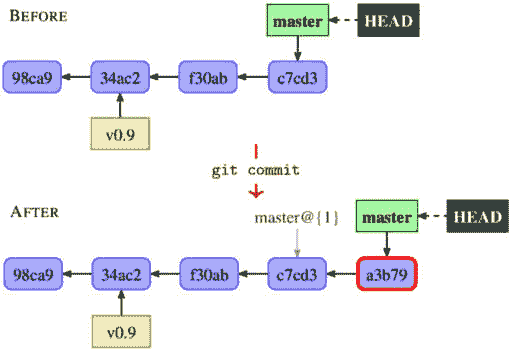
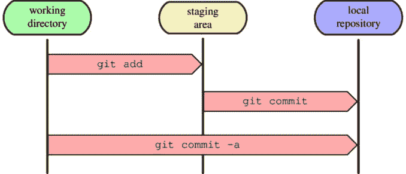
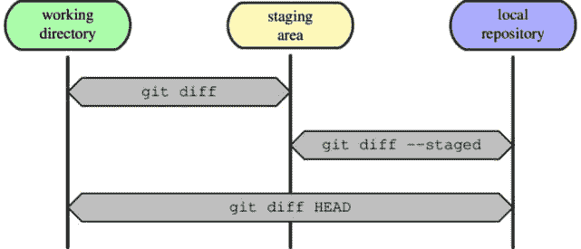
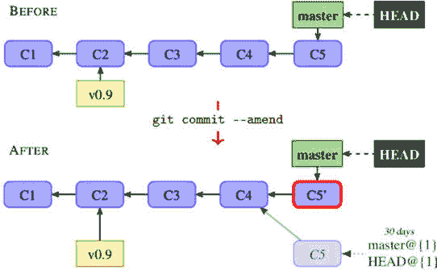
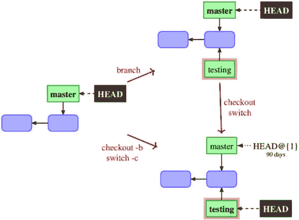
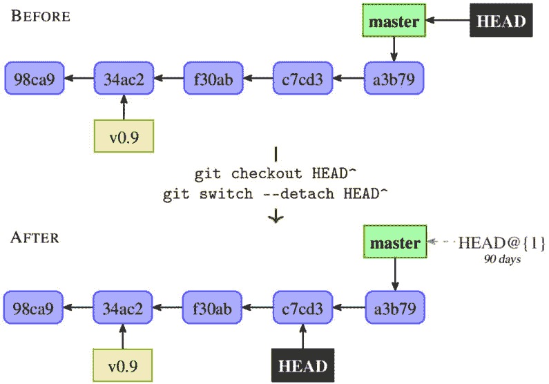
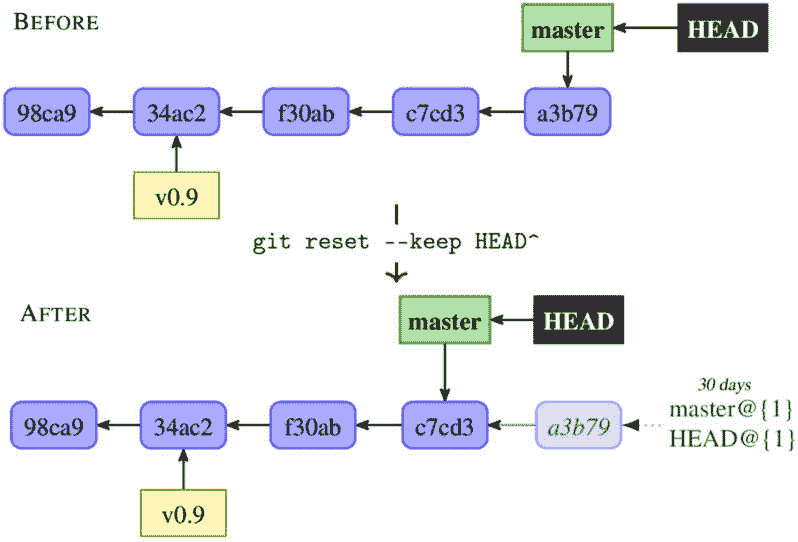
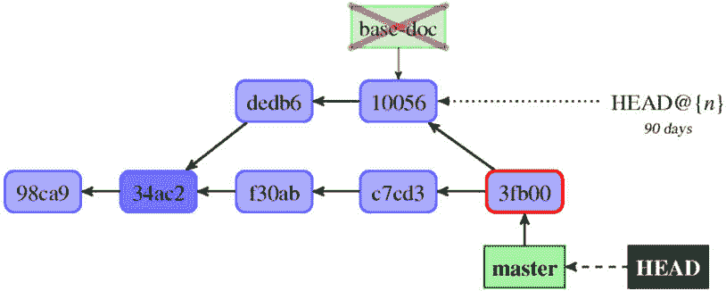
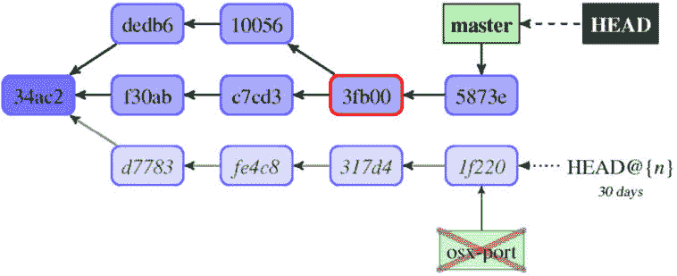

# 2

# 使用 Git 开发

本章将描述如何使用 Git 创建新的修订版本和新的开发线路（新分支）。

在这里，我们将专注于提交自己在独立开发中的工作。作为贡献者之一的工作描述留给了*第六章*，*使用 Git 进行协同开发*，而*第九章*，*合并更改*，将展示如何将创建的开发线路合并以及 Git 如何帮助维护者工作。

本章将介绍 Git 中非常重要的概念——**暂存区**（也叫索引），而更高级的操作技巧将在*第三章*，*管理你的工作树*中进行描述。它还将详细解释**分离的 HEAD**的概念——即一个匿名的、无名的分支。在这里，你还可以了解 Git 如何描述两个项目版本之间的差异，或项目的更改，包括对所谓扩展**统一****差异格式**的详细描述。

以下是本章我们将涉及的主题列表：

+   索引——提交的暂存区

+   检查工作区的状态，以及其中的变化

+   如何阅读描述更改的扩展统一差异（unified diff）

+   选择性和交互式提交，并修改提交

+   创建、列出、重命名和切换分支，以及列出标签

+   什么可能会阻止切换分支，以及在这种情况下你可以做什么

+   使用**git reset**回退分支

+   分离的**HEAD**——即无名分支（例如，检查某个标签的结果）

# 创建新的提交

在开始使用 Git 开发之前，你应该用一个姓名和电子邮件进行自我介绍，正如在*第一章*中所示，*Git 基础实用技巧*。这些信息将用于识别你的工作，无论是作为作者还是提交者。配置可以是全局的，适用于你所有的仓库（使用 `git config --global`，或直接编辑 `~/.gitconfig` 文件），也可以是针对单个仓库的（使用 `git config`，或编辑给定仓库中的 `.git/config` 文件）。每个仓库的配置会覆盖每个用户的配置（你将在*第十三章*中进一步了解这一点，*Git 的自定义和扩展*）。

多重身份

你可能希望为*工作*仓库使用公司邮箱，但为你参与的公开仓库使用个人的非工作邮箱。这可以通过全局设置一个身份（针对用户），然后在局部仓库配置中设置一个备用身份来处理例外情况。另一个可能的解决方案是使用**条件包含**和**includeIf**部分，利用它来包含带有每目录身份的适当配置文件。

相关配置文件片段可能如下所示：

```
[user]
    name = Joe R. Hacker
    email = joe@company.com
```

## 新提交如何扩展项目历史

对项目的开发做出贡献通常包括创建该项目的新修订版。为了将项目的当前状态标记为新版本，你使用 `git commit` 命令。Git 会要求输入更改的描述（**提交信息**），然后将新创建的修订版添加到项目历史中。这背后的过程是这样的——了解这些有助于更好地使用高级 Git 技巧。

在 Git 中，项目的历史存储为修订图（版本图），每个修订都指向它所基于的前一个版本。`git commit` 命令只是创建这个图中的一个新节点（一个 **提交** 节点），从而扩展了它。

为了知道每个分支的位置，Git 使用 **branch HEAD** 作为指向修订图的参考。**HEAD** 表示当前分支，即在哪个分支上创建新提交。

你可以在 *第四章*，*探索项目历史* 中了解更多关于 **有向无环图** (**DAG**) 的概念。创建新提交会在修订图中添加一个新节点，并调整分支头（head）的定位，如下图所示。



图 2.1 – 示例项目的修订图，创建新提交前后，位于 “master” 分支上

假设我们在 `master` 分支上，并且我们想要创建一个新版本（这个操作的细节将在稍后详细描述）。`git commit` 命令将创建一个新的提交对象 —— 一个新的修订节点。这个提交将以已检出的修订（*图 2.1* 中的 **c7cd3**）作为上一个节点（作为 **父节点**）。

这个修订可以通过从 `HEAD` 开始跟踪引用来找到；在这里，它是从 `HEAD` 开始的链，然后指向 `master`，最后到达 `c7cd3`。

然后，Git 会创建一个新的提交节点，`a3b79`，并将 `master` 指针移到这个新节点。在 *图 2.1* 中，新的提交用粗红色轮廓标出。注意，`HEAD` 指针没有变化；它始终指向 `master`。执行的提交操作会记录在 `master` 分支以及 `HEAD`（当前分支）中；可以通过 `git reflog master` 或 `git reflog HEAD` 命令查看此日志。

## 索引 —— 提交的暂存区

Git 仓库工作区中的每个文件在某一时刻都可以是 Git 已知的或未知的 —— 即，版本控制的或未版本控制的。任何 Git 已知的文件也被称为 `git add` 命令的文件。

Git 跟踪的文件通常有两种状态：已提交（或未更改）或已修改。`HEAD`），这些文件被安全地存储在仓库中。该文件是 `HEAD`。

然而，在 Git 中，还存在其他可能的状态。我们考虑使用 `git add` 命令将一个之前 Git 未知的文件（一个未跟踪的文件）添加到暂存区的情况，但在创建包含此文件的新提交之前。版本控制系统需要存储某处信息，指示该文件将在下次提交中包含。Git 使用一个叫做 `git add <file>` 的命令来**暂存**文件的当前内容（当前版本），并将其添加到索引中。

重要说明

如果你只想*标记文件为添加状态*，可以使用 **git add -N <file>** 或 **git add --intent-to-add <file>**；这些命令只是暂存文件的空内容（这里的 **<file>** 是文件名的占位符）。

暂存区存储项目的状态。它是第三个这样的部分，前两个部分是工作目录（包含你自己的项目文件副本，用作私有独立工作空间以进行更改）和本地仓库（存储你自己的项目历史副本，用于与其他开发者同步更改）。*图 2.2* 显示了如何在创建新提交的上下文中与这三个部分交互：



图 2.2 – 工作目录、暂存区和本地 Git 仓库，创建新提交

图中的箭头显示了 Git 命令如何复制内容。例如，`git add` 命令将文件的内容从工作目录复制到暂存区。创建新的提交需要明确或隐式地执行以下步骤：

1.  你在工作目录中对文件进行更改，通常使用你最喜欢的编辑器来修改它们。

1.  你将文件暂存，添加它们的快照（当前内容）到暂存区，通常使用 **git** **add** 命令。

1.  你使用 **git commit** 命令创建一个新的版本，该命令将暂存区中的文件作为当前状态，永久地将该快照存储到你的 **本地仓库**。

在开始时，通常在提交之后（除非是选择性提交），跟踪的文件在工作目录、暂存区和最后一次提交中是相同的（在已提交版本中，也就是`HEAD`）。

检查暂存文件内容与已提交文件内容

要检查文件在工作目录中的状态，您可以简单地将其打开并编辑，或者（在 Linux 或 Git Bash 中）直接使用**cat <filename>**；检查其他阶段则较为复杂。要查看暂存区的状态，可以使用**git show :<filename>**命令。要查看已提交版本，请使用**git show <revision>:<filename>**命令（其中**<revision>**可能是**HEAD**）。在这里，以**./**或**../**开头的文件名表示路径是相对于当前目录的；否则，它被视为相对于您所在的仓库的顶级目录。

然而，通常人们会使用一个特别的快捷命令——`git commit -a`（长形式为`git commit --all`），它会将*所有已更改的跟踪文件*添加到暂存区并创建一个新提交（参见*图 2.2*）。此命令的效果与运行`git add --update`，然后再运行`git commit`命令相同。请注意，新文件仍需通过`git add`明确添加，才能被跟踪并包含在新提交中。

## 检查待提交的更改

在提交更改并创建新修订（新提交）之前，您会希望查看自己所做的修改。

Git 会将待提交的更改信息添加到提交消息模板中，然后传递给编辑器，您将在编写提交消息时看到这一点。当然，除非您在命令行中指定提交消息——例如，使用`git commit -m "简短描述"`。Git 中的提交消息模板是可配置的（有关更多信息，请参见*第十三章*，*自定义和扩展 Git*）。

重要提示

您可以通过在编辑器中退出并不做任何更改，或者使用空的提交信息（注释行——即以**#**开头的行——不计入）来随时中止创建提交。如果您希望创建一个没有提交信息的提交，您需要使用**--allow-empty-message**选项。

在大多数情况下，您会希望在创建提交之前检查待处理更改的正确性。

### 工作目录的状态

您用来检查哪些文件处于哪种状态——即哪些文件已更改，是否有新文件等等——的主要工具是`git status`命令。

默认输出是解释性的，并且非常详细。例如，在克隆后，如果没有任何更改，您可能会看到如下内容：

```
$ git status
On branch master
nothing to commit, working tree clean
```

如果当前分支（在本示例中是`master`分支）是一个本地分支，旨在创建要发布并出现在公共仓库中的更改，并且已配置为跟踪其上游分支`origin/master`，您还会看到有关跟踪分支的信息：

```
Your branch is up to date with 'origin/master'.
```

在本章的进一步示例中，我们将忽略这一点，不包括关于分支和跟踪分支的信息。

假设你向项目中添加了两个新文件：一个包含版权和许可信息的 `COPYING` 文件，以及一个当前为空的 `NEWS` 文件。为了开始跟踪新的 `COPYING` 文件，你使用了 `git add COPYING`。不小心，你通过 `rm README` 命令将 `README` 文件从工作目录中删除了。你还修改了 `Makefile` 文件，并通过 `git mv` 将 `rand.c` 重命名为 `random.c`，但没有修改文件内容。

默认的长格式旨在易于人类阅读、详细且具描述性：

```
$ git status
On branch master
Changes to be committed:
  (use "git restore --staged <file>..." to unstage)
        new file:   COPYING
        renamed:    src/rand.c -> src/random.c
Changes not staged for commit:
  (use "git add <file>..." to update what will be committed)
  (use "git restore <file>..." to discard changes in working directory)
        modified:   Makefile
        deleted:    README
Untracked files:
  (use "git add <file>..." to include in what will be committed)
        NEWS
```

较早版本的 Git 会建议使用与 `git restore` 不同的命令。

如你所见，Git 不仅描述了哪些文件发生了变化，还解释了如何改变它们的状态——要么将其包含在提交中，要么将其从待处理的更改集中移除（关于 `git status` 输出中显示的命令的更多信息，可以参考 *第三章*，*管理你的工作树*）。输出中最多可能会有三个部分：

+   **待提交的更改**：此部分列出的是那些已经暂存的、更改内容将在使用 **git commit** 提交时生效的文件（不带 **-a**/**--all** 选项）。它列出了那些在暂存区的快照与上次提交的版本（**HEAD**）不同的文件。

+   **未暂存的更改**：此部分列出的是那些工作目录中的内容与暂存区快照不同的文件。这些更改不会通过 **git commit** 提交，但会通过 **git commit -a** 作为已跟踪文件的更改提交。

+   **未跟踪的文件**：此部分列出了 Git 不认识的文件，这些文件未被忽略（关于如何使用 **gitignores** 使文件被忽略，参见 *第三章*，*管理你的工作树*）。如果在项目的根目录运行，使用大批量添加命令 **git add .** 会将这些文件添加进来。你可以通过 **--untracked-files=no** (**-uno** 缩写) 选项跳过此部分。

如果该部分没有任何文件，它将不会显示。请注意，文件可能出现在多个部分。例如，使用 `git add` 添加的新文件然后被修改过，会同时出现在 **待提交的更改** 和 **未暂存的更改** 两个部分。

不需要利用显式暂存区的灵活性；你可以仅通过 `git add` 来添加新文件，再用 `git commit -a` 来将所有已跟踪文件的更改一起提交。在这种情况下，你会从 **待提交的更改** 和 **未暂存的更改** 两个部分创建一个提交。

`git status` 还提供了一个简洁的 `--short` 输出格式。它的 `--porcelain` 版本适合用于脚本，因为它保证保持稳定，而 `--short` 主要面向用户输出，若可能的话会使用颜色，并且未来可能会发生变化。对于相同的更改集，输出格式可能类似于以下内容：

```
$ git status --short
A  COPYING
 M Makefile
 D README
R  src/rand.c -> src/random.c
?? NEWS
```

在此格式中，每个路径的状态使用*两个字母的状态代码*显示。第一个字母显示索引的状态（暂存区和上次提交之间的差异），第二个字母显示工作树的状态（工作区和暂存区之间的差异）：

| **符号** | **含义** |
| --- | --- |
| (空格) | 未更新/未更改 |
| M | *修改*（已更新） |
| A | *添加* |
| D | *删除* |
| R | *重命名* |
| C | *复制* |

表 2.1 – `git-status`命令短格式中使用的字母状态代码

并非所有组合都是可能的。状态字母*A*、*R*和*C*仅在第一列中表示索引状态时可能出现。

特殊情况`??`用于表示未知（未跟踪）文件，`!!`用于表示被忽略的文件（当使用`git status --short --ignored`时）。

关于状态代码的说明

所有可能的输出在这里进行了描述；我们刚刚进行的合并导致了合并冲突的情况未在*表格 2.1*中显示，而是留待在*第九章*中描述，*合并* *更改*。

### 检查自上次修订以来的差异

如果你不仅想知道哪些文件被更改了（可以通过`git status`得到），还想知道具体更改了什么，可以使用`git` `diff`命令：



图 2.3 – 检查工作目录、暂存区和本地 Git 仓库之间的差异

在上一部分中，我们了解到在 Git 中，有三个阶段：工作目录、暂存区和仓库（通常是上次提交）。因此，我们不仅有一组差异，而是三组，如*图 2.3*所示。你可以向 Git 提出以下问题：

+   你更改了什么但还未暂存——也就是说，暂存区和工作目录之间有什么差异？

+   你已经暂存了哪些内容，准备提交——也就是说，最后一次提交（**HEAD**）和暂存区之间有什么差异？

+   自上次提交（**HEAD**）以来，你对工作目录中的文件做了哪些更改？

若要查看你已更改但尚未暂存的内容，请输入`git diff`，不带任何其他参数。此命令将工作目录中的内容与暂存区中的内容进行比较。这些更改是可以添加的，但如果我们创建一个提交（使用`git commit`而不加`-a`），它们不会出现在提交中；这些更改会在`git` `status`的输出中列出。

要查看你已经暂存的、将要进入下次提交的内容，可以使用`git diff --staged`（或`git diff --cached`）。此命令将暂存区的内容与上次提交的内容进行比较。这些是*将会*在执行`git commit`时添加的更改（不带`-a`）—`git status`的输出。你也可以通过`git diff --staged <commit>`将暂存区与任何提交进行比较；`HEAD`（最后一次提交）是默认的比较目标。

你可以使用`git diff HEAD`来比较工作目录中的内容与最后一次提交的内容（或使用`git diff <commit>`与任意提交进行比较）。这些是通过`git commit -a`快捷方式将会添加的更改。

如果你使用`git commit –a`并且没有使用暂存区，通常只需使用`git diff`来检查将进入下次提交的更改。唯一的问题是通过普通的`git add`添加的新文件；除非你使用`git add --intent-to-add`（或其等效命令`git add -N`）来添加新文件，否则它们不会出现在`git diff`的输出中。

### 统一的 Git 差异格式

Git 默认情况下，在大多数情况下，会显示`git bisect`找到的可疑提交的更改。

检查差异的不同方式

你可以使用**--stat**或**--dirstat**选项仅请求*更改统计*，使用**--name-only**仅请求*更改文件的名称*，使用**--name-status**请求带有更改类型的文件名，使用**--raw**请求更改的树级视图，或者使用**--summary**请求*简洁的摘要*（稍后将解释“扩展头信息”是什么意思以及包含哪些信息）。你还可以使用**--word-diff**请求**字级差异**而非行级差异，尽管这仅改变了更改的描述；标题和块头信息仍然类似。

差异生成还可以通过适当的**gitattributes**为特定文件或文件类型配置。你可以指定一个外部的*差异辅助工具*——也就是描述更改的命令——或者你可以为二进制文件指定一个*文本转换*过滤器（关于这一点，你将在*第三章*，*管理工作区*中学到更多）。

如果你更喜欢在图形工具中查看更改（通常提供*并排差异*），你可以使用**git difftool**而不是**git diff**来实现。你可以通过**--tool=<tool>**选项或**diff.tool**配置变量来指定工具。如果你使用的工具不受 Git 支持或不在**PATH**中，这可能需要进行一些配置。像这样使用外部工具与 Git 配合，稍后会在*第十三章*，*自定义与扩展 Git*中进行更详细的说明。

让我们来看一个来自 Git 项目历史的高级差异示例，使用来自 `git.git` 仓库的 `1088261f` 提交的差异。你可以在网页浏览器中查看这些更改——例如，在 GitHub 上；这是该提交中的第三个补丁，[`github.com/git/git/commit/1088261f6fc90324014b5306cca4171987da85`](https://github.com/git/git/commit/1088261f6fc90324014b5306cca4171987da85)：

```
diff --git a/builtin-http-fetch.c b/http-fetch.c
similarity index 95%
rename from builtin-http-fetch.c
rename to http-fetch.c
index f3e63d7206..e8f44babd9 100644
--- a/builtin-http-fetch.c
+++ b/http-fetch.c
@@ -1,8 +1,9 @@
 #include "cache.h"
 #include "walker.h"
-int cmd_http_fetch(int argc, const char **argv, const char *prefix)
+int main(int argc, const char **argv)
 {
+       const char *prefix;
        struct walker *walker;
        int commits_on_stdin = 0;
        int commits;
@@ -18,6 +19,8 @@ int cmd_http_fetch(int argc, const char **argv,
        int get_verbosely = 0;
        int get_recover = 0;
+       prefix = setup_git_directory();
+
        git_config(git_default_config, NULL);
        while (arg < argc && argv[arg][0] == '-') {
```

让我们逐行分析这个补丁。第一行，`diff --git a/builtin-http-fetch.c b/http-fetch.c`，是一个 `diff --git a/file1 b/file2`。`a/` 和 `b/` 的文件名除非涉及重命名或复制操作（如我们的例子中所示），即使文件被添加或删除，它们也是相同的。`--git` 选项表示差异是以 Git 差异输出格式呈现的。

接下来的几行是 `builtin-http-fetch.c` 到 `http-fetch.c` 的差异，这两个文件有 95% 的相似度（用于检测此重命名的信息）：

```
similarity index 95%
rename from builtin-http-fetch.c
rename to http-fetch.c
```

重要说明

扩展头部行描述了在普通统一差异中无法表示的信息，除了文件重命名的信息之外。除了像本例中那样的相似度或差异度分数，这些行还可以描述文件类型的变化（例如从非可执行文件变为可执行文件）。

扩展差异头的最后一行，在这个例子中如下所示：

```
index f3e63d7206..e8f44babd9 100644
```

上面的代码告诉我们有关给定文件的模式（权限）。这里的 `100644` 表示这是一个普通文件而不是符号链接，并且它没有设置可执行权限位（这些是 Git 跟踪的三种文件权限）。这一行还告诉我们关于 `f3e63d7206`（这里）和 `e8f44babd9`（这里）缩短的哈希值。这一行用于 `git am --3way`，如果补丁无法应用，它将尝试进行三方合并。对于新文件，源图像的哈希值为 `0000000000`；对于删除的文件，目标图像的哈希值相同。

接下来是 **统一差异头**，由两行组成：

```
--- a/builtin-http-fetch.c
+++ b/http-fetch.c
```

与 `diff -U` 结果相比，它没有源文件修改时间和目标文件修改时间。这些应位于源文件（源图像）和目标文件（目标图像）文件名之后的空格处。如果文件是新创建的，则源文件为 `/dev/null`；如果文件已被删除，则目标文件为 `/dev/null`。

提示

如果你将 **diff.mnemonicPrefix** 配置变量设置为 **true**，以取代该两行头部中的 **a/** 前缀（表示源文件）和 **b/** 前缀（表示目标文件），那么你将分别看到 **c/**（表示提交）、**i/**（表示索引）、**w/**（表示工作树）和 **o/**（表示对象）前缀，来显示你正在比较的内容。这使得在 **git diff**、**git diff --cached**、**git diff HEAD** 输出等命令中很容易区分各个方面。

接下来是一个或多个 **差异块**，即文件之间差异的区域；每个差异块显示文件不同之处的一个区域。统一格式的差异块以描述更改所在行的行开始，称为 **差异块头**，如以下所示：

```
@@ -1,8 +1,9 @@
```

这一行匹配以下格式模式：`@@ from-file-range to-file-range @@`。`from-file` 范围的格式为 `-<起始行>,<行数>`，而 *to-file 范围* 为 `+<起始行>,<行数>`。`起始行` 和 `行数` 分别指代前后图像中文件的起始位置和长度。如果没有显示 `行数`，则表示其值为 `0`。

在这个例子中，我们可以看到变化从文件的第一行开始，无论是前图像（更改前的文件）还是后图像（更改后的文件）。我们还看到，这个差异块对应的代码片段在前图像中有八行，在后图像中有九行。行数的差异意味着添加了一行。默认情况下，Git 还会显示环绕变化的三行未更改的行（即所谓的 **上下文行**）。

Git 还会显示每个更改发生的“*函数名称*”（或者对于其他类型的文件，如果有的话，可以通过 `.gitattributes` 配置文件的 diff 驱动程序来实现 —— 请参见 *第三章*，*管理你的* *工作区*，在 *配置 diff 输出* 部分中的 *文件属性*）；这就像 GNU diff 中的 `-p` 选项：

```
@@ -18,6 +19,8 @@ int cmd_http_fetch(int argc, const char
```

Git 包含了许多用于提取不同编程语言中“*函数*”头的构建模式。

接下来是描述文件差异的部分。两个文件中共有的行会以空格 "`(" ")"`” 指示符作为前缀。两个文件之间不同的行在左侧打印列中会有以下指示符之一：

+   **+**：这里向第二个文件添加了一行

+   **-**：这里从第一个文件删除了一行

注意

在 **纯文本词差异** 格式中，不是逐行比较文件内容，新增的单词会被 **{+** 和 **+}** 包围，删除的单词则被 **[-** 和 **-]** 包围，如以下示例所示：

```
int [-cmd_http_fetch-]{+main+}(int argc, const char **argv[-, const char *prefix-])
```

如果最后一个差异块的行中包含文件的最后一行，并且该最后一行是 **不完整行**（意味着文件在差异块末尾没有以行结束符结束），你将会看到以下情况：

```
\ No newline at end of file
```

这个情况在所用的例子中并不存在。

因此，在这里使用的例子中，第一个差异块意味着 `cmd_http_fetch` 被 `main` 替换，`const char *prefix;` 这一行被添加：

```
#include "cache.h"
 #include "walker.h"
-int cmd_http_fetch(int argc, const char **argv, const char *prefix)
+int main(int argc, const char **argv)
 {
+       const char *prefix;
        struct walker *walker;
        int commits_on_stdin = 0;
        int commits;
```

看一下 *替换行*，旧版本的行被标记为删除（`-`），新版本则被标记为添加（`+`）。

换句话说，在更改之前，名为 `builtin-http-fetch.c` 的文件的相应片段大致如下所示：

```
#include "cache.h"
#include "walker.h"
int cmd_http_fetch(int argc, const char **argv, const char *prefix)
{
       struct walker *walker;
       int commits_on_stdin = 0;
       int commits;
```

更改后，这段文件，现在名为`http-fetch.c`，看起来类似于以下内容：

```
#include "cache.h"
#include "walker.h"
int main(int argc, const char **argv)
{
       const char *prefix;
       struct walker *walker;
       int commits_on_stdin = 0;
       int commits;
```

## 选择性提交

有时，在检查了待处理的更改后，你会意识到工作目录中有两个（或更多）不相关的更改，它们应该属于两个不同的逻辑更改；这种问题有时被称为**交织工作副本问题**。你需要将这些不相关的更改放入单独的提交中，作为单独的更改集。这种情况即使在尝试遵循最佳实践时也可能发生（参见*第十五章*，*Git* *最佳实践*）。

一种解决方案是按原样创建提交，并稍后修复它（将其分成两部分）。你可以阅读如何做这件事的内容，见*第十章*，*保持* *历史清晰*。

然而，有时，一些更改现在是必要的，必须立即发布（例如，修复在线网站的 bug），而其余的更改尚未准备好（它们还在进行中）。你需要将这些更改分开成两个独立的提交。

### 选择要提交的文件

最简单的情况是当这些不相关的更改影响不同的文件时。例如，如果 bug 出现在`view/entry.tmpl`文件中，并且 bug 修复只更改了这个文件（且该文件没有其他与修复 bug 无关的更改），你可以使用以下命令创建一个 bug 修复提交：

```
$ git commit view/entry.tmpl
```

该命令将忽略在索引中暂存的更改（即暂存区中的内容），而记录给定文件或文件的当前内容（即工作目录中的内容）。

### 交互式选择更改

然而，有时这些更改无法以这种简单的方式分开；文件的更改是交织在一起的。你可以通过给`git` `commit`命令添加`-``‍``-``‍``interactive`选项来尝试将它们分开：

```
$ git commit --interactive
           staged     unstaged path
  1:    unchanged        +3/-2 Makefile
  2:    unchanged       +64/-1 src/rand.c
*** Commands ***
  1: status       2: update       3: revert       4: add untracked
  5: patch        6: diff         7: quit         8: help
What now>
```

在这里，Git 向我们展示了工作区（`unstaged`）和暂存区（`staged`）的状态和更改总结，这也是`status`子命令的输出。更改通过添加和删除的行数来描述——例如，这里的`+3/-2`（这类似于`git diff --numstat`命令所显示的内容）。

提示

使用像**git gui**这样的图形工具可能会更容易，具有这种功能的 GUI 可以使用鼠标选择要包含或排除的更改行。

你可以使用`help`子命令，通过按*h*键访问，以检查这些列出的操作意味着什么：

```
What now> h
status        - show paths with changes
update        - add working tree state to the staged set of changes
revert        - revert staged set of changes back to the HEAD version
patch         - pick hunks and update selectively
diff          - view diff between HEAD and index
add untracked - add contents of untracked files to the staged set of changes
```

要分开更改，你需要选择`patch`子命令（例如，使用*5*或*p*）。Git 随后会提示你输入`Update>>`，你需要选择要更新的文件及其数字标识符，如在状态中所示，并输入`return`。你可以输入`*`来选择所有可能的文件。选择完后，按空行结束：

```
What now> p
           staged     unstaged path
  1:    unchanged        +3/-2 Makefile
  2:    unchanged       +64/-1 src/rand.c
Patch update>> 1
           staged     unstaged path
* 1:    unchanged        +3/-2 Makefile
  2:    unchanged       +64/-1 src/rand.c
Patch update>>
```

你可以通过使用 `git commit --patch` 跳过交互式选择文件，而直接进行文件修补。

Git 将逐块显示指定文件的所有更改，并让你在每个块中选择以下选项之一：

```
y - stage this hunk
n - do not stage this hunk
q - quit; do not stage this hunk or any of the remaining ones
a - stage this hunk and all later hunks in the file
…
s - split the current hunk into smaller hunks
e - manually edit the current hunk
? - print help
```

块输出和提示类似如下：

```
@@ -16,7 +15,6 @@ int main(int argc, char *argv[])
        int max = atoi(argv[1]);
+       srand(time(NULL));
        int result = random_int(max);
        printf("%d\n", result);
Stage this hunk [y,n,q,a,d,/,j,J,g,e,?]? y
```

在许多情况下，只需选择哪些更改块要包含在提交中就足够了。在极端情况下，你可以将一个块拆分成更小的部分，甚至手动编辑差异。

许多图形工具，包括 `git gui`，也允许交互式选择哪些更改将被提交到下一个提交。你可以在*第十三章*中找到更多信息，*定制和扩展 Git*，在*图形* *界面*部分。

### 一步步创建提交

使用 `git commit --interactive` 选择要提交的更改，不幸的是，它无法让你测试即将提交的更改。你可以在创建提交后检查所有内容是否正常（即编译代码和/或运行测试），然后如果有任何错误，再进行修改（请参见下节，*修改提交*）。不过，也有一个替代方案。

如果不想使用交互式提交功能，你可以通过将待提交的更改放入暂存区来准备提交，方法是使用 `git add --interactive` 或其他等效方案（例如 Git 的图形化提交工具 — 例如 `git gui`）。交互式提交只是 `git diff --cached` 的快捷方式，可以通过 `git add <file>`、`git checkout <file>` 和 `git reset <file>` 等命令进行适当修改。

理论上，你还应该测试这些更改是否正确，至少确保它们不会破坏构建。为此，首先使用 `git stash save --keep-index` 保存当前状态，并将工作目录恢复到暂存区（索引）中准备好的状态。执行此命令后，你可以运行测试（或至少检查程序是否能编译且不崩溃）。如果测试通过，你可以使用 `git commit` 创建新版本。如果测试失败，你应该通过 `git stash pop --index` 命令恢复工作目录，同时保持暂存区的状态；有时可能需要在其前加上 `git reset --hard`。之所以需要这样做，是因为 Git 在保留你的工作时非常保守，它不知道你刚才已经进行了 stash。首先，暂存区中有未提交的更改，导致 Git 无法应用 stash；其次，工作目录中的更改与 stash 中的内容相同，因此，当然会发生冲突。

你可以在*第三章*中找到关于 **stash** 的更多信息，包括它是如何工作的，*管理你的工作树*，在*暂存你的* *更改*部分。

# 修改提交

Git 的一个优点是，你几乎可以撤销任何操作；你只需要知道如何操作。因为无论你多么仔细地编写提交，迟早你会忘记添加某些更改或者提交信息写错。这时候，`git commit`命令的`--amend`标志就派上用场了；它可以让你非常容易地修改最后一次提交。请注意，使用`git commit --amend`时，你还可以修改合并提交（例如，修复合并错误）。*图 2.4*展示了此修改操作如何改变修订图表，图表代表了项目的历史。

提示

如果你想修改历史中更早的某个提交（假设它还没有发布，或者至少没有人基于该旧版本提交开始工作），你需要使用**交互式变基**，或者一些专用工具，如**StGit**（Git 上的**补丁堆栈管理界面**）。更多信息请参考*第十章*，*保持历史清洁*。



图 2.4 – 修正最后一次提交前后修订的图表

如果你只是想修正提交信息，并且假设没有任何已暂存的更改，你只需要运行`git commit --amend`并修正它（请注意，我们使用的是不带`-a` / `--all`标志的`git commit`）：

```
$ git commit --amend
```

如果你想对最后一次提交进行更多更改，你可以像正常一样使用`git add`暂存它们，然后像前面的例子一样*修改*最后一次提交，或者直接进行更改后使用`git commit -a --amend`：

重要提示

有一个非常重要的警告：你*永远不要*修改已经发布的提交！这是因为修改操作实际上会产生一个完全新的提交对象，替换掉旧的提交对象，正如在*图 2.4*中所见。在这个图中，你可以看到，操作前最近的提交（标记为**C5**）被项目历史中的提交**C5'**所替代，后者包含了修改后的内容。

如果只有你一个人有这个提交，做这件事是安全的。然而，在将原始提交发布到远程仓库后，其他人可能已经基于该版本的提交开始了新的工作。在这种情况下，用修改后的版本替换原始版本会在后续造成问题。你将在*第十章*，*保持历史清洁*中了解更多关于这个问题的信息。

这就是为什么，如果你尝试推送（发布）一个已经修改过的提交的分支，Git 会阻止覆盖已发布的历史，并要求你**强制推送**，如果你确实想要替换旧版本（除非你配置了默认强制推送）。关于这一点，请参见*第六章*，*与 Git 的协作开发*。

修改前的提交的旧版本将保留在分支的 reflog 中和 HEAD 的 reflog 中；例如，在修改后，修改后的版本将作为`@{1}`可用。这意味着你可以使用例如`git reset --keep HEAD@{1}`来撤销修改操作，如在*回退或重置分支*部分所描述。默认情况下，Git 会将旧版本保留一个月（30 天），除非有其他配置，或者手动清除 reflog。

你始终可以通过使用`git reflog`命令检查操作的日志。在修改提交后，该命令的输出如下所示：

```
$ git reflog --no-decorate
94d3e03 HEAD@{0}: commit (amend): After amending
d69a0a9 HEAD@{1}: commit: Before amending
```

这里，`HEAD@{1}`表示当前分支向后退 1 次操作的位置。除了 HEAD 的 reflog 外，每个分支也有一个自己的 reflog，稍后会有详细描述。注意，你可以在*第四章*中阅读更多关于如何使用 reflog 引用提交的内容，*探索* *项目历史*。

# 使用分支和标签

在版本控制中，**分支**是独立的开发线，一种将不同想法和不同部分的变更分开的方式。你可以以不同的方式使用分支，具体方法在*第八章*中有详细描述，*高级* *分支技巧*。

使用`v1.0`标签，你将能够精确地访问版本 1.0 的代码。此外，使用**注释标签**，你可以为标记的修订提供更长的描述，而**签名标签**则有助于确保是你创建了它。

在 Git 中，每个分支实现为一个命名的“*指针*”（引用），指向修订图中的某个提交，称为分支头部。**轻量标签**也遵循相同的方式；对于注释标签和签名标签，“*指针*”指向标签对象（包含注释或签名），该对象指向一个提交。

Git 中分支的表示

Git 目前使用两种不同的磁盘上分支表示方式：“*松散*”格式（优先使用）和“*打包*”格式。

以**master**分支为例（目前是 Git 中新建仓库的默认分支名称，除非另行配置，否则会从该分支开始）。在“*松散*”格式（优先使用）中，分支表示为**.git/refs/heads/master**文件，文件中包含分支头部的 SHA-1 的十六进制文本表示。在“*打包*”格式中，分支表示为**.git/packed-refs**文件中的一行，连接了顶端提交的 SHA-1 标识符和完全限定的分支名称。

（命名的）**开发线**是从分支头部可达的所有修订的集合。它不一定是连续的修订线——它可以分叉并合并。

## 创建新分支

创建新分支时，你可以先创建分支，稍后再切换过去，或者你也可以使用一个命令同时创建并切换到该分支。这在*图 2.5*中有说明。

你可以使用 `git branch` 命令来创建新分支。例如，要从当前分支创建一个新的 `testing` 分支（见 *图 2.5* 的右上部分），可以运行以下命令：

```
$ git branch testing
```

这里发生了什么呢？这个命令为你创建了一个新的指针（一个新的引用），你可以移动它。如果你希望将新分支指向某个特定的提交，可以给这个命令传递一个可选的参数，像下面的示例一样：

```
$ git branch testing HEAD^^^
```



图 2.5 – 创建一个名为“testing”的新分支并切换到此分支，或者通过一个命令同时创建新分支并切换到它

注意

**HEAD^^^** 表示法将在 *第四章* *探索项目历史* 中解释。

然而，`git branch <new branch>` 命令不会改变当前分支。它不会切换到刚刚创建的分支，也不会改变 `HEAD`（指向当前分支的符号引用）的指向，也不会改变工作目录的内容。

如果你想创建一个新分支并立即切换到它（开始在新分支上工作），你可以使用以下快捷方式：

```
$ git switch -c testing
```

在这里，简短的 `-c` 选项代表 `--create`。你也可以使用以下替代命令，这在旧版本的 Git 中是唯一可用的选项：

```
$ git checkout -b testing
```

如果你想强制创建一个已经存在名称的分支，相当于删除现有分支，你需要使用 `-C` 和 `-B` 选项，而不是 `-c` 和 `-b` 选项。

如果我们在仓库的当前状态下创建一个新分支，`switch -c` 和 `checkout -b` 命令的唯一区别在于它们还会移动 `HEAD` 指针；参见从左侧到右下角的过渡，见 *图 2.5*。

## 创建孤立分支

很少情况下，你可能希望在仓库中创建一个全新的孤立分支，该分支与其他分支没有任何历史关联。或许你想要存储每个发布版本生成的文档，以便用户能够轻松地获得可读的文档（例如，作为 man 页或 HTML 帮助），而无需安装转换工具或渲染器（例如，AsciiDoc 或 Markdown 解析器）。或者，你可能想将项目的网页存储在与项目本身相同的仓库中，这正是 GitHub 项目页面可以使用的方式。也许你想开源代码，但需要先清理代码（例如，因版权和许可问题）。

一种解决方案是为孤立分支的内容创建一个单独的仓库，并将其拉取到某个远程追踪分支中。然后你可以基于该分支创建一个本地分支。这种方式的优点是将不相关的内容分开管理，但另一方面，这也意味着需要管理更多的仓库。

你也可以使用 `git switch` 或 `git checkout` 命令，结合 `--orphan` 选项来实现此操作：

```
$ git switch --orphan gh-pages
Switched to a new branch 'gh-pages'
```

这会重现类似于刚执行 `git init` 后的状态：`HEAD` 的 `symref` 指向 `gh-pages` 分支，该分支尚不存在；它将在第一次提交时被创建。

如果你希望从一个干净的状态开始，比如使用 GitHub Pages，你还需要删除分支起始点的内容（默认是 `HEAD` —— 即当前分支及工作目录的当前状态）——例如，使用以下命令：

```
$ git rm -rf .
```

在公开源代码时，如果需要排除专有部分，使用孤立分支来确保在合并时不会意外地将专有代码带入开源版本，这时你可能需要小心地编辑工作目录。

## 选择并切换到一个分支

要切换到现有的本地分支，你需要运行 `git switch` 命令。例如，在创建了 `testing` 分支后，你可以使用以下命令切换到该分支：

```
$ git switch testing
```

如*图 2.6*所示，这是从右上方到右下方的垂直过渡；该图还显示了你可以使用 `git checkout` 来切换分支。

### 切换到分支的障碍

切换到分支时，Git 还会将其内容检出到工作目录。如果此时你有未提交的更改（并且 Git 并未将其视为任何分支上的更改），那么会发生什么呢？

提示

在干净的状态下切换分支是一个好习惯，可以将更改暂存或必要时创建提交。只有在少数几种特殊情况下，才会有未提交更改时检查分支的需求，这些情况将在下面的章节中描述。

如果当前分支与目标切换分支之间的差异没有涉及到更改的文件，则未提交的更改会被移动到新分支。这在你开始工作后才意识到最好在单独的功能分支中完成该工作时非常有用。

如果未提交的更改与给定分支上的更改冲突，Git 会拒绝切换到该分支，以防止你丢失工作内容：

```
$ git checkout other-branch
error: Your local changes to the following files would be overwritten by checkout:
        file-with-local-changes
Please commit your changes or stash them before you switch branches.
Aborting
```

在这种情况下，你有几种可能的解决方案：

+   你可以使用 **git stash** 命令将更改暂存，并在返回到你之前的分支时恢复它们。这通常是首选的解决方案。

    另外，你可以简单地将正在进行的工作和这些更改创建一个临时提交，然后在回到该分支时修改提交或回滚分支。

+   你可以尝试通过*合并*将更改移到新分支，可以使用 **git switch --merge**（它会执行当前分支、带有未保存更改的工作目录内容和新分支之间的三方合并），或者在切换之前将更改暂存，然后在切换后恢复它们。

+   你还可以使用 **git switch --discard-changes** 或 **git** **checkout --force** 来 *丢弃* 你的更改。

### 匿名分支

如果你尝试检出（切换到）一个不是本地分支的东西——例如一个任意修订（如 `HEAD^`）、一个标签（如 `v0.9`）或者一个远程追踪分支（例如 `origin/master`）会发生什么？Git 假设你需要能够在当前工作目录的状态上创建提交。

旧版本的 Git 会拒绝切换到非分支。如今，Git 会通过分离 **HEAD** 指针并使其直接指向一个提交（这就是为什么它也被称为分离 HEAD 状态），而不是作为对分支的符号引用，来创建一个 **匿名分支**；参见 *图 2.6* 以获取示例。



图 2.6 – 检出非分支的结果是分离的 HEAD 状态（就像在匿名分支上一样）

由于这个功能仅在少数情况下使用，为了避免明确地进入这种状态，`git switch` 命令需要使用 `--detach` 选项；为了向后兼容，`git checkout` 不需要使用此选项来分离 **HEAD** 指针。此选项还可以用于在当前位置显式创建一个匿名分支。在旧版本的 Git 中，分离的 HEAD 状态在分支列表中显示为（**no branch**），在新版本的 Git 中显示为（**detached from HEAD**）或（**HEAD detached at**...）。

如果你不小心分离了 HEAD，你可以随时使用以下命令 *返回到上一个分支*（其中 `-` 表示上一个分支的名称）：

```
$ git switch -
Previous HEAD position was a3bl9 <Some commit message>
Switched to branch 'master'
```

重要提示

**git switch -** 命令使用 HEAD 的 reflog 切换到上一个分支。重命名分支后，可能无法正常工作。

正如 Git 所告知的，创建一个分离分支时，如果不使用 `--detach` 选项，你始终可以使用 `git switch -``c <new-branch-name>` 给匿名分支命名。

因为标签是不可变的，所以尝试检出（或切换到）标签也会创建一个分离的 `HEAD` —— 标签不是分支。

### 切换命令 DWIM-谋略

检出非分支的情况有一个特殊情况。如果你通过其短名称（在此情况下是 `next`）像对待本地分支一样检出一个远程追踪分支（例如 `origin/next`），Git 会假设你是想在远程追踪分支的状态上创建新的内容，并会按照它认为你需要的方式进行操作。这个 `--no-guess` 选项，或者伴随的 `checkout.guess` 配置变量。

这意味着：

```
$ git switch next
```

等同于：

```
$ git switch -c next --track origin/next
```

Git 只有在没有歧义的情况下才会执行此操作；本地分支必须不存在（否则该命令会直接切换到给定的本地分支），并且必须只有一个远程跟踪分支与之匹配。可以通过运行`git show-ref next`（使用短名称）来检查此条件，验证它只返回一行，且包含远程跟踪分支的信息：

```
$ git show-ref --abbrev next
4936735 refs/remotes/origin/next
```

## 列出分支和标签

如果你使用`git branch`命令而不带其他参数，它将列出所有分支，并用星号标记当前分支——即`*`。

程序化地确定当前分支

**git branch** 命令是面向最终用户的；其输出可能在未来的 Git 版本中发生变化。要以编程方式获取当前分支的名称，可以使用**git symbolic-ref HEAD**（或**git branch --show-current**）。要获取当前提交的 SHA-1 值，请使用**git rev-parse HEAD**。要列出所有分支，请使用**git show-ref** 或 **git for-each-ref**；这同样适用于标签和远程跟踪分支。

**git symbolic-ref**、**git rev-parse**、**git show-ref** 和 **git for-each-ref** 命令都属于**管道命令** —— 即，专门用于脚本中的命令。

你可以使用`-v`（`--verbose`）或`-vv`请求更多信息。你还可以通过`git branch --list <pattern>`来限制显示的分支，仅显示匹配给定 shell 通配符的分支（如果需要，引用模式以防止其被 shell 展开）。

查询远程信息，包括远程分支列表，可以使用`git remote show`，该内容将在*第八章*中描述，*高级* *分支技术*。

要列出所有标签，可以使用不带任何参数的 `git tag` 命令，或者 `git tag --list`；使用 `git tag --list <pattern>`，你可以选择显示哪些标签（例如，按分支），如下例所示：

```
$ git tag --list "v0.9*"
v0.99
v0.99.1
v0.99.2
```

## 回退或重置分支

如果你想放弃最后一个提交并且执行`git reset --keep`（尝试保留未提交的更改）或`git reset --hard`（放弃它们），该重置操作的结果如*图 2.7*所示。



图 2.7 – 使用重置命令将分支回退一个提交至 HEAD^

重置命令及其对工作区的影响将在*第三章*中详细说明，*管理* *你的* *工作树*。

注意

**git reset <commit>** 命令总是改变当前分支指向的位置（移动引用），而**git switch** 总是修改**HEAD**指向的位置，要么改变当前分支，要么将其分离。

## 删除分支

因为在 Git 中，分支只是一个指针，是指向修订历史中某个节点的外部引用，删除分支实际上只是删除一个指针。这意味着，删除分支并不会立即删除历史记录，但可能会使其无法通过其他途径访问，除非通过 `reflog`。不过，这些信息并不是永久保存的；`reflog` 条目会过期。

重要提示

实际上，删除一个分支也会不可恢复地（至少在当前版本的 Git 中）删除该分支的 **reflog**——即它的本地操作历史记录。



图 2.8 – 删除刚刚合并到 'master' 分支的 'based-doc' 分支，同时在包含它的 'master' 分支上

你可以使用 `git branch --delete <branch-name>` 或 `branch -d` 来删除分支，前提是该分支没有被检出。

但是，有一个问题需要考虑——如果删除一个分支，并且该分支指向的项目历史部分没有其他引用，会发生什么？这些修订将变得不可达，Git 会在 HEAD reflog 过期后删除它们（在默认配置下，通常是 30 天后）。

这就是为什么 Git 只允许删除完全合并的分支的原因，所有提交都可以通过 `HEAD` 访问，如*图 2.8*中的示例所示（或者如果删除的分支可以从其上游分支访问，也允许删除）。

要删除一个未合并的分支，这会导致 DAG 的部分内容变得不可达，如*图 2.9*所示，你需要使用更强的命令——即 `git branch -D` 或 `git branch --delete --force`。当拒绝删除未合并的分支时，Git 会建议执行此操作。



图 2.9 – 删除未合并的分支，导致部分历史记录变得不可达

你可以通过检查 `git branch --contains <branch>` 是否显示内容来判断分支是否已经合并到其他分支。你不能删除当前分支。

如果你曾切换到被删除的分支，那么这个事件和切换离开该分支的信息将保存在 `HEAD` 的 `reflog` 中。这些信息可以用来恢复该分支，或者更准确地说，用来重新创建它：

```
$ git reflog --no-decorate HEAD
…
3a59408 HEAD@{3}: checkout: moving from base-doc to master
```

## 更改分支名称

有时候，分支的名称需要更改。例如，如果分支的范围在开发过程中发生变化，旧名称可能就不再适用了。分支的名称默认会出现在合并提交的提交信息中，并永远保留；这就是为什么你希望分支名称有意义的原因。

你可以使用 `git branch -m` 来重命名一个分支（如果目标名称已存在并且你想覆盖它，则使用 `-M`）；它会重命名分支并移动相应的 reflog。这也会改变该分支在所有配置中的名称（包括描述、上游等）。

重命名事件存储在 reflog 中，你可以找到之前的名称并使用它来撤销操作（将分支重命名回旧名称）：

```
$ git reflog --no-decorate new-name
3a59408 new-name@{0}: branch: renamed refs/heads/old-name to refs/heads/new-name
```

# 总结

在本章中，我们学习了如何使用 Git 开发并通过创建新的提交和新的开发线路（分支）扩展项目历史。从修订图的角度来看，我们了解了创建提交、修改提交、创建分支、切换分支、回退分支以及删除分支意味着什么。

本章展示了 Git 的一个非常重要的功能——用于创建提交的暂存区，也称为索引。这使得通过选择性和交互式地选择要提交的内容，从而理清工作目录中的更改成为可能。

我们学习了如何在创建提交之前检查工作区的更改。本章详细描述了 Git 用来描述更改的扩展统一差异格式（unified diff format）。

我们还学习了分离头指针（detached HEAD，或称匿名分支）和孤立分支的概念。

在 *第三章*，*管理你的工作区*，我们将学习如何使用 Git 来准备新的提交，并如何配置它以便使我们的工作更轻松。我们还将学习如何检查、搜索和研究工作目录、暂存区以及项目历史的内容。我们还将看到如何使用 Git 处理中断并从错误中恢复。

# 问题

回答以下问题，以测试你对本章的理解：

1.  创建新的提交如何改变存储在仓库中的历史——也就是说，它如何改变修订图以及分支头指针指向的位置？

1.  **git commit** 和 **git commit --all**（或 **git commit -a**）有什么区别？

1.  如何检查你在本地仓库中做了哪些更改？如何撤销它们？

1.  修复当前分支上最后一次提交的提交信息的最简单方法是什么？

1.  当你意识到你开始写的更改（但还未提交）应该在一个新的分支上进行时，你该怎么办？

1.  切换到上一分支的最简单方法是什么？什么时候它可能失败？

# 答案

以下是上述问题的答案：

1.  创建新的提交会在修订图中生成一个新的节点，该节点的父节点是先前的提交，并将当前分支的分支头引用推进到新创建的节点，同时保持 **HEAD** 不变。

1.  **git commit** 操作从暂存区内容创建新的提交，而 **git commit --all** 则从所有已跟踪文件的更改中创建提交。

1.  可以使用**git status**查看哪些文件已更改，使用**git diff**或**git diff HEAD**查看更改。你可以在完整的**git status**输出中找到如何撤销所做更改的解释。

1.  若要更改最后一次提交的提交信息（即更改的描述），可以使用**git commit --amend**。

1.  因为未提交的更改不属于任何分支，所以你可以简单地创建一个新分支并切换到该分支，使用**git switch -c <branch-name>**或**git checkout -b <branch-name>**。

1.  若要切换到上一个分支，可以使用**git switch -**（用**-**代替分支名）。Git 通过查找 reflogs 来确定上一个分支。如果分支已被删除或重命名，则此操作可能失败。

# 进一步阅读

要了解更多本章涉及的主题，请查看以下资源：

+   Scott Chacon, Ben Straub. *Pro Git*，第二版（2014），Apress，*第二章 2 节*，*Git 基础 - 记录变更到仓库*：[`git-scm.com/book/en/v2/Git-Basics-Recording-Changes-to-the-Repository`](https://git-scm.com/book/en/v2/Git-Basics-Recording-Changes-to-the-Repository)

+   Jakub Narębski. *如何阅读 git diff 的输出？*（对 StackOverflow 问题的回答）：[`stackoverflow.com/questions/2529441/how-to-read-the-output-from-git-diff/2530012#2530012`](https://stackoverflow.com/questions/2529441/how-to-read-the-output-from-git-diff/2530012#2530012)

+   Dragos Barosan. *Git 新特性：switch 和 restore*（2021）：[`www.banterly.net/2021/07/31/new-in-git-switch-and-restore/`](https://www.banterly.net/2021/07/31/new-in-git-switch-and-restore/)

+   Junio C Hamano. *近期 Git 新特性乐趣*（2016），关于**git branch**命令的**--sort**选项：[`git-blame.blogspot.com/2016/05/fun-with-new-feature-in-recent-git.html`](https://git-blame.blogspot.com/2016/05/fun-with-new-feature-in-recent-git.html)

+   Tobias Günther. *从幕后看 Git 分支如何工作*（2021）：[`stackoverflow.blog/2021/04/05/a-look-under-the-hood-how-branches-work-in-git/`](https://stackoverflow.blog/2021/04/05/a-look-under-the-hood-how-branches-work-in-git/)

+   Ryan Tomayko. *关于 Git 的事情*（2008），讨论了复杂的工作副本问题，以及如何在 Git 中解决它：[`tomayko.com/blog/2008/the-thing-about-git`](https://tomayko.com/blog/2008/the-thing-about-git)

+   Nick Quaranto. *Reflog，你的安全网*（2009），在 Gitready 上：[`gitready.com/intermediate/2009/02/09/reflog-your-safety-net.html`](http://gitready.com/intermediate/2009/02/09/reflog-your-safety-net.html)
