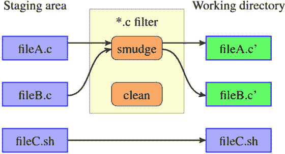
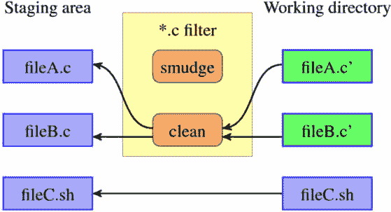
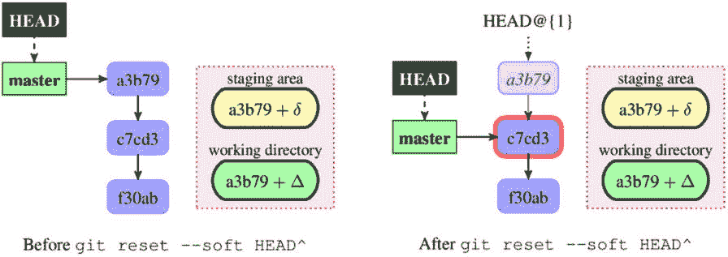
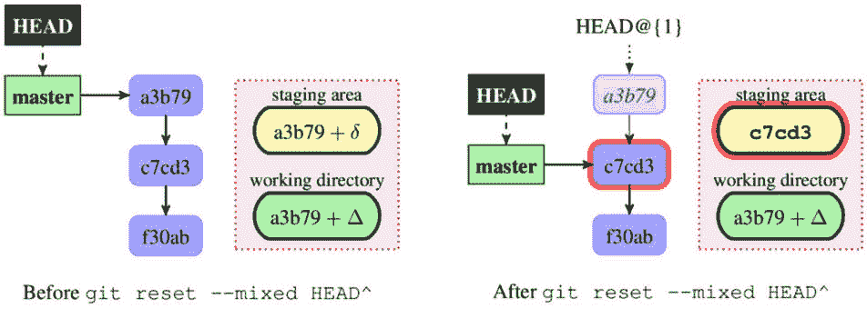
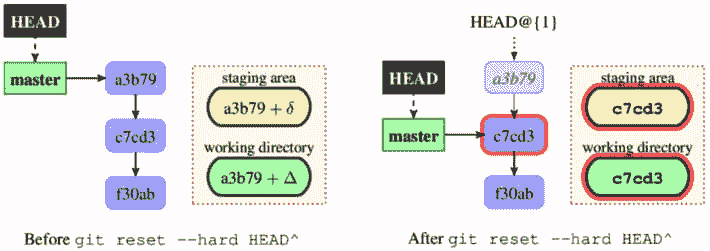

# 第三章：管理你的工作树

前一章《使用 Git 开发》描述了如何使用 Git 进行项目开发，包括如何创建新的修订。在本章中，我们将重点学习如何管理工作目录（工作树），以便你为新的提交准备内容。本章将详细教你如何管理文件，还将展示如何处理那些需要特殊处理的文件，同时介绍忽略文件和文件属性的概念。然后，你将学习如何修复处理文件时的错误，无论是在工作目录还是在暂存区中，以及如何修复或拆分最新的提交。最后，你将学习如何通过暂存和多个工作目录安全地处理中断。

前一章还教了你如何检查更改。在本章中，你将学习如何有选择地撤销和重做这些更改，以及如何查看文件的不同版本。

本章将涵盖以下主题：

+   忽略文件 – 将文件标记为故意不受版本控制

+   文件属性 – 路径特定配置

+   使用**git** **reset** 命令的各种模式

+   将更改暂存以处理中断

+   管理工作目录的内容和暂存区

+   多个工作目录（工作树）

# 忽略文件

**工作区**（也称为**工作树**）中的文件可以被 Git 进行*跟踪*或*不跟踪*。**跟踪文件**顾名思义，是 Git 会跟踪其变化的文件。对于 Git 来说，如果文件存在于**暂存区**（也称为**索引**），它就会被跟踪，除非另行指定，否则它将成为下一个修订的一部分。你需要*添加*文件以使它们成为项目历史的一部分。

暂存区的作用

**索引**，或**暂存区**，不仅用于让 Git 知道哪些文件需要跟踪，还充当一种草稿区，用于创建新的**提交**，正如在**第二章**《使用 Git 开发》中所描述的，并且帮助解决合并冲突，正如在**第九章**《合并变更》中所展示的。

通常，你会有一些单独的文件或一类文件，你永远不希望它们成为项目历史的一部分，也不希望它们被跟踪。这些文件可能是你的编辑器备份文件，或者是由项目的构建系统自动生成的文件（可执行文件、目标文件、压缩后的源文件、源映射文件等）。

你不希望 Git 自动添加这些文件，例如，在执行`git add :/`（添加整个工作区）或使用`git add .`（添加当前目录）时，或者在使用`git add --all`将索引更新为工作区的状态时。

完全相反：你希望 Git 能主动防止你不小心将它们添加进去。你还希望这些文件不出现在`git status`的输出中，因为它们可能很多，否则它们会淹没那些合法的、*未知*的文件。你希望这些文件被故意不追踪——也就是说，*被忽略*。

取消追踪和重新追踪文件

如果你想开始忽略一个曾经被追踪的文件，例如，当你从手工生成的 HTML 文件转向使用轻量级标记语言如**Markdown**时，通常需要**取消追踪**该文件，而不是将其从工作目录中删除，同时将其添加到忽略文件的列表中。你可以使用**git rm --cached <file>**来执行此操作（如**git status**的输出所示）。此命令会将指定的文件从暂存区移除。

要添加（开始追踪）一个故意不追踪的（即被忽略的）文件，你需要使用**git add --force <file>**，因为 Git 会提示你。

## 标记文件为故意不追踪（忽略）

如果你想将一个文件或一组文件标记为故意忽略，你需要将一个**shell glob 模式**添加到以下**gitignore**文件中的其中一个，每行一个模式：

+   每个用户的文件，可以通过**core.excludesFile**配置变量指定。如果没有设置此配置变量，则使用默认值**$XDG_CONFIG_HOME/git/ignore**。如果**$XDG_CONFIG_HOME**环境变量未设置或为空，则默认使用**$HOME/.config/git/ignore**（其中**$HOME**是当前用户的主目录）。

+   本地仓库中的**$GIT_DIR/info/exclude**文件，该文件位于本地克隆仓库的管理区域中（在大多数情况下，**$GIT_DIR**指向项目顶级目录中的**.git/**目录）。

+   项目工作目录中的**.gitignore**文件。通常这些文件是被追踪的，在这种情况下，它们会在所有开发者之间共享。

一些命令，如`git clean`，也允许我们通过命令行指定忽略模式，使用`--exclude=<pattern>`选项。

在决定是否忽略一个路径时，Git 会按照前面列表中指定的顺序检查所有这些来源，最后一个匹配的模式决定最终结果。`.gitignore`文件会按照顺序检查，从项目的顶级目录一直到要检查的文件所在的目录。

为了使`.gitignore`文件更具可读性，你可以使用空行将文件分组（空行不匹配任何文件）。你还可以用注释描述模式或模式组；以哈希字符`#`开头的行作为注释（要忽略以`#`开头的模式，可以用反斜杠`\`转义第一个哈希字符，例如`\#*#`）。行尾的空格会被忽略，除非用反斜杠`\`进行转义。

`.gitignore` 文件中的每一行指定了一个 Unix glob 模式，也就是 shell 通配符。`*` 通配符匹配零个或多个字符（任意字符串），而 `?` 通配符匹配任何单个字符。你还可以使用带有括号的字符类 `[...]`。例如，以下是一些模式列表：

```
*.[oa]
*~
```

这里，第一行告诉 Git 忽略所有扩展名为 `.a` 或 `.o` 的文件——`*.a` 文件是归档文件（例如静态库），而 `*.o` 文件是目标文件，可能是你编译代码时生成的文件。第二行告诉 Git 忽略所有以波浪号（`~`）结尾的文件；许多 Unix 文本编辑器使用波浪号来标记临时备份文件。

如果模式不包含斜杠 `/`（斜杠是路径组件分隔符），Git 会将其视为 `.gitignore` 文件的位置，如果模式出现在这样的文件中，或者如果不在文件中，则视为仓库的顶级目录）。唯一的例外是以斜杠结尾的模式 `/`，它用于只匹配目录，否则会像去掉结尾斜杠一样处理。

前导斜杠匹配路径名的开头。这意味着以下内容：

+   不包含斜杠的模式会匹配整个仓库；我们可以说，这种模式是递归的。

    例如，`*.o` 模式匹配任何地方的目标文件，包括 `.gitignore` 文件所在的目录以及 `file.o`、`obj/file.o` 等子目录中的文件。

+   以斜杠结尾的模式只匹配目录，但在其他情况下是递归的（除非它们包含其他斜杠）。

    例如，`auto/` 模式会匹配顶级的 `auto` 目录和 `src/auto` 目录，但不会匹配 `auto` 文件（也不会匹配符号链接）。

+   要*锚定*一个模式并使其非递归，可以在前面加一个斜杠。

    例如，`/TODO` 模式会匹配并使 Git 忽略当前级别的 `TODO` 文件，但不会忽略子目录中的文件，比如 `src/TODO`。

+   包含斜杠的模式是锚定的，并且是非递归的，通配符（`doc/*.html` 匹配 `doc/index.html` 文件，但不匹配 `doc/api/index.html`；要匹配 `doc` 目录下的任何 HTML 文件，你可以使用 `doc/**/*.html` 模式（或者将 `*.html` 模式放入 `doc/.gitignore` 文件中）。

你还可以通过在模式前加上感叹号（`!`）来否定一个模式；任何被之前规则排除的匹配文件将会重新被包含（不再被忽略）。例如，如果你想忽略所有生成的 HTML 文件，但包括手动生成的那个 HTML 文件，可以在`.gitignore`文件中写入以下内容：

```
# ignore html files, generated from AsciiDoc sources
*.html
# except for the files below which are generated by hand
!welcome.html
```

注意

出于性能考虑，Git 不会进入被排除的目录，并且（直到 *Git 2.7*）这意味着如果父目录被排除，你不能重新包含一个文件。

这意味着，要忽略除了子目录以外的所有内容，你需要写下以下内容：

```
# exclude everything except directory t0001/bin
/*
!/t0001
/t0001/*
!/t0001/bin
```

要匹配以`!`开头的模式，使用反斜杠进行转义，类似于你需要为`#`字符做的事情——例如，使用`\!important!.md`模式来匹配名为`!important!.md`的文件。

## 哪些类型的文件应该被忽略？

现在我们知道如何将文件标记为故意未被追踪（被忽略），但接下来我们要考虑的问题是*哪些*文件（或文件类别）应该被标记为这样。另一个问题是*我们应该在哪里*添加忽略特定类型文件的模式——也就是说，在三种类型的`.gitignore`文件中的哪一个里。

第一个规则是，你绝不应该追踪*自动生成的文件*（通常是项目构建系统生成的文件）。如果你将这些文件添加到仓库中并追踪它们，那么它们与源文件之间很可能会出现不同步的情况。此外，它们并不是必需的，因为你总是可以重新生成它们。唯一的例外情况是那些源文件很少变化且生成它们需要额外工具（开发者可能没有的工具）的生成文件（如果源文件变化更频繁，你可以使用孤立分支来存储这些生成的文件，并且只在发布时更新该分支；详情请参见*第二章*，*与 Git 一起开发*章节，*创建孤立分支*部分了解更多信息）。

这些自动生成的文件是*所有开发者*都会想要忽略的文件。因此，它们应该放入一个受版本控制的`.gitignore`文件中。这个模式列表会被版本控制，并通过克隆分发给其他开发者；这样，所有开发者都会得到它。你可以在[`github.com/github/gitignore`](https://github.com/github/gitignore)找到不同编程语言的有用`.gitignore`模板，或者你可以使用[`gitignore.io`](https://gitignore.io)上的网络应用。

第二类是*临时文件*和特定于某一用户工具链的副产品；这些通常不应该与其他开发者共享。如果模式同时特定于仓库和用户——例如，存在于仓库内但只对某个用户的工作流（例如，用于项目的 IDE）特有的辅助文件——则应将其放入每个克隆的`$GIT_DIR/info/exclude`文件中。

用户希望在所有情况下都忽略的、与仓库（或项目）无关的模式，通常应放入每个用户的`.gitignore`文件中，该文件通过`core.excludesFile`配置变量指定，并在每个用户（全局）的`~/.gitconfig`配置文件（或`~/.config/git/config`）中设置。默认情况下，这通常是`~/.config/git/ignore`。

关于每个用户的.gitignore 文件的重要说明

每个用户的忽略文件不能是**~/.gitignore**，因为这将是版本化用户主目录的仓库内**.gitignore**文件，如果用户希望将**~/**目录（**$HOME**）纳入版本控制的话。

这是您可以放置与备份或临时文件匹配的模式的地方，这些文件是由您选择的编辑器或 IDE 生成的。

被忽略的文件被视为可丢弃的

警告：不要将*宝贵的文件*（即那些您不希望在特定仓库中追踪，但其内容很重要的文件）添加到被忽略的文件列表中！Git 忽略（排除）的文件类型要么容易再生成（如构建产物和其他生成的文件），要么对用户不重要（如临时文件或备份文件）。

因此，Git 会将被忽略的文件视为*可丢弃的*，并且在执行所请求的命令时，如果被忽略的文件与正在检出的修订内容冲突，Git 会在没有警告的情况下删除它们。

## 列出被忽略的文件

您可以通过将`--ignored`选项附加到`git` `status`命令，列出未被追踪的被忽略文件：

```
$ git status --ignored
On branch master
Ignored files:
  (use "git add -f <file>..." to include in what will be committed)
        rand.c~
no changes added to commit (use "git add" and/or "git commit -a")
$ git status --short --branch --ignored
## master
!! rand.c~
```

与其使用`git status --ignored`，您可以使用清理被忽略文件的干运行选项`git clean -Xnd`，或者使用底层（plumbing）`git ls-files`命令：

```
$ git ls-files --others --ignored --exclude-standard
rand.c~
```

后一个命令还可以用于列出匹配*忽略模式*的*已追踪文件*。如果有此类文件，可能意味着某些文件需要取消追踪（也许是因为曾经是源文件的文件现在是生成文件），或者忽略模式过于宽泛。由于 Git 使用暂存区（*缓存*）中文件的存在来确定要追踪哪些文件，您可以通过以下命令实现这一操作：

```
$ git ls-files --cached --ignored --exclude-standard
```

如此处所示的空结果意味着一切正常。

Plumbing 命令与 porcelain 命令

Git 命令可以分为两组：面向最终用户交互使用的高级**porcelain**命令和主要用于 shell 脚本的低级**plumbing**命令。它们的主要区别在于，高级命令的输出可能会改变并不断改进。例如，**git branch**命令在分离**HEAD**的情况下，其输出从（**no branch**）变为（**detached from HEAD**）。它们的输出和行为还会受到配置的影响。请注意，某些 porcelain 命令可以通过**--porcelain**选项切换到不变的输出。

另一个重要的区别是，plumbing 命令试图猜测您的意图，它们有默认参数，使用默认配置，等等。但 plumbing 命令并非如此。您需要为**git ls-files**命令传递**--exclude-standard**选项，以使其尊重默认的忽略文件集。

您可以在*第十三章*中找到更多关于此主题的内容，*自定义和扩展 Git*。

## 技巧 – 忽略已追踪文件的更改

你可能在仓库中有一些已更改但很少提交的文件。这些可能是各种本地配置文件，用于匹配本地设置，但永远不应该提交到上游。这可以是一个包含新版本提议名称的文件，等到标记下一个发布版本时再提交。

你通常会希望将这些文件保持在*脏*状态，但你希望 Git 不会一直告诉你它们的更改，以免你忽略其他更改，因为你已经习惯了忽略这些消息。

脏的工作目录

如果工作目录与已提交和已暂存的版本相同，则被认为是**干净**的；如果有任何修改或更改，则被认为是**脏**的。

Git 可以被配置——或者说在这种情况下被“欺骗”——跳过检查工作区（假定它始终是最新的），并使用文件的暂存版本。可以通过为文件设置恰当命名的`skip-worktree`标志来实现这一点。为此，你需要使用底层的`git update-index`命令，它是用户界面中`git add`命令的底层实现。你可以使用`git ls-files`来检查文件的状态和标志，标有此标志的文件会显示字母`S`：

```
$ git update-index --skip-worktree GIT-VERSION-NAME
$ git ls-files -v
S GIT-VERSION-NAME
H …
```

请注意，这种跳过工作区的做法也包括`git stash`命令；如果你想将更改暂存并使工作目录保持*干净*，你需要禁用此标志（至少是暂时禁用）。要让 Git 查看工作目录版本并开始跟踪文件的更改，请使用以下命令：

```
$ git update-index --no-skip-worktree GIT-VERSION-NAME
```

这个问题是由于`skip-worktree`标志的使用不当所导致的；该标志是为了管理所谓的稀疏检出（sparse checkout）而创建的，更多内容请参见*第十二章*，*管理* *大型代码库*。

重要说明

还有一个类似的**assume-unchanged**标志，可以用来让 Git 完全忽略文件的任何更改，或者说是*假定文件未更改*。标记此标志的文件在**git status**或**git diff**命令的输出中永远不会显示为已更改。对这些文件的更改既不会被暂存，也不会被提交。

当你在一个文件系统上处理一个大项目，而这个文件系统检查更改的速度非常慢时，这有时是有用的。然而，千万不要使用**assume-unchanged**来*忽略*已追踪文件的更改。你是在向 Git 保证文件没有更改，实际上是在欺骗 Git。这意味着，举个例子，如果你使用**git stash save**并相信你所说的内容，你会丢失宝贵的本地更改。

# 文件属性

Git 中有一些设置和选项，可以按路径指定，这类似于忽略文件（将文件标记为故意不跟踪）的方法。这些按路径指定的设置被称为**属性**。

要为匹配给定模式的文件指定属性，需要在一个 `.gitignore` 文件中添加一行，包含模式，空格分隔，后面跟着一个由空格分隔的属性列表。

+   每个用户的文件，用于影响单个用户的所有仓库的属性，由 **core.attributesFile** 配置变量指定。默认情况下，这是 **~/.config/git/attributes**。

+   本地克隆仓库的管理区域中的每个仓库**.git/info/attributes**文件，用于那些只应影响特定克隆仓库（某个用户工作流程）的属性。

+   项目工作目录中的 **.gitattributes** 文件，用于那些应该在开发者之间共享的属性。

用于匹配文件的模式规则与 `.gitignore` 文件中描述的规则相同，只是没有对负模式的支持，并且匹配目录的模式不会递归地匹配该目录中的路径。

对于给定路径，每个属性可以处于以下状态之一：已设置（特殊值 true）、未设置（特殊值 false）、设置为给定值，或未指定：

```
pattern*  set -unset set-to=value !unspecified
```

注意

设置属性为字符串值时，**=** 周围不能有空格！

当多个模式匹配路径时，后面的行会在每个属性的基础上覆盖前面的行。`.gitattributes` 文件按顺序使用，从每个用户的文件，到每个仓库的文件，再到给定目录中的 `.gitattributes` 文件，像 `.gitignore` 文件一样。

## 识别二进制文件和行尾转换

不同的操作系统和不同的应用程序在表示文本文件中的换行符时可能有所不同。Unix 和类 Unix 系统（包括 Mac OS X）使用单一的控制字符 LF (`\n`)，而 Windows 使用 CRLF —— 即 CR 后跟 LF (`\n\r`)；直到版本 9，macOS 使用的是仅 CR (`\r`)。

如果不同的开发者使用不同的操作系统，这可能会成为开发可移植应用程序的一个问题。我们不希望因为不同的行尾约定而产生多余的更改。因此，Git 使得可以在提交（check-in）时自动将行尾字符标准化为 LF，并可选择在检出时将其转换为 `CR + LF`。

你可以使用 `text` 属性控制文件是否应考虑进行行尾转换。设置它会启用行尾转换，取消设置则会禁用。将其设置为 `auto` 值时，Git 会猜测给定的文件是否是文本文件；如果是，行尾转换将启用。对于那些未指定 `text` 属性的文件，Git 会使用 `core.autocrlf` 来决定是否将其视为 `text=auto` 情况。

Git 如何检测文件是否包含二进制数据

为了判断一个文件是否包含二进制数据，Git 会检查文件开头是否有零字节（**null**/**NUL** 字符或 **\0**）。在决定是否转换文件（例如行尾转换）时，标准会更加严格：如果一个文件要被认为是文本文件，它必须没有 null 字符，并且非可打印字符的比例不能超过大约 1%。

然而，这意味着 Git 通常会将以 UTF-16 编码保存的文件视为二进制文件。

要决定 Git 在工作目录中为文本文件使用哪种行尾类型，你需要设置 `core.eol` 配置变量。该变量可以设置为 `crlf`、`lf` 或 `native`（默认值为 `native`）。你也可以为特定文件强制指定某种行尾格式，通过 `eol=lf` 或 `eol=crlf` 属性：

| **旧的** **crlf 属性** | **新的文本和** **eol 属性** |
| --- | --- |
| `crlf` | `text` |
| `-``crlf` | `-``text` |
| `crlf=input` | `eol=lf` |

表 3.1 – `text` 和 `eof` 属性与 `crlf` 属性的向后兼容性

行尾转换有轻微的损坏数据的风险。如果你希望 Git 在文件包含混合的 `LF` 和 `CRLF` 行尾时发出警告或阻止转换，可以使用 `core.safecrlf` 配置变量。

有时，Git 可能无法正确检测一个文件是否为二进制文件，或者有一些文件虽然名义上是文本文件，但对人类读者来说是不可读的。例如 PostScript 文档（`*.ps`）和 Xcode 构建设置（`*.pbxproj`）。这种类型的文件不应进行规范化，对它们使用文本 `diff` 是没有意义的。你可以通过 `binary` 属性宏显式标记这些文件为二进制文件（这相当于 `-``text -diff`）：

```
*.ps binary
*.pbxproj binary
```

如果文件未进行行尾规范化，应如何处理

当在仓库中启用行尾规范化（通过编辑 **.gitattributes** 文件）时，你还应该强制进行文件的 **规范化**。否则，换行符表示的变化将被错误地归因于下一个文件更改。例如，可以使用 **git add --renormalize** 命令来完成这项工作。当改变哪些文件具有 **text** 属性时，也应当执行此操作。

## Diff 和合并配置

在 Git 中，你可以使用属性功能来配置如何显示文件不同版本之间的差异，以及如何进行三方合并。这可以用来增强该操作，使得 `diff` 更具吸引力，`merge` 更不容易发生冲突。它甚至可以用来有效地进行二进制文件的 `diff`，或者以特定的方式描述差异。

在这两种情况下，我们通常需要设置`diff`和/或`merge`驱动程序。属性文件仅告诉我们使用哪个驱动程序；其余的信息包含在配置文件中，而这个配置不会自动在开发者之间共享，这与`.gitattributes`文件不同（尽管你可以创建一个共享的配置片段，将其添加到仓库中，并让开发者通过相对的`include.path`将其包含到本地的每个仓库配置中）。这种行为的原因很容易理解——工具的配置可能在不同的计算机上不同，并且某些工具可能在开发者选择的操作系统上不可用。但这意味着一些信息需要通过外部渠道分发。

然而，有一些内置的**diff 驱动程序**和**合并驱动程序**，任何人都可以在不做进一步配置的情况下使用它们。

### 生成差异和二进制文件

为特定文件生成的差异会受到`diff`属性的影响。如果未设置此属性，Git 会将文件视为二进制文件来生成差异，并仅显示`\``0`)字符。

你可以使用`diff`属性，通过`diff`命令使 Git 更有效地描述二进制文件的两个版本之间的差异。尽管转换为文本通常会丢失一些信息，但结果的差异对于人类查看是有用的（尽管它不是关于所有更改的信息）。

这可以通过`diff`驱动程序的`textconv`配置项来完成，在该项中你指定一个程序，该程序将文件名作为参数并返回其文本表示。

例如，你可能希望查看 Microsoft Word 文档的内容差异，或查看 JPEG 图像的元数据差异。首先，你需要在`.gitattributes`文件中添加类似这样的内容：

```
*.doc  diff=word2text
*.jpg  diff=exif
```

例如，你可以使用`catdoc`程序从二进制 Microsoft Word 文档中提取文本，使用`exiftool`从 JPEG 图像中提取 EXIF 元数据。

由于转换可能会比较慢，Git 提供了一种机制，将输出缓存为布尔类型的`cachetextconv`属性；缓存的数据通过**notes**存储（此机制将在*第十章*中解释，*保持历史记录清晰*）。负责此设置的配置文件部分如下所示：

```
[diff "word2text"]
    textconv = catdoc
# cached data will be stored in refs/notes/textconv/exif
[diff "exif"]
    textconv = exiftool
    cachetextconv = true
```

你可以使用`git show`或带有`--textconv`选项的`git cat-file -p`来查看`textconv`过滤器的输出效果。

更复杂但也更强大的选项是使用`GIT_EXTERNAL_DIFF`环境变量或`diff.external`配置变量，并结合`diff`驱动的`command`选项。然而，选择使用此选项时，你会失去一些 Git `diff`免费提供的功能：上色、单词差异和合并时的合并差异。

这样的程序将用七个参数调用：`path`、`old-file`、`old-hex`、`old-mode`、`new-file`、`new-hex`和`new-mode`。在这里，`old-file`和`new-file`是`diff`驱动程序可以用来读取两个不同版本文件内容的文件，`old-hex`和`new-hex`是文件内容的 SHA-1 标识符，`old-mode`和`new-mode`是文件模式的八进制表示。该命令预计将生成类似`diff`的输出。例如，你可能想使用支持 XML 的`diff`工具来比较 XML 文件：

```
$ echo "*.xml diff=xmldiff" >>.gitattributes
$ git config diff.xmldiff.command xmldiff-wrapper.sh
```

本示例假设你已经编写了`xmldiff-wrapper.sh`脚本来重新排序选项，以便它们符合 XML `diff`工具的期望。

### 配置 diff 输出

Git 用于显示更改的`diff`格式在*第二章*中已经详细描述，*使用 Git 开发*。每一组更改（称为 hunk）在文本`diff`输出中都以 hunk 头部行开始，如下所示：

```
@@ -18,6 +19,8 @@ int cmd_http_fetch(int argc, const char **argv,
```

第二个`@@`后的文本是用来描述文件中该块所在的部分；对于 C 源文件，它是函数的开始。如何检测该部分的开始取决于文件的类型。Git 允许你通过设置`diff`驱动程序的`xfuncname`配置选项为正则表达式来配置这一点，该正则表达式与文件部分的描述相匹配。例如，对于 LaTeX 文档，你可能想为`tex` `diff`驱动程序使用以下配置（你不需要这么做，因为`tex`是预定义的内置`diff`驱动程序之一）：

```
[diff "tex"]
    xfuncname = "^(\\\\(sub)*section\\{.*)$"
    wordRegex = "\\\\[a-zA-Z]+|[{}]|\\\\.|[^\\{}[:space:]]+"
```

`wordRegex`配置定义了什么是`word`，并为`git diff --word-diff`命令（在*第二章*中描述，*使用 Git 开发*，接近*统一 diff 输出*部分的末尾）定义了它。这里，它用于 LaTeX 文档。

注意

你需要将反斜杠加倍：**\\**匹配字面量反斜杠**\**，因此在正则表达式中需要使用**\\\\**（这在存储正则表达式字符串时是典型的做法）。

### 执行三方合并

你还可以使用`merge`属性告诉 Git 为项目中的特定文件或文件类别使用特定的合并策略。默认情况下，Git 将为文本文件使用三方合并驱动程序（类似于`rcsmerge`），并将我们的（被合并的）版本标记为二进制文件的冲突合并结果。你可以通过设置`merge`属性（或使用`merge=text`）强制三方合并；你可以通过取消设置此属性（使用`-merge`，相当于`merge=binary`）强制进行类似二进制的合并。

你还可以在你的代码库中编写`ChangeLog`文件（包含有描述的变更列表），并使用来自 G**NU 可移植库**(**Gnulib**)的`git-merge-changelog`命令。你需要在适当的 Git 配置文件中添加以下内容：

```
[merge "merge-changelog"]
    name = GNU-style ChangeLog merge driver
    driver = git-merge-changelog %O %A %B
```

在这里，`merge.merge-changelog.driver`中的令牌`%O`将展开为包含合并祖先（旧版本）内容的临时文件的名称。`%A`和`%B`令牌分别展开为包含正在合并的内容的临时文件的名称——即当前（我们的，已合并）版本和其他分支（他们的，已合并）版本。`merge`驱动程序预计会将合并后的版本保留在`%A`文件中，如果发生合并冲突，将以非零状态退出。你还可以使用`%L`来表示冲突标记的大小，并使用`%P`查找合并结果将存储的路径名。

注意

你可以为常见祖先之间的内部合并使用不同的驱动程序（当有多个祖先时）。你可以通过为给定驱动程序设置**merge.*.recursive**配置变量来实现这一点。例如，在这里，你可以使用预定义的**binary**驱动程序。

当然，你还需要告诉 Git 使用此驱动程序处理`ChangeLog`文件，将以下行添加到`.gitattributes`中：

```
ChangeLog merge=merge-changelog
```

## 转换文件（内容过滤）

有时，你想放入版本控制系统中的内容格式可能取决于它存储的位置，无论是在磁盘上还是在仓库中，不同位置的格式对 Git、平台（操作系统）、文件系统和用户来说更方便使用。换行符转换可以视为此类操作的一个特例。

为此，你需要为适当的路径设置`filter`属性，并配置指定过滤器驱动程序的`clean`和`smudge`命令（对于通行过滤器，可以不指定任何一个命令）。当检出与给定模式匹配的文件时，`smudge`命令会将来自仓库的文件内容作为标准输入传递给它，标准输出用于更新工作目录中的文件。详情请参见*图 3.1*：



图 3.1 – 当检出（写入文件到工作目录）时，运行“smudge”过滤器

同样，过滤器的`clean`命令用于将工作树文件的内容转换为适合存储在仓库中的格式；请参见*图 3.2*：



图 3.2 – 当文件被暂存（添加到索引，也称为暂存区）时，将运行“clean”过滤器。

在指定命令时，你可以使用`%f`令牌，它将被过滤器正在处理的文件名替换。

一个简单的示例是如何使用此功能：使用`rezip`脚本处理**OpenDocument 格式**（**ODF**）文件。ODF 文档是主要包含 XML 文件的 ZIP 归档。Git 本身使用压缩，并且也进行增量存储（但不能对已压缩的文件进行增量存储）；其理念是将未压缩的文件存储在仓库中，但检出时使用压缩文件：

```
[filter "opendocument"]
    clean = "rezip -p ODF_UNCOMPRESS"
    smudge = "rezip -p ODF_COMPRESS"
```

当然，你还需要告诉 Git 为所有类型的 ODF 文件使用此过滤器：

```
*.odt filter=opendocument
*.ods filter=opendocument
*.odp filter=opendocument
```

*建议性*过滤器的另一个示例是使用`indent`程序强制代码格式约定，如下例所示，或者使用 Go 编程语言的`gofmt`。另一个类似的示例是，在提交时将制表符替换为空格：

```
[filter "indent"]
    clean = indent
```

另一个示例是`nbdev_clean`命令，用于从**Jupyter Notebook**文件中去除元数据和单元格输出。这样做是为了减少合并冲突的数量，并避免将生成的数据存储在仓库中。

### 强制性文件转换

内容过滤的另一个用途是将无法直接使用的内容存储在仓库中，并在检出时将其转化为可用的形式。

一个这样的示例可能是使用`.gitattributes`文件配置 Git，以便将大型二进制文件存储在 Git 仓库之外（这些文件通常只有一部分开发者使用）；仓库内部只有一个标识符，用来从外部存储获取文件内容。这就是`git-media`的工作原理：

```
$ git config filter.media.clean  "git-media filter-clean"
$ git config filter.media.smudge "git-media filter-smudge"
$ echo "*.mov filter=media -crlf" >> .gitattributes
```

提示

你可以在[`github.com/alebedev/git-media`](https://github.com/alebedev/git-media)找到**git-media**工具。其他类似工具将在*第十二章*，*管理大型仓库*中提到，作为处理大型文件问题的可能解决方案之一。

另一个强制性转换的示例是加密敏感内容，或者用占位符替换本地应用程序配置中所需的敏感程序配置（例如，数据库密码）。因为运行此类过滤器，像前述示例中一样，*是必需的*，才能获得有用的内容，所以你可以标记为必需：

```
[[filter "clean-password"]
    clean = sed -e 's/^pass = .*$/pass = @PASSWORD@/'
    smudge = sed -e 's/^pass = @PASSWORD@/pass = passw0rd/'
    required
```

重要提示

这只是一个简化的示例；在实际使用中，如果你这么做或者将真实的密码存储在外部`smudge`脚本中，你还必须考虑配置文件本身的安全性。在这种情况下，你还应该设置**pre-commit**、**pre-push**和**update**钩子，以确保密码不会泄露到公开的仓库中（详情请见*第十三章*，*自定义与扩展 Git*）。

如果需要处理许多文件，而调用和运行`clean`和`smudge`脚本所需的时间成为问题，你可以配置 Git，使用一个程序，通过单次调用过滤器处理所有文件，整个 Git 命令生命周期内都使用该过滤器。你可以用`process`键定义这样一个过滤器，代替`clean`和`smudge`。

## 关键字扩展与替换

然而，虽然很少见，但有时确实需要在文件内容中包含版本化文件的动态信息。为了保持此类信息的最新状态，您可以要求版本控制系统执行 `$Keyword$`，即将关键字放在美元符号（keyword anchor）内。通常，版本控制系统会将其替换为 `$Keyword: value$`，其中 `Keyword` 是关键字，`value` 是其扩展值。

在 Git 中执行此操作的主要问题是，无法在提交之后修改存储在版本库中的文件内容和提交信息，这是由于 Git 的工作原理所决定的（更多信息请参考*第十章*，*保持历史清洁*）。这意味着关键字锚点必须原样存储在版本库中，并且只有在签出时才会在工作树中展开。然而，这也是一个优势；在检查历史记录时，不会因关键字扩展而产生无关的差异。

Git 支持的唯一内建关键字是 `$Id$`：其值是文件内容的 SHA-1 标识符（表示文件内容的 blob 对象的 SHA-1 校验和，与文件的 SHA-1 不同；有关如何构建对象的详细信息，请参考*第十章*，*保持历史清洁*）。您需要通过为文件设置 `ident` 属性来请求此关键字扩展。

然而，您可以在定义 `smudge` 命令时编写自己的关键字扩展支持，通过适当的 `filter`，该命令将扩展关键字，`clean` 命令则会将扩展后的关键字替换回其关键字锚点。

使用此机制，您可以例如实现对 `$Date$` 关键字的支持，在签出时将其扩展为文件最后修改的日期：

```
[filter "dater"]
    clean = sed -e 's/\\\$Date[^\\\$]*\\\$/\\\$Date\\\$/'
    smudge = expand_date %f
```

`expand_date` 脚本可以将文件名作为参数传递，运行 `git log --pretty=format:"%ad" "$1"` 命令来获取替换值，例如。

但是，您需要记住另一个限制：为了提高性能，Git 不会触及没有改变的文件，无论是在提交时、切换分支时（签出时）还是回滚分支时（重置时）。这意味着此技巧无法支持项目最后修订日期的关键字扩展（与更改文件的最后一次修订不同）。

如果您需要在分布式源中获取此类信息（例如，当前提交的描述，或自标签发布以来的时间），您可以将其作为构建系统的一部分，或使用 `git archive` 命令。后者是一个相当通用的功能：如果为文件设置了 `export-subst` 属性，Git 会在将文件添加到归档时展开 `$Format:<PLACEHOLDERS>$` 这种通用关键字。

使用 `export-subst` 的关键字扩展的限制

**$Format$**元关键字的扩展取决于修订标识符的可用性；例如，如果您将树对象的 SHA-1 标识符传递给**git** **archive**命令，就无法完成此操作。

占位符与`git log`的`--pretty=format:`自定义格式相同，这些格式在*第四章* *探索项目历史*中有描述。例如，`$Format:%H$`字符串将被*替换*（而非展开）为提交哈希值。这是一种不可逆的关键字替换；在存档（导出）操作的结果中不会留下关键字的任何痕迹。

## 其他内置属性

您还可以告诉 Git 在生成存档时不添加某些文件或目录。例如，在面向用户的存档中，您可能不希望包含包含分发测试的目录，这些测试对开发者有用，但对最终用户没有用（这些测试可能需要额外的工具或检查程序质量，而不是检查应用程序行为的正确性）。可以通过设置`export-ignore`属性来完成此操作，例如，向`.gitattributes`文件添加以下行：

```
# Do not include extra tests in the archive
xt/  export-ignore
```

使用文件属性还可以配置`diff`和`apply`应如何考虑`core.whitespace`配置变量。请注意，列出应关注的常见空白问题时，在`.gitattributes`文件中应使用逗号作为元素分隔符，并且没有任何周围的空白。请参见以下示例（摘自 Git 项目）：

```
* whitespace=!indent,trail,space
*.[ch] whitespace=indent,trail,space
*.sh whitespace=indent,trail,space
```

使用文件属性，您还可以指定`encoding`属性。Git 可以使用它来选择如何在 GUI 工具中显示文件（例如，`gitk`和`git gui`）。这是`gui.encoding`配置变量的精细版本，并且仅在出于性能考虑明确要求时使用。例如，保存翻译的 GNU gettext **可移植对象**（**.po**）文件应使用 UTF-8 编码：

```
/po/*.po encoding=UTF-8
```

要使 Git 在暂存区和仓库之间进行 UTF-8 编码转换，并指定工作目录中检出文件的编码，可以使用`working-tree-encoding`属性。例如，要让`diff`和其他命令正常工作，您可能想要使用以下命令：

```
*.ps1 text working-tree-encoding=UTF-16LE eol=CRLF
```

注意

重新编码可能会减慢某些 Git 操作。

## 定义属性宏

在*识别二进制文件和行尾转换*部分，我们学习了如何使用`binary`属性标记二进制文件。`binary`属性是`-diff -merge -text`（取消设置这三个文件属性）。定义这种宏以支持属性的任意组合会非常有用。一个给定类型的文件可以匹配多个模式，但一个`.gitattributes`行只能包含一个文件模式。如果我们希望不同类型的文件具有相同的属性，属性宏可以避免重复。

Git 允许我们定义这样的宏，但仅限于顶层的`.gitattributes`文件，即`core.attributesFile`、`.git/info/attributes`，或者项目的主（顶层）目录下的`.gitattributes`文件。内置的`binary`宏可以这样定义：

```
[attr]binary -diff -merge -text
```

你也可以定义自己的属性。在这种情况下，你可以使用`git check-attr`命令以编程方式检查给定文件设置了哪些属性，或者一组文件的某个属性值是什么。

# 使用重置命令修复错误

在开发的任何阶段，你可能想使用`git undo`命令，但核心 Git 中并没有这个命令，Git 命令中也没有支持通用的`--undo`选项，尽管许多命令都有`--abort`选项用于放弃当前的**工作进度**（**WIP**）。没有这种命令或选项的原因之一是对于需要撤销的内容没有明确的定义（特别是对于多步骤操作）。

许多错误可以通过`git reset`命令来修复。它可以用于多种目的和方式；理解该命令的工作原理将帮助你在任何情况下使用它，使用场景不限于提供的示例。

请注意，本节仅涉及`git reset`的完整树模式；`git reset -- <file>`的作用（这是使用更现代的`git restore <file>`命令的替代方式）已被留到本章末尾的*管理工作区和暂存区*部分。

## 回滚分支头，软重置

`git reset`命令在其完整树模式下会影响当前分支头，也可能影响索引（暂存区）和工作目录。这个重置不会改变当前分支，与`git checkout`或`git switch`不同。

要仅重置当前分支头，而不触及索引或工作区，你可以使用`git reset --soft [<revision>]`（如果没有给定修订版本，它默认是`HEAD`）：



图 3.3 – 软重置前后

实际上，我们只是将当前分支（示例中是`master`，见*图 3.3*）的指针指向某个修订版本（示例中的`HEAD^`——上一个提交）。暂存区和工作目录不会受到影响。这使得所有已更改的文件（以及分支所指向的旧修订和新修订之间不同的所有文件）在`git status`中都会显示出来。

### 删除或修改提交

命令的工作方式意味着`git commit`有一个`--amend`选项。

让我们来看看以下命令：

```
$ git commit --amend [<options>]
```

这相当于以下操作：

```
$ git reset --soft HEAD^
$ git commit --reedit-message=ORIG_HEAD [<options>]
```

`git commit --amend` 命令也适用于合并提交，而不是使用软重置。在修改提交时，如果你只想修复提交消息，不会有其他选项。如果你想在不更改提交消息的情况下包括工作目录中的修复，可以添加 `--all --no-edit`。如果你想在修正 Git 配置后修复作者信息，可以使用 `--reset-author --no-edit`。

你已经在 *第二章*《使用 Git 开发》中学习过如何通过修改提交来更改修订图，在 *修改提交* 部分。

### 使用重置压缩提交

你并不局限于将分支头回退到上一个提交。通过软重置，你可以将一些较早的提交合并（例如，提交和修复 bug，或引入新功能并使用它），将两个（或更多）提交合并为一个；另外，你也可以使用 `merge --squash` 的 `squash` 指令来实现这一点。

## 重置分支头和索引

`reset` 命令的默认模式——所谓的 **混合重置**（因为它介于软重置和硬重置之间）——会更改当前分支头，使其指向给定的修订，并且重置索引，将该修订的内容放入暂存区。此模式在 *图 3.4* 中显示：



图 3.4 – 混合重置前后的对比

这将把你所有更改过的文件（以及分支指向的旧修订与新修订之间的所有不同文件）保留在 `git status` 会显示的状态中。`git reset --mixed` 命令也会以简短的状态格式报告哪些内容没有更新：

```
$ git reset HEAD^
Unstaged changes after reset:
M       README.md
```

这种版本的 `reset` 命令可以用于例如撤销所有新增文件的操作。通过运行 `git reset`，如果你没有暂存任何更改（或者你可以接受丢失它们），就可以完成此操作。如果你想撤销某个特定文件的添加，可以使用 `git rm --cached <file>`。

### 使用重置将提交拆分为两部分

你可以使用混合重置将提交拆分为两部分。首先，运行 `git reset HEAD^` 将分支头和索引重置为之前的修订。然后，交互式地添加你想包含在第一个提交中的更改，之后从索引中创建第一个提交（`git add -i` 和 `git commit`）。然后，可以从工作目录状态中创建第二个提交（`git commit -a`）。

如果交互式地移除更改更容易，也可以选择这种方式。使用 `git reset --soft HEAD^`，通过交互式按文件撤销暂存的更改，在索引中创建第一个提交，然后从工作目录创建第二个提交。

在这里，同样地，就像压缩提交一样，你可以使用交互式 rebase 来进一步拆分历史中的提交。rebase 操作会切换到适当的提交点，此时可以进行实际的拆分，具体操作如这里所述。

### 使用 WIP 提交保存和恢复状态

假设你在开发分支上工作时被一个紧急的 bug 修复请求中断。你不想丢失更改，但工作树有点混乱，你也没有时间完成提交。一个可能的解决方案是通过创建临时提交来保存当前工作区的状态：

```
$ git commit -a -m 'snapshot WIP (Work In Progress)'
```

然后，你可以处理这个中断，切换到维护分支并创建一个提交来修复问题。此时，你需要返回到之前的分支（使用 checkout），将 WIP 提交从历史记录中移除（使用软重置），并返回到未暂存的起始状态（使用混合重置），如下所示：

```
$ git switch -
$ git reset --soft HEAD^
$ git reset
```

通常，使用`git stash`来处理中断会更加方便，详见本章的*暂存你的更改*部分。另一方面，暂时的提交可以与其他开发者共享，而不像 stash 那样（因为 stash 栈是基于纯本地数据的——reflog）。

## 丢弃更改并回退分支

有时，你的文件可能会变得一团糟，以至于你想丢弃所有更改，并将工作目录和暂存区（索引）恢复到最后一次提交的状态，即恢复到最后一个正常版本。在其他情况下，你可能想将仓库的状态回退到早期的版本。在这种情况下，**硬重置**是你需要的操作；它将更改当前分支的头指针，同时重置索引和工作树。任何对已跟踪文件的更改都会被丢弃：



图 3.5 – 硬重置前后的状态

这个命令可以用来撤销一个提交，就像它从未发生过一样，方法是将其移除。运行`git reset --hard HEAD^`将有效地丢弃最后一次提交（尽管它会在有限的时间内通过 reflog 可用），除非这个提交可以通过其他分支访问。

另一个常见的用法是使用`git reset --hard`丢弃工作目录中的更改，这将重置为最后一次提交的状态。

重要提示

需要非常注意的是，硬重置会不可恢复地删除暂存区和工作目录中的所有更改。你不能撤销此操作！更改将永远丢失！

### 将提交移动到功能分支

假设你正在`master`分支上工作，并且已经创建了一系列提交。你意识到你正在处理的功能更复杂，想要在一个单独的主题分支上继续完善它，正如在*第八章*中所描述的，*高级分支技巧*。你想把`master`中的所有提交（假设是最后三次修订）移动到前述的功能分支。

你需要创建功能分支，保存未提交的更改（如果有），回退`master`分支并移除其中的相关提交，然后切换到功能分支继续工作（或者你可以使用变基代替）：

```
$ git branch feature/topic
$ git stash
No local changes to save
$ git reset --hard HEAD~3
HEAD is now at f82887f before
$ git switch feature/topic
Switched to branch 'feature/topic'
```

当然，如果有本地更改需要保存（在前面的例子中没有），那么在这组命令执行之后，需要使用`git stash pop`。

### 撤销合并或拉取

硬重置也可以用于中止失败的合并。例如，如果你决定此时不想解决合并冲突，可以使用`git reset --hard HEAD`（此处，`HEAD`是修订版本的默认值，可以省略），虽然在现代 Git 中，你也可以使用`git merge --abort`代替。

你还可以使用`git reset --hard ORIG_HEAD`来移除一个成功的快进拉取操作或撤销变基（以及许多其他在移动分支头部时的操作）。（在这里，你可以使用`HEAD@{1}`代替`ORIG_HEAD`。）

## 更安全的重置 – 保留你的更改

硬重置会丢弃你的本地更改，类似于`git switch --discard-changes`或`git checkout --force`的效果。有时，你可能想回退当前分支并保留本地更改：这就是`git reset --keep`的用途。


图 3.6 – 成功执行 `git reset --keep HEAD^` 命令前后的情况

该模式会重置暂存区（索引条目），但保留当前工作目录中的未暂存（本地）更改；见 *图 3.6*。如果无法执行，重置操作会被中止：

```
$ git reset --keep HEAD^
error: Entry 'README' not uptodate. Cannot merge.
fatal: Could not reset index file to revision 'HEAD^'.
```

这意味着工作树中的本地更改将被保留并移到新的提交中，类似于`git checkout <branch>`在未提交更改时的操作。成功的情况有点像是暂存更改、硬重置，然后再恢复（但用一个原子命令完成）。

安全重置是如何工作的？

**git reset --keep <revision>** 的工作原理是通过更新工作目录中仅与我们回退到的修订版本和**HEAD**之间不同的文件版本来实现的。如果有任何文件在**HEAD**和**<revision>**之间不同（因此需要更新），并且有本地未提交的更改，则重置操作会被中止。

### 将当前更改变基到早期的修订版本

假设你正在处理某个任务，但你意识到工作目录中的内容应该在另一个分支上，而与之前的提交无关。例如，你可能在`master`分支上开始修复一个 bug，随后才意识到它也影响了维护分支`maint`。

这意味着修复应该早些放入分支，从这些分支的共同祖先开始（或错误被引入的地方）。这样就可以将相同的修复合并到 `master` 和 `maint` 分支中，正如在 *第十五章* *Git* *最佳实践* 中所描述的那样：

```
$ edit
$ git checkout -b bugfix-127
$ git reset --keep start
```

另一种解决方案是简单地使用 `git stash` 来移动更改：

```
$ edit
$ git stash
$ git switch -c bugfix-127 start
$ git stash pop
```

# 暂存你的更改

通常，当你在一个项目上工作时，状态会变得混乱，无法提交为永久更改，这时你可能想要暂时保存当前状态，然后去处理其他事情。解决这个问题的命令就是 `git` 的 `stash` 命令。

暂存会将工作区域的脏状态——也就是你工作区内修改过的*跟踪*文件以及暂存区的状态——保存下来，并将工作目录和索引重置为最后一次提交的版本（与 `HEAD` 提交匹配），这实际上执行了 `git reset --hard HEAD`。之后，你可以随时重新应用暂存的更改。

你还可以通过 `--include-untracked` 选项来暂存*未跟踪*的文件。

暂存内容保存在一个栈中：默认情况下，你会应用最后一次暂存的更改（`stash@{0}`），不过你可以列出所有的暂存更改（使用`git stash list`），并显式选择任何一个暂存内容。

## 使用 `git stash`

如果你不预期中断会持续太久，你可以简单地**暂存**你的更改，处理完中断后再恢复它们：

```
$ git stash
$ # ... handle interruption ...
$ git stash pop
```

默认情况下，`git stash pop` 会应用最后一次暂存的更改，并在应用成功后删除该暂存。如果你想查看已保存的暂存内容，可以使用 `git stash list`：

```
$ git stash list
stash@{0}: WIP on master: 049d078 atoi() is deprecated
stash@{1}: WIP on master: c264051 Add error checking
```

你可以通过指定暂存名称作为参数，或仅指定其编号来使用任何较早的暂存。例如，你可以运行 `git stash apply stash@{1}` 或 `git stash apply 1` 来应用它，且可以使用 `git stash drop stash@{1}` 或 `git stash drop 1` 来删除它（从暂存列表中移除）；`git stash pop` 命令其实是 `apply` + `drop` 的快捷方式。

Git 给暂存更改的默认描述（即 `git stash show -p`）。但如果你预计中断会涉及更多内容，你应该在描述你正在做的工作时将当前状态保存为一个暂存：

```
$ git stash push -m 'Add <count>'
Saved working directory and index state On master: Add <count>
HEAD is now at 049d078 atoi() is deprecated
```

Git 随后会使用提供的消息来描述暂存的更改，当列出暂存内容时：

```
$ git stash list
stash@{0}: On master: Add <count>
stash@{1}: WIP on master: c264051 Add error checking
```

有时，当你执行 `git stash save` 时，你正在工作的分支发生了足够的变化，以至于执行 `git stash pop` 失败，因为在你暂存更改时，已经有太多的新修订提交。若你希望将暂存的更改创建为常规提交，或者只是测试暂存的更改，你可以使用 `git stash branch <branch name>`。此命令会在你保存更改时所在的修订版本上创建一个新分支，切换到该分支，将你的工作重新应用于此分支，并删除暂存的更改。

## 暂存与暂存区

默认情况下，暂存会将工作目录和暂存区都重置为`HEAD`版本。你可以使用`--keep-index`选项让`git stash`保留索引的状态并将工作区重置为暂存状态：


图 3.7 – `git stash`与不使用`--keep-index`的区别

这在你使用暂存区来整理工作目录中的更改时非常有用，如在*第二章*中《使用 Git 开发》一节中的*选择性提交*部分所描述，或者如果你想将提交拆分成两部分，如本章中的*使用 reset 拆分提交*部分所描述。在这两种情况下，你都会希望在提交之前测试每个更改。

工作流程如下所示：

```
$ git add --interactive
$ git stash --keep-index
$ make test
$ git commit -m 'First part'
$ git stash pop
```

你还可以使用`git stash --patch`来选择暂存更改后，工作区应该是什么样子。

在恢复暂存的更改时，Git 通常会尝试只应用已保存的工作区更改，并将其添加到当前工作目录的状态（该状态必须与暂存区匹配）。如果在应用状态时发生冲突，冲突会像往常一样存储在索引中——如果存在冲突，Git 不会丢弃暂存。

你还可以尝试使用`--index`选项恢复暂存区的已保存状态；如果在应用工作区更改时存在冲突，这将失败（因为暂存区已占用，无法存储冲突）。

## Stash 内部结构

或许你应用了暂存的更改，做了一些工作，然后因为某种原因想要撤销最初来自暂存区的更改。也许你误删了暂存，或者清除了所有暂存（你可以通过`git stash clear`来执行此操作），并希望恢复它们。或者你可能想查看在暂存更改时文件的样子。要做这些操作，你需要知道 Git 在创建暂存条目时是如何处理的。

为了暂存你的更改，Git 会创建两个自动提交：一个用于索引（暂存区），另一个用于工作目录。使用`git stash --include-untracked`时，Git 会为未追踪的文件创建一个额外的第三个自动提交。

包含工作目录中进行中的工作的提交（即从那里跟踪的文件的状态）将暂存区（索引）中的提交作为其第二个父提交。这个包含进行中的工作的提交被存储在一个特殊的引用中：`refs/stash`。无论是进行中的工作（stash）还是索引提交，都将保存更改时的修订作为其第一个父提交。

我们可以通过运行`git log --graph`或`gitk --all`来查看：

```
$ git stash save --quiet 'Add <count>'
$ git show-ref --abbrev
765b095 refs/heads/master
81ef667 refs/stash
$ gitk --all
```

这可以通过以下图示来查看：


图 3.8 – 不包含和包含未跟踪文件信息的 stash 结构。图形是通过在新创建的包含单个提交和 stash 的仓库上使用 gitk --all 生成的。

我们在这里不得不使用`git show-ref`（本来可以使用`git for-each-ref`）是因为`git branch -a`只显示分支，而不显示任意引用。

在保存未跟踪的更改时，使用`git stash --include-untracked`，情况类似。*图 3.8*显示未跟踪文件提交是 WIP 提交的第三个父提交，并且它没有任何父提交。它仅由未跟踪的文件组成，你可以使用`git ls-tree -r stash@{<n>}³`检查它们。

好的，这就是 stash 的工作方式，但 Git 是如何维护 stash 栈的呢？你可能已经注意到，`git stash list`的输出和其中的`stash@{<n>}`表示法看起来像 reflog；Git 通过`refs/stash`引用在 reflog 中查找较旧的 stash：

```
$ git reflog stash --no-decorate
81ef667 stash@{0}: On master: Add <count>
bb76632 stash@{1}: WIP on master: Added .gitignore
```

这就是为什么你不能共享 stash 栈的原因：reflog 是本地仓库的，并且在推送或获取时不能同步。

### 取消应用 stash

让我们以本节开头的第一个例子为例：撤销先前`git stash apply`的更改。实现所需效果的一个可能解决方案是从 stash 中检索与工作目录更改相关的补丁，并反向应用它：

```
$ git stash show -p stash@{0} | git apply -R -
```

注意`-p`选项是如何应用到`git stash show`命令的——它强制输出补丁，而不是变更的总结。我们可以使用`git show -m stash@{0}`（`-m`选项是必要的，因为代表 stash 的 WIP 提交是一个合并提交），甚至可以简单地使用`git diff stash@{0}^-1`来代替`git stash show -p`。

### 恢复错误丢失的 stash

让我们尝试第二个例子：恢复被意外删除或清除的 stash。如果它们仍在你的仓库中，并且在仓库维护阶段没有被删除，你可以搜索所有无法从其他引用中访问的提交对象，看看它们是否像 stash（即，它们是合并提交，并且有使用严格模式的提交信息）。

一个简化的解决方案可能看起来像这样：

```
$ git fsck --unreachable |
grep "unreachable commit " | cut -d" " -f3 |
git log --stdin --merges --no-walk --grep="WIP on "
```

这条管道的第一行找到所有不可达（丢失的）对象，第二行过滤掉除提交以外的所有内容，并提取它们的 SHA-1 标识符，第三行进一步过滤，仅显示提交消息中包含`"WIP on "`字符串的合并提交。

然而，这种方法无法找到带有自定义消息的 stash（那些使用`git stash save "message"`创建的）；你需要再加一个`--grep`。

# 管理工作树和暂存区

在*第二章*，*使用 Git 开发*中，我们了解到，除了用于修改的*工作目录*（*工作树*）和用于存储已提交修改的本地仓库外，它们之间还有一个第三部分：*暂存区*，有时也叫做*索引*。

在同一章节中，我们学习了如何检查工作目录的状态，以及如何查看差异。我们还学会了如何从工作目录或暂存区创建一个新的提交。

现在，是时候学习如何检查和修改单个文件的状态了。

## 检查文件和目录

查看工作目录的内容很容易：你只需使用标准的文件查看工具（例如，编辑器或分页器）和目录查看工具（例如，文件管理器或`dir`命令）。但是我们如何查看文件的暂存内容或最后一次提交的版本呢？

一种解决方案是使用`git show`命令和适当的选择器。*第四章*，*探索项目历史*，将介绍并解释`<revision>:<pathname>`语法，以检查给定修订版本中文件的内容。类似的语法也可用于检索暂存内容，即`:<pathname>`（如果该文件涉及合并冲突，则使用`:<stage>:<pathname>`；`:<pathname>`本身等价于`:0:<pathname>`）。

假设我们在`src/`子目录中，想要查看该目录中`rand.c`文件的内容，分别查看它在工作目录中的内容、暂存区中的内容（使用绝对路径和相对路径），以及最后一次提交中的内容（同样使用绝对路径和相对路径）：

```
src $ less -FRX rand.c
src $ git show :src/rand.c
src $ git show :./rand.c
src $ git show HEAD:src/rand.c
src $ git show HEAD:./rand.c
```

若要查看已暂存到索引中的文件列表，可以使用`git ls-files`命令。默认情况下，它操作的是暂存区的内容，但也可以用于检查工作目录。正如我们在这一章节中所看到的，这一功能可用于列出被忽略的文件。该命令会列出指定目录中的所有文件。或者，在当前目录下，你可以使用`:/`来表示项目的顶级目录。递归行为源自于索引是一个类似于`MANIFEST`文件的扁平化文件列表。

如果不使用`--full-name`选项，它将显示相对于当前目录（或指定目录作为参数）的文件名。在所有示例中，我们假设我们在`src/`子目录中，正如命令提示符所示：

```
src $ git ls-files
rand.c
src $ git ls-files --full-name :/
COPYRIGHT
Makefile
README
src/rand.c
```

那么，已提交的更改呢？我们如何查看某个修订版本中包含了哪些文件？这时`git ls-tree`就能派上用场（注意，它是一个“管道”命令，并且默认不会查看`HEAD`修订版本）：

```
src $ git ls-tree --name-only HEAD
rand.c
src $ git ls-tree --abbrev --full-tree -r -t HEAD
100644 blob 862aafd     COPYRIGHT
100644 blob 25c3d1b     Makefile
100644 blob bdf2c76     README
040000 tree 7e44d2e     src
100644 blob b2c087f     src/rand.c
```

请注意，`git ls-tree`默认不进行递归；你需要使用`-r`选项。

## 搜索文件内容

假设你在项目中审查代码时，发现 C 源代码中有一个错误的双分号`;;`，或者你正在编辑文件时发现了一个附近的 bug。你修复了它，但你在想，“*这些错误到底有多少个？*”你希望创建一个提交来修复这些错误。

或者你可能想搜索计划在下次提交时使用的版本——也就是暂存区的内容。或许你想查看它在`next`分支中的样子。

使用 Git，你可以使用`git` `grep`命令：

```
$ git grep -e ';;'
```

默认情况下，这个命令会递归地搜索工作目录中已跟踪的文件，从当前目录开始往下。注意，当运行示例命令时，我们会从 shell 脚本等获得许多误报。因此，让我们将搜索范围限制为仅 C 源文件：

```
$ git grep -e ';;' -- '*.c'
```

对`*.c`的引号是必须的，以便 Git 进行通配符模式扩展（路径限制），而不是让`git grep`通过 shell 扩展获得文件列表。我们仍然会遇到来自 C 语言中永远循环的许多误报：

```
for (;;) {
```

使用`git grep`，你可以构造复杂的条件，排除误报。假设我们想搜索整个项目，而不仅仅是当前目录，并且避免误报：

```
$ git grep -e ';;' --and --not 'for *(.*;;' -- '**/*.c'
```

要搜索暂存区，使用`git grep --cached`或等效的命令——或许更容易记住的——`git grep --staged`。要搜索`next`分支，使用`git grep next --`；这种构造可以用于搜索任何版本。

## 取消跟踪、取消暂存和取消修改文件

如果你想撤销某些文件级的操作（例如，如果你改变了主意，不再跟踪文件或暂存更改），那么就看一下`git status`提示（加上`--ignored`可以查看有关忽略文件的提示）：

```
$ git status --ignored
On branch master
Changes to be committed:
  (use "git restore --staged <file>..." to unstage)
Changes not staged for commit:
  (use "git add <file>..." to update what will be committed)
  (use "git restore <file>..." to discard changes in working directory)
Untracked files:
  (use "git add <file>..." to include in what will be committed)
Ignored files:
  (use "git add -f <file>..." to include in what will be committed)
```

你需要记住，只有工作目录和暂存区的内容可以被更改。已提交的更改是不可变的（虽然你可以*回滚*历史或替换它）。

如果你想撤销将一个以前未跟踪的文件添加到索引中，或者将一个以前已跟踪的文件从暂存区移除，这样它将在下次提交中被删除（不会出现在提交中），但仍然保留在工作目录中——使用`git rm --cached <file>`。

`--cached`（`--staged`）和`--index`选项的区别

许多 Git 命令，包括**git diff**、**git grep**和**git rm**，支持**--cached**选项（或其别名**--staged**）。其他命令，如**git stash**，则有**--index**选项（索引是暂存区的另一个名称）。这些*不是*同义词（正如我们稍后会看到的**git apply**命令，它支持两者）。

**--cached**选项用于要求命令通常作用于工作目录中的文件时，*仅*作用于暂存的内容，*代替*工作目录。例如，**git grep --cached**将搜索暂存区，而不是工作目录，**git rm --cached**将仅从索引中移除文件，保留在工作树中。

**--index**选项用于要求命令通常作用于工作目录中的文件时，*同时*也作用于索引，*另外*影响索引。例如，**git stash apply --index**不仅恢复了暂存的工作目录更改，还恢复了索引。

如果你要求 Git 记录某个文件在暂存区的状态，但改变了主意，你可以使用`git restore --staged <file>`（默认情况下`--source=HEAD`）或`git reset HEAD -- <file>`将文件的暂存内容重置为已提交版本。

如果你错误地编辑了文件，以至于工作目录中的版本已经乱七八糟，并且你想将其恢复到索引中的版本，可以使用`git restore <file>`（如果没有给出`--staged`，`--worktree`是默认选项）或`git checkout -- <file>`。如果你将这些混乱的更改暂存了，并且想将工作树和暂存区都恢复到上次提交的版本，可以使用`git restore --worktree --staged <file>`或`git checkout HEAD -- <file>`。

重要提示

这些命令*不会撤销操作*；它们是基于工作树、索引或已提交版本的备份恢复到先前的状态。例如，如果你暂存了一些更改，修改了一个文件，然后将修改添加到暂存区，你可以将索引重置为已提交的版本，而不能重置到第一次`git add`后和第二次`git add`前的状态。

## 将文件重置为旧版本

恢复文件时，你可以使用任何修订版本，并且可以进行单文件重置或单文件检出。例如，要用上一个提交的版本替换当前工作树中的`src/rand.c`文件，可以使用`git restore -s HEAD^ src/rand.c`或`git checkout HEAD^ -- src/rand.c`（或者将`git show HEAD^:src/rand.c`的输出重定向到文件）。要将`next`分支中的版本放入暂存区，可以运行`git restore -s next src/rand.c`或`git reset next -- src/rand.c`。

请注意，`git add <file>`、`git restore <file>`、`git reset <file>`和`git checkout <file>`在使用`--patch`选项时会进入交互模式。这可以用来精确地选择哪些更改应该应用（或撤销），从而手动处理文件的暂存区或工作区版本。

提示

使用命令行操作 Git 时，如果例如有一个文件与分支同名，你可能需要在其他选项后和文件名之前添加两个破折号，**--**。

## 清理工作区

未跟踪的文件和目录可能会堆积在工作目录中。它们可能是合并的残留文件，临时文件，概念验证工作文件，或者可能是误放的文件。无论哪种情况，它们通常没有规律，而你不需要也不想让 Git 忽略它们（请参阅本章的*忽略文件*部分）；你只需要将它们删除。你可以使用`git clean`命令来实现这一点。

由于未跟踪的文件在仓库中没有备份，并且你无法撤销它们的删除（除非操作系统或文件系统支持撤销或回收站），因此建议先使用`--dry-run`/`-n`查看哪些文件*可以删除*。默认情况下，实际删除需要`--force`/`-f`选项：

```
$ git clean --dry-run
Would remove patch-1.diff
```

Git 将递归清理所有未跟踪的文件，从当前目录开始。你可以通过将路径列为参数来选择受影响的路径；你还可以使用 `--exclude=<pattern>` 选项排除额外类型的文件。你还可以使用 `--interactive` 选项交互式选择删除哪些未跟踪的文件：

```
$ git clean --interactive
Would remove the following items:
  src/rand.c~
  screenlog.0
*** Commands ***
    1: clean       2: filter by pattern    3: select by numbers
    4: ask each    5: quit                 6: help
What now>
```

`clean` 命令还允许我们只删除被忽略的文件，例如，使用 `-X` 选项删除构建产品，但保留手动跟踪的文件。然而，通常情况下，最好将构建产物的删除交给构建系统，这样可以在不克隆仓库的情况下清理项目文件。

你还可以将 `git clean -x` 与 `git reset --hard` 配合使用，通过删除被忽略和未被忽略的未跟踪文件并将已跟踪文件重置为提交版本，来创建一个干净的工作目录，以测试干净构建。

## 多个工作目录

很长一段时间，Git 允许你指定在何处找到仓库的管理区域（`.git` 目录）。这可以通过在 `git` 命令中添加 `--git-dir=<path>` 选项（即 `git --git-dir=<path> <command>` 构造），或通过设置 `GIT_DIR` 环境变量来完成。此功能使得从**分离的** **工作目录**中工作成为可能。

使用现代 Git，你有了比手动配置更好的解决方案来创建新的链接工作树：`git worktree add <path> <branch>`。此功能允许我们同时检出多个分支。为了方便起见，如果省略 `<branch>` 参数，则新分支将根据新创建的工作树名称创建。

如果你需要切换到另一个分支，但当前的工作目录以及可能的暂存区处于高度混乱的状态，可以使用此机制代替 `git stash`。你可以创建一个临时链接的工作树进行修复，完成后再删除它。例如，你可能需要在一个单独的分支上紧急修复安全漏洞时使用此方法。

每个分离的工作树应该与不同的分支关联并已检出，或者位于匿名分支（分离的 `HEAD`）上，以避免问题。你可以使用 `--force` 选项覆盖此安全措施。

你可以使用 `git worktree remove` 或通过删除其目录并允许它被修剪来删除任何分离的工作树。如果工作树位于便携设备或网络磁盘上（可能并非始终可用），我们可以 `lock` 工作树，以防它被修剪（如果不再需要，可以 `unlock`）。

要查看每个工作目录的详细信息，例如当前检出的分支，并查看它是否被锁定，可以使用 `git worktree` `list` 命令。

# 总结

在本章中，我们学习了如何更好地管理工作目录和暂存区的内容，为创建新的提交做准备。

我们现在知道如何撤销最后一次提交，如何丢弃工作区中的更改，如何回溯更改我们正在使用的分支，以及如何使用`git reset`命令的其他用途。我们也理解了三种（以及一种半种）重置形式。

我们还学习了如何检查和搜索工作目录、暂存区和已提交的更改内容。现在我们知道如何使用 Git 将文件版本从工作树、索引或`HEAD`提交复制到工作树或索引中。我们可以使用 Git 清理（删除）未跟踪的文件。

本章解释了如何配置工作目录中文件的处理方式，以及如何使 Git 忽略文件（通过将其故意设为未跟踪状态）及其原因。它描述了如何处理不同操作系统之间的行结束符格式差异。它还解释了如何启用（并编写）关键字扩展，如何配置二进制文件的处理方式，以及如何增强`diff`和`merge`特定类别文件的处理。

最后，我们学会了如何暂存更改，以应对中断并在创建提交之前，测试已准备好的交互式提交。本章解释了 Git 如何管理暂存，使我们能够超越内置操作。

本章以及*第二章*，*使用 Git 开发*，教你如何为项目做出贡献。

接下来的章节将教你如何与他人协作，如何提交你所贡献的内容，以及如何合并其他开发者的更改。我们将从两章开始，分别讲解如何探索和搜索项目历史，*第四章*，*探索项目历史*和*第五章*，*搜索仓库*。

# 问题

请回答以下问题，以测试你对本章内容的掌握：

1.  如何避免在**git** **status**输出中出现大量构建工件？

1.  假设你使用的是自定义的**领域特定语言**（**DSL**）或 Git 原生不支持的编程语言（例如 Julia）。如何配置 Git，使其更好地支持这种语言？

1.  如何将最近的两个提交合并为一个提交？

1.  如何将最近的提交拆分为两个提交？

1.  如果需要紧急更改（例如，因安全漏洞），但工作区处于混乱状态，你又不想丢失工作，应该怎么做？

1.  如何在不检出修订版的情况下，搜索项目的旧版本——例如，标记为**v0.1**的版本？

# 答案

下面是以上问题的答案：

1.  将与这些构建工件路径名匹配的模式添加到**.****gitignore**文件中。

1.  定义自定义**diff**驱动程序，并提供与代码的主要“部分”匹配的正则表达式模式，使用**xfuncname**。同时，添加一个适当的正则表达式来定义该编程语言中的单词，使用**wordRegex**，并且可能还需要定义与**whitespace**属性相关的空格问题。

1.  使用**git reset --soft HEAD~2**来回滚分支并通过**git commit**创建合并提交，或者使用交互式 rebase。

1.  执行软重置，**git reset --soft HEAD^**，使用**interactive add**构建第一个提交，通过**git stash --keep-index**测试代码，如果测试通过，则弹出 stash 并用**git commit**进行第一次提交，用**git commit -a**进行第二次提交；还有其他解决方案。

1.  使用**git stash**暂存当前更改，创建一个 WIP 提交，或者使用**git** **worktree add**为紧急工作创建一个新的分离工作区。

1.  要从标记为 v0.1 的修订版本中搜索文件内容，可以使用**git grep -e <****pattern> v0.1**。

# 深入阅读

要了解本章中涉及的更多内容，请查看以下资源：

+   Scott Chacon 和 Ben Straub，*Pro Git*，*2.2 Git 基础 - 记录仓库的变更*，*忽略文件*部分：[`git-scm.com/book/en/v2/Git-Basics-Recording-Changes-to-the-Repository#_ignoring`](https://git-scm.com/book/en/v2/Git-Basics-Recording-Changes-to-the-Repository#_ignoring)

+   Scott Chacon 和 Ben Straub，*Pro Git*，*7.3 Git 工具 - 暂存和* *清理*：[`git-scm.com/book/en/v2/Git-Tools-Stashing-and-Cleaning`](https://git-scm.com/book/en/v2/Git-Tools-Stashing-and-Cleaning)

+   Scott Chacon 和 Ben Straub，*Pro Git*，*8.2 自定义 Git - Git* *Attributes*：[`git-scm.com/book/en/v2/Customizing-Git-Git-Attributes`](https://git-scm.com/book/en/v2/Customizing-Git-Git-Attributes)

+   *gitattributes 手册页 - 为* *路径*定义属性：[`www.git-scm.com/docs/gitattributes`](https://www.git-scm.com/docs/gitattributes)

+   *gitignore 手册页 - 指定故意未跟踪的文件以* *忽略*：[`www.git-scm.com/docs/gitignore`](https://www.git-scm.com/docs/gitignore)

+   Pragati Verma，*Git Stash 指南*（2021）：[`dev.to/pragativerma18/a-guide-to-git-stash-2h5d`](https://dev.to/pragativerma18/a-guide-to-git-stash-2h5d)

+   Andrew Knight，*使用 Git 忽略文件*（2018）：[`automationpanda.com/2018/09/19/ignoring-files-with-git/`](https://automationpanda.com/2018/09/19/ignoring-files-with-git/)

+   Dragos Barosan，*Git 新特性：切换和恢复*（2021）：[`www.banterly.net/2021/07/31/new-in-git-switch-and-restore/`](https://www.banterly.net/2021/07/31/new-in-git-switch-and-restore/)
