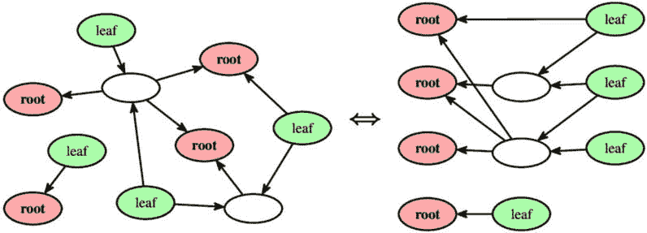
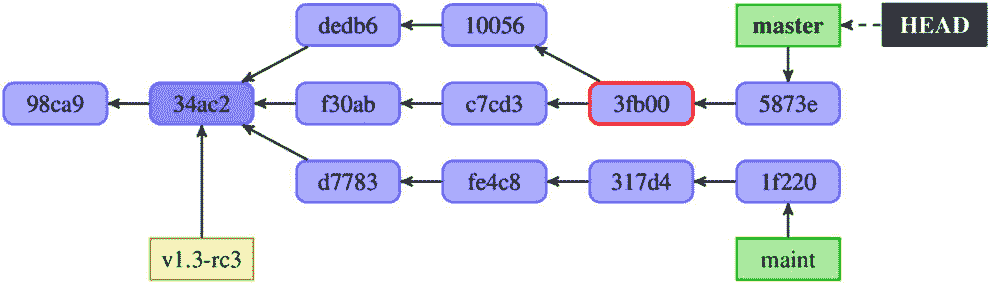
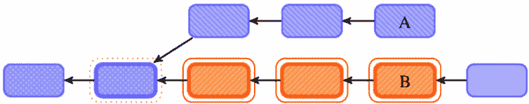
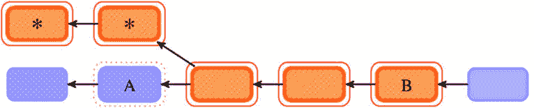
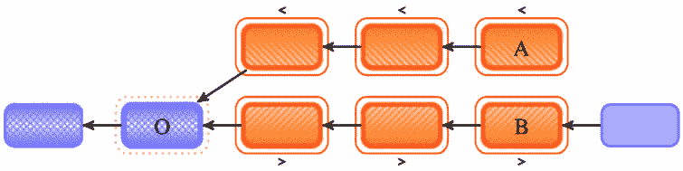

# 4

# 探索项目历史

掌握**版本控制系统（VCS）**的一个重要部分是探索项目历史，并利用 VCS 保存了每个版本的档案这一事实。例如，你可能希望查看其他开发者所做的工作，或提醒自己即将发布的内容。

在本章中，你将学习如何选择和查看一个修订或一系列修订，以及如何引用它们。下一章将继续这一主题，解释如何使用不同的标准查找修订，并如何在已选择的修订中进行搜索；同时，它还会描述如何在项目内容中进行搜索。

本章还将介绍修订的**有向无环图（DAG）**概念，并解释该概念与项目历史的关系，以及与 Git 中分支、标签和当前分支的关系。

这里是我们将在本章中讨论的主题列表：

+   作为表示历史的方式的修订 DAG

+   不同的修订选择方式

+   选择起始分支和标签

+   使用 reflog 中的数据来选择修订

+   双点（A..B）和三点表示法（A…B）用于修订范围选择

+   高级修订范围选择

本章的目的是教你如何选择项目历史中的相关部分。下一章将解释如何通过搜索你选择的内容进一步探讨这个问题。

# DAGs

版本控制系统（**VCS**）与备份应用程序的不同之处在于*能够表示超越线性历史的内容*。这对于支持不同开发者之间的并行开发（每个开发者在自己克隆的仓库中）以及允许独立的并行开发线（即分支）是必要的。例如，使用 VCS，你可能希望将正在进行的开发与稳定版本的 bug 修复工作隔离开来。你可以通过为这些不同的开发线使用单独的分支来实现这一点。因此，VCS 需要能够建模这种非线性的开发方式，并且需要具备一些结构来表示它。

Git 用来表示项目可能存在的非线性历史的结构（在抽象层次上）叫做**有向无环图（DAG）**。

下图（*图 4.1*）展示了一个 DAG 的示例，使用两种不同的方式绘制。图中的相同图形在两侧都呈现：左侧使用自由格式布局，右侧使用从左到右的布局。



图 4.1 – DAG 的通用示例，使用不同布局绘制的相同图形

**有向图**是计算机科学和数学中的一种数据结构，由*节点*（顶点）通过*有向边*（箭头）连接组成。如果一个有向图不包含任何循环，它就是*无环*的，这意味着无法从某个节点出发，沿着有向边的序列返回到起始节点。

我认为理解这个主题有助于掌握探索、搜索和塑造项目历史的艺术。你可能需要多读几遍以内化这些知识。然而，这并不是使用 Git 成功所必需的，因此在第一次阅读时可以跳过这一部分。

在图的特定实现中，每个节点代表某个对象（或数据的一部分），而从一个节点到另一个节点的每一条边代表它们之间某种关系（或者节点所代表的数据之间的关系）。

**分布式版本控制系统**（**DVCS**）中的修订版的有向无环图（DAG）使用如下表示：

+   **节点**：在分布式版本控制系统（DVCS）中，每个节点代表项目（整个树）的一个**修订版**（一个版本）。这些对象被称为**提交**。

+   **有向边**：在 DVCS 中，每条边表示两个修订版之间的*某修订版基于某修订版*的关系。箭头从较新的**子节点**指向较早的**父节点**，即它基于的修订版。这与大多数人习惯的*时间箭头*的思维方式相反——也就是，从较早的提交指向较新的提交。

由于有向边表示修订版之间的*基于*因果关系，修订版的有向无环图中的箭头不能形成循环。通常，修订版的有向无环图是从左到右（根节点在左，叶子节点在右）或从下到上（最新的修订版在上）排列的。本书中的图示和 Git 文档中的 ASCII 艺术示例采用的是从左到右的排列方式，而 Git 命令行使用的是从下到上的排列方式，即最新的修订版在上。

在任何有向无环图中都有两种特殊类型的节点（见*图 4.1*）：

+   **根节点**（或**根**）：这些是没有父节点（没有出边）的节点（修订版）。在修订版的有向无环图中至少有一个根节点，它代表项目的初始（起始）版本。

+   **叶子节点**（或**叶子**）：这些是没有子节点（没有入边）的节点；至少会有一个这样的节点。它们代表项目的最新版本，且没有任何基于它们的工作。通常，修订版的有向无环图（DAG）中的每个叶子节点都有一个指向它的分支头。

重要提示

在 Git 的修订 DAG 中可以有多个根节点。当你将两个原本独立的项目合并时，可以创建额外的根节点；每个合并的项目都会带来自己的根节点。由于这是一个非常罕见的情况，现代 Git 中你需要为**git merge**或**git pull**命令传递**--allow-unrelated-histories**选项，以帮助避免错误。

另一个根节点的来源是**孤立分支**——即没有共同历史的断开分支。例如，GitHub 用它们来管理项目的网页，这些网页与代码存储在同一个仓库中（在**gh-pages**分支中）；Git 项目本身也使用它们来存储预生成的文档（**man**和**html**分支）以及相关项目（**todo**分支）。要创建这样的分支，需要在**git checkout**或**git switch**中使用**--orphan**选项。

DAG 可以有多个叶子节点，这意味着不存在像线性历史范式中的“最新版本”这一概念。

## 整棵树的提交

在分布式版本控制系统（DVCS）中，修订的每个节点（DVCS 的历史模型）代表一个项目作为一个整体的版本：一个**快照**，即项目整个目录树内容的快照。

这意味着默认情况下，每个开发者都会获得他们仓库克隆中的所有文件的历史记录。如果需要，他们可以选择仅获取部分历史记录（浅克隆和/或仅克隆选定分支），可以仅签出选定文件（稀疏签出），或者使用部分克隆功能（例如，根据需求加载不同版本的文件内容）。这些特殊情况，以及更多内容，将在*第十二章*《管理大型仓库》中详细描述。

## 分支和标签

一个 `maintenance` 分支，帮助管理对项目发布的稳定版本的 bug 修复，同时将这一活动与其他开发工作隔离开来。

一个 `v1.3-rc3` 标签等，可以让你回到这个特定版本，检查测试人员报告的 bug 的有效性，并找到报告的 bug 来源。

分支和标签，有时也称为**引用**（**refs**），当一起使用时，它们在修订的 DAG 中具有相同的含义和几乎相同的表示方式。它们是修订图的外部引用（指针），如*图 4.2*所示：



图 4.2 – 一个包含两个分支、一个标签、一个分叉点和一个合并提交的版本控制系统（VCS）修订的示例有向无环图（DAG）

`v1.3-rc3`在*图 4.2*中。它始终指向相同的对象；它不会改变。使用标签的想法是能够通过符号名称引用给定的修订，并且这个符号名称对每个开发者来说都意味着相同的内容。检出或查看给定标签时，每个人都应该得到相同的结果。

一个`maint`和`master`。

DAG 中的分支，作为一个开发线路，是 DAG 的子图，由那些可以从分支的末端（从分支头）到达的修订组成——换句话说，就是从分支头开始，沿着父节点的边走到的那些修订。

在创建新提交时，Git 需要知道哪个分支的末端需要推进。它需要知道当前的分支是哪一个，`HEAD`直接指向 DAG 中的一个节点。

### 引用（分支和标签）的全名

最初，Git 将分支和标签存储在`.git`管理区域中的文件内，分别位于`.git/refs/heads/`和`.git/refs/tags/`目录下。现代 Git 可以将有关标签和分支的信息存储在`.git/packed-refs`文件中，以避免处理大量小文件。然而，活动引用仍然使用原始的*松散*格式——每个引用一个文件。

`HEAD`指针（表示当前分支）存储在`.git/HEAD`中。它通常是一个符号引用——例如，**ref: refs/heads/master**。

`master`分支存储在`.git/refs/heads/master`中，并以`refs/heads/master`作为它的全名（换句话说，分支位于`refs/heads/`命名空间中）。分支的末端称为分支的**头**，因此这个命名空间的名称。以*松散*格式存储时，文件内容是分支上最新修订的 SHA-1 标识符（**分支末端**），以十六进制数字的纯文本形式表示。如果引用之间存在歧义，有时需要使用全名。

远程跟踪分支`origin/master`，记住远程仓库`origin`中`master`分支的最后位置，存储在`.git/refs/remotes/origin/master`中，并以`refs/remotes/origin/master`作为其全名。**远程**的概念将在*第六章*，*与 Git 的协同开发*中解释，而**远程跟踪分支**将在*第八章*，*高级分支技巧*中讨论。

`v1.3-rc3`标签的全名是`refs/tags/v1.3-rc3`（标签位于`refs/tags/`命名空间中）。更准确地说，在**注释**和**签名标签**的情况下，这个文件存储的是指向**标签对象**的引用，标签对象反过来指向 DAG 中的节点，而不是直接指向一个提交。这是唯一一种可以指向任何类型对象的引用；分支和远程跟踪分支始终指向一个提交。

使用为脚本设计的命令时（如`git show-ref`），可以看到这些全名（完全限定名）：

```
$ git show-ref
98cbfdf5c1be9a4f6c0f7e3b97608b39274463df refs/heads/master
d81ce7b6aeedb51aa2d5e18d110333aea080fdd4 refs/stash
```

## 分支点

当你从某个版本开始创建一个新分支时，开发线通常会发生分歧。创建一个分支的行为在 DAG 中表示为一个有多个子节点的提交——也就是说，某个节点被多个箭头指向。

重要提示

Git 并不跟踪创建（分叉）分支的信息，也不会以任何方式标记分支点，这些标记不会在克隆和推送中被保存。有关此事件的信息存在于**reflog**中（**branch: Created from HEAD**），但它仅限于发生分支的仓库，并且是临时的。然而，如果你知道**B**分支是从**A**分支开始的，你可以使用**git merge-base A B**来找到分支点。在现代 Git 中，你可以使用**--fork-point**选项来使该命令在有可用的情况下使用 reflog 中的信息。

在*图 4.2*中，`34ac2`提交是一个分支点，或者说是`master`和`maint`两个分支。

## 合并提交

通常，当你使用分支来实现独立的并行开发时，稍后你会希望将它们合并。例如，你可能希望将已应用到稳定（维护）分支上的 bug 修复合并到主开发线中（如果它们适用且在主开发线中没有被意外修复）。

你可能还希望合并不同开发者在同一项目中并行创建的更改，每个开发者使用自己克隆的仓库并创建自己的一系列提交。

这样的**合并操作**会创建一个新的修订，将两个开发线合并。该操作的结果将基于多个提交。表示该修订的 DAG 中的节点将有多个父节点和多个输出边。这样的对象称为**合并提交**。

在*图 4.2*中，你可以看到合并提交`3fb00`。

# 单一修订选择

在开发过程中，通常你会想选择项目历史中的某个修订，以便检查它或与当前版本进行比较。选择修订的能力也是选择修订范围的基础——例如，选择某一历史子集进行检查。

许多 Git 命令会将修订作为参数，这些修订通常在 Git 参考文档中以`<rev>`表示。Git 允许你以多种方式指定某个提交或一系列提交。接下来将会在本节及下一节中描述这些方式。

## HEAD – 隐式修订

大多数（但并非全部）需要修订参数的 Git 命令默认为使用`HEAD`。例如，`git log`和`git log HEAD`将显示相同的信息。你还可以单独使用`@`作为`HEAD`的快捷方式。

这里，`HEAD`表示**当前分支**，换句话说，表示已经检出的提交，它形成了当前工作的基础（当前修订）。

还有一些其他类似于`HEAD`的引用：

+   **FETCH_HEAD**：此记录了从远程仓库通过上一次**git fetch**或**git pull**操作获取的远程分支的信息。它在一次性获取时非常有用，例如通过给定的 URL（**git fetch <URL>**）获取，而不像从命名仓库（如**origin**）获取时，可以使用远程跟踪分支，例如**origin/master**。此外，使用命名仓库时，可以使用远程跟踪分支的 reflog —— 例如，**origin/master@{1}** —— 来获取 fetch 之前的位置。请注意，**FETCH_HEAD**会在每次从任何仓库进行 fetch 时被覆盖。

+   **ORIG_HEAD**：此记录了当前分支的上一个位置。此引用是由那些以剧烈方式移动当前分支的命令创建的（创建新提交不会设置**ORIG_HEAD**），用来记录**HEAD**在操作前的位置。如果你想撤销或中止此类操作，这非常有用。然而，如今，也可以通过 reflog 来实现相同的功能，reflog 存储了更多可以在其使用过程中查看的信息；有关更多详情，请参见*Reflogging shortnames*章节。

你还可能遇到在特定操作期间使用的短暂临时引用：

+   在合并过程中，在创建合并提交之前，**MERGE_HEAD**记录了你正在合并到当前分支的提交。它在创建合并提交后消失。

+   在 cherry-pick 过程中，在创建将选定更改复制到另一个分支的提交之前，**CHERRY_PICK_HEAD**记录了你为 cherry-pick 选择的提交。

## 分支和标签引用

指定修订的最直接和最常用的方式是使用符号名称：分支，命名开发线路，指向该线路的末端；以及标签，命名特定的修订。此方式可以用来查看开发线路的历史，检查给定分支上当前的修订（当前工作），或比较分支或标签与当前工作。

你可以使用任何*refs*（指向修订的有向无环图的外部引用）来选择一个提交。你可以在任何需要修订作为参数的 Git 命令中使用分支名、标签名和远程跟踪分支名。

通常，给出分支或标签的*简短*名称就足够了，例如 `git log master` 查看 `master` 分支的历史，或 `git log v1.3-rc3` 查看版本 `v1.3-rc1` 的历史。然而，也有可能存在具有相同名称的不同类型引用，例如同时存在名为 `dev` 的分支和标签（虽然建议避免这种情况）。另外，你可能（通常是无意的）创建了本地 `origin/master` 分支，而远程跟踪分支有一个名为 `origin/master` 的短名称，它跟踪远程仓库中 `master` 分支的位置。

在这种情况下，当引用名称模糊时，系统会通过以下规则中的第一个匹配项来消除歧义（这是一个简化版，完整列表请参见 **gitrevisions(7)** 手册页）：

1.  顶级符号名称——例如，**HEAD**。

1.  否则，使用标签的名称（**refs/tags/** 命名空间）。

1.  否则，使用本地分支的名称（**refs/heads/** 命名空间）。

1.  否则，使用远程跟踪分支的名称（**refs/remotes/** 命名空间）。

1.  否则，若存在默认分支，则使用远程名称；该修订被认为是默认分支（例如，**refs/remotes/origin/HEAD**，表示 **origin** 作为参数）。

## `--branches`、`--tags` 和类似选项

如果你想查看整个修订历史图谱，需要一种方式来指定所有的引用——即分支、远程跟踪分支和标签。这就是 `git log` 命令的 `--all` 选项的作用。使用此选项，Git 会假装列出 `refs/` 命名空间中的所有引用，以及 `HEAD`，作为修订遍历的起点（用于查看项目历史）。

如果你想限制自己仅操作分支、远程跟踪分支或标签，可以分别使用 `--branches`、`--remotes` 或 `--tags` 选项。所有这些选项都可以使用可选的 `<pattern>` 参数，限制对应的引用匹配给定的 shell 通配符。如果模式没有通配符（即没有 `*`、`?` 或 `[`），则默认会在模式末尾添加 `/*`。例如，如果你想模拟列出所有主题分支（以作者缩写开头的层次化名称）和所有 `origin` 远程的远程跟踪分支，可以使用以下命令：

```
$ git log --branches=??/* --remotes=origin
```

带有 `<pattern>` 参数的 `--all` 选项被命名为 `--glob=<pattern>`。

通配符模式

在计算机科学中，**glob 模式**用于使用特定的通配符字符匹配字符串。这是 UNIX shell 使用的语法，并在 **glob(7)** 手册页中有描述。它比 **正则表达式** 简单，但表达能力较弱。

最常见的通配符有 *****、**?** 和 **[…]**。***** 通配符字符匹配任意数量的字符，包括零个字符，**?** 匹配一个字符，**[abc]** 匹配括号内列出的一个字符。你可以使用字符范围简化字符列表——例如，**[a-z]**。

使用 `--exclude=<pattern>` 选项可以增强模式匹配功能，该选项会影响 `--all`、`--branches`、`--tags`、`--remotes` 和 `--glob`，排除下一个此类选项原本会考虑的引用。这个选项可以多次使用，累积排除模式。例如，要包括所有的主题分支，但排除你自己的主题分支（这些分支的名称以 `jn/` 开头），你可以使用以下命令：

```
$ git log --exclude=jn/* --branches=??/*
```

## SHA-1 和缩短的 SHA-1 标识符

在 Git 中，每个修订版本都会被赋予一个唯一的标识符（对象名称），它是 `git` `log` 输出的一部分：

```
$ git log
commit 50f84e34a1b0bb893327043cb0c491e02ced9ff5
Author: Junio C Hamano <gitster@pobox.com>
Date:   Mon Jun 9 11:39:43 2014 -0700
    Update draft release notes to 2.1
    Signed-off-by: Junio C Hamano <gitster@pobox.com>
commit 07768e03b5a5efc9d768d6afc6246d2ec345cace
Merge: 251cb96 eb07774
Author: Junio C Hamano <gitster@pobox.com>
Date:   Mon Jun 9 11:30:12 2014 -0700
    Merge branch 'jc/shortlog-ref-exclude'
```

不必提供完整的 40 个字符的 SHA-1 标识符。如果你提供 SHA-1 修订标识符的前几个字符，Git 足够智能，能够推断出你想表达的意思，只要部分 SHA-1 至少有 4 个字符长。为了能够使用缩短的 SHA-1 来选择修订版本，它必须足够长，以避免歧义——也就是说，必须有且只有一个提交对象的 SHA-1 标识符以给定的字符开头。

例如，`dae86e1950b1277e545cee180551750029cfe735` 和 `dae86e` 都指向同一个提交对象，当然，前提是你的仓库中没有其他对象的名称以 `dae86e` 开头。如果存在歧义，Git 会告诉我们所有的选择，如下所示：

```
error: short object ID dae86e is ambiguous
hint: The candidates are:
hint:   dae86e19 commit 2021-03-17 – README: Add CI badges
hint:   dae86e1f tree
hint:   dae86ebf blob
fatal: ambiguous argument 'dae86e': unknown revision or path not in the working tree.
Use '--' to separate paths from revisions, like this:
'git <command> [<revision>...] -- [<file>...]'
```

在许多地方，Git 会在命令输出中清晰地显示缩短的 SHA-1 标识符。例如，在前面的 `git log` 输出示例中，我们可以在 `Merge:` 行看到缩短的 SHA-1 标识符。

你还可以请求 Git 用缩短的 SHA-1 替代完整的 SHA-1 修订标识符，使用 `--abbrev-commit` 选项。默认情况下，Git 会使用至少 7 个字符来表示缩短的 SHA-1；你可以通过可选参数来更改这一点——例如，`--abbrev-commit=12`。

请注意，Git 会根据命令执行时需要的字符数来使用缩短的 SHA-1 以确保其唯一性。`--abbrev-commit`（以及类似的 `--abbrev` 选项）参数表示缩写的最小长度。

关于缩短的 SHA-1 简单说明

通常，8 到 10 个字符的缩短 SHA-1（对于 SHA-1 前缀）在项目中已足够唯一。最大的 Git 项目之一，Linux 内核，开始需要 12 个字符中的 40 个，以保持唯一性。尽管哈希冲突，即两个修订（两个对象）具有相同的完整 SHA-1 标识符，是极不可能的（其概率为*1/2⁸⁰ ≈ 1/1.2×10²⁴*），但由于仓库的增长，原本唯一的缩短 SHA-1 标识符可能会变得不再唯一。

SHA-1 和缩短版 SHA-1 通常是从命令输出中复制并粘贴作为另一个命令的修订参数。当有疑问或模糊不清时，它们也可以用于开发者之间的沟通，因为 SHA-1 标识符在任何仓库的克隆中都是相同的。*图 4.2*使用了五个字符的缩短 SHA-1 来标识 DAG 中的修订。

## 祖先引用

另一种指定修订的方法是通过其`HEAD`、分支头或标签，然后通过父关系跟踪到相关的提交。对于这种祖先路径，有一种特殊的后缀语法来指定。

如果你将`^`放在修订名称的末尾，Git 会将其解析为该修订的（第一个）父提交。例如，`HEAD^`表示`HEAD`的父提交——即上一个提交。

这是一个简化语法。对于合并提交，它们有多个父提交，你可能希望选择任何一个父提交。要选择父提交，可以在`^`字符后加上父提交的编号：使用`^<n>`后缀表示修订的第*n*个父提交。我们可以看到，`^`是`¹`的简化版本。

作为特殊情况，`⁰`表示提交本身；当命令在使用分支名称作为参数与使用其他修订标识符时行为不同，它才显得重要。它也可以用于获取一个注释（或签名）标签所指向的提交；例如，`git show v0.9`和`git show v0.9⁰`。注意，你也可以使用`<tag>^{commit}`来执行后一操作；在大多数情况下，这和`<tag>^{}`做的事情一样（继续查找直到遇到一个不是标签的对象）。

这种后缀语法是可组合的。你可以使用`HEAD^^`表示`HEAD`的祖父提交，也就是`HEAD^`的父提交。还有一种指定首个父提交链的简化语法。你可以直接使用`~<n>`来代替写`n`次`^`后缀，即`^^…^`或`¹¹…¹`。作为特殊情况，`~`等同于`~1`，因此`HEAD~`和`HEAD^`是等价的。同理，`HEAD~2`表示第一个父提交的第一个父提交，或者是祖父提交，它等同于`HEAD^^`。

你还可以将所有内容组合起来。例如，你可以使用`HEAD~3²`来获取`HEAD`的曾祖父的第二个父提交（假设它是一个合并提交），依此类推。你可以使用`git name-rev`或`git describe --contains`来了解修订与本地引用的关系，如下所示：

```
$ git log | git name-rev --stdin
commit 82006acd359717624fb33a7ae554cba6be717911 (master)
Merge: 20cfc7c 3a59408
Author: Bob Hacker <bob@company.com>
Date:   Sun May 30 00:58:23 2021 +0200
    Merge branch 'master' of https://git.company.com/random
commit 20cfc7c25ff82e36d6e72b6a31f5839331f270e7 (master~1)
Author: Bob Hacker <bob@company.com>
Date:   Sun May 30 00:44:59 2021 +0200
    Added COPYRIGHT
[…]
```

如你所见，使用`git name-rev --stdin`作为`git log`的过滤器时，在每个 SHA-1 标识符后，你会看到其祖先引用（括号内）——例如，**(master~1)**。

## 逆向祖先引用 – git-describe 输出

祖先引用描述了历史版本与当前分支和标签之间的关系。它取决于起始修订的位置。例如，`HEAD^`通常表示下个月会有一个完全不同的提交。

有时候，我们希望描述当前版本与先前命名版本的关系。例如，我们可能希望为当前版本提供一个易于人类阅读的名称，以便将其存储在生成的二进制应用程序中。我们希望这个名称对每个人来说都指向相同的修订版本。这就是`git describe`的任务。

在这里，`git describe`会找到从给定修订（默认是`HEAD`）可以到达的最新标签，并使用该标签来描述这个版本。如果找到的标签指向给定的提交，那么（默认情况下）只显示标签名。否则，`git describe`会在标签名后添加标签对象上方的提交数量，并使用给定修订的简短 SHA-1 标识符。例如，`v1.0.4-14-g2414721`表示给定的提交是基于命名（已标签化）版本`v1.0.4`，距离当前提交 14 次提交，并且它的简短 SHA-1 是`2414721`。如果没有 SHA-1 缩写，表示法会产生歧义；在非线性历史的情况下，可能会有多个修订版本与给定标签相距 14 个提交。

Git 理解这种输出格式作为修订标识符。

## Reflog 短名称

为了帮助你从某些类型的错误中恢复，并能够撤销更改（回到更改前的状态），Git 保持`HEAD`和分支引用的记录，记录了过去几个月它们的变化情况以及它们是如何到达当前状态的，具体内容在*第二章*，《使用 Git 开发》中有所描述。默认情况下，Git 会保留 reflog 条目 90 天；对于那些只能通过 reflog 访问的修订（例如，修改过的提交），则保留 30 天。这可以在每个引用上单独配置；详情请见*第十三章*，《定制与扩展 Git》。

你可以使用`git reflog`命令及其子命令来查看和操作你的 reflog。你还可以使用`git log -g`（或`git log --walk-reflog`）来显示历史记录：

```
$ git reflog
ba5807e HEAD@{0}: pull: Merge made by the 'recursive' strategy.
3b16f17 HEAD@{1}: reset: moving to HEAD@{2}
2b953b4 HEAD@{2}: reset: moving to HEAD^
69e0d3d HEAD@{3}: reset: moving to HEAD^^
3b16f17 HEAD@{4}: commit: random.c was too long to type
```

每当`HEAD`和你的分支头因任何原因更新时，Git 会将这些信息存储在这个本地临时的引用历史日志中。reflog 中的数据可以用来指定引用（从而指定修订版本）：

+   要指定你本地仓库中**HEAD**的第*n*个先前值，你可以使用**HEAD@{n}**语法，你可以在**git reflog**的输出中看到这个值。同样，这也适用于指定分支的第*n*个先前值——例如，**master@{n}**。这个特殊的语法**@{n}**表示当前分支的第*n*个先前值，它可能与**HEAD@{n}**不同。

+   你也可以使用这种语法来查看某个分支在特定时间点的位置。例如，要表示你本地仓库中**master**分支昨天的位置，可以使用**master@{yesterday}**。

+   你可以使用**@{-n}**语法来引用当前分支之前第*n*个被检出的分支。在某些地方，你可以简单地用**– (dash)**替代**@{-1}**。例如，**git checkout –** 或 **git switch –** 会切换到上一个分支。

## 上游远程跟踪分支

你用来工作的本地仓库通常不会孤立存在。它与其他仓库进行交互，通常至少与从中克隆出来的`origin`仓库进行交互（除非是通过`git init`从头开始创建的仓库）。

注意

默认远程仓库的名称可以通过设置**clone.defaultRemoteName**来指定。

对于这些你经常交互的远程仓库，Git 会跟踪它们分支在上次接触时的位置。

为了跟踪远程仓库中分支的移动，Git 使用`some-branch`，然后运行`git checkout <some-branch>`命令，Git 会为你基于这个远程跟踪分支创建一个本地分支。

例如，当你在一个开发分支上工作，最终该分支要发布到`origin`仓库中的`next`分支，而该`next`分支由`origin/next`远程跟踪分支进行跟踪时，你需要创建一个本地的`next`分支。我们说`origin/next`是`next`分支的上游分支，我们可以将其称为`next@{upstream}`。

**@{upstream}**后缀（简写为`<refname>@{u}`），只能应用于本地分支名称，选择与引用设置的基础分支。缺少引用时，默认使用当前分支——即`@{u}`是当前分支的上游分支。

还有`[<branch>]@{push}`，它对于三角工作流很有用，其中你推送更改的仓库与获取更新的仓库不同。

## 通过提交信息选择修订版本

你可以通过使用正则表达式匹配提交信息来指定修订版本。`:/<pattern>`表示从任何引用可以访问的最新匹配提交（例如，`:/^Bugfix`），而`<rev>^{/<pattern>}`（例如，`next^{/fix bug}`）表示从`<rev>`可以访问的最新匹配提交：

```
$ git log 'origin/pu^{/^Merge branch .rs/ref-transactions}'
```

这种修订指定器给出的结果类似于`git log`的`--grep=<pattern>`选项，但它是可组合的。这意味着它可以与其他组件（如祖先引用）结合使用。另一方面，它只返回第一个（最年轻的）匹配修订，而`--grep`选项返回所有匹配的修订。

# 选择修订范围

现在你可以通过多种方式指定单个修订，让我们学习如何指定修订范围，这是我们想要查看的 DAG 的一个子集。**修订范围**特别适合用于查看项目历史中的选定部分。

例如，你可以使用范围指定来回答一些问题，如：“这个分支上有哪些工作我还没有合并到主分支中？”、“我主分支上的哪些工作我还没有发布？”或者简单地问：“自从创建这个分支以来，做了哪些工作？”

## 单一修订作为修订范围

历史遍历命令，如`git log`，在一组提交上操作，从子提交向父提交逐步遍历。这类命令，在作为参数提供单个修订时（如本章*单一修订选择*部分所述），将显示从该修订开始，沿着提交的祖先链一直到根提交的所有提交。由于 Git 默认使用分页器，Git 将在显示一整页后停止——即显示一整屏的提交。

例如，`git log master`会显示从`master`分支的最新提交开始的所有提交（所有基于当前工作在该分支上的修订），这意味着它会显示整个`master`分支——也就是整个开发线路。

## 双点符号

最常见的范围指定方法是双点语法，`A..B`。对于线性历史，这意味着`A`和`B`之间的所有修订，或者更准确地说，是所有在`B`中但不在`A`中的提交，如*图 4.3*所示。例如，`HEAD~4..HEAD`范围表示四个提交：`HEAD`、`HEAD^`、`HEAD^^`和`HEAD^^^`。换句话说，它意味着`HEAD~0`、`HEAD~1`、`HEAD~2`和`HEAD~3`，假设当前分支与其第四个祖先之间没有合并提交：


图 4.3 – 线性历史的双点符号 A..B。选定的修订范围用细光环（带有轮廓）标记

提示

如果你想包括起始提交（在一般情况下，边界提交），而 Git 默认认为这些提交不感兴趣，你可以使用**--boundary**选项与**git log**一起使用。

对于不是直线的历史，情况会更复杂。一个这样的情况是当`A`不是`B`的祖先（在修订的 DAG 中没有从`B`到`A`的路径），但它们有一个共同的祖先，如*图 4.4*所示：



图 4.4 – 非线性历史的双点符号 A..B，其中修订版本 A 不是修订版本 B 的祖先，显示具有分叉点的情况

另一个非线性历史的情况是路径从 `B` 到 `A` 不是一个简单的线路 – 也就是说，在 `A` 和 `B` 之间存在合并提交，如 *图 4**.5* 所示。在非线性历史视图中，双点符号 `A..B` 或 *在 A 和 B 之间* 被定义为那些可以从 `A` 到达而从 `B` 到达不了的提交：



图 4.5 – 非线性历史的双点符号 A..B，A 和 B 之间具有合并提交。要排除带有 * 标记的提交，请使用 --strict-ancestor 选项

对于 Git 来说，`A..B` 表示一个范围，包括从一个修订版本 (`B`) 到另一个修订版本 (`A`) 无法到达的所有提交，同时遵循祖先链。在 `A` 和 `B` 分歧的情况下，如 *图 4**.4* 所示，这简单地是从 `A` 的分支点开始的 `B` 中的所有提交。

例如，假设你的 `master` 和 `experiment` 分支分岔。你想查看你的 `experiment` 分支中尚未合并到 `master` 分支的内容。你可以要求 Git 只显示这些提交的日志，使用 `master..experiment`。

另一方面，如果你想看到相反的情况 – 所有 `master` 中没有的 `experiment` 中的提交 – 你可以反转分支名称。`experiment..master` 符号显示了 `master` 中所有无法从 `experiment` 到达的内容。

另一个例子是 `origin/master..HEAD` 显示即将推送到远程仓库的内容（当前分支中尚未在 `origin` 的 `master` 分支中存在的提交），而 `HEAD..origin/master` 可显示已获取但尚未合并的内容。

小贴士

你也可以省略语法的一侧，让 Git 假设 **HEAD**：**origin/master..** 就是 **origin/master..HEAD**，而 **..origin/master** 就是 **HEAD..origin/master**；如果一侧缺失，Git 会替换为 **HEAD**。

Git 在许多地方使用双点符号，例如在 `git fetch` 和 `git push` 的输出中用于普通快进情况。在这里，你可以只需复制粘贴输出片段作为 `git log` 的参数。在这种情况下，范围的起始点是结束点的祖先 – 也就是说，这个范围是线性的：

```
$ git push
To https://git.company.com/random
   8c4ceca..493e222  master -> master
```

## 创建范围时包括和排除修订版本

双点符号 `A..B` 语法非常有用且直观，但它是一个简写符号。通常，它已经足够了，但有时你可能希望获得比它提供的更多功能。也许你想指定多个分支来标识你的修订，例如查看哪些提交出现在多个分支中，但不在你当前所在的分支中。也许你只想查看 `master` 分支中那些不在其他长期存在的分支中的更改。

Git 允许通过*前缀*给定修订版本来排除可以从该修订版本到达的提交。例如，要查看所有位于 `maint` 或 `master` 上，但不在 `next` 中的修订版本，可以使用 `git log maint master ^next`。这意味着 `A..B` 符号只是 `B ^A` 的简写。

Git 允许我们使用 `--not` 选项来替代在每个我们想要排除的修订版本前加上 `^` 字符，这个选项会*否定*所有后续的修订。例如，`B ^A ^C` 可以写成 `B --not A C`。这种方法在我们通过编程生成排除的修订版本时特别有用。

因此，这三个命令是等效的：

```
$ git log A..B
$ git log B ^A
$ git log B --not A
```

## 单个修订版本的修订范围

还有一个有用的简写符号 `A^!`，它表示由单个提交组成的范围。对于非合并提交，它就是 `A^..A`。

对于合并提交，`A^!` 会排除所有父提交。借助另一个特殊符号 `A^@`，表示 `A` 的所有父提交（即 `A¹`，`A²`，… `A^n`），我们可以说 `A^!` 是 `A --not A^@` 的简写。

## 三点符号

指定修订范围的最后一种主要语法是三点语法 `A...B`。它选择能够由两个引用之一到达的所有提交，但不能同时由它们两个到达；见 *图 4**.6*。在数学中，这种表示法被称为**A 和 B 的对称差**：



图 4.6 – 三点符号 A...B，用于非线性历史，所选范围以细线框显示，O 是边界提交 —— A 和 B 的合并基点

这是 `A B --not $(git merge-base --all A B)` 的简写，其中 `$(…)` 表示 shell `git merge-base` 命令，用于查找所有最佳共同祖先（所有合并基点），然后将其输出粘贴到命令行中，以便进行否定操作。

`git log` 命令在使用三点符号时常用的一个开关是 `--left-right`。此选项使 Git 通过在来自左侧（`A` 在 `A...B` 中）的提交前添加 `<`，以及在来自右侧（`B` 在 `A...B` 中）的提交前添加 `>` 来显示每个提交属于范围的哪一侧，如 *图 4**.6* 所示，以及以下示例。这有助于使数据更具实用性：

```
$ git log --oneline --left-right 37ec5ed...8cd8cf8
>8cd8cf8 Merge branch 'fc/remote-helper-refmap' into next
>efcd02e Merge branch 'rs/more-starts-with' into next
>831aa30 Merge branch 'jm/api-strbuf-doc' into next
>1aeca19 Merge branch 'jc/count-parsing' into next
<1a7e8e8 Revert "replace: add --graft option"
<7a30690 t9001: avoid non-portable '\n' with sed
>5cc3268 fetch doc: remove "short-cut" section
```

重要提示

如果**--left-right**选项与**--boundary**结合使用，这些通常不感兴趣的边界提交将以**-**为前缀。

使用三点符号**A...B**修订范围时，这些边界提交是**git merge-base --all** **A B**。

当发生**强制更新**时，Git 在`git fetch`和`git push`的输出中使用三点符号表示，在旧版本（左侧）和更新版本（右侧）分叉的情况下，并且新版本被强制覆盖旧版本：

```
$ git fetch
From git://git.kernel.org/pub/scm/git/git
 + 37ec5ed...8cd8cf8 next   -> origin/next  (forced update)
 + 9478935...16067c9 pu     -> origin/pu  (forced update)
   d0b0081..1f58507  todo   -> origin/todo
```

在 diff 中使用修订范围符号

为了方便在**log**和**diff**命令之间复制粘贴，Git 允许我们在**git** **diff**命令中使用*修订范围*双点符号**A..B**和三点符号**A...B**，作为*修订集（端点）*。

对于 Git 来说，使用**git diff A..B**与**git diff A B**是一样的，这表示修订**A**和修订**B**之间的差异。如果省略双点符号两侧的修订，它将产生与使用**HEAD**相同的效果。例如，**git diff A..**等同于**git diff** **A HEAD**。

**git diff A...B**符号表示显示分支**B**上的传入更改。传入更改意味着从公共祖先——即**A**和**B**的合并基点开始，直到修订**B**。因此，写**git diff A...B**相当于**git diff $(git merge-base A B) B**；请注意，这里**git merge-base**没有使用**--all**选项。此约定的结果是，将**git fetch**输出（无论是双点符号还是三点符号）作为参数传递给**git diff**时，始终会显示已获取的更改。但需要注意的是，它不包括自分叉以来在**A**上所做的更改！

在现代 Git 中，你可以使用不那么难懂的**git diff --merge-base A B**，而不必使用三点符号表示法——也就是说，**git diff A...B**。

此外，此功能使得可以使用**git diff A^!**查看修订**A**与其父提交的差异（它是**git diff** **A^ A**的快捷方式）。

# 总结

本章涵盖了探索项目历史的各种方法：查找相关的修订，选择要显示的修订，并进行进一步分析。

我们从描述项目历史的概念模型开始：修订的有向无环图（DAG）。理解这一概念非常重要，因为许多选择工具直接或间接地引用了 DAG。

然后，你学习了如何选择单个修订和修订范围，以及修订范围的概念如何适用于非线性历史。我们可以利用这些知识查看自分支与基础分支分叉以来，分支上做了哪些更改，反之亦然；我们还可以检查自分叉以来两个分支发生了什么。

选择修订是搜索项目历史的第一步。这将在下一章中描述。

# 问题

回答以下问题，以测试你对本章内容的理解：

1.  如何列出所有当前分支上未包含的、在上游分支上存在的修订版（尚未集成的）？

1.  如何列出你将使用 **git push** 发送的所有修订版，支持三角工作流（推送远程仓库与拉取远程仓库不同）？

1.  如何查找从分叉点开始的两个分支 **A** 和 **B** 中的所有分歧更改，并显示哪个更改集位于哪个分支上？

1.  如何列出所有在任何远程追踪分支上进行的提交，这些分支的名称以 **fix-** 开头，并且来自任何远程仓库？

1.  切换到前一个分支的最简单方法是什么？它是如何工作的？

# 答案

以下是本章问题的答案：

1.  将双点表示法与上游分支的表示法结合使用：**git** **log ..@****{upstream}**。

1.  使用 **git log @{push}..HEAD**，将双点表示法与“推送到的位置”表示法结合使用。请注意，对于简单的工作流程，**@{push}** 与 **@{upstream}** 是相同的。

1.  使用三点表示法和适当的 **git log** 选项：**git log --left-right** **A...B**。

1.  使用 **--remotes[=<pattern>]** 选项，并搭配适当的通配符模式：**git** **log --remotes=*/fix-***。

1.  使用 **git checkout –** 或 **git switch -**。在这些命令中，**-** 表示 **@{-1}**，该符号利用 reflog 查找当前分支的前一个值。

# 进一步阅读

若要了解本章所涉及的更多主题，可以查看以下资源：

+   gitrevisions(7) – 指定 Git 的修订版和范围：[`git-scm.com/docs/gitrevisions`](https://git-scm.com/docs/gitrevisions)

+   Scott Chacon, Ben Straub: *Pro Git*, 第二版（2014 年），Apress *第二章 2.3：Git 基础 - 查看提交历史*：[`git-scm.com/book/en/v2/Git-Basics-Viewing-the-Commit-History`](https://git-scm.com/book/en/v2/Git-Basics-Viewing-the-Commit-History)

+   *glob(7)* – 通配符模式的路径匹配（Shell 通配符模式）：[`man7.org/linux/man-pages/man7/glob.7.html`](https://man7.org/linux/man-pages/man7/glob.7.html)

+   Jan Goyvaerts: *正则表达式教程：学习如何使用并充分利用正则表达式*：[`www.regular-expressions.info/tutorial.html`](https://www.regular-expressions.info/tutorial.html)
