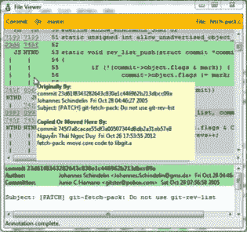
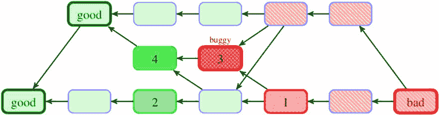

# 5

# 在仓库中进行搜索

在选择了你想要搜索的项目历史部分之后，下一步任务是从选定的提交中提取你需要的信息。你可以根据修订元数据来限制搜索范围，例如提交的作者、变更创建的日期，或提交信息的内容。你可以查看实际的更改，或者你可能对某个特定文件或子系统如何演变感兴趣。通过访问项目历史，你可以找到谁编写了某一段代码，或是哪次提交引入了回归（首次出现的错误提交）。

另一个重要的技能是格式化 Git 输出，以便容易找到你想要的信息。通过各种预定义的漂亮`git log`输出格式和定义及组合自定义输出格式的能力，可以实现这一任务。

以下是我们将在本章中讨论的主题列表：

+   限制历史记录和历史简化

+   使用取铁锹工具和差异搜索来搜索历史记录

+   使用**git bisect**查找错误

+   使用**git blame**查看文件内容的逐行历史，并检测文件重命名

+   选择和格式化输出（美观的格式）

+   使用**git shortlog**概括贡献

+   使用**.mailmap**指定标准的作者姓名和电子邮件

+   查看特定的修订、修订中的文件以及差异输出选项

本章的目的是展示如何从项目历史中提取信息。

# 搜索历史记录

`git log`命令有大量且多样的有用选项，其中修订限制选项是最常用的——即那些只允许你显示部分提交的选项。这与通过传递适当的修订范围选择要查看的提交相辅相成，并允许我们利用除了修订图形外的其他信息来搜索特定版本的历史记录。

## 限制修订数量

限制`git log`输出的最基本方法是仅显示指定数量的最新提交。可以使用`-<n>`选项（其中`n`是任意整数）来实现；也可以写作`-n <n>`，或者以长格式写作`--max-count=<n>`。例如，`git log -2`将显示当前开发线中最新的两个提交，从隐式的`HEAD`修订开始。

你可以使用`--skip=<n>`跳过显示的前几个提交。

## 匹配修订元数据

历史限制选项可以分为两类：一种是检查提交对象本身存储的信息（修订元数据），另一种是根据变更集过滤提交（基于父提交或多个提交之间的变更）。

### 时间限制选项

如果你对某个特定日期范围内创建的提交感兴趣，可以使用如`--since`和`--until`，或者`--before`和`--after`等选项。例如，以下命令返回过去两周内所做的提交列表：

```
$ git log --since=2.weeks
```

这些选项可以与各种*日期*格式一起使用。你可以指定一个具体日期，如*2008-04-21*，也可以指定一个相对日期，如*2 年前 3 个月 3 天*；你还可以使用点代替空格。

当使用特定日期时，必须记住，如果日期没有包含时区，它将被解释为本地时区。这很重要，因为在这种情况下，当 Git 由位于世界其他时区的同事运行时，结果可能不会相同。例如，`--since="2014-04-29 12:00:00"`在英国伯明翰（这表示 2014-04-29Z11:00:00 的世界协调时间）运行时，会比在美国阿拉巴马州伯明翰（这表示 2014-04-29Z17:00:00）运行时多出六小时的提交。为了获得相同的结果，你需要在时间限制中包括时区——例如，`-``‍``-after="2013-04-29T17:07:22+0200"`。

请注意，Git 中的提交并不是由单一日期描述的，而是由两个可能不同的日期描述：作者日期和提交者日期。此处描述的时间限制选项检查**提交者日期**，即修订对象创建的日期和时间。这可能不同于**作者日期**，即变更集创建的日期和时间（即更改发生的时间）。

在某些情况下，作者日期和提交者日期可以不同：

+   一种情况是，当提交是在一个仓库中创建的，转换为电子邮件后，再由另一个人应用到另一个仓库中。

+   另一种让这两个日期不同的方法是，在重新基础化时重新创建提交；默认情况下，这会保留作者日期并获得一个新的提交者日期（参见*第九章*，*合并更改*，*基础化分支*部分，以及*第十章*，*保持历史记录清晰*，*交互式* *基础化*部分）。

### 匹配提交内容

如果你只想过滤出由特定作者或提交者完成的提交，可以分别使用`--author`或`--committer`选项。例如，假设你在寻找 Linus 编写的所有 Git 源代码中的提交。你可以使用类似`git log --author=Linus`的命令。默认情况下，搜索是区分大小写的，使用`--author=^Linus`。这里使用`^`表示作者信息应该以**Linus**开头。

`--grep`选项允许你搜索提交信息（这些信息应包含对更改的描述）。假设你想查找所有提到`git`的安全漏洞修复，可以使用`git log --grep=CVE`。

如果你同时指定了`--author`和`--grep`选项，或者多个`--author`或`--grep`选项，Git 将显示匹配任一查询的提交。换句话说，Git 会逻辑地“或”所有提交匹配选项。如果你希望找到匹配所有查询的提交，并且这些匹配选项之间是逻辑“与”关系，你需要使用`--all-match`选项。

还有一组选项，可以修改匹配模式的含义，类似于`grep`程序中使用的选项。为了使搜索不区分大小写，可以使用`-i` / `--regexp-ignore-case`选项。如果你想简单地匹配一个子字符串，可以使用`-F` / `--fixed-strings`（你可能希望这么做，以避免需要转义正则表达式中的元字符，如`.`和`?`）。如果你想写更强大的搜索词，可以使用`--extended-regexp`或`--perl-regexp`（如果 Git 是用`--invert-grep`编译并链接的，后者才可用）。

当使用`git log -g`查看 reflog 时（参见*Reflog 简写*部分），你可以使用`--grep-reflog=<regexp>`选项，仅显示包含匹配 reflog 条目的位置。例如，要显示所有对`HEAD`的操作，这些操作不是简单的提交操作，你可以使用以下命令：

```
$ git log -g --invert-grep --grep-reflog="^commit:"
```

### 提交的父级

默认情况下，Git 会在遍历提交历史时，跟随每个合并提交的所有父提交。为了只跟随第一个父提交，你可以使用恰如其分的`--first-parent`选项。这样会显示历史的主线（有时称为主干），假设你遵循了特定的合并实践；你将在*第八章*《高级分支技巧》和*第九章*《合并变更》部分学到更多。

考虑以下命令（这个例子使用了非常实用的`--graph`选项，它能够生成历史的 ASCII 艺术图表）：

```
$ git log -5 --graph --oneline
* 50f84e3 Update draft release notes to 2.1
*   07768e0 Merge branch 'jc/shortlog-ref-exclude'
|\
| * eb07774 shortlog: allow --exclude=<glob> to be passed
* |   251cb96 Merge branch 'mn/sideband-no-ansi'
|\ \
| * | 38de156 sideband.c: do not use ANSI control sequence
```

将其与以下命令进行比较：

```
$ git log -5 --graph --oneline --first-parent
* 50f84e3 Update draft release notes to 2.1
* 07768e0 Merge branch 'jc/shortlog-ref-exclude'
* 251cb96 Merge branch 'mn/sideband-no-ansi'
* d37e8c5 Merge branch 'rs/mailinfo-header-cmp'
* 53b4d83 Merge branch 'pb/trim-trailing-spaces'
```

你可以使用`--merges`和`--no-merges`选项，分别过滤出仅显示合并提交或非合并提交。这些选项实际上是更通用选项的简化版：`--min-parents=<number>`（`--merges`等同于`--min-parents=2`）和`--max-parents=<number>`（`--no-merges`等同于`--max-parents=1`）。

假设你想找到项目的起始点，你可以借助`--max-parents=0`来实现，这样会显示所有的根提交：

```
$ git log --max-parents=0 --oneline
0ca71b3 basic options parsing and whatnot.
16d6b8a Initial import of a python script...
cb07fc2 git-gui: Initial revision.
161332a first working version
1db95b0 Add initial version of gitk to the CVS repository
2744b23 Start of early patch applicator tools for git.
e83c516 Initial revision of "git", the information manager from hell
```

## 搜索修订中的更改

有时候，单靠搜索提交信息和其他修订元数据是不够的。也许对更改的描述不够详细，或者，你可能在寻找某个功能被引入的修订，或者某个变量开始使用的修订？

Git 允许你查看每个修订所带来的更改（即提交与其父提交之间的差异）。更快的选项被称为**pickaxe**搜索。

使用`-S<string>`选项时，Git 会查找引入或删除给定字符串的差异。注意，这不同于字符串仅仅出现在 diff 输出中。你可以使用正则表达式与`--pickaxe-regex`选项进行匹配。Git 会检查每个修订，看是否有文件的*当前*侧和*父*侧有不同数量的指定字符串，并显示匹配的修订。

作为副作用，使用`git log`和`-S`选项还会显示每次修订所做的更改（就像使用了`--patch`选项一样），但仅显示与查询匹配的差异。若要显示所有文件的差异，以及发生数字变化的差异，你需要使用`--pickaxe-all`选项：

```
$ git log -S'sub href'
commit 06a9d86b49b826562e2b12b5c7e831e20b8f7dce
Author: Martin Waitz <tali@admingilde.org>
Date:   Wed Aug 16 00:23:50 2006 +0200
    gitweb: provide function to format the URL for an action link.
    Provide a new function which can be used to generate an URL for the CGI.
    This makes it possible to consolidate the URL generation in order to make
    it easier to change the encoding of actions into URLs.
    Signed-off-by: Martin Waitz <tali@admingilde.org>
    Signed-off-by: Junio C Hamano <junkio@cox.net>
```

使用`-G<regex>`时，Git 会字面上寻找那些添加或删除的行与给定正则表达式匹配的差异。注意，Git 使用的统一 diff 格式将更改的行视为删除旧版本并添加新版本；参见*第二章*，*使用 Git 开发*（*检查待提交的更改*部分），了解 Git 如何描述更改。

为了说明`-S<regex> --pickaxe-regex`与`-G<regex>`之间的差异，考虑一个包含以下 diff 的提交：

```
     if (lstat(path, &st))
-        return error("cannot stat '%s': %s", path,
+        ret = error("cannot stat '%s': %s", path,
                         strerror(errno));
```

当`git log -G"error\("`会显示这个提交（因为查询匹配了两个更改的行）时，`git log -S"error\(" --pickaxe-regex`则不会显示（因为该字符串的出现次数没有发生变化）。

提示

如果你对单个文件感兴趣，使用**git blame**（也许在图形化的 blame 浏览器中，如**git gui blame**）查看某个更改何时被引入会更容易。然而，**git blame**无法用于找到删除行的提交——你需要使用 pickaxe 搜索。

## 选择更改类型

有时，你可能只想查看那些添加或重命名文件的更改。使用 Git，你可以通过`git log --diff-filter=AR`来做到这一点。你可以选择任何类型变化的组合；详情请参见`git-log(1)`手册。例如，要在列出所有更改的文件时找到所有重命名文件，你可以使用`--diff-filter=R*`，如以下示例所示：

```
$ git log --diff-filter=R* --oneline –stat
8b4dbde Rename random.js to gen_random.js
 index.html                           | 2 +-
 scripts/{random.js => gen_random.js} | 0
 2 files changed, 1 insertion(+), 1 deletion(-)
042a8af Directory structure
 index.html                     | 2 +-
 random.js => scripts/random.js | 0
 2 files changed, 1 insertion(+), 1 deletion(-)
```

更改类型的助记符与`git status --short`或`git log --name-status`所使用的是一样的：

```
$ git log -1 --diff-filter=R --oneline --name-status
8b4dbde Rename random.js to gen_random.js
R100    scripts/random.js       scripts/gen_random.js
```

接下来，我们将研究如何根据更改的文件搜索历史，随后还会讨论如何格式化`git log`的输出。

# 文件的历史

正如前一章开头的*整个树提交*部分所描述，Git 修订是关于将整个项目作为一个单一实体的状态。

在许多情况下，特别是在大型项目中，我们只关心单个文件的历史，或仅限于给定目录（给定子系统）内更改的历史。

## 路径限制

要查看单个文件的历史，你只需使用`git log <pathname>`。Git 将仅显示所有影响指定路径名（文件或目录）的修订，这意味着那些对指定文件或指定子目录中的文件做出更改的修订。

分支名称与路径名称的歧义消除

Git 通常会猜测你写的**git log foo**是什么意思；你是想查看**foo**分支（开发线）的历史，还是想查看**foo**文件的历史？然而，有时 Git 可能会混淆。为防止路径名和分支名称之间的混淆，你可以使用**--**（两个破折号）来分隔文件名参数和其他选项。**--**之后的所有内容将被视为路径名，而**--**之前的所有内容将被视为分支名称或其他选项。

例如，编写**git log -- foo**明确请求查看**foo**路径的历史。

除了当分支和文件同名时，另一个常见的使用场景是在检查*已删除文件的历史*时，该文件不再出现在项目中。

你可以指定多个路径；甚至可以使用通配符（模式匹配）来查找影响某一特定类型文件的更改。例如，要查找仅对 Perl 脚本（`.pl`扩展名的文件）所做的更改，可以使用`git log -- '*.pl'`。请注意，你需要保护`*.pl`通配符，以免在 Git 看到它之前被 Shell 展开——例如，使用单引号，如此处所示。

Pathspec 魔法

大多数接受**<path>**或**<pathspec>**作为参数的命令，如**git log**，也支持**pathspec 魔法**。以冒号‘**:**’开头的路径规格有特殊含义：此冒号后面通常跟着一个或多个*魔法签名*字母，或者是零个或多个*魔法词*的逗号分隔列表。可以选择性地使用冒号‘**:**’来分隔魔法部分和匹配模式。以下是一些例子：**:(top):data/** 或 **:/data/** 将使模式匹配到仓库顶层目录中的 data/目录，而不管我们当前位于仓库中的哪个位置（当前目录）。命令**git log :(exclude):*.html** 或 **git log :^*.html** 将列出所有修订，其中至少有一个文件发生了变化，并且该文件不是 HTML 文件。你可以在**gitglossary(7)**手册页中的**pathspec**条目找到更多的魔法。

然而，由于 Git 在显示项目历史时使用路径名参数作为*限制器*，查询单个文件的历史不会自动*跟踪重命名*。你需要使用 `git log --follow <file>` 来继续列出文件的历史，超越重命名。不幸的是，它并不是在所有情况下都有效。有时，你需要使用 `git blame` 命令（请参见*Blame – 文件的逐行历史*部分），或通过启用重命名检测的边界提交（`git show -M -C --raw --abbrev <rev>`）来手动跟踪重命名和文件移动。

在现代 Git 中，你还可以使用 `git log -L` 跟踪文件中*行范围的演变*，目前该功能仅限于从单个修订（零或一个正向修订参数）和单个文件开始的遍历。范围可以通过`-L <start>,<end>:<file>`来指定，`<start>` 或 `<end>` 可以是行号或`/regexp/`（正则表达式），也可以用 `-L :<funcname regexp>:<file>`来跟踪一个函数。 然而，这种技术不能与基于路径的常规路径限制一起使用。例如，要查看`index.html`文件的历史，限制在`<head>`元素中的更改，可以使用以下命令：

```
$ git log -L '/^<head>/','/^<\/head>/':index.html
```

## 历史简化

默认情况下，当请求某路径的历史时，Git 会*简化历史*，只显示那些必要的提交（足以解释匹配指定路径的文件是如何演变的）。Git 会排除那些没有更改给定文件的修订。此外，对于非排除的合并提交，Git 会排除那些没有更改文件的父提交（从而排除开发线）。

你可以通过 `git log` 选项来控制这种历史简化，如 `--full-history` 或 `--simplify-merges`。更多详情请参见 Git 文档，尤其是 `git-log(1)` 手册中的*历史简化*部分。

## Blame — 文件的逐行历史

`git blame` 会为每一行标注适当的行作者信息。

Git 可以从给定的修订开始标注（这在浏览文件历史或检查文件的旧版本是如何演变时非常有用），甚至可以将搜索限制在给定的修订范围内。你还可以限制标注的行范围，以提高 `blame` 的速度——例如，若只想查看 `esc_html` 函数的历史，可以使用以下命令：

```
$ git blame -L '/^sub esc_html {/,/}/' gitweb/gitweb.perl
```

`blame` 操作之所以如此有用，是因为它*跟踪历史*，即使文件进行了整文件的重命名。它可以选择跟踪从一个文件移动到另一个文件的行（使用 `-M` 选项），甚至跟踪从另一个文件复制粘贴过来的行（使用 `-C` 选项）；这也包括内部代码的移动。

在跟踪代码移动时，忽略空白符变化非常有用，这样可以找出某段代码真正被引入的时间，而不是仅仅发现它被重新缩进（例如，由于重构重复代码为函数——代码移动）。这可以通过传递 diff 格式选项 `–w` / `--ignore-all-space` 来完成。

重命名检测

一个好的版本控制系统应该能够处理文件重命名和其他改变项目目录结构的方式。解决这个问题有两种方法。第一种是 **重命名追踪**，意味着在提交时保存关于文件被重命名的事实信息；版本控制系统会标记重命名。这通常需要使用 **rename** 和 **move** 命令来重命名文件。例如，你不能使用不支持版本控制的文件管理器来移动文件。但是，在创建修订时，可以检测到重命名。这可能涉及某种形式的 **文件身份**，它在重命名时得以保留。

第二种方法，也是 Git 使用的方法，是 **重命名检测**。在这种情况下，**mv** 命令仅仅是删除旧文件名并添加一个包含相同内容的新文件名的快捷方式。重命名检测意味着在需要时检测文件被重命名的事实：在进行合并时、查看文件的逐行历史记录时（如果请求）、或在显示差异时（如果请求或配置了）。这种方式的优势在于，重命名检测算法可以得到改进，并且不会在提交时被冻结。它是一种更通用的解决方案，不仅可以处理整个文件的重命名，还可以处理单个文件内部以及不同文件之间的代码移动和复制，这可以从 **git blame** 的描述中看到。

重命名检测的缺点是，它在 Git 中基于文件内容和路径名相似性的启发式方法，因此需要消耗一定的资源，并且在某些罕见情况下可能会失败：无法检测重命名，或错误地检测出没有发生重命名的情况。

请注意，在现代 Git 中，基本的重命名检测默认启用，用于显示差异。

许多 Git 的图形界面包含了图形化版本的 blame 操作。`git gui blame` 就是其中一个图形化界面的例子（它是基于 Tcl/Tk 的 `git gui` 图形界面的一部分）。这些图形界面可以展示完整的更改描述，并同时展示考虑与不考虑重命名的历史记录。通过这样的 GUI，通常可以跳转到指定的提交，交互式地浏览文件行的历史。此外，GUI blame 工具使得跨重命名跟踪文件变得非常简单：



图 5.1 – 'git gui blame' 操作示例，展示如何检测代码片段的复制或移动

# 使用 git bisect 查找 bug

Git 提供了一些工具来帮助你调试项目中的问题。这些工具非常有用，特别是在软件回归的情况下——即在某次修订后，软件出现了 bug，导致某个功能无法正常工作。如果你不知道 bug 出现的位置，而自上次知道代码正常工作以来已经有数十次或数百次提交，你可能会求助于 `git bisect`。

**bisect** 命令通过半自动化的方式，一步步地在项目历史中进行查找，尝试找出引入 bug 的修订。在每一步中，它将历史分成大致相等的两部分，询问分割提交是否存在 bug。然后，它根据答案淘汰掉其中一部分，从而缩小包含 bug 的提交范围：



图 5.2 – git bisect 操作示例，在 4 步后找到有问题的提交

## 启动 git bisect 过程

假设项目的版本 1.14 正常工作，但新版本的候选发布版 1.15-rc0 崩溃。你回到 1.15-rc0 版本，结果发现你能够 *重现问题*（这非常重要！），但无法找出问题出在哪里。

你可以通过 bisect 代码历史来查找原因。你需要通过 `git bisect start` 启动二分查找过程，然后使用 `git bisect bad` 告诉 Git 哪个版本是坏的。接着，你必须告诉 bisect 过程最后一个已知的正常状态（或状态集合），使用 `git bisect good`：

```
$ git bisect start
$ git bisect bad  v1.15-rc0
$ git bisect good v1.14
Bisecting: 159 revisions left to test after this (roughly 7 steps)
[7ea60c15cc98ab586aea77c256934acd438c7f95] Merge branch 'mergetool'
```

## 查找有问题的提交

Git 发现大约有 300 次提交位于你标记为最后一次正常提交（`v1.14`）和有问题版本（`v1.15-rc0`）之间，并为你检出了中间的提交（`7ea60c15`）。如果此时运行 `git branch` 或 `git status`，你会看到 Git 已暂时将你切换到了（``no branch）：

```
$ git branch
* (no branch, bisect started on master)
  master
$ git status
HEAD detached at 7ea60c15cc
You are currently bisecting, started from branch 'master'.
  (use "git bisect reset" to get back to the original branch)
```

此时，你需要运行测试以检查问题是否存在于 bisect 操作当前检出的提交中。如果程序崩溃，使用 `git bisect bad` 标记当前提交为有问题。如果问题不存在，使用 `git bisect good` 标记其为正常。大约经过七步后，Git 会显示出可疑的提交：

```
$ git bisect good
b047b02ea83310a70fd603dc8cd7a6cd13d15c04 is first bad commit
commit b047b02ea83310a70fd603dc8cd7a6cd13d15c04
Author: PJ Hyett <pjhyett@example.com>
Date:   Tue Jan 27 14:48:32 2009 -0800
    secure this thing
:040000 040000 40ee3e7… f24d3c6… M  config
```

上述示例输出的最后一行是所谓的 *原始* diff 输出，显示了在某次提交中发生变化的文件。你可以使用 `git show` 来检查可疑的提交。接下来，你可以查看该提交的作者，并向他们寻求澄清或要求修复（通过发送 bug 报告）。如果在项目开发过程中遵循了创建小规模、增量变化的良好实践，那么在找到有问题的提交后，需检查的代码量应该会很小。

如果在某个时刻，你遇到了一个与当前问题无关的提交，且它不适合用来测试，你可以使用`git bisect skip`跳过此提交。你甚至可以通过向`skip`子命令提供修订范围来跳过一系列提交。

当你完成时，应该运行`git bisect reset`，以便将你带回到开始时的分支。

```
$ git bisect reset
Previous HEAD position was b047b02... secure this thing
Switched to branch 'master'
```

要在停留在你找到的坏提交上完成二分查找，你可以使用`git bisect` `reset HEAD`。

## 在 git bisect 过程中自动化测试

你甚至可以通过`git bisect run`完全自动化查找坏修订版本。为此，你需要一个脚本来测试是否存在 bug，如果项目正常工作则退出时返回 0，或者如果存在 bug 则返回非 0 值。当当前检出的代码无法进行测试时，应使用特殊的退出代码`125`。在这种情况下，你还可以通过提供已知的坏和好的提交来启动`bisect`操作。你可以通过简单地使用`bisect start`命令列出这些提交，先列出已知的坏提交，再列出已知的好提交（如果有多个好提交）。如果你知道问题涉及树中的哪一部分，还可以通过指定路径参数来减少测试的次数（路径前的双破折号并非严格必要，但很有帮助）。然后，你就可以开始自动化的二分查找：

```
$ git bisect start v1.5-rc0 v1.4 -- arch/i386
$ git bisect run ./test-error.sh
```

这样做会自动在每个检出的提交上运行`test-error.sh`，直到 Git 找到第一个坏的提交。

如果问题是项目停止编译（构建失败），你可以使用`make`作为测试脚本（与`git bisect` `run make`一起使用）。

# 选择并格式化 git 日志输出

现在你知道如何选择要检查的修订版本，并限制显示的修订版本（选择那些有意义的修订），接下来是学习如何选择与查询修订版本相关的部分信息并格式化输出。`git log`命令提供了大量的选项来实现这一点。

## 预定义和用户定义的输出格式

一个非常有用的`git log`选项是`--pretty`。此选项会改变日志输出的格式。有几个预设格式可以供你使用。`oneline`格式将每个提交打印在一行上，这对于查看大量提交时非常有用；存在`--oneline`的快捷方式，它等同于`--pretty=oneline --abbrev-commit`，通常一起使用。此外，`short`、`medium`（默认格式）、`full`和`fuller`格式以大致相同的格式显示输出，只是信息的多少有所不同。`raw`格式以 Git 内部表示形式显示提交，`email`或`mboxrd`则以类似`git format-patch`的邮件格式显示。`reference`格式用于在提交信息中引用另一个提交，以下是一个示例：

```
$ git show --no-patch --pretty=reference master^
20cfc7c (Added COPYRIGHT, 2021-05-30)
```

您可以使用适当的`--date`选项更改这些详细格式中显示日期的格式：让 Git 显示相对日期，例如`--date=relative`，或者使用`--date=local`显示本地时区的日期，等等。

您还可以使用`--pretty=format:<string>`指定您自己的日志输出格式（以及其`tformat`变体，该变体使用终止符而非分隔符语义——每次提交的输出会附加换行符）。当您为机器解析生成输出并在脚本中使用时，这尤其有用，因为当您明确指定格式时，您知道它在 Git 更新时不会更改。格式字符串的工作方式有点像`printf`：

```
$ git log --pretty="%h - %an, %ar : %s"
50f84e3 - Junio C Hamano, 7 days ago : Update draft release notes
0953113 - Junio C Hamano, 10 days ago : Second batch for 2.1
afa53fe - Nick Alcock, 2 weeks ago : t5538: move http push tests out
```

这里有很多占位符。以下表格列出了其中的一些：

| **占位符** | **输出描述** |
| --- | --- |
| `%H` | 提交哈希（修订的完整 SHA-1 标识符） |
| `%h` | 缩略提交哈希 |
| `%``an` | 作者姓名 |
| `%``ae` | 作者电子邮件 |
| `%``ar` | 作者日期，相对时间 |
| `%``cn` | 提交者姓名 |
| `%``ce` | 提交者电子邮件 |
| `%``cr` | 提交者日期，相对时间 |
| `%s` | 主题（提交消息的第一行，描述修订） |
| `%%` | 一个原始的`%` |

表格 5.1 – 占位符及其描述

作者与提交者

**作者**是最初编写补丁的人（撰写更改），而**提交者**是最后应用补丁的人（创建了包含这些更改的提交对象，表示 DAG 中的修订）。因此，如果您向一个项目提交补丁并且其中一位核心成员应用了该补丁，那么你们两个人都会获得荣誉——您是作者，核心成员是提交者。此外，在进行变基后，变基修订的原始提交作者保持不变，而执行变基的人成为提交者。

`--oneline`格式选项与另一个名为`--graph`的`git log`选项结合使用时特别有用，尽管后者可以与任何格式一起使用。后者选项会添加一个漂亮的小 ASCII 图表，显示您的分支和合并历史。要查看标签和分支的位置，您可以使用一个名为`--decorate`的选项（在现代 Git 中，默认已启用该选项）：

```
$ git log --graph --decorate --oneline origin/maint
*   bce14aa (origin/maint) Sync with 1.9.4
|\
| * 34d5217 (tag: v1.9.4) Git 1.9.4
| *   12188a8 Merge branch 'rh/prompt' into maint
| |\
| * \   64d8c31 Merge branch 'mw/symlinks' into maint
| |\ \
* | | | d717282 t5537: re-drop http tests
* | | | e156455 (tag: v2.0.0) Git 2.0
```

您可能想使用图形工具来可视化您的提交历史。一个这样的工具是名为`gitk`的 Tcl/Tk 程序，它随 Git 一起分发。您可以在*第十三章*中找到更多关于各种类型图形工具的信息，*自定义和扩展 Git*。

## 包括、格式化和总结更改

你可以使用`git show`命令检查单个修订版本，该命令除了显示提交元数据外，还以统一 diff 格式展示更改，该格式在*第二章*中有描述，书名为*使用 Git 开发*，在*统一 Git diff 格式*小节中有详细介绍。然而，有时你可能希望将更改与所选历史部分一起显示在`git log`输出中。你可以通过使用`-p`选项来实现。这对于代码审查非常有帮助，或者快速浏览合作者在一系列提交中所做的更改。

通常情况下，Git 不会显示合并提交的更改。要显示来自所有父提交的更改，你需要使用`–c`选项（或者使用`–cc`进行压缩输出），而要显示每个父提交的更改，可以使用`–m`。

有时，在单词级别审查更改比在行级别审查更容易。`git log`接受多种选项来更改 diff 输出的格式。其中一个选项是`--word-diff`（包括各种变体，如`color`）。这种查看差异的方式对于检查文档中的更改（例如文档）非常有用：

```
commit 06ab60c06606613f238f3154cb27cb22d9723967
Author: Jason St. John <jstjohn@purdue.edu>
Date:   Wed May 21 14:52:26 2014 -0400
    Documentation: use "command-line" when used as a compound adjective, and fix
    Signed-off-by: Jason St. John <jstjohn@purdue.edu>
    Signed-off-by: Junio C Hamano <gitster@pobox.com>
diff --git a/Documentation/config.txt b/Documentation/config.txt
index 1932e9b..553b300 100644
--- a/Documentation/config.txt
+++ b/Documentation/config.txt
@@ -381,7 +381,7
        Set the path to the root of the working tree.
        This can be overridden by the GIT_WORK_TREE environment
        variable and the '--work-tree' [-command line-]{+command-line+} option.
        The value can be an absolute path or relative to the path to
       the .git directory, which is either specified by --git-dir
        or GIT_DIR, or automatically discovered.
```

另一个有用的选项集是关于忽略空白字符更改的，包括`–w` / `--ignore-all-space`来忽略所有空白字符更改，以及`-b` / `--ignore-space-change`来忽略空白字符的数量变化。

在支持颜色的情况下，你可以要求 Git 使用`--color-moved`来显示移动的代码，并可能忽略空白字符的变化（使用`--color-moved-ws`）。

有时，你只对更改的汇总感兴趣，而不是详细信息。你可以使用一系列`diff`汇总选项。如果你只想知道哪些文件发生了更改，可以使用`--names-only`（或`--raw --abbrev`）。如果你还想知道这些文件发生了多少更改，可以使用`--stat`选项（或者它的机器解析友好的版本`--numstat`）来查看一些简要的统计数据。如果你只关心更改的简短总结，可以使用`--shortstat`或`--summary`。

## 汇总贡献

是否曾想过自己为某个项目贡献了多少次提交？或者，或许你想知道在上个月（按提交次数计算），谁是最活跃的开发者？不必再猜测了，因为`git shortlog`就是用来做这个的：

```
$ git shortlog -s -n
 13885  Junio C Hamano
  1399  Shawn O. Pearce
  1384  Jeff King
  1108  Linus Torvalds
   743  Jonathan Nieder
```

`-s`选项将所有的提交信息压缩成提交次数的统计；如果没有这个选项，`git shortlog`将列出所有提交的汇总，按开发者分组。`-n`选项按提交次数对开发者列表进行排序；否则，默认按字母顺序排序。你可以添加`–e`选项来显示电子邮件地址；不过请注意，使用此选项时，Git 会根据不同的电子邮件地址将同一作者的贡献分开。`git shortlog`输出的格式可以通过类似`--format`选项的漂亮配置进行一定程度的调整。

`git shortlog`命令接受修订版本范围和其他限制修订版本的选项，例如`--since=1.month.ago`——任何`git log`接受并对`shortlog`有意义的选项。例如，要查看谁为最后一个发布候选版做出了贡献，您可以使用以下命令：

```
$ git shortlog -e v2.0.0-rc2..v2.0.0-rc3
Jonathan Nieder <jrnieder@gmail.com> (1):
      shell doc: remove stray "+" in example
Junio C Hamano <gitster@pobox.com> (14):
      Merge branch 'cl/p4-use-diff-tree'
      Update draft release notes for 2.0
      Merge branch 'km/avoid-cp-a' into maint
…
```

提示

需要记住，编写的修订版本数量仅是衡量贡献的一种方式。例如，那些只创建有缺陷提交以后再修复它们的人，其提交数量将比不犯错误的开发者多。

还有其他衡量程序员生产力的方法——例如，作者提交的更改行数，或者幸存行数。这些可以通过 Git 的帮助进行计算，但没有内置的命令来计算它们。

## 映射作者

在长期运行的项目中使用`git shortlog –s -n -e`或`git blame`命令时的一个问题是，作者在项目过程中可能会更改他们的姓名或电子邮件，或者两者都会，原因有很多：工作变动（及其工作电子邮件）、配置错误、拼写错误等等。例如，您可能在项目的顶级目录中有一个`.mailmap`文件。此文件允许您为贡献者指定*规范*名称，其最简单的形式如下：

```
Bob Hacker <bob@example.com>
```

（实际上，它允许您指定规范名称、规范电子邮件，或者名称和电子邮件，通过电子邮件或名称和电子邮件匹配。）

默认情况下，这些更正会应用于所有命令：`git blame`、`git shortlog`和`git log`。使用自定义`log`输出，您可以使用占位符输出原始名称或更正后的名称，以及原始电子邮件或更正后的电子邮件。

## 查看修订版本和修订版本的文件

有时，您可能希望更详细地检查单个修订版本（例如，使用`git bisect`发现的疑似有缺陷的提交），以及其更改和描述。或者，您可能希望检查带有标记消息的注释标签，以及它指向的提交。Git 提供了一个通用的`git show`命令；它可以用于任何类型的对象。

例如，要检查当前版本的父版本，可以使用以下命令：

```
$ git show HEAD^^
commit ca3cdd6bb3fcd0c162a690d5383bdb8e8144b0d2
Author: Bob Hacker <bob@virtech.com>
Date:   Sun Jun 1 02:36:32 2014 +0200
    Added COPYRIGHT
diff --git a/COPYRIGHT b/COPYRIGHT
new file mode 100644
index 0000000..862aafd
--- /dev/null
+++ b/COPYRIGHT
@@ -0,0 +1,2 @@
+Copyright (c) 2014 VirTech Inc.
+All Rights Reserved
```

`git show`命令还可用于显示目录（树）和文件内容（blob）。要查看文件（或目录），您需要指定它来自于哪个修订版本，并指定文件的路径，使用`:`连接它们。例如，要查看标记为`v0.1`的版本中`src/rand.c`文件的内容，请使用以下命令：

```
$ git show v0.1:src/rand.c
```

这可能比用`git checkout v0.1 -- src/rand.c`将所需版本的文件检出到工作目录中更方便。在冒号前面可以是任何命名提交的内容（此处为`v0.1`），冒号后面可以是任何 Git 跟踪的文件路径（此处为`src/rand.c`）。这里的路径名是从项目目录顶部开始的完整路径，但你可以在冒号后使用`./`表示相对路径——例如，如果你在`src/`子目录中，可以使用`v0.1:./rand.c`。

你可以使用相同的技巧比较任意修订版本中的任意文件；另一方面，`git show :src/rand.c`命令（如果没有指定修订版本）会显示`git add`运行时文件的状态——即索引中（暂存区）选定文件的状态。

如果你想查看在给定修订版本中存在哪些文件（以便选择一个进行查看），你可以使用`git ls-tree <revision>`。要查看工作树和索引中存在哪些文件，可以使用`git ls-files`并选择适当的选项来查看你想要的内容。

# 总结

本章向我们展示了探索项目历史的各种方式：选择和过滤要显示的修订版本，搜索与提交相关的各种数据，并格式化输出。

你已经学会了如何找出给定开发者所做的所有修订版本，如何通过提交消息和提交所做的更改进行搜索，以及如何将搜索范围缩小到特定的时间段。

我们甚至可以通过探索历史来尝试找出代码中的 bug：通过*撬棍搜索*查找某个函数何时从代码中删除，使用`git blame`检查文件，了解它的代码是如何变成现在这样并且是谁写的，以及通过`git bisect`利用半自动或自动化搜索项目历史，找出哪个版本引入了回归。

在检查一个修订版本时，我们可以选择信息展示的格式，甚至可以自定义格式。总结信息的方式有很多种，从更改文件的统计数据，到每个作者提交次数的统计数据。

在下一章中，我们将研究 Git 如何帮助开发者作为团队在一个项目上协同工作。

# 问题

请回答以下问题，测试你对本章内容的理解：

1.  如何列出自昨天以来在任何远程跟踪分支上做出的所有提交？

1.  如何查找给定函数或类的原始作者，以便向他请教或进行代码审查？

1.  你如何使用 Git 来帮助找出回归的来源——即在项目的新修订版本中存在的 bug，而在旧版本中并不存在？

1.  你注意到你的同事使用了错误配置的电子邮件做了一些提交，使用了**bob@laptop.company.com**而不是**bob@company.com**。假设无法重写这些提交，你将如何修复归属问题？

# 答案

下面是上述问题的答案：

1.  将时间限制选项与**--****remotes**选项结合使用：

1.  **git log --****since=yesterday --remotes**。

1.  使用**git blame**命令或交互式 GUI 进行操作，如**git gui blame**（或与编辑器或**集成开发环境**（**IDE**）的集成）；你还可以通过**git** **log -L**搜索文件相关片段的历史。

1.  使用**git bisect**来找到引入 bug 的提交，甚至可以通过自动化搜索来使用**git** **bisect run**。

1.  将正确的姓名和电子邮件添加到**.****mailmap**文件中。

# 进一步阅读

要了解本章讨论的更多主题，请查看以下资源：

+   Scott Chacon, Ben Straub, *Pro Git*, 第二版（2014 年），Apress，*第七章 7.5 Git 工具–* *搜索*：[`git-scm.com/book/en/v2/Git-Tools-Searching`](https://git-scm.com/book/en/v2/Git-Tools-Searching)

+   Christian Couder, *通过 git bisect 解决回归问题*（2009 年 Linux-Kongress 大会的幻灯片）：[`www.linux-kongress.org/2009/slides/fighting_regressions_with_git_bisect_christian_couder.pdf`](http://www.linux-kongress.org/2009/slides/fighting_regressions_with_git_bisect_christian_couder.pdf)

+   Junio C Hamano, *与第一父项历史的乐趣*（2013 年）：[`git-blame.blogspot.com/2013/09/fun-with-first-parent-history.html`](https://git-blame.blogspot.com/2013/09/fun-with-first-parent-history.html)

+   Junio C Hamano, *衡量项目活动（2）*（2013 年）：[`git-blame.blogspot.com/2013/03/measuring-project-activities-2.html`](https://git-blame.blogspot.com/2013/03/measuring-project-activities-2.html)

+   Jan Goyvaerts, *正则表达式教程 - 学习如何使用并充分利用正则表达式*：[`www.regular-expressions.info/tutorial.html`](https://www.regular-expressions.info/tutorial.html)
