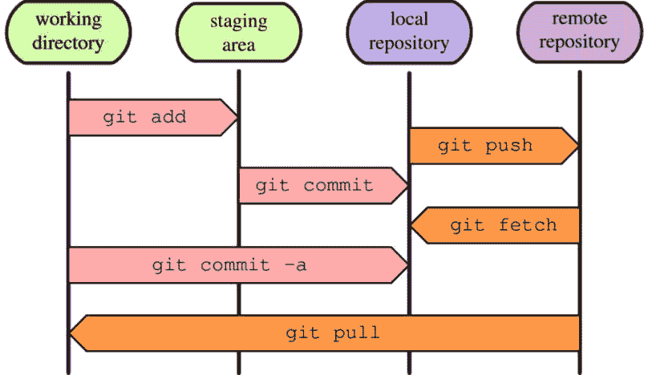
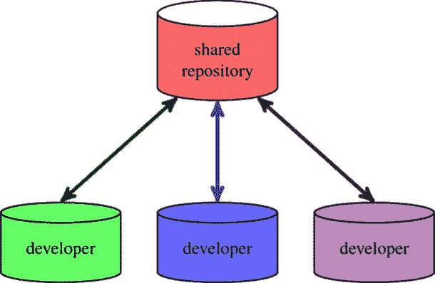
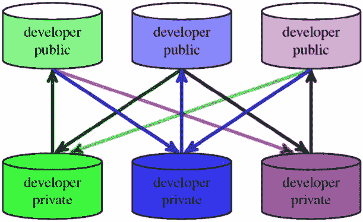
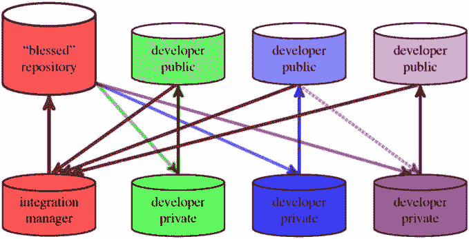
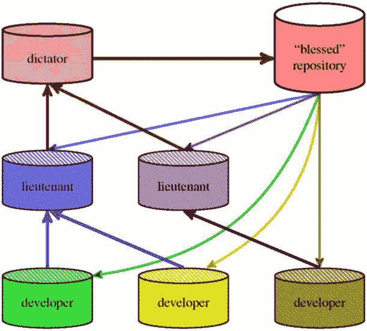
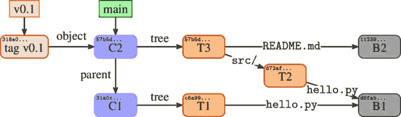

# 6

# 使用 Git 进行协作开发

*第二章*，*使用 Git 开发*，以及*第三章*，*管理工作树*，教你如何对项目做出新贡献，但这些内容仅限于影响你自己电脑上项目仓库的克隆。*第二章*描述了如何提交新修订，而*第三章*则展示了 Git 如何帮助你准备这些修订。

本章以及*第七章*，*发布你的更改*，为你提供了一个全景视图，展示了与他人协作的不同方式，涵盖了集中式和分布式工作流。这两章将重点介绍协作开发中的仓库级交互，而使用的分支模式将在*第八章*，*高级分支技术*中进行讲解。

本章描述了不同的协作工作流，解释了每种工作流的优缺点。你还将了解信任链概念，以及如何使用**签名标签**、**签名合并**和**签名提交**。

本章将涵盖以下主题：

+   集中式和分布式工作流，以及裸仓库

+   管理远程仓库和一次性协作

+   版本如何被处理——信任链

+   标签；轻量标签与签名标签

+   签名标签、签名合并和签名提交

# 协作工作流

使用版本控制系统时有不同的参与层次。例如，有些人可能仅对使用 Git 查看项目是如何发展的感兴趣。*第四章*，*探索项目历史*，以及*第五章*，*浏览仓库*，讲解了如何使用 Git 来进行这种操作。当然，查看项目的历史也是开发中的一个重要部分。

有人可能仅为私人开发使用版本控制，在单一机器上进行单人项目开发。*第二章*，*使用 Git 开发*，以及*第三章*，*管理工作树*，展示了如何在 Git 中进行这种操作。当然，人们通常不是单独工作，而是以团队形式进行开发：个人开发通常是协作的一部分。

但版本控制系统的一个主要目标是帮助多个开发人员协作完成项目。版本控制使得他们能够高效地在同一软件上同时工作，确保他们的更改互不冲突，从而帮助合并这些更改。

你可能和几个开发者一起合作一个项目，或者与很多人一起合作。你可能是贡献者，也可能是项目维护者。也许项目太大，需要子系统维护者。你可能在紧密的软件团队中工作，或者可能希望让外部贡献者更容易地提供建议的更改（例如，修复 bug 或修正文档中的错误）。对于这些不同的情况，可能有多种工作流程更为适合：

+   集中化工作流

+   点对点工作流

+   维护者工作流

+   分层工作流

## 裸仓库

有两种类型的仓库：

+   一个具有工作目录和暂存区的仓库（**非裸仓库**）

+   **裸仓库**，没有工作目录

前者类型用于私人单人开发并创建新历史，而后者则用于协作和同步开发结果。

按惯例，`.git`扩展名——例如，`project.git`——而`project`（其中包含行政区域和本地仓库在`project/.git`中）。

克隆仓库、推送到仓库或从仓库获取时，通常可以省略此扩展名；无论是使用`https://github.com/git/git.git`作为仓库 URL，还是[`github.com/git/git`](https://github.com/git/git)，都能正常工作。

要创建裸仓库，你需要在`git init`或`git clone`命令中添加`--bare`选项，如下所示：

```
$ git init --bare project.git
Initialized empty Git repository in /home/user/project.git/
```

## 与其他仓库交互

在创建一组修订并扩展项目历史后，你通常需要与其他开发者共享这些更改。你需要与其他仓库实例同步：发布你的更改，并获取他人的更改。

从本地仓库实例——即你自己的仓库克隆——的角度来看，你需要将更改**推送**到用于发布更改的仓库，并从其他仓库**获取**更改。通常，你只需要与从中克隆的仓库进行交互。*第七章*，*发布你的更改*，将更详细地描述此过程（及其替代方案）。

获取更改后，有时需要通过**合并**两条开发线（或**变基**）将它们合并到你的工作中——你可以通过**pull**操作在一次操作中完成合并。合并和变基操作将在*第九章*中更详细地描述，*合并更改*。

Git 假设你不希望本地仓库对外公开，因为这些仓库是用于私人工作（有助于将尚未准备好公开的工作保持不被外界看到）。

这意味着需要额外的步骤来使你的完成工作可用：你需要执行`git push`命令。

*图 6.1*中的图表，延伸自*第二章*中的*图 2.2*，*使用 Git 开发*，展示了创建和发布提交时可以采取的步骤。该图中的箭头表示用于将内容从一个地方复制到另一个地方的 Git 命令，包括从远程仓库到本地仓库。



图 6.1 – 创建提交、发布提交以及将其他开发者发布的更改获取到本地仓库

现在，让我们理解一下集中式工作流。

## 集中式工作流

使用分布式版本控制系统时，可以使用不同的协作模式，有些更加分布式，有些则不那么分布式。在**集中式工作流**中，有一个中心枢纽：一个共享仓库，通常是裸仓库，所有人都用它来同步工作。



图 6.2 – 集中式工作流 – 共享仓库为空

在这种工作流中，每个开发者都有自己**非裸的克隆**，用于开发软件的新版本。当更改准备好时，他们将这些更改推送到中央仓库，并从中获取（或拉取）其他开发者的更改。推送前可能需要先合并更改。在这种工作流中，变化的集成是分布式的。这种工作流如*图 6.2*所示。

现在，让我们来看看*集中式工作流*的优缺点。

### 集中式工作流的优点

集中式工作流的一些主要优点包括以下几点：

+   这种工作流有一个简单的设置；它是那些来自集中式版本控制系统并习惯于集中式管理的人熟悉的范式。它提供了集中的访问控制和便捷的备份。

+   它使得设置**持续集成**（**CI**）变得容易。

+   合并更改的过程是由开发人员共同承担的，没有单个人负责集成更改。

+   这可能是一个适合小型团队的私人项目的好设置，或者适合所有开发人员都值得信赖并具备能力的情况。

### 集中式工作流的缺点

集中式工作流的一些缺点如下：

+   共享仓库是单点故障：如果中央仓库出现问题，那么就无法同步更改。

+   每个开发者推送更改（使其对其他开发者可用）可能需要先更新自己的仓库，并合并其他人的更改。共享集成意味着每个开发者都需要知道如何操作。

+   在这种设置中，你还需要信任开发人员能够访问共享仓库，或者提供访问控制。

## 点对点或分叉工作流

集中式工作流的对立面是**点对点**或**分支工作流**。与使用单一的中央共享公共仓库不同，每个开发者都有一个公共仓库（该仓库为空仓库），以及一个私人工作仓库（带有工作目录），如*图 6.3*所示。



图 6.3 – 点对点工作流 – 这里，指向上的线表示推送操作，而指向下的线表示拉取/获取操作

当更改准备好后，开发者将更改推送到自己的公共仓库。为了合并来自其他开发者的更改，需要从其他开发者的公共仓库中获取它们。

这种很少使用的点对点工作流，也叫做分支工作流，其优缺点如下：

### 点对点工作流的优点

+   分支工作流的一个优点是可以在不需要中央仓库的情况下进行贡献集成；它是一个完全分布式的工作流。

+   另一个优点是，如果你想发布你的更改，你不必强制进行集成；你可以随时进行合并。

+   这是一个适用于有机团队的良好工作流，无需过多的设置

### 点对点工作流的缺点

+   其缺点是缺乏规范版本、没有集中管理，并且在这种工作流的基本形式中，你需要与多个仓库进行交互。尽管**git remote update**或**git fetch --multiple**命令可以通过单个命令进行多次获取操作来帮助解决这一问题。

+   设置此工作流需要确保开发者的公共仓库能够从其他开发者的工作站访问，这可能不像将自己的机器作为公共仓库的服务器那么简单。

+   如*图 6.3*所示，随着开发者数量的增加，协作变得更加复杂；这种工作流的扩展性较差。

## 集成经理或维护者工作流

点对点工作流的一个问题是没有项目的规范版本，非开发者无法使用。另外，每个开发者都必须自己进行集成（这在集中式工作流中也是如此）。如果我们将*图 6.3*中的某个公共仓库提升为规范（官方）仓库，并让其中一个开发者负责集成，那么我们就得到了**集成经理工作流**（或**维护者工作流**）。以下图展示了这种工作流，其中上方是空仓库，下方是非空仓库。



图 6.4 – 集成经理（维护者）工作流 – 向上的线表示推送操作，而向下的线表示拉取操作

在这种工作流中，当更改准备好时，开发者将更改推送到自己的公共代码库，并通知维护者（例如，通过**拉取请求**）表示已准备好。然后，**维护者**从开发者的代码库拉取更改到自己的工作代码库并进行集成。接着，维护者将合并后的更改推送到**“受祝福的”代码库**，供所有人查看，并可以被获取。

优点和缺点如下：

### 集成经理工作流的优点

+   这种工作流的优点是拥有项目的官方版本，并且开发者可以继续工作，而无需进行集成或等待集成，因为维护者随时可以拉取他们的更改。

+   这种工作流适用于大型的有机团队，例如开源项目。

+   由于“受祝福的”代码库是由社会共识决定的，这使得在不需要分配访问权限的情况下，能够轻松地切换到其他维护者，无论是暂时的（例如，当某个维护者需要休假时），还是永久的（例如，在进行项目分叉时）。

+   这种设置使得一个较小的开发者团队通过简单地指定一个小组中的代码库作为拉取源，从而更容易地协作。*图 6.4*中的虚线展示了从非官方代码库拉取的可能性。

### 集成经理工作流的缺点

+   主要的缺点是，维护者整合更改的能力可能成为瓶颈（与集中式工作流中的分布式集成相对）。

    尤其是对于大型团队和大规模项目，这种情况可能会发生。因此，对于非常大的有机团队，例如 Linux 内核开发，最好使用层级工作流，在下一节中将描述该工作流。

+   需要有专门的人员负责合并操作，并且对“*受祝福的*”代码库的状态负责。

+   另一个缺点是，设置持续集成比在集中式代码库工作流中更为困难。

## 层级或独裁者与副手工作流

**分层工作流**是受认可仓库工作流的一个变体，通常用于有数百个合作者的巨大项目中。在这种工作流中，项目维护者（有时称为**仁慈的独裁者**）有多个额外的集成管理者，通常负责仓库的某些部分（子系统）。他们被称为**副手**。仁慈的独裁者的公共仓库作为*受认可*的参考仓库，所有合作者需要从中拉取更新。副手从开发者那里拉取更新，维护者从副手那里拉取更新，如*图 6.5*所示。（请注意，在以下图示中，用虚线表示的仓库实际上是开发者或副手的私有仓库和公共仓库的配对）。



图 6.5 – 独裁者和副手工作流（分层工作流）

在**独裁者**与**副手**工作流中，存在一个仓库的层级（网络）。在开始工作之前，无论是开发还是合并，通常会从项目的规范**（受认可的）仓库**拉取更新。

+   **开发者**在自己的私有仓库中准备更改，然后将更改发送给合适的子系统维护者（副手）。

    更改可以通过电子邮件发送为补丁，或者通过将它们推送到**开发者**的公共仓库并向合适的集成管理者（合适的子系统维护者）发送拉取请求来进行。

+   **副手**负责合并他们各自负责区域的更改。

+   主维护者（**独裁者**）从副手那里拉取更新（偶尔直接从开发者那里拉取）。**独裁者**还负责将合并后的更改推送到参考（规范）仓库，通常也负责发布管理（例如，为发布创建标签）。

以下是这种工作流的优缺点概述。

### 分层工作流的优点

+   这种工作流的优点是，它允许项目负责人（独裁者）将大部分集成工作委派出去。

+   这种工作流在非常大的项目中（涉及开发者和/或更改的数量）或高度分层的环境中非常有用。例如，Linux 内核的开发就使用了这种工作流。

### 分层工作流的缺点

+   这种工作流的复杂设置是它的一个缺点。它通常对普通项目来说是过度设计。

+   集成管理者工作流几乎所有的其他缺点在这种工作流中都有体现，这也是它更复杂的变体。

选择哪种工作流以及如何设置仓库，取决于项目的开发方式。你需要决定哪些缺点是可以接受的，哪些优势最为重要。

# 管理远程仓库

在与任何使用 Git 管理的项目协作时，你将经常与一组固定的其他仓库进行交互。例如，使用集成管理器工作流时，至少会涉及到项目的规范仓库。在很多情况下，你将与多个远程仓库交互。

Git 允许我们保存关于远程仓库的信息（或仅仅是`git remote`命令）。

存储远程仓库信息的遗留机制

还有两种遗留机制用于存储远程仓库的信息。

第一个是**.git/remotes**中的一个命名文件——这个文件的名称也将是远程的别名。该文件可以包含关于 URL 或 URLs，以及 fetch 和 push 的 refspecs 信息。

第二个是**.git/branches**中的一个命名文件——这个文件的名称也将是远程的别名。该文件的内容仅仅是仓库的 URL，后面可以选择跟随**#**和分支名称。

这些机制在现代代码库中不太可能被发现。详情请见**git-fetch(1)**手册中的*远程*部分。

## “origin”远程

当克隆一个仓库时，Git 会为你创建一个远程——**origin 远程**，它存储关于你从哪里克隆的仓库的信息——也就是你仓库副本的起源（因此得名）。你可以使用这个远程来获取更新。

这是默认的远程；例如，`git fetch`命令没有指定远程名称时，将使用 origin 远程。你可以通过在每个仓库中设置`remote.default`配置变量来更改此设置，或者为特定分支设置不同的默认远程，方法是使用`branch.<branchname>.remote`。

## 列出并检查远程仓库

要查看你已配置的远程仓库，可以运行`git remote`命令。它会列出你所有远程仓库的简短名称。在克隆的仓库中，你至少会有一个名为`origin`的远程：

```
$ git remote
origin
```

要查看 URL 及远程仓库信息，可以使用`-v`或`--verbose`选项：

```
$ git remote --verbose
origin  https://github.com/git/git.git (fetch)
origin  https://github.com/git/git.git (push)
```

从这个命令的输出中，你可以很容易猜测，fetch 和 push 的 URL 可以不同（在所谓的**三角工作流**中）。

如果你想查看更多关于某个远程的信息，可以使用`git remote show <remote>`子命令：

```
$ git remote show origin
remote origin
  Fetch URL: https://github.com/git/git.git
  Push  URL: https://github.com/git/git.git
  HEAD branch: master
  Remote branches:
    maint  tracked
    master tracked
    next   tracked
    pu     tracked
    todo   tracked
  Local branch configured for 'git pull':
    master merges with remote master
  Local ref configured for 'git push':
    master pushes to master (up to date)
```

Git 将参考远程配置、分支配置以及远程仓库本身（以获取最新状态）。如果你希望跳过联系远程仓库并使用缓存信息，可以在`git remote show`命令中添加`-n`选项。如果没有互联网连接，并且你没有使用`'-n'`选项，Git 将告诉你无法联系到仓库。

由于关于远程的信息存储在仓库配置文件中，你可以直接查看`.git/config`：

```
[remote "origin"]
    fetch = +refs/heads/*:refs/remotes/origin/*
    url = git://git.kernel.org/pub/scm/git/git.git
```

本地分支和远程分支之间的区别（以及`+refs/heads/*:refs/remotes/origin/*`）。你可以在前面的示例的第二行看到它。

## 添加新的远程

要添加一个新的远程 Git 仓库，并以简短名称存储其信息，请运行 `git remote add <``shortname> <URL>`：

```
$ git remote add alice \
  https://git.company.com/alice/random.git
```

添加远程不会自动从中获取数据——你需要使用 `-f` 选项来实现（或者之后运行 `git fetch <``shortname>`）。

这个命令有一些选项会影响 Git 如何创建一个新的远程。你可以通过 `-t <branch>` 选项选择你感兴趣的远程仓库中的分支。你可以通过 `-m <branch>` 选项更改远程仓库中默认的分支（以及可以通过远程名称引用的分支）；否则，它将是远程仓库中的当前分支。你可以使用 `--tags` 或 `--no-tags` 来获取所有标签或不获取标签；否则，只有获取分支上的标签才会被导入。或者你可以将远程仓库配置为镜像而非协作，使用 `--mirror=push` 或 `--mirror=fetch`。

例如，运行以下命令：

```
$ git remote add -t master -t next -t maint github \
  https://github.com/jnareb/git.git
```

将会导致远程配置如下：

```
[remote "github"]
    url = https://github.com/jnareb/git.git
    fetch = +refs/heads/master:refs/remotes/github/master
    fetch = +refs/heads/next:refs/remotes/github/next
    fetch = +refs/heads/maint:refs/remotes/github/maint
```

## 更新关于远程的信息

关于远程仓库的信息存储在三个地方：

+   在远程配置中：**remote.<remote** **name>**，

+   在远程跟踪分支和远程-HEAD（**refs/remotes/<remote name>/HEAD**）中

+   可选地，也存储在每个分支的配置中：**branch.<branch name>**

remote-HEAD 是一个符号引用（`symref`），它定义了当作为分支名称使用时，`<remote name>` 所引用的内容，例如在命令 `'git log <``remote name>'` 中。

你可以直接操作这些信息——无论是通过编辑适当的文件，还是使用诸如 `git config` 和 `git symbolic-ref` 之类的命令——但 Git 提供了各种 `git remote` 子命令来处理这些。

### 重命名远程

重命名远程——即更改其昵称——是一个相当复杂的操作。运行 `git remote rename <old> <new>` 不仅会更改 `remote.<old>` 中的部分名称，还会更改远程跟踪分支和相关的 `refspec`，它们的 reflogs（如果有的话——见 `core.logAllRefUpdates` 配置变量）以及相应的分支配置。

### 更改远程 URL

你可以使用 `git remote set-url` 来添加或替换远程的 URL，但直接编辑配置也是相当简单的。

你还可以使用 `insteadOf`（和 `pushInsteadOf`）配置变量。如果你暂时想使用另一个服务器，这会很有用。例如，如果你克隆 Git 时从 [`www.kernel.org`](https://www.kernel.org) 下载 Git，但该网站暂时无法访问，你可以通过将以下内容添加到配置文件来实现：

```
[url "https://github.com/git/git.git"]
    insteadOf = git://git.kernel.org/pub/scm/git/git.git
```

该功能的另一个应用场景是处理仓库迁移。你可以在每个用户的配置文件中使用`insteadOf`重写，位于`~/.gitconfig`（或`~/.config/git/config`），无需更改每个仓库的`.git/config`文件中的 URL。如果有多个匹配项，最长的匹配项将被使用。

提示 – 远程的多个 URL

你可以为一个远程设置多个 URL。Git 会按顺序尝试这些 URL，获取时使用第一个有效的 URL，推送时则会同时向所有 URL（所有服务器）发布。

### 更改远程跟踪分支列表

更改远程跟踪分支列表时，情况类似于更改 URL（即更改 `fetch` 行的内容）。你可以使用`git remote set-branches`（需要使用较新的 Git 客户端）或者直接编辑配置文件。

注意 – 过时的远程跟踪分支

将远程仓库中的分支从跟踪中移除并不会删除远程跟踪分支——后者只是不会在获取时被更新。关于此操作的详细解释，请参阅本章后面的*删除远程跟踪分支和远程仓库*部分，里面描述了如何修剪与远程仓库中已删除分支对应的远程跟踪分支。

### 设置远程的默认分支

使用`origin`而不是特定的远程跟踪分支（例如`origin/master`）。该信息存储在符号引用`<remote name>/HEAD`中（例如`origin/HEAD`）。

你可以使用`git remote set-head`命令来设置此项。`--auto`选项根据远程仓库当前分支来设置：

```
$ git remote set-head origin master
$ git branch -r
  origin/HEAD -> origin/master
  origin/master
```

你可以使用`--delete`选项删除远程的默认分支。

### 删除远程跟踪分支和远程仓库

当远程仓库中删除了公共分支时，Git 仍然保留相应的远程跟踪分支。这样做是因为你可能希望在其基础上进行工作，或者已经进行了工作。然而，你可以通过`git branch -r -d`命令删除远程跟踪分支，或者使用`git remote prune`命令要求 Git 修剪所有过时的远程跟踪分支。你还可以通过设置`fetch.prune`和/或`remote.<name>.prune`配置变量（后者是针对每个远程的配置）来让 Git 在每次获取时自动执行此操作，仿佛是使用了`git fetch --prune`选项。

你可以使用`git remote prune`命令的`--dry-run`选项，或使用`git remote show`命令来检查哪些远程跟踪分支已过时。

删除远程仓库非常简单，只需运行`git remote delete`（或其别名`git remote rm`）。该命令还会删除已删除远程的远程跟踪分支。

## 支持三角形工作流

在许多协作工作流中，例如维护者（或集成经理）工作流，你可能从一个 URL（来自受信任的仓库）获取代码，但将代码推送到另一个 URL（推送到你自己的公共仓库）。

如*图 6.4*所示，开发者与三个仓库进行交互：他们从**受信**仓库（左上方）拉取到自己的私有仓库（下方较暗），然后将自己的工作推送到自己的公共仓库（上方较亮）。

在这样的 `origin` 远程（或 `remote.default`）中，配置推送到哪个仓库的一个选项是将该仓库作为一个独立的远程添加，并可能将其设置为默认值，使用 `remote.pushDefault`：

```
[remote "origin"]
    url = https://git.company.com/project 
    fetch = +refs/heads/*:refs/remotes/origin/* 
[remote "myown"] 
    url = git@work.company.com:user/project
fetch = +refs/heads/*:refs/remotes/myown/* 
[remote]
    pushDefault = myown
```

你还可以在每个分支的配置中将其设置为 `pushRemote`：

```
[branch "master"]
    remote = origin
    pushRemote = myown
    merge = refs/heads/master
```

另一种选择是使用单一远程（可能是 `origin`），但为其设置一个独立的 `pushurl`。然而，这种解决方案有一个轻微的缺点，那就是你没有为推送仓库设置独立的远程追踪分支（因此除了有 `@{upstream}` 作为快捷方式外，无法使用 `@{push}` 表示法来指定相应的远程追踪分支）：

```
[remote "origin"]
    url = https://git.company.com/project
    pushurl = git@work.company.com:user/project
    fetch = +refs/heads/*:refs/remotes/origin/*
```

为推送仓库设置独立的远程追踪分支，可以让你跟踪哪些分支已推送到推送远程，哪些有本地未发布的更改。

# 信任链

项目开发过程中，协作工作的一个重要部分是确保代码的质量。这包括防止仓库意外损坏，也包括防止**恶意意图**——这是版本控制系统可以帮助完成的任务。Git 需要确保对仓库内容的信任：不仅是你自己的内容，还有其他开发者的内容（特别是项目的规范仓库）。

## 内容寻址存储

在*第四章*《探索项目历史》中的*SHA-1 和缩短的 SHA-1 标识符*一节中，我们了解到 Git 当前使用 SHA-1 哈希作为提交对象的本地标识符（提交对象表示项目的修订并构成项目的历史）。这种机制使得能够以分布式的方式生成提交标识符，通过对提交对象进行加密哈希处理。然后，这个哈希值被用来链接到上一个提交（父提交或多个父提交）。

此外，仓库中存储的所有其他数据（包括由 Blob 对象表示的修订中的文件内容，以及由 Tree 对象表示的文件层次结构）也使用相同的机制。所有类型的对象都是通过它们的内容来寻址，或者更准确地说，是通过对象的哈希函数来寻址。可以说，Git 仓库的基础是*内容寻址的* *对象数据库*。

因此，Git 通过安全的 SHA-1 哈希提供了内建的**信任链**，通过一种哈希树，也称为 Merkle 树。在一个维度上，提交的 SHA-1 哈希取决于其内容，其中包括父提交或多个父提交的 SHA-1 哈希，父提交的哈希又取决于父提交的内容，依此类推，直到初始根提交。在另一个维度上，提交对象的内容包括表示项目顶层目录的树的 SHA-1 哈希，而这个哈希又依赖于其内容，这些内容包括子目录树和文件内容的 SHA-1 哈希，依此类推，直到单个文件。



图 6.6 – 项目简短历史的哈希树，包含一个标签、两个提交及其内容。SHA-1 哈希以简化形式显示，取决于其内容

所有这些都使得可以使用 SHA-1 哈希来验证从（潜在不可信的）来源获取的对象自创建以来是否已被篡改或修改。

## 轻量、注释和签名标签

信任链允许我们验证内容，但不验证创建内容的人的身份（作者和提交者的名字是完全可配置的，由用户控制）。这是 GPG/PGP 签名的任务：签名标签、签名提交和签名合并。

从 Git 版本 2.34 开始，你还可以通过将 `gpg.format` 配置变量设置为 `ssh` 来使用 SSH 密钥进行签名，例如使用 `git config gpg.format ssh`（你可能还需要将公钥用作 `user.signingKey` 配置变量的配置值）。

### 轻量标签

Git 使用两种类型的标签：轻量标签和注释标签（还有签名标签，它是注释标签的一种特殊情况）。

使用 `refs/tags/` 命名空间，而不是在 `refs/heads/` 中。

### 注释标签

`refs/tags/` 命名空间指向一个标签对象，而该标签对象又指向一个提交。标签对象包含创建日期、标签创建者的身份（姓名和电子邮件）以及标签信息。你可以通过 `git tag -a`（或 `--annotate`）来创建注释标签。如果你没有在命令行中为注释标签指定信息（例如，使用 `-m "<message>"`），Git 会启动编辑器让你输入信息。

你可以使用 `git show` 命令查看标签数据及其对应的提交（跳过提交）：

```
$ git show v0.2
tag v0.2
Tagger: Joe R Hacker <joe@company.com>
Date:   Sun Jun 1 03:10:07 2014 -0700
random v0.2
commit 5d2584867fe4e94ab7d211a206bc0bc3804d37a9
```

### 签名标签

签名标签是带有明文 PGP 签名（或者，在现代 Git 中，是带有 SSH 签名）的注释标签。你可以通过 `git tag -s` 创建它们（该命令使用你的提交者身份来选择签名密钥，或者如果已设置，则使用 `user.signingKey`），或者使用 `git tag -u <key-id>`；这两种方式假设你已经使用 `gpg --gen-key` 生成了密钥。

轻量标签与注释标签和签名标签的区别

注释标签或签名标签用于标记发布，而轻量标签则用于私人或临时修订标签。出于这个原因，某些 Git 命令（如**git describe**）默认会忽略轻量标签。

当然，在协作工作流中，重要的是签名标签需要被*公开*，并且要有一种方式来*验证它*；这两个操作将在以下章节中描述。

### 发布标签

Git 默认不推送标签：你需要明确地推送。一个解决方法是单独使用 `git push <remote> tag <tag-name>`（这里，`tag <tag>` 相当于更长的 `refs/tags/<tag>:refs/tags/<tag>`）；然而，如果你的分支和标签之间没有命名冲突（即，分支和标签没有相同的名称），你就可以省略这条命令中的 `tag` 关键字。

另一个解决方法是批量推送标签：使用 `--tags` 选项推送所有标签—包括轻量标签和注释标签，或者仅推送所有指向已推送提交的注释标签，使用 `--follow-tags`。这种明确性允许你在发现标签错误或需要最后时刻修复时重新标记（使用 `git tag -f`），但前提是标签尚未公开。如果标签已推送，Git 不会（也不应该）在用户不知情的情况下更改标签；因此，如果你推送了错误的标签，需要请求其他人删除该旧标签以进行更改。

在获取变更时，Git 会自动**跟随标签**，下载指向已获取提交的注释标签。这意味着下游开发者将自动获得签名标签，并能够验证发布版本。

### 标签验证

要验证签名标签，可以使用 `git tag --verify <tag-name>`（或者使用简写 `-v`）。你需要导入签名者的 `gpg --import` 或 `gpg --keyserver <key-server> --recv-key <key-id>`，当然，标签创建者的密钥也需要在你的信任链中经过验证。对于 `gpg.ssh.allowedSignersFile` 配置变量。

```
$ git tag --verify v0.2
object 1085f3360e148e4b290ea1477143e25cae995fdd
type commit
tag signed
tagger Joe Random  1411122206 +0200
project v0.2
gpg: Signature made Fri Jul 19 12:23:33 2014 CEST using RSA key ID A0218851
gpg: Good signature from "Joe Random <jrandom@example.com>"
```

## 签名提交

签名标签是用户和开发者验证标记发布是否由维护者创建的一个好方法。但我们如何确保一条声称是由名为 Jane Doe、邮箱为 `jane@company.com` 的人提交的提交，*实际上*是她的提交呢？我们如何确保任何人都能检查这一点？

一种可能的解决方案是签署单个提交。你可以使用 `git commit` 的 `--gpg-sign[=<keyid>]`（或简写 `-S`）来完成。密钥标识符是可选的—如果没有提供，Git 会使用你的身份作为作者。请注意，`-S`（大写 *S*）与 `-s`（小写 *s*）不同；后者会在提交信息的末尾添加一个 *Signed-off-by* 行，表示*数字所有权证书*：

```
$ git commit -a --gpg-sign
You need a passphrase to unlock the secret key for
user: "Jane Doe <jane@company.com>"
2048-bit RSA key, ID A0218851, created 2014-03-19
[master 1085f33] README: eol at eof
 1 file changed, 1 insertion(+), 1 deletion(-)
```

为了使提交可供验证，只需将它们推送出去。任何人都可以使用 `git log`（或 `git show`）的 `--show-signature` 选项，或者在 `git log --format=<format>` 中使用 `%Gx` 占位符来验证它们：

```
$ git log -1 --show-signature
commit 1085f3360e148e4b290ea1477143e25cae995fdd
gpg: Signature made Wed Mar 19 11:53:49 2014 CEST using RSA key ID A0218851
gpg: Good signature from "Jane Doe <jane@company.com>
Author: Jane Doe <jane@company.com>
Date:   Wed Mar 19 11:53:48 2014 +0200
    README: eol at eof
```

你也可以使用`git verify-commit`命令来完成这项工作。

## 合并签名标签（合并标签）

前一节中描述的*签名提交*机制，在某些工作流中可能有用，但在一个提前推送提交的环境中并不方便，只有在一段时间后你才决定是否将它们纳入主干。在这种情况下，你可能只想签名那些准备好发布的部分。

如果你遵循了*第十章*，《保持历史整洁》的建议，这种情况可能会发生；你在事后（很久以后）才知道给定的提交系列通过了代码审查。提交必须在创建时进行签名，但你可以在事后创建签名标签，在提交系列被接受后再进行签名。

你可以通过在提交系列的形态定型后（通过审查）重写整个提交系列来处理这个问题，签署每个重写的提交，或者仅修改并签署顶部提交。这两种解决方案都需要强制推送，以替换没有签名的旧历史。你始终可以对每个提交进行签名，或者创建一个空提交（使用`--allow-empty`），签署它，并将其推送到系列的顶部。但有一个更好的解决方案：请求拉取一个签名标签。

在这个工作流中，你需要进行更改，当更改准备好后，创建并推送一个签名标签（标记系列中的最后一个提交）。你不需要推送你的工作分支——推送标签就足够了。如果工作流涉及向集成者发送拉取请求，你应当使用签名标签来创建拉取请求，而不是使用最终提交：

```
$ git tag -s 1253-for-maintainer
$ git request-pull origin/master public-repo \
  1253-for-maintainer >msg.txt
```

签名标签消息会显示在拉取请求的虚线之间，这意味着你可能在创建签名标签时想要在标签消息中解释你的工作。维护者在收到这样的拉取请求后，可以从中复制仓库行，获取并集成命名标签。当记录拉取命名标签的合并结果时，Git 会打开编辑器并要求输入提交消息。集成者将看到一个以以下内容为开头的模板：

```
Merge tag '1252-for-maintainer'
Work on task tsk-1252
# gpg: Signature made Wed Mar 19 12:23:33 2014 CEST using RSA key ID A0218851
# gpg: Good signature from "Jane Doe <jane@company.com>"
```

该提交模板包括合并签名标签对象验证的注释输出（因此它不会出现在最终的合并提交消息中）。标签消息有助于更好地描述合并内容。

被拉取的签名标签*不会*存储在集成者的仓库中，不作为标签对象存储。其内容被存储在一个隐藏的合并提交中。这么做是为了避免将大量类似的工作标签污染标签命名空间。开发者在集成后可以安全地删除该标签（`git push public-repo --delete 1252-for-maintainer`）。

在合并提交中记录签名允许在事后使用`--show-signature`选项进行验证：

```
$ git log -1 --show-signature
commit 0507c804e0e297cd163481d4cb20f3f48ceb87cb
merged tag '1252-for-maintainer'
gpg: Signature made Wed Mar 19 12:23:33 2014 CEST using RSA key ID A0218851
gpg: Good signature from "Jane Doe <jane@company.com>"
Merge: 5d25848 1085f33
Author: Jane Doe <jane@company.com>
Date:   Wed Mar 19 12:25:08 2014 +0200
    Merge tag 'for-maintainer'
    Work on task tsk-1252
```

# 总结

通过本章，我们学习了如何使用 Git 进行协作开发，如何在团队中共同进行项目工作。我们了解了不同的协作工作流，也就是设置仓库进行协作的不同方式。选择哪种方式取决于具体情况：团队的大小、团队的多样性等。本章重点讨论了仓库与仓库之间的交互；这些仓库中分支与远程跟踪分支的相互作用将在 *第八章* 中讨论，*高级* *分支技术*。

我们学习了 Git 如何帮助管理与选定工作流相关的远程仓库的信息。我们学习了如何存储、查看和更新这些信息。本章解释了如何管理三角形工作流，其中你从一个仓库（规范仓库）获取数据，并推送到另一个仓库（公开仓库）。

我们学习了信任链：如何验证发布来自维护者，如何签署你的工作以便维护者能够验证它确实来自你，以及 Git 架构如何帮助实现这一点。

下一章，也就是 *第七章*，*发布你的* *更改*，将讨论如何将你的贡献推送到其他远程仓库。接下来的两章将进一步展开协作主题：*第八章*，*高级分支技术*，将探讨本地分支与远程仓库中分支之间的关系，以及如何为协作设置分支；而 *第九章*，*合并更改*，将讨论相反的问题——如何将平行工作的结果合并起来。

# 问题

通过以下问题测试你对本章的理解：

1.  你需要什么操作才能将更改发布到你的公共远程仓库？你需要什么操作才能从远程获取更改？

1.  **git fetch** 和 **git pull** 有什么区别？

1.  如何删除过期的远程跟踪分支（即，远程仓库中对应分支已删除的远程跟踪分支）？

# 答案

下面是上述问题的答案：

1.  使用 **git push** 发布你的更改，使用 **git fetch** 或 **git pull**（或 **git remote update**）从远程仓库获取更改。

1.  **fetch** 操作只下载更改并更新远程跟踪分支，而 **pull** 操作还会尝试通过 **merge** 或 **rebase** 更新当前分支（如果它被配置为跟踪远程仓库中的某个分支）。

1.  你可以使用 **git branch -d -r** 删除单个远程跟踪分支，或者使用 **git remote prune** 删除所有过期的远程跟踪分支。

# 进一步阅读

若要了解更多本章讨论的内容，请查看以下资源：

+   Scott Chacon 和 Ben Straub: *Pro Git, 第二版* (2014) [`git-scm.com/book/en/v2`](https://git-scm.com/book/en/v2)

    +   *第 5.1 章 分布式 Git -* *分布式工作流*

    +   *第 2.5 章 Git 基础 - 与远程仓库* *合作*

    +   *第 7.4 章 Git 工具 - 签名* *你的工作*

+   Ryan Brown: *gpg 签名发布* (2014) [`gitready.com/advanced/2014/11/02/gpg-sign-releases.html`](https://gitready.com/advanced/2014/11/02/gpg-sign-releases.html)

+   Danilo Bargen: *使用 SSH 密钥签名 Git 提交* (2021) https://blog.dbrgn.ch/2021/11/16/git-ssh-signatures/

+   Carl Tashian: *SSH 技巧与窍门* – *为你的 SSH 登录添加第二因素* (2020) [`smallstep.com/blog/ssh-tricks-and-tips/#add-a-second-factor-to-your-ssh`](https://smallstep.com/blog/ssh-tricks-and-tips/#add-a-second-factor-to-your-ssh)

+   Junio C Hamano: *Git Blame: 与 GnuPG 的趣味(?)* (2014) [`git-blame.blogspot.com/2014/09/fun-with-gnupg.html`](https://git-blame.blogspot.com/2014/09/fun-with-gnupg.html)
