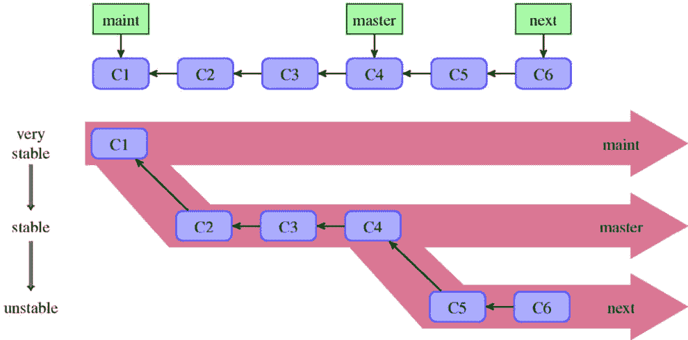
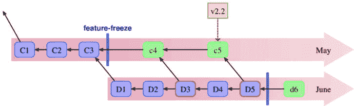
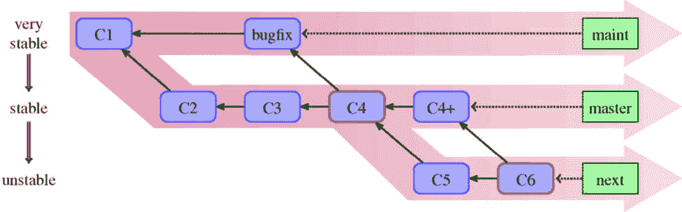
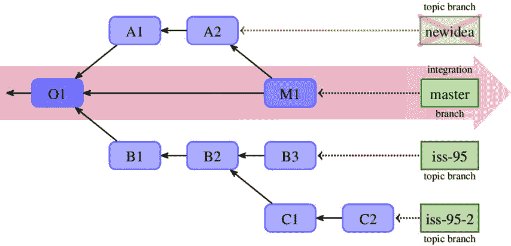
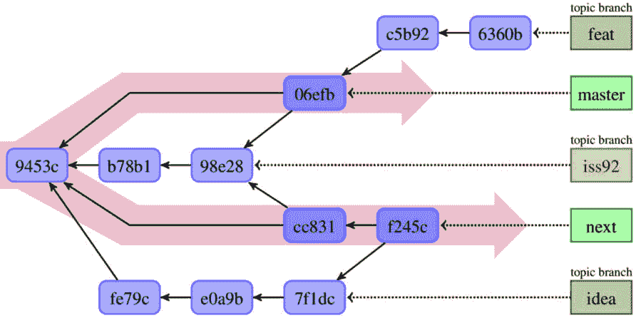
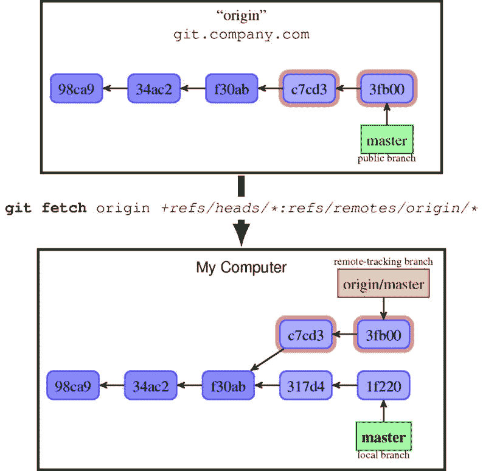

# 第八章：高级分支技术

*第六章*，*Git 的协作开发*，描述了如何在专注于仓库级交互时安排团队合作。在那一章中，您学习了各种集中式和分布式工作流及其优缺点。

本章将深入探讨分布式开发中的协作细节。我们将探索本地分支与远程仓库中的分支之间的关系。接着，我们将介绍远程跟踪分支、分支跟踪以及上游的概念。本章还将教我们如何通过使用*引用规范*和*推送模式*来指定仓库之间分支的同步。

您还将学习分支技术：如何使用分支来创建新功能、准备新版本并修复漏洞。您将了解不同分支模式的优缺点。本章将向您展示如何使用分支，以便您可以轻松选择哪些功能将进入项目的下一个版本。

在本章中，我们将涵盖以下主题：

+   不同种类的分支，包括长生命周期和短生命周期分支及其目的

+   各种分支模式，以及它们如何组成工作流

+   不同分支模型的发布工程

+   使用分支修复多个已发布版本中的安全问题

+   远程跟踪分支和引用规范

+   拉取和推送分支及标签的规则

+   选择适合所选协作工作流的推送模式

# 分支的目的

在版本控制系统中，**分支**是一个活跃的并行开发线（也叫**代码线**）。它们用于隔离、分离和汇聚不同类型的工作。例如，分支可以用于防止当前未完成的功能开发工作干扰 bug 修复的管理（隔离），或者将旧版本软件的修复集中起来（汇聚与集成）。

一个 Git 仓库可以拥有任意数量的分支。此外，使用像 Git 这样的分布式版本控制系统，单个项目可能有多个仓库（称为**分叉**或**克隆**），其中一些是公共的，一些是私有的；每个这样的仓库都会有自己的本地分支。这可以视为**源分支**。每个开发者至少会有一个项目公共仓库的私有克隆来进行工作。

一点历史——分支管理演进的简要说明

早期的分布式版本控制系统使用每个仓库一个分支的模型。当时，*Bazaar*（后来为 Bazaar-NG）和*Mercurial 文档*建议通过克隆仓库来创建新分支。

另一方面，Git 从一开始就很好地支持在单个仓库中使用多个分支。然而，最初假设会有一个中央的多分支仓库与多个单分支仓库交互（例如，遗留的 **.git/branches** 目录用于指定 URL 并拉取分支，正如 **gitrepository-layout(7)** 手册页中所描述的那样），尽管在 Git 中，这更多是关于默认设置而非能力。

因为在 Git 中创建分支非常便宜（而且合并也很容易），并且协作非常灵活，人们开始越来越多地使用分支，甚至是用于单独的工作。这导致了非常有用的主题分支工作流（也称为功能分支）的广泛使用。

## 隔离与集成

版本控制系统，如 Git，允许不同的人在相同的代码库上工作而不互相干扰。它们还使得在不同类型的工作之间切换变得容易。但这种分离的工作最终需要合并到某个集成目标中才能变得有用，并且稍后被包括在发布版本中。

我们需要*隔离*，但我们也需要*集成*变更，将工作合并成一个连贯的整体。为了尽量避免冲突，我们的变更需要对其他人可见，或者更好的是被集成。例如，如果我们改变了某个 API 的调用约定，但我们的工作仍然是隔离的，其他人就无法轻松地适应这些变化。他们会在工作中使用旧版的 API —— 导致合并冲突，并使未来的集成更加困难。因此，从这个角度来看，提前和更*频繁的集成*是值得追求的目标。

然而，一些功能更加复杂，它们的开发包含许多步骤。频繁集成的目标与*隔离未完成的工作*的需求相冲突，且防止这些工作可见。如果我们希望进行频繁集成，就需要能够处理这些问题。

## 通往生产发布的路径

软件开发的主要目标是将代码部署到生产环境，创建可用的发布版本，并让其被使用。一个适当的分支技术帮助我们为创建这样的发布版本提供稳定的基础。

使用何种分支模式取决于项目的具体情况。例如，团队可能需要将正在进行的工作与稳定的基础隔离开来。发布过程也可能会有更多或更少的摩擦。此外，你可能需要管理多个版本的发布，或者生产环境中多个版本的项目。

有一些特定的分支模式可以帮助你处理这些问题。

## 长期运行与短期存在的分支

主要目的是收集并集成变更的分支需要长时间存在，甚至是永久性的。它们的设计目的是持续存在，或至少存在很长时间；这些分支很少会被删除。

从协作的角度来看，**长期分支**可以预期在你下次更新数据或发布更改时仍然存在。这意味着你可以安全地从远程仓库中的任何长期分支派生开始工作，并确保在集成这些工作时不会遇到问题。这也意味着至少要有一个这样的分支存在。人们通常基于这些分支进行工作，定义了项目的*当前版本*，有时这些分支被称为**主干**。

长期存在的分支会一直存在，而**短期分支**或**临时分支**则用于处理单一问题，通常在问题解决后（分支合并或功能取消后）会被删除。它们的生命周期仅限于问题存在的时间。其目的是有时间限制的。

为单独的问题创建一个独立的分支有助于我们隔离并收集解决问题过程中的后续步骤，无论是添加新功能还是创建紧急的修复。这些分支通常会根据它们的主题命名。

## 分支的可见性

在*公开仓库*中，通常只能看到*长期存在的分支*。在大多数情况下，这些分支应该永远不会回滚（新版本始终是旧版本的后代）。这使得你可以安全地在公开分支上构建你的工作。

然而，这里有一些特殊情况；可能存在一些分支在每次新发布后都会被重建（此时需要强制拉取），也可能存在一些分支无法快速前进。每种情况都应该在开发者文档中明确提及，以帮助你避免不愉快的意外。

由于其临时性，*短期分支*通常仅存在于开发者或集成管理者（维护者）的*本地私有仓库*中，并不会推送到公开分发仓库。如果它们出现在公开仓库中，通常也只是作为个人贡献者的公开仓库中的目标，用于拉取请求（参见*第六章*，*与 Git 协作开发*）。

## 分支的替代方案

通过频繁的集成，可以及早发现潜在的冲突。然而，一些功能的开发需要更长时间，当推送到主干时它们可能尚未准备好。但团队不希望暴露半成品的功能。在这种以集成而非隔离为导向的分支工作流中，通常需要某种机制来隐藏未完成的工作。

一种技巧是先构建后端代码，等到它准备好时再为其创建用户界面，就像基石一样。另一方面，修改现有代码可以通过创建临时的抽象层来实现，这样等新实现准备好时，你就可以切换到底层实现。

另一种有用的方法是通过**特性开关**或**特性切换**来隐藏不同的未完成实现。这种技术在为已集成但未完成的功能提供隔离时非常有用。例如，使用运行时特性切换，你可以在实际生产数据上比较两种不同的算法，或者进行 A/B 测试。

## 无集成可见性

频繁集成到主线的替代方法是使用外部渠道。这可以通过创建一种`proposed-updates`类型的分支来实现，用来合并所有功能分支。这样可以提高更改的可见性，并提供一个测试分支集成的地方。

像*GitLive*（可作为 VS Code 扩展和 JetBrains IDE 插件使用）这样的工具和服务，可以显示谁正在处理哪个分支、哪个问题，甚至显示团队成员的本地工作副本更改。

# 分支模式

在许多情况下，分支模式的选择（即分支技术）取决于分支的稳定性，换句话说，就是分支的健康状态。一个**稳定分支**或**健康分支**是指该分支的当前提交总是能成功构建和部署，且软件运行时几乎没有或最多只有几个 bug。

确保一个分支的健康状态基本上需要每天进行构建，并且有一套全面的自动化测试，这些测试需要频繁运行——如果不是每次提交时运行，至少在每次集成（合并）时运行。然而，如何做到这一点超出了本书的范围。

## 集成模式

决定采用何种分支策略将各个变化集成到一个连贯且健康的主线中，取决于各种因素。倾向于频繁集成的技术，如持续集成，需要被合并的分支保持健康。这要求团队有高度的纪律性，确保每个开发者能够确保每个变化都经过充分测试且不会破坏已开发的应用程序。

另一方面，如果不能确定正在开发的功能质量足够好，并且我们希望在功能完成后再作为一个单元进行评估，那么较少频繁的集成可能更有意义。要求预集成代码审查也会促使你采用特定的分支模式。

### 主线集成

最简单的分支策略就是直接在主线（**主干**）上工作，并将更改（提交）直接合并到主线中。在这种工作流程中，开发者从主线开始，在其基础上进行工作。

这一策略称为**主线集成**或**基于主干的开发**（名称取决于主分支的命名）。

当开发者达到想要集成的节点时，他们会先拉取主线的最新状态。如果其他开发者在他们工作期间发布了更改，他们需要将这些更改合并，可以使用合并或重基操作——详情请参见*第九章*，*合并更改*。然后，开发者验证代码的健康状况，并将集成的更改推送到主线。

### 基于主题分支的开发

在**主题分支**模式下（也叫做**特性分支**），其理念是为每个主题创建一个新的独立分支。这可能是创建一个新特性或修复一个 bug。此类分支旨在收集特性后续的开发步骤（每一步——每个提交——应该是一个独立的单元，易于审查），并将一个特性的工作与其他主题的工作隔离开来。使用特性分支可以将相关的更改保留在一起，而不是与其他提交混合。这还使得整个主题可以作为一个单元被丢弃（或回退）、作为一个单元进行审查，并作为一个单元被接受（集成）。

主题分支上的提交的最终目标是将它们包含在产品的发布版本中。这意味着，最终，短生命周期的主题分支将被合并到长期存在的稳定工作分支中，并且该主题分支必须被删除。

为了便于集成主题分支，推荐的做法是从你最终将合并的最古老、最稳定的集成分支上创建这些分支。通常，这意味着从稳定的工作毕业分支上创建一个新的分支。然而，如果某个特性依赖于尚未稳定的主题分支，你需要从包含所需依赖的合适主题分支上进行分支。

请注意，如果你发现自己从错误的分支上进行了分支，可以通过重基来修复（参见*第九章*，*合并更改*，以及*第十章*，*保持历史清晰*），因为主题分支是非公开的。

### 持续集成

在使用主线集成模式时，集成尽可能频繁：每次提交后都进行集成。特性分支则意味着集成的周期有一个下限——你集成的是完全开发好的、具有凝聚力的特性。

使用**持续集成模式**（也叫做**规模化主干开发**），你尽量进行频繁的集成——也就是说，每当你完成了足够的更改并且分支依然健康时，就进行集成。最佳的做法是使用短生命周期的特性分支，并进行更频繁的集成。推荐的做法是至少每天集成一次，特性分支最多存活几天。

使用这种模式时，你需要能够处理部分构建的特性。如果主干代码在生产环境中运行（持续交付），你需要考虑如何避免在运行中的代码中暴露这些未完成的特性。此问题在*分支替代方案*一节中有所描述。

## 发布工程

如果主干保持足够健康，并且始终处于可发布状态（遵循持续交付的原则），你可以通过从当前提交点创建 Git 标签来标记发布版本。这种简单的分支模式称为**发布就绪主干**。

但如果情况不是这样，或者你需要管理多个版本的产品，就需要更复杂的分支模式。在这种情况下，从集成分支到生产发布的路径上需要专门的分支。

### 渐进稳定分支

一个可能的解决方案是，对于持续开发不够稳定，无法始终准备好发布（临时包括一些不稳定代码）的问题，将较不成熟的代码和较成熟的代码放在不同的 `maint`、`master`、`next` 分支中：



图 8.1 – 成熟度分支的线性视图和“筒仓”视图（也称为渐进稳定分支）

这些分支形成一个层次结构，工作稳定性的**毕业**或**稳定性**级别逐渐降低，如*图 8.1*所示。在线性视图中（图的顶部），稳定的修订版本位于提交历史的较后位置，而最前沿的不稳定工作则位于较前的位置。或者，我们可以将分支看作工作筒仓（图的底部），根据更改的稳定性（毕业）将工作分配到不同的地方。请注意，在实际开发中，渐进稳定分支不会保持如此简单。在分叉点之后，分支上会有新的修订。然而，即使存在合并，整体形状仍然是相同的。

在这里和接下来的图示中，所选的提交名称（C1、C2、C3 等）仅用于区分提交，在某些情况下，也用于便于查看哪些提交对应其他提交。

对于成熟分支，规则是始终将更稳定的分支合并到较不稳定的分支中——也就是说，**向上合并**。这将保持分支筒仓的整体形状（参见本章“毕业或渐进稳定分支工作流”一节中的*图 8.3*）。这是因为合并意味着将所有来自合并分支的更改包含在内。

因此，将一个不太稳定的分支合并到一个更稳定的分支中，会将不稳定的工作带入稳定分支，违背了稳定分支的目的和契约。

通常，我们看到以下稳定级别的毕业分支：

+   **maint**、**maintenance** 或 **fixes** 分支仅包含对上一个主要版本的漏洞修复；小版本更新通过这个分支进行。

+   **main**、**master**、**trunk** 或 **stable** 分支，开发工作面向下一个主要版本；该分支的末端应始终保持在生产就绪状态。

+   **next**、**devel**、**development** 或 **unstable** 分支，新开发的功能会被推送到此分支以测试其是否准备好进行下一个版本的发布；该分支的末端可以用于每夜构建。

+   **pu** 或 **proposed** 分支，用于提议的更新。这是集成测试分支，旨在检查不同新特性之间的兼容性。

拥有多个长期运行的分支并非必要，但在非常大或复杂的项目中往往是有帮助的。在操作中，每个稳定性级别通常对应其自身的平台或部署环境。

你不需要——也可能不应该——使用这里列出的每一种分支类型。只选择适合你项目所需的。

### 按版本分支与按版本维护

为项目准备新版本可能是一个漫长且复杂的过程。**按版本分支**可以帮助实现这一点。发布分支用于将持续的开发与准备新版本的工作区分开来。它允许其他开发人员继续进行新功能编写和集成测试，而质量保证团队则在发布经理的协助下，花时间测试和稳定发布候选版本。

创建新版本后，保持这种按版本划分的分支可以让我们支持和维护软件的旧版本。在这些时候，这些分支作为一个地方，用于集中修复漏洞（针对其软件版本）并创建小版本更新。

并非所有项目都需要使用按版本分支。你可以在稳定工作毕业分支上准备新版本，或使用单独的仓库代替使用独立分支。同时，并非所有项目都必须支持超过最新版本的版本。

这种类型的分支通常以它所针对的发布版本命名，例如 `release-v1.4`。最好不要为分支取与发布标签相同的名称。

### 发布列车与特性冻结

如果你的项目按照固定的周期发布（例如每两周或每六个月发布一次），且发布过程复杂（例如有外部测试或验证过程），那么使用发布列车分支模式可能会更有利。这可以视为按版本发布分支模式的变体。它在*图 8.2*中有示意：



图 8.2 – 月度发布的发布火车分支模式，5 月的“火车”已打标签并发布到生产，6 月的“火车”则处于功能冻结后的状态

在这种方法中，每个发布分支都与一个功能冻结日期（在计划发布日期之前）相关联。新的发布分支必须不晚于前一个发布的功能冻结日期创建。功能冻结后，集成分支转变为发布分支，只接受修复 bug 和准备项目发布的更改。这个方法通常与特性分支一起使用。

如果有多个每发布分支处于活跃状态并接受新特性，开发者可以估算完成新特性并推送到“火车”上的时间，并将其推送到较晚日期的“火车”（加载未来的火车）。较早出发的“火车”可以定期合并到较晚出发的“火车”中。

通过增加“火车”的频率并减少发布过程中的摩擦，这种模式可以过渡到持续交付模式（生产就绪的主线）。

### 安全修复的热修复分支

**热修复分支**类似于发布分支，但用于非计划发布。它们的目的是应对生产环境或广泛部署的版本的不良状态，通常是为了解决生产环境中的一些严重 bug（通常是安全漏洞）。这种类型的分支可以视为 bug 修复主题分支的长生命周期等效物（参见本章的*Bugfix 分支*部分）。

## 其他涉及长生命周期分支的分支模式

不同类型的分支主要目的是为了隔离和/或整合开发线路。然而，也存在一些不符合团队集成或生产发布路径主题的分支模式。

### 每个客户或每个部署的分支

假设你的项目有一些客户需要进行一些定制调整，因为他们的做法有所不同，或者某些部署站点有特殊要求。假设这些定制无法通过简单修改配置来完成。在这种情况下，你需要为这些客户或定制化需求创建独立的开发线路。

但是，你不希望这些开发线路保持独立。你期望会有一些变化适用于所有这些分支。一个解决方案是为每个定制集、每个客户或每个部署使用一个分支。另一个解决方案是使用独立的仓库。这两种方案都能帮助维持并行的开发线路，并将变更从一条线路传递到另一条线路。

这种环境分支可以被视为一种*反模式*。采用这种方法时，很容易引入导致生产环境与开发者工作站上行为不一致的变更，或者最终不得不为每个客户维护截然不同的产品。

### 自动化分支

假设你正在开发一个网页应用程序，并希望使用版本控制系统来自动化其部署。一种解决方案是设置一个守护进程来监视一个特定的分支（例如，名为`deploy`的分支）是否有变化。更新该分支将自动更新并重新加载应用程序。

当然，这并不是唯一的解决方案。另一种可能是使用一个单独的`deploy`仓库并在那里设置钩子，这样推送就会导致网页应用程序刷新。或者，你可以在一个公共仓库中配置钩子，使得推送到特定分支时触发重新部署（该机制将在*第十四章* *Git 管理*中描述）。

这些技术也可以用于持续集成；不是部署应用程序，而是将其推送到特定分支会触发测试套件运行（触发器可以在该分支上创建一个新的提交或合并它）。

### 用于匿名推送访问的 Mob 分支

在远程仓库（服务器上）拥有一个特别处理推送的分支是一种具有多种用途的技术，包括帮助协作。它可以用来为一个项目启用*受控的匿名推送访问*。

假设你希望允许随机的贡献者推送到中央仓库。但你会希望以一种受管理的方式进行：一种解决方案是创建一个特殊的`mob`分支或一个`mob/*`命名空间（分支集），并放宽访问控制。

你将在*第十四章* *Git 管理*中学习如何进行设置。

### 孤立分支的技巧

到目前为止描述的不同类型的分支在目的和管理上有所不同。然而，从技术角度来看（即，从提交图的角度来看），它们都是相同的。所谓的孤立分支则不同。

**孤立分支**是一个与主历史记录不共享任何修订的平行断开（孤立）开发线。它是对修订 DAG（有向无环图）中的一个不相交子图的引用，与主 DAG 图没有交集。在大多数情况下，它们的检出也由不同的文件组成。

这类分支有时被作为一种技巧，用于将与项目稍微相关的内容存储在同一个仓库中，而不是使用单独的仓库。（当使用单独的仓库存储相关内容时，你可能会想使用一些命名约定来表示这一事实——例如，使用一个常见的前缀。）它们可以用来执行以下操作：

+   存储项目的网页文件。例如，GitHub 使用一个名为**gh-pages**的分支来存储项目的网页。

+   当生成文件的过程需要一些非标准工具链时，可以存储生成的文件。例如，项目文档可以存储在 **html**、**man** 和 **pdf** 孤立分支中（**html** 分支还可以用来部署文档）。这样，用户可以获取特定格式的文档，而无需安装生成文档所需的工具链。

+   存储项目 TODO 备注（例如，在 **todo** 分支中），可能还可以将一些专门的维护者工具（脚本）存储在其中。

+   将 GitOps 的部署配置与源代码存储在同一个仓库中，而不是将代码和部署配置分开存储在两个不同的仓库中。

你可以通过 `git checkout --orphan <new branch>` 创建这样的分支，或者通过从一个独立的仓库推送到（或拉取到）特定分支，如下所示：

```
$ git fetch repo-htmldocs master:html
```

该命令将从不相关的 `repo-htmldocs` 仓库中获取 `master` 分支到未连接的 `html` “孤立”分支。

小知识

使用 **git checkout --orphan** 创建孤立分支在技术上并不创建分支——也就是说，它不会创建新的分支引用。它所做的是将符号 **HEAD** 引用指向一个尚未存在的分支。引用是在新孤立分支的第一次提交之后创建的。因此，不能使用 **git** **branch** 命令创建孤立分支。

## 其他类型的短期分支

长期存在的分支永远存在，而短期或临时分支是为了解决单个问题而创建的，通常在处理完该问题后会被删除。它们的存在时间仅与问题存在的时间一致。

由于其临时性，孤立分支通常仅存在于开发者或集成经理（维护者）的本地私有仓库中，并不会推送到公共分发仓库。如果它们出现在公共仓库中，则仅存在于个人贡献者的公共仓库中（参见 *第六章*，*使用 Git 进行协作开发*），作为拉取请求的目标。

### Bugfix 分支

我们可以区分一个特殊的主题分支，其目的是修复一个 bug。此类分支应从适用的最旧集成分支（包含该 bug 的最稳定分支）开始创建。这通常意味着从维护分支或所有集成分支的分叉点创建，而不是从稳定分支的最新提交开始。Bugfix 分支的目标是合并到相关的长期集成分支中。

Bugfix 分支可以视为长期存在的 hotfix 分支的短期替代品。使用它们比仅仅在维护分支（或其他适当的集成分支）上提交修复要更好。

### Detached HEAD – 匿名分支

你可以把**分离的 HEAD** 状态（在 *第二章*，*使用 Git 开发* 中描述）看作是最终的临时分支——临时到甚至没有名字。Git 在一些情况下会自动使用这样的匿名分支，比如在二分查找和变基时。

因为在 Git 中只有一个匿名分支，而且它必须始终是当前分支，所以通常更好地创建一个真正的临时分支，并为其指定一个临时名称；你始终可以稍后更改该分支的名称。

分离的 `HEAD` 的一种可能用途是用作概念验证工作。然而，你需要记得在修改被证明有价值时设置分支的名称（或者如果你需要切换分支）。从匿名分支转到命名分支是很容易的。你只需从当前的分离 `HEAD` 状态创建一个新分支。

# 分支工作流与发布工程

现在我们了解了不同的分支模式及其目的，让我们来看看如何将它们组合成不同的分支工作流。不同的情况需要使用不同的分支以及不同的策略。例如，较小的项目更适合简单的分支工作流，而较大的项目可能需要更复杂的工作流。

在本节中，我们将描述如何使用几种常见的工作流。每种工作流通过它所使用的不同类型的分支来区分。除了了解特定工作流的持续开发情况外，我们还将探讨在新版本发布时（对于重大版本和次要版本，视情况而定）推荐的做法。

## 发布和主干分支工作流

最简单的工作流之一是仅使用一个集成分支。这样的分支有时被称为 `main` 或 `master` 分支（它是创建仓库时的默认分支）。在该工作流的纯粹版本中，你会将所有内容提交到这个分支，至少在正常开发阶段是这样。这种工作方式源自集中式版本控制时代，那时分支，尤其是合并，代价较高，因此人们避免使用过多分支的工作流。

该工作流非常适合持续集成。如果你能够保持主干的健康状态，可以通过标记直接从主干切出新的发布版本。

另一方面，如果发布过程更为复杂，这种工作流可以与每个版本的分支一起使用。在这种情况下，当我们决定进行新版本发布时，我们会从主干创建新的发布分支。这样做是为了避免发布稳定化与持续开发工作之间的干扰。规则是，所有的稳定化工作都在发布分支上进行，而所有的持续开发都在主干上进行。**候选发布**（Release candidates）是从发布分支切出的（打标签），就像**主要版本**的最终版本一样。给定版本的发布分支可以随后用于收集 bug 修复，并从中切出**小版本发布**。

这种简单工作流的缺点是它要求维持一个健康的分支。否则，如果在开发过程中进入不稳定状态，那么很难为新版本提供一个好的起点。一种替代方案是，在发布分支上创建还原提交，撤销尚未准备好的工作。然而，这可能需要大量的工作，并且会使项目的历史变得难以跟踪。

这种工作流的另一个难点是，一个看起来不错的功能可能在后期会引发问题。这是这个工作流难以应对的情况。如果在开发过程中发现某个通过多个提交实现的功能不是一个好主意，回滚它可能会很困难。特别是当这些提交分布在时间线（历史）中时，这种情况尤为突出。

尽管存在这些问题，这种简单的工作流对于小型或自律性强的团队来说是一个不错的选择。

## 毕业分支工作流

为了能够提供产品的稳定版本，并能够将其作为一种浮动的 beta 版本进行实际测试，你需要将稳定的工作和正在进行且可能破坏代码的工作分开。这就是**毕业分支**的作用——用于集成不同成熟度和稳定性的修订（这种长期运行的分支也被称为**集成**分支或**渐进稳定性**分支）。请参见*图 8.1*，位于*成熟度或渐进稳定性分支*部分，展示了渐进稳定性分支和线性历史的简单案例的图形视图和筒仓视图。我们将这种主要（或仅）使用这种类型分支的技术称为**毕业分支工作流**。

除了保持稳定和不稳定开发分开的需求外，还需要持续的维护。如果只需要支持一个版本的产品，并且创建新版本的过程足够简单，那么你也可以为此使用毕业类型的分支。

这里，“足够简单”意味着你可以仅从稳定分支中创建下一个主要版本。

在这种情况下，你至少会有三个集成分支。一个分支用于持续的维护工作（只包含对最后版本的 bug 修复），用于创建小版本更新；另一个分支用于稳定工作，创建主要版本发布（此分支也可用于每夜构建的稳定版本）；还有一个分支用于持续开发，可能是不稳定的：



图 8.3 – 毕业或渐进稳定分支工作流。你绝不应将一个不太稳定的分支合并到更稳定的分支中，因为那样会带入所有不稳定的历史。

你可以按原样使用这个工作流，只包含毕业分支，而不包含其他类型的分支：

+   你在维护分支上提交 bug 修复，并在必要时将其合并到稳定分支和开发分支中。

+   你在稳定分支上创建经过充分测试的修订版，并在需要时将其合并到开发分支中（例如，如果新工作依赖于它们）。

+   你将进行中的工作（可能是不稳定的）放在开发分支上。

在正常开发过程中，绝不应将不太稳定的分支合并到更稳定的分支中，因为这会降低它们的稳定性。这个工作流的简化版本展示在*图 8.3*中。

当然，这要求你在开始工作之前就知道你正在处理的功能应该被视为稳定还是不稳定。另有一个前提假设是，从一开始不同的功能就能很好地协同工作。然而，在实际操作中，你会期望每个开发环节都从概念验证开始，经过可能多次迭代的进行中的工作，最终稳定下来。这个问题可以通过使用主题分支来解决，接下来会进行说明。

在纯粹的毕业分支工作流中，你会从维护分支创建小版本发布（包含 bug 修复）。主要版本发布（包含新功能）则从稳定工作分支创建。在主要版本发布后，稳定工作分支会合并到维护分支中，以开始支持刚刚创建的新版。此时，可以将一个不稳定的（开发）分支合并到稳定分支中。这是唯一允许进行向上合并——即将不太稳定的分支合并到更稳定的分支中的时候。

## 主题分支工作流

主题分支工作流的核心思想是为每个主题或功能创建一个独立的短期分支，这样所有属于某一主题的提交（即其开发过程的所有步骤）都被保留下来。每个**主题分支**的目的是开发一个新功能或修复一个 bug：



图 8.4 – 具有一个集成分支（master）和三个主题或功能分支的主题分支工作流。一个主题分支被合并到集成分支并删除

在**主题分支工作流**（也称为**功能分支工作流**）中，至少有两种不同类型的分支。首先，至少需要有一个长期存在的*集成分支*。这种类型的分支纯粹用于合并。集成分支是公开的。

其次，还有单独的短期临时*功能分支*，每个分支旨在开发某个主题或创建一个 Bug 修复。它们用于执行开发功能或修复所需的所有步骤——这是开发者的一个工作单元。这些分支可以在功能或 Bug 修复合并后删除。主题分支通常是私有的，且往往不出现在公共仓库中。

当一个功能准备好进行审查时，它的主题分支通常会被重新基准化，以便于集成，并可选择性地使历史记录更加清晰。然后，整个分支会被发送进行审查。主题分支可以用于`git format-patch`和`git send-email`。它通常会被作为一个独立的主题分支保存在维护者的工作仓库中（例如，如果作为补丁发送，可以使用`git am --3way`），以帮助检查和管理它。

然后，集成管理者（在受信任的仓库工作流中是维护者，或者在中央仓库工作流中是其他开发者）会审查每个主题分支，并决定它是否准备好合并到选定的集成分支。如果准备好了，就会进行合并（可能使用`--no-ff`选项）。

### 主题分支工作流中的毕业分支

主题分支工作流的最简单变体只使用一个集成分支。然而，通常情况下，你会将毕业分支工作流与主题分支结合使用。



图 8.5 – 具有两个毕业分支的主题分支工作流。在主题分支中，有一个足够稳定的分支，可以合并到两个毕业分支

在这个常用的变体中，功能分支通常是从给定稳定分支的最新状态（通常是）或最后一个主要发布版本开始，除非该分支需要某个其他功能。在后者的情况下，该分支需要从其依赖的主题分支中分叉（即从该主题分支创建），例如*图 8.5*中的`feat`分支。Bugfix 主题分支是在维护分支之上创建的。

当该主题被认为完成时，它会被合并到开发工作集成分支（例如，`next`）进行测试。例如，在*图 8.5*中，主题分支 `idea` 和 `iss92` 都已合并到 `next`，而 `feat` 还未准备好。冒险的用户可以使用来自不稳定分支的构建来体验该功能，但必须考虑到崩溃和数据丢失的可能性。

在经过这一步检查后，当功能被认为已准备好被包含在下一个版本中时，它会被合并到稳定工作集成分支（例如，`master`）。*图 8.5* 包含了这样一个分支：`iss92`。此时，在将它合并到稳定集成分支后，主题分支可以被删除。

使用功能分支可以将专题修订保持在一起，而不会与其他提交混合。主题分支工作流使你可以轻松地整体撤销主题并一起删除所有错误提交（以整体单元移除一系列提交），而不是通过一系列回滚操作。

如果该功能最终被认为还未准备好，它就不会被合并到稳定分支，而只会保留在开发工作分支中。然而，如果我们意识到它未准备好已经太晚，主题已经被合并到稳定分支后，我们就需要回滚合并。这比回滚单个提交稍微复杂一些，但比一个个回滚提交要更简单，同时能确保所有提交都被正确回滚。有关回滚合并的更多问题，请参阅*第十章*，*保持* *历史* *清晰*。

包含 bug 修复的主题分支工作流类似。唯一的不同是，你需要考虑该 bugfix 分支将合并到哪个集成分支。这当然取决于具体情况。也许该 bug 修复仅适用于维护分支，因为它是通过稳定工作分支和开发工作分支中的新功能意外修复的；那么，它就只会合并到该分支。也许该 bug 仅适用于稳定工作和开发工作分支，因为它涉及一个在先前版本中不存在的功能，因此维护分支不会被合并进来。

使用单独的主题分支来修复 bug，而不是直接提交修复，有一个额外的优势：如果事后发现修复涉及的分支比预期的更多，这样可以轻松纠正错误。

例如，如果发现修复也需要应用到维护版本，而不仅仅是当前的工作版本，使用主题分支时，你可以简单地将修复合并到其他分支中。如果直接将修复提交到稳定分支，则不能这样操作。在后一种情况下，你不能使用合并，因为这会破坏维护分支的稳定性。你需要通过**挑选提交**（**cherry-picking**）将修复从其原始提交分支复制到维护分支中（有关此操作的详细描述，请参见*第九章*，*合并更改*）。但是，这意味着在项目历史中会出现重复的提交，而挑选的提交有时可能与合并操作发生冲突。

主题分支工作流还允许我们检查功能是否相互冲突，并在必要时进行修复。你可以简单地创建一个临时的集成分支，将包含这些功能的主题分支合并到该分支中，以测试它们之间的相互作用。你甚至可以发布这样的集成测试分支（例如命名为`proposed-updates`或简称`pu`），让其他开发者查看正在进行的工作。然而，你应该在开发者文档中明确声明，不应以该分支为基础进行工作，因为它每次都会从头创建。

### 主题分支工作流中的发布分支管理

假设我们使用三个毕业（集成）分支：`maint`用于上一个版本的维护工作，`master`用于稳定工作，`next`用于开发。

在创建新版本之前，维护者（发布经理）需要做的第一件事是验证`master`是否包含`maint`的所有内容——也就是说，所有的错误修复是否也已应用于正在考虑发布的下一个版本。你可以通过检查以下命令是否输出空结果来验证这一点（见*第四章*，*探索* *项目历史*）：

```
$ git log master..maint
```

如果上述命令显示有未合并的提交，维护者需要决定如何处理这些提交。如果这些错误修复没有破坏任何内容，可以直接将`maint`合并到`master`中（因为这相当于将更稳定的分支合并到较不稳定的分支）。

现在，维护者知道`master`是`maint`的超集后，可以通过为远程`master`分支打标签来创建新版本，并将新创建的标签推送到分发点（即公共仓库），可以使用以下命令：

```
$ git tag -s -m "Foo version 1.4" v1.4 master
$ git push origin v1.4 master
```

上述命令假设 Foo 项目的公共仓库是由`origin`描述的，并且我们采用双位数字版本号来表示主要版本（遵循语义版本控制规范）。

提示

如果维护者想要支持多个旧版本，他们需要复制一个旧的维护分支，因为接下来的步骤是准备它以维护刚刚发布的版本：**git branch** **maint-1.3.x maint**。

然后，维护者将`maint`更新到新发布版本，推进该分支（注意，第一步确保了`maint`是`master`的子集）：

```
$ git checkout maint
$ git merge --ff-only master
```

如果第二个命令失败，意味着`maint`分支上的一些提交没有出现在`master`中，或者更准确地说，`master`不是`maint`的严格后代。

因为我们通常会逐个考虑将特性合并到`master`中，所以可能有一些主题分支被合并到了`next`中，但它们在合并到`master`之前被放弃了（或者由于未准备好而未合并）。这意味着，虽然`next`分支包含了构成`master`分支的主题分支的超集，但`master`不一定是`next`的祖先。

这就是为什么在发布后推进`next`分支比推进`maint`分支更复杂的原因。一个解决方案是回退并重建`next`分支：

```
$ git checkout next
$ git reset --hard master
$ git merge ai/topic_in_next_only_1...
```

你可以通过运行以下命令找到未合并的主题分支，以便合并并重建`next`：

```
$ git branch --no-merged next
```

在重建`next`分支并创建发布版本后，其他开发者需要强制获取`next`分支（见下一节），因为如果没有配置为强制获取，它是无法快速前进的：

```
$ git pull
From git://git.example.com/pub/scm/project
   62b553c..c2e8e4b  maint      -> origin/maint
   a9583af..c5b9256  master     -> origin/master
 + 990ffec...cc831f2 next       -> origin/next  (forced update)
```

注意这里对`next`分支的强制更新。

## git-flow——一个成功的 Git 分支模型

更高级的主题分支工作流版本是在毕业分支模型的基础上构建的。在某些情况下，可能需要一个更复杂的分支模型，使用更多类型的分支：毕业分支、发布分支、热修复分支和主题分支。其中一种模型是`git-flow`。

这个开发模型使用两个主要的长期运行分支`master`（稳定工作）和`develop`（收集下一个发布的更改）。后者可以用于夜间构建。这两个集成分支有无限的生命周期。

这些分支伴随有**支持分支**——也就是*特性分支*、*发布分支*和*热修复分支*。

每个新特性都在`devel`或`master`分支上开发，具体取决于特性的需求。当特性开发完成后，其主题分支会使用`--no-ff`选项进行合并（这样就会总是创建一个合并提交，用来描述特性）到`devel`进行集成测试。当它们准备好进行下一次发布时，它们会被合并到`master`分支。主题分支只在特性开发期间存在，并在合并后被删除（或在放弃时删除）。

**发布分支**的目的有两个。当创建时，目标是准备新的生产版本发布。这意味着进行最后的清理、应用小的 bug 修复，并准备发布的元数据（例如，版本号、发布名称等）。除了最后一步之外，所有工作都应该通过主题分支完成；元数据可以直接在发布分支上准备。发布分支的使用使我们能够将即将发布版本的质量保证与为下一个大版本开发功能的工作分开。

此类发布分支是在稳定状态反映或接近新发布所规划的理想状态时分叉出来的。每个这样的分支都以发布命名，通常是类似`release-1.4`或`release-v1.4.x`的名称。通常，你会从这个分支创建几个发布候选版本（将它们标记为`v1.4-rc1`等），然后再标记新发布的最终版本（例如，`v1.4`）。

发布分支可能只会存在到项目发布它所创建的版本为止，或者它可能会被保留以进行维护工作：为给定版本修复 bug。在后一种情况下，它会替代其他工作流中的`maint`分支。

`hotfix-1.4.1`或类似名称。如果相应的发布（维护）分支不存在，则从旧的发布标签创建一个热修复分支。这种分支的目的是解决生产版本中发现的关键 bug。在这些分支上进行修复后，会发布小版本（为每个这样的分支）。

## Ship/Show/Ask —— 现代分支策略

这种方法尝试在进行预集成代码审查的拉取请求和特性分支与基于主干开发所提供的高频集成和发布就绪主线之间找到一个平衡。

在这个工作流中，每次做出修改时，你需要选择三个选项之一——*Ship*、*Show* 或 *Ask*。选择**Ship**时，你会将更改直接合并到主线（类似于基于主干的开发）。如果你想要快速集成并确保更改是健康的，这种方法非常有用——例如，当你使用已建立的模式添加一个功能、修复一个简单的 bug，或者更新文档时。

选择**Show**时，你会打开一个拉取请求，但如果自动检查通过，则立即合并它。这允许在不让特性等待的情况下进行轻松的集成后审查。

最后，选择**Ask**时，你会遵循主题分支工作流，并在集成前等待代码审查。

## 修复安全问题

让我们再看另一种情况：如何使用分支来修复 bug，比如安全问题。这需要比普通开发稍微不同的技巧。

正如*主题分支工作流*部分所解释的那样，虽然可以在最稳定的集成分支上直接创建 bug 修复提交，但通常最好创建一个单独的 bug 修复分支。

你首先从需要应用修复的最旧（最稳定）的集成分支上进行分叉，可能甚至是在所有相关分支的分叉点。你将修复（可能包含多个提交）放到你刚刚创建的分支上。测试完成后，你只需要将 bug 修复分支合并到每个需要修复的集成分支中。

该模型也可以用于在早期阶段解决分支之间的冲突（依赖关系）。假设你正在开发某个尚未完成的新特性（在一个主题分支上）。在编写过程中，你发现开发版本中存在一些 bug，并且知道如何修复它们。你希望在修复后的状态上进行开发，但你意识到其他开发人员也会需要这个 bug 修复。将修复提交到特性分支上会让 bug 修复“被绑架”。直接在集成分支上修复 bug，则有可能忘记将修复合并到正在进行中的特性分支中。

解决方案是：在一个单独的主题分支上创建修复，并将其合并到正在开发的特性主题分支以及测试集成分支中（并可能合并到发布分支）。

提示

你可以使用类似的技术来创建和管理一些客户群体要求的特性。你只需要为每个这样的特性创建一个单独的主题分支，并将其合并到每个客户的单独分支中。

如果涉及安全问题，事情就会变得更加复杂。在严重的安全漏洞情况下，你不仅需要在当前版本中修复它，还需要在所有广泛使用的版本中修复它。

为此，你需要为各种维护轨道创建一个热修复分支（从指定版本分叉）。

```
$ git checkout -b hotfix-1.9.x v1.9.4
```

然后，你需要将包含修复的主题分支合并到新创建的热修复分支中，最终创建 bug 修复发布版本：

```
$ git merge CVE-2014-1234
$ git tag -s -m "Project 1.9.5" v1.9.5
```

# 与远程仓库中的分支交互

如我们所见，在单个仓库中拥有多个分支非常有用。简便的分支和合并使得利用高级分支技术（如主题分支）的强大开发模型成为可能。这意味着远程仓库也将包含许多分支。因此，我们必须超越仅仅关注仓库间的交互，正如*第六章*《*使用 Git 进行协同开发*》中所描述的那样，我们必须考虑如何与远程仓库中的多个分支进行交互。

我们还需要考虑仓库中的本地分支与远程仓库中的分支（或一般的其他引用）之间的关系。另一个重要的知识点是本地仓库中的标签与其他仓库中的标签之间的关系。

理解仓库之间、这些仓库中的分支之间的交互，以及如何合并变更（如*第九章*，*合并变更*所述），对于真正掌握与 Git 的协作至关重要。

## 上游与下游

在软件开发中，**上游**指的是指向项目原作者或维护者的方向。如果一个*仓库*距离我们更近（在仓库与仓库之间的步骤上），那么我们可以说它是上游的，即指向那个被认定为软件源代码的仓库。如果一个变更（补丁或提交）被上游接受，它将立即或在未来的应用发布中包含，并且所有**下游**的人都将接收到这个变更。

类似地，我们可以说远程仓库中的某个给定*分支*（维护者仓库）是某个本地分支的**上游分支**，如果该本地分支中的变更最终将被合并并包含到远程分支中。

配置上游的定义

快速提醒：给定分支的上游仓库和上游分支在该远程仓库中的定义分别由**branch.<branchname>.remote**和**branch.<branchname>.merge**配置变量确定。上游分支可以通过**@{upstream}**或**@{****u}**快捷方式进行引用。

上游分支通常是在从远程跟踪分支创建一个新分支时设置的，且可以通过**git branch --set-upstream-to**或**git push --set-upstream**进行修改。

上游分支不一定是远程仓库中的分支。它也可以是本地分支，尽管我们通常称其为**跟踪分支**，而不是称其为上游分支。当一个本地分支基于另一个本地分支时，这一功能特别有用，比如当一个主题分支是从另一个主题分支派生出来时（因为它包含了后续工作所需的功能）。

## 远程跟踪分支与引用规范

在协作项目中，你会与许多仓库进行交互（见*第六章*，*与 Git 的协作开发*）。你交互的每一个远程仓库都会有关于分支位置的概念。例如，远程仓库`origin`中的`master`分支不需要与你克隆仓库中的本地`master`分支在同一个位置。换句话说，它们不需要指向修订图中的同一个提交。

### 远程跟踪分支

为了能够检查集成状态，查看`origin`远程仓库中有哪些尚未同步到本地的更改，或查看你在本地仓库中所做的更改且尚未发布的内容，你需要知道远程仓库中分支的位置（嗯，也就是它们上次与这些仓库通信时的位置）。这是**远程跟踪分支**的任务——这些引用用于追踪远程仓库中分支的位置：



图 8.6 – 远程仓库和本地仓库，包含本地分支和远程跟踪分支。fetch 命令中灰色文本表示默认的隐式参数。

为了跟踪远程仓库中的变化，远程跟踪分支会自动更新；这意味着你无法在其上创建新的本地提交（因为在更新过程中这些提交会丢失）。你需要为此创建一个本地分支。例如，你可以通过运行`git checkout <branchname>`来实现，前提是具有给定名称的本地分支尚未存在。此命令会从远程分支的`<branchname>`创建一个新的本地分支，并为其设置上游信息。

### Refspec – 远程到本地分支的映射规范

如在*第四章*《探索项目历史》中所述，本地分支位于`refs/heads/`命名空间中，而针对某个远程仓库的远程跟踪分支位于`refs/remotes/<远程名称>/`命名空间中。但这仅仅是默认设置。`fetch`（和`push`）命令中的`remote.<远程名称>`配置描述了远程仓库中的分支（或其他引用）与本地仓库中的远程跟踪分支（或其他引用）之间的映射关系。

这种映射称为**refspec**；它可以是显式的，逐一映射分支，也可以是通配符的，描述映射模式。

例如，`origin`仓库的默认映射如下所示：

```
[remote "origin"]
    fetch = +refs/heads/*:refs/remotes/origin/*
```

这表示，例如，远程仓库`origin`中的`master`分支（完整名称为`refs/heads/master`）的内容将存储在本地仓库的远程跟踪分支`origin/master`（完整名称为`refs/remotes/origin/master`）中。模式开头的加号（`+`）告诉 Git 接受那些非快进更新的远程跟踪分支——也就是说，它们不是前一个值的后代。

映射可以通过远程配置中的 fetch 行给出，如前所示，或者也可以作为命令的参数传递（通常只需要指定引用的短名称，而不需要完整的 refspec）。只有在命令行没有 refspec 时，配置才会被考虑。

## 获取和拉取与推送的区别

向远程仓库发送更改（发布）可以通过`git push`完成，而从远程获取更改可以通过`git fetch`完成。这些命令会将更改发送到相反的方向。然而，请注意，你的本地仓库有一个非常重要的区别—它有你坐在键盘旁边，这样你可以随时运行其他 Git 命令。

这就是为什么在本地到远程的方向上没有与`git pull`等效的命令，因为`git pull`结合了获取和集成更改（请参阅下一节）。只是没有人能够解决可能发生的冲突（在进行自动化集成时发生的问题）。

特别地，分支和标签的获取方式与推送方式有所不同。这个问题将在后面详细解释。

### Pull – 获取并更新当前分支

许多时候，你可能想将远程仓库特定分支的变更合并到当前分支中。`git fetch` 会根据给定的参数来执行操作；然后，它会自动将检索到的分支头合并到当前分支。根据配置，它会调用`git merge`或`git rebase`来完成这个操作。你可以使用`--rebase=false`或`--rebase`选项来覆盖默认设置，这些设置可以通过`pull.rebase`配置选项或每个分支的`branch.<branch name>.rebase`配置选项进行全局配置。

请注意，如果远程没有配置（你是通过 URL 执行 pull 操作），Git 会使用`FETCH_HEAD`引用来存储已获取分支的提示。

还有一个`git request-pull`命令，用于创建有关已发布或待处理更改的信息，适用于基于拉取的工作流—例如，适用于变体的受祝福的仓库工作流。它会创建一个简单文本格式的 GitHub 合并请求，特别适合通过电子邮件发送。

### 向非裸远程仓库的当前分支推送

通常，你推送的仓库是为了同步而创建的，并且是`HEAD`）– 这里没有工作树，因此没有被检出的分支。

然而，有时你可能想要推送到非裸仓库。例如，这种情况可能发生在同步两个仓库，或者作为部署机制（例如，网页或 Web 应用程序的部署）。默认情况下，Git 服务器会拒绝对当前检出的分支进行 ref 更新。这是因为它会使 `HEAD` 与工作树和暂存区不同步，如果你没有预料到这一点，会非常混淆。然而，你可以通过将 `receive.denyCurrentBranch` 设置为 `warn` 或 `ignore`（将其从默认的 `refuse` 更改）来启用这种推送。你甚至可以通过将此配置变量设置为 `updateInstead` 来使 Git 更新工作目录（必须是干净的，即没有未提交的更改）。

使用 `git push` 部署的一个替代方案和更灵活的解决方案是配置接收方的适当钩子 – 有关钩子的详细信息，请参见 *第十三章*，*自定义和扩展 Git*，以及 *第十四章*，*Git 管理*，了解它们在服务器上的使用情况。

### 默认的 fetch refspec 和 push 模式

我们通常从公开仓库获取所有公开的分支。通常，我们希望更新所有分支的最新状态。这就是为什么 `git clone` 设置了默认的 `git pull <``URL> <branch>`。

在私有工作仓库中，通常会有许多我们不希望发布的分支，或者至少是我们暂时不想发布的分支。在大多数情况下，我们希望发布一个单一的分支：我们正在处理的分支，而且我们知道它已经准备好。然而，如果你是集成经理，你会希望发布一个精心挑选的分支子集，而不是仅仅发布一个单独的分支。

这又是 fetch 和 push 之间的另一个区别。这也是为什么 Git 默认不设置推送 refspec（尽管你可以手动配置），而是依赖于所谓的 `push.default` 配置变量，该变量仅在运行 `git push` 命令时使用，当没有明确指定要推送的分支时适用。

使用 git push 从无法拉取的主机同步

当你在两台机器上工作，**machineA** 和 **machineB**，每台机器都有自己的工作树时，一个典型的同步方式是相互运行 **git pull**。然而，在某些情况下，你可能只能在一个方向上建立连接（例如，由于防火墙或间歇性的连接问题）。假设你可以从 **machineB** 拉取和推送，但无法从 **machineA** 拉取。

你希望从 **machineB** 向 **machineA** 执行推送操作，使得操作的结果与在 **machineA** 上执行 `fetch` 几乎没有区别。为此，你需要通过 refspec 指定你希望将本地分支推送到其远程追踪分支：

**machineB$ git push** **machineA:repo.git \**

**refs/heads/master:refs/remotes/machineB/master**

第一个参数是类似**scp**语法的 URL，而第二个参数是 refspec。你可以在配置文件中设置它，以防你经常需要执行类似操作。

## 获取和推送分支与标签

下一节将描述可用的推送模式，以及何时使用它们（适用于哪些协作工作流）。但首先，我们需要了解 Git 在与远程仓库交互时如何处理标签和分支。

因为推送并不是获取的完全反面操作，而且分支和标签的目标不同（分支指向开发线路，而标签指向特定的修订版本），所以它们的行为有细微的不同。

### 获取分支

获取分支非常简单。在默认配置下，`git fetch`命令会下载更改并更新远程跟踪分支（如果可能）。后者是根据远程的获取 refspec 完成的。

当然，这条规则也有例外。其中一个例外是`git clone --mirror`会为`origin`生成以下配置：

```
[remote "origin"]
    url = https://git.example.com/project
    fetch = +refs/*:refs/*
    mirror = true
```

获取的 ref 名称及其指向的对象名称会写入`.git/FETCH_HEAD`文件中。例如，`git pull`会使用这些信息；如果我们通过 URL 获取而不是通过远程名称获取，这就很有必要。这样做的原因是，当我们通过 URL 获取时，根本没有远程跟踪分支来存储关于被获取分支的信息。

你可以根据需要通过`git branch -r -d`删除远程跟踪分支；如果远程仓库中相应的分支不再存在，你也可以通过`git remote prune`（或者在现代 Git 中使用`git fetch --prune`）逐个删除它们。

### 获取标签和自动跟踪标签

标签的情况有些不同。虽然我们希望不同的开发者能够在同一个分支上独立工作（例如，`master`这样的集成分支），但在不同的仓库中，我们需要所有开发者都有一个特定的标签来始终指向相同的特定修订版本。这就是为什么远程仓库中的分支位置使用一个独立的每远程仓库命名空间`refs/remotes/<remote name>/*`存储在远程跟踪分支中，而标签则是镜像的——每个标签都以相同的名称存储在`refs/tags/*`命名空间中。

提示

请注意，远程仓库中标签的位置可以通过适当的获取 refspec 进行配置；Git 是如此灵活。一个可能需要这样操作的例子是获取子项目，我们希望将其标签存储在一个独立的命名空间中（有关此问题的更多信息，请参见*第十一章*，*管理子项目*）。

这也是为什么默认情况下，在下载更改时，Git 会同时拉取并存储所有指向下载对象的标签。你可以使用`--no-tags`选项禁用此行为。此选项可以作为命令行参数设置，或者可以通过`remote.<remote` `name>.tagopt`设置进行配置。

你还可以使用`--tags`选项使 Git 下载所有标签，或者通过为标签添加适当的拉取 refspec 值：

```
    fetch = +refs/tags/*:refs/tags/*
```

### 推送分支和标签

推送是不同的。推送分支（通常）由所选的推送模式控制。你将本地分支（通常只有一个当前分支）推送到远程仓库中的特定分支，从本地的`refs/heads/`推送到远程的`refs/heads/`。通常是同名的分支，但它也可能是配置为上游的不同名称的分支——详细信息稍后会提供。你不需要指定完整的 refspec：使用 ref 名称（例如，分支名称）意味着将其推送到远程仓库中同名的 ref，如果它不存在则会创建它。推送`HEAD`意味着将当前分支推送到同名的分支（而不是远程的`HEAD`——它通常不存在）。

通常，你通过`git push <远程仓库> <标签>`显式推送标签（或者如果有同名的标签和分支，使用`tag <标签>`——两者都表示`+refs/tags/<标签>:refs/tags/<标签>` refspec）。你也可以使用`--tags`推送所有标签（并带有适当的 refspec），并使用`--follow-tags`开启自动标签（默认情况下没有开启，像拉取时一样）。

作为 refspec 的一种特殊情况，将“空”源推送到远程的某个 ref 会删除它。`git push`的`--delete`选项只是使用这种类型的 refspec 的快捷方式。例如，要删除远程仓库中与`experimental`匹配的 ref，可以运行以下命令：

```
$ git push origin :experimental
```

请注意，远程服务器可能会通过`receive.denyDeletes`配置选项或钩子禁止删除 refs。

## 推送模式及其使用

如果没有指定推送内容的参数，并且没有配置推送的 refspec，`git push`的行为由**推送模式**决定。

有不同的模式可供选择，每种模式适用于不同的协作工作流，详情见*第六章*，*使用 Git 进行协作开发*。

### “简单”推送模式——默认模式

Git 2.0 及更高版本的默认推送模式是所谓的`简单`模式。它的设计理念是*最小惊讶*：即防止意外将某个私有分支发布出去要比让私有更改意外公开更好。

在这种模式下，你始终将当前本地分支推送到远程仓库中同名的分支。如果你将更改推送到与拉取的同一仓库（集中式工作流），则需要为当前分支设置上游。上游与分支同名。

这意味着在集中式工作流中（推送到你拉取的同一仓库），它像`upstream`一样工作，额外的安全性是上游必须与当前（推送的）分支具有相同的名称。在三角形工作流中，当推送到与通常拉取的远程仓库不同的远程仓库时，它像`current`一样工作。

这是最安全的选项，非常适合初学者，因此它是默认模式。你可以通过`git config` `push.default simple`显式启用此模式。

### 维护者的“匹配”推送模式

在 Git 2.0 版本之前，默认的推送模式是`matching`。这种模式对于维护者（也称为集成经理）在受信任的仓库工作流中非常有用。但大多数 Git 用户并不是维护者；这就是默认推送模式被更改为`simple`的原因。

维护者将从其他开发者那里获取贡献，无论是通过拉取请求还是通过电子邮件发送的补丁，并将它们放入主题分支中。他们还可以为自己的贡献创建主题分支。然后，被认为适合的主题分支会被合并到适当的集成分支中（例如，`maint`、`master`和`next`）——合并将在*第九章*中讨论，*合并变更*。所有这些操作都在维护者的私人仓库中完成。

公共受信仓库（每个人都会从中拉取的仓库，如*第六章*中所述，*与 Git 的协作开发*）应只包含长期存在的分支（否则，其他开发者可能会开始基于一个突然消失的分支进行工作）。Git 无法自行判断哪些分支是长期存在的，哪些是短期存在的。

在匹配模式下，Git 将推送所有本地分支，这些分支在远程仓库中有相同名称的对应分支。这意味着只有已经发布的分支才会被推送到远程仓库。要使新分支公开，你需要第一次显式推送它，像这样：

```
$ git push origin maint-1.4
```

重要提示

请注意，在此模式下，与其他模式不同，使用**git push**命令而不提供要推送的分支列表时，可以一次性推送多个分支，并且可能不会推送当前分支。

要全局启用匹配模式，你可以运行以下命令：

```
$ git config push.default matching
```

如果你想为特定仓库启用匹配模式，你需要使用由单个冒号组成的特殊 refspec。假设该仓库名为`origin`，并且我们希望进行非强制推送，可以使用以下命令：

```
$ git config remote.origin.push :
```

当然，你可以通过在命令行中使用以下 refspec 来推送匹配的分支：

```
$ git push origin :
```

### 集中式工作流的“upstream”推送模式

在集中式工作流中，所有开发者都有提交权限，向一个单一的共享中央仓库推送代码。这个共享仓库通常只会有长期存在的集成分支，通常是`maint`和`master`，有时只有`master`。

你最好永远不要直接在`master`上工作（也许只有在简单的单提交主题的情况下除外），而是应该从远程跟踪分支中为每个独立功能派生一个主题分支：

```
$ git checkout -b feature-foo origin/master
```

在集中式工作流中，集成是分布式的：每个开发者负责合并其主题分支中的更改，并将结果发布到中央仓库的`master`分支。你需要更新本地的`master`分支，将主题分支合并到其中，然后推送：

```
$ git checkout master
$ git pull
$ git merge feature-foo
$ git push origin master
```

另一种解决方案是将主题分支重新基于远程跟踪分支，而不是将其合并。重新基准化后，主题分支应成为远程仓库中`master`的祖先，因此我们可以直接将其推送到`master`：

```
$ git checkout feature-foo
$ git pull --rebase
$ git push origin feature-foo:master
```

在这两种情况下，你都是将本地分支（在基于合并的工作流中是`master`，在基于重新基准化的工作流中是功能分支）推送到它在远程仓库中跟踪的分支——在这种情况下是 origin 的`master`。

这正是创建`upstream`推送模式的原因：

```
$ git config push.default upstream
```

该模式使 Git 将当前分支推送到远程仓库中的特定分支——该分支通常是将更改集成到当前分支的目标分支。远程仓库中的这个分支就是上游分支（可以用`@{upstream}`引用）。启用此模式后，可以将两个示例中的最后一条命令简化为以下内容：

```
$ git push
```

上游信息是通过自动方式（当从远程跟踪分支分支时）或通过`--track`选项显式创建的。它存储在配置文件中，可以使用普通的配置工具进行编辑。

或者，稍后可以通过以下方式更改：

```
$ git branch --set-upstream-to=<branchname>
```

### 受托仓库工作流的“当前”推送模式

在受托仓库工作流中，每个开发者都有一个私有仓库和一个公共仓库。在这种模型中，你从受托仓库拉取代码并推送到你的公共仓库。

在这种工作流中，你通过为每个功能创建一个新的主题分支来开始工作：

```
$ git checkout -b fix-tty-bug origin/master
```

当功能准备好时，你将其推送到公共仓库，可能先进行重新基准化，以便让维护者更容易合并：

```
$ git push origin fix-tty-bug
```

这里假设你已经使用`pushurl`配置了三角工作流，推送远程是`origin`。如果你使用的是一个单独的远程仓库来作为公共仓库（使用不同的仓库不仅可以用于发布，还可以用于不同机器之间的同步），你需要将此处的`origin`替换为公共仓库的正确远程名称。

你可以配置 Git，使得当你处于`fix-tty-bug`分支时，只需运行`git push`即可。为此，你需要设置 Git 使用`current`推送模式，像这样：

```
$ git config push.default current
```

此模式将把当前分支推送到接收端同名的分支。

请注意，如果你使用的是单独的远程发布仓库，则需要设置`remote.pushDefault`配置选项，以便只使用`git push`进行发布。

# 总结

本章展示了如何有效地使用分支进行开发和协作。你还学到了一些实用的技巧。

首先，我们了解了分支的各种用途，从集成、发布管理、特性并行开发到修复 bug。你学习了不同的分支模式和分支工作流。这些知识应该能帮助你根据项目的需求和团队的偏好，灵活地创建和定制工作流。

你还学会了如何在下载或发布变更时处理每个仓库的多个分支。Git 提供了灵活性来管理远程仓库中分支和其他引用的相关信息，使用所谓的 refspec 来定义本地引用的映射：远程追踪分支、本地分支和标签。通常，获取操作由获取 refspec 管理，但推送则由配置的推送模式管理。各种协作工作流要求对分支发布的处理方式不同；本章描述了哪种推送模式适用于哪种工作流，并解释了原因。

下一章，*第九章*，*合并变更*，将解释如何集成来自其他分支和开发者的变更。你将学习合并和变基，以及如何处理 Git 无法自动执行这些操作的情况（如何处理各种类型的合并冲突）。你还将学习如何使用樱桃挑选（cherry-picking）和回滚提交。

# 问题

回答以下问题以测试你对本章内容的理解：

1.  经常集成有哪些优点？

1.  主题分支有哪些优点？

1.  如何将一个项目网页或其 GitOps 配置与代码一起存储在同一个仓库中，同时保持它们的历史记录和文件分开？

1.  如何同步托管在其他计算机上的 Git 仓库的工作目录？

# 答案

以下是本章问题的答案：

1.  更频繁的集成可以带来更容易的集成，因为差异较小，冲突的可能性较低，而且冲突能更早发现。它还使得维护一个随时可以投入生产的主分支变得更加容易，缩短了将特性投入生产环境的时间。

1.  使用主题分支可以更容易地回顾和检查创建一个特性所需的步骤，并在必要时移除它。主题分支的使用也与集成前的代码审查要求相得益彰。

1.  你可以使用“孤儿”分支技巧——例如，使用 **git checkout -- orphan**——在一个仓库中拥有两个或更多不相关的历史记录。

1.  登录到另一台计算机并使用 **git pull**；如果无法这样做，可以将更改 **git push** 到非裸仓库中（配置已检出分支的处理方式）。

# 进一步阅读

要了解更多本章讨论的主题，请查看以下资源：

+   Martin Fowler，*管理源代码分支的模式*（2020 年）： [`martinfowler.com/articles/branching-patterns.html`](https://martinfowler.com/articles/branching-patterns.html)

+   Rouan Wilsenach，*Ship / Show / Ask: 一种现代分支策略*（2021 年）： [`martinfowler.com/articles/ship-show-ask.html`](https://martinfowler.com/articles/ship-show-ask.html)

+   Vincent Driessen，*git-flow - 一种成功的 Git 分支模型*（2010 年）： [`nvie.com/posts/a-successful-git-branching-model/`](https://nvie.com/posts/a-successful-git-branching-model/)

+   *gitworkflows - Git 推荐工作流概览*： [`git-scm.com/docs/gitworkflows`](https://git-scm.com/docs/gitworkflows)

+   Paul Hammant 和其他人，*基于主干的* *开发*： [`trunkbaseddevelopment.com/`](https://trunkbaseddevelopment.com/)

+   Junio C Hamano: *提前解决主题分支之间的冲突/依赖关系*（2009 年）： [`gitster.livejournal.com/27297.html`](https://gitster.livejournal.com/27297.html)

+   Junio C Hamano，*各种工作流的乐趣 1* 和 *2*（2013 年）： [`git-blame.blogspot.com/2013/06/fun-with-various-workflows-1.html`](https://git-blame.blogspot.com/2013/06/fun-with-various-workflows-1.html) 和 [`git-blame.blogspot.com/2013/06/fun-with-various-workflows-2.html`](https://git-blame.blogspot.com/2013/06/fun-with-various-workflows-2.html)
