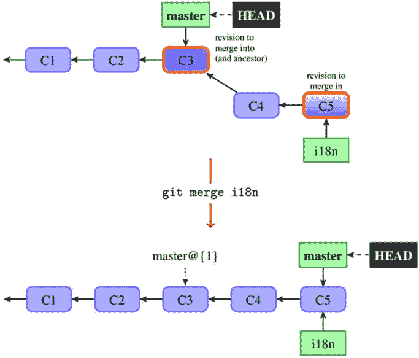
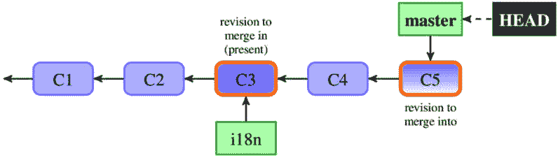
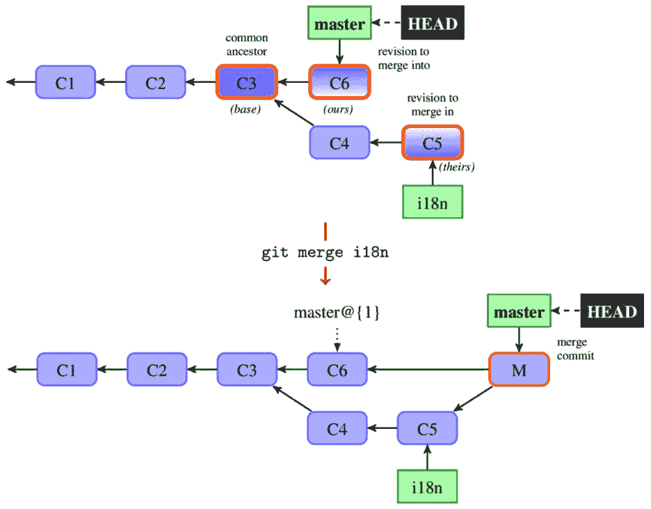
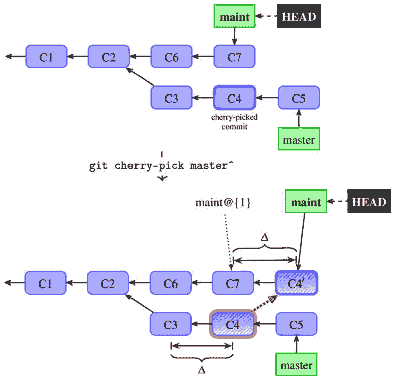
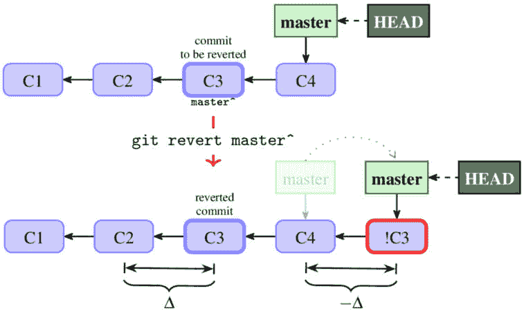
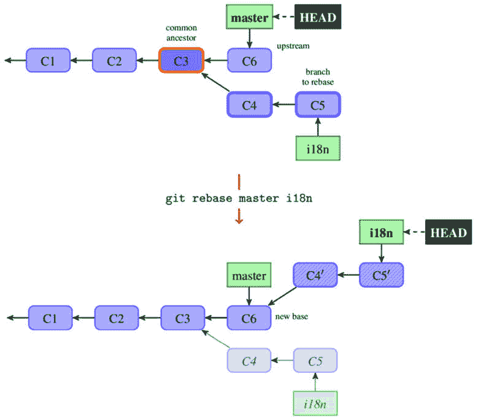
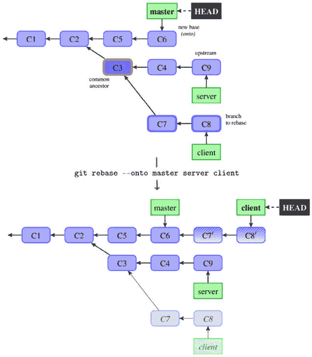
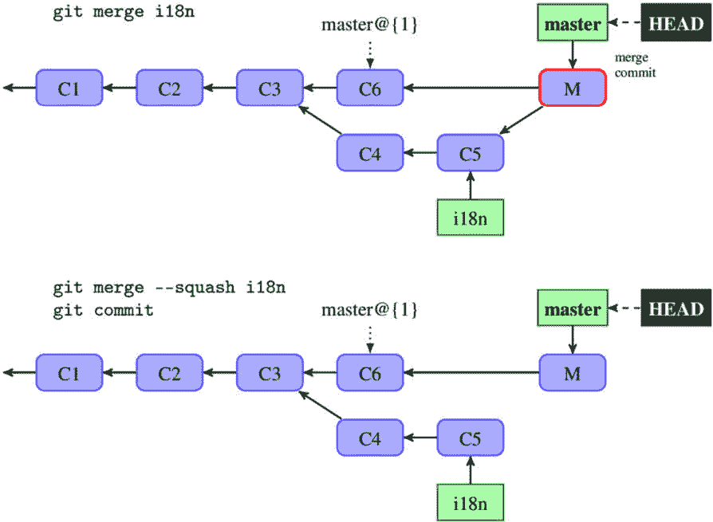

# 第九章：合并更改

前一章《*高级分支技术*》介绍了如何有效地使用分支进行协作和开发。

本章将教你如何通过创建合并提交，或通过变基操作重新应用更改，将来自不同并行开发线（即分支）的更改合并在一起。在这里，将解释合并和变基的概念，包括它们之间的区别以及如何使用它们。本章还将解释不同类型的合并冲突，并教你如何避免、检查和解决这些冲突。

在本章中，我们将覆盖以下主题：

+   合并、合并策略和合并驱动程序

+   樱桃挑选和撤销提交

+   应用补丁和补丁系列

+   变基分支并重放其提交

+   基于文件和内容层面的合并算法

+   索引中的三个阶段

+   合并冲突 – 如何检查和解决它们

+   使用 **git rerere** 重用已记录的 **[冲突]** 解决方案

+   外部工具 – **git-imerge**

# 合并更改的方法

现在，你已经有了来自远程跟踪分支（或一系列电子邮件）的其他人更改，你需要将它们合并，可能还包括你自己的更改。

另外，你在一个独立的主题分支上创建并执行的新功能工作现在已经准备好可以合并到长期开发分支中，并让其他人可以使用。也许你已经创建了一个 bug 修复，并想将其包括到所有长期维护的分支中。简而言之，你想通过整合它们的更改将两条不同的开发线合并在一起。

Git 提供了几种不同的方法来合并更改，以及这些方法的变体。其中一种方法是*合并*操作，将两个开发线与一个双父提交连接起来。另一种将工作从一个分支复制到另一个分支的方法是通过樱桃挑选（cherry-picking），即在另一条开发线创建一个新的提交，包含相同的更改集（有时需要使用此方法）。另外，你可以重新应用更改，通过*变基*将一个分支移植到另一个分支之上。我们将现在详细探讨这些方法及其变体，看看它们如何工作，以及何时可以使用它们。

在许多情况下，Git 会自动合并更改；下一节将讨论如果合并失败以及发生合并冲突时该怎么办。

## 合并分支

`git` `merge` 命令：

```
$ git switch master
$ git merge bugfix123
```

在这里，我们首先切换到一个要合并到的分支（在这个示例中是`master`），然后指定要合并的分支（这里是`bugfix123`）。

### 无分歧 – 快进和最新状态的情况

假设你需要为别人发现的一个 bug 创建修复。假设你已经遵循了《*第八章*》中主题分支工作流的建议，[*高级分支技术*]，并创建了一个名为 `i18n` 的独立 bugfix 分支。

在这种情况下，通常没有真正的分歧，这意味着在维护分支（我们合并到的分支）上没有任何提交，因为已经创建了一个 bugfix 分支。由于这个原因，Git 默认会简单地将当前分支的指针向前移动：

```
$ git switch maint
Switched to branch 'maint'
$ git merge i18n
Updating f41c546..3a0b90c
Fast-forward
  src/random.c | 2 ++
  1 file changed, 2 insertions(+)
```

你可能已经见过 `git pull`，当你拉取的分支没有任何变化时。快进合并的情况如 *图 9.1* 所示。



图 9.1 – 主分支在合并时被快进到 i18n

这种情况对于集中式和对等式工作流非常重要（在 *第六章*中有描述，*使用 Git 进行协作开发*），因为正是快进合并使你能够最终将更改推进。

在某些情况下，这并不是你想要的。例如，注意到在 *图 9.1* 中进行快进合并后，我们失去了 `i18n` 主题分支的信息。即便当前分支没有任何更改，我们也可以强制创建一个合并提交（将在下一节中描述），方法是使用 `git merge --no-ff` 命令。默认情况下是 `--ff`；如果想要避免创建合并提交，可以使用 `--ff-only`（确保仅进行快进合并）。



图 9.2 – 主分支与 i18n 分支是最新的（即，已包含该分支）

还有一种情况，其中一个分支的头（tip）是另一个分支的祖先——即，分支我们试图合并的分支已经包含（合并）到当前分支中的最新场景（*图 9.2*）。在这种情况下，Git 不需要做任何操作；它只会告知用户：

```
$ git merge i18n
Already up to date.
```

### 创建一个合并提交

当你合并完全成熟的功能分支时，情况通常与前面描述的快进合并有所不同，而不是像上一节中那样合并 bugfix 分支。在功能分支工作流的情况下，功能分支和集成分支的开发通常会发生分歧。

假设你已经决定完成了某个功能的工作（例如，在 `i18n` 主题分支上添加对国际化的支持），并准备将其包含到主稳定分支中。为了通过合并操作做到这一点，你需要首先检出你想要合并到的分支，然后运行 `git merge` 命令，指定待合并的分支作为参数：

```
$ git checkout master
Switched to branch 'master'
$ git merge i18n
Merge made by the 'ort' strategy.
 src/random.c |
2 ++
 1 file changed, 2 insertions(+)
```

因为你当前所在的分支（以及合并到的分支）的最新提交既不是你正在合并的分支的直接祖先，也不是其直接后代，Git 必须执行比仅仅移动分支指针更多的操作。在这种情况下，Git 会合并自分支分歧以来的所有变更，并将其存储为当前分支上的**合并提交**。这个提交有两个父提交，表示它是基于多个提交（多个分支）创建的；第一个父提交是当前分支的前一个提交，第二个父提交是你正在合并的分支的最新提交。

请注意，如果 Git 能够自动完成合并且没有冲突，它会开始提交合并结果。然而，合并在文本层面成功并不一定意味着合并结果是正确的。你可以使用`git merge --no-commit`命令要求 Git 不自动提交合并，以便先进行检查，或者在检查合并提交后，如果发现问题，可以使用`git commit --amend`命令进行修正（见*图 2.4*）。



图 9.3 – 在典型合并中使用的三个修订和结果合并提交

Git 创建合并提交的内容（`git` `merge-base` 命令）。

一个非常重要的问题是，Git 通常仅基于三个修订来创建合并提交内容——合并进来的（*ours*）、合并出去的（*theirs*）以及共同祖先（*merge base*）。它不会检查分支的分歧部分发生了什么变化；这使得合并过程非常迅速。然而，正因为如此，Git 也无法得知在被合并的分支上进行的樱桃挑选或回退的更改，这可能会导致一些意外的结果（例如，参见 *第十章* 中关于回退合并的部分，*保持历史清晰*）。

### 合并策略及其选项

在合并信息中，我们可以看到它是通过 **‘ort’** 策略（在旧版本 Git 中称为 **recursive**）进行的。**合并策略** 是 Git 用来组合两个或多个开发分支的结果的算法。

你可以选择几种合并策略，通过 `git merge` 命令的 `--strategy`/`-s` 选项来使用。默认情况下，Git 在合并两个分支时使用 *ort* 合并策略，在合并多个分支时使用非常简单的 *octopus* 合并策略。如果默认策略失败，你还可以选择 *resolve* 合并策略；它速度较快且安全，尽管合并能力较弱。

另外两种合并策略是特殊用途的算法。*ours*合并策略可以在我们想要放弃合并分支中的更改，但保留它们在目标分支历史中的情况下使用——例如，用于文档目的。此策略仅仅将当前快照（*ours*版本）重复作为一个合并提交。请注意，这种合并策略，通过`--strategy=ours`或`-s ours`调用时，不应与默认*ort*合并策略的*ours*选项混淆，`--strategy=ort --strategy-option=ours`，或者只是*-Xours*，它们的含义不同。

*子树*合并策略可以用于将一个独立项目的内容合并到主项目中的子目录（子树）中。它会自动确定子项目的位置。此主题以及子树的概念将在*第十一章*中详细描述，*管理子项目*。

默认的**ort**（**表面递归的双胞胎**）合并策略及其前身*递归*合并策略，得名于该策略如何处理多个合并基和交叉合并。在存在多个合并基的情况下（这意味着有多个可以用作三方合并的共同祖先），该策略会从这些祖先创建一个合并树（包括冲突），作为合并基——也就是说，它会递归地合并。当然，这些被合并的共同祖先也可以有多个合并基。

一些策略是可定制的，并且有自己的选项。你可以通过命令行中的`-X<option>`（或`--strategy-option=<option>`）将选项传递给合并算法，或者通过适当的配置变量进行设置。你将在*解决合并冲突*部分中了解更多合并选项，在该部分我们将讨论如何解决合并冲突。

### 提醒——合并驱动程序

*第三章**，管理你的* *工作树*，介绍了 git 属性——其中包括**合并驱动程序**。这些*驱动程序*是用户自定义的，处理在发生冲突时合并文件内容，替代了默认的三方文件级合并。相比之下，合并*策略*处理 DAG 级别的合并（以及树级别——即，合并目录），并且你只能从内置选项中选择。

### 提醒——签名合并和合并标签

在*第六章*，*使用 Git 的协同开发*中，你学到了如何对你的工作进行签名。在使用合并将两条开发线路连接时，你可以合并一个已签名的标签，签名一个合并提交，或者两者都做。签名一个合并提交可以通过在使用`git merge`或`git commit`命令时使用`-S` / `--gpg-sign`选项来完成；如果存在冲突，或者在合并时使用了`--no-commit`选项，后者会被使用。

## 复制和应用变更集

合并操作是将两条开发线（两条分支）合并，包括自它们分歧以来的所有变更。正如在*第八章*《高级分支技术》中所描述的那样，如果在较不稳定的分支（例如，`master`）上有一个提交，你希望它也出现在一个更稳定的分支（例如，`maint`）上，那么你不能使用合并操作。你需要创建该提交的副本。像这样的情况应尽量避免（使用主题分支），但它有时会发生，处理这种情况有时是必要的。

有时候，需要应用的变更不是来自仓库（作为要复制的 DAG 中的修订），而是以补丁的形式出现——也就是说，一个统一的 diff 或使用 `git format-patch` 生成的邮件（包括补丁和提交信息）。

Git 包含 `git am` 工具，用于处理大规模应用包含提交的补丁。

这两个命令本身都是有用的，但理解这些获取变更的方法也有助于理解 cherry-pick 和 rebase 的工作原理。

### Cherry-pick – 创建变更集的副本

你可以使用 `cherry-pick` 命令创建一个提交（或一系列提交）的副本。给定一系列提交（通常只是一个提交），它会应用每个提交所引入的变更，为每个变更记录一个新的提交。



图 9.4 – 将 C4 提交从 master 分支 cherry-pick 到 maint 分支

*图 9.4* 中展示了一个 cherry-pick 操作的示例。（注意，这里从**C4**到**C4’**的粗虚线箭头表示的是复制操作；它不是引用。）

变更的复制并不意味着原始快照（即项目的状态）在原始位置（*图 9.4* 中的 **C4**）和复制位置（*图 9.4* 中的 **C4’**）是相同的；后者将包含其他变更，同时缺少一些变更。而且，虽然变更通常是相同的（如 *图 9.4* 中所示，**C3** 与 **C4** 之间的差异和 **C7** 与 **C4’** 之间的 diff 是相同的），它们也可以是不同的——例如，如果部分变更已经出现在早期的提交中。

请注意，默认情况下，Git 不会保存关于 cherry-pick 提交来源的信息。你可以将此信息附加到原始提交信息中，例如 `git cherry-pick -x <commit>`。这仅适用于没有冲突的 cherry-pick 操作。记住，这些信息只有在你可以访问被复制的提交时才有用。如果你是从私有分支复制提交，请不要使用此信息，因为其他开发者将无法使用这些信息。

### Revert – 撤销提交的影响

有时，即使经过代码审查，仍会发现一些错误的提交需要撤销（可能是某个提交原来是个不太好的想法，或者它包含了错误）。如果提交已经公开，你不能简单地删除它；你需要撤销它的效果。这个问题将在 *第十章* *保持历史清洁* 中详细解释。

这种“撤销提交”可以通过创建一个反向变更的提交来实现，类似于 cherry-pick，但应用的是变更的反向。这可以通过`revert`命令完成（见*图 9.5*）。



图 9.5 – 使用 'git revert master^' 在 'master' 分支上的效果 – 创建一个新的提交，标记为 !C3，撤销 C3 提交中的变更

这个操作的名称可能会让人产生误解。如果你想撤销对整个工作区所做的所有更改，可以使用 `git reset`（特别是使用 `--hard` 选项）。如果你想撤销对单个文件所做的更改，可以使用 `git checkout <file>` 或 `git restore <file>`。这两者在 *第三章* *管理你的工作区* 中有详细解释。`git revert` 命令会记录一个新提交，撤销之前提交的效果（通常是一个有问题的提交）。

### 应用一系列的补丁提交

一些协作工作流包括通过电子邮件（或其他通信媒介）交换变更作为补丁。这种工作流通常出现在开源项目中；对于新贡献者或偶尔贡献者来说，创建一封特别制作的电子邮件（例如，使用`git format-patch`）并将其发送给维护者或邮件列表，往往比设置一个公共仓库并发送拉取请求更为简单。

你可以通过 `git am` 命令，从邮箱（采用 `mbox` 或 `maildir` 格式；后者只是一个文件系列）应用一系列补丁。如果这些电子邮件（或文件）是从 `git format-patch` 输出创建的，你可以使用 `git am --3way` 来使用三方文件合并，如果有冲突的话。解决冲突将在*解决* *合并冲突* 部分中讨论。

你可以找到一些工具，帮助通过发送一系列补丁来使用补丁提交过程——例如，从 GitHub 上的拉取请求（例如，*GitGitGadget* GitHub 应用，或较老的 *submitGit* 网页应用，将补丁从 GitHub 的拉取请求提交到 Git 项目的邮件列表）——以及一些工具，用于跟踪发送到邮件列表的网页补丁（例如，*patchwork* 工具）。

### 选择性提交和撤销合并

这都没问题，但如果你想要选择性提交或撤销一个合并提交怎么办？这种提交有多个父提交，因此，它们与多个变更相关联。

在这种情况下，你需要告诉 Git 你希望采用哪个更改（在 cherry-pick 的情况下），或者撤销哪个更改（在 revert 的情况下），并使用 `-m <parent number>` 选项——例如，`-m1`。

请注意，撤销合并操作会撤销更改，但不会从项目历史中删除合并记录。有关撤销合并的更多信息，请参见*第十章*，*保持历史清晰*部分。

## 重置分支

除了合并，Git 还支持一种将一个分支的更改集成到另一个分支中的额外方式——即**rebase 操作**。

像合并一样，它处理自分叉点以来的变化（至少是默认情况下）。然而，虽然合并通过连接两个分支来创建一个新的提交，rebase 则是将一个分支的新提交（即，自分叉以来的提交）重新应用到另一个分支上——具体示例如*图 9.6*。



图 9.6 – Rebase 操作的效果

使用合并时，你首先切换到要合并的分支，然后使用合并命令选择要合并的分支。使用 rebase 时，则有些不同。首先，你选择一个要重置的分支（即要重新应用的更改），然后使用 rebase 命令选择应用的位置。在这两种情况下，你首先会检出要修改的分支，在该分支上会有一个新的提交或多个提交（合并的情况下是合并提交，rebase 的情况下是提交的重新应用）：

```
$ git switch i18n
Switched to branch 'i18n'
$ git rebase master
Successfully rebased and updated refs/heads/master.
```

另外，你也可以使用 `git rebase master i18n` 作为快捷方式。在这种形式下，你可以很容易看到，rebase 操作将 `master..i18n` 范围的修订（这种表示法在*第四章*，*探索项目历史*中有解释）重新应用到 `master` 上，最后将 `i18n` 指向重新应用的提交。

请注意，旧版本的提交不会立即消失，至少不会立刻。它们会在一段宽限期内通过 reflog（和 `ORIG_HEAD`）访问。这意味着，查看重新应用操作如何改变项目快照并不困难，通过更多的努力，你也能看到变更集本身是如何变化的。

### 合并与 rebase

我们有这两种集成更改的方法——合并和 rebase。它们有什么不同，优缺点分别是什么？我们可以通过比较*图 9.2*（*创建合并提交*部分）和*图 9.5*（*重置分支*部分）来一探究竟。

首先，合并（merge）不会改变历史（见 *第十章*，*保持历史清晰*）。它会创建并添加一个新的提交（除非是快进合并；此时，它只是前移分支头部），但从分支上可达的提交仍然是可达的。这与 rebase 不同。提交会被重写，旧版本会被遗忘，修订的有向无环图（DAG）也会发生变化。曾经可以到达的提交可能不再可达。这意味着你不应对已发布的分支进行 rebase。

其次，合并是一个一步操作，只需要解决一次合并冲突。而 rebase 操作是多步的；每一步较小（如果你遵循推荐的实践并保持更改较小——见 *第十五章*，*Git 最佳实践*），但步骤更多。

与此相关的是，合并结果通常仅基于三个提交，并且它不考虑在逐步集成的任一分支上发生的事情；只有端点是重要的。相反，rebase 会单独重新应用每个提交，因此到达最终结果的过程是很重要的。

第三，历史看起来不同；使用 rebase，你将得到一个简单的线性历史，而使用合并操作则会导致一个复杂的历史，开发线路会分叉和合并。对于 rebase，历史更简单，但你失去了有关更改是在独立分支上开发并且被组合在一起的信息，这是使用合并时能够获得的（至少在使用 `--no-ff` 时）。Git contrib 工具中甚至有一个 `git-resurrect` 脚本，它利用合并提交信息中的数据恢复已删除的旧特性分支。

最后一个区别是，由于底层机制的原因，rebase 默认不会保留合并提交。在重新应用时，必须明确使用 `--rebase-merges` 选项。合并操作不会改变历史，因此合并提交会保持原样。

### Rebase 后端

上一节描述了两种复制或应用更改的机制——`git cherry-pick` 命令和从 `git format-patch` 到 `git am --3way` 的管道。它们中的任意一种都可以被 `git rebase` 用来重新应用提交。

默认情况下使用基于合并的工作流，就像是调用了带有 `--merge` 选项的 `git rebase`。默认的 `'ort'` 合并策略使得 rebase 能够感知上游端（我们放置回放提交的地方）上的重命名。使用此选项，你还可以选择特定的合并策略并将选项传递给它。

若要切换到基于补丁的策略，请使用 `git rebase --apply`。在这种情况下，你可以传递一些选项给执行实际变更回放的 `git am`。

这些选项将在稍后讨论冲突时描述。

还有一种交互式变基，它有一组自己的选项。这是*第十章*《保持历史整洁》中的主要工具之一。它可以用于在每次重放提交后执行测试，检查重放是否正确。

### 高级变基技巧

你还可以让你的变基操作在目标分支以外的分支上重放，方法是使用`--onto <newbase>`。

假设你的`featureA`主题分支基于不稳定的开发分支`next`，因为它依赖于一些尚未准备好并且尚未出现在稳定分支（master）中的功能。如果`featureA`依赖的功能被认为是稳定的，并且已经合并到 master 中，你可能希望将此分支从基于`next`改为基于`master`。或者，也许你从相关的`client`分支开始了`server`分支，但你希望更明显地表示它们是独立的。

在第一种情况下，你可以使用`git rebase --onto master next featureA`，而在第二种情况下（如*图 9.7*所示），你可以使用`git rebase --onto master server client`。



图 9.7 – 重新基准化分支，将其从一个分支移动到另一个分支

或者，也许你只想变基分支的一部分。你可以使用`git rebase --interactive`来做到这一点，但你也可以使用`git rebase --onto <new base> <starting point> <branch>`。你甚至可以选择用`--root`选项变基整个分支（通常是孤立分支）。在这种情况下，你将重放整个分支，而不仅仅是其中的一个子集。

你还可以使用`--keep-base`选项保持基础提交不变，而不是跟随上游。使用`--fork-point`选项时，如果可能，Git 会通过 reflog（找出分支的创建位置）找到更合适的共同祖先。

## Squash 合并

如果在某个分支上的更改不值得详细保留，而只需要保留它们的结果，你可以使用**squash 合并**将它们作为一个单独的提交进行整合。如果你要整合的分支充满了临时的、工作中的提交，情况就会是这样。

使用`git merge --squash`时，Git 会在工作树和暂存区上产生与真正的合并相同的结果，但不会执行提交（`git merge`的`--commit`选项与`--squash`不兼容）。这种方式下，下一次 git 提交将会创建一个普通提交，而不是合并提交。有关合并类型的对比，请参见*图 9.8*。



图 9.8 – 普通合并与 squash 合并对于相同分支集的对比

默认情况下，压缩提交的提交信息以 `git log master..i18n` 开头。但请注意，只有在我们打算丢弃（删除）“合并”分支时，这种技术才应使用。因为 Git 可能在合并之后的开发过程中遇到麻烦，因为修订图并没有表明该提交是合并的结果。

另一种选择是使用交互式变基的 `squash` 命令。

# 解决合并冲突

Git 中的合并通常相对简单。由于 Git 存储并可以访问完整的修订图，它可以自动找到分支分歧的地方，并仅合并那些分歧的部分。这在重复合并的情况下也有效，因此你可以通过不断地将更改合并或将其变基到新的更改上，保持长期存在的分支与时俱进。

然而，并非总是可以自动合并更改。有些问题 Git 无法解决，例如在不同的分支上对文件的相同区域进行了不同的更改。这些问题被称为**合并冲突**。同样，在重新应用更改时，也可能会出现问题，尽管如果有问题，你仍然会遇到合并冲突。

## 三方合并

与其他一些版本控制系统不同，Git 不会过于智能地处理合并冲突并尝试自动解决它们。Git 的哲学是智能地判断哪些情况下合并可以轻松自动完成（例如，考虑重命名），如果无法自动解决，则不会过于复杂地尝试解决。比起自动创建一个错误的合并，Git 更倾向于中止并要求用户手动解决合并，这样可能不需要一个复杂的算法。

Git 使用**三方合并算法**来得出合并结果，比较共同的祖先（*base*）、合并进来的版本（*theirs*）和合并的目标版本（*ours*）。这个算法非常简单，至少在树的层级上——也就是说，文件级别的粒度。下表解释了该算法的规则：

| **祖先（base）** | **HEAD（ours）** | **分支（theirs）** | **结果** |
| --- | --- | --- | --- |
| A | A | A | A |
| A | A | B | B |
| A | B | A | B |
| A | B | B | B |
| A | B | C | 合并 |

表 9.1 – 三方合并算法的工作原理

如上表所示，树级三方合并的基本规则如下：

+   如果只有一方更改了文件，采用更改后的版本。

+   如果两边有相同的更改，采用更改后的版本。

+   如果一方的更改与另一方不同，则在内容级别发生合并冲突。

如果有多个祖先，或者文件并非所有版本都有，那么情况会复杂一些，但通常只需要知道并理解这些规则就足够了。

如果一方对文件的修改与另一方不同（其中更改的类型很重要——例如，在一个分支上重命名文件并不会与另一个分支上文件内容的更改发生冲突），Git 会在内容层面尝试合并文件，如果定义了**合并驱动程序**，则使用该驱动程序，否则使用内容级三方合并（对于文本文件）。

三方文件合并会检查更改是否涉及文件的不同部分（即更改的是不同的行，并且这些更改相隔超过三行（上下文大小））。如果这些更改位于文件的不同部分，Git 会自动解决合并（并告诉我们哪些文件已**自动合并**）。

然而，如果你在合并的两个分支中分别修改了同一文件的同一部分，Git 将无法干净地合并它们：

```
$ git merge i18n
Auto-merging src/rand.c
CONFLICT (content): Merge conflict in src/rand.c
Automatic merge failed; fix conflicts and then commit the result.
```

这个问题（**合并冲突**）将由用户来解决。

## 检查失败的合并

如果 Git 无法自动解决合并（或者你在 `git merge` 命令中使用了 `--no-commit` 选项），它将不会创建合并提交。它会暂停流程，等待你解决冲突。

你可以随时使用 `git merge --abort` 中止合并过程。

### 工作树中的冲突标记

如果你想查看合并冲突后仍未合并的文件，可以运行 `git status`：

```
$ git status
On branch master
You have unmerged paths.
  (fix conflicts and run "git commit")
  (use "git merge --abort" to abort the merge)
Unmerged paths:
  (use "git add <file>..." to mark resolution)
        both modified:
src/rand.c
```

任何未解决的冲突将列为未合并。在内容冲突的情况下，Git 会使用标准的冲突标记，并将它们放置在冲突的位置，标出*ours*和*theirs*版本的冲突区域。你的文件中将包含如下所示的部分：

```
<<<<<<< HEAD:src/rand.c
fprintf(stderr, "Usage: %s <number> [<count>]\n", argv[0]);
=======
fprintf(stderr, _("Usage: %s <number> [<count>\n"), argv[0]);
>>>>>>> i18n:src/rand.c
```

这意味着当前分支（`HEAD`）中的*ours*版本位于该块的顶部，位于 `<<<<<<<` 和 `=======` 标记之间，而在要合并的 `i18n` 分支中的*theirs*版本（也是来自 `src/rand.c` 文件）位于底部，位于 `>>>>>>>` 标记之间。

你需要通过解决合并来替换整个块，可以选择其中一方（并删除其余部分）或者将两个更改结合起来，例如：

```
fprintf(stderr, _("Usage: %s <number> [<count>]\n"), argv[0]);
```

为了帮助你避免错误地提交未解决的更改，Git 默认会检查已提交的更改中是否包含类似冲突标记的内容，如果找到，它会拒绝创建合并提交。你可以使用 `--no-verify` 选项强制跳过此检查。

如果你需要查看共同祖先版本来解决冲突，可以切换到类似 `diff3-` 或 `zdiff3-` 的冲突标记，这些标记有一个额外的块，用 **|||||||** 分隔。这个新块显示了共同祖先（*ours*）版本：

```
<<<<<<< HEAD:src/rand.c
fprintf(stderr, "Usage: %s <number> [<count>]\n", argv[0]);
|||||||
fprintf(stderr, "Usage: %s <number> [<count>\n", argv[0]);
=======
fprintf(stderr, _("Usage: %s <number> [<count>\n"), argv[0]);
>>>>>>> i18n:src/rand.c
```

你可以通过重新检查文件，使用以下命令逐个文件地替换合并冲突标记：

```
$ git checkout --conflict=diff3 src/rand.c
```

如果你更喜欢始终使用这种格式，你可以通过将 `merge.conflictStyle` 设置为 `diff3` 或 `zdiff3`（而非默认的 `merge`）来将其设置为未来合并冲突的默认格式。

### 索引中的三个阶段

Git 如何跟踪哪些文件已合并，哪些未合并？仅在工作区文件中使用冲突标记是不够的。有时，有些合法的内容看起来像是提交标记（例如，包含合并冲突示例的文件，或者是 AsciiDoc 格式的文件），并且冲突类型比 **CONFLICT(content)** 更多。比如，当两个版本都重命名了同一个文件，但重命名方式不同，或者一方修改了文件而另一方删除了文件时，Git 如何表示这种情况？

事实证明，这也是提交的暂存区（在此情况下是合并提交）另一个用途，也叫做索引。在冲突的情况下，Git 会在索引下的各个阶段存储所有冲突文件版本；每个阶段都有一个关联的编号。

+   阶段 1 是公共祖先（*基准*）

+   阶段 2 是来自 **HEAD** 的合并版本——即当前分支（*我们的*）

+   阶段 3 来自 **MERGE_HEAD**，即你正在合并的版本（*他们的*）

你可以通过低级（底层）命令 `git ls-files --unmerged` 来查看未合并文件的这些阶段（或者使用 `git ls-files --stage` 查看所有文件）：

```
$ git ls-files --unmerged
100755 ac51efdc3df4f4fd318d1a02ad05331d8e2c9111 1
src/rand.c
100755 36c06c8752c78d2aaf89571132f3bf7841a7b5c3 2
src/rand.c
100755 e85207e04dfdd50b0a1e9febbc67fd837c44a1cd 3
src/rand.c
```

你可以使用 `:<stage number>:<pathname>` 指定符来引用每个版本。例如，如果你想查看 `src/rand.c` 的公共祖先版本，可以使用以下命令：

```
$ git show :1:src/rand.c
```

如果没有冲突，文件会处于索引的阶段 0。

### 检查差异——合并差异格式

你可以使用 `status` 命令查找哪些文件尚未合并，冲突标记能很好地显示冲突。但在处理之前，如何只查看冲突？又该如何查看冲突是如何解决的？答案是 `git diff`。

有一点需要记住的是，对于合并，即使是在进行中的合并，Git 也会显示所谓的 **合并差异** 格式。它看起来如下（对于合并中的冲突文件）：

```
$ git diff
diff --cc src/rand.c
index 293c8fc,4b87d29..0000000
--- a/src/rand.c
+++ b/src/rand.c
@@@ -14,16 -14,13 +14,26 @@@ int main(int argc, char *argv[]
return EXIT_FAILURE;
}
++<<<<<<< HEAD:src/rand.c
 +fprintf(stderr, "Usage: %s <number> [<count>]\n", argv[0]);
++=======
+ fprintf(stderr, _("Usage: %s <number> [<count>\n"), argv[0]);
++>>>>>>> i18n:src/rand.c
```

你可以看到与普通统一差异格式（*第二章*，“使用 Git 开发”）的几个不同之处。首先，它在头部使用 `diff --cc` 来表示它使用紧凑的合并格式（如果使用 `git diff -c` 命令，它将使用 `diff --combined`）。扩展的头部行，例如 `index 293c8fc,4b87d29..0000000`，考虑到有多个源版本。块头部 `@@@ -14,16 -14,13 +14,26 @@@` 被修改（并且与普通补丁的不同），以防止人们将合并差异应用为统一差异——例如，使用 `patch -p1` 命令。

`diff`命令的每一行前面都有两个或更多字符（在最常见的合并两个分支的情况下是两个字符）；第一个字符告诉我们该行在第一个预成像中的状态（*我们的*版本）与结果的对比，第二个字符告诉我们另一个预成像的状态（*他们的*版本），以此类推。例如，`++`表示该行在任何一个合并版本中都不存在（在这个例子中，您可以在冲突标记所在的行上找到它）。

检查差异对于检查合并冲突的解决情况非常有用。

要将结果（即工作目录的当前状态）与当前分支的版本（即合并的版本）进行比较——即*我们的*版本——可以使用`git diff --ours`。这同样适用于正在合并的版本（*他们的*）和公共祖先版本（*基础*）。

### 我们是如何到达这个结论的——`git log --merge`

有时候，我们需要更多的上下文来决定选择哪个版本或者如何解决冲突。一个有效的方法是回顾一些历史，回忆为什么这两个开发分支会修改同一区域的代码。

要获取包含在任一分支中的所有分歧提交的完整列表，我们可以使用三点符号语法（在*第四章*，*探索项目历史*中学过的内容），并添加`--left-right`选项，让 Git 显示给定提交属于哪一侧：

```
$ git log --oneline --left-right HEAD...MERGE_HEAD
```

我们可以进一步简化这一过程，并限制输出仅显示那些修改了至少一个冲突文件的提交，例如使用`--merge`选项与`git log`命令：

```
$ git log --oneline --left-right --merge
```

这对于快速提供您理解冲突原因和如何智能解决冲突所需的上下文非常有帮助。

## 避免合并冲突

虽然 Git 更倾向于明确地在自动合并失败时停止，而不是尝试复杂的合并算法，但仍然有一些工具和选项可以帮助 Git 避免合并冲突。

### 有用的合并选项

合并分支时可能遇到的问题之一是它们使用了不同的行尾符号规范化或清理/模糊过滤器（参见*第三章*，*管理工作树*）。当一个分支添加了这样的配置（例如，修改了一个 git 属性文件），而另一个没有时，可能会发生这种情况。在行尾字符配置发生变化的情况下，您会看到很多虚假的更改，其中行只在行尾字符（EOL）上有所不同。在这两种情况下，解决三方合并时，您可以让 Git 对文件的三个阶段执行虚拟的检出和检查操作。通过将`renormalize`选项传递给`'ort'`合并策略（`git merge -Xrenormalize`），就可以实现这一点。正如名称所示，这将规范化行尾字符，使它们在所有阶段中保持一致。

更改如何定义行尾可能会导致与空格相关的冲突。当查看冲突时很容易看出这种情况，因为一侧的每行都被删除，而另一侧则再次添加，`git diff --ignore-whitespace`显示了一个更易管理的冲突（或者甚至是已解决的冲突）。如果您发现合并中有大量空格问题，您可以中止并重新执行，这次使用`-Xignore-all-space`，`-Xignore-space-change`，`-Xignore-space-at-eol`或`-Xignore-cr-at-eol`。

请注意，混合其他更改的行的空白更改不会被忽略。

有时，由于不重要的匹配行（例如，来自不同函数的大括号），会发生错误合并。您可以通过选择`patience`，`histogram`或`minimal`的 diff 算法，并使用`-Xdiff-algorithm=patience`等方法，使 Git 花费更多时间来最小化差异。

如果问题是误检测的重命名文件，您可以使用`-Xfind-renames=<n>`调整重命名阈值。

### Rerere – 重用记录的解决方案

**rerere**（**重用记录的解决方案**）功能有点隐藏。正如该功能的名称所暗示的那样，它使 Git 记住每个冲突是如何逐块解决的，因此下次 Git 遇到相同的冲突时，它将能够自动解决。但请注意，即使 Git 可以干净地解决冲突（如果表面上是正确的），Git 也会停止解决冲突，并不会自动提交所述的 rerere-based 解决方案。

这样的功能在许多场景中都很有用。一个例子是当您希望长期存在（即长期开发）的分支在周期结束时能够干净地合并，但不希望创建中间合并提交时。在这种情况下，您可以进行**试验合并**（合并，然后删除合并），将解决冲突的信息保存到 rerere 缓存中。借助这种技术，最终的合并应该很容易，因为大部分内容将从先前记录的解决方案中干净解决。

另一种情况是您可以利用 rerere 缓存的情况是将一堆主题分支合并到可测试的永久分支中。如果分支的集成测试失败，您希望能够回退失败的分支，但不希望丢失解决合并工作的时间。

或者，也许您已经决定更喜欢使用 rebase 而不是 merge。rerere 机制允许我们将合并解决方案转换为 rebase 解决方案。

要启用此功能，只需将`rerere.enabled`设置为`true`，或创建`.git/rr-cache`文件。

## 处理合并冲突

假设 Git 无法自动干净地合并，并且存在您需要解决才能创建新合并提交的合并冲突。您有哪些选择？

### 中止合并

首先，让我们了解如何摆脱这种情况。如果您可能没有准备好处理冲突，或者不太了解如何解决冲突，您可以通过`git merge --abort`简单地退出您开始的合并。

此命令尝试将状态重置为您开始合并之前的状态。如果您没有从一个干净的状态开始，它可能无法做到这一点。因此，最好在执行合并操作之前，将所有更改暂存起来（您可以使用`--autostash`，或`merge.autoStash`/`rebase.autoStash`配置选项来做到这一点）。

### 选择我们的版本或他们的版本

有时，在冲突的情况下，选择一个版本就足够了。如果您希望以这种方式解决所有冲突，强制所有部分解决为*我们的*版本或*他们的*版本，您可以分别使用`-Xours`或`-Xtheirs`合并策略选项。请注意，`-Xours`（`--strategy=ours`（**合并策略**）；后者创建一个合并提交，其中项目状态与*我们的*版本相同，而不是仅对冲突文件采用*我们的*版本。

如果您只想对选定的文件进行此操作，您可以再次通过`git checkout --ours`或`git checkout --theirs`分别检查出*我们的*版本或*他们的*版本。请注意，在变基过程中，*我们的*版本和*他们的*版本可能会互换。

您可以通过`git show :1:file`，`git show :2:file`，或`git show :3:file`分别查看*基础*、*我们的*或*他们的*版本，正如之前所描述的那样。

### 可脚本化修复——手动文件重新合并

有些类型的更改是 Git 无法自动处理的，但它们是可以通过脚本修复的。如果我们先转换*我们的*、*他们的*或*基础*版本，合并可以自动完成，或者至少会变得容易得多。更改文件在仓库中如何检查和存储的方式（即，eol 和 clean/smudge 过滤器）以及处理空格更改是内建选项。另一个示例是改变文件的编码或其他可脚本化的更改，如重命名变量，但不带内建支持。

要执行脚本化的合并，首先需要提取这些冲突文件的每个版本副本，可以通过`git show`命令和`:<stage>:<file>`来完成：

```
$ git show :1:src/rand.c >src/rand.common.c
$ git show :2:src/rand.c >src/rand.ours.c
$ git show :3:src/rand.c >src/rand.theirs.c
```

现在，您已经将三个阶段的文件内容放入工作区，您可以单独修复每个版本——例如，使用`dos2unix`或`iconv`。然后，您可以使用以下命令重新合并文件内容：

```
$ git merge-file -p \
  rand.ours.c rand.common.c rand.theirs.c >rand.c
```

### 使用图形合并工具

如果您希望使用图形工具帮助您解决合并冲突，您可以运行`git mergetool`，它将启动一个可视化的合并工具，并引导调用的工具解决所有合并冲突。

它提供了广泛的预配置支持，适用于各种图形化合并助手。你可以通过 `merge.tool` 配置想要使用的工具。如果不这样做，Git 将按照操作系统和桌面环境的顺序尝试所有可能的工具。

你还可以配置自己的工具设置。

### 标记文件为已解决并完成合并

如前所述，如果文件发生合并冲突，索引中将有三个阶段。要将文件标记为已解决，需要将文件内容放入阶段 0。只需运行 `git add <file>` 即可完成此操作（运行 `git status` 将给出此提示）。

当所有冲突都解决后，你只需运行 `git commit` 来完成合并提交（或者你可以跳过单独标记每个文件为已解决，直接运行 `git commit -a`）。合并的默认提交消息总结了我们所合并的内容，包括冲突列表（如果有的话）。你可以通过 `--log` 选项为单次合并添加已合并分支的简短日志，或者通过 `merge.log` 配置变量永久设置此项。

### 解决 rebase 冲突

当应用补丁或补丁系列、挑选提交或重基准化分支时出现问题时，Git 将退回使用三方合并算法。如何解决这些冲突，已在前面章节中描述。

重要提示

请注意，在使用合并策略（默认策略）时，由于技术原因，*ours*是到目前为止的重新基准化系列——也就是正在集成的分支——而*theirs*是工作分支（被重新基准化的分支）。

然而，对于这些方法中的某些情况，如 rebase、应用邮箱（`git am`）或挑选一系列提交，这些操作是逐步完成的（一个序列操作），还有其他问题——即在这种阶段中发生冲突时该如何处理。

你有三种选择：

+   你可以使用**--continue**参数来解决冲突并继续操作（或者在**git am**的情况下，也可以使用**--resolved**）

+   你可以使用**--abort**中止整个操作，并将**HEAD**重置回原始分支。

+   你可以使用**--skip**来跳过某个修订，可能是因为该提交已经在上游存在，且在重放过程中可以跳过它

### git-imerge —— 一个增量合并和重基准化工具

Rebase 和 merge 各有其缺点。使用 merge 时，你需要以“全有或全无”的方式解决一个大的冲突（尽管使用测试合并和 rerere 来保持最新的提议解决方案可能会有所帮助）。几乎没有办法部分保存已完成的合并，也无法对其进行测试；`git stash` 可以提供帮助，但它可能是一个不完全的解决方案。

相反，Rebase 是逐步完成的，但它并不适合协作；你不应该重基准化已发布的项目历史部分。你可以中断重基准化，但它会将你置于一个奇怪的状态（在一个匿名分支上）。

这就是为什么创建了`git imerge`这个第三方工具。它以小步骤逐对展示冲突。它记录所有中间的合并操作，使其可以共享，从而一个人可以开始合并，另一个人可以完成合并。最终的解决方案可以存储为普通合并、普通变基或带历史记录的变基。

# 总结

本章展示了如何有效地将两条开发线路合并在一起，结合它们自分歧以来所收集的提交记录。

首先，我们了解了几种合并更改的方法——合并、挑选提交和变基。本部分重点解释了这些功能如何在更高层次上工作——即修订的有向无环图（DAG）层面。您了解了合并和变基如何工作，以及它们之间的区别。还展示了一些更有趣的变基用法，例如将一个主题分支从一个长期存在的分支移植到另一个分支。

然后，您了解了如果 Git 无法自动合并更改时该怎么办——即在存在合并冲突的情况下可以采取什么措施。这个过程的关键是理解三方合并算法如何工作，以及在发生冲突时索引区和工作区的变化。您现在知道如何检查失败的合并，检查提议的解决方案，避免冲突，最后解决冲突并标记为已解决。

下一章，*保持历史清晰*，将解释为什么我们可能希望重写历史以保持清晰（以及这意味着什么）。重写历史的工具之一是交互式变基，它与本章中描述的普通变基操作是亲密的伙伴。您将学习重写提交的各种方法：如何重新排序提交，如何拆分过大的提交，如何将修复提交与它修正的提交合并，如何从历史中移除文件。您将了解如果无法重写历史（理解为什么重写已发布的历史是不好的），但仍然需要进行修正时，可以使用`git replace`和`git notes`命令来实现。我们还将讨论这些机制的其他应用。

# 问题

回答以下问题以测试您对本章的理解：

1.  使用合并来整合更改有哪些优缺点？

1.  使用变基来整合更改有哪些优缺点？

1.  如何避免在合并或变基过程中反复解决类似的冲突？

1.  如何发现自己是否处于合并或变基的过程中，并提醒自己如何解决冲突或中止操作？

# 答案

以下是对上述问题的答案：

1.  使用合并时，您只需一步完成整合（这既是优点也可能是缺点），并且只需要测试一个提交——合并后的结果。您可以轻松看到分支从何处开始以及在哪里结束。首父视图可以作为集成分支的摘要。

1.  使用变基（rebase）时，你是一步步地进行整合（这既可以是缺点，也可以是优点）。每个变基后的提交可能需要测试。最终的历史记录会更简洁、更线性、也更容易理解。使用**二分法**来查找回归错误，在线性历史记录下应该会更快。

1.  你可以使用 rerere 机制，它会自动重新应用记录下来的冲突解决方案。

1.  使用**git** **status**命令。

# 进一步阅读

要了解更多本章所涉及的主题，请查看以下资源：

+   Scott Chacon, Ben Straub: *Pro Git*，第 2 版（2014）：[`git-scm.com/book/en/v2`](https://git-scm.com/book/en/v2):

    +   *第 3.6 章*，*Git 分支 –* *变基*

    +   *第 7.8 章*，*Git 工具 –* *高级合并*

    +   *第 7.9 章*，*Git 工具 –* *Rerere*

+   Julia Evans，*git rebase：会出什么问题？*（2023）：[`jvns.ca/blog/2023/11/06/rebasing-what-can-go-wrong-/`](https://jvns.ca/blog/2023/11/06/rebasing-what-can-go-wrong-/)

+   Julia Evans，*git cherry-pick 和 revert 如何使用三方合并*（2023）：[`jvns.ca/blog/2023/11/10/how-cherry-pick-and-revert-work/`](https://jvns.ca/blog/2023/11/10/how-cherry-pick-and-revert-work/)

+   Junio C Hamano，*恶意合并是从哪里来的？*（2013）：[`git-blame.blogspot.com/2013/04/where-do-evil-merges-come-from.html`](https://git-blame.blogspot.com/2013/04/where-do-evil-merges-come-from.html)

+   Nick Quaranto，*git ready – 保留合并冲突中的任意文件*（2009）：[`gitready.com/advanced/2009/02/25/keep-either-file-in-merge-conflicts.html`](https://gitready.com/advanced/2009/02/25/keep-either-file-in-merge-conflicts.html)

+   *学会使用电子邮件与* *git!*：[`git-send-email.io/`](https://git-send-email.io/)
