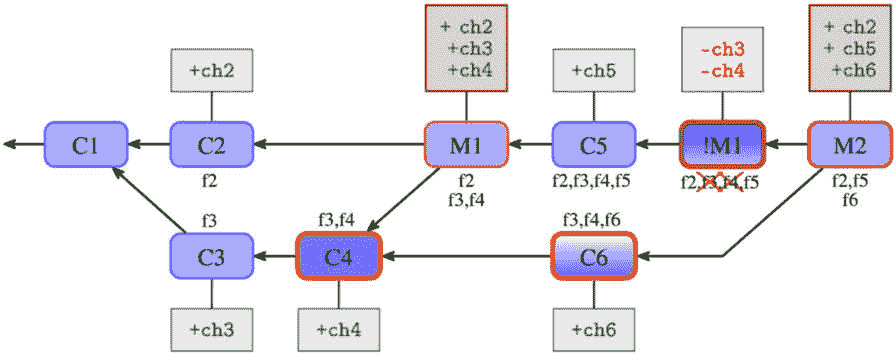

# 第十章：保持历史清洁

前一章《*合并变更*》描述了如何将不同人开发的变更（如在*第六章*《*使用 Git 进行协作开发*》中所述）或仅在单独的功能分支中开发的变更（如在*第八章*《*高级分支技术*》中所示）合并到一起。技术之一是 rebase，它有助于将待合并的分支调整到更好的状态。然而，如果我们正在重写历史，是否也可以修改已 rebase 的提交，使其更易于审查，从而使功能的开发步骤更清晰？如果重写历史被禁止，是否可以在不重写历史的情况下清理历史？如果我们不能重写项目历史，如何修正错误？

本章将解答所有这些问题。它将解释为什么有时需要保持历史清洁，何时可以以及应该这样做，以及如何做到这一点。你将在这里找到逐步指导，了解如何重新排序、压缩和拆分提交。本章还将描述如何进行大规模历史重写（例如，从其他版本控制系统导入后的清理），以及如果无法重写历史该怎么办：换句话说，使用**回退**、替换和注释。

要真正理解本章所介绍的一些主题，并真正掌握其使用方法，你需要了解一些 Git 内部结构的基础。这些内容会在本章的开始部分介绍。

本章将涵盖以下主题：

+   Git 仓库的对象模型基础

+   为什么不应该重写已发布的历史，以及如何恢复已重写的历史

+   交互式 rebase：重新排序、压缩、拆分和测试提交

+   大规模脚本化历史重写

+   回退修订、回退合并，以及回退合并后的重新合并

+   不通过替换重写历史来修正历史

+   通过注释向对象添加附加信息

# Git 内部结构简介

要真正理解并有效利用本章所描述的至少部分方法，你需要至少了解 Git 内部结构的基础知识。除此之外，你还需要了解 Git 如何存储版本信息。

在描述 Git 内部结构时，创建不同类型的数据以便后续检查会很有帮助。这可以通过 Git 提供的一组低级命令来实现，作为对用户面对的高级命令的补充。这些低级命令操作的是内部表示层，而不是使用友好的抽象。虽然这些命令非常灵活和强大，但可能不够用户友好。

## Git 对象

在 *第四章*，《探索项目历史》中，你了解了 Git 如何将历史表示为**有向无环图**（**DAG**）的修订版本，其中每个修订版本都是一个图节点，表示为**提交对象**。每个提交都有一个 SHA-1 标识符。我们可以使用这个标识符（无论是完整形式还是不明确的简化形式）来引用任何给定版本。

提交对象由修订元数据、指向零个或多个父提交的链接，以及它所代表的修订版本中的项目文件快照组成。修订元数据包括关于谁做了更改、何时做的、更改由谁（即谁将更改提交到仓库）以及何时提交的，当然还有提交信息。

除此之外，在某些情况下，了解 Git 如何在内部表示项目在给定修订版本时的文件快照也是非常有用的。Git 使用**树对象**来表示目录，使用**二进制大对象**（**blobs**）来表示文件的内容。

除了提交、树和 blobs 之外，可能还有**标签对象**，表示注释和签名标签。

每个对象都是通过其内容的 SHA-1 哈希函数进行标识的，或者更准确地说，是通过对象的类型和大小加上其内容的哈希。这样的基于内容的标识符不需要中央命名服务。正因为如此，每个分布式的相同项目仓库都会使用相同的标识符，我们无需担心名称冲突：

```
# calculate SHA-1 identifier of blob object with Git
$ printf "foo" | git hash-object -t blob --stdin
19102815663d23f8b75a47e7a01965dcdc96468c
# calculate SHA-1 identifier of blob object by hand
$ printf "blob 3\0foo" | sha1sum
19102815663d23f8b75a47e7a01965dcdc96468c
```

对象标识符 – 从 SHA-1 到 SHA-256 的过渡

随着时间的推移，SHA-1 哈希函数的缺陷被逐渐发现。因此，Git 将过渡到使用 SHA-256，同时提供兼容性。到本文写作时，Git 默认仍在使用 SHA-1。

我们可以说 Git 仓库是一个基于内容寻址的对象数据库。当然，这并不是全部；还有引用（分支和标签）、各种配置文件以及其他内容。

让我们更详细地描述 Git 对象，从底层开始。我们可以使用低级的`git` `cat-file`命令来检查对象：

+   **Blob**：这些对象存储给定修订版本中文件的内容。这样的对象可以使用低级别的**git hash-object -w**命令创建。请注意，如果不同的修订版本具有相同的文件内容，它只会被存储一次，得益于基于内容的寻址：

    ```
    $ git cat-file blob HEAD:COPYRIGHT
    ```

    ```
    Copyright (c) 2014 Company
    ```

    ```
    All Rights Reserved
    ```

+   **树对象**：这些对象代表目录。每个树对象是一个按文件名排序的条目列表。每个条目由组合的权限和类型、文件或目录的名称以及与给定路径相关联的对象链接（即 SHA-1 标识符）组成，可能是树对象（表示子目录）、blob（表示文件内容），或者偶尔是提交对象（表示子模块；参见 *第十一章*，*管理子项目*）。请注意，如果不同的修订版本具有相同的子目录内容，它将仅存储一次，这是由于基于内容的寻址：

    ```
    $ git cat-file -p HEAD^{tree}
    ```

    ```
    100644 blob 862aafd...
    ```

    ```
    COPYRIGHT
    ```

    ```
    100644 blob 25c3d1b...
    ```

    ```
    Makefile
    ```

    ```
    100644 blob bdf2c76...
    ```

    ```
    README
    ```

    ```
    040000 tree 7e44d2e...
    ```

    ```
    git update-index command) with git write-tree.
    ```

+   **提交对象**：这些对象代表修订版本。每个提交由一组头信息（键值对数据）组成，包括零个或多个 **父** 行和恰好一个树行，指向代表仓库内容快照的 **树** 对象（项目的顶层目录）。你可以使用低级别的 **git commit-tree** 命令，或者简单地使用 **git commit** 命令，通过给定的树对象来创建一个提交作为修订快照：

    ```
    $ git cat-file -p HEAD
    ```

    ```
    tree 752f12f08996b3c0352a189c5eed7cd7b32f42c7
    ```

    ```
    parent cbb91914f7799cc8aed00baf2983449f2d806686
    ```

    ```
    parent bb71a804f9686c4bada861b3fcd3cfb5600d2a47
    ```

    ```
    author Joe Hacker <joe@example.com> 1401584917 +0200
    ```

    ```
    committer Bob Developer <bob@example.com> 1401584917 +0200
    ```

    ```
    Merge remote branch 'origin/multiple'
    ```

+   **标签对象**：这些对象代表注释标签，其中签名标签是一种特殊情况。标签（轻量级和注释标签）为提交（例如 **v0.2**）或任何对象提供永久名称。标签对象还包含一系列头信息（包括指向被标记对象的链接）和标签消息。你可以通过低级别的 **git mktag** 命令或简单地使用 **git tag** 命令来创建标签对象：

    ```
    $ git cat-file tag v0.2
    ```

    ```
    object 5d2584867fe4e94ab7d211a206bc0bc3804d37a9
    ```

    ```
    type commit
    ```

    ```
    tag v0.2
    ```

    ```
    tagger John Tagger <john@example.com> 1401585007 +0200
    ```

    ```
    random v0.2
    ```

内部日期时间格式

Git 内部格式中的作者、提交者和标记者日期是 **<unix 时间戳> <时区偏移>**。Unix 时间戳（POSIX 时间）是自 Unix 纪元以来的秒数，Unix 纪元是 1970 年 1 月 1 日星期四的 00:00:00 **协调世界时** (**UTC**)，不包括闰秒。这个时间表示事件发生的时间。你可以使用 **date "%s"** 打印 Unix 时间戳，并使用 **date --date="@<timestamp>"** 将其转换为其他格式。

时区偏移是相对于 UTC 的正或负偏移，以 **HHMM**（小时，分钟）格式表示。例如，CET（比 UTC 快 2 小时的时区）是 +0200。这可以用来查找事件的本地时间。

这里提到的不同类型的 Git 对象之间的关系如 *图 10.1* 所示。它代表了一个典型的情况，其中一个标签指向一个提交，且提交共享至少一些文件的相同内容。


图 10.1 – Git 仓库对象模型

一些 Git 命令适用于任何类型的对象。例如，你可以对任何类型的对象进行标记，不仅仅是提交。你可以标记一个 blob，以便将一些无关的数据保存在仓库中，并且在每个克隆中都能使用这些数据。公钥就是这样的数据之一。

本章稍后将介绍的注释和替代项也适用于任何类型的对象。

## Plumbing 和 Porcelain Git 命令

Git 是以自下而上的方式开发的。这意味着它的开发从基本模块开始，然后逐步构建。许多面向用户的命令最初是作为 shell 脚本构建的，利用这些基本的低级模块来完成工作。正因如此，我们能够区分这两种类型的 Git 命令。

更为人知的类型是**porcelain**命令，这是面向用户的高级命令（*porcelain*一词是对称调用引擎级命令*plumbing*的一个双关语）。这些命令的输出是面向最终用户的。这意味着它们的输出可以根据需要更具用户友好性。因此，这些命令的输出在不同的 Git 版本中可能会有所不同。用户足够聪明，可以理解当他们看到额外信息、措辞变化或格式变化时发生了什么（例如）。

你在本章中可能编写的脚本，例如用于使用`git filter-repo`进行重写的脚本，情况并非如此。在这里，你需要的是不变的输出——至少对于那些多次使用的脚本（作为钩子、`.gitattribute`驱动程序和助手）。你通常可以找到一个开关，通常命名为`--porcelain`，它确保命令的输出是不可变的。对于其他命令，解决方法是完全指定格式。或者，你可以使用专为脚本编写设计的低级命令：**plumbing**命令。这些命令通常没有用户友好的默认设置，更不用说“按我的意思做”的特性了。它们的输出也不依赖于 Git 配置；其中大多数命令不能通过 Git 配置文件进行配置。

`git(1)`的手册页列出了所有 Git 命令，按**porcelain**和**plumbing**分类。**plumbing**和**porcelain**命令的区别在*第三章*中作为一个提示提到，当时我们遇到了第一个没有用户友好的**porcelain**等效命令的低级**plumbing**命令。

# 重写历史

在许多情况下，当你在一个项目中工作时，你可能想要修改你的提交历史。这样做的一个原因可能是为了在提交更改到上游之前更容易进行审查。另一个原因是考虑审阅者的意见，并在下一版本的更改中加以改进。或者，也许你想在使用二分法查找回归问题时拥有清晰的历史，正如在*第四章*中所描述的，*探索* *项目历史*。

Git 的一大优点是它使得重写和修改历史成为可能，并提供了一整套工具来修订历史并使其保持干净。

关于重写历史的看法

在版本控制系统的用户中，有两种对立的观点。一种观点认为历史是神圣的，应该展示开发的真实历史，包含所有的缺陷。另一种观点认为，在发布之前，应该清理新的历史，使其更具可读性。

需要注意的一个重要问题是，即使我们谈论的是“重写”历史，Git 中的对象（包括提交）仍然是 `ORIG_HEAD`。不过，至少它们会一直存在，直到它们在垃圾回收过程中被修剪（即被删除）为未引用和不可达的对象，尽管这种情况只有在 reflog 过期后才会发生。

## 修改最后一次提交

历史重写的最简单情况是修正分支上的最新提交。

有时你可能会注意到在提交消息中有拼写错误（或者在上一版本中提交了不完整的更改）。如果你还没有推送（发布）你的更改，可以对 `git commit` 命令使用 `--amend` 选项。

修改提交的结果如 *第二章* 中的 *图 6* 所示，*使用 Git 开发*。请注意，修改最后一次提交与更改历史中更深层次的某些提交之间没有功能上的区别。在两种情况下，你都在创建一个新提交，旧版本仍然会通过 reflog 被引用。不同之处在于其他提交的处理方式。

在这里，索引（即明确的提交暂存区）再次显示其重要性。例如，如果你只想修复提交消息，并且不想做其他更改，可以使用 `git commit --amend`（注意没有使用 `-a` 或 `--all` 选项）。即使你已经开始工作在新的提交上，这也能正常工作——至少前提是你没有向索引中添加任何更改。如果你添加了更改，你可以使用 `git stash` 暂时保存它们，修正最后一次提交的消息，然后再用 `git stash pop --index` 恢复索引和弹出保存的更改。

另一方面，如果你意识到忘记了一些更改，你可以直接编辑文件并使用 `git commit --amend --all`。如果更改交织在一起，你可以使用 `git add` 或其交互版本（利用来自 *第三章*，*管理你的工作树*）来创建你想要的内容，最终使用 `git commit --amend` 完成。

## 交互式变基

有时你可能想要编辑历史中的某些提交，或者将提交重新组织成一系列有逻辑顺序的步骤。在 Git 中，你可以使用 `git rebase --interactive` 这一内置工具来完成此任务。

在这里，我们假设你正在使用单独的主题分支进行功能开发，并且遵循在 *第八章* 中描述并推荐的主题分支工作流，*高级分支技术*。我们还假设你是按照一系列逻辑步骤进行工作，而不是通过一个大的提交。

在实现新特性时，你通常不会从一开始就做到完美。你会希望通过一系列小而独立的步骤引入它（参见*第十五章*，*Git 最佳实践*），以便更容易进行代码审查、代码审计和二分查找（找出回归错误的原因）。通常，只有在完成工作后，你才会发现如何更好地拆分它。期望在实现新特性时不犯错误也是不现实的。

在提交变更之前（无论是推送到中央仓库、推送到你自己的公共仓库并发送拉取请求，还是使用*第六章*中描述的其他工作流，*Git 协作开发*），你通常需要将你的分支更新为项目的最新状态，以便更容易合并。通过将你的变更 rebase 到当前状态并使其保持最新，你将使维护者（集成经理）在接受并合并你的变更时更加轻松。**交互式 rebase**允许你在做这些工作时清理历史，正如前面所述。

除了在发布之前整理变更外，像交互式 rebase 这样的工具还有其他用途。在开发一个复杂特性时，首次提交并不总是会被上游接受并添加到项目中。通常，补丁审查过程会发现代码或者变更说明中的问题。可能有一些内容缺失（例如，特性可能缺少文档或测试），某些提交需要修正，或者提交的补丁系列（或拉取请求中提交的分支）应该拆分成更小的提交，以便更容易审查。在这种情况下，你也可以使用交互式 rebase（或类似工具）来准备新版本提交，考虑代码检查的结果。

### 重新排序、删除和修复提交

Rebase，如*第九章*中所描述，*合并变更*，是将被 rebase 的一系列提交的变更提取出来，并重新应用到一个新的基础（一个新的提交）上。换句话说，rebase 移动的是变更集，而不是快照。Git 通过打开与这些操作相关的指令文件，在编辑器中启动交互式 rebase。

提示

你可以通过**sequence.editor**配置变量，单独配置用于编辑 rebase 指令文件的文本编辑器，该配置变量可以被**GIT_SEQUENCE_EDITOR**环境变量覆盖，而不是使用默认编辑器（例如，用于编辑提交消息的编辑器）。

就像编辑提交的模板一样，指令表格会附带注释，解释你可以对其进行的操作（请注意，如果你使用的是旧版本的 Git，某些交互式 rebase 命令可能在此表格中缺失）：

```
pick 89579c9 first commit in a branch
pick d996b71 second commit in a branch
pick 6c89dee third commit in a branch
# Rebase 89579c9..6c89dee onto b8fffe1 (3 commands)
#
# Commands:
#  p, pick = use commit
#  r, reword = use commit, but edit the commit message
#  e, edit = use commit, but stop for amending
#  s, squash = use commit, but meld into previous commit
#  f, fixup = like "squash", but discard this commit's log message
#  x, exec = run command (the rest of the line) using shell
#  d, drop = remove commit
#
# These lines can be re-ordered; they are executed from top to bottom.
#
# If you remove a line here THAT COMMIT WILL BE LOST.
#
# However, if you remove everything, the rebase will be aborted.
```

请注意，空提交将在行尾标记为`# empty`。根据你的 Git 版本和配置，指令表格中可能包含更多命令。

如注释所述，指令的顺序是按执行顺序排列的，从顶部的指令开始，创建第一个提交（将新的基础作为其父提交），并在底部结束，复制正在进行 rebase 操作的分支末端的提交。这意味着修订按时间顺序排列，较旧的提交排在前面。这与`git log`的输出顺序相反，后者显示最近的提交在前（除非你使用`git log --reverse`）。这很容易理解；rebase 重新应用变更集的顺序是按它们被添加到分支中的顺序，而日志操作则显示按可达性顺序排列的提交。

指令表格的每一行由三个元素组成，元素之间用空格分隔：

+   首先是一个单词的命令。默认情况下，交互式 rebase 以**pick**开始。每个命令都有一个单字母的快捷方式，你可以用它代替长格式，如注释中所示（例如，你可以用**p**代替**pick**）。

+   接下来，是与命令一起使用的提交的唯一缩短版 SHA-1 标识符。严格来说，它是 rebase 过程开始之前，正在进行 rebase 的提交的标识符。这个缩短的 SHA-1 标识符用于选择适当的提交（例如，在交互式 rebase 指令表格中重新排序行，这实际上意味着**重新排序提交**）。

+   最后是提交的描述（主题）。它取自提交信息的第一行。更具体来说，它是提交信息的第一段，去除了换行符，其中段落被定义为一组后续的文本行，段落之间至少用一个空行分隔——即两个或更多的换行符。这也是为什么提交信息的第一行应该是简短的更改描述的原因之一（参见 *第十五章*，*Git 最佳实践*）。这个描述是为了帮助你决定如何处理该提交；Git 使用其 SHA-1 标识符并忽略其余部分。

使用交互式 rebase 重排提交就像在指令表中重排行一样简单。但需要注意的是，如果变更之间不是独立的，即使重排后没有合并冲突，仍可能需要解决冲突。在这种情况下，按照 Git 的提示，你需要解决冲突，标记冲突已解决（例如使用`git add`），然后运行`git rebase --continue`。Git 会记住你正在进行交互式 rebase，因此你无需重复使用`--interactive`选项。

另一种处理冲突的方法是跳过某个提交，而不是解决冲突，可以通过运行`git rebase --skip`来实现。默认情况下，rebase 会删除上游已经存在的更改；如果 rebase 没有正确检测到待处理提交已存在于我们正在合并的分支中，可以使用此命令。换句话说，如果你知道解决冲突的正确方式是空的变更集，就跳过该提交。

提示

你也可以在 Git 因某种原因（包括指令表中的错误，例如将**squash**命令用于第一个提交）停止时，随时通过**git rebase --edit-todo 命令**让 Git 重新显示指令表。编辑完成后，你可以继续执行 rebase。

使用`drop`命令。你可以通过此命令删除失败的实验，或通过删除你知道已经存在于上游（尽管可能形式不同）的变更集来简化 rebase。不过需要注意的是，完全删除指令表会导致 rebase 中止。

在指令表中，将目标提交前的`pick`命令改为`edit`（或简写为`e`）。这将使 rebase 在该提交处停止，也就是在重新应用更改时停下，类似于发生冲突的情况。具体来说，交互式 rebase 会应用该提交，并将其设为`HEAD`提交，然后停止流程，将控制权交给用户。此时，你可以像修改当前提交一样，通过`git commit --amend`来修改该提交，具体操作见*修改上一个提交*。修改完成后，按照 Git 输出的指令，运行`git rebase --continue`继续操作。

提示

一个合适的 Git 命令行提示符，例如 Git 源代码中**`contrib/`**目录下的提示符，能够告诉你是否正在进行 rebase（参见*第十三章*，*自定义和扩展 Git*）。如果你没有使用这样的提示符，你可以随时通过**git status**来查看当前状态，在这种情况下它会提示有 rebase 操作在进行。你也可以在这里找到接下来可以执行的指令。

或者，你也可以随时使用`git rebase --abort`命令回到开始 rebase 前的状态。

如果你只想更改提交消息（例如，修正拼写错误或包含额外信息），你可以跳过运行 `git commit --amend` 然后 `git rebase --continue` 的需要，而是使用 `reword`（或 `r`）代替 `edit`。Git 将自动打开编辑器以进行提交消息的编辑。保存更改并退出编辑器将提交更改，修正提交并继续重新基础。

### 合并提交

有时，您可能需要将两个或多个提交合并为一个。也许您决定不再将更改分开，而是将它们一起使用会更合理。

使用交互式 rebase，您可以根据需要重新排序这些提交，以便它们相互靠近。然后，保留第一个要合并的提交的 `pick` 命令（或将其更改为 `edit` 命令）。对于其余的提交，请用 `squash` 或 `fixup` 命令替换 `pick` 命令。Git 将累积更改并创建包含所有更改的提交。合并提交的建议提交消息是第一个提交的提交消息，并附加具有 `squash` 命令的提交的消息。具有 `fixup` 命令的提交消息将被省略。这意味着 `squash` 命令用于合并更改，而 `fixup` 命令用于添加修复。如果提交具有不同的作者，则折叠提交将归因于第一个提交的作者。提交者将是执行 rebase 操作的您。

假设您注意到忘记将某些更改的部分添加到提交中。也许缺少测试（或只是负面测试）或文档。提交已经在过去，因此您不能简单地通过修改来添加。您可以使用交互式 rebase 或补丁管理界面进行修复，但通常更有效的方法是创建具有遗漏更改的提交，然后稍后再压缩它。

同样地，当你注意到一段时间前创建的提交存在 bug 时，不要立即尝试编辑它，而是可以创建一个包含 bug 修复的 `fixup` 提交，稍后再压缩它。

如果使用此技术，则在注意到需要进行更改或修复 bug 并创建适当提交之间可能会有一些延迟。此间隔包括重新基础操作所需的时间。

那么如何标记正在创建用于压缩或修复的提交呢？如果你的提交消息以魔术字符串 `squash! ...` 或 `fixup! ...` 开头，则会分别在描述（提交消息的第一行，有时称为 `rebase -i` 的部分）之前。您可以通过 `--autosquash` 选项在个别基础上请求此操作，或者您可以通过默认使用 `rebase.autoSquash` 配置变量启用此行为。要创建适当的“魔术”提交消息，您可以在创建要压缩到的提交或 bug 修复提交时使用 `git commit --squash/--fixup`。

### 拆分提交

有时，您可能希望将一个提交拆分成两个或更多个提交，将其分割成多个部分。您可能已经注意到，某个提交过于庞大，可能是因为它尝试做了太多事情，应该将其拆分成更小的部分。或者，您可能决定将某个更改集的一部分从一个提交移到另一个提交，提取成单独的提交是实现这一目标的第一步。

Git 并没有提供一个一键式的内建命令来执行此操作。然而，借助交互式变基的巧妙使用，拆分提交是可能的。

要拆分一个给定的提交，首先使用`edit`操作标记它。如前所述，Git 将在指定的提交处停下并将控制权交还给用户。在拆分提交的情况下，当通过`git rebase --continue`将控制权交还给 Git 时，您希望用两个提交代替原来的一个提交。

拆分提交的问题与工作目录中不同更改混合在一起的问题相似，这在*第二章*《使用 Git 开发》（关于交互式提交的部分）和*第三章*《管理工作树》一章中都有提到。不同之处在于，在使用交互式变基拆分提交时，当变基停下来等待编辑时，提交已经由被变基的分支创建并复制。这可以通过`git reset HEAD^`简单修复；如*第三章*《管理工作树》中所述，该命令将保持工作区处于（交织的）拆分前提交的状态，同时将`HEAD`指针和提交的暂存区移回到该修订之前的状态。然后，您可以通过在暂存区中组合中间步骤，交互式地将您希望包含在第一个提交中的更改添加到索引中。接下来，您应该检查索引中是否包含所需内容，然后使用`git commit`（不带`-a`或`--all`选项）从中创建提交。根据需要重复这最后两步。

对于系列中的最后一个提交（如果您将提交拆分为两个，那么它就是第二个提交），您可以做两件事中的任何一件。第一种选择是将所有内容添加到索引，使工作副本干净，然后从索引中创建提交。另一种选择是从工作区的状态中创建提交（`git commit --all`）。如果您希望保留或从原始提交的提交信息开始，您可以在创建提交时使用`--reuse-message=<commit>`或`--reedit-message=<commit>`选项。我认为最简单的拆分提交命名方式是使用 reflog——它将是`git reflog`输出中`reset: moving to HEAD^`之前的`HEAD@{n}`条目。

与其在暂存区（索引）中从要拆分的提交的父提交开始构建提交并添加更改（可能是交互式的），你可以直接从最终状态——要拆分的提交开始——并删除为第二步准备的更改。例如，可以使用 `git reset --patch HEAD^` 来完成。坦率地说，你可以使用来自 *第三章* *管理你的工作树* 的任何技术组合。我发现图形化提交工具，如 `git gui`，在这方面非常有用（你可以在 *第十三章* *定制和扩展 Git* 中了解图形化提交工具，包括一些示例）。

如果你不完全确定在索引中创建的中间修订是连贯的（它们能编译，能通过测试套件，等等），你应该使用 `git stash save --keep-index` 将尚未提交的更改暂存起来，将工作区恢复到索引中所组成的状态。然后你可以测试这些更改，并在必要时修改暂存区。

另外，你可以从索引中创建提交，并使用普通的 `git stash` 命令在每个提交后保存工作区的状态。然后你可以测试并在必要时修改创建的中间提交。在这两种情况下，在处理拆分中的新提交之前，你需要使用 `git stash pop` 恢复更改。

### 测试每个重新基准的提交

一个好的软件开发实践是，在提交每个更改之前进行测试。然而，这一实践并非总是得到遵循。假设你忘记测试某个提交，或者因为更改看起来微不足道，且你时间紧迫而跳过了它。交互式 rebase 允许你使用 `exec`（或 `x`）操作。它在 rebase 提交的步骤之间运行。`exec` 命令本身的格式与本章前面描述的命令不同：它不是提供提交的 SHA-1 和摘要，而是提供要运行的命令。

`exec` 命令在 shell 中启动提供的命令（由该行的其余部分给出）：使用 `SHELL` 环境变量指定的 shell，或者如果未设置 `SHELL`，则使用默认 shell。这意味着你可以使用 shell 功能。对于 POSIX shell，这意味着可以使用 `cd` 切换目录，使用 `>` 重定向命令输出，使用 `;` 和 `&&` 来顺序执行多个命令，等等。重要的是要记住，执行的命令是从工作树的根目录运行的，而不是从当前目录运行的（即，不是从开始交互式 rebase 时所在的子目录）。

如果你严格要求不发布未经测试的更改，你可能会担心已经重新基准的提交会在新更改的基础上不通过测试，尽管原始提交是通过的。然而，你可以让交互式 rebase 在每个提交上使用 `--exec` 选项进行测试。以下是一个例子：

```
$ git rebase --interactive --exec "make test"
```

这将修改起始指令表，在每个条目后插入`exec make test`：

```
pick 89579c9 first commit in a branch
exec make test
pick d996b71 second commit in a branch
exec make test
pick 6c89dee third commit in a branch
exec make test
```

## 外部工具 – 补丁管理接口

你可能更倾向于在发现 bug 的时候立即修复旧的提交，而不是等到分支重新基础化的时候再修复。后者通常是在分支发送审查（以发布它）之前进行的。这可能是在意识到需要编辑过去的提交后相当长的一段时间。

Git 本身并不容易直接修复已发现的 bug，至少使用内置工具并不容易。然而，你可以找到第三方外部工具，它们在 Git 上实现了补丁管理接口。此类工具的例子包括**Stacked Git**（**StGit**）和**Git Quilt**（**Guilt**）——后者虽然不再维护，但仍可使用。

这些工具提供了与**Quilt**类似的功能（即将补丁推送到栈中或从栈中弹出）。使用这些工具，你可以在类似 Quilt 的栈中拥有一组正在进行的“浮动”补丁。你还可以有以正确 Git 提交形式存在的已接受更改。你可以在**补丁**和提交之间相互转换，移动和编辑补丁，移动和编辑提交（这通过将提交及其子提交转化为补丁、重新排序或编辑补丁，然后再将补丁转回提交来完成），合并补丁等。

然而，这仍然是一个需要安装的额外工具，一组需要学习的额外操作（即使它们可以让你的工作更轻松），以及来自 Git 与该工具之间边界的额外复杂性。如今，交互式 rebase 足够强大，并且通过 autosquash，Git 上再加一层工具的需求已大大减少。

## 使用 Git filter-repo 重写项目历史

在某些使用场景中，你可能需要使用比交互式 rebase 更强大的工具来重写和清理历史。你可能想要某种工具，在给定指定的重写算法时，能够非交互地重写完整历史。这样的情况适合使用`git` `filter-repo`命令。

这是一个外部项目，需要在 Git 之外单独安装。然而，由于它是一个单文件的 Python 脚本，安装它在大多数情况下是非常简单的。Git 项目现在建议使用 `git filter-repo` 项目来替代内置的 `git filter-branch` 命令（后者已经被弃用）。

此命令的调用约定与交互式 rebase 的约定有所不同。默认情况下，它作用于项目的整个历史，改变完整的修订图，尽管你可以使用`--refs`选项将操作限制在选择的分支或分支集上。

该命令通过对每个要重写的修订应用自定义过滤器来重写 Git 修订历史。这是另一个区别：rebase 通过重新应用变更集来工作，而`filter-branch`则与快照一起工作。其后果之一是，对于`git filter-repo`而言，合并仅仅是一种提交对象，而 rebase 会删除合并并将提交排成一行，除非你使用`--rebase-merges`选项。

当然，使用`git filter-repo`时，你通过适当的选项来描述如何进行重写，而不是进行交互式的重写。这意味着操作的速度不是由用户交互的速度限制，而是由 I/O 速度决定。

安全检查

由于**git filter-repo**通常用于大量重写，并且会对项目的历史进行不可逆的修改，因此它需要从新的克隆仓库运行。这意味着用户始终会有一个以单独克隆的形式作为良好的备份。如果出现任何问题，你可以简单地删除克隆并重新开始。

你可以使用**--force**选项让**git filter-repo**忽略新克隆的检查。

### 无过滤器运行 filter-repo

如果未指定过滤器，`filter-repo`会报错，除非你指定`--force`。在这种情况下，提交将重新提交但没有任何更改。通常这种用法不会产生效果，但它被允许用于将来弥补一些 Git 的 bug。

这意味着`git filter-repo --force`在没有其他选项的情况下，可以用来使通过替换引用实现的效果永久生效。通过这种方式，你可以使用以下技巧：在指定的提交上使用`git replace`来修改历史，确保它看起来正确，然后将该修改永久化。这是做提交父级重写的最简单方法。

重要说明

**git filter-repo**命令尊重**替换**（位于**refs/replace/**命名空间中的引用）。替换是一种影响历史（或者更准确地说，是影响其视图）而不重写任何修订的技术。它将在稍后的*替换* *机制*部分中进行说明。

### 可用于`filter-repo`的过滤器类型

有一组广泛的不同过滤选项，用于指定如何重写历史。你可以指定多个选项，它们将按呈现的顺序应用。

你可以多次运行该命令，以实现你期望的结果。`--analyze`选项可用于分析仓库历史，创建一个报告目录，其中（除了其他内容）提到重命名并列出对象大小。这些信息在选择如何过滤仓库和验证更改时可能很有用。

`git filter-repo`命令支持以下类型的过滤器：

+   基于路径的过滤，指定要选择或排除的路径。请注意，重命名不会被跟踪，因此你可能需要同时指定路径的旧名称和新名称。

+   重命名路径，可以与路径过滤结合使用。

+   内容编辑过滤器，涉及替换项目文件中的文本，删除大型 Blob（文件）或删除指定的 Blob（文件内容的版本）。

+   使用**.mailmap**或类似的 mailmap 文件，过滤提交信息，特别是支持过滤作者姓名和邮箱。

+   重命名标签，涉及将一个标签前缀替换为另一个标签前缀。

为了灵活性，`filter-repo`还允许你使用 Python 函数来进一步过滤所有更改，使用自定义 API，并通过各种`--<something>-callback`选项进行操作，例如（例如）`--filename-callback`或`--commit-callback`。

你还可以配置如何重写和修剪提交。例如，你可以决定是否将提交信息重新编码为 UTF-8，或者是否修剪那些已变为空的提交（即没有对项目带来任何更改的提交）。

### 使用 filter-repo 的示例

假设你错误地提交了一个文件到仓库，并且你想执行`git add .`，但你不小心包括了一个未被正确忽略的生成文件（例如可能是一个大型二进制文件）。或者，可能你没有该文件的分发权，需要将其移除以避免侵犯版权。使用`git rm --cached`只会将其从未来的提交中移除。你还可以通过修订提交（如本章前面所述）轻松地从最新版本中移除该文件。

假设该文件名为`passwords.txt`。要将其从整个历史中删除，你可以使用以下命令：

```
$ git filter-repo --path 'passwords.txt' --invert-paths
```

如果你想删除任何目录中的所有`.DS_Store`文件（而不仅仅是项目的顶级目录），你可以使用以下两种命令之一。这里是第一种选择：

```
$ git filter-repo --invert-paths --path '.DS_Store' --use-base-name
```

你还可以使用以下选项：

```
$ git filter-repo --invert-paths --path-glob '*/.DS_Store' --path '.DS_Store'
```

如果未指定替换内容，你可以使用`filter-repo`来`***REMOVED***`。例如，要移除意外提交的 GitHub 个人访问令牌，你可以使用指定表达式列表的文件，每行一个。假设你创建了一个名为`expressions.txt`的文件，内容如下：

```
regex:ghp_ua[A-Za-z0-9]{20,}==><access_token>
```

然后你需要运行以下命令：

```
$ git filter-repo --replace-text expressions.txt
```

你可以使用`filter-repo`永久删除`v1.0`标签，使用以下命令：

```
$ git replace --graft v1.0^{commit}
$ git filter-repo --force
```

另一个常见的情况是你在开始工作之前执行了`git config`来设置你的姓名和邮箱，但 Git 猜测错误（如果它不能猜出，会在允许提交之前询问）。也许你想打开以前是专有闭源程序的源代码，并且需要将你的公司内部邮箱更改为个人地址。假设你希望这个更改是永久性的，而不是依赖于`.mailmap`文件。

无论如何，你都可以使用`filter-repo`修改整个历史中的电子邮件地址：

```
$ git filter-repo --use-mailmap
```

如果你正在开源一个项目，你可能还需要为数字来源证书（见 *第十五章*，*Git 最佳实践*）添加 `Signed-off-by:` 行，并在提交消息中添加这个结尾（如果还没有添加的话）：

```
$ git filter-repo --message-callback '
  if b"Signed-off-by:" not in message:
    message += "\n\nSigned-off-by: Joe Hacker <joe@h.com>"
  return message
```

假设你注意到一个子目录的名称存在拼写错误，例如 `inlude/` 而不是 `include/`。只需运行以下命令即可修复：

```
$ git filter-repo --path-rename inlude/:include/
```

通常，较大项目中的某一部分会开始独立发展。在这种情况下，将这一部分与其最初所在的项目分离是有意义的。我们希望提取该部分的历史记录，使其**子目录成为新的根目录**。要以这种方式重写历史并丢弃其他历史记录，可以运行以下命令：

```
$ git filter-repo --subdirectory-filter lib/foo
```

然而，或许一个更好的解决方案是使用一个专业的第三方工具，即 `git subtree`。这个工具（以及它的替代品）将在 *第十一章*，*管理子项目* 中讨论。

## 用于大规模历史重写的外部工具

`git filter-repo` 项目并不是重写项目历史的大规模解决方案的唯一选择。还有其他工具，它们更具专业性，可能包括大量预定义的清理操作，或者提供一定程度的交互性，能够进行脚本化重写（具有**读取–评估–打印循环**（**REPL**），类似于某些解释型编程语言中的交互式命令行）。

### 使用 BFG Repo Cleaner 从历史记录中移除文件

BFG Repo Cleaner 是 `git filter-repo` 的一个专业替代工具。它专门用于清理 Git 仓库历史中的不良数据，通过删除文件和目录并替换文件中的文本（例如，意外提交的密码或 API 密钥及其占位符）。它可以使用多核并行处理——BFG 是用 Scala 编写的，使用 JGit 作为 Git 实现。

BFG 提供了一组专门用于删除文件并修复它们的命令行参数，如 `--delete-files` 或 `--replace-text`，一种“查询语言”。它缺乏其他工具的灵活性。如今，`filter-repo` 可以做它所能做的所有事情。甚至还有 `filter-repo`。

需要记住的一个问题是，BFG 假设你已经修复了当前提交的内容。

### 使用 reposurgeon 编辑仓库历史

`git fast-import` 格式是当前源代码控制系统中常见的导入和导出格式，因为它是版本控制中立的。之前在本章中描述的 `git filter-repo` 工具也是基于处理 fast-import 流的。

它可以用于历史重写，包括编辑过去的提交和元数据、删除提交、合并（合并）和拆分提交、从历史中移除文件和目录、以及拆分和合并历史。

`reposurgeon`相对于`git filter-repo`的优势在于，它可以以两种模式运行：一种是交互式解释器，类似于历史调试器或编辑器，带有命令历史记录和标签补全；另一种是批处理模式，可以执行作为参数给出的命令。这使得用户能够交互式地检查历史记录并测试更改，然后对所有修订批量运行它们。

缺点在于需要安装并学习使用一个单独的工具。

## 重写已发布历史的危险

然而，有一个非常重要的原则需要知道：你永远不应该（或者至少没有非常非常充分的理由的话）重写*已发布*的历史，尤其是那些已推送到公共仓库或以其他方式公开的提交。你可以做的是更改修订图中的私人部分。

这条规则背后的原因是，重写已发布历史可能会给下游开发人员带来麻烦，如果他们基于被重写的修订版本进行了更改。

这意味着，重写和重建那些明确声明并文档化为处于变动中的公共分支是安全的，例如，作为展示工作进展的一种方式（如`'``proposed-updates``'`类型的分支，用于测试合并所有特性分支——请参阅*第八章**，《高级分支技术》*中的*可见性不依赖于集成*和*渐进稳定分支*部分）。另一个安全重写公共分支的可能方式是在项目生命周期的特定阶段进行，即在创建新发布版本之后；同样，这需要被文档化。

### 上游重写的后果

现在，你将在一个简单的示例中看到重写已发布历史（例如，变基）带来的危险，以及它是如何造成麻烦的。假设有两个感兴趣的公共分支：`master`和`subsys`，后者是基于（从）前者创建的。还假设下游开发人员（可能是你）创建了一个新的`topic`分支，基于`subsys`分支用于自己的工作，但尚未发布；它仅存在于他们的本地仓库中。这种情况如*图 10.2*所示（虚线下方的修订版本，用较深的颜色表示，只存在于下游开发人员的本地仓库中）。


图 10.2 – 下游开发人员在重写已发布历史之前的本地仓库状态，带有放置在主题分支上的新本地工作

然后，上游开发者将`subsys`分支重写为从`master`分支的当前（最顶端）修订开始。这个操作叫做重基，已在《第九章》《合并更改》一章中描述（上一章）。假设在重写过程中，某个提交被丢弃了；也许相同的更改已经出现在`master`中并被跳过，或者它因其他原因被丢弃，亦或是它被交互式重基合并到了前一个提交中。现在公共仓库的状态如下：


图 10.3 – 重写后公共上游仓库的状态，突出显示了重基分支的旧基础，以及新的基础和重写的提交（重基后）

请注意，在默认配置下，Git 会拒绝推送重写历史（它会拒绝非快进推送）。你需要强制推送。

问题在于合并基于重写前修订版本的更改，例如本例中的`topic`分支。


图 10.4 – 将基于重写前修订的更改合并到重写后分支后的情况

请注意，合并操作带来了重写前版本的修订，包括在重基过程中丢弃的提交。

如果下游开发者和上游开发者都没有注意到已发布的历史被重写，并且其中一个开发者将来自`topic`分支的更改合并到例如基于`subsys`分支的分支中，合并将导致重复的提交。如在*图 10.3*中的示例所示，经过这样的合并（此处标记为**M13**），我们会看到`topic`分支带来的**C3**、**C4** 和 **C5** 的重写前提交，以及**C3’** 和 **C5’** 的重写后提交（见*图 10.4*）。注意，在重写中删除的**C4** 提交已经回来了——它可能是一个安全漏洞！

### 从上游历史重写中恢复

然而，如果上游已经重写了已发布的历史记录（例如，进行了重基操作），我们该怎么办？我们能避免将已废弃的提交带回并合并重写版本的重复或接近重复的修订吗？毕竟，如果重写已经发布，改变它将是另一次重写。

解决方案是将你的工作重基到与上游的新版本匹配，从重写前的上游修订移动到重写后的修订。


图 10.5 – 下游主题分支重基后的情况

在我们的示例中，这意味着将`topic`分支重新基于`subsys`的一个新（重写后的）版本，如*图 10.5*所示。

提示

你可能没有`subsys`分支的本地副本；在这种情况下，可以用相应的远程跟踪分支替换`subsys`，例如`origin/subsys`。

根据`topic`分支是否公开，这可能意味着你现在打破了对下游不修改已发布历史的承诺。恢复上游的重写可能会导致一连串的变基，沿着下游的依赖库（dependent repositories）传播。

简单的情况是，`subsys`只是被变基，而且更改保持不变（这意味着`topic`在它的上游，即`subsys`之上，如下所示）：

```
$ git rebase subsys topic
```

如果你当前就在`topic`分支上（即`topic`是当前分支），那么`topic`部分是没有必要的。这会对所有内容进行变基：包括`subsys`的旧版本和你在`topic`中的提交。然而，这种方案依赖于`git rebase`会跳过重复的提交（删除**C3**、**C4**和**C5**，仅保留**C10'**和**C12'**）。假设更复杂的情况可能更好且错误更少。

困难的情况是，当重写`subsys`涉及到一些变更，并且不是纯粹的变基，或者使用了交互式变基。在这种情况下，最好明确仅移动你的更改，即`subsys@{1}..topic`（假设`subsys@{1}`条目来自重写前的`subsys`reflog），并声明它们被移到新的`subsys`之上。这可以通过`--onto`选项来实现：

```
$ git rebase --onto subsys subsys@{1} topic
```

你可以使用`git rebase`命令的`--fork-point`选项，让 Git 通过 reflog 找到一个更好的共同祖先，如以下示例所示：

```
$ git rebase --fork-point subsys topic
```

然后，变基会将更改移动到`topic`，从`git merge-base --fork-point subsys topic`命令的结果开始。如果`subsys`分支的 reflog 不包含必要的信息，Git 将回退到上游，这里是`subsys`。

重要说明

你可以使用交互式变基（interactive rebase）代替普通的变基，如前面叙述的那样，这样可以获得更好的控制，但代价是需要更多的工作量（例如，删除已经存在但变基机制未能识别的提交）。

# 不重写历史的修改

如果需要修复的内容在已发布的历史部分中，你该怎么办？正如在*重写已发布历史的风险*中所描述的，修改已公开的历史部分可能会导致下游开发人员出现问题。你最好不要修改这个版本图的部分。

这个问题有几种解决方案。最常用的一种是添加一个新的修正提交，并进行适当的更改（例如，修正文档中的拼写错误）。如果你需要的是移除这些更改，认为它们不应该出现在历史中，你可以创建一个提交来撤销这些更改。

如果你修复了一个提交或撤销了一个提交，最好在该提交上加上注释，说明它是有问题的，以及哪个提交修复了（或撤销了）它。尽管你不能（也不应该）编辑已发布的提交来添加这些信息，但 Git 提供了**notes**机制，可以将额外的信息附加到现有提交上，这有点像发布补充说明、勘误表或修正。然而，记住，注释默认是不会被发布的；不过，发布它们很简单（你只需要记得这样做）。

## 撤销一个提交

如果你需要撤销一个已存在的提交，撤销它所带来的更改，你可以使用`git revert`。如《第九章》中所述，*合并更改*（例如，在该章节的*图 9.5*中），`revert`操作会创建一个包含逆向更改的提交。例如，当原始提交添加了一行时，撤销操作会删除该行；当原始提交删除了一行时，撤销操作会添加该行。

趣闻

注意，不同的版本控制系统对“撤销”一词有不同的定义。特别是，它通常用来指将文件的更改重置回最新提交的版本，丢弃未提交的更改。这正是**git reset -- <file>**在 Git 中所做的事情。

最好通过一个示例来说明这一点。假设`multiple`分支上的最后一次提交有如下的更改总结：

```
$ git show --stat multiple
commit bb71a804f9686c4bada861b3fcd3cfb5600d2a47
Author: Alice Developer <alice@company.com>
Date:   Sun Jun 1 03:02:09 2014 +0200
    Support optional <count> parameter
 src/rand.c | 26 +++++++++++++++++++++-----
 1 file changed, 21 insertions(+), 5 deletions(-)
```

撤销这个提交（需要一个干净的工作目录）将创建一个新的版本。这个版本会撤销被撤销提交所带来的更改：

```
$ git revert bb71a80
[master 76d9e25] Revert "Support optional <count> parameter"
 1 file changed, 5 insertions(+), 21 deletions(-)
```

Git 会要求输入一个提交信息，解释为什么要撤销该修订版：它是如何出错的，为什么需要撤销而不是修复。默认情况下，会提供被撤销提交的 SHA-1：

```
$ git show --stat
commit 76d9e259db23d67982c50ec3e6f371db3ec9efc2
Author: Alice Developer <alice@example.com>
Date:   Tue Jun 16 02:33:54 2015 +0200
    Revert "Support optional <count> parameter"
    This reverts commit bb71a804f9686c4bada861b3fcd3cfb5600d2a47.
 src/rand.c | 26 +++++---------------------
 1 file changed, 5 insertions(+), 21 deletions(-)
```

比较提交和撤销操作的更改总结。在前面的示例中，提交有 21 次插入和 5 次删除，而撤销操作有 5 次插入和 21 次删除（其中，从一个版本变到另一个版本的行，算作旧版本的删除和新版本的插入）。

一种常见的做法是保留主题不变（这样可以轻松找到撤销操作），但用一个描述撤销原因的内容来替换。

### 撤销一个错误的合并

有时，你可能需要撤销一次合并的效果。假设你已经合并了更改，但结果发现它们合并得过早，并且该合并带来了回归问题。

假设合并的分支名为`topic`，你正在将其合并到`master`分支。这种情况如*图 10.6*所示。


图 10.6 – 一个意外或过早的合并提交，回退合并和重新做回退合并的起点。

如果在发现错误之前你没有发布这个合并提交，并且不希望的合并只存在于本地仓库，最简单的解决方案是使用`git reset --hard HEAD^`来删除这个提交（详见*第三章*，*管理你的工作树*，了解`git reset`的硬模式）。

如果你后来才意识到合并是错误的，例如在`master`分支上创建并发布了另一个提交，该怎么办？一种可能性是回退该合并。

然而，合并提交有多个父提交，这意味着有多个增量（或者说多个变更集）。要对合并提交执行`revert`，你需要指定要回退的补丁，换句话说，就是哪个父提交是主线。在这个特定的场景下，假设合并之后有一个新的提交（且合并距离历史两次提交），回退合并的命令将如下所示：

```
$ git revert -m 1 HEAD^^
[master b2d820c] Revert "Merge branch 'topic'"
```

回退合并后的情况如*图 10.7*所示。


图 10.7 显示了上图中回退合并后的历史；附加在选定提交上的方框表示它们的变更集，以类似差异的格式显示。

从新的**!M1**提交开始（**!M1**符号表示对**M1**提交的否定或回退），就好像合并从未发生过，至少就变更而言。

### 从回退合并中恢复

假设你继续在一个已回退合并的分支上工作。或许它是被过早合并的，但这并不意味着该分支上的开发工作已经停止。如果你继续在同一个分支上工作，或许通过创建修复提交，它们将在一段时间后准备就绪，然后你将需要将它们正确地再次合并到主线中。或者，也许主线已经成熟到足以接受合并。如果你仅仅像上次那样简单地再次合并你的分支，就会遇到麻烦。



图 10.8 – 尝试简单地重新做回退合并时意外出现的错误结果

如*图 10.8*所示，意外的结果是 Git 只引入了回退合并后的更改。被回退的侧分支上的提交所带来的更改不在这里。换句话说，你会得到一个奇怪的结果：新的合并不会包括在回退的合并之前你分支（侧分支）上创建的更改。

这是由于 `git revert` 撤销了更改（数据），但并不撤销历史（修订的 DAG）。这意味着新的合并会将**C4**，即回退合并之前的侧分支上的提交，视为共同祖先。由于默认的三方合并策略仅查看 *ours*、*theirs* 和 *base* 快照的状态，它不会搜索历史来发现有回退。它看到共同祖先 **C4** 和合并分支（即 *theirs*）**C6** 都包括了由 **C3** 和 **C4** 提交带来的功能，具体来说是 **f3** 和 **f4**，而我们正在合并的分支（即 *ours*）由于回退而没有这些更改。

对于合并策略，它看起来完全像一个分支删除了某些内容的情况，这意味着这个变化（删除）是合并的结果（看起来像是只有一方发生了更改的情况）。特别是，它看起来像基础分支和侧分支有这个特性，但当前分支没有（因为回退）——所以结果也没有这个特性。你可以在 *第九章* 中找到关于合并机制的解释，*将更改合并在一起*。

有多个选项可以解决此问题，并使 Git 正确地重新合并 `topic` 分支，这意味着包括所有已合并的 topic 分支在内的 `proposed-updates` 分支，理解为这些分支可以并且可能会被重写。


图 10.9 在重新合并（作为 M2）一个回退的 M1 合并后，回退回撤 !!M1（重放）的历史

一种选择是通过回退回撤来恢复已删除的更改。结果如*图 10.9*所示。在这种情况下，你已经带来了与记录历史相符的更改。

另一个选项是改变历史的视图（可能是暂时的），例如，通过使用 `git replace` 修改，或通过更改已发布的 `topic`。

如果问题出在提交合并时出现的一些 bug（在`topic`分支上），且要合并的分支尚未发布，你可以按照之前所述通过交互式变基来修复这些提交。变基会改变历史。因此，如果你还确保你通过变基创建的新历史与旧历史中包括失败和回退合并的部分没有任何共同的修订，那么重新合并该 topic 分支不会带来挑战。


图 10.10 – 重新合并已重基分支后的历史，该分支的合并被撤销

通常，你会将一个主题分支（此例中为`topic`）重基到它所分叉的分支的当前状态，这里是`master`分支。这样，你的修改会与当前的工作保持同步，从而使后续的合并变得更容易。现在，由于`topic`分支有了新的历史，将其“再次”合并到`master`中，就像在*图 10.10*中所示，变得简单，并且不会带来任何意外或麻烦。

更复杂的情况是，如果`topic`分支由于某些原因需要保留其基础（例如，能够将其合并到`maint`分支中）。这并不意味着在重基后重新合并`topic`分支会出现问题，而是意味着我们需要确保该分支在重基后不再与撤销的合并历史共享。目标是让历史呈现出与*图 10*中所示相同的形态。默认情况下，重基会尝试快进修订，如果没有变化（例如，保留`-f`或`--force-rebase`强制重基那些可跳过的未更改提交（或者使用`--no-ff`，其效果相同））。结果如*图 10.11*所示。


图 10.11 重新合并一个原地重基的主题分支后的历史，其中一个预重基的合并被撤销

因此，你不应该盲目地撤销合并撤销的操作。如何处理在撤销合并后重新合并的问题，取决于你如何处理正在合并的分支。如果该分支正在被重写（例如，使用交互式重基），那么撤销撤销将是一个错误的做法，因为你可能会带回在重写过程中已经修复的错误。

## 使用注释存储附加信息

注释机制是一种存储附加信息的方法，通常用于一个对象（通常是一个提交），而不触及该对象本身。你可以将它视为附加在对象上的附件或附录。每个注释都属于某一类别，这样不同用途的注释可以分开存放。

### 向提交添加注释

有时你可能想在提交中添加额外的信息，尤其是那些在提交创建后过了一段时间才有的内容。例如，可能是一个关于提交中发现了一个 bug 的注释，甚至可能是在某个指定的未来提交中修复了该 bug（如果是回归问题）。也许我们在提交发布后才意识到，我们忘记在提交信息中添加一些重要内容，例如，解释为什么这么做。或者可能是我们意识到还有另一种做法，并且我们想创建一个注释，以确保我们不会忘记它，并且让其他开发者共享这个想法。

由于 Git 中的历史是不可变的，你不能在不重写历史（创建修改后的副本并忘记旧版本历史）的情况下执行此操作。历史的不可变性非常重要；它允许人们对修订进行签名，并信任一旦检查过，历史就无法更改。你可以做的是将额外的信息作为注释添加。

假设协作开发者已经从`atoi()`切换到`strtol()`，因为前者已经被弃用。从那时起，变更已经公开。然而，提交信息并未包含为什么弃用以及为什么值得切换的解释，即使切换后的代码更长。让我们添加作为注释的信息：

```
$ git notes add \
  -m 'atoi() invokes undefined behaviour upon error' v0.2~3
```

我们直接从命令行添加了注释，而没有调用编辑器，使用了`-m`标志（与`git commit`使用的标志相同），以简化此示例的说明。该注释将在运行`git log`或`git show`时可见：

```
$ git show --no-patch v0.2~3
commit 8c4ceca59d7402fb24a672c624b7ad816cf04e08
Author: Bob Hacker <bob@company.com>
Date:   Sun Jun 1 01:46:19 2014 +0200
    Use strtol(), atoi() is deprecated
Notes:
    atoi() invokes undefined behaviour upon error
```

正如你从前面的输出中看到的，我们的注释显示在提交信息之后的`Notes:`部分。可以使用`--no-notes`选项禁用显示注释，使用`--show-notes`重新启用显示注释。

### 注释是如何存储的

在 Git 中，注释是通过`refs/notes/`命名空间中的额外引用存储的。默认情况下，提交注释存储在`refs/notes/commits`引用中。可以通过`core.notesRef`配置变量来更改此行为，该变量可以通过`GIT_NOTES_REF`环境变量进一步覆盖。

如果给定的引用不存在，这并不是错误，而是意味着不应该打印任何注释。这些变量决定了在`Notes:`行之后，提交的注释显示哪种类型，以及在哪里写入使用`git` `notes add`创建的注释。

你可以看到新的引用类型已经出现在代码库中：

```
$ git show-ref --abbrev commits
fcac4a6 refs/notes/commits
```

如果你检查新的引用，你会看到每个注释都存储在一个以注释对象的 SHA-1 标识符命名的文件中。这意味着你只能为一个对象拥有一个给定类型的注释。你可以随时编辑注释，向其中追加内容（使用`git notes append`），或替换其内容（使用`git notes` `add --force`）。

在交互模式下，Git 会打开包含笔记内容的编辑器，因此编辑、附加和替换操作在交互模式下几乎是一样的。与提交不同，笔记是可变的，或者更准确地说，每条笔记只有最新版本会被使用：

```
$ git show refs/notes/commits
commit fcac4a649d2458ba8417a6bbb845da4000bbfa10
Author: Alice Developer <alice@example.com>
Date:   Tue Jun 16 19:48:37 2015 +0200
    Notes added by 'git notes add'
diff --git a/8c4ceca59d7402fb24a672c624b7ad816cf04e08 b/8c4ceca59d7402fb24a672c624b7ad816cf04e08
new file mode 100644
index 0000000..a033550
--- /dev/null
+++ b/8c4ceca59d7402fb24a672c624b7ad816cf04e08
@@ -0,0 +1 @@
+atoi() invokes undefined behaviour upon error
$ git log -1 --oneline \
  8c4ceca59d7402fb24a672c624b7ad816cf04e08
8c4ceca Use strtol(), atoi() is deprecated
```

提交的笔记存储在一个独立的（元）历史记录行中，但其他类别的笔记不必是这样。笔记引用可以直接指向`tree`对象，而不是指向`commit`对象，如`refs/notes/commits`。

一本书籍或文章中常被忽视的一个重要问题是，标识附加到笔记对象上的文件并非文件的基本名称，而是文件的完整路径。若有许多笔记，Git 可以并将使用扇出式目录层级，例如，将前述笔记存储在`8c/4c/eca59d7402fb24a672c624b7ad816cf04e08`路径下（注意斜杠）。

### 笔记的其他类别和用途

笔记通常会被添加到提交中。然而，即使是那些附加到提交的笔记，在某些情况下，将不同的信息存储在不同类别的笔记中也是有意义的。这使得我们能够在个人基础上决定显示哪些部分信息，以及哪些部分信息推送到公共仓库。它还允许我们单独查询特定的信息部分。

若要在不同于默认的命名空间（类别）中创建笔记（默认情况下，`notes/commits`，或如果设置了`core.notesRef`配置变量，则为其值），则在添加笔记时需要指定类别：

```
$ git notes --ref=issues add -m '#2' v0.2~3
```

现在，默认情况下，Git 只会在提交信息之后显示`core.notesRef`类别的笔记。要包含其他类型的笔记，您必须使用`git log --notes=<category>`选择要显示的类别（其中`<category>`可以是未限定或限定的引用名称，也可以是通配符；因此，您可以使用`--notes=*`显示所有类别），或者通过`display.notesRef`配置变量（或`GIT_NOTES_DISPLAY_REF`环境变量）配置要显示的笔记类别，除了默认类别外。您可以像`remote.<remote-name>.push`一样多次指定配置变量值（如果使用环境变量，则可以指定以冒号分隔的路径名列表），或者指定一个通配模式：

```
$ git config notes.displayRef 'refs/notes/*'
$ git log -1 v0.2~3
commit 8c4ceca59d7402fb24a672c624b7ad816cf04e08
Author: Bob Hacker <bob@company.com>
Date:   Sun Jun 1 01:46:19 2014 +0200
    Use strtol(), atoi() is deprecated
Notes:
    atoi() invokes undefined behaviour upon error
Notes (issues):
    #2
```

笔记有很多可能的用途。例如，您可以使用笔记可靠地标记哪些补丁（哪些提交）已被**上游推送**（**前向移植**到开发分支）或**下游推送**（**回溯移植**到更稳定的分支或稳定仓库），即使上游推送或下游推送的版本不完全相同，还可以标记一个补丁为**推迟**，如果它尚未准备好进行上游或下游操作。

如果需要手动输入，这比依赖 `git patch-id` 机制来检测变更集是否已存在更可靠（你可以通过变基、使用 `git cherry-pick`，或者使用 `git log` 的 `--cherry`、`--cherry-pick` 或 `--cherry-mark` 选项来实现）。当然，这是指我们没有从一开始就使用主题分支，而是通过挑选提交。

备注也可以用来存储提交后（但合并前）**代码审计**的结果，并通知其他开发者该版本补丁使用的原因。

备注还可以用来处理**标记错误和错误修复**，以及**验证**修复。你通常会在提交发布后很久才发现其中的错误；这就是你需要备注来处理这种情况的原因。如果你在发布前发现了错误，你会重写有问题的提交。

在这种情况下，当错误被报告时，如果它是回归错误，你首先需要找到是哪个版本引入了该错误（例如，使用 `git bisect`，如 *第四章* 中所述，*探索项目历史*）。然后你需要标记这个提交，将项目问题追踪器中的错误条目标识符（通常是一个数字，或者是一个带有特定前缀的数字，例如 `bugs`、`defects` 或 `issues` 类别的备注）放入其中。也许你还想包括错误的描述。如果这个错误影响了安全性，可能会分配一个漏洞标识符，例如 `CVE-IDs` 类别。

然后，经过一段时间，错误希望能被修复。就像我们在提交中标注包含错误的信息一样，我们还可以另外注解修复该错误的提交信息，例如在 `fixes` 类别中的备注。不幸的是，第一次修复可能并没有完全解决问题，你可能需要修改修复，或者甚至为修复创建一个修复。如果你使用的是 bugfix 或 hotfix 分支（用于修复错误的主题分支），正如在 *第八章* 中描述的，*高级分支技巧*，那么通过合并上述 bugfix 分支，找到并一起应用它们会很容易。如果你没有使用这种工作流，那么最好使用备注来标注应该一起挑选的修复以及补充提交，例如通过在 `alsoCherryPick` 或 `seeAlso` 类别中添加备注，或者任何你想命名的类别。也许原始提交者，或者一个 Q&A 小组，也会着手修复并测试它是否正常工作。最好是在发布前对提交进行测试，但这并不总是可能的，所以 `refs/notes/tests` 就是这样。

第三方工具使用（或可以使用）笔记来存储额外的 `refs/notes/reviews`。这包括提交更改的 Gerrit 用户的姓名和电子邮件地址、提交提交的时间、Gerrit 实例中更改审核的 URL、审核标签和评分（包括审核人的身份）、项目和分支的名称等：

```
Notes (review):
    Code-Review+2: John Reviewer <john@company.com>
    Verified+1: Jenkins
    Submitted-by: Bob Developer <bob@company.com>
    Submitted-at: Thu, 20 Oct 2014 20:11:16 +0100
    Reviewed-on: http://localhost:9080/7
    Project: common/random
    Branch: refs/heads/master
```

### 将笔记作为缓存

举一个更为复杂的例子，你可以使用笔记机制将**构建结果**（包括归档文件、安装包或仅是可执行文件）附加到提交或标签中。理论上，你可以将构建结果存储在标签中，但通常标签会包含**漂亮的隐私保护**（**PGP**）签名，并且可能还会有发布亮点。而且，几乎在所有情况下，你会希望获取所有标签，而不是每个人都愿意为预构建的可执行文件支付额外的磁盘空间费用。在自动跟踪标签时，你可以选择是否获取某个类别的笔记（例如跳过预构建的二进制文件）。这就是为什么笔记比标签更适合这个目的。

这里的问题是如何正确生成二进制笔记。你可以通过以下技巧安全地创建二进制笔记：

```
# store binary note as a blob object in the repository
$ blob_sha=$(git hash-object -w ./a.out)
# take the given blob object as the note message
$ git notes --ref=built add --allow-empty –C "$blob_sha" HEAD
```

你不能简单地使用`-F ./a.out`，因为这不是二进制安全的——注释（或更准确地说，错误检测为注释的内容，即以`#`开头的行）会被删除。

笔记机制还被用作启用为`textconv`过滤器存储缓存的机制（请参阅*第三章*中的 gitattributes 部分，*管理你的工作树*）。你需要做的就是配置相关的过滤器，将其设置为 `true`：

```
[diff "jpeg"]
    textconv = exif
    cachetextconv = true
```

在这里，`refs/notes/textconv/jpeg` 命名空间中的笔记（以过滤器命名）用于将转换后的文本附加到一个 blob 上。

### 笔记与历史重写

笔记通过它们的 SHA-1 标识符附加到它们注释的对象（通常是提交）。那么当我们重写历史时，笔记会怎样呢？在新重写的历史中，绝大多数情况下，对象的 SHA-1 标识符会发生变化。

事实证明，你可以进行非常广泛的配置。首先，你可以选择在重写时哪些类别的笔记应与注释的对象一起复制，使用 `notes.rewriteRef` 多值配置变量。此设置可以通过 `GIT_NOTES_REWRITE_REF` 环境变量进行覆盖，环境变量值为用冒号分隔的完全限定笔记引用和 glob（表示要匹配的引用模式）。此设置没有默认值；你必须配置该变量以启用重写。

其次，你还可以配置在重写过程中是否复制笔记，具体取决于执行重写的命令类型（目前支持`rebase`和`amend`命令）。这可以通过布尔值配置变量`notes.rewrite.<command>`来完成。

此外，你可以决定在重写过程中复制笔记时，如果目标提交已经有笔记该怎么办，例如，在使用交互式变基时压缩提交。你需要在`notes.rewriteMode`配置变量或`GIT_NOTES_REWRITE_MODE`环境变量中选择`overwrite`（从附加提交中获取笔记）、`concatenate`（默认值）、`cat_sort_uniq`（类似于`concatenate`，但对行进行排序并移除重复项）和`ignore`（使用附加到的原始提交中的笔记）之间进行选择。

### 发布和获取笔记

所以，我们在本地仓库中有笔记。如果我们想分享这些笔记该怎么办？我们如何将它们公开？我们以及其他开发者如何从其他公共仓库获取笔记？

我们可以在这里运用我们对 Git 的知识。*笔记是如何存储的*一节解释了笔记是如何使用`refs/notes/`命名空间中的特殊引用存储在仓库的对象数据库中的。笔记的内容作为一个 blob 存储，通过这个特殊引用来引用。提交笔记（存储在`refs/notes/commits`中的笔记）存储笔记的历史记录，尽管 Git 也允许你存储没有历史记录的笔记。所以，你需要做的是获取这个特殊引用，笔记的内容会随之而来。这是仓库同步（对象传输）的常见机制。

这意味着，为了发布你的笔记，你需要在适当的远程仓库配置中配置合适的`push`行（请参见*第六章*，*与 Git 的协作开发*）。假设你使用的是一个单独的`public`远程仓库（如果你是维护者，你可能只使用`origin`），它可能被设置为`remote.pushDefault`，并且你希望发布任何类别的笔记，你可以运行以下命令：

```
$ git config --add remote.public.push '+refs/notes/*:refs/notes/*'
```

如果`push.default`设置为`matching`（或者 Git 足够旧，默认行为是如此），或者`push`行使用了特殊的 refspec，例如`:`或`+:`，那么只需第一次推送笔记引用，以后每次都会自动推送：

```
$ git push origin 'refs/notes/*'
```

**获取笔记**的过程稍微复杂一些。如果你自己没有生成指定类型的笔记，可以通过“镜像”模式将笔记获取到具有相同名称的引用：

```
$ git config --add remote.origin.fetch '+refs/notes/*:refs/notes/*'
```

然而，如果存在冲突的可能性，你需要将远程的笔记获取到远程跟踪笔记引用中，然后使用`git notes merge`将它们合并到你的笔记中。详细信息请参阅文档。

提示

如果你希望更轻松地合并 Git 注释，甚至是自动化合并，那么遵循 **Key: Value** 格式，且每条内容独占一行并移除重复项，会有所帮助。

对于远程跟踪注释引用，虽然没有标准的命名约定，但你可以使用`refs/notes/origin/*`（这样，来自`origin`远程的简化`commits`注释类别就是`origin/commits`，依此类推），或者采用更彻底的方法，从`origin`远程获取`refs/*`到`refs/remotes/origin/refs/*`（这样，`commits`类别就会进入`refs/remotes/origin/refs/notes/commits`）。

## 使用 git 替换

用于替换或类似替换机制的最初想法是使得能够将两个不同仓库的历史记录合并。

最初的动机是能够通过创建两个仓库来从其他版本控制系统迁移到 Git：第一个用于当前工作，从空仓库开始并且包含最新版本，第二个用于历史数据，存储从原始系统转换来的数据。通过这种方式，就可以花时间对历史数据进行忠实的转换，甚至在转换错误时进行修正，而不影响当前的工作。

需要的是某种机制来连接这两个仓库的历史，以便进行完整的历史检查，追溯到项目创建的时间（例如，用于 blame，即行历史注释）。

### 替换机制

这种工具的现代体现就是替换（或替换）机制。使用它，你可以将任何对象替换为任何对象，或者通过创建覆盖来创建虚拟历史（虚拟对象数据库），从而使大多数 Git 命令返回替换对象而不是原始对象。

然而，原始对象仍然存在，Git 对替换机制的行为是通过一种方式来消除丢失数据的可能性。你可以使用`--no-replace-objects`选项并传递给`git`命令包装器，以查看原始视图，或者直接使用`GIT_NO_REPLACE_OBJECTS`环境变量。例如，要查看原始历史记录，可以使用`git --no-replace-objects log`。

替换信息会通过将被替换对象的 SHA-1 名称存储在`refs/replace/`命名空间中，并将替换对象的 SHA-1 作为唯一内容，保存到仓库中。但是不需要手动编辑它或使用低级的管道命令——你可以使用`git replace`命令。

除非特别告知，否则几乎所有命令都会使用替换，正如之前所解释的那样。例外的是可达性分析命令。这意味着，考虑到替换的情况，Git 不会删除已替换的对象，因为它们不再可达。当然，替换对象是通过替换引用可以访问的。

重要提示

当前，一些用于加速非常大仓库的机制（见*第十二章*，*管理大仓库*）在使用**git replace**时不起作用。

你可以用任何其他对象替换任何对象，尽管更改对象的类型需要告诉 Git 你知道自己在做什么，使用`git replace -f <object> <replacement>`。这是因为这样的更改可能会导致 Git 出现问题，因为它原本期望的是一种类型的对象，而得到了另一种。

使用`git replace --edit <object>`，你可以交互式地编辑其内容。实际上，Git 会打开编辑器，显示对象的内容，编辑后，Git 会创建一个新对象和一个替换引用。对象格式（特别是提交对象格式，因为几乎总是编辑提交）在本章开头有所描述。你可以更改提交消息、提交父级和作者等。

### 示例 – 使用 git replace 合并历史

假设你已经按照前面关于`filter-repo`的部分将仓库拆分为两个，也许是出于性能原因。但是，假设你希望能够将合并后的历史视为一个整体。

或者，可能在将版本控制系统更改为 Git 后，自然地发生了历史拆分，新仓库包含当前工作（在从项目当前状态切换后开始的仓库，历史为空），而转换后的历史仓库被单独保留。这可以加快切换速度。这种技术的优势在于，它允许你在拆分后改进转换。

这种情况显示在*图 10.12*中，历史仓库作为远程被添加到当前工作仓库中（即包含新提交的仓库）。


图 10.12 – 一个拆分历史的视图，替换被关闭（git --no-replace-objects）。提交左上角的简短 SHA-1 表示其标识符。

在许多情况下，你可能希望在“历史”仓库（包含历史较旧部分的仓库）之上创建一种信息性提交，例如，在`README`文件中添加关于在哪里可以找到`current work`仓库的通知。为了简化起见，这种提交在*图 10.12*中没有显示。

如何合并历史依赖于历史是否最初被拆分或合并。如果最初是合并的，然后被拆分，只需告诉 Git 使用`git replace <post-split> <pre-split>`将拆分后的版本替换为拆分前的版本。如果仓库一开始就是拆分的，请使用`git replace`的`--edit`或`--graft`选项。


图 10.13 – 使用替代合并后的历史分裂视图

分裂历史存在，只是被隐藏了。对于所有 Git 命令来说，历史看起来就像*图 10.13*中的样子。你可以像之前描述的那样，通过替代来关闭它；在这种情况下，你会看到历史就像*图 10.12*中的样子。

### 历史备注 – grafts

第一次尝试创建一个机制来实现历史记录行的合并，形式是`.git/info/grafts`文件，文件中包含受影响提交的 SHA-1 标识符及其替代父提交，且各项之间由空格分隔。

该机制仅适用于提交，并且仅允许更改提交的父提交关系。它不支持传输，即无法将此信息从 Git 内部传播。你无法临时关闭 grafts 机制，至少不容易关闭。此外，它本质上不安全，因为没有对可达性检查命令的例外情况，使得 Git 在修剪（垃圾回收）过程中可能会意外删除必要的对象。

然而，你可以在示例中找到它的使用。如今，它已经过时，尤其是在`git replace --graft`选项的存在下。如果你使用 grafts，考虑将它们替换为替代对象；Git 源码中的`contrib/convert-grafts-to-replace-refs.sh`脚本可以帮助你完成此操作。

Git 中的其他类似 graft 的文件

**浅克隆**（即**git clone --depth=<N>**的结果，一种具有简化历史记录的克隆）通过类似 graft 的**.git/shallow**文件来管理。这个文件由 Git 管理，而非用户管理。

### 发布和获取替代

如何发布替代，并且如何从远程仓库获取它们？由于替代使用引用，这相当简单。

每个替代都是`refs/replaces/`命名空间中的一个独立引用。因此，你可以使用 glob 方式的`fetch`或`push`命令获取所有替代：

```
+refs/replace/*:refs/replace/*
```

对于一个对象只能有一个替代，因此合并替代时不会出现问题。你只能在两者之间选择其一。

理论上，你也可以通过获取（和推送）单独的替代引用来请求单个替代，而不是使用`*`通配符。

# 摘要

本章连同*第八章*，*高级分支技术*，提供了管理项目历史记录的所有工具，确保历史记录简洁、易读且易于审查。

本章中，你学到了如何通过重写历史来使历史更加清晰。你还学到了在 Git 中重写历史意味着什么，何时以及为什么要避免重写历史，以及如何从不及时的上游重写中恢复。你学会了使用交互式 rebase 删除、重新排序、合并和拆分提交，以及如何在 rebase 过程中测试每个提交。你知道如何使用 `filter-repo` 进行大规模的脚本化重写，以及如何编辑提交和提交元数据，以及如何永久更改历史，例如将其拆分成两个部分。你还了解了一些第三方外部工具，它们可以帮助完成这些任务。

你学到了如果不能重写历史时该怎么做：如何通过创建适当更改的提交来修复错误（例如，使用 `git revert`），如何使用备注向现有提交添加额外信息，以及如何通过替换来更改历史的虚拟视图。你学会了如何处理撤销错误的合并以及如何在撤销合并后重新合并。你学会了如何获取并发布备注和替换。

为了真正理解高级历史重写及其背后的机制，本章解释了 Git 内部和低级命令的基础知识，这些命令可以用于脚本编写（包括脚本化重写）。

接下来的章节，*第十一章*，*管理子项目*，将解释并展示在一个仓库中连接不同子项目的多种方式，从子模块到子树。

在随后的章节，*第十二章*，*管理大型仓库*，你将学习如何管理（或减轻管理）仓库中的大型资产或大量文件。将大型项目拆分为子模块是一种方式，但不是唯一的方法。

# 问题

回答以下问题以测试你对本章节的理解：

1.  在一系列提交中实现一个功能时，如何标记一个修复提交，以便在发布系列之前将其合并到原始提交中？

1.  为什么如果你使用合并来集成更改，就不应该重写（rebase 或 amend）已发布的历史？

1.  如何从上游的 rebase 中恢复？

1.  如果你注意到在提交中不小心包含了一些不应该放入版本控制的巨大文件，你该怎么办？

1.  如果你不能重写历史，如何撤销提交的影响？

1.  存在什么机制可以在不重写历史的情况下修改历史或历史视图？

# 答案

以下是上述问题的答案：

1.  你可以在创建 bug 修复时使用**git commit --fixup**，然后在发布系列之前使用**git rebase --interactive --autosquash**。

1.  你不应该重写已发布的历史，因为其他开发人员可以基于更改之前的版本进行工作，合并时会将旧版本（来自重写之前）重新带入历史。

1.  在新的、经过变基的上游版本之上变基你自己的更改。

1.  如果问题出现在最近的提交中，你可以使用**git commit --amend**来修改它。如果你需要重写项目的整个历史，可以使用**git filter-repo**工具。不过，请注意，重写已发布的历史会带来一些问题，特别是其他开发者在尝试集成他们的更改时，可能会遇到麻烦。

1.  你可以使用**git revert**来创建一个提交，撤销不需要的提交所带来的更改。

1.  你可以使用**git notes**在提交对象上添加额外的信息，且可以使用**git replace**来改变历史的有效形态。

# 深入阅读

要了解本章所涉及的主题，您可以查看以下资源：

+   Scott Chacon 和 Ben Straub: *Pro Git, 第二版* (2014) [`git-scm.com/book/en/v2`](https://git-scm.com/book/en/v2).

    +   *第 7.6 章*，*Git 工具 - * *重写历史*

    +   *第 7.13 章*，*Git 工具 - * *替换*

+   Aske Olsson 和 Rasmus Voss: *Git 版本控制实用手册 (2014)*，Packt Publishing Ltd

    +   *第五章*，*在* *你的仓库中存储附加信息*

    +   *第八章*，*从错误中恢复*

+   Git 文档 HOWTOs

    +   *如何撤销一个错误的* *合并* [`github.com/git/git/blob/master/Documentation/howto/revert-a-faulty-merge.txt`](https://github.com/git/git/blob/master/Documentation/howto/revert-a-faulty-merge.txt)

    +   *如何撤销一个现有的* *提交* [`github.com/git/git/blob/master/Documentation/howto/revert-branch-rebase.txt`](https://github.com/git/git/blob/master/Documentation/howto/revert-branch-rebase.txt)

+   Tyler Cipriani: *Git Notes: Git 最酷但最不受欢迎的功能* (2022) [`tylercipriani.com/blog/2022/11/19/git-notes-gits-coolest-most-unloved-feature/`](https://tylercipriani.com/blog/2022/11/19/git-notes-gits-coolest-most-unloved-feature/)

+   Elijah Newren: *git* *filter-repo* [`github.com/newren/git-filter-repo`](https://github.com/newren/git-filter-repo)

+   Stacked Git: *StGit* *教程* [`stacked-git.github.io/guides/tutorial/`](https://stacked-git.github.io/guides/tutorial/)

+   Jackson Gabbard: *Stacked Diffs 与 Pull Requests* (2018) [`jg.gg/2018/09/29/stacked-diffs-versus-pull-requests/`](https://jg.gg/2018/09/29/stacked-diffs-versus-pull-requests/)
