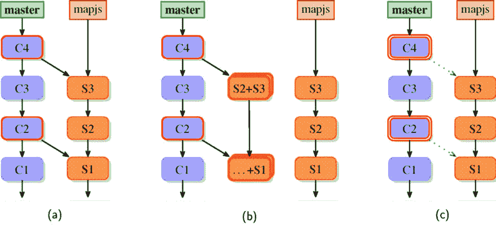

# 第十一章：管理子项目

在*第六章*，*与 Git 进行协作开发*中，我们学习了如何管理多个仓库，而*第八章*，*高级分支技术*则教会了我们利用多个分支进行各种开发技术，以及在这些仓库中进行多线开发。直到现在，这些多个仓库都是独立开发的。不同项目的仓库是自治的。

本章将解释并展示不同的方法，将不同的子项目连接到框架项目的单个仓库中，从通过嵌入一个项目的代码来进行强连接（子树）到通过嵌套仓库（子模块）来进行轻连接的方式。您将学习如何将子项目添加到主项目中，如何更新超级项目状态，以及如何更新子项目。我们将了解如何将我们的更改发送到上游，将它们回溯到适当的项目，并将它们推送到适当的仓库。管理子项目的不同技术在这里有不同的优缺点。

本章中，我们将涵盖以下主题：

+   管理库和框架依赖项

+   依赖管理工具：管理 Git 之外的依赖项

+   将代码作为子树导入超级项目

+   使用子树合并；**git-subtree** 和 **git-stree** 工具

+   嵌套仓库（子模块）：超级项目中的子项目

+   子模块的内部工作原理：gitlinks，**.gitmodules** 和 **.git** 文件

+   子树和子模块的使用案例；不同方法的比较

+   替代的第三方解决方案和工具/助手

# 构建一个活跃的框架

加入外部项目到你自己的项目有多种原因。就像将一个项目（我们称之为**子项目**或**模块**）包含在另一个项目（我们称之为**超级项目**或**主项目**）中有不同的原因一样，有不同类型的包含适应不同情况。它们都有各自的优缺点，了解这些对于选择解决方案至关重要。

假设您正在开发一个 Web 应用程序，并且您的 Web 应用程序使用 JavaScript（可能作为单页应用程序）。为了更容易开发，您可能会使用一些 JavaScript 库或 Web 框架，如 React。

这样的库是一个独立的项目。你会希望能够将其固定在已知的工作版本上（以避免未来对库的更改导致其在你的项目中停止工作），同时也能够审查更改并自动将其更新到新版本。也许你还希望对库进行自己的更改，并将这些提议的更改发送到上游。当然，你希望你的项目用户能够使用带有你树外修复的库，即使这些修复尚未被原开发者接受。可以想象，你可能会有一些定制和更改，不希望公开（发送到上游），但你仍然可能会使它们可用。

这一切在 Git 中都是可能的。包括子项目的主要解决方案有两个：使用**子树**合并策略将代码导入到项目中，以及使用**子模块**链接子项目。

子模块和子树的目标都是重用来自另一个项目的代码，该项目通常有自己的代码库，并将其放置在自己代码库的工作目录树的某个位置。其目标通常是从多个容器仓库的集中维护中受益，而无需依赖笨拙、不可靠的手动维护（通常是复制粘贴）。

有时，这种情况更为复杂。许多公司中的典型情况是，他们使用许多内部生产的应用程序，这些应用程序依赖于公共工具库或一组库。你通常会希望单独开发每个这样的应用程序，与其他应用程序一起使用，进行分支和合并，并在它们自己的 Git 仓库中应用你自己的更改和定制。然而，如果能做到的话，使用单一的**单体仓库**（**monorepo**）也有其优点，比如简化的组织结构、依赖关系、跨项目的变更和工具支持。

子模块和子树方案所使用的机制（为每个应用程序、框架或库拥有独立的 Git 仓库）并非没有问题。开发变得更加复杂，因为现在需要与多个仓库交互。如果库得到改进，你会希望更新你的子项目，并且需要测试这个新版本是否与代码正确配合，然后决定是否在超级项目中使用它。另一方面，在某个时间点，你会希望将更改提交到库本身，以便与其他开发者共享他们的更改，哪怕只是为了分担维护这些功能的负担（树外补丁会带来维护成本，需要保持其更新）。

在这些情况下该怎么办？本章描述了几种管理子项目的策略。对于每种技术，我们将详细说明如何将子项目添加到超级项目中，如何保持它们的最新状态，如何创建自己的更改，以及如何将选定的更改发布到上游。

子目录需求

请注意，所有解决方案都要求子项目的所有文件都包含在超级项目的单个子目录中。当前没有任何可用的解决方案允许将子项目文件与其他文件混合，或让它们占用多个目录。

无论你如何管理子项目，不论是子树、子模块、第三方工具，还是 Git 之外的依赖管理，你应该努力让模块代码保持独立于超级项目的特殊性（或者至少通过外部配置来处理这些特殊性，可能是非版本化的配置）。使用针对超级项目的特定修改违背了模块化和封装的原则，导致两个项目之间不必要的耦合。

另一方面，共享通用组件、库和工具，并确保所有不同但相关的项目使用相同的组件，可能比这些项目的自主性更为重要（例如，当这些项目由同一公司开发时）。在多仓库的设置中，可能每次引入新功能时都需要在多个仓库中创建多个提交，而不仅仅是一个提交。在这种情况下，单一仓库（monorepo）可能是更好的解决方案。

## 管理 Git 之外的依赖关系

在很多情况下，所使用的开发栈允许你简单地使用**打包**和**正式的依赖管理**。如果可能，通常推荐走这条路。使用依赖管理解决方案能更好地拆分代码库，避免许多副作用、复杂性和陷阱，这些问题会出现在子模块和子树解决方案中（不同的技术会带来不同的复杂性）。它使得版本控制系统与管理模块脱离关系，也让你能够从版本控制方案中受益，例如**语义化版本控制**，用于管理依赖项。

提醒一下，这里是主要编程语言和开发栈的部分列表（按字母顺序排列），以及它们的依赖管理/打包系统和注册中心（查看完整比较请访问 [www.modulecounts.com](http://www.modulecounts.com)）：

+   Go 使用 GoDoc

+   Java 使用 Maven Central（Maven 和 Gradle）

+   JavaScript 使用 npm（用于 Node.js）和 Bower

+   .NET 使用 NuGet

+   Objective-C 使用 CocoaPods

+   Perl 使用**全面的 Perl 存档网络**（**CPAN**）和 carton

+   PHP 使用 Composer、Packagist，以及经典的 PEAR 和 PECL

+   Python 使用**Python 包索引**（**PyPI**）和 pip

+   Ruby 使用 Bundler 和 RubyGems

+   Rust 使用 Crates

有时，仅仅使用官方的软件包注册表是不够的。您可能需要应用一些树外补丁（更改）来定制模块（子项目）以满足您的需求。然而，由于种种原因，您可能无法将这些更改上推并被接受。可能这些更改只与您的特定项目相关，或者上游响应提议更改的速度很慢，或者可能涉及许可方面的考虑。也许该子项目是一个不能公开的内部模块，但您被要求在公司项目中使用它。

在所有这些情况下，您需要使用**自定义软件包注册表**（软件包仓库），并且需要在默认注册表之外使用，或者需要将子项目管理为私有软件包，许多这类系统通常是支持的。如果没有对私有软件包的支持，还需要一个工具来管理私有注册表，例如 Perl 的 Pinto 或 CPAN::Mini。

## 手动将代码导入到您的项目中

有时候，您想要在项目中包含的库或工具在软件包注册表中不可用（可能是因为软件堆栈的原因；例如，C++的软件包注册表如 Conan 或 vcpkg 是比较新的东西）。

因此，让我们看一下另一种可能性：为什么我们不直接将库导入到项目中的某个子目录中呢？如果您需要更新它，只需将新版本作为一组新文件复制进来。在这种方法中，子项目代码被嵌入到超级项目的代码中。

最简单的解决方案是每次想要更新超级项目以使用新版本时，就覆盖子项目目录的内容。如果您想导入的项目没有使用 Git，或者根本没有使用**版本控制系统**（**VCS**），或者它使用的仓库不是公开的，那么这确实是唯一可能的解决方案。

使用外部 VCS 的仓库作为远程仓库

如果您想导入（嵌入）的项目使用的是 Git 以外的版本控制系统（VCS），但存在良好的转换机制（例如，快速导入流），您可以使用**远程帮助程序**来将外部 VCS 仓库设置为远程仓库（通过自动转换）。您可以查看*第六章*，*与 Git 的协同开发*，以及*第十三章*，*定制和扩展 Git*，以获取更多信息。

例如，可以使用 Mercurial 和 Bazaar 仓库，感谢**git-remote-hg**和**git-remote-bzr**帮助程序。

移动到导入库的新版本非常简单（而且机制容易理解）。删除目录中的所有文件，添加新版本库中的文件（例如，通过从归档中提取它们），然后使用`git add`命令将其添加到目录中：

```
$ rm -rf mylib/
$ git rm mylib
$ tar -xzf /tmp/mylib-0.5.tar.gz
$ mv mylib-0.5 mylib
$ git add mylib
$ git commit
```

这种方法在简单的情况下效果非常好，但有以下几点注意事项：

+   在你的项目的 Git 历史记录中，只有在导入时的库版本。一方面，这使得你的项目历史清晰易懂；另一方面，你无法访问子项目的详细历史记录。例如，在使用**git bisect**时，你只能知道是通过升级库引入的问题，而无法知道导致此问题的具体提交。

+   如果你想通过添加与应用程序相关的更改来自定义库的代码，并将其适配到你的项目中，那么在导入新版本后，你需要以某种方式重新应用这些自定义更改。你可以使用**git diff**提取更改（将其与导入时的未更改版本进行比较），然后在升级库后使用**git apply**。或者，你可以使用 rebase、交互式 rebase 或某些补丁管理接口；详见*第十章*，*保持历史清晰*。Git 不会自动执行此操作。

+   每次导入新版本的库都需要运行一系列特定的命令来更新超项目：删除旧版本的文件，添加新文件，并提交更改。它不像运行**git pull**那么简单，尽管你可以使用脚本或别名来帮助完成。

# 一种用于嵌入子项目代码的 Git 子树解决方案

在稍微高级一些的解决方案中，你可以使用**子树合并**将子项目的历史记录合并到超项目的历史记录中。这仅比普通的 pull 操作稍微复杂一些（至少在子项目导入之后），但提供了一种自动合并更改的方法。

根据你的需求，这种方法可能非常适合你。它有以下优点：

+   你将始终拥有正确版本的库，避免错误使用库版本。

+   这种方法简单易懂，仅使用标准的（且广为人知的）Git 功能。正如你所看到的，最重要且最常用的操作都很容易完成且易于理解，而且很难出错。

+   你的应用程序仓库始终是自包含的；因此，克隆它（使用普通的**git clone**）将始终包含所有需要的内容。这意味着这种方法非常适合*所需的依赖项*。

+   即使你没有上游仓库的提交权限，也可以轻松地将补丁（例如，自定义修改）应用到库内。

+   在你的应用程序中创建一个新分支也会为库创建一个新分支；切换分支时也会如此。这是你期望的行为。与子模块的行为（管理子项目的另一种技术）形成对比。

+   如果你使用的是**子树**合并策略（在*第九章*中有描述，*合并变更*），例如使用**git pull -s subtree**，那么获取新的库版本将像更新项目中的其他部分一样简单。

然而，不幸的是，这种技术并非没有缺点。对于许多人和许多项目来说，这些缺点并不重要。基于子树的方法通常因其简便性而克服了其缺陷。

以下是子树方法的几个问题：

+   每个使用该库的应用程序都会增加其文件的副本。没有简单且安全的方式在不同的项目和不同的仓库之间共享其对象。（请参阅以下有关共享 Git 对象数据库的说明。）

+   每个使用该库的应用程序都有它自己的文件检出到工作区，尽管你可以借助**稀疏检出**来更改这一点（将在下一章*第十二章*中描述，*处理* *大型仓库*）。

+   如果你的应用程序对其库的副本进行了更改，那么将这些更改发布并推送到上游并不那么简单。像**git subtree**或**git stree**这样的第三方工具可以提供帮助。它们有专门的子命令来提取子项目的更改。

+   由于子项目文件与超级项目文件之间缺乏分离，因此很容易在一次提交中混合库的更改和应用程序的更改。在这种情况下，你可能需要重写历史（或历史的副本），如*第十章*中所述，*保持* *历史清晰*。

前两个问题意味着子树并不适合管理*可选依赖*（仅用于某些额外功能）或*可选组件*（如主题、扩展或插件）等子项目，特别是那些只需在文件系统层次结构中的适当位置存在就能安装的子项目。

在分支（副本）之间通过替代对象共享

你可以通过**替代**（换句话说，使用**git clone --reference**）来减少仓库中对象的重复。然而，这样做时你需要更加小心垃圾回收。问题的关键部分是那些在借用者仓库中被引用，但在借出者仓库的引用中没有被引用的历史部分。替代机制的描述和解释将在*第十四章*中介绍，*Git 管理*。

处理和管理子树导入的子项目有多种技术方法。你可以使用经典的 Git 命令，只需在操作子项目时使用适当的选项，例如 `--strategy=subtree`（或将 `subtree` 选项添加到默认的 `recursive` 合并策略中，`--strategy-option=subtree=<path>`）用于 `merge`、`cherry-pick` 和相关操作。这种手动方法在大多数情况下非常简单，并且提供了最佳的操作控制度。然而，它需要对底层概念有充分的理解。

在现代 Git（自 1.7.11 版本起），`git subtree` 命令作为已安装的二进制文件之一可用。它来自 `contrib/` 区域，并未完全集成（例如，在文档方面）。这个脚本经过充分测试且稳健，但它的一些概念比较特殊或令人困惑，而且这个命令并不支持所有可能的子树操作。此外，这个工具仅支持 *带历史的导入* 工作流（稍后会定义），有些人认为这会使历史图表变得混乱。

还有一些第三方脚本可以帮助处理子树，其中之一是 `git-subrepo`。

## 为子项目创建远程

通常，在导入子项目时，你会希望能够轻松地更新嵌入的文件。你希望继续与子项目互动。为此，你可以将该子项目（例如，公共库）作为 **远程引用** 添加到你的（超级）项目中，并进行拉取：

```
$ git remote add mylib_repo https://git.example.com/mylib.git
$ git fetch mylib_repo
warning: no common commits
From https://git.example.com/mylib.git
* [new branch]      master     -> mylib_repo/master
```

请注意，在这个示例中，进度信息被删除以简化展示。

然后你可以检查 `mylib_repo/master` 远程跟踪分支，可以通过 `git checkout mylib_repo/master` 将其签出到脱离的 `HEAD`，或者通过创建一个本地分支并使用 `git checkout -b mylib_branch mylib_repo/master` 签出这个本地分支。另外，你也可以通过 `git ls-tree -r --abbrev mylib_repo/master` 列出它的文件。你会看到，子项目的根目录与超项目不同。此外，从 **warning: no common commits** 的信息可以看出，这个远程跟踪分支包含了来自独立项目的完全不同的历史。

## 将子项目作为子树添加

如果你没有使用像 `git subtree` 这样的专用工具，而是采用手动方法，下一步将会有些复杂，并且需要你使用一些高级 Git 概念和技巧。幸运的是，这个过程只需要做一次。

首先，如果你想导入*子项目历史*，你需要创建一个合并提交，导入相关的子项目。你需要在超级项目中的给定目录下拥有子项目的文件。不幸的是（至少在写这篇章时的当前 Git 版本中），使用`-Xsubtree=mylib/`合并策略选项并不能按预期工作。我们必须分两步来做：先准备父项，然后准备内容。

第一步是准备一个合并提交，使用`ours`合并策略，但不立即创建它（不写入到仓库中）。该策略会合并历史记录，但会从当前分支取当前版本的文件：

```
$ git merge --no-commit --strategy=ours --allow-unrelated-histories mylib_repo/master
Automatic merge went well; stopped before committing as requested
```

如果你想要一个*简单的历史*，类似于我们仅仅复制文件时得到的历史，你可以跳过这一步。

现在我们需要更新我们的索引（即提交的暂存区），将库仓库中`master`分支的内容更新到我们的工作目录。所有这些也需要在适当的子文件夹中完成。这可以通过低级（plumbing）`git` `read-tree`命令来完成：

```
$ git read-tree --prefix=mylib/ -u mylib_repo/master
$ git status
On branch master
All conflicts fixed but you are still merging.
  (use "git commit" to conclude merge)
Changes to be committed:
        new file:   mylib/README [...]
```

我们使用了`-u`选项，因此工作目录会随着索引一起更新。然后，我们只需按照 Git 的提示用`git commit`来完成合并。

重要提示！

重要的是不要忘记**--prefix**选项参数中的尾部斜杠。检出的文件会以此为前缀。

这一系列步骤在 Git 文档的 HOWTO 部分中有描述，具体来说是在**如何使用子树合并策略**中。此 HOWTO 可以在[`kernel.org/pub/software/scm/git/docs/howto/using-merge-subtree.html`](https://kernel.org/pub/software/scm/git/docs/howto/using-merge-subtree.html)找到。

使用`git subtree`这类工具要简单得多：

```
$ git subtree add --prefix=mylib mylib_repo master
git fetch mylib_repo master
From https://git.example.com/mylib.git
* branch          master     -> FETCH_HEAD
Added dir 'mylib'
```

`git subtree`命令在必要时会拉取子树的远程版本；无需像手动方案那样执行手动拉取。

如果你检查历史记录，例如使用`git log --oneline --graph --decorate`，你会看到这个命令将库的历史记录与应用程序（超级项目）的历史记录合并。如果你不希望这样，那就没办法了。`git subtree`在其`add`、`pull`和`merge`子命令中提供的`--squash`选项在这里并不会帮上忙。这个工具的一个特殊之处在于，这个选项不会创建**压缩合并**，而是简单地合并压缩后的子项目历史（就像是经过交互式变基后的合并）。提交消息会像这样：**Squashed ‘mylib/’ content from commit 5e28a71**。请参见本章稍后的*图 11.2(b)*。

如果你想要一个没有历史记录与超级项目历史关联的子树，如*图 11.2(c)*所示，可以考虑使用外部工具`git-subrepo`。它的额外优点是它能记住子树设置：

```
$ git subrepo clone \
  https://git.example.com/mylib.git mylib/
Subrepo 'https://git.example.com/mylib.git' (master) cloned into 'mylib'.
```

有关子项目仓库 URL、主分支、原始提交等信息存储在包含子项目的目录中的 `.gitrepo` 文件里。所有后续的 `git subrepo` 命令都会通过子项目所在目录的名称来引用该嵌入的子项目（在前面的示例中是 `mylib/`）。

你也可以使用外部的 `git-stree` 工具来实现类似的效果，但该工具已被弃用，取而代之的是 `git-subrepo`。

## 克隆和更新包含子树的超级项目

好的！现在我们已经将库作为子树嵌入到项目中了，那我们需要做什么才能获取它呢？由于子树的概念是只有一个仓库（容器），你只需克隆这个仓库即可。

为了获取最新的仓库，你只需要进行常规的拉取；这将同时更新超级项目（容器）和子项目（库）。无论采用何种方法、使用何种工具，或者子树是如何添加的，这种方法都能正常工作。这是子树方法的一个巨大优势。

## 从子项目获取更新，通过子树合并

让我们看看自从导入子项目后，子项目是否有一些新变化。如果需要更新超级项目中嵌入的版本，这是很容易做到的：

```
$ git pull --strategy subtree mylib_repo master
From https://git.example.com/mylib.git
 * branch            master     -> FETCH_HEAD
Merge made by the 'subtree' strategy.
```

你本来可以选择先拉取然后再合并，这样能更好地控制。或者，如果你喜欢，也可以选择变基而不是合并，这也可以。

选择子树合并策略的重要性

在拉取子项目时，别忘了选择合并策略 **-s subtree**。即使没有该选项，合并也能正常工作，因为 Git 会进行重命名检测，并通常能发现文件是从根目录（子项目中的）移动到子目录（我们正在合并到的超级项目中的） 的。问题出现在子项目内外存在冲突文件的情况下。潜在的候选文件包括 Makefile 和其他标准文件名。

如果 Git 无法正确检测到需要合并的目录，或者如果你需要使用普通 **ort** 合并策略的高级功能（这是默认策略），你可以改用 **-Xsubtree=<path/to/subproject>**，即 **ort** 合并策略的 **subtree** 选项。

你可能需要调整应用程序代码的其他部分，以便与更新后的库代码正常配合工作。

请注意，通过这种解决方案，你的子项目历史会与应用程序历史相关联，就像你在 *图 11.1* 中看到的那样：


图 11.1 – 超级项目的历史，子项目已合并到 'maps/' 目录中。子项目历史可以通过相关的远程跟踪分支在超级项目中查看

如果你不希望子项目的历史记录与主项目的历史记录混杂在一起，并且更喜欢更简洁的历史记录（如*图 11.1*所示），你可以使用`git merge`（或`git pull`）命令的`--squash`选项来合并：

```
$ git merge -s subtree --squash mylib_repo/master
Squash commit -- not updating HEAD
Automatic merge went well; stopped before committing as requested
$ git commit -m "Updated the library"
```

压缩合并在*第九章*中描述，*合并* *更改一起*。

在这种情况下，在历史记录中，你将只看到子项目版本已更改这一事实，这既有优点也有缺点。你得到的是*更简洁*的历史，但也失去了*详细*的历史。

使用`git subtree`或`git subrepo`工具时，只需使用它们的`pull`子命令；它们自己提供了`subtree`合并策略。然而，目前`git subtree pull`需要你重新指定`--prefix`和整个子树设置。



图 11.2 – 不同类型的子树合并：（a）子树合并，（b）压缩提交的子树合并，（c）压缩子树合并

注意，`git subtree`命令总是会进行合并，即使使用了`--squash`选项；它只是会在合并之前将子项目的提交压缩（就像交互式变基中的`squash`指令一样）。反过来，`git subrepo pull`总是会将合并压缩（如`git merge --squash`），这保持了超项目历史和子项目历史的分离，不会污染历史的图谱。所有这些可以在*图 11.2*中看到。注意，图中*(c)*中的虚线表示的是**C2**和**C4**提交的生成方式，而不是父提交。

## 显示子树与其上游之间的差异

要查找子项目与工作目录中当前版本之间的差异，你需要使用非常规选择器语法来执行`git diff`。这是因为子项目中的所有文件（例如，在`mylib_repo/master`远程跟踪分支中）都位于根目录下，而在超项目中（例如，在`master`中）则位于`mylib/`目录下。我们需要选择要与`master`进行比较的子目录，将其放在修订标识符和冒号之后（跳过它意味着将与超项目的根目录进行比较）。

命令如下所示：

```
$ git diff master:mylib mylib_repo/master
```

类似地，要检查在子树合并之后，我们刚刚创建的提交（`HEAD`）是否与合并后的提交中的`mylib/`目录中的内容相同，即`HEAD²`，我们可以使用以下命令：

```
$ git diff HEAD:mylib HEAD²
```

## 将更改发送到子树的上游

在某些情况下，子项目的子树代码只能在容器代码中使用或测试；大多数主题和插件都有这样的限制。在这种情况下，你将被迫直接在主项目代码库中发展你的子树代码，然后最终将其回传到子项目的上游。

这些变更通常需要对超级项目代码做出调整；尽管建议将子树代码变更和其他部分的变更分别提交（一个用于子树代码变更，另一个用于其他部分），但这并非严格必要。你可以告诉 Git 只提取子项目的变更。问题在于拆分的变更提交信息，因为 Git 无法自动提取变更集描述的相关部分。

另一个常见的情况是，虽然最好避免，但有时需要根据容器特定的方式自定义子项目代码（特别为主项目进行配置），通常不将这些变更推送回上游。你应该小心区分这两种情况，并将每个用例的变更（可回溯和不可回溯）保存在它们各自的提交中。

处理这个问题有不同的方式。你可以通过要求所有子树的变更必须在单独的模块仓库中进行，从而避免提取变更并将其提交到上游的问题。如果可能，我们甚至可以要求所有子项目的变更必须先提交到上游，然后只有通过上游接受，我们才能将这些变更合并到容器中。

如果你需要能够提取子树的变更，那么一种可能的解决方案是使用`git filter-branch --directory-filter`（或使用带有适当脚本的`--index-filter`）。另一种简单的解决方案是直接使用`git subtree push`。然而，这两种方法都会回溯*每一个*触及相关子树的提交。

如果你只想将那些已经进入主项目仓库的子项目变更中的一部分发送到上游，那么解决方案就稍微复杂一些。一个可能的方法是创建一个本地分支，专门用于从子项目远程跟踪分支回溯。将其从该子树跟踪分支中分叉意味着它将以子树为根，并且只会包含子模块文件。

这个用于回溯子项目变更的分支需要在子项目上游仓库的远程中具有适当的分支作为上游分支。通过这种设置，我们就能够使用`git cherry-pick --strategy=subtree`将我们希望发送到子项目上游的提交应用到这个分支上。然后，我们可以简单地使用`git push`将这个分支推送到子项目的仓库中。

樱桃挑选和子模块

即使**cherry-pick**在没有它的情况下也能正常工作，最好还是指定**--strategy=subtree**，以确保子项目目录外的文件（即**子树外**的文件）会被安静地忽略。这可以用来从混合提交中提取子树的变更；如果没有这个选项，Git 将拒绝完成樱桃挑选。

这比普通的`git push`需要更多的步骤。幸运的是，你只需要在将超级项目仓库中的更改推送回子项目时面对这个问题。正如你所见，将子项目的更改获取到超级项目中要简单得多。

好吧，使用`git-stree`会让这变得微不足道；你只需要列出要推送到回退的提交即可：

```
$ git stree push mylib_repo master~3 master~1
• 5e28a71 [To backport] Support for creating debug symbols
• 5b0aa4b [To backport] Timestamping (requires application tweaks)
✔︎  STree 'mylib_repo' successfully backported local changes to its remote
```

事实上，这个工具在内部使用相同的技术，为子项目创建并使用一个专门的回退本地分支。

# Git 子模块解决方案——仓库中的仓库

将子项目的代码（以及可能的历史）导入到超级项目中的子树方法有其缺点。在许多情况下，子项目和容器是两个不同的项目：你的应用程序依赖于该库，但显然它们是独立的实体。将两者的历史合并并不是最好的解决方案。

此外，子项目的嵌入代码和导入历史始终存在。因此，子树技术不适用于可选依赖项和组件（如插件或主题）。它也不允许你对子项目的历史设置不同的访问控制，可能唯一的例外是通过使用 Git 仓库管理解决方案，如`gitolite`（你可以在*第十四章*，*Git 管理*中找到更多内容），来限制对子项目（实际上是子项目子目录）的写访问权限。

子模块解决方案是将子项目的代码和历史保存在其自己的仓库中，并将该仓库嵌入到超级项目的工作区中，但不会将其文件作为超级项目的文件添加。

## Git 链接、.git 文件和 git 子模块命令

Git 包括一个名为`git submodule`的命令，旨在与子模块一起使用。然而，要正确使用它，你需要理解至少一些它的操作细节。它是两种不同功能的结合：所谓的`git submodule`工具本身。

无论是子树解决方案还是子模块解决方案，子项目都需要包含在超级项目工作目录中的一个单独文件夹中。但是，在使用子树时，子项目的代码属于超级项目仓库，而在子模块中则不是这种情况。使用子模块时，每个子项目有自己在容器仓库中的某个地方的仓库。子模块的代码属于其自己的仓库，超级项目本身仅存储获取子项目文件相应修订版所需的元信息。

实际上，在现代 Git 中，子模块使用一个简单的 `.git` 文件，其中包含一个包含实际仓库文件夹相对路径的 `gitdir:` 行。子模块仓库实际上位于超级工程的 `.git/modules` 文件夹内（并且 `core.worktree` 已适当设置）。这样做主要是为了处理当超级工程有些分支根本没有子模块的情况。它允许我们在切换到没有子模块的超级工程版本时，避免必须丢弃子模块的仓库。

提示

你可以将包含 `gitdir:` 行的 **.git** 文件视为等效的符号引用，作为 **.git** 目录的操作系统独立符号链接替代品。仓库的路径不一定需要是相对路径：

```
$ ls -aloF plugins/demo/
total 10
drwxr-xr-x 1 user  0 Jul 13 01:26 ./
drwxr-xr-x 1 user  0 Jul 13 01:26 ../
-rw-r--r-- 1 user 32 Jul 13 01:26 .git
-rw-r--r-- 1 user  9 Jul 13 01:26 README
[…]
$ cat plugins/demo/.git
gitdir: ../../.git/modules/plugins/demo
```

尽管如此，包含的超级工程和子工程模块实际上充当（并且实际上是）独立的仓库：它们有自己的历史记录、自己的暂存区和自己的当前分支。因此，在输入命令时，你应该小心，注意自己是在子模块内部还是外部，因为命令的上下文和影响差异很大！

使用子模块的主要思想是超级工程的提交记住子工程的 *确切* 修订版；此引用使用子工程提交的 SHA1 标识符。与某些依赖管理工具中使用清单文件的方式不同，子模块解决方案将此信息存储在一个树对象中，使用所谓的 gitlinks。**Gitlink** 是从超级工程仓库中的 **树对象** 到子模块仓库中的 **提交对象** 的引用；见 *图 11.3*。左侧子模块文件的淡色阴影表示它们作为文件存在于超级工程的工作目录中，但并不在超级工程仓库中。


图 11.3 – 一个超级工程的历史，子工程作为子模块链接在‘maps/’子目录中。子工程历史是独立的

回想一下，在*第十章*《保持历史干净》一节中描述的仓库数据库中对象的类型，每个提交对象（表示项目的一个修订版）准确地指向一个树对象，该树对象包含仓库内容的快照。每个树对象引用 blobs 和 trees，分别表示文件内容和目录内容。提交对象引用的树对象唯一标识与该提交对象相关联的修订版中包含的文件内容、文件名和文件权限集。

让我们记住，提交对象本身是彼此连接的，形成了**有向无环图**（**DAG**）的修订历史。每个提交对象都引用零个或多个父提交，它们共同描述了一个项目的历史。

前面提到的每种引用类型都参与了可达性检查。如果指向的对象缺失，则意味着仓库已损坏。

对于 gitlink 来说情况并非如此。指向提交的树对象条目指向的是另一个独立仓库中的对象，即子项目（子模块）仓库中的对象。子模块提交无法访问并不是错误，这一点使我们可以选择性地包含子模块：没有子模块仓库，也就没有在 gitlink 中引用的提交。

在一个包含所有类型对象的项目上运行 `git ls-tree --abbrev HEAD` 的结果如下：

```
040000 tree 573f464    docs
100755 blob f27adc2    executable.sh
100644 blob 1083735    README.txt
040000 tree ef9bcb4    subdirectory
160000 commit 5b0aa4b   submodule
120000 blob 3295d66    symlink
```

将其与工作区的内容进行比较（使用 `ls -l -o -F`）：

```
drwxr-xr-x   5 user    12288 06-28 17:18 docs/
-rwxr-xr-x   1 user    36983 02-20 20:11 executable.sh*
-rw-r--r--   1 user     2628 2015-01-03  README.txt
drwxr-xr-x   3 user     4096 06-28 17:19 subdirectory/
drwxr-xr-x  48 user    36864 06-28 17:19 submodule/
lrwxrwxrwx   1 user       32 06-28 17:18 symlink -> docs/toc.html
```

## 将子项目作为子模块添加

要管理子模块，可以使用 `git submodule` 命令。它的创建是为了帮助管理子模块的文件系统内容、元数据和配置，并检查其状态以及进行更新。

对于子树来说，第一步通常是将子项目仓库添加为远程，这意味着从子项目仓库中获取对象到*超项目*的对象数据库中。

要将给定的仓库作为子模块添加到超项目的特定目录中，请使用 `git submodule` 的 `add` 子命令：

```
$ git submodule add https://git.example.com/demo-plugin.git plugins/demo
Cloning into 'plugins/demo'...
done.
```

关于通过路径添加子项目到其仓库的说明

当使用路径而非 URL 作为远程地址时，需记住远程的相对路径是相对于我们的主远程地址解释的，而不是相对于我们仓库的根目录。

此命令将子模块的信息（例如仓库的 URL）存储在 `.gitmodules` 文件中。如果 `.gitmodules` 文件不存在，它会创建一个新的文件：

```
[submodule "plugins/demo"]
    url = https://git.example.com/demo-plugin.git
```

请注意，子模块的名称等于其路径。你可以通过 `--name` 选项显式设置名称（或通过编辑配置）；在子模块目录上执行 `git mv` 会改变子模块路径，但保持相同的名称。

获取子模块时的身份验证重用

在存储远程仓库的 URL 时，通常可以接受并且有用的是将用户名与子项目信息一起存储（例如，将用户名存储在 URL 中，如 **user@git.company.com:mylib.git**）。

然而，将用户名作为 URL 一部分来存储在 **.gitmodules** 中是不推荐的，因为该文件必须对其他开发人员可见（他们通常会使用不同的用户名进行身份验证）。幸运的是，深入子模块的命令可以重用克隆（或获取）超项目时的身份验证。

`add` 子命令还会为你执行等效的 `git submodule init`，假设你添加了一个子模块，那么你肯定对它感兴趣。这个操作会将一些子模块特定的设置添加到主项目的本地配置中：

```
[submodule "plugins/demo"]
        url = https://git.example.com/demo-plugin.git
```

为什么会有重复？为什么要将相同的信息存储在 `.gitmodules` 和 `.git/config` 中？原因是，虽然 `.gitmodules` 文件是为所有开发者设计的，但我们可以根据具体的本地情况调整本地配置。使用两个不同文件的另一个原因是，`.gitmodules` 文件中包含的子模块信息仅表示子项目可用，而 `.git/config` 中的子模块信息则意味着我们对某个特定的子模块感兴趣（并且希望它存在）。

你可以手动创建并编辑 `.gitmodules` 文件，或者使用 `git config -f .gitmodules` 来进行编辑。

这个文件通常会被提交到超级项目仓库（类似于 `.gitignore` 和 `.gitattributes` 文件），它的作用是列出所有可能的子项目。

所有其他子命令都要求 `.gitmodules` 文件必须存在；例如，如果在添加子模块之前运行 `git submodule update`，你将得到以下结果：

```
$ git submodule update
No submodule mapping found in .gitmodules for path 'plugins/demo'
```

这就是为什么 `git submodule add` 命令会同时暂存 `.gitmodules` 文件和子模块本身：

```
$ git status
On branch master
Changes to be committed:
  (use "git reset HEAD <file>..." to unstage)
        new file:   .gitmodules
        new file:   plugins/demo
```

请注意，整个子模块（它是一个目录）在 `git status` 中看起来就像是一个新文件。默认情况下，大多数 Git 命令仅限于操作活动容器仓库，并不会递归进入子模块的嵌套仓库。正如我们将看到的，这一行为是可以配置的。

## 克隆带有子模块的超级项目

一个重要的问题是，默认情况下，如果你克隆超级项目仓库，你将无法获取任何子模块。所有的子模块都不会出现在工作复制目录中；这里只有它们的基础目录。这种行为正是子模块可选性的基础。

然后我们需要告诉 Git 我们对某个特定的子模块感兴趣。我们通过调用 `git submodule init` 命令来实现这一点。这个命令的作用是将子模块的设置从 `.gitmodules` 文件复制到超级项目的仓库配置中，即 `.git/config`，并注册该子模块：

```
$ git submodule init plugins/demo
Submodule 'plugins/demo' (https://git.example.com/demo-plugin.git) registered for path 'plugins/demo'
```

`init` 子命令会将以下两行添加到 `.git/config` 文件中：

```
[submodule "plugins/demo"]
    url = https://git.example.com/demo-plugin.git
```

这个单独的本地配置允许你为你感兴趣的子模块配置不同的 URL 地址（可能是某个子项目仓库的公司专用克隆地址），与 `.gitmodules` 文件中指定的 URL 地址不同。

这个机制还使得在子项目的仓库发生移动时，能够提供一个新的 URL。这就是为什么本地配置会覆盖 `.gitmodules` 中记录的配置；否则，当切换到 URL 变更之前的版本时，你将无法从当前 URL 获取内容。另一方面，如果仓库发生了移动，并且 `.gitmodules` 文件已相应更新，我们可以通过 `git submodule sync` 将新的 URL 从 `.gitmodules` 提取到本地配置中。

我们已经告诉 Git 我们关注的是给定的子模块。但是，我们仍然没有从其远程仓库获取子模块提交，也没有将其检出并让其文件出现在超级项目的工作目录中。我们可以通过 `git submodule update` 来实现这一点。

快捷命令

实际上，在使用仓库处理子模块时，我们通常将这两个命令（**init** 和 **update**）合并为一个命令 **git submodule update --init**；除非我们需要自定义 URL。

如果你对所有子模块感兴趣，可以使用 `git clone --recursive`（或 `git clone --recurse-submodules`）在克隆后自动初始化并更新每个子模块。

要临时移除一个子模块，并保留稍后恢复它的可能性，你可以通过 `git remote deinit` 将其标记为不感兴趣。这只会影响 `.git/config`。要永久移除一个子模块，你需要先取消初始化它，然后从 `.gitmodules` 和工作区中移除它（使用 `git rm`）。

## 更新超级项目更改后的子模块

要更新子模块，使工作目录中的内容反映当前超级项目版本中子模块的状态，你需要执行 `git submodule update`。这个命令会更新子项目的文件，或者如果需要的话，克隆初始的子模块仓库：

```
$ rm -rf plugins/demo   # clean start for this example
$ git submodule update
Submodule path 'plugins/demo': checked out '5e28a713d8e87…'
```

`git submodule update` 命令会进入 `.git/config` 中引用的仓库，获取索引中找到的提交 ID（`git ls-tree HEAD -- plugins/demo`），并将此版本检出到 `.git/config` 中指定的目录。当然，你可以指定要更新的子模块，作为参数提供子模块的路径。

因为我们在这里检查的是由 `gitlink` 提供的修订版本，而不是一个分支，`git submodule update` 会使子项目的 `HEAD` 脱离（参见 *图 11.3*）。这个命令会将子项目直接回滚到超级项目中记录的版本。

还有一些你需要了解的其他事项：

+   如果你以任何方式更改了超级项目的当前修订版本，无论是通过更改分支、使用 **git pull** 导入分支，还是通过 **git reset** 回滚历史记录，你都需要运行 **git submodule update** 来获取与子模块匹配的内容。默认情况下不会自动执行此操作，因为这可能导致子模块中的工作丢失。

+   相反，如果你切换到另一个分支，或者以其他方式更改了超项目中的当前修订版，并且没有运行**git submodule update**，Git 会认为你故意更改了子模块目录，以指向一个新的提交（尽管它实际上是你之前使用过的旧提交，但你忘记更新了）。如果在这种情况下你运行了**git commit -a**，那么你可能会意外更改 gitlink，从而导致超项目历史中存储了错误版本的子模块。

+   你可以通过在子项目中使用普通的 Git 命令来获取（或切换到）你想要的子模块版本，然后在超项目中提交这个版本，从而轻松升级 gitlink 引用。在这里不需要使用**git submodule**命令。

你可以在从主项目的远程仓库拉取更新时，让 Git 自动获取初始化的子模块。这一行为可以通过`fetch.recurseSubmodules`（或`submodule.<name>.fetchRecurseSubmodules`）进行配置。该配置的默认值是`on-demand`（当 gitlink 更改且其指向的子模块提交丢失时进行获取）。你可以将其设置为`yes`或`no`，以无条件开启或关闭递归获取子模块。对应的命令行选项是`--recurse-submodules`。

你可以将`--recurse-submodules`命令行选项传递给许多 Git 命令，包括`git pull`命令，这样它就会获取已初始化的模块并更新活动子模块的工作树。

始终递归进入活动子模块

要使支持该功能的 Git 命令默认使用**--recurse-submodules**选项，可以将**submodule.recurse**配置选项设置为**true**。**checkout**、**fetch**、**grep**、**pull**、**push**、**read-tree**、**reset**、**restore**和**switch**命令都支持此选项。

请注意，我们可以使用`--merge`将超项目中记录的提交合并到子模块的当前分支，或者使用`--rebase`将当前分支重基于 gitlink 上，就像使用`git pull`一样，而不是在分离的`HEAD`上检出 gitlinked 修订版。默认使用的子模块仓库分支是`master`，但可以通过在`.gitmodules`或`.git/config`中设置`submodule.<name>.branch`选项来覆盖分支名称，以后者为优先。

如你所见，使用 gitlink 和**git submodule**命令相当复杂。从根本上讲，gitlink 的概念可能很适合子项目和超项目之间的关系，但正确使用这些信息比你想象的要困难。另一方面，它提供了巨大的灵活性和强大功能。

## 检查子模块中的更改

默认情况下，状态、日志和`diff`输出仅基于活动仓库的状态，并不深入子模块。这通常是个问题；你需要记住运行`git submodule summary`。如果你仅限于这种视图，很容易错过回归：你可以看到子模块已经发生变化，但却看不到具体如何变化。

然而，你可以设置 Git，使其使用`status.submoduleSummary`配置变量。如果设置为非零数字，则该数字将提供`--summary-limit`限制；值为`true`或`-1`表示无限制。

设置此配置后，你会得到如下内容：

```
$ git status
On branch master
Changes to be committed:
  (use "git reset HEAD <file>..." to unstage)
        new file:   .gitmodules
        new file:   plugins/demo
Submodule changes to be committed:
* plugins/demo 0000000...5e28a71 (3):
  > Fix repository name in a README file
```

状态扩展了始终存在的信息，表明子模块发生了变化（`plugins/demo`有三个新的提交，并显示最后一个提交的摘要（`>`）标记在摘要行之前，意味着该提交已被添加，即存在于工作区中，但还未在超级项目的提交中）。

小知识

实际上，这部分添加的内容就是**git submodule** **summary**输出。

对于相关的子模块，将列出给定超级项目的提交中子模块版本与索引或工作树中的子模块版本之间的一系列提交（前者通过使用`--cached`显示）。此外，还有`git submodule status`命令，提供每个模块的简短信息。

`git diff`命令的默认输出也不会提供关于子模块更改的详细信息，只是告诉你它有所不同：

```
$ git diff HEAD -- plugins/demo
diff --git a/plugins/demo b/plugins/demo
new file mode 160000
index 0000000..5e28a71
--- /dev/null
+++ b/plugins/demo
@@ -0,0 +1 @@
+Subproject commit 5e28a713d8e875f2cf1060c2580886dec3e5b04c
```

幸运的是，有一个`--submodule=log`命令行选项（你可以通过`diff.submodule`配置设置默认启用）可以让我们看到一些更有用的信息：

```
$ git diff HEAD --submodule=log -- plugins/demoSubmodule subrepo 0000000...5e28a71 (new submodule)
```

我们可以不使用`log`，而使用`short`格式，仅显示提交的名称，这也是默认格式（即使用`git diff --submodule`时）。或者，我们可以使用`diff`格式，显示子模块更改内容的内联`diff`。

## 从子模块的上游获取更新

提醒一下，子模块的提交通过 gitlinks 使用 SHA1 标识符进行引用，该标识符始终指向相同的修订版本；它不是一个易变（不稳定）的引用，比如分支名称。因此，超级项目中的子模块不会自动升级（这可能会破坏应用程序）。然而，有时你可能想要将子项目更新到它的上游版本。

假设子项目仓库发布了新的修订版本，并且对于我们的超级项目，我们想要更新到子模块的新版本。

为了实现这一点，我们需要更新子模块的本地仓库，将我们想要的版本移到超级项目的工作目录中，最后在超级项目中提交子模块的更改。

我们可以手动完成这个过程，首先将当前目录更改为子模块工作目录。然后，在子模块中，执行 `git fetch` 以获取到本地克隆库中的数据（在超级项目的 `.git/modules/` 中）。在通过 `git log` 验证我们所拥有的内容后，我们可以更新工作目录。如果没有本地更改，你可以简单地检出所需的修订版本。最后，需要在超级项目中创建一个提交。

除了更精细的控制，这种方法还有额外的好处，即使在当前状态下也可以工作（无论你是在活动分支上还是在分离的`HEAD`上）。

另一种方法是，从容器存储库开始，使用 `git submodule update --remote` 显式将子模块升级到其跟踪的远程分支。与普通的更新命令类似，你可以选择合并或变基而不是检出分支；你可以使用 `submodule.<name>.update` 配置变量配置更新的默认方式，并使用 `submodule.<name>.branch` 配置默认上游分支。

git submodule update 的变种

简而言之，**submodule update --remote --merge** 将上游的子项目更改合并到子模块中，而 **submodule update --merge** 将超级项目的 gitlink 更改合并到子模块中。

`git submodule update --remote` 命令会自动从子模块远程站点获取新的更改，除非使用 `--no-fetch` 明确告知不要这样做。

## 将子模块更改发送到上游

直接在子模块中进行更改（而不是通过其独立的存储库）的主要危险之一是忘记推送子模块。对于子模块的一个良好实践是首先提交子模块的更改，推送模块更改，然后再回到容器项目，提交并推送容器更改。

如果你只推送到超级模块存储库，忘记了子模块的推送，那么其他开发者在尝试获取更新时会遇到错误。虽然 Git 在获取超级项目时不会抱怨，但你会在 `git submodule summary` 输出（如果正确配置的话还有 `git status` 输出）以及尝试更新工作区时看到问题：

```
$ git submodule summary
* plugins/demo 12e3a52...0e90143:
  Warn: plugins/demo doesn't contain commit 12e3a529698c519b2fab790…
$ git submodule update
fatal: reference is not a tree: 12e3a529698c519b2fab790…
Unable to checkout '12e3a529698c519b2fab790…' in submodule path 'plugins/demo'
```

显然你可以看出记得推送子模块是多么重要。如果需要，你可以请求 Git 在推送超级项目时自动推送子模块，使用命令 `git push --recurse-submodules=on-demand`（另一个选项是仅检查）。你还可以使用 `push.` `recurseSubmodules` 配置选项。

# 将子文件夹转换为子树或子模块

在思考 Git 中子项目的用例时，首先考虑的问题之一是准备好基本项目的源代码以进行这种分割。

子模块和子树始终表示为超级项目（主项目）的子目录。您不能在一个目录中混合来自不同子系统的文件。

经验表明，大多数系统即使在单体存储库中也使用这样的目录层次结构，这对模块化工作是一个很好的开端。因此，将子文件夹转换为真正的子模块/子树相当容易，并可以通过以下步骤序列完成：

1.  将问题子目录移出超级项目的工作区以将其放置在超级项目顶级目录旁边。如果保留子项目的历史记录很重要，请考虑使用 **git subtree split**，或者 **git filter-branch --subdirectory-filter** 或其等效方法，也许还可以结合 **reposurgeon** 等工具清理历史记录。有关更多详细信息，请参阅 *第十章*，*保持历史干净*。

1.  将包含子项目存储库的目录重命名，以更好地表达提取组件的本质。例如，原始命名为 **refresh** 的子目录可以重命名为 **refresh-client-app-plugin**。

1.  创建子项目的公共存储库（上游）作为一流项目（例如，在 GitHub 上创建一个新项目以保存提取的代码，可以在与超级项目相同的组织下，也可以在专门的应用程序插件组织下）。

1.  使用 **git init** 将自包含的独立插件初始化为 Git 存储库。如果在 *第 1 步* 中将子目录的历史记录提取到某个分支中，则将此分支推送到刚创建的存储库。设置在 *第 3 步* 中创建的公共存储库作为默认远程存储库，并将初始提交（或整个历史记录）推送到刚创建的 URL 以存储子项目代码。

1.  在超级项目中，阅读您刚刚提取的子项目，但这次，作为一个合适的子模块或子树，无论哪种解决方案更合适，也无论您更喜欢使用哪种方法。使用刚创建的子项目的公共存储库的网址。

1.  将超级项目中的更改提交并推送到其公共存储库，在子模块的情况下，包括新创建（或刚修改的）**.****gitmodules** 文件。

将子目录转换为独立子模块的推荐实践是使用只读 URL 进行克隆（添加回）子模块。这意味着您可以使用 `git://` 协议（警告：在这种情况下，服务器未经身份验证）或者没有用户名的 `https://`。此建议的目标是通过将子模块代码移动到独立的子项目存储库来强制实现分离。为确保所有其他开发者都能访问子模块提交，每个更改都应通过子项目的公共存储库进行。

如果这个建议（最佳实践）被明确拒绝，实际上，你可以直接在超级项目内处理子项目的源代码，尽管这更容易出错。你需要记得首先在子模块内提交和推送，在嵌套子模块子目录内执行；否则，其他开发者将无法获取更改。这种结合的方法可能更简单，但它失去了在使用子模块时应当更好地假设的实现和消费更改之间的真正分离。

# 子树与子模块的对比

一般来说，子树比子模块更容易使用，且不容易出错。很多人选择使用子模块，因为它们有更好的内建工具（拥有自己的 Git 命令，即`git submodule`）、详细的文档，并且与 Subversion 外部引用类似，给人一种虚假的熟悉感。添加子模块非常简单（只需运行`git submodule add`），尤其是相比于在没有第三方工具（如`git subtree`或`git subrepo`）帮助的情况下添加子树。

子树和子模块的主要区别在于，子树只有一个仓库，这意味着只有一个生命周期。而子模块和类似的解决方案使用嵌套仓库，每个仓库都有自己的生命周期。

虽然子模块设置简单且灵活性较强，但它们也充满了风险，在使用时需要保持警惕。子模块是可选的，这意味着涉及子模块的更改需要每个协作者手动更新。子树始终存在，因此获取超级项目的更改也意味着获取子项目的更改。

命令如`status`、`diff`和`log`关于子模块的信息显示非常有限，除非正确配置以跨越仓库边界；否则很容易错过更改。使用子树时，`status`正常工作，而`diff`和`log`需要一些小心，因为子项目的提交有不同的根目录。后者假设你没有决定不包含子项目历史（通过压缩子树合并）。如果有远程跟踪分支存在于子项目的仓库中，那么问题只会出现在远程跟踪分支上。

由于不同仓库的生命周期是独立的，在包含项目内更新子模块需要两个提交和两个推送。而更新一个子树合并的子项目非常简单：只需要一个提交和一个推送。另一方面，通过子模块发布子项目的更改更容易，而使用子树时则需要提取更改集（此时，`git subtree`等工具非常有帮助）。

下一个主要问题，也是问题的根源，是子模块有两个当前版本来源：超项目中的 gitlink 和子模块克隆仓库中的分支。这意味着 `git remote update` 有点像将更改推送到非裸仓库（见 *第八章*，*高级分支技术*）。因此，子模块的头指针通常是分离的，所以任何本地更新都需要进行各种预处理操作，以避免创建丢失的提交。子树没有这种问题。所有修订更改命令在子树中照常工作，将子项目目录更新到正确版本，而无需任何额外操作。从子项目仓库获取更改只需要一次子树合并。唯一与普通拉取的不同之处是 `-s` `subtree` 选项。

然而，有时子模块（submodules）是正确的选择。与子树相比，子模块允许不获取子项目（模块），这在你的代码库庞大时非常有用。当开发栈的生态系统没有原生处理或没有良好原生处理重度模块化时，子模块也很有用。

子模块本身也可能是其他子模块的超项目，创建一个子项目层级结构。使用嵌套子模块变得更容易，因为 `git submodule status`、`update`、`foreach` 和 `sync` 等子命令都支持 `--recursive` 开关。

## 子树的使用场景

对于子树（subtrees），只有一个代码库（没有嵌套的代码库），就像一个普通的代码库。这意味着只有一个生命周期。子树的一个关键好处是能够将特定容器的自定义与通用的修复和增强功能结合起来。

项目可以以任何你认为最符合逻辑的一种方式进行组织和分组。使用单一仓库还可以减少管理依赖关系的开销。

使用子树的基本示例是管理库的定制版本，一个*必需的依赖项*。设置开发环境以运行构建和测试非常简单。Monorepo 还使得为所有项目设定一个通用版本号成为可能。原子跨子模块提交是可行的，因此仓库始终可以保持一致的状态。

你还可以使用子树来*嵌入相关项目*，例如 GUI 或 Web 界面，进而嵌入到超项目中。实际上，子模块的许多用例也适用于子树解决方案，除了那些需要子项目可选，或者需要与主项目不同访问权限的情况。在这些情况下，你需要使用子模块。

## Monorepo 的使用场景

如果所有子项目都由单一组织或公司管理，那么将所有这些相互关联的项目放入一个仓库中可能是有利的，这就是我们所说的 monorepo。

其中一个优势是简化的组织结构。你可以以任何你认为最具逻辑一致性的方式组织和分组项目。你不需要考虑如何将它们拆分为独立的代码库，也不需要考虑如何将它们合并成一个超级项目。如果所有内容都在单一代码库中，那么浏览历史记录和搜索内容也会更容易。

由于在单一代码库（monorepo）中可以进行跨项目的原子级提交，因此代码库始终保持一致状态。确保所有项目使用相同版本的特定组件变得更加容易。在多代码库设置（多个代码库，每个项目一个，使用子树或子模块策略管理）中进行跨代码库/跨项目的更改，要比在单一代码库中困难得多。

也更容易保持一致的工具链和共同的**持续集成**（**CI**）基础设施。

## 子模块的使用场景

使用子模块的最有力论据之一是模块化问题。在这里，子模块的主要使用领域是处理插件和扩展。一些编程生态系统，如 ANSI C、C++以及 Objective-C，缺乏对管理版本锁定的多模块项目的良好和标准化支持。在这种情况下，类似插件的代码可以通过子模块包含到应用程序（超级项目）中，而不会牺牲从其代码库轻松更新插件到最新版本的能力。传统的解决方案是将有关如何复制插件的说明放在 README 中，这样就会与历史元数据脱节。

这个方案也可以扩展到非编译代码，比如 Emacs Lisp 设置、dotfiles 中的配置（包括`oh-my-zsh`等框架）和主题（也适用于 Web 应用程序）。在这些情况下，通常需要使用组件的是模块代码在主项目树中的常规位置，这一要求是由所使用的技术或框架规定的。例如，WordPress、Magento 等的主题和插件通常就是以这种方式安装的。在许多情况下，你需要处于超级项目中才能测试这些可选组件。

另一个子模块的特殊用例是基于*访问控制和可见性限制*来划分复杂应用程序。例如，项目可能使用具有许可证限制的加密代码，只允许少数开发者访问。通过将此代码放入一个访问受限的子模块中，其他开发者将无法克隆该子模块。在这种解决方案中，公共构建系统需要能够跳过加密组件，如果它不可用的话。另一方面，专用的构建服务器可以配置为使得客户端获取到已启用加密功能的应用程序。

一个类似的可见性限制目的，但反过来，是在计划发布之前很早就使示例的源代码可用。这可以通过社会反馈使代码变得更好。书籍的主仓库本身可以是私有的，但如果`examples/`目录包含一个用作示例源代码的子模块，你可以使这个子仓库公开。在生成 PDF、EPUB（以及可能还有 MOBI）格式的书籍时，构建过程可以将这些示例（或其中的一部分）嵌入到书籍中，就像普通的子目录一样。

# 第三方子项目管理解决方案

如果你在`git subtree`或`git submodule`中找不到合适的工具，可以尝试使用许多第三方项目来管理依赖项、子项目或仓库集合。

其中一个工具是`repo`（[`android.googlesource.com/tools/repo/`](https://android.googlesource.com/tools/repo/)），它是安卓开源项目用来统一多个 Git 仓库以进行跨网络操作的工具。

另一个工具是`gil`（gitlinks）（[`github.com/chronoxor/gil`](https://github.com/chronoxor/gil)），它用于管理复杂的递归仓库依赖关系，包括交叉引用和循环。与子模块相比，`gil`避免了当主项目及其子项目使用相同的库作为依赖项时，重复包含相同的依赖项。这个工具还使得向上游贡献更改比使用`git subtree`更加简便。

如果你需要将一个单一的单体仓库拆分成多个独立的仓库，除了`git subtree split`，你还可以使用第三方工具`splitsh-lite`。另一方面，如果你有多个独立的仓库，想要合并成一个单一的单体仓库（monorepo），你可以使用`tomono`工具。

你可以找到许多其他类似的工具。

重要的考虑事项

在选择本地支持和众多工具之间管理多个仓库时，你应该检查相关工具是否使用类似子树或子模块的方法，以判断它是否适合你的项目。

# 总结

本章提供了你管理多组件项目所需的所有工具，涵盖了从库和图形界面，到插件和主题，再到框架的各个方面。

你了解了子树技术背后的概念，以及如何使用它来管理子项目。你知道如何创建、更新、检查和管理使用子树的子项目。

你已经了解了用于可选依赖项的嵌套仓库的子模块方法。你了解了 gitlinks、`.gitmodules`和`.git`文件背后的思想。你也遇到了使用子模块时需要保持警惕的陷阱和问题。你知道这些问题的原因，并理解其背后的概念。你知道如何创建、更新、检查和管理使用子模块的子项目。

你学会了何时使用子树和子模块，以及它们的优缺点。你了解了每种技术的一些用例。

现在你已经知道如何在各种情况下有效使用 Git，并了解了帮助你理解它的 Git 行为的高级思想，现在是时候解决如何在 *第十三章*，*定制和扩展 Git*。

# 问题

回答以下问题以测试您对本章内容的了解：

1.  什么是子树，它们的优缺点是什么？

1.  什么是子模块，它们的优缺点是什么？

1.  为什么关于子模块的信息在 **.gitmodules** 和项目配置中重复？

# 答案

以下是上述问题的答案：

1.  通过子树合并，子项目的历史记录（或其摘要）包含在超级项目存储库中，并且子项目文件直接放在超级项目的子目录中，并且是超级项目文件。子树只能用于必需的依赖关系，因为它们嵌入在超级项目中。它们更简单易懂且易于使用。

1.  通过子模块，超级项目和子项目的存储库和历史记录是分开的。超级项目包含指向子项目提交的链接。子模块可以初始化并激活，但也可以保持非活动状态，因此它们可以用于可选依赖关系。要包含变更，您需要在子项目中进行更改，并将其包含在超级项目的提交中。

1.  有关子模块的项目配置文件中的信息仅限于存储库，并在其他内容中定义哪些子模块处于活动状态以及哪些未处于活动状态。

# 进一步阅读

要了解本章涵盖的主题，请参阅以下资源：

+   *git-submodule* – 初始化、更新或检查子模块：[`git-scm.com/docs/git-submodule`](https://git-scm.com/docs/git-submodule)

+   *git-subtree* – 将子树合并在一起并将仓库分割为子树：[`github.com/git/git/blob/master/contrib/subtree/git-subtree.txt`](https://github.com/git/git/blob/master/contrib/subtree/git-subtree.txt)

+   Git 文档 HOWTO – *如何使用子树合并* *策略*：[`github.com/git/git/blob/master/Documentation/howto/using-merge-subtree.txt`](https://github.com/git/git/blob/master/Documentation/howto/using-merge-subtree.txt)

+   Scott Chacon，Ben Straub，《Pro Git》，第二版（2014）[`git-scm.com/book/en/v2`](https://git-scm.com/book/en/v2)

    +   第 *7.11 章 Git 工具 -* *子模块*

+   Eric Pidoux，《Git 最佳实践指南》（2014），Packt Publishing Ltd

    +   *第四章*，*深入学习 Git，管理* *Git 子模块*

+   Johan Abildskov，《实用 Git：通过实践掌握自信的 Git》（2020），Apress

    +   *第八章*，*额外的 Git 特性 –* *Git 子模块*

+   关于单仓库及其构建工具的一切：[`monorepo.tools/`](https://monorepo.tools/)
