# 第一章 规划您的 JIRA 安装

Atlassian JIRA 是一个专有的问题追踪系统。它用于跟踪错误、解决问题和管理项目功能。市场上有许多类似的工具，但 JIRA 的最大优势在于它可以轻松配置，并提供广泛的自定义选项。默认情况下，JIRA 提供缺陷/错误跟踪功能，但也可以定制成帮助台系统、简单的测试管理套件或具有端到端可追溯性的项目管理系统。

本章简要介绍了 JIRA 及其新特性，主要包括三个版本：**JIRA Core**、**JIRA Software** 和 **JIRA Service Desk**。重点介绍了 JIRA 的规划、安装和设置。阅读完本章后，您应该了解如何规划您的 JIRA 安装，并确保其安装的可持续性，以便未来可以容纳更多的用户和数据。我们将从一个问卷开始，您需要在公司部署 JIRA 实例之前回答这个问卷。您将了解运行 JIRA 所需的系统和硬件要求。Windows 和 Linux 操作系统的安装程序简要讨论，本章详细解释了设置向导。

本章涵盖的内容包括：

+   JIRA 7 的新特性是什么？

+   规划您的 JIRA 安装

+   系统要求

+   设置 MySQL 数据库

+   JIRA 设置向导

+   JIRA 目录结构、启动/关闭脚本和日志文件

+   规划您的升级

+   更新 JIRA 插件

+   应用、用途和示例

+   JIRA 核心概念

# JIRA 7 的新特性是什么？

备受期待的 JIRA 7 于 2015 年 10 月发布，现在提供三种不同的应用版本：

+   JIRA Core

+   JIRA 软件

+   JIRA 服务台

让我们分别讨论其中的每一个。

## JIRA Core

这包括您可能熟悉的 JIRA 基础应用，当然也有一些新特性。JIRA Core 是 JIRA 功能的简化版本，我们一直在使用，直到 6.x 版本。

## JIRA 软件

这包括 JIRA Core 和 JIRA Agile 的所有功能。从 JIRA 7 开始，JIRA Agile 将不再作为插件提供，您将无法从市场中安装 JIRA Agile。

## JIRA 服务台

这包括 JIRA Core 和 JIRA 服务台的所有功能。与 JIRA 软件一样，JIRA 服务台将不再作为插件提供，您不能从市场中安装它。

Atlassian 进行的这一应用拆分是考虑到 JIRA 在全球各地不同组织中的使用情况，它使得公司能够轻松选择适合其需求的正确应用程序。然而，这并不意味着所有三个应用程序（JIRA Core、JIRA Agile 和 JIRA Service Desk）不能在同一实例上使用。您完全可以购买 JIRA Software，并在其上安装 JIRA Service Desk 应用程序。

除了这种拆分外，JIRA 7 还带来了新功能，例如 **发布中心**，可以实时查看版本状态、改进的侧边栏（您可以添加自己的快捷方式）、更好的报告功能以及更好的开发工具可见性。我们将在本书的相关章节中讨论并重点介绍这些改进。

在本书中，我们将安装内置有 JIRA Agile 的 JIRA Software，稍后我们将安装 JIRA Service Desk。

# 规划您的 JIRA 安装

在安装 JIRA 到生产阶段并进行部署之前，有一些要点需要牢记。这里讨论的要点理想情况下应该成为您的 JIRA 问卷的一部分，您将在与产品负责人和项目经理讨论后准备并填写此问卷。这不仅有助于您规划当前的安装，还能为您提供有关工具未来使用情况的良好预估。

从一开始，就开始准备文档以存储以下所有信息：

+   **用户数量**：这是 JIRA 管理员最需要关注的事情。如果您在 JIRA 中使用的是有限的用户许可证，则应该知道目前使用 JIRA 的用户数量，以及几个月后将使用它的用户数量。在企业系统中，许可证中没有对访问系统的活跃用户数量进行定义的限制，但重要的是要关注这里讨论的各个方面：

    +   用户是属于一个团队还是多个团队？也可以将 JIRA 实例的有限访问权限提供给客户和第三方供应商。

    +   如果用户属于多个与不同小组合作的团队，那么是否需要限制这些小组内部项目的可见性？

+   **项目数量**：JIRA 许可证不会对项目数量进行限制。无论是使用 10 用户的许可证还是 100 用户的许可证，都可以创建任意数量的项目。项目数量越多，数据库中将存储大量问题，管理员需要管理大量方案。了解预计将在 JIRA 中存储的项目数量是有帮助的。

+   **JIRA 服务器硬件推荐**：运行 JIRA 所需的硬件取决于多个变量，例如用户数量、项目数量、流量以及 JIRA 中使用的方案数量：

    +   对于大约 50 个项目和 100 个用户，问题数少于 5000，建议配置 16 GB RAM 和多核 CPU。

    +   对于大约 100 个项目和 3,000 个用户，且问题数少于 100,000—32GB RAM，2 个 Intel (R) Xeon (R)，CPU E5520 @ 2.27 GHz（16 个逻辑核心）处理器。

    +   Atlassian 提供了推荐的规模指南。更多信息请参考以下网址：[`confluence.atlassian.com/enterprise/jira-sizing-guide-461504623.html`](https://confluence.atlassian.com/enterprise/jira-sizing-guide-461504623.html)。

+   **你需要 JIRA 中的邮件通知吗？**：你是否希望向用户发送电子邮件通知？JIRA 能够在各种事件发生时向用户发送电子邮件，例如创建、更新和解决问题。为了发送电子邮件，需要一个 SMTP 服务器。JIRA 还可以与 Google Apps for Work 配置；只需输入用户名和密码即可启用通知。也可以使用专用电子邮件创建问题并发布评论。通过 JIRA 中的电子邮件处理程序，可以配置此功能，以便用户无需启动 JIRA 就能在他们被分配的票证上发表评论；他们只需回复从 JIRA 收到的电子邮件即可。

+   **身份验证**：JIRA 有自己的内部目录用户管理系统，其中存储了用户的信息。默认情况下，在安装 JIRA 时启用此功能。也可以使用目录服务器如 LDAP 进行身份验证、用户和组管理。在大型组织中使用大量工具时，集成的身份验证机制至关重要，这样最终用户就不必记住多个密码。

+   **JIRA 能否在多个位置使用？**：了解用户的地理位置以及他们将从哪里访问 JIRA 实例是很重要的。选择 JIRA 服务器在这里变得尤为重要；应该从所有这些位置进行延迟检查，服务器的位置应当能够为所有访问它的用户提供最佳性能。作为 JIRA 管理员，你的责任是执行性能常规维护活动，比如在 JIRA 中进行索引。你应该了解在用户较少连接系统的时间窗口。

+   **系统将有多少并发用户访问？**：如果一个地理位置有成千上万的用户，他们可能会同时访问系统。这将导致性能下降。虽然提前了解白天的峰值使用情况非常重要，但仍有各种性能提升措施可以进行优化。

+   **每个项目大概能存储多少个问题？**：与所有产品相关方讨论工具的使用情况。你应该有足够的存储空间来容纳大量数据。当然，作为管理员，你应当对使用情况有一定了解。一个项目可以有数千个问题，而且这些问题可能会有文件附件。定期检查空闲磁盘空间。

+   **初步估算，系统最多可以存储多少个问题？**：JIRA 索引有助于提高搜索结果。然而，完成此过程可能需要几分钟，并且最好在工具使用较少时进行。一个问题数量少于 100,000 的 JIRA 实例可能需要 10-15 分钟才能完成，因此在宣布停机之前需要考虑这一点。了解系统中将存在多少问题有助于做出更好的决策。

+   **用户是否还会在他们的项目中上传附件？**：JIRA 的开箱即用概念提供了将文件与问题一起附加的功能。当然，这是一个理想的功能，每个人都希望能够使用它。所有附件都存储在磁盘上。也许出于某些合理的原因，你不需要这个功能，因此最好先与产品利益相关者讨论这个问题。

+   **你打算创建多少个自定义字段？**：理想情况下，所有的方案和配置应该在实施前就进行文档化，但清楚地了解你在系统中需要创建多少个自定义字段总是很有帮助的。

+   **平台和数据库的选择**：JIRA（作为一个纯 Java 应用程序）可以安装在 Windows 或 Linux 操作系统上。它需要一个 JDK 或 JRE 环境来运行。如果你的 IT 团队更习惯使用 Windows 和 SQL，那么可以选择 Windows。Linux 有一些优势（如 SSH）并且更适合开源工具（如 Postgres 或 MySQL）。

+   **与其他工具的集成**：JIRA 可以与来自 Atlassian 和其他常用软件开发工具的很多工具进行集成。你是否需要与 Confluence、FishEye/Crucible、Bamboo、Git 或 SVN 集成？在一开始就考虑这些可能的集成。

    一般来说，为了获得最佳性能，大多数人首选 Linux-RedHat 或 CentOS 作为首选的发行版。首选数据库是 MySQL 和 Postgres。

### 提示

欲了解更多关于支持平台的信息，请访问 Atlassian 上的以下文档：[`confluence.atlassian.com/display/JIRA/Supported+Platforms`](https://confluence.atlassian.com/display/JIRA/Supported+Platforms)。

## 在 Windows 上安装 JIRA

JIRA 可以通过自动化的 Windows 安装程序轻松安装。如果你使用这种方法，则无需单独设置 JDK；安装程序会为你配置好。以下是在 Windows 上安装 JIRA 的步骤：

1.  从 [`www.atlassian.com/software/jira/download`](https://www.atlassian.com/software/jira/download) 下载适用于你的平台和架构的**JIRA Windows 安装程序**（`.exe`）文件。

1.  运行可执行文件，在下一步中选择**快速安装**，以使用 JIRA 的默认设置进行安装；不过，建议进行自定义安装，你可以指定安装 JIRA 的目标目录、`JIRA HOME` 目录和 TCP 端口。我们推荐**自定义安装**。

1.  你还将获得将 JIRA 安装为服务的选项。

1.  安装 JIRA 后，它将在浏览器中自动启动以运行设置向导。

### 提示

参考 [`confluence.atlassian.com/display/JIRA/Installing+JIRA+on+Windows`](https://confluence.atlassian.com/display/JIRA/Installing+JIRA+on+Windows) 了解在 Windows 上安装 JIRA 的详细步骤。

## 在 Linux 上安装 JIRA

就像 Windows 安装程序一样，你也可以使用控制台向导轻松地在 Linux 操作系统上安装 JIRA：

1.  从 [`www.atlassian.com/software/jira/download`](https://www.atlassian.com/software/jira/download) 下载适用于你平台和架构的 JIRA Linux 64 位/32 位安装程序（`.bin`）文件。

1.  打开 Linux 控制台并将目录（`cd`）更改为 `.bin` 文件所在的目录。

1.  如果尚未完成，使用 `chmod a+x atlassian-jira-X.Y.bin` 命令将 `.bin` 文件设为可执行。

1.  执行 `./atlassian-jira-X.Y.bin` 文件。

1.  在下一步中，选择**快速安装**以使用默认设置安装 JIRA。然而，我们推荐选择**自定义安装**，在该方式下你可以指定 JIRA 的安装目录、`JIRA HOME` 目录以及 TCP 端口。我们推荐选择**自定义安装**。

1.  你还将获得将 JIRA 安装为服务的选项。

1.  在安装过程完成后，JIRA 会在浏览器中自动启动，运行设置向导。

### 提示

参考 [`confluence.atlassian.com/display/JIRA/Installing+JIRA+on+Linux`](https://confluence.atlassian.com/display/JIRA/Installing+JIRA+on+Linux) 了解在 Linux 上安装 JIRA 的详细步骤。

## 将 JIRA 安装为服务

如果你以系统管理员身份运行 Windows 或 Linux 安装程序，你将获得将 JIRA 安装为服务的选项。这对于 JIRA 管理员非常方便，因为可以将服务配置为在服务器启动时自动启动；否则，每次启动服务器时，你都需要手动启动 JIRA。

## 从归档文件安装 JIRA

如果你想在 Solaris 上安装 JIRA，它没有自动安装程序，必须按照以下步骤从归档文件安装 JIRA：

1.  下载并解压 JIRA 归档文件。

1.  设置 JIRA 主目录。

1.  在操作系统上创建一个专门的用户账户来运行 JIRA。

1.  使用 `start-jira.sh` 文件启动 JIRA。

1.  运行设置向导。

### 提示

有关如何从归档文件安装 JIRA 的详细说明，请参考 [`confluence.atlassian.com/display/JIRA/Installing+JIRA+from+an+Archive+File+on+Windows%2C+Linux+or+Solaris`](https://confluence.atlassian.com/display/JIRA/Installing+JIRA+from+an+Archive+File+on+Windows%2C+Linux+or+Solaris)。

# 系统要求

JIRA 需要在服务器的操作系统上安装**Java 开发工具包**（**JDK**）或**Java 运行时环境**（**JRE**）平台。

## 安装 JDK 的步骤

如果您从归档文件安装 JIRA，那么 JDK 需要单独在您的系统上安装和配置。Windows 安装程序和 Linux 安装程序不需要安装 JDK，因为这些安装程序自带 JDK。

您可以从 [`www.oracle.com/technetwork/java/javase/downloads/jdk8-downloads-2133151.html`](http://www.oracle.com/technetwork/java/javase/downloads/jdk8-downloads-2133151.html) 下载 JDK。

选择与您的操作系统和架构相关的版本。JIRA 7 需要 JDK 1.8 才能顺利运行。

在 Windows 上安装 JDK 的步骤如下：

1.  卸载您系统上安装的任何早期版本的 Java。

1.  重启系统。

1.  使用下载的安装程序，您可以将 JDK 安装到 `C:\java`（请勿安装到 `C:\Program Files\`）。将创建一个特定于 JDK 的目录，例如 `C:\Java\jdk1.8.0_92`。

1.  设置 `JAVA_HOME` Windows 环境变量。它应该指向 JDK 安装目录，例如 Windows 机器上的 `C:\Java\jdk1.8.0_92`。

1.  重启系统。

## 在 Linux 上安装 JDK 的步骤

使用前一节中提供的链接，下载 JDK RPM 安装程序 `jdk-8u92-linux-x64.rpm`，并安装到您选择的位置。

设置 `JAVA_HOME` 变量为 `export JAVA_HOME = /path/to/java`。

# 设置 MySQL 数据库

JIRA 需要将其数据存储在数据库中。为此，我们将设置一个 MySQL 数据库。JIRA 7 需要 MySQL 5.1 到 5.6 版本才能顺利运行。您应参考以下页面中描述的推荐 MySQL 服务器配置：[`confluence.atlassian.com/jira/connecting-jira-to-mysql-185729489.html`](https://confluence.atlassian.com/jira/connecting-jira-to-mysql-185729489.html)。

也可以使用 PostgreSQL、Oracle 或 Microsoft SQL Server 配合 JIRA，但在这里我们将讨论如何设置 MySQL 数据库：

1.  使用以下命令登录到 MySQL 服务器：

    ```
    mysql -u root -p

    ```

1.  输入密码。

1.  使用以下命令创建一个新的数据库供 JIRA 使用：

    ```
    Create database jiradb character set utf8 COLLATE utf8_bin;

    ```

1.  创建一个新用户并授予其数据库权限：

    ```
    GRANT SELECT,INSERT, UPDATE,DELETE,DROP,CREATE,ALTER,
            INDEX on jiradb.* TO 
            'jirauser'@'localhost' IDENTIFIED BY 'password';

    ```

1.  使用以下命令刷新权限：

    ```
    flush privileges;

    ```

我们已创建一个 MySQL 数据库，名称为 `jiradb`，数据库用户名为 `jirauser`，数据库密码为 `password`。请保管好这些信息，因为我们在设置 JIRA 时需要使用这些信息。

### 提示

要在 JIRA 中使用 MySQL，您需要下载一个 `mysql-connector-java-5.1.32-bin.jar` 数据库驱动并将其复制到 JIRA 安装目录下的 `lib` 文件夹中。您可以从 [`dev.mysql.com/downloads/connector/j`](http://dev.mysql.com/downloads/connector/j) 下载该驱动。

# JIRA 设置向导

让我们来看一下 JIRA 安装过程中的步骤：

1.  无论您是使用自定义安装程序还是归档文件安装 JIRA，JIRA 都会首先在浏览器中启动，并进入设置向导。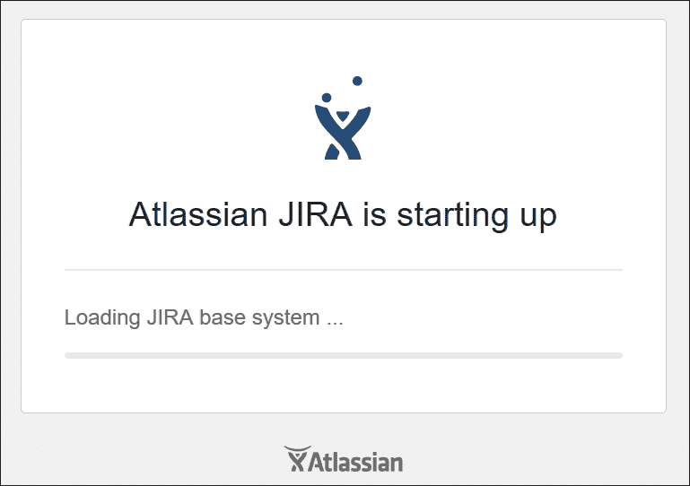

1.  向导将提供两个选项——**为我设置**或**我自己设置**。选择**我自己设置**，然后点击**下一步**按钮。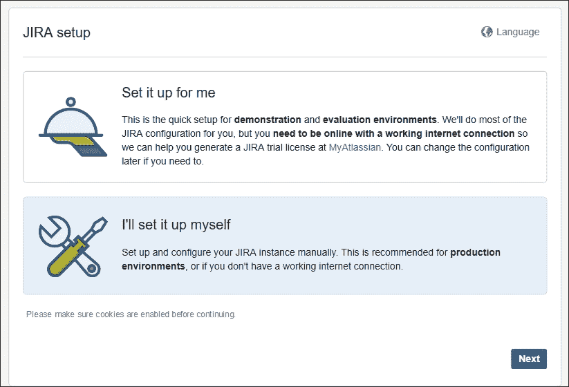

1.  在**数据库设置**屏幕中，选择**数据库连接**为**我自己的数据库**。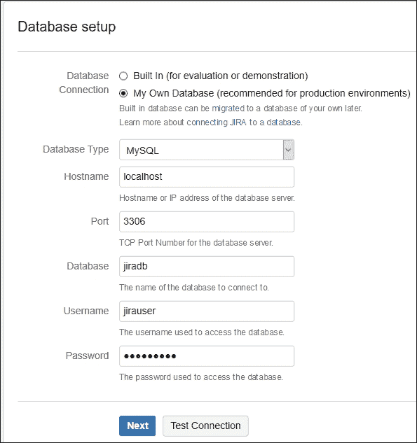

1.  由于我们要使用 MySQL 数据库，请选择**MySQL**作为**数据库类型**。如果您想评估 JIRA，还可以选择**内置（用于评估或演示）**作为**数据库**；JIRA 使用的是**HyperSQL 数据库**（**HSQLDB**），仅用于测试目的。

1.  输入您的 MySQL 服务器**主机名**、**端口**、**数据库**名称、数据库**用户名**和**密码**。您可以点击**测试连接**按钮检查凭证是否正确。点击**下一步**按钮继续。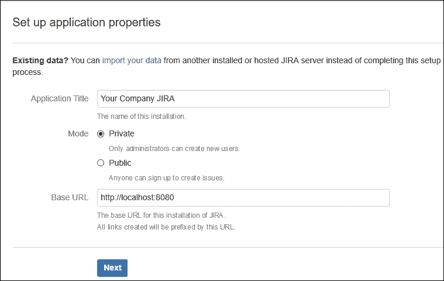

1.  现在，输入此实例的**应用程序标题**。选择**私有**作为**模式**，此时仅管理员可以创建账户。如果希望用户自行注册，请选择**公开**。输入**基础 URL**，用户将使用此 URL 访问该实例。您也可以稍后更改，并使用域名或子域名，例如`jira.company.com`作为**基础 URL**。点击**下一步**按钮继续。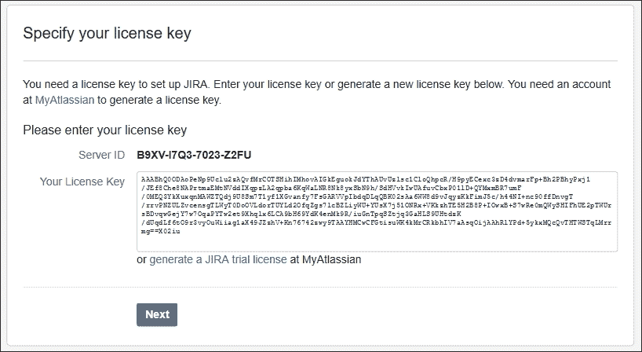

1.  在**指定您的许可证密钥**部分，您需要输入可以从[my.atlassian.com](http://my.atlassian.com)生成的许可证密钥，或者直接点击**生成 JIRA 试用许可证**链接，系统将跳转到 Atlassian 网站，您可以为实例的**服务器 ID**生成**新评估许可证**。生成后，您将返回实例页面，并且许可证密钥已经填入。点击**下一步**按钮继续。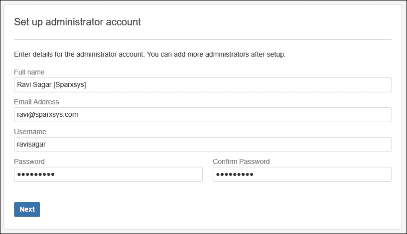

1.  现在我们需要**设置管理员账户**。输入您的**全名**、**电子邮件地址**、**用户名**和**密码**。不要忘记这个凭证，因为该账户将拥有 JIRA 实例的完全管理员访问权限。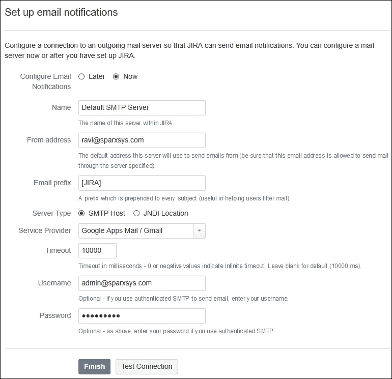

1.  最后，我们有选择**设置电子邮件通知**的选项。如果公司中有 SMTP 服务器，可以使用它。对于本示例，我们使用了**服务提供商**作为**Google Apps Mail / Gmail**。配置非常简单。只需输入您的 Google Apps**用户名**和**密码**。无需更改任何其他设置。您可以点击**测试连接**按钮以验证凭证并与电子邮件服务器通信。

1.  点击**完成**按钮以完成设置向导和 JIRA 安装。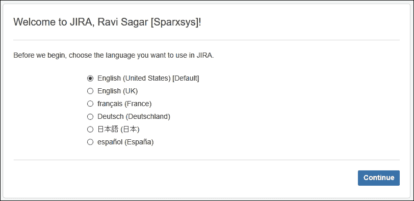

1.  在接下来的屏幕中，向导会询问您选择首选语言。选择语言并点击**继续**按钮。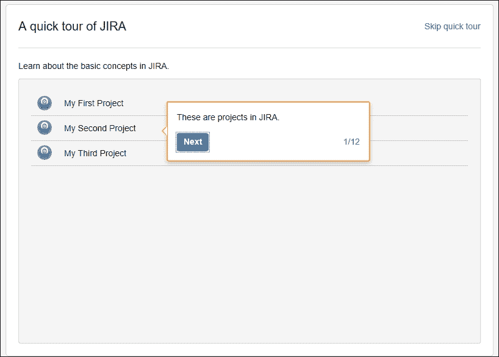

1.  在接下来的屏幕中，你将看到 **JIRA 快速导览**。你可以多次点击 **下一步** 按钮来完成快速导览，或者点击右上角的 **跳过快速导览链接**。JIRA 设置向导

1.  现在，你将自动登录并进入 **系统仪表盘**。

# JIRA 目录结构、启动/关闭脚本和日志文件

JIRA 管理员需要非常了解 JIRA 目录结构，因为你将经常需要备份、修改配置文件和恢复系统。所有这些操作都需要在服务器上进行，并且必须通过相应的目录来完成。

## JIRA 安装目录

JIRA 安装目录是提取 JIRA 应用程序文件和库的目录。JIRA 不会在此处进行更改，也不会保存任何数据。

如果你通过自动化的 Windows 或 Linux 安装程序安装 JIRA，则 JIRA 安装目录存储在以下位置：

+   **Windows**：`C:\Program Files\Atlassian\JIRA`

+   **Linux**：`/opt/atlassian/jira`

启动和关闭脚本位于 JIRA 安装目录下的 `bin` 目录中：

+   **启动脚本**：`bin/start-jira.bat 或 bin/start-jira.sh`

+   **关闭脚本**：`bin/stop-jira.bat 或 bin/stop-jira.sh`

## JIRA 主目录

JIRA 主目录包含 JIRA 正常工作所需的重要文件。*不要修改这些文件*。

如果你通过自动化的 Windows 或 Linux 安装程序安装 JIRA，JIRA 主目录的默认位置存储在以下位置：

+   **Windows**：`C:\Program Files\Atlassian\Application Data\JIRA`

+   **Linux**：`/var/atlassian/application-data/jira/`

## JIRA 主目录下的子目录

以下是 JIRA 主目录下的子目录列表：

+   `data`：JIRA 实例的应用数据存储在这里。附件及其所有版本存储在名为 `attachments import` 的子目录中。如果你想恢复 JIRA，备份文件需要放置在此目录中。

+   `export`：此目录用于存储自动备份文件。

+   `log`：日志文件存储在这里。

+   `cache`：缓存文件存储在这里。

+   `tmp`：在各种运行时操作（如导入、导出和索引）过程中，会生成一些临时文件。所有这些文件都存储在这里。

# 升级规划

你应该预期在升级过程中会遇到问题，因此，遵循以下步骤：

1.  设置暂存环境。这可以是你的生产环境的克隆。确保你的 JIRA 实例的许可证有效。

1.  创建所使用插件的兼容性矩阵。检查这些插件在新版本中是否有可用的升级。还要检查你的附加组件的许可证。

1.  检查发布说明以了解 bug 修复和可能的问题。

1.  首先在暂存环境中执行升级。

1.  首先进行**用户验收测试**（**UAT**），最好是与公司的经理或利益相关者一起进行，用户数应有限。

1.  收集反馈并进行评审。

1.  如有任何问题，请向 Atlassian 提交工单。如果你拥有有效的许可证，他们将提供帮助。

### 提示

在升级之前，请始终备份你的 JIRA 安装目录、JIRA 主目录和数据库。

## 升级你的 JIRA 实例

升级 JIRA 有几种不同的方法。你选择使用的方法取决于你使用的 JIRA 版本以及你使用的环境类型。

### 适用于关键业务应用的回退方法

当 JIRA 用于那些对业务至关重要的公司时，建议使用此方法，因为它允许你安全地回滚到先前的工作版本。按照以下步骤准备生产实例：

1.  准备一个代理服务器。

1.  安装并测试升级后的版本。

### 提示

参考 [`confluence.atlassian.com/display/JIRA/Upgrading+JIRA+with+a+Fallback+Method`](https://confluence.atlassian.com/display/JIRA/Upgrading+JIRA+with+a+Fallback+Method) 获取有关使用回退方法升级 JIRA 的更多信息。

### 使用安装程序的快速方法

如果你可以接受几分钟的停机时间，且停机不会对业务产生影响，那么建议使用这种方法，它相当简单。只需要你在现有安装的应用程序上再次运行安装程序：

1.  记下自定义的变更。

1.  备份你的数据库。

1.  运行 JIRA 安装程序并选择升级选项。

如果你已经修改了一些文件（例如`setenv.bat`）或有自己的 CSS 和 JavaScript 文件或代码，那么你需要在升级后的系统中重新进行这些更改。

### 提示

参考 [`confluence.atlassian.com/display/JIRA/Upgrading+JIRA+Using+a+Rapid+Upgrade+Method`](https://confluence.atlassian.com/display/JIRA/Upgrading+JIRA+Using+a+Rapid+Upgrade+Method) 获取有关使用 RAD 方法升级 JIRA 的更多信息。

### Solaris 手动升级方法

使用快速方法，你可以轻松地升级 JIRA。然而，有些情况下你无法使用安装二进制文件。例如，如果你要在 Solaris 上安装 JIRA，Atlassian 并不提供支持的二进制文件，但你可以使用以下方法，通过 **Web 应用程序归档**（**WAR**）分发文件在 Solaris 上安装 JIRA：

1.  备份你的数据库和 JIRA 安装目录。

1.  安装新版本。

1.  将你新安装的 JIRA 实例指向 JIRA 当前主目录的副本。

1.  配置 JIRA 的新版本以使用一个新的空白数据库。

1.  最后，通过新安装的 JIRA 实例的恢复功能导入你 JIRA 的旧数据。

### 提示

参阅 [`confluence.atlassian.com/display/JIRA/Upgrading+JIRA+Manually`](https://confluence.atlassian.com/display/JIRA/Upgrading+JIRA+Manually) 了解有关手动升级 JIRA 的更多信息。

# 更新 JIRA 插件

JIRA 有很多可以从市场上安装的插件。插件扩展了 JIRA 的功能。许多优秀的插件可以从 Atlassian 及其他提供商处获得。由于 JIRA 的快速发展，这些插件可能是新功能的开发。为了修复 bug，这些提供商不断发布插件版本更新。定期更新这些插件是个不错的主意。但建议你先在测试环境中进行升级测试。

进入 **管理插件** 部分，检查你的插件是否有可用的更新。JIRA 内置的通知系统也会在有插件更新时通知你。然而，理想情况下，这些更新应首先在测试环境中进行，最好是与生产环境相同的预发布服务器上。

只有当插件的新版本在你的测试环境中运行正常时，才可以在生产环境中更新它。你可以尝试使用以下方法之一来更新插件：

+   更新插件到新版本

+   更新所有插件

+   通过上传文件更新插件

+   启用自动插件更新

### 提示

更新插件的详细步骤可以在 [`confluence.atlassian.com/display/UPM/Updating+add-ons`](https://confluence.atlassian.com/display/UPM/Updating+add-ons) 中找到。

我们建议逐个更新插件。一次性更新所有插件可能会出现问题，而且你可能不知道是哪个插件的更新引起了问题。

## JIRA 插件兼容性矩阵

作为一个好的实践，始终跟踪当前安装的所有插件、它们的当前版本、它们与已安装的 JIRA 的兼容性以及任何已知问题。

在计划更新任何插件之前，始终更新兼容性矩阵：

| **插件** | **安装版本** | **收费或免费** | **与 JIRA 6.3.6 兼容？** | **备注** |
| --- | --- | --- | --- | --- |
| JIRA Agile | 6.6.0 | 收费 | 是 |  |
| Clone Plus Plugin | 4.0.0 | 收费 | 是 |  |
| JIRA Suite Utilities | 1.4.9 | 免费 | 是 |  |

在 Atlassian 市场上有很多插件可以选择，但不要无缘无故地安装太多插件。如果你正在寻找 JIRA 中的新功能，且它作为插件提供，始终通过验证下载量来查看有多少人在使用它；还有用户评分，它能让你对该插件有一个大致了解。如果你决定购买插件，那么也要检查插件提供商。

# 应用程序、用途和示例

自定义 JIRA 的能力是它在众多使用它的公司中受欢迎的原因。JIRA 有多种应用场景：

+   缺陷/bug 跟踪

+   变更请求

+   服务台/支持工单

+   项目管理

+   测试用例管理

+   需求管理

+   流程管理

让我们来看看测试用例管理的实现：

+   问题类型：

    +   **测试活动**：这将是标准问题类型

    +   **测试用例**：这将是一个子任务

+   测试活动的工作流：

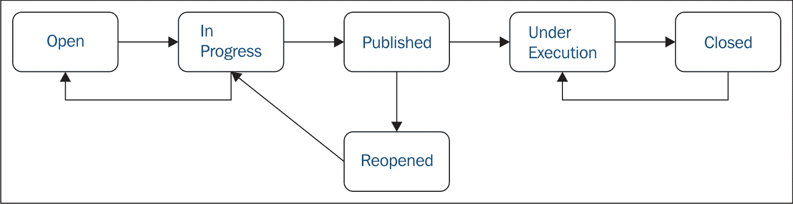

+   新状态：

    +   **已发布**

    +   **执行中**

+   条件：

    +   测试活动只有在所有测试用例通过时才会通过

    +   只有报告者可以将此测试活动移至**关闭**

+   后置操作：

    +   当测试活动关闭时，向特定组中的每个人发送电子邮件

+   测试用例的工作流：

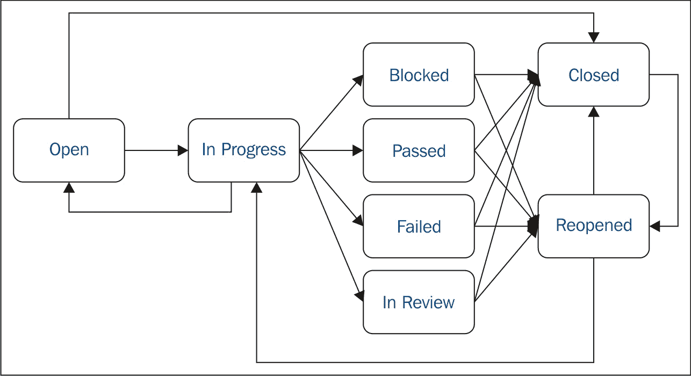

+   新状态：

    +   **被阻塞**

    +   **通过**

    +   **失败**

    +   **审核中**

+   条件：

    +   只有被指派的用户才能将测试用例移至**通过**状态

+   后置操作：

    +   当测试用例被移动到**失败**状态时，将问题优先级更改为“重大”

+   自定义字段：

| **名称** | **类型** | **值** | **字段配置** |
| --- | --- | --- | --- |
| `类别` | 选择列表 |  |  |
| `客户名称` | 选择列表 |  |  |
| `重现步骤` | 文本区域 |  | 必填 |
| `预期输入` | 文本区域 |  | 必填 |
| `预期输出` | 文本区域 |  | 必填 |
| `前置条件` | 文本区域 |  |  |
| `后置条件` | 文本区域 |  |  |
| `活动类型` | 选择列表 | 单元功能耐久性基准测试健壮性安全性向后兼容性与基准线认证 |  |
| `自动化状态` | 选择列表 | 自动化手动部分自动化 |  |

# JIRA 核心概念

让我们来看看 JIRA 的架构；这将帮助你理解核心概念：

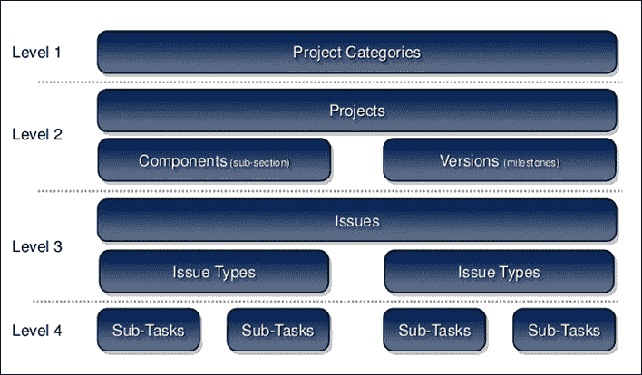

+   **项目类别**：当 JIRA 中的项目过多时，将它们分成不同的类别变得至关重要。JIRA 允许你创建多个类别，这些类别可以代表公司中的业务单元、客户或团队。

+   **项目**：JIRA 项目是问题的集合。你的团队可以使用 JIRA 项目来协调产品开发、跟踪项目、管理帮助台等，具体取决于你的需求。

+   **组件**：组件是项目的子部分，用于将项目中的问题分组为更小的部分。

+   **版本**：版本是项目的一个时间点。它们帮助你安排和组织发布。

+   **问题类型**：JIRA 允许你创建几种不同的问题类型，存储不同类型的信息。JIRA 默认提供了如 bug、任务和子任务等问题类型，但你可以创建更多的问题类型，这些类型可以有自己的工作流和不同的字段集。

+   **子任务**：问题类型分为两种——标准类型和子任务，子任务是标准任务的子项。例如，你可以将“测试活动”作为标准问题类型，将“测试用例”作为子任务。

# 概要

在本章中，我们讨论了在公司实施 JIRA 前需要规划的事项，了解了 JIRA 未来的使用方式，以及它如何帮助 JIRA 管理员选择合适的硬件。我们还详细讨论了 JIRA 的安装及其各种升级方式。最后，我们简要讨论了一些可能的 JIRA 使用场景。

在下一章，我们将了解如何搜索问题。JIRA 配备了强大的搜索机制，帮助用户轻松找到他们所需的信息。JIRA 具有一种查询语言，称为**JIRA 查询语言**（**JQL**），用于高级搜索。我们还将讨论如何将搜索查询保存为过滤器，便于以后再次使用。
