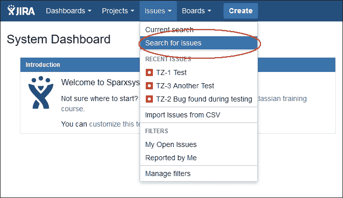
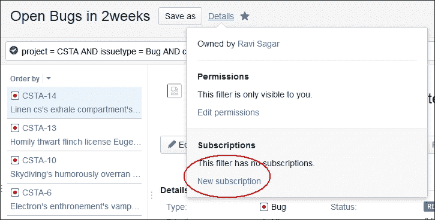

# 第二章 在 JIRA 中搜索

本章详细解释了如何从 JIRA 中获取数据。数据可用于分析、报告和采取适当的行动。**问题导航器**窗口提供了一种非常简便的机制来搜索问题，但也可以使用**JIRA 查询语言**（**JQL**）编写查询来细化搜索结果。你将学习如何将搜索结果保存为筛选器和图表，并将其添加到仪表板中。此筛选器和图表可以与其他用户共享，还可以作为各种小部件的数据源。

我们将覆盖以下主题：

+   **问题导航器**窗口

+   搜索问题

+   筛选器和订阅

+   JQL 简介

+   浏览器快捷键

+   以 Excel、RSS、XML 和 JSON 格式导出问题

# 问题导航器窗口

JIRA 提供了一个强大的功能，让你快速查找问题并采取行动。例如，你可以使用以下 JQL 查询轻松查找名为`cristata`的项目的所有 bug（这些 bug 在过去两周内一直处于打开状态）：

```
project = CSTA AND issuetype = Bug AND created >= -2w 

```

上面的查询是用 JQL（JIRA 中的查询语言）编写的。如果你是 JIRA 的新手，也可以使用**基本**搜索功能来查找问题，无需学习 JQL。此外，学习 JQL 并不困难。

你可以从**基本**搜索切换到**高级**搜索来处理前面的查询。让我们先来看一下**问题导航器**窗口中**基本**搜索提供的功能。

从顶部菜单栏点击**问题** | **搜索问题**，如下图所示：



# 搜索问题

现在你将进入**问题导航器**，默认视图为**详细视图**：


在**详细视图**窗口中，问题的更多信息会显示出来，比如**详情**、**描述**、**受理人**、**报告人**和**工作流**按钮，可以将问题转换为另一个可用状态。你可以快速浏览问题并查看屏幕中央的相关信息。

**列表视图**不会显示太多信息。问题以表格的形式显示。你可以通过右上角的下拉菜单切换到**列表视图**，如下图所示：


默认情况下，**列表视图**中会显示几个问题字段，但你可以随时添加更多列到视图中。

到目前为止，我们尚未为特定项目细化问题。默认的**基本**搜索选项允许你应用多个条件来细化问题。在问题列表的顶部，你会看到一组按钮，能够帮助你应用多个条件。

让我们细化问题，找到**cristata(CSTA)**项目，其问题类型为**Bug**：


我们可以进一步精细化此列表，使其仅包含处于**开放**状态的议题，方法是使用位于议题**类型**旁边的**状态**按钮。

那么，如果我们想进一步筛选，只查看过去两周内开启的议题怎么办呢？可以通过点击**更多**按钮，选择**创建日期**来添加许多其他议题字段的筛选条件。随后，系统会弹出一个小框，要求你输入持续时间，如下图所示：


点击**更新**按钮以应用最后一个条件，之后你将得到结果。

现在，点击最后一个名为**高级**的链接，你将看到此操作生成的 JQL：

```
project = CSTA AND issuetype = Bug AND created >= -2w 

```

**议题导航器**窗口在使用**基本**搜索选项应用各种条件时，总是会生成类似的 JQL。

## 使用文本进行搜索

屏幕顶部有一个文本框，允许你通过简单地输入文本快速搜索议题。然而，它也有一些很棒的功能，可以帮助你瞬间找到特定的议题。你只需输入议题的关键字，系统就会直接带你到该议题。你还可以通过输入`my`来搜索所有分配给你的议题。

### 提示

你可以在[`confluence.atlassian.com/display/JIRA/Using+Quick+Search`](https://confluence.atlassian.com/display/JIRA/Using+Quick+Search)上了解更多有关快速搜索的各种功能。

你可以使用文本搜索来查找单个词汇或短语。例如，要搜索单独的单词`china`，只需在搜索框中输入它。

通配符也支持单个字符和多个字符：

+   单字符通配符搜索：

    描述 - `chin?`

    这将搜索 china、chino 以及它在描述字段中找到的任何其他替代词。

+   多字符通配符搜索：

    描述 - `chi*`

    这将搜索所有以`chi`开头的单词。它可能是 China 或 Chinese。

    ### 提示

    你可以在[`confluence.atlassian.com/display/JIRA/Performing+Text+Searches`](https://confluence.atlassian.com/display/JIRA/Performing+Text+Searches)上了解更多文本搜索的相关信息。

# 过滤器和订阅

我们刚才展示了如何为特定项目搜索过去两周内打开的 Bug。现在，如果我们想要每周两次执行此搜索呢？你可以始终访问**议题导航器**并重新应用条件，或者编写 JQL 查询。不过，JIRA 有一个非常棒的功能，允许你不仅保存搜索结果，还可以通过电子邮件接收结果。

点击屏幕顶部的**另存为**按钮以保存此搜索：


在弹出窗口中，输入**过滤器名称**并点击**提交**按钮以保存查询。在 JIRA 中，这些保存的结果称为过滤器。

保存过滤器后，你可以随时在**问题导航器**的左侧面板中点击过滤器名称。

## 订阅

电子邮件订阅是 JIRA 提供的另一个好功能，它可以将某个特定过滤器中的问题列表通过电子邮件发送给你或一组 JIRA 用户。

点击位于**另存为**按钮旁边的**详细信息**链接。将弹出一个新窗口，点击**新建订阅**：



在下一个屏幕上，你可以选择收件人是**个人订阅**，或者从选择列表中选择 JIRA 组名称。

在**调度**中，你可以选择**每天**、**每周几天**、**每月几天**或**高级**。前三个选项是自解释的；然而，最后一个选项让你可以编写 cron 表达式。

因为我们希望每 15 天或者每月的第 15 天得到这个结果，下面的 cron 表达式将被使用：

```
0 30 9 15 * ? 

```

这里有一些更多的示例：

| **Cron 表达式** | **调度详情** |
| --- | --- |

|

```
0 30 9 15 * ?

```

| 每月 15 日上午 9:30 |
| --- |

|

```
0 30 9 ? * * 

```

| 每天上午 9:30 |
| --- |

|

```
0 30 9 ? * MON-FRI 

```

| 每周一、二、三、四、五的上午 9:30 |
| --- |

### 提示

有关通过电子邮件获取搜索结果的更多详细信息，请参阅[`confluence.atlassian.com/display/JIRA/Receiving+Search+Results+via+Email`](https://confluence.atlassian.com/display/JIRA/Receiving+Search+Results+via+Email)。

## 共享你的过滤器

默认情况下，你创建的过滤器仅对你自己可见；它们是私有的，但也可以允许其他用户访问你创建的过滤器。

从**问题**下拉菜单中，选择**管理过滤器**：


在下一个屏幕上，你将看到所有由你创建或与你共享的过滤器列表。

点击**编辑**以修改过滤器共享选项：


在新窗口中，你将获得选择与**所有人**、**项目**或**组**共享的选项：


如果你想与所有人共享过滤器，选择它，点击**添加**选项，然后点击**保存**。

现在，你的过滤器可以被系统中的其他用户访问。

# JQL 介绍

JQL 是 JIRA 中最好的功能之一，它可以高效地搜索问题，并提供许多实用的功能。JQL 的最佳部分是，它非常容易学习，感谢**高级**搜索中的自动完成功能，能够根据输入的关键词向用户提供建议。

JQL 由单个或多个查询组成，这些查询可以组合成复杂的查询。

## 基本的 JQL 语法

JQL 包含一个字段后跟操作符。例如，要检索所有`CSTA`项目的问题，你可以使用一个简单的查询，如下所示：

```
project = CSTA 

```

现在，在这个项目中，如果你想查找分配给特定用户的问题，可以使用以下查询：

```
project = CSTA and assignee = ravisagar 

```

可能会有多个问题分配给一个用户，或许我们只想关注那些优先级为 `Critical` 或 `Blocker` 的问题：

```
project = CSTA and assignee = ravisagar and priority in (Blocker,  Critical) 

```

如果不是要查找分配给特定用户的任务，而是想查找分配给所有用户（除了一个用户）的问题，怎么办？可以使用以下命令实现：

```
project = CSTA and assignee != ravisagar and priority in (Blocker,  Critical) 

```

所以你可以看到 JQL 由一个或多个查询组成。

## JQL 中运算符的使用

运算符是比较左侧字段与右侧值的符号。以下是 JQL 中支持的所有运算符的列表：

| **运算符** | **关键字** |
| --- | --- |
| 等于 | `=` |
| 不等于 | `!=` |
| 大于 | `>` |
| 大于等于 | `>=` |
| 小于 | `<` |
| 小于等于 | `<=` |
| 在 |  |
| 不在 |  |
| 包含 | `~` |
| 不包含 | `!~` |
| 是 |  |
| 不是 |  |
| 为 |  |
| 在……中 |  |
| 不在……中 |  |
| 不为 |  |
| 已更改 |  |

不是所有运算符都有关键字。例如，如果你想搜索分配给两个不同用户的所有问题，可以使用以下 JQL 查询：

```
assignee in (michael, john) 

```

## 使用函数的高级搜索

有时查询中的值需要是动态的。例如，如果你想写一个查询列出过去 2 天内创建的所有问题，可以使用以下查询：

```
created > startOfDay("-2d") 

```

`startOfDay()` 函数是在运行此查询时计算其值的函数。

我们可以进一步优化此查询，列出过去 2 天内创建的所有分配给当前用户的问题：

```
created > startOfDay("-2d") and assignee = currentUser() 

```

此查询将被保存为过滤器，并且结果将在仪表盘上通过小部件显示。所有团队中的用户都可以使用类似的查询，输出结果会有所不同，因为我们将使用特定的函数，而不是特定的值。

以下表格展示了一些常见的函数：

| **函数** | **解释** |
| --- | --- |
| `currentLogin()` | 该函数返回当前用户会话开始时的时间 |
| `currentUser()` | 该函数基于当前登录用户来显示搜索结果 |
| `endOfDay()` | 该函数返回当前天结束时的时间 |
| `endOfMonth()` | 该函数返回当前月结束时的时间 |
| `endOfWeek()` | 该函数返回当前周结束时的时间 |
| `endOfYear()` | 该函数返回当前年结束时的时间 |
| `lastLogin()` | 该函数返回当前用户上次会话开始时的时间 |
| `membersOf()` | 该函数基于特定组的成员来显示搜索结果 |
| `now()` | 该函数返回当前时间 |
| `startOfDay()` | 该函数返回当前天开始时的时间 |
| `startOfMonth()` | 该函数返回当前月开始时的时间 |
| `startOfWeek()` | 该函数返回当前周开始时的时间 |
| `startOfYear()` | 该函数返回当前年开始时的时间 |

基于时间的函数将根据用户在其个人资料中选择的本地时区来获取问题。

### 提示

要查看所有可用功能的完整列表，请参阅 [`confluence.atlassian.com/display/JIRA/Advanced+Searching+Functions`](https://confluence.atlassian.com/display/JIRA/Advanced+Searching+Functions)。

# 浏览器快捷键

当你开始定期使用 JIRA 时，你将节省执行常见日常任务时所用的时间，例如创建问题、进入**问题导航器**、进行快速搜索等。

当你登录到 JIRA 实例时，仪表板将打开。假设你想快速进入**问题导航器**窗口，按照以下步骤操作：

1.  按下 *G* + *I*：

    这将让你在几秒钟内直接进入**问题导航器**窗口。如果你在**问题导航器**窗口中使用**详细视图**，将显示第一个问题的详细信息。

1.  按下 *J*：

    列表中的下一个问题将显示出来。

1.  按下 *K*：

    现在你已返回到第一个问题。在浏览问题时，你突然记得需要创建一个工单。

1.  按下 *C*：

    这将为你打开**创建问题**界面。

1.  按下 */*：

    这将把鼠标焦点移到顶部的快速搜索框。JIRA 中有很多类似的快捷方式用于各种操作（这些快捷方式需要时间来学习和记住）。从我们这里提到的一些常用快捷方式开始，随着时间的推移，学习更多的快捷方式。

### 提示

要查看完整的键盘快捷键列表，请参阅 [`confluence.atlassian.com/display/JIRA/Using+Keyboard+Shortcuts`](https://confluence.atlassian.com/display/JIRA/Using+Keyboard+Shortcuts)。

# 导出 Excel、RSS、XML 和 JSON 中的问题

不时地，你需要将这些问题从 JIRA 导出，并放入 Excel 表格中，以便根据提取的信息创建复杂的透视图表。JIRA 允许你以几种标准格式（如 RSS、XML 和 Excel）导出这些问题。

在**问题导航器**面板的右上角，有一个名为**导出**的按钮。当你点击这个按钮时，你将看到几个选项：


当你点击**XML**时，当前在**问题导航器**面板中可见的问题将以 XML 格式在浏览器中打开。你可以将此页面保存为 XML 文件。

同样，你可以为**问题**或**评论**生成 RSS 提要。这将给你提供一个 URL，用于访问 RSS 提要，你可以在你喜欢的提要阅读器中使用这个 URL。此提要的 URL 是相同的，每当列表有更新时，RSS 提要将自动更新。

还有导出问题为**Word**、**Excel（所有字段）**或**Excel（当前字段）**的选项。当你想根据从 JIRA 中提取的数据生成自定义报告时，导出为 Excel 是非常有用的。

## 启用 JIRA 中的 JSON 导出

JSON 是一种流行的格式，用于在各种应用程序之间传输数据。它是一种与语言无关的格式，可以被多种编程语言解析和处理。

默认情况下，导出 JIRA 问题为 JSON 格式的功能是禁用的，但请按照以下步骤启用此功能：

1.  转到 JIRA，**管理** | **插件** | **管理插件**，在**ATLASSIAN MARKETPLACE**下将过滤器更改为包含**所有插件**。

1.  在**系统插件**分组下，搜索名为**jira-importers-plugin**的插件，并展开其子模块，如下所示：

1.  当子模块展开时，找到名为**searchrequest-json**和**issue-json**的两个模块，并启用它们：

1.  现在返回到**问题导航器**，您会发现在**导出**下有一个新的选项，名为**JSON**：

将问题导出为 JSON 是一个非常有用的功能，尤其对那些希望构建从 JIRA 中提取数据的工具的开发者们来说。能够以 JSON 格式导出问题对他们来说是非常有益的。

# 批量编辑

JIRA 的另一个强大功能是**问题导航器**中的批量编辑。此功能使您能够同时修改多个问题的属性。您可能会遇到需要执行此操作的情况。例如，某员工离职，另一位员工替代他加入公司。现在，可能有几百个未关闭的问题分配给了这位员工；这些问题应该理想地被重新分配给新用户，以下是相应的步骤：

1.  首先，精炼搜索结果，以便查看分配给旧用户的所有问题：

1.  从右上角点击**工具**按钮，然后在**批量更改：**下选择**所有 26 个问题**。如果搜索结果中有 50 个问题，则此数字将为 50。

1.  勾选您想要修改的问题：

1.  您可以选择一次性选择所有问题，或者选择您想要修改的几个问题。点击**下一步**按钮。

1.  选择操作并选择第一个选项，即**编辑问题**：

1.  选择需要进行的修改：

1.  在此步骤中，您将获得选择要修改的字段的选项。您还将获得选择其新值的选项。由于我们想要更改**受托人**，请使用复选框选择它，并搜索您希望将所有问题分配给的新用户。

    批量编辑功能还允许您修改多个属性。也许您还想更改**到期日期**。只需使用复选框选择另一个属性，然后点击**下一步**按钮。

1.  审核您的更改：

1.  在上面的屏幕中，只需审核您希望执行的更改。例如，在我们的案例中，此屏幕将显示**受理人**的更改。当您确定更改正确时，点击**确认**按钮。

1.  批量编辑完成后，您将被带回**问题导航器**。

    ### 提示

    使用批量编辑功能，可以修改多个问题；然而，可能有些操作，如**编辑**、**移动**或**删除**问题，可能被禁用。原因是执行批量更改的用户可能没有权限在所有选择进行批量更改的问题上执行该操作。

# 总结

在本章中，我们讨论了如何使用**问题导航器**在 JIRA 中搜索问题。我们介绍了**基本**搜索以及使用 JQL 的**高级**搜索。还涵盖了如何创建过滤器并订阅它们。我们还讨论了如何批量修改问题以及如何从**问题导航器**中导出问题。

一旦开始使用 JIRA 跟踪问题，分析数据以检查项目进度也变得非常重要。在下一章中，我们将讨论 JIRA 提供的各种内置报告。这些实时报告帮助经理查看各种项目统计数据并做出正确决策。仪表板和小工具也将简要讨论。
