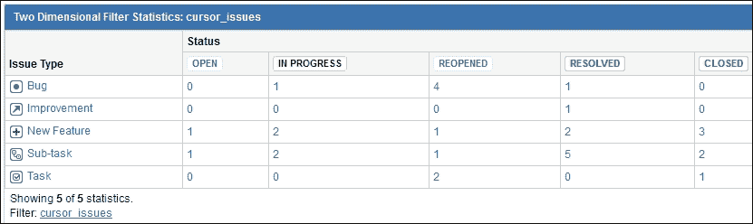

# 第三章：报告——使用图表可视化数据

一旦人们开始使用 JIRA，提取有用的项目信息变得非常重要，这有助于大家分析信息。这些报告帮助管理层在正确的时间做出明智的决策。JIRA 提供了许多内置的项目报告，本章将对此进行解释。仪表板也将在此介绍，帮助你理解如何与其他用户共享项目统计数据。

本章涉及的主题如下：

+   项目报告

+   配置和共享仪表板

+   用于报告目的的小工具

+   使用插件图表可视化数据

# 项目报告

一旦你开始使用 JIRA 跟踪任何类型的问题，提取有用信息变得至关重要。JIRA 附带的内置报告显示项目、用户和其他领域的实时统计信息。在项目运行时，报告将始终显示最新的数据。

让我们来看看这些报告中的每一份。

打开 JIRA 中的任何一个包含大量问题并且大约有 5 到 10 个用户（这些用户是指派人或报告人）的项目。当你打开项目页面时，默认视图是摘要视图，其中包含一个**活动流**，展示项目中的所有动态，比如新问题的创建、状态更新、评论以及基本的任何项目变更。

在项目摘要页面的左侧，在项目导航侧边栏下有一个**报告**链接。所有与项目相关的报告都可以在这里找到。

## 问题

当**摘要**页面打开时，点击**活动**旁边的**切换视图**下拉菜单，选择**统计信息**。在此页面上，你会发现许多现成的过滤器，帮助你查找项目中的问题。你可以通过**状态**、**优先级**、**指派人**、**组件**和**问题类型**来过滤这些问题：


点击这些链接中的任何一个，相关的问题将会在**问题导航器**中打开。

## 报告

在这个页面上，你将看到 JIRA 附带的报告列表。这些报告将始终显示项目的实时数据。还有一些可以安装的报告插件，用于在 JIRA 中添加更多的报告。在本章中，我们将介绍一个这样的插件——Barcharts for JIRA。

第一组报告是**敏捷**报告：


下一组报告是**问题分析**和**预测与管理**：


在**报告**下，主要有三种类型的报告——**敏捷**、**问题分析**和**预测与管理**。我们将在第十一章中讨论**敏捷**报告，*在 JIRA 软件中使用 JIRA 敏捷看板*。这里将讨论后两种报告类型。

### 平均年龄报告

本报告显示在给定日期，问题处于未解决状态的平均天数。

点击**平均年龄报告**，然后在新页面中指定**期间**和**天数之前**：


默认情况下，**天数之前**为`30`，但我们将生成`60`天的报告。然后，点击**下一步**按钮。

#### 报告解读

本报告有两个部分：

+   第一个是柱状图，展示了在选定期间内未解决问题的平均年龄。

+   第二个是下图中的表格，显示了在特定日期未解决问题的实际数量及其在特定时间段内的平均年龄。

阅读此图表非常简单；如果你看到条形图在一段时间内增加，那么这意味着问题未得到解决，需要采取行动：


### 创建与解决的问题报告

本报告显示了在一段时间内创建的问题数量与解决的问题数量：


输入你想要生成此报告的天数，并点击**下一步**按钮。

#### 报告解读

在下图中，你可以看到两条线；一条线显示创建的问题数量，另一条线显示解决的问题数量。这两条线都能很好地指示总体进展。以下数据表显示了在选定期间内某一天创建和解决的问题：


### 饼图报告

此图表展示了数据的分布。例如，在你的项目中，如果你有兴趣了解所有问题类型的数量，则可以使用此报告来获取此信息：


从下拉菜单中选择**问题类型**作为**统计类型**，然后点击**下一步**按钮。

#### 报告解读

以下饼图显示了问题类型的分布，**数据表**显示了此分布的百分比。类似的饼图也可以为其他字段（如**责任人**、**报告人**、**组件**、**状态**等）生成：


### 最近创建的问题报告

本报告显示了最近创建的若干问题的统计信息，包括**期间**和**天数之前**。报告还显示了这些问题的状态：


选择**季度**作为**期间**，输入**天数之前**为`365`，然后点击**下一步**按钮。

#### 报告解读

以下报告显示了过去几个季度中，创建和解决的问题数量。在这个堆叠条形图中，未解决的问题显示在底部，而已解决的问题显示在顶部。通过查看该报告，你可以轻松了解特定季度项目的整体进展。下图中的**数据表**显示了图表上所描绘的实际数字：


### 解决时间报告

有时你会想了解你的团队每个月的速度。你的团队能多快解决问题？此报告显示给定月份中问题的平均解决时间：


选择**按季度**作为**周期**，输入**之前的天数**为`365`，并点击**下一步**按钮。

#### 报告解读

通过查看以下报告，你可以轻松看出在**2014 年 5 月**，团队花了很多时间来解决问题。关注这些信息对管理者至关重要，因为它有助于识别团队面临的挑战，并可以采取适当的措施加以改善：


### 单级分组报告

这是一个简单的报告，仅列出按特定字段（如**负责人**、**问题类型**、**解决方案**、**状态**、**优先级**等）分组的问题。

本报告要求你首先创建一个筛选器。所以，让我们使用以下 JQL 创建一个简单的筛选器：

```
project = cursor 

```

将此筛选器保存为`cursor_issues`。在第二章，*在 JIRA 中搜索*，我们讨论了如何创建筛选器。

我们需要为其生成报告的项目名称是`cursor`。

现在，当你点击报告链接时，你会被提示首先选择筛选器，然后选择**统计类型**，即应用`group by`的字段：


选择`cursor_issues`作为**筛选器**，选择**负责人**作为**统计类型**，然后点击**下一步**按钮。

#### 报告解读

以下报告显示了特定筛选器的所有问题，但按**负责人**姓名分组：


### 问题创建时间报告

这个报告有助于找出过去一年中，特定季度内创建了多少问题。此外，这个报告支持多种基于日期的字段；让我们基于解决日期生成报告：


选择**已解决**作为**日期字段**（你也可以选择其他基于日期的字段），选择**按季度**作为**周期**，并在**之前的天数**中输入`365`。这将生成过去一年的报告。让**累计总数?**选择**是**。点击**下一步**按钮。

#### 报告解读

以下报告显示的信息与前一部分*解决时间报告*类似，但此报告也可以为问题中的其他日期字段生成，例如**创建时间**、**到期时间**、**最后查看时间**、**已解决时间**和**更新时间**：


### 时间跟踪报告

这个综合报告显示了所有问题的预计工作量和剩余工作量。报告还将给出项目总体进展的指示：


如果您只想为特定版本生成报告，请选择**修复版本**，并为**问题**选择**仅包含未完成的**。点击**下一步**按钮。

#### 报告解读

在**问题**中，有**时间估算**、**剩余时间**和**工作日志**等字段。当用户开始处理一个问题时，他们可以更新工作日志，记录他们至今完成的工作量。在您的项目中，如果大多数问题都已填写**时间估算**，那么了解这些问题的状态就变得非常重要。这是一个详细的报告，将显示所有问题的预计时间、剩余时间和总时间。这是一个用于时间跟踪和成本核算的有用报告：


报告的最后也会显示**总计**：


### 用户工作负载报告

这个报告可以告诉我们所有项目中各种资源的占用情况。它在分配任务给用户时非常有帮助：


选择您希望生成此报告的**用户**，为**子任务包含**选择**仅包括分配给所选用户的子任务**，这样在计算工作负载时，不会考虑分配给父任务下其他用户的子任务，点击**下一步**按钮：


#### 报告解读

通常，在任何公司中，用户会同时处理多个项目。在 JIRA 中，可能会有多个项目，用户可能被分配到多个项目中的问题，而这些项目可能由其他项目经理管理。您可以将任务分配给任何用户，并期望任务在给定日期之前解决，但该用户可能会被过度分配。这个报告可以告诉您某个特定用户在所有项目中的工作负载。

### 版本工作负载报告

如果您的项目有多个版本与实际发布或修复相关，那么了解所有这些问题的状态就变得非常重要：


选择您希望生成报告的**版本**，然后点击**下一步**按钮。

#### 报告解读

该报告将为特定版本提供总结，您可以看到分配给该版本的所有用户以及每个问题的分类类型和时间估算。您还可以找到诸如修复发布剩余时间以及负责人是谁等信息：


# 配置和共享仪表板

当您登录到您的 JIRA 实例时，您将看到 JIRA 的**系统仪表板**，该仪表板显示了许多相关信息。这个仪表板有一些框，称为小工具，其中包含信息；有许多不同的小工具可以显示分配给您的问题：**活动流**、**创建与解决图表**、**饼图**等。

除了默认的系统仪表板外，还可以创建更多的仪表板，这些仪表板可以定制并与其他用户共享。例如，您可以为您的项目创建一个仪表板，并与其他用户共享，其他用户也可以访问它。

在**系统仪表板**上，点击右上角的**工具**选项，选择**创建仪表板**：


输入仪表板名称、**描述**，并选择您想要共享的对象：


在我们的例子中，我们想与所有人共享，但也可以与 JIRA 小组共享。现在点击**添加**按钮。

### 提示

**系统仪表板**只能由 JIRA 管理员修改；然而，用户创建的仪表板只能由各自的拥有者修改。

现在，您将看到一个空白仪表板，布局为两列。您可以在这两列中添加您选择的小工具：


也可以更改此仪表板的布局。点击右上角的**编辑布局**选项：


在叠加界面中，我们可以选择不同的布局。例如，我们可以选择三列布局，并点击**关闭**按钮。

# 用于报告目的的小工具

JIRA 带有许多有用的小工具，您可以将它们添加到仪表板中，用于报告目的。通过安装插件，您还可以在 JIRA 中添加更多的小工具。让我们来看一下这些小工具。

## 活动流

这个小工具会显示您 JIRA 实例中的所有最新更新。也可以将此流限制为特定的过滤器。这个小工具非常有用，因为它在仪表板上显示了最新的信息：


## 创建与解决图表

项目**概览**页面有一个图表，显示过去 30 天内创建和解决的所有问题。还有一个类似的小工具可以显示这些信息。

您还可以将持续时间从 30 天更改为您喜欢的任何时间。这种小工具可以为特定项目创建：


## 饼图

就像项目报告中的 **饼图** 一样，在仪表板中也有一个类似的小工具。例如，对于特定项目，可以基于 **优先级** 生成一个 **饼图**：


## 问题统计

这个小工具在生成各种字段的简单统计数据方面非常有用。在这里，我们感兴趣的是根据 **问题统计** 查看项目的分布情况：


## 二维过滤器统计

**问题统计** 小工具可以显示每个 **状态** 的项目问题分布情况。如果想进一步细分这些信息怎么办？例如，有多少问题是开放的，属于哪种 **问题类型**？在这种情况下，可以使用 **二维过滤器统计**。

您只需选择两个字段来生成此报告，一个用于 *x* 轴，另一个用于 *y* 轴：



这些是可以用于仪表板的常见小工具；但实际上还有许多其他小工具。点击右上角的 **添加小工具** 选项，查看您的 JIRA 实例中的所有这类小工具。某些小工具是 JIRA 默认提供的，而其他一些是可安装的插件。

一旦您在仪表板中选择了所有这些小工具，它看起来就像这样：


这是我们刚刚为特定项目创建并配置的新仪表板，但也可以创建多个仪表板。只需点击右上角 **工具** 下的 **创建仪表板** 选项即可添加另一个仪表板。

如果您有多个仪表板，可以使用屏幕左上角的链接在它们之间切换，如下截图所示：


# 使用插件图表来可视化数据

除了 JIRA 默认提供的标准图表和小工具外，还可以安装一些免费插件来获得更多有用的图表。让我们来看看这些免费插件及其提供的额外功能。

## JIRA 的条形图

只需安装此插件，即可在实例中添加一个 **条形图** 小工具。此插件提供的条形图比标准图表还多一些功能。

我们将生成一个类似于本章前面生成的报告。我们希望生成一个关于 **问题类型** 和 **状态** 的二维报告：


正如你所见，这是一个堆叠条形图。此外，紧随图表后面的详细表格显示了实际数字。

## 使用 eazyBI 创建高级报告

JIRA 内置的默认报告相当好且有用。这些小工具可以配置以显示基于与特定项目或过滤器相关的不同字段的各种统计信息。尽管它们很有用，但这些报告和小工具有时不能提供精确的综合信息。用户也可以直接查询 JIRA 数据库以获取数据，并查找通过用户界面无法获得的报告，但并非每个人都能轻松做到这一点，因为这需要对 JIRA 数据库有很好的了解。在第十三章，*数据库访问*中，我们将查看一些查询，您可以用来直接从数据库中获取数据。然而，如果你在寻找一种更好的方法来生成高级报告，那么**eazyBI**是最适合报告目的的 JIRA 插件之一。

在本节中，我们将快速介绍此插件以及如何使用它生成全面的报告：

1.  转到 JIRA 的**管理** | **插件** | **查找新插件**，在**ATLASSIAN MARKETPLACE**下的搜索框中搜索`eazyBI`。

1.  **eazyBI Reports and Charts for JIRA**将会出现。点击**免费试用**以安装此插件。在接下来的弹出窗口中，点击**接受**按钮。

1.  最后，系统会要求你输入 Atlassian 账户，以便生成 eazyBI 的试用许可证。安装完成后，导航菜单中将添加一个新链接，**eazyBI**。点击此链接进入 eazyBI 界面。

1.  点击**设置 eazyBI**按钮以配置此插件。eazyBI 插件将使用单独的数据库来存储其数据；在继续操作之前，请创建一个空数据库供该插件使用：

1.  在**eazyBI 设置**界面中，选择**数据库类型**、**主机**、**端口**、**数据库**、**用户名**和**密码**。点击**更新设置**按钮继续：

1.  在**添加新源应用程序**界面中，选择**JIRA**作为**源应用程序**，并输入`Issues`作为**Cube 名称**。点击**创建**按钮继续：

1.  在**选择应用程序导入选项**界面中，选择你想要导入到 eazyBI 数据库中的 JIRA 项目。保持其余配置不变，并点击**导入**按钮。eazyBI 将定期从 JIRA 导入问题到其自己的数据库：

1.  一个新源将被添加到**源应用程序**下。你还可以查看**状态**栏，显示上次导入的时间。导入将按照计划进行，通常是每天一次，但你也可以点击**导入**按钮以从 JIRA 拉取数据：

1.  在 **eazyBI** 菜单顶部点击 **分析** 链接，您将找到三个示例报告。点击 **Sample created vs resolved issues**：

1.  顶部的 **Dimensions** 区域包含所有可用的字段；**Pages** 区域包含作为当前报告筛选器的字段。**Rows** 和 **Columns** 区域包含基于其生成报告的两个字段。您可以从 **Dimensions** 拖动更多字段到这三个区域中的任意一个。下面的示例报告基于 **Line**，但您可以选择 **Bar**、**Pie** 和其他几种类型的图表。eazyBI 最好的地方在于这些报告是钻取报告，换句话说，您可以点击报告的特定部分并单独分析该部分。您可以基于任意选择的字段添加更多报告。

1.  要查看报告，请转到 **eazyBI** 菜单中的 **仪表板** 并添加一个新的仪表板。点击 **添加报告** 按钮以添加已配置的报告。在 **添加报告** 弹出窗口中，点击您选择的报告并按 **关闭** 按钮。如果需要，可再次执行此操作以添加更多报告：

1.  一旦您添加了所需的报告，给您的仪表板命名并点击 **保存更改** 按钮：

1.  在保存仪表板后，您将能够查看报告。同时注意我们在配置报告时添加的 **Pages** 区域的筛选器。您可以使用这些筛选器来细化报告。它使最终用户能够按照他们的意愿处理报告：

eazyBI 插件是默认 JIRA 报告的一个很好的补充。它还有许多其他功能，比如可以将报告导出为 CSV、Excel、PNG 和 PDF 格式。不仅如此，您还可以返回到 JIRA 仪表板，并在其中添加 eazyBI 仪表板和报告。它为您的用户提供了强大的报告功能，直接在 JIRA 界面内使用。

### 提示

您可以在 [`docs.eazybi.com/display/EAZYBIJIRA/eazyBI+Add-on+for+JIRA+Documentation`](https://docs.eazybi.com/display/EAZYBIJIRA/eazyBI+Add-on+for+JIRA+Documentation) 学习 eazyBI 插件的所有功能。

# 总结

在本章中，我们介绍了您可以生成以查找有用信息的所有项目报告。您还学习了如何创建仪表板并向其中添加各种小部件。我们还理解了如何使用 eazyBI 创建高级报告，eazyBI 是一个流行的用于生成 JIRA 中默认不可用报告的插件。

在下一章，我们将开始定制 JIRA 实例，使其像一个测试管理工具一样工作。通过实例，你将学习如何定制问题类型方案以包括新的问题类型，修改工作流，创建新的自定义字段以捕捉额外的信息，以及如何限制项目的可见性。
