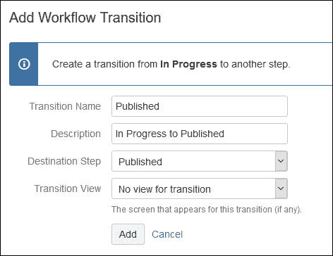
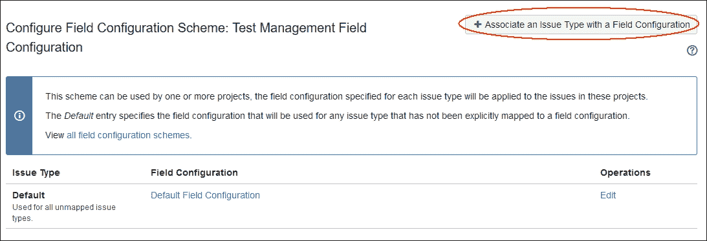

# 第四章。为测试管理自定义 JIRA

在本章中，我们将为测试管理配置和自定义 JIRA，这一点我们在第一章中也简要讨论过，*规划 JIRA 安装*，但在这里我们将详细讨论。JIRA 最棒的地方在于它的自定义功能。默认情况下，JIRA 可以用于错误跟踪、基于敏捷的项目管理或简单的问题跟踪，但每个组织都有自己的流程和不同的软件模型。在本章中，我们将讨论一个特定的测试管理用例，涵盖 JIRA 自定义的各个方面。我们将从收集所有需求开始。然后，我们将在 JIRA 实例中实施这些自定义功能。你将学习如何创建新的问题类型来存储测试活动和测试用例。工作流自定义也会详细讨论。我们还将修改权限方案以限制项目的可见性。学习这些自定义功能将帮助你理解 JIRA 的能力，这些能力可以应用于各种用例。

涵盖的主题如下：

+   什么是测试管理？

+   为测试活动和测试用例创建问题类型

+   自定义状态转换中的工作流

+   捕获用户在状态转换中的额外数据

+   学习如何仅为测试活动使某些字段成为必填项

+   限制项目的可见性，仅对特定小组和个人可见

+   学习如何在项目中隐藏特定问题

+   版本和组件

# 什么是测试管理？

测试管理是通过执行测试来验证需求的软件过程。它可以是自动化测试，也可以是手动测试，具体取决于测试用例中的定义。测试活动是测试用例的集合。可以创建测试活动来收集项目中特定模块的所有测试用例。使用 JIRA，可以执行手动测试；为了存储测试活动，我们将创建一个新的标准问题类型。另一方面，我们将创建一个新的子任务问题类型来存储测试用例。

# 为测试活动和测试用例创建问题类型

默认情况下，JIRA 软件自带一些标准的**问题类型**，分别是**Bug**、**Epic**、**Story**和**Task**，以及一个名为**Sub-task**的子任务。我们需要创建两种问题类型：

+   **需求**：问题类型

+   **测试活动**：这将是标准问题类型

+   **测试用例**：这将是子任务

让我们看看如何创建这些问题类型：

1.  前往**管理** | **问题** | **问题类型**，然后点击右上角的**添加问题类型**按钮：

1.  在下一个页面上，输入**名称**为`测试活动`，输入**描述**为`此问题类型将用作单个测试用例的集合。`，这是一个好的实践，并选择**标准问题类型**作为**类型**：

1.  执行相同的操作来创建一个测试用例子任务。唯一的例外是选择**子任务问题类型**作为**类型**。

## 创建新的问题类型方案

问题类型方案定义了哪些问题类型将适用于特定项目。JIRA 默认提供**默认问题类型方案**。默认情况下，所有新创建的问题类型将添加到此方案中；我们刚创建的两个新问题类型也将被添加到此方案，使它们对所有使用该方案的项目可用。然而，作为一个好的实践，你应该始终创建一个新的问题类型方案，只包含那些相关和必要的问题。这些方案可以在所有其他具有类似需求的项目中重复使用。

让我们创建一个包含以下问题类型的新问题类型方案：

+   错误

+   任务

+   测试活动

+   测试用例

要创建一个新的问题类型方案，请执行以下步骤：

1.  转到**管理** | **问题** | **问题类型方案**，并点击右上角的**添加问题类型方案**按钮：

    在**添加问题类型方案**页面上，执行以下步骤以创建一个新的问题类型方案：

1.  输入**方案名称**为`测试管理问题类型方案`。

1.  添加一个有用的**描述**。

1.  将所需的问题类型从右侧的**可用问题类型**栏拖动到左侧的**当前方案的问题类型**栏。

1.  选择**测试活动**作为**默认问题类型**。

1.  它应该看起来像下面的截图。点击**保存**按钮以完成：

新的**问题类型方案**将被创建并显示在列表中。正如你在下一个截图中看到的，目前没有项目使用此方案。因此，在**项目**列下，显示没有任何项目使用我们的新方案。我们将创建一个新项目并应用此方案：

目前，我们需要创建一个新项目以应用我们的自定义设置：

转到**管理** | **项目**，在**项目列表**部分，点击右上角的**添加项目**按钮：

在**创建项目**弹窗中，在**软件**下选择**基础软件开发**并点击**下一步**按钮：

下一弹出窗口将确认你的选择，并显示你将在此项目中获得的**问题类型**和**工作流程**。只需点击**选择**按钮继续。

输入我们项目的**名称**为`Project For Test Management`，项目**Key**为`PFTM`。点击**提交**按钮：

一旦项目创建完成，进入项目侧边栏，然后选择**项目管理** | **问题类型**。你会注意到，默认情况下，**PFTM: Scrum 问题类型方案**已应用于该项目。这是一个仅为该项目创建的新方案。我们将修改它并应用我们之前创建的自定义问题类型方案。在右上角，点击**操作**菜单，选择**使用不同的方案**：

在下一个界面，你将看到所有可用的**问题类型方案**列表；只需选择**测试管理问题类型方案**，然后点击**确定**按钮：

现在，项目方案已经更改，且已拥有我们需要的新的问题类型。你可以通过在此新项目下创建一个新问题，并查看所有可用的我们需要的**问题类型**列表来验证这一点。

# 自定义工作流程以更改状态转换

在任何问题跟踪系统中，问题将被创建，接着进入进行中状态，最后关闭。这是一个简单工作流程的场景，包含三个状态：打开、进行中和关闭，这只适用于理想情况，但在现实情况下，工作流程，即问题从一个状态到另一个状态的流转，可能相当复杂。例如，有时你可能需要等待客户提供信息才能继续处理问题；也可能出现某人需要在关闭前审查你的任务。为了应对这种情况，我们需要能够修改这些工作流程。

每个公司都有自己的流程和软件模型。在 JIRA 中，工作流程可以非常容易地进行自定义。这是 JIRA 最强大的功能之一。我们可以轻松创建新的状态和条件。在本节中，我们将自定义测试活动和测试用例的工作流程。

## 测试活动的工作流程

测试活动是一个测试用例的集合。我们已经创建了其问题类型。用户将通过创建一个新的测试活动问题类型开始，然后所有作为其子任务的测试用例将被创建。

测试活动可以分配给一个特定的团队负责人，负责人可以进一步在团队成员之间分配测试用例。下图展示了测试活动的典型工作流程：

测试计划将移至**进行中**状态，同时所有的测试用例都将作为子任务被准备和创建。一旦测试用例集合被添加并最终确定，测试计划将被**已发布**。**执行中**状态表示其下的测试用例正在被执行。

现在，我们需要创建一些额外的状态。系统中尚未存在这些状态。此外，我们希望添加一个约束条件，即测试计划只能在所有下属的测试用例都关闭时才能关闭，并且只有报告者可以关闭测试计划，这是 JIRA 术语中的条件。

### 新状态

以下是新的状态：

+   **已发布**

+   **执行中**

进入**管理** | **问题** | **状态**（在**问题属性**下），然后点击右上角的**添加状态**按钮：

输入状态`已发布`的**名称**和**描述**，然后点击**添加**按钮创建新状态，并重复相同的步骤创建`执行中`状态。

现在，我们需要创建一个工作流，并将其与测试计划关联。一个好的实践是先复制默认的 JIRA 工作流**jira**，然后进行修改。

进入**管理** | **问题** | **工作流**（在**工作流**下），然后使用**操作**下的**复制**链接复制默认的 JIRA 工作流**jira（只读系统工作流）**：

在**复制工作流：jira**弹出窗口中，输入**工作流名称**为`测试计划工作流`，并添加**描述**：

一旦工作流被复制，你将在左上角找到两个视图标签：一个是**图示**（默认标签），另一个是**文本**。当启用**图示**标签时，它会显示工作流的图形表示。然而，在**文本**标签中工作更为方便。

#### 删除不需要的转换

你会注意到我们从默认的**jira**工作流复制过来的工作流中，存在一些不需要的转换，例如**从已打开到已解决**、**从已打开到已关闭**等等。首先，我们需要删除这些转换。在**文本**模式下，点击**操作**下的**删除转换**链接：

在下一屏幕上，选择**解决问题**和**关闭问题**转换，因为我们不希望它们与**已打开**状态相关联：

点击**删除**按钮删除选中的转换。对所有类似的无用转换执行相同的操作。此外，删除工作流中完全不需要的状态，如**已解决**状态。一旦没有附加的转换，你将看到一个删除步骤的链接，该链接与某个状态关联。

#### 添加新步骤

删除所有不需要的转换后，在**文本**模式的底部表单中添加新的状态。通过将这些状态与**步骤名称**关联来将它们添加到工作流中，步骤名称与状态名称相似：

点击**添加**按钮来添加此状态，并对`Published`状态执行相同的操作：

您现在应该拥有所有所需的状态。

#### 添加缺失的转换

让我们添加以下缺失的转换：

+   进行中到已发布

+   已发布到重新打开

+   已发布到正在执行

+   正在执行到已关闭

+   已关闭到正在执行

在**操作**下，点击特定步骤的**添加转换**链接：

输入**转换名称**为 `Published`，输入一些有意义的**描述**，并选择**Published**作为**目标步骤**。在执行此转换时，也可以提示用户在屏幕上填写一些数据。今后我们将不再这样做。点击**添加**按钮继续。对所有需要创建的其他转换重复相同的操作。

转换名称也可以作为动词添加。例如，`Under Execution` 转换可以作为 `Start Execution` 添加。此名称会出现在问题视图屏幕上。

最终，您的工作流将类似于以下截图：

+   **文本**模式的工作流：

+   **图示**模式的工作流：

现在我们的工作流已经成型。我们拥有了所有想要的状态和转换。接下来，我们为某些转换添加一些条件。

#### 条件

以下是测试活动的不同条件：

+   测试活动只有在所有测试用例都关闭时才会关闭

+   只有报告者才能将此测试活动移动到已关闭状态

第一个条件将不允许用户关闭问题，直到所有相关的测试用例都处于已关闭状态。我们希望在尝试从**正在执行**到**已关闭**的转换时添加此条件：

1.  返回**文本**模式，点击**转换 (id)** 列下的**Closed**链接。查看以下截图作为参考：

1.  在下一个屏幕上，您将获得一些关于从**Under Execution**到**Closed**状态的高级选项。在**条件**标签下，点击**添加条件**按钮：

1.  在下一个截图中，您将看到可以添加到此转换的条件列表。选择**子任务阻塞条件**并点击**添加**按钮：

1.  在下一个屏幕上，选择此条件将适用的状态。在我们的案例中，我们希望测试用例处于“已关闭”状态，因此我们将从可用状态列表中选择**已关闭**，并点击**添加**按钮：

1.  同样地，为**从执行中到已关闭**的过渡添加一个名为`仅报告者条件`的条件。

1.  最后，我们将有两个条件被添加到此过渡中，如下图所示：

#### 后置功能

以下是后置功能的使用。

当工作流过渡发生后，可以执行某些操作。例如，当测试活动被关闭时，我们会向某个特定组中的所有人发送电子邮件。

我们还希望向所有属于特定组的用户发送电子邮件，通知他们测试活动已关闭。工作流可以配置为在从**执行中**到**已关闭**的状态过渡时触发事件。该事件可以进一步配置为向某个组发送电子邮件。我们将在本章后面学习如何配置。

### 创建新工作流方案

此时，让我们将工作流与项目关联。为此，我们需要创建一个工作流方案，它是一个包含一个或多个工作流的集合，这些工作流与项目问题类型映射；为了将工作流附加到项目中，需要一个工作流方案：

1.  转到**管理** | **问题** | **工作流方案**（在**工作流**下），然后点击右上角的**添加工作流方案**按钮。在**添加工作流方案**界面中，输入方案的**名称**为`测试管理工作流方案`，并填写一些有用的**描述**：

1.  一旦方案创建完成，默认的**JIRA 工作流**将被分配给所有**问题类型**；然而，在我们的案例中，我们希望将刚才创建的工作流分配给测试活动问题类型：

1.  点击左上角的**添加工作流**菜单，并选择**添加现有**。

1.  在前面的屏幕截图中，选择名为**测试活动工作流**的工作流，然后点击**下一步**按钮。

1.  在前面的屏幕截图中，选择**测试活动**作为**问题类型**，然后点击**完成**按钮。这将把工作流分配给所选的**问题类型**。如下图所示：

    现在，如果你返回到我们的工作流方案，你会注意到**测试活动**问题类型正在使用我们自定义的工作流，名为**测试活动工作流**。

1.  返回到**项目管理** | **工作流**，然后点击左上角**添加工作流**按钮旁边的**切换方案**按钮。在下一个屏幕上，选择**测试管理工作流方案**并点击**关联**按钮。

工作流方案现在已与项目关联，工作流现在是活动的。请注意，活动的工作流无法修改；JIRA 会为你创建一个草稿版本，修改后的工作流可以再次发布。

### 在 JIRA 中添加自定义事件

转到**管理** | **系统** | **事件**（在**高级**下），并向下滚动到页面底部，那里有一个**添加新事件**表单：

输入事件的**名称**，然后输入一些有用的**描述**，并选择**问题已关闭**作为**模板**，因为该电子邮件的模板将与问题关闭时发送的模板类似。点击**添加**按钮继续。创建事件本身不会做任何有用的事情，直到我们从工作流中触发它并在通知方案中自定义它：

1.  首先，我们需要从工作流中触发事件。让我们返回到**测试活动工作流**，编辑它，并点击**转换（id）**列下的**已关闭**链接。现在，转到**后置功能**标签页；这里的最后一项是**通用事件**。点击右下角的铅笔图标进行编辑，如下图所示：

1.  在下一个屏幕上，我们需要将事件从**通用事件**更改为**发送电子邮件给测试人员**。然后，点击**更新**按钮：

1.  现在事件将在状态转换时触发，但还有一件事需要执行才能发送电子邮件。项目的通知方案需要进行自定义，以配置当工作流触发此事件时，电子邮件将发送给谁。

### 自定义通知方案

要发送电子邮件，JIRA 依赖于通知方案，这些方案定义了谁将在何时接收电子邮件。如前所述，JIRA 提供了默认方案，通常复制并自定义自己的副本是一个好习惯。在这个示例中，我们也会复制**默认通知方案**：

1.  转到**管理** | **问题** | **通知方案**。在**操作**下，点击**复制**链接。它会立即复制方案，并命名为**默认通知方案的副本**。点击此方案下的**编辑**链接，并将其重命名为`测试管理通知方案`：

1.  现在，我们需要自定义该方案以向特定组的所有用户发送电子邮件。对于此示例，您可以创建一个名为`jira-testers`的组，并向其中添加几个用户。有关管理用户和组的更多信息，请参阅第七章，*用户管理、组和项目角色*。创建组后，点击**操作**下的**通知**链接，进入**测试管理通知方案**。

1.  在下一个屏幕上，您将看到所有事件的列表，以及相关的用户、组或项目角色，这些人员将收到这些电子邮件：

1.  您还将看到我们创建的**邮件通知给测试人员**自定义事件，但这只是该方案中列出的事件；我们需要修改方案，添加**jira-testers**组，以便在该事件由工作流触发时接收通知。点击**添加**按钮：

1.  选择**组**，从下拉菜单中选择**jira-testers**。点击**添加**按钮：

    我们的方案现在已经配置完成。

1.  现在，转到**项目管理** | **通知**，点击右上角的**操作**菜单，选择**使用不同的方案**。在下一个屏幕上，选择我们的新方案**测试管理通知方案**并点击**关联**按钮。

项目现在将使用下一个方案，因为自定义的工作流已经分配给该项目。所以，当测试活动从执行中状态转移到关闭状态时，电子邮件通知应该能正常工作。

## 测试用例的工作流

测试用例包含输入信息、预期输出、行动步骤以及环境的详细信息，用于验证是否按照原计划满足需求并确认其是否正常工作。我们将为手动测试配置 JIRA，将所有这些信息存储为问题类型。

我们已经为测试活动配置了 JIRA；在本节中，我们不会重复实现过程，它与我们刚刚讨论的内容完全相同。相反，我们将列出工作流、条件和后期功能的详细信息：

测试用例将作为特定测试活动的子任务。一旦创建，它将在测试人员开始执行测试时首先进入**进行中**状态。根据这些测试结果，它可以被移动到以下之一状态：

+   **已阻塞**：如果该测试用例对于其他功能的正常工作至关重要

+   **已通过**：如果它正常工作

+   **已失败**：如果它无法正常工作

+   **审核中**：如果需要进一步调查

最后，测试用例可以是**关闭**或**重新打开**。一个特定的测试活动可能包含数百个测试用例，其总体验证测试的百分比可以根据已关闭的测试用例数量来计算。

创建一个新的工作流，命名为**测试用例工作流**，将其添加到**测试管理工作流方案**中，并将其分配给**测试用例**作为**问题类型**。

### 新状态

我们已经确定了几个需要创建的新状态：

+   被阻止

+   通过

+   失败

+   审查中

创建这些状态的过程类似于我们之前讨论的测试活动。

### 条件

我们希望施加约束，只有被分配的用户才能将测试用例移至**通过**状态：

+   只有被分配的人员才能将测试用例移至**通过**状态

该工作流条件的名称为**仅限被分配人条件**。

### 后置功能

当测试用例失败时，了解功能出现问题的原因可能变得很重要。为突出这个问题，我们可以自动将问题的**优先级**更改为**最高**：

+   当测试用例被移至**失败**状态时，将问题的**优先级**更改为**最高**。

有一个名为**更新问题字段**的后置功能来实现这一点；修改**测试用例工作流**并添加一个后置功能：

点击**添加**按钮。在下一个屏幕中，选择**优先级**作为**问题字段**，并将**最高**设置为**字段值**：

点击**添加**按钮以添加此后置功能。其余流程保持不变。您还可以修改活动工作流并在进行更改后将其发布回去。

# 在状态转换中捕获来自用户的附加数据

在测试活动转换的工作流中，当我们将问题从进行中状态移动到已发布状态时，我们希望用户提供一些关于测试活动类型的附加信息，这可能是一个选择列表：

1.  转到**管理** | **问题** | **自定义字段**（在**字段**下）并点击右上角的**添加自定义字段**按钮：

1.  在**选择字段类型**屏幕上，选择字段类型为**选择列表（单选）**，然后点击**下一步**按钮：

1.  在下一个屏幕上，输入自定义字段的**名称**为`Campaign Type`，输入**描述**，并添加将在选择列表中显示的**选项**：

1.  点击**创建**按钮。

1.  在下图中，系统会提示你将该字段添加到现有的屏幕中，但不要选择任何字段。我们稍后再添加字段。如果你想在默认屏幕中添加新字段，可以通过选择默认屏幕的复选框来完成。点击**更新**按钮以完成操作。现在我们的字段已经创建，我们需要创建一个自定义屏幕，在从“进行中”到“已发布”的转换时展示给用户。

1.  进入**管理** | **屏幕**（在**屏幕**下），并点击右上角的**添加屏幕**按钮。在下图中，输入**名称**为`已发布屏幕`，**描述**为`此屏幕将捕获附加数据`：

1.  点击**添加**以创建屏幕。现在我们需要添加我们已经创建的自定义字段：

当前此屏幕上没有自定义字段；从**选择字段**下拉列表中，选择**活动类型**并将其添加到屏幕上：

现在，我们有一个名为**已发布屏幕**的屏幕，并且自定义字段为**活动类型：**

1.  返回到**测试活动工作流**，编辑它，并点击**已发布**链接，在**转换（id）**列中找到从**进行中**到**已发布**的转换行：

1.  在**转换：已发布**屏幕中，点击右上角的**编辑**按钮；这将打开另一个弹窗。在这里，我们将指定**转换视图**为**已发布屏幕**：

点击**更新**按钮以完成操作。另外，别忘了发布此工作流。

现在，每当测试活动从**进行中**状态转换为**已发布**状态时，系统会向用户显示一个单独的屏幕，以捕获**活动类型**的值。

# 学习如何使某些字段仅在测试活动中成为必填项

我们已经添加了自定义字段，用户也会被提示输入该字段，但有一个问题：用户很可能不会在此字段中提供任何值并跳过它。在 JIRA 中，可以通过修改项目的字段配置来使某个字段成为必填项：

1.  进入**管理** | **字段配置**（在**字段**下）并创建**默认字段配置**的副本，并将其命名为`测试管理字段配置`：

1.  在字段配置被复制后，点击**配置**链接（在**操作**下）如上图所示。

1.  如屏幕所示，对于每个字段，您都可以将其设置为**必填**，即强制要求填写。点击**必填**链接，字段配置将立即被修改。最后一步是创建一个字段配置方案，在该方案中，我们将此新的字段配置与**测试活动**问题类型关联。

1.  进入**管理** | **字段配置方案**（在**字段**下），并点击右上角的**添加字段配置方案**按钮。在弹出的窗口中，填写**名称**为`测试管理字段配置`方案，并给出有意义的**描述**。点击**添加**按钮继续：

**默认字段配置**将与所有未映射的问题类型关联，但我们希望将`测试管理字段配置`与**测试活动**问题类型关联。点击**将问题类型与字段配置关联**。在弹出的窗口中，选择**测试活动**作为**问题类型**，并选择**测试管理字段配置**作为**字段配置**，然后点击**添加**按钮继续：

我们的字段配置方案已经准备好。现在，进入**项目管理** | **字段**，然后在右上角的**操作**菜单中选择**使用其他方案**。在下一屏幕上，选择我们刚刚创建的新字段配置，并将其应用到项目中。我们刚刚学会了如何仅对特定问题类型设置必填字段。

# 限制项目的可见性，仅限于某些用户组和个人

JIRA 中的所有项目对所有具有访问权限的用户可见。JIRA 允许您改变这一行为。您可以将项目隐藏起来，仅允许某些用户组的成员访问该项目。

我们在本章中已经创建了一个`jira-testers`组。现在，让我们只允许该组的用户访问我们的**测试管理项目**。

进入**项目管理** | **权限**。这将打开当前应用于该项目的**默认软件方案**或**默认权限方案**页面。列表中的第二个权限是**浏览项目**，该权限当前授予**应用角色**（**任何登录用户**）。这意味着所有在 JIRA 中拥有账户的用户都可以访问该项目。

我们基本上需要移除**应用角色**（**任何登录用户**），并将**jira-testers**组添加为**浏览项目**权限的成员。

转到**管理** | **问题** | **权限方案**，创建**默认权限方案**的副本，并将其命名为**测试管理权限方案**。然后，编辑此新方案的权限：

1.  首先点击**移除**链接，在下一个弹出窗口中，选择**应用角色** - **任何登录的用户**，然后点击**移除**按钮：

1.  然后点击**编辑**链接，在**授权权限**弹出窗口中，选择**Group**，并从下拉列表中选择**jira-testers**。点击**授权**按钮完成：

现在，转到**项目管理** | **权限**，并在右上角的**操作**菜单中，选择**使用其他方案**。在下一个屏幕中，选择新方案并点击**关联**按钮，将此方案应用到项目。

# 学习如何在项目中隐藏特定问题

目前，只有属于**jira-testers**组的用户才能访问**测试管理项目**。用户可能属于其他组，但必须是**jira-testers**组的一部分才能查看此项目。

假设有一种情况，需要将某些问题隐藏起来，使得所有不属于特定组的用户无法查看。这只是我们在此实现的一个示例，但实际上，确实可能会遇到这样的情况。这可以通过创建问题安全方案来实现：

1.  转到**管理** | **问题** | **问题安全方案**，点击底部的**添加问题安全方案**。在以下截图中，输入**名称**和**描述**：

1.  点击**添加**按钮继续。

1.  在**操作**下，点击**安全级别**链接：

1.  输入安全级别的**名称**和**描述**，然后点击**添加安全级别**按钮：

1.  创建完成后，点击此安全级别下**操作**中的**添加**链接，并从下拉列表中选择**组**，选择**jira-team-cursor**（或你选择的任何组）：

1.  点击**添加**按钮继续。现在我们已经创建了一个安全方案；在将其应用到项目之前，我们还需要修改项目的权限方案，以便只有**jira-team-cursor**组的用户才能**设置问题安全性**，如下图所示：

1.  现在，进入**项目管理** | **问题安全**，在右上角的**操作**菜单下，点击**选择一个方案**。在下一个屏幕上，选择**测试管理安全方案**作为**方案**，然后点击**下一步**按钮。

我们已经设置好了安全方案。为了测试，创建一个新用户，并将他/她加入**jira-team-cursor**和**jira-testers**组。默认情况下，属于**jira-testers**组的每个用户都可以访问所有项目及其下的所有问题，但同时属于**jira-team-cursor**的用户可以从**jira-testers**组的用户那里隐藏特定问题。

编辑/创建问题，你将会看到一个新的系统字段，称为**安全级别**：

从下拉列表中，选择我们之前创建的**安全级别**，并保存该问题。现在，只有属于**jira-team-cursor**组的用户才能看到此问题。最棒的是，只有属于**jira-team-cursor**的用户才能设置此安全级别。

# 版本和组件

我们已经快完成 JIRA 的测试管理配置了；剩下的几个任务是设置版本和组件。

版本对于软件项目非常有用，用来标识软件的不同发布版本。你通常会发布第一个稳定版本的项目或产品，基于用户反馈和改进，后续版本会陆续发布。JIRA 允许你创建多个版本并将它们分配给各个问题。

进入**项目管理** | **版本**，输入版本的**名称**、**描述**、**开始日期**和**发布日期**，然后点击**添加**按钮：

我们已经添加了版本（如`v1.0`、`v1.1`和`v1.2`）。你可以选择与项目相关的名称。

在任何项目中，功能可以被细分为子部分或模块。拆解较大的任务不仅有助于管理，还能帮助分隔问题。

进入**项目管理** | **组件**，输入组件的**名称**，输入**描述**，选择**组件负责人**，然后点击**添加**按钮：

我们可以添加各种组件（例如需求收集、分析、设计、文档、编码、测试和支持）。

# 总结

在本章中，我们定制了 JIRA 实例，使其像一个测试管理工具。我们从收集需求开始，以便在 JIRA 中实现这些用例。你学习了如何定制各种方案，以引入新的问题类型、自定义工作流、字段配置和项目权限。

在下一章，我们将学习如何配置 Zephyr，这是一个流行的 JIRA 插件，用于测试管理。这个插件将提供标准功能和内置功能，让你可以在不自定义 JIRA 的情况下开始进行软件测试。许多组织都在使用 Zephyr，我们还将学习如何利用它进行测试。
