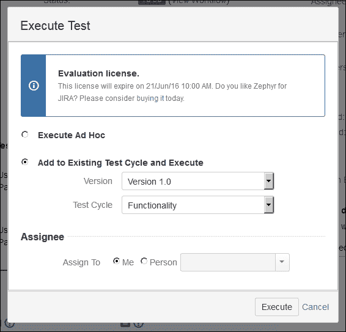

# 第五章 理解 Zephyr 及其功能

我们已经学会了如何定制 JIRA 进行测试管理，理解了如何配置 JIRA 中各种方案，以修改项目并与您公司实际的流程相匹配，但也有一些插件可以在不需要定制 JIRA 的情况下带来新功能。一个这样的流行插件就是**Zephyr**，它为 JIRA 带来了完整的测试管理功能。在本节中，我们将学习如何配置和使用 Zephyr。

讨论的主题如下：

+   安装 Zephyr 插件

+   Zephyr 术语

+   开始使用 Zephyr

# 安装 Zephyr 插件

Zephyr 是一个付费插件，在业界非常流行。如果您希望快速获得测试管理功能，而不需要自己定制 JIRA，您可以使用 Zephyr。它提供了许多符合行业标准的实用测试管理功能。

在本节中，我们将学习如何配置和使用 Zephyr。请按照以下步骤在您的实例中安装它：

1.  进入**管理** | **插件** | **查找新插件**，在**ATLASSIAN 市场**下，输入`Zephyr`并按*Enter*键：

1.  **Zephyr for JIRA - 测试管理**将会出现。点击**免费试用**按钮将此插件安装到您的实例中。在接下来的弹窗中，点击**接受**按钮。

1.  最后，系统将要求您输入 Atlassian 账户以生成 Zephyr 的试用许可证：

1.  安装后，您将在您的实例中获得一个新的菜单项，**测试**。

我们刚刚安装了 Zephyr；现在我们将学习如何配置这个插件。

# Zephyr 术语

Zephyr 插件与您现有的 JIRA 项目紧密集成，但在开始使用此插件之前，有些术语需要我们理解：

+   **测试**：这是测试用例以及需要测试的内容的详细描述

+   **执行**：每个测试及其结果

+   **测试周期**：这是一个测试分组，可能是某个特定项目版本的测试

+   **临时周期**：所有没有定义周期的测试都将在临时周期中执行

# 开始使用 Zephyr

Zephyr 插件对新用户来说可能一开始会显得有些复杂，但在本节中，我们将学习如何快速配置此插件并使用它进行测试。

以下步骤将帮助您在最短的时间内开始使用 Zephyr 插件：

1.  **测试问题类型**默认添加到所有新的**软件**和**业务**项目类型中，但您也可以通过修改**问题类型方案**将其添加到您的项目中。让我们创建一个新项目来使用 Zephyr。

1.  进入**项目** | **创建项目**，选择**Scrum 软件开发**，然后按**下一步**按钮：

1.  在下一个屏幕中，按下**选择**按钮继续：

1.  输入项目**名称**为`测试 Zephyr`；项目**键**`TZ`将会自动建议。点击**提交**按钮，项目将被创建：

1.  转到**项目管理**并检查**问题类型**；你将会注意到**问题类型测试**已自动添加到你的项目中。现在你已经准备好开始使用 Zephyr 进行测试了。

1.  转到**项目管理** | **版本**，并添加几个版本，如`版本 1.0`、`版本 1.1`、`版本 1.2`，或者任何你选择的名称。

1.  返回到你的项目导航侧边栏，点击新的项目项**测试**：

1.  这里有三个标签——**测试摘要**、**测试周期**和**可追溯性**。点击**测试周期**标签。你会发现已经为我们的项目定义了一个**临时**周期。让我们添加一个新的测试周期。在**周期摘要**下，点击**创建新周期**按钮：

1.  在**创建新周期**弹窗中，选择`版本 1.0`作为**版本**，并将**名称**设置为`功能性`。可以选择性地输入**描述**、**构建**和**环境**，并在**起始日期**和**结束日期**字段中选择日期。按下**保存**按钮继续。同样，对于`版本 1.0`，添加一个新的**测试周期**并命名为`回归`。添加后，在**选择版本：**下选择`版本 1.0`，你将会看到新添加的测试周期：

1.  就像`版本 1.0`一样，为`版本 1.1`也添加`功能`和`回归`测试周期。

1.  点击导航菜单中的**创建**按钮。在**创建问题**弹窗中，选择你的项目，并将**问题类型**设置为**测试**，输入**概要**，然后向下滚动，直到看到**Zephyr 测试步骤**部分：

1.  在三个部分中，输入**测试步骤**、**测试数据**和**预期结果**，然后点击**添加**按钮。你可以以类似的方式添加多个测试步骤。让我们再添加一个，然后点击**创建**按钮来创建测试。现在问题将被创建，在**测试详情**部分，你将看到我们添加的两个测试步骤。你还会注意到，**测试**类型的问题没有显示默认的工作流按钮。

1.  现在我们需要执行测试。在**测试详情**部分下，有一个**测试执行**的子部分。最初，这个部分会是空的。你可以点击问题上方的**执行**按钮，或者点击该部分下方的**这里**链接来创建执行：

1.  在**执行测试**弹出窗口中，选择**添加到现有测试周期并执行**，然后选择一个特定的**版本**，接着**测试周期**的下拉列表将显示我们之前与该版本关联的测试周期。在**负责人**部分，如果您想将此执行分配给自己，选择**我**，或从下拉列表中选择**人员**的名字。然后点击**执行**按钮。为另一个**版本**和**测试周期**创建更多的**测试执行**：

1.  最初，每个测试执行的状态是**未执行**。要开始执行，请点击**E**按钮：

1.  我们现在正在执行一个单独的**测试执行**，其中包含为此**测试**添加的各种测试步骤。每个**测试步骤**需要单独测试**测试数据**，并将输出与**预期结果**进行比较；根据输出，测试步骤的**状态**可以从**未执行**更改为**通过**、**失败**、**进行中**或**阻塞**。只需点击**未执行**，下拉列表就会出现。如果发现任何 bug，可以将其与此**测试步骤**关联。点击**输入缺陷**，它会给您一个选项，您可以关联现有的 JIRA 问题，或者创建新问题：

1.  除了每个**测试步骤**的单独**状态**外，测试的整体执行**状态**也可以以类似的方式进行更改：

1.  当您开始执行**测试执行**并更改其**状态**时，**测试执行**部分将显示所有测试周期的汇总。返回到项目导航侧边栏，点击**测试** | **测试周期**标签，选择一个特定版本，您将看到一个**周期摘要**，显示我们创建的**测试周期**，以及与之关联的所有测试和该测试周期的整体进度百分比：

# 概述

在这一章中，我们学习了如何使用 Zephyr 插件快速添加测试管理功能，而无需自行定制 JIRA。Zephyr 是多个组织使用的流行插件。

在下一章，我们将查看一些可以在 JIRA 中实现的示例用例。现在您已经知道如何自定义 JIRA，下一章将帮助您了解一些基本配置，您可以从这些配置开始，在您的实例中实现类似的场景。
