# 第七章 用户管理、组和项目角色

JIRA 可以供 10 人或 10,000 人使用，分布在多个地点。大型公司有多个团队在不同的项目上工作并使用同一个 JIRA 实例，因此通常需要管理权限。可能有某些项目应仅对某个团队开放，或者可能有第三方承包商在某个项目上工作，他们不应访问所有项目。JIRA 是管理用户访问级别和权限的不可思议的工具。

理解如何管理 JIRA 中的用户和组非常重要。在本章中，我们还将介绍项目角色——即在单个项目上工作的人员集合。

涵盖的主题如下：

+   用户和组管理

+   与项目角色合作

+   管理员类型

# 用户和组管理

JIRA 是一个基于 Web 的应用程序，用于跟踪分配给人员的项目问题。这些问题的分配对象必须在系统中存在。当 JIRA 在任何组织中部署时，首先需要做的事情是收集将使用该工具的人员名单；因此，他们的账户需要在 JIRA 中创建。每个用户都会有一个独特的用户名和密码；这使得他们可以登录系统。JIRA 有其自身的内部认证机制，并且能够与**轻量级目录访问协议**（**LDAP**）进行集成。

## 决定是否创建用户账户

在没有许可限制或需要定期创建用户的大型组织中，例如客户关怀系统，JIRA 可以配置为两种模式——公开模式和私有模式。如果您希望启用注册，请将 JIRA 配置为公开模式，它将在用户登录屏幕上显示注册链接。然而，如果 JIRA 中有许可限制，建议您使用私有模式，因为只有在这种情况下，JIRA 管理员才能创建账户。

按照以下步骤操作：

1.  转到**管理** | **系统** | **常规配置**：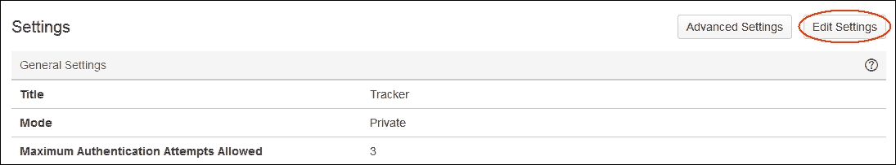

1.  点击右上角的**编辑设置**按钮。

1.  在下一个屏幕中，您将看到更改模式的设置。根据您的许可限制，选择**私人**或**公开**。

1.  完成后点击**更新**按钮以保存您的设置。

## 创建新用户

1.  转到**管理** | **用户管理** | **用户**（在**用户管理**下）。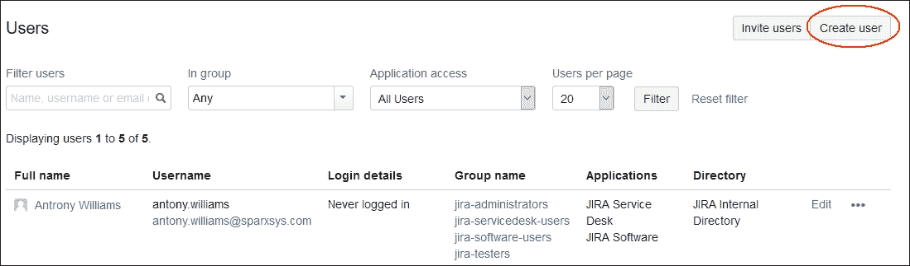

1.  点击右上角的**创建用户**按钮。

1.  在**创建新用户**屏幕中，输入**电子邮件地址**、**全名**、**用户名**、**密码**，勾选**发送通知邮件**，勾选**应用访问**为**JIRA 软件**，然后按**创建用户**按钮。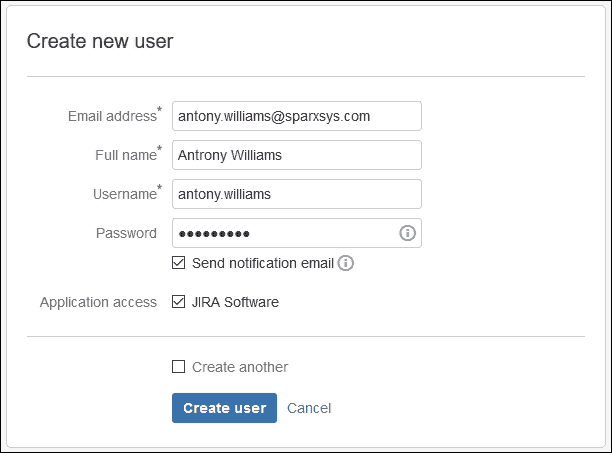

1.  您还可以勾选**发送通知邮件**。

所有新用户都会被分配到具有全局权限访问 JIRA 的**jira-software-users**组。也就是说，只有当用户属于**jira-software-users**组时，他/她才能登录系统，并且这些用户也会计入许可证限制；当然，这可以通过在**管理** | **应用程序** | **应用程序访问**中更改**应用程序访问**来修改。

JIRA 有一些预配置的组，这些组比**jira-software-users**拥有更多权限。如果您想给用户 JIRA 管理员权限，可以将该用户也添加到**jira-administrators**组。

1.  用户创建后，点击**管理组**按钮，如下图所示，来修改用户的组：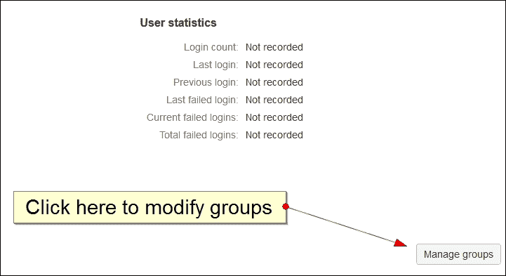

1.  在弹出的**管理用户组**窗口中，搜索`jira-administrators`组，并点击**加入选定的组**按钮：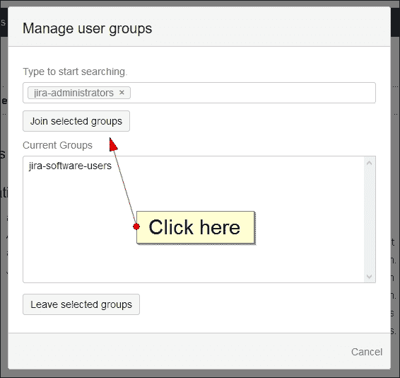

1.  用户将没有完全的管理员权限来访问 JIRA 实例。

也可以将多个用户添加到一个组中；我们稍后在本章中会讨论这一点。

## 密码策略

组织通常会出于安全原因设定密码策略。JIRA 允许您定义这样的密码策略：

1.  转到**管理** | **系统** | **密码策略**（位于**安全**下）。

1.  默认情况下密码策略是禁用的。JIRA 提供了两种预定义的策略，**基础**和**安全**，但我们将定义自己的策略。选择**自定义**；这时会打开一个新表单，您可以在其中输入密码的最小长度、最大长度，以及需要包含的大写字母、小写字母、数字和特殊字符的数量。

1.  点击**更新**按钮以应用新策略。

## 创建新组

有时您需要对某个团队的所有用户执行某些操作；例如，您想为所有在特定项目中工作的人提供额外的权限。在这种情况下，可以创建一个组。它只是用户的集合。创建组本身不会做任何事情，如何使这个组发挥作用是通过权限方案来定义的。

让我们了解如何创建一个新组：

1.  转到**管理** | **用户管理** | **组**（位于**用户管理**下）。

1.  在右侧，有一个**添加组**的选项。只需为组输入**名称**，然后按**添加组**按钮：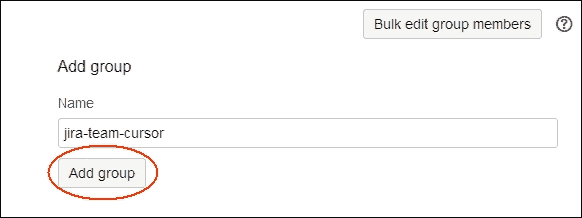

一旦组被添加，它将出现在同一页面的列表中。

此外，向组中添加新用户非常容易：

1.  点击您想要修改的组的**操作**栏下的**编辑成员**链接。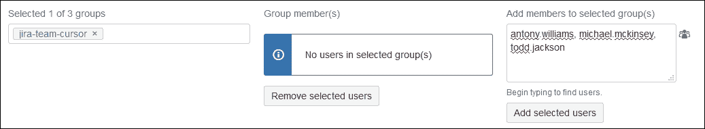

1.  在下一节中，在**将成员添加到选定组**文本框中输入需要分配到新组的用户的用户名，然后按**添加选定用户**按钮。

一旦你创建了组，并且这些组的用户也已经确定，你就可以在项目权限方案或项目角色中使用它们。

# 使用项目角色

每个项目都是由不同的人执行的，每个人都有自己的一套责任。通常，项目的某些方面由这些属于团队的人员负责。例如，在软件项目中，通常会有一个项目负责人，负责管理项目中的一切并对整体进度负责，开发人员负责开发功能，然后还有一组测试人员负责验证已完成的功能。JIRA 的最初版本只有组，而 JIRA 管理员最终会为不同的项目创建多个组，如 proj-administrators、proj-developers 等。同时，每个项目的权限方案也需要为这些组进行定义。JIRA 开发人员意识到这是一个问题，并引入了项目角色的概念，这不仅让 JIRA 管理员可以管理用户，还允许项目管理员将用户添加到项目角色中或将其移除。

在 JIRA 中，你可以拥有在所有项目中都可用的全局定义角色，但在每个项目中，属于这些角色的人会有所不同。仅仅添加项目角色并在项目中添加用户，直到修改权限方案并定义项目角色在项目中的作用之前，是不会产生任何效果的。

## 创建项目角色

JIRA 提供了两个预定义角色，分别是**管理员**和**开发人员**。你也可以在 JIRA 中创建新的角色。请按照以下步骤操作：

1.  前往**管理** | **系统** | **项目角色**（在**安全**下）：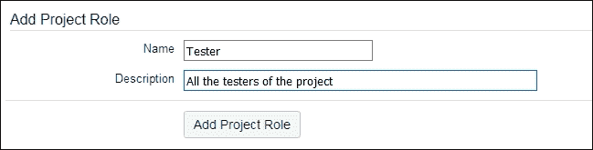

1.  要添加新角色，输入角色的**名称**和**描述**，然后点击**添加项目角色**按钮。可以轻松地将新角色添加到系统中，但需要注意的是，在 JIRA 中添加新角色并不会对项目产生任何影响，直到我们在特定的 JIRA 项目中将用户添加到项目角色，并在权限方案中定义角色权限。

## 在项目角色中添加用户和组

现在我们已经有了一个新的项目角色，是时候为特定项目添加一些用户和组了：

1.  前往任意项目的**管理**标签，然后进入**用户和角色**：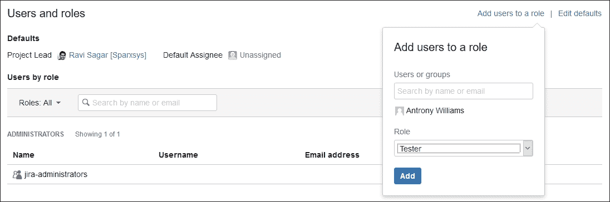

1.  点击右上角的**添加用户到角色**链接。在弹出的窗口中，搜索**用户或组**文本框中的用户，从下拉列表中选择**角色**，然后点击**添加**按钮。如果你想为某个特定项目角色添加更多用户或组，可以再次执行相同的操作。无论是用户还是组，都可以成为你的项目角色的一部分。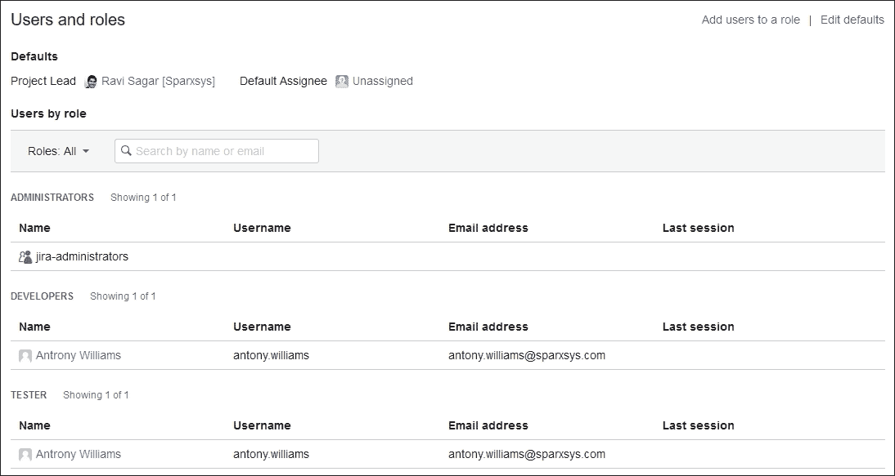

到目前为止，我们已经创建了一个项目角色，并为特定项目添加了用户。你可以对所有项目执行相同的操作。这些项目角色在我们实例中的所有项目中都可以使用，但现在我们需要定义该角色在项目中的权限。

## 授予项目角色权限

我们刚刚为实例添加的**测试人员**项目角色的权限需要通过修改项目的权限方案来配置：

1.  转到项目标签，**管理** | **权限**。

1.  在**项目权限**页面，点击右上角的**操作**按钮，选择**编辑权限**。

1.  现在你可以修改权限方案。让我们赋予他们**管理观察者**的权限。这样，他们可以添加一个既不是指派人也不是报告人，但仍然可以接收问题更新通知的第三方用户。点击**编辑**链接，如下图所示：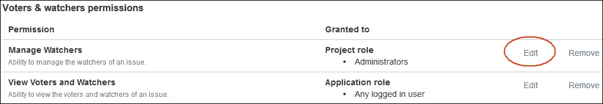

1.  如下图所示，在**授予权限**弹出框中，首先选择**项目角色**，然后从下拉列表中选择**测试人员**项目角色：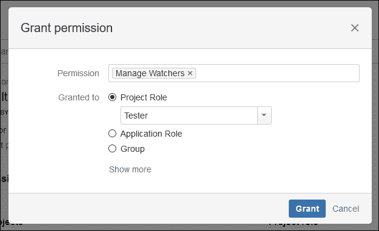

1.  点击**授予**按钮。

你可以像这样向新角色添加更多权限，当然，所有使用此权限方案的项目都会受到影响。

# 管理员类型

JIRA 管理员具有更改系统配置和方案、管理用户的权限。管理员用户是在安装 JIRA 时创建的。在大型组织中，如果有一个团队负责 JIRA，可能会有多个 JIRA 管理员。在 JIRA 中有一个名为**jira-adminstators**的组。安装过程中创建的管理员用户是该组的一部分，之后可以将更多用户添加到该组。

1.  转到**管理** | **系统** | **全局权限**（在**安全性**下）：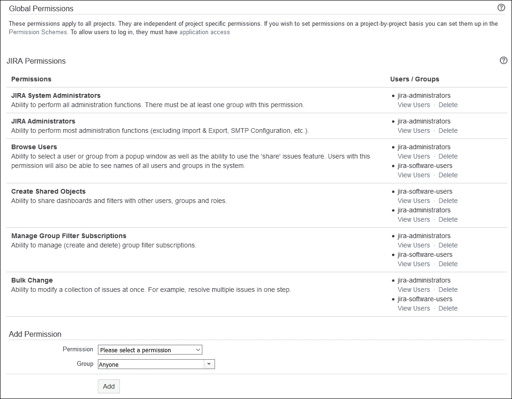

如果你注意到，从管理员的角度来看，JIRA 提供了两种不同的权限，分别是**JIRA 系统管理员**和**JIRA 管理员**。

## JIRA 系统管理员

属于该全局权限的用户可以执行所有管理员功能。他们可以在配置和方案中进行更改，执行系统恢复，甚至修改邮件配置。

## JIRA 管理员

即使你的组织有多个 JIRA 管理员，仍然有一些功能需要进行限制。**JIRA 管理员**权限允许用户执行大部分管理功能，但不包括系统恢复、导入导出以及邮件配置更改，因为这些功能可能导致系统崩溃并可能造成数据丢失。因此，建议只将 **JIRA 系统管理员**权限授予组织中的一到两个人，其余人员可以拥有 **JIRA 管理员**权限。

# 总结

在本章中，你学习了如何管理用户和用户组。为新用户提供访问权限并将其分配到正确的用户组是 JIRA 管理员最重要的工作之一。将新用户添加到系统并分配到正确的用户组对数据完整性至关重要，并且应与公司政策保持一致。你还学习了如何创建项目角色并定义它们的权限。

在下一章中，你将学习如何将 JIRA 与 LDAP、Crowd 和 JIRA 用户服务器集成。这样，用户无需记住多个工具的登录信息，管理员也可以更轻松地从一个地方高效地管理用户。
