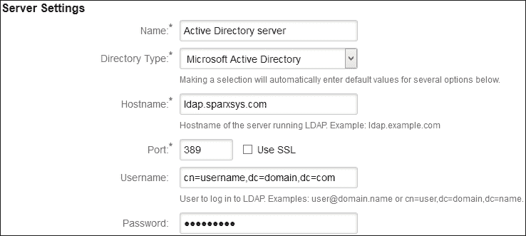

# 第八章：配置 JIRA 用户目录以连接 LDAP、Crowd 和 JIRA 用户服务器

在拥有成千上万员工的公司中，有许多内部工具和系统。包括时间追踪、请假管理和内网门户等工具。很难在多个应用程序中管理用户账户；公司通常使用 **轻量级目录访问协议**（**LDAP**）服务器来进行用户管理，一个用户账户可以在多个工具中使用，用户不需要记住多个密码。JIRA 也支持与 LDAP 集成。这是一个非常棒的功能，确实帮助了系统管理员管理用户。除了 LDAP，我们还将讨论如何将 JIRA 连接到另一个 JIRA 实例进行用户管理，以及如何与 **Crowd** 集成，Crowd 是 Atlassian 的单点登录软件。

本章将涵盖以下主题：

+   JIRA 的认证机制

+   允许其他应用程序连接到 JIRA

+   同步用户和组信息

# JIRA 的认证机制

JIRA 是一个基于 Web 的工具，被多个用户使用，每个用户的权限取决于他们所属的组或在项目中所扮演的角色。JIRA 拥有一个内建的认证机制，称为 **JIRA 内部目录**，但是也可以将 JIRA 连接到外部目录。让我们看看这是如何实现的。

## JIRA 内部目录

JIRA 自带一个默认启用的内部目录，第一个管理员用户是内部目录的一部分，直到你添加其他目录之前，所有的附加用户都会被添加到这个内部目录中。JIRA 将此信息存储在它自己的数据库中。

## 配置 LDAP

LDAP 是一种应用协议，用于查询和修改目录服务中的信息。在中型到大型公司中，拥有数百或数千个用户，每个人的电子邮件、电话号码及其他详细信息都存储在目录服务器上。用户可以在这个目录中查找彼此。每个用户的登录信息也被存储，各种应用程序可以依赖目录服务进行认证。

除了 JIRA 的内部认证，还可以通过 LDAP 连接到现有的目录服务：

1.  转到 JIRA **管理** | **用户管理** | **用户目录**（在 **用户目录** 下）。你会注意到 **JIRA 内部目录** 已经添加在这里，但是在我们添加其他目录（如 LDAP 或 Crowd）之后，用户搜索的顺序是通过 **顺序** 列来定义的。用户可能存在于一个或多个目录中，但他们会首先在列在顶部的目录中被搜索：

1.  点击 **添加目录**。将弹出一个窗口。选择 **Microsoft Active Directory** 并点击 **下一步**。

1.  在下图中，我们需要配置 LDAP 用户目录。首先，填写 **服务器设置**：

    +   输入**名称**，可以命名为 `Active Director server` 或其他有用的名称。

    +   选择**目录类型**为**Microsoft Active Directory**。

    +   输入你的 LDAP 服务器的**主机名**。

    +   输入你的 LDAP 服务器的**端口**号。

    +   输入你的 LDAP 服务器的**用户名**。通常格式为 `user@domain.name` 或 `cn=username,dc=domain,dc=com`。

    +   输入**密码**。

    

1.  然后，输入**LDAP 模式**设置：

    +   输入**基础 DN**，通常格式为 `dc=domain,dc=local`。请向你的 LDAP 管理员询问具体信息：

    

1.  现在，设置**LDAP 权限**为**只读**，这意味着用户信息只会从 LDAP 服务器中获取。在这种情况下，密码只能从 LDAP 服务器中更改，而不能从 JIRA 应用程序中更改。但是，如果你希望新登录的用户自动加入一个或多个 JIRA 组，请选择**只读，带本地组**，并在**默认组成员资格：**字段中输入组名：

1.  点击**保存并测试**按钮以保存配置。

现在，一个已经是 LDAP 服务器成员的新用户，可以使用相同的用户名和密码登录 JIRA 实例。此外，该用户将被添加到我们之前配置的其他 JIRA 组中。

### 了解基础 DN

公司中使用的 LDAP 目录可能包含成千上万的员工；可能不需要为公司中的所有用户提供 JIRA 访问权限。例如，考虑到有美国用户和亚洲用户的情况，JIRA 访问权限只需提供给美国用户即可。现在，LDAP 也有自己的组，称为域，可以利用这些域来限制对 JIRA 的访问。

请参阅下表了解相应 LDAP 域的可能基础 DN：

| **LDAP 域** | **基础 DN** | **备注** |
| --- | --- | --- |
| `example.com` | `dc=example,dc=com` | LDAP 目录中的所有用户都可以访问 JIRA |
| `us.example.com` | `dc=us,dc=example,dc=com` | 只有美国用户可以访问 JIRA |
| `asia.example.com` | `dc=asia,dc=example,dc=com` | 只有亚洲用户可以访问 JIRA |

联系你的 JIRA 管理员以了解 LDAP 域。还要确保如果你使用 LDAP，那么任何拥有有效账户的用户都可以登录 JIRA，这样你的许可证限制可能会很快用尽。

## 连接到 Crowd

Crowd 是 Atlassian 的另一款单点登录应用程序。此应用可以用于管理多个用户目录。

### 实施 Atlassian Crowd

Crowd 支持多种类型的目录。它可以使用其内部的 Crowd 目录，也可以连接到组织中已使用的 LDAP 目录。作为第一步，至少需要在 Crowd 中配置其中一个目录。然后，确保将用于认证用户的组添加到你在 Crowd 中添加和配置的目录中。例如，**jira-software-users** 是在 JIRA 中定义的一个组。属于该组的用户可以登录 JIRA。只需确保该组也已添加到你的 Crowd 目录中。最后，为了与 JIRA 通信，需要在 Crowd 中创建一个应用程序。记住该应用程序的名称和应用程序密码；在配置 Crowd 与 JIRA 的连接时，你会需要它们。

已有 Crowd 实例的组织可以将其 JIRA 连接到该实例，以实现单点登录：

1.  转到 JIRA **管理** | **用户管理** | **用户目录**（在 **用户目录** 下）。

1.  点击 **添加目录** 按钮，并选择 **目录类型** 为 **Atlassian Crowd**：

1.  在下一个页面，填写 **服务器设置**：

    +   输入 **Crowd 服务器的名称**

    +   输入你的**服务器 URL**，以连接到 Crowd 实例

    +   输入 **应用程序名称**；该应用程序需要由管理员在 Crowd 中创建

    +   提供由 Crowd 管理员给你的 **应用程序密码**

1.  然后，选择 **Crowd 权限** 为 **读/写**，如果你希望更改应用到 Crowd 服务器；如果只想检索信息，则选择 **只读**。

1.  首先，点击 **测试设置**，如果一切正常，你将能够 **保存并测试** 与 Crowd 服务器的连接。

## 连接到 JIRA 用户服务器

在大型组织中，可能会有多个 JIRA 实例供不同的团队或项目使用。用户可能需要访问所有这些实例来跟踪项目；在这种情况下，必须为同一个人创建多个账户。这不仅对 JIRA 管理员来说繁琐，而且用户也很难记住更多的用户名和密码。JIRA 允许你连接到另一个 JIRA 实例进行用户管理：

1.  转到 JIRA **管理** | **用户管理** | **用户目录**（在 **用户目录** 下）。

1.  点击 **添加目录** 按钮，并选择 **目录类型** 为 **Atlassian JIRA**：

1.  在下一个页面，填写 **服务器设置**：

    +   输入 **JIRA 服务器的名称**

    +   输入你的 **JIRA 实例的服务器 URL**

    +   输入 **应用程序名称**；该应用程序需要由管理员在 JIRA 中创建

    +   提供由 JIRA 管理员给你的 **应用程序密码**

1.  然后，选择 **JIRA 服务器权限** 为 **读/写**，如果你希望更改应用到 JIRA 服务器；如果只想检索信息，则选择 **只读**。

1.  首先，点击 **测试设置**，如果一切正常，你就可以 **保存并测试** 与 JIRA 服务器的连接。

# 允许其他应用程序连接到 JIRA

在上一节中，我们将一个 JIRA 实例连接到另一个实例进行用户管理。作为 JIRA 用户服务器使用的实例需要先创建该应用程序，以便其他实例能够连接到它：

1.  前往 JIRA **管理** | **用户管理** | **JIRA 用户服务器**。

    点击右上角的 **添加应用程序** 按钮：

    

1.  在下一屏幕上，输入 **应用程序名称**，如 `jira-user-server` 或其他有意义的名称。

1.  输入该应用程序的 **密码**。

1.  最后，在 **IP 地址** 字段中输入实际 JIRA 服务器的 IP 地址。这一步非常重要。如果没有这一步，连接可能无法正常工作。

JIRA 用户服务器的 URL、应用程序名称和密码是需要注意的重要特征，并且需要在将连接到它的 JIRA 实例中使用。由于 JIRA 内部使用了一个精简版的 Crowd，允许 Atlassian 的其他应用程序（如 Confluence）连接到 JIRA 以共享用户库是可能的。

# 同步用户和组信息

现在我们已经看到了如何将 JIRA 连接到 LDAP、Crowd 和另一个 JIRA 服务器，接下来还需要了解用户信息是如何同步的。任何属于目录的新用户都应该能够登录到 JIRA 实例，但所有最近添加到目录中的新用户，在用户列表同步之前都无法访问 JIRA。

前往 JIRA **管理** | **用户管理** | **用户目录**（位于 **用户目录** 下）。在这里，你将看到实例中添加的用户目录列表。每个条目旁边都有一个 **同步** 链接：

点击 **同步** 链接，JIRA 将比较并获取 JIRA 服务器中的用户列表；如果服务器中有新用户，它们将会在实例中创建。这也会在我们的 JIRA 实例中创建相应的用户组。

请注意，通过此同步创建的用户是不可编辑的，如果权限设置为 **只读** 模式，则无法删除这些用户。

# 总结

在本章中，你学习了如何将 JIRA 与 LDAP、Crowd 和 JIRA 用户服务器集成。这样，用户无需记住多个工具的登录信息，管理员也可以更轻松地从一个地方有效地管理用户。你还学习了如何在 JIRA 服务器上创建应用程序链接，并讨论了用户账户的同步。

到目前为止，我们已经看到了 JIRA 的强大功能和它所提供的灵活性。JIRA 可以非常轻松地进行自定义；我们知道，可以通过从市场上安装插件来为 JIRA 添加更多功能。虽然其中一些插件是免费的，但也有一些需要购买。你还可以创建自己的插件，将新功能引入 JIRA 并对其进行修改。在下一章中，我们将看看如何创建这些插件，并提供一些简单的示例。
