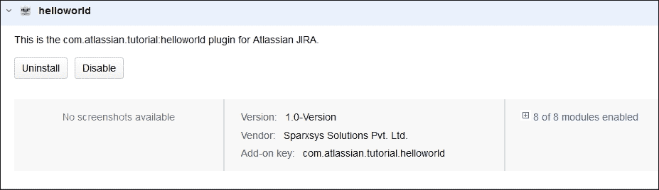
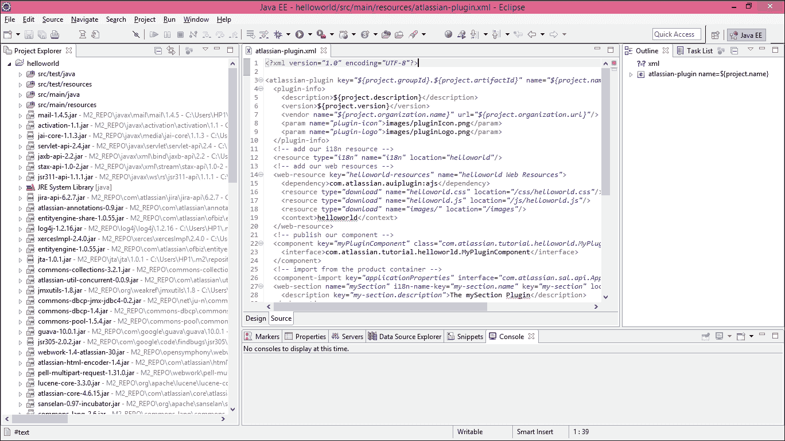

# 第九章：JIRA 插件开发与利用 REST API

JIRA 提供了许多有用的功能，不仅可以帮助你启动项目，还可以让你自定义适合你软件模型和流程的工作流程。然而，有时某些功能或自定义需求是必需的，但 JIRA 本身并不支持这些功能。不过，可以通过从 Atlassian 市场安装插件来向 JIRA 添加许多新功能。JIRA 有一个市场，用户可以在其中搜索这些插件。部分插件是免费的，部分是付费插件。如果你正在寻找额外的功能，可以在市场上搜索现有的插件，但也可以创建自己的插件，这需要对 Java 有一定的了解。本章将为你提供足够的信息，帮助你开始 JIRA 插件开发，并包含一些简单的示例。

以下主题将会涵盖：

+   设置 Atlassian 插件 **软件开发工具包** (**SDK**)

+   在 Windows 上安装 Atlassian SDK

+   创建 **helloworld** 插件

+   设置 Eclipse IDE

+   利用 JIRA **表现层状态转移** (**REST**) API

# 设置 Atlassian 插件 SDK

Atlassian 提供了一个 SDK 用于开发插件。SDK 需要先安装在你的机器上才能开始开发。它可以在 Windows、Linux 和 Mac 系统上安装。你可以使用任何这些操作系统来开发插件，但本章的指引将仅聚焦于 Windows 平台。安装 Atlassian SDK 并没有具体推荐的硬件要求；然而，为了获得较好的性能，建议在配备 i5 处理器和 8 GB 内存的机器上安装。

### 注意

在 [`marketplace.atlassian.com/download/plugins/atlassian-plugin-sdk-windows`](https://marketplace.atlassian.com/download/plugins/atlassian-plugin-sdk-windows) 下载 Windows 版本的 Atlassian SDK。

## 在 Windows 系统上设置 SDK 先决条件

SDK 需要在你的机器上配置 Java 环境。在 第一章，*规划你的 JIRA 安装* 中，我们讨论了如何安装 JDK。JDK 可能已安装在 `C:\java` 或 `C:\java\jdk1.8.0_92` 路径下。

## 验证 JDK 安装和 JAVA_HOME 系统变量

Atlassian JDK 需要系统上安装 Oracle 的 Java SE 开发工具包。请按照 第一章，*规划你的 JIRA 安装* 中提到的步骤安装它，并按照这里提到的步骤验证 `JAVA_HOME` 系统变量是否已设置。

1.  打开 **命令提示符** (**cmd**) 并输入以下命令：

    ```
     echo %JAVA_HOME%

    ```

1.  它应该返回 JDK 安装路径。在我们的案例中，它如下所示：

    ```
     c:\java

    ```

### 验证 JAVA_HOME\bin 是否存在于环境变量 PATH 中

JDK 的`bin`目录包含可执行文件，例如`javac`，并且应该对 Atlassian SDK 可用。

你需要做的就是将以下行添加到现有的`Path`系统变量中：`%JAVA_HOME%\bin`，然后执行以下步骤：

1.  打开 cmd 并输入以下命令：

    ```
    javac -version

    ```

1.  它应该返回 JDK 的版本：

    ```
    javac 1.8.0_92

    ```

# 在 Windows 上安装 Atlassian SDK

你可以从[`marketplace.atlassian.com/download/plugins/atlassian-plugin-sdk-windows`](https://marketplace.atlassian.com/download/plugins/atlassian-plugin-sdk-windows)下载 Atlassian SDK。这个链接始终会提供 SDK 的最新稳定版本。你会得到一个名为`sdk-installer-6.2.6.exe`的可执行文件。按照以下步骤在 Windows 系统上安装 SDK：

1.  下载 SDK 安装程序后，双击它并完成安装。

1.  一旦安装完成，安装程序会提示你重启计算机。如果安装程序没有提示你重启，只需检查是否能够使用`atlas-`命令；如果不能，重启系统是确保 SDK 正确安装的最安全方法。

1.  打开 cmd 并输入以下命令：

    ```
    atlas-version

    ```

1.  它应该返回以下信息：

你可以看到，它会告诉你系统上安装的 Atlassian SDK 的版本，并提供已安装的 JDK 的详细信息。

到此为止，一切都已设置完成，你现在可以开始开发插件了。

## 熟悉 Atlassian SDK

当你运行`atlas-version`命令时，它会显示已安装 SDK 的各种详细信息。你可能已经注意到，`ATLAS Home`是 Atlassian SDK 安装的位置。现在，让我们打开这个目录并检查其内容：

+   `apache-maven-3.2.1`：这个 Atlassian SDK 使用**Maven**，Maven 是一个流行的自动化构建工具，用于 Java 项目。

+   `bin`：该目录包含用于开发插件的所有命令行工具。这里的所有命令都以`atlas-`为前缀。

+   `repository`：该目录包含 SDK 依赖的实际代码，用于开发插件。

## atlas 命令

我们刚刚讨论过，所有的命令都以`atlas-`为前缀。在开始创建插件之前，必须有一个工作中的 JIRA 实例。这将用于测试你的插件。`atlas-run-standalone`命令用于为你设置并启动 JIRA 实例。

执行以下步骤：

1.  在`C:\`目录下创建一个名为`atlastutorial`的文件夹。

1.  在 cmd 中，使用以下命令更改目录：

    ```
    cd c:\atlastutorial

    ```

1.  使用以下命令启动 JIRA：

    ```
    atlas-run-standalone --product jira

    ```

1.  根据你的互联网连接情况，这个命令可能需要几分钟才能完成。它会下载 JIRA 文件并在`2990`端口启动实例：

    ```
    [INFO] Starting jira on the tomcat7x container on ports 2990 (http),
         54668  
         (rmi) and 8009 (ajp)
    [INFO] using codehaus cargo v1.4.7
    [INFO] [2.ContainerStartMojo] Resolved container artifact 
         org.codehaus.cargo:cargo-core-container-tomcat:jar:1.4.7 for container 
         tomcat7x
    [INFO] [talledLocalContainer] Tomcat 7.x starting...
    [INFO] [stalledLocalDeployer] Deploying [c:\atlastutorial\amps-
         standalone\target\jira\jira.war] to [c:\atlastutorial\amps-
         standalone/target\container\tomcat7x\cargo-jira-home/webapps]...
    [INFO] [talledLocalContainer] Tomcat 7.x started on port [2990]
    [INFO] jira started successfully in 703s at http://localhost:2990/jira
    [INFO] Type Ctrl-D to shutdown gracefully
    [INFO] Type Ctrl-C to exit 

    ```

1.  在浏览器中输入`http://localhost:2990/jira`；命令也会显示确切的 URL。

1.  输入`admin`作为用户名和密码。

这是你的 JIRA 实例，它是在你使用插件开发者的测试许可证设置 Atlassian SDK 后创建的；我们将使用此实例来开发 JIRA 插件。

# 创建 helloworld 插件

现在，我们准备在 JIRA 中创建我们的第一个插件，它将为我们的实例引入新功能。任何 JIRA 插件都包含许多文件，并且必须遵循目录结构；Atlassian SDK 提供了一个命令行工具，名为`atlas-create-jira-plugin`，用来创建插件。

如果你的现有 JIRA 已在命令行中运行，按 *Ctrl + C* 停止它，并执行以下步骤：

1.  在命令行中，确保你处于`C:\atlastutorial`目录。

1.  输入以下命令并按 *Enter* 键：

    ```
    atlas-create-jira-plugin

    ```

1.  此命令将回应并要求你提供某些输入。使用下表中提到的值：

    | **为** `groupId` **定义值** | `com.atlassian.tutorial` | **用于唯一标识项目** |
    | --- | --- | --- |
    | 为 `artifactId` 定义值 | `helloworld` | 一个工件是一个文件，通常是 JAR 文件，最终会被部署 |
    | 为 `version` 定义值 | `1.0-Version` | 用于分发插件 |
    | 为 `package` 定义值 | `com.atlassian.tutorial.helloworld` | 用于组织相关类 |

1.  `atlas-create-jira-plugin`命令会提示你确认刚刚输入的值。按 ***Y*** 继续。新的`helloworld`文件夹将在`c:\atlastutorial\helloworld`创建。

如果你查看`c:\atlastutorial\helloworld`目录，你会发现由`atlas-create-jira-plugin`命令创建的插件项目骨架，其中包含以下文件和文件夹：

+   `src`：此文件夹包含插件的源代码

+   `LICENSE`：此文件存储插件许可证信息

+   `pom`：这是 Maven 配置文件

+   `README`：此文件包含有关如何运行插件的简要说明

## 在 pom.xml 中添加组织信息

打开`pom.xml`文件，搜索`<organization>`标签，并更新公司名称和公司 URL。此信息将对从 **Universal Plugin Manager** (**UPM**) 安装插件的用户可见：

```
<organization> 
  <name>Sparxsys Solutions Pvt. Ltd.</name> 
  <url>http://www.sparxsys.com/</url> 
</organization> 

```

输入公司名称并将其放入 `<name>` 标签中，将公司 URL 放入 `<url>` 标签中，并保存文件。

## 在 JIRA 中加载插件

我们现在已经通过一个命令创建了一个插件，实际上你可以在 JIRA 中加载此插件。虽然它现在没有功能，但我们仍然会尝试理解如何在 JIRA 中加载此插件。请执行以下步骤：

1.  在命令行中，导航到`c:\atlastutorial\helloworld`目录。

1.  输入以下命令并按 *Enter* 键：

    ```
    atlas-run

    ```

    这是一个安装并运行插件的 shell 脚本。

1.  此命令将在`helloworld`目录中创建一个名为`target`的子目录。过一段时间后，JIRA 实例将启动。

1.  在浏览器中输入`http://localhost:2990/jira`；确切的 URL 也将由命令显示。

1.  输入`admin`作为用户名和密码。

1.  转到 JIRA**管理** | **插件** | **管理插件**（在**ATLASSIAN 市场**下）。

1.  在**用户安装的插件**下，你将看到新的插件叫做**helloworld**：

如前所示，**helloworld**插件现在已加载到你的 JIRA 实例中。此外，我们在创建插件时填写的版本信息也在这里显示。超链接的公司名称也显示在此处。

# 设置 Eclipse IDE

我们已经设置好了开发环境并安装了 Atlassian SDK。你还学习了如何创建一个骨架插件；除了在 UPM 中显示外，这个插件并没有执行其他功能。我们将向插件添加一些功能，但在此之前，让我们配置流行的 Eclipse IDE，它确实有助于开发 JIRA 插件。

## 下载 Eclipse IDE

Eclipse IDE 用于多种编程语言的开发，但我们将安装适用于 Java EE 开发人员的 Eclipse IDE（Indigo）。执行以下步骤：

1.  从[`www.eclipse.org/downloads/packages/eclipse-ide-java-ee-developers/indigosr2`](http://www.eclipse.org/downloads/packages/eclipse-ide-java-ee-developers/indigosr2)下载适用于 Java EE 开发人员的 Eclipse IDE。

1.  将下载的文件内容提取到`C:\eclipse`目录中。

### 配置 Eclipse 以在 JDK 下启动

我们需要告诉 Eclipse IDE 启动并使用我们已经在计算机上安装的 JDK：

1.  打开`C:\eclipse\eclipse.ini`文件。

1.  在`-vmargs`条目之前添加`-vm`条目。我们需要在这里定义 JDK 的路径；最终的`eclipse.ini`文件应该类似于以下代码：

    ```
            -startup 
            plugins/org.eclipse.equinox.launcher_1.3.0.v20140415-2008.jar 
            --launcher.library 
            plugins/org.eclipse.equinox.launcher.win32.win32.x86_64_1.1.200.
            v20140603-1326 
            -product 
            org.eclipse.epp.package.jee.product 
            --launcher.defaultAction 
            openFile 
            --launcher.XXMaxPermSize 
            256M 
            -showsplash 
            org.eclipse.platform 
            --launcher.XXMaxPermSize 
            256m 
            --launcher.defaultAction 
            openFile 
            --launcher.appendVmargs 
            -vm 
            c:\java 
            -vmargs 
            -Dosgi.requiredJavaVersion=1.8 
            -Xms40m 
            -Xmx512m 

    ```

1.  保存并关闭文件。

### 更新 Eclipse 中的已安装 JRE

需要将 Eclipse 的 JRE 更新为我们当前安装在 JDK 版本中的 JRE。如果你不确定是否已更新 JRE，请执行以下步骤：

1.  在菜单栏中，点击**窗口** | **首选项**。

1.  双击`C:\eclipse\eclipse.exe`应用程序，它将启动 Eclipse IDE。

1.  在左侧，输入`已安装 JRE`；这将筛选出列表；之后，双击**已安装 JRE**。

1.  在右侧，点击**添加**按钮，选择**标准虚拟机**。

1.  在**JRE 主目录**中，输入`c:\java`作为目录位置，然后点击**完成**按钮：

1.  最终，JRE 将会更新，应该类似于以下截图：

### 安装 Maven 插件

JIRA 插件的开发基于 Maven，并且需要安装 Maven 的 Eclipse 插件。执行以下步骤：

1.  在菜单栏中，点击**帮助** | **安装新软件…**

1.  在**可用软件**窗口中，点击**添加**按钮。

1.  输入**名称**为`Sonatype M2Eclipse`，在**位置**中输入`http://download.eclipse.org/technology/m2e/releases`，然后点击**确定**按钮。

1.  选择**Eclipse 的 Maven 集成**，然后点击**完成**按钮。

1.  最后，重启 Eclipse 以使这些更改生效。

### 配置 Maven 插件

最后，我们需要告诉 Maven Eclipse 插件 Maven 在我们机器上的位置。Maven 目录位于`ATLAS Home`目录中。你可以在你的机器上运行`atlas-version`命令，找出`ATLAS Maven Home`的确切位置。只需复制该位置并执行以下步骤：

1.  在菜单栏中，点击**窗口** | **首选项**。

1.  在左侧，输入`Maven`，它将筛选出可用的**Maven**选项。

1.  点击**安装**，然后点击**添加**按钮。

1.  **安装类型**应选择**外部**。复制`ATLAS Maven Home`目录并点击**完成**按钮。

现在我们已准备好使用 Eclipse 开始开发我们的 JIRA 插件。

## 向骨架插件添加功能

之前创建的 helloworld 插件没有任何功能；我们将插件加载到 JIRA 中，但除了在 UPM 中显示之外，它没有执行任何操作。现在我们已经配置好了 Eclipse IDE，让我们为 helloworld 插件添加一些功能。

作为示例，我们将使用此插件在 JIRA 主导航栏中添加一个自定义链接。

### 在 Eclipse 中导入 helloworld 插件

我们可以使用 Eclipse IDE 并导入我们的插件，但在此之前，需要在`helloworld`插件项目中生成 Eclipse 配置文件。请执行以下步骤：

1.  在 cmd 中，导航到`C:\atlastutorial\helloworld`目录。

1.  输入以下命令并按*回车*：

    ```
    atlas-mvn eclipse:eclipse

    ```

1.  此命令将返回以下信息：

    ```
    [INFO] -------------------------------------------------------[INFO] 
          BUILD SUCCESS
    [INFO] -------------------------------------------------------[INFO] 
          Total time: 56.519 s
    [INFO] Finished at: 2014-11-28T11:15:35+05:30
    [INFO] Final Memory: 21M/102M
    [INFO] ---------------------------------------------------

    ```

1.  现在，我们准备好在 Eclipse 中导入插件了。在菜单栏中，点击**文件** | **导入…**

1.  在**常规**下选择**将现有项目导入工作空间**，然后点击**下一步**按钮。

1.  在**选择根目录**中输入`C:\atlastutorial\helloworld`，然后点击**完成**按钮。

现在你应该可以在左侧的**项目资源管理器**下看到加载的`helloworld`插件项目，如下图所示。如果你在 SDK 中看到欢迎屏幕，请将其关闭。



### 在 JIRA 顶部导航栏中创建菜单

我们将使用一个非常简单的示例来帮助我们理解如何在 JIRA 中添加新功能。你已经熟悉了 JIRA 的顶部导航栏。从 JIRA 前端来看，无法向其添加新菜单项；然而，我们将修改我们的`helloworld`插件来添加此菜单项。

JIRA 的功能和各个部分的行为由不同的模块控制。如果我们想修改 JIRA 的顶部导航栏，就需要添加两个模块，分别是`Web Section`和`Web Item`。请按照以下步骤操作：

1.  在命令行中，导航到`c:\atlastutorial\helloworld`目录。

1.  输入以下命令并按下*Enter*键：

    ```
    atlas-create-jira-plugin-module

    ```

1.  要了解更多关于插件模块的信息，请参考此网址：[`developer.atlassian.com/docs/getting-started/plugin-modules`](https://developer.atlassian.com/docs/getting-started/plugin-modules)。

1.  命令将响应并提示你为不同模块输入一个特定的数字。输入`30`以选择`Web Section`。

1.  命令将再次响应，并要求你提供某些输入。请使用以下表格中提到的值：

    | `输入插件模块名称` | `mySection` |
    | --- | --- |
    | `输入位置` | `contact-us-links` |
    | `显示高级设置？` | *N* |

1.  命令会询问你，**是否添加另一个插件模块？** 按下 ***Y*** 键。

1.  命令将响应并提示你为不同模块输入一个特定的数字。输入`25`以选择`Web Item`。

1.  命令将再次响应，并要求你提供某些输入。请使用以下表格中提到的值：

    | `输入插件模块名称` | `联系我们` |
    | --- | --- |
    | `输入部分` | `system.top.navigation.bar` |
    | `输入链接网址` | `http://www.sparxsys.com/contact` |
    | `显示高级设置？` | *N* |

1.  命令会询问你，**是否添加另一个插件模块？** 按下 ***N*** 键。

1.  在你的插件项目目录中运行`atlas-run`命令。JIRA 启动后，使用浏览器打开它：

现在你应该能看到一个新的菜单项，名为**联系我们**，这是我们从`helloworld`插件中添加的。

我们刚刚开始在框架插件项目中添加功能。尽管我们所做的只是向 JIRA 导航栏添加了一个链接，但还有很多其他功能可以实现。

如果你正在开始 JIRA 插件开发，可以先浏览 Atlassian 网站上提到的教程：[`developer.atlassian.com/docs/getting-started/tutorials`](https://developer.atlassian.com/docs/getting-started/tutorials)。

到目前为止，我们已经讨论了创建扩展 JIRA 功能的插件，但同样也可以从其他应用程序与 JIRA 进行交互。JIRA 提供了**REST API**，允许你从外部应用程序操作 JIRA 的数据和配置。符合 REST 原则的 JIRA API 不要求客户端了解 API 的结构，而是服务器需要提供客户端与服务交互所需的任何信息。

各种编程语言都能够进行 REST 调用。在接下来的部分，我们将详细讨论如何与 JIRA 的 REST API 进行交互，并提供一些示例。

## 使用 Atlassian Connect 框架的 JIRA Cloud 插件

我们刚刚看到如何为你自己托管的 JIRA Server 实例开发插件。然而，许多组织也使用 Atlassian Cloud 实例，这是一个托管环境；它不需要任何安装。你只需在线注册并为使用付费。Atlassian Cloud 实例提供了大多数 JIRA Server 的功能。许多组织更倾向于使用云实例，因为不需要自己管理服务器。开发云插件的过程有所不同。如果你想了解如何做，请参考[`developer.atlassian.com/static/connect/docs/latest/guides/introduction.html`](https://developer.atlassian.com/static/connect/docs/latest/guides/introduction.html)中的文档。

如果你计划在 Atlassian 市场上销售你的插件，那么为 JIRA Server 和 JIRA Cloud 都开发插件是个不错的主意。

# 利用 JIRA REST API

我们已经讨论了如何开始构建扩展 JIRA 功能的插件。这些插件与 JIRA 的现有功能紧密集成；然而，有时你需要在 JIRA 之上添加一些功能，以便其他工具能够与 JIRA 进行交互。JIRA 通过 REST 提供了对各种操作的访问。

## 通过 REST 可以执行的一些操作示例

+   问题操作，如创建/修改/删除问题

+   搜索问题

+   创建用户

+   群组管理操作，如向群组添加/移除用户

通过 REST API 可以访问很多资源。你可以在 [`docs.atlassian.com/jira/REST/latest/`](https://docs.atlassian.com/jira/REST/latest/) 获取所有资源的详细列表。

## JIRA REST API 的使用案例

通过外部应用程序与 JIRA 进行交互的能力开启了许多可能性。让我们来看一下可以在 JIRA 上构建的功能的一些使用案例：

+   生成业务智能报告

+   在 JIRA 中生成批量操作

+   为客户构建自定义界面

### 生成业务智能报告

JIRA 提供了很多现成的报告，我们在第三章中已详细讨论过，*报告 - 使用图表可视化数据*，但公司通常使用业务智能工具生成根据其需求定制的报告；在 JIRA 中，所有数据都存储在问题中，可以通过 REST API 获取。

### 在 JIRA 中执行批量操作

JIRA 的系统管理员常常遇到需要批量执行各种操作的情况。例如，如果公司中一个新团队想开始使用 JIRA，那么需要创建多个用户帐户。JIRA 的 REST API 提供了创建用户帐户的资源。帐户创建后，还需要将它们添加到正确的组中。尽管 JIRA 的组管理界面已经提供了通过输入用户名列表（以逗号分隔）的机制来修改用户组，但也可以通过 REST API 来修改组。

可以创建脚本来执行这些批量操作，并且可以在需要时运行它们。

### 为客户构建自定义界面

我们已经看到，在 JIRA 中定制权限并为客户提供有限访问权限非常容易。然而，也可以创建一个简单的 Web 界面，具有用于认证的登录框、提交工单的表单，以及一个特定项目或客户的简单问题列表。这个 Web 应用可以与 JIRA 内部交互，并充当后端来存储和检索客户的工单。

## JIRA 的 REST API 浏览器

通过调用`http://jira.sparxsys.com/rest/api/2/RESOURCE URL`进行 REST 调用，大多数编程语言（如 Java 和 PHP）都支持它；然而，在你能够开发与 JIRA 进行 REST 交互的功能之前，需要先进行测试。

你安装的 Atlassian SDK 附带了一个非常方便的工具，叫做**REST API 浏览器**。它帮助你探索和测试 API。执行以下步骤：

1.  运行`atlas-run`命令，就像我们在本章前面做的那样。它将启动 JIRA 实例。

1.  在浏览器中输入`http://localhost:2990/jira`；该 URL 也会通过命令显示出来。

1.  输入`admin`作为用户名和密码。

1.  进入 JIRA **管理员** | **系统** | **REST API 浏览器**（在**高级**下）。

1.  在左侧，你会找到 REST API 所提供的所有资源列表：

1.  点击任何一个资源，在主窗口的右侧；该资源可以通过传递可选参数进行测试。

让我们看一些例子来测试 REST API。

### 获取用户详情

在左侧，滚动或导航以查找**api/2/user**并点击它：


在**用户名**参数中输入`admin`作为值，并点击**发送**按钮。你将看到以下响应：


响应实际上是 JSON 格式的，你可以看到它返回了`admin`用户的详细信息。然而，这个用户所属的组在这个响应中没有返回，但也可以获取到这些信息。执行以下步骤：

1.  点击右侧的**+**参数按钮。

1.  在**Parameter**列中输入`expand`。

1.  在**Value**列中输入`groups`。

1.  再次点击**Send**按钮。

以下是生成的响应：


你可以看到，在新的响应中，通过指定额外的参数，这个用户所属的组也被获取到了。

JIRA REST API 浏览器是一个很好的工具，可以帮助你熟悉所有可用的资源，并且在开发中非常有帮助。

### 与 REST API 交互的示例代码

REST API 支持多种编程语言（如 Java、PHP、Python 等）。在本章中，我们将讨论几个 PHP 语言的代码示例。PHP 是一种广泛用于 Web 应用程序的流行语言。以下示例采用 PHP 编写，但即使你熟悉其他语言，如 Java，你也应该能够理解这里解释的概念。

要快速安装 PHP 和 Apache，可以从[`www.apachefriends.org/`](https://www.apachefriends.org/)安装`XAMPSERVER`包。

#### 使用 PHP 创建问题

示例代码`create_issue.php`用于使用 PHP 创建一个问题，代码如下：

```
<?php 

define('JIRA_URL', 'http://localhost:2990/jira'); 
define('USERNAME', 'admin'); 
define('PASSWORD', 'admin'); 

//The function that is making the REST call using Curl Protocol 

function post_to($resource, $data) { 
  $curlname=CURLOPT_POST; 
  $curlvalue=1; 
  $jdata = json_encode($data); 
  $ch = curl_init(); 
  curl_setopt_array($ch, array( 
  $curlname => $curlvalue, 
  CURLOPT_URL => JIRA_URL . '/rest/api/latest/' . $resource, 
  CURLOPT_USERPWD => USERNAME . ':' . PASSWORD, 
  CURLOPT_POSTFIELDS => $jdata, 
  CURLOPT_HTTPHEADER => array('Content-type: application/json'), 
  CURLOPT_RETURNTRANSFER => true 
  )); 
  $result = curl_exec($ch); 
  curl_close($ch); 
  return json_decode($result); 
} 

function create_issue($issue) { 
  return post_to('issue', $issue); 
} 

//The issue details 
$new_issue = array( 
'fields' => array( 
'project' => array('key' => 'GEN'), 
'summary' => 'Test via REST', 
'description' => 'Description of issue goes here.', 
'issuetype' => array('name' => 'Task') 
) 
); 

//Call the function to create the issue 
$result = create_issue($new_issue); 

//Print the output 
if (property_exists($result, 'errors')) { 
  echo "Error(s) creating issue:\n"; 
  var_dump($result); 
} else {print_r($result); 
  echo "New issue created at " . JIRA_URL ."/browse/{$result->key}\n"; 
} 

?> 

```

上述代码在 JIRA 项目中创建了一个问题，项目密钥是`GEN`，问题类型是`Task`。让我们理解一下这段代码的作用。

##### 与 JIRA 进行身份验证

首先，我们需要定义我们的 JIRA URL、用户名和密码进行身份验证。请注意，这个用户应该具有在项目中创建问题的权限：

```
define('JIRA_URL', 'http://localhost:2990/jira'); 
define('USERNAME', 'admin'); 
define('PASSWORD', 'admin'); 

```

发起 REST 调用以创建问题

`curl_exec()` PHP 函数用于通过`curl`协议发起 REST 调用。这个函数接受参数来进行 REST 调用。用户名、密码和问题数据在下面的代码中传递：

```
function post_to($resource, $data) { 
  $curlname=CURLOPT_POST; 
  $curlvalue=1; 
  $jdata = json_encode($data); 
  $ch = curl_init(); 
  curl_setopt_array($ch, array( 
  $curlname => $curlvalue, 
  CURLOPT_URL => JIRA_URL . '/rest/api/latest/' . $resource, 
  CURLOPT_USERPWD => USERNAME . ':' . PASSWORD, 
  CURLOPT_POSTFIELDS => $jdata, 
  CURLOPT_HTTPHEADER => array('Content-type: application/json'), 
  CURLOPT_RETURNTRANSFER => true 
  )); 
  $result = curl_exec($ch); 
  curl_close($ch); 
  return json_decode($result); 
} 

function create_issue($issue) { 
  return post_to('issue', $issue); 
} 

```

##### 发出数据并打印输出

需要创建的问题包含很多信息，如项目密钥、摘要、描述和问题类型。这些信息存储在数组中。最后，当代码运行时，输出会被打印出来：

```
$new_issue = array( 
'fields' => array( 
'project' => array('key' => 'GEN'), 
'summary' => 'Test via REST', 
'description' => 'Description of issue goes here.', 
'issuetype' => array('name' => 'Task') 
) 
); 

//Call the function to create the issue 
$result = create_issue($new_issue); 

//Print the output 
if (property_exists($result, 'errors')) { 
  echo "Error(s) creating issue:\n"; 
  var_dump($result); 
} else {print_r($result); 
  echo "New issue created at " . JIRA_URL ."/browse/{$result->key}\n"; 
} 

```

运行 PHP 代码后，你将得到一个输出，显示如下命令：

```
New issue created at http://hp:2990/jira/browse/GEN-2 

```

#### 使用 PHP 获取问题详情

前面的示例很简单，我们通过 REST API 创建了一个问题。现在，让我们看看如何获取我们刚创建的问题详情：

```
<?php 

$username = 'admin'; 
$password = 'admin'; 

$url = 'http://localhost:2990/jira/rest/api/latest/issue/GEN-2'; 

$curl = curl_init(); 
curl_setopt($curl, CURLOPT_USERPWD, "$username:$password"); 
curl_setopt($curl, CURLOPT_URL, $url); 
curl_setopt($curl, CURLOPT_RETURNTRANSFER, 1); 
curl_setopt($curl, CURLOPT_FOLLOWLOCATION, 1); 
curl_setopt($curl, CURLOPT_SSL_VERIFYPEER, 0); 
curl_setopt($curl, CURLOPT_SSL_VERIFYHOST, 0); 

$issue_list = (curl_exec($curl)); 
echo '<pre>'; 
print_r(json_decode($issue_list)); 
echo '</pre>'; 
?> 

```

这是一个简单的代码，主要获取我们在前一个示例中创建的`GEN-1`问题的详细信息。REST API 返回的输出是一个 JSON 文件。我们使用`json_decode()` PHP 函数将 JSON 数据转换为数组，并通过`print_r()`函数打印出来。

前面的代码可以用来获取用户和组的详细信息；只需更改`$url`变量即可。

# 摘要

在本章中，你学习了如何为 JIRA 开发插件。如果你已经掌握了 Java 知识，并且有使用 Maven 的经验，那么你将有很好的机会学习 JIRA 和其他 Atlassian 工具的插件开发。每当现有功能无法满足需求时，你总是可以为 JIRA 开发插件。这些插件是用 Java 语言开发的，并且利用 Apache Maven 进行构建自动化。在本章中，我们讨论了如何设置开发环境和 Eclipse IDE，并且创建了一个骨架插件项目。

在下一章中，你将学习如何通过 CSV 文件将数据迁移到 JIRA。JIRA 为 Bugzilla、Mantis 以及其他一些问题追踪工具提供了迁移工具，但如果你现有的问题追踪工具有大量定制化内容，那么使用 CSV 导入迁移数据总是更为优选，这非常强大。通过细致的规划，它可以将复杂的数据导入到 JIRA 中。我们还将查看 JIRA 的 CSV 导入的主要方面。
