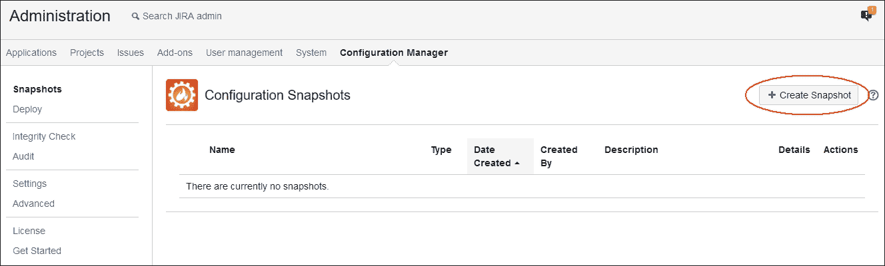

# 第十章 导入和导出数据在 JIRA 中以及迁移配置

JIRA 中存储的数据对公司来说非常关键，因此 JIRA 管理员应确保定期备份数据。事实上，应该制定备份政策。在本章中，我们将讨论如何在 JIRA 中执行定期备份以及这些备份的存储位置。最重要的是，我们还将讨论如何恢复这些备份。

公司中使用了许多其他工具；例如 **Mantis** 和 **Bugzilla** 这样的流行 bug 跟踪器。当您转移到 JIRA 时，如果能够将现有问题从这些工具迁移到 JIRA，将是非常好的事情，但迁移可能是一个复杂的任务。JIRA 自带一些工具，用于从外部工具导入数据；但是，JIRA 还具有一个强大的功能，可以从纯 CSV 文件导入问题。通过适当的规划，可以将任何工具的数据导出为 CSV，并从 CSV 导入到 JIRA。我们还将了解如何使用 **Configuration Manager** 插件来迁移 JIRA 配置，例如问题类型、工作流和其他方案到另一个 JIRA 实例。

所涵盖的主题包括：

+   备份系统

+   使用 CSV 进行外部系统导入

+   使用配置管理器插件迁移 JIRA 配置

# 备份系统

JIRA 管理员应特别注意定期备份数据及其配置。幸运的是，JIRA 自带一个方便的工具用于生成备份。它不仅包含数据（如问题和项目），还包含存储在备份文件中的 JIRA 配置，这意味着当您恢复系统时，所有数据以及用于问题类型和工作流的各种方案也将被恢复。

JIRA UI 中提供的备份系统在有数千个问题时效率并不特别高。因此，推荐的方法是手动备份数据库。关于这种备份方法的详细信息可以在 [`confluence.atlassian.com/display/DOC/Production+Backup+Strategy`](https://confluence.atlassian.com/display/DOC/Production+Backup+Strategy) 找到。

## 生成备份

JIRA 备份工具可用于根据需要执行备份。通常在 JIRA 中进行任何重大配置更改之前，应进行备份。此外，当在 JIRA 中安装新插件时，建议始终进行备份。当然，您应该有一个演示实例，它应该是生产实例的精确副本。您应该首先在演示实例上进行所有测试，但您永远不知道什么时候事情会出错。作为良好的实践，始终在执行任何重大配置更改之前进行备份。

执行以下步骤，使用 JIRA 备份工具在 JIRA 中进行备份：

1.  导航到 **Administration** | **System** | **Backup System**（位于 **IMPORT & EXPORT** 下）：

1.  然后您将看到 **Backup JIRA data** 页面。

1.  指定**文件名**，然后点击**备份**按钮生成备份文件。建议在**文件名**中使用时间戳。

1.  工具将生成备份文件并提供完整的文件路径。你可以将其复制到其他位置：

备份文件存储在 `JIRA HOME` 目录下的 `export` 文件夹中。

### 附件的备份

JIRA 的数据包含问题、项目以及各种配置的详细信息，但也有附加到问题的文件附件。**备份 JIRA 数据** 工具生成一个存储信息的 XML 文件，但它无法备份文件附件。

这些附件存储在 `JIRA HOME` 目录下的 `data\attachments` 文件夹中。如果需要备份文件，应该复制 `attachments` 文件夹。通常，在 JIRA 实例需要迁移到新服务器时会进行此操作。文件附件按项目分文件夹存储，项目密钥即文件夹的名称：

+   附件文件夹的名称是项目密钥，例如，`DPO`

+   文件存储在一个子文件夹中，子文件夹的名称与问题 ID 相同，例如，`DPO-6`

使用这种组织方式，附件文件夹可以轻松恢复。

## 生成自动备份

我们刚刚生成的备份通常是在 JIRA 管理员需要进行一些重要配置更改之前触发的。不过，作为一种良好做法，如果这些备份能够每天自动生成，或者每周生成一次，那就更好了。

JIRA 提供了在设定时间后自动运行特定类的选项。JIRA 默认配置了一些服务，你也可以添加自己的服务。请执行以下步骤：

1.  导航至 **管理员** | **系统** | **服务**（在 **高级** 下）。

1.  安装 JIRA 后，你将获得预配置的**服务**列表：

列表中的第一个服务是**邮件队列服务**，它负责进行定期备份。**调度**是服务自动运行的间隔时间。对于**备份服务**，**调度**是**每 720 分钟**，即 12 小时；这意味着每隔 12 小时，备份将会生成并放置在 `JIRA HOME` 下的 `export` 目录中：


如你在前面的截图中所见，JIRA 服务生成了备份文件，除了 `2014-12-09-backup`，那是我们手动生成的。无论是手动生成还是自动生成，备份文件的格式保持不变。

作为一种良好做法，始终将备份文件及其附件复制到一台单独的服务器上。如果服务器出现故障且备份文件存储在同一台机器上，它们也会丢失。因此，最好将它们复制到单独的服务器上。最好编写脚本来自动化将备份复制到备份服务器的过程。

# 恢复系统工具

现在，你已经学会了如何使用 JIRA 的**备份系统**工具手动生成备份，并依赖 JIRA 服务。以下是这些备份文件对你有用的两种场景：

+   一种情况是当你的服务器崩溃时

+   其次，当你想将 JIRA 实例迁移到一台新机器时

JIRA 提供了**恢复系统**工具；它基本上会擦除现有的数据/配置，并将其替换为备份文件中的数据；因此，使用**恢复系统**工具时必须非常小心。一般来说，总是先在测试环境中执行恢复过程；这也会给你一个机会了解并修复可能遇到的任何错误。

在这个例子中，我们将恢复之前生成的`2014-12-09-backup.zip`备份文件。

对于本练习，你应当在另一台与生成备份时使用的相同版本的机器上安装一个空白的 JIRA 实例。执行以下步骤：

1.  复制存储在`JIRA HOME`目录下`import`文件夹中的备份文件。

1.  转到 **管理** | **系统** | **恢复系统**（在**导入与导出**下）：

1.  输入**文件名**为`2014-12-09-backup.zip`，这是我们之前生成的备份文件。

1.  保持**许可证**字段为空；源实例的许可证详细信息已存储在备份文件中，可以在目标实例中恢复；如果你想使用新的许可证，只有在这种情况下才将其输入此字段。

1.  在**外发邮件**字段中，选择**禁用**。这将确保在恢复过程中不会向任何人发送电子邮件。

1.  点击**恢复**按钮：

1.  恢复过程将开始读取备份文件，并显示恢复进度。整个恢复过程可能需要几分钟，具体取决于备份文件的大小：

1.  一旦恢复过程完成，你将收到一条确认信息：

恢复过程完成后，你可以使用生成备份的实例的登录和密码凭证登录到 JIRA 实例。你当前 JIRA 实例的登录将无法使用，因为所有数据已被清除并被备份文件替代。

恢复后，你可以验证以下内容：

+   问题数量

+   项目列表

+   配置列表

+   用户数量

如果这些内容与你的旧实例和恢复后的实例匹配，则恢复过程成功。

# 项目导入工具

**恢复系统**程序在需要恢复整个实例或将其迁移到另一台服务器时执行，但也可能存在只需要从另一个 JIRA 实例恢复单个项目的情况。

让我们以一家拥有多个 JIRA 实例的公司为例，这些实例被不同的业务单元使用。这些业务单元相互独立工作，拥有不同的团队，并且分布在不同的地理位置。正如你所知道的，现在公司经常进行重组。由于这一重组过程，某些项目需要从一个业务单元转移到另一个业务单元。所有项目代码和文档也需要一起转移。

在这种情况下，我们不能简单地备份一个实例并将其恢复到另一个实例，因为这会清除目标实例中的数据。恢复过程必须仅对选定的项目进行。

Atlassian 了解这种情况，并提供了一个名为**项目导入**的工具，正是用来执行这个操作：

1.  导航至****管理**** | **系统** | **项目导入**（在**导入与导出**下）。

1.  输入你想要执行**项目导入**的备份**文件名**。

1.  将附件复制到`JIRA HOME`下的`import\attachments`目录中；你机器上的确切路径也会显示出来。

1.  点击**下一步**按钮继续：

1.  **项目导入**工具将读取备份文件并显示进度。根据备份文件的大小，可能需要几分钟才能完成：

1.  在下一个屏幕上，将向你展示备份文件中所有项目的列表。

1.  现在，你可以从**备份中的项目**下拉列表中选择你想要导入的项目。

1.  你选择的项目的详细信息也将显示出来。**项目**字段显示项目名称，**Key**字段显示项目关键字，**问题**显示问题数量。

1.  点击**下一步**按钮继续：

1.  备份文件中的项目可能包含一些目标实例中没有的字段。**项目导入**工具将尝试将它们映射到现有字段。在尝试导入操作之前，你需要确保目标实例中已经创建了所有的自定义字段。

1.  如果映射完成，点击**导入**按钮继续：

1.  根据项目的大小，可能需要几分钟才能完成；进度将显示在屏幕上：

1.  导入过程成功后，**项目导入**的结果将显示在屏幕上。

1.  验证结果并点击**确定**按钮：

1.  对所有需要导入的其他项目重复此过程。

**项目导入**过程是一个复杂的程序，必须先在测试实例上执行。请阅读官方文档以了解有关此过程的更多信息：[`confluence.atlassian.com/adminjiraserver071/restoring-a-project-from-backup-802592982.html`](https://confluence.atlassian.com/adminjiraserver071/restoring-a-project-from-backup-802592982.html)。

### 注意

应使用目标 JIRA 实例的相同版本生成备份。

项目配置，如问题类型方案、字段配置、工作流、通知和权限方案，应在目标实例上创建。

项目中使用的自定义字段需要在目标实例上创建。

如果项目中安装并使用了某些插件，请先在目标实例上安装它们；某些插件会创建自定义字段，直到你在目标实例上安装插件，这些自定义字段才会被映射。

# 使用 CSV 的外部系统导入

市场上已经有许多问题跟踪工具可供使用多年。例如 Bugzilla，主要用于错误跟踪。还有另一个流行的工具叫做 Mantis，提供了一套不错的功能，同样用于错误跟踪。那些已经在使用这些工具的公司，如果现在想迁移到 JIRA，可以使用 JIRA 自带的各种导入工具进行数据迁移。

按照以下步骤执行 CSV 导入：

1.  导航到**管理** | **系统** | **外部系统导入**（在**导入与导出**下）。

1.  你将看到各种导入工具的列表，如下图所示：

    ### 提示

    如果你使用的是前面截图中提到的工具，那么可以尝试从现有工具导入数据。还有一些由第三方供应商开发的其他导入工具，可以从 Atlassian Marketplace 下载。你可以试试看。

这些导入工具通常在现有工具没有太多自定义的情况下工作得很好，但大多数情况下并非如此。第一个导入工具叫做**CSV**，它是一个通用工具，可用于将 CSV 文件中的数据导入 JIRA。我们建议先将现有工具中的数据导出为 CSV 文件，然后使用该工具将数据导入 JIRA。

需要导入到 JIRA 的数据可能相当复杂；问题也可能是其他问题的子任务，并且可能需要上传附件。

让我们看看一些可以用于将 CSV 导入 JIRA 的场景。

## 一个简单的 CSV 导入

让我们了解如何执行简单的 CSV 数据导入。首先需要做的是准备要导入到 JIRA 的 CSV 文件。在这次练习中，我们将把问题导入到一个特定的项目中；这些问题将包含如**总结**、**状态**、**日期**等数据，以及一些其他字段。

### 准备 CSV 文件

我们将使用 MS Excel 来准备 CSV 文件，包含以下数据：


如果你现有的工具有直接导出为 CSV 文件的选项，则可以跳过这一步，但我们建议在将数据导入 JIRA 之前先检查一下数据。通常，如果 CSV 文件的格式或数据不正确，CSV 导入将无法正常工作。

从 Excel 文件生成 CSV 文件非常简单。执行以下步骤：

1.  转到**文件** | **另存为** | **文件名：**并选择**保存类型：**为**CSV（逗号分隔）**。如果你没有安装 Microsoft Excel，可以使用 LibreOffice Calc，这是一个开源的 Microsoft Office Excel 替代品：

1.  你也可以打开 CSV 文件验证其格式：

我们的 CSV 文件包含以下字段：

| **CSV 字段** | **目的** |
| --- | --- |
| **Project** | 需要在此字段中指定 JIRA 的项目密钥 |
| **Summary** | 这个字段是必填的，需要在 CSV 文件中指定 |
| **Issue Type** | 这对于指定问题类型很重要 |
| **Status** | 这显示了问题的状态；这些是需要在 JIRA 中存在的工作流状态，且项目工作流应该有将要导入到 CSV 文件中的状态 |
| **Priority** | 这里提到的优先级应该在导入之前存在于 JIRA 中 |
| **Resolution** | 这里提到的解决方案应该在导入之前存在于 JIRA 中 |
| **Assignee** | 这指定了问题的负责人 |
| **Reporter** | 这指定了问题的报告人 |
| **Created** | 这是问题的创建日期 |
| **Resolved** | 这是问题的解决日期 |

### 执行 CSV 导入

一旦你的 CSV 文件准备好，就可以在 JIRA 中执行导入了：

1.  转到**管理** | **系统** | **外部系统导入** | **从逗号分隔值（CSV）导入**（在**导入与导出**下）。

1.  在**文件导入**屏幕的**CSV 源文件**字段中，点击**浏览...**按钮，选择你刚才在机器上准备的 CSV 文件。

1.  一旦你选择了 CSV 文件，**下一步**按钮将被启用：

1.  在**设置**屏幕上，选择**导入到项目**作为**DOPT**，这是我们项目的名称。

1.  验证**日期格式**，它应与 CSV 文件中日期值的格式匹配。

1.  点击**下一步**按钮继续。

1.  在 **Map fields** 屏幕上；我们需要将 CSV 文件中的字段映射到 JIRA 字段。此步骤至关重要，因为在旧系统中，字段名称可能与 JIRA 字段不同，因此在此步骤中将这些字段映射到相应的 JIRA 字段。

1.  点击 **Next** 按钮继续。

1.  在 **Map values** 屏幕上，映射 **Status** 字段的值；实际上，任何字段的值映射都可以执行。在我们的例子中，状态字段的值与 JIRA 中的相同，因此点击 **Begin Import** 按钮。

1.  最终，你将得到一个确认，表明问题已成功导入：

如果在 CSV 导入过程中遇到任何错误，通常是由于 CSV 格式的问题。请仔细阅读错误信息并修正这些问题。如前所述，CSV 导入需要先在测试环境中进行。

我们刚才执行的导入是直接的，但也可以导入具有复杂性的数据显示。

## 使用 CSV 文件创建子任务

有时问题需要作为子任务导入。在这种情况下，请使用以下截图所示的格式：


请注意这两列，即 **Issue ID** 和 **Parent ID**；为父任务的 **Issue ID** 列填入随机数字，并将该随机数字输入到所有子任务的 **Parent ID** 列中。

**Issue ID** 和 **Parent ID** 需要分别映射到 **Sub-Tasks** | **Issue Id** 和 **Sub-Tasks** | **Parent Id**，如以下截图所示：


按照通常的方式继续进行 CSV 导入，子任务将被创建。

## 使用 CSV 文件上传附件

通常需要将文件附加到需要导入到 JIRA 的问题上。

执行以下步骤：

1.  在 `JIRA HOME/import/attachments` 目录中创建一个 `csvimport` 文件夹。因此，最终路径应如下所示：

    ```
            <JIRA_Home>/import/attachments/csvimport/ 

    ```

1.  CSV JIRA 导入可以使用 `FILE` 协议读取特定目录。它用于访问存储在同一台计算机上的文件；需要指定文件的完整路径。

1.  在 CSV 文件中添加一个名为 `Attachments` 的列，并按照以下格式输入位置：

    ```
            file://csvimport/file1.pdf 

    ```

1.  最终文件应类似于以下截图：

不要忘记将这个新的`Attachments`列映射到 **Attachments** JIRA 字段；其余的过程保持不变。

你的问题可能会有多个附件，而不仅仅是一个。在这种情况下，为每个附件添加一个额外的列。同样，其他具有多个值的字段也可以通过简单地添加多个列进行导入。

## 更新现有问题

CSV 导入工具还有另一个非常好的用途。到目前为止，我们已经看到如何将数据导入 JIRA，但有时需要修改现有的工作项。例如，如果你想为某个项目的工作项添加一个新的修复版本，或者如果你想批量解决某些问题；在这种情况下，可以使用 CSV 导入工具。

在 CSV 文件中，只需添加一个 `问题键` 列，并添加需要更新的 JIRA 字段作为列。如果 CSV 工具找到问题键，它将更新该问题的其他列。

然而，**问题导航器**中也有一个 **批量变更** 工具，它完成相同的工作。你可以根据自己的舒适度和使用场景选择适合你的方法。我们建议使用 **批量变更** 工具，因为它比 CSV 导入工具更为简单。

# 使用配置管理器插件迁移 JIRA 配置

我们已经讨论了如何从备份文件完全恢复 JIRA 实例，如何恢复特定的项目，以及如何使用 JIRA 中的重要数据的 CSV 导入功能。这些工具非常重要，它们确实让 JIRA 管理员的工作变得更轻松。管理员可以直接在 JIRA 用户界面中执行这些操作。**项目导入**工具和 CSV 导入用于将一个或多个项目从一个 JIRA 实例迁移到另一个实例，但目标实例必须已具备所需的配置，否则这些工具将无法工作。例如，如果源实例中有一个带有自定义工作流状态和一些自定义字段的项目，那么目标实例中应已有与之完全相同的工作流和自定义字段配置。重新创建这些配置和方案可能是一个耗时且容易出错的过程。

在各类组织中，通常会有一个 JIRA 的测试环境或暂存服务器，所有新的配置都会先在这里进行测试，然后再推广到生产环境。目前，还没有一种方法可以选择性地将配置从一个实例迁移到另一个实例。必须在目标实例上手动完成此操作。

配置管理器是一个完成此工作的插件。使用该插件，项目特定的配置可以从一个实例迁移到另一个实例。

## 生成快照

以下步骤将指导你完成生成可以迁移并部署到目标 JIRA 实例的项目特定快照的过程：

1.  进入 **管理** | **插件** | **查找新插件**，在 **ATLASSIAN MARKETPLACE** 下，在搜索框中输入 `Configuration Manager`，然后按下 *Enter* 键：

1.  **JIRA 配置管理器**将会出现。点击 **免费试用** 按钮，在你的实例上安装该插件。在随之弹出的窗口中，点击 **接受** 按钮。

1.  最后，你将被要求输入你的 Atlassian 帐号，以生成试用许可证。

1.  安装完成后，进入**管理** | **配置管理器** | **快照**。在此屏幕上，你可以生成项目配置的快照。点击**创建快照**按钮：

1.  在**选择快照类型**屏幕中，确保右上角选择了第二个标签**项目配置**。输入**名称**，从下拉菜单中选择一个或多个**项目**，勾选复选框**包含至少一个问题中有值的自定义字段**，并输入有意义的描述。点击**下一步**按钮继续：

1.  在**选择过滤器**屏幕中，选择在此项目中使用的过滤器。如果你的项目中也有敏捷看板，你需要选择在项目中使用的过滤器，因为敏捷看板依赖于这些过滤器。点击**下一步**按钮继续：

1.  在**选择敏捷看板**屏幕中，选择你希望迁移的 Scrum 或 Kanban 看板。确保与你想要迁移的看板相关的过滤器已经在上一步中选择。点击**下一步**按钮继续：

1.  在**预览快照**屏幕中，检查即将迁移的项目，并点击**创建**按钮生成快照：

1.  最终，快照将被生成。你可以通过点击与相应快照相关的**操作**栏下的齿轮图标，然后点击**下载**来下载快照文件：

1.  将快照文件保存在你的计算机上，文件名为`Demo Project Snapshot.zip`。

## 部署快照

以下步骤将指导你如何在源 JIRA 实例上部署你所生成的快照：

1.  进入**管理** | **配置管理器** | **部署**。在此屏幕中，你可以生成项目配置的快照。点击右上角的**从快照文件**标签。然后，点击**浏览**按钮，选择你在生成快照后保存在计算机上的`Demo Project Snapshot.zip`文件：

1.  一旦快照文件上传到目标 JIRA 服务器，它将被列出。点击与你的快照文件相关的**操作**栏下的**部署**链接。

1.  在**选择部署模式**屏幕中，选择右上角的**新项目**标签。输入项目的**名称**和**键**。这些也会根据快照文件中的旧项目详细信息自动建议。点击**下一步**按钮继续：

1.  在**分析配置变更**界面，查看将被添加、修改或移除的目标实例配置。请在此界面花费相当的时间，以了解现有配置对目标 JIRA 实例的影响。按下**下一步**按钮继续：

1.  在**迁移配置变更**界面，配置管理器告诉我们无需进行问题数据迁移，因此按下**下一步**按钮继续：

1.  在**部署**界面，只需按下**部署**按钮即可开始部署：

1.  最后，您将在**快照部署**界面看到确认信息：

配置管理器插件非常强大。它可以迁移所有与项目相关的配置，如问题类型、工作流、自定义字段、角色、权限和通知方案。我们在本节中展示的简单示例应该能让您充分理解这个有用插件的使用。

在通过配置管理器插件迁移配置并创建空白项目后，您现在可以使用我们在本章早些时候讨论的**项目导入**工具进行数据迁移。这个插件可以节省数百个工时，避免手动重新创建配置。

# 总结

在本章中，您学习了如何将数据导入和导出到 JIRA。我们首先了解了如何备份整个 JIRA 实例，您还学习了如何从备份中恢复实例。我们还讨论了如何从备份文件中导入选定的项目。我们花费了相当的时间来理解如何使用 CSV 文件将数据迁移到 JIRA，CSV 文件提供了在导入简单数据以及包含子任务和附件的复杂数据时的灵活性。最后，我们还了解了如何使用配置管理器插件，轻松地将配置从一个 JIRA 实例迁移到另一个实例。

在下一章中，我们将了解如何使用 Atlassian 提供的强大插件**JIRA Agile**在 JIRA 中实施 Scrum 和 Kanban 方法论，用于敏捷追踪。本章将涵盖这两种技术的两种场景。我们将讨论如何设置和配置看板，最重要的是如何分析报告。您还将通过实际示例学习这两种敏捷技术和基本概念。
