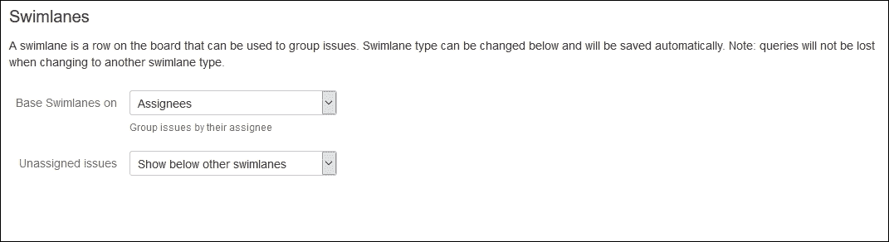
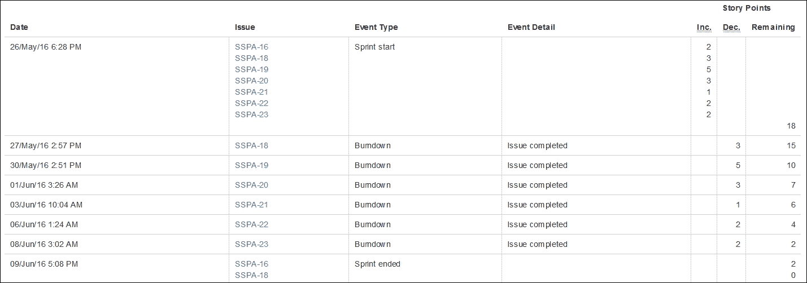

# 第十一章：在 JIRA Software 中使用敏捷看板

在本章中，我们将了解如何在 JIRA 中实现两种敏捷方法——**Scrum** 和 **Kanban**，用于敏捷跟踪。将介绍 **JIRA Agile** 的关键概念，包括创建、规划和管理任务。我们还将讨论如何设置和配置看板。最重要的是，我们将讨论如何分析报告。Scrum Master 和项目经理将向你提供如何使用 JIRA Agile 的见解，这将帮助你按照敏捷概念管理工作。我们将通过实际案例来理解 Scrum 和 Kanban 看板。

涵盖的主题是：

+   产品概览 — JIRA Software

+   Scrum 看板

+   Kanban 看板

+   使用看板管理多个团队和项目

# 产品概览 – JIRA Software

到目前为止，我们已经看到 JIRA 的各个方面，例如自定义设置，同时也了解了如何安装新的插件来扩展 JIRA 的功能。许多组织使用基于敏捷的方法来进行项目管理，而直到 6.x 版本时，有一个名为 JIRA Agile 的流行插件需要单独购买。然而，从 7.x 版本开始，JIRA 被拆分为三个应用程序——JIRA Core、JIRA Software 和 JIRA Service Desk。我们也在 第一章 *规划你的 JIRA 安装* 中讨论了这一点。

本书中讨论的自定义和配置适用于 JIRA Core、JIRA Software 和 JIRA Service Desk。在 第十五章 *实现 JIRA Service Desk* 中，我们将了解如何使用它来管理支持项目，但在本章中，我们将重点讨论敏捷看板，这个功能包含在你的 JIRA Software 应用程序中。

JIRA Software 提供了实现敏捷技术的强大功能，无论你是已经熟悉敏捷概念，还是完全新接触敏捷，这个插件都能让你的敏捷之旅不仅轻松，而且精彩。

## 安装 JIRA Software 应用程序

如果你已经安装了 JIRA Software 应用程序，那么你无需做任何其他操作——你的实例已经具备创建敏捷看板的能力。然而，如果你只使用 JIRA Core 或 JIRA Service Desk 应用程序，则需要安装 JIRA Software 应用程序。

1.  访问以下网址，从 [`marketplace.atlassian.com/plugins/com.atlassian.jira.jira-software-application/versions`](https://marketplace.atlassian.com/plugins/com.atlassian.jira.jira-software-application/versions) 下载最新版本的 JIRA Software `jira-software-application.obr` 文件到你的电脑上。

1.  前往 **管理** | **应用程序** | **版本与许可证**，然后点击右上角的 **上传应用程序** 链接。在弹出的窗口中，上传你刚刚下载的 `jira-software-application.obr` 文件：

1.  这将安装 JIRA 软件应用程序。现在，你应该访问以下网址为应用程序生成评估许可证：[`my.atlassian.com/`](http://my.atlassian.com/)。

1.  现在你应该能够在你的实例中创建敏捷看板。你会注意到顶部有一个新的菜单项，**Boards**：

1.  现在，前往 **Boards** | **查看所有看板**，如前面的截图所示。

1.  在弹出的窗口中，你将看到创建 Scrum 看板或 Kanban 看板的选项。我们将逐一创建这两种看板。

在 JIRA 软件中，你可以创建 Scrum 和 Kanban 看板；两者都用于特定的目的。

# Scrum 看板

Scrum 是一种在复杂项目中使用的敏捷技术。这种技术广泛应用于软件开发项目，但它也可以轻松应用于任何过程。要了解更多关于 Scrum 技术的信息，请参考 [`www.scrumalliance.org/why-scrum`](https://www.scrumalliance.org/why-scrum)。

Scrum 技术侧重于将需求分解为小的可执行任务。然后，创建一个优先级排序的任务列表（称为 **sprint**），这些任务可以在一到四周的时间内完成。该 sprint 的目标是创建一个可交付的特性或产品，而不仅仅是一个原型。可以创建更多的 sprint 来完成整个需求并完成产品或项目。尚未完成的任务保存在一个名为 **backlog** 的列表中。

JIRA Agile 让你通过 Scrum 看板在你的流程中实现 Scrum 技术。

## 敏捷项目设置与 JIRA Agile 配置基础

可以从任何包含预定义问题的现有 JIRA 项目中创建 Scrum 看板；也可以从一个新的空白项目中创建 Scrum 看板。此外，如果你想了解 JIRA Agile 是如何工作的，可以创建一个预填充了示例数据的示例项目。按照以下步骤操作：

1.  在导航菜单中，点击 **Boards** | **查看所有看板** | **创建看板**，然后在 **创建敏捷看板** 弹出窗口中，点击 **使用示例数据创建 Scrum 看板**：

    我们正在创建一个示例项目，其中包含虚拟数据。这将帮助我们了解 Scrum 看板的所有功能。

    

1.  输入 **项目名称**、**项目键** 和 **项目负责人**，然后点击 **创建看板** 按钮。

我们刚刚创建了一个带有示例数据的项目，并且包含了一个 Scrum 看板。你也可以创建一个 Scrum 看板并选择你现有的项目来填充它。

## 使用故事点填充、排序和估算待办事项

在新创建的项目中，我们有一个默认显示的 Scrum 看板，你现在可以看到**待办事项**窗口中待处理的问题列表，也就是那些尚未解决的问题，以及一个示例冲刺：

**待办事项**包含了在项目或看板中待处理的问题。这些问题尚未被规划执行。在项目侧边栏中，第一个标签是**待办事项**，紧随其后的是**活跃冲刺**。一旦冲刺开始，你就可以通过**活跃冲刺**标签来管理和处理它。

示例 Scrum 看板已经包含了一个冲刺，里面有一定顺序的特定问题。冲刺是一个时间段，在这个时间段内，特定的计划活动需要完成。Scrum Master 或项目经理可以定义问题完成的顺序。这个顺序也被称为**排序**，团队在处理这些问题时需要遵循这个顺序。排序非常重要，因为有些任务必须在其他任务开始之前完成。

在 Scrum 方法论中，个别任务的估算不仅基于所花费的时间量，还基于任务的复杂度。例如，两个任务的时间估算都是一天，但第一个任务执行起来很复杂，比如这是团队第一次执行这个任务。复杂度通过故事点来衡量。故事点可以是 1 到 10 之间的任何数字，或者是斐波那契数列中的任何数字，即 1, 1, 2, 3, 5, 8, 13, 21 等。数字越大，任务越复杂。

Scrum Master 可以为冲刺中的问题分配故事点，尽管每个问题不一定都必须有故事点。但是，拥有故事点能让团队对问题的复杂度有一个大致的了解。

## 规划和创建冲刺

示例 Scrum 看板已经包含一个正在进行的冲刺，让我们来创建一个新的冲刺。JIRA 软件允许你即使在活跃冲刺没有完成的情况下创建另一个冲刺；但是，新冲刺不能开始。可以在 JIRA Agile 中启用**并行冲刺**功能，这样我们就可以同时进行多个冲刺。

冲刺的规划必须在 Scrum 看板的**规划**模式下完成。执行以下步骤来同时进行多个冲刺：

1.  转到**管理** | **应用** | **JIRA 软件配置**（在**JIRA SOFTWARE**下）：

1.  勾选**并行冲刺**的复选框。

    就是这样，回到你的看板，开始规划你的下一个冲刺。

1.  返回项目，在**待办事项**标签页中，点击位于问题待办事项前的**创建冲刺**按钮：

1.  一个空的冲刺将被创建。

1.  现在，开始将问题从**待办事项**拖到你的示例冲刺（在我们的例子中是**示例冲刺 3**）：

1.  一旦你将所有问题放入冲刺中，你可以在冲刺内重新排序它们并定义它们的优先级，即哪些问题需要首先执行，哪些其次执行，依此类推。

1.  可选地，你还可以创建史诗来将多个故事组合在一起。史诗只是一个大型的故事。创建史诗非常简单。在冲刺的左侧，点击**创建史诗**链接：

1.  在弹出窗口中，输入**史诗名称**和**摘要**。点击**创建**按钮继续：

1.  你可以创建更多的史诗；最后，将问题从冲刺拖到史诗中。这将把问题分配到这些史诗中：

1.  在将问题分配到史诗之后，你可以开始冲刺。点击右上角的**开始冲刺**链接。在弹出窗口中，输入**冲刺名称**，选择**持续时间**，**开始日期**和**结束日期**会自动更新：

请注意，在你没有规划好问题、排列它们并估算故事点之前，冲刺永远不会开始。一旦你开始冲刺，你将被带到 Scrum 看板中的**活跃冲刺**标签页。在这里，你将看到冲刺中所有问题的列表，分为三列，分别是**待办**、**进行中**、**已完成**：

在**活跃冲刺**标签页中，单个指派人可以将问题拖到**进行中**列或**已完成**列。这类似于进行工作流转移。

在**活跃冲刺**中，有很多自定义选项可以使其更加高效。

## 配置泳道、卡片颜色、编辑卡片字段和快速过滤器

**活跃冲刺**是冲刺开始后团队成员在看板上监控的部分。当参与冲刺的人数过多时，可能会让他们很难找到自己正在处理的问题。我们来看看 Scrum 看板的一些自定义设置。

### 泳道

在**工作**模式中出现的问题可以被归类在一起，这样对应的成员就能更容易地在看板上找到这些问题。此外，当问题从一个列拖到另一个列时，它们只能在自己的分组内拖动，这种分组叫做泳道。默认的泳道是**故事**问题类型。让我们来修改这个：

1.  导航至**面板** | **配置** | **泳道**（在**配置**下）：

1.  从下拉列表中选择**受让人**作为**泳道基础**，并将**未分配的任务**设置为**显示在其他泳道下方**：

泳道也可以基于史诗（epic），并且可以完全没有泳道。

### 卡片颜色

出现在**活动冲刺**中的单个任务显示在一个矩形框中，称为卡片。这些卡片的颜色可以根据任务的**类型**、**优先级**、**受让人**或**查询条件**来改变。卡片颜色的默认选项是任务类型；让我们将其更改为任务优先级：

1.  前往**面板** | **配置** | **卡片颜色**（在**配置**下）。

1.  在**基于颜色的选择**中，从下拉列表中选择**优先级**：

点击颜色框，将颜色更改为你选择的颜色。

### 卡片字段

**待办事项**和**活动冲刺**中的卡片显示**任务 ID**和**任务摘要**，但最多可以添加三个附加字段。按照以下步骤操作：

1.  导航至**面板** | **配置** | **卡片布局**（在**配置**下）。

1.  这三个附加字段可以在**待办事项**和**活动冲刺**中添加。我们将在**活动冲刺**中添加一个额外字段。从**字段名称**下拉列表中选择**优先级**，然后点击右侧的**添加**按钮。

总共可以添加三个附加字段，这些字段可以显示在卡片上。此功能的提供是为了让团队成员能够查看提供额外信息的字段。

### 快速筛选器

我们已经看到如何自定义泳道以对多个任务进行分组。假设在当前活动的冲刺中，有 20 个任务分配给你，但其中有一些任务是最高优先级的。在这种情况下，如果能够快速筛选出分配给你的任务以及今天到期的任务，那将非常方便。按照以下步骤操作：

1.  导航至**面板** | **配置** | **快速筛选器**（在**配置**下）。

1.  在**快速筛选器名称**中输入`最高优先级`。在**JQL**列中输入`priority = Highest`作为查询条件，然后点击**添加**按钮：

我们已经在面板上做了一些自定义设置。现在，让我们回到**活动冲刺**。

现在，你可以看到在顶部新增了一个名为**最高优先级**的快速筛选器；点击此链接，面板将只显示优先级为最高的任务。注意，泳道现在是基于任务的**受让人**来划分的。任务的优先级现在已添加到卡片上。同时，卡片的颜色也会根据任务的优先级进行调整。

这些自定义设置帮助团队高效工作，使他们不需要花费太多时间查找相关信息。

## 燃尽图和速度图

你已经学会了如何规划、估算和启动冲刺，以及在看板中执行任务时的各种配置。我们已经检查了团队如何查看他们在冲刺中的任务。现在，是时候监控团队的进度了。有两个报告是至关重要的——一个是**燃尽图**。这个图表清晰地展示了冲刺当前的状态。第二个是**速度图**。这个图表有助于了解团队的处理能力，具体来说，就是它能处理多少工作量。这两个报告帮助 Scrum Master 监控项目的进展。让我们一起看看这两个报告。

### 燃尽图

在规划冲刺时，我们主要做了两件重要的事情。首先，我们确定了需要完成问题的优先顺序。其次，我们对问题进行了故事点估算。这些我们最初规划的故事点，让工作人员对任务的复杂性有一个大致了解。现在，冲刺一开始，基准线就会在开始日期和结束日期之间形成。这条基准线在图表中以灰色线条显示，它描绘了从冲刺开始日期到结束日期执行问题的理想情况。当问题解决时，它的故事点会被消耗掉，整个冲刺的剩余故事点减少。

导航到项目侧边栏 **报告** | **燃尽图**（在**敏捷**下）：

当团队开始处理问题时，另一条红色的线开始跟随基准线。通过查看这个图表，整个团队可以轻松判断他们是否在正轨上。如果**剩余值**的线进展在基准线**指导线**之上，那么这表明故事点消耗得较慢，最终，冲刺中的所有问题将无法完成。

紧接着燃尽图，显示了每个问题的详细信息：

在这个表格中，你可以看到冲刺开始时有多少个问题。随着问题的解决，它们的故事点会从冲刺的总故事点中扣除。总故事点和剩余故事点会展示给用户。

让我们再看一遍燃尽图，并聚焦于图表的末尾：

从这个燃尽图中可以清楚地看出，冲刺结束时，并非所有的故事点都已燃尽；这些未完成的问题将在冲刺完成后重新加入待办事项列表。

### 速度图

每个冲刺开始时都会有一个总的故事点数。理想情况下，冲刺团队应当完成所有这些故事点。现实中，并不是每次冲刺都能在结束前完成所有任务。Scrum 大师的主要职责之一是确保团队有足够的故事点可以完成，不多也不少。然而，在冲刺开始时，估算团队能完成的故事点数并不容易。速度图简单地显示了计划的故事点数与团队实际完成的故事点数之间的对比。这个对比会展示过去几次冲刺的数据，以便计算团队的平均容量，这就是团队的工作能力。

导航到项目侧边栏**Reports** | **Velocity**（在**Agile**下）：

这张图表清楚地显示了团队在之前的冲刺中完成的故事点。如果你计算出团队至今能完成的所有故事点的平均值，你就能了解团队的工作容量。这有助于 Scrum 大师为下一个冲刺做出足够资源的规划。

# 看板

我们已经讨论过 Scrum 方法论，它广泛应用于软件开发项目中，在这些项目中，需求被拆解成较小的任务，使用故事点进行估算，最后由 Scrum 大师或产品经理进行规划。Scrum 技术适用于任何需要规划的流程，但也有许多情况，团队会根据需要持续进行工作。一个典型的应用场景是客户支持项目，其中一定数量的人员负责处理公司为特定产品或项目提出的问题。通常，这些支持问题需要立即响应，并且不需要详细的规划。

在这种情况下，待处理问题的整体可视化非常重要。看板没有像 Scrum 看板那样的**Plan**模式。它只有**Work**模式，类似于 Scrum 看板。

## 设置看板

可以使用现有的项目或过滤器创建看板。为了了解看板技术在 JIRA 中的运作方式，可以创建一个示例看板和项目。请按以下步骤操作：

1.  在导航菜单中，点击**Boards** | **View All Boards** | **Create board**，然后在**Create an Agile board**弹窗中，点击**Create a Kanban board with sample data**：

1.  输入**项目名称**、**项目关键字**、**项目负责人**，然后点击**Create board**按钮。

正如你会注意到的，**活动冲刺**标签页在**看板**中是不存在的。团队只能看到**看板**。这个看板与 Scrum 看板非常相似，你还可以根据指派人配置泳道；默认情况下，Kanban 看板中的泳道是配置为使用`priority = Highest`查询。这意味着应该立即解决的问题会显示在最上面。

被指派这些问题的人可以将问题从一个列移到另一个列。这些列表示工作流状态。我们为 Scrum 看板所做的大部分配置也可以在 Kanban 看板上进行；让我们执行一些我们在 Scrum 看板中没有检查的配置。

## 列约束

当一个团队处理支持问题时，尽快解决问题是很重要的。通常，公司会与客户签署**服务水平协议**（**SLA**），即需要就解决时间达成一致。在这种情况下，整个团队应该了解他们需要处理的所有问题。例如，如果可用的支持人员较少，那么这些人能在某个时间点处理的问题数量是有限的。在示例 Kanban 看板中，你会注意到，**进行中**列在有多个问题时会变红。

假设你想在待办事项中有超过四个问题时提醒团队：

1.  导航到**看板** | **配置** | **列**（在**配置**下）。

1.  在**列管理**中，首先选择**列约束**为**问题数量**。如前所示的截图所示，在**待办事项**部分输入问题的最大数量。

1.  现在，在你的示例项目中再创建一个问题，以便你的待办事项中有超过四个问题。

1.  返回你的 Kanban 看板并检查**待办事项**列：

剩余的配置与我们为 Scrum 所做的完全相同。你可以配置泳道、添加快速筛选器，并在卡片布局中添加一些额外的字段。配置这些的过程已经在 Scrum 部分讨论过了，Kanban 看板也是相同的。

# 使用看板管理多个团队和项目

我们为理解 Scrum 和 Kanban 技术而创建的示例项目和看板只使用了一个项目，但 JIRA 软件看板也可以配置为使用多个项目。

如果你的团队成员在为同一个客户处理不同的项目，那么从一个看板管理工作会更有意义。Scrum 和 Kanban 看板可以配置为处理来自一个、两个或多个项目的问题。执行以下步骤以从一个看板管理工作：

1.  在导航菜单中，点击**看板** | **查看所有看板** | **创建看板**，在**创建敏捷看板**的弹窗中，点击**创建 Scrum 看板**按钮或**创建 Kanban 看板**按钮。

1.  在弹出窗口中，您可以选择创建一个新项目并附带新看板，或者从筛选器中创建一个看板，但我们可以选择第二个选项，即**从现有项目创建看板**，然后点击**下一步**按钮：

1.  在下一屏幕中，输入**看板名称**并选择多个**项目**。点击**创建看板**完成：

1.  您新创建的看板现在将包含您选择的所有项目中的问题。

现在可以将多个项目中的问题添加到 Scrum 看板的冲刺中，或者它们将出现在 Kanban 待办事项中，您的团队可以进行处理。

# 摘要

在本章中，您学习了如何使用软件应用程序实施 Scrum 和 Kanban 敏捷方法。我们理解了如何使用这两种看板，并学习了可以在其中执行的各种配置。JIRA 软件既可以作为独立实例使用，也可以作为应用程序安装在现有的 JIRA Core 应用程序中。

在下一章中，我们将讨论 Groovy Script Runner，它是一个非常棒的附加组件，用于在工作流中执行复杂的自定义操作，访问强大的 JQL 功能，并运行可以供 JIRA 管理员用来高效维护实例的各种脚本。
