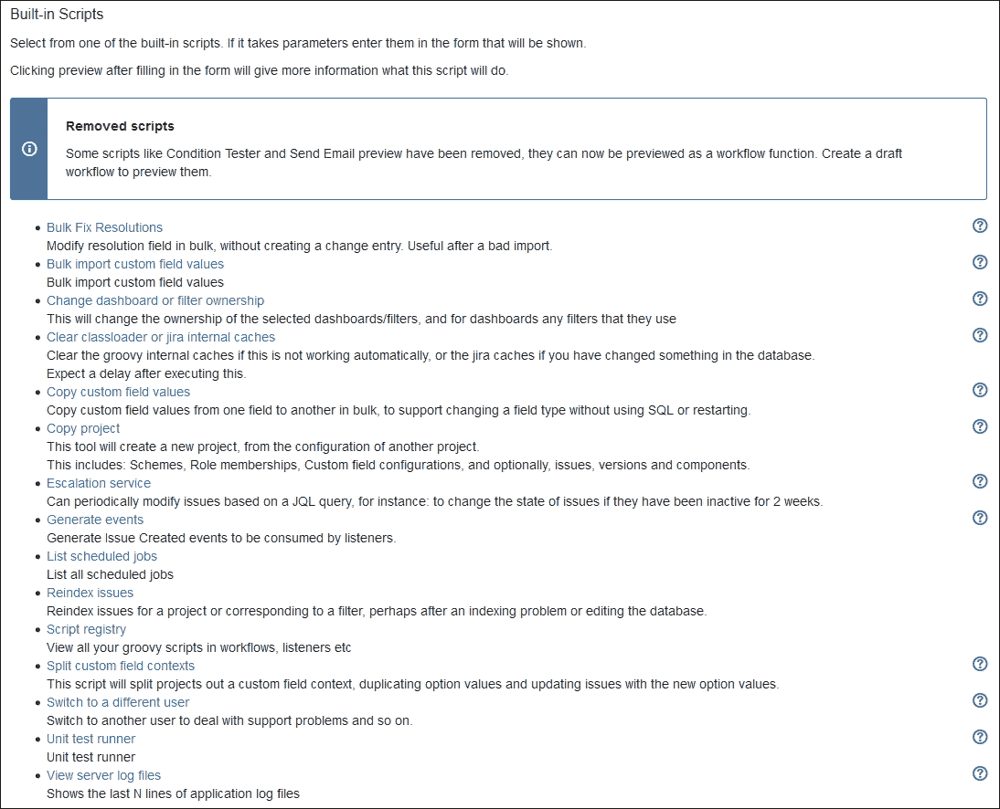
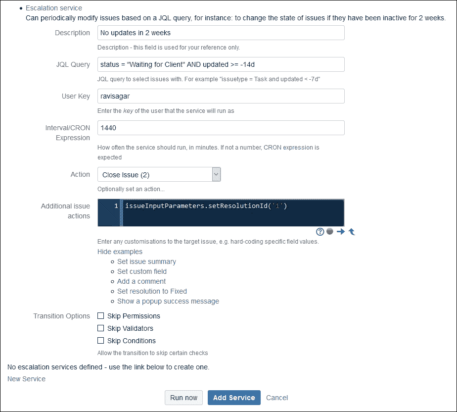
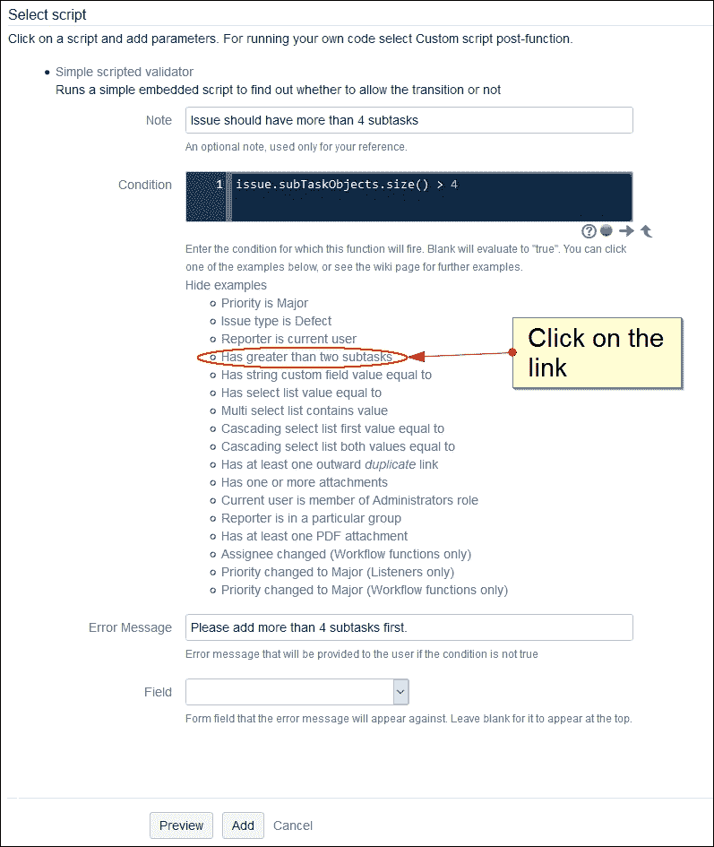

# 第十二章. 使用 ScriptRunner 和 CLI 附加组件进行 JIRA 管理

当使用 JIRA 实现一个包含大量条件、验证和工作流的复杂用例时，有些配置是现有功能无法完成的。例如，你可能希望在工作流转换后自动计算自定义字段的值。使用**ScriptRunner**插件，许多此类高级配置都可以实现。它内置了各种管理脚本，赋予管理员强大的权限来管理他们的实例。在本章中，我们将讨论 ScriptRunner 附加组件，以及 JIRA **命令行界面**（**CLI**）附加组件，以便从命令行执行各种 JIRA 功能。

我们将讨论以下主题：

+   安装 ScriptRunner

+   安装 CLI

# 安装 ScriptRunner

和其他任何附加组件一样，ScriptRunner 可以从 JIRA 管理界面进行安装。请按照以下步骤在你的 JIRA 实例中安装 ScriptRunner：

1.  导航到 **管理** | **附加组件** | **查找新附加组件**（在**ATLASSIAN MARKETPLACE**下）。

1.  在搜索框中输入`ScriptRunner`并按*回车*键。ScriptRunner 附加组件将在搜索结果列表中显示：

1.  点击**免费试用**按钮。然后，在**接受条款和协议**的弹窗中点击**接受**按钮，ScriptRunner 附加组件将开始下载：

1.  然后，ScriptRunner 将在你的实例中下载并安装。最后，你将被要求输入你的 Atlassian 账户，以生成 ScriptRunner 的试用许可证。

1.  在弹出的确认安装附加组件的窗口中，点击右下角的**关闭**链接：

ScriptRunner 现在将被安装到你的 JIRA 实例中。

## 内置的管理脚本

ScriptRunner 附加组件允许用户编写和运行自己的脚本。它内置了大量不错的脚本，使得 JIRA 管理员能够执行许多其他功能，这些功能使用现有的 JIRA 特性无法完成，或者从 UI 中根本无法做到。让我们来看看这些脚本中的一些。

### 访问内置脚本

要访问随 ScriptRunner 附加组件提供的脚本，请执行以下步骤：

1.  导航到 **管理** | **附加组件** | **内置脚本**（在**SCRIPTRUNNER**下）。

1.  在本节中，可以找到所有**内置脚本**的列表：

1.  点击这些链接中的任何一个来运行该特定的内置脚本。这将进一步要求你输入与该脚本相关的参数。

让我们来看看这些内置脚本中的一些。

#### 复制项目

只有 JIRA 管理员有权限在 JIRA 中创建项目（并更改配置）。每当需要在 JIRA 中新增项目时，管理员需要手动创建项目并更改它们的方案。这不是一项困难的任务，通常只需 10 分钟，但有时需要创建十个项目，而手动创建这些项目可能需要几个小时。

ScriptRunner 内置了一个脚本来复制项目及其配置，是否包含问题都可以。执行以下步骤：

1.  点击**复制项目**链接：

1.  在下一个屏幕上，选择**光标**作为**源项目**，输入**目标项目密钥**和**目标项目名称**。

1.  如果你希望同时复制项目版本和项目组件，请勾选**复制版本**和**复制组件**复选框。

1.  点击**运行**按钮以启动**复制项目**脚本：

完成后，屏幕底部会显示一条消息，表示项目已被复制，并提供到新项目的链接。如果你检查新的复制项目，会发现它具有源项目的所有配置。这个工具运行时间不到一分钟，JIRA 管理员使用它可以节省大量时间。

#### 升级服务

这是一个出色的内置脚本，可以帮助 JIRA 管理员对特定的一组问题执行周期性操作。以支持票据配置为例，我们在项目中有一个名为**等待客户端**的工作流状态。它用于表示需要从客户那里获取更多信息才能继续处理票据。如果票据在过去两周内没有更新，这些问题需要自动解决：

1.  点击**升级服务**：

1.  点击**新建服务**以创建一个新服务：

1.  输入`2 周内没有更新`作为**描述**。

1.  在**JQL 查询**中，输入`status="等待客户端" AND updated >= -14d`。

1.  输入你的**用户密钥**并指定**间隔/CRON 表达式**为`1440`，即 24 小时。在**操作**下拉菜单中，将显示所有实例中所有项目的工作流状态。根据你的项目选择你要执行的工作流转换。例如，你可以选择**关闭问题（2）**。

    ### 注意

    由于我们想要关闭符合 JQL 查询标准的问题，在**额外的任务操作**字段中，输入代码`issueInputParameters.setResolutionId('1')`。

    你也可以通过点击**展开示例**并选择**将解析设置为固定**链接来执行此操作。

1.  点击**添加服务**按钮以保存此服务：


现在，我们已经添加了一项服务，它将在每 24 小时后运行，并解决过去 14 天内未更新的问题，即两周内未更新的问题。

#### 切换到不同的用户

想象一下，当用户在 JIRA 中报告某个问题时，作为 JIRA 管理员，您需要使用他们的 ID 登录以了解该用户可能面临的问题。您可以要求该用户提供密码，或者创建一个具有相同权限的相似用户。相比之下，是否更好能够在不询问密码的情况下，使用该用户的用户名直接登录 JIRA？有一个内置脚本可以实现这一点：

1.  点击**切换到不同的用户**。

1.  输入用户的**用户 ID**并点击**运行**按钮：

1.  点击屏幕底部出现的**这里**链接。然后，您将以不同用户身份登录：

这个脚本是我最喜欢的之一，因为我可以使用任何用户名登录，而无需询问用户的密码。这也节省了大量时间。

## 使用条件、验证器和后置功能修改 JIRA 工作流

ScriptRunner 插件的最佳部分是它在 JIRA 工作流中带来的额外功能。开箱即用，它提供了各种可以在工作流中配置的条件、验证器和后置功能，但其功能有限。ScriptRunner 只是为您提供了更多选项，您可以在工作流中控制它们。我们来看一下这些选项。

### 条件

ScriptRunner 带来了一组额外的条件，您可以将其添加到工作流中；它让您对许多事项拥有惊人的控制能力，这在之前是无法实现的。执行以下步骤：

1.  修改您选择的工作流。对于任何过渡，导航到**条件**标签页，然后点击**添加条件**链接。

1.  您将找到一个新的条件，叫做**脚本条件**；只需选择它并点击**添加**按钮：

1.  在下一个屏幕中，您将看到可以添加为工作流条件的脚本列表：

让我们讨论一些这些脚本。

#### 所有子任务必须被解决

如果您希望某个问题的所有子任务都以特定的解决方案解决，可以添加以下条件：


只需选择您希望子任务在移至**已解决**状态后具有的**解决方案**，然后点击**添加**按钮。

#### 如果此查询匹配 JQL 查询，则允许过渡

在执行工作流过渡时，您可以在工作流条件中使用自定义 JQL，并仅在该 JQL 返回您要过渡的问题时才允许过渡：


例如，如果你希望转换仅在问题的指派人是当前登录用户，并且问题的到期日期是今天时发生，在**JQL 查询**字段中添加`assignee = currentUser() and due = now()`查询，然后点击**添加**按钮。你还可以选择输入特定的问题 ID 以预览此条件。

#### 检查问题是否曾处于某个状态

工作流可以有多个状态，并且它们之间可以有多个转换。一个工作流状态可以有多个转换。如果你希望转换只发生在特定状态下，可以添加以下条件：


只需从下拉列表中选择**进行中**作为**前一个状态**，并检查这个状态是否必须是**立即之前的状态**，如果可以是任何其他先前的状态，请取消选中此选项，然后点击**添加**按钮。

#### 简单的脚本条件

ScriptRunner 有一些现成的简单脚本，可以快速添加为条件：


只需点击任何示例链接，它就可以作为条件添加。例如，我添加了一个条件，用来检查某个问题附件是否是 PDF 文件。点击**添加**按钮继续。

### 验证器

就像附加条件一样，ScriptRunner 提供了一些额外的验证器，你可以将其添加到工作流中；它让你对很多以前无法实现的事情有了惊人的控制力。执行以下步骤：

1.  修改你选择的工作流，并在任何转换中，导航到**验证器**标签页，然后点击**添加验证器**按钮。

1.  你会看到一个新的验证器，名为**脚本验证器**。只需选择它并点击**添加**按钮：

1.  在下一个屏幕中，你将看到一个可以添加为工作流验证器的脚本列表：

让我们来讨论一些这些脚本。

#### 字段更改验证器

你可能会在工作流转换中使用一个弹出窗口让用户输入附加信息的转换视图。这些转换视图不过是一个包含一个或多个字段的屏幕。使用此验证器来验证这些字段是否已更改：


选择你想检查更改的所有**字段**，然后点击**添加**按钮。这里显示的字段仅是当前工作流转换视图中包含的字段。

#### 在转换时要求评论

在转换视图中，通常也会有一个评论字段。使用此验证器来验证是否已添加评论：


这个验证器不需要任何参数进行配置。只需点击**添加**按钮。

#### 简单脚本验证器

ScriptRunner 提供了一些现成的简单脚本，可以快速作为验证器添加：



只需点击任何示例链接，它可以作为验证器添加。例如，如果你想强制要求问题至少有四个子任务，则点击**子任务数大于两个**并将**条件**从`2`修改为`4`，使其变为`issue.subTasks.size() > 4`。点击**添加**按钮继续。

### 后置功能

就像附加条件和验证器一样，ScriptRunner 还提供了一组附加的后置功能，你可以将它们添加到工作流中；这使你能够对许多以前无法完成的操作拥有惊人的控制能力。请按以下步骤操作：

1.  修改你选择的工作流，并为任何转换导航到**后置功能**标签页，然后点击**添加后置功能**链接。

1.  你将看到一个新的后置功能，名为**脚本后置功能**；只需选择它并点击**添加**按钮：

1.  在下一个屏幕上，你将看到一组可以作为工作流后置功能添加的脚本：

让我们讨论一些这些脚本。

#### 将当前用户添加为观察者

假设某个问题的优先级为**重大**，并且当前登录的用户在进行工作流转换时应该被添加为该问题的观察者；在这种情况下，使用以下后置功能：


从示例列表中，点击**优先级为重大**的链接，将添加一个条件。现在，每当此条件在工作流转换期间为真时，后置功能将被执行。点击**添加**按钮以添加后置功能。

#### 当所有子任务解决时，转换父任务

如果你的问题有很多子任务，当所有子任务都解决时，可以将父任务移动到工作流中的新状态：


选择**父任务操作**为**完成（41）**，并选择**解决方案**为**完成**。点击**添加**按钮以添加后置功能。这在 Scrum 看板中尤为有用，当所有子任务都解决时，你需要改变故事的状态。

工作流中可以使用许多其他后置功能。通过使用 ScriptRunner 插件，可以为工作流增加更多的灵活性和控制，执行以前无法完成的操作。

## 访问强大的 JQL 功能

我们已经讨论过如何使用 JQL 的**基本**和**高级**搜索选项在 JIRA 中搜索问题。然而，JQL 有一些限制。JIRA 管理员通常尝试直接从数据库中获取信息，但这很困难，因为它需要对 JIRA 数据库架构有深入了解。

ScriptRunner 引入了新的 JQL 函数。您可以在您的实例中使用这些函数。安装完该插件后，只需执行重新索引操作即可启用新的 JQL 函数。

让我们讨论一些这些 JQL 函数。

### 返回带有评论数的工单

使用以下 JQL 查询来返回带有特定评论数的工单：

```
issueFunction in hasComments(3)

```

以下查询将返回带有超过四个评论的工单：

```
issueFunction in hasComments('+5')

```

### 根据评论属性返回工单

使用以下查询返回由项目角色管理员评论的工单：

```
issueFunction in commented("role Administrators")

```

此查询会返回过去七天内某个特定用户评论过的工单：

```
issueFunction in commented("after -7d by ravisagar") 

```

### 根据附件返回工单

使用以下查询来获取带有 PDF 附件的工单：

```
issueFunction in hasAttachments ("pdf")

```

这个查询会查找过去七天内，某个特定用户上传的附件文件中的工单：

```
issueFunction in fileAttached("after -7d by ravisagar")

```

### 比较日期

也可以通过比较日期字段，如**解决日期**和**到期日期**，来获取工单。

使用此查询返回解决时间晚于到期日期的工单：

```
issueFunction in dateCompare("", "resolutionDate > dueDate")

```

以下查询会查找在创建后一周内解决的工单：

```
issueFunction in dateCompare("", "created +1w > resolutionDate ")

```

这些只是您可以使用的其他 JQL 函数的一些示例。欲了解完整列表，建议您参考[`jamieechlin.atlassian.net/wiki/display/GRV/Scripted+JQL+Functions`](https://jamieechlin.atlassian.net/wiki/display/GRV/Scripted+JQL+Functions)。

ScriptRunner 是我个人最喜欢的插件，我在所有管理的 JIRA 实例中都会使用它。它为有效管理 JIRA 中的各种行政任务提供了强大的功能和控制力。除了提供管理员可以直接使用的各种内置脚本外，用户还可以编写自己的脚本，并用它来执行更复杂、更高级的任务。编写脚本的能力为增强工作流和在 JIRA 中增加新功能提供了很多可能，而无需开发插件。

# 安装 JIRA CLI

就像任何其他插件一样，Atlassian CLI 也可以通过 JIRA 的**管理**界面进行安装。按照以下步骤将其安装到您的 JIRA 实例中：

1.  转到**管理** | **插件** | **查找新插件**（在**ATLASSIAN MARKETPLACE**下）。

1.  在搜索框中输入`Atlassian Command Line Interface`并按*Enter*键，**JIRA 命令行接口（CLI）**插件将出现在搜索结果列表中：

1.  点击**免费试用**按钮，然后在**接受条款和协议**弹窗中点击**接受**按钮，JIRA CLI 插件将开始下载：

1.  JIRA CLI 将被下载并安装到您的实例中。最后，系统将要求您输入您的 Atlassian 帐户，以生成 JIRA CLI 的试用许可证。

1.  在弹出的确认插件安装窗口中，点击右下角的**关闭**链接：

JIRA CLI 将会安装到你的 JIRA 实例中。这个插件在 JIRA 实例中并没有真正的用户界面；相反，这个插件是通过名为 **Atlassian 命令行界面（CLI）** 的工具来远程访问 JIRA，该工具是一个脚本集合，必须从你的计算机上运行。你可以从 [`marketplace.atlassian.com/plugins/org.swift.atlassian.cli/server/overview`](https://marketplace.atlassian.com/plugins/org.swift.atlassian.cli/server/overview) 下载它。

你将获得一个像 `atlassian-cli-5.4.0-distribution.zip` 的文件。将其保存到你计算机上的任意位置。解压此包后，使用 Windows 命令行，导航到解压后的文件夹并运行以下命令。

## 获取看板列表

以下命令将获取你 JIRA 实例中所有看板的列表：

```
jira --server http://jira.example.com --user "demouser" --password "demopassword" --action getBoardList

```

上述命令将产生以下输出：


## 获取特定问题的评论列表

以下命令将获取特定问题的所有评论列表：

```
jira --server http://jira.example.com --user "demouser" --password "demopassword" --action getComments --issue "SSP-16"

```

上述命令将产生以下输出：


## 从命令行创建问题

使用以下命令从命令行创建问题：

```
jira --server http://jira.example.com --user "demouser" --password "demopassword" --action createIssue --project "SSP" --type "story" --summary "This is a story"

```

上述命令将产生以下输出：


这些是一些 JIRA CLI 的示例。它非常强大，因为这些命令可以通过任何脚本调用。它还为 JIRA 管理员以及希望与 JIRA 集成的开发者打开了广泛的可能性。要查看所有功能和示例的列表，请访问 [`bobswift.atlassian.net/wiki/display/JCLI/Examples`](https://bobswift.atlassian.net/wiki/display/JCLI/Examples)。

命令行包可以在 Windows、Linux 和 OS X 上运行，只需 Java 7 或更高版本即可。

# 摘要

在本章中，我们讨论了 ScriptRunner，它是一个出色的插件，可以用于在工作流中执行复杂的自定义操作、访问强大的 JQL 功能，并运行各种脚本，JIRA 管理员可以利用这些脚本高效地维护实例。ScriptRunner 目前是 JIRA 管理员使用的最受欢迎的管理工具。

在接下来的章节中，我们将讨论如何直接访问 JIRA 数据库以提取数据。JIRA 提供了许多优秀的报告，但有时它们还不够好，需要更多的洞察。如果你了解 JIRA 数据库模式和如何访问数据库，任何数据都可以被检索用于进一步的报告目的。
