# 第十三章 数据库访问

JIRA 提供了许多项目报告，用于跟踪项目进度、分析过去几个月的趋势，并基于时间估算、状态和工作负载等各种统计数据做出决策。在大多数情况下，这些报告足以得出结论，但有时现有的 JIRA 报告无法提供所需的信息。不过，可以直接从数据库生成复杂的报告。在本章中，我们将讨论 JIRA 可以使用的常见数据库以及这些数据库使用的模式。我们将查看一些只能通过直接查询数据库生成的报告。

本章将涵盖以下主题：

+   JIRA 的数据库模式

+   访问 **MySQL**

+   访问 **PostgreSQL**

+   用户表

+   `jiraissue` 表

+   `customfield` 表

+   `customfieldvalue` 表

+   一些有用的 SQL 查询

# JIRA 的数据库模式

JIRA 将其配置和数据存储在数据库中；如果您正在评估 JIRA，可以使用嵌入式的 **Hyper SQL 数据库**（**HSQLDB**），这是用 Java 编写的。它适用于小型应用程序，JIRA 仅在评估版本中使用它。HSQLDB 不推荐用于生产环境，JIRA 推荐使用 MySQL 或 PostgreSQL。

无论使用何种类型的数据库，数据库模式（即表格及其关系）都是相同的。如果您想查看模式，可以参考 `JIRA_INSTALL/atlassian-jira/WEB-INF/classes/entitydefs/entitymodel.xml`。

文件的内容如下所示：

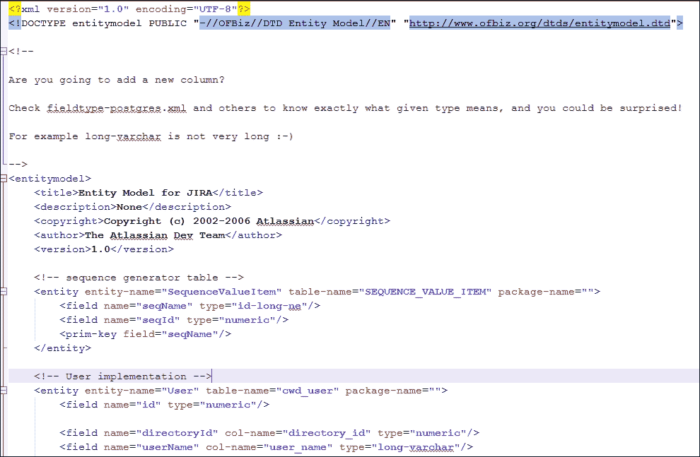

这是一个 XML 文件，包含 JIRA 中所有表的定义以及它们与其他表的关系。

或者，您还可以在 Atlassian 网站上查看数据库模式，网址为 [`developer.atlassian.com/display/JIRADEV/Database+Schema`](https://developer.atlassian.com/display/JIRADEV/Database+Schema)。

## 访问 HSQLDB

如前所述，HSQLDB 仅用于评估目的，不应在生产环境中使用。然而，您可能希望运行查询以从数据库生成报告。幸运的是，HSQLDB 附带一个内置控制台，可以通过执行以下步骤调用：

1.  关闭您的 JIRA 服务。

1.  使用以下命令启动 HSQLDB 控制台：

    ```
     java -cp JIRA_INSTALL/lib/hsqldb-1.8.0.5.jar  
        org.hsqldb.util.DatabaseManager -
        user sa -url jdbc:hsqldb:JIRA_HOME/database/jiradb

    ```

在上述命令中，将 `JIRA_INSTALL` 和 `JIRA_HOME` 替换为根据您的安装位置的目录。如果您是通过 Windows 安装程序安装 JIRA，以下步骤应该可行。

首先，导航到 `C:\Program Files\Atlassian\Application Data\JIRA\database` 目录。

然后，运行以下命令：

```
java -cp ../../../JIRA/lib/hsqldb-1.8.0.5.jar 
org.hsqldb.util.DatabaseManager -
user sa -url jdbc:hsqldb:jiradb

```

**HSQL 数据库管理器** 将显示在您的屏幕上：

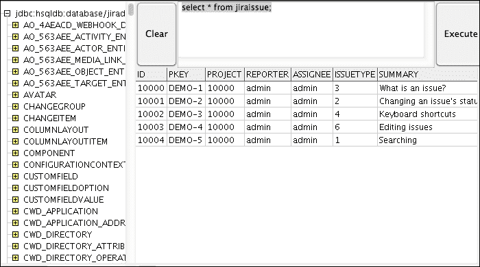

现在，您可以在 **HSQL 数据库管理器** 中运行 SQL 查询，并在同一窗口中查看输出。

# 访问 MySQL

**HSQL 数据库管理器**绝不应在生产实例中使用，因为它容易导致数据丢失。推荐使用的数据库是 MySQL 或 PostgreSQL。本书早些时候我们讨论了如何创建 MySQL 数据库以存储 JIRA 数据，并在安装阶段进行配置。要访问您的数据库并运行 SQL 查询，您可以使用 MySQL 控制台（MySQL 服务器自带的工具），或者使用**phpMyAdmin**。

## phpMyAdmin

可以从[`www.phpmyadmin.net/`](http://www.phpmyadmin.net/)下载 phpMyAdmin 应用程序。

这是一个非常棒的基于 web 的工具，用于管理您的 MySQL 数据库，通常通过`http://localhost/phpmyadmin/`访问。具体的 URL 可能会有所不同，取决于您的安装方式。

执行以下步骤：

1.  在浏览器中打开上面的 URL 来启动**phpMyAdmin**：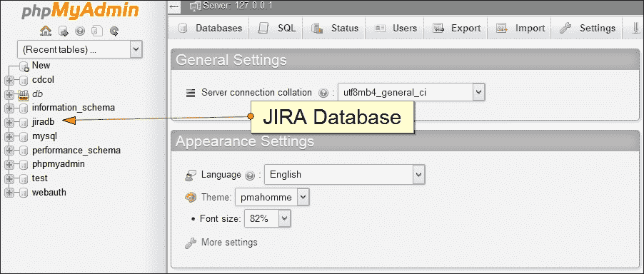

    您会注意到数据库列表出现在左侧。我们的`jiradb`数据库也出现在该列表中。我们为我们的 JIRA 实例创建了这个数据库。

1.  点击数据库名称前的加号（**+**）以展开该数据库的表格。

1.  您可以点击任何表格来浏览其内容：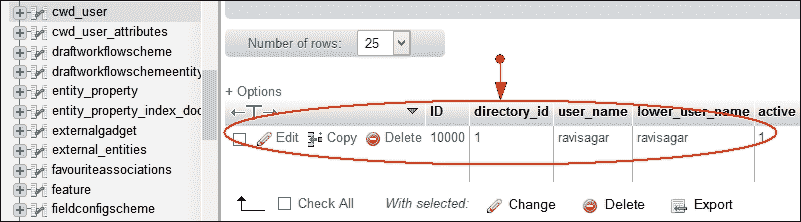

如您所见，我们点击了`cwd_user`表，右侧显示了我们 JIRA 实例中的用户列表。

同样，您可以浏览 JIRA 实例中的任何表格。您应该了解一些 JIRA 数据库模式，以便理解这些数据。此外，如果您希望生成涉及多个表格的复杂报告，您也可以编写 SQL 查询。

1.  点击顶部导航栏中的**SQL**选项卡：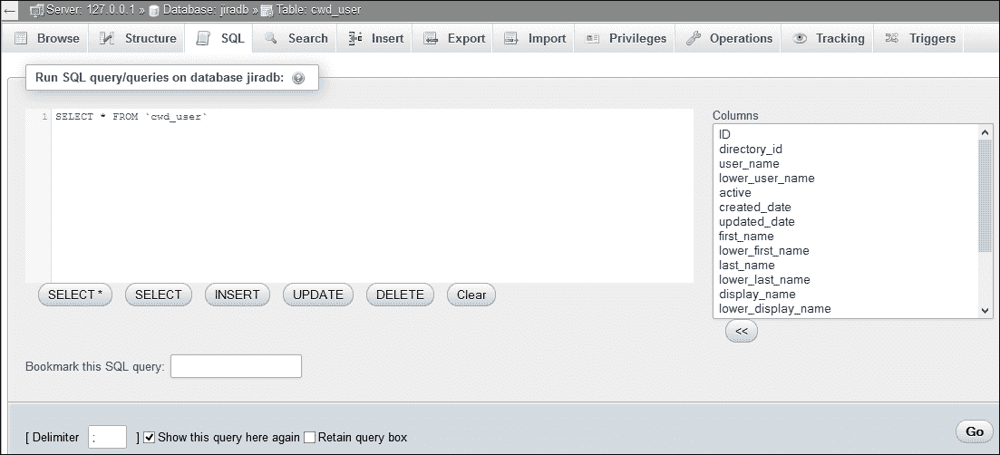

1.  要执行您的查询，请执行以下步骤：

    1.  在前面的截图中，您可以在**在数据库 jiradb 上运行 SQL 查询**区域输入 SQL 查询。

    1.  点击**Go**按钮以运行 SQL 查询。

## MySQL 控制台

当您在机器上安装 MySQL 服务器时，它会附带 MySQL 控制台。这个控制台也可以用来管理您的数据库。与 phpMyAdmin 相比，它的用户界面不太友好，但一旦您记住了基本命令，您可能会更喜欢使用 MySQL 控制台进行快速访问数据库。

运行以下命令以进入 MySQL 控制台：

```
mysql -u USERNAME -p

```

在前面的命令中，将`USERNAME`替换为您的用户名。在我们的例子中是`root`。该命令会要求您输入密码，之后您将进入 MySQL 控制台：

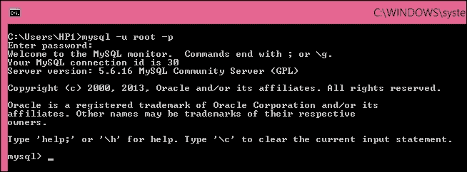

在 MySQL 控制台中，您可以输入命令并运行查询。

让我们来看一下几个常见的 JIRA 表格的结构，并生成结合多个表格的报表。在以下示例查询中，您可以根据自己的舒适度选择使用 phpMyAdmin 或 MySQL 控制台。

# 访问 PostgreSQL

当你使用 Windows 安装程序安装 PostgreSQL 时，它会附带 **pgAdmin III**，这是 PostgreSQL 的另一个管理和操作工具：

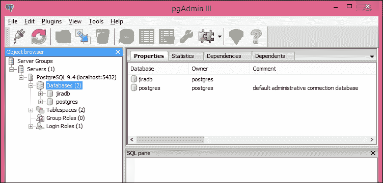

让我们来看看一些存储有用信息的 JIRA 数据库表。

# 用户表

`cwd_user` 表用于存储系统中的用户。让我们来查看一下该表的结构。

## 表格结构

运行以下查询：

```
desc cwd_user;

```

查询的输出结果如下：

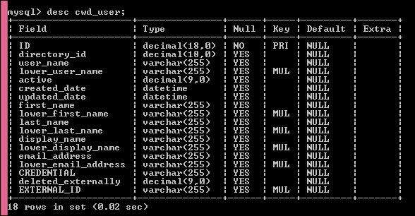

## 查找非活跃的 JIRA 用户列表

JIRA 管理员的主要职责之一是用户管理。假设你想找到非活跃用户的列表及其目录信息。在大型 JIRA 实例中，可能会有来自 JIRA 内部目录的用户，以及来自公司 LDAP 的用户。

以下查询将返回 JIRA 中非活跃用户的列表：

```
SELECT u.user_name,u.first_name,u.last_name,u.email_address,d.directory_name 
from cwd_user u join cwd_directory d on u.directory_id = d.id where u.active 
= 0;

```

上述查询依赖于另一个表，叫做 `cwd_directory`。该目录存储用户目录信息，而用户是否活跃则存储在 `cwd_user` 表的 `active` 字段中。

# jiraissue 表

`jiraissue` 表用于存储 JIRA 问题。让我们来查看一下该表的结构。

## 表格结构

运行以下查询：

```
desc jiraissue;

```

该查询的输出结果如下：

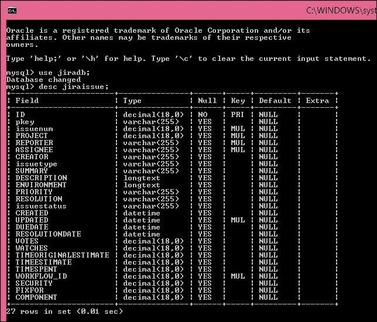

## 查找特定项目的问题

使用 JIRA **问题导航器** 查找特定项目的所有问题非常简单，但由于我们正在探索数据库架构及其各个表，下面让我们直接从数据库中获取特定项目的问题：

```
SELECT p.id AS project_id, p.pname AS project_name, CONCAT("SSP-
",ji.issuenum)  AS issue_id, ji.reporter AS issue_reporter FROM project p 
LEFT OUTER JOIN jiraissue ji ON ji.project = p.id WHERE p.pkey = 'SSP' ORDER 
BY ji.issuenum;

```

上述查询将显示 `SSP` 键所对应项目的问题列表。你可以将项目键替换为你自己的，尝试执行之前的查询。项目名称和一些其他字段会从 `project` 表中提取。

# customfield 表

`customfield` 表用于存储所有自定义字段。让我们来查看一下该表的结构。

## 表格结构

执行以下查询：

```
desc customfield;

```

查询的输出结果如下：

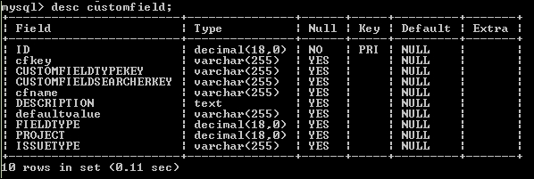

# customfieldvalue 表

`customfieldvalue` 表用于存储自定义字段值。让我们来查看一下该表的结构。

## 表格结构

运行以下查询：

```
desc customfieldvalue;

```

查询的输出结果如下：

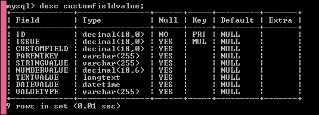

# 一些有用的 SQL 查询

我们将列出一些有用的 SQL 查询，帮助 JIRA 管理员快速找到他们所需的信息。需要特别提到的是，JIRA 新版本发布相对频繁，通常包含新的功能和错误修复。数据库架构可能会在新版本中发生一些变化。因此，在使用 SQL 查询之前，请在新版 JIRA 上验证它们的有效性。

## 共享过滤器列表

以下 SQL 查询将列出在 JIRA 实例中创建并与他人共享的过滤器：

```
SELECT sr.filtername, sr.authorname
FROM searchrequest sr
LEFT JOIN sharepermissions sp ON sp.entityid = sr.ID
WHERE sp.entitytype = "SearchRequest" AND sp.sharetype != "global";

```

## 获取特定组的用户

从 JIRA 界面中查找特定组的用户非常简单，但你应该知道如何使用 SQL 获取这些信息。以下查询将列出 `jira-software-users` 组的用户。你可以将其更改为实例中的任何组：

```
SELECT cu.user_name, cu.display_name, cu.email_address
FROM cwd_user AS cu
INNER JOIN cwd_membership AS cm
ON cu.directory_id=cm.directory_id
AND cu.lower_user_name=cm.lower_child_name
AND cm.membership_type='GROUP_USER'
WHERE cm.lower_parent_name='jira-software-users';

```

## 包含评论数的用户列表

JIRA 管理员的主要责任之一是查找那些在给定月份内不活跃或使用 JIRA 较少的用户。以下查询将提取用户列表，并列出他们在特定月份发布的评论数量。在某些情况下，这对于查找那些在系统中活跃但并未进行太多操作的用户非常有用：

```
SELECT author, count(author) as comments 
FROM jiraaction j
WHERE UPDATED > "2014-12-01 00:00:00"
group by author 
ORDER BY author ASC;

```

## 获取每个组件的问题数

假设你想找到系统中不仅所有组件的列表，还包括它们所关联的问题数量。以下查询将快速为你提供这些信息：

```
SELECT count(ji.id), c.cname FROM jiraissue ji 
INNER JOIN nodeassociation na ON ji.id = na.source_node_id
INNER JOIN component c ON na.sink_node_id = c.id
GROUP BY c.cname;

```

## 列出特定项目类别的项目

如果你想检索特定类别下的项目列表，可以使用以下查询：

```
SELECT p.pname, p.LEAD, p.pkey
FROM project p
JOIN nodeassociation na ON (p.ID = na.SOURCE_NODE_ID AND na.ASSOCIATION_TYPE 
= 'ProjectCategory')
JOIN projectcategory pc ON (na.SINK_NODE_ID = pc.ID)
WHERE pc.cname like 'Category';

```

## 特定项目中的分配人或报告人列表

有时候你需要查找参与某个特定项目的用户列表，作为分配人或报告人。这在你需要将一些项目从一个实例迁移到另一个实例，并且还需要迁移相关用户时特别有用：

```
SELECT DISTINCT reporter AS "User" FROM jiraissue WHERE project IN (
 SELECT id AS "Project ID" FROM project WHERE pkey IN ('SSP','SSPA')
)
UNION
SELECT DISTINCT assignee AS "User" FROM jiraissue WHERE project IN (
 SELECT id AS "Project ID" FROM project WHERE pkey IN ('SSP','SSPA')
)

```

# 总结

在本章中，你学习了如何直接从数据库中检索信息。当信息无法从 JIRA 界面轻松获取时，这非常有用。我们讨论了一些常见的 JIRA 表，并查看了一些示例查询，如何查找有用的信息。直接访问数据库的能力使得 JIRA 管理员能够生成复杂的报告，并更快地获取信息。

在下一章中，你将学习如何通过插入自定义 CSS 代码来定制 JIRA 的外观和感觉。你还将学习如何使用 JavaScript 修改 JIRA 界面 HTML 元素的行为。我们将通过一些示例来展示如何根据用户选择的下拉列表的特定值来显示/隐藏 JIRA 字段，并修改文本字段的值以插入基于文本的模板。
