# 第十四章：自定义外观、感觉与行为

JIRA 在其 UI 中提供了一个简单的功能，可以更改各个部分和元素的颜色，例如头部、底部和链接；你还可以上传自定义的徽标。然而，如果你想更改某个部分或整个主体元素的宽度，是无法通过 UI 来实现的。可以包含自定义的 CSS 来改变外观和感觉。也可以在 JIRA 实例中加载自定义的 JavaScript，这样可以改变各种 HTML 元素的行为。例如，你可以根据另一个字段的值选择性地显示或隐藏某个字段，并在 JIRA 字段中插入基于文本的模板。在本章中，我们将探讨这些自定义功能。

我们将涵盖以下主题：

+   添加自定义 CSS

+   添加 JavaScript 以显示/隐藏字段

+   **Velocity** 模板

# 添加自定义 CSS

JIRA 管理界面允许你更改 JIRA 中各个元素的外观和感觉，并更改默认的徽标。按照以下步骤自定义你的 JIRA 界面：

1.  导航到**管理** | **系统** | **外观和感觉**（在**用户界面**下）。

1.  本页的第一个选项是更改**徽标**。点击**浏览...**按钮，然后点击**上传徽标**按钮上传你自己的自定义徽标：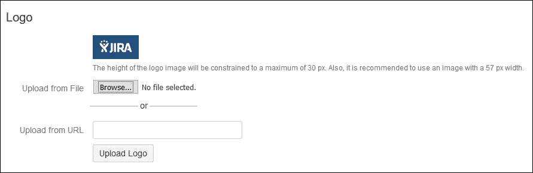

1.  第二个选项是显示**站点标题**，位于徽标旁边。勾选**显示站点标题**复选框，然后点击**更新**按钮：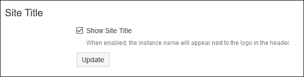

    你会注意到，在安装 JIRA 时输入的实例名称现在会显示在 JIRA 徽标旁边。在我们的示例中，它是**Sparxsys JIRA Demo**，现在显示在 JIRA 徽标旁边：

    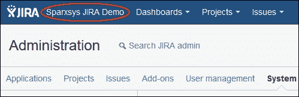

1.  第三个选项是更新**网站图标**（Favicon），它在浏览器标签页中显示，当 JIRA 被打开时会看到它。点击**浏览...**按钮，选择新的**网站图标**图片，然后点击**上传网站图标**按钮：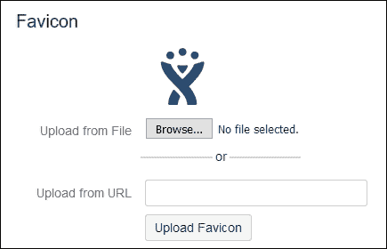

1.  第四个选项是更改 JIRA 网页界面中各个部分的颜色。例如，点击**头部背景颜色**框中的任何颜色。在弹出的窗口中，选择新的颜色，或者直接输入颜色的十六进制值。我们将颜色更改为红色，十六进制值为`#ff0000`。点击**更新**按钮继续：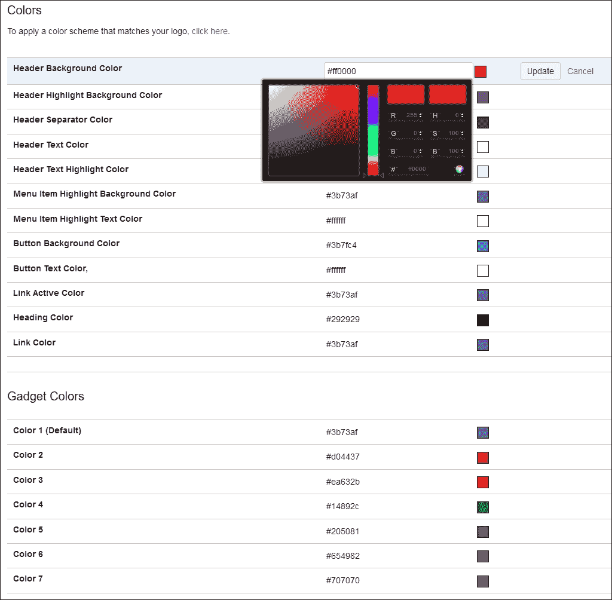

现在，主导航栏的颜色变为红色。

你可以更改此界面中可用的各个部分的颜色，并将其与公司颜色方案匹配，但 JIRA 的界面仅限于更改颜色。如果你想更改`<body>`元素的宽度或给某些部分添加额外的填充和边距，无法通过此界面实现。

然而，JIRA 允许插入自定义 CSS，覆盖默认的外观和感觉。执行以下步骤：

1.  转到 **管理** | **系统** | **公告横幅**（在**用户界面**下）。

1.  在**公告**文本区域，复制 `<LINK href="http://localhost:8080/includes/custom_css/custom_style.css" rel="stylesheet" type="text/css">` 并点击 **设置横幅** 按钮：

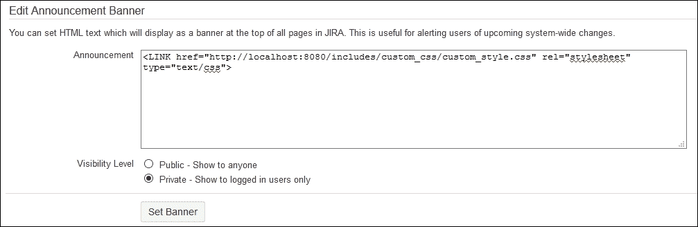

**公告横幅**用于在 JIRA 中所有页面向所有用户显示公共文本；好消息是，它也支持 HTML 标签。在我们的例子中，我们希望将自定义的 CSS 代码加载到所有页面。之前提到的 `LINK` 标签指定了我们的自定义 CSS 文件的路径。执行以下步骤：

1.  在你的 JIRA 安装目录下创建一个 `custom_css` 文件夹：

    ```
            JIRA_INSTALL/atlassian-jira/includes/. 

    ```

1.  导航到 `custom_css` 文件夹并创建一个 `custom_style.css` 文件；该文件的位置应该是 `JIRA_INSTALL/atlassian-jira/includes/custom_css/custom_style.css`。

该文件包含用于更改 JIRA 用户界面（UI）的 CSS，这些更改是通过配置无法实现的。当你保存**公告横幅**时，用户将看不到任何内容，但此 CSS 文件将在所有页面加载。你也可以通过查看 JIRA 中任意页面的源代码，并搜索文件名来验证这一点：

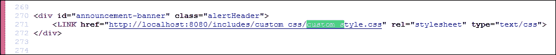

在前面的截图中，你可以看到我们的自定义 CSS 文件已经加载。

现在是时候向这个文件中添加一些 CSS 代码，并更改我们 JIRA 实例的外观和感觉了。用你喜欢的编辑器打开 `custom_style.css` 文件，并输入以下代码片段：

```
body { 
  background-color: #e0e0e0; 
  padding: 0 70px; 
} 
#content { 
  box-shadow: 0px 0px 5px #232323; 
} 
#footer { 
  background-color: #232323; 
  box-shadow: 0px 0px 5px #232323; 
} 

```

然后，刷新浏览器中的 JIRA 实例。你应该能看到之前的 CSS 代码已被应用，并且更改已经显示，如下图所示：

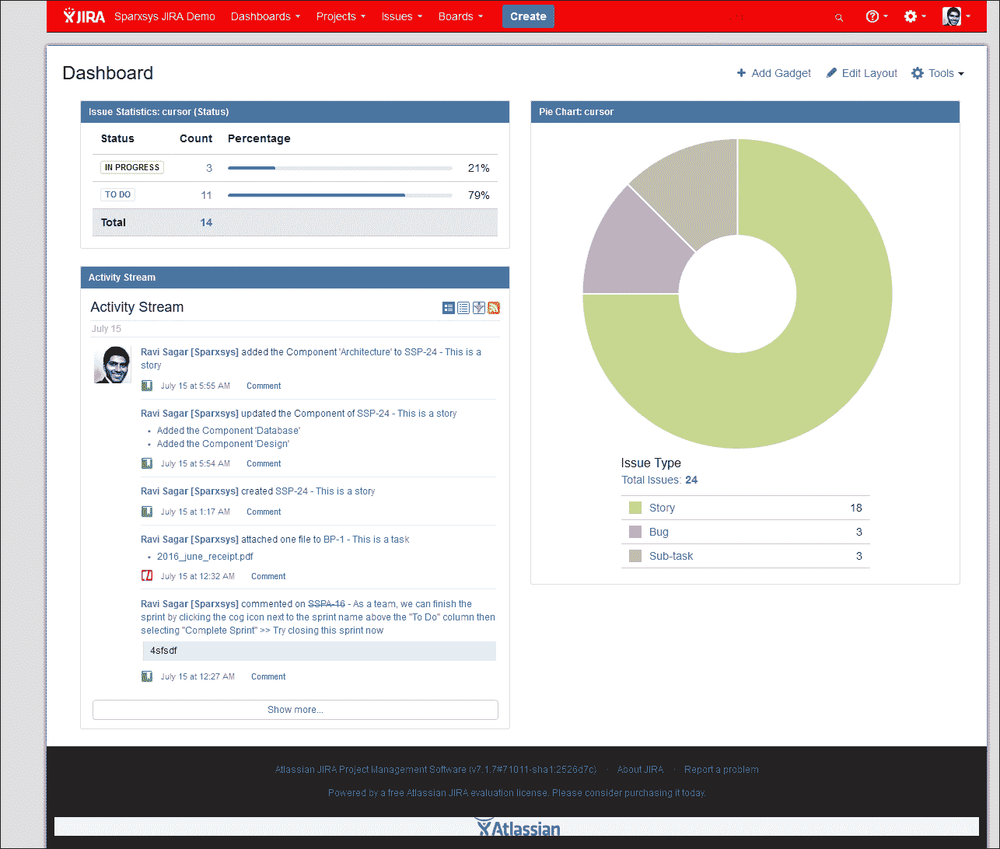

你可以通过添加自己的 CSS 代码进一步自定义网页的外观和感觉。这些代码将加载到每个页面；只需确保**公告横幅**中的代码没有被删除。

我们已将一个额外的文件添加到 JIRA 文件系统中。非常重要的一点是，记住此文件并将其单独保存。当你将 JIRA 实例升级到新版本或迁移到新服务器时，JIRA 管理员应确保该文件不会被删除；否则，网页的自定义外观将无法显示。

# 添加 JavaScript 来显示/隐藏字段

JIRA 提供了大量的功能和自定义选项；然而，有时你可能希望对 HTML 字段的行为进行更细粒度的控制。例如，如果你希望根据另一个自定义字段的值显示或隐藏某个特定的自定义字段，你可以使用自定义 JavaScript 来实现这一点。

假设有这样的场景：在 JIRA 中创建工单的用户需要在自定义字段的文本区域中输入他们的分析内容，但只有在问题的优先级为最高时，才需要填写此内容。现在，为了实现这一点，我们希望首先完全隐藏**分析**字段，并且仅当用户将**优先级**设置为**最高**时才显示该字段。

与前面插入自定义 CSS 的示例不同，自定义 JavaScript 可以直接从 JIRA 界面添加。请按照以下步骤操作：

1.  转到 JIRA **管理** | **问题** | **自定义字段**（在**字段**下）。

1.  点击右上角的**添加自定义字段**按钮，并将**字段类型**选择为**文本字段（多行）**。

1.  在下一个屏幕中，输入`分析`作为**名称**，并在自定义字段的**描述**字段中输入 JavaScript 代码（`analysis_js.css`），如下图所示：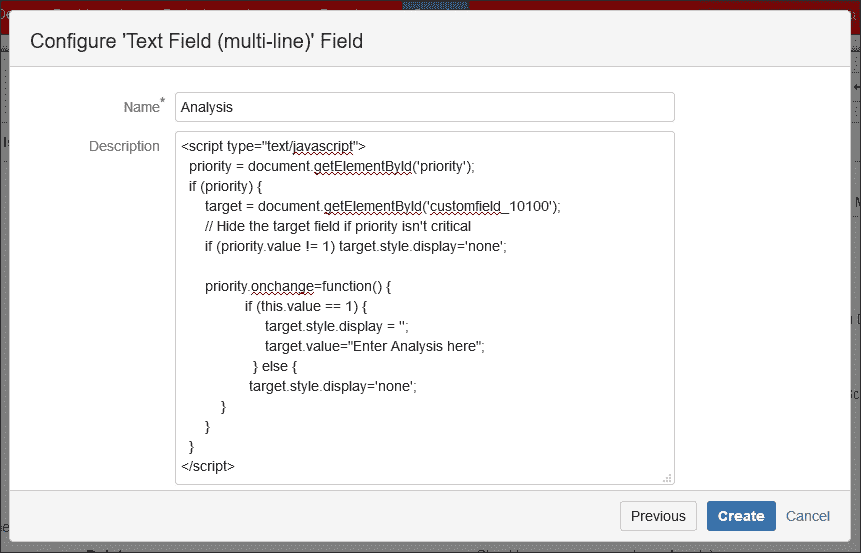

1.  点击**创建**按钮继续。

1.  在与**创建问题**操作关联的屏幕中，将此字段添加到**优先级**系统字段之后。

请注意，自定义字段的字段描述也可以通过**字段配置**选项进行控制。在第四章，*JIRA 的测试管理定制*中，我们讨论了字段配置的目的。在前面的示例中，我们在创建自定义字段时将 JavaScript 代码添加到字段描述中；如果在项目中使用了字段配置，该代码将被覆盖。

让我们了解一下这段 JavaScript 代码的重要部分。

**分析**自定义字段的 ID 为`10100`，我们为该字段分配了一个目标变量：

```
 target = document.getElementById('customfield_10100'); 

```

然后，对于**优先级**字段，我们检查其值是否为**最高**，该值可以从包含不同数字值的列表中选择，包括**最高**、**高**、**中**、**低**和**最低**（**最高**的数值为`1`）。对于其他任何值，**分析**字段将被隐藏：

```
if (priority.value != 1) 
  target.style.display='none'; 
priority.onchange=function() { 
  if (this.value == 1) { 
    target.style.display = ''; 
    target.value="enter message here"; 
  } else { 
    target.style.display='none'; 
  } 
} 

```

当用户选择**优先级**为**最高**时，**分析**字段将再次显示。

## 创建问题

创建**分析**字段后，只需在 JIRA 中添加另一个问题来进行测试。默认情况下，**分析**字段不会显示给用户：

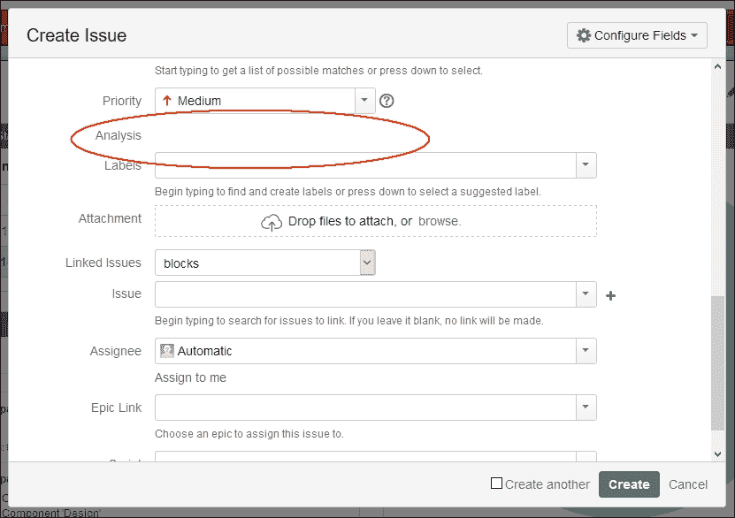

当你选择**优先级**为**最高**时，**分析**文本区域将对用户可见：

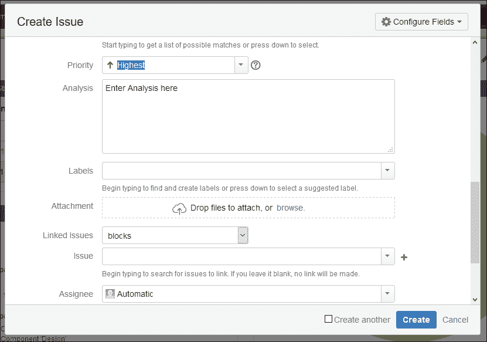

这个示例只是为了给你一个如何使用 JavaScript 控制 HTML 元素行为的概念。

# Velocity 模板

Velocity 是一个基于 Java 的服务器端模板引擎，用于渲染页面内容，它允许将 Java 对象与 HTML 元素一起使用。由于 JIRA 是用 Java 编写的，它利用 Velocity 模板来显示内容。用户可以修改这些模板文件，但 Atlassian 不会对修改模板文件提供任何支持，因此建议在进行任何更改之前备份原始文件。

在本节中，我们将讨论一些示例，我们将对这些模板进行修改。

## 修改描述系统字段并添加预定义文本

JIRA 允许你为每个自定义字段添加描述，其中可以向最终用户提供有关如何输入数据的指示。然而，有时向用户展示预定义文本（如基于文本的模板）是非常有用的。在本示例中，我们将向 JIRA **描述**系统字段添加一些默认文本。请按照以下步骤操作：

1.  编辑 JIRA 安装目录中的以下文件：

    ```
            JIRA_INSTALL/atlassian-jira/WEB-INF/    
            classes/templates/jira/issue/field/description-edit.vm. 

    ```

1.  在`$rendererDescriptor.getEditVM()`函数之前输入以下代码：

    ```
            #set ($description = "Please enter the details in steps.\ 
            \ 
            Step 1:\ 
            \ 
            Step 2:\ 
            \ 
            Step 3:\ 
            \ 
            Issue Occurrence: Once or Always\ 
            Current Status: Working or Not Working 
            \ 
            ") 
            #set ($description = $description.replace('','')) 

    ```

1.  代码如下所示：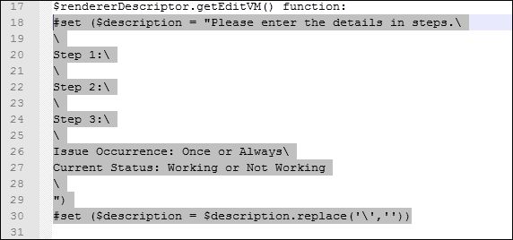

1.  重启你的 JIRA 实例。

1.  一旦 JIRA 实例重启，点击**创建**按钮以创建一个问题。

1.  你会注意到，默认文本现在出现在**描述**字段中：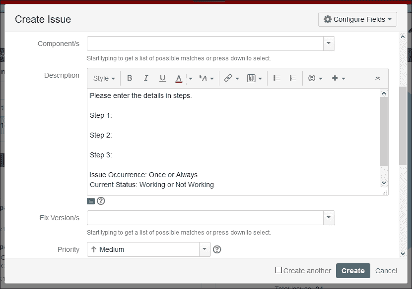

你可以使用相同的方法向其他字段添加自定义预定义文本。

在使用之前的代码修改了**描述**字段模板之后，预定义的文本将会添加到 JIRA 实例中所有项目和问题类型的**描述**字段，但也可以将其限制为特定的项目和问题类型。请改用以下代码：

```
#if ($issue.getProject().getString("key") == 'SSP') 
  #if(($description == "") && ($issue.getIssueTypeObject().getName() == "Story")) 
    #set ($description = "Please enter the details in steps.\ 
       \ 
    Step 1:\ 
        \ 
    Step 2:\ 
        \ 
    Step 3:\ 
        \ 
    Issue Recurrance: Once or Always\ 
    Current Status: Working or Not Working 
        \ 
        ") 
    #set ($description = $description.replace('','')) 
  #end 
#end 

```

要定义自定义字段的默认值，也可以使用上下文，具体内容请参见第十七章，*JIRA 最佳实践*。

在前面的代码中，我们只在顶部添加了两行代码，将**项目关键字**限制为`SSP`，并将**问题类型**限制为`Story`。在修改模板文件之前，请确保重新启动你的 JIRA 实例。如果你不想重新启动实例，也可以通过以下步骤禁用 Velocity 模板的缓存，方法是在你的 JIRA 安装目录下执行：

1.  取消注释（移除`#`符号）`#velocimacro.library.autoreload=true`。

1.  将`class.resource.loader.cache`的值从`true`更改为`false`。

1.  打开`JIRA_INSTALL/atlassian-jira/WEB-INF/classes/velocity.properties`。

1.  现在，对 Velocity 模板的任何更改都会在你的实例中生效，无需重启 JIRA。仅在开发环境中执行此操作。

如前所述，针对自定义 CSS，请跟踪你在模板文件中所做的任何更改，并始终保留原始模板文件的备份。需要注意的是，Atlassian 不会对模板文件的自定义做任何支持。

## 修改页脚

在 JIRA 中，你可以自定义各种模板文件，针对网页的各个部分。让我们看另一个例子，我们将在页脚部分添加一些自定义文本。请执行以下步骤：

1.  编辑 JIRA 安装目录中的以下文件：

    ```
            JIRA_INSTALL/atlassian-jira/WEB-  
            INF/classes/templates/plugins/footer/footer.vm. 

    ```

1.  这个文件内容很多；只需导航到文件底部，在 `#end` 之前添加以下行：

    ```
            <ul> 
              <li>This is a Test JIRA Instance and we are adding text in the footer.  
              </li> 
            </ul> 

    ```

    文件内容如下：

    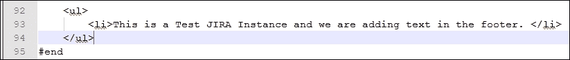

1.  重启你的 JIRA 实例。

1.  一旦 JIRA 实例重启，你会注意到在 Atlassian logo 前面有一些额外的文本：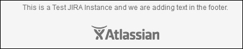

## 在电子邮件中显示自定义字段

还可以定制发送给用户的电子邮件。电子邮件内容也是通过 Velocity 模板生成的。现在，我们来定制创建问题时发送的电子邮件模板。系统中创建的自定义字段默认不包含在电子邮件内容中，但我们将修改问题创建电子邮件的 Velocity 模板，并添加**分析**字段（即我们之前添加的字段）。请执行以下步骤：

1.  编辑 JIRA 安装目录中的以下文件：

    ```
            JIRA_INSTALL/atlassian-jira/WEB-
            INF/classes/templates/email/html/issuecreated.vm 

    ```

1.  在文件的最终 `#parse` 之前添加以下代码：

    ```
            #if ($issue.getCustomFieldValue("customfield_10100")) 
            <tr valign="top"> 
              <td > 
                #text("Analysis"): 
              </td> 
              <td> 
                $issue.getCustomFieldValue("customfield_10100") 
              </td> 
            </tr> 
            #end 

    ```

1.  保存文件并重启 JIRA。

1.  一旦 JIRA 实例重启，创建一个问题并填写**分析**字段。

1.  检查你收到的电子邮件；它现在应该包含**分析**字段的值。电子邮件内容应与以下截图类似：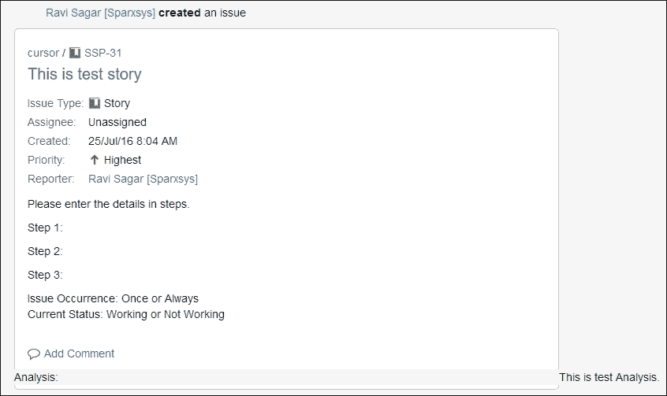

对于类似的事件和系统字段，系统提供了模板。熟悉了 Velocity 模板后，你可以探索它们并对其进行更改。

# 概述

在本章中，你学习了如何通过插入自定义的 CSS 代码来定制 JIRA 的外观和感觉。我们还使用 JavaScript 修改了 JIRA 界面中 HTML 元素的行为，以便根据用户从可选择列表中选择的特定值来显示/隐藏 JIRA 字段。最后，我们探讨了 Velocity 模板以及如何修改显示的内容。我们还讨论了如何在电子邮件中插入自定义字段值。

在下一章中，我们将讨论 JIRA Service Desk，它已成为最流行的客户支持请求解决方案。Service Desk 现在是一个独立的应用程序，可以作为独立应用程序安装，也可以与 JIRA Core 一起作为一个应用程序安装。Service Desk 配有内置的标准配置，适用于任何支持项目。
