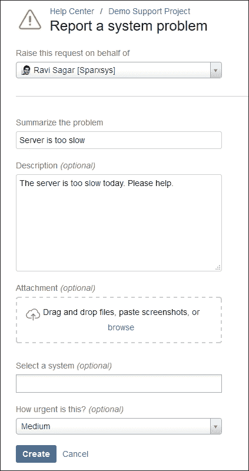
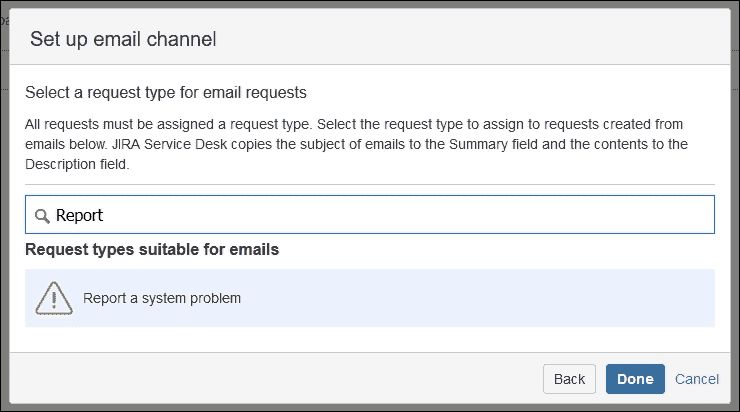

# 第十五章. 实施 JIRA Service Desk

在本章中，我们将学习如何实施一个 JIRA Service Desk 应用程序，以处理 IT 帮助台和支持请求，该应用程序不仅易于使用，而且自带预配置的工单系统功能。所有支持工单都通过 JIRA 项目进行跟踪，并且它配备了一个客户门户，使得提出请求变得非常简单。此外，JIRA Service Desk 还可以与 Confluence 集成，用户可以在提出新工单时轻松搜索相关问题。

在本章中，我们将涵盖以下内容：

+   产品概述—JIRA Service Desk？

+   安装 JIRA Service Desk

# 产品概述 – JIRA Service Desk？

在第一章，*规划你的 JIRA 安装*中，我们讨论了新版本的 JIRA 7，它被拆分成三个独立的应用程序：JIRA Core、JIRA Software 和 JIRA Service Desk。在第六章，*用例示范实施*中，我们讨论了一些 JIRA 的示范用例，而在第四章，*定制 JIRA 用于测试管理*中，我们也探讨了如何为测试管理定制 JIRA。同样，JIRA 也可以配置用于支持请求，但在这种情况下，只有拥有 JIRA 账户的用户才能登录并提交请求。如果需要允许无限制的客户创建工单，可以使用 JIRA Service Desk。JIRA Service Desk 不对客户数量进行限制，它还配备了典型支持和工单系统的标准功能。

# 安装 JIRA Service Desk

如果你只打算将 JIRA 用于支持项目，你可以下载并安装 JIRA Service Desk 应用程序。安装步骤与我们在第一章中讨论的 JIRA 软件类似，即*规划你的 JIRA 安装*。然而，如果你已经在组织中使用 JIRA Core 或 JIRA Software，你仍然可以在现有实例上安装 JIRA Service Desk 应用程序。按照这里提到的步骤，在现有的 JIRA 实例上安装 JIRA Service Desk 应用程序：

1.  下载最新版本的 JIRA Service Desk。你可以在[`marketplace.atlassian.com/plugins/com.atlassian.servicedesk.application/versions`](https://marketplace.atlassian.com/plugins/com.atlassian.servicedesk.application/versions)下载 `jira-servicedesk-application-3.1.7.obr` 文件。

1.  前往**管理** | **应用程序** | **版本与许可证**。在此页面上，您将看到所有已安装的应用程序列表，例如 JIRA Core 和 JIRA Software。点击右上角的**上传应用程序**链接，在弹出的**上传应用程序**窗口中，上传您刚刚下载的`jira-servicedesk-application-3.1.7.obr`文件：

1.  JIRA Service Desk 将被安装。您还可以为其生成一个评估许可证。安装许可证后，您将能够创建一个新的 Service Desk 项目：

1.  前往屏幕顶部的导航菜单，点击**项目** | **创建项目**。在**创建项目**弹出窗口中，选择**SERVICE DESK**下的**IT Service Desk**，然后按**下一步**按钮继续：

1.  在**IT Service Desk**弹出窗口中，输入项目**名称**和**关键字**，然后按下**提交**按钮继续：

1.  现在将创建一个类型为 Service Desk 的新项目。一个典型的 Service Desk 项目将与标准的 JIRA 项目非常相似，但它具有一些额外的功能：

1.  一旦项目创建完成，您将看到一个**欢迎指南**，其中包含多个链接，指向 Atlassian 文档，帮助您熟悉 Service Desk。在项目侧边栏中，有三个标签：**队列**、**客户**和**报告**。让我们了解一下它们的功能。

## 队列

队列只是一个基于预定义条件过滤的任务列表。例如，您的项目中已经定义了几个队列，例如**未分配的任务**、**分配给我的任务**、**24 小时内到期**等。

队列有点类似于 JIRA 过滤器。您还可以创建自己的队列。点击**新建队列**链接，如下图所示：

在**新建队列**页面中，输入**名称**为`进行中`，并在**显示任务**下选择**状态**为**进行中**。如果您熟悉 JQL，可以点击**显示高级选项**链接，位于**显示任务**部分旁边。点击**创建**按钮保存队列：

队列现在将被保存，并可在您的项目中的现有**队列**列表中查看。

## 客户

默认情况下，您的 Service Desk 项目对**JIRA 实例中所有拥有帐户的用户**开放，但我们可以限制哪些用户或组将成为**客户**，并且可以在该项目中提出请求：

## 报告

Service Desk 项目内置了一些非常实用的报告，可以帮助您了解团队在支持项目中的当前进展：

让我们了解这些报告的目的。

### 工作负载

这是一个简单的报告，展示了你的团队目前正在处理的请求数量。它帮助你均匀分配工作负载给你的代理。报告显示了每个代理的**进行中的事项**数量。这是一个重要的报告，有助于项目负责人均匀分配工作，避免代理工作量过少或过多。

### SLA 目标

Service Desk 附带了**服务级别协议**（**SLA**），例如**首次响应时间**和**解决时间**。此报告将告诉你团队是否能够达到这些 SLA 目标。报告显示了过去七天内成功达成 SLA 目标的百分比。这些报告可以快速告诉你团队在解决问题方面的表现，这些问题通过时间目标来衡量。

### 满意度

此报告将显示客户满意度的平均水平。这有助于你了解客户是否对你的服务感到满意。它显示了用户给予的评分平均值。这是一个快速获取用户反馈的好方法，可以帮助你了解他们的满意度。

### 文章使用情况

如果你将 Confluence 空间与项目关联，那么该报告将显示文章的查看次数，以及有多少客户认为这些文章有用。JIRA Service Desk 与 Confluence 空间紧密集成；它在用户提交新请求时提供相关的文章，这些请求可能是已知问题或常见请求。在这种情况下，Confluence 空间中的文章可以帮助用户自助解决问题。

### 文章有效性

本报告显示了客户创建的事项数量与客户通过查看文章自行解决的事项数量之间的对比。了解用户查阅已关联的 Confluence 空间文章的次数，并通过阅读这些文章自助解决问题，可以帮助你评估这些文章的有效性。

### 创建与解决

此报告显示了在选定期间（如**过去 7 天**、**过去 14 天**或**过去 30 天**）内**创建与解决**的事项数量。类似的报告通常也出现在非 JIRA Service Desk 项目中。

### 解决时间

本报告显示了解决所有事项所花费的时间，以及解决特定类型事项（如**事件**）所需的时间。

### 按优先级报告的事件

本报告显示了基于个人优先级的事项统计。它有助于快速查看按优先级分类的事项数量，例如**最高**、**高**、**中**、**低**和**最低**。

### SLA 达成与违约

简单统计有多少问题达成了他们的 SLA 目标，相对于有多少问题没有达成 SLA 目标，换句话说，就是违反了 SLA 目标。与**SLA 目标**报告一起，这个报告告诉你在项目中有多少工单未能达成其 SLA 目标。

## 客户渠道

客户可以通过两种方式提交工单——**客户门户**或**电子邮件**。让我们详细讨论这两种方式：

### 客户门户

服务台应用的最重要目的是专注于支持请求和工单系统，以满足最终用户和客户的需求。使用 JIRA，可以创建一个简单的项目来跟踪问题，并且如果有足够的许可证，可以为客户提供访问权限，但通常来说，最终用户可能不觉得登录问题跟踪器来提交请求是直观的。Atlassian 理解了这个问题，并创建了带有专用**客户门户**的服务台应用，这是一个简洁易用的界面，用于提交支持请求。

每个服务台项目都有自己的**客户门户**网址，如此处提到的`http://localhost/servicedesk/customer/portal/1`。

当你点击项目侧边栏中的**客户渠道**标签时，你将看到这个网址。项目专用的网址会在弹出的窗口中显示，你可以将这个网址分享给客户，或者发布在你的网站上。**客户门户**提供了一个简单直观的界面，用于提交请求。让我们一起浏览这个门户。请在你的网页浏览器中打开这个网址：

在左侧，列出了五个**组**，每个组下有多个请求类型，例如**报告系统问题**、**获取 IT 帮助**和**请求新账户**。这些请求类型实际上是与 JIRA 中的特定问题类型相关联的。我们可以创建新的请求类型并将其映射到任何现有的问题类型。

点击**报告系统问题**，它会打开一个新页面，展示一个表单来提交请求：

这个表单类似于你点击 JIRA 中的**创建**按钮时出现的表单，但它简单得多。客户可以填写此表单并点击**创建**按钮来提交请求：

请求提交后，会创建一个 JIRA 问题，状态为**等待支持**。每个服务台项目都有自己的工作流，就像其他任何 JIRA 项目一样。该问题会开始出现在项目的**队列**中。

### 电子邮件

你可以配置服务台，使得客户通过简单地向特定的电子邮件地址发送电子邮件来提交工单。我们需要先配置我们的项目，才能启用此功能。

点击弹出窗口中的**设置电子邮件请求**链接，该窗口会在你点击项目侧边栏中的**客户渠道**标签时出现：

在下一个屏幕上，单击 **添加电子邮件地址** 按钮：

在 **设置电子邮件通道** 弹出窗口中，输入您的电子邮件帐户的详细信息。如果您使用 Google Apps 帐户，请输入 **电子邮件地址** 和 **密码**，但您也可以从 **其他** 选项卡配置基于 POP 和 IMAP 的帐户。按 **下一步** 按钮继续：

现在您需要选择将用于从电子邮件创建问题的请求类型。您可以选择 **报告系统问题**，然后在底部按 **完成** 按钮：

现在将为此项目配置电子邮件。JIRA 服务台将持续读取指定的收件箱，每当有新邮件时，将在 **摘要** 字段中复制电子邮件主题，并在 **描述** 字段中复制电子邮件内容。

## JIRA 服务台配置

服务台项目与标准的 JIRA 项目并没有太大的区别。在内部，它还使用各种方案配置 **问题类型**、**工作流**、**屏幕** 和 **权限**。在 第四章 *定制 JIRA 用于测试管理* 中，我们讨论了如何通过修改这些方案来定制项目。但是，某些配置是特定于基于服务台的项目的。

转到项目侧边栏下的您的项目的 **项目管理**，在 **摘要** 正下方，您会注意到一组新的配置，这些配置在标准的 JIRA 项目中不存在：

让我们逐个了解它们。

### 请求类型

在本章前面，我们讨论了 **客户** 门户是最终用户的简单界面。他们可以选择不同类型的请求，这些请求在内部映射到特定的问题类型。在此部分下，您可以创建新的请求类型，也可以修改现有的请求类型：

输入 **请求名称**，例如 `硬件问题`，选择 **问题** 作为 **问题类型**，在 **组** 中输入 `6\. 其他` 中的文本。然后按 **添加** 按钮。现在，如果您回到您的 **客户门户**，将会添加一个新的请求类型，但它只包含 **摘要** 字段。现在让我们向此请求类型添加更多字段：

单击要修改的请求类型对应的 **编辑字段** 链接：

现在点击屏幕右上角的 **添加字段** 按钮：

在 **添加字段** 弹出窗口中，选择要添加的字段，然后点击 **应用** 按钮：

这些字段现在已被添加，并将在**客户门户**中显示给最终用户。您还可以在 JIRA 实例中添加自定义字段，并将其添加到与项目关联的屏幕中。然后，您可以将其添加到请求类型中。

### 请求安全

您可以控制谁可以在您的服务台项目中提交支持请求：

如前截图所示，您有三个选项可以选择：

+   **任何人都可以在我的客户门户上注册客户账户**

+   **只有拥有账户的人才能提交请求**

+   **只有我的客户列表中的人才能提交请求**

选择最适合您项目的选项，然后点击**保存**按钮。

要将用户添加到您的客户列表中，请进入项目的**用户和角色**部分，将用户添加到**SERVICE DESK CUSTOMERS**项目角色中。

### 门户设置

在此部分，您可以更改**客户门户**的**名称**，默认情况下，它与您的项目名称相同。您还可以上传自定义 logo：

也可以向用户发布**公告**，该公告将显示在**客户门户**的顶部。

### 满意度设置

在服务台项目中，您的客户可以提供反馈。这将帮助您了解他们的满意度。您可以在此部分启用或禁用此功能。

### 电子邮件请求

您的客户可以通过访问**客户门户**或通过发送电子邮件到您指定的地址来提交请求。我们在前面的**客户渠道**部分中讨论了如何配置它。

### 知识库

服务台项目可以与 Confluence 空间进行集成。这非常有用，因为当客户通过**客户门户**提交请求时，他们可以看到相关的 Confluence 页面。客户可以查看这些相关页面，并有可能在无需提交请求的情况下解决问题。

要配置**知识库**，首先需要在 JIRA 和 Confluence 之间添加应用链接。第十六章中有详细的添加应用链接的信息。让我们看看如何将 Confluence 空间与我们的项目链接：

在**链接 Confluence 空间**部分，选择**链接到 Confluence 空间**单选按钮。然后，在**应用程序**下拉菜单中选择**Confluence**，最后，在**空间**下拉菜单中选择 Confluence 空间的名称，并点击**链接**按钮。

### 服务水平协议（SLA）

服务台项目包含以下 SLA：

+   **解决时间**：这是从问题创建到解决所花费的时间

+   **首次响应时间**：这是从创建到将问题状态更改为**等待客户**所花费的时间。

我们也可以创建自己的 SLA，例如`分配时间`。按照接下来的步骤创建项目中的新 SLA：

1.  点击左侧的**新建指标**链接。

1.  在**新建指标**屏幕上，输入该指标的**名称**。

1.  选择**开始**时间，计时将从此时开始。

1.  选择**停止**时间，当计时结束时。

1.  在**目标**部分，输入**目标**为`4h`，针对**所有剩余问题**，然后点击**更新**按钮。

1.  最后，点击屏幕顶部的**创建**按钮以保存新的 SLA。

1.  新的 SLA 将在项目中的所有现有和新问题中体现。

### 自动化

服务台项目带有一个便捷的工具，可以向项目中添加一些自动化任务。这个工具有助于团队执行一些重复性的任务，同时也可以强制执行一些政策。

比如，我们刚刚添加了一个新的服务水平协议（SLA）：**分配时间**，即问题在创建后的 4 小时内分配给代理。实际上，当 SLA 剩余时间仅为 60 分钟时，我们可以在请求中发布评论。这个评论只会对已分配到此项目的现有代理可见。

按照给定的步骤添加新规则：

1.  点击右上角的**添加规则**按钮：

1.  在**新建自动化规则**弹出框中，选择**自定义规则**，然后按**下一步**按钮继续：

1.  在下一个屏幕中，在第一个文本框中输入名称，如`Alert user`。现在我们需要在**WHEN**框下**添加触发条件**，并且我们还需要在**THEN**框下**添加一个动作**。

1.  点击**添加触发条件**链接，在出现的**编辑 WHEN**弹出框中，再次点击**添加触发条件**链接。然后选择**SLA 剩余时间**并点击**添加**按钮：

1.  在**SLA**下拉菜单中，选择**分配时间**，在**事件**中选择**即将到期（剩余 60 分钟）**。按**确认**按钮保存触发条件。

1.  现在点击**添加动作**链接，在出现的**编辑 THEN**弹出框中，再次点击**添加动作**链接。然后选择**添加评论**并点击**添加**按钮：

1.  输入**评论文本**，选择**评论类型**，然后按**确认**按钮。

我们现在添加了一个新规则，当 SLA 剩余时间为 60 分钟时，会在问题上发布一条内部评论。

## 将用户添加为代理

服务台许可证不会限制客户的数量，而是限制可以作为项目代理的用户数量。请求只能分配给代理，只有代理才能与客户进行沟通。

请按照这里给出的步骤，将用户添加为项目中的代理：

1.  要将用户设置为代理，首先将其添加到**jira-servicedesk-users**中，该用户组应分配给**JIRA Service Desk**应用程序，位于**应用访问**部分。

1.  然后，前往**项目管理** | **用户和角色**，并将该用户添加到项目角色**Service Desk Team**中。

1.  最后，检查你的权限方案。**Service Desk Agent**权限应该分配给**Service Desk Team**项目角色。

# 摘要

在本章中，我们学习了如何创建和使用 Service Desk 项目，这个项目现在是 Atlassian 为支持项目提供的最重要应用之一。这个应用程序内置了非常好用的功能，可以让你迅速上手。我们还学习了 Service Desk 的各种配置，以便最大限度地利用这个支持项目的必备应用。

在接下来的章节中，我们将查看 JIRA 与常见的 Atlassian 应用程序的各种集成，以及其他在**软件开发生命周期**（**SDLC**）不同阶段提供帮助的工具。
