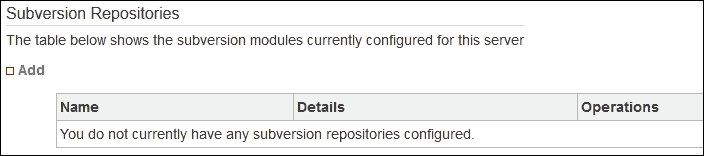

# 第十六章：将 JIRA 与常见的 Atlassian 应用程序和其他工具集成

在**软件开发生命周期**（**SDLC**）的各个阶段，需要许多不同的工具和应用程序。JIRA 和 Confluence 作为最重要的工具之一，但还有其他一些应用程序，如 Bamboo、Fisheye/Crucible 以及其他工具，也用于不同的目的来协助开发。JIRA 的最佳功能之一是它能够与 Atlassian 和其他第三方公司的一系列工具进行集成。让我们来看看你可以与 JIRA 进行的一些常见集成。

在本章中，我们将涵盖以下内容：

+   JIRA 与**Subversion**（**SVN**）插件

+   JIRA 与**Bitbucket**和**GitHub**

+   JIRA 与其他 Git 存储库

+   JIRA 与 Confluence

# JIRA 与 Subversion 插件

SVN 是一个流行且广泛使用的版本控制软件。JIRA 有一个名为**JIRA Subversion 插件**的插件，可以用来将 JIRA 与 SVN 集成。让我们按照以下步骤安装 JIRA SVN 插件：

1.  转到**管理** | **插件** | **查找新插件**（在**Atlassian 市场**下），在搜索框中输入`subversion`，然后按*Enter*键：

1.  **JIRA Subversion 插件**将在列表中显示。点击**安装**按钮继续。

1.  该插件将被下载并安装到您的 JIRA 实例中。安装完成后，您将收到一条确认安装的消息：

1.  点击**关闭**链接以关闭弹出窗口。

1.  转到**管理** | **插件** | **Subversion 存储库**（在**源代码控制**下）：

1.  现在，您将有机会将 SVN 存储库添加到您的 JIRA 实例中。点击**添加**链接。在下一个屏幕中，输入**显示名称**和**存储库根目录**；如果您的 SVN 存储库需要身份验证，请输入**用户名**和**密码**。如果您的存储库可以通过浏览器浏览，请选择**Web 链接**作为**SVN 的 Web 客户端**。最后，点击**添加**按钮：

每当用户在 SVN 提交消息中包含工单 ID（如 KEY-1）时，SVN 存储库将会添加到您的实例中，并且该文件将在 JIRA 查看问题操作的**Subversion**标签下列出。

# JIRA 与 Bitbucket 和 GitHub

JIRA 带有一个内置功能，可以与 Bitbucket 和 GitHub 存储库连接。按照以下步骤将 JIRA 与 Bitbucket 和 GitHub 集成：

1.  转到**管理** | **应用程序** | **DVCS 账户**（在**集成**下）。

1.  在下一个屏幕中，点击**链接 Bitbucket Cloud 或 GitHub 账户**按钮：

1.  在弹出窗口中，从**主机**下拉列表中选择**Bitbucket Cloud** 或 **GitHub**，在**团队或用户账户**文本框中输入你的用户名，并在**OAuth 密钥**和**OAuth 秘密**中输入相关值，这些可以从你的 Bitbucket 或 GitHub 账户生成。点击**添加**按钮继续：

1.  在**确认访问你的账户**页面，点击**授权访问**按钮：

1.  配置完成后，JIRA 实例将列出可用的仓库：

一旦仓库列出在实例中，Git 提交信息中可以包含 JIRA 问题的 ID，这些文件将显示在 JIRA 视图问题的**源代码**标签下。

# 使用 JIRA 与其他 Git 仓库

你也可以将你的 JIRA 实例与任何 Git 仓库连接——不仅限于 Bitbucket 和 GitHub。这里有一个插件，叫做 Git Integration 插件，可以用于这种集成。请按照以下步骤操作：

1.  导航到**管理** | **插件** | **查找新插件**（在**ATLASSIAN MARKETPLACE**下），并通过搜索框搜索`git`。

1.  从出现的搜索结果中，选择**Git Integration Plugin for JIRA**。点击**免费试用**按钮进行安装并评估此插件：

1.  插件安装完成后，导航到**管理** | **应用程序** | **Git 仓库**（在**JIRA Git 集成**下）：

1.  点击**连接到 Git 仓库**按钮：

1.  在弹出的窗口中，点击**高级设置**链接，以添加更多配置选项的 Git 仓库。在下一个屏幕中，输入 Git 仓库的**显示名称**，并提供 Git 仓库的**仓库根目录**。在我们的示例中，我们将使用一个本地 Git 仓库，托管并位于`c:\git-repo`路径下。在**启用抓取**单选框中，选择**与 JIRA 托管在同一服务器上的 Git 仓库**：

1.  另外，在**智能提交**下拉列表中，选择**已启用**，然后点击**添加**按钮继续：

1.  Git 仓库将被添加并显示在列表中：

同时，点击右上角的**重新索引所有**按钮，以索引 Git 仓库。由于我们在配置仓库时启用了智能提交，开发者在提交代码时还可以过渡 JIRA 问题。欲了解更多有关智能提交的信息，请阅读文档：[`confluence.atlassian.com/display/BITBUCKET/Processing+JIRA+issues+with+commit+messages`](https://confluence.atlassian.com/display/BITBUCKET/Processing+JIRA+issues+with+commit+messages)。

虽然这款插件不是免费的，但它为在 JIRA 实例中使用任何 Git 仓库打开了许多可能性。

# JIRA 与 Confluence

Confluence 是 Atlassian 公司的另一款流行工具，广泛用于在线协作。用户可以利用它来准备文档、教程、文章、博客、项目报告以及各种其他类型的文档。将 JIRA 与 Confluence 集成后，用户可以在 Confluence 中创建实时 JIRA 报告。让我们来看看设置此集成的步骤：

1.  进入**Confluence 管理** | **应用链接**（在**管理**下）。可以在此创建与 JIRA 的链接。在文本框中输入你的 JIRA 实例 URL，然后点击**创建新链接**按钮：

1.  在下一屏幕中，系统会要求你确认 JIRA 实例的链接。点击**继续**按钮：

1.  接下来，你将被引导到 JIRA 实例中，创建一个指向 Confluence 的互通链接。点击**继续**按钮，你将被重定向回 Confluence：

最终，你将在 Confluence 和 JIRA 中都创建应用链接。完成此集成后，你将能够在 Confluence 页面中嵌入 JIRA 问题，并生成图表。

### 提示

将 JIRA 与其他 Atlassian 产品（如 Bamboo、Fisheye/Crucible 和 Bitbucket）集成，通常只需通过创建应用链接来完成。

# 摘要

本章介绍了如何将 JIRA 与软件开发过程中常用的其他工具集成。与版本控制软件的集成使开发人员能够将代码文件与 JIRA 工单关联起来。Atlassian 公司的大多数其他工具也可以通过安装插件或配置应用链接与 JIRA 集成。在下一章中，我们将讨论使用 JIRA 时需要遵循的最佳实践，尤其是在具有数千名用户和多个自定义设置的企业环境中。这些最佳实践和标准化流程将帮助管理员长期维护和支持 JIRA。
