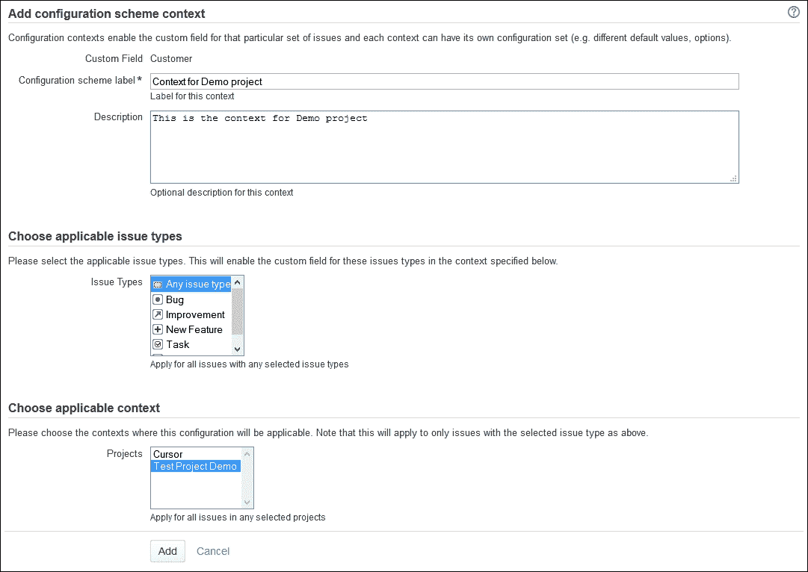
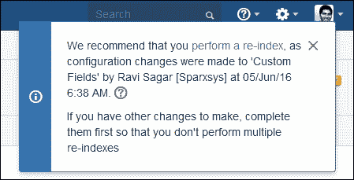

# 第十七章：JIRA 最佳实践

当多个用户在不同的用例中使用 JIRA 时，管理起来可能会变得繁琐，尤其是那些在项目间共享的自定义方案。想象一下，如果一个项目经理要求你从他的某个项目的屏幕中删除某个自定义字段，但你不小心将它也从其他项目中删除了。在本章中，我们将讨论 JIRA 管理员可以采取的最佳实践，以便更好地管理他们的实例。

在本章中，我们将涵盖以下内容：

+   在修改默认方案和配置之前需要注意的事项

+   JIRA 自定义过程

+   使用项目上下文为多个项目分配不同的选项

+   创建过多自定义字段——会导致性能变慢

+   明智地选择自定义字段类型

+   定义权限

+   JIRA 的**审计日志**

+   添加公告横幅

+   添加介绍

+   执行定期索引

+   最后的建议

# 在修改默认方案和配置之前需要注意的事项

新安装的 JIRA 实例自带许多默认的方案，包括问题类型、工作流、字段配置和权限。这些默认配置适用于简单的缺陷追踪，并且有一个适用于任何通用项目的流程。不要急于开始自定义配置。如果 JIRA 是公司首次使用，那么最好先用默认配置进行试点测试。这将帮助用户了解 JIRA 的功能，并收集用户反馈。

当你准备好自定义配置时，可以选择从空白配置开始，或者创建默认配置的副本，然后在此基础上进行更改。

# JIRA 自定义过程

自定义 JIRA 应该被视为一个独立的项目。尽管在配置 JIRA 时很容易开始进行更改，但你始终应该先规划自定义的内容并记录下来。

您可以执行以下步骤以开始自定义过程：

1.  使用默认配置试点 JIRA。

1.  收集反馈。

1.  记录提议的配置。

1.  在**沙箱**上测试配置。

1.  在生产环境中实施。

1.  规范化配置。

1.  设置**变更控制委员会**（**CCB**）。

## 使用默认配置试点 JIRA

向新工具的过渡总是会遇到用户的抵触，JIRA 也不例外；然而，JIRA 的优点是其直观性，并且能够清楚地将使用部分与管理部分区分开来。在首次部署 JIRA 时，始终使用默认配置，并请用户测试几天。这将确保用户首先熟悉 JIRA 自带的功能。这个试点测试最好至少涵盖每个团队中的一个候选人，包括项目经理、项目负责人、开发人员和测试人员。

## 收集反馈

在试点阶段结束时，请要求用户提供反馈。可以在反馈表中提出以下问题：

+   默认的任务类型是否足够满足你的项目需求？

+   你希望在工作流中进行哪些更改？

+   默认字段是否足以捕获信息？

+   你需要电子邮件通知吗？

+   有多少种类型的用户将使用 JIRA？

+   是否希望某些用户有访问限制？

+   你希望有哪些报告？

这些重要问题的答案将帮助你很好地了解项目中各方对定制的期望。

## 记录和最终确定提议的配置

仅仅收集反馈是不够的，不能直接开始定制。首先将这些定制记录在文档中，详细描述需求，这非常重要。

我们在第六章中详细讨论了如何收集需求，*用例示例实现*。理想情况下，每个用例应该准备一个单独的文档。在进行任何系统更改之前，应该先更新该文档。这将确保如果新的 JIRA 管理员加入公司，他们能够轻松理解 JIRA 的定制内容。

一旦文档准备好，与你的相关方分享，并请他们提供反馈。与他们组织会议，进一步完善需求并对文档进行必要的修改。最终，这个文档应包含所有实际定制的细节，哪些新任务类型需要创建，工作流应在文档中进行可视化，同时要列出需要创建的新状态，并且权限方案和通知方案也应当提到。

## 在沙盒中测试配置

一旦需求最终确定，你应该先在测试环境中进行测试。为此，搭建一个沙盒 JIRA 实例（它是生产环境的精确复制）。所有现有配置中的新旧更改应首先在沙盒中进行测试。沙盒非常重要，尤其是在 JIRA 需要升级到新版本时，或者你想评估一个新的插件时。

沙盒作为生产环境的精确复制，将为相关方提供测试他们请求的定制的机会，而不必担心对生产环境造成任何损害。

在这个测试阶段，相关方肯定会给你很多反馈，要求你根据他们之前无法预见的情况进行某些定制。记下所有这些更改，并对文档进行必要的修改。

## 在生产阶段实施

一旦在测试环境中成功实施，你就可以在生产环境中手动进行定制。此时，JIRA 管理员将会在 JIRA 配置文档中看到所有相关信息。在生产环境中进行实际实施不会花费太多时间。

然而，如果你在已经被多个用户使用的 JIRA 实例中进行更改，最好首先通知他们这些变化。你可以写一份简短的发布说明，提到正在进行的更改。这可以避免用户因为意外的变化而感到惊讶。配置更改通常不需要停机，但如果你要更改工作流，最好在没有人使用该实例时进行更改。因此，提前通知用户任何停机时间是很有必要的。

## 标准化配置

JIRA 的应用范围广泛。它是一个问题跟踪和项目管理工具。这个工具不仅可以用于缺陷跟踪，还可以用于测试管理、帮助台、需求管理和敏捷跟踪。

现在，最初在实施 JIRA 时，它会根据一个或多个项目的特定用例进行定制，但随着更多团队开始使用 JIRA，他们会请求更多的定制功能。JIRA 允许在多个项目中使用相同的配置，但当项目数量增加时，不能为所有项目使用相同的方案。因此，在 JIRA 中标准化配置并要求新团队遵循这些配置变得非常重要。

让我们来看一下 JIRA 中的以下场景，包含三个不同的用例：

| **用例** | **项目数量** |
| --- | --- |
| 测试管理 | 10 |
| 帮助台 | 5 |
| 需求管理 | 2 |

正如前面的表格所示，多个项目使用相同的配置。现在，使用测试管理方案的其中一位项目经理可能会要求你在他们的项目中添加一个新的自定义字段或将现有字段设置为必填。这些小的定制更改会影响所有使用相同配置的其他项目。我们可以通过创建一组新的方案来限制这些定制只对一个项目生效，但这会导致 JIRA 管理员的维护工作增加。

避免为相同的用例创建多个方案，并且在接受对现有配置的任何更改之前，与你所有使用该配置的项目的利益相关者进行沟通。如果有一个项目经理要求添加一个自定义字段，请与其他项目经理讨论，并在获得所有利益相关者的确认后再进行更改。

因此，尽可能标准化你的配置并在其他项目中复用这些配置是非常重要的。

在第四章，*测试管理的 JIRA 定制*，和第六章，*用例的样例实现*，我们详细讨论了如何定制 JIRA，并提供了各种示例。

## 设置变更控制委员会（CCB）

JIRA 管理员负责实施定制化请求。如前所述，配置应尽可能标准化，但有时需要在 JIRA 中进行更改以支持 JIRA 的需求。任何更改，无论大小，都需要首先进行分析，因为它可能导致进一步的问题。我推荐成立变更控制委员会（CCB），其工作是研究定制化请求，并在实施前进行评估。

我推荐以下流程：

1.  在 JIRA 中创建一个用于支持请求的项目，涵盖不同类型的问题，如缺陷、改进和新特性。

1.  要求用户为任何 JIRA 支持在此项目中提交工单。

1.  一旦工单创建，分析请求的定制化内容并进行影响分析。

1.  如果没有影响，直接在 JIRA 中实施这些变更。

1.  如果其他项目受到任何影响，需与其他项目的利益相关者讨论这些变更。

1.  根据与利益相关者的讨论，决定是否在 JIRA 中实施该变更。

### 影响分析的各种场景

让我们来看一下用户的一些定制化请求以及它们可能对实例的影响：

| **请求** | **其他项目使用吗？** | **影响** | **结论** |
| --- | --- | --- | --- |
| 新增自定义字段 | 是 | 小 | 首先与其他利益相关者确认此变更 |
| 在选择列表自定义字段中新增值 | 是 | 小 | 要么与其他利益相关者确认此变更，要么使用上下文为该项目创建不同的值集 |
| 更改工作流条件 | 是 | 重大 | 这是一个重大变更，应该与所有利益相关者讨论 |
| 新增工作流状态 | 是 | 重大 | 这是一个重大变更，应该与所有利益相关者讨论 |
| 创建一个必填自定义字段 | 是 | 重大 | 这是一个重大变更，应该与所有利益相关者讨论 |
| 安装新插件 | 是，适用于全球范围 | 重大 | 先在沙箱环境中安装此插件，并要求利益相关者进行评估 |
| 创建新问题类型 | 是 | 重大 | 与所有利益相关者讨论此新问题类型的需求 |

这些是 JIRA 管理员将会收到的一些请求示例。对于每个请求，在实施之前要先分析其影响。

# 使用项目上下文在多个项目中分配不同选项

假设我们有一个名为**Customer**的自定义字段。这个字段是一个下拉列表，包含不同的值，用户在创建问题时可以选择。如果 JIRA 被多个团队使用，每个团队处理不同的项目，那么客户列表可能会有所不同。一个项目可能面向的客户群体与其他项目不同。解决这个问题的一种方法是将所有客户都列在同一个列表中，但这会导致提出工单的团队成员产生混淆，并且可能会出错，因为用户可能会选择错误的客户。

可以为每个项目创建不同的自定义字段来解决这个问题（每个项目都有自己独立的客户列表），但这样会导致冗余，因为我们会在每个列表中存储相同类型的信息。

JIRA 的自定义字段提供了使用上下文来解决这个问题的方法。执行以下步骤来创建一个新的上下文：

1.  转到**管理** | **问题** | **自定义字段**（在**字段**下），你将看到系统中所有自定义字段的列表。

1.  点击自定义字段的齿轮图标，选择**配置**：

1.  在**配置自定义字段：客户**的下一个屏幕上，点击**添加新上下文**链接。

1.  在**添加配置方案上下文**的下一个屏幕上，输入**配置方案标签**和**描述**。在**选择适用的上下文**下，选择此上下文将适用于的项目名称：

1.  现在你会看到一个新的**Demo 项目的上下文**，但还没有选项。点击**编辑选项**链接：

1.  在下一个屏幕上，输入仅与特定项目相关的客户名称：

1.  最后，你将拥有两个选项集用于此自定义字段。一个是默认选项，另一个是特定项目的选项：

# 创建过多的自定义字段—性能变慢的一个因素

我们刚刚讨论了公司应该如何制定流程来管理他们在 JIRA 实例中的自定义设置。随着 JIRA 实例在问题数量、项目和用户数量上的增长，实例的性能会随着时间推移逐渐下降。导致性能变慢的一个主要因素是自定义字段过多。

JIRA 管理员创建自定义字段以存储可以在报告中过滤的数据。这是可以的，但应该尝试重复使用现有的自定义字段。因此，创建具有通用名称的字段，以便它们可以在不同项目中轻松重用。

让我们来看一下可以在 JIRA 实例中创建的一些通用自定义字段：

| **自定义字段** | **类型** | **描述** |
| --- | --- | --- |
| **客户**/**顾客** | 选择列表 | 这使用项目上下文为多个项目创建不同的选项 |
| **类别** | 选择列表 | 这些标签和组件应该在大多数情况下使用，但这个通用字段可以在使用项目上下文的多个不同选项的许多项目中使用 |
| **外部 ID** | 文本字段 | 此字段将用于存储在某些外部工具中存储的问题 ID |
| **测试类型** | 选择列表 | 当 JIRA 用于测试管理时，可以使用此字段 |
| **开始日期** | 日期选择器 | JIRA 确实有截止日期，但任务的开始日期不可用 |

在系统中添加新自定义字段之前要三思。用户可能会要求你创建许多字段，但要记住，过多的自定义字段可能会导致性能问题。始终尝试优化自定义字段的使用。例如，在创建**文本字段（多行）**之前，尝试重复使用**描述**字段；如果你希望用户使用带有预定义文本模板的模板填写详细信息，那么请使用第十四章中描述的方法，*定制外观、感觉和行为*。

# 明智地选择自定义字段类型

当你从不同的利益相关者收集需求时，他们会要求你创建新的自定义字段来捕获特定的信息。在上一部分中，我们讨论了如何始终尝试优化这些字段的使用。然而，一旦你决定了需要创建的自定义字段，在实例中创建它们之前，花些时间了解各种自定义字段的类型。创建后，字段的类型无法轻易更改。

例如，如果你想存储单一值，可以使用**选择列表（单选）**，而要选择多个值，则使用**选择列表（多选）**。要捕获日期，可以使用日期选择器，而要存储长文本，可以使用**文本字段（多行）**。

# 定义权限

确保存储在 JIRA 中的数据安全非常重要。JIRA 中可能有多个客户项目，其信息不能与其他团队共享。JIRA 还可以被客户访问，因此更重要的是隐藏其他项目，只向客户提供与他们相关的项目访问权限。在第四章，*为测试管理定制 JIRA*中，我们讨论了如何使项目仅对特定组的用户可访问。

JIRA 提供了一个出色的权限系统，允许在细粒度级别进行配置。JIRA 有三种类型的权限，分别是：

+   **全局权限**：这些权限适用于整个 JIRA 实例。在这里可以配置例如谁可以登录和谁是 JIRA 管理员之类的权限。

+   **项目权限**：这些权限适用于特定项目。在这里可以配置诸如谁可以访问项目、创建问题和关闭问题等权限。

+   **问题安全级别**：这些权限适用于特定项目的任务，以控制谁可以查看这些任务。

所有这些级别都需要定义权限，因此请确保具有正确访问权限的人可以查看 JIRA 中的数据。

# JIRA 的审计日志

JIRA 中有一个 **审计日志**，用于跟踪所有 JIRA 配置更改。此日志对于追踪方案中的任何更改非常有用；最棒的是，这个日志可以通过 JIRA 管理界面访问。

让我们访问 JIRA 的 **审计日志**：

转到 **JIRA 管理** | **系统** | **审计日志**（在 **故障排除和支持** 下）：

如前面的截图所示，诸如新用户创建和用户组修改等事件都会被记录。**审计日志**追踪的更改如下：

+   用户管理

+   群组管理

+   项目更改

+   权限更改

+   工作流更改

+   通知方案更改

+   自定义字段更改

+   组件更改

+   版本更改

JIRA 管理员可以参考此 **审计日志** 进行故障排除。

# 添加公告横幅

JIRA 是软件开发生命周期中的关键部分，用于存储各种问题。用户依赖 JIRA 来检查他们的日常任务，经理则使用 JIRA 来跟踪他们的项目。JIRA 管理员有时需要执行需要用户停机的维护活动。作为一种最佳实践，所有用户，或者至少是相关利益方，应该被通知，但为了避免给用户带来惊讶，最好提前告知任何计划中的停机时间。

JIRA 提供了添加公告横幅的选项，该横幅在主导航后会在整个 JIRA 实例中可见。执行以下步骤来添加公告横幅：

1.  转到 **管理** | **系统** | **公告横幅**（在 **用户界面** 下）。

1.  在 **公告** 文本区域，输入您的消息并点击 **设置横幅** 按钮。您还可以包括 HTML 标签。选择 **可见性级别** 为 **公开 - 显示给任何人**，以便将此公告显示给那些甚至未登录的用户：添加公告横幅

1.  以下截图显示了公告：添加公告横幅

# 添加简介

当你部署新的 JIRA 实例时，用户需要接受培训；然而，JIRA 在基本使用上并不需要深入的培训，提供有用的介绍性信息是一个很好的做法。这些介绍性信息不仅对已登录的用户可见，对于未登录的用户也同样可见。

执行以下步骤以添加介绍性文本：

1.  导航到**管理** | **系统** | **常规配置**，然后点击右上角的**编辑设置**按钮：

1.  在打开的新屏幕中，向下滚动，直到看到**简介**的文本框。只需输入用户的指引信息，并点击**更新**按钮。

1.  现在，访问你的仪表板并注意**简介**框，它已更新为你的消息：

# 执行常规索引

在第二章中，*JIRA 中的搜索*，我们详细讨论了 JIRA 的搜索功能以及如何找到你正在寻找的信息。JIRA 维护并构建了一个内部搜索索引，这对于数据的快速检索非常重要。然而，在进行配置更改后，如创建新的字段配置方案、添加新的自定义字段以及安装新的插件，搜索索引会变得不同步。定期重建搜索索引非常重要，这样用户才能体验到快速的搜索时间，并轻松找到所需的信息。

每当你进行涉及搜索索引的配置级更改（如创建新的自定义字段）时，JIRA 会提示管理员执行搜索，并且你将在管理部分看到类似如下的消息：

你可以点击与此消息一起出现的**索引**链接，或者导航到 JIRA **管理** | **系统** | **索引**（在**高级**下）来执行索引过程。

你将获得两种执行**重新索引**的选项。第一个选项是**后台重新索引**，该选项不会锁定 JIRA 实例，允许用户继续在 JIRA 实例中工作，但需要更多的时间。第二个选项是**锁定 JIRA 并重建索引**，该选项会锁定实例并阻止用户访问 JIRA，但速度较快：

点击**重新索引**按钮开始重新索引过程。根据你的实例大小，这个过程可能需要几秒钟到几个小时，对于大型实例来说。

因此，计划每 15 天进行一次索引，最好选择在用户访问实例较少的时段进行。

# 最后的建议

除了本章中共享的信息外，还有一些重要的维护活动，任何 JIRA 管理员都应该注意，以确保应用程序的长久运行和平稳功能：

+   定期进行备份

+   清理旧的、大的日志文件

+   仅在提示时规划重新索引

+   定期扫描你的日志文件

+   运行**完整性检查器**

这些额外的要点应作为你的维护检查清单的一部分。

# 总结

在本章中，我们介绍了 JIRA 管理员应该遵循的一些最佳实践，以维护他们的实例。我们讨论了他们在公司中应采取的定制化过程，以确保 JIRA 实例不会因大量配置而变得混乱。我们还介绍了一些好的 JIRA 管理员会遵循的重要清理和定期维护活动。

当 JIRA 运行缓慢或完全无法使用时，你应该怎么做？作为 JIRA 管理员，确保 JIRA 服务不受影响非常重要。JIRA 是开发过程中的关键工具，开发人员依赖它来检查日常任务。在接下来的最后一章中，我们将介绍一些可能在实例中出现的常见问题，最重要的是，如何排查这些问题。
