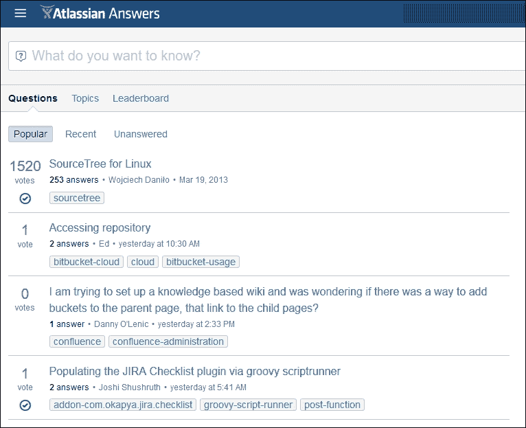
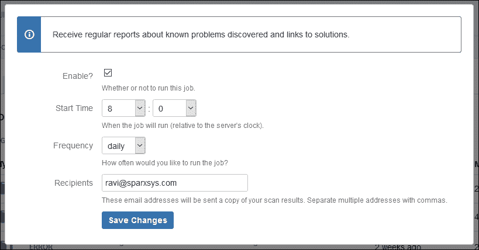

# 第十八章：JIRA 故障排除

JIRA 管理员最重要的职责之一是为依赖 JIRA 完成日常工作的用户提供支持。作为 JIRA 管理员，确保服务不受影响非常重要。在本章中，我们将讨论可能在你的实例中出现的常见问题。最重要的是，我们将讲解如何排除这些问题。

在本章中，我们将介绍以下内容：

+   Atlassian 支持

+   常见的配置问题

+   增加内存

+   **完整性检查器**

# Atlassian 支持

购买 JIRA 后，你有权获得 Atlassian 的官方支持，当你提出支持请求时，他们的响应速度相当快。如果你无法自己找到解决方案，可以向 Atlassian 提交支持票。

## Atlassian Answers

我们都在从经验中学习，成为某个工具或技术的专家需要时间。Atlassian 拥有一个非常棒的 JIRA 管理员和用户在线社区。在这里，他们相互分享知识，也寻求帮助。我建议，在向 Atlassian 提交支持票之前，你应该始终尝试在 *Atlassian Answers* 在线门户中寻找可能的解决方案，网址是 [`answers.atlassian.com/`](https://answers.atlassian.com/)：



在这个门户中，你可以看到其他用户发布的问题。你可以浏览这些问题，如果愿意，也可以回复它们，帮助他人。每个问题通常都会标有标签（如 **jira**、**jira-administration** 和 **confluence**）。你可以点击任何标签，找到所有与该标签相关的问题。*Atlassian Answers* 是一个很棒的在线门户，供你寻求帮助。

## 报告问题

向 Atlassian 提交支持请求非常简单。Atlassian 拥有一个支持门户，你可以在其中提交你的支持票。根据问题的紧急程度，你将从 Atlassian 获得回应。根据我的经验，Atlassian 提供的支持非常好，他们会及时响应。如果你对票据有进一步的疑问，可以发布后续评论，只有在对提供的解决方案满意时才能关闭票据。

执行以下步骤以提交支持请求票：

1.  在浏览器中输入 [`support.atlassian.com/customer/servicedesk-portal`](https://support.atlassian.com/customer/servicedesk-portal)，然后从工具列表中点击 **JIRA**。接着点击 **JIRA Core**、**JIRA Software** 或 **JIRA Service Desk**：

1.  在下一屏幕中，点击 **向我们提交问题报告**：

1.  在下一个屏幕上，你将看到一个表单。此表单包含多个字段，你可以在其中解释问题。填写**影响版本**字段，以帮助 Atlassian 支持团队了解你遇到问题的应用程序版本，然后按**创建**按钮来创建问题：

1.  问题创建后，你还可以上传截图（如果有的话）或附加日志文件：

## 日志扫描器

如果你遇到任何问题，首先应检查位于`home/log/atlassian-jira.log`的日志文件，该文件位于你的`JIRA HOME`目录中。

所有内部错误信息都会记录在此文件中，它提供了关于问题源的非常有用的信息。你将获得很好的线索，帮助你开始故障排除。你可以在*Atlassian Answers*中搜索日志文件中的相应错误信息。

如果你刚开始时觉得查看日志文件很有挑战性，你还可以使用 JIRA 自带的日志扫描器选项。按照以下步骤运行日志扫描器：

1.  转到**管理** | **系统** | **支持工具**（在**故障排除与支持**下）：

1.  点击**日志分析器**标签链接以运行扫描器。你将有选项选择运行标准日志文件或任何其他日志文件，后者可以通过输入其位置来指定。我们将选择标准日志文件。点击**扫描**按钮继续：

1.  扫描器将运行并检查日志文件中的错误和警告信息；日志扫描器的好处是，它还会根据其他用户可能遇到的类似错误信息，提供指向*Atlassian Answers*和 JIRA 问题的各种链接。作为 JIRA 管理员，你应定期运行此扫描器，阅读这些建议，并采取适当的措施：

1.  除了手动运行**日志分析器**，你还可以安排定期扫描并将输出结果通过邮件发送给你。点击右上角的**定期扫描**按钮来安排扫描：

1.  选中**启用**复选框，设置**开始时间**和**频率**，在**收件人**文本框中输入你的电子邮件地址，然后点击**保存更改**按钮。

## 支持 ZIP

当你向 Atlassian 支持团队提交支持请求时，附上日志文件总是一个好主意。你可以手动复制 JIRA 主目录中的整个`log`文件夹，并将该文件夹的压缩版本发送给 Atlassian；然而，JIRA 为你简化了这个过程。你可以生成支持 ZIP 文件。这个文件不仅包含你的实例的日志文件，还包含**应用程序属性**、**JIRA 配置文件**以及其他一些重要文件，这些文件可以让 Atlassian 更好地了解你的实例，从而为你的问题提供更好的解决方案。

在**支持工具**下，点击第三个标签，名为**创建支持 ZIP**。在这里，你将有选项选择要包含在支持 ZIP 文件中的文件。然后，点击**创建**按钮生成支持 ZIP 文件：


支持 ZIP 文件会以时间戳为后缀，其压缩版本会被放置在 JIRA 主目录下的`export`文件夹中。你可以复制这个文件，并将其附加到你的支持请求单中。

# 常见配置问题

在第十七章，*JIRA 最佳实践*中，我们讨论了你可以在组织中实施的各种最佳实践，以便对 JIRA 进行自定义。我们还描述了执行自定义过程的步骤（从收集需求到测试新配置）。如果测试没有做好，之后很可能会出现问题，用户也会提出投诉。让我们一起看看一些常见的配置相关问题及其可能的原因。

## 用户无法登录

假设你收到一个请求，要求在 JIRA 中创建一个新用户账户。你手动创建了账户，并为用户分配了适当的组，以便让用户访问相关项目，但你收到投诉，称该用户根本无法登录 JIRA。

### 解决方案

首先，检查 JIRA 实例中的全局权限，看看哪些组是 JIRA 用户权限的一部分。在默认的 JIRA 配置中，**jira-users**组是这一权限的一部分。只需检查该用户是否属于**jira-users**组即可。

## 用户看不到项目

如果你在项目中使用不同的权限方案来隐藏特定项目，防止所有人看到，那么用户可能无法看到他们想要参与的项目。

### 解决方案

在第四章，*JIRA 定制化测试管理*中，我们讨论了如何限制项目对特定组的可见性。项目权限方案中的**浏览项目**权限决定了谁能看到该项目，谁不能看到该项目。只需检查哪个组或项目角色被分配了这个权限，并将用户添加到该组或项目角色中即可。

### 权限助手

JIRA 提供了一个便捷的工具，叫做**权限助手**，可以快速告知用户是否拥有特定权限：

1.  转到**管理** | **系统** | **权限助手**（在**管理员助手**下）。

1.  输入**用户**，选择要检查的**问题**和**权限**，然后点击**提交**按钮：

1.  如上图所示，你将看到用户在特定问题上的权限详细信息。

这是一个非常棒的工具，可以快速检查任何用户的权限。

## 用户抱怨未收到电子邮件

JIRA 具备在各种事件（如问题创建、解决和工作流转换）中向相关用户发送电子邮件通知的功能。

如果用户无法收到电子邮件，请根据以下问题进一步澄清：

| **未收到电子邮件** | **解决方案** |
| --- | --- |
| 对某些事件未收到电子邮件或根本无法收到电子邮件 | 如果电子邮件根本无法工作，请检查外发邮件配置。可能是**简单邮件传输协议**（**SMTP**）邮件服务器的问题。 |
| 在特定问题的变更中未收到电子邮件 | 检查用户是否是报告者、受让人、观察者、组件负责人或项目负责人。然后，检查项目通知方案是否已配置为在问题事件中发送电子邮件。 |
| 在状态转换时未收到电子邮件 | 如果使用了自定义工作流，请检查是否触发了任何自定义事件的后续功能。然后，在项目通知方案中，检查是否有用户、组或角色配置为接收此自定义事件的电子邮件。 |

## 工作流按钮丢失

自定义工作流能够在各种转换上添加条件，常见的用法是限制谁可以执行这些转换。例如，在默认工作流中，一旦问题被创建，只有该问题的受让人才能将其移动到**进行中**状态。在自定义工作流中，你必须非常小心这些条件，因为如果条件没有得到满足，用户可能无法在工作流中移动问题。

### 解决方案

如果用户抱怨无法执行工作流转换，请检查该转换的条件。如果条件不需要，可以修改或删除条件，或者将用户添加到相关组或权限中，以便进行转换。

## 选择列表中的选项突然发生了变化

在第十七章《JIRA 最佳实践》中，我们讨论了通过使用上下文在多个项目中使用相同的选择列表类型自定义字段，通过上下文创建不同的选项集以显示在字段中。为单个项目添加不同的选项集的请求非常普遍，并且可以通过上下文轻松完成。然而，如果两个或更多项目使用相同的上下文，则通过不选择项目名称同样容易出错。

在配置时，请选择适用的上下文；项目名称可在列表中找到，并且要选择多个项目，您需要按下 *Ctrl* 键。

## 自定义字段从项目中消失

在开始阶段，使用上下文可能会很棘手。JIRA 管理员面临的另一个常见问题是，用户抱怨自定义字段突然从项目中消失，尽管此自定义字段出现在屏幕上。

在创建上下文时，如在第十七章《JIRA 最佳实践》中讨论的那样，有一个选项，**选择适用的问题类型**。默认情况下选择**任何问题类型**，但如果错误选择了特定问题类型（例如**Bug**），则该问题类型将存在于项目中，并且内容将仅限于此问题类型。除非有特定请求限制特定问题类型的自定义字段，否则最好选择**任何问题类型**。

# 增加内存

当您的 JIRA 实例不断增长，无论是用户数量还是数据量，都需要跟踪实例消耗的内存。在第一章《规划您的 JIRA 安装》中，我们讨论了硬件建议，其中提到了根据使用情况所需的最低 RAM 和 CPU，有时 JIRA 会消耗比平常更多的内存（例如进行 XML 备份，消耗大量内存），因此在执行这些活动之前，请确保实例的使用人数不多。然而，随着实例的增长，它将消耗大量内存，并可能导致性能下降。由于内存不足，您的 JIRA 实例可能会停止工作。

执行以下步骤检查内存消耗：

1.  转到**管理** | **系统** | **系统信息**（在**故障排除和支持**下）。

1.  向下滚动，直到看到**Java VM 内存统计信息**：

在此部分，您可以查看实例的可用内存量及当前剩余内存量。要释放一些内存，还可以单击**强制垃圾回收**链接。

如果您在日志文件中注意到性能下降或 `Java 堆内存溢出` 错误，则可以增加 JIRA 可用内存。按照以下说明进行修改：

1.  打开 JIRA 安装目录下`bin`目录中的`setenv.bat`文件。

1.  根据实例中问题的数量，将**Java 虚拟机**（**JVM**）的最大内存从 768 MB 增加到 1024 MB 或更多。

    ```
            set JVM_MAXIMUM_MEMORY=1024m 

    ```

Atlassian 表示，1 GB 的 JVM 最大内存足以处理 5000 个问题。你可以根据实际情况适当增加内存，同时确保服务器上有足够的物理 RAM。

# 完整性检查器

每当实例出现问题时，任何有经验的 JIRA 管理员都会知道首先应该检查哪个地方来解决这些问题；不过，JIRA 内置了一个名为完整性检查器的工具，可以用来识别任何可能的问题。按照以下步骤使用完整性检查器工具：

1.  进入**管理** | **系统** | **完整性检查器**（位于**故障排除和支持**下）。

1.  勾选**全选**复选框：

1.  点击**检查**按钮以继续：

在下一个屏幕上，系统将显示实例中配置问题的列表。你可以勾选**全部修复**复选框并点击**修复**按钮来解决这些问题。或者，如果你知道这些问题的实际原因，可以手动解决它们，并重新运行**完整性检查器**。

# 概述

在本章中，我们讨论了在 JIRA 实例中可能出现的各种问题。最重要的是，我们讨论了如何处理这些问题。如果配置没有经过充分测试，用户可能会抱怨使用方面的问题，这些问题可以通过对配置做出适当的修改来解决。本章讨论了此类配置相关的问题及其解决方案。

这是本书的最后一章。希望你在阅读这些章节时有所收获，我相信你一定学到了很多 JIRA 所提供的有趣功能。近年来，JIRA 以及其他 Atlassian 工具，已经成为组织中流行的选择。如今，JIRA 不仅仅被视为一个管理问题的工具，它更被认为是一种能力。如果你是项目经理、Scrum Master，或者负责管理任何项目，学习 JIRA 肯定能帮助你充分发挥这个强大工具的优势。
