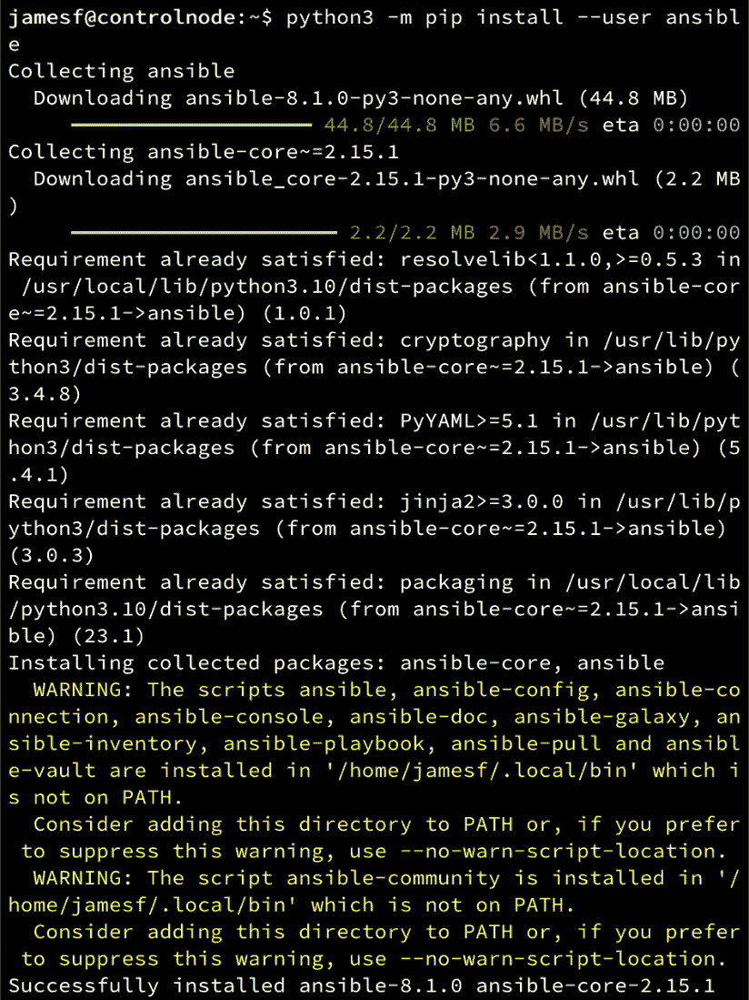

# 第一章：开始使用 Ansible

Ansible 使你能够轻松地使用原生通信协议（如 SSH 和 WinRM）一致且可重复地部署应用程序和系统。因此，Ansible 是无代理的，不需要在被管理系统上安装任何东西（除了 Python，现如今大多数系统上都有 Python）。因此，它使你能够为你的环境构建一个简单而强大的自动化平台。

Ansible 安装简便，并且已经为许多现代系统打包。它的架构是无服务器和无代理的，因此占用资源最少。你可以选择从中央服务器或自己的笔记本电脑运行它——完全由你决定。你可以从一个 Ansible 控制机管理从单一主机到数十万个远程主机的所有机器。所有远程机器都可以通过 Ansible 进行管理，并且通过创建足够的剧本，你可能再也不需要单独登录到这些机器中去。

本章将开始教授你实际操作技能，涵盖 Ansible 的基本知识，从如何在多种操作系统上安装 Ansible 开始。然后我们将探讨如何配置 Windows 主机，以使它们能够通过 Ansible 自动化进行管理，接着深入了解 Ansible 如何与目标主机连接。接下来，我们将讨论节点要求和如何验证你的 Ansible 安装，最后，我们将探讨如何获取并运行最新的 Ansible 源代码，如果你希望为其开发做出贡献或访问最新功能。

本章将涵盖以下主题：

+   安装和配置 Ansible

+   了解你的 Ansible 安装

+   被管理节点的要求

# 技术要求

Ansible 对系统的要求相对较低，因此，如果你的机器（无论是笔记本电脑、服务器，还是 **虚拟机**（**VM**））能够运行 Python，你就能在其上运行 Ansible。本章后续部分将演示如何在多种操作系统上安装 Ansible——因此，最终选择哪些操作系统适合你将由你决定。

对于前述声明的唯一例外是 Microsoft Windows——尽管 Windows 上有可用的 Python 环境，但目前没有适用于 Windows 的 Ansible 原生版本。使用较新版本 Windows 的读者可以通过 **Windows 子系统 Linux**（以下简称 **WSL**）安装 Ansible，只需按照后面为他们选择的 WSL 环境所列的步骤进行操作（例如，如果你在 WSL 上安装 Ubuntu，只需按照本章中为 Ubuntu 安装 Ansible 的说明进行操作）。

# 安装和配置 Ansible

Ansible 用 Python 编写，因此可以在广泛的系统上运行。这包括最流行的 Linux、FreeBSD 和 macOS 版本。唯一的例外是 Windows，尽管存在原生 Python 发行版，但目前尚无原生 Ansible 构建版本。因此，在撰写时，您最好的选择是在 WSL 下安装 Ansible，操作方式与在本地 Linux 主机上运行相同。

一旦确定了您希望在其上运行 Ansible 的系统，安装过程通常很简单。在接下来的部分中，我们将讨论如何在各种不同的系统上安装 Ansible，以便大多数读者应该能够在几分钟内开始并运行 Ansible。

## 理解 Ansible 版本号

在上一版书籍发布时，Ansible 遵循了一个相对简单的版本编号方案。所有的 Ansible 发布版本都包含了所有被接受到 Ansible 发布中的模块、插件和其他代码（在上一版书籍中是版本 2.9）。

这在多年来运行良好，但也为 Ansible 的维护人员创建了问题—随着其流行度和采纳率的增加，模块的数量（这些模块是 Ansible 的命脉，执行您将运行的实际自动化任务）已达数千个。将这些模块与核心 Ansible 软件一起发布意味着，如果在模块中发现了错误或者可能有新功能的新版本可用，则必须在终端用户能够利用之前发布新版本的 Ansible。这不仅减慢了新模块代码的发布速度，还为 Ansible 维护人员创建了大量的工作负担。

作为直接结果，Ansible 被分成两个独立的包。第一个称为`ansible-core`，它仅包含 Ansible 运行时代码（如稍后将看到的`ansible-playbook`命令）以及一些内置功能，这些功能对所有 playbook 和角色都是核心的。`ansible-core`包遵循*经典*的 Ansible 版本控制方案，因此在此书的先前版本围绕 Ansible 2.9 编写时，此书的这个版本将基于`ansible-core` 2.15。

所有模块和插件，这些功能都包含在**Ansible 社区包**发布的 2.9 版本（在实施包拆分之前的最后一个版本）中。这遵循语义化版本控制，这意味着，在撰写时当前版本为 8.0，下一个主要版本将是 9.0。

为了实现 `ansible-core` 和模块、插件等的独立管理，创建了一种名为 **collections** 的实现方式。Collections 是独立捆绑的模块、插件和角色集合，旨在实现特定功能；我们将在 *第六章*《创建和使用 Collections》中详细学习这些内容，所以如果你觉得有些复杂，不必担心——后续内容会逐渐清晰。

每个 Ansible 社区包的发布都依赖于特定版本的 `ansible-core` 包，我们将在本书中使用的 8.0 版本依赖于 `ansible-core` 版本 2.15。你可以在这里查看 8.0 版本的变更日志和其他详细信息：[`github.com/ansible-community/ansible-build-data/blob/8.0.0/8/CHANGELOG-v8.rst#v8-0-0`](https://github.com/ansible-community/ansible-build-data/blob/8.0.0/8/CHANGELOG-v8.rst#v8-0-0)。

这种代码分离的优点在于：假设你想创建一个基于模块中新功能的 playbook 或角色；你可以安装一个更新后的包含该模块的 collection，而不需要更新整个 Ansible 安装（或者，实际上，等待下一个版本发布，就像在 2.9 版本之前那样）。

了解了这些信息后，我们将继续探索如何在各种系统上安装 Ansible 的具体步骤，但在开始之前很重要的一点是，如果你接触过 Ansible 的任何 2.x 版本，新版本的版本管理方案将会有所不同。

如果你想了解有关新版本管理方案、发布周期及其工作方式的更多细节，可以在这里查看官方 Ansible 文档：[`docs.ansible.com/ansible/latest/reference_appendices/release_and_maintenance.xhtml`](https://docs.ansible.com/ansible/latest/reference_appendices/release_and_maintenance.xhtml)。

## 在 Linux 和 FreeBSD 上安装 Ansible

Ansible 的发布周期通常为六个月，在这个较短的周期内，通常会有许多变化，从小的 bug 修复到重大的 bug 修复、新功能，甚至有时是语言的根本性变化。在每个发布周期结束时，你应该会看到一个新的 Ansible 社区包版本（例如 8.0），以及相应版本的 `ansible-core` 包（例如 2.15）。虽然很多操作系统仍然会提供原生包，但这些包的更新频率可能会有所不同，目前推荐的安装 Ansible 方式是使用 Python 的 PIP 包管理器。

当然，这其中会有例外。例如，如果你正在使用商业 Linux 发行版，如**Red Hat 企业 Linux**（**RHEL**），尤其是为了执行操作系统供应商支持的工作流，那么你应确保使用该供应商提供的软件包。它们通常也会提供有关如何安装 Ansible 的说明。

这确实带来了一个单独的挑战。当 Ansible 通过操作系统的本地包管理器如`yum`、`dnf`或`apt`安装时，它会和系统一起更新。而使用 PIP 时，你需要单独更新 Ansible（稍后我们会演示如何操作）。

说到升级，绝大多数在 Ansible 2.x 版本下创建的 playbook 至今仍然可以使用，而且你通常会发现升级不会特别引发任何问题。然而，强烈建议你在每个版本的迁移说明中阅读相关内容，以确保你的代码依然按预期工作。因此，Ansible 升级应该是一个计划好的活动，几乎不建议你按照操作系统的升级来修补 Ansible。简而言之，从操作系统本地软件包转向 PIP 包管理不会引发问题，甚至可能带来好处。

假设你要在某个节点上安装 Ansible——以下步骤应该适用于任何版本的 Linux 或 FreeBSD，只要该节点上安装了所需版本的 Python：

1.  检查你打算使用的节点是否已安装 Python——从现在开始，我们将使用类似以下命令来称呼它为`PATH`：

    ```
    $ python3 --version
    Python 3.10.6
    ```

在这里，你可以看到 Python 3.10.6 已经安装。Ansible 8.0 的最低要求是 Python 3.9，因此在这种情况下，我们可以继续操作。但是，如果你发现没有安装 Python，请参考操作系统文档获取有关如何安装 Python 的指导。

提示

根据你的系统，Python 可能使用诸如`python`、`python3`或`python3.10`之类的命令运行——再次提醒，请参考操作系统文档了解更多信息。Ansible 在这些情况下都能正常工作，但理解如何在系统上运行 Python 对于完成后续步骤非常重要。这里，我们假设使用`python3`命令来执行 Python。

1.  一旦确认 Python 已安装，下一步是确保安装了 PIP 包管理器。成功查询的输出应该类似于下面这样：

    ```
    $ python3 -m pip -V
    pip 22.0.2 from /usr/lib/python3/dist-packages/pip (python 3.10)
    ```

你可能会看到如下输出：

```
$ python3 -m pip -V
/usr/bin/python3: No module named pip
```

在这种情况下，你需要安装 PIP。你可以通过运行以下命令来完成安装：

```
$ curl https://bootstrap.pypa.io/get-pip.py -o get-pip.py
$ python3 get-pip.py --user
```

大多数操作系统也会提供用于安装 PIP 的本地软件包——例如，在 Ubuntu 上，你可以使用以下命令来安装 PIP：

```
$ apt install python3-pip
```

安装 PIP 的方式无关紧要——只要它已经安装，你就可以继续下一步。

1.  完成这些步骤后，剩下的就是安装 Ansible。现在，这可能看起来与以前安装 Ansible 的方式有所不同，以前大多数主要操作系统都提供了操作系统原生的安装包。但使用 PIP 的好处是，一旦你学会了在一个系统上安装和管理 Ansible，其他所有系统的安装方法都是完全相同的，无论你使用的是 Fedora、Ubuntu、FreeBSD、Debian 还是 Gentoo。

事实上，即使你在 WSL 下使用 Linux，一旦 WSL 启动并运行，安装方法也是完全相同的。完成 Ansible 安装的最简单、最直接的方式就是运行以下命令：

```
$ python3 -m pip install --user ansible
```

输出应该类似于下面这样：



图 1.1 – 在 Linux 上使用 PIP 安装 Ansible

从输出中，你可以看到这个命令已经成功安装了 Ansible 8.0.0，以及其依赖包 `ansible-core` 2.15.0——这些是写作时可用的最新版本。

此外，你会注意到 Ansible 已经安装在 `/home/james/.local/bin` 目录下，而该目录不在系统路径中，因此你将无法运行像 `ansible-playbook` 这样的命令，除非你更新路径或指定完整路径。

因此，如果你想运行 `ansible-playbook` 命令，你可以按照以下方式运行：

```
$ /home/$USER/.local/bin/ansible-playbook
```

或者，你也可以更新你的路径，然后你就可以运行命令而无需指定完整路径，具体如下：

```
$ export PATH=$PATH:/home/$USER/.local/bin
$ ansible-playbook --version
ansible-playbook [core 2.15.0]
…
```

当然，这个过程只是为当前用户安装 Ansible。对于大多数场景，这通常已经足够，但有时你可能有多个开发人员访问同一个控制节点，在这种情况下，你会希望他们都访问一个集中安装的 Ansible 副本——否则，一个开发人员可能使用的是版本 6.2.0，另一个使用的是 8.0.0，开发过程就会变得不一致。

如果你想为所有用户安装 Ansible，你应该按照前面的步骤完成*步骤 2*，确保 PIP 已经安装。然后，按照以下步骤操作：

1.  以 root 用户身份安装 Ansible，运行以下命令：

    ```
    $ sudo python3 -m pip install ansible
    ```

1.  现在，你会发现 Ansible 已经集中安装——在我的 Ubuntu Server 22.04 测试系统上，运行此命令后，我看到如下结果：

    ```
    $ which ansible-playbook
    /usr/bin/ansible-playbook
    $ ansible-playbook --version
    ansible-playbook [core 2.15.0]
    …
    ```

然而，PIP 还有更多技巧，我们现在将展示其中的另一个——指定安装版本。

到目前为止，我们只指定了安装 `ansible` 包。如果你总是希望安装最新的版本，这样的做法非常有效，但如果出于开发或一致性的原因，你希望安装特定版本呢？

首先，假设你想安装 Ansible 6.2.0，因为你需要在该版本上进行测试或开发。你可以通过修改你的 `install` 命令来实现：

```
$ python3 -m pip install --user ansible==6.2.0
```

这将安装`6.2.0`版本（以及相应版本的`ansible-core`，在这个例子中是`2.13.8`）到你的本地用户目录，如果你密切关注安装过程，你会看到它会卸载你已经安装的任何版本，即使是更新的版本。如果这不是你想要的结果，请小心操作。

提示

当然，你可以在我们之前给出的任何安装命令后加上`==6.2.0`后缀来指定要安装的版本。你也可以将`6.2.0`更改为任何有效的版本号。你可以通过浏览以下网址来查看可用的版本：[`pypi.org/project/ansible/#history`](https://pypi.org/project/ansible/#history)。

每当你想要升级已安装的 Ansible 版本（当它是通过 PIP 安装时），你只需在安装命令中添加`--upgrade`标志，如下例所示：

```
$ python3 -m pip install --user --upgrade ansible
```

这个示例命令将安装最新版本，因为我们没有显式设置其他版本。

如果你出于某种原因需要从系统中删除 Ansible，PIP 也可以处理这一操作——例如，你可以运行此命令来删除你安装的 Ansible 和`ansible-core`版本（注意，你必须指定两者——依赖项不会自动删除）：

```
$ python3 -m pip uninstall ansible ansible-core
```

一旦你掌握了这些命令，你将能够在所有控制节点上安装、维护和卸载 Ansible。

## 使用虚拟环境

Python 的另一个非常有用且强大的功能是**虚拟环境**（以下简称**venvs**）。Venvs 是与系统安装的 Python（及其库）和所有其他虚拟环境分开的独立 Python 环境。这对 Ansible 开发非常有用。例如，假设你有一套在 Ansible 2.7.18 下开发的 Playbook 和角色，这些都已经过测试并且能够正常工作。你想升级到 Ansible 8.0.0，但你不敢冒险让现有代码无法使用，以防万一需要用到它。

使用虚拟环境（venvs），你可以在同一台机器上拥有一个独立的 Ansible 2.7.18 环境和一个独立的 Ansible 8.0.0 环境，并且可以随时在它们之间切换。要开始，按照接下来提供的步骤进行：

1.  首先，你需要确保你有一个可操作的 Python 环境和 PIP，正如本章前面所述。一旦这些准备就绪，继续进行*步骤 2*。如果你需要回退到 Ansible 2.7.18 的版本，你还需要确保它支持你使用的 Python 版本。我的 Ubuntu Server 22.04 上的 Python 环境是 3.10，而 Ansible 2.7.18 不支持该版本。因此，我将安装 Python 2.7，如下所示：

    ```
    venv installed—this can be installed using PIP, and while most operating systems have a native package for it, Ubuntu Server 22.04 only has it for Python 3\. Thus, I installed it with the following command:

    ```

    $ sudo pip2 install virtualenv

    ```

    ```

1.  你现在已经准备好创建你的第一个虚拟环境——让我们为 Ansible 2.7.18 创建一个虚拟环境：

    ```
    $ python2 -m virtualenv ansible-2.7.18
    ```

1.  这将在当前目录下创建一个包含 Python 2 环境最小文件集的虚拟环境。现在，我们将激活该环境（如果没有这一步，你仍然会使用系统的 Python 环境）：

    ```
    $ . ./ansible-2.7.18/bin/activate
    --user flag is not required in a venv):

    ```

    （ansible-2.7.18）$ python -m pip install ansible==2.7.18

    ```

    ```

1.  你会看到通过 PIP 安装 Ansible，如同以前一样。现在，你应该能够查询已安装的 Ansible 版本，如下所示：

    ```
    (ansible-2.7.18) $ ansible-playbook --version
    ansible-playbook 2.7.18
    …
    ```

1.  就这样——我们已经在自己的 Python 环境中运行了 Ansible 2.7.18，并且完全与系统及其他环境隔离开来。现在，我们可以对 Ansible 8.0.0 重复这一过程。你在此过程中无疑会收到关于 Python 2.7 已废弃的警告（这是预期中的），所以我们确实想使用系统安装的 Python 3.10 来运行较新版本的 Ansible。因此，我们首先需要停用虚拟环境，以便恢复到系统安装的 Python 库。下面是我们可以怎么做：

    ```
    (ansible-2.7.18) $ deactivate
    $
    ```

1.  请注意你的提示符如何恢复正常，表明虚拟环境不再处于活动状态。如之前所示，我们需要确保安装了 Python venv 库——不过，已经有一个本地包，所以我们可以通过以下命令直接安装：

    ```
    $ sudo apt install python3-venv
    ```

1.  现在，你可以为 Ansible 8.0.0 创建一个 Python 3 虚拟环境并使用以下命令激活它：

    ```
    $  python3 -m venv ansible-8.0.0
    $ . ./ansible-8.0.0/bin/activate
    (ansible-8.0.0) $
    ```

1.  你现在可以像以前一样通过 PIP 安装 Ansible：

    ```
    (ansible-8.0.0) $ python3 -m pip install ansible
    …
    (ansible-8.0.0) $  ansible-playbook --version
    ansible-playbook [core 2.15.0]
    deactivate command first, and then using the appropriate activate command as demonstrated previously.
    ```

在这个例子中，我们使用了完全不同版本的 Python 和 Ansible，但它们在系统中依然相互隔离。因此，你可以安全地使用旧版本来运行你的 playbook，同时在更新的版本上测试你的代码。这是一个相当极端的例子，你几乎不需要回到 Python 2.7 和 Ansible 2.7.18，但它展示了如何创建完全独立的 Python 环境来进行开发和测试工作，而不需要多个系统。

## 从 GitHub 安装

从 GitHub 上运行最新版本的 Ansible 一直是可行的，这一点至今依然如此。然而，现在有一个重要的警告。如果你之前已经这样做过（在 2.x 系列或更早版本的 Ansible 上，这本书的上一版正是基于这个版本），那么你会使用完整的 Ansible 安装，包括你可能想要使用的所有模块。自从引入了 collections（集合）后，你现在只会检出 `ansible-core` 的代码。因此，如果你想测试包括模块调用在内的代码，你将需要安装或管理 collections 来与 `ansible-core` 配置一起使用。

我们将在*第六章*《创建和使用集合》中探讨集合的管理，因此我们不会在此处专门探讨此内容——不过，为了完整性，我们将向你展示如何从代码安装 `ansible-core` 开发版。

要做到这一点，请按照以下步骤操作：

1.  请检查是否已安装 PIP——如果没有，请参考本章前面介绍的内容。安装好 PIP（以及推断出来的工作 Python 3 环境）后，你可以继续进行下一步。

1.  像这样克隆 Ansible 的 GitHub 仓库：

    ```
    $ git clone https://github.com/ansible/ansible.git
    $ cd ansible
    ```

1.  使用 PIP 确保你已经安装了所有开发要求：

    ```
    hacking environment setup—this will set your shell up so that you can access the development version of Ansible you just cloned. You will need to do this every time you open a new shell or reconnect to your development host so that the setup is transient, which is normally perfect for development work:

    ```

    ansible、ansible-playbook 和 ansible-galaxy。

    ```

    ```

注意

在 Ubuntu 22.04 等 Linux 发行版上，默认的 Python 安装是 Python 3，执行该 Python 版本的二进制文件名为 `python3`。但这在开发安装的 Ansible 中不可行，因为它期待名为 `python` 的 Python 二进制文件。你可以通过安装一个特殊的元包来解决这个问题。在 Ubuntu 22.04 上，可以运行以下命令：`sudo apt install python-is-python3`。或者，你也可以通过运行以下命令创建一个从 `python3` 到 `python` 的符号链接：`sudo ln -s /usr/bin/python3 /usr/bin/python`。

1.  当你运行 `env-setup` 脚本时，Ansible 会从源代码检出运行，默认清单文件是 `/etc/ansible/hosts`，该文件并未通过代码检出创建；不过，你可以选择性地指定你机器上任意位置的清单文件（详情请见 *如何构建清单*，[`docs.ansible.com/ansible/latest/inventory_guide/intro_inventory.xhtml#inventory-basics-formats-hosts-and-groups`](https://docs.ansible.com/ansible/latest/inventory_guide/intro_inventory.xhtml#inventory-basics-formats-hosts-and-groups)）。以下命令提供了如何执行此操作的示例，但显然，你的文件名和内容几乎肯定会有所不同：

    ```
    $ echo "app01.example.org" > ~/my_ansible_inventory
    $ export ANSIBLE_INVENTORY=~/my_ansible_inventory
    ```

这演示了配置 Ansible 的另一种强大方式——环境变量。`ANSIBLE_INVENTORY` 变量用于告诉 Ansible 默认查找哪个清单文件——通常是 `/etc/ansible/hosts`，但在前面的示例中，我们将其更改为主目录中的 `my_ansible_inventory` 文件。

提示

你可以在这里了解关于各种 Ansible 配置变量的信息：[`docs.ansible.com/ansible/latest/reference_appendices/config.xhtml#environment-variables`](https://docs.ansible.com/ansible/latest/reference_appendices/config.xhtml#environment-variables)。

1.  完成这些步骤后，你可以像本章中讨论的那样运行 Ansible。`env-setup` 脚本会修改你的 `PATH` 变量，这样你就不需要指定检出的 Ansible 仓库的位置。举个例子，如果你按照之前的示范使用环境变量设置了清单，并且克隆了 Ansible 源代码并运行了 `env-setup` 脚本，你可以像我们现在熟悉的那样运行即时命令 `ansible.builtin.ping`，例如：

    ```
    $ ansible all -m ansible.builtin.ping
    [WARNING]: You are running the development version of Ansible. You should only run Ansible from "devel" if you are modifying the Ansible engine,
    or trying out features under development. This is a rapidly changing source of code and can become unstable at any point.
    app01.example.org | SUCCESS => {
        "ansible_facts": {
            "discovered_interpreter_python": "/usr/bin/python3"
        },
        "changed": false,
        "ping": "pong"
    }
    ```

完成这些设置后，你现在可以像通过其他任何方式安装 Ansible 一样，使用开发分支。

1.  当然，Ansible 的源代码树是不断变化的，你不太可能只想一直使用你克隆的副本。当需要更新时，你无需克隆一个新的副本；你可以简单地使用以下命令更新你现有的工作副本：

    ```
    $ git pull –rebase
    $ git submodule update --init --recursive
    ```

这就是我们在 Linux 上安装 Ansible 的过程，现在我们已经完成了这部分，我们将来看一下在 macOS 上安装 Ansible 的一些具体内容。

## 在 macOS 上安装 Ansible

在本节中，你将学习如何在 macOS 上安装 Ansible。最简单的安装方法是使用 Homebrew，但你也可以使用 Python 包管理器（PIP）。使用 PIP 的安装步骤与 Linux 相同，因此我们不会在这里再讲解。

相反，让我们从 Homebrew 安装方法开始，这是在 macOS 上最快和最简单的方法。

如果你还没有在 macOS 上安装 Homebrew，可以按照这里的详细说明轻松安装：

1.  通常，下面显示的两个命令是安装 Homebrew 在 macOS 上所需的全部：

    ```
    $ xcode-select –install
    $ /bin/bash -c "$(curl -fsSL https://raw.githubusercontent.com/Homebrew/install/HEAD/install.sh)"
    ```

如果你已经为了其他目的安装了 Xcode 命令行工具，可能会看到以下错误信息：

```
xcode-select: error: command line tools are already installed, use "Software Update" in System Settings to install updates
```

你可能需要打开 **软件更新** 设置，进入 **系统设置**，检查是否需要更新 Xcode 命令行工具，但只要它们已安装，你的 Homebrew 安装应该能顺利进行。

1.  如果你想确认 Homebrew 安装是否成功，可以运行以下命令，这将警告你安装中可能出现的任何问题——例如，下面的输出警告我们，虽然 Homebrew 安装成功，但它不在我们的 `PATH` 中，因此我们可能无法在不指定绝对路径的情况下运行任何可执行文件：

    ```
    $ brew doctor
    Please note that these warnings are just used to help the Homebrew maintainers
    with debugging if you file an issue. If everything you use Homebrew for is
    working fine: please don't worry or file an issue; just ignore this. Thanks!
    Warning: Homebrew's sbin was not found in your PATH but you have installed
    formulae that put executables in /opt/homebrew/sbin.
    Consider setting the PATH for example like so
    /usr/bin/python3—this should be the case with almost all modern installations of macOS) or you can install a newer version via Homebrew by running the following command:

    ```

    $ brew install python3

    …

    $ which python3

    /opt/homebrew/bin/python3

    $ python3  --version

    Python 3.11.3

    ```

    ```

完成此步骤后，你现在可以继续安装 Ansible。

1.  要通过 Homebrew 安装 Ansible，请运行以下命令：

    ```
    ansible command as before, and if all has gone according to plan, you will see output similar to the following:

    ```

    $ ansible --version

    ansible [core 2.15.0]

    配置文件 = None

    配置的模块搜索路径 = ['/Users/james/.ansible/plugins/modules', '/usr/share/ansible/plugins/modules']

    ansible python 模块位置 = /opt/homebrew/Cellar/ansible/8.0.0/libexec/lib/python3.11/site-packages/ansible

    ansible 集合位置 = /Users/james/.ansible/collections:/usr/share/ansible/collections

    可执行文件位置 = /opt/homebrew/bin/ansible

    python 版本 = 3.11.3 (main, 2023 年 4 月 7 日，20:13:31) [Clang 14.0.0 (clang-1400.0.29.202)] (/opt/homebrew/Cellar/ansible/8.0.0/libexec/bin/python3.11)

    jinja 版本 = 3.1.2

    brew 命令，如下所示：

    ```
    $ brew upgrade ansible
    ```

    ```

    ```

现在你已经学习了如何在 macOS 上安装 Ansible，让我们来看一下如何配置 Windows 主机，以便使用 Ansible 进行自动化。

## 配置 Windows 主机以供 Ansible 使用

如前所述，Windows 上没有直接的 Ansible 安装方法——建议在有 WSL 的情况下，将其安装并像运行 Linux 一样安装 Ansible，按照本章之前概述的过程进行。

尽管有这一限制，Ansible 并不限于管理仅基于 Linux 和 BSD 的系统——它能够使用本地 WinRM 协议对 Windows 主机进行无代理管理，模块和原始命令利用 PowerShell（在每个现代 Windows 安装中都有）。在本节中，你将学习如何配置 Windows，以启用使用 Ansible 进行任务自动化。

以下是 Ansible 在自动化 Windows 主机时所能做到的一些示例：

+   收集远程主机的事实信息

+   安装和卸载 Windows 功能

+   管理和查询 Windows 服务

+   管理用户账户和用户列表

+   使用 Chocolatey 管理软件包（一个 Windows 的软件仓库和管理工具）

+   执行 Windows 更新

+   从远程机器将多个文件获取到 Windows 主机

+   在目标主机上执行原始 PowerShell 命令和脚本

Ansible 允许你通过连接本地用户或域用户来自动化 Windows 机器上的任务。你可以像在 Linux 发行版中使用 `sudo` 命令一样，通过 Windows `runas` 支持以管理员身份运行操作。

此外，作为**开源软件**（**OSS**），Ansible 容易通过创建自定义模块或直接发送原始 PowerShell 命令来扩展其功能。例如，信息安全团队可以使用原生的 Ansible 模块和必要时的原始命令，轻松地管理文件系统**访问控制列表**（**ACLs**）、配置 Windows 防火墙以及管理主机名和域成员身份。

Windows 主机必须满足以下要求，以便 Ansible 控制机与其通信：

+   Ansible 尝试支持微软当前或扩展支持下的所有 Windows 版本，包括 Windows 8.1、10 和 11 等桌面平台，以及 Windows Server 2012（及 R2）、2016、2019 和 2022 等服务器操作系统。

+   你还需要在 Windows 主机上安装 PowerShell 3.0 或更高版本，并至少安装 .NET 4.0。

+   你需要创建并激活 WinRM 监听器，稍后会详细描述。出于安全原因，默认情况下未启用此功能。

让我们更详细地了解如何准备 Windows 主机，以便让 Ansible 自动化：

1.  关于前提条件，您需要确保在 Windows 计算机上安装了 PowerShell 3.0 和 .NET Framework 4.0。在许多现代 Windows 版本中，您会发现这些已经安装好了，但如果您仍在使用旧版本的 PowerShell 或 .NET Framework，您需要升级它们。您可以手动执行此操作，或者以下 PowerShell 脚本可以自动为您处理。您会发现该脚本不是来自官方的 Ansible 仓库——但是，脚本作者是官方 Ansible 仓库的维护者和审阅者。尽管如此，每当下载脚本时，最好检查源代码，确保它符合您的安全协议和要求：  

    ```
    [Net.ServicePointManager]::SecurityProtocol = [Net.SecurityProtocolType]::Tls12
    $url = "https://raw.githubusercontent.com/jborean93/ansible-windows/master/scripts/Upgrade-PowerShell.ps1"
    $file = "$env:temp\Upgrade-PowerShell.ps1"
    $username = "Administrator"
    $password = "Password"
    (New-Object -TypeName System.Net.WebClient).DownloadFile($url, $file)
    Set-ExecutionPolicy -ExecutionPolicy Unrestricted -Force
    &$file -Version 5.1 -Username $username -Password $password -Verbose
    ```

这个脚本通过检查需要安装的程序（如 .NET Framework 4.5.2）和所需的 PowerShell 版本（我们在前面的代码片段最后一行指定了 `5.1`——有效值为 `3.0`、`4.0` 或 `5.1`）以及一个具有管理员权限的账户来工作，因此务必根据您的系统适当设置 `$username` 和 `$password` 变量。如果设置了有效的用户名和密码，并且脚本执行完毕后需要重启，脚本将在重启时自动重新启动并登录，以便无需进一步操作，脚本将继续执行，直到 PowerShell 版本与目标版本匹配。  

需要注意的是，如果凭据设置为启用自动重启，它们也会以明文形式存储在注册表中，因此在脚本执行后，必须检查是否已将它们清除。以下的 PowerShell 代码段将实现这一点，建议在脚本执行后作为常规操作运行，以确保您的凭据不会泄漏：  

```
$reg_winlogon_path = "HKLM:\Software\Microsoft\Windows NT\CurrentVersion\Winlogon"
Set-ItemProperty -Path $reg_winlogon_path -Name AutoAdminLogon -Value 0
Remove-ItemProperty -Path $reg_winlogon_path -Name DefaultUserName -ErrorAction SilentlyContinue
username and password parameters aren’t set, the script will ask the user to reboot and log in manually if necessary, and the next time the user logs in, the script will continue at the point where it was interrupted. The process continues until the host meets the requirements for Ansible automation.
Once you have completed the script run, you should set the execution policy back to a more secure value. For Windows servers, this would be achieved using this PowerShell command:

```

Set-ExecutionPolicy -ExecutionPolicy RemoteSigned -Force  

```

 On Windows clients (for example, Windows 10 or Windows 11), this would be achieved via the following command:

```

Set-ExecutionPolicy -ExecutionPolicy Restricted -Force  

```

 These are the default settings for the aforementioned operating systems, but if you want to check the execution policy setting prior to performing any of the script runs, you can query it before running your scripts with the following command:

```

Get-ExecutionPolicy  

```

 Once you have the required version of PowerShell and the .NET Framework installed, you can move on to the next step.

1.  When PowerShell has been upgraded to at least version 3.0, the next step will be to configure the WinRM service so that Ansible can connect to it. WinRM service configuration defines how Ansible can interface with the Windows hosts, including the listener port and protocol.

If you have never set up a WinRM listener before, you have three options to do this, as follows:

*   Firstly, you can use `winrm quickconfig` for HTTP and `winrm quickconfig -transport:https` for HTTPS. This is the simplest method to use when you need to run outside of the domain environment and just create a simple listener. This process has the advantage of opening the required port in the Windows Firewall and automatically starting the WinRM service.

Note
More recent versions of Windows (for example, Windows Server 2022) will only let you run `winrm quickconfig -transport:https` if you already have a **Secure Sockets Layer** (**SSL**) certificate installed on your node that matches its hostname and is not self-signed. If this is not the case in your environment, the simplest approach is actually to use the PowerShell commands given next.

*   If you are running in a domain environment, I strongly recommend using **group policy objects** (**GPOs**) because if the host is the domain member, then the configuration is done automatically without user input. There are many documented procedures for doing this available, but as this is a very Windows domain-centric task, it is beyond the scope of this book.
*   Finally, you can create a listener with a specific configuration by running the following PowerShell commands with administrative privileges:

    ```

    $selector_set = @{  

    Address = "*"

    Transport = "HTTPS"  

    }  

    $value_set = @{  

    CertificateThumbprint = "2c8951160e63b33593e7bbc3a22414a5ab259717"  

    }  

    New-WSManInstance -ResourceURI "winrm/config/Listener" -SelectorSet $selector_set -ValueSet $value_set  

    ```

The preceding `CertificateThumbprint` value should match the thumbprint of a valid SSL certificate that you previously created or imported into the Windows Certificate Store. Note that if you use this method to configure your WinRM listener, the Windows Firewall is not automatically configured. You can configure it appropriately to listen on port `5986` (HTTPS) using a PowerShell command such as the following:

```

New-NetFirewallRule -DisplayName 'WinRM over HTTPS' -Profile 'Any' -Direction Inbound -Action Allow -Protocol TCP -LocalPort 5986  

```

 In this simple example, we will perform basic authentication against a Windows host—this will only work with local accounts (not domain accounts) but is a quick and easy way to get acquainted with Windows automation. When you are ready to start experimenting with Kerberos authentication, the Ansible documentation provides a valuable reference for you to work from: [`docs.ansible.com/ansible/latest/os_guide/windows_winrm.xhtml`](https://docs.ansible.com/ansible/latest/os_guide/windows_winrm.xhtml).
In the meantime, it is important to note that basic authentication isn’t enabled by default on Windows hosts. To enable it, run the following PowerShell command:

```

Set-Item -Path "WSMan:\localhost\Service\Auth\Basic" -Value $true  

```

 If you are running in PowerShell v3.0, you might face an issue with the WinRM service that limits the amount of memory available. This is a known bug, and a hotfix is available to resolve it. An example process (written in PowerShell) to apply this hotfix is given here:

```

[Net.ServicePointManager]::SecurityProtocol = [Net.SecurityProtocolType]::Tls12  

$url = "https://raw.githubusercontent.com/jborean93/ansible-windows/master/scripts/Install-WMF3Hotfix.ps1"  

$file = "$env:temp\Install-WMF3Hotfix.ps1"  

(New-Object -TypeName System.Net.WebClient).DownloadFile($url, $file)  

powershell.exe -ExecutionPolicy ByPass -File $file -Verbose  

```

 Configuring WinRM listeners can be a complex task, so it is important to be able to check the results of your configuration process. The following command (which can be run from Command Prompt) will display the current WinRM listener configuration:

```

winrm enumerate winrm/config/Listener  

```

 If all goes well, you should have output similar to this:

```

Listener  

Address = *  

Transport = HTTP  

Port = 5985  

Hostname  

Enabled = true  

URLPrefix = wsman  

CertificateThumbprint  

ListeningOn = 10.0.50.100, 127.0.0.1, ::1, fe80::460:ba22:fac4:71ff%5  

Listener  

Address = *  

Transport = HTTPS

Port = 5986

主机名

Enabled = true

URLPrefix = wsman

CertificateThumbprint = 2c8951160e63b33593e7bbc3a22414a5ab259717

ListeningOn = 10.0.50.100, 127.0.0.1, ::1, fe80::460:ba22:fac4:71ff%5

```

 According to the preceding output, two listeners are active—one to listen on port `5985` over HTTP and the other to listen on port `5986` over HTTPS, providing greater security. By way of additional explanation, the following parameters are also displayed in the preceding output:

*   `Transport`: This should be set to either `HTTP` or `HTTPS`, though it is strongly recommended that you use the `HTTPS` listener to ensure your automation commands are not subject to snooping or manipulation.
*   `Port`: This is the port on which the listener operates, by default `5985` for `HTTP` or `5986` for `HTTPS`.
*   `URLPrefix`: This is the URL prefix to communicate with—by default, `wsman`. If you change it, you must set the `ansible_winrm_path` host on your Ansible control host to the same value.
*   `CertificateThumbprint`: If running on an HTTPS listener, this is the certificate thumbprint of the Windows Certificate Store used by the connection.

If you need to debug any connection issues after setting up your WinRM listener, you may find the following commands valuable as they perform WinRM-based connections between Windows hosts without Ansible—hence, you can use them to distinguish whether an issue you might be experiencing is related to your Ansible host or whether there is an issue with the WinRM listener itself:

```

# 测试 HTTP

winrs -r:http://<server address>:5985/wsman -u:Username -p:Password ipconfig

# 测试 HTTPS（如果证书无法验证将失败）

winrs -r:https://<server address>:5986/wsman -u:Username -p:Password -ssl ipconfig

# 测试 HTTPS，忽略证书验证

$username = "Username"

$password = ConvertTo-SecureString -String "Password" -AsPlainText -Force

$cred = New-Object -TypeName System.Management.Automation.PSCredential -ArgumentList $username, $password

$session_option = New-PSSessionOption -SkipCACheck -SkipCNCheck -SkipRevocationCheck

Invoke-Command -ComputerName <server address> -UseSSL -ScriptBlock { ipconfig } -Credential $cred -SessionOption $session_option

```

 If one of the preceding commands fails, you should investigate your WinRM listener setup before attempting to set up or configure your Ansible control host.
At this stage, Windows should be ready to receive communication from Ansible over WinRM. To complete this process, you will need to also perform some additional configuration on your Ansible control host. First of all, you will need to install the `winrm` Python module, which, depending on your control host’s configuration, may or may not have been installed before. The installation method will vary from one operating system to another, but it can generally be installed on most platforms with PIP, as follows:

```

$ python3 -m pip install pywinrm

```

 Once this is complete, you will need to define some additional inventory variables for your Windows hosts—don’t worry too much about inventories for now as we will cover these later in this book. The following example is just for reference:

```

[windows]

10.0.50.101

[windows:vars]

ansible_user=administrator

ansible_password=password

ansible_port=5986

ansible_connection=winrm

ansible_winrm_server_cert_validation=ignore

```

 Finally, you should be able to run the Ansible `ansible.windows.win_ping` module to perform an end-to-end connectivity test with a command such as the following (adjust for your inventory):

```

$ ansible -i inventory -m ansible.windows.win_ping windows

10.0.50.101 | SUCCESS => {

"changed": false,

"ping": "pong"

}

```

 This is just the beginning of Windows automation with Ansible—once you decide on your connectivity strategy and way of configuring (whether it be through Group Policy, PowerShell scripts, or otherwise), you will be able to automate your Windows tasks with as much effectiveness as you automate your Linux tasks.
In Ansible 2.8, support was even added for OpenSSH connectivity to Windows hosts, removing the complexity of WinRM configuration and the various authentication mechanisms. While this looks like a great addition to Ansible’s Windows automation capabilities, it must be stressed that even now (on release 8.0.0) it is marked as experimental and that the future may bring changes that are not backward compatible with the current code. As such, we will not explore the setup here, but if you are interested in experimenting with this Windows support for yourself, you are encouraged to look at this section of the official Ansible documentation: [`docs.ansible.com/ansible/latest/os_guide/windows_setup.xhtml#windows-ssh-setup`](https://docs.ansible.com/ansible/latest/os_guide/windows_setup.xhtml#windows-ssh-setup).
Now that you have learned the fundamental steps to configure Windows hosts for Ansible, let’s see how to manage multiple nodes via Ansible in the next section.
Getting to know your Ansible installation
By this stage in this chapter, regardless of your choice of operating system for your Ansible control machine, you should have a working installation of Ansible with which to begin exploring the world of automation. In this section, we will carry out a practical exploration of the fundamentals of Ansible to help you to understand how to work with it. Once you have mastered these basic skills, you will then have the knowledge required to get the most out of the remainder of this book. Let’s get started with an overview of how Ansible connects to non-Windows hosts.
Understanding how Ansible connects to hosts
With the exception of Windows hosts (as discussed at the end of the previous section), Ansible uses the SSH protocol to communicate with hosts. The reasons for this choice in the Ansible design are many, not least that just about every Linux/FreeBSD/macOS host has it built in, as do many network devices such as switches and routers. The SSH service is normally integrated with the operating system authentication stack, enabling you to take advantage of host-based identity verification, and a variety of authentication mechanisms, including Kerberos, to improve authentication security. Also, features of OpenSSH such as `ControlPersist` are used to increase the performance of automation tasks and SSH jump hosts/bastions for network isolation and security.
Note
`ControlPersist` is enabled by default on most modern Linux distributions as part of the OpenSSH server installation. However, on some older operating systems such as RHEL 6 (and CentOS 6), it is not supported, so you will not be able to use it. Ansible automation is still perfectly possible, but longer playbooks might run slower.
Ansible makes use of the same authentication methods that you will already be familiar with, and SSH keys are normally the easiest way to proceed as they remove the need for users to input the authentication password every time a playbook is run. However, this is by no means mandatory, and Ansible supports password authentication through the use of the `--ask-pass` switch. If you are connecting to an unprivileged account on the managed nodes and need to perform the Ansible equivalent of running commands under `sudo` with a password, you can also add `--ask-become-pass` when you run your playbooks to allow this to be specified at runtime as well.
The goal of automation is to be able to run tasks securely but with minimal user intervention. As a result, it is highly recommended that you use SSH keys for authentication, and if you have several keys to manage, then it is advisable to make use of `ssh-agent`.
Every Ansible task, whether it is run individually or as part of a complex playbook, is run against an inventory. An inventory is, quite simply, a list of hosts that you wish to run automation tasks against. Ansible supports a wide range of inventory formats, including the use of dynamic inventories, which can populate themselves automatically from an orchestration provider (for example, you can generate an Ansible inventory dynamically from your Amazon **Elastic Compute Cloud** (**EC2**) instances, meaning you don’t have to keep up with all of the changes in your cloud infrastructure).
Dynamic inventory plugins have been written for most major cloud providers (for example, Amazon EC2, **Google Cloud Platform** (**GCP**), and Microsoft Azure), as well as on-premises systems such as OpenShift and OpenStack. There are even plugins for Docker. The beauty of OSS is that for most of the major use cases you can dream of, someone has already contributed the code, so you don’t need to figure it out or write it for yourself.
Tip
Ansible’s agentless architecture and the fact that it doesn’t rely on SSL means that you don’t need to worry about DNS not being set up or even time skew problems as a result of the **Network Time Protocol** (**NTP**) not working—these can, in fact, be tasks performed by an Ansible playbook! Ansible really was designed to get your infrastructure running from a virtually bare operating system image.
For now, let’s focus on the INI-formatted inventory. An example is shown here with four servers, each split into two groups. Ansible commands and playbooks can be run against an entire inventory (that is, all four servers), one or more groups (for example, `webservers`), or even a single server:

```

[webservers]

web01.example.org

web02.example.org

[apservers]

app01.example.org

app02.example.org

```

 Let’s use this inventory file along with the Ansible `ping` module, which is used to test whether Ansible can successfully perform automation tasks on the inventory host in question. The following example assumes you have installed the inventory in the default location, which is normally `/etc/ansible/hosts`. When you run the following `ansible` command against this inventory with the `ping` module, you should see output similar to this:

```

$ ansible webservers -m anisble.builtin.ping

web01.example.org | SUCCESS => {

"ansible_facts": {

"discovered_interpreter_python": "/usr/bin/python3"

},

"changed": false,

"ping": "pong"

}

web02.example.org | SUCCESS => {

"ansible_facts": {

"discovered_interpreter_python": "/usr/bin/python3"

},

"changed": false,

"ping": "pong"

}

```

 Notice that the `ansible.builtin.ping` module was only run on the two hosts in the `webservers` group and not the entire inventory—this was by virtue of us specifying this group name in the command-line parameters.
The `ansible.builtin.ping` module is one of many thousands of modules for Ansible, all of which perform a given set of tasks (from copying files between hosts to text substitution to complex network device configuration). Again, as Ansible is OSS, there is a veritable army of coders out there who are writing and contributing modules, which means if you can dream of a task, there’s probably already an Ansible module for it. Even in the instance that no module exists, Ansible supports sending raw shell commands (or PowerShell commands for Windows hosts), and so even in this eventuality, you can complete your desired tasks without having to move away from Ansible.
As long as the Ansible control node can communicate with the managed nodes in your inventory, you can automate your tasks. However, it is worth giving some consideration to where you place your control node. For example, if you are working exclusively with a set of Amazon EC2 machines, it arguably would make more sense for your Ansible control machine to be an EC2 instance—in this way, you are not sending all of your automation commands over the internet. It also means that you don’t need to expose the SSH port of your EC2 hosts to the internet, hence keeping them more secure.
We have so far covered a brief explanation of how Ansible communicates with its target hosts, including what inventories are and the importance of SSH communication to all except Windows hosts. In the next section, we will build on this by looking in greater detail at how to verify your Ansible installation.
Verifying the Ansible installation
In this section, you will learn how you can verify your Ansible installation with simple ad hoc commands.
As discussed previously, Ansible can authenticate with your managed nodes in several ways. In this section, we will assume you want to make use of SSH keys and that you have already generated your public and private key pair and applied your public key to all of the managed nodes that you will be automating tasks on.
Tip
The `ssh-copy-id` utility is incredibly useful for distributing your public SSH key to your target hosts before you proceed any further. An example command might be `ssh-copy-id -i ~/.``ssh/id_rsa ansibleuser@web1.example.com`.
To ensure Ansible can authenticate with your private key, you could make use of `ssh-agent`—the following commands show a simple example of how to start `ssh-agent` and add your private key to it. Naturally, you should replace the path with that to your own private key:

```

$ eval $(ssh-agent)

Agent pid 3064

$ ssh-add ~/.ssh/id_rsa

Identity added: /home/james/.ssh/id_rsa (james@controlnode)

```

 As we discussed in the previous section, we must also define an inventory for Ansible to run against. Another simple example is shown here:

```

[webservers]

web01.example.org

web02.example.org

```

 The `ansible` command that we used in the previous section has two important switches that you will almost always use: `-m <MODULE_NAME>` to run a module on the managed nodes from your inventory that you specify and, optionally, the module arguments passed using the `-a OPT_ARGS` switch. Commands run using the `ansible` binary are known as ad hoc commands.
The following are three simple examples that demonstrate ad hoc commands—they are also valuable for verifying both the installation of Ansible on your control machine and the configuration of your target hosts, and they will return an error if there is an issue with any part of the configuration. Here, we are introducing the `-i` switch, which is used to tell Ansible that we are specifying a different inventory file from the default— we’ll be using this frequently throughout the book from here on:

*   `ping` on your inventory hosts using the following command:

    ```

    $ ansible webservers -i /etc/ansible/hosts -m ansible.builtin.ping

    ```

     *   **Display gathered facts**: You can display gathered facts about your inventory hosts using the following command:

    ```

    $ ansible webservers -i /etc/ansible/hosts -m ansible.builtin.setup | less

    ```

     *   **Filter gathered facts**: You can filter gathered facts using the following command:

    ```

    $ ansible webservers -i /etc/ansible/hosts -m ansible.builtin.setup -a "filter=ansible_distribution*"

    ```

For every ad hoc command you run, you will get a response in JSON format—the following example output results from running the `ansible.builtin.ping` module successfully:

```

$ ansible webservers -m ansible.builtin.ping

web02.example.org | SUCCESS => {

"ansible_facts": {

"discovered_interpreter_python": "/usr/bin/python3"

},

"changed": false,

"ping": "pong"

}

web01.example.org | SUCCESS => {

"ansible_facts": {

"discovered_interpreter_python": "/usr/bin/python3"

},

"changed": false,

"ping": "pong"

}

```

 Ansible can also gather and return facts about your target hosts—facts are all manner of useful information about your hosts, from CPU and memory configuration, to network parameters, to disk geometry. These facts are intended to enable you to write intelligent playbooks that perform conditional actions—for example, you might only want to install a given software package on hosts with more than 4 GB of RAM or perhaps perform a specific configuration only on macOS hosts. The following is an example of the filtered facts from a macOS-based host—note the special syntax of the  `-i` inventory parameter; by placing a comma after the hostname, we are telling the `ansible` command to read the inventory from the command line, rather than a file (a handy shortcut when you’re testing and developing):

```

$ ansible -i machost.example.org, -m ansible.builtin.setup -a "filter=ansible_distribution*" all

machost.example.org | SUCCESS => {

"ansible_facts": {

"ansible_distribution": "MacOSX",

"ansible_distribution_major_version": "13",

"ansible_distribution_release": "22.4.0",

"ansible_distribution_version": "13.3.1",

"discovered_interpreter_python": "/opt/homebrew/bin/python3.11"

},

"changed": false

}

```

 Ad hoc commands are incredibly powerful, both for verifying your Ansible installation and for learning Ansible and how to work with modules, as you don’t need to write a whole playbook—you can just run a module with an ad hoc command and learn how it responds. Here are some more ad hoc examples for you to consider:

*   Copy a file from the Ansible control node to all managed nodes in the `webservers` group with the following command:

    ```

    webservers inventory group, and create it with specific ownership and permissions, as follows:

    ```
    webservers group with the following command:

    ```

    如果 apache2 软件包尚未安装，则使用 apt 安装；如果已经安装，则不更新。同样，这适用于 webservers 库存组中的所有主机。注意--become 开关的存在——因为我们要安装软件包，所以必须使用 sudo*成为*root 用户。此命令假定托管节点上的用户帐户可以执行无需密码的 sudo 命令：

    ```
    state=present to state=latest causes Ansible to install the (latest version of the) package if it is not present, and update it to the latest version if it is present:

    ```

    $ ansible webservers -m ansible.builtin.apt -a "name=apache2 state=latest" --become

    ```

    ```

    ```

    ```

    ```

     *   Display all facts about all the hosts in your inventory (warning—this will produce a lot of JSON!):

    ```

    $ ansible all -m ansible.builtin.setup

    ```

Now that you have learned more about verifying your Ansible installation and about how to run ad hoc commands, let’s proceed to look in a bit more detail at the requirements of nodes that are to be managed by Ansible.
Managed node requirements
So far, we have focused almost exclusively on the requirements for the Ansible control host and have assumed that (except for the distribution of the SSH keys) the target hosts will just work. This, of course, is not always the case, and for example, while a modern installation of Linux installed from an ISO will often just work, cloud operating system images are often stripped down to keep them small, and so might lack important packages such as Python, without which Ansible cannot operate.
If your target hosts are lacking Python, it is usually easy to install it through your operating system’s package management system. Ansible requires you to install either Python version 2.7 or 3.5 (and above) on the Ansible-managed nodes but has more stringent requirements for the control node. At the time of writing, `ansible-core` 2.15 (which accompanies Ansible 8.0.0) requires a version of Python between 3.9 and 3.11 to be installed on the control node. This is likely to change with new releases, so you are advised to always consult the official documentation to check the latest requirements: [`docs.ansible.com/ansible/latest/installation_guide/intro_installation.xhtml#managed-node-requirements`](https://docs.ansible.com/ansible/latest/installation_guide/intro_installation.xhtml#managed-node-requirements).
Tip
Again, the exception here is Windows, which relies on PowerShell instead of Python.
If you are working with operating system images on managed nodes that lack Python, the following commands provide a quick guide to getting Python installed:

*   To install Python using `yum` (on older releases of Fedora and CentOS/RHEL 7 and below), use the following command:

    ```

    使用 dnf 包管理器代替。这里是你需要执行的命令：

    ```
    $ sudo dnf install python
    ```

    ```

You might also elect to install a specific version to suit your needs, as in this example:

```

$ sudo dnf install python39

```

*   On Debian and Ubuntu systems, you would use the `apt` package manager to install Python, again specifying a version if required (the example given here is to install Python 3.10 and would work on Ubuntu 22.04):

    ```

    $ sudo apt update

    $ sudo apt install python3.10

    ```

The `ansible.builtin.ping` module we discussed earlier in this chapter for Ansible not only checks connectivity and authentication with your managed hosts but also uses the managed hosts’ Python environment to perform some basic host checks. As a result, it is a fantastic end-to-end test to give you confidence that your managed nodes are configured correctly, with the connectivity and authentication set up perfectly, and to be safe in the knowledge that if Python is missing, the test would return a `failed` result.
Of course, a perfect question at this stage would be: How can Ansible help if you roll out 100 cloud servers using a stripped-down base image without Python? Does that mean you have to manually go through all 100 nodes and install Python by hand before you can start automating?
Thankfully, Ansible has you covered even in this case, thanks to the `ansible.builtin.raw` module. This module is used to send raw shell commands to the managed nodes—and it works both with SSH-managed hosts and Windows PowerShell-managed hosts. As a result, you can use Ansible to install Python on a whole set of systems from which it is missing, or even run an entire shell script to bootstrap a managed node. Most importantly, the `ansible.builtin.raw` module is one of very few that does not require Python to be installed on the managed node, so it is perfect for our use case where we must roll out Python to enable further automation.
The following are some examples of tasks in an Ansible playbook that you might use to bootstrap a managed node and prepare it for Ansible management:

```

- name: 在没有安装 python3 的主机上引导启动

ansible.builtin.raw: dnf install -y python3 python3-dnf libselinux-python3

- name: 运行一个使用非 POSIX Shell 特性的命令（在这个例子中，/bin/sh 无法同时处理重定向和通配符，但 bash 可以）

ansible.builtin.raw: cat < /tmp/*txt

args:

executable: /bin/bash

- name: 安全使用模板化变量。始终使用引用过滤器以避免注入问题。

ansible.builtin.raw: "{{package_mgr|quote}} {{pkg_flags|quote}} install {{python|quote}}"

```

 We have now covered the basics of setting up Ansible both on the control host and the managed nodes, and we gave you a brief primer on configuring your first connections. It is hoped that you’ve found this chapter helpful and that it forms the foundation for the rest of your journey through this book.
Summary
Ansible is a powerful and versatile yet simple automation tool, of which the key benefits are its agentless architecture and its simple installation process. Ansible was designed to get you from zero to automation rapidly and with minimal effort, and we have demonstrated the simplicity with which you can get up and running with Ansible in this chapter.
In this chapter, you learned the basics of setting up Ansible—how to install it to control other hosts, and the requirements for nodes being managed by Ansible. You learned about the fundamentals required to set up SSH and WinRM for Ansible automation, as well as how to bootstrap managed nodes to ensure they are suitable for Ansible automation. You also learned about ad hoc commands and their benefits. Finally, you learned how to run the latest version of the code directly from GitHub, which both enables you to contribute directly to the development of Ansible and gives you access to the very latest features should you wish to make use of them on your infrastructure.
In the next chapter, we will learn Ansible language fundamentals to enable you to write your first playbooks and to help you to create templated configurations and start to build up complex automation workflows.
Questions

1.  On which operating systems can you set up an Ansible control node? (There are multiple correct answers.)
    1.  Ubuntu 22.04
    2.  Fedora 35
    3.  Windows Server 2022
    4.  HP-UX
    5.  Mainframe
2.  Which protocol does Ansible use to connect to non-Windows managed nodes for running tasks?
    1.  HTTP
    2.  HTTPS
    3.  SSH
    4.  TCP
    5.  UDP
3.  To execute a specific module in the Ansible ad hoc command line, you need to use the `-``m` option.
    1.  True
    2.  False

Further reading

*   For any questions about installation via Ansible’s mailing list on Google Groups, refer to the following URL:

[`groups.google.com/forum/#!forum/ansible-project`](https://groups.google.com/forum/#!forum/ansible-project)

*   Information on how to install the latest version of `pip` can be found here:

[`pip.pypa.io/en/stable/installation/`](https://pip.pypa.io/en/stable/installation/)

*   Details of specific Windows modules using PowerShell can be found here:

[`docs.ansible.com/ansible/latest/collections/ansible/windows/index.xhtml`](https://docs.ansible.com/ansible/latest/collections/ansible/windows/index.xhtml)

*   If you have a GitHub account and want to follow the GitHub project, you can keep tracking issues, bugs, and ideas for Ansible at the following URL:

[`github.com/ansible/ansible`](https://github.com/ansible/ansible)

```
