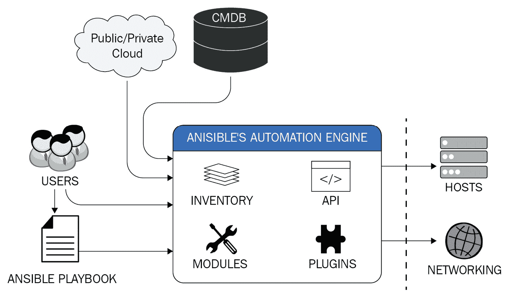
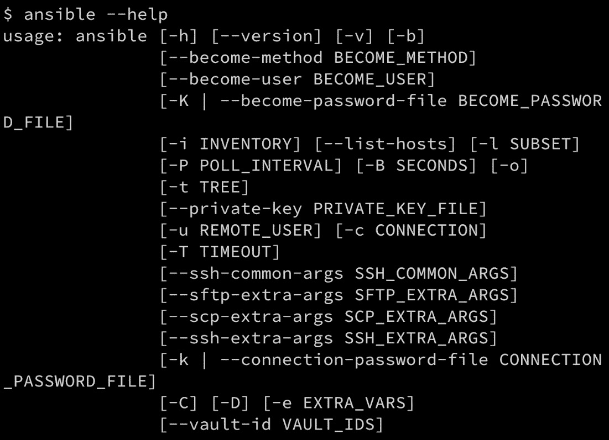

# 第二章：理解 Ansible 基础

从本质上讲，Ansible 是一个简单的框架，它将一个叫做 **Ansible 模块** 的小程序推送到目标节点。模块是 Ansible 的核心，负责执行自动化的所有繁重工作。然而，Ansible 框架不仅仅是如此，它还包括插件和动态清单管理，并且通过 playbook 将这些功能结合起来，用于自动化基础设施供应、配置管理、应用部署、网络自动化等，正如所示：



图 2.1 – Ansible 自动化引擎的典型流程和使用方式

即使在本书的上一版本添加了 Ansible 集合，这一架构仍然保持不变——现在，模块、插件和动态清单脚本通过集合分发，而以前所有内容都是作为 Ansible 发布的一部分进行分发的。

Ansible 只需要在管理节点上安装。从那里，它通过网络的传输层（通常是 SSH 或 WinRM）分发所需的模块来执行任务，并在任务完成后将其删除。通过这种方式，Ansible 保持了其无代理架构，不会在目标节点上留下可能仅为一次性自动化任务所需的代码。

在本章中，您将了解更多关于 Ansible 框架的组成及其各种组件，并学习如何将它们结合使用，在 YAML 语法编写的 playbook 中使用。您将学习如何为 IT 操作任务创建自动化代码，并了解如何通过临时任务和更复杂的 playbook 来应用这些代码。最后，您将学习如何使用 Jinja2 模板重复构建动态配置文件，利用变量和动态表达式。

本章将涵盖以下主题：

+   熟悉 Ansible 框架

+   探索配置文件

+   命令行参数

+   定义变量

+   理解 Jinja2 过滤器

# 技术要求

本章假设您已经成功安装了最新版本的 Ansible（截至写作时为 8.0 版本，`ansible-core` 2.15），并且是在 Linux 节点上安装的，正如在 *第一章*《与 Ansible 入门》中所讨论的内容。还假设您至少有一个其他的 Linux 主机来测试自动化代码。可用的主机越多，您就能在本章中开发更多的示例，并进一步了解 Ansible。本书假定 Linux 主机之间有 SSH 通信，并且您已具备一定的 Linux 使用经验。

本章的代码包可以在 [`github.com/PacktPublishing/Practical-Ansible-Second-Edition/tree/main/Chapter%202`](https://github.com/PacktPublishing/Practical-Ansible-Second-Edition/tree/main/Chapter%202) 上获取。

# 熟悉 Ansible 框架

在本节中，您将学习 Ansible 框架如何适配 IT 操作。我们将解释如何首次运行 Ansible。理解这个框架后，您将准备好学习更高级的概念，比如创建并运行带有您自己清单的 playbook。

为了通过 SSH 连接从您的 Ansible 控制主机到多个远程主机运行 Ansible 的临时命令，您需要确保在控制主机上安装了最新版本的 Ansible。使用以下命令确认安装的是最新版本的 Ansible：

```
$ ansible --version
ansible [core 2.15.0] (2.15 82b47c8d5c) last updated 2023/05/19 15:21:43 (GMT +000)
  config file = None
  configured module search path = ['/home/james/.ansible/plugins/modules', '/usr/share/ansible/plugins/modules']
  ansible python module location = /home/james/ansible-2.15/ansible/lib/ansible
  ansible collection location = /home/james/.ansible/collections:/usr/share/ansible/collections
  executable location = /home/james/ansible-2.15/ansible/bin/ansible
  python version = 3.10.6 (main, Mar 10 2023, 10:55:28) [GCC 11.3.0] (/usr/bin/python)
  jinja version = 3.0.3
  libyaml = True
```

您还需要确保与您在清单中定义的每个远程主机具有 SSH 连接性。您可以通过在每个远程主机上进行简单的手动 SSH 连接测试来验证连接性，因为 Ansible 在所有远程 Linux 自动化任务中都会使用 SSH：

```
$ ssh <username>@web01.example.org
The authenticity of host 'web01.example.org (10.0.50.30)' can't be established.
ED25519 key fingerprint is SHA256:hU+saFERGFDERW453tasdFPAkpVws.
Are you sure you want to continue connecting (yes/no)? yes
password:<Input_Your_Password>
```

在本节中，我们将带您了解 Ansible 的工作原理，从一些简单的连接性测试开始。通过以下简单的步骤，您可以了解 Ansible 框架如何访问多个主机并执行您的任务：

1.  创建或编辑您的默认清单文件，`/etc/ansible/hosts`（您还可以通过传递如`–-inventory=/path/inventory_file`等选项指定自定义清单文件的路径）。向您的清单中添加一些示例主机——这些必须是实际机器的 IP 地址或主机名，以便 Ansible 测试。以下是我的网络中的一些示例，但您需要用您自己的设备替换这些。每行添加一个主机名（或 IP 地址）：

    ```
    web01.example.org
    web02.example.org
    app01.example.org
    app02.example.org
    ```

所有主机应使用可解析的地址指定——即，Ansible 控制节点上的 `/etc/hosts` 文件）。或者，如果没有设置 DNS 或主机条目，也可以使用 IP 地址。无论您选择何种格式的清单地址，都应该能够成功连接到每个主机。除非您已设置严格的防火墙规则，否则对每个主机进行简单的 ping 测试即可作为验证。以下是一个示例输出：

```
$ ping web01.example.org
PING web01.example.org (10.0.50.30) 56(84) bytes of data.
64 bytes from web01.example.org (10.0.50.30): icmp_seq=1 ttl=64 time=1.02 ms
64 bytes from web01.example.org (10.0.50.30): icmp_seq=2 ttl=64 time=1.01 ms
64 bytes from web01.example.org (10.0.50.30): icmp_seq=3 ttl=64 time=0.957 ms
64 bytes from web01.example.org (10.0.50.30): icmp_seq=4 ttl=64 time=1.16 ms
```

1.  为了使自动化过程更加流畅，我们将生成一个 SSH 认证密钥对，这样每次运行 playbook 时就不需要输入密码。如果您还没有 SSH 密钥对，可以使用以下命令生成一个：

    ```
    $ ssh-keygen
    ```

当您运行`ssh-keygen`工具时，您将看到类似以下的输出。请注意，当提示时，您应该将`passphrase`变量留空；否则，每次运行 Ansible 任务时，您都需要输入密码，这样就失去了使用 SSH 密钥认证的便利性（尽管这确实能增强安全性，如果密钥落入错误之手，因此在使用 SSH 密钥对时请考虑这一点）：

```
$ ssh-keygen
Generating public/private rsa key pair.
Enter file in which to save the key (/home/james/.ssh/id_rsa): <Enter>
Enter passphrase (empty for no passphrase): <Press Enter>
Enter same passphrase again: <Press Enter>
Your identification has been saved in /home/james/.ssh/id_rsa.
Your public key has been saved in /home/james/.ssh/id_rsa.pub.
The key fingerprint is:
SHA256:1IF0KMMTVAMEQF62kTwcG59okGZLiMmi4Ae/BGBT+24 james@controlnode.example.org
The key's randomart image is:
+---[RSA 2048]----+
|=*=*BB==+oo |
|B=*+*B=.o+ . |
|=+=o=.o+. . |
|...=. . |
| o .. S |
| .. |
| E |
| . |
| |
+----[SHA256]-----+
```

1.  尽管有些条件下您的 SSH 密钥会自动获取，但建议您使用 `ssh-agent`，因为这样可以加载多个密钥来对抗各种目标，而无需担心密钥名称和路径是否正确。即使现在用处不大，将来对您也将非常有用。按以下方式启动 `ssh-agent`，然后添加您的新认证密钥（注意，您需要为每个打开的 shell 执行此操作）：

    ```
    $ eval $(ssh-agent)
    $ ssh-add ~/.ssh/id_rsa
    ```

1.  在您可以使用目标主机进行基于密钥的身份验证之前，您需要将刚生成的密钥对的公钥应用于每个主机。您可以使用以下命令将密钥逐个复制到每个主机：

    ```
    $ ssh-copy-id -i ~/.ssh/id_rsa.pub web01.example.org
    /usr/bin/ssh-copy-id: INFO: Source of key(s) to be installed: "~/.ssh/id_rsa.pub"
    /usr/bin/ssh-copy-id: INFO: attempting to log in with the new key(s), to filter out any that are already installed
    /usr/bin/ssh-copy-id: INFO: 1 key(s) remain to be installed -- if you are prompted now it is to install the new keys
    james@web01.example.org's password:
    Number of key(s) added: 1
    Now try logging into the machine, with: "ssh 'web01.example.org'"
    ansible.builtin.ping command on the hosts you put in your inventory file. You will find that you are not prompted for a password at any point as the SSH connections to all the hosts in your inventory are authenticated with your SSH key pair. So, you should see an output similar to the following:

    ```

    $ ansible -i hosts -m ansible.builtin.ping all

    web01.example.org | SUCCESS => {

    "ansible_facts": {

    "discovered_interpreter_python": "/usr/bin/python3"

    },

    "changed": false,

    "ping": "pong"

    }

    app02.example.org | SUCCESS => {

    "ansible_facts": {

    "discovered_interpreter_python": "/usr/bin/python3"

    },

    "changed": false,

    "ping": "pong"

    }

    web02.example.org | SUCCESS => {

    "ansible_facts": {

    "discovered_interpreter_python": "/usr/bin/python3"

    },

    "changed": false,

    "ping": "pong"

    }

    app01.example.org | SUCCESS => {

    "ansible_facts": {

    "discovered_interpreter_python": "/usr/bin/python3"

    },

    "changed": false,

    "ping": "pong"

    }

    ```

    ```

这个示例输出是使用 Ansible 的默认详细级别生成的。如果在此过程中遇到问题，您可以通过在运行 `ansible` 命令时传递一个或多个 `-v` 开关来增加 Ansible 的详细级别。对于大多数问题，建议您使用 `-vvvv`，这将为您提供丰富的调试信息，包括原始的 SSH 命令及其输出。例如，假设某个主机（如 `web02.example.org`）无法连接，并且您收到类似以下错误：

```
web02.example.org | UNREACHABLE! => {
    "changed": false,
    "msg": "Failed to connect to the host via ssh: ssh: connect to host web02.example.org port 22: Connection refused",
    "unreachable": true
-vvvv flag could potentially produce pages of output and so, to save space, we won’t include an example here—experimenting with the verbosity levels is left as an exercise for you. When you generate output with this highest level of verbosity, you will see that it includes many useful details, such as the raw SSH command that was used to generate the connection to the target host in the inventory, along with any error messages that may have resulted from that call. This can be incredibly useful when debugging connectivity or code issues, although the output might be a little overwhelming at first. However, with some practice, you will quickly learn how to interpret it.
By now, you should have a good idea of how Ansible communicates with its clients over SSH. Let’s proceed to the next section, where we will look in more detail at the various components that make up Ansible, as this will help us understand how to work with it better.
Breaking down the Ansible components
Ansible allows you to define policies, configurations, task sequences, and orchestration steps in playbooks—the limit is really only your imagination. A playbook can be executed to manage your tasks either synchronously or asynchronously on a remote machine, although you will find that just about all examples are synchronous. In this section, you will learn about the main components of Ansible and understand how Ansible employs those components to communicate with remote hosts.
In order to understand the various components, we first need an inventory to work from. Let’s create an example one, ideally with multiple hosts in it—here we will reuse the one we created earlier in this chapter. However, you are free to create your own, and while I have set up name resolution for this example, to give machines more friendly names, remember that you can get started with IP addresses if you don’t want to add name resolution just yet.
To really understand how Ansible—as well as its various components—works, we first need to create an Ansible playbook. While the ad hoc commands that we have experimented with so far are useful in their own right, they are just single **tasks**, whereas playbooks are organized groups of tasks that are (usually) run in sequence. Conditional logic can be applied and in any other programming language, playbooks would be considered as your code. At the head of the playbook, you should specify the name of your **play**—although this is not mandatory, it is good practice to name all your plays and tasks as, without this, it would be quite hard for someone else to interpret what the playbook does, or even for you to do so if you come back to it after some time.
Let’s get started with building our first example playbook:

1.  Specify the play name and inventory hosts to run your tasks against at the very top of your playbook. Also, note the use of `---`, which denotes the beginning of a YAML file (all Ansible playbooks that are written in YAML):

    ```

    ---

    - name: 我的第一个 Ansible playbook

    hosts: all

    ```

     2.  After this, we will tell Ansible that we want to perform all the tasks in this playbook as a superuser (usually `root`). We do this with the following statement (to aid your memory, think of `become` as shorthand for `become superuser`):

    ```

    become: yes

    ```

     3.  After this header, we will specify a task block that will contain one or more tasks to be run in sequence. For now, we will simply create one task to update the version of Apache using the `ansible.builtin.apt` module (because of this, this playbook is only suitable for running against Debian- or Ubuntu-derived hosts). We will also specify a special element of the play called a **handler**. Handlers will be covered in greater detail in *Chapter 4*, *Playbooks and Roles*, so don’t worry too much about them for now. Simply put, a handler is a special type of task that is called only if something changes. So, in this example, the handler code restarts the web server, but only if it is installed or updated, preventing unnecessary restarts if the playbook is run several times and there are no updates for Apache. The following code performs these functions exactly and should form the basis of your first playbook:

    ```

    tasks:

    - name: 安装/更新到最新的 Apache Web 服务器

    ansible.builtin.apt:

    name: apache2

    state: latest

    notify:

    - 重新启动 Apache Web 服务器

    handlers:

    - name: 重新启动 Apache Web 服务器

    ansible.builtin.service:

    name: apache2

    state: restarted

    ```

Congratulations, you now have your very first Ansible playbook! If you run this now, you should see it iterate through all the web hosts in your inventory, where it will install or update in the `apache2` package as required, and then only restart the service where the package was installed/updated.
In the following command to run the playbook, we have introduced a new switch, `--limit`, which is used when you want to run a playbook on only part of an inventory. In our example, I have four hosts in my inventory, but I only want to install `apache2` on the ones named `web*`, which I specify using the `--limit web*` option. These, of course, are based on the hostnames I have used in my demo environment for this book, and you should change your limit pattern to match your environment:

```

$ ansible-playbook -i hosts --limit web* playbook.yml

PLAY [我的第一个 Ansible playbook] **********************************************************

TASK [收集事实] ***************************************************

ok: [web02.example.org]

ok: [web01.example.org]

TASK [安装/更新到最新的 Apache Web 服务器] **********************************************************

changed: [web01.example.org]

changed: [web02.example.org]

RUNNING HANDLER [重新启动 Apache Web 服务器] **********************************************************

changed: [web02.example.org]

changed: [web01.example.org]

PLAY RECAP **********************************************************

web01.example.org : 成功=3    更改=2    无法访问=0    失败=0    跳过=0    救援=0    忽略=0

web02.example.org : 成功=3    更改=2    无法访问=0    失败=0    跳过=0    救援=0    忽略=0

```

 If you examine the output from the playbook, you can see the value in naming not only the play but also each task that is executed, as it makes interpreting the output of the run a very simple task. You will also see that there are multiple possible results from running a task; in the preceding example, we can see two of these results—`ok` and `changed`. Most of these results are fairly self-explanatory, with `ok` meaning the task ran successfully and that nothing changed as a result of the task completing. An example of this in the preceding playbook is the `Gathering Facts` stage, which is a read-only task that gathers information about the target hosts. As a result, it can only ever return `ok` or a failed status, such as `unreachable`, if the host is down. It should never return `changed`.
However, you can see in the preceding output that both hosts needed to install/upgrade their `apache2` package and, as a result of this, the results from the `Install/Update to the latest of Apache Web Server` task are `changed` for all the hosts. This `changed` result means the task ran successfully (as for `ok`) but that a change was made to the managed node. It also means that our `handler` instance is notified and so the web server service is restarted.
If we run the playbook a second time straight away, we know that it is hugely unlikely that the `apache2` package will need upgrading again. Notice how the playbook output differs this time:

```

执行 [我的第一个 Ansible 剧本] **********************************************************

任务 [收集信息] ************************************************************

成功：[web02.example.org]

成功：[web01.example.org]

任务 [安装/更新到最新版本的 Apache Web Server] ***********************************************************

成功：[web01.example.org]

成功：[web02.example.org]

执行回顾 **********************************************************

web01.example.org : 成功=2    更改=0    无法访问=0    失败=0    跳过=0    救援=0    忽略=0

web02.example.org : 成功=2    更改=0    无法访问=0    失败=0    跳过=0    救援=0    忽略=0

```

 You can see that this time, the output from the `Install/Update to the latest of Apache Web Server` task is `ok` for both hosts, meaning no changes were applied (the package was not updated). As a result of this, our handler is not notified and does not run—you can see that it does not even feature in the preceding playbook output. This distinction is important—the goal of an Ansible playbook (and the modules that underpin Ansible) should be to only make changes when they need to be made. If everything is all up to date, then the target host should not be altered. Unnecessary restarts to services should be avoided, as should unnecessary alterations to files. In short, Ansible playbooks are (and should be) designed to be efficient and to achieve a target machine state.
This has very much been a crash course on writing your first playbook, but hopefully, it has given you a taste of what Ansible can do when you move from single ad hoc commands through to more complex playbooks. Before we explore the Ansible language and components any further, let’s take a more in-depth look at the YAML language that playbooks are written in.
Learning the YAML syntax
In this section, you will learn how to write a YAML file with the correct syntax, and the various constructs you will see time and again on your Ansible automation journey. Ansible uses YAML because it is easier for humans to read and write than other common data formats, such as XML or JSON. There are no commas, curly braces, or tags to worry about, and the enforced indentation in the code ensures that it is tidy and easy on the eye. In addition, there are libraries available in most programming languages for working with YAML.
This reflects one of the core goals of Ansible—to produce easy-to-read (and write) code that describes the target state of a given host. Ansible playbooks are (ideally) supposed to be self-documenting, as documentation is often an afterthought in busy technology environments—so, what better way to document than through the automation system responsible for deploying code?
Before we dive into the YAML structure, a word on the files themselves. Files written in YAML can optionally begin with `---` (as seen in the example playbook in the previous section) and end with `...`. This applies to all files in YAML, regardless of whether they are consumed by Ansible or another system, and indicates that the file is in the YAML language. You will find that most examples of Ansible playbooks (as well as roles and other associated YAML files) start with `---` but do not end with `...`—the header is sufficient to clearly denote that the file uses the YAML format.
Let’s explore the YAML language through the example playbook we created in the preceding section:

1.  Lists are an important construct in the YAML language—in fact, although it might not be obvious, the `tasks:` block of the playbook is actually a YAML list. A list in YAML contains all of its items at the same indentation level, with each item in the list preceded by a `-`. For example, we updated the `apache2` package from the preceding playbook using the following code:

    ```

    - 名称：安装/更新到最新版本的 Apache Web Server

    ansible.builtin.apt:

    名称：apache2

    状态：最新

    ```

However, we could have specified a list of packages to be upgraded as follows:

```

- 名称：安装/更新到最新版本的 Apache Web Server

ansible.builtin.apt:

名称：

- apache2

- apache2-utils

状态：最新

```

 Now, rather than passing a single value to the `name:` key as a string, we pass a YAML-formatted list containing the names of two packages to be installed/updated. Only certain modules support this so do refer to the documentation to establish which ones you can pass lists to.

1.  Dictionaries are another important concept in YAML—they are represented by a `key: value` format, as we have already extensively seen, but all of the items in the dictionary are indented by one more level. This is easiest explained by an example, so consider the following code from our example playbook:

    ```

    ansible.builtin.service:

    名称：apache2

    状态：重启

    ```

In this example (from `handler`), the `ansible.builtin.service` definition is actually a dictionary and both the `name` and `state` keys are indented with two more spaces than the `ansible.builtin.service` key. This higher level of indentation means that the `name` and `state` keys are associated with the `ansible.builtin.service` key, therefore, in this case, telling the `ansible.builtin.service` module which service to operate on (`apache2`) and what to do with it (restart it).
Using these examples, we can see that you can produce quite complicated data structures by mixing lists and dictionaries.

1.  As you become more proficient at playbook design (as you progress through the book, you will certainly become more proficient), you may very well start to produce quite complicated variable structures that you will put into their own separate files to keep your playbook code readable. The following is an example of a `variables` file that provides the details of two employees of a company:

    ```

    ---

    员工：

    - 名称：daniel

    全名：Daniel Oh

    角色：DevOps 布道者

    水平：专家

    技能：

    - Kubernetes

    - 微服务

    - Ansible

    - Linux 容器

    - 名称：michael

    全名：Michael Smith

    角色：企业架构师

    水平：高级

    技能：

    - 云

    - 中间件

    - Windows

    - 存储

    ```

In this example, you can see that we have a dictionary containing the details of each employee. The employees themselves are list items (you can spot this because the lines start with `-`) and, equally, the employee skills are denoted as list items. You will notice the `fullname`, `role`, `level`, and `skills` keys are at the same indentation level as `name` but do not feature `-` before them. This tells you that they are in the dictionary with the list item itself, and so they represent the details of the employee.

1.  YAML is very literal when it comes to parsing the language and a new line always represents a new line of code. What if you actually need to add a block of text (for example, to a variable)? In this case, you can use a literal block scalar, `|`, to write multiple lines and YAML will faithfully preserve the new lines, carriage returns, and all the whitespace that follows each line (note, however, that the indentation at the beginning of each line is part of the YAML syntax):

    ```

    专业特长：|

    敏捷方法论

    云原生应用开发实践

    高级企业 DevOps 实践

    ```

So, if we were to get Ansible to print the preceding content to the screen, it would display as follows (note that the preceding two spaces have gone—they were interpreted correctly as part of the YAML language and not printed):

```

敏捷方法论

云原生应用开发实践

高级企业 DevOps 实践

```

 Similar to the preceding is the folded block scalar, `>`, which does the same as the literal block scalar but does not preserve line endings. This is useful for very long strings that you want to print on a single line, but also want to wrap across multiple lines in your code for the purpose of readability. Take the following variation of our example:

```

专业特长：>

敏捷方法论

云原生应用开发实践

高级企业 DevOps 实践

```

 Now, if we were to print this, we would see the following:

```

敏捷方法论云原生应用开发实践高级企业 DevOps 实践

```

 We could add trailing spaces to the preceding example to stop the words from running into each other, but I have not done this here as I wanted to provide you with an easy-to-interpret example.
As you review playbooks, variable files, and so on, you will see these structures used over and over again. Although simple in definition, they are very important—a missed level of indentation or a missing `-` instance at the start of a list item can cause your entire playbook to fail to run. As we discovered, you can put all of these various constructs together. One additional example is provided in the following code block of a `variables` file for you to consider, which shows the various examples we have covered all in one place:

```

---

服务器：

- 前端

- 后端

- 数据库

- 缓存

员工：

- 名称：daniel

全名：Daniel Oh

角色：DevOps 布道者

水平：专家

技能：

- Kubernetes

- 微服务

- Ansible

- Linux 容器

- 名称：michael

全名：Michael Smiths

角色：企业架构师

水平：高级

技能：

- 云

- 中间件

- Windows

- 存储

专业特长：|

敏捷方法论

云原生应用开发实践

高级企业 DevOps 实践

```

 You can also express both dictionaries and lists in an abbreviated form, known as `employees` variable file:

```

---

员工：[{"全名": "Daniel Oh","水平": "专家","名称": "daniel","角色": "DevOps 布道者","技能": ["Kubernetes","微服务","Ansible","Linux 容器"]},{"全名": "Michael Smiths","水平": "高级","名称": "michael","角色": "企业架构师","技能":["云","中间件","Windows","存储"]}]

```

 Although this displays exactly the same data structure, you can see how difficult it is to read with the naked eye. Flow collections are not used extensively in YAML and I would not recommend you make use of them yourself, but it is important to understand them in case you come across them. You will also notice that although we’ve started talking about variables in YAML, we haven’t expressed any variable types. YAML tries to make assumptions about variable types based on the data they contain, so if you want to assign `1.0` to a variable, YAML will assume it is a floating-point number. If you need to express it as a string (perhaps because it is a version number), you need to put quotation marks around it, which causes the YAML parser to interpret it as a string instead, such as in the following example:

```

版本： "2.0"

```

 This completes our look at the YAML language syntax. Now that’s complete, in the next section, let’s take a look at ways that you can organize your automation code to keep it manageable and tidy.
Organizing your automation code
As you can imagine, if you were to write all of your required Ansible tasks in one massive playbook, it would quickly become unmanageable—that is to say, it would be difficult to read, difficult for someone else to pick up and understand, and—most of all—difficult to debug when things go wrong. Ansible provides a number of ways for you to divide your code into manageable chunks; perhaps the most important of these is the use of **roles**. Roles (for the sake of a simple analogy) behave like a library in a conventional high-level programming language. We will go into more detail about roles in *Chapter 4*, *Playbooks* *and Roles*.
There are, however, other ways that Ansible supports splitting your code into manageable chunks, which we will explore briefly in this section as a precursor to the more in-depth exploration of roles later in this book.
Let’s build up a practical example. To start, we know that we need to create an inventory for Ansible to run against. In this instance, we’ll create four notional groups of servers, with each group containing two servers. Our hypothetical example will contain a frontend server and application servers for a fictional application, located in two different geographic locations. Our inventory file will be called `production-inventory` and the example contents are as follows:

```

[frontends_na_zone]

frontend1-na.example.com

frontend2-na.example.com

[frontends_emea_zone]

frontend1-emea.example.com

frontend2-emea.example.com

[appservers_na_zone]

appserver1-na.example.com

appserver2-na.example.com

[appservers_emea_zone]

appserver1-emea.example.com

appserver2-emea.example.com

```

 Now, obviously, we could just write one massive playbook to address the required tasks on these different hosts, but as we have already discussed, this would be cumbersome and inefficient.
Let’s instead break the task of automating these different hosts down into smaller playbooks:

1.  Create a playbook to run a connection test on a specific host group, such as `frontends_na_zone`. Put the following contents into the playbook:

    ```

    ---

    - hosts: frontends_na_zone

    remote_user: james

    gather_facts: no

    任务:

    - name: simple connection test

    ansible.builtin.ping:

    ```

     2.  Now, try running this playbook against the hosts. (Note that we have configured it to connect to a remote user on the inventory system, called `james`. If you wish to attempt this example yourself, you will need to set up your own user account and change the `remote_user` line of your playbook accordingly. Also remember to set up SSH keys and authentication as we demonstrated earlier in this chapter.) When you run the playbook after setting up the authentication, you should see output like the following:

    ```

    $ ansible-playbook -i production-inventory frontends-na.yml

    执行 [frontends_na_zone] ******************************************************

    任务 [简单连接测试] *****************************************************

    ok: [frontend2-na.example.com]

    ok: [frontend1-na.example.com]

    执行回顾 **********************************************

    frontend1-na.example.com   : ok=1    changed=0    unreachable=0    failed=0     skipped=0    rescued=0    ignored=0

    使用 ansible.builtin.ping 模块进行连接测试，但在实际情况中，您将执行更复杂的任务，例如安装软件包或修改文件。指定此 playbook 针对 appservers_emea_zone 清单中的主机组运行。将以下内容添加到 playbook 中：

    ```
    ---
    - hosts: appservers_emea_zone
      remote_user: james
      gather_facts: no
      tasks:
        - name: simple connection test
          ansible.builtin.ping:
    ```

    ```

As before, you need to ensure you can access these servers, so either create the `james` user and set up authentication to that account or change the `remote_user` line in the example playbook. Once you have done this, you should be able to run the playbook and you will see output similar to this:

```

$ ansible-playbook -i production-inventory appservers-emea.yml

执行 [appservers_emea_zone] ******************************************************

任务 [简单连接测试] *************************************************************

ok: [appserver1-emea.example.com]

ok: [appserver2-emea.example.com]

执行回顾 *****************************************************

appserver1-emea.example.com : ok=1    changed=0    unreachable=0    failed=0    skipped=0    rescued=0    ignored=0

appserver2-emea.example.com : ok=1    changed=0    unreachable=0    failed=0    skipped=0    rescued=0    ignored=0

```

1.  So far, so good. However, we now have two playbooks that we need to run manually, which only address two of our inventory host groups. If we want to address all four groups, we need to create a total of four playbooks, all of which need to be run manually. This is hardly reflective of best automation practices. What if there was a way to take these individual playbooks and run them together from one top-level playbook? This would enable us to divide our code to keep it manageable but also prevent a lot of manual effort when it comes to running the playbooks. Fortunately, we can do exactly that by taking advantage of the `ansible.builtin.import_playbook` directive in a top-level playbook that we will call `site.yml`:

    ```

    ---

    - ansible.builtin.import_playbook: frontends-na.yml

    - ansible.builtin.import_playbook: appservers-emea.yml

    ```

Now, when you run this single playbook using the (by now, familiar) `ansible-playbook` command, you will see that the effect is the same as if we had actually run both playbooks back to back. In this way, even before we explore the concept of roles, you can see that Ansible supports splitting up your code into manageable chunks without needing to run each chunk manually:

```

$ ansible-playbook -i production-inventory site.yml

执行 [frontends_na_zone] **********************************************************

任务 [简单连接测试] **********************************************************

ok: [frontend2-na.example.com]

ok: [frontend1-na.example.com]

执行 [appservers_emea_zone] **********************************************************

任务 [简单连接测试] *************************************************************

ok: [appserver2-emea.example.com]

ok: [appserver1-emea.example.com]

执行回顾 *********************************************************

appserver1-emea.example.com : ok=1    changed=0    unreachable=0    failed=0    skipped=0    rescued=0    ignored=0

appserver2-emea.example.com : ok=1    changed=0    unreachable=0    failed=0    skipped=0    rescued=0    ignored=0

frontend1-na.example.com   : ok=1    changed=0    unreachable=0    failed=0    skipped=0    rescued=0    ignored=0

frontend2-na.example.com   : ok=1    changed=0    unreachable=0    failed=0    skipped=0    rescued=0    ignored=0

```

 There’s much more that you can do with geographically diverse environments, such as our simple example here, as we have not even touched on things such as placing variables in your inventory (which, for example, associates different parameters with different environments). We will explore this in more detail in *Chapter 3*, *Defining* *Your Inventory*.
However, hopefully, this has armed you with enough knowledge that you can start making informed choices about how to organize the code for your playbooks. As you complete further chapters of this book, you will be able to establish whether you wish to make use of roles or the `ansible.builtin.import_playbook` directive (or perhaps even both) as part of your playbook organization.
Let’s carry on with our practical introduction to Ansible in the next section, with a look at the configuration file and some of the key directives that you might find valuable.
Exploring the configuration file
Ansible’s behavior is, in part, defined by its configuration file. The central configuration file (which impacts the behavior of Ansible for all users on the system) can be found at `/etc/ansible/ansible.cfg`. However, this is not the only place Ansible will look for its configuration; in fact, it will look in the following locations, from the top to the bottom.
The first instance of the file is the configuration it will use; all of the others are ignored, even if they are present:

*   `ANSIBLE_CONFIG`: The file location specified by the value of this environment variable, if set
*   `ansible.cfg`: In the current working directory
*   `~/.ansible.cfg`: In the home directory of the user
*   `/etc/ansible/ansible.cfg`: The central configuration that we previously mentioned

If you installed Ansible through a package manager, such as `dnf`, `yum`, or `apt`, you will almost always find a default configuration file called `ansible.cfg` in `/etc/ansible`. However, if you built Ansible from the source or installed it via `pip`, the central configuration file will not exist, and you will need to create it yourself. A good starting point used to be to reference the example Ansible configuration file that was included with the source code. However, since the release of `ansible-core` 2.12, you can now generate an example configuration file with all the available options present (but commented out) using this command:

```

$ ansible-config init --disabled > ansible.cfg

```

 As you will almost certainly be working with a version of `ansible-core` newer than this, we’ll assume this for the remainder of this section. Specifically, we will detail how to locate Ansible’s running configuration and how to manipulate it. Most people who install Ansible find that they can get a long way with Ansible before they have to modify the default configuration, as it has been carefully designed to work in a great many scenarios. Indeed, all the example code run so far in this book has been performed on a copy of Ansible installed via PIP, with no configuration changes made.
Nonetheless, it is important to know a little about configuring Ansible in case you come across an issue in your environment that can only be changed by modifying the configuration.
Let’s get started by exploring the default configuration that is provided with Ansible:

1.  The command in the following code block lists the current configuration parameters supported by Ansible. It is incredibly useful because it tells you both the environment variable that can be used to change the setting (see the `env` field) as well as the configuration file parameter and section that can be used (see the `ini` field). Other valuable information, including the default configuration values and a description of the configuration, is given (see the `default` and `description` fields, respectively). Run the following command to explore the output:

    ```

    $ ansible-config list

    ```

The following is an example of the kind of output you will see. There are, of course, many pages to it, but a snippet is shown here as an example:

```

$ ansible-config list

ACTION_WARNINGS:

默认值: true

描述:

- 默认情况下，Ansible 在接收到任务操作（模块或操作插件）时会发出警告。

或操作插件)

- 可以通过将此设置调整为 False 来消除这些警告。

env:

- name: ANSIBLE_ACTION_WARNINGS

ini:

- key: action_warnings

section: defaults

name: 切换操作警告

type: boolean

version_added: '2.5'

AGNOSTIC_BECOME_PROMPT:

default: true

description: 显示一个无关的变成提示，而不是显示包含提示的变成提示

命令行提供的变成方法

env:

- name: ANSIBLE_AGNOSTIC_BECOME_PROMPT

ini:

- key: agnostic_become_prompt

section: privilege_escalation

name: 显示一个无关的变成提示

type: boolean

version_added: '2.5'

yaml:

key: privilege_escalation.agnostic_become_prompt

```

1.  If you want to see a straightforward display of all the possible configuration parameters, along with their current values (regardless of whether they are configured from environment variables or a configuration file in one of the previously listed locations), you can run the following command:

    ```

    $ ansible-config dump

    ```

The output shows all the configuration parameters (in an environment variable format), along with the current settings. If the parameter is configured with its default value, you are told so (see the `(default)` element after each parameter name). The output is also color-coded by default, with parameters at their default displayed in green, while those that have been changed are yellow (just like the color coding from an Ansible playbook run):

```

$ ansible-config dump

ACTION_WARNINGS(default) = True

AGNOSTIC_BECOME_PROMPT(default) = True

ANSIBLE_CONNECTION_PATH(default) = None

ANSIBLE_COW_ACCEPTLIST(default) = ['bud-frogs', 'bunny', 'cheese', 'daemon', 'default', 'dragon', 'elephant-in-snake', 'elephant', 'eyes', 'hellok>

ANSIBLE_COW_PATH(default) = None

ANSIBLE_COW_SELECTION(default) = default

ANSIBLE_FORCE_COLOR(default) = False

ANSIBLE_HOME(default) = /home/james/.ansible

…

CONFIG_FILE() = None

…

```

1.  Let’s see the effect on this output by editing one of the configuration parameters. Let’s do this by setting an environment variable, as follows (this command has been tested in the `bash` shell, but may differ for other shells):

    ```

    $ export ANSIBLE_FORCE_COLOR=True

    ```

Now, let’s rerun the `ansible-config` command, but this time get it to tell us only the parameters that have been changed from their default values:

```

$ ansible-config dump --only-change

ANSIBLE_FORCE_COLOR(env: ANSIBLE_FORCE_COLOR) = True

ansible-config 告诉我们，我们只改变了 ANSIBLE_FORCE_COLOR 的默认值，它被设置为 True，而且我们通过环境变量进行了设置。注意，CONFIG_FILE 也已更改，但没有找到更改的来源——这是因为我通过 PIP 安装了 Ansible，因此 /etc/ansible/ansible.cfg（以及其他有效的配置文件）不存在——因此，这是预期的行为。这是一个非常有价值的工具，尤其是当你需要调试配置问题时。

当处理 Ansible 配置文件时，你会注意到它是 INI 格式的，这意味着它包含诸如`[defaults]`这样的部分，`key = value`格式的参数，以及以`#`或`;`开头的注释。你只需要在配置文件中放置你希望更改的默认参数，因此，如果你想创建一个简单的配置来更改默认库存文件的位置，它可能如下所示：

```
# Set my configuration variables
[defaults]
inventory = /home/james/ansible-hosts ; Here is the path of the inventory file
```

如前所述，`ansible.cfg`配置文件可能的有效位置之一是在当前工作目录中。它很可能位于你的主目录中，因此在多用户系统上，我们强烈建议你将 Ansible 配置文件的访问权限限制为仅限你的用户账户。你应该采取所有常规预防措施来保护多用户系统上的重要配置文件，特别是因为 Ansible 通常用于配置多个远程系统，因此，如果配置文件不小心泄露，可能会造成很大损害！

同样需要注意的是，环境变量和配置文件的行为是递加的——因此，按照我刚才提到的配置文件，当再次运行已更改配置的 dump 时，将会得到以下结果：

```
$ ansible-config dump --only-change
ANSIBLE_FORCE_COLOR(env: ANSIBLE_FORCE_COLOR) = True
CONFIG_FILE() = /home/james/code/chapter02/ansible.cfg
DEFAULT_HOST_LIST(/home/james/code/chapter02/ansible.cfg) = ['/home/james/ansible-hosts']
```

当然，Ansible 的行为不仅仅受到配置文件和开关的控制——你传递给各种 Ansible 可执行文件的命令行参数也至关重要。事实上，我们已经使用过其中一些参数。我们已经向你展示了如何使用`ansible.cfg`中的`inventory`参数来更改 Ansible 查找库存文件的位置。然而，在本书之前的许多例子中，我们在运行 Ansible 时使用`-i`开关覆盖了这一设置。那么，让我们继续下一部分，了解在运行 Ansible 时如何使用命令行参数。

命令行参数

在这一部分，你将学习如何使用命令行参数来执行 playbook，以及如何利用一些常用的参数为自己带来便利。我们已经非常熟悉其中一个参数，`--version`开关，用来确认 Ansible 是否已安装（以及安装的是哪个版本）。

就像我们能够通过 Ansible 直接了解各种配置参数一样，我们也可以了解命令行参数。几乎所有的 Ansible 可执行文件都有一个`--help`选项，你可以运行它来显示有效的命令行参数。现在让我们尝试一下：

1.  你可以查看执行`ansible`命令时所有可用的选项和参数。使用以下命令：

    ```
    $ ansible --help
    ```

当你运行上面的命令时，你会看到大量有用的输出；以下代码块展示了一部分输出（你可能想将它通过`less`等分页工具输出，以便轻松阅读）：



图 2.2 – Ansible 内置帮助输出示例

1.  我们可以从前面的代码中举一个例子，基于之前使用`ansible`命令的经验进行扩展；到目前为止，我们几乎只使用它来运行带有`-m`和`-a`参数的临时任务。然而，`ansible`还可以执行一些有用的任务，比如告诉我们关于库存中某个组的主机信息。我们可以通过本章早些时候使用的`production-inventory`文件来探讨这一点：

    ```
    $ ansible -i production-inventory --list-host appservers_emea_zone
    ```

当你运行这个命令时，你应该会看到`appservers_emea_zone`库存组的成员列出。虽然这个例子可能有些牵强，但当你开始使用动态库存文件，并且不能再直接通过`cat`命令将库存文件内容输出到终端时，这个例子非常有价值：

```
$ ansible -i production-inventory --list-host appservers_emea_zone
  hosts (2):
    appserver1-emea.example.com
ansible-playbook executable file, too. We have already seen a few of these in the previous examples of this book and there’s more that we can do. For example, earlier, we discussed the use of ssh-agent to manage multiple SSH authentication keys. While this makes running playbooks simple (as you don’t have to pass any authentication parameters to Ansible), it is not the only way of doing this. You can use one of the command-line arguments for ansible-playbook to specify the private SSH key file, instead, as follows:

```

$ ansible-playbook -i production-inventory site.yml --private-key ~/keys/id_rsa

```

 Similarly, in the preceding section, we specified the `remote_user` variable for Ansible to connect with in the playbook. However, command-line arguments can also set this parameter for the playbook; so, rather than editing the `remote_user` line in the playbook, we could remove it altogether and instead run it using the following command-line string:

```

$ ansible-playbook -i production-inventory site.yml --user james

```

 The ultimate aim of Ansible is to make your life simpler and to complete mundane day-to-day tasks for you. As a result, there is no right or wrong way to do this—you can specify your private SSH key using a command-line argument or make it available using `ssh-agent`. Similarly, you can put the `remote_user` line in your playbook or use the `--user` parameter on the command line. Ultimately, the choice is yours, but it is important to consider that if you are distributing a playbook to multiple users and they all have to remember to specify the remote user on the command line, will they actually remember to do it? What will the consequences be if they don’t? If the `remote_user` line is present in the playbook, will that make their lives easier and be less prone to error because the user account has been set in the playbook itself?
As with the configuration of Ansible, you will use a small handful of the command-line arguments frequently and there will be many that you may never touch. The important thing is that you know they are there and how to find out about them, and you can make informed decisions about when to use them. Let’s proceed to the next section, where we will look in more detail at ad hoc commands with Ansible.
Understanding ad hoc commands
We have already seen a handful of ad hoc commands so far in this book, but to recap, they are single tasks you can run with Ansible, making use of Ansible modules without the need to create or save playbooks. They are very useful for performing quick, one-off tasks on a number of remote machines or for testing and understanding the behavior of the Ansible modules that you intend to use in your playbooks. They are both a great learning tool and a quick and dirty (because you never document your work with a playbook) automation solution.
As with every Ansible example, we need an inventory to run against. Let’s reuse our `production-inventory` file from before:

```

[frontends_na_zone]

frontend1-na.example.com

frontend2-na.example.com

[frontends_emea_zone]

frontend1-emea.example.com

frontend2-emea.example.com

[appservers_na_zone]

appserver1-na.example.com

appserver2-na.example.com

[appservers_emea_zone]

appserver1-emea.example.com

appserver2-emea.example.com

```

 Now, let’s start with perhaps the quickest and dirtiest of ad hoc commands—running a raw shell command on a group of remote machines. Suppose that you want to check that the date and time of all the frontend servers in EMEA are in sync—you could do this by using a monitoring tool or by manually logging in to each server in turn and checking the date and time. However, you can also use an Ansible ad hoc command:

1.  Run the following ad hoc command to retrieve the current date and time from all of the `frontends_emea_zone` servers:

    ```

    $ ansible -i production-inventory frontends_emea_zone -a /usr/bin/date

    ```

You will see that Ansible faithfully logs in to each machine in turn and runs the `date` command, returning the current date and time. Your output will look something like the following:

```

$ ansible -i production-inventory frontends_emea_zone -a /usr/bin/date

frontend2-emea.example.com | 已更改 | rc=0 >>

星期二 4 月 25 14:26:30 UTC 2023

frontend1-emea.example.com | 已更改 | rc=0 >>

星期二 4 月 25 14:26:30 UTC 2023

```

1.  This command is run with the user account you are logged in to when the command is run. You can use a command-line argument (discussed in the previous section) to run it as a different user:

    ```

    $ ansible -i production-inventory frontends_emea_zone -a /usr/sbin/pvs -u james

    frontend2-emea.example.com | 失败 | rc=5 >>

    警告：以非根用户身份运行，功能可能不可用。

    /run/lock/lvm/P_global:aux: 打开失败：权限被拒绝，非零返回代码

    frontend1-emea.example.com | 失败 | rc=5 >>

    警告：以非根用户身份运行，功能可能不可用。

    james 用户账户没有执行 pvs 命令所需的权限。然而，我们可以通过添加 --become 命令行参数来解决这个问题，告诉 Ansible 在远程系统上以 root 身份执行：

    ```
    $ ansible -i production-inventory frontends_emea_zone -a /usr/sbin/pvs -u james --become
    frontend2-emea.example.com | FAILED | rc=-1 >>
    Missing sudo password
    frontend1-emea.example.com | FAILED | rc=-1 >>
    james is in /etc/sudoers, it is not allowed to run commands as root without entering a sudo password. Luckily, there’s a switch to get Ansible to prompt us for this at runtime, meaning we don’t need to edit our /etc/sudoers file:

    ```

    $ ansible -i production-inventory frontends_emea_zone -a /usr/sbin/pvs -u james --become --ask-become-pass

    BECOME 密码：

    frontend2-emea.example.com | 已更改 | rc=0 >>

    PV         VG      Fmt  Attr PSize  PFree

    /dev/vdb1  vg_data lvm2 a--  <8.00g <8.00g

    frontend1-emea.example.com | 已更改 | rc=0 >>

    PV         VG      Fmt  Attr PSize  PFree

    -m 命令行参数，Ansible 假定您要使用 ansible.builtin.command 模块（请参见 https://docs.ansible.com/ansible/latest/modules/command_module.xhtml）。如果您希望使用特定模块，可以在命令行参数中添加 -m 开关，然后在 -a 开关下指定模块参数，如以下示例所示：

    ```
    $ ansible -i production-inventory frontends_emea_zone -m ansible.builtin.copy -a "src=/etc/hosts dest=/tmp/hosts"
    frontend2-emea.example.com | CHANGED => {
        "ansible_facts": {
            "discovered_interpreter_python": "/usr/bin/python3"
        },
        "changed": true,
        "checksum": "02b369653b5171fe264d0ac91c331531d04f375d",
        "dest": "/tmp/hosts",
        "gid": 1001,
        "group": "james",
        "md5sum": "cd9654dbef8a534df2557531038e03a7",
        "mode": "0664",
        "owner": "james",
        "size": 427,
        "src": "/home/james/.ansible/tmp/ansible-tmp-1682433595.1356337-8575-192421314639198/source",
        "state": "file",
        "uid": 1001
    }
    frontend1-emea.example.com | CHANGED => {
        "ansible_facts": {
            "discovered_interpreter_python": "/usr/bin/python3"
        },
        "changed": true,
        "checksum": "02b369653b5171fe264d0ac91c331531d04f375d",
        "dest": "/tmp/hosts",
        "gid": 1001,
        "group": "james",
        "md5sum": "cd9654dbef8a534df2557531038e03a7",
        "mode": "0664",
        "owner": "james",
        "size": 427,
        "src": "/home/james/.ansible/tmp/ansible-tmp-1682433595.1226285-8574-79002739194384/source",
        "state": "file",
        "uid": 1001
    }
    ```

    ```

    ```

    ```

The preceding output not only shows that the copy was performed successfully to both hosts but also all the output values from the `ansible.builtin.copy` module. This, again, can be very helpful later when you are developing playbooks as it enables you to understand exactly how the module works and what output it produces in cases where you need to perform further work with that output. As we progress through this book, this will make more sense, so don’t worry right now if it doesn’t make sense.
You will also note that all arguments passed to the module must be enclosed in quotation marks (`"`). All arguments are specified as `key=value` pairs and no spaces should be added between `key` and `value` (for example, `key = value` is not acceptable). If you need to place quotation marks around one of your argument values, you can escape them using the backslash character (for example, `-a "src=/etc/yum.conf` `dest=\"/tmp/yum file.conf\""`).
All examples we have performed so far are very quick to execute and run, but this is not always the case with computing tasks. When you have to run an operation for a long time—say, more than two hours—you should consider running it as a background process. In this instance, you can run the command asynchronously and confirm the result of that execution later.
For example, to execute `sleep 2h` asynchronously in the background with a timeout of 7,200 seconds (`-B`) and without polling (`-P`), use this command:

```

$ ansible -i production-inventory frontends_emea_zone -B 7200 -P 0 -a "sleep 2h"

frontend1-emea.example.com | 已更改 => {

"ansible_facts": {

"discovered_interpreter_python": "/usr/bin/python3"

},

"ansible_job_id": "809218129417.1291",

"changed": true,

"finished": 0,

"results_file": "/home/james/.ansible_async/809218129417.1291",

"started": 1

}

frontend2-emea.example.com | 已更改 => {

"ansible_facts": {

"discovered_interpreter_python": "/usr/bin/python3"

},

"ansible_job_id": "772164843356.1273",

"changed": true,

"finished": 0,

"results_file": "/home/james/.ansible_async/772164843356.1273",

"started": 1

}

```

 Note that the output from this command gives a unique job ID for each task on each host. Let’s now say that we want to see how this task proceeds on the second frontend server. Simply issue the following command from your Ansible control machine:

```

$ ansible -i production-inventory frontend2-emea.example.com -m ansible.builtin.async_status -a "jid=772164843356.1273"

frontend2-emea.example.com | 成功 => {

"ansible_facts": {

"discovered_interpreter_python": "/usr/bin/python3"

},

"ansible_job_id": "772164843356.1273",

"changed": false,

"finished": 0,

"results_file": "/home/james/.ansible_async/772164843356.1273",

"started": 1,

"stderr": "",

"stderr_lines": [],

"stdout": "",

"stdout_lines": []

}

```

 Here, we can see that the job has started but not finished. If we now kill the `sleep` command that we issued and check on the status again, we can see the following:

```

$ ansible -i production-inventory frontend2-emea.example.com -a "pkill sleep"

frontend2-emea.example.com | 已更改 | rc=0 >>

james@controlnode:~/code/chapter02$ ansible -i production-inventory frontend2-emea.example.com -m ansible.builtin.async_status -a "jid=772164843356.1273"

frontend2-emea.example.com | 失败! => {

"ansible_facts": {

"discovered_interpreter_python": "/usr/bin/python3"

},

"ansible_job_id": "772164843356.1273",

"changed": true,

"cmd": [

"sleep",

"2h"

],

"delta": "0:02:06.526826",

"end": "2023-04-25 14:45:13.024199",

"finished": 1,

"msg": "非零返回码",

"rc": -15,

"results_file": "/home/james/.ansible_async/772164843356.1273",

"start": "2023-04-25 14:43:06.497373",

"started": 1,

"stderr": "",

"stderr_lines": [],

"stdout": "",

"stdout_lines": []

}

```

 Here, we see a `FAILED` status result because the `sleep` command was killed; it did not exit cleanly and returned a `-15` code (see the `rc` parameter). When it was killed, no output was sent to either `stdout` or `stderr`, but if it had been, Ansible would have captured it and displayed it in the preceding code, which would aid you in debugging the failure. Lots of other useful information is included, including how long the task actually ran for, the end time, and so on. Similarly, useful output is also returned when the task exits cleanly.
That concludes our look at ad hoc commands in Ansible. By now, you should have a fairly solid grasp of the fundamentals of Ansible, but there’s one important thing we haven’t looked at yet, even though we briefly touched on it—variables and how to define them. We’ll proceed to look at this in the next section.
Defining variables
In this section, we will explore the topic of variables and how they can be defined in Ansible. You will learn how variables should be defined step by step and understand how to work with them in Ansible.
Although automation removes much of the repetition from previously manual tasks, not every single system is identical. If two systems differ in some minor way, you could write two unique playbooks—one for each system. However, this would be inefficient and wasteful, as well as difficult to manage as time goes on (for example, if the code in one playbook is changed, how can you ensure that it is updated in the second variant?).
Equally, you might need to use a value from one system in another—perhaps you need to obtain the hostname of a database server and make it available to another. All of these issues can be addressed with variables as they allow the same automation code to run with parameter variations, as well as values to pass from one system to another (although this must be handled with some care).
Let’s get started with a practical look at defining variables in Ansible.
Variables in Ansible should have well-formatted names that adhere to the following rules:

*   The name of the variable must only include letters, underscores, and numbers. Spaces are not allowed.
*   The name of the variable can only begin with a letter—it can contain numbers but cannot start with one.

For example, the following are good variable names:

*   `external_svc_port`
*   `internal_hostname_ap1`

The following examples are all invalid, however, and cannot be used (if you are familiar with Python, you will know that these restrictions also apply to Python code, which Ansible, being written in Python, inherits this from):

*   `appserver-zone-na`
*   `cache` `server ip`
*   `dbms.server.port`
*   `01appserver`

As discussed in the *Learning the YAML syntax* section, variables can be defined in a dictionary structure, such as the following. All values are declared in key-value pairs:

```

region:

east: app

west: frontend

central: cache

```

 In order to retrieve a specific field from the preceding dictionary structure, you can use either one of the following notations:

```

# 括号表示法

region['east']

# 点符号表示法

region.east

```

 There are some exceptions to this; for example, you should use bracket notation if the variable name starts and ends with two underscores (for example, `__variable__`) or contains known public attributes (or even variables that are generated during the playbook run), such as the following:

*   `as_integer_ratio`
*   `symmetric_difference`

You can find more information on this at https://docs.ansible.com/ansible/latest/user_guide/playbooks_variables.xhtml#creating-valid-variable-names.
This dictionary structure is valuable when defining host variables. Although earlier in this chapter we worked with a fictional set of employee records defined as an Ansible `variables` file, you could use this to specify something, such as some `redis` server parameters:

```

---

redis:

- server: cacheserver01.example.com

port: 6379

slaveof: cacheserver02.example.com

```

 These could then be applied through your playbook and one common playbook could be used for all `redis` servers, regardless of their configuration, as changeable parameters such as the `port` and `master` servers are all contained in the variables.
You can also pass set variables directly in a playbook, and even pass them to roles that you call. For example, the following playbook code calls four hypothetical roles and each assigns a different value to the `username` variable for each one. These roles could be used to set up various administration roles on a server (or multiple servers), with each passing a changing list of usernames as people come and go from the company:

```

roles:

- role: dbms_admin

vars:

username: James

- role: system_admin

vars:

username: John

- role: security_amdin

vars:

username: Rock

- role: app_admin

vars:

username: Daniel

```

 To access variables from within a playbook, you simply place the variable name inside quoted pairs of curly braces. Consider the following example playbook (based loosely on our previous `redis` example):

```

---

- name: 显示 redis 变量

hosts: all

vars:

redis:

server: cacheserver01.example.com

port: 6379

slaveof: cacheserver02.example.com

tasks:

- name: 显示 redis 端口

ansible.builtin.debug:

msg: "redis 服务器 {{ redis.server }} 的端口是 {{ redis.port }}"

```

 Here, we define a variable in the playbook itself called `redis`. This variable is a dictionary, containing a number of parameters that might be important for our server. To access the contents of these variables, we use pairs of curly braces around them (as described previously) and the entire string is encased in quotation marks, which means we don’t have to individually quote the variables. If you run the playbook on a local machine, you should see an output that looks as follows:

```

$ ansible-playbook -i localhost, -c local redis-playbook.yml

PLAY [显示 redis 变量] **********************************************************

TASK [收集事实] **********************************************************

ok: [localhost]

TASK [显示 redis 端口] **********************************************************

ok: [localhost] => {

"msg": "cacheserver01.example.com 的 redis 端口是 6379"

}

PLAY RECAP **********************************************************

localhost                  : ok=2    changed=0    unreachable=0    failed=0    skipped=0    rescued=0    ignored=0

```

 Although we are accessing these variables here to print them in a debug message, you could use the same curly brace notation to assign them to module parameters, or for any other purpose that your playbook requires them for.
Also note the special inventory format we used here:

*   `-i localhost,` – This tells `ansible-playbook` to read a list of literal hostnames from the command line, removing the need to define an inventory file.
*   `-c local` – This replaces the need to set up SSH authentication with the local host, by simply using the `local` connection mechanism. This is incredibly useful when running commands on the local machine itself.

Ansible, just like many languages, has specially reserved variables that take on particular meanings in playbooks. In Ansible, these are known as magic variables and you can find a full list of them at [`docs.ansible.com/ansible/latest/reference_appendices/special_variables.xhtml`](https://docs.ansible.com/ansible/latest/reference_appendices/special_variables.xhtml). Needless to say, you should not attempt to use any magic variable names for your own variables. Some common magic variables you might come across are as follows:

*   `inventory_hostname`: The hostname for the current host that is iterated over in the play
*   `groups`: A dictionary of the host groups in the inventory, along with the host membership of each group
*   `group_names`: A list of the groups the current host (specified by `inventory_hostname`) is a part of
*   `hostvars`: A dictionary of all the hosts in the inventory and the variables assigned to each of them

For example, the host variables for all the hosts can be accessed at any point in the playbook using `hostvars`, even if you are only operating on one particular host. Magic variables are surprisingly useful in playbooks and you will rapidly start to find yourself using them, so it is important to be aware of their existence.
You should also note that you can specify Ansible variables in multiple locations. Ansible has a strict order of variable precedence and you can take advantage of this by setting default values for variables in a place that has low precedence and then overriding them later in the play. This is useful for a variety of reasons, especially where an undefined variable could cause havoc when a playbook is run (or even when the playbook would fail as a result of this). We have not yet discussed all of the places that variables can be stored, so the full list of variable precedence order is not given here.
In addition, it can change between Ansible releases, so it is important that you refer to the documentation when working with and understanding variable precedence—go to [`docs.ansible.com/ansible/latest/user_guide/playbooks_variables.xhtml#variable-precedence-where-should-i-put-a-variable`](https://docs.ansible.com/ansible/latest/user_guide/playbooks_variables.xhtml#variable-precedence-where-should-i-put-a-variable) for more information.
That concludes our brief overview of variables in Ansible, although we will see them used again in later examples in this book. Let’s now round off this chapter with a look at Jinja2 filters, which add a whole world of power to your variable definitions.
Understanding Jinja2 filters
As Ansible is written in Python, it inherits an incredibly useful and powerful templating engine called Jinja2\. We will look at the concept of templating later in this book, so for now, we will focus on one particular aspect of Jinja2 known as filtering. Jinja2 filters provide an incredibly powerful framework that you can use to manipulate and transform your data. Perhaps you have a string that you need to convert into lowercase, for example—you could apply a Jinja2 filter to achieve this. You can also use it to perform pattern matching, search and replace operations, and much more. There are many hundreds of filters for you to work with, and in this section, we hope to empower you with a basic understanding of Jinja2 filters and some practical knowledge about how to apply them, as well as showing you where to get more information about them if you wish to explore the subject further.
It is worth noting that Jinja2 operations are performed on the Ansible control node and only the results of the filter operation are sent to the remote hosts. This is done by design, both for consistency and to reduce the workload on the individual nodes as much as possible.
Let’s explore this through a practical example. Suppose we have a YAML file containing some data that we want to parse. We can quite easily read a file from the machine filesystem and capture the result using the `register` keyword (`register` captures the result of the task and stores it in a variable—in the case of running the `ansible.builtin.shell` module, it captures all the output from the command that was run).
Our YAML data file might look as follows:

```

tags:

- key: job

value: developer

- key: language

value: java

```

 Now, we could create a playbook to read this file and register the result, but how can we actually turn it into a variable structure that Ansible can understand and work with? Let’s consider the following playbook:

```

---

- name: Jinja2 过滤演示 1

hosts: localhost

tasks:

- name: 复制示例数据到 /tmp

ansible.builtin.copy:

src: multiple-document-strings.yaml

dest: /tmp/multiple-document-strings.yaml

- name: 读取示例数据到变量

ansible.builtin.shell: cat /tmp/multiple-document-strings.yaml

register: result

- name: 打印调试信息中的过滤输出

ansible.builtin.debug:

msg: '{{ item }}'

loop: '{{ result.stdout | from_yaml_all | list }}'

```

 The `ansible.builtin.shell` module does not necessarily run from the directory that the playbook is stored in, so we cannot guarantee that it will find our `multiple-document-strings.yaml` file even when it is in the same directory as the playbook. The `ansible.builtin.copy` module does, however, source files from the current (playbook) directory, so it is useful to use it to copy it to a known location (such as `/tmp`) for the `ansible.builtin.shell` module to read the file from. The `ansible.builtin.debug` module is then run in a `loop`. The `loop` is used to iterate over all of the lines of `stdout` from the `ansible.builtin.shell` command, applying two Jinja2 filters—`from_yaml_all` and `list` to the output line by line.
The `from_yaml_all` filter parses the source document lines as YAML and then the `list` filter converts the parsed data into a valid Ansible list. If we run the playbook, we should see Ansible’s representation of the data structure from within our original file:

```

PLAY [Jinja2 过滤演示 1] ************************************************************

TASK [收集事实] ************************************************************

ok: [localhost]

TASK [复制示例数据到 /tmp] ***********************************************************

changed: [localhost]

TASK [读取示例数据到变量] ***********************************************************

changed: [localhost]

TASK [打印调试信息中的过滤输出] ***********************************************************

ok: [localhost] => (item={'tags': [{'key': 'job', 'value': 'developer'}, {'key': 'language', 'value': 'java'}]}) => {

"msg": {

"tags": [

{

"key": "job",

"value": "developer"

},

{

"key": "language",

"value": "java"

}

]

}

}

执行回顾 ***************************************************

localhost                  : ok=4    changed=2    unreachable=0    failed=0    skipped=0    rescued=0    ignored=0

```

 As you can see, we have generated a list of dictionaries that in themselves contain the key-value pairs.
If this data structure was already stored in our playbook, we could take this one step further and use the `items2dict` filter to turn the list into true `key: value` pairs, removing the `key` and `value` items from the data structure. For example, consider this second playbook:

```

---

- name: Jinja2 过滤演示 2

hosts: localhost

vars:

tags:

- key: job

value: developer

- key: language

value: java

tasks:

- name: 通过 items2dict 过滤标签变量

ansible.builtin.debug:

msg: '{{ tags | items2dict }}'

```

 Now, if we run this, we can see that our data is converted into a nice, neat set of `key:` `value` pairs:

```

$ ansible-playbook -i localhost, -c local jinja-filtering2.yml

[警告]: 发现使用保留名称的变量: tags

执行 [Jinja2 过滤演示 2] ***********************************************************

任务 [收集事实] ***************************************************

ok: [localhost]

任务 [通过 items2dict 过滤标签变量] ***********************************************************

ok: [localhost] => {

"msg": {

"job": "developer",

"language": "java"

}

}

执行回顾 ***************************************************

localhost                  : ok=2    changed=0    unreachable=0    failed=0    skipped=0    rescued=0    ignored=0

```

 Observe the warning at the top of the playbook. Ansible displays a warning if you attempt to use a reserved name for a variable, as we did here. Normally, you should not create a variable with a reserved name, but the example here demonstrates both how the filter works and how Ansible will attempt to warn you if you do something that might cause problems.
Earlier in this section, we used the `ansible.builtin.shell` module to read a file and used `register` to store the result in a variable. This is perfectly fine, if a little inelegant. Jinja2 contains a series of `lookup` filters that, among other things, can read the contents of a given file. Let’s examine the behavior of the following playbook:

```

---

- name: Jinja2 过滤演示 3

hosts: localhost

vars:

ping_value: "{{ lookup('file', '/etc/hosts') }}"

tasks:

- name: 显示从文件查找中获取的值

ansible.builtin.debug:

msg: "ping 值是 {{ ping_value }}"

```

 When we run this, we can see that Ansible has captured the contents of the `/etc/hosts` file for us, without us needing to resort to the `ansible.builtin.copy` and `ansible.builtin.shell` modules as we did earlier:

```

$ ansible-playbook -i localhost, -c local jinja-filtering3.yml

执行 [Jinja2 过滤演示 3] ************************************************************

任务 [收集事实] ***************************************************

ok: [localhost]

任务 [显示从文件查找中获取的值] ***********************************************************

ok: [localhost] => {

"msg": "ping 值是 127.0.0.1 localhost\n\n# 以下行适用于支持 IPv6 的主机\n::1 ip6-localhost ip6-loopback\nfe00::0 ip6-localnet\nff00::0 ip6-mcastprefix\nff02::1 ip6-allnodes\nff02::2 ip6-allrouters\nff02::3 ip6-allhosts\n\n10.0.50.30 frontend1-na.example.com frontend1-emea.example.com\n10.0.50.31 frontend2-na.example.com frontend2-emea.example.com\n\n10.0.50.40 appserver1-emea.example.com\n10.0.50.41 appserver2-emea.example.com"

}

执行回顾 **********************************************************

localhost                  : ok=2    changed=0    unreachable=0    failed=0    skipped=0    rescued=0    ignored=0

```

 There are many other filters that you might be interested in exploring and a full list can be found in the official Jinja2 documentation ([`jinja.palletsprojects.com/en/3.1.x/`](https://jinja.palletsprojects.com/en/3.1.x/)). The following are a handful of other examples that will give you an idea of the kinds of things that Jinja2 filters can achieve for you, from quoting strings to concatenating lists, to obtaining useful path information for a file:

```

# 在 shell 中添加一些引号

- shell: echo {{ string_value | quote }}

# 将列表连接成特定字符串

{{ list | join("$") }}

# 获取特定文件路径的文件名

{{ path | basename }}

# 从完整路径中获取目录

{{ path | dirname }}

# 获取特定 Windows 路径的目录

{{ path | win_dirname }}

```

 That concludes our look at Jinja2 filtering. It is a massive topic that deserves a book all to itself, but, as ever, I hope that this practical guide has given you some pointers on how to get started and where to find information.
Summary
Ansible is a very powerful and versatile automation engine that can be used for a wide variety of tasks. Understanding the basics of how to work with it is of paramount importance, before addressing the more complex challenges of playbook creation and large-scale automation. Ansible relies on a language called YAML, a simple-to-read (and write) syntax that supports the rapid development of easy-to-read and easy-to-maintain code and inherits a number of valuable features from the Python language that it is written in, including Jinja2 filtering.
In this chapter, you learned the fundamentals of working with various Ansible programs. You then learned about the YAML syntax and the ways that you can break down your code into manageable chunks to make it easier to read and maintain. We explored the use of ad hoc commands in Ansible, variable definition and structure, and how to make use of Jinja2 filters to manipulate the data in your playbooks.
In the next chapter, we will take a more in-depth look at Ansible inventories and explore some of the more advanced concepts of working with them that you may find useful.
Questions

1.  Which component of Ansible allows you to define a block to execute task groups as a play?
    1.  `handler`
    2.  `service`
    3.  `hosts`
    4.  `tasks`
    5.  `name`
2.  Which basic syntax from the YAML format do you use to start a file?
    1.  `###`
    2.  `---`
    3.  `%%%`
    4.  `===`
    5.  `***`
3.  True or false – in order to interpret and transform output data in Ansible, you need to use Jinja2 templates.
    1.  True
    2.  False

Further reading
To find out about more configuration variables, go to [`docs.ansible.com/ansible/latest/reference_appendices/config.xhtml#ansible-configuration-settings`](https://docs.ansible.com/ansible/latest/reference_appendices/config.xhtml#ansible-configuration-settings).

```

```

```
