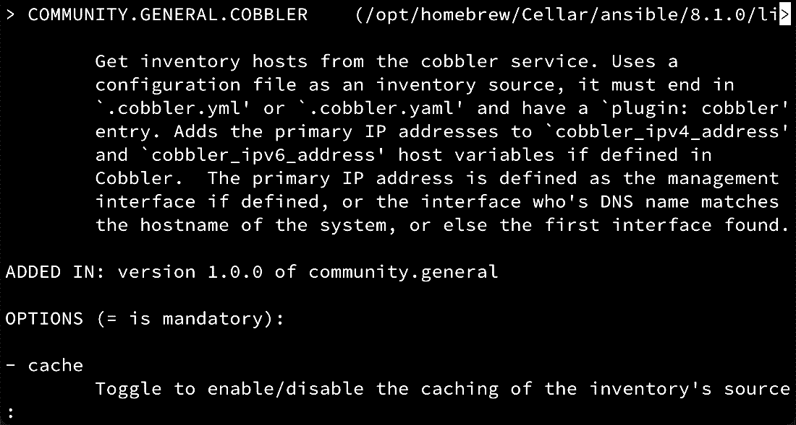

# 第三章：定义你的清单

正如我们在前两章中讨论的那样，Ansible 在你告诉它负责哪些主机之前，什么也做不了。当然，这是合乎逻辑的——你不会希望任何自动化工具，无论它多么容易使用和设置，都能随便控制你网络中的每一台设备。因此，至少，你必须告诉 Ansible 它将在哪些主机上执行任务，这从最基本的角度来说，就是清单的作用。

然而，清单不仅仅是自动化目标的列表。Ansible 清单可以以多种格式提供；它们可以是静态的，也可以是动态的，并且可以包含定义 Ansible 如何与每个主机（或主机组）交互的重要变量。因此，它们值得单独成章，在本章中，我们将实际探讨清单以及如何在使用 Ansible 自动化基础设施时充分利用它们。

本章将涵盖以下主题：

+   创建清单文件并添加主机

+   生成动态清单文件

+   使用模式进行特殊的主机管理

# 技术要求

本章假设你已经根据*第一章*《与 Ansible 入门》的详细说明，设置了你的控制主机，并且你正在使用最新版本——本章中的示例是在 Ansible 8.0 和 `ansible-core` 2.15.0 上测试的。本章还假设你至少有一个额外的主机来进行测试，这个主机应该是基于 Linux 的。虽然我们将在本章中给出主机名的具体示例，但你可以自由地将它们替换为你自己的主机名和/或 IP 地址，相关的替换方法将在适当的地方提供。

本章的代码包可以在这里找到：[`github.com/PacktPublishing/Practical-Ansible-Second-Edition/tree/main/Chapter%203`](https://github.com/PacktPublishing/Practical-Ansible-Second-Edition/tree/main/Chapter%203)。

# 创建清单文件并添加主机

每当你在 Ansible 中看到“*创建清单*”的提法时，你通常可以放心地假设它是一个静态清单。Ansible 支持两种类型的清单——静态清单和动态清单——我们将在本章后面介绍后者。静态清单本质上是静态的；除非人为编辑，否则它们不会改变。当你刚开始使用并测试 Ansible 时，这种方式非常适用，因为它提供了一种非常快速简便的方式让你快速启动并运行。即使在小型封闭环境中，静态清单也是管理环境的一个很好的方式，特别是在基础设施变化不频繁的情况下。

大多数 Ansible 安装会在`/etc/ansible/hosts`中寻找默认的库存文件（尽管这个路径可以在 Ansible 配置文件中进行配置，正如在*第二章*中讨论的，*理解 Ansible 基础知识*）。你可以选择填充这个文件，或者为每次 playbook 运行提供自己的库存，通常情况下，库存会与 playbook 一起提供——毕竟，当你开始用变量和分组来构建它们时，它们就变成了代码资产，就像你的 playbook 和角色一样，因此将它们与其他自动化代码一起提交到源代码管理中是很有意义的。正如你在本书的前几章中看到的那样，如果不使用默认库存，Ansible 命令使用`-i`标志来指定库存文件的位置。我们在本书中已经看到过这些示例，作为复习，它可能看起来像以下示例：

```
$ ansible -i /home/cloud-user/inventory all -m ansible.builtin.ping
```

你遇到的大多数静态库存文件都是以 INI 格式创建的，尽管需要注意的是，其他格式也是支持的。你在 INI 格式文件之后最常见的格式是 YAML 格式——关于你可以使用的库存文件类型的更多细节可以在这里找到：[`docs.ansible.com/ansible/latest/user_guide/intro_inventory.xhtml`](https://docs.ansible.com/ansible/latest/user_guide/intro_inventory.xhtml)。

在本章中，我们将提供一些 INI 和 YAML 格式的库存文件示例供你参考，因为你必须了解这两者。就我个人而言，我已经使用 Ansible 很多年，只与 INI 格式文件或动态库存文件打过交道，但他们说知识就是力量，因此了解这两种格式对你毫无害处。

让我们从创建一个静态库存文件开始。这个库存文件将与默认库存分开。

使用以下 INI 格式的代码在`/etc/ansible/my_inventory`中创建一个库存文件：

```
target1.example.org ansible_host=192.168.81.142 ansible_port=3333
target2.example.org ansible_port=3333 ansible_user=james
target3.example.org ansible_host=192.168.81.143 ansible_port=5555
```

库存主机之间的空行并非必需——它们只是为了让本书中的库存更加易读而插入的。这个库存文件非常简单，没有包含任何分组；然而，在引用库存时，你仍然可以通过特殊的`all`组来引用所有主机，无论你如何格式化和划分库存文件，该组都会被隐式定义。

前述文件中的每一行包含一个库存主机。第一列包含 Ansible 将使用的库存主机名（可以通过我们在*第二章*中讨论的`inventory_hostname`魔法变量访问）。此行之后的所有参数都是分配给该主机的变量。这些变量可以是用户定义的变量或特殊的 Ansible 变量，正如我们在此设置的那样。

有很多这样的变量，但前面的示例特别包含了以下内容：

+   `ansible_host`：如果无法直接访问清单中的主机名——例如，因为它不在 DNS 中——这个变量包含 Ansible 将连接的主机名或 IP 地址

+   `ansible_port`：默认情况下，Ansible 会尝试通过端口`22`进行所有的 SSH 通信——如果你有一个在其他端口上运行的 SSH 守护进程，你可以通过这个变量告诉 Ansible

+   `ansible_user`：默认情况下，Ansible 将尝试使用你运行 Ansible 命令时的当前用户账户连接到远程主机——你可以通过几种方式覆盖这一点，这就是其中之一

因此，前面的三台主机可以总结如下：

+   `target1.example.org`主机应该通过`192.168.81.142` IP 地址、端口`3333`连接

+   `target2.example.org`主机也应该通过端口`3333`连接，但这次使用`james`用户，而不是运行 Ansible 命令的账户

+   应该通过`192.168.81.143` IP 地址、端口`5555`来连接`target3.example.org`主机

通过这种方式，即使没有其他的构造，你也能开始看到静态 INI 格式清单的强大功能。

现在，如果你想创建与前面相同的清单，但这次将其格式化为 YAML，你可以按如下方式指定它（我们将此文件命名为`my_inventory.yaml`）：

```
---
ungrouped:
  hosts:
    target1.example.org:
      ansible_host: 192.168.81.142
      ansible_port: 3333
    target2.example.org:
      ansible_port: 3333
      ansible_user: james
    target3.example.org:
      ansible_host: 192.168.81.143
      ansible_port: 5555
```

你可能会遇到包含如`ansible_ssh_port`、`ansible_ssh_host`和`ansible_ssh_user`等参数的清单文件示例——这些变量名（以及类似的变量名）是在 Ansible 2.0 版本之前使用的。尽管许多这些参数保持了向后兼容性，但你应该尽量更新它们，因为这种兼容性可能会在未来某个时刻被移除。

现在，如果你使用一个简单的`ansible.builtin.shell`命令在 Ansible 中运行前面的清单，结果将如下所示：

```
$ ansible -i /etc/ansible/my_inventory.yaml all -m ansible.builtin.shell -a 'echo hello-yaml' -f 5
target1.example.org | CHANGED | rc=0 >>
hello-yaml
target2.example.org | CHANGED | rc=0 >>
hello-yaml
target3.example.org | CHANGED | rc=0 >>
hello-yaml
```

这涵盖了创建一个简单静态清单文件的基础。接下来，让我们通过在这一章节的下一部分中向清单添加主机组来扩展这一点。

## 使用主机组

很少有一个 playbook 可以适用于整个基础架构，虽然很容易告诉 Ansible 为不同的 playbook 使用一个替代的清单，但这很快就会变得非常混乱，可能会有成百上千个小的清单文件散布在你的网络中。你可以想象，这样会很快变得无法管理，而 Ansible 本应让事情变得更易管理，而不是相反。一个可能的简单解决方案是开始在清单中添加主机组。

假设你有一个简单的三层 Web 架构，每一层有多个主机以实现高可用性和/或负载均衡。这个架构中的三层可能如下：

+   前端服务器

+   应用服务器

+   数据库服务器

在设置好架构之后，我们开始为其创建清单，再次混合使用 YAML 和 INI 格式，以便让你在两者之间获得实践经验。为了保持示例的简洁明了，我们假设你可以通过**完全限定域名**（**FQDNs**）访问所有服务器，因此在这些清单文件中不会添加任何主机变量。当然，你完全可以这么做，每个示例都是不同的。

首先，让我们使用 INI 格式为三层前端创建清单。我们将这个文件命名为 `hostsgroups-ini`，该文件的内容应该如下所示：

```
loadbalancer.example.org
[frontends]
web01.example.org
web02.example.org
[apps]
app01.example.org
app02.example.org
[databases]
db01.example.org
db02.example.org
```

在前面的清单中，我们创建了三个组，分别叫做 `frontends`、`apps` 和 `databases`。请注意，在 INI 格式的清单中，组名位于方括号内。每个组名下列出属于该组的服务器名称，因此前面的示例显示了每个组中有两个服务器。请注意最上面的例外，`loadbalancer.example.org`——这个主机没有属于任何组。所有未分组的主机必须放在 INI 格式文件的最上方。

在我们进一步讨论之前，值得注意的是，清单还可以包含“组的组”，这对于通过不同部门处理某些任务非常有用。前面的清单是独立存在的，但如果我们的前端服务器运行在 Ubuntu 上，而应用和数据库服务器运行在 Fedora 上呢？在处理这些主机时会有一些根本性的差异——例如，我们可能会使用 `ansible.builtin.apt` 模块来管理 Ubuntu 上的包，而在 Fedora 上使用 `ansible.builtin.dnf` 模块。

当然，我们也可以通过收集每个主机的事实来处理这种情况，因为这些事实将包含操作系统的详细信息。我们还可以创建清单的新版本，如下所示：

```
loadbalancer.example.org
[frontends]
web01.example.org
web02.example.org
[apps]
app01.example.org
app02.example.org
[databases]
db01.example.org
db02.example.org
[fedora:children]
apps
databases
[ubuntu:children]
frontends
```

在组定义中使用 `children` 关键字（在方括号内），我们可以创建“组的组”；因此，我们可以进行巧妙的分组，以帮助我们的剧本设计，而无需多次指定每个主机。

这种 INI 格式的结构非常易读，但当它转换为 YAML 格式时，需要一些适应。接下来的代码显示了前面清单的 YAML 版本——就 Ansible 来说，这两者是相同的，但最终由你决定使用哪种格式。

```
all:
  hosts:
    loadbalancer.example.org:
  children:
    fedora:
      children:
        apps:
          hosts:
            app01.example.org:
            app02.example.org:
        databases:
          hosts:
            db01.example.org:
            db02.example.org:
    ubuntu:
      children:
        frontends:
          hosts:
            web01.example.org:
            web02.example.org:
```

你可以看到，`children` 关键字仍然在 YAML 格式的清单中使用，但现在结构比 INI 格式更具层次性。缩进可能更容易跟随，但请注意，主机最终是在相当高的缩进级别下定义的——根据你希望的方式，这种格式可能更难扩展。

当你想使用前面清单中的任何组时，你只需在剧本或命令行中引用它。扩展我们之前的示例，我们可以运行以下命令：

```
$ ansible -i hostgroups-yaml all -m ansible.builtin.shell -a 'echo hello-yaml' -f 5
```

注意那行中的 `all` 关键字。那是所有库存中隐含的特殊 `all` 组，并且在你之前的 YAML 示例中已明确提及。如果我们想运行相同的命令，但这次只对来自之前 YAML 库存的 `fedora` 组主机运行，我们将运行以下命令的变体：

```
$ ansible -i hostgroups-yaml fedora -m ansible.builtin.shell -a 'echo hello-yaml' -f 5
app01.example.org | CHANGED | rc=0 >>
hello-yaml
app02.example.org | CHANGED | rc=0 >>
hello-yaml
db01.example.org | CHANGED | rc=0 >>
hello-yaml
db02.example.org | CHANGED | rc=0 >>
hello-yaml
```

如你所见，这是一种强大的方式，可以管理你的库存，并使得只对你想要的主机运行命令变得轻松。创建多个组的可能性使得管理变得简单，尤其是当你想在不同的服务器组上运行不同的任务时。

顺便提一下，在开发库存时，值得注意的是，有一种快捷的简写表示法可以用来创建多个主机。假设你有 100 台应用服务器，它们的名称按顺序排列，如下所示：

```
[apps]
app01.example.org
app02.example.org
...
app99.example.org
app100.example.org
```

这是完全可能的，但手动创建将是繁琐且容易出错的，并且会产生一些非常难以阅读和解释的库存文件。幸运的是，Ansible 提供了一种快捷的简写表示法来实现这一点，以下的库存片段实际上生成了一个与我们手动创建的相同的包含 100 台应用服务器的库存：

```
[apps]
app[01:100].example.org
```

也可以使用字母范围和数字范围——扩展我们的示例，添加一些缓存服务器，你可能会有如下所示的内容：

```
[cache]
cache-[a:e].example.org
```

这与手动创建以下内容相同：

```
[cache]
cache-a.example.org
cache-b.example.org
cache-c.example.org
cache-d.example.org
cache-e.example.org
```

现在我们已经完成了对各种静态库存格式以及如何创建组（甚至子组）的探索，在下一部分，让我们扩展一下之前对主机变量的简要介绍。

## 向库存添加主机和组变量

我们已经触及了主机变量——我们在本章早些时候看到它们时，用它们覆盖了连接详细信息，如连接的用户账户、连接的地址和使用的端口。但是，使用 Ansible 和库存变量，你可以做的事情远不止这些，值得注意的是，它们不仅可以在主机级别定义，还可以在组级别定义，这再次为你提供了极其强大的方式来有效管理一个集中库存中的基础设施。

让我们在之前的三层示例基础上构建，并假设我们需要为每个前端服务器设置两个变量。这些不是特殊的 Ansible 变量，而是我们完全自己选择的变量，我们将在稍后运行这些变量的 playbook 中使用。假设这些变量如下：

+   `https_port`，它定义了前端代理应该监听的端口

+   `lb_vip`，它定义了前端服务器前负载均衡器的 FQDN

让我们看看这是如何完成的：

1.  我们可以像之前使用 Ansible 连接变量一样，简单地将它们添加到 `frontends` 部分的每个主机中。在这种情况下，我们的 INI 格式的库存文件的一部分可能如下所示：

    ```
    [frontends]
    web01.example.org https_port=8443 lb_vip=lb.example.org
    web02.example.org https_port=8443 lb_vip=lb.example.org
    ```

如果我们针对这个库存运行临时命令，我们可以看到这两个变量的内容：

```
$ ansible -i hostvars1-hostgroups-ini frontends -m ansible.builtin.debug -a "msg=\"Connecting to {{ lb_vip }}, listening on {{ https_port }}\""
web01.example.org | SUCCESS => {
    "msg": "Connecting to lb.example.org, listening on 8443"
}
web02.example.org | SUCCESS => {
    "msg": "Connecting to lb.example.org, listening on 8443"
}
```

这种方法按预期工作，但效率较低，因为你必须将相同的变量添加到每个主机上。

1.  幸运的是，你可以为主机组分配变量，也可以单独为每个主机分配变量。如果我们编辑前面的库存文件以实现这一点，`frontends` 部分将如下所示：

    ```
    [frontends]
    web01.example.org
    web02.example.org
    [frontends:vars]
    https_port=8443
    lb_vip=lb.example.org
    ```

注意这次的可读性更高了？然而，如果我们再次运行相同的命令，对照我们新整理的库存文件，你会看到结果还是一样的：

```
$ ansible -i groupvars1-hostgroups-ini frontends -m ansible.builtin.debug -a "msg=\"Connecting to {{ lb_vip }}, listening on {{ https_port }}\""
web01.example.org | SUCCESS => {
    "msg": "Connecting to lb.example.org, listening on 8443"
}
web02.example.org | SUCCESS => {
    "msg": "Connecting to lb.example.org, listening on 8443"
}
```

1.  有时你需要为单个主机处理主机变量，而有时则更倾向于使用组变量。你可以根据自己的场景来判断哪种方式更好；不过，记住，主机变量可以与组变量一起使用。还需要注意的是，主机变量会覆盖组变量，因此，如果我们需要将 `web01.example.org` 主机的连接端口更改为 `8444`，我们可以如下操作：

    ```
    [frontends]
    web01.example.org https_port=8444
    web02.example.org
    [frontends:vars]
    https_port=8443
    lb_vip=lb.example.org
    ```

现在，如果我们使用新的库存文件再次运行我们的临时命令，我们可以看到我们已经覆盖了一个主机上的变量：

```
$ ansible -i groupvars2-hostgroups-ini frontends -m ansible.builtin.debug -a "msg=\"Connecting to {{ lb_vip }}, listening on {{ https_port }}\""
web01.example.org | SUCCESS => {
    "msg": "Connecting to lb.example.org, listening on 8444"
}
web02.example.org | SUCCESS => {
    "msg": "Connecting to lb.example.org, listening on 8443"
}
```

当然，对于只有两个主机的情况，这样做可能显得有些多余，但当你有一个包含数百个主机的库存时，这种覆盖单个主机的方式就会变得非常有价值。

1.  完整起见，如果我们将之前定义的主机变量添加到 YAML 格式的库存文件中，那么 `frontends` 部分将如下所示（其他库存部分已删除以节省空间）：

    ```
    frontends:
      hosts:
        web01.example.org:
          https_port: 8444
        web02.example.org:
      vars:
        https_port: 8443
        lb_vip: lb.example.org
    ```

运行与之前相同的临时命令，你会发现结果与我们使用 INI 格式库存文件时相同：

```
$ ansible -i groupvars2-hostgroups-yaml frontends -m ansible.builtin.debug -a "msg=\"Connecting to {{ lb_vip }}, listening on {{ https_port }}\""
web01.example.org | SUCCESS => {
    "msg": "Connecting to lb.example.org, listening on 8444"
}
web02.example.org | SUCCESS => {
    "msg": "Connecting to lb.example.org, listening on 8443"
}
```

到目前为止，我们已经介绍了几种为库存提供主机变量和组变量的方法；然而，还有一种方法值得特别提及，当你的库存变得更大更复杂时，它将变得非常有价值。

目前，我们的示例很小且紧凑，只包含少量的组和变量；然而，当你将其扩展到完整的服务器基础架构时，使用单一的平面库存文件可能会变得难以管理。幸运的是，Ansible 也提供了解决方案。如果在 playbook 目录中存在两个特殊命名的目录 `host_vars` 和 `group_vars`，系统会自动搜索这些目录中的适当变量内容。我们可以通过使用这种特殊的目录结构来重新创建前面的前端变量示例，而不是将变量放入库存文件中：

1.  让我们首先为此目的创建一个新的目录结构：

    ```
    $ mkdir vartree
    $ cd vartree
    ```

1.  现在，在这个目录下，我们将创建两个更多的目录来存放变量：

    ```
    host_vars directory, we’ll create a file with the name of our host that needs the proxy setting, with .yml appended to it (that is, web01.example.org.yml). This file should contain the following:

    ```

    ---

    https_port: 8444

    ```

    ```

1.  类似地，在 `group_vars` 目录下，创建一个以我们要分配变量的组命名的 YAML 文件（即 `frontends.yml`），并包含以下内容：

    ```
    ---
    https_port: 8443
    lb_vip: lb.example.org
    ```

1.  最后，我们将像以前一样创建我们的清单文件，只是它不包含任何变量：

    ```
    loadbalancer.example.org
    [frontends]
    web01.example.org
    web02.example.org
    [apps]
    app01.example.org
    app02.example.org
    [databases]
    db01.example.org
    db02.example.org
    ```

为了清晰起见，你最终的目录结构应如下所示：

```
$ tree
.
├── group_vars
│   └── frontends.yml
├── host_vars
│   └── web01.example.org.yml
└── inventory
2 directories, 3 files
```

1.  现在，让我们尝试运行熟悉的临时命令，看看会发生什么：

    ```
    $ ansible -i inventory frontends -m ansible.builtin.debug -a "msg=\"Connecting to {{ lb_vip }}, listening on {{ https_port }}\""
    web01.example.org | SUCCESS => {
        "msg": "Connecting to lb.example.org, listening on 8444"
    }
    web02.example.org | SUCCESS => {
        "msg": "Connecting to lb.example.org, listening on 8443"
    }
    ```

正如你所看到的，这一切和之前完全一样，并且在没有进一步指示的情况下，Ansible 已经遍历了目录结构并加载了所有变量文件。

1.  如果你有数百个变量（或者需要更加细粒度的方式），你可以用以主机和组命名的目录替换 YAML 文件。让我们重新创建目录结构，但现在使用目录替代：

    ```
    $ tree
    .
    ├── group_vars
    │   └── frontends
    │       ├── https_port.yml
    │       └── lb_vip.yml
    ├── host_vars
    │   └── web01.example.org
    │       └── main.yml
    └── inventory
    4 directories, 4 files
    ```

注意我们现在有了以`frontends`组和`web01.example.org`主机命名的目录吗？在`frontends`目录中，我们将变量拆分成了两个文件，这对于逻辑地组织分组变量极其有用，特别是当你的剧本变得更大、更复杂时。虽然我们按变量名称命名了变量文件，这只是为了帮助我们理解代码结构。每个变量文件可以包含任意数量的变量，它们与文件名没有任何关系。

这些文件本身只是我们之前文件的一个改编版本：

```
$ cat host_vars/web01.example.org/main.yml
---
https_port: 8444
$ cat group_vars/frontends/https_port.yml
---
https_port: 8443
$ cat group_vars/frontends/lb_vip.yml
---
lb_vip: lb.example.org
```

即使使用了这种更精细化的目录结构，运行临时命令的结果仍然是相同的：

```
$ ansible -i inventory frontends -m ansible.builtin.debug -a "msg=\"Connecting to {{ lb_vip }}, listening on {{ https_port }}\""
web01.example.org | SUCCESS => {
    "msg": "Connecting to lb.example.org, listening on 8444"
}
web02.example.org | SUCCESS => {
    "msg": "Connecting to lb.example.org, listening on 8443"
}
```

1.  在我们结束这一部分之前，有一点需要特别注意，如果你在组级别和子组级别都定义了相同的变量，子组级别的变量会优先。这个结论不像看起来那么直观。回想一下我们之前的清单，我们使用子组来区分 Fedora 和 Ubuntu 主机——如果我们将一个同名变量同时添加到`ubuntu`子组和`frontends`组（`frontends`组是一个`ubuntu`组），会发生什么？清单将会如下所示：

    ```
    loadbalancer.example.org
    [frontends]
    web01.example.org
    web02.example.org
    [frontends:vars]
    testvar=childgroup
    [apps]
    app01.example.org
    app02.example.org
    [databases]
    db01.example.org
    db02.example.org
    [fedora:children]
    apps
    databases
    [ubuntu:children]
    frontends
    [ubuntu:vars]
    testvar=group
    ```

现在，让我们运行一个临时命令，查看实际设置了哪个 `testvar` 的值：

```
$ ansible -i hostgroups-children-vars-ini ubuntu -m ansible.builtin.debug -a "var=testvar"
web01.example.org | SUCCESS => {
    "testvar": "childgroup"
}
web02.example.org | SUCCESS => {
    "testvar": "childgroup"
frontends group is a child of the ubuntu group in this inventory (hence, the group is listed under [ubuntu:children]), and so the variable value we set at the frontends group level wins as this is the child group in this scenario.
By now, you should have a pretty good idea of how to work with static inventory files. However, no look at Ansible’s inventory capabilities is complete without a look at dynamic inventories, and we shall do exactly this in the next section.
Generating a dynamic inventory file
In these days of cloud computing and infrastructure-as-code, the hosts you may wish to automate could change on a daily, if not hourly, basis! Keeping a static Ansible inventory up to date could become a full-time job, and hence, in many large-scale scenarios, it becomes unrealistic to attempt to use a static inventory on an ongoing basis.
This is where Ansible’s dynamic inventory support comes in. In short, Ansible can gather its inventory data from just about any executable file (though you will find that most dynamic inventories are written in Python)—the only requirement is that the executable returns the inventory data in a specified JSON format. You are free to create your own inventory scripts if you wish, but thankfully, many have been created already for you to use that cover a multitude of potential inventory sources including Amazon EC2, Microsoft Azure, Red Hat Satellite, **Lightweight Directory Access Protocol** (**LDAP**) directories, and many more systems.
When writing a book, it is difficult to know for certain which dynamic inventory script to use as an example, as it is not a given that everyone will have an Amazon EC2 account they can freely use to test against. As a result, we will use the Cobbler provisioning system by way of example, as this is freely available and easy to roll out on a Fedora system. For those interested, Cobbler is a system for dynamically provisioning and building Linux systems, and it can handle all aspects of this, including DNS, DHCP, PXE booting, and so on. Hence, if you were to use this to provision virtual or physical machines in your infrastructure, it would make sense to also use this as your inventory source, as Cobbler was responsible for building the systems in the first place and so knows all the system names.
This example will demonstrate to you the fundamentals of working with a dynamic inventory, which you can then take forward to use the dynamic inventory scripts for other systems. Let’s get started with this process by first installing Cobbler—the process outlined here was tested on Fedora:

1.  Your first task is to install the relevant Cobbler packages using `dnf`. Note that, at the time of writing, the SELinux policy provided with Fedora 38 does not support Cobbler’s functionality and blocks some aspects from working. Although this is not something you should do in a production environment, your simplest path to getting this demo up and running is to simply disable SELinux:

    ```

    $ sudo dnf install -y cobbler

    cobblerd 服务配置为监听回环地址，具体设置可在 /etc/cobbler/settings 文件中检查，文件的相关片段如下所示，应如下所示：

    ```
    # default, localhost
    server: 127.0.0.1
    ```

    ```

Note
This is not a public listening address, so please *do not use* `0.0.0.0`. You can also set it to the IP address of the Cobbler server.

1.  With this step complete, you can start the `cobblerd` service using `systemctl`:

    ```

    $ sudo systemctl enable --now cobblerd.service

    假设你已在 Fedora 38 上安装了 Cobbler，/boot 目录中的内容。在用于此演示的测试系统上，使用了以下命令；但是你必须根据系统的 /boot 目录中的适当版本号，替换 vmlinuz 和 initramfs 文件名中的版本号：

    ```
    $ sudo cobbler distro add --name=Fedora38 --kernel=/boot/vmlinuz-6.2.9-300.fc38.x86_64 --initrd=/boot/initramfs-6.2.9-300.fc38.x86_64.img
    $ sudo cobbler profile add --name=webservers --distro=Fedora38
    ```

    ```

This definition is quite rudimentary and would not necessarily be able to produce working server images; however, it will suffice for our simple demo as we can add some systems based on this notional Fedora 38-based image. Note that the profile name we are creating, `webservers`, will later become our inventory group name in our dynamic inventory.

1.  Let’s now add those systems to Cobbler. The following two commands will add two hosts called `frontend01` and `frontend02` to our Cobbler system, using the `webservers` profile we created previously:

    ```

    $ sudo cobbler system add --name=frontend01 --profile=webservers --dns-name=frontend01.example.org --interface=eth0

    $ sudo cobbler system add --name=frontend02 --profile=webservers --dns-name=frontend02.example.org --interface=eth0

    ```

Note that, for Ansible to work, it must be able to reach the FQDNs specified in the `--dns-name` parameter. To achieve this, I am also adding entries to `/etc/hosts` on the Ansible control node for these two machines to ensure we can reach them later. These entries can point to any two systems of your choosing, as this is just a test.
At this point, you have successfully installed Cobbler, created a profile, and added two hypothetical systems to this profile. The next stage in our process is to download and configure the Ansible dynamic inventory scripts to work with these entries. To achieve this, let’s get started on the process given here:

1.  Since Ansible 3.0, most dynamic inventory scripts have been moved into Collections as this is the easiest way to distribute and update them while decoupling them from the `ansible-core` distribution. The Cobbler dynamic inventory script is included as part of the `community.general` collection, which you should find was installed as part of the Ansible 8.0 package you installed previously. You can verify this with the following command:

    ```

    $ ansible-galaxy collection list | grep community.general

    community.general             6.5.0

    ```

Here, we can see that the `community.general` collection is installed and is at version 6.5.0 (collection versioning is independent of Ansible versioning).
If you have worked with dynamic inventory scripts in versions of Ansible before 2.9 (before Collections became mainstream), you would almost certainly have located the dynamic inventory script and made it executable, even executing it directly. This is no longer necessary in the new Collections- and Plugins-based architecture, which makes your life much easier, as you shall see shortly.

1.  Referring to the documentation for the Cobbler dynamic inventory plugin ([`docs.ansible.com/ansible/latest/collections/community/general/cobbler_inventory.xhtml`](https://docs.ansible.com/ansible/latest/collections/community/general/cobbler_inventory.xhtml)), you will see that, to use the plugin, we must create a configuration file as an inventory source. The filename must end in `.cobbler.yml` or `.cobbler.yaml`, and contain a line referencing the plugin. There are also a whole host of configuration options available (which, in our simple demo setup, aren’t necessary), but if you were working with a cloud service provider, you would certainly have to specify your region and credentials in the configuration file. In some cases, you will also have to install additional libraries or software for the inventory plugin to work, and again, the documentation page for the plugin will tell you whether this is a requirement. In my demo environment, the Cobbler server I built is accessible at the address `cobbler.example.org`, so I shall add this to the configuration file, resulting in the following:

    ```

    $ cat my.cobbler.yml

    插件：community.general.cobbler

    ansible-inventory 命令，你可以用它来验证动态库存的操作：

    ```
    $ ansible-inventory -i my.cobbler.yml --graph
    @all:
      |--@ungrouped:
      |--@cobbler:
      |  |--frontend01.example.org
      |  |--frontend02.example.org
      |--@cobbler_webservers:
      |  |--frontend01.example.org
      |  |--frontend02.example.org
      |--@cobbler_:
      |  |--frontend01.example.org
      |  |--frontend02.example.org
    ```

    ```

This is an incredibly powerful and rapid way to query the dynamic inventory operation and what it is returning. Notice also that all group names have had `cobbler_` placed in front of them by the plugin, so we will need to make use of this when we reference the group names.

1.  You can now run an Ansible ad hoc command in the manner you are used to—the only difference this time is that you will specify the filename of the dynamic inventory plugin configuration file rather than the name of the static inventory file. Assuming you have set up hosts at the two addresses we entered into Cobbler earlier, your output should look something like that shown here:

    ```

    $ ansible -i my.cobbler.yml cobbler_webservers -m ansible.builtin.ping

    frontend01.example.org | SUCCESS => {

    "ansible_facts": {

    "discovered_interpreter_python": "/usr/bin/python3"

    },

    "changed": false,

    "ping": "pong"

    }

    frontend02.example.org | SUCCESS => {

    "ansible_facts": {

    "discovered_interpreter_python": "/usr/bin/python3"

    },

    "changed": false,

    "ping": "pong"

    }

    ```

That’s it! You have just implemented your first dynamic inventory in Ansible. Of course, we know that many of you won’t be using Cobbler, and some of the other dynamic inventory plugins are a little more complex to get going. For example, the Amazon EC2 dynamic inventory script requires your authentication details for Amazon Web Services (or a suitable IAM account) and the installation of the Python `boto` and `boto3` libraries. How would you know to do all of this? Luckily, it is all documented in the plugin documentation, which you can access via the official Ansible documentation website, or on the command line using a command such as the following:

```

$ ansible-doc -t inventory community.general.cobbler

```

 An example of the documentation you will see is shown in the following figure:


Figure 3.1 – The Ansible CLI documentation for the community.general.cobbler plugin
The most fundamental piece of advice I can give is this: whenever you install a new collection containing a dynamic inventory plugin, be sure to check out the documentation, as the requirements will have been documented for you.
Before we end this section, let’s have a look at a few other handy hints for working with inventories, starting with the use of multiple inventory sources in the next section.
Using multiple inventory sources in the inventory directories
So far in this book, we have been specifying our inventory file (either static or dynamic) using the `-i` switch in our Ansible commands. What might not be apparent is that you can specify the `-i` switch more than once and so use multiple inventories at the same time. This enables you to perform tasks such as running a playbook (or ad hoc command) across hosts from both static and dynamic inventories at the same time. Ansible will work out what needs to be done—static inventories should not be marked as executable and so will not be processed as such, whereas dynamic inventories will be. This small but clever trick enables you to combine multiple inventory sources with ease. Let’s move on, in the next section, to looking at the use of static inventory groups in combination with dynamic ones, an extension of this multiple-inventory functionality.
Using static groups with dynamic groups
Of course, the possibility of mixing inventories brings with it an interesting question—what happens to the groups from a dynamic inventory and a static inventory if you define both? The answer is that Ansible combines both, and this leads to an interesting possibility. As you will have observed, our Cobbler inventory script produced an Ansible group called `cobbler_webservers` from a Cobbler profile that we called `webservers`. This is common for most dynamic inventory providers; most inventory sources (for example, Cobbler and Amazon EC2) are not Ansible-aware and so do not offer groups that Ansible can directly use—they may also automatically add prefixes or separators to metadata (which may or may not be configurable). As a result, most dynamic inventory scripts will use some facet of information from the inventory source to produce groupings—the Cobbler machine profile being one such example.
Let’s extend our Cobbler example from the preceding section by mixing a static inventory. Suppose that we want to make our `cobbler_webservers` machines a child group of a group called `fedora` so that we can, in the future, group all Fedora machines together. We know that we only have a Cobbler profile called `webservers`, and ideally, we don’t want to start messing with the Cobbler setup to do something solely Ansible-related.
The answer to this is to create a static inventory file with two group definitions. The first must be the same name as the group you are expecting from the dynamic inventory, except that you should leave it blank. When Ansible combines the static and dynamic inventory contents, it will overlap the two groups and so add the hosts from Cobbler to these groups.
The second group definition should state that `cobbler_webservers` is a child group of the `fedora` group. The resulting file should look something like this:

```

[cobbler_webservers]

[fedora:children]

cobbler_webservers

```

 Now let’s run a simple ad hoc `ansible.builtin.ping` command in Ansible to see how it evaluates the two inventories together. Notice how we will specify the `fedora` group to run `ansible.builtin.ping` against, instead of the `cobbler_webservers` group. We know that Cobbler has no `fedora` group because we never created one, and we know that any hosts in this group must come via the `cobbler_webservers` group when you combine the two inventories, as our static inventory has no hosts in it. The results will look something like this:

```

$ ansible -i my.cobbler.yml -i static-groups-mix-ini fedora -m ansible.builtin.ping

frontend01.example.org | SUCCESS => {

"ansible_facts": {

"discovered_interpreter_python": "/usr/bin/python3"

},

"changed": false,

"ping": "pong"

}

frontend02.example.org | SUCCESS => {

"ansible_facts": {

"discovered_interpreter_python": "/usr/bin/python3"

},

"changed": false,

"ping": "pong"

}

```

 As you can see from the preceding output, we have referenced two different inventories, one static and the other dynamic. We have combined groups, taking hosts that only exist in one inventory source, and combining them with a group that only exists in another. As you can see, this is an incredibly simple example, and it would be easy to extend this to combine lists of static and dynamic hosts or to add a custom variable to a host that comes from a dynamic inventory.
This is a trick of Ansible that is little known but can be very powerful as your inventories expand and grow. As we have worked through this chapter, you will have observed that we have been very precise about specifying our inventory hosts either individually or by group; for example, we explicitly told the `ansible` command to run the ad hoc command against all hosts in the `cobbler_webservers` group. In the next section, we will build on this to look at how Ansible can manage a set of hosts specified using patterns.
Special host management using patterns
We have already established that you will often want to run either an ad hoc command or a playbook against only a subsection of your inventory. So far, we have been quite precise in doing that, but let’s now expand upon this by looking at how Ansible can work with patterns to figure out which hosts a command (or playbook) should be run against.
As a starting point, let’s again consider an inventory that we defined earlier in this chapter for the purposes of exploring host groups and child groups. For your convenience, the inventory contents are provided again here:

```

loadbalancer.example.org

[前端]

web01.example.org

web02.example.org

[应用]

app01.example.org

app02.example.org

[数据库]

db01.example.org

db02.example.org

[fedora:children]

应用

数据库

[ubuntu:children]

前端

```

 To demonstrate host/group selection by pattern, we shall use the `--list-hosts` switch with the `ansible` command to see which hosts Ansible would operate on. You are welcome to expand the example to use the `ansible.builtin.ping` module, but we’ll use `--list-hosts` here in the interests of space and keeping the output concise and readable:

1.  We have already mentioned the special `all` group to specify all hosts in the inventory:

    ```

    $ ansible -i hostgroups-ini all --list-hosts

    主机（7）：

    loadbalancer.example.org

    app01.example.org

    app02.example.org

    db01.example.org

    db02.example.org

    web01.example.org

    web02.example.org

    ```

The asterisk character has the same effect as `all`, but needs to be quoted in single quotes for the shell to interpret the command properly:

```

$ ansible -i hostgroups-ini '*' --list-hosts

主机（7）：

loadbalancer.example.org

app01.example.org

app02.example.org

db01.example.org

db02.example.org

web01.example.org

web02.example.org

```

1.  Use `:` to specify a logical `OR`, meaning “*apply to hosts either in this group or that group*,” as in this example:

    ```

    $ ansible -i hostgroups-ini frontends:apps --list-hosts

    主机（4）：

    web01.example.org

    web02.example.org

    app01.example.org

    ! 排除特定组——你可以将这个与其他字符组合使用，例如：显示所有主机，但不包括应用组中的主机。再说一次，! 是 shell 中的特殊字符，因此你必须用单引号引用你的模式字符串才能使其工作，如本示例所示：

    ```
    $ ansible -i hostgroups-ini 'all:!apps' --list-hosts
      hosts (5):
        loadbalancer.example.org
        db01.example.org
        db02.example.org
        web01.example.org
    :& to specify a logical AND between two groups, for example, if we want all hosts that are in the fedora group and the apps group (again, you must use single quotes in the shell):

    ```

    $ ansible -i hostgroups-ini 'fedora:&apps' --list-hosts

    主机（2）：

    app01.example.org

    * 使用类似于在 shell 中使用的通配符，就像这个示例：

    ```
    $ ansible -i hostgroups-ini 'db*.example.org' --list-hosts
      hosts (2):
        db01.example.org
        db02.example.org
    ```

    ```

    ```

    ```

Another way you can limit which hosts a command is run on is to use the `--limit` switch with Ansible. This uses exactly the same syntax and pattern notation as in the preceding but has the advantage that you can use it with the `ansible-playbook` command, where specifying a host pattern on the command line is only supported for the `ansible` command itself. Hence, for example, you could run the following:

```

$ ansible-playbook -i hostgroups-ini site.yml --limit frontends:apps

执行 [一个简单的 playbook 来演示库存模式] *************************************************************************************

任务 [Ping 每个主机] *****************************************************************************************************************************

ok: [web02.example.org]

ok: [web01.example.org]

ok: [app02.example.org]

ok: [app01.example.org]

执行总结 ****************************************************************************************************************************************

app01.example.org          : ok=1    changed=0    unreachable=0    failed=0    skipped=0    rescued=0    ignored=0

app02.example.org          : ok=1    changed=0    unreachable=0    failed=0    skipped=0    rescued=0    ignored=0

web01.example.org          : ok=1    changed=0    unreachable=0    failed=0    skipped=0    rescued=0    ignored=0

web02.example.org          : ok=1    changed=0    unreachable=0    failed=0    skipped=0    rescued=0    ignored=0

```

 Patterns are a very useful and important part of working with inventories, and something you will no doubt find invaluable going forward. That concludes our chapter on Ansible inventories; however, it is hoped that this has given you everything you need to work confidently with Ansible inventories.
Summary
Creating and managing Ansible inventories is a crucial part of your work with Ansible, and hence we have covered this fundamental concept early in this book. They are vital as, without them, Ansible would have no knowledge of what hosts it is to run automation tasks against, yet they provide so much more than this. They provide an integration point with configuration management systems, they provide a sensible source for host-specific (or group-specific) variables to be stored, and they provide you with a flexible way of running this playbook.
In this chapter, you learned about creating simple static inventory files and adding hosts to them. We then extended this by learning how to add host groups and assign variables to hosts. We also looked at how to organize your inventories and variables when a single flat inventory file becomes too much to handle. We then learned how to make use of dynamic inventory files, before concluding with a look at useful tips and tricks such as combining inventory sources and using patterns to specify hosts, all of which will make how you work with inventories easier and yet simultaneously more powerful.
In the next chapter, we will learn how to develop playbooks and roles to configure, deploy, and manage remote machines using Ansible.
Questions

1.  How do you add the `frontends` group variables to your inventory?
    1.  `[``frontends::]`
    2.  `[``frontends::values]`
    3.  `[``frontends:host:vars]`
    4.  `[``frontends::variables]`
    5.  `[``frontends:vars]`
2.  What enables you to automate Linux tasks such as provisioning DNS, managing DHCP, updating packages, and configuration management?
    1.  Playbook
    2.  Yum
    3.  Cobbler
    4.  Bash
    5.  Role
3.  Ansible allows you to specify an inventory file location by using the `-i` option on the command line:
    1.  True
    2.  False

Further reading
Details on using Ansible inventory plugins are available here: [`docs.ansible.com/ansible/latest/plugins/inventory.xhtml#using-inventory-plugins`](https://docs.ansible.com/ansible/latest/plugins/inventory.xhtml#using-inventory-plugins)

```
