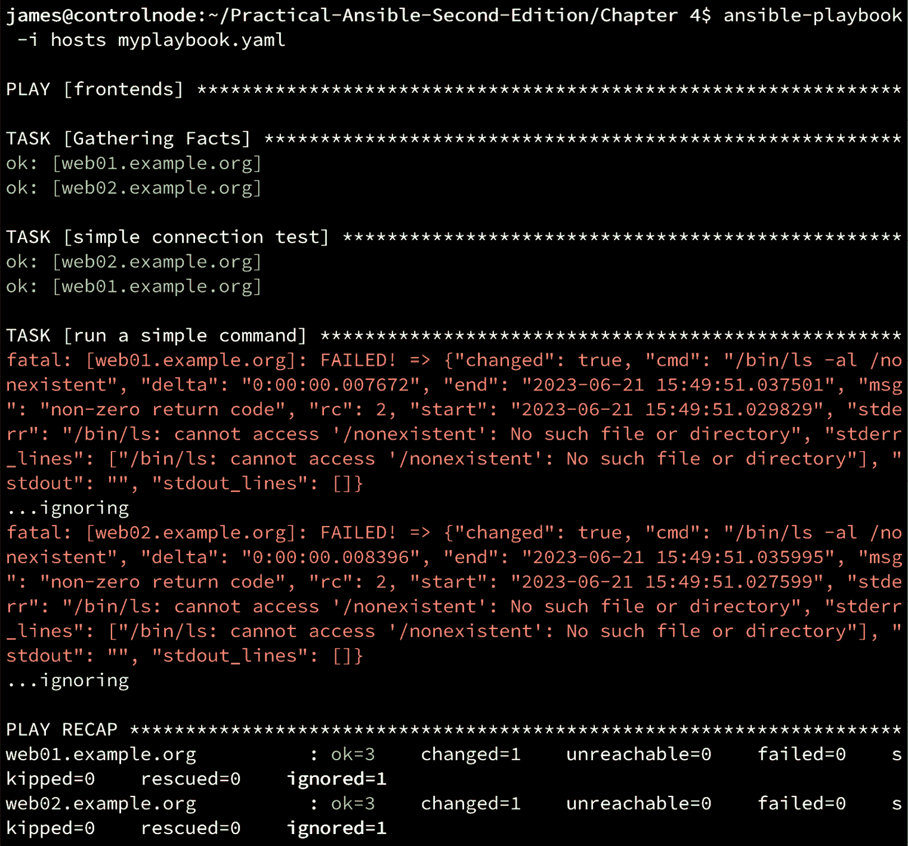
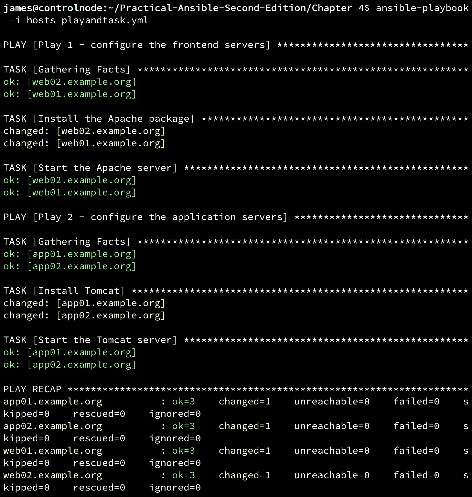
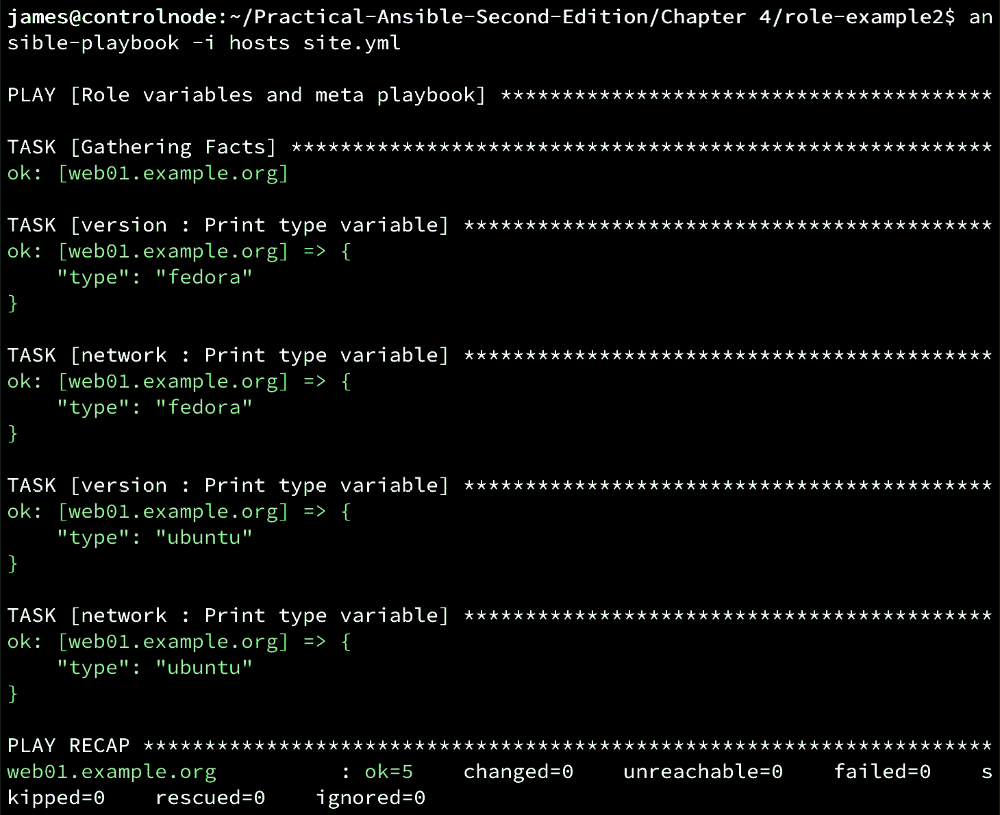
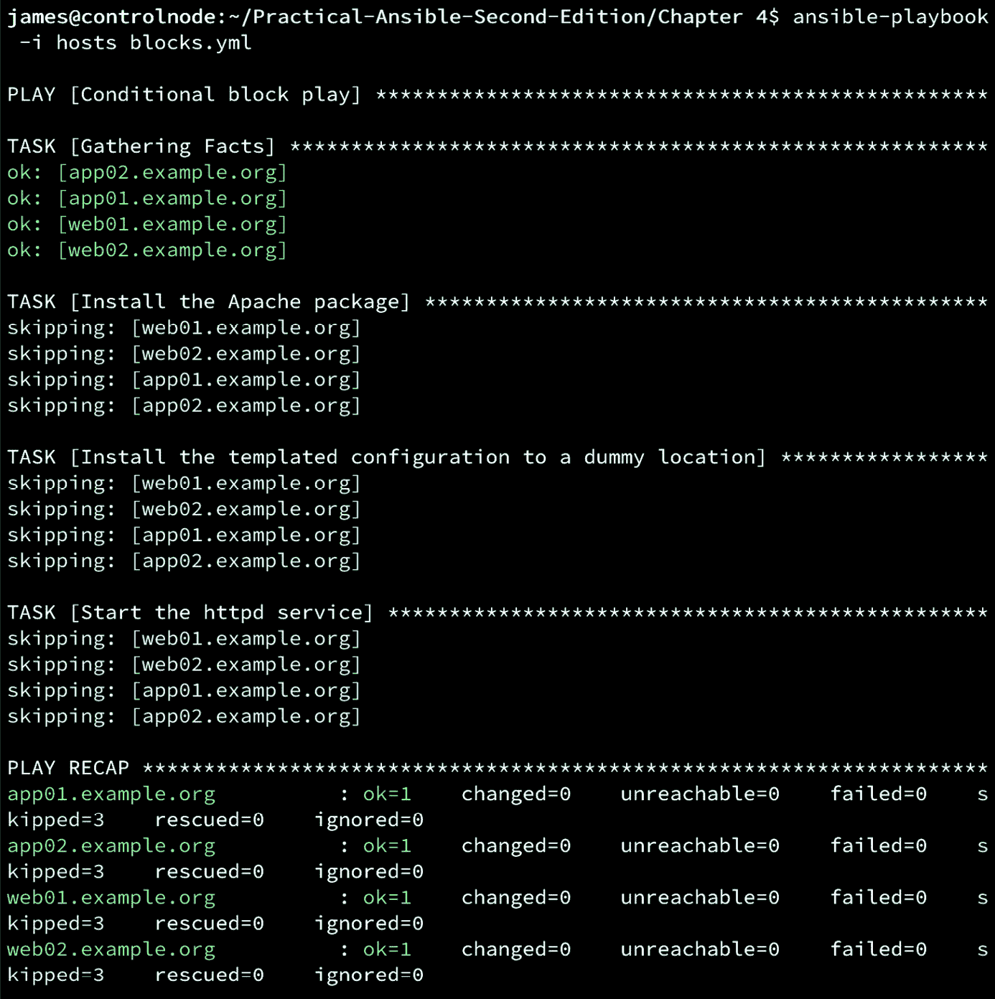
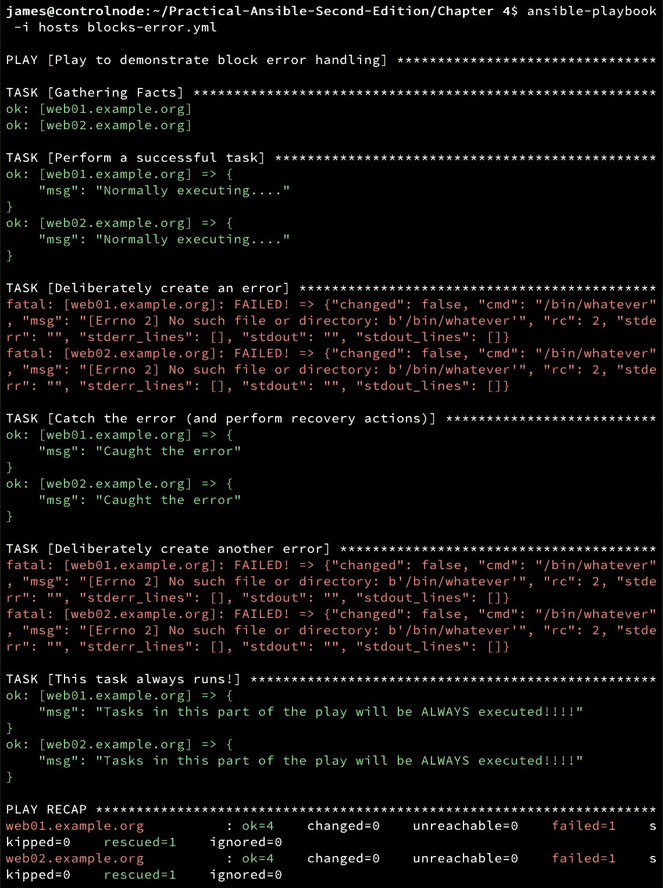
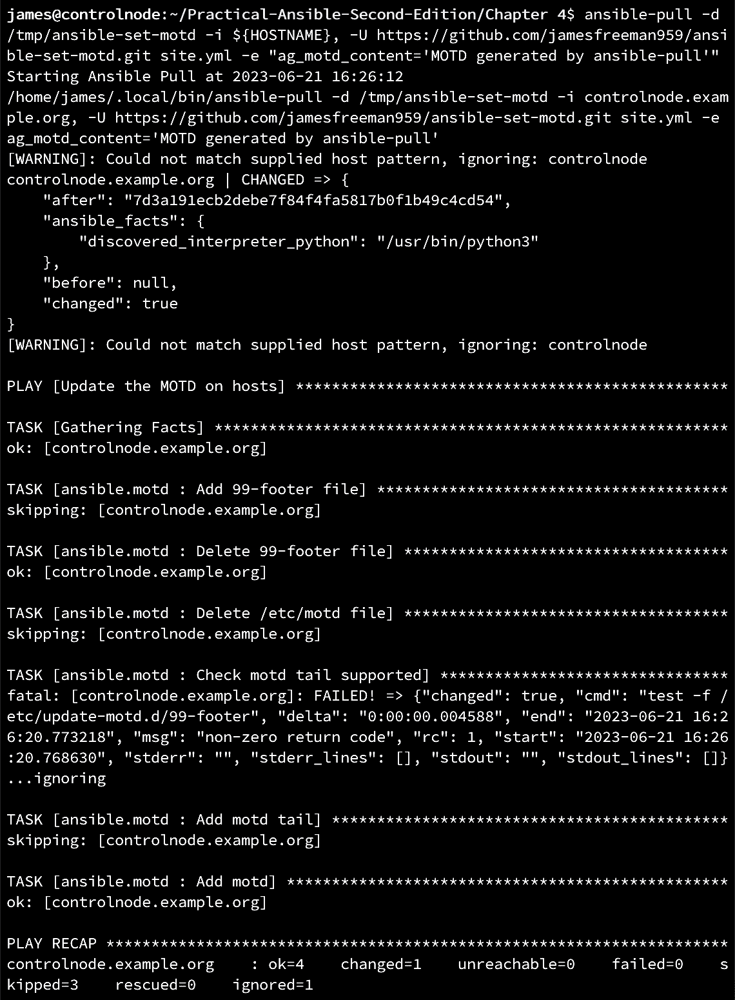

# 4

# 剧本与角色

到目前为止，本书大部分内容使用的是简单的临时 Ansible 命令，以帮助你理解基础概念。然而，Ansible 的核心无疑是剧本，它是将任务（类似临时命令）按逻辑组织起来的结构，目的是产生有用的结果。比如，它可以部署一个 Web 服务器到一个新建的虚拟机，或者应用安全策略，甚至可能涉及到整个虚拟机的构建过程！可能性是无穷的。正如我们之前讨论的，Ansible 剧本旨在简洁易写且易读——它们旨在自我文档化，因此，它们将成为你 IT 流程中宝贵的一部分。

本章将更深入地探讨剧本，从剧本创建的基础知识到更高级的概念，例如在循环和块中运行任务、执行条件逻辑，以及——可能是剧本组织和代码复用中最重要的概念之一——Ansible 角色。我们稍后会更详细地介绍角色，但请记住，这是你在创建可管理的剧本代码时希望尽可能多使用的功能。

本章将特别讨论以下主题：

+   理解剧本框架

+   理解角色——剧本的组织者

+   在代码中使用条件

+   使用循环重复任务

+   使用块来分组任务

+   通过策略配置剧本执行

+   使用 `ansible-pull`

# 技术要求

本章假设你已经按照*第一章*《与 Ansible 入门》的详细说明设置了控制主机，并且使用的是最新版本——本章中的示例在 Ansible 8.0 和 `ansible-core` 2.15 上进行了测试。本章还假设你至少有一个额外的主机进行测试，且该主机应为基于 Linux 的。尽管本章将给出特定主机名的示例，你可以根据需要将其替换为自己的主机名和/或 IP 地址，相关的替换方法将在适当的地方提供。

本章的代码包可以在此找到：[`github.com/PacktPublishing/Practical-Ansible-Second-Edition/tree/main/Chapter%204`](https://github.com/PacktPublishing/Practical-Ansible-Second-Edition/tree/main/Chapter%204)。

# 理解剧本框架

一个 playbook 允许你在许多机器上简单轻松地管理多个配置和复杂的部署。这是使用 Ansible 进行复杂应用交付的关键优势之一。通过 playbook，你可以以逻辑结构组织任务，因为任务（通常）按它们的书写顺序执行，从而让你对自动化过程有较高的控制度。话虽如此，仍然可以异步执行任务，因此如果任务不是按顺序执行的，我们将特别指出这一点。我们的目标是，在完成本章后，你将理解编写自己的 Ansible playbook 的最佳实践。

虽然 YAML 格式易于阅读和编写，但在缩进方面要求非常严格。例如，尽管在屏幕上，制表符和四个空格看起来可能是相同的，但在 YAML 中它们并不相同。我们建议，如果你第一次编写 playbook，可以采用支持 YAML 的编辑器来帮助你，可能是 Vim、Visual Studio Code 或 Eclipse，因为这些编辑器会帮助你确保缩进正确。如果要测试我们在本章中开发的 playbook，我们将创建一个变体的清单，基于*第三章*，*定义你的清单*（除非另有说明）：

```
[frontends]
web01.example.org https_port=8443
web02.example.org http_proxy=proxy.example.org
[frontends:vars]
ntp_server=ntp.web.example.org
proxy=proxy.web.example.org
[apps]
app01.example.org
app02.example.org
[webapp:children]
frontends
apps
[webapp:vars]
proxy_server=proxy.webapp.example.org
health_check_retry=3
health_check_interval=60
```

让我们直接开始编写 playbook。在*第二章*，*理解 Ansible 的基础知识*中，我们介绍了创建 playbook 所需的 YAML 语法和结构的基本知识，因此这里不再重复。相反，我们将在此基础上继续，展示 playbook 开发的核心内容：

1.  创建一个简单的 playbook（称为`myplaybook.yml`），在我们清单文件中定义的`frontends`主机组上的主机上运行。我们可以使用 playbook 中的`remote_user`指令设置访问主机的用户，如下所示（你也可以在命令行上使用`--user`开关，但因为本章是关于 playbook 开发的，我们暂时忽略这个）：

    ```
    ---
    - hosts: frontends
      remote_user: james
      tasks:
      - name: simple connection test
        ansible.builtin.ping:
        remote_user: james
    ```

1.  在第一个任务下方添加另一个任务，运行`ansible.builtin.shell`模块（该模块将依次在远程主机上运行`ls`命令）。我们还将向该任务添加`ignore_errors`指令，确保如果`ls`命令失败（例如，如果我们尝试列出的目录不存在），playbook 不会失败。注意缩进，确保它与文件的第一部分匹配：

    ```
      - name: run a simple command
        ansible.builtin.shell: /bin/ls -al /nonexistent
        ignore_errors: True
    ```

1.  让我们看看新创建的 playbook 在使用以下命令运行时的表现：

    ```
    $ ansible-playbook -i hosts myplaybook.yml
    ```

该 playbook 运行的输出应类似于以下截图：



图 4.1 – 演示执行一个故意忽略错误的 playbook

从剧本运行的输出中，你可以看到我们的两个任务是按照指定的顺序执行的。我们可以看到`ls`命令失败了，因为我们尝试列出一个不存在的目录，但剧本并没有记录任何`failed`任务，因为我们为该任务（仅此任务）设置了`ignore_errors`为`true`。

大多数 Ansible 模块（除了运行用户自定义命令的模块，如`ansible.builtin.shell`、`ansible.builtin.command`和`ansible.builtin.raw`）都被编写为幂等的——也就是说，如果你运行相同的任务两次，结果将是相同的，且该任务不会两次做出相同的更改；如果它检测到请求它执行的操作已经完成，则不会第二次执行。当然，这对前述模块来说不可能，因为它们可以用于执行几乎所有可以想象的任务——因此，模块怎么知道它被执行了两次呢？

每个模块都会返回一组结果，其中包括任务状态。你可以在前面剧本运行的输出底部看到这些结果的总结，它们的含义如下：

+   `ok`：任务成功运行且没有进行任何更改

+   `changed`：任务成功运行且进行了更改

+   `failed`：任务未能成功运行（但主机是可连接的）

+   `unreachable`：无法连接主机以运行该任务

+   `skipped`：此任务被跳过

+   `ignored`：此任务被忽略（例如，在`ignore_errors`的情况下）

+   `rescued`：稍后我们将在查看块和恢复任务时看到一个例子

这些状态非常有用——例如，如果我们有一个任务是从模板部署新的 Apache 配置文件，我们知道必须重启 Apache 服务才能使更改生效。然而，我们只希望在文件实际被更改的情况下才重启 Apache——如果没有更改，我们不希望不必要地重启 Apache，因为这会打断可能正在使用该服务的用户。因此，我们可以使用`notify`动作，这会告诉 Ansible 在任务结果为`changed`时（且仅在此时）调用`handler`。简而言之，处理程序是一种特殊类型的任务，它是在`notify`的结果下运行的。然而，与 Ansible 剧本任务按顺序执行不同，处理程序会被聚集在一起并在剧本结束时统一执行。此外，处理程序可以被通知多次，但无论如何只会执行一次，从而防止不必要的服务重启。考虑以下剧本：

```
---
- name: Handler demo 1
  hosts: web01.example.org
  gather_facts: no
  become: yes
  tasks:
    - name: Update Apache configuration
      ansible.builtin.template:
        src: template.j2
        dest: /etc/apache2/apache2.conf
      notify: Restart Apache
  handlers:
    - name: Restart Apache
      ansible.builtin.service:
        name: apache2
        state: restarted
```

为了简洁起见，我已关闭了此剧本的事实收集（我们在任何任务中都不会使用事实）。我也再次仅在一台主机上运行，以简化演示，但你可以根据需要扩展演示代码。如果我们第一次运行这个任务，我们将看到以下结果：

```
$ ansible-playbook -i hosts handlers1.yml
PLAY [Handler demo 1] **********************************************************
TASK [Update Apache configuration] *********************************************
changed: [web01.example.org]
RUNNING HANDLER [Restart Apache] ***********************************************
changed: [web01.example.org]
PLAY RECAP *********************************************************************
web01.example.org          : ok=2    changed=2    unreachable=0    failed=0    skipped=0     rescued=0    ignored=0
```

注意处理程序是在最后执行的，因为配置文件已被更新。然而，如果我们第二次运行这个 Playbook 而不对模板或配置文件做任何更改，我们将看到如下内容：

```
$ ansible-playbook -i hosts handlers1.yml
PLAY [Handler demo 1] **********************************************************
TASK [Update Apache configuration] *********************************************
ok: [web01.example.org]
PLAY RECAP *********************************************************************
web01.example.org          : ok=1    changed=0    unreachable=0    failed=0    skipped=0    rescued=0    ignored=0
```

这次，处理程序没有被调用，因为配置任务的结果是 `ok`。所有处理程序应该具有全局唯一的名称，以便 `notify` 动作能够调用正确的处理程序。你还可以通过设置公共名称并使用 `listen` 指令来调用多个处理程序——这样，你可以通过 `name` 或 `listen` 字符串来调用处理程序，如以下示例所示：

```
---
- name: Handler demo 1
  hosts: web01.example.org
  gather_facts: no
  become: yes
  handlers:
    - name: restart timesyncd
      ansible.builtin.service:
        name: systemd-timesyncd.service
        state: restarted
      listen: "restart all services"
    - name: restart apache
      ansible.builtin.service:
        name: apache2.service
        state: restarted
      listen: "restart all services"
  tasks:
    - name: restart all services
      ansible.builtin.command: echo "this task will restart all services"
      notify: "restart all services"
```

我们在 Playbook 中只有一个任务，但当我们运行它时，两个处理程序都会被调用。此外，记住我们之前说过 `ansible.builtin.command` 是一组特殊模块中的一部分，因为它们无法检测是否发生了变化——因此，它们始终返回 `changed` 值，在这个示范 Playbook 中，即使我们第二次运行，处理程序也会始终被通知：

```
$ ansible-playbook -i hosts handlers2.yml
PLAY [Handler demo 1] **********************************************************
TASK [restart all services] ****************************************************
changed: [web01.example.org]
RUNNING HANDLER [restart timesyncd] ********************************************
changed: [web01.example.org]
RUNNING HANDLER [restart apache] ***********************************************
changed: [web01.example.org]
PLAY RECAP *********************************************************************
web01.example.org          : ok=3    changed=3    unreachable=0    failed=0    skipped=0    rescued=0    ignored=0
```

这些是你开始编写自己 Playbooks 所需了解的一些基础知识。掌握这些后，让我们在下一节中对比临时命令和 Playbooks。

## 比较 Playbooks 和临时任务

临时命令允许你快速创建并执行一次性命令，而无需保留任何记录（除了可能的 shell 历史）。这些命令具有重要意义，对于快速完成小的变更，以及学习 Ansible 和其模块非常有价值。

相比之下，Playbooks 是逻辑组织的任务集（每个任务都可以是临时命令），按顺序组合在一起，执行一个更大的操作。添加条件逻辑、错误处理等功能意味着，通常情况下，Playbooks 的优势要超过临时命令的实用性。此外，只要保持组织得当，你将拥有所有之前运行过的 Playbooks 的副本，因此你可以回溯（如果有需要的话）查看你曾执行过的操作和时间。

让我们来开发一个实际的例子——假设你想在 Ubuntu Server 上安装 Apache 2.4。即使默认配置足够（尽管这不太可能，但为了简化示例，我们暂时保持这个假设），也需要进行一些步骤。如果你手动进行基本安装，你需要安装软件包，打开防火墙，并确保服务正在运行（并且能够在启动时运行）。

在 shell 中执行这些命令，你可能会这样做：

```
$ sudo apt -y install apache2
$ sudo ufw allow http
$ sudo ufw allow https
$ sudo systemctl enable apache2.service
$ sudo systemctl restart apache2.service
```

现在，对于这些命令，每个都可以通过一个等效的临时 Ansible 命令来执行。为了节省空间，我们不在这里详细介绍所有命令；不过，假设你想重启 Apache 服务——如果是这样，你可以运行一个类似以下的临时命令（同样，为了简洁，我们只在一个主机上执行）：

```
$ ansible -i hosts web01* -m ansible.builtin.service -a "name=apache2 state=restarted" --become
```

成功运行后，你将看到页面上显示着 shell 输出，包含从运行`ansible.builtin.service`模块返回的所有变量数据。这里显示了一部分来自运行此临时命令的输出，以供你对照检查——关键在于该命令的执行结果是`changed`状态，意味着它成功运行并且服务确实被重启：

```
web01.example.org | CHANGED => {
    "ansible_facts": {
        "discovered_interpreter_python": "/usr/bin/python3"
    },
    "changed": true,
    "name": "apache2",
    "state": "started",
```

当然，你可以创建并执行一系列临时命令，以重复之前给出的多个 shell 命令，并分别运行它们。稍加巧妙，你可以将四个命令合并为更少的命令（例如，Ansible 的`ansible.builtin.service`模块可以在一个临时命令中同时启用服务并重启它）。然而，你最终仍然会得到至少两三个临时命令，如果你希望稍后在另一台服务器上运行这些命令，你将需要查阅你的笔记以了解如何执行的。

因此，playbook 是更有价值的解决方案——它不仅会一次性完成所有步骤，还会为你提供一个记录，供你以后参考。有多种方法可以做到这一点，但以下是一个示例：

```
---
- name: Install Apache
  hosts: web01.example.org
  gather_facts: no
  become: yes
  tasks:
    - name: Install Apache package
      ansible.builtin.apt:
        name: apache2
        state: latest
    - name: Open firewall for Apache
      community.general.ufw:
        rule: allow
        port: "{{ item }}"
        proto: tcp
      loop:
        - "http"
        - "https"
    - name: Restart and enable the service
      ansible.builtin.service:
        name: apache2
        state: restarted
        enabled: yes
```

现在，当你运行此命令时，你应该会看到我们所有的安装要求都通过一个相当简单且易于阅读的 playbook 完成了。这里有一个新概念——循环（loops），我们尚未讲解，但不用担心——我们会在本章后续部分讲解它：

```
$ ansible-playbook -i hosts installapache.yml
PLAY [Install Apache] **********************************************************
TASK [Install Apache package] **************************************************
changed: [web01.example.org]
TASK [Open firewall for Apache] ************************************************
changed: [web01.example.org] => (item=http)
changed: [web01.example.org] => (item=https)
TASK [Restart and enable the service] ******************************************
changed: [web01.example.org]
PLAY RECAP *********************************************************************
web01.example.org          : ok=3    changed=3    unreachable=0    failed=0    skipped=0    rescued=0    ignored=0
```

如你所见，这种方式比实际完成的工作更加有效，并且可以以其他人容易理解的格式进行记录。尽管我们会在书中的后面部分讲解循环（loops），但从前面的例子中，你可以很容易地看出它们是如何工作的。明确这一点后，让我们进入下一部分，详细了解我们多次使用的几个术语，确保你能清楚它们的含义——**play**和**task**。

## 定义 plays 和 tasks

到目前为止，当我们处理 playbooks 时，每个 playbook 里我们只创建了一个 play（这在逻辑上是最基本的做法）。然而，你可以在一个 playbook 中拥有多个 play，而在 Ansible 术语中，一个“*play*”只是与某个主机（或一组主机）关联的一组 tasks（以及角色、处理器和其他 Ansible 相关内容）。一个 task 是一个 play 中最小的元素，它负责运行一个单独的模块，并传递一组参数以实现特定目标。当然，理论上这听起来很复杂，但有了实际的例子，它会变得非常容易理解。

如果我们参考我们的示例清单，它描述了一个简单的两层架构（我们暂时省略了数据库层）。现在，假设我们想编写一个单一的剧本来配置前端服务器和应用服务器。我们可以使用两个单独的剧本来配置前端和应用服务器，但这有可能使代码碎片化并且难以组织。然而，前端服务器和应用服务器（本质上）是完全不同的，因此不太可能使用相同的任务集进行配置。

解决这个问题的方法是创建一个包含两个任务的单一剧本。每个任务的开始可以通过最低缩进的行来识别（即前面没有空格的行）。

让我们开始构建我们的剧本吧：

1.  将第一个任务添加到剧本中，并定义一些简单的任务以在前端设置 Apache 服务器，如下所示：

    ```
    ---
    - name: Play 1 - configure the frontend servers
      hosts: frontends
      become: yes
      tasks:
      - name: Install the Apache package
        ansible.builtin.apt:
          name: apache2
          state: latest
      - name: Start the Apache server
        ansible.builtin.service:
          name: apache2
          state: started
    ```

1.  在此下方的同一个文件中，添加第二个任务，用于配置应用层服务器：

    ```
    - name: Play 2 - configure the application servers
      hosts: apps
      become: true
      tasks:
      - name: Install Tomcat
        ansible.builtin.apt:
          name: tomcat9
          state: latest
      - name: Start the Tomcat server
        ansible.builtin.service:
          name: tomcat9
          state: started
    ```

现在，您有两个任务——一个用于在`frontends`组中安装 Web 服务器，另一个用于在`apps`组中安装应用服务器，所有这些都结合成一个简单的剧本。

当我们运行这个剧本时，我们会看到两个任务按顺序执行，顺序与它们在剧本中出现的顺序一致。请注意`PLAY`关键字的存在，它表示每个任务的开始。使用以下命令来运行剧本：

```
$ ansible-playbook -i hosts playandtask.yml
```

您的剧本运行输出应该类似于以下截图：



图 4.2 – 演示包含两个任务的剧本执行

这样，我们就有了一个剧本，但其中包含两个在提供的清单中操作不同主机集的任务。这非常强大，尤其是当它与角色结合使用时（将在本书后面介绍）。当然，您的剧本中可以只有一个任务——不一定要有多个任务，但能够开发多任务剧本是很重要的，因为随着环境的复杂性增加，您几乎肯定会发现它们非常有用。

剧本是 Ansible 自动化的生命线——它们将自动化从单一任务/命令（本身非常强大）扩展到一系列逻辑组织的任务。然而，随着您扩展剧本库，如何保持工作有序呢？如何高效地重用相同的代码块？在前面的示例中，我们安装了 Apache，而这可能是多个服务器的要求。然而，您是否应该尝试从一个剧本管理所有这些服务器？还是应该不断地复制和粘贴相同的代码块？有一种更好的方法，在 Ansible 术语中，我们需要开始看角色，我们将在下一个部分讨论这个问题。

# 理解角色——剧本组织者

角色的设计旨在使你能够高效且有效地重用 Ansible 代码。它们总是遵循已知的结构，并且通常会包含合理的默认值，比如变量、错误处理、处理程序等。在上一章的 Apache 安装示例中，我们知道这是我们可能想要反复执行的操作，可能每次使用不同的配置文件，并且可能在每个服务器（或每个库存组）上进行一些其他调整。在 Ansible 中，支持以这种方式重用代码的最有效方法是将其创建为角色。

创建角色的过程其实非常简单——Ansible 默认会在运行 playbook 的同一目录中查找`roles/`目录，然后在其中为每个角色创建一个子目录。角色名称来源于子目录名称。不需要创建复杂的元数据或其他任何东西——就是这么简单。在每个子目录中会有一个固定的目录结构，告诉 Ansible 每个角色的任务、默认变量、处理程序等内容。

注意

`roles/`目录并不是 Ansible 查找角色的唯一地方——这是它首先会查找的目录，但它随后会在`/etc/ansible/roles`中查找任何额外的角色。通过 Ansible 配置文件，这个位置还可以进一步自定义，正如在*第二章*中所讨论的，*理解 Ansible 基础知识*。

让我们更详细地探讨一下这个问题。考虑以下目录结构：

```
site.yml
frontends.yml
dbservers.yml
roles/
   installapache/
     tasks/
     handlers/
     templates/
     vars/
     defaults/
   installtomcat/
     tasks/
     meta/
```

上面的目录结构展示了我们假设的 playbook 目录中定义的两个角色，分别是`installapache`和`installtomcat`。在这些目录中的每一个，你会看到一系列的子目录。这些子目录不一定要存在（稍后会详细说明它们的意义，但是例如，如果你的角色没有处理程序，则`handlers/`目录不需要创建）。然而，当你需要这样的目录时，你应该在其中放置一个名为`main.yml`的 YAML 文件。根据目录的不同，每个`main.yml`文件的内容会有所不同。

角色内部可以存在的子目录如下：

+   `tasks`：这是角色中最常见的目录，包含角色应执行的所有 Ansible 任务。

+   `handlers`：所有在角色中使用的处理程序应放入此目录。

+   `defaults`：所有角色的默认变量都放在这里。

+   `vars`：这些是其他角色变量——它们会覆盖`defaults/`目录中声明的变量，因为它们的优先级更高。

+   `files`：角色所需的文件应放在这里，例如需要部署到目标主机的配置文件。

+   `templates`：与`files/`目录不同，此目录应包含角色使用的所有模板。

+   `meta`：所有需要的元数据都应放在这里。例如，角色通常按从父剧本调用的顺序执行；然而，有时一个角色会有依赖的其他角色需要先执行，如果是这种情况，它们可以在此目录中声明。

对于本章中我们要开发的示例，我们需要一个清单，所以我们将重用上一节中使用的清单（为方便起见，附在此处）：

```
[frontends]
web01.example.org https_port=8443
web02.example.org http_proxy=proxy.example.org
[frontends:vars]
ntp_server=ntp.web.example.org
proxy=proxy.web.example.org
[apps]
app01.example.org
app02.example.org
[webapp:children]
frontends
apps
[webapp:vars]
proxy_server=proxy.webapp.example.org
health_check_retry=3
health_check_interval=60
```

让我们通过一些实际练习来帮助你学习如何创建和使用角色。我们将从创建一个名为`installapache`的角色开始，这个角色将处理我们在上一节中看到的 Apache 安装过程。然而，在这里，我们将扩展它，以覆盖在 Fedora 和 Ubuntu 上安装 Apache。这是一个很好的实践，特别是如果你打算将你的角色提交回社区，因为它们越通用（适用的系统范围越广），对大家的帮助就越大。

按照以下步骤创建你的第一个角色：

1.  在你选择的剧本目录中为`installapache`角色创建目录结构——这非常简单：

    ```
    main.yml inside the tasks directory we just created. This won’t actually perform the Apache installation – rather, it will call one of two external tasks files, depending on the operating system detected on the target host during the fact-gathering stage. We can use a fact called ansible_distribution, in a when clause, to determine which of the task files to import:

    ```

    ---

    - name: 根据操作系统平台导入任务

    import_tasks: fedora.yml

    when: ansible_distribution == 'Fedora'

    - import_tasks: ubuntu.yml

    when: ansible_distribution == 'Ubuntu'

    ```

    ```

1.  在`roles/installapache/tasks`目录下创建`fedora.yml`，通过`dnf`包管理器在 Fedora 上安装最新版本的 Apache web 服务器。这个文件应包含以下内容：

    ```
    ---
    - name: Install Apache using dnf
      ansible.builtin.dnf:
        name: httpd
        state: latest
    - name: Start the Apache server
      ansible.builtin.service:
        name: httpd
        state: started
    ```

1.  在`roles/installapache/tasks`目录下创建一个名为`ubuntu.yml`的文件，通过`apt`包管理器在 Ubuntu 上安装最新版本的 Apache web 服务器。注意 Fedora 和 Ubuntu 主机之间内容的差异：

    ```
    ---
    - name: Install Apache using apt
      ansible.builtin.apt:
        name: apache2
        state: latest
    - name: Start the Apache server
      ansible.builtin.service:
        name: apache2
        state: started
    ```

目前，我们将角色的代码保持得非常简单——然而，你可以看到前面的任务文件就像一个 Ansible 剧本，只是缺少了 play 定义。由于它们不属于某个 play，它们的缩进级别也比在剧本中的要低，但除了这个差异，代码对你来说应该非常熟悉。事实上，这就是角色的一个优点——只要你注意缩进级别的正确性，你基本可以在剧本或角色中使用相同的代码。

现在，角色不能直接运行——我们必须创建一个剧本来调用它们，所以让我们编写一个简单的剧本来调用我们新创建的角色。这个剧本有一个像我们之前看到的 play 定义，但与其在 play 中有一个`tasks:`部分，我们改为有一个`roles:`部分来声明角色。约定俗成地，这个文件被称为`site.yml`，但你可以根据需要命名：

```
---
- name: Install Apache using a role
  hosts: frontends
  become: true
  roles:
    - installapache
```

为了清晰起见，你最终的目录结构应该如下所示：

```
.
├── hosts
├── roles
│   └── installapache
│       └── tasks
│           ├── fedora.yml
│           ├── main.yml
│           └── ubuntu.yml
└── site.yml
```

完成这些后，你可以像往常一样使用 `ansible-playbook` 运行 `site.yml` playbook——你应该看到类似以下的输出：

```
$ ansible-playbook -i hosts site.yml
PLAY [Install Apache using a role] *********************************************
TASK [Gathering Facts] *********************************************************
ok: [web02.example.org]
ok: [web01.example.org]
TASK [installapache : Install Apache using yum] ********************************
skipping: [web01.example.org]
skipping: [web02.example.org]
TASK [installapache : Start the Apache server] *********************************
skipping: [web01.example.org]
skipping: [web02.example.org]
TASK [installapache : Install Apache using apt] ********************************
changed: [web02.example.org]
changed: [web01.example.org]
TASK [installapache : Start the Apache server] *********************************
changed: [web02.example.org]
changed: [web01.example.org]
PLAY RECAP *********************************************************************
web01.example.org          : ok=3    changed=2    unreachable=0    failed=0    skipped=2    r escued=0    ignored=0
web02.example.org          : ok=3    changed=2    unreachable=0    failed=0    skipped=2    rescued=0    ignored=0
```

就这样——你已经在最简单的层次上创建了你的第一个角色。当然（正如我们之前讨论的那样），角色远不止我们在这里添加的简单任务，我们将在本章的其他部分看到更多扩展的例子。然而，前面的例子旨在向你展示如何快速且轻松地开始使用角色。

在我们查看与角色相关的其他方面之前，先来看看调用角色的其他方式。Ansible 允许你在编写 playbook 时静态导入或动态包含角色。导入或包含角色的语法略有不同，特别是两者都放在 playbook 的 `tasks` 部分，而不是 `roles` 部分。以下是一个假设的示例，展示了在一个非常简单的 playbook 中使用这两种方式。`roles/` 目录结构，包括 `common` 和 `approle` 角色，创建方式与前面的例子类似：

```
---
- hosts: frontends
  tasks:
  - ansible.builtin.import_role:
      name: common
  - ansible.builtin.include_role:
      name: approle
```

这些功能在 2.3 版本之前的 Ansible 中是不可用的，并且在 2.4 版本中为了与某些其他 Ansible 功能的工作方式保持一致，使用方式略有变化。我们这里不需要过多关注这些细节，因为核心版本已经更新到 2.15，因此除非你确实需要运行一个更早版本的 Ansible，否则可以假设这两个语句会像我们接下来将概述的那样正常工作。

从根本上讲，`ansible.builtin.import_role` 语句在解析所有 playbook 代码时执行你指定角色的静态导入。因此，使用 `ansible.builtin.import_role` 引入的角色在 Ansible 开始解析时就像 play 或 role 中的其他任何代码一样处理。使用 `ansible.builtin.import_role` 基本上与在 `site.yml` 中的 `roles:` 语句后声明角色相同，就像我们在前面的例子中所做的那样。

`ansible.builtin.include_role` 有一个微妙但根本的不同之处，即你指定的角色不会在初始解析 playbook 时进行评估——而是在 playbook 执行过程中，当遇到 `ansible.builtin.include_role` 时动态处理。

选择 `include` 或 `import` 语句的最根本原因可能是循环——如果你需要在循环中运行角色，则无法使用 `import_role`，因此必须使用 `include_role`。然而，二者各有优缺点，你需要根据你的场景选择最合适的一个——官方的 Ansible 文档（[`docs.ansible.com/ansible/latest/user_guide/playbooks_reuse.xhtml#dynamic-vs-static`](https://docs.ansible.com/ansible/latest/user_guide/playbooks_reuse.xhtml#dynamic-vs-static)）将帮助你做出正确的决策。

正如我们在本节中所见，角色非常容易上手，并且提供了一种极其强大的方式来组织和重用你的 Ansible 代码。在下一节中，我们将通过查看如何向代码中添加特定角色的变量和依赖项，来扩展我们的简单任务示例。

## 设置基于角色的变量和依赖项

变量是使 Ansible playbook 和角色可重用的核心，因为它们允许使用相同的代码，只是值或配置数据略有不同。Ansible 角色目录结构允许在两个位置声明特定于角色的变量。虽然一开始这两个位置之间的区别可能并不明显，但它是至关重要的。

基于角色的变量可以放在两个位置之一：

+   `defaults/main.yml`

+   `vars/main.yml`

这两个位置之间的区别在于它们在 Ansible 变量优先级顺序中的位置（[`docs.ansible.com/ansible/latest/user_guide/playbooks_variables.xhtml#variable-precedence-where-should-i-put-a-variable`](https://docs.ansible.com/ansible/latest/user_guide/playbooks_variables.xhtml#variable-precedence-where-should-i-put-a-variable)）。放在`defaults/`目录中的变量在优先级上是最低的，因此很容易被覆盖。这个位置是你放置那些希望容易被覆盖的变量的地方，但你又不希望让一个变量未定义。例如，如果你安装 Apache Tomcat，你可能会构建一个角色来安装特定版本。然而，如果有人忘记设置版本，你不希望角色因错误而退出——相反，你更希望设置一个合理的默认值，比如`9.0`，然后可以通过清单变量或命令行（使用`-e`或`--extra-vars`选项）进行覆盖。这样，即使没有人明确设置这个变量，你也知道角色会正常工作，但如果需要，可以轻松地更改为更新的 Tomcat 版本。

然而，放在`vars/`目录中的变量在 Ansible 的变量优先级排序中排得更高。这些变量不会被清单变量覆盖，因此应将其用于需要保持静态的变量数据。当然，这并不是说它们不能被覆盖——`-e`或`--extra-vars`选项具有最高的优先级，因此可以覆盖你定义的任何其他内容。

大多数时候，你可能只会使用`defaults/`目录中的变量，但肯定会有一些情况下，将变量放在更高优先级的位置对自动化变得有价值，因此知道你可以使用这个选项是非常重要的。

除了之前描述的基于角色的变量外，还有一个选项，可以通过`meta/`目录向角色添加元数据。像之前一样，要使用这个功能，只需在该目录中添加一个名为`main.yml`的文件。为了说明如何使用`meta/`目录，让我们构建并运行一个实际示例，展示它是如何使用的。不过，在开始之前，需要注意的是，默认情况下，Ansible 解析器只允许你运行一次角色。

这有点类似于我们之前讨论的处理程序，处理程序可以多次调用，但最终只会在剧本结束时运行一次。角色也是如此，它们可以多次引用，但实际上只会运行一次。对此有两个例外——第一个是如果角色被多次调用，但使用了不同的变量或参数；另一个是如果被调用的角色在其`meta/`目录中设置了`allow_duplicates`为`true`。在构建示例时，我们将看到这两种情况的示例：

1.  在我们实际示例的最高层次，我们将有一个与本章中使用的相同的库存副本。我们还将创建一个名为`site.yml`的简单剧本，内容如下：

    ```
    ---
    - name: Role variables and meta playbook
      hosts: web01.example.org
      roles:
        - platform
    ```

请注意，我们在此剧本中只是调用了一个名为`platform`的角色——剧本本身没有调用其他任何内容。

1.  让我们继续创建`platform`角色——与我们之前的角色不同，它将不包含任何任务，甚至不包含任何变量数据；它只会包含一个`meta`目录：

    ```
    $ mkdir -p roles/platform/meta
    ```

在此目录中，创建一个名为`main.yml`的文件，内容如下：

```
---
dependencies:
- role: linuxtype
  type: "fedora"
- role: linuxtype
  type: "ubuntu"
```

这段代码将告诉 Ansible，`platform`角色依赖于`linuxtype`角色。请注意，我们指定依赖关系时，重复指定了两次，每次我们都传递了一个名为`type`的变量，且值不同——通过这种方式，Ansible 解析器允许我们调用该角色两次，因为每次传递给它的变量值不同。

1.  现在，让我们继续创建`linuxtype`角色——同样，它不会包含任务，只会有更多的依赖声明：

    ```
    $ mkdir -p roles/linuxtype/meta/
    ```

再次，在`meta`目录中创建一个`main.yml`文件，但这次内容如下：

```
---
dependencies:
- role: version
- role: network
```

再次，我们创建更多的依赖——这次，当调用`linuxtype`角色时，它反过来又声明了对`version`和`network`角色的依赖。

1.  让我们先创建`version`角色——它将包含`meta`和`tasks`两个目录：

    ```
    $ mkdir -p roles/version/meta
    $ mkdir -p roles/version/tasks
    ```

在`meta`目录中，我们将创建一个名为`main.yml`的文件，内容如下：

```
---
allow_duplicates: true
```

这个声明在本示例中非常重要——如前所述，通常情况下，Ansible 只允许角色执行一次，即使它被多次调用。将`allow_duplicates`设置为`true`告诉 Ansible 允许角色执行多次。这是必需的，因为在`platform`角色中，我们通过依赖关系调用了两次`linuxtype`角色，这意味着我们也将两次调用`version`角色。

我们还将在`tasks/`目录中创建一个简单的`main.yml`文件，它打印传递给角色的`type`变量的值：

```
---
- name: Print type variable
  ansible.builtin.debug:
    var: type
```

1.  我们现在将重复`network`角色的处理过程——为了保持示例代码的简单性，我们将其定义为与`version`角色相同的内容：

    ```
    $ mkdir -p roles/network/meta
    $ mkdir -p roles/network/tasks
    ```

在`meta`目录中，我们将再次创建一个`main.yml`文件，内容如下：

```
---
allow_duplicates: true
```

同样，我们将在`tasks`目录中创建一个简单的`main.yml`文件，打印传递给角色的`type`变量的值：

```
---
- name: Print type variable
  ansible.builtin.debug:
    var: type
```

在此过程的最后，你的目录结构应如下所示：

```
.
├── hosts
├── roles
│   ├── linuxtype
│   │   └── meta
│   │       └── main.yml
│   ├── network
│   │   ├── meta
│   │   │   └── main.yml
│   │   └── tasks
│   │       └── main.yml
│   ├── platform
│   │   └── meta
│   │       └── main.yml
│   └── version
│       ├── meta
│       │   └── main.yml
│       └── tasks
│           └── main.yml
└── site.yml
11 directories, 8 files
```

让我们看看当我们运行这个 playbook 时会发生什么。流程应该是这样的——我们初始的 playbook 静态导入了`platform`角色。然后，`platform`角色声明它依赖于`linuxtype`角色，并且在一个名为`type`的变量中声明了两次不同的依赖关系。接着，`linuxtype`角色声明它依赖于`network`和`version`角色，这些角色允许多次执行并打印`type`的值。因此，我们看到`network`和`version`角色被调用两次，第一次调用时打印`fedora`，第二次调用时打印`ubuntu`（因为这就是我们在`platform`角色中最初指定的依赖关系）。你可以使用以下命令来执行 playbook：

```
$ ansible-playbook -i hosts site.yml
```

该 playbook 执行后的输出应该类似于以下内容：



图 4.3 – 使用具有依赖关系的角色运行 playbook 的示例

这与早期版本的 Ansible（例如 Ansible 2.7）有显著不同，如果你运行相同的代码，你只会看到屏幕上打印出`type`为`ubuntu`。这展示了一个关于查看 Ansible/`ansible-core`不同版本之间代码迁移指南的重要点，并帮助我们理解行为可能发生的变化。虽然在大多数情况下（除了关于集合的根本变化），你的自动化代码在从一个版本升级到下一个版本时会正常工作，但这并不保证，而且像这样的微小变化可能在生产环境中造成灾难性后果。因此，Ansible 代码应当像代码一样被对待，包括在部署新版本时进行测试。

这是一个相当高级的 Ansible 角色依赖示例，但提供这个示例是为了展示了解变量优先级（即变量的作用范围）以及解析器如何工作的知识有多么重要。如果你写的是简单的、按顺序解析的任务，可能永远不需要了解这些内容，但我建议你广泛使用 `debug` 语句，并测试你的 playbook 设计，以确保在 playbook 开发过程中不会遇到这些问题。

现在我们已经详细了解了多个角色方面的内容，让我们在下一部分中看看公开的 Ansible 角色集中存储——**Ansible Galaxy**。

## Ansible Galaxy

任何关于 Ansible 角色的部分都不能不提 Ansible Galaxy。Ansible Galaxy 是一个由社区驱动的 Ansible 角色和集合的集合，托管在 Red Hat 的 [`galaxy.ansible.com/`](https://galaxy.ansible.com/) 上。它包含了大量由社区贡献的 Ansible 角色和集合，如果你能想象一个自动化任务，很可能有人已经写了代码来完成你所需要的功能。它非常值得探索，能迅速推动你的自动化项目起步，因为你可以开始使用一套现成的角色。

除了网站，`ansible-galaxy` 客户端也包含在 Ansible 中，它为你提供了一种快速便捷的方式，将角色下载并部署到你的 playbook 结构中。假设你想更新 `arillso.motd`，我们可以使用以下命令将它下载到我们的角色目录中：

```
$ ansible-galaxy role install -p roles/ arillso.motd
```

你需要做的就是这些——下载完成后，你可以像我们在本章讨论的手动创建的角色那样，将角色导入或包含到你的 playbook 中。请注意，如果你没有指定 `-p roles/`，`ansible-galaxy` 会将角色安装到 `~/.ansible/roles`，即你用户账户的中央角色目录。当然，这可能是你想要的，但如果你希望角色直接下载到你的 playbook 目录结构中，你需要添加这个参数。

另一个有用的小技巧是使用 `ansible-galaxy` 为你创建一个空的角色目录结构，供你创建自己的角色——这可以节省我们在本章中进行的所有手动目录和文件创建工作，以下是这个示例：

```
$ ansible-galaxy role init --init-path roles/ testrole
- Role testrole was created successfully
$ tree roles/testrole/
roles/testrole/
├── README.md
├── defaults
│   └── main.yml
├── files
├── handlers
│   └── main.yml
├── meta
│   └── main.yml
├── tasks
│   └── main.yml
├── templates
├── tests
│   ├── inventory
│   └── test.yml
└── vars
    └── main.yml
8 directories, 8 files
```

这些信息应该足够让你开始进入 Ansible 角色的学习旅程。我不能过分强调开发代码为角色的重要性——一开始可能看起来不重要，但随着自动化用例的扩展，以及对代码重用的需求增加，你会为当初做出的决定而感到欣慰。在下一部分，我们将扩展对 Ansible playbook 的理解，讨论如何在 Ansible 代码中使用条件逻辑。

# 在你的代码中使用条件

到目前为止，在我们的示例中，我们创建了始终运行的简单任务集。然而，当你生成任务（无论是在角色还是剧本中），并希望将其应用于更多主机时，迟早你会希望执行某种条件操作。这可能是仅在前一个任务的结果基础上执行某个任务，或者仅在从托管节点收集到特定信息时执行任务。在本节中，我们将提供一些实用的条件逻辑示例，以应用于你的 Ansible 任务，并展示如何使用这一功能。

一如既往，我们需要一个清单来开始，并且我们将重用本章中使用过的清单：

```
[frontends]
web01.example.org https_port=8443
web02.example.org http_proxy=proxy.example.org
[frontends:vars]
ntp_server=ntp.web.example.org
proxy=proxy.web.example.org
[apps]
app01.example.org
app02.example.org
[webapp:children]
frontends
apps
[webapp:vars]
proxy_server=proxy.webapp.example.org
health_check_retry=3
health_check_interval=60
```

假设你只希望在某些操作系统上执行 Ansible 任务。我们已经讨论过 Ansible 的事实，它们为在剧本中开始探索条件逻辑提供了完美的平台。想象一下——针对所有 Fedora 系统，已经发布了一个紧急补丁，你希望立即应用它。当然，你可以通过创建一个特别的清单（或主机组）来处理 Fedora 主机，但这会是额外的工作，并非必要。

相反，让我们定义一个执行更新的任务，添加一个包含 Jinja2 表达式的 `when` 子句，使得更新仅在基于 Fedora 的主机上执行：

```
---
- name: Play to patch only Fedora systems
  hosts: all
  become: true
  tasks:
  - name: Patch Fedora systems
    ansible.builtin.dnf:
      name: httpd
      state: latest
    when: ansible_facts['distribution'] == "Fedora"
```

现在，当我们运行这个任务时，如果你的测试系统是基于 Fedora 的（而我的其中一个是），你应该看到类似以下的输出：

```
$ ansible-playbook -i hosts condition.yml
PLAY [Play to patch only Fedora systems] ***************************************
TASK [Gathering Facts] *********************************************************
ok: [web01.example.org]
ok: [app01.example.org]
ok: [web02.example.org]
ok: [app02.example.org]
TASK [Patch Fedora systems] ****************************************************
skipping: [web02.example.org]
skipping: [app01.example.org]
skipping: [app02.example.org]
ok: [web01.example.org]
PLAY RECAP *********************************************************************
app01.example.org          : ok=1    changed=0    unreachable=0    failed=0    skipped=1    rescued=0    ignored=0
app02.example.org          : ok=1    changed=0    unreachable=0    failed=0    skipped=1    rescued=0    ignored=0
web01.example.org          : ok=2    changed=0    unreachable=0    failed=0    skipped=0    rescued=0    ignored=0
web02.example.org          : ok=1    changed=0    unreachable=0    failed=0    skipped=1    rescued=0    ignored=0
```

前面的输出显示，我们的系统中只有一个是基于 Fedora 的，它返回了 `ok` 状态，表示补丁已经应用。现在，我们可以使逻辑更加精确——也许只有运行 Fedora 35 的遗留系统需要应用补丁。在这种情况下，我们可以扩展剧本中的逻辑，检查发行版和主要版本，如下所示：

```
---
- name: Play to patch only Fedora systems
  hosts: all
  become: true
  tasks:
  - name: Patch Fedora systems
    yum:
      name: httpd
      state: latest
    when: (ansible_facts['distribution'] == "Fedora" and ansible_facts['distribution_major_version'] == "35")
```

现在，如果我们运行修改后的剧本，根据你清单中的系统，可能会看到类似以下的输出。在这种情况下，所有系统都被跳过了，因为它们没有匹配我的逻辑表达式（因此，我可以放心，知道这个清单中没有遗留系统需要担心）：

```
$ ansible-playbook -i hosts condition2.yml
PLAY [Play to patch only Fedora systems] ***************************************
TASK [Gathering Facts] *********************************************************
ok: [app01.example.org]
ok: [web01.example.org]
ok: [app02.example.org]
ok: [web02.example.org]
TASK [Patch Fedora systems] ****************************************************
skipping: [web01.example.org]
skipping: [web02.example.org]
skipping: [app01.example.org]
skipping: [app02.example.org]
PLAY RECAP *********************************************************************
app01.example.org          : ok=1    changed=0    unreachable=0    failed=0    skipped=1    rescued=0    ignored=0
app02.example.org          : ok=1    changed=0    unreachable=0    failed=0    skipped=1    rescued=0    ignored=0
web01.example.org          : ok=1    changed=0    unreachable=0    failed=0    skipped=1    rescued=0    ignored=0
web02.example.org          : ok=1    changed=0    unreachable=0    failed=0    skipped=1    rescued=0    ignored=0
```

当然，这种条件逻辑不仅限于 Ansible 的事实，在使用 `ansible.builtin.shell` 或 `ansible.builtin.command` 模块时也非常有价值。当你运行 *任何* Ansible 模块时，该模块会返回一个数据，详细描述其运行结果。你可以使用 `register` 关键字将其捕获到 Ansible 变量中，然后在剧本后续中进一步处理。

请考虑以下的 playbook 代码。它包含两个任务，第一个任务是获取当前目录的文件列表，并将 `ansible.builtin.shell` 模块的输出捕获到名为 `shellresult` 的变量中。然后，我们打印一个简单的 `ansible.builtin.debug` 消息，但只有在 `ansible.builtin.shell` 模块执行的输出中包含 `hosts` 字符串时才会打印：

```
---
- name: Play to test for hosts file in directory output
  hosts: localhost
  tasks:
    - name: Gather directory listing from local system
      ansible.builtin.shell: "ls -l"
      register: shellresult
    - name: Alert if we find a hosts file
      ansible.builtin.debug:
        msg: "Found hosts file!"
      when: '"hosts" in shellresult.stdout'
```

现在，当我们在当前目录中运行这个任务时，如果你从本书随附的 GitHub 仓库工作，当前目录将包含一个名为 `hosts` 的文件，那么你应该会看到类似于以下的输出：

```
$ ansible-playbook condition3.yml
PLAY [Play to test for hosts file in directory output] *************************
TASK [Gathering Facts] *********************************************************
ok: [localhost]
TASK [Gather directory listing from local system] ******************************
changed: [localhost]
TASK [Alert if we find a hosts file] *******************************************
ok: [localhost] => {
    "msg": "Found hosts file!"
}
PLAY RECAP *********************************************************************
localhost                  : ok=3    changed=1    unreachable=0    failed=0    skipped=0    rescued=0    ignored=0
```

然而，如果文件不存在，你会看到 `ansible.builtin.debug` 消息被跳过：

```
$ ansible-playbook condition3.yml
PLAY [Play to test for hosts file in directory output] *************************
TASK [Gathering Facts] *********************************************************
ok: [localhost]
TASK [Gather directory listing from local system] ******************************
changed: [localhost]
TASK [Alert if we find a hosts file] *******************************************
skipping: [localhost]
PLAY RECAP *********************************************************************
localhost                  : ok=2    changed=1    unreachable=0    failed=0    skipped=1    rescued=0    ignored=0
```

你还可以为生产环境中的 IT 运维任务创建复杂的条件；然而，请记住，在 Ansible 中，变量默认不会被转换为特定类型，所以即使一个变量（或事实）的内容看起来像数字，Ansible 也会默认将其视为字符串。如果你需要进行整数比较，必须先将变量转换为整数类型。例如，这里是一个 playbook 的片段，它只会在 Fedora 35 及更新版本上运行任务：

```
tasks:
  - name: Only perform this task on Fedora 35 and later
    ansible.builtin.shell: echo "only on Fedora 35 and later"
    when: ansible_facts['distribution'] == "Fedora" and ansible_facts['distribution_major_version']|int >= 35
```

你可以对 Ansible 任务应用许多不同类型的条件，这一节只是简单介绍了其中的一些；然而，它应该为你提供一个坚实的基础，帮助你扩展在 Ansible 中应用条件的知识。不仅可以将条件逻辑应用于 Ansible 任务，还可以将任务在数据集上循环运行，这一点我们将在下一节中进行探讨。

# 使用循环重复任务

很多时候，我们需要执行一个单独的任务，但希望它能遍历一组数据。也许你正在为不同的团队在服务器上创建 15 个新的用户组。要实现这一目标，如果你需要在一个 Ansible play 中编写 15 个单独的任务，那将是非常低效的——而 Ansible 的核心理念就是提高效率，节省用户时间。为了实现这一效率，Ansible 支持对数据集进行循环，以确保你可以使用简洁的代码执行大规模的操作。在本节中，我们将探讨如何在 Ansible playbook 中实际应用循环。

一如既往，我们必须从一个清单开始工作，我们将使用我们目前已熟悉的清单，这也是本章中一直在使用的清单：

```
[frontends]
web01.example.org https_port=8443
web02.example.org http_proxy=proxy.example.org
[frontends:vars]
ntp_server=ntp.web.example.org
proxy=proxy.web.example.org
[apps]
app01.example.org
app02.example.org
[webapp:children]
frontends
apps
[webapp:vars]
proxy_server=proxy.webapp.example.org
health_check_retry=3
health_check_interval=60
```

让我们从一个非常简单的 playbook 开始，向你展示如何在单个任务中遍历一组数据。虽然这是一个非常牵强的例子，但它的目的是简单地展示如何在 Ansible 中使用循环的基本原理。我们将定义一个单一任务，它会在清单中的单台主机上运行 `ansible.builtin.command` 模块，并使用 `ansible.builtin.command` 模块在远程系统上依次 `echo` 数字 1 到 6（稍加想象，这个例子可以很容易扩展为添加用户账户或创建一系列文件）。

请考虑以下代码：

```
---
- name: Simple loop demo play
  hosts: web01.example.org
  tasks:
    - name: Echo a value from the loop
      ansible.builtin.command: echo "{{ item }}"
      loop:
        - 1
        - 2
        - 3
        - 4
        - 5
        - 6
```

`loop:`语句定义了循环的开始，循环中的项目被定义为 YAML 列表。还要注意更高的缩进级别，这告诉解析器它们是循环的一部分。当我们处理循环数据时，我们使用一个名为`item`的特殊变量，它包含当前循环迭代的值。在运行这个 playbook 时，我们应该看到类似以下的输出：

```
$ ansible-playbook -i hosts loop1.yml
PLAY [Simple loop demo play] ***************************************************
TASK [Gathering Facts] *********************************************************
ok: [web01.example.org]
TASK [Echo a value from the loop] **********************************************
changed: [web01.example.org] => (item=1)
changed: [web01.example.org] => (item=2)
changed: [web01.example.org] => (item=3)
changed: [web01.example.org] => (item=4)
changed: [web01.example.org] => (item=5)
changed: [web01.example.org] => (item=6)
PLAY RECAP *********************************************************************
web01.example.org          : ok=2    changed=1    unreachable=0    failed=0    skipped=0    rescued=0    ignored=0
```

你可以将我们在前一节中讨论的条件逻辑与循环结合起来，使循环仅作用于其数据的一个子集。例如，考虑以下的 playbook 迭代：

```
---
- name: Simple loop demo play
  hosts: web01.example.org
  tasks:
    - name: Echo a value from the loop
      ansible.builtin.command: echo "{{ item }}"
      loop:
        - 1
        - 2
        - 3
        - 4
        - 5
        - 6
      when: item|int > 3
```

现在，当我们运行这个时，我们可以看到任务会被跳过，直到我们在循环内容中达到整数值`4`及更高：

```
$ ansible-playbook -i hosts loop2.yml
PLAY [Simple loop demo play] ***************************************************
TASK [Gathering Facts] *********************************************************
ok: [web01.example.org]
TASK [Echo a value from the loop] **********************************************
skipping: [web01.example.org] => (item=1)
skipping: [web01.example.org] => (item=2)
skipping: [web01.example.org] => (item=3)
changed: [web01.example.org] => (item=4)
changed: [web01.example.org] => (item=5)
changed: [web01.example.org] => (item=6)
PLAY RECAP *********************************************************************
web01.example.org          : ok=2    changed=1    unreachable=0    failed=0    skipped=0     rescued=0    ignored=0
```

当然，你可以像我们之前讨论的那样，将其与基于 Ansible facts 和其他变量的条件逻辑结合使用。就像我们之前用`register`关键字捕获模块执行结果一样，我们也可以在循环中做到这一点。唯一的不同是，结果现在将存储在一个字典中，每次循环迭代都会有一个字典项，而不是只有一组结果。

因此，让我们来看一下如果我们进一步增强这个 playbook 会发生什么，如下所示：

```
---
- name: Simple loop demo play
  hosts: web01.example.org
  tasks:
    - name: Echo a value from the loop
      ansible.builtin.command: echo "{{ item }}"
      loop:
        - 1
        - 2
        - 3
        - 4
        - 5
        - 6
      when: item|int > 3
      register: loopresult
    - name: Print the results from the loop
      ansible.builtin.debug:
        var: loopresult
```

现在，当我们运行 playbook 时，你会看到包含`loopresult`内容的字典输出的多页内容。以下输出因空间原因进行了截断，但展示了你运行这个 playbook 后应当期待的结果：

```
$ ansible-playbook -i hosts loop3.yml
PLAY [Simple loop demo play] ***************************************************
TASK [Gathering Facts] *********************************************************
ok: [web01.example.org]
TASK [Echo a value from the loop] **********************************************
skipping: [web01.example.org] => (item=1)
skipping: [web01.example.org] => (item=2)
skipping: [web01.example.org] => (item=3)
changed: [web01.example.org] => (item=4)
changed: [web01.example.org] => (item=5)
changed: [web01.example.org] => (item=6)
TASK [Print the results from the loop] *****************************************
ok: [web01.example.org] => {
    "loopresult": {
        "changed": true,
        "msg": "All items completed",
        "results": 
            {
                "ansible_loop_var": "item",
                "changed": false,
                "item": 1,
                "skip_reason": "Conditional result was False",
                "skipped": true
            },
            {
                "ansible_loop_var": "item",
                "changed": false,
                "item": 2,
                "skip_reason": "Conditional result was False",
                "skipped": true
            },
```

如你所见，输出中的`results`部分是一个字典，我们可以清楚地看到列表中的前两个项目被`跳过`，因为我们的`when`子句（条件）的结果为`false`。

因此，到目前为止我们可以看到，循环是容易定义和使用的——但你可能会问，*你能创建嵌套循环吗？* 答案是*可以*，但有一个问题——名为`item`的特殊变量会发生冲突，因为内外层的循环都会使用相同的变量名。这意味着，最好的情况是你的嵌套循环的结果会是意外的。

幸运的是，有一个名为`loop_control`的`loop`参数，它允许你将包含当前`loop`迭代数据的特殊变量的名称从`item`更改为你选择的名称。让我们创建一个嵌套循环来看看它是如何工作的。

首先，我们将按照通常的方式创建一个 playbook，里面包含一个在循环中运行的单个任务。为了生成我们的嵌套循环，我们将使用`include_tasks`指令动态地从另一个 YAML 文件中包含一个单一任务，这个文件也将包含一个循环。因为我们打算在嵌套循环中使用这个 playbook，所以我们将使用`loop_var`指令将特殊循环内容变量的名称从`item`更改为`second_item`：

```
---
- name: Play to demonstrate nested loops
  hosts: localhost
  tasks:
    - name: Outer loop
      ansible.builtin.include_tasks: loopsubtask.yml
      loop:
        - a
        - b
        - c
      loop_control:
        loop_var: second_item
```

然后，我们将创建一个名为 `loopsubtask.yml` 的第二个文件，它包含内部循环，并被包含在之前的 playbook 中。由于我们已经在外部循环中更改了循环项变量名，因此在此不需要再次更改。请注意，这个文件的结构非常像角色中的任务文件——它不是完整的 playbook，而仅仅是任务的列表：

```
---
- name: Inner loop
  ansible.builtin.debug:
    msg: "second item={{ second_item }} first item={{ item }}"
  loop:
    - 100
    - 200
    - 300
```

现在你应该能够运行 playbook，你会看到 Ansible 首先迭代外部循环，然后在外部循环定义的数据上处理内部循环。通过运行以下命令测试此 playbook：

```
$ ansible-playbook loopmain.yml
```

由于循环变量名没有冲突，一切如我们预期的那样运行：

![图 4.4 – 演示在 Ansible playbook 中嵌套循环的示例

图 4.4 – 演示在 Ansible playbook 中嵌套循环的示例

循环很容易使用，却非常强大，因为它们允许你轻松地使用一个任务来迭代大量数据集。在下一节中，我们将探讨 Ansible 语言的另一种结构，用于控制 playbook 流程——块。

# 使用块对任务进行分组

Ansible 中的块允许你将一组任务逻辑地组合在一起，主要有两个目的。一个目的是将条件逻辑应用于整个任务集；在这个示例中，你可以对每个任务应用相同的 `when` 子句，但这样做既繁琐又低效——将所有任务放在一个块中，并将条件逻辑应用于块本身要更好。这样，逻辑只需要声明一次。当涉及到错误处理，尤其是从错误条件中恢复时，块也非常有价值。我们将在本章中通过简单的实践示例来探讨这两种情况，帮助你快速掌握 Ansible 中的块。

一如既往，我们确保有一个可用的清单来进行操作：

```
[frontends]
web01.example.org https_port=8443
web02.example.org http_proxy=proxy.example.org
[frontends:vars]
ntp_server=ntp.web.example.org
proxy=proxy.web.example.org
[apps]
app01.example.org
app02.example.org
[webapp:children]
frontends
apps
[webapp:vars]
proxy_server=proxy.webapp.example.org
health_check_retry=3
health_check_interval=60
```

现在，让我们直接深入，看看如何使用块将条件逻辑应用于一组任务的示例。从高层次来说，假设我们想要在所有 Fedora Linux 主机上执行以下操作：

+   安装 Apache Web 服务器的包

+   安装模板化配置

+   启动适当的服务

我们可以通过三个独立的任务来实现，每个任务都带有一个 `when` 子句，但块为我们提供了更好的方式。以下示例 playbook 展示了三个任务，它们被包含在一个块中（注意需要额外的缩进级别来表示它们包含在块内）：

```
---
- name: Conditional block play
  hosts: all
  become: true
  tasks:
  - name: Install and configure Apache
    block:
      - name: Install the Apache package
        ansible.builtin.dnf:
          name: httpd
          state: installed
      - name: Install the templated configuration to a dummy location
        ansible.builtin.template:
          src: templates/src.j2
          dest: /tmp/my.conf
      - name: Start the httpd service
        ansible.builtin.service:
          name: httpd
          state: started
          enabled: True
    when: ansible_facts['distribution'] == 'Fedora'
```

使用以下命令运行你的 playbook：

```
$ ansible-playbook -i hosts blocks.yml
```

你应该发现，涉及 Apache 的任务只会在你的清单中任何 Fedora 主机上运行；你应该看到这三个任务要么全部执行，要么跳过——这取决于你清单的构成和内容，它可能看起来像这样：



图 4.5 – 展示剧本中使用块来条件执行任务的示例

这非常简单易行，但在控制大量任务流程方面非常强大。

这次，让我们构建一个不同的示例来演示块如何帮助 Ansible 优雅地处理错误条件。到目前为止，您应该已经看到，如果您的剧本遇到任何错误，它们可能会在失败点停止执行。在某些情况下，这远非理想，您可能希望在此事件中执行某种恢复操作，而不只是简单地停止剧本。

让我们创建一个新的剧本，这次内容如下：

```
---
- name: Play to demonstrate block error handling
  hosts: frontends
  tasks:
    - name: block to handle errors
      block:
        - name: Perform a successful task
          ansible.builtin.debug:
            msg: 'Normally executing....'
        - name: Deliberately create an error
          ansible.builtin.command: /bin/whatever
        - name: This task should not run if the previous one results in an error
          ansible.builtin.debug:
            msg: 'Never print this message if the above command fails!!!!'
      rescue:
        - name: Catch the error (and perform recovery actions)
          ansible.builtin.debug:
            msg: 'Caught the error'
        - name: Deliberately create another error
          ansible.builtin.command: /bin/whatever
        - name: This task should not run if the previous one results in an error
          ansible.builtin.debug:
            msg: 'Do not print this message if the above command fails!!!!'
      always:
        - name: This task always runs!
          ansible.builtin.debug:
            msg: "Tasks in this part of the play will be ALWAYS executed!!!!"
```

注意，在前面的剧本中，我们现在有额外的`block`部分 – 除了`block`本身的任务外，我们还有两个标记为`rescue`和`always`的新部分。执行流程如下：

1.  所有`block`部分的任务按列出的顺序正常执行。

1.  如果`block`中的任务导致错误，则不会继续运行`block`中的其他任务：

    +   `rescue`部分的任务按列出的顺序开始运行

    +   如果`block`任务未导致错误，则不会运行`rescue`部分的任务

1.  如果在`rescue`部分运行任务时出错，则不会执行更多的`rescue`任务，并且执行将转移到`always`部分。

1.  `always`部分的任务始终运行，无论`block`或`rescue`部分是否存在任何错误。即使遇到没有错误的情况，它们也会运行。

测试你的剧本代码，运行以下命令：

```
$ ansible-playbook -i hosts blocks-error.yml
```

考虑到这种执行流程，请在执行此剧本时看到类似以下输出的内容，注意我们已故意创建了两个错误条件来演示流程：



图 4.6 – 演示剧本中错误处理中使用块的情况

Ansible 有两个特殊变量，它们包含在`rescue`块中可能对执行恢复操作有用的信息：

+   `ansible_failed_task`：这是一个字典，包含导致我们进入`rescue`部分的`block`失败的任务的详细信息。您可以通过使用`ansible.builtin.debug`来显示其内容，例如，可以从`ansible_failed_task.name`获取失败任务的名称。

+   `ansible_failed_result`：这是失败任务的结果，并且与如果将`register`关键字添加到失败任务中相同。如果失败，则无需在每个块中的任务中添加`register`，这将节省您的时间。

随着你的 playbook 变得越来越复杂，错误处理变得越来越重要（或者说条件逻辑变得更为关键），`block` 将成为编写健壮 playbook 的重要工具。接下来的章节我们将继续探讨执行策略，以便更好地控制你的 playbook 运行。

# 通过策略配置 play 执行

随着你的 playbook 变得越来越复杂，调试可能出现的问题变得越来越重要。例如，是否有办法在执行过程中检查给定变量（或多个变量）的内容，而不需要在整个 playbook 中插入 `ansible.builtin.debug` 语句？类似地，到目前为止我们已经看到，Ansible 会确保在应用到所有库存主机后，特定任务在开始下一个任务之前完成——是否有办法改变这一点？

当你开始使用 Ansible 时，默认的执行策略（我们到目前为止在每个执行过的 playbook 中都看到了这个策略，尽管我们没有专门提到它）被称为 `linear`。它正如其名字所示——每个任务都会依次在所有适用的主机上执行，然后才开始下一个任务。然而，还有另一种不太常用的策略叫做 `free`，它允许所有任务在每个主机上尽可能快速地完成，而无需等待其他主机。

然而，当你开始使用 Ansible 时，最有用的策略将是 `debug` 策略，它使得 Ansible 在 playbook 中发生错误时能够直接将你带入集成的调试环境。我们通过创建一个包含故意错误的 playbook 来演示这一点。注意 play 定义中的 `strategy: debug` 和 `debugger: on_failed` 语句：

```
---
- name: Play to demonstrate the debug strategy
  hosts: web01.example.org
  strategy: debug
  debugger: on_failed
  gather_facts: no
  vars:
    name: james
  tasks:
    - name: Generate an error by referencing an undefined variable
      ansible.builtin.ping: data={{ mobile }}
```

现在，如果你执行这个 playbook，你应该会看到它开始运行，但当遇到其中故意设置的错误时，它会进入集成调试器。输出的开始部分应该类似于以下内容：

```
$ ansible-playbook -i hosts debug.yml
[WARNING]: Found variable using reserved name: name
PLAY [Play to demonstrate the debug strategy] **********************************
TASK [Generate an error by referencing an undefined variable] ******************
fatal: [web01.example.org]: FAILED! => {"msg": "The task includes an option with an undefined variable. The error was: 'mobile' is undefined. 'mobile' is undefined\n\nThe error appears to be in '/home/james/Practical-Ansible-Second-Edition/Chapter 4/debug.yml': line 11, column 7, but may\nbe elsewhere in the file depending on the exact syntax problem.\n\nThe offending line appears to be:\n\n  tasks:\n    - name: Generate an error by referencing an undefined variable\n      ^ here\n"}
[web01.example.org] TASK: Generate an error by referencing an undefined variable (debug)> p
***SyntaxError:SyntaxError('invalid syntax', ('<string>', 0, 0, '', 0, 0))
[web01.example.org] TASK: Generate an error by referencing an undefined variable (debug)> p task_vars
{'ansible_check_mode': False,
 'ansible_config_file': None,
 'ansible_current_hosts': ['web01.example.org'],
 'ansible_dependent_role_names': [],
 'ansible_diff_mode': False,
 'ansible_facts': {},
 'ansible_failed_hosts': [],
 'ansible_forks': 5,
...
[web01.example.org] TASK: Generate an error by referencing an undefined variable (debug)> quit
User interrupted execution
$
```

请注意，playbook 开始执行，但由于变量未定义，它在第一个任务上失败。然而，它并没有退出到 shell，而是进入了交互式调试器。我们在前面的输出中展示了如何使用调试器的简单示例，如果你想更全面地了解如何使用它，Ansible 文档提供了完整的命令以及如何使用它们的细节：[`docs.ansible.com/ansible/latest/user_guide/playbooks_debugger.xhtml`](https://docs.ansible.com/ansible/latest/user_guide/playbooks_debugger.xhtml)。

为了带你了解一个非常简单的调试示例，在提示符下输入 `p task` 命令——这将导致 Ansible 调试器打印出失败任务的名称，如果你正在处理一个大的 playbook，这将非常有用：

```
[web01.example.org] TASK: Generate an error by referencing an undefined variable (debug)> p task
TASK: Generate an error by referencing an undefined variable
[web01.example.org] TASK: Generate an error by referencing an undefined variable
```

现在，我们知道了剧本失败的原因，因此让我们通过执行`p task.args`命令深入挖掘一下，这将显示传递给模块的任务参数：

```
(debug)> p task.args
{'data': '{{ mobile }}'}
[web01.example.org] TASK: Generate an error by referencing an undefined variable
```

所以，我们可以看到我们的模块传递了一个名为`data`的参数，参数值是一个变量（由成对的大括号表示），名为`mobile`。因此，查看任务中可用的变量，看看这个变量是否存在，并且如果存在，值是否合理，可能是合乎逻辑的（使用`p task_vars`命令来做这件事）：

```
(debug)> p task_vars
{'ansible_check_mode': False,
 'ansible_config_file': None,
 'ansible_current_hosts': ['web01.example.org'],
 'ansible_dependent_role_names': [],
 'ansible_diff_mode': False,
 'ansible_facts': {},
 'ansible_failed_hosts': [],
 'ansible_forks': 5,
```

上面的输出被截断，你会发现任务中有很多与之相关的变量——这是因为任何收集到的事实和内部的 Ansible 变量都会对任务可用。然而，如果你滚动浏览列表，你将能确认没有名为`mobile`的变量。

因此，这些信息应该足够让你修复你的剧本。输入`q`退出调试器：

```
[web01.example.org] TASK: Generate an error by referencing an undefined variable (debug)> q
User interrupted execution
$
```

Ansible 调试器是一个非常强大的工具，尤其是当你的剧本复杂度增长时，你应该学会有效地使用它。这是我们对剧本设计各个方面的实际讲解的结束——在接下来的章节中，我们将看看如何将 Git 源代码管理集成到你的剧本中。

# 使用 ansible-pull

当然，与 Ansible 代码的理想工作方式是将其存储在版本控制仓库中。这是一个宝贵的步骤，确保所有更改都被跟踪，并且每个负责自动化的人都使用相同的代码。然而，这也带来了一种低效性——最终用户必须记得检出（或拉取）代码的最新版本，然后执行它，尽管这并不困难，但手动任务既是效率的敌人，也容易导致错误的发生。幸运的是，Ansible 再次通过提供工具来确保能够实现最有效的方法来支持我们，一个名为`ansible-pull`的特殊命令可以用来从 Git 仓库中获取最新的代码并执行它，只需一个命令即可完成。这不仅提高了最终用户的效率（并减少了人为错误的机会），还使得自动化任务可以无人值守地运行（例如，使用像`cron`这样的调度程序）。

然而，需要注意的是，尽管`ansible`和`ansible-playbook`命令可以在整个库存上运行，并在一个或多个远程主机上执行剧本，但`ansible-pull`命令仅打算在`localhost`上运行它从源控制系统获取的剧本。因此，如果你想在整个基础设施中使用`ansible-pull`，你必须将其安装到每个需要它的主机上。

尽管如此，让我们看看这如何运作。我们将通过手动运行命令来探索其应用，但实际上，你几乎肯定会将其安装在 `crontab` 中，这样它就能定期运行，拾取你在版本控制系统中对 playbook 所做的任何更改。

如前所述，`ansible-pull` 仅用于在本地系统上运行 playbook，因此清单文件有些多余 —— 相反，我们将使用一个很少用到的清单指定方法，你可以在命令行上简单地指定清单主机目录作为以逗号分隔的列表。如果只有一个主机，只需指定其名称并加上逗号。

我们使用 GitHub 上的一个简单的 playbook，根据变量内容设置每日消息。为了做到这一点，我们将运行以下命令（稍后我们将逐步分析）：

```
$ ansible-pull -d /tmp/ansible-set-motd -i ${HOSTNAME}, -U https://github.com/jamesfreeman959/ansible-set-motd.git site.yml -e "ag_motd_content='MOTD generated by ansible-pull'" >> /tmp/ansible-pull.log 2>&1
```

该命令的拆解如下：

+   `-d /tmp/ansible-set-motd`：这设置了包含从 GitHub 上检出的代码的工作目录。确保该目录对运行 `ansible-pull` 命令的用户账户可写。

+   `-i ${HOSTNAME},`：这只在当前主机上运行，由其主机名和相应的 shell 变量指定。

+   `-U` [`github.com/jamesfreeman959/ansible-set-motd.git`](https://github.com/jamesfreeman959/ansible-set-motd.git)：我们使用这个 URL 来获取 playbooks。

+   `site.yml`：这是从之前指定的 Git 仓库中运行的 playbook 的名称。

+   `-e "ag_motd_content='MOTD 由 ansible-pull 生成'"`：这设置了适当的 Ansible 变量来生成 MOTD 内容。

+   `>> /tmp/ansible-pull.log 2>&1`：这将命令的输出重定向到日志文件，以便我们以后分析 —— 如果在 cron 作业中运行命令，这尤其有用，因为输出不会打印到用户的终端。

你可以使用以下命令进行测试：

```
$ ansible-pull -d /tmp/ansible-set-motd -i ${HOSTNAME}, -U https://github.com/jamesfreeman959/ansible-set-motd.git site.yml -e "ag_motd_content='MOTD generated by ansible-pull'"
```

你应该看到类似于以下的输出（注意，日志重定向已被去除，以便更容易查看输出）：



图 4.7 – 演示 ansible-pull 的使用

这个命令可以成为你整体 Ansible 解决方案中的一个非常强大的部分，特别是因为它意味着你不需要太担心集中运行所有 playbooks，或者确保它们在每次运行时都保持最新。将其安排在 `cron` 中的能力在大规模基础设施中尤其强大，理想情况下，自动化意味着一切应该自行解决。

这就是我们对 playbooks 的实际操作示范，以及如何编写自己的代码 —— 通过对 Ansible 模块进行一些研究，你现在应该能够轻松编写自己的强大 playbooks。

# 总结

Playbooks 是 Ansible 自动化的核心，提供了一个强大的框架，用于定义逻辑任务集合，并干净、稳健地处理错误情况。在此框架中加入角色，既有助于组织代码，又能在自动化需求增长时支持代码重用。Ansible 的 playbook 为您的技术需求提供了一个真正完整的自动化解决方案。

在本章中，您了解了 playbook 框架以及如何开始构建自己的 playbook。接着，您学习了如何将代码组织成角色，并设计代码以有效和高效地支持重用。然后，我们探讨了一些更高级的 playbook 编写主题，如条件逻辑、块和循环的使用。最后，我们回顾了 playbook 执行策略，特别是如何有效调试我们的 playbook，并总结了如何直接从 GitHub 运行 Ansible playbook。

在下一章中，我们将学习如何使用和创建我们自己的模块，为您提供扩展 Ansible 功能的技能，以适应您定制的环境并为社区做出贡献。

# 问题

1.  如何通过临时命令在`frontends`主机组中重启 Apache web 服务器？

    1.  `ansible frontends -i hosts -a "``name=httpd state=restarted"`

    1.  `ansible frontends -i hosts -b ansible.builtin.service -a "``name=httpd state=restarted"`

    1.  `ansible frontends -i hosts -b -m ansible.builtin.service -a "``name=httpd state=restarted"`

    1.  `ansible frontends -i hosts -b -m ansible.builtin.server -a "``name=httpd state=restarted"`

    1.  `ansible frontends -i hosts -m restart -``a "name=httpd"`

1.  块允许您将任务逻辑上分组或执行错误处理：

    1.  正确

    1.  错误

1.  默认策略通过 playbook 中的相关模块实现：

    1.  正确

    1.  错误

# 进一步阅读

`ansible-galaxy`及其文档可以在此找到：[`galaxy.ansible.com/docs/`](https://galaxy.ansible.com/docs/)。

# 第二部分：扩展 Ansible 的功能

在本节中，我们将涵盖 Ansible 插件和模块的重要概念。我们将讨论它们的有效使用，以及如何通过编写自己的插件、模块和集合来扩展 Ansible 的功能。我们甚至会看看将模块和插件提交到官方 Ansible 项目的要求。我们还将探讨编程最佳实践，以及一些高级 Ansible 技巧，帮助您在处理集群环境时安全地自动化基础设施。

本节包含以下章节：

+   *第五章*，*创建和使用* *模块*

+   *第六章*，*创建和使用* *集合*

+   *第七章*，*创建和使用* *插件*

+   *第八章*，*编码最佳实践*

+   *第九章*，*高级 Ansible 主题*
