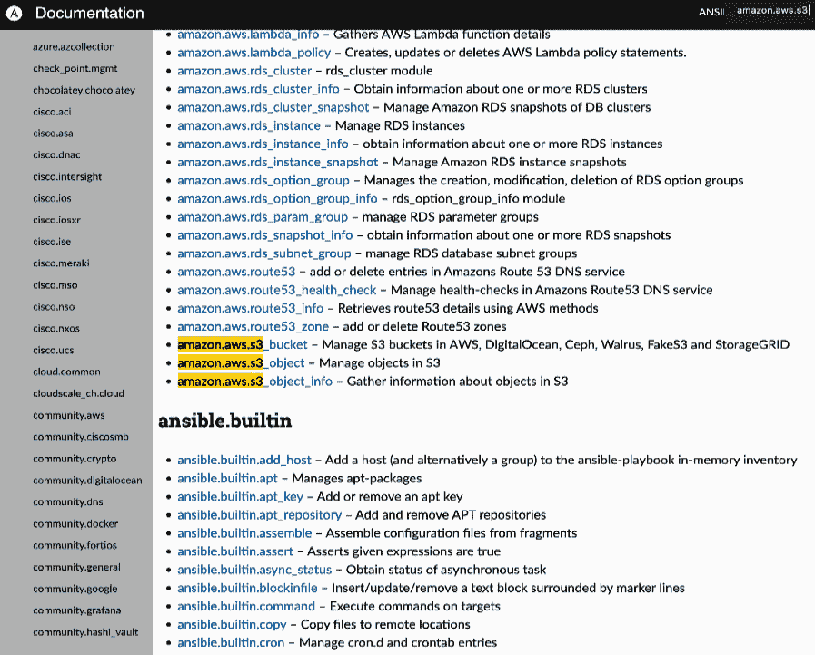
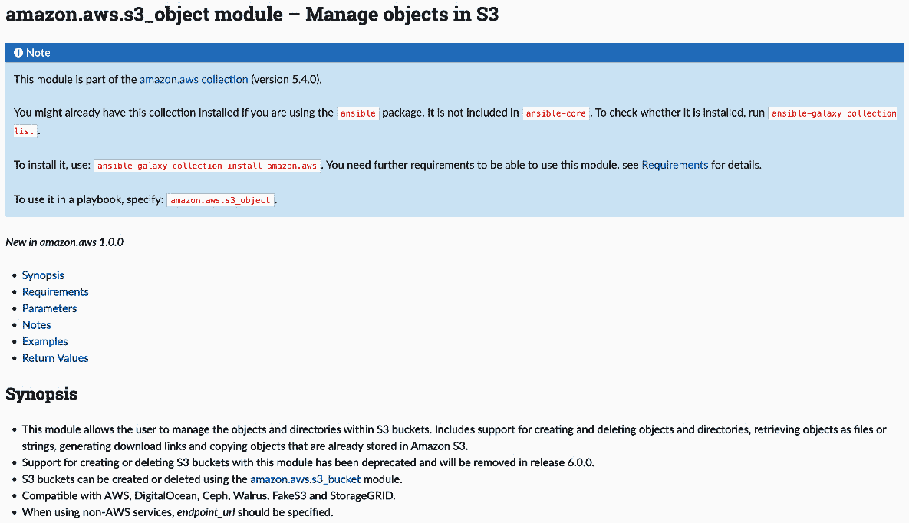
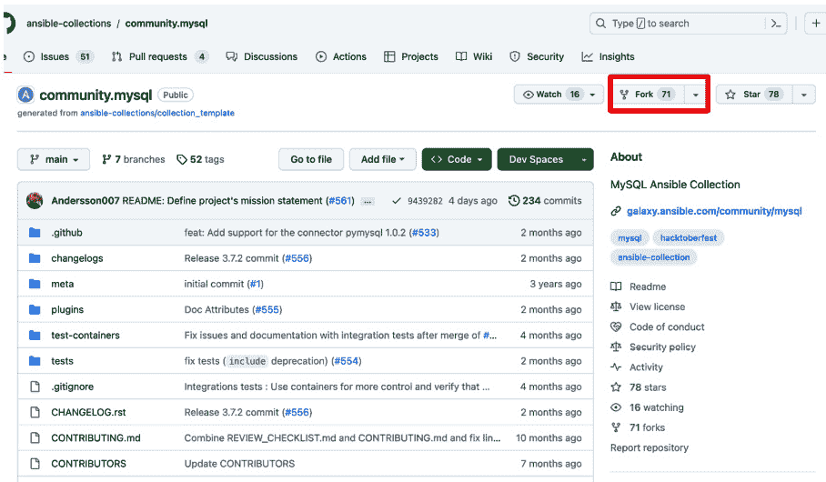
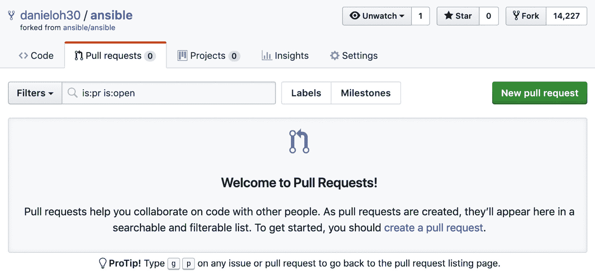

# 5

# 创建和使用模块

在本书的整个过程中，我们几乎一直在引用并使用 Ansible 模块。我们将这些模块视为*黑箱*——也就是说，我们只是接受它们的存在，并且相信它们会以某种已记录的方式工作。然而，Ansible 的许多优点之一是它是一个开源项目，因此你不仅可以查看和修改其源代码，还可以开发自己的扩展功能。截止目前，Ansible 已拥有 3300 多个模块，处理从简单的命令（如复制文件和安装包）到配置高度复杂和定制的网络设备等各种任务。这些模块的庞大阵容来源于 Ansible 解决问题的真实需求，而且每次发布新版本时，包含的模块数量都会增加。

迟早，你会遇到一种当前 Ansible 模块中不存在的特定功能。当然，你可以尝试通过编写自己的模块或将某个现有模块的增强功能贡献回 Ansible 项目来填补这个空白，从而让其他人也能受益。在本章中，你将学习创建模块的基础知识，并了解如何将你的代码贡献回上游的 Ansible 项目（如果你愿意的话）。

本章将具体涉及以下主题：

+   使用命令行执行多个模块

+   审查模块索引

+   从命令行访问模块文档

+   模块返回值

+   开发自定义模块

开始吧！

# 技术要求

本章假设你已经按照*第一章*《开始使用 Ansible》的详细说明，设置好了控制主机，并且正在使用最新版本的 Ansible——本章的示例是在`ansible-core`版本 2.15 下测试的。本章还假设你至少有一个额外的主机进行测试。理想情况下，该主机应为基于 Linux 的。尽管本章中将给出具体的主机名示例，你可以自由地用自己的主机名和/或 IP 地址替换它们。如何进行替换的详细说明将在适当的位置提供。

本章中将涉及的模块开发工作假定你的计算机上已安装 Python 3 开发环境，并且你正在运行 Linux、FreeBSD 或 macOS 之一。如果需要额外的 Python 模块，其安装过程已记录。本章中模块文档的构建任务有一些关于 Python 3.10 或更高版本的特定要求，因此如果你希望尝试此任务，你需要安装合适的 Python 环境。

本章的代码包可以在这里获取：[`github.com/PacktPublishing/Practical-Ansible-Second-Edition/tree/main/Chapter%205`](https://github.com/PacktPublishing/Practical-Ansible-Second-Edition/tree/main/Chapter%205)。

# 使用命令行执行多个模块

由于本章内容主要围绕模块及其创建方式，因此让我们回顾一下如何使用模块。我们在本书中一直在这样做，但没有特别指出它们的工作方式的某些细节。我们尚未讨论的一个关键点是 Ansible 引擎如何与其模块进行交互，反之亦然，接下来我们就来探索这个问题。

和往常一样，在使用 Ansible 命令时，我们需要一个清单来执行命令。在本章中，由于我们关注的是模块本身，我们将使用一个非常简单且小的清单，如下所示：

```
[frontends]
frt01.example.com
[appservers]
app01.example.com
```

现在，在我们的回顾部分，使用临时命令可以非常轻松地运行模块，并使用 `-m` 选项告诉 Ansible 你要运行哪个模块。因此，你可以运行的最简单命令之一是 Ansible 的 `ping` 命令，如下所示：

```
$ ansible -i hosts appservers -m ping
```

现在，让我们查看前面命令的输出：

```
$ ansible -i hosts appservers -m ping
app01.example.com | SUCCESS => {
    "ansible_facts": {
        "discovered_interpreter_python": "/usr/bin/python3"
    },
    "changed": false,
    "ping": "pong"
}
```

你注意到输出的结构了吗——大括号、冒号和逗号？是的，Ansible 使用 JSON 格式的数据与模块进行交互，而模块也以 JSON 格式将数据报告回 Ansible。前面的输出是 `ping` 模块返回给 Ansible 引擎的 JSON 格式数据的一个子集。

当然，在使用命令行中的 `key=value` 对或在 playbook 和角色中使用 YAML 与模块交互时，我们永远不需要担心这个问题。因此，JSON 对我们来说是隐藏的，但这是一个重要的事实，在我们进入模块开发的世界时需要牢记。

Ansible 模块就像高级编程语言中的函数一样，它们接受一组定义良好的输入参数，执行功能，然后提供一组输出数据，这些输出数据也是明确定义和记录的。我们将在本章稍后详细讨论这一点。当然，前面的命令没有包括任何参数，因此这是通过 Ansible 调用模块的最简单方式。

现在，让我们运行另一个带有参数并将数据传递给模块的命令：

```
$ ansible -i hosts appservers -m command -a "/bin/echo 'hello modules'"
```

在这种情况下，我们向命令模块提供了一个字符串作为参数，Ansible 会将其转换为 JSON，并在调用时传递给命令模块。当你运行这个临时命令时，你会看到类似以下的输出：

```
$  ansible -i hosts appservers -m command -a "/bin/echo 'hello modules'"
app01.example.com | CHANGED | rc=0 >>
hello modules
```

在这个例子中，输出数据似乎不是 JSON 格式的；然而，当你运行模块时，Ansible 打印到终端的内容仅是每个模块返回的数据的一个子集——例如，命令的 `CHANGED` 状态和 `rc=0` 退出代码都以 JSON 格式的数据结构传回给 Ansible——这些只是对我们隐藏了。

这一点不需要过多解释，但设定背景是很重要的。正是基于这个背景，我们将在本章中不断构建，所以请记住以下关键点：

+   Ansible 和其模块之间的通信是通过 JSON 格式的数据结构进行的

+   模块接受控制其功能的输入数据（参数）

+   模块总是返回数据——至少是模块执行的状态（例如，`changed`、`ok` 或 `failed`）。

当然，在开始编码模块之前，首先检查是否已经存在可以执行你所需要的所有（或部分）功能的模块是有意义的。我们将在下一节探讨这一点。

# 审查模块索引

正如前一节所讨论的，Ansible 提供了成千上万个模块，使得开发 playbooks 并在多个主机上运行它们变得快速而容易。然而，在这么多模块中，如何找到合适的模块开始使用呢？幸运的是，Ansible 文档提供了一个组织良好的、带有索引的模块列表，你可以查阅该列表来找到所需的模块——你可以在这里找到它：[`docs.ansible.com/ansible/latest/collections/index_module.xhtml`](https://docs.ansible.com/ansible/latest/collections/index_module.xhtml)。

假设你想看看是否有一个原生的 Ansible 模块可以帮助你配置和管理你的 Amazon Web Services S3 存储桶。这是一个相当精确、明确的需求，所以让我们按逻辑来处理：

1.  按照之前讨论的，首先在你的网页浏览器中打开所有模块的索引：[`docs.ansible.com/ansible/latest/collections/index_module.xhtml`](https://docs.ansible.com/ansible/latest/collections/index_module.xhtml)。

1.  现在，我们知道 `amazon.aws` 模块肯定在这页的最开始部分已经列出了。

1.  这页上仍然列出了成千上万个模块！所以，让我们在浏览器中使用查找功能（*Ctrl* + *F*），看看 `amazon.aws.s3` 这个关键词是否出现：



图 5.1 – Amazon 模块

现在我们已经有了一个模块的短名单——虽然有几个模块，所以我们仍然需要决定哪个（或哪些）模块适合我们的 playbook。正如前面简短描述所示，这将取决于你预期的任务是什么。

1.  简短的描述应该足够给你一些线索，判断该模块是否适合你的需求。一旦你有了大致的想法，可以点击相应的文档链接查看该模块的更多详情及如何使用：



图 5.2 – Amazon S3 模块详情

1.  如你所见，每个模块的文档页面提供了大量信息，包括更长的描述。如果你向下滚动页面，你会看到可以提供给模块的参数列表，一些实际的使用示例，以及有关模块输出的细节。同时，请注意，如果你在没有安装 `boto3` 和 `botocore` 模块的 Python 3.6 或更高版本上运行 playbook 时使用 `aws_s3` 模块，你将会收到一个错误。

所有模块在被接受作为 Ansible 项目的一部分之前，必须有这样的文档，因此如果你打算提交自己的模块，必须记住这一点。这也是 Ansible 受欢迎的原因之一——凭借易于维护且文档完善的标准，它是自动化的完美社区平台。然而，官方的 Ansible 网站并不是你唯一可以获取文档的地方，因为它甚至可以在命令行中使用。我们将在下一节中讨论如何通过这种方式检索文档。

# 从命令行访问模块文档

如前一节所述，Ansible 项目以其文档为荣，确保文档易于访问是项目的一个重要部分。现在，假设你正在处理一个 Ansible 任务（无论是在 playbook、角色中，还是在临时命令中），并且你处于一个数据中心环境，只有你所工作的机器的 shell 可用。你该如何获取 Ansible 文档？

幸运的是，我们尚未讨论的 Ansible 安装的一部分是 `ansible-doc` 工具，它与熟悉的 `ansible` 和 `ansible-playbook` 可执行文件一起作为标准安装。`ansible-doc` 命令包含了所有随你安装的 Ansible 版本一起发布的模块的完整（基于文本的）文档库。这意味着，无论你身处数据中心并且没有网络连接，你都能触手可及地获取到你需要的模块信息！

以下是一些示例，展示如何使用 `ansible-doc` 工具：

+   你可以通过简单地执行以下命令，列出 Ansible 控制机上所有有文档的模块：

    ```
    $ ansible-doc -l
    ```

你应该看到类似于以下的输出：

```
amazon.aws.autoscaling_group Create or delete AWS AutoScaling..
amazon.aws.autoscaling_group_info Gather information about...
amazon.aws.aws_az_info Gather information about availability...
amazon.aws.aws_caller_info Get information about the user...
```

输出页数众多，这也展示了模块的数量！你甚至可以数一数它们：

```
$ ansible-doc -l | wc -l
7484
```

没错——Ansible 2.15 包含了 7,484 个模块！

+   和以前一样，你可以使用你喜欢的 shell 工具来处理索引，查找特定模块；例如，你可以使用 `grep` 查找 `s3`，以便找到所有与 S3 相关的模块，正如我们在上一节中在浏览器中进行的交互一样：

    ```
    $ ansible-doc -l | grep s3
    amazon.aws.s3_bucket Manage S3 buckets in AWS...
    amazon.aws.s3_object_info Gather informatio...
    community.aws.s3_bucket_info Li...
    aws_s3 module – just as we did on the website, simply run the following:

    ```

    $ ansible-doc aws_s3

    ```

    ```

这将生成类似于以下的输出：

```
$ ansible-doc aws_s3
> AMAZON.AWS.S3_OBJECT    (/Users/danieloh/Library/Python/3.11/lib/python/site-packages/ansible_collections/amazon/aws/plugins/modules/s3_object.py)
        This module allows the user to manage the objects and directories within S3 buckets. Includes support for creating and deleting objects and directories, retrieving
        objects as files or strings, generating download links and copying objects that are already stored in Amazon S3\. Support for creating or deleting S3 buckets with
...
ADDED IN: version 1.0.0 of amazon.aws
  * note: This module has a corresponding action plugin.
OPTIONS (= is mandatory):
- access_key
        AWS access key ID.
        See the AWS documentation for more information about access tokens https://docs.aws.amazon.com/general/latest/gr/aws-sec-cred-types.xhtml#access-keys-and-secret-
ansible-doc tells us about the module, provides a list of all of the arguments (OPTIONS) that we can pass it, and as we scroll down, even gives some working examples and possible return values. We shall explore the topic of return values in the next section as they are important to understand, especially as we approach the topic of developing modules.
Module return values
As we discussed earlier in this chapter, Ansible modules return their results as structured data, formatted behind the scenes in JSON. You came across this return data in the previous example, both in the form of an exit code and where we used the `register` keyword to capture the results of a task in an Ansible variable. In this section, we shall explore how to discover the return values for an Ansible module so that we can work with them later on in a playbook, for example, with conditional processing (see *Chapter 4*, *Playbooks* *and Roles*).
Due to conserving space, we shall choose what is perhaps one of the simplest Ansible modules to work with when it comes to return values – the `ping` module.
Without further ado, let’s use the `ansible-doc` tool that we learned about in the previous section and see what this says about the return values for this module:

```

$ ansible-doc ping

```

 If you scroll to the bottom of the output from the preceding command, you should see something like this:

```

$ ansible-doc ping

> ANSIBLE.BUILTIN.PING    (/home/james/.local/lib/python3.10/site-packages/ansible/modules/ping.py)

...

返回值：

ping:

description: 数据参数提供的值

returned: success

sample: pong

type: str

```

 Hence, we can see that the `ping` module will only return one value, and that is called `ping`. `description` tells us what we should expect this particular return value to contain, while the `returned` field tells us that it will only be returned on `success` (if it were to be returned on other conditions, these would be listed here). The `type` return value is a string (denoted by `str`), and although you can change the value with an argument provided to the `ping` module, the default return value (and hence `sample`) is `pong`.
Now, let’s see what this looks like in practice. For example, there’s nothing contained in those return values that would tell us whether the module ran successfully and whether anything was changed; however, we know that these are fundamental pieces of information about every module run.
Let’s put a very simple playbook together. We’re going to run the `ping` module with no arguments, capture the return values using the `register` keyword, and then use the `debug` module to dump the return values onto the Terminal:

```

---

- name: 演示返回值的简单任务

hosts: localhost

tasks:

- name: 执行一个简单的基于模块的任务

ansible.builtin.ping:

register: pingresult

- name: 显示结果

ansible.builtin.debug:

var: pingresult

```

 Now, let’s see what happens when we run this playbook:

```

$ ansible-playbook retval.yml

[警告]: 提供的主机列表为空，仅 localhost 可用。注意

隐式 localhost 不匹配 'all'

任务 [展示返回值的简单示例] *******************************

任务 [Gathering Facts] *********************************************************

ok: [localhost]

任务 [执行简单的基于模块的任务] **************************************

ok: [localhost]

任务 [显示结果] ******************************************************

ok: [localhost] => {

"pingresult": {

"changed": false,

"failed": false,

"ping": "pong"

}

}

任务总结 *********************************************************************

localhost : ok=3 changed=0 unreachable=0 failed=0 skipped=0 rescued=0 ignored=0

```

 Notice that the `ping` module does indeed return a value called `ping`, which contains the `pong` string (as the ping was successful). However, you can see that there are, in fact, two additional return values that were not listed in the Ansible documentation. These accompany every single task run, and are hence implicit – that is to say, you can assume they will be among the data that’s returned from every module. The `changed` return value will be set to `true` if the module run resulted in a change on the target host, while the `failed` return value will be set to `true` if the module run failed for some reason.
Using the `debug` module to print the output from a module run is an incredibly useful trick if you want to gather more information about a module, how it works, and what sort of data is returned. At this point, we’ve covered just about all of the fundamentals of working with modules, so in the next section, we’ll make a start on developing our very own (simple) module.
Developing custom modules
Now that we’re familiar with modules, how to call them, how to interpret their results, and how to find documentation on them, we can make a start on writing a simple module. Although this will not include the deep and intricate functionality of many of the modules that ship with Ansible, it is hoped that this will give you enough information to proceed with confidence when you build out your own, more complex, ones.
One important point to note is that Ansible is written in Python 3, and as such, so are its modules. As a result, you will need to write your module in Python 3; to get started with developing your own module, you will need to make sure you have Python 3 and a few essential tools installed. If you are already running Ansible on your development machine, you probably have the required packages installed, but if you are starting from scratch, you will need to install Python 3, the Python 3 package manager (`pip3`), and perhaps some other development packages. The exact process will vary widely between operating systems, but here are some examples to get you started:

*   On Fedora, you would run the following command to install the required packages:

    ```

    $ sudo dnf install python python-devel

    ```

     *   Similarly, on CentOS, you would run the following command to install the required packages:

    ```

    $ sudo yum install python3 python3-devel

    ```

     *   On Ubuntu, you would run the following commands to install the packages you need:

    ```

    $ sudo apt-get update

    $ sudo apt-get install python3-pip python3-dev build-essential

    ```

     *   If you are working on macOS and are using the Homebrew packaging system, the following command will install the packages you need:

    ```

    $ brew install python

    ```

Once you have the required packages installed, you will need to clone the Ansible Git repository to your local machine as there are some valuable scripts in there that we will need later on in the module development process. Use the following command to clone the Ansible repository to your current directory on your development machine:

```

$ git clone https://github.com/ansible/ansible.git

```

 Finally (although optionally), it is good practice to develop your Ansible modules in a **virtual environment** (**venv**) as this means any Python packages you need to install go in here, rather than in with your global system Python modules. Installing modules for the entire system in an uncontrolled manner can, at times, cause compatibility issues or even break local tools, so although this is not a required step, it is highly recommended.
The exact command to create a virtual environment for your Python module development work will depend on both the operating system you are running and the version of Python you are using. You should refer to the documentation for your Linux distribution for more information; however, the following commands were tested on CentOS 8 with the default Python 3.11 and higher to create a virtual environment called `moduledev` inside the Ansible source code directory you just cloned from GitHub:

```

$ cd ansible

$ python -m virtualenv moduledev

新的 Python 可执行文件位于 /home/james/ansible/moduledev/bin/python

安装 setuptools, pip, wheel...完成。

```

 With our development environment set up, let’s start writing our first module. This module will be very simple as it’s beyond the scope of this book to provide an in-depth discussion about how to write large amounts of Python code. However, we will code something that can use a function from a Python library to copy a file locally on the target machine.
This overlaps heavily with existing module functionality, but it will serve as a nice concise example of how to write a simple Python program in a manner that allows Ansible to make use of it as a module. Now, let’s start coding our first module:

1.  In your preferred editor, create a new file called (for example) `remote_filecopy.py`:

    ```

    $ vi remote_filecopy.py

    ```

     2.  Start with a shebang to indicate that this module should be executed with Python:

    ```

    #!/usr/bin/env python

    ```

     3.  Although not mandatory, it is good practice to add copyright information, as well as your details, in the headers of your new module. By doing this, anyone using it will understand the terms under which they can use, modify, or redistribute it. The text given here is merely an example; you should investigate the various appropriate licenses for yourself and determine which is the best for your module:

    ```

    # 版权：(c) 2018, Jesse Keating <jesse.keating@example.org>

    # GNU 通用公共许可证 v3.0+（请参阅 COPYING 或 https://www.gnu.org/licenses/gpl-3.0.txt）

    ```

     4.  It is also good practice to add an Ansible metadata section that includes `metadata_version`, `status`, and `supported_by` information immediately after the copyright section. Note that the `metadata_version` field represents the Ansible metadata version (which, at the time of writing, should be `1.1`) and is not related to the version of your module or the Ansible version you are using. The values suggested in the following code will be fine for just getting started, but if your module gets accepted into the official Ansible source code, they are likely to change:

    ```

    ANSIBLE_METADATA = {'metadata_version': '1.1',

    'status': ['preview'],

    'supported_by': 'community'}

    ```

     5.  Remember `ansible-doc` and that excellent documentation that is available on the Ansible documentation website? That all gets automatically generated from special sections you add to this file. Let’s get started by adding the following code to our module:

    ```

    DOCUMENTATION = '''

    ---

    模块：remote_filecopy

    version_added: "2.15"

    简短描述：在远程主机上复制文件

    描述：

    - remote_copy 模块将文件从给定的源复制到提供的目标位置。

    选项：

    source:

    描述：

    - 远程主机上源文件的路径

    必需：True

    dest:

    描述：

    - 远程主机上目标的复制路径

    必需：True

    作者：

    - Jesse Keating (@omgjlk)

    '''

    ```

Pay particular attention to the `author` dictionary – to pass the syntax checks for inclusion in the official Ansible code base, the author’s name should be appended with their GitHub ID in brackets. If you don’t do this, your module will still work, but it won’t pass the test we’ll perform later.
Notice how the documentation is in YAML format, enclosed between triple single quotes?
The fields listed should be common to just about all modules, but naturally, if your module takes different options, you would specify these so that they match your module.

1.  The examples that you will find in the documentation are also generated from this file – they have a special documentation section immediately after `DOCUMENTATION` and should provide practical examples of how you might create a task using your module, as shown in the following example:

    ```

    EXAMPLES = '''

    # 来自 Ansible Playbooks 的示例

    - 名称：备份配置文件

    remote_copy:

    source: /etc/herp/derp.conf

    dest: /root/herp-derp.conf.bak

    '''

    ```

     2.  The data that’s returned by your module to Ansible should also be documented in its own section. Our example module will return the following values:

    ```

    RETURN = '''

    source:

    描述：用于复制的源文件

    返回：成功

    类型：str

    sample: "/path/to/file.name"

    dest：

    描述：复制的目标

    返回：成功

    类型：str

    sample: "/path/to/destination.file"

    gid：

    描述：目标的组 ID

    返回：成功

    类型：int

    sample: 502

    组：

    描述：目标的组名

    返回：成功

    类型：str

    sample: "users"

    uid：

    描述：目标的所有者 ID

    返回：成功

    类型：int

    sample: 502

    owner：

    描述：目标所有者名称

    返回：成功

    类型：str

    sample: "fred"

    模式：

    描述：目标的权限

    返回：成功

    类型：int

    sample: 0644

    大小：

    描述：目标大小

    返回：成功

    类型：int

    sample: 20

    状态：

    描述：目标的状态

    返回：成功

    类型：str

    sample: "file"

    '''

    ```

     3.  Immediately after we have finished our documentation section, we should import any Python modules we’re going to use. Here, we will include the `shutil` module, which will be used to perform our file copy:

    ```

    主函数，其中我们将创建一个 AnsibleModule 类型的对象，并使用 argument_spec 字典获取模块调用时的选项：  

    ```
    def main():
        module = AnsibleModule(
            argument_spec = dict(
                source=dict(required=True, type='str'),
                dest=dict(required=True, type='str')
            ),
        )
    ```

    ```

     4.  At this stage, we have everything we need to write our module’s functional code – even the options that it was called with. Hence, we can use the Python `shutil` module to perform the local file copy, based on the arguments provided:

    ```

    shutil.copy(module.params['source'],  

    module.params['dest'])  

    ```

     5.  At this point, we’ve executed the task our module was designed to complete. However, it is fair to say that we’re not done yet – we need to exit the module cleanly and provide our return values to Ansible. Normally, at this point, you would write some conditional logic to detect whether the module was successful and whether it performed a change on the target host or not. However, for simplicity, we’ll simply exit with the `changed` status every time – expanding this logic and making the return status more meaningful is left as an exercise for you:

    ```

    module.exit_json(changed=True)  

    ```

The `module.exit_json` method comes from `AnsibleModule`, which we created earlier – remember, we said it was important to know that data was passed back and forth using JSON!

1.  As we approach the end of our module code, we must now tell Python where it can import the `AnsibleModule` object from. This can be done with the following line of code:

    ```

    from ansible.module_utils.basic import *  

    ```

     2.  Now, let’s look at the final two lines of code for the module – this is where we tell the module that it should be running the `main` function when it starts:

    ```

    if __name__ == '__main__':  

    main()  

    ```

That’s it – with a series of well-documented steps, you can write your own Ansible modules in Python. The next step is, of course, to test it (and you will need to write formal tests to merge it with Ansible’s GitHub repository). Before we test it in Ansible, let’s see whether we can run it manually in the shell. Of course, to make the module think it is being run within Ansible, we must generate some arguments in – you guessed it – JSON format. Create a file with the following contents to provide the arguments:

```

{  

"ANSIBLE_MODULE_ARGS": {  

"source": "/tmp/foo",  

"dest": "/tmp/bar"  

}  

}  

```

 Armed with this little snippet of JSON, you can execute your module directly with Python. If you haven’t already done so, you’ll need to set up your Ansible development environment as follows. Note that we also manually create the source file, `/tmp/foo`, so that our module can perform the file copy:

```

$ touch /tmp/foo  

$ . moduledev/bin/activate  

(moduledev) $ . hacking/env-setup  

正在运行 egg_info  

正在创建 lib/ansible_base.egg-info  

正在将依赖写入 lib/ansible_base.egg-info/requires.txt  

正在写入 lib/ansible_base.egg-info/PKG-INFO  

正在将顶层名称写入 lib/ansible_base.egg-info/top_level.txt  

正在写入依赖链接到 lib/ansible_base.egg-info/dependency_links.txt  

正在写入清单文件 'lib/ansible_base.egg-info/SOURCES.txt'  

正在读取清单文件 'lib/ansible_base.egg-info/SOURCES.txt'  

正在读取清单模板 'MANIFEST.in'  

警告：未找到与 'SYMLINK_CACHE.json' 匹配的文件  

警告：未找到与 'docs/docsite/rst_warnings' 匹配的先前包含的文件  

警告：在目录 'docs/docsite/_build' 下未找到与 '*' 匹配的先前包含的文件  

警告：在目录 'docs/docsite/_extensions' 下未找到与 '*.pyc' 匹配的先前包含的文件  

警告：在目录 'docs/docsite/_extensions' 下未找到与 '*.pyo' 匹配的先前包含的文件  

警告：在目录 'lib/ansible/modules/windows' 下未找到与 '*.ps1' 匹配的文件  

警告：在目录 'test/support' 下未找到与 '*.psm1' 匹配的文件  

正在写入清单文件 'lib/ansible_base.egg-info/SOURCES.txt'  

正在设置 Ansible 从检出中运行...  

PATH=/home/james/ansible/bin:/home/james/ansible/moduledev/bin:/usr/local/sbin:/usr/local/bin:/usr/sbin:/usr/bin:/home/james/bin

PYTHONPATH=/home/james/ansible/lib  

MANPATH=/home/james/ansible/docs/man:/usr/local/share/man:/usr/share/man  

请记住，您可能希望通过 -i 指定主机文件  

完成！  

```

 Now, you’re finally ready to run your module for the first time. You can do this as follows:

```

(moduledev) $ python remote_filecopy.py args.json  

{"invocation": {"module_args": {"dest": "/tmp/bar", "source": "/tmp/foo"}}, "changed": true}  

(moduledev) $ ls -l /tmp/bar  

-rw-r--r-- 1 root root 0 Apr 26 12:35 /tmp/bar  

```

 Success! Your module works – and it both ingests and produces JSON data, as we discussed earlier in this chapter. Of course, there’s much more to add to your module – we’ve not addressed `failed` or `ok` returns from the module, nor does it support check mode. However, we’re off to a flying start. If you want to learn more about Ansible modules and fleshing out your functionality, you can find more details here: [`docs.ansible.com/ansible/latest/dev_guide/developing_modules_general.xhtml`](https://docs.ansible.com/ansible/latest/dev_guide/developing_modules_general.xhtml).
Note that when it comes to testing your module, creating arguments in a JSON file is hardly intuitive, although, as we have seen, it does work well. Luckily for us, it is easy to run our Ansible module in a playbook! By default, Ansible will check the playbook directory for a subdirectory called `library/` and will run referenced modules from here. Hence, we might create the following:

```

$ cd ~  

$ mkdir testplaybook  

$ cd testplaybook  

$ mkdir library  

$ cp ~/ansible/moduledev/remote_filecopy.py library/  

```

 Now, create a simple inventory file in this playbook directory, just as we did previously, and add a playbook with the following contents:

```

---  

- name: 测试自定义模块的 Playbook  

hosts: all  

tasks:  

- name: 测试自定义模块  

remote_filecopy:  

source: /tmp/foo  

dest: /tmp/bar  

register: testresult  

- name: 打印测试结果数据  

ansible.builtin.debug:  

var: testresult  

```

 For clarity, your final directory structure should look like this:

```

testplaybook  

├── hosts  

├── library  

│ └── remote_filecopy.py  

└── testplaybook.yml  

```

 Now, try running the playbook in the usual manner and see what happens:

```

$ ansible-playbook -i hosts testplaybook.yml  

PLAY [测试自定义模块的 Playbook] ******************************************  

TASK [Gathering Facts] *********************************************************  

ok: [frt01.example.com]  

ok: [app01.example.com]  

TASK [测试自定义模块] **************************************************  

changed: [app01.example.com]  

changed: [frt01.example.com]  

任务 [打印测试结果数据] **********************************************

ok: [app01.example.com] => {

"testresult": {

"changed": true,

"failed": false

}

}

ok: [frt01.example.com] => {

"testresult": {

"changed": true,

"failed": false

}

}

PLAY RECAP *********************************************************************

app01.example.com : ok=3 changed=1 unreachable=0 failed=0 skipped=0 rescued=0 ignored=0

frt01.example.com : ok=3 changed=1 unreachable=0 failed=0 skipped=0 rescued=0 ignored=0

```

 Success! Not only have you tested your Python code locally, but you have also successfully run it on two remote servers in an Ansible playbook. That was really easy, which proves just how straightforward it is to get started expanding your Ansible modules so that they meet your own bespoke needs.
Despite the success of running this piece of code, we’ve not checked the documentation yet, nor tested its operation from Ansible. Before we address these issues in more detail, in the next section, we’ll take a look at some of the common pitfalls of module development and how to avoid them.
Avoiding common pitfalls
Your modules must be well thought out and handle error conditions gracefully – people are going to rely on your module someday to automate a task on perhaps thousands of servers, so the last thing they want is to spend significant amounts of time debugging errors, especially trivial ones that could have been trapped or handled gracefully. In this section, we’ll look specifically at error handling and ways to do this so that playbooks will still run and exit gracefully.
One piece of overall guidance before we get started is that just like documentation receives a high degree of attention in Ansible, so should your error messages. They should be meaningful and easy to interpret, and you should steer clear of meaningless strings such as `Error!`.
So, right now, if we remove the source file that we’re attempting to copy and then rerun our module with the same arguments, I think you’ll agree that the output is neither pretty nor meaningful unless you happen to be a hardened Python developer:

```

(moduledev) $ rm -f /tmp/foo

(moduledev) $ python3 remote_filecopy.py args.json

最后一次调用的追踪：

文件 "remote_filecopy.py"，第 101 行，在 <module>

main()

^^^^^^

文件 "remote_filecopy.py"，第 94 行，在 main

shutil.copy(module.params['source'],

^^^^^^^^^^^^^^^^^^^^^^^^^^^^^^^^^^^^

文件 "/opt/homebrew/Cellar/python@3.11/3.11.4/Frameworks/Python.framework/Versions/3.11/lib/python3.11/shutil.py"，第 419 行，在 copy

copyfile(src, dst, follow_symlinks=follow_symlinks)

文件 "/opt/homebrew/Cellar/python@3.11/3.11.4/Frameworks/Python.framework/Versions/3.11/lib/python3.11/shutil.py"，第 256 行，在 copyfile

with open(src, 'rb') as fsrc:

^^^^^^^^^^^^^^^

FileNotFoundError: [Errno 2] 没有那个文件或目录: '/tmp/foo'

```

 We can, without a doubt, do better. Let’s make a copy of our module and add a little code to it. First of all, replace the `shutil.copy` lines of code with the following:

```

try:

shutil.copy(module.params['source'], module.params['dest'])

except:

module.fail_json(msg="文件复制失败")

```

 This is some incredibly basic exception handling in Python, but what it does is allow the code to try the `shutil.copy` task. However, if this fails and an exception is raised, rather than exiting with a traceback, we exit cleanly using the `module.fail_json` call. This will tell Ansible that the module failed and cleanly send a JSON-formatted error message back. Naturally, we could do a lot to improve the error message; for example, we could obtain the exact error message from the `shutil` module and pass it back to Ansible, but again, this is left as an exercise for you to complete.
Now, when we try and run the module with a non-existent source file, we will see the following cleanly formatted JSON output:

```

(moduledev) $ rm -f /tmp/foo

(moduledev) $ python3 better_remote_filecopy.py args.json

{"msg": "复制文件失败", "failed": true, "invocation": {"module_args": {"dest": "/tmp/bar", "source": "/tmp/foo"}}}

```

 However, the module still works in the same manner as before if the copy succeeds:

```

(moduledev) $ touch /tmp/foo

(moduledev) $ python3 better_remote_filecopy.py args.json

{"invocation": {"module_args": {"dest": "/tmp/bar", "source": "/tmp/foo"}}, "changed": true}

```

 With this simple change to our code, we can now cleanly and gracefully handle the failure of the file copy operation and report something more meaningful back to the user rather than using a traceback. Some additional pointers for exception handling and processing in your modules are as follows:

*   Fail quickly – don’t attempt to keep processing after an error
*   Return the most meaningful possible error messages using the various module JSON return functions
*   Never return a traceback if there’s any way you can avoid it
*   Try making errors meaningful in the context of the module and what it does (for example, for our module, `File copy error` is more meaningful than `File error` – and I think you’ll easily come up with even better error messages)
*   Don’t bombard the user with errors; instead, try to focus on reporting the most meaningful ones, especially when your module code is complex

That completes our brief yet practical look at error handling in Ansible modules. In the next section, we shall return to the documentation we included in our module, including how to build it into HTML documentation so that it can go on the Ansible website (and indeed, if your module gets accepted into the Ansible source code, this is exactly how the web documentation will be generated).
Testing and documenting your module
We have already put a great deal of work into documenting our module, as we discussed earlier in this chapter. However, how can we see it, and how can we check that it compiles correctly into the HTML that would go on the Ansible website if it were accepted as part of the Ansible source code?
Before we get into actually viewing our documentation, we should make use of a tool called `ansible-test`, which was newly added in the 2.15 release. This tool can perform a sanity check on our module code to ensure that our documentation meets all the standards required by the Ansible project team and that the code is structured correctly (for example, the Python `import` statements should always come after the documentation blocks). Let’s get started:

1.  To run the sanity tests, assuming you have cloned the official repository, change into this directory and set up your environment. Note that if your standard Python binary isn’t Python 3, the `ansible-test` tool will not run, so you should ensure Python 3 is installed and, if necessary, set up a virtual environment to ensure you are using Python 3\. This can be done as follows:

    ```

    $ cd ansible$ python 3 -m venv venv

    $ . venv/bin/activate

    (venv) $ source hacking/env-setup

    正在运行 egg_info

    正在创建 lib/ansible.egg-info

    正在写入 lib/ansible.egg-info/PKG-INFO

    正在写入依赖链接到 lib/ansible.egg-info/dependency_links.txt

    正在将要求写入 lib/ansible.egg-info/requires.txt

    正在写入顶级名称到 lib/ansible.egg-info/top_level.txt

    正在写入清单文件 'lib/ansible.egg-info/SOURCES.txt'

    正在读取清单文件 'lib/ansible.egg-info/SOURCES.txt'

    正在读取清单模板 'MANIFEST.in'

    警告: 找不到匹配的文件 'SYMLINK_CACHE.json'

    正在写入清单文件 'lib/ansible.egg-info/SOURCES.txt'

    正在设置 Ansible 以从检出目录运行...

    PATH=/home/james/ansible/bin:/home/james/ansible/venv/bin:/usr/local/sbin:/usr/local/bin:/usr/sbin:/usr/bin:/home/james/bin

    PYTHONPATH=/home/james/ansible/lib

    MANPATH=/home/james/ansible/docs/man:/usr/local/share/man:/usr/share/man

    请记住，您可能希望通过 -i 来指定您的主机文件。

    使用 pip 安装 Python 依赖，以便您可以运行 ansible-test 工具：

    ```
    (venv) $ pip install -r test/runner/requirements/sanity.txt
    ```

    ```

     2.  Now, provided you have copied your module code into the appropriate location in the source tree (an example copy command is shown here), you can run the sanity tests as follows:

    ```

    (venv) $ cp ~/moduledev/remote_filecopy.py ./lib/ansible/modules/files/

    (venv) $ ansible-test sanity --test validate-modules remote_filecopy

    使用 validate-modules 进行健康检查

    警告：无法对基础分支执行模块比较。运行时未检测到基础分支。

    警告：正在查看之前的 1 个警告：

    警告：无法对基础分支执行模块比较。运行时未检测到基础分支。

    ```

From the preceding output, you can see that apart from one warning related to us not having a base branch to compare against, the module code that we developed earlier in this chapter has passed all the tests. If you had an issue with the documentation (for example, the author’s name format was incorrect), this would be given as an error.
Now that we have passed the sanity checks with `ansible-test`, let’s see whether the documentation looks right by using the `ansible-doc` command. This is very easy to do. First of all, exit your virtual environment, if you are still in it, and change to the Ansible source code directory you cloned from GitHub earlier. Now, you can manually tell `ansible-doc` where to look for modules instead of the default path. This means that you could run the following:

```

$ cd ~/ansible

$ ansible-doc -M moduledev/ remote_filecopy

```

 You should be presented with the textual rendering of the documentation we created earlier – an example of the first page is shown here to give you an idea of how it should look:

```

> REMOTE_FILECOPY (/home/james/ansible/moduledev/remote_filecopy.py)

remote_copy 模块从远程主机复制文件到

将给定的源复制到提供的目标位置。

* 本模块由 Ansible 社区维护

选项（= 为必填项）：

= dest

远程主机上的目标路径

= source

远程主机上源文件的路径

```

 Excellent! So, we can already access our module documentation using `ansible-doc` and indeed confirm that it renders correctly in text mode. However, how do we go about building the HTML version? Fortunately, there is a well-defined process for this, which we shall outline here:

1.  Under `lib/ansible/modules/`, you will find a series of categorized directories that modules are placed under – ours fits best under the `files` category, so copy it to this location in preparation for the build process to come:

    ```

    docs/docsite/ 目录是文档创建过程中的下一步：

    ```
    $ cd docs/docsite/
    ```

    ```

     2.  Build a documentation-based Python file. Use the following command to do so:

    ```

    $ MODULES=hello_module make webdocs

    ```

Now, in theory, making the Ansible documentation should be this simple to get the `make webdocs` command to run at all.
Even in this environment, on CentOS 7, the `make webdocs` command fails unless you have some very specific Python 3 requirements in place. These are not well documented, but from testing, I can tell you that Sphinx v2.4.4 works. The version that’s supplied with CentOS 7 is too old and fails, while the newest version available from the Python module repositories is not compatible with the build process and fails.
Once I’d started working from the Ansible source tree, I had to make sure I had removed any preexisting `sphinx` modules from my Python 3 environment (you need Python 3.11 or above to build the documentation locally – if you don’t have this installed on your node, please do this before proceeding) and then ran the following commands:

```

$ pip3 uninstall sphinx

$ pip3 install sphinx==2.4.4

$ pip3 install sphinx-notfound-page

```

 With this in place, you will be able to successfully run `make webdocs` to build your documentation. You will see pages of output. A successful run should end with something like the output shown here:

```

正在生成索引... genindex py-modindexdone

写入额外页面... search/home/james/ansible/docs/docsite/_themes/sphinx_rtd_theme/search.xhtml:21: RemovedInSphinx30Warning: 修改主题中的 script_files 已被弃用。请直接在主题中插入 <script> 标签。



opensearchdone

复制图像... [100%] dev_guide/style_guide/images/thenvsthan.jpg

复制可下载文件... [ 50%] network/getting_started/sample_files/first_copying 可下载文件... [100%] network/getting_started/sample_files/first_playbook_ext.yml

复制静态文件... ... 完成

复制额外文件... 完成

正在以英语转储搜索索引（代码：en）... 完成

正在转储对象清单... 完成

构建成功，35 个警告。

HTML 页面位于 _build/html 目录。

make[1]: 离开目录 `/home/james/ansible/docs/docsite'

```

 Now, notice how, at the end of this process, the `make` command tells us where to look for the compiled documentation. If you look in here, you will find the following:

```

$ find /home/james/ansible/docs/docsite -name remote_filecopy*

/home/james/ansible/docs/docsite/rst/modules/remote_filecopy_module.rst

/home/james/ansible/docs/docsite/_build/html/modules/remote_filecopy_module.xhtml

/home/james/ansible/docs/docsite/_build/doctrees/modules/remote_filecopy_module.doctree

```

 Try opening the HTML file in your web browser – you should see that the page renders just like one of the documentation pages from the official Ansible project documentation! This enables you to check that your documentation builds correctly and looks and reads well in the context that it will be viewed. It also gives you confidence that, when you submit your code to the Ansible project (if you are doing so), you are submitting something consistent with Ansible’s documentation quality standards.
More information on building the documentation locally is provided here: [`docs.ansible.com/ansible/latest/community/documentation_contributions.xhtml#building-the-documentation-locally`](https://docs.ansible.com/ansible/latest/community/documentation_contributions.xhtml#building-the-documentation-locally).
The current process of building the documentation is a little fussy around the environments that are supported; however, hopefully, this is something that will be resolved in due course. In the meantime, the process outlined in this section has given you a tested and working process to start from.
The module checklist
In addition to the pointers and good practices that we have covered so far, there are a few more things you should adhere to in your module code to produce something that will be considered of a high standard for potential inclusion with Ansible. The following list is not exhaustive but will give you a good idea of the practices you should adhere to as a module developer:

*   Test your modules as much as you can, both in cases that will succeed and in those that cause errors. You can test them using JSON data, as we did in this chapter, or make use of them within a test playbook.
*   Try and keep your Python requirements to a minimum. Sometimes, there is no way to avoid the need for additional Python dependencies (such as the `boto` requirements of the AWS-specific modules), but in general, the less you can use, the better.
*   Don’t cache data for your module – the execution strategies of Ansible across differing hosts mean you are unlikely to get good results from doing this. Expect to gather all of the data you need on each run.
*   Modules should be a single Python file – they shouldn’t be distributed across multiple files.
*   Make sure you investigate and run the Ansible integration tests when you are submitting your module code. More information on these is available here: [`docs.ansible.com/ansible/latest/dev_guide/testing_integration.xhtml`](https://docs.ansible.com/ansible/latest/dev_guide/testing_integration.xhtml).
*   Make sure you include exception handling at the appropriate points in your module code, as we did in this chapter, to prevent issues.

Armed with the information you’ve gained from this chapter, you should have everything you need to start creating modules. You may not decide to submit them to the Ansible project, and there is certainly no requirement to do so. However, even if you don’t, following the practices outlined in this chapter will ensure that you build a good-quality module, regardless of its intended audience. Finally, on the basis that you do want to submit your source code to the Ansible project, in the next section, we’ll look at how to do this through a pull request to the Ansible project.
Contributing upstream – submitting a GitHub pull request
When you’ve worked hard on your module and thoroughly tested and documented it, you might feel that it is time to submit it to the Ansible project for inclusion. Doing this means creating a pull request on the official Ansible repository. Although the intricacies of working with GitHub are beyond the scope of this book, we will give you a practically focused outline of the basic procedures involved.
Note
Following the process outlined here will generate a real request against the Ansible project on GitHub so that the code you are committing can be merged with their code. *Do not* follow this process unless you genuinely have a new module that is ready for submission to the Ansible code base.
To submit your module as a pull request of the Ansible repository, you need to fork the collection repository.
Now, we will walk through the commands you need to run to add your module code to it. Then, we’ll show you how to create the required **pull requests** (also known as **PRs**) so that you can merge your new module with the upstream Ansible project:

1.  Fork a collection repository that you want to create a PR for using GitHub ([`github.com/ansible-collections`](https://github.com/ansible-collections)). For example, if you need to create a PR in the `community.mysql` collection, you need to select **Fork**:



Figure 5.3 – The community.mysql collection

1.  Clone the forked repository to your local machine. Use a command similar to the following, but be sure to replace the URL with the one that matches your own GitHub account:

    ```

    https://github.com/YOUR_ACCOUNT/COLLECTION_REPO.git ~/YOUR_WORKING_DIRECTORY

    ```

     2.  Add the upstream repository after you go to your cloned repository:

    ```

    $ cd ~/ YOUR_WORKING_DIRECTORY

    https://github.com/ansible-collections/COLLECTION_REPO.git

    ```

     3.  Update your local branch:

    ```

    $ git fetch upstream

    $ git rebase upstream/YOUR_BRANCH

    ```

     4.  Create a branch for the PR:

    ```

    $ git checkout -b name_of_my_branch

    ```

     5.  Change your code in the collection.
6.  Submit your pull request:

    ```

    http://github.com/ansible-collections/COLLECTION_REPO)。然后，选择 Pull requests 标签。填写 PR 模板并提交你的更改。接着，选择创建一个 pull request。请注意，如果你的 PR 符合社区标准，它将被合并：

    ```



Figure 5.4 – The Pull requests tab
There are many more ways to contribute to the Ansible project other than creating pull requests for custom modules. Here are some examples of other ways you can contribute to the project:

*   Review the Ansible documentation and report any bugs you find in it (one was filed in the creation of *Chapter 4*, *Playbooks* *and Roles*)
*   Create a local Ansible MeetUp to spread your knowledge about Ansible. If you are lucky enough to have one in your area already, consider attending it regularly.
*   Spread Ansible knowledge and awareness via social media with the appropriate account references and hashtags; for example, `@ansible`, `#ansible`, and so on.

That completes our journey of learning how to create modules, from the very first steps of looking into the theory of module operation, all the way through to contributing your new module code to the official Ansible project on GitHub. We hope you have found this journey informative and valuable and that it enhances your ability to work with Ansible and extend its functionality where required.
Summary
Modules are the very lifeblood of Ansible – without them, Ansible could not perform all of the complex and varied tasks it performs so well across a wide variety of systems. By being an open source project, it is incredibly easy to extend the functionality of Ansible by yourself, and in this chapter, we explored how you can, with a little Python knowledge, write a custom module from scratch. Ansible is, at the time of writing, incredibly feature-rich, but this ease of customization and extension makes Ansible virtually limitless in terms of its potential, especially given the power and popularity of Python as a programming language.
In this chapter, we started with a recap of how to execute multiple modules using the command line. We then explored the process of interrogating the current module index, as well as how to obtain documentation about modules to evaluate their suitability for our needs, regardless of whether we have an active internet connection or not. We then explored module data and its JSON format, before finally going on a journey through which we put together the code for a simple custom module. This provided you with a basis for creating modules in the future if you so desire.
In the next chapter, we will explore the process of using and creating another core Ansible feature, known as plugins.
Questions
Answer the following questions to test your knowledge of this chapter:

1.  Which command line can be passed down as a parameter to a module?
    1.  `ansible dbservers -m command "/bin/echo '``hello modules'"`
    2.  `ansible dbservers -m command -d "/bin/echo '``hello modules'"`
    3.  `ansible dbservers -z command -a "/bin/echo '``hello modules'"`
    4.  `ansible dbservers -m command -a "/bin/echo '``hello modules'"`
    5.  `ansible dbservers -a "/bin/echo '``hello modules'"`
2.  Which of the following practices is not recommended when you create a custom module and address exceptions?
    1.  Design a custom module simply and never provide a traceback to the user, if you can avoid it.
    2.  Fail your module code quickly, and verify that you are providing helpful and understandable exception messages.
    3.  Only display error messages for the most relevant exceptions, rather than all possible errors.
    4.  Ensure that your module documentation is relevant and easy to understand.
    5.  Delete playbooks that result in errors and then recreate them from scratch.
3.  True or false: To contribute to the Ansible upstream project, you need to submit your code to the `devel` branch.
    1.  True
    2.  False

Further reading
To learn more about the topics that were covered in this chapter, take a look at the following resources:

*   Documentation regarding the common return values of modules in Ansible can be found here: [`docs.ansible.com/ansible/latest/reference_appendices/common_return_values.xhtml#common`](https://docs.ansible.com/ansible/latest/reference_appendices/common_return_values.xhtml#common%0D)
*   Check out the following documentation for all the existing modules on Windows machines that you can use: [`docs.ansible.com/ansible/latest/collections/ansible/windows/index.xhtml`](https://docs.ansible.com/ansible/latest/collections/ansible/windows/index.xhtml)

```
