# 第十三章：开始使用 Ansible Automation Controller

Ansible 非常强大，但它要求用户使用 CLI。在某些情况下，这不是最佳选择，比如需要从另一个任务触发 Ansible 任务时（在这种情况下，使用 API 会更好），或者在需要触发任务的人员只能触发特定任务时。在这些情况下，AWX 和 Ansible Automation Controller 是最佳选择。

AWX 和 Ansible Automation Controller 之间的唯一区别在于，AWX 是上游的开源版本，而 Ansible Automation Controller 是 Red Hat 的下游组件，是作为 Ansible 自动化平台的一部分官方支持的，但需要付费，且交付方式不同。AWX 可以作为 Kubernetes Operator 运行在任何 Kubernetes 集群上，而 Ansible Automation Controller 目前只能通过 Kubernetes Operator 在 Red Hat OpenShift 安装中或在 RHEL 8.2+的机器上安装。在本章中，我们将使用 AWX 并讨论 AWX，但我们讨论的内容也同样适用于 Ansible Automation Controller。

本章将涵盖以下主题：

+   安装 AWX

+   从 AWX 运行你的第一个 Playbook：

    +   创建一个 AWX 项目

    +   创建一个清单

    +   创建一个任务模板

    +   运行一个任务

+   控制 AWX 的访问权限：

    +   创建一个用户

    +   创建一个团队

    +   创建一个组织

    +   在 AWX 中分配权限

# 技术要求

尽管有几种方法可以安装 AWX，但我们将使用推荐的 AWX 安装方法，即基于 Operator 的安装。因此，你需要有一个 Kubernetes 集群可用。

在你的机器上创建它最简单的方法是使用 minikube。

在 Linux 机器上，只需要从 GitHub 下载它（[`github.com/kubernetes/minikube`](https://github.com/kubernetes/minikube)），并使用以下命令运行：

```
minikube start --cpus=4 --memory=6g --addons=ingress
```

在下一部分中，我们将使用`kubectl`命令。要在 minikube 中使用它，你需要执行以下命令：

```
alias kubectl="minikube kubectl --"
```

在其他操作系统上，过程可能会有所不同，我建议查阅 minikube 的官方文档（[`minikube.sigs.k8s.io/docs/start/`](https://minikube.sigs.k8s.io/docs/start/)），以了解哪种安装方法更适合你的平台和需求。

尽管我们将在本章中给出特定的主机名示例，但你可以自由地将其替换为你自己的主机名和/或 IP 地址；如何进行替换的详细信息将在适当的位置提供。

# 安装 AWX

在我们讨论 AWX 之前，最好先将它安装在你的机器上，这样你就可以跟着讲解并立即开始使用 AWX。

安装 AWX Operator 最简单的方法是使用 Kustomize。

我们需要创建一个名为`kustomization.yaml`的文件，并包含以下内容：

```
---
apiVersion: kustomize.config.k8s.io/v1beta1
kind: Kustomization
resources:
  - github.com/ansible/awx-operator/config/default?ref=2.3.0
images:
  - name: quay.io/ansible/awx-operator
    newTag: 2.3.0
namespace: awx
```

请注意，版本 2.3.0 是写作时最新的版本。要查看最新的可用版本，请访问 [`github.com/ansible/awx-operator/releases`](https://github.com/ansible/awx-operator/releases)。

现在我们已经准备好 kustomization 文件，可以使用以下命令应用它：

```
kubectl apply -k .
```

当前一个命令完成后，我们将能够看到 AWX Operator 控制器管理器 pod 正在运行：

```
$ kubectl get pods -n awx
NAME                                               READY   STATUS    RESTARTS   AGE
awx-operator-controller-manager-23f4d5a324-hdk2x   2/2     Running   0          7s
```

现在我们可以创建一个 `awx.yaml` 文件，内容如下：

```
---
apiVersion: awx.ansible.com/v1beta1
kind: AWX
metadata:
  name: awx
spec:
  service_type: nodeport
```

现在我们可以编辑 `kustomization.yaml` 文件，添加对 `awx.yaml` 文件的引用。这样，我们将得到以下结果：

```
---
apiVersion: kustomize.config.k8s.io/v1beta1
kind: Kustomization
resources:
  - github.com/ansible/awx-operator/config/default?ref=2.3.0
  - awx.yaml
images:
  - name: quay.io/ansible/awx-operator
    newTag: 2.3.0
namespace: awx
```

现在我们可以应用新的配置文件：

```
$ kubectl apply –k .
```

现在，运行以下命令以确认一切工作正常：

```
$ kubectl get pods -n awx -l "app.kubernetes.io/managed-by=awx-operator"
NAME                   READY   STATUS    RESTARTS   AGE
awx-43a2624db1-hjw3e   4/4     Running   0          4m01s
awx-postgres-0         1/1     Running   0          4m11s
$ kubectl get svc -n awx -l "app.kubernetes.io/managed-by=awx-operator"
NAME           TYPE        CLUSTER-IP     EXTERNAL-IP   PORT(S)        AGE
awx-postgres   ClusterIP   None           <none>        5432/TCP        4m14s
awx-service    NodePort    10.100.81.35   <none>        80:32754/TCP    4m04s
```

请注意，您可能需要等待几分钟，直到 AWX 完全部署并且所有 pod 都在运行。

一旦 AWX 完全部署完成，您可以打开浏览器并连接到 AWX 服务。要获取 URL，您可以执行以下命令：

```
$ minikube service -n awx awx-service –url
```

默认的管理员用户名是 `admin`。要找出密码，您需要执行以下命令：

```
$ kubectl get secret -n awx awx-admin-password -o jsonpath="{.data.password}" | base64 --decode ; echo
```

现在您已经学习了安装 AWX 的必要步骤，接下来让我们来看看如何在 AWX 中创建一个项目。

# 从 AWX 运行您的第一个 playbook

与 Ansible 类似，在 AWX 中，目标是运行 Ansible playbook。每个运行的 playbook 被称为 **job**。由于 AWX 提供比 Ansible 更大的灵活性和自动化，因此在运行第一个 job 之前需要进行更多配置，接下来让我们从创建 AWX 项目开始。

## 创建 AWX 项目

AWX 使用术语 **项目** 来标识 Ansible playbook 的存储库。AWX 项目支持将 playbook 存储在所有主要的 **源代码管理**（**SCM**）系统中，如 Git 和 SVN，同时也支持存储在文件系统中的 playbook，或由 Red Hat Insights 提供的 playbook。要创建项目，请按照以下步骤操作：

1.  首先，您需要从左侧菜单栏中选择 **Projects**，然后点击屏幕左上方的 **Add** 按钮。这将打开一个窗口，类似于以下内容：

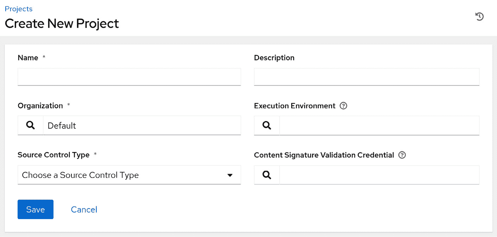

图 13.1 – 创建新项目窗口

1.  通过填写名称（`Sample Project`）并选择 **Git** 作为 **Source Control Type**，窗口会随着新参数的添加而变大：

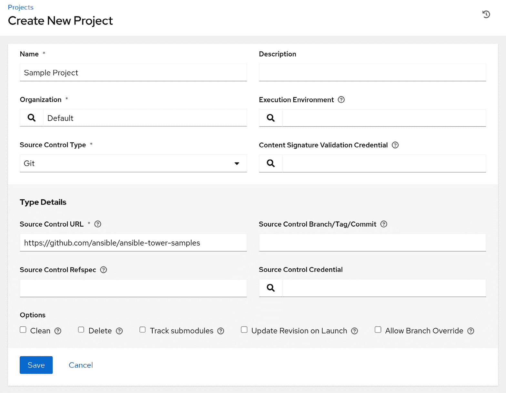

图 13.2 – 创建新项目窗口 – Git 详细信息

1.  现在，您可以添加 SCM URL（[`github.com/ansible/ansible-tower-samples`](https://github.com/ansible/ansible-tower-samples)），并点击 **保存** 按钮，按钮现在应该可以点击了。

正如我们在本节开始时提到的，项目用于在 AWX 中存储和使用 Playbooks。如你所想，AWX 项目有许多有趣的附加配置——在我看来，最有趣的一项是`启动时更新修订版`。

如果勾选此选项，它会指示 Ansible 在运行任何 Playbook 之前始终更新该项目的 Playbook 仓库。这确保它始终执行最新版本的 Playbook。启用此功能很重要，因为如果没有勾选此选项，就有可能（迟早在你的环境中会发生）有人注意到 Playbook 中有问题并进行修复，然后他们运行 Playbook 时，确信自己正在运行最新版本。但他们忘记在运行 Playbook 前同步任务，从而实际上运行的是旧版本的 Playbook。如果先前版本有较多问题，这可能会导致严重的后果。

使用此选项的缺点是每次执行 Playbook 时，实际上会运行两个 Playbook，增加了任务执行的时间。我认为这是一个非常小的缺点，不足以抵消使用此选项的好处。

至此，你已学习了在 AWX（和 Ansible Automation Controller）中创建项目所需的步骤。现在，让我们来学习如何创建一个库存。

## 创建库存

与 Ansible Core 一样，为了让 AWX 识别环境中存在的机器，我们可以使用库存。在 AWX 中，库存与 Ansible Core 中的库存并没有太大区别。

让我们通过以下步骤学习如何在 AWX 中创建第一个库存：

1.  点击左侧菜单栏中的**库存**选项。你将被重定向到**库存**窗口，在此你可以通过点击屏幕左上方的**添加**按钮来创建第一个库存。这与我们创建新项目时不同，因为该按钮不会立即打开创建表单；首先，它会询问你是否想创建一个普通库存还是智能库存。

1.  选择**库存**选项后，将出现一个类似于以下的框：

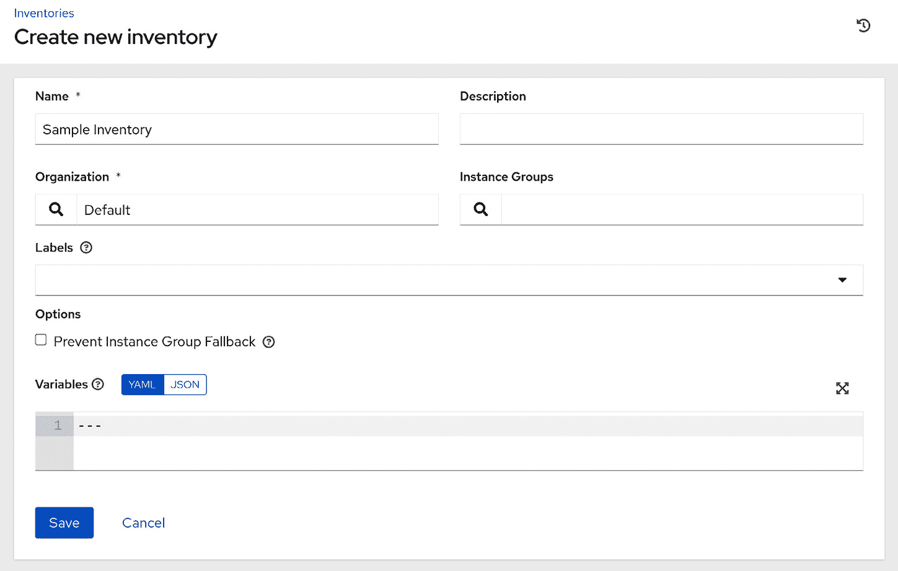

图 13.3 – 创建新库存窗口

1.  在此窗口中，你需要设置一个名称，然后保存它。点击**保存**后，**权限**、**组**、**主机**、**来源**和**已完成的作业**标签将变为可点击状态，以便你继续配置。

由于空库存没有任何实际用途，我们将向其中添加`localhost`。

1.  要执行此操作，请选择**主机**标签，然后点击屏幕左上方带有绿色背景和白色加号按钮的按钮。这将打开一个窗口，如下所示：

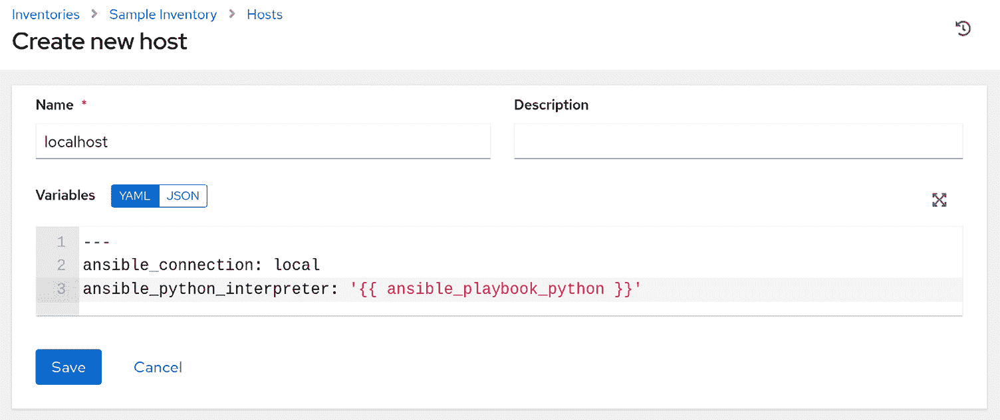

图 13.4 – 创建新主机窗口

1.  接下来，我们需要添加主机名（`localhost`），并通过在**变量**框中添加以下代码，指示 Ansible 使用本地连接：

    ```
    ---
    ansible_connection: local
    ansible_python_interpreter: '{{ ansible_playbook_python }}'
    ```

1.  现在，我们可以点击**保存**，保存我们的库存。

在 AWX 中，库存非常类似于 Ansible Core 的库存，但具有额外的功能，如内置的动态库存支持，这意味着你不需要编辑配置文件或安装额外的 Python 模块。要启用此功能，只需在库存的**源**标签页中选择从一个可信来源自动填充库存信息，例如公共云提供商的库存（**Amazon Web Services**（**AWS**）、Azure 和 **Google Cloud Platform**（**GCP**）都支持），私有云库存（如 VMware 或 OpenStack），或其他系统，如 Red Hat Satellite 或自定义脚本。

关于库存源有一个特别的说明，**来源于项目**选项如果被选择，则会提供如下所示的表单：

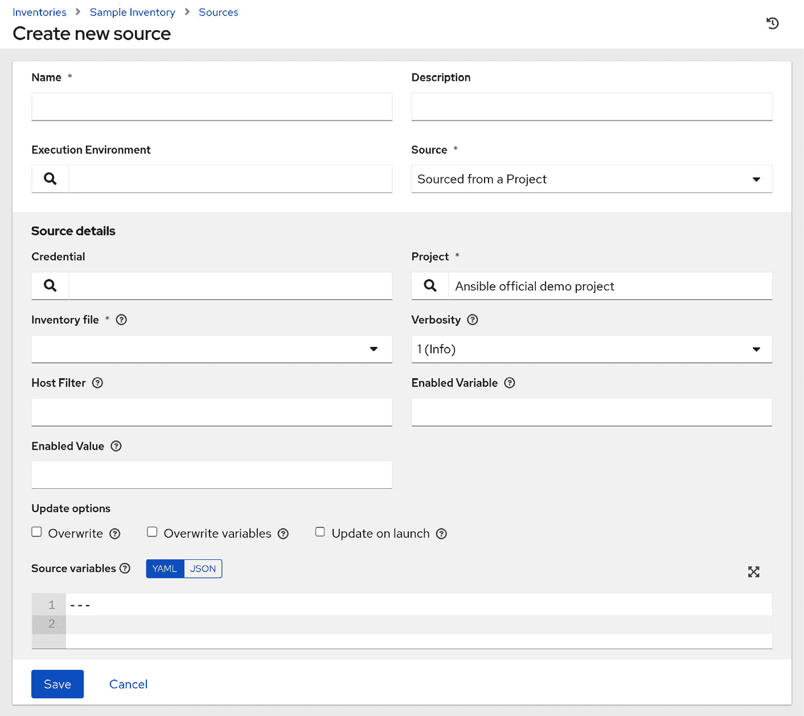

图 13.5 – 创建新源窗口

在我看来，这是一个非常有趣的功能，因为它允许用户将他们设计的动态库存脚本检入 Git 仓库（可以是独立的仓库，也可以是放有剧本的仓库），然后 AWX 从仓库中提取信息。

对于项目，当你向库存中添加一个源时，你可能会选择勾选**启动时更新**选项，它的行为与项目的**启动时更新**选项相同。基于在*创建 AWX 项目*章节中讨论的相同原因，我强烈建议你也使用这个选项。

在创建库存的最初阶段，我们可以选择添加一个库存或智能库存。什么是智能库存？**智能库存**是由 AWX 填充的库存，基于其他库存中存在的主机，并使用用户在创建过程中选择的特定智能主机过滤器进行筛选。这对于根据过滤器动态创建特定类型的主机的库存非常有用，并且可以避免手动创建许多不同的组——更糟的是，避免了重复添加相同主机的麻烦。

通过这些步骤，你已经学会了在 AWX 中创建库存所需的步骤。现在，让我们来学习如何创建一个作业模板。

## 创建作业模板

现在我们已经在项目中添加了剧本，并且在库存中添加了主机，我们可以开始创建一个**作业模板**。

在 AWX 中，工作模板是执行某个工作的配置集合。这与`ansible-playbook`命令行选项非常相似。我们需要创建工作模板的原因是，可以通过几乎不需要用户输入的方式启动剧本运行，意味着可以将任务委托给那些可能不了解剧本细节的团队，或者即使没有人参与，也可以定期运行。我们来看一下：

1.  首先，你需要从左侧菜单栏点击**模板（Templates）**选项。

1.  现在，你可以通过点击屏幕左上角的**添加（Add）**按钮来创建一个新模板。系统会询问你是否想创建工作模板或工作流模板——你需要选择**工作模板（Job Template）**。接下来会出现以下窗口：

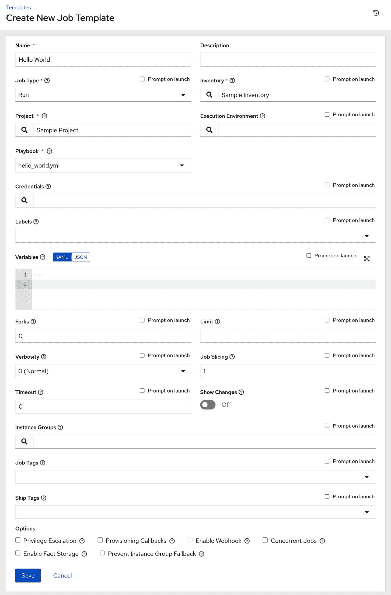

图 13.6 – 创建新工作模板窗口

如你所见，这个视图中有相当多的字段。继续操作所需的唯一信息是名称（我们将使用`Hello World`）、库存（我们将选择在*创建库存*部分中创建的`示例库存`）、项目（我们将选择在*创建 AWX 项目*部分中创建的`示例项目`），以及剧本（我们将选择`hello_world.yml`，这是唯一可用的剧本）。

然后，我们可以点击`localhost`，不需要创建或指定任何凭证。但是，如果你要在一个或多个远程主机上运行工作模板，你需要创建一个机器凭证并将其与工作模板关联。机器凭证比如说是一个 SSH 用户名和密码，或者是 SSH 用户名和私钥——这些凭证会被安全地存储在 AWX 的后端数据库中，这意味着你可以将剧本相关的任务委托给其他团队，而不必实际提供密码或 SSH 密钥。

我们首先需要选择的是是创建工作模板（Job Template）还是工作流模板（Workflow Template）。我们选择了**工作模板（Job Template）**，因为我们希望能够从这个模板创建简单的工作。也可以创建更复杂的工作，这些工作是多个工作模板的组合，并在每个工作之间加入流控制特性。这使得处理更复杂的情况和场景成为可能，例如你可能希望创建多个工作（如创建实例、定制公司、设置 Oracle 数据库、设置 MySQL 数据库等），但同时也希望能够实现一键部署，比如说设置机器、应用所有公司定制以及安装 MySQL 数据库。

你也可以有另一个部署，使用相同的组件，除了最后一个组件，取而代之的是使用 Oracle 数据库来创建 Oracle 数据库机器。这使得你可以获得极大的灵活性，并重复使用很多组件，创建多个几乎相同的剧本（playbook）。

有趣的是，`limit` 字段中的许多字段（它的作用与 `ansible-playbook` 命令中的 `--limit` 相同）也可以用作合理性检查，它会在 playbook 运行之前提示用户输入值（并允许用户修改）。然而，它可能会阻止计划中的作业运行，因此在启用此功能时需要小心。

现在你已经了解了在 AWX 中创建作业模板的必要步骤，接下来让我们学习如何创建作业。

## 运行作业

作业，顾名思义，是作业模板的一个实例。这意味着，要在我们的机器上执行任何操作，我们必须通过以下步骤创建一个作业模板实例——或者更简单地说，一个作业：

1.  现在我们已经设置好了作业模板，可以运行该作业了。为此，我们需要从页面左侧进入**模板**。

1.  找到你想要运行的作业模板（在我们的例子中是`Hello World`），然后点击页面右侧对应正确作业模板的小火箭，如下图所示：

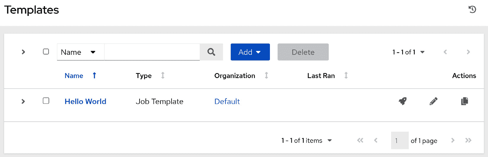

图 13.7 – 模板列表窗口

当作业正在运行时，AWX 允许我们通过作业的输出跟踪作业的执行过程，如下图所示：

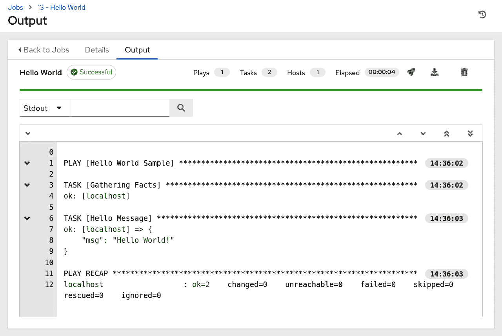

图 13.8 – 作业输出窗口

1.  通过点击**详细信息**选项卡，我们可以查看作业的更多详细信息：

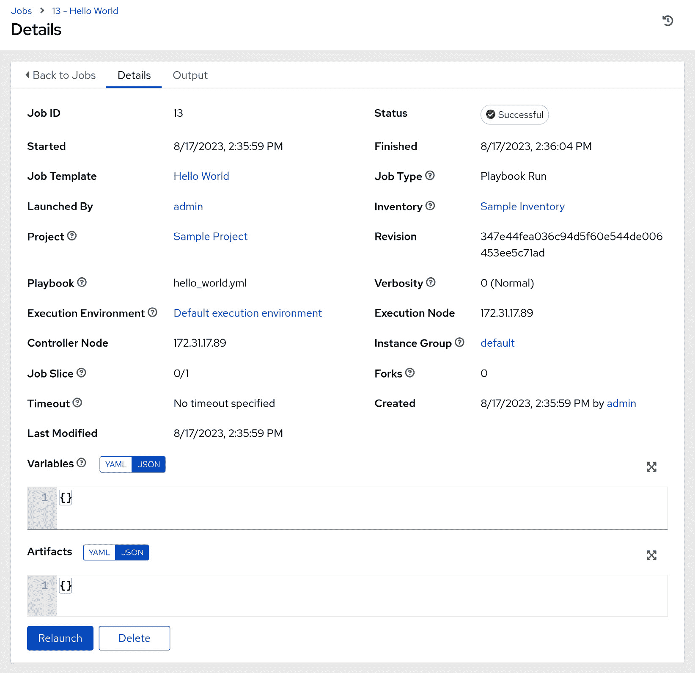

图 13.9 – 详细信息窗口

AWX 和 Ansible 自动化控制器的一个很棒的特点是，它们会在后台数据库中存档该作业的执行输出，这意味着，在未来的任何时刻，你都可以回头查询某个作业的运行情况，看看有哪些变化和发生了什么。这对审计和政策执行等场合非常有用，功能强大且实用。

现在你已经了解了在 AWX 中创建作业所需的步骤，接下来让我们学习如何创建一个用户。

# 控制 AWX 的访问权限

在我看来，AWX 相对于 Ansible 的最大优势之一是 AWX 允许多个用户连接并控制/执行操作。这使得公司可以为不同的团队、整个组织甚至多个组织提供单一的 AWX 安装。

已经建立了**基于角色的访问控制**（**RBAC**）系统来管理用户的权限。

AWX 和 Ansible 自动化控制器都可以连接到中央目录，例如**轻量级目录访问协议**（**LDAP**）和 Azure Active Directory——但我们也可以在 AWX 服务器本地创建用户帐户。让我们从在本地创建第一个用户帐户开始！

## 创建用户

AWX 的一个大优势是能够管理多个用户。这使得我们可以为每个使用 AWX 系统的人创建一个 AWX 用户账户，从而确保他们只获得所需的权限。此外，通过使用个人账户，我们可以通过审计日志查看谁执行了哪些操作。要创建用户，请按照以下步骤操作：

1.  转到左侧菜单栏并选择**用户**选项。

1.  您将看到用户列表，并且可以通过点击屏幕左上角绿色背景上带有白色加号的按钮创建新用户。随后将显示类似以下的表单：

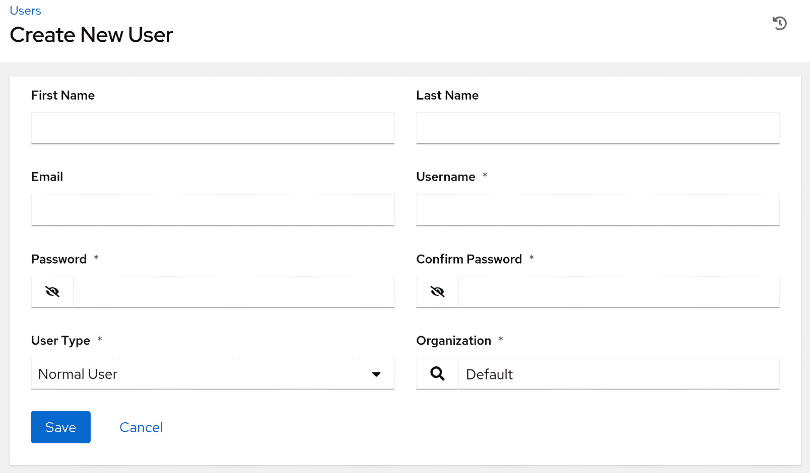

图 13.10 – 创建新用户窗口

通过添加电子邮件地址、用户名和密码（并确认密码），您可以创建一个新用户。

用户可以分为三种类型：

+   **普通用户**：此类型的用户没有任何继承权限，必须授予特定权限才能执行任何操作。

+   **系统审计员**：此类型的用户对整个 AWX 安装具有完全的只读权限。

+   **系统管理员**：此类型的用户对整个 AWX 安装具有完全权限。

现在您已经了解了在 AWX 中创建用户的必要步骤，让我们简单看一下团队的概念。

## 创建团队

尽管拥有个人用户账户是一个非常强大的工具，特别适用于企业级使用场景，但如果每个对象（如作业模板或库存）都必须单独设置权限，将会非常不方便且繁琐。每当某人加入团队时，他们的用户账户必须手动配置正确的权限，并且如果他们离开，也需要移除这些权限。

AWX 和 Ansible 自动化控制器有着与大多数其他 RBAC 系统相同的用户分组概念。唯一的细微区别在于，在用户界面中，它们被称为**团队**，而不是组。但是，您可以轻松创建团队，然后根据需要添加或删除用户。通过用户界面进行操作非常直观，您会发现这个过程与大多数 RBAC 系统处理用户组的方式类似，因此我们在这里不再展开具体细节。

当您进入**团队**页面并点击**添加**按钮时，您将看到类似以下的界面，提示您提供一些非常基本的信息：

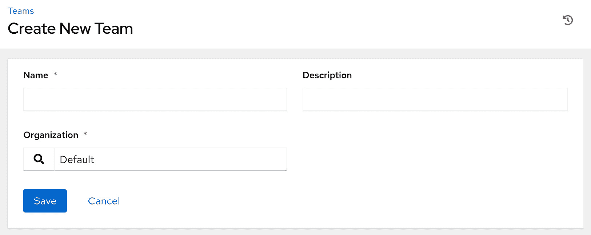

图 13.11 – 创建新团队窗口

一旦您的团队设置好，我建议您将权限分配给团队，而不是单独分配给用户，因为随着您的组织发展，这样可以更轻松地管理 AWX 对象权限。说到组织，让我们来看看 AWX 中的组织概念。

## 创建组织

有时，你需要管理多个独立的人员组，每个组需要管理独立的机器。在这种情况下，使用组织可以帮助你。一个组织是 AWX 的租户，它有自己独特的用户账户、团队、项目、清单和作业模板——几乎就像是拥有一个独立的 AWX 实例！要创建一个组织，你需要按照以下步骤操作：

1.  要创建一个新组织，你需要前往屏幕左侧，选择**组织**选项。

1.  然后你可以看到现有的组织，并通过点击屏幕左上方绿色背景上带有白色加号的按钮来创建一个新组织。

一个类似于以下的窗口将会出现：

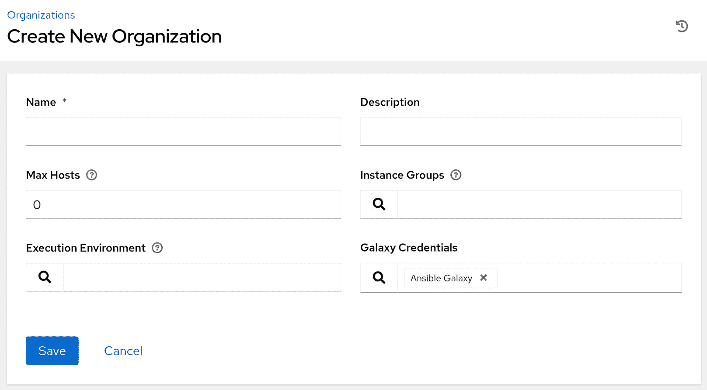

图 13.12 – 创建新组织窗口

由于唯一的必填字段是**名称**，你只需填写该字段并点击**保存**。

一旦你创建了组织，你就可以将任何资源分配给该组织，例如项目、模板、清单、用户等。组织是一个容易理解的概念，但在 AWX 中，它对于角色和职责的分隔却非常强大。最后，在我们完成这一节之前，让我们看看在 AWX 中分配权限的方法。

## 在 AWX 中分配权限

在我们配置第一个项目、清单和 AWX 作业模板的过程中，你会注意到大多数屏幕上都有一个名为**访问**的按钮。当我们使用管理员账户浏览用户界面时，我们可以看到所有选项——但当然，你不希望给每个用户都赋予管理员权限。

单个用户（或他们所属的团队）可以基于每个对象授予权限。例如，你可以拥有一个数据库管理员团队，他们只访问数据库服务器清单中的内容，并使用专门针对他们角色的作业模板。Linux 系统管理员则可以访问与他们角色相关的清单、项目和作业模板。AWX 会隐藏用户没有权限访问的对象，这意味着数据库管理员永远看不到 Linux 系统管理员的对象，反之亦然。

你可以授予用户（或团队）多种不同的权限级别，包括以下几种：

+   **管理员**：拥有此权限的用户可以更改资源的所有方面

+   **执行**（仅适用于作业模板）：拥有此权限的用户可以运行作业模板

+   **使用**：拥有此权限的用户可以在作业模板中使用该资源

+   **更新**：拥有此权限的用户可以更新资源

+   **查看**：拥有此权限的用户可以查看资源的设置

这就是我们简要介绍 AWX 中 RBAC 的内容，以及这款强大工具的概览。AWX 是 Ansible 在企业环境中功能的极佳补充，帮助确保你的用户能够以良好管理、安全且可审计的方式运行 Ansible playbook。我们在本章中只是触及了表面，但希望本章能够让你初步了解 AWX 如何帮助你团队或企业的自动化旅程。

# 总结

AWX 和 Ansible 自动化控制器是强大的互补工具，有力支持在企业或团队环境中使用 Ansible。它们可以帮助保护本应广泛分发的凭据、审计 playbook 执行历史，并强制执行 playbook 的版本控制。这些工具的基于 Web 的用户界面降低了最终用户的使用门槛，意味着 playbook 执行可以轻松委派给那些对 Ansible 知识有限的团队（前提是若问题出现，已设置适当的升级路径）。简而言之，在企业环境中实现 Ansible 时，没有 Ansible 自动化控制器或 AWX 的补充，不能算作完整的实现。

在本章中，你学习了如何在 Linux 主机上安装 AWX，以及运行第一个 AWX playbook 所需的步骤。你还了解了 AWX 中的 RBAC 以及它如何支持在企业环境中处理大型的多用户环境。

在下一章中，我们将深入探讨执行环境的概念，它能帮助你简化自动化，并在更新 Ansible、AWX 或 Ansible 自动化控制器时保持系统运行。

# 问题

请回答以下问题以测试你对本章内容的掌握：

1.  你可以在 Ansible 自动化控制器中创建哪些对象？

    1.  用户

    1.  工作

    1.  作业模板

    1.  模块

    1.  项目

1.  对还是错？AWX 是 Red Hat Ansible 自动化控制器的上游版本：

    1.  正确

    1.  错误
