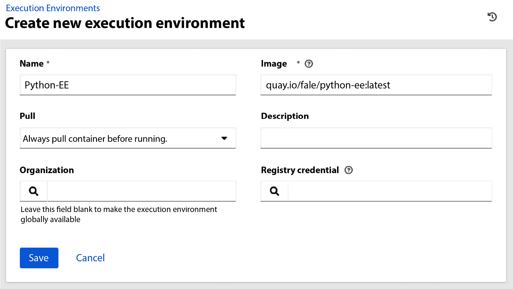
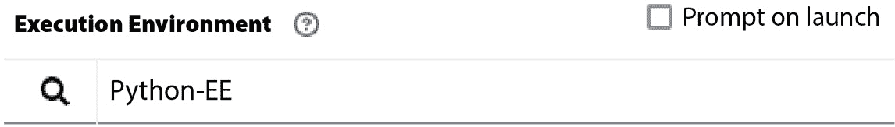

# 第十四章：执行环境

我们已经看到，Ansible 自动化控制器通过利用易于使用的 web 界面、RBAC 和日志记录，使你能够扩展自动化，并允许其他人以符合公司规定的方式使用自动化。

在本章中，我们将讨论执行环境，这是 Ansible 几年前发布的一项功能，但它对于创建持久的自动化至关重要。更具体地说，我们将涵盖以下主要内容：

+   执行环境的重要性

+   构建执行环境

+   在执行环境中运行 playbook

+   将执行环境上传到容器注册表

+   在自动化控制器中使用执行环境

# 技术要求

为了跟随本章的示例，你需要 `ansible-builder` 版本 3.0 或更高版本。

Ansible Builder 需要 Python 3.8 或更高版本，你的系统可能已经安装了它。

安装 `ansible-builder` 的最简单方法是使用 PyPi：

```
$ pip install ansible-builder
```

# 执行环境的重要性

你可能会问的第一个问题是，为什么我们一开始就需要执行环境？

执行环境能够简化你生活的原因有三：

+   它们通过分发到多台机器来实现更好的可扩展性

+   它们允许你将所有依赖项固定到特定版本，这样你就可以确保在五年后运行相同的 playbook，并且它会如你所预期的那样运行。

+   它们允许你为不同的 playbook 使用不同的环境，这样你可以独立决定何时升级每个 playbook 的运行时，而不影响其他的 playbook

那么，执行环境是如何实现这一切的呢？它们通过利用容器来实现。实际上，执行环境就是容器，至少包含了 Ansible 运行器和运行所需的库。此外，执行环境可能还包含 Ansible 集合以及运行自动化所需的其他组件。

现在我们已经理解了执行环境的重要性，接下来让我们看看如何构建你的第一个执行环境。

# 构建执行环境

要创建执行环境，我们需要一个定义文件。定义文件有三个版本，根据 `ansible-builder` 的版本，有些版本可能无法使用。让我们具体说明一下：

+   `ansible-builder` 版本

+   `ansible-builder` 版本 1.2 及更高版本

+   `ansible-builder` 版本 3.0 及更高版本

由于版本 3 的定义是最容易学习和使用的，因此所有示例都将使用此版本。

我们将从一个最小的示例开始，然后逐步构建。

## 创建最小执行环境

要创建执行环境，我们需要创建一个 YAML 文件。默认情况下，`ansible-builder`会查找名为`execution-environment.yml`的文件。虽然可以使用不同的名称，并且可以通过`-f FILENAME`标志告知`ansible-builder`，但在本书中我们将坚持使用默认名称。

因此，我们将创建`minimal/execution-environment.yml`文件，内容如下：

```
---
version: 3
images:
  base_image:
    name: quay.io/centos/centos:stream9
dependencies:
  ansible_core:
    package_pip: ansible-core==2.15.1
  ansible_runner:
    package_pip: ansible-runner==2.3.3
```

在运行之前，我想先梳理一下，确保每一行的作用都清楚。

第一行是 YAML 文件的起始符号（`---`）。

第二行（`version: 3`）声明该文件是按照执行环境定义文件的第三个版本编写的。明确指定这一点非常重要，因为如果没有指定，默认值是版本 1，而版本 1 与版本 3 有很大不同。

接下来我们看到`images`块。在这个块中，我们可以定义`base_image`，使用`name`键来表示完整的容器名称和标签。容器的名称和标签都是必需的。在我们的例子中，我们将使用 CentOS Stream 9 作为基础镜像。

最后，我们找到了`dependencies`块。这个块允许我们定义`ansible-builder`应该添加到镜像中的内容。尽管我们会看到可以使用这个部分做更多的事情，但在这个示例中，我们总是需要定义`ansible_core`和`ansible_runner`。

现在我们准备进入`minimal`文件夹并运行`ansible-builder`来构建镜像：

```
$ cd minimal
$ ansible-builder build –-tag minimal-ee
```

如果一切顺利，我们预计会得到以下结果：

```
Running command:
  podman build -f context/Containerfile -t minimal-ee context
Complete! The build context can be found at: /home/fale/minimal/context
$
```

恭喜你！你刚刚构建了第一个 Ansible 执行环境！

在开始使用执行环境之前，我们将了解如何构建更复杂的执行环境。

## 使用特定的 Python 解释器创建执行环境

我们已经看过如何基于 CentOS Stream 9 创建一个只包含 Ansible 和 Ansible Runner 的执行环境。

如你所知，Ansible 是用 Python 编写的，绝大多数 Ansible 模块也是如此。在我们之前的例子中，默认安装了 Python（3.9），这对于大多数情况来说已经足够好了。然而，一些模块或库可能需要特定版本的 Python，因此在这种情况下，我们需要指示`ansible-builder`强制安装我们想要的 Python 版本。

为此，我们可以创建`python/execution-environment.yml`文件，内容如下：

```
---
version: 3
images:
  base_image:
    name: quay.io/centos/centos:stream9
dependencies:
  python_interpreter:
    package_system: python3.11
    python_path: /usr/bin/python3.11
  ansible_core:
    package_pip: ansible-core==2.15.1
  ansible_runner:
    package_pip: ansible-runner==2.3.3
```

如你所见，我们在`dependencies`部分添加了`python_interpreter`指令，并指定要从系统的包管理器（在我们的案例中是`dnf`）安装`python3.11`包。我们还指定了安装后的二进制文件路径，以确保 Ansible 使用这个版本，而不是镜像中可能存在的其他版本。

现在我们准备进入`python`文件夹并运行`ansible-builder`来构建镜像：

```
$ cd python
$ ansible-builder build --tag python-ee
```

如果一切顺利，我们预计会得到以下结果：

```
Running command:
  podman build -f context/Containerfile -t python-ee context
Complete! The build context can be found at: /home/fale/python/context
$
```

恭喜！你刚刚创建了第一个带有 Python 3.11 的执行环境！现在，让我们探索一下如何添加额外的依赖项。

## 创建带有额外依赖项的执行环境

在常规系统中有很多不同的方式来添加依赖项。同样，我们也可以在执行环境中添加不同类型的依赖项。

我们可以在执行环境中安装依赖项的三种方式如下：

+   `python`：此选项允许你从 PyPi 安装 Python 依赖项

+   `system`：此选项允许你从操作系统安装依赖项

+   `galaxy`：此选项允许你从 Ansible Galaxy 安装 Ansible 依赖项

尽管可以传递依赖项文件，但通常建议将它们直接内联，以便整个执行环境的描述都在一个文件中，便于查看。

假设我们想要创建一个包含两个集合（`ansible.utils` 和 `community.windows`）以及 `ping` 命令的执行环境。在这种情况下，我们可以创建一个名为 `dependencies/execution-environment.yml` 的文件，内容如下：

```
---
version: 3
images:
  base_image:
    name: quay.io/centos/centos:stream9
dependencies:
  ansible_core:
    package_pip: ansible-core==2.15.1
  ansible_runner:
    package_pip: ansible-runner==2.3.3
  python:
    - pywinrm
  system:
    - iputils [platform:rpm]
  galaxy:
    collections:
      - community.windows
      - ansible.utils
```

如你所见，我们添加了以下内容：

+   Python `pywinrm` 包，这是 `community.windows` 所需的

+   通过 RPM 安装的 `iputils` 包，它提供了 `ping` 命令

+   我们想要的 `community.windows` 集合

+   我们想要的 `ansible.utils` 集合

现在，我们可以进入 `dependencies` 文件夹，并像之前一样构建执行环境：

```
$ cd dependencies
$ ansible-builder build --tag dependencies-ee
```

如果一切顺利，我们预期得到以下结果：

```
Running command:
  podman build -f context/Containerfile -t dependencies-ee context
Complete! The build context can be found at: /home/fale/ dependencies/context
$
```

现在你已经构建了一个可以用于更复杂剧本的执行环境！

我们对执行环境描述符文件的探索到此为止，但你可以参考官方文档以发现所有可用选项。

# 在执行环境中运行剧本

既然我们已经探索了如何创建执行环境，现在我们可以开始使用它们。我们将做的第一件事是检查 Ansible 和 Python 版本。

要在执行环境中执行命令和剧本，我们可以使用 `ansible-navigator`。要安装它，我们可以执行 `$ pip` `install ansible-navigator`。

`minimal-ee` 中 `ansible --version` 命令的等效命令如下：

```
$ ansible-navigator exec --eei minimal-ee -- ansible --version
```

如你所见，最大的区别是添加了 `--eei minimal-ee`，它告诉 `ansible-navigator` 使用哪个执行环境镜像，运行后将返回以下结果：

```
ansible [core 2.15.1]
  config file = /etc/ansible/ansible.cfg
  configured module search path = ['/tmp/.ansible/plugins/modules', '/usr/share/ansible/plugins/modules']
  ansible python module location = /usr/local/lib/python3.9/site-packages/ansible
  ansible collection location = /tmp/.ansible/collections:/usr/share/ansible/collections
  executable location = /usr/local/bin/ansible
  python version = 3.9.16 (main, Mar  7 2023, 00:00:00) [GCC 11.3.1 20221121 (Red Hat 11.3.1-4)] (/usr/bin/python3)
  jinja version = 3.1.2
  libyaml = True
```

现在，我们可以对 Python 执行环境运行相同的命令：

```
$ ansible-navigator exec --eei python-ee -- ansible --version
```

这将产生以下结果：

```
ansible [core 2.15.1]
  config file = /etc/ansible/ansible.cfg
  configured module search path = ['/tmp/.ansible/plugins/modules', '/usr/share/ansible/plugins/modules']
  ansible python module location = /usr/local/lib/python3.11/site-packages/ansible
  ansible collection location = /tmp/.ansible/collections:/usr/share/ansible/collections
  executable location = /usr/local/bin/ansible
  python version = 3.11.2 (main, Feb 16 2023, 00:00:00) [GCC 11.3.1 20221121 (Red Hat 11.3.1-4)] (/usr/bin/python3.11)
  jinja version = 3.1.2
  libyaml = True
```

如你所见，Ansible 版本是相同的，因为在创建这两个镜像时我们要求使用相同的版本。相反，Python 版本有所不同，因为在 Python 执行环境中，我们强制使用版本 3.11，而在最小化环境中，我们使用了默认版本（3.9）。

同样，我们也可以执行 Ansible playbooks。首先，我们需要一个 playbook，在这个例子中，我们将创建一个非常简单的 ping 示例：

```
---
- name: Test connection
  hosts: all
  tasks:
    - name: Test connection
      ansible.builtin.ping:
```

我们还需要一个非常简单的`inventory`文件，内容只有`localhost`：

```
localhost ansible_connection=local
```

现在我们可以继续执行命令：

```
$ ansible-navigator run ping.yml -i inventory --eei minimal-ee -m stdout
```

如你可能已经预测到的，结果与如果在执行环境外部运行命令时的结果非常相似：

```
PLAY [Test connection] ********************************************************
TASK [Gathering Facts] *********************************************************
ok: [localhost]
TASK [Test connection] *********************************************************
ok: [localhost]
PLAY RECAP *********************************************************************
localhost                  : ok=2    changed=0    unreachable=0    failed=0    skipped=0    rescued=0    ignored=0
```

虽然可以以这种方式使用执行环境，但它们通常会被上传到容器注册表，并从 AWX 或 Ansible 控制器中使用。

在下一节中，我们将看到如何将这些执行环境上传到容器注册表。

# 上传执行环境到容器注册表

如前所述，执行环境以容器镜像格式打包，以提供更大的灵活性。这意味着我们可以将执行环境上传到任何容器注册表。在企业环境中，通常使用 Ansible 自动化中心，因为它是一个类似于 Ansible Galaxy 的工具，可以安装在私有公司网络中，并托管 Ansible 集合和执行环境。公司通常更倾向于使用 Ansible 自动化中心，因为它集成了许多不错的功能，如与 Ansible Galaxy 的同步。如果你有可用的 Ansible 自动化中心，可以使用它来执行以下步骤。否则，你可以使用任何其他容器注册表。

我将使用`quay.io`，但相同的步骤适用于任何其他容器注册表。

确保你的 Podman 已经正确登录到你选择的容器注册表。如果你还没有登录，可以使用`podman login`命令进行登录。

首先要做的是找到我们想要推送的镜像的镜像 ID。为此，我们可以运行以下命令：

```
$ podman images | grep python-ee
```

输出结果将类似于以下内容：

```
localhost/python-ee 1.0 66b2c181df45 21 hours ago 292 MB
```

第三列是镜像 ID，因此我们可以指示 Podman 将其推送到我们的容器注册表：

```
$ podman push 66b2c181df45 quay.io/$USERNAME/python-ee
```

一旦执行完成，你可以进入容器注册表，检查镜像是否按预期到达。

我们现在准备好在 AWX 或 Ansible 自动化控制器中使用这个执行环境镜像了。

# 在 Ansible 自动化控制器中使用执行环境

在 Ansible 自动化控制器中使用 Ansible 执行环境非常简单，因为在执行 Playbooks 时它始终使用执行环境。唯一的区别是它是默认的执行环境还是你构建并指定的执行环境。

我们首先需要做的事情是将新的执行环境添加到 Ansible 自动化控制器或 AWX。为此，你需要在**管理**部分的导航栏中进入执行环境，然后点击**添加**按钮。现在，你可以填写名称和镜像 URL，并选择**在运行前始终拉取容器**作为**拉取**选项，如下所示：



图 14.1 – 创建一个新的执行环境窗口

在按下**保存**后保存执行环境，您可以转到**资源**下的导航栏中的**模板**，并创建一个新的作业模板，或者修改已有的模板。一旦进入**作业模板**编辑或创建页面，您可以按如下方式设置执行环境：



图 14.2 – 在作业模板中选择执行环境的字段

现在您可以保存作业模板并执行它。这次，它是在我们创建的执行环境中执行的！

# 总结

我们在本章开头讨论了为什么执行环境有助于您在环境中创建更具韧性的自动化解决方案。然后，我们进入了一个更实际的部分，在其中创建了多个执行环境，首先是一个最小化的执行环境，然后是一个定制版本的 Python 环境，最后是一个嵌入了多个集合和其他依赖项的环境。接着，我们使用 `ansible-navigator` 在本地使用这些执行环境。随后，我们将它们上传到容器注册表，并通过 Ansible 自动化控制器或 AWX 使用它们。

我们现在已到达本书的结尾，因为这是最后一章，我想感谢您阅读完整本书。希望它能教会您最初希望了解的有关 Ansible 的知识，以及更多！

# 问题

1.  Ansible 使用标准容器镜像格式作为执行环境：

    1.  正确

    1.  错误

1.  以下哪项是 Ansible 执行环境的优点？

    1.  它们在没有 Ansible 的情况下运行 Ansible 剧本

    1.  它们保证每次运行时 Ansible、依赖项和集合的精确版本

    1.  它们提高了性能

1.  最新的执行环境定义版本是什么？

    1.  1

    1.  2

    1.  3

    1.  4

# 进一步阅读

+   Ansible Builder 文档： [`ansible.readthedocs.io/projects/builder/en/stable/usage/`](https://ansible.readthedocs.io/projects/builder/en/stable/usage/%0D)

+   Ansible Navigator 文档： [`ansible.readthedocs.io/projects/navigator/`](https://ansible.readthedocs.io/projects/navigator/%0D)

+   执行环境版本 3 规范： [`ansible.readthedocs.io/projects/builder/en/stable/definition/#version-3-format`](https://ansible.readthedocs.io/projects/builder/en/stable/definition/#version-3-format)

# 评估

# *第一章*

1.  A, B

1.  C

1.  A

# *第二章*

1.  C

1.  B

1.  A

# *第三章*

1.  E

1.  C

1.  A

# *第四章*

1.  C

1.  A

1.  B

# *第五章*

1.  D

1.  E

1.  A

# *第六章*

1.  B

1.  C

1.  A

# *第七章*

1.  D

1.  A

1.  A

# *第八章*

1.  D

1.  A

1.  B

# *第九章*

1.  C

1.  A

1.  A

# *第十章*

1.  D

1.  A

1.  A

# *第十一章*

1.  D

1.  B

1.  A

1.  B

# *第十二章*

1.  A

1.  A

# *第十三章*

1.  A,B,C,E

1.  A

# *第十四章*

1.  A

1.  B

1.  C
