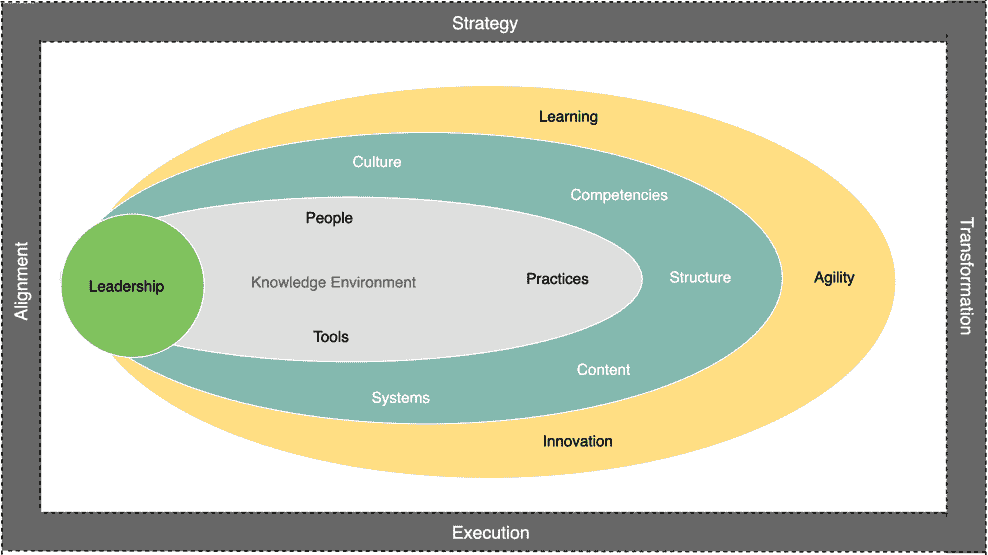
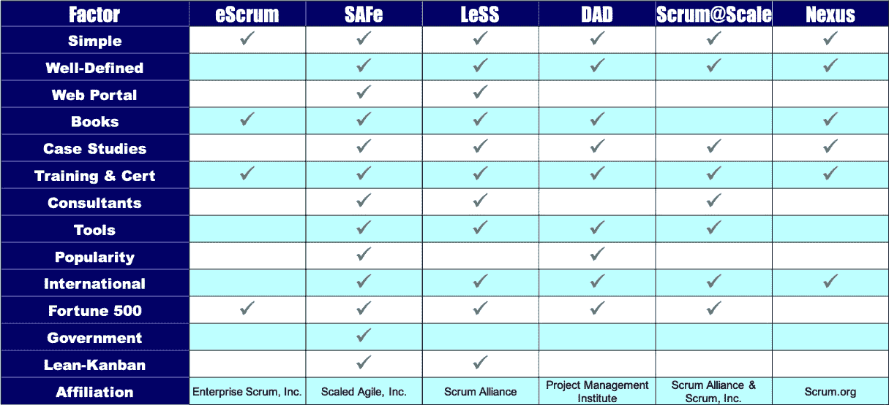

# *第一章*：介绍 Jira Align

本章介绍了 Jira Align。你将了解 Jira Align 的过去和现在，以及将其推向市场的公司。本章还将介绍哪些类型的组织最能从实施 Jira Align 中受益，以及成功的关键因素。最后，你将了解 Jira Align 如何支持组织使用扩展敏捷框架。

我们将涵盖以下主题：

+   连接 Jira Align

+   Jira Align 的理想候选人

+   组建 Jira Align 核心团队

+   选择框架

+   与 Atlassian 解决方案合作伙伴合作

# 连接 Jira Align

Jira Align 是一款正当其时的产品。它的故事始于 1990 年代为开发团队创建的敏捷框架，旨在让团队能够早期且频繁地交付优质产品。当这些框架的领导者们在 2001 年齐聚犹他州 Snowbird 制定敏捷宣言时，团队层级的执行仍然是焦点。但自那时以来，世界变得更加复杂，各行各业，如银行、汽车和政府，纷纷拥抱数字化转型。随着组织在构建越来越大、越来越复杂的系统，甚至是系统的系统（如航空航天和军事应用）时面临困境，协调多个敏捷团队交付的需求变得更加迫切。

2007 年，企业家兼技术高管 Steve Elliott 与一位才华横溢的工程师合作，回应这一挑战，创建了后来成为 AgileCraft 并最终发展为 Jira Align 的工具——一种打破产品管理、项目管理和工程之间壁垒的方式，用以协调和交付复杂的产品开发工作。在该工具逐渐成型的同时，一种新的敏捷框架正在崛起，这种框架利用成功的敏捷团队交付的力量，将其向上扩展到团队内的团队，最终扩展到整个企业，并向外延伸到那些传统上与敏捷无关的组织部分。

自 2011 年 SAFe 发布以来，AgileCraft 与**Scaled Agile Framework**（**SAFe**）一直保持着紧密的合作关系，SAFe 是大规模敏捷的领先框架。在担任技术高管期间，Steve 经过 7 年的严格实地测试后，于 2013 年辞去工作，创办了 AgileCraft，帮助公司实现*以初创公司速度实现企业敏捷*。到 2015 年，AgileCraft 被评为 Scaled Agile 金牌合作伙伴，并被 Gartner 评为酷公司。

2016 年，Team AgileCraft 获得了其首个财富 10 强客户 AT&T，AT&T 在 2017 年将其作为公司标准采用，之前已经使用该平台交付了移动电视产品。2018 年，Gartner 将 AgileCraft 列为**企业敏捷规划**（**EAP**）工具领域的*远见者*。2019 年，Gartner 将其评为*领导者*，并且 Atlassian 收购了 AgileCraft。今天，Jira Align 仍然是领导者，甚至可以说是*唯一的*领导者。此外，该产品不断改进，每两周发布新功能和增强功能。

# Jira Align 的理想候选人

Jira Align 并不适合每个组织。它在广度和深度上都是庞大的，从零开始构建，作为一个以敏捷为首的平台，而不是像一些竞争对手那样将瀑布式**项目组合管理**（**PPM**）解决方案转变为 EAP 工具。就像 SAFe 在团队级敏捷交付的基础上扩展到项目、解决方案、组合和企业级别一样，Jira Align 也与顶级团队级敏捷工具 Jira Software 协同工作，将其扩展到所有规模级别。它原生支持多种框架和方法，超越 SAFe，包括**有纪律的敏捷交付**（**DAD**）、**大规模 Scrum**（**LeSS**）、**Scrum@Scale**、Spotify、**精益创业**、自定义框架以及这些的任何组合。因此，它更适用于那些已经具备或寻求更正式敏捷规模化方法的大型组织。

成功实施 Jira Align 的理想候选人需要满足以下七个条件：

1.  **500+名开发人员使用 Jira Software**：从功能上讲，Jira Align 可以支持组织内所有层级的数百到数千名用户。使用 Jira Software 的开发人员数量通常是评估一个组织是否适合使用 Jira Align 的良好指标。如果你的组织有 500 名或更多的开发人员使用 Jira Software，那么 Jira Align 可能值得投资。对于少于 500 名开发人员的团队，单独使用 Jira Software 或与 Atlassian Marketplace 应用结合使用可能就足够了。

1.  **遵循敏捷规模化框架**：在选择支持敏捷规模化的工具时，有两个经验法则适用。第一个是你不能扩展无法扩展的事物。第二个是任何工具的效用仅取决于它所展示和支持的底层数据、组织结构和敏捷实践。因此，拥有一套正式的敏捷规模化实践往往是成功实现 Jira Align 的先行指标。更多信息请参见后面的*选择框架*部分。

1.  **已执行过两次或更多季度规划活动**：季度规划和执行，专注于产品待办事项中排名最高的功能，已成为从事敏捷交付的公司中的标准做法。程序板是 Jira Align 中支持这一实践的关键功能之一。但在应用工具之前，最好先拥有实际的方法论经验，尤其是像 Jira Align 这样功能丰富的工具，初学者可能会觉得有些不知所措。因此，最好在引入 Jira Align 之前，至少有两个季度的规划经验。

1.  **已建立至少 6 个月的团队敏捷实践**：团队层面的成功敏捷交付是使用框架和工具进行扩展的前提。就像你不会扩展存在缺陷的代码一样，也不希望扩展次优的产品交付方法。衡量团队有效性的一种好方法是回顾《敏捷宣言》中的 12 条原则。如果你的团队通常能够做到其中 7 到 8 条，例如通过早期和持续交付有价值的产品功能来满足客户需求（原则 1），那么他们已经实现了高度的敏捷性。你的组织可以在此基础上进行扩展，达到以下目标：

    +   交付更大、更复杂的计划

    +   将敏捷方法扩展到公司更多领域

    +   将执行与战略连接

        一切从你的敏捷团队开始，因此要为他们提供所需的培训和经验。随后，Jira Align 将帮助你将他们熟练的战术执行与公司战略连接起来。

1.  **每个项目有 5-12 个团队**：无论你称其为项目、**敏捷发布列车**（**ART**）、部落，还是其他名称，团队协作结构已被证明能够更快、更高质量地将产品交付市场。在构建这些团队组时，有两个重要的考虑因素。

    第一点是每个团队组应能够独立交付产品功能，并按节奏（通常是季度）进行，且对其他团队的依赖最小。第二点是每个团队应由 50-125 人（5-12 个敏捷团队）组成，这是由于人类学家 Robin Dunbar 在 1990 年代观察到较大群体在凝聚力方面的固有限制。

1.  **高层领导支持大规模敏捷转型**：大规模敏捷以及支持它的工具需要高层管理的支持。这不仅仅是资金问题，更是一个拥抱并领导变革的问题。这要求具备开放性和承诺，去转变内部文化。根据《第 13 届年度敏捷状态调查》，成功转型的三大障碍与文化相关：

    +   组织文化与敏捷价值观相冲突

    +   组织对变革的普遍抵抗

    +   管理支持和赞助不足

        这三项在 2020 年 5 月发布的第 14 届年度《敏捷状态调查》中依然位列前五名。此外，这份报告中还新增了一个障碍进入了前五名：*领导参与不足*。这表明领导者接受敏捷思维方式的重要性，首先是自己学习，然后是*言行一致*——倡导原则，展示实践，指导他人。从一些展示性项目开始，取得短期胜利，然后巩固成果并取得更多胜利。《领导变革》的作者约翰·科特（John Kotter）已经证明，这是将新方法固守在文化中的方式。当团队体验到胜利时，他们的能量会发生转变。从单纯的*做*敏捷转向*成为*敏捷。

1.  **卓越中心（CoE）或用于敏捷实践的管理机构，且有资金支持**：卓越中心是一个专门负责实施和支持敏捷转型的团队。它是区分仅名义上是敏捷与那些真正取得最佳成果的公司的关键因素。卓越中心的职能包括培训员工新方法，寻找专业角色，如**产品负责人**（**PO**）和**Scrum Master**（**SM**），以及至关重要的教练实践。

    连续三年，2017–2019 年，参与年度《敏捷状态报告》调查的受访者将内部敏捷教练视为规模化敏捷成功的最佳建议。这是有道理的，因为它减少了对外部咨询公司的依赖，创造了可持续的敏捷能力。即使在敏捷之外，专业教练在许多《财富》1000 强公司中也逐渐兴起。**国际教练联合会**（**ICF**）的最新研究发现，典型公司预计能够获得初始教练投资的 7 倍回报。然而，值得注意的是，从事教练工作的人员在专业领域上差异很大。我们所见过的最佳敏捷教练，除了持有敏捷特定认证外，还获得了 ICF 认证。

一个组织在满足这七个参数的程度上越好，所取得的结果就会越好。这些是敏捷 Craft 以及 Jira Align 多年来取得成功的关键因素。但再次强调，工具的效果取决于它所支持的基础数据、组织结构和敏捷实践。

在团队层面取得成功是一回事，但如果你要在整个组织中推广，你需要标准化产品交付的方法和工具，以便实现以下目标：

+   多个团队能够无缝协作，交付大型复杂的解决方案。

+   组织的各个部分使用相同的语言并朝着共同的战略目标努力。

+   分散的战术信息可以与最高层次的公司战略和目标保持一致。

因此，在实施 Jira Align 之前，把基础工作做好非常重要。但别担心，我们将引导你避开陷阱和挑战，提供在众多 Jira Align 实施中积累的技巧和经验，帮助确保你的成功。无论你是一个高速增长的科技初创公司、传统的电信公司，还是政府机构，我们都会展示 Jira Align 如何为你带来价值。

# 组建 Jira Align 核心团队

《*变革领导*》的作者约翰·科特尔的研究表明，任何转型工作中，指导性联盟的作用至关重要。首要任务是组建一个 Jira Align 实施的指导团队，团队成员包括以下角色：

+   实施负责人

+   敏捷实践负责人或代表

+   产品管理

+   项目管理

+   Jira Align 管理员

+   Jira 管理员

这些人是*身临其境*的个体，愿意拥抱变化并以身作则。Jira Align 的实施方法是从一些展示性项目开始，创造短期胜利，然后巩固成果并取得更多胜利。正如科特尔所展示的那样，这种方式是将新方法植根于文化中的途径。这种技术在团队和团队的团队中效果良好，但真正的企业转型需要更有纪律性和整体性的方法。在这个层面上，你选择的扩展框架将帮助你实现一个由 Jira Align 支持的互联知识环境。

# 选择框架

在成功的企业转型中，组织各个层级都朝着共同的理解努力，了解如何协调人员、实践和工具，以实现高效且有效的交付。在最佳情况下，你的实践和工具将协调一致，创造出使组织能够扩展并在市场中保持竞争力的能力。这种环境结合积极参与的领导力，创造了一个专注于持续学习、商业敏捷性和创新的知识环境。

知识环境不是一种状态，而是一个不断发展的旅程。任何组织都可以从现有状态出发。以下插图展示了一个组织如何通过将战略与执行连接来对齐，实现转型：

图 1.1 – 通过将战略与执行连接实现转型的对齐

之前，我们提到了领导力在任何转型工作中的重要性。在这里，我们看到，当各级领导共同努力，将人员、实践和工具在互联的知识环境中对齐时，他们能够在文化、能力、结构、内容和系统等方面产生积极的连锁反应，推动持续学习、商业敏捷性和创新——这就是转型的成果。这个过程可能不容易，但那些走在前面的人告诉我们，你将在途中遇到三个关键节点。

从*敏捷宣言*的共同作者、*敏捷软件开发*的作者 Alistair Cockburn 博士开始，采用框架来获得敏捷思维的实践，已被比作武术中发展专业技能的阶段：Shu-Ha-Ri。

+   在 Shu 阶段，你通过遵循老师设定的指导方针，学习并熟练掌握这些形式。

+   在 Ha 阶段，你已经掌握了使用这些形式的熟练度，并且可以在必要时安全地灵活运用其中一些形式。

+   Ri 是那些打破传统并在 Shu 和 Ha 阶段练习多年后，创造自己形式的大师阶段。

另一个用于理解你在敏捷旅程中所处阶段的流行三阶段模型是*爬行-走路-跑步*。

在任何模型中，评估你所在的位置，并了解成功在于旅程本身，而非最终的目的地。

规模化框架是你敏捷旅程中的一个重要伙伴。你很可能会选择一个框架，因为它是经过验证的方法，背后有许多案例研究。因此，要抵制从一开始就修改框架的冲动。这就像学徒试图跳过 Shu 阶段，直接创造自己的形式，结果很可能不理想。同样，要避免认为你的组织是独一无二的。寻找与你行业相似的案例研究，看看同行取得了哪些成果，并坚持使用该方法来取得你自己的卓越成果。

敏捷团队通常实践 Scrum、Kanban，或两者的结合。根据《第 14 届年度敏捷状态报告》，Scrum 是全球大多数团队实践的主要敏捷方法，其次是混合方法、Scrumban 和 Kanban。Scrum 是一种轻量级的敏捷框架，适用于由 5 至 9 人组成的团队，这些团队通过协作管理复杂的知识工作，迭代和增量地交付最高价值的产品。

运营着数百个团队的组织发现，单靠 Scrum 不足以在规模化中交付最佳结果，并且在跨团队的对齐、依赖关系、风险和协作方面存在困难。在 2000 年代和 2010 年代，规模化框架应运而生，以满足这些需求。根据《第 14 届年度敏捷状态报告》，SAFe 是最常采用且连续多年排名领先的框架。

SAFe 是一个完整的知识库，包含经过验证的集成原则和能力，并提供了实施 Lean、敏捷和 DevOps 实践的护栏，适用于大规模应用。然而，还有其他几个值得考虑的框架。创建一个如以下所示的评分卡或矩阵，列出对你的组织最有意义的参数，可以帮助决策：

图 1.2 – 规模化框架比较，改编自 Rico, D. F.（2014 年）

如果你还没有选择框架，Jira Align 核心团队的联合领导可以通过敏捷卓越中心（Agile CoE）来引导你，推荐一个适合你行业和文化的框架。实践框架将涉及到辅导和培训团队的关键工作，以建立一致的操作理解，并在整个组织中对齐团队之间的语言。你的下一步将是聘请 Atlassian 解决方案合作伙伴来帮助你实施 Jira Align。与 Jira Software 不同，后者可以通过信用卡购买并自行实施，你在实施 Jira Align 时不会孤单。

# 与 Atlassian 解决方案合作伙伴合作

如果你以前没有与解决方案合作伙伴合作过，Atlassian 可以帮助你找到一个。只需访问[www.atlassian.com/partners](http://www.atlassian.com/partners)。合作伙伴将通过工作坊引导你，发现什么对你的业务最重要，以及 Jira Align 如何支持你的目标。有了这个理解，合作伙伴可以确保平台的配置支持你的最高业务目标，帮助你实现最佳结果。Atlassian 希望你能成功，因此他们要求通过合作伙伴来合作。例如，平台中有 769 个不同的配置开关，所以你会希望利用合作伙伴的经验和专业知识来帮助你成功。在下一章中，我们将介绍实施 Jira Align 的基础知识，从快速设置开始。这将为你与解决方案合作伙伴合作提供基础知识，并帮助你启动合作伙伴作为实施的一部分提供的角色培训。

# 总结

在这一章中，我们介绍了 Jira Align 和创造它的公司。我们讨论了理想的 Jira Align 候选人包括的七个成功因素。我们讲解了组建 Jira Align 核心团队和选择并遵循框架的重要性。最后，我们介绍了与 Atlassian 解决方案合作伙伴合作实施 Jira Align 的必要性。

现在你已经了解了 Jira Align 的目的，以及谁能从中受益最多。你掌握了成功实施的七个关键参数，并且明白了核心团队、扩展框架和解决方案合作伙伴的重要性。

在下一章中，我们将基于已有的知识，深入探讨实施 Jira Align 的基础知识。

# 问题

1.  什么样的环境促成了现在被称为 Jira Align 的敏捷平台的出现？

1.  哪个扩展框架与 Jira Align 有长期合作关系？

1.  一个项目或*团队中的团队*可以包含多少个敏捷团队？

1.  领导力在 Jira Align 实施中扮演什么角色？

1.  为什么拥有 Jira Align 核心团队很重要？

# 进一步阅读

+   *企业敏捷* 由 Sunil Mundra（Packt，2018 年）

+   *精炼的敏捷技术实践* 由 Pedro M. Santos（Packt，2019 年）
