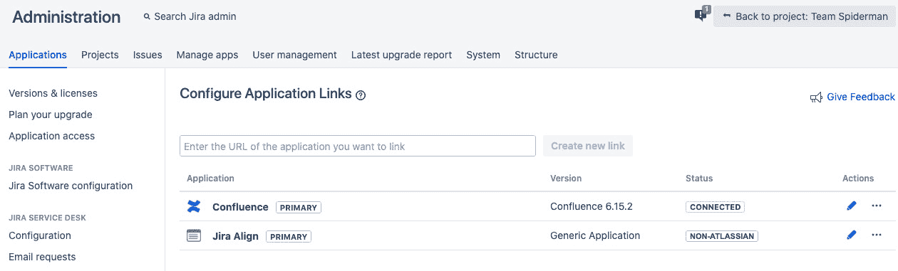
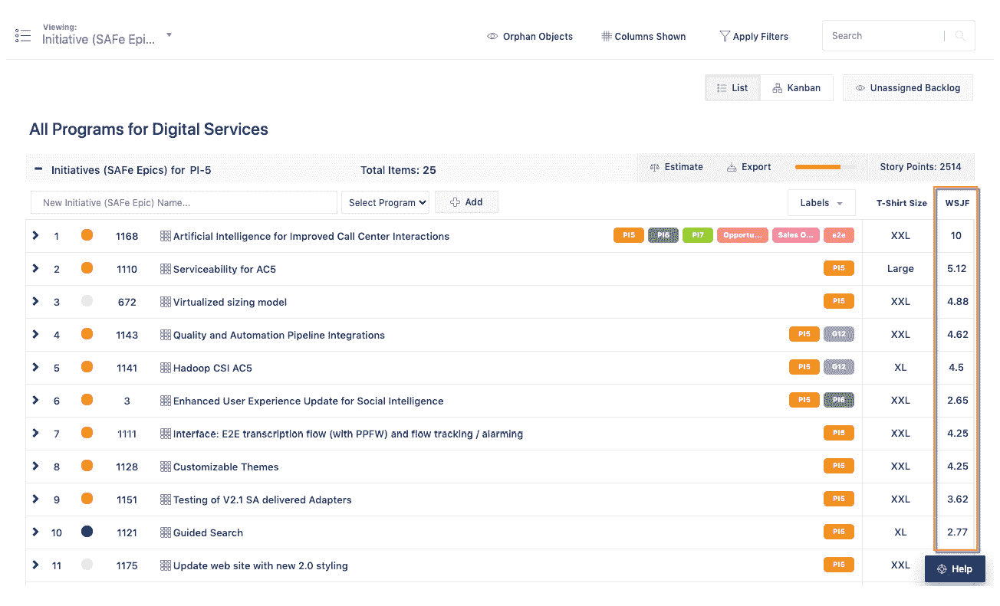

# 第三章：*第二章*：实施 Jira Align

在本章中，我们将介绍实施 Jira Align 的基础知识，以映射关键对象和属性。您将学习如何分析 Jira Software 中的现有项目以及如何将实际工作转化为 Jira Align。本章还将进一步阐述 Jira Align 和 Jira Software 工具集中支持的人员、工作、时间和结果的维度。最后，您将了解从项目到投资组合的扩展方法，并将战略与执行连接起来。

在本章中，我们将涵盖以下主题：

+   分析 Jira 中现有的项目

+   映射人员、工作、时间和结果

+   设置 Jira Align

+   连接到 Jira

+   扩展到投资组合

# 分析 Jira 中现有的项目

Jira Align 成功的关键因素之一是来自 Jira Software 的基础数据质量。作为工具解决方案集成的一部分，您需要分析 Jira 中的团队级数据，以确定它是否具有可扩展性和可连接性。如果不是，您需要在与 Jira Align 集成之前，标准化并优化这些数据。

现在我们将执行以下步骤，开始检查您的数据健康状况：

1.  从 Atlassian Marketplace 下载 Jet by Jira Align 应用程序，如下所示，适用于 Jira Cloud、Server 和 Data Center 托管选项。请要求您的 Jira 管理员将该应用程序安装到您的 Jira 实例中：

    图 2.1 – Jet by Jira Align，Atlassian Marketplace

    Jet by Jira Align 是一款原生 Jira 应用程序，旨在分析您团队数据和实践在 Jira 中的基础健康状况。该应用程序运行七个优先级的健康检查，并通过突出显示需要采取行动的区域，提供详细的见解以修复或改善数据。通过的健康检查越多，与 Jira Align 的集成将越顺畅。

1.  通过 **Jira 管理** | **管理应用** | **Jira Align** | **Jet** 访问 Jira 向导。您将看到以下逐步向导的启动画面：

    图 2.2 – Jet by Jira Align，逐步向导

1.  一旦开始，您最多可以选择 20 个看板进行分析。一个看板通常代表一个敏捷团队。您可以选择属于同一团队或项目组的多个看板。

    提示和技巧

    一个 Scrum 团队将根据与 Jira 看板相关联的一个 sprint 进行工作，且在 sprint 中计划的所有 Jira 问题只会属于一个团队。重要的是，只有一个团队可以基于 Jira 看板进行工作。这一原则同样适用于看板团队的看板。

    在选择多个看板进行分析时，最好选择来自同一个项目或共享相同字段和问题类型配置的看板。选择来自不同项目的看板可能会导致字段映射差异，从而影响结果。

    对于 Jira Cloud，下一代看板不被官方支持。这是由于下一代看板中的字段结构独特。你仍然可以通过选择逐个运行每个看板来分析下一代项目看板。

    以下是看板选择屏幕的显示方式：

    

    图 2.3 – Jet by Jira Align，第 2 步 – 选择你的团队看板

1.  接下来，你将映射 Jira 字段和问题类型，比较 Jira 数据结构与七个健康检查，并分析看板的健康状况：

    图 2.4 – Jet by Jira Align，第 3 步 – 映射你的配置

    如果点击 **高级设置** 链接，将打开 **高级设置** 窗口，如下所示：

    

    图 2.5 – Jet by Jira Align，第 3 步 – 高级设置

1.  分析你的看板并检查通过的健康检查进度。当看板分析完成后，你可以查看 **健康报告**。对于显示 **需要改进** 的检查，按照推荐的操作改进数据，并重新运行健康检查：

图 2.6 – Jet by Jira Align，第 4 步 – 健康报告分析

现在让我们讨论七个健康检查，包括它们的严重性（1 到 5 级，5 为最严重），以及当显示 **需要改进** 时的推荐操作。

**健康检查 #1：故事应该链接到史诗。**

**严重性：3**

与父 Jira 史诗相关联的故事表示团队级别的工作如何与战略工作连接。所有团队级别的工作应可追踪并可以报告至可衡量的目标。此检查确保 Jira 中的战术执行能够与 Jira Align 中的战略对接。

你可以通过将孤立的故事链接到父 Jira 史诗来简单解决此问题。

**健康检查 #2：故事应该有估算的故事点数。**

**严重性：2**

推荐使用故事点来估算故事，以便在燃尽图中提供进度可视化，并基于历史速度（每个 Sprint 的点数）改善规划。确保所有故事都有估算，将提高基于实际速度的交付可预测性。

你可以通过为未估算的故事添加点估算来改进它。

**健康检查 #3：史诗应该有分配的修复版本。**

**严重性：3**

为 Jira 史诗分配修复版本定义了该功能将在其中发布的版本。版本与 Jira 中的项目绑定，在该项目中包含 Jira 史诗。修复版本等同于 Jira Align 中的发布车辆。

你可以通过为所有计划中的 Jira 史诗分配修复版本来解决此问题。

**健康检查 #4：每个 Jira 看板只能分配一个项目。**

**严重性：5**

Jira 中的敏捷看板应该代表一个团队。将多个项目链接到同一个看板可能会使得衡量团队级别的进展变得困难。例如，你可能会遇到多个团队的 Sprint 日期重叠的问题。

你可以通过确保每个看板只链接一个项目来解决此问题，方法是进入**Board Settings**，选择**Edit Filter Shares**，并删除除一个项目外的所有项目。如果你的看板没有关联任何项目，也可能会导致此检查失败。

**健康检查#5：将自定义字段设置为可选，而非必填。**

**关键性：5**

自定义字段配置可能会影响你与 Jira Align 的集成能力。任何设置为必填的 Jira 自定义字段将无法在 Jira 和 Jira Align 之间同步。

你可以通过将 Jira 问题的自定义字段设置为可选来解决此问题。

**健康检查#6：单个 Sprint 只能与一个看板关联。**

**关键性：5**

因为一个看板应该只代表一个团队，如果你的 Sprint 分布在多个看板上，那么衡量团队级别的进展将变得非常困难。

类似于健康检查#4，按照指示操作，确保每个看板上只有一个项目。如果你的团队结构使得你无法编辑**Filter Shares**，请选择**Edit Filter Query**，确保只有一个团队的 Sprint 与 Jira 看板关联。

**健康检查#7：Jira 看板上的 Sprint 不应有重叠日期。**

**关键性：5**

Sprint 代表一个（通常为 2 周的）计划和执行时间段，适用于单个团队。一次只能有一个 Sprint 处于活动状态。

你可以通过确保 Sprint 的开始和结束日期不重叠，并且一次只有一个活动的 Sprint 来改善这一点。

提示和技巧

健康检查#1、#2 和#3 对于扩展非常有帮助；但是它们不会阻止你继续推进 Jira Align 的使用。

健康检查#4、#5、#6 和#7 在连接 Jira 之前非常重要，必须确保这些设置正确。受影响的数据将影响工作在 Jira Align 中的可视化和同步方式。

健康检查#6 和#7 不适用于 Kanban 团队看板。然而，Kanban 团队应达成一致，按照与 Sprint 和 PI 对齐的共同节奏工作。

为了将可预测性和预测洞察力带入 Jira Align，定义一个数据集，仅导入在上个季度内完成、当前进行中的以及未来计划的工作。

我们通过分析现有的 Jira 项目，已经识别出了哪些数据需要改进。现在，让我们来设定边界，并映射人员、工作、时间和结果。

# 映射人员、工作、时间和结果

Jira Align 提供了一种全面的视图，展示了人们在一段时间内如何参与工作，以实现预期的结果。这四个维度是规划和对齐的关键，并在业务敏捷性中起着重要作用。尽管团队继续在最优的 Jira 软件中工作，Jira Align 将团队级别的执行与顶层战略连接起来。

有多种方式可以在 Jira 中组织团队级别的工作。请记住，Jira 中的一个 *项目* 代表了一个工作项的容器，因此类似于积压工作。还需要注意的是，Jira 数据库中没有 *团队* 实体。因此，Jira Align 将根据 Jira 项目/看板的组合来推导团队。以下是将 Jira 中的项目/看板映射到 Jira Align 中的团队的两种主要选项：

+   每个团队有一个 Jira 项目，每个团队有一个看板，每个看板有一个活动冲刺。此选项需要在 Jira 中创建自定义团队字段来驱动每个看板。我们建议在使用此选项时，将 Jira 史诗包含在同一个项目中。

+   每个团队有一个 Jira 项目，每个团队有一个看板，每个看板有一个活动冲刺。对于此选项，您需要额外的 Jira 项目来包含 Jira 史诗。

您应该选择哪个选项？每个团队的团队使用一个项目，或者每个团队使用一个项目都是可以接受的。现在，让我们来看看如何使用每个团队的团队一个项目：

图 2.7 – 一个团队的团队项目结构

每个团队的团队使用一个项目需要在 Jira 中使用自定义字段来区分团队看板。Jira 问题不存储看板 ID，应使用单一的团队选择字段来标识每个故事的团队分配。团队字段设置看板筛选器，防止多个团队看板共享一个 Jira 项目中的冲刺。团队可以创建额外的看板和工作流来进行可视化，但这些不会映射到 Jira Align。最好为连接到 Jira Align 的团队看板制定命名规则。较大的组织通常选择每个团队的团队使用一个项目，以减少 Jira 中的项目数量。例如，如果有 20 个投资组合，每个投资组合下有 10 个项目，每个项目下有 10 个团队，那将是 2,000 个 Jira 项目。

公司越小，选择每个团队一个项目的最佳实践就越合适——这种做法更简单，并且不需要自定义团队字段。根据需要，组织也可以使用多种方法的组合。以下是一个程序项目与多个团队项目的结构：

图 2.8 – 多个团队项目结构

请注意，使用此选项时，程序项目应仅包含 Jira 史诗，这些史诗将与 Jira Align 功能同步。

提示和技巧

确保每个团队的敏捷看板上只有一个活动冲刺（团队可以计划未来的冲刺，但不激活它们）。

避免冲刺日期重叠，并保持团队之间的统一冲刺节奏，这是大规模敏捷的最佳实践。

建议每个故事由一个团队在一个冲刺内完成。如果一个故事需要共享，那么就为每个团队克隆该故事。

如果 sprint 结束时有未完成的故事，请在完成 sprint 之前将它们拆分或移动到待办事项中。

对于有多个团队敏捷看板的 Jira 项目，避免跨看板共享 sprint，因为这样会导致看板之间的冲突。

避免在待办事项中创建假 sprint，作为额外的持有 sprint 或 backlog。Jira Align 会认为这些是实际的计划未来的 sprint。

现在我们已经在 Jira 中为团队级工作项创建了容器，我们回到这个概念：人员在时间内执行工作以实现成果。团队级工作在 Jira 中执行，而 Jira Align 位于 Jira 之上，将执行与战略连接起来。团队通过 Jira 本地问题以及 Jira 史诗、故事和子任务的层次结构来追踪工作。Jira 史诗代表程序级的功能，团队在程序增量或业务季度内交付该功能。Jira 史诗被拆分成故事，再进一步拆分成子任务，在单个 sprint 内交付。

在组合级别，你追踪高层次的工作项，如*主题*和*组合史诗*，这些工作项与程序级工作项、Jira 史诗或*功能*相关联。开发复杂系统的组织通常需要在组合史诗和功能之间增加一个额外的工作层级，称为*能力*。引入这一额外层级时要谨慎，因为它增加了额外的复杂性，需要更多资源和措施来管理、维护和在能力层级进行报告。

在每个层级上，工作项有助于可衡量的成果，向上传递到父级工作项，最终与企业战略对接，如下图所示。值得注意的是，你的工具集应在每个层级上支持这些实践：

图 2.9 – 与人、工作、时间和成果相关的工具

关键的是，组织需要就如何将工具与人、工作、时间和成果对齐达成共识，以成功设置 Jira Align。对齐的一个关键方面是达成对术语的统一理解。无论你的组织是否采用 SAFe，我们建议在定义维度时参考 SAFe 术语表：[`www.scaledagileframework.com/glossary/`](https://www.scaledagileframework.com/glossary/)。

请注意，*图 2.9* 中所示的模型也引导你进入*第三章*，*导航 Jira Align*，你将在该章节中学习如何在各个层级加载、可视化和报告工作。

让我们开始通过快速的基础设置来配置 Jira Align，并应用我们迄今为止发现的内容。

# 设置 Jira Align

为了开始使用 Jira Align，我们将查看如何利用你在前两个阶段中发现的信息快速进行设置：分析 Jira 中的现有程序以及映射人员、工作、时间和成果。然后，我们将把新用户导入 Jira Align。

作为组织转型对齐的一部分，确保每个人都使用共同的语言非常重要。如*图 1.1*所示，*通过将战略与执行连接来实现转型对齐*，语言有助于组织通过改善从领导层到知识工作者以及反向的透明沟通来塑造组织文化。经验表明，将语言尽可能与行业通用术语或选择的框架保持一致非常重要。这不仅有助于内部能力的发展，还能在新知识工作者加入组织时通过有效沟通加快入职速度。

随着组织语言的成熟，他们开始发展一种简短的沟通方式，缩写有用的原则和实践。这通常会产生一种团结感和认同感。当每个人说相同的语言时，组织感更加紧密，关系也更加牢固，能够弥合差异。语言的一致性在组织内外产生积极的连锁反应，有助于建立信任、可靠性和信誉。总体而言，语言的对齐有助于减少误解并提高生产力。

Jira Align 旨在适应你组织的转型之旅。你可以在 Jira Align 中重命名工作对象、导航菜单、日期标签、发布属性、货币和财务术语，以使你的组织更紧密地匹配你选择的实践和团队工具。你可以配置 Jira Align 中的平台术语以匹配你的框架，例如**大规模 Scrum**（**LeSS**）、**可扩展敏捷框架**（**SAFe**）和**纪律化敏捷交付**（**DAD**）。例如，在 LeSS 中，一个*驱动因素*可以在 SAFe 中被称为*业务驱动因素*，在 DAD 中则是一个*目标*。同样，你可能希望将 Jira 的史诗称为*特性*，将你的冲刺称为*迭代*，等等。

你可以在**管理** | **设置** | **平台术语**下配置平台术语，在**管理** | **设置** | **用户记录术语**下配置用户记录术语。更新术语后，确保点击**更新术语**按钮以保存更改，并重新登录 Jira Align 使更新生效。以下是平台术语设置界面：

图 2.10 – Jira Align 平台术语设置

术语配置完成后，我们将开始在 Jira Align 中创建物理和虚拟组织属性的条目。物理属性包括企业的组织结构和运营区域。接下来，对于虚拟组织，我们将创建一个投资组合，并关联多个项目。

你将首先在**管理** | **设置** | **组织结构**下创建组织结构，点击**添加新建**按钮，呈现以下屏幕：

图 2.11 – Jira Align 组织结构设置

组织结构允许你表示你的组织业务单元及其相互关系。

接下来，我们将创建你的组织运营的物理区域。当你为 Jira Align 中与时间追踪功能相关的投资组合、项目、用户和发布创建内容时，这些信息会被使用。你可以在**管理** | **设置** | **区域**下点击**添加区域**按钮，打开以下屏幕：

图 2.12 – Jira Align 区域设置

我们现在将创建虚拟组织属性，首先从投资组合开始，前往**管理** | **设置** | **投资组合**，然后点击**添加投资组合**按钮。创建投资组合需要以下必填信息：

+   `变种人`。

+   `变种人投资组合`投资组合。

+   `变种人网络`。

+   `变种人投资组合领导团队`。

+   `欧洲`。

以下是这些设置的截图：

图 2.13 – Jira Align 投资组合设置

一旦完成所需的详细信息，点击**保存**。你现在可以在**成员**标签下添加单个投资组合领导团队成员。

接下来，我们将创建项目并将其链接到投资组合，方法是前往**管理** | **设置** | **项目**，然后点击**添加项目**按钮。创建项目需要以下必填信息：

+   `超级英雄`。

+   `变种人`。

+   `超级英雄项目领导团队`。

一旦完成所需的详细信息，点击**保存**。你现在可以在**成员**标签下添加单个项目领导团队成员。当你需要运行多个项目时，可以重复这些步骤，创建并将多个项目与投资组合关联。例如，我们已经创建并关联了**变形金刚**项目和**超级英雄**项目：

图 2.14 – Jira Align 项目设置

你可以在**管理** | **设置**菜单下创建和管理其他属性，如客户、成本中心、国家、城市和自定义层次结构，以进一步定义你在 Jira Align 中的视图和报告。

我们接下来将创建团队并将其与项目关联。团队将通过前往**团队** | **管理** | **团队**，然后点击**添加团队**按钮创建。创建团队需要以下必填信息：

+   **类型**：选择**敏捷团队**来创建 Scrum 团队，选择**看板团队**来创建看板团队。让我们为超级英雄项目创建一个敏捷团队。

+   `蝙蝠侠团队`。

+   **描述**：为你的团队添加描述。

+   **团队简称**：为你的团队冲刺添加一个五个字符的简称。

+   **冲刺前缀**：为你的团队冲刺添加团队前缀。

+   **项目**：选择你的团队所属的项目。

一旦你完成必填信息，点击**保存**。现在你可以在**详细信息**标签下添加团队照片，在**成员**标签下添加单个团队成员：

图 2.15 – Jira Align 团队设置

你将重复这些配置步骤来创建你的虚拟结构，然后使用**配置**栏导航虚拟组织：

图 2.16 – Jira Align 虚拟组织结构

最后，我们将在 Jira Align 中创建一个项目增量节奏，并设置相关的锚定冲刺，为连接到 Jira 做好准备。创建项目增量的方法是：进入**项目** | **管理** | **项目增量**，然后点击**添加项目增量**按钮。创建项目增量需要填写以下必填信息：

+   `变种人`产品组合。

+   **项目**：选择所有将共享项目增量节奏的项目，*超级英雄与变形金刚*。

+   `2020 Q4`。

+   `2020 Q4`。

+   `20Q4`。这将用于报告目的。

+   **开始日期**：为你的项目增量添加开始日期。

+   **结束日期**：为你的项目增量添加一个结束日期。

+   **描述**：为你的项目增量添加描述。

+   **状态**：选择一个状态来跟踪你的项目增量。可用的状态有**规划中**、**进行中**、**完成**和**归档**。

一旦你完成了必填信息，点击**保存**：

图 2.17 – Jira Align 项目增量设置

如果你的项目没有共享一个共同的项目增量，那么请重复之前的步骤，并确保在项目增量编号、名称和简称前添加前缀，以唯一标识其他项目增量节奏。

我们现在可以为项目增量创建锚定冲刺。为此，选择选定项目增量下的**同步冲刺**标签。你可以批量添加遵循相同冲刺节奏的锚定冲刺，或者你可以添加一个单一的锚定冲刺，代表你的**IP（创新与规划）**冲刺。

若要批量添加锚定冲刺，选择**批量添加**切换按钮并提供以下详细信息：

+   `Q4S`。

+   **开始日期**：添加第一个冲刺的开始日期。

+   `标准` `冲刺`。

+   `10` `周` `天`来选择一个 2 周的节奏。

+   **每日最大值**：选择每日最大工作分配小时数。

+   **每日缺陷**：选择每日预计的缺陷分配小时数。

+   **总锚点**：选择要生成的锚定迭代数量。选择 **5** 来创建五个锚定迭代。

接下来，点击**创建锚点**按钮：

图 2.18 – Jira Align 锚定迭代批量添加

要添加单个锚定迭代，请选择**单个添加**切换并提供以下细节：

+   `Q4S6 (12/14-01/01)`。

+   `Q4S6`。

+   **日期**：添加迭代开始日期和结束日期。

+   **类型**：选择锚定迭代类型 *IP (创新与规划) 迭代*。

+   **持续时间**：如果您尚未添加迭代完成日期，请选择迭代的持续时间。

+   **每日最大**：选择每日最大工作分配时间（小时）。

+   **每日缺陷**：选择预期的每日缺陷分配时间（小时）。

接下来，点击**创建迭代**按钮：

图 2.19 – Jira Align 锚定迭代单一添加

一旦所有锚定迭代创建完成，您现在可以使用**生成团队迭代**按钮批量生成团队迭代，如下所示：

图 2.20 – Jira Align 团队迭代生成

确认后，Jira Align 将为所选程序和程序增量中的所有团队生成关联的迭代。

您将重复这些步骤来生成您计划和执行工作所需的程序增量。程序增量现在将可供适用的程序选择，并将在**配置**栏中的**程序增量**筛选器中可供选择：

图 2.21 – Jira Align 程序增量配置栏

现在，我们可以通过转到**管理** | **访问控制** | **人员**并点击**添加用户**按钮，将新用户引入到 Jira Align 中。添加新用户需要以下强制细节：

+   **用户类型**：选择**内部**以创建功能齐全的基于角色的 Jira Align 用户。对于仅需要访问构思模块的用户，请选择**外部**。

+   **名字**：添加用户的名字。

+   **姓氏**：添加用户的姓氏。

+   **电子邮件**：添加用户的电子邮件地址。Jira Align 将所有用户函件发送到给定的电子邮件。

+   **标题**：为用户添加一个标题。

+   **角色**：从列表中选择一个角色。

+   **企业层级**：选择组织。

+   **地区**：选择地区。

+   **城市**：选择城市。

+   **成本中心**：选择适用的成本中心。

接下来，点击**保存**按钮以创建新用户。Jira Align 将通过电子邮件发送新用户设置邀请，以将用户引导到平台上：

图 2.22 – Jira Align 用户账户

小贴士和技巧

Jira Align 中的用户访问控制基于角色。系统提供了预定义的角色集合，可以使用或复制这些角色来创建新角色。角色通过应用程序不同级别的功能切换进行配置，例如团队、计划、解决方案和投资组合级别。

如果您想批量导入用户，可以转到**管理**|**访问控制**|**人员**|**更多操作**，然后点击**导入用户记录**。这将提供一个用户导入模板，帮助您完成批量导入。

为避免在**用户界面**（**UI**）中更新用户记录，您可以通过转到**管理**|**访问控制**|**人员**|**更多操作**，点击**导出**，然后编辑并重新导入文件到 Jira Align。

Jira Align 支持**单点登录**（**SSO**），可以通过转到**管理**|**设置**|**平台**|**安全性**标签并提供以下详细信息来进行配置：

+   **启用 SSO**：将选项设置为**是**。此选项将在**禁用手动登录**设置为**是**时显示（见下一个项目）。

+   **禁用手动登录**：默认值为**否**。将选项设置为**是**将禁用手动登录，同时禁用安全设置、重新发送密码选项、登录页面和新用户设置邮件。

+   **SAML 2.0 身份提供商**：点击**添加 SAML 提供商**按钮，然后复制并粘贴 SAML 2.0（安全声明标记语言）XML（可扩展标记语言）元数据。在**NameID 查找方式**中，选择**电子邮件**或**外部 ID**字段进行用户身份验证。用户的外部 ID 可以在**编辑用户**页面上设置，并通过外部连接器同步。

+   **登录 URL**：仅当禁用手动登录选项时，此选项才可用。设置当用户尝试访问 Jira Align 时要定向的 URL。

+   **登出 URL**：设置用户点击**登出**时要重定向到的 URL。

除上述详细信息外，一旦连接到 Jira，将会有与 Jira 集成的用户可以访问 Jira Align。现在，让我们将 Jira Align 连接到 Jira，并开始将对象和字段映射到 Jira。

# 连接到 Jira

在 Jira Align 中，您将创建和管理投资组合和计划积压，而敏捷团队继续在 Jira 软件中工作，几乎不会受到干扰。Jira Align 连接到一个或多个 Jira 实例，且连接器支持三种 Jira 托管平台：Atlassian Cloud、Server 和 Data Center。Jira Align 是一个以 SaaS 为主的解决方案，具有企业级托管功能。对于需要更多数据安全性和隐私控制的组织，Jira Align 提供本地部署解决方案。下图展示了 Jira Align 平台如何连接到一个或多个 Jira 平台：

图 2.23 – Jira 连接器托管平台

提示与技巧

Jira Align 本地部署与 Jira Align SaaS 具有相同的代码库，并支持与 Atlassian Cloud Jira Software 的集成。如果您选择将 Jira Align 部署在本地，您很可能会与 Jira Software Data Center 集成，如*图 2.23*所示。

要与 Jira Software 进行物理连接，需要通过 Jira 连接器在 Jira 和 Jira Align 之间建立一个永久的应用链接。要建立连接，您需要一个具有访问 Jira 数据权限的 Jira 服务帐户。

首先，您需要通过 `Jira Align` 创建并配置一个应用链接，应用类型为 `通用应用`：

图 2.24 – Jira 应用链接

现在切换到 Jira Align，进入**管理** | **Jira 设置**，点击**Jira 连接器**按钮。添加一个连接器，然后在点击**激活**按钮之前，完成以下连接详细信息。这将提示您输入 Jira 服务用户的登录详情，以便 Jira 连接器通过 API 访问 Jira：

图 2.25 – Jira Align，管理 Jira 连接器

以下是集成的技术前提：

**Jira 实例可访问性**：Jira 实例应该通过互联网或**虚拟专用网络**（**VPN**）对 Jira Align 可访问。

**Jira 实例与安全访问**：Jira 实例应具有一个公众信任的**SSL**（**安全套接字层**）证书，以确保**HTTPS**（**安全超文本传输协议**）访问。

**Jira 用户访问**：您需要为专用的 Jira 服务用户提供以下项目权限：创建问题、编辑问题、分配问题、管理冲刺、浏览和管理报告人。

Jira 连接器需要访问 Jira API，该 API 应该暴露在防火墙外，以便 Jira Align 应用程序访问。如果您的 Jira 托管在 Atlassian Cloud 上，那么连接 Jira API 相对简单。如果您的 Jira 部署在本地，那么 Jira 很可能位于防火墙后面，启用对 Jira API 的外部访问并进行集成将成为一个需要解决的挑战。下图展示了 Jira API 应该如何暴露并使 Jira Align 中的 Jira 连接器可以访问：

图 2.26 – Jira 连接器 API 访问与连接性

配置 Jira 后，您可以通过以下三种方式之一或组合来实现：

+   打开防火墙端口/白名单

+   反向代理和/或 API 网关

+   本地代理

由于组织的网络政策、复杂的基础设施和安全要求，您可能需要涉及多个技术角色，包括边缘网络安全、系统管理员、Jira 管理员、网络管理员和 IT 高层管理人员，以成功启用并允许 Jira API 访问 Jira 连接器。这些是 Jira 连接器所需的四个基于 API 的 URL：

+   `/rest/auth/`

+   `/rest/api/2/`

+   `/rest/agile/1.0/`

+   `/rest/greenhopper/1.0/`

每个 URL 所需的动词如下：

+   `GET /rest/**`

+   `POST /rest/**`

+   `DELETE /rest/**`

+   `PUT /rest/**`

这里，/rest/**应该替换为之前列出的端点，例如/rest/auth。

一旦连接建立，我们将开始连接 Jira 工件。以下图像基于 10X: Jira 集成指南文档，详细说明了 Jira 和 Jira Align 工件是如何通过 Jira API 连接器进行映射和同步的：

图 2.27 - Jira Align Jira 集成映射，改编自 10X: Jira 集成指南

您可以通过访问用户菜单，选择**帮助** | **快捷链接** | **指南**，然后点击**10X: Jira 集成指南**来访问 Jira 集成指南。

提示和技巧

理解 Jira Align 与 Jira Software 项目、看板、工作项类型和字段之间的核心数据映射非常重要。

Atlassian 提供 Jira 集成数据收集模板，以便在初步需求收集过程中促进数据映射。您可以通过访问用户菜单，选择**帮助** | **知识库** | **集成** | **10X: Jira 集成指南**，然后点击**10X: Jira 集成数据收集**来下载模板。

除了之前讨论的字段映射外，还有一些推荐的可选 Jira Align 字段映射，适用于 Jira 的史诗与 Jira Align 的功能。您可以在**管理** | **连接器** | **Jira 设置** | **Jira 配置**标签下进行配置，并查找**自定义字段**部分。接下来，您需要以以下格式输入自定义字段 ID：**customfield_100xx**，其中*100xx*是 Jira Software 中的 ID。请记住，这些将要求您在 Jira Software 中创建自定义字段，如下所示：

+   **MMF**（**最小可市场化功能**）：一个**是/否**字段，双向同步，用于指示功能是否表示最小可市场化功能

+   **功能产品**：一个单选下拉字段，双向同步，显示与功能相关联的产品

+   **为什么？详细信息**：一个多行文本字段，单向同步（Jira Align 到 Jira），显示工作项为何在待办事项中，以及它如何与战略目标连接

+   **特性父项**：一个单选下拉字段，单向同步（Jira Align 到 Jira），用于显示特性的父工作项（能力或投资组合史诗）

+   **计划增量**：一个单选下拉字段，单向同步（Jira Align 到 Jira），用于显示特性交付的计划增量或业务季度

    小贴士和技巧

    **Jira Align Why? 定义**，一个自定义文本（多行）字段，应在 Jira 软件中创建并添加到适用的 Jira 史诗问题屏幕。接下来，应该在 Jira 字段配置中将该自定义字段配置为 **Wiki 风格渲染器**。此配置将允许 **Why?** 按钮数据以 Wiki 格式的表格形式展示。

    数据同步是单向的，从 Jira Align 到 Jira 软件。我们建议将 Jira Align 的 Why? 定义自定义字段设置为只读，否则对该自定义字段所做的任何更改将在下次与 Jira Align 同步时被覆盖。

    此外，Jira 软件中的任何必需的自定义字段应设置为可选，以便这些自定义字段能够成功同步到 Jira Align。

    如果您在 Jira 字段中使用富文本格式并与 Jira Align 集成，请转到 **管理** | **连接** | **Jira 设置** | **Jira 设置** 标签，选择 **HTML** 作为 **富文本格式** 的选项。

我们已经看到 Jira 问题类型（史诗、故事和缺陷）如何映射到 Jira Align 工作项（特性、故事和缺陷）。还需要注意，Jira 子任务映射到 Jira Align 任务，而 Jira 任务可以映射到 Jira Align 故事类型为 *task* 的工作项。但这些 Jira 问题类型的状态如何呢？Jira 工作流由问题在开发生命周期中经过的状态和过渡组成。这些工作流通过将 Jira 状态映射到 Jira Align 状态（前向映射）以及将 Jira Align 状态映射到 Jira 状态（反向映射）与 Jira Align 连接。请注意，理想情况下，所有与 Jira Align 连接的工作流应保持一致，以便简化管理，但无论达成什么样的工作流，必须与 Jira Align 管理员协调后才能进行更改。

现在让我们配置 Jira 和 Jira Align 之间的前向状态映射。您可以在 **管理** | **连接器** | **Jira 设置** | **状态映射** 标签下进行配置。前向状态映射是全局设置，可以为以下工作项进行配置：特性（Jira 史诗）、故事、任务（Jira 子任务）和缺陷（Jira 错误）。您需要设置 Jira 已取消状态 ID，以便将 Jira 中取消的任何问题移动到 Jira Align 中的已取消回收站。任何在 Jira Align 中取消的工作项都会将 Jira 中的问题设置为已取消状态。下图展示了如何在 Jira Align 中配置前向状态映射：

图 2.28 – Jira Align 前向状态映射

接下来，我们将设置 Jira Align 与 Jira 之间的反向状态映射。为此，您首先需要在**管理** | **连接器** | **Jira 设置** | **管理项目**下管理 Jira 项目。要添加一个新的 Jira 项目，点击**添加项目**按钮并提供项目密钥、项目名称，选择相关的程序，然后点击**保存**：

图 2.29 – Jira Align 管理项目

反向状态映射可用于每个 Jira 项目，适用于以下工作项：功能（Jira 史诗）、故事和缺陷（Jira 缺陷）。您需要点击每个 Jira 项目的**状态映射**链接来配置反向状态映射。以下屏幕展示了如何在 Jira Align 中为选定的 Jira 项目配置反向状态映射：

图 2.30 – Jira Align 反向状态映射

配置完映射后，您可以点击**更新**以保存到项目中，或者点击**更新所有 Jira 项目**按钮，将反向状态映射应用于 Jira Align 中的所有可用 Jira 项目。

接下来，您将通过转到**管理项目**选项卡并点击**管理自定义字段**按钮来配置每个 Jira 项目的字段映射。在这里，您将配置 Jira 自定义字段映射：Jira 团队和团队值、Jira 链接操作、Jira 产品、Jira MMF 以及 Jira 优先级字段值，如下所示：

图 2.31 – Jira Align 反向自定义字段映射

现在字段和状态已映射，接下来让我们看看如何审计变更和孤立记录。您可以报告 Jira Align 不再通过 API 访问的 Jira 问题。这些问题被称为孤立问题，您可以在**管理** | **连接器** | **Jira 管理** | **Jira 已删除问题**选项卡下进行报告。生成的孤立 Jira 问题报告列出了两种丢失的问题类型：

+   任何在 Jira 中被用户永久删除的与 Jira Align 关联的 Jira 问题。这些问题会显示红色警告图标。

+   任何其父项目权限发生更改，使得 Jira 服务帐户不再能够访问的 Jira 问题。

    小贴士和技巧

    请注意，报告还通过一个黄色图标显示 API 解析错误，这些错误可以通过错误类型忽略或过滤，因为这些问题仍然存在于 Jira 中。

建议每周运行一次此报告，并在非工作时间安排运行，以防止干扰数据的常规同步。

接下来，让我们看看如何查看审计日志。只需进入**管理项目**选项卡，然后点击**查看日志**按钮，即可查看 Jira 同步过程的审计日志。该日志记录了管理项目、Jira 设置、定制问题类型、Jira 集成、拉取 Jira 用户数据和状态映射等数据的变化。你可以根据以下项目筛选 Jira 日志报告：配置、Jira API、问题、冲刺和发布车辆。你还可以通过日期进一步筛选配置数据，它充当了变更日志，帮助你跟踪谁在何时对 Jira 连接器配置进行了更改。

现在你已经连接到 Jira，我们来探索如何将 Jira 中的战术执行与 Jira Align 中的战略相连接，并扩展到投资组合层面。

# 扩展到投资组合

投资组合不仅仅是多个项目的集合。它是将战略与执行连接的单元。投资组合团队将使命和愿景转化为战略主题和轻量级的业务案例，通过这些业务案例实现主题。然而，将 Jira Align 扩展到投资组合层面通常是在企业实施的后期，待若干个成功的项目上线并运行后进行。

多年来，Jira Align 的实施路线图一直紧密跟随其支持的领先框架——SAFe 的步骤，首先建立核心领导团队，这些团队不仅完全认同该框架，还在日常工作中推动转型。从那里开始，识别、培训并接纳项目（团队中的团队），让他们在 Jira Align 中精细化他们的待办事项并准备季度计划（如果遵循 SAFe，则是 PI 规划）。他们利用 Jira Align 强大的产品路线图、程序室、程序看板、依赖关系图、风险 ROAM 报告等工具来执行他们的季度增量。接着，基于第一个启动项目的成功，指导小组会对下一个项目进行*反复执行*，如此循环往复。我们的一个成功客户就是这样在一年内推出了七个项目，在第一年实现了 33%的市场进入速度提升，第二年为 37%，第三年为 45%。

程序级别的成功，意味着团队中的团队更快地将功能交付市场，且交付质量和价值更高，这一直是扩展框架和支持这些框架的工具的核心优势。因此，将程序级别的成功扩展到投资组合的做法往往是在启动若干个项目之后进行。然而，近年来有一种趋势是，在 Jira Align 中尽早建立投资组合层级，并将其与程序级别的执行连接起来，同时启动前几个项目。

采用这种方法，投资组合领导层可能会在第一个项目启动之前就进入 Jira Align，并开始创建高层次的工作项：可能跨越多年的主题和跨越多个业务季度的投资组合史诗。他们还可能创建高层次的目标，例如通过项目的工作实现的年度 OKRs。可以在 Jira Align 中创建一个投资组合级别的漏斗，使用看板可视化的过程步骤来帮助领导层跟踪史诗的状态，从概念到交付。以下屏幕截图展示了这一过程：

图 2.32 – 投资组合级别的史诗漏斗

投资组合团队可以定期使用 **加权最短作业优先**（**WSJF**）来优先排序史诗，Jira Align 在你输入四个参数的分数后会自动计算 WSJF：业务价值、时间价值、风险降低/机会启用价值和工作大小。以下屏幕截图显示了用于计算分数的 WSJF 参数：

图 2.33 – 基于参数分数计算的 WSJF

以下屏幕截图展示了按 WSJF 排名的投资组合史诗待办事项：

图 2.34 – 按 WSJF 排名的投资组合史诗待办事项

投资组合团队还可以使用 Jira Align 的价值工程功能来判断工作项是否值得构建，之后根据收集到的度量标准，决定是否根据 Eric Ries 在 *精益创业* 中推广的 *构建-衡量-学习* 方法进行调整或坚持：

图 2.35 – 在史诗详细面板上显示的价值工程数据

在实施过程中，尽早在 Jira Align 中建立投资组合的做法越来越受欢迎，因为组织希望将战略与执行相连接，从主题到投资组合史诗，再到功能、故事和任务。再次参考 *图 1.1*，你将越早将战略与执行对接，就越早实现从对齐到业务转型的涟漪效应。一旦在 Jira Align 中连接了各个层级，组织就能看到关键财务报告，例如按主题的投资和投资与实际的对比，以及来自实时产品路线图的状态和工作树中工作项汇总的进度条。

然而，是否准备好将 Jira Align 扩展到投资组合层级是需要考虑的因素。那些在投资组合层面取得最大成功的组织采用了以下章节中讨论的实践。

## 建立投资组合愿景和路线图

如果战略定义不清晰，你无法将执行与战略连接。Jira Align 提供了画布模板，帮助组合团队定义其愿景声明和价值主张。以下截图展示了组合愿景画布模板：

图 2.36 – 组合画布模板

组合团队随后可以定义高层次的方向性路线图，例如按主题分组的史诗（epics），跨越多个业务季度。以下截图展示了组合路线图：

图 2.37 – 按主题划分的组合史诗路线图

## 为价值流和团队提供资金，而非项目

在敏捷预算中，你为持续的团队提供资金，并将工作带到他们那里，这与传统的预算方式不同，传统方式是为项目提供资金，并组建团队来完成这些项目。如果遵循 SAFe，你会有每个季度固定的价值流预算，并且每年大约调整两次资金在各个价值流之间的分配。持续的团队随后开发工作项，以完成这些价值流。每个季度，工作会分配给团队，团队将较高级别的工作项分解为可以在季度内交付的功能（features）和可以在冲刺（sprints）内交付的故事（stories）。由几个冲刺（通常为五到六个）组成的这一组冲刺称为 SAFe 中的“程序增量”（Program Increment），但无论是否遵循 SAFe，在大规模运作时，这一实践通常是相同的。

敏捷预算的一个重要方面是，它依赖于基于综合费率的故事点平均成本。Jira Align 中的财务报告，例如按主题的投资报告和投资与实际支出的报告，依赖于这种方法。采用这种方法的组织发现它比传统预算更加轻便，不那么繁重，甚至能够以这种方式获得**资本支出**（**CapEx**）和**运营支出**（**OpEx**）成本。然而，虽然平均点成本方法通常与其他方法非常接近，但需要注意的是，Jira Align 并不意味着成为组织的财务记录系统。

在 Jira Align 实施中，越来越多的组织开始关注在早期阶段建立组合层级，这与 SAFe 的精益组合管理认证在 2019 年秋季推出的时间相吻合。越来越多的组织正在向资金和管理价值流的方向转变。事实上，78%的第 14 届敏捷年度调查的受访者表示，他们的组织已经实施、正在实施或已表示有兴趣采用以价值流为重点的方法。

## 连接企业

在这个现代软件和数字化时代，你会发现大多数组织都已开始，或正在开始他们的转型之旅。但那些取得最佳成果的组织教会了我们，业务团队和技术团队必须紧密连接、对齐并保持同步。实现业务敏捷性需要连接整个企业。

重要的是，你的非技术团队，如人力资源、采购、合规和财务等，需要拥抱并理解敏捷的价值，以推动组织实现目标，例如加快上市时间。任何和所有业务职能，凡是需要为客户交付价值的，都必须在适当的层级参与其中，保持价值交付的一致性和畅通。当整个企业了解产品路线图和支持团队所需的资源（人员、工具、安全审查等）时，组织的孤岛被减少，业务敏捷性得以提升。

如果你还没有将团队级执行扩展到投资组合，那么你可能会面临透明性、一致性和可预测性的问题。弥补这一差距的最佳方式是让各级团队获得工作可视性、衡量成果，并持续优化投资以最大化价值——简而言之，让他们熟悉并加入 Jira Align。我们现在将帮助你熟悉该工具，从基本导航开始。

# 摘要

在这一章中，我们讨论了实施 Jira Align 的基本原则。我们了解了分析现有项目、对齐组织语言，以及映射人员、工作、时间和结果的重要性。接着，我们快速设置了如何将 Jira 中的团队级执行与 Jira Align 中的项目和战略连接起来。最后，我们讨论了在实施 Jira Align 时，尽早扩展到投资组合的重要性。

现在你已经知道如何分析底层数据并为 Jira Align 准备 Jira Software。你了解了设置并连接 Jira Align 与 Jira 的技术要求。最后，你已经看到如何将三种经过验证的实践扩展到投资组合级别。

在下一章中，我们将超越实施阶段，实际使用 Jira Align，从导航基础开始。

# 问题

1.  为什么将组织语言与 Jira Align 对齐并在其中反映出来很重要？

1.  在分析 Jira 中的现有项目时，最关键的健康检查是什么？

1.  如何在 Jira 中组织项目/看板，以与 Jira Align 中的团队映射？

1.  Jira 和 Jira Align 之间的集成映射是什么？

1.  实现投资组合级别成功的组织采用了哪三种实践？

# 进一步阅读

+   *Jira 8 Essentials – 第五版*，由 Patrick Li（Packt，2019 年）

+   *Hands-On Agile Software Development with Jira*，由 David Harned（Packt，2018 年）
