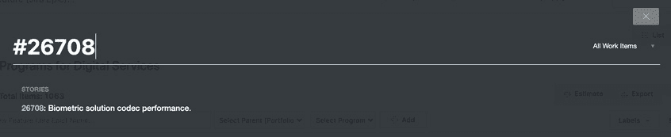

# *第三章*：导航 Jira Align

在本章中，我们将掌握基本的用户界面导航和核心功能，为充分利用 Jira Align 提供坚实的基础。我们将探索 Jira Align 如何通过实现对齐和持续学习来促进新员工入职。然后，我们将学习如何创建和优化待办事项。这包括创建、链接、导入和导出、排序、估算、删除以及搜索工作项。最后，我们将讨论团队协作以及如何通过 Jira Align 中的通知和提醒保持每个人的信息同步。

本章将覆盖以下主题：

+   在 Jira Align 中导航

+   促进入职培训

+   创建和优化待办事项

+   在 Jira Align 中协作

# 技术要求

请确保您已完成我们在*第二章*《实施 Jira Align》中介绍的快速设置。

# 在 Jira Align 中导航

Jira Align 是一个基于网页的应用程序，通过网页浏览器访问。它与大多数流行浏览器的最新版本兼容，包括 Google Chrome、Mozilla Firefox、Apple Safari 和 Microsoft Edge。您将通过访问 Jira Align 的 URL [`ORGANIZATION-NAME.jiraalign.com`](https://ORGANIZATION-NAME.jiraalign.com) 来登录 Jira Align，其中 `ORGANIZATION-NAME` 是您组织的子域名。

Jira Align 支持 SSO 集成，这可以跳过此处显示的登录页面，直接带您进入登录后的页面。我们在*第二章*《实施 Jira Align》中已经讨论过此内容，您将学习如何在 Jira Align 中使用所选的 SAML 2.0 支持的身份管理器设置 SSO：

图 3.1 – Jira Align 登录页面

登录应用程序后，您将看到以下主页：

图 3.2 – Jira Align 主页

以下是 Jira Align 中需要掌握的三个关键区域：

1.  **导航菜单**：位于最左侧，点击菜单项时会展开。它允许您在不同的层级之间导航，展示和编辑工作项。

1.  **配置栏**：位于每个页面的顶部，允许您设置上下文配置，以根据人员、时间和其他维度（如产品和组织）筛选工作项。

1.  **工作区**：位于中央，是 Jira Align 中所有信息的主要中心。信息基于您从导航菜单中选择的缩放层级以及在配置栏中为人员、时间和其他维度设置的上下文筛选器。

让我们来探索这三个关键区域。

## 导航菜单

导航菜单经过精心组织，将模块按照对应的规模级别分组：企业、组合、解决方案、计划和团队。例如，当你悬停在主菜单上并选择**计划**时，它会展开并显示与之关联的模块，这些模块按有意义的类别分组，如计划、管理、跟踪和转型。如下面的截图所示，你可以在**计划** | **待办事项**下访问计划待办事项，在**管理** | **功能**下访问功能网格：

图 3.3 – Jira Align 计划菜单

如果你记不住某个模块在导航菜单中的位置，可以点击搜索图标（放大镜）找到该模块。你可以通过点击星形菜单图标访问你常用的模块。要添加新的收藏夹，点击圈住的加号标志，将当前页面添加为收藏，如下截图所示。你还可以通过点击**最近**查看最近访问的模块：

图 3.4 – Jira Align 收藏夹

如果你无法找到某个模块，请与 Jira Align 管理员联系。模块访问权限由 Jira Align 角色控制，你的管理员可以帮助确保你的角色具有访问正确模块的权限。他们可以通过简单地在**管理** | **访问控制** | **角色**下切换模块访问开关来完成，如下面的截图所示：

图 3.5 – Jira Align 角色权限

角色权限分为三个级别：

+   **级别 1**：控制与规模级别和额外纵向领域（如管理、产品、协作和其他选项）对应的导航菜单项的访问权限。例如，如果你的组织不使用解决方案级别，或该级别不适用于所选用户角色，你可以选择关闭解决方案菜单。

+   **级别 2**：控制每个主级别菜单内模块的访问权限。你可以在子菜单中切换模块的开关，例如在*图 3.3 – Jira Align 计划菜单*中显示的**路线图**模块。

+   **级别 3**：控制与权限直接相关的模块特定操作。你可以通过切换模块特定操作的开关来授予用户执行某个操作的权限，如保存、创建或删除。

    提示和技巧

    我们建议从 Jira Align 中的默认角色开始。默认角色包括超级管理员、PMO、执行官、产品负责人、团队领导、团队成员、看板用户和外部用户。

    如果你需要创建一个新角色，我们建议你复制一个与新角色最接近的现有角色。这将复制现有角色的权限，然后你可以根据新 Jira Align 角色的需求进行调整。

现在你已经具备了你角色所需的访问权限，让我们来看一下你可以访问的报告。你可以通过点击报告菜单图标来访问报告仪表板，该图标在以下截图中是从底部算起的第二个：

图 3.6 – Jira Align 报告仪表板

在这里，你将看到一个报告类别列表和一个搜索框。这些功能可以帮助你探索超过 165 个报告，帮助你在各个层级跟踪和分析工作和成果。与模块一样，报告的访问权限通过 Jira Align 角色进行控制，因此如果你需要额外的报告，请与你的管理员联系。

现在你已经知道如何查找报告和模块，让我们来看看一些用户配置文件和偏好设置，这些设置将优化你的使用体验。你可以在用户菜单中找到这些设置：

图 3.7 – Jira Align 用户菜单

要访问此菜单，请点击导航栏顶部的**用户菜单**图标，位于 Jira Align 图标下方。我们首先来看的是你可以添加照片的地方，以便为你的工作和与同事的互动增添更多的人性化面貌。为此，点击**编辑个人资料**，以显示你的用户个人资料数据，如下所示：

图 3.8 – Jira Align 编辑个人资料

如果你还没有上传照片，或者想要更换照片，可以将鼠标悬停在名字左侧的区域并点击铅笔图标进行更改。你也可以通过点击右上角的按钮来更改密码。在下面的区域中，你可以生成 API 令牌、查看个人休假情况，并查看你的工作环境的完整摘要，包括连接的用户网络、奖项、技能、关联的团队和角色。

提示和技巧

如果你想更改账户详细信息，请与 Jira Align 管理员联系，他们将能够为你提供帮助。用户账户的管理位于**管理** | **访问控制** | **人员**下。这个话题在*第二章*《实施 Jira Align》中有详细讲解，你将在其中了解如何创建和管理用户账户。

现在你的个人资料已完整，让我们在你的偏好设置中做一些推荐设置。为此，可以点击前面编辑个人资料截图中的**更新偏好设置**按钮，或者点击导航菜单顶部的用户菜单图标（即你的照片），然后点击**编辑偏好设置**，打开如下页面：

图 3.9 – Jira Align 编辑偏好设置

推荐的设置，如截图所示，如下：

+   **每屏显示的记录数**：将每屏显示的记录数设置为**最多 30 条**，以便在工作区中显示更多记录。

+   **显示外部 ID**：开启此选项以显示与 Jira 双向同步的工作项的 Jira 问题键。

+   **时区**：设置你的时区，确保时间根据本地时间进行转换和显示。

除了这些推荐设置外，你还可以开启或关闭每日总结和变更跟踪邮件，以及在填写表单时显示提示（这对于新用户非常有帮助）。你还可以指定是否希望在对史诗和能力的**价值**标签进行评分时使用滑块或下拉菜单。

现在我们已经设置了偏好，接下来看看在哪里可以找到 Jira Align 的应用版本、构建详情和发布说明。查看发布说明很重要，因为它可以帮助你了解最新的功能更新。Jira Align 持续改进，每两周发布一次新版本。只需进入**用户菜单** | **关于**即可访问这些信息。

用户菜单下还有一些重要选项。点击**帮助**会将你引导到公共知识库，在那里你可以找到大量的 Jira Align 文章和常见问题解答。点击**支持**会将你引导到 Jira Align 支持渠道，例如，如果你认为自己遇到了一个漏洞。最后，你可以通过点击**退出登录**退出应用程序，这将引导你回到登录页面。

小贴士与技巧

对于 Jira Align 管理员，如果你想重现 Jira Align 模块的访问或功能问题，可以使用用户菜单中的**模拟身份**管理功能，以无需输入密码进行身份验证的方式以其他用户身份登录。这有助于快速排除故障，通常此功能仅对 Jira Align 管理员可用。然而，我们建议将此功能提供给 Jira Align 核心团队成员，以减轻管理员的负担。

到目前为止，我们已经了解了如何通过导航菜单访问每个规模层级的工作项。现在，让我们来看一下如何基于人员和时间维度筛选工作项。

## 配置栏

配置栏允许你根据自己的需求配置工具，以显示你想要看到的内容。例如，一个敏捷项目经理或`Mutants`投资组合，以及`20Q3`和`20Q4` PI：

图 3.10 – Jira Align 配置栏

你可以点击加号图标来设置额外的配置范围，或使用齿轮图标访问并保存高级配置筛选器。配置栏会在你浏览 Jira Align 或未来登录时保留你的设置，直到你进行更改。

你可以在配置栏中设置和筛选的参数如下：

+   **投资组合结构**：根据规模的不同，设置面向人员维度的范围，例如投资组合、解决方案、项目和团队。

+   **程序增量**：基于时间设置范围；你可以选择过去、现在和未来的 PI（程序增量）或特定的日期范围，如一年、一个季度、两个季度或所有时间，作为范围。

+   **发布版本**：设置基于时间的发布版本；你可以选择特定的发布或交付里程碑。

+   **产品**：允许你从产品树中选择产品；请注意，产品与工作维度相关联，因为功能可以在 Jira Align 中与产品关联。是否需要产品作为给定投资组合的要求，由 Jira Align 管理员在**管理** | **设置** | **平台** | **投资组合** | **投资组合特定配置** | **管理产品**中设置。如果设置为**是**，则**产品**字段为必填项。

+   **组织结构**：根据你的组织结构设置范围，例如业务单元和业务线。

+   **高级配置**：允许你基于额外的筛选器设置更精细的范围，例如冲刺、业务驱动、功能领域、战略快照、约定、缺陷套件和标签。

如果你需要频繁使用自定义配置设置，你只需点击**高级配置**筛选器下的**另存为新配置**，这样它会列在**已保存的配置**下。你可以随时返回选择已保存的配置筛选器，然后点击**应用**。在已保存的配置旁边，你还可以选择删除或重命名已保存的配置。如果你需要对现有的已保存配置进行更改，只需选择它，进行更改，然后点击**保存更改**。或者，你可以点击**应用设置**来测试对自定义配置筛选器所做的更改：

图 3.11 – Jira Align 高级配置

提示与技巧

如果你想清除配置筛选器中的值，而不是逐一删除值并应用更改，你可以在**高级配置**下使用**重置所有**选项来清除所有筛选器，或者你也可以选择**重置**选项来清除特定的配置筛选器设置。例如，如果你重置了**产品筛选器**设置，它会清除与产品相关的筛选选择，并显示所有工作项。

如果你在查看工作项时遇到问题，无法看到筛选器范围内的工作，建议重置你的配置栏筛选器设置。操作方法是点击齿轮图标，然后选择**重置所有**。这将清除可能不小心设置的任何筛选器，允许显示所有工作项。

现在你知道如何为工作、人员和时间维度设置范围了。接下来，我们来看看你会在哪里找到在 Jira Align 中显示的信息。

## 工作区

工作区显示基于您从导航菜单中选择的模块和在配置栏中设置的筛选器的信息。您通常会看到以网格、图表和图形的形式排列的信息。请注意，在工作区右下角，有一个**帮助**按钮。点击它将在工作区右侧打开一个面板，提供与您当前查看的内容相关的上下文帮助。例如，如果您正在查看特性待办事项，该面板将显示解释所有选项和功能的信息，例如排名。

在工作区的右上角，您会找到一个**显示列**按钮。点击此按钮可以配置在网格视图中显示的列。例如，特性网格允许您最多添加 12 列进行显示。您可以通过点击导航菜单中的程序图标并选择**管理**|**特性**来访问特性网格。在下面的截图中，我们已将特性网格的列配置为显示开发状态、与验收标准的链接、业务驱动因素、**MMF**（即**最小可销售特性**）指示器、发布载体和故事点：

图 3.12 – Jira Align 特性网格

第一列显示特性的 Jira Align ID，您可以点击它以打开给定特性的详细信息面板。接下来的列显示特性的 Jira 问题键，这是我们在之前的**用户菜单**|**编辑偏好设置**下通过**显示外部 ID**设置启用的结果。

虽然工作项网格（如特性网格）可能类似于待办事项，但它们实际上是不同的。例如，工作项网格不允许排名。然而，它提供了待办事项中没有的功能，您可以通过点击工作区右上角的**更多操作**来访问这些功能。这将打开一个包含其他操作的菜单，包括批量移动、导入和导出，如下所示：

图 3.13 – Jira Align 更多操作菜单

我们将在*创建和完善待办事项*部分进一步探讨导入和导出功能。

现在我们已经了解了如何操作导航菜单、配置栏和工作区，让我们看看 Jira Align 如何帮助那些刚接触该应用程序的同事。

# 促进入职培训

在将用户导入 Jira Align 时，通常的做法是一次性将一个项目或一组团队导入。将项目导入 Jira Align 时，常见的挑战之一是确保团队在实践和工作方式上达成一致。处理这个问题的最佳做法是，在启动一个项目之前，统一对所有团队进行培训。将你的实践和工作方式与工具以及其中的模块进行映射，可能也是另一个挑战。Jira Align 通过提供多种方式，使新用户能够尽快在平台上启动并运行，来解决这一问题。我们首先来看看它的框架地图模块。

## 框架地图

Jira Align 可以帮助你将团队与所选的扩展框架对齐（详见 *第一章*，*介绍 Jira Align* 中的 *选择框架* 部分）。诸如 SAFe 等框架包括一张概览图，概述了各个层级团队的工作方法和实践。你可以将这张图像简单地添加到 Jira Align 中并使其具有交互性，这样当用户点击图中的某个部分时，就会被引导到 Jira Align 中的相应模块或相关的外部视频和培训资源。

作为示例，以下截图展示了一个设置为显示投资组合 SAFe 大图的交互式框架地图：

图 3.14 – Jira Align 框架地图

在这个示例中，**战略主题**部分链接到了 Jira Align 中的 **战略室** 模块。这种交互式方法是帮助用户熟悉实践和工具的绝佳方式。它还作为一个资源，供所有级别的团队进行持续学习。

要添加新的交互式图片，请执行以下步骤：

1.  首先，在导航栏的 **企业**、**投资组合**、**解决方案** 或 **项目** 菜单下，前往 **转换** | **框架地图**。

1.  点击 **添加交互式图像** 按钮，然后为你的新框架地图提供一个有意义的名称，点击 **添加**。

1.  接下来，选择要添加为新框架地图的图像文件，并点击 `*.gif`、`*.jpeg`、`*.jpg`、`*.png` 和 `*.bmp` 格式。

1.  点击 **定义交互式部分** 按钮，然后简单地点击并拖动以在图片中创建交互式部分。接下来点击 **保存部分** 来确认已定义的部分。

1.  接下来，输入每个交互式部分的以下详细信息：

    `战略主题`。点击名称旁边的铅笔图标以重命名。

    **描述**：添加交互式部分的描述。

    **角色**：你可以选择一个交互式部分的角色，这样就可以为给定角色（例如 RTE）高亮显示一组交互式部分。

    **步骤链接**：查找并添加一个 Jira Align 模块。

    **使用视频/外部链接**：你可以通过切换此选项来启用/禁用将视频或外部链接添加到交互式部分。

1.  点击**保存并关闭**以保存更改，然后返回到*步骤 4*，为所有定义的互动部分添加详细信息。确认更新后，点击**完成**。如果需要返回进行进一步修改，您可以点击**编辑互动部分**按钮。

以下截图显示了正在编辑的互动部分：

图 3.15 – Jira Align 框架图的互动部分

框架图是 Jira Align 中众多酷炫功能之一，唯一的限制将是您的想象力，如何最大化地利用这个模块。让我们来看看 Jira Align 中有哪些其他资源可以帮助用户入职。

## 培训模拟

Jira Align 提供了预构建的培训模块，可以通过配置栏的检查清单图标访问，如下所示：

图 3.16 – Jira Align 培训模拟

在这里，您将找到 8 小时的互动视频，讲解该工具如何支持以下精益和敏捷实践：PI 规划、待办事项梳理、检查与适应、自定义看板、产品路线图、Scrum of Scrums、团队仪式、精益预算、投资组合跟踪、投资组合规划、时间跟踪、精益看板基础、Jira 集成、产品战略、价值工程和创意。这些丰富的知识可以随时通过 Jira Align 用户访问，帮助学习更多模块内容以及如何有效地实践精益敏捷方法。

## 检查清单

另一种帮助团队成员熟悉 Jira Align 的方法是创建一个自定义检查清单，其中包含一系列步骤，按照顺序完成 Jira Align 中的特定任务。您可以根据不同的角色（如 PMO 或 RTE）或实践（如待办事项梳理和 PI 规划）来构建自定义检查清单。检查清单可以通过配置栏的检查清单图标访问，如下所示：

图 3.17 – Jira Align 检查清单

您可以创建三种类型的自定义检查清单：

+   **私人检查清单**：您可以创建一个个人检查清单，用于个人任务跟踪。该检查清单仅对您可见。

+   **公共个人检查清单**：您可以创建一个与他人共享的个人检查清单，但每个步骤的进展会单独跟踪。例如，您可以为 Scrum Master 构建一个公共检查清单，但他们可能会在不同的步骤阶段。

+   **公共共享检查清单**：您可以创建一个公共共享检查清单，供多个用户协作。当一个用户勾选列表中的某项时，其他与该检查清单关联的用户可以看到该项已被勾选。公共共享检查清单通常与如程序室等房间相关联，用于推动大团队或大规模工作的实践。

让我们来看看为我们的变种人项目构建 PI 规划自定义检查清单需要什么。在检查清单菜单的底部，点击**创建新建**，然后提供以下详细信息：

+   `变种人 PI 规划`。

+   `超级英雄的 PI 规划检查清单`。

+   `公开`以与他人共享此检查清单。此选项将展开以下额外的详细信息以完成：

    a. `共享`使用选项，用于跟踪作为一个团队的检查清单。

    b. `房间`选项，用于与共享房间中的所有人共享检查清单。此选项将扩展以下两个额外的详细信息。

    c. `项目房间`。

    d. `变种人`。

    e. **用户和/或角色**：你可以指定额外的用户和/或角色与之共享检查清单。当检查清单被共享时，这些信息是可选的。

现在，所需的信息已在**详细信息**标签中输入，如图所示，点击**保存**按钮以创建检查清单：

图 3.18 – Jira Align 检查清单创建

接下来，点击**列表项**标签，如截图所示，添加检查清单步骤。对于每个步骤，提供以下详细信息：

+   `获得灵感`。

+   `共享公司的使命和愿景`。

+   `战略快照`。

现在是通过点击**添加项**按钮来创建检查清单步骤的顺序，如所示，必要时可以重复此步骤：

图 3.19 – Jira Align 检查清单项

如果你想链接到外部资源，如公司战略视频，只需编辑检查清单项并启用**使用视频/外部链接**选项。你现在可以上传视频静帧图像并提供视频源链接。添加链接和更改后，点击**保存并关闭**：

图 3.20 – Jira Align 检查清单项

现在，当你导航到`变种人 PI 规划检查清单`时，它将在屏幕底部的面板中显示：

图 3.21 – Jira Align 检查清单显示

单击每个步骤的序列以访问所需信息或模块的链接页面。对于包含视频链接的检查清单项，检查清单项上将显示一个播放按钮。单击检查清单项的标题，例如`回顾积压`，将直接跳转到与该步骤关联的 Jira Align 模块。完成该步骤后，单击每个步骤旁边的勾选图标以标示其完成。当所有步骤都被勾选时，检查清单就完成了。

当你将鼠标悬停在检查清单上时，右上角将显示一个菜单，如前面的截图所示。在这里，你可以选择项目或 PI，以便跟踪共享检查清单的进度。此外，你还可以切换检查清单的大小、编辑检查清单并关闭检查清单退出。

现在我们已经了解了如何让团队在 Jira Align 中启动运行，接下来让我们看看它们如何开始使用敏捷的一个关键元素——产品待办事项。

# 创建和完善待办事项

待办事项就是一个优先级排列的工作项列表，最重要的项目排在顶部，表示它们应该首先处理。Jira Align 中有六个层级的待办事项：主题、投资组合史诗、特性（Jira 史诗）、故事、任务和缺陷，还有一个可选的能力层级。通常，投资组合经理和史诗所有者管理主题和史诗的待办事项，解决方案经理管理能力的待办事项，产品经理管理特性的待办事项，而产品所有者则管理故事的待办事项。

如果你已经通过 Jira Align 连接到了现有的 Jira 软件实例（正如我们在*第二章*中讨论的，《实施 Jira Align》一章所述），那么你的 Jira 史诗、故事和子任务将作为特性、故事和任务流入 Jira Align，并在两个应用程序之间进行双向同步。

如果你尚未连接到 Jira，或者如果你想从 Jira 导入更高级别的工作项以连接到更低级别的工作项，你可以使用 Jira Align 的文件导入功能。但在我们探讨这一点之前，让我们先回顾一下每个级别的工作项是如何关联的。

假设特性、故事和任务已经从 Jira 导入，并且我们现在希望将这些团队级别的工作项与更高级别的战略主题和投资组合史诗连接起来。我们还假设，像许多新接触 Jira Align 的组织一样，主题和史诗信息可以收集并放入电子表格中，以便导入 Jira Align。这样可以实现战略与执行之间的完全链接，正如我们在前一章的*图 2.9*中看到的那样。让我们从上到下进一步探讨这种链接。

## 关联工作项

在最高层次上，企业战略是一个长期的行动计划，旨在实现一组目标或任务。其下是主题，这是 Jira Align 中的最高级工作项，它们与战略目标相连接。主题是一个长期的史诗集合，将投资组合与企业战略联系起来。每个投资组合史诗都是一个资金支持的工作，跨越多个业务季度，并需要新的开发来实现与其在 Jira Align 中关联的主题相关的业务收益。

投资组合史诗由能力或特性组成。能力是一个可选的工作项级别，表示一组支持与其在 Jira Align 中关联的投资组合史诗的特性。能力通常被大小设定为可在一个业务季度内交付，并且足够复杂，需要多个项目的协调努力。特性是一个满足利益相关者需求的服务，支持与其关联的能力或投资组合史诗，并被设定为由单一项目在一个业务季度内交付。

在最底层是故事，它是支撑功能的客户价值的基本单元，并且被设计为在一个 sprint 或迭代中交付。故事是基本的构建块，一直到 Jira Align 中的顶层战略都与之相连。这个机制的美妙之处在于，任何工作项的完整链接都可以通过点击详细面板中的**为什么？**按钮查看。这样，任何团队成员都可以一目了然地看到他们的努力如何为公司使命增值。例如，点击故事中的**为什么？**按钮，会显示其父功能、史诗（epic）和主题的信息，以及任何关联的**WSJF**（**加权最短工作优先**）评分、成功度量和商业案例，如下所示：

图 3.22 – Jira Align 为什么？按钮

在这里，我们看到**为什么？**详细面板位于故事详细面板的左侧。该故事一直与连接到公司战略的顶级主题相连。

在同一故事的详细面板中，现在点击右侧**需求层级**链接，距离**状态**下拉框三行的位置。这会提供一个视觉图，展示从任何工作项上下链路的关系，如下所示：

图 3.23 – Jira Align 需求层级

在这里，我们看到该故事的上下文，包括它的兄弟故事、它的父功能以及上面连接的史诗和主题。你可以点击层级中的每个项，打开其详细面板。例如，我们可以点击功能，打开其详细面板：

图 3.24 – Jira Align 功能详情面板

然后要返回原始工作项（在这个例子中是`Story 26708`），只需点击面板左侧的条形图。这样，可以从层级的任何级别探索相关工作项。

在 Jira Align 中，未链接的项被称为*孤立项*。团队成员在每个级别上审查孤立项并将其连接到更高层次的项，以促进可见性并将执行与战略联系起来，这是常见的做法。因此，在 Jira Align 中，每个级别的积压项旁边都会有一个**孤立对象**按钮，通常位于工作区右上方。例如，进入故事积压并点击**孤立对象**，可以找到没有与功能连接的故事。这些将显示在工作区右侧的面板中：

图 3.25 – Jira Align 故事积压孤立对象面板

在这里，你可以点击一个故事查看其详细信息，并使用右侧的复选框多选故事，将其分配给某个功能，你可以通过 ID、名称或标签搜索功能。这使得每个级别的积压项都能与其父项连接起来。

既然我们知道了将各级工作项连接起来、将战略与执行联系起来的重要性，那么让我们看看导入的步骤。我们将在这个例子中导入项目组合史诗。

## 导入与导出

如前文*工作区*部分所述，各级工作项网格支持高级操作，包括导入和导出。要访问此功能，进入任何级别工作项的网格。在此例中，我们假设功能和故事已通过 Jira 连接器导入到新的 Jira Align 实例中，现在我们需要导入将与这些功能关联的史诗。首先，进入导航菜单，选择**项目组合** | **管理** | **史诗**。然后点击**更多操作** | **导入史诗**。这将显示工作区中的说明和提示，并提供一个下拉列表以选择你的项目，并有一个按钮用于下载 Excel 导入模板。

下载模板后，选择要导入的工作项标签并填写内容。请注意，标题中的星号表示必填字段，且重要的是不要修改四行标题。接下来，保存文件时不要更改其格式。返回工作区并从上述下拉菜单中选择你的项目。然后，点击**浏览**选择文件，接着点击**导入数据**按钮。最后，导航至**项目组合** | **待办事项**查看结果。瞧！你现在已经有了一个项目组合史诗的待办事项！

现在你可以进入**项目** | **待办事项**，点击**孤立对象**，以类似于将故事分配给功能的方式，批量选择功能并将其分配给新导入的史诗，如*图 3.25*所示。

小贴士与技巧

作为填写导入模板的参考，查看你熟悉的真实数据导出的文件会很有帮助，因为导入和导出文件的布局是相同的。要导出史诗，进入导航菜单，选择**项目组合** | **管理** | **史诗**。然后点击**更多操作** | **导出史诗**。

在导入包含数十或数百行的整个电子表格之前，建议先测试导入一两行。

如果你需要调整多个工作项在 Jira Align 中的相关元数据，你可以导出它们，修改电子表格，然后重新导入。例如，这可以用来批量更改许多功能的父能力或史诗。

在远程工作时，将待办事项导出以备份，以防出现网络连接问题，可能会很有帮助。

## 创建工作项

在查看史诗和功能待办事项时，你可以通过输入名称并点击**添加**按钮，如下图所示，快速添加新工作项：

图 3.26 – Jira Align 待办事项添加按钮

这允许仅使用基本元素快速添加。在这里，我们添加了一个新的史诗。注意提示信息告诉我们，可以通过再次输入名称并点击**添加**来在史诗下快速添加特性。此外，请注意，您可以点击任何工作项行最左侧的指向箭头符号来展开它，并显示子工作项。

现在假设我们想要返回并为我们的史诗添加更多细节。为此，我们点击待办事项中的史诗名称或 ID 以打开详细面板，如图所示：

图 3.27 – Jira Align 史诗详细面板

在这里，您将找到用于输入相关利益、价值、财务和其他数据的多个选项卡。点击**完整详情**将展开或隐藏用于输入资本化、投资类型、战略驱动器等额外字段。请注意，Jira 管理员可以设置每种工作项类型在详细面板中显示和要求的字段，方法是在**管理** | **设置** | **详细面板设置**下设置。这些设置是针对组合的，因此组合中的每个人，包括其程序和团队，将拥有相同的字段集。

在详细面板中向下滚动，您会找到与特性、验收标准、风险、成功标准、依赖关系、目标、链接和附件相关的位置。点击**特性**将展开该部分以显示字段，如图所示：

图 3.28 – Jira Align 史诗详细面板，特性部分

在这里，您可以在史诗下快速添加一个新特性，或搜索现有的特性进行关联。通过这种方式，您将能够将从 Jira 导入我们之前示例中的组合史诗的特性分配给特性。

请注意，您不必在待办事项中添加工作项。Jira Align 允许您随时通过单击配置栏最右侧的**创建**按钮来添加任何级别的工作项，以及其他类型的项目。

提示和技巧

产品经理可以将特性添加到其待办事项中，而无需将它们与 Jira 同步。这使他们能够在特性准备就绪之前对其进行细化。

为了在 Jira Align 中保留一个特性，产品经理不会从特性详细面板上的 Jira 项目下拉菜单中进行选择。

一旦特性准备在 Jira 中供团队查看，产品经理可以从下拉菜单中选择 Jira 项目，使特性能够流入 Jira。

现在你知道如何导入和创建你的待办工作项，让我们学习一些基本的细化技巧。

## 排名工作项

一个完善的待办事项列表应该按排名排序，这样团队就知道接下来该做什么。请注意，虽然故事的团队级待办事项将保存在 Jira 中，但通常情况下，程序、解决方案和投资组合级的待办事项会保存在 Jira Align 中，而 Jira Align 通常被视为功能、能力和投资组合史诗的记录系统。

Jira Align 提供了两种排名方式：手动排名和自动排名。最简单的方式是手动拖动工作项，改变其在待办事项列表中的位置，从而调整排名。你也可以右键点击工作项，将其移动到待办事项的顶部、底部或指定位置。

自动排名允许你根据更高层级工作项的排名来拉取排名。例如，如果投资组合团队已经对史诗进行排序，并且你希望根据父史诗的排名对你的功能进行排序，你可以进入**程序** | **待办事项**，点击**拉取排名**按钮，并选择**使用史诗**。

虽然手动和自动排名都很简单，但有几个重要事项需要注意。第一个是，工作项的排名总是相对于同类型的其他工作项进行排序。第二个是，工作项实际上有多个独立的排名，具体取决于配置栏的设置。

全球排名是配置栏清空时的默认排名，意味着没有选择特定的投资组合、程序或 PI。如果在配置栏中选择了 PI，你将看到该特定 PI 的排名。如果选择了投资组合或程序，你将看到该投资组合或程序中的排名。如果选择了投资组合和 PI，或者程序和 PI，你将看到该投资组合或程序中针对特定 PI 的排名。最低层级是选择团队和冲刺，在这种情况下，你将看到该团队在特定冲刺中处理的项的排名。

关于排名还有一个细节。我们之前提到，点击待办事项列表中任意一行左侧的指向箭头符号，将会展开工作项以显示其子项。假设有多个子项，它们可以在父项下拖动上下，表示顺序或排名；然而，这与这些项在与同类其他项一起列出时的排名是独立的。换句话说，你可以在展开父项的行时，改变功能项在父史诗下的显示顺序，但这不会影响例如在查看功能待办事项并在配置栏中选择了某个程序时看到的程序功能排名。这就是平台中所有工作和排名的可见性可以推动讨论的地方，例如在史诗所有者和产品经理之间，他们必须合作确保自己对史诗和功能的独立排名是一致的。

最后，我们要提到的是，Jira Align 允许你在 Jira Align 和 Jira 之间手动同步功能和故事的排名。此选项仅在选择了项目配置栏中的项目并且没有选择 PI 时，在功能和故事待办事项中可用。请注意，Jira Align 管理员必须在**管理** | **连接器** | **Jira 设置** | **Jira 设置**中启用此选项。在这里，管理员必须在**自定义字段**下输入 Jira 排名字段 ID，并在设置中将**启用排名同步**设置为**是**。完成这些设置后，当你在待办事项中点击**拉取排名**按钮时，你将有两个附加选项，一个是从 Jira 拉取排名，另一个是将排名推送到 Jira。

提示和技巧

如果在从 Jira 拉取功能排名后，你想将该排名应用于特定的 PI，首先将 PI 添加到配置栏中，以便选择你的项目和 PI。然后再次使用**拉取排名**按钮，这次选择**使用项目排名来排序功能**。

## 估算工作项

精细化的待办事项的另一个方面是它被估算过。各个层级的估算有助于学习和预测。例如，当一个 Scrum 团队了解其平均速度（每个冲刺完成的故事点数）时，它可以基于一个初步的功能点估算来预测完成某个功能所需的冲刺次数。之后，当该功能被分解成具有规模的故事时，可以将汇总的故事点与初步的估算进行对比，以便进行学习。

虽然团队层级的故事点估算通常在 Jira 中完成，Jira Align 提供了三种估算功能、能力和史诗的选项。它们按受欢迎程度依次为：T 恤尺码、点数和团队/成员周。最后一个选项在某些组合模式环境中可能有用，在这些环境中，部分投资组合使用瀑布开发。Jira Align 管理员可以在**管理** | **设置** | **平台** | **投资组合** | **投资组合特定配置**中设置每个投资组合的估算选项。这使得每个投资组合可以有自己的估算方法，并且在整个投资组合中，包括其项目和团队，保持统一。

如果选择 T 恤尺码作为估算方法，则 Jira Align 会将 T 恤尺码转换为点数，以用于报告、网格视图和功能，例如项目室中的 PI 负载小部件。Jira Align 管理员可以在**管理** | **设置** | **平台** | **投资组合** | **估算转换**中设置转换参数。以下是一个示例：

图 3.29 – Jira Align 估算转换示例

有两个重要事项需要注意：

+   对于 T 恤尺码转换为团队周和故事点，尚无公认的标准。每个组织都会进行实验并学习哪种方法最适合他们的环境。

+   相同的转换表适用于整个 Jira Align 实例，包括所有投资组合。

由于不同投资组合的转换参数可能不同，我们建议使用点数作为估算方法。这也确保报告和小部件直观易懂，因为用户可能会被 T 恤到点数的转换弄得困惑。

提示与技巧

无论你选择 T 恤尺寸还是点数作为默认的估算方法，你仍然可以有一个字段来存储另一种估算类型。我们建议将点数设置为默认值，将 T 恤尺寸作为次要字段。

若要添加次要估算字段，请请求 Jira Align 管理员将其作为自定义字段添加到**管理** | **设置** | **详细面板设置**中。在这里，他们需要选择投资组合和工作项，然后点击**添加自定义字段**。接着，他们可以在**详细面板设置**中打开自定义字段。

你可以在待办事项和网格视图中查看特性、能力和史诗的原始点估算，以及从其子项汇总的所有故事点总和。为此，点击工作区右上角的**显示的列**按钮，然后添加**点数**（原始点估算）和**故事点数**（由团队成员在故事级别估算的点数汇总）两列。

重要提示：Jira Align 管理员必须在**管理** | **设置** | **详细面板设置**中为每个投资组合和工作项类型打开**点数**和**故事点数**，以确保前述操作有效。

若要查看没有估算的工作项，可以在你的待办事项或网格视图中扫描相关列。你还可以点击待办事项中的**孤立对象**按钮。除了显示未链接的项，正如我们在*图 3.25*中看到的，你可以向下滚动查看更多信息，包括没有估算的项。

## 删除工作项

通常，只有 Jira Align 管理员才有删除权限。其他角色可能会被授予将工作项移动到回收站的权限。请注意，如果从 Jira 导入到 Jira Align 的工作项后来在 Jira 中被删除或归档，它仍会保留在 Jira Align 中以供审计。如果需要，可以将其移动到回收站。要查看回收站，请进入工作项网格，例如，**项目** | **管理** | **特性**，然后点击**更多操作** | **访问回收站**。

在极少数情况下，Jira Align 管理员可能需要删除整个团队、项目或投资组合。如果发生这种情况，为了保证参照完整性，必须按照从底到顶的顺序删除对象，具体顺序为：任务、故事、特性、史诗/能力、主题、迭代、PI、团队、项目、投资组合、快照和组织。

提示与技巧

Jira Align 管理员可以通过以下路径生成 Jira 中已删除项目的报告：**管理** | **连接器** | **Jira 管理** | **Jira 已删除问题**。（这在*第二章*，《实施 Jira Align》一节中的*连接 Jira*部分已经涵盖。）

## 搜索工作项

Jira Align 在所有工作项待办和网格视图上都提供了搜索框，这样你可以在该视图中找到你正在寻找的精确项目。只需在搜索框中输入名称或 ID。你还可以执行全局搜索，查找你有权限访问的所有投资组合、项目和团队中的工作项。为此，请点击配置栏右侧的搜索图标（放大镜）。这样你可以按名称或 ID 搜索；不过请注意，在这里，ID 号前必须加上 # 符号，如下所示：

图 3.30 – Jira Align 全局工作项搜索

找到项目后，只需点击该项目（例如，ID 为`26708`的故事），即可打开其详细信息面板。

到目前为止，你的待办事项已经建立、排序并估算完成。你知道如何创建、搜索和删除工作项。现在是时候与团队成员合作，开始交付这些工作项了。

# 在 Jira Align 中协作

作为团队协作的一部分，确保工作可见、被跟踪和监控是至关重要的。Jira Align 通过复杂的电子邮件和警报通知，支持需要关注的工作项。这些通知是接收特定事件信息的好方法，而无需一直待在办公桌前。

为了通过电子邮件接收通知，你需要在用户偏好设置中开启**更改跟踪电子邮件**偏好选项。这样你就可以接收到关于订阅、通知和工作流生成的通知邮件：

图 3.31 – Jira Align 更改跟踪电子邮件偏好

小贴士和技巧

Jira Align 管理员可以通过以下路径将默认偏好设置为始终开启：**管理** | **设置** | **平台** | **用户**选项卡，并将**个人用户通知**下拉框设置为**默认开启**。他们可以选择**重置所有用户**按钮，将默认设置推送给所有用户。

无论你是否选择接收电子邮件通知，你也会通过配置栏右侧的铃铛图标接收到警报通知：

图 3.32 – Jira Align 通知铃铛

这些警报是电子邮件通知的一个很好的替代方案，因为它们使团队成员能够在 Jira Align 界面内保持信息更新。红点表示未读警报通知。**需要操作**部分列出了需要采取行动的通知，例如批准，而**订阅/更新**部分列出了需要协作的通知，包括订阅、讨论和工作流电子邮件通知。

警报通知被许多组织广泛使用，这些组织选择完全关闭电子邮件通知，以减少信息过载。为了接收这些警报，您必须订阅 Jira Align 中的工作项，我们将在接下来的内容中学习这一点。

## 订阅通知

您可以通过点击**订阅**选项来选择订阅工作项的通知。订阅后，您将收到通知。您可以随时通过点击**取消订阅**选项来停止接收通知：

图 3.33 – Jira Align 工作项讨论与订阅

下面是支持**订阅**功能的工作项、时间框和规划工件：主题、投资组合史诗、能力、特性、故事、任务、缺陷、依赖关系、风险、冲刺、目标、规范、头脑风暴、成功标准、提要、创意、热修复和 UI 设计。

## 发起讨论

您可以为工作项发起讨论并`@mention`某人以生成通知或警报。您会看到`@mention`，系统会找到最接近的匹配项，帮助自动完成通知接收者。以下是一个示例讨论：

图 3.34 – Jira Align 讨论

所有通信将在工作项的详细面板中使用红色气泡标注突出显示，以指示讨论的数量。例如，之前在*图 3.33*中显示了一个讨论。您还可以通过在工作项网格页面上显示**聊天**列，快速访问讨论。以下是支持通过**讨论**链接通知的项：投资组合史诗、能力、特性、故事、缺陷、障碍和头脑风暴。

## 配置工作流电子邮件

您可以创建电子邮件工作流，在创建、编辑或删除工作项、团队或时间框时，自动提醒他人和自己。工作流配置适用于整个组织，包括投资组合、计划和团队。您可以通知程序中的所有角色、敏捷团队角色或个人电子邮件地址。您可以在**管理** | **设置** | **电子邮件**下配置工作流，选择工作流类型并选择要通知的角色：

图 3.35 – Jira Align 电子邮件工作流

多个工作项、时间框和规划文档支持电子邮件工作流，包括组合史诗、功能、故事、缺陷、PI、发布车辆等。这些工作流类型中的一些具有额外的属性来配置工作流，一些允许您分配角色以便通知，一些允许您添加外部电子邮件以接收通知。

Jira Align 中有一些特定的工作项，允许您在特定条件下设置特殊工作流。例如，在创建战略快照时，您可以为资金审批和资金变更设置通知，根据您设置的工作流规则向相关人员发送电子邮件。以下截图显示了如何启用战略快照更新的通知：

图 3.36 – Jira Align 战略快照通知

您还可以为工作流中的特定状态设置通知。当功能达到工作流中的特定状态时，您可以通过以下路径进行设置：**程序** | **管理** | **功能** | **更多操作** | **工作流**。以下是如何设置工作流状态以通知一个或多个个人：

图 3.37 – Jira Align 战略工作流状态通知

您还可以在看板、价值流、缺陷、风险、PI 状态报告和公告中设置特殊的工作流通知。

## 设置定期电子邮件

如果您需要设置定期的电子邮件通信，请与您的 Jira Align 管理员联系，以安排在特定日期/时间发送电子邮件。您可以通知您的团队进行提醒，告知截止日期和时间特定的交付物。定期通知的创建方式是进入**管理** | **设置** | **电子邮件** | **定期电子邮件**标签页，然后点击**创建新电子邮件**按钮。创建定期电子邮件时，以下是需要添加的详细信息：

+   **启用此消息**：您需要勾选此框才能激活定期电子邮件。未勾选的框表示该电子邮件未激活。

+   **发送此消息**：选择电子邮件发送频率，**每周**或**每月**。

+   **发送时间**：选择您希望发送定期电子邮件的时间。

+   **发送日期**：选择您希望发送定期电子邮件的日期。

+   **开始日期和结束日期**：添加开始日期以安排第一次发送电子邮件。可选地，您可以添加结束日期，以停止发送定期电子邮件。

+   **收件人**：选择适用的角色作为电子邮件收件人。点击**高级收件人**筛选器来为电子邮件收件人添加筛选条件。

+   **地区**：选择**所有地区**，或者选择适用于通知范围的特定地区。

+   **主题**：为定期电子邮件设置主题。

+   **消息**：为定期电子邮件设置邮件正文。

+   **立即发送消息**：可选地，您可以点击**立即发送消息**按钮以发送预定的消息。

+   **测试**：点击**测试**按钮向自己发送一封邮件，以验证定时邮件是否正常工作。

+   **报告关联**：点击**报告关联**按钮，将报告关联到定时邮件。

点击**保存**按钮保存更改。

以下截图展示了如何设置每周工作表提交的定时邮件提醒：

图 3.38 – Jira Align 定时发送的邮件

你现在已经学会如何监控并接收关于 Jira Align 中工作项变化的通知。如果你想了解更多关于 Jira Align 如何促进远程团队协作的信息，请继续阅读下一章 *第四章*，*团队挑战*。

# 总结

在本章中，我们掌握了基本的 Jira Align 用户界面导航。我们现在知道如何在人员、工作和时间维度上导航和筛选信息。我们探讨了 Jira Align 如何通过提供对齐和持续学习的工具来促进用户入职。我们学习了如何创建工作项并细化待办事项。最后，我们讨论了如何通过通知和警报保持团队信息畅通，以促进协作。

现在你已经了解了如何使用 Jira Align，你可以放心地在地面上自由探索各个级别的模块。Jira Align 中持续的支持、促进和协作循环，创造了一个全面连接的知识环境，组织可以利用这一环境加速实现业务敏捷性。

在下一章，我们将探讨 Jira Align 可以帮助解决的常见团队挑战。

# 问题

1.  在 Jira Align 中，掌握的三个关键领域是什么？

1.  Jira Align 如何促进新员工入职和持续学习？

1.  **为什么？**按钮的重要性是什么？

1.  如何将工作项链接到更高级别的工作项？

1.  估算特性、能力和产品组合史诗的选项有哪些？

# 进一步阅读

+   *《Jira 实战敏捷软件开发》*，David Harned 著（Packt，2018）
